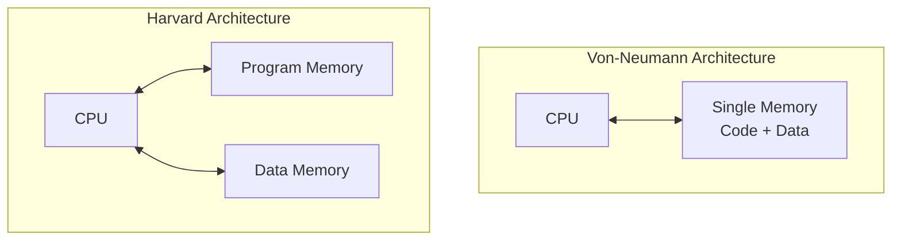
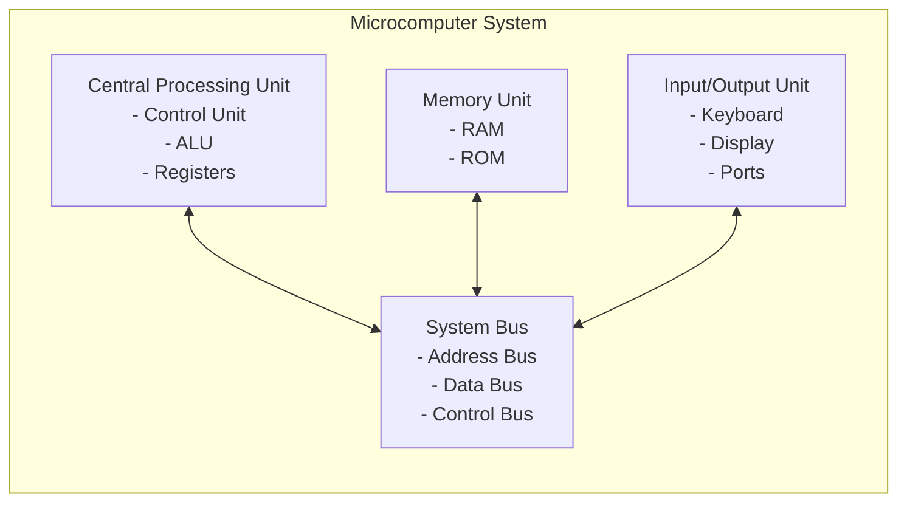
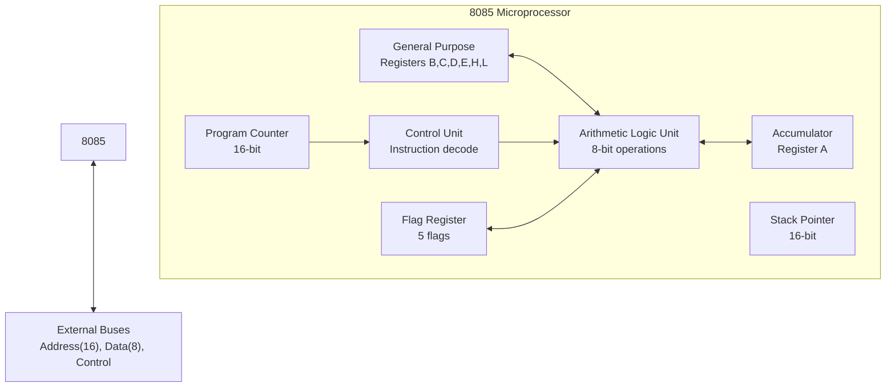
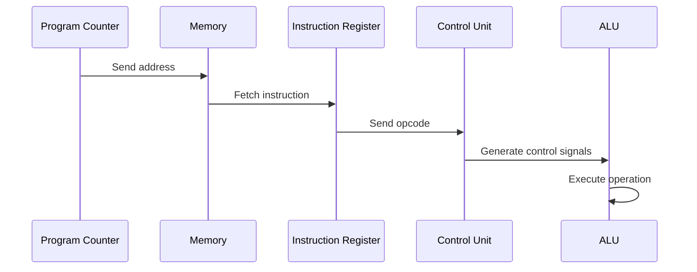
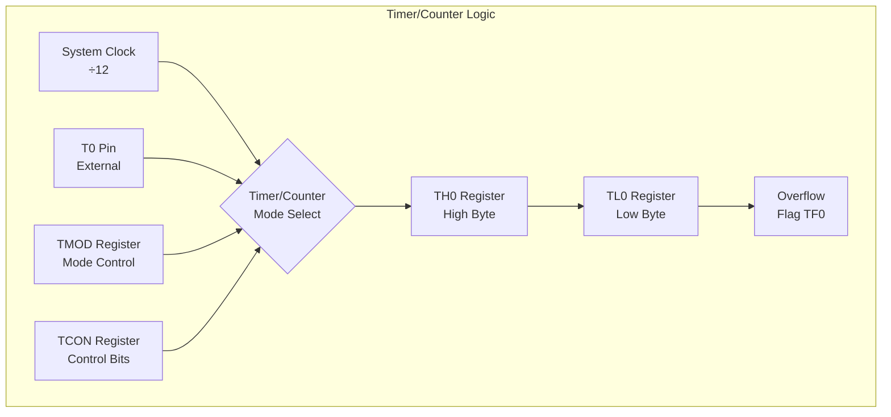
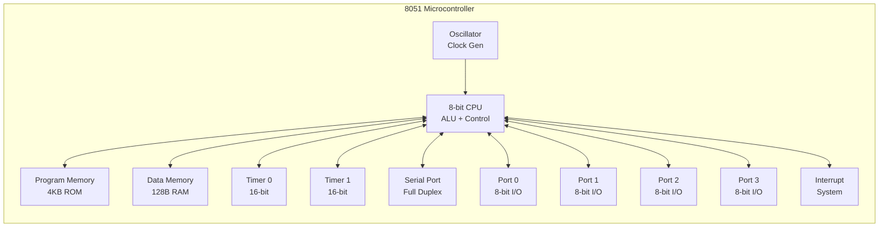

## Question 1(a) [3 marks]

**List common features of 8051 microcontroller.**

**Answer**:

**Table: Common Features of 8051 Microcontroller**

| Feature | Description |
|---------|-------------|
| **On-chip Oscillator** | Built-in clock generator circuit |
| **Program Memory** | 4KB internal ROM for code storage |
| **Data Memory** | 128 bytes internal RAM |
| **I/O Ports** | 4 bidirectional 8-bit ports (P0-P3) |
| **Timers/Counters** | Two 16-bit Timer/Counter units |
| **Serial Port** | Full duplex UART communication |
| **Interrupts** | 5 interrupt sources with priority |
| **SFRs** | Special Function Registers for control |

**Mnemonic:** "On Program Data I/O Timers Serial Interrupts SFRs"

## Question 1(b) [4 marks]

**Define T-State, Machine Cycle, Instruction Cycle and Opcode.**

**Answer**:

**Table: Microprocessor Timing Definitions**

| Term | Definition | Duration |
|------|------------|----------|
| **T-State** | One clock period of system clock | Basic timing unit |
| **Machine Cycle** | Time to complete one memory operation | 3-6 T-states |
| **Instruction Cycle** | Time to fetch, decode and execute instruction | 1-4 Machine cycles |
| **Opcode** | Operation code specifying instruction type | 1-3 bytes |

- **T-State**: Smallest unit of time in microprocessor operation
- **Machine Cycle**: Contains multiple T-states for memory access
- **Instruction Cycle**: Complete instruction execution time
- **Opcode**: Binary code identifying specific instruction

**Mnemonic:** "Time Machine Instruction Operation"

## Question 1(c) [7 marks]

**Compare Von-Neumann and Harvard Architecture.**

**Answer**:

**Table: Von-Neumann vs Harvard Architecture Comparison**

| Parameter | Von-Neumann | Harvard |
|-----------|-------------|---------|
| **Memory Organization** | Single memory for code and data | Separate memory for code and data |
| **Bus Structure** | Single bus system | Dual bus system |
| **Speed** | Slower due to bus sharing | Faster parallel access |
| **Cost** | Lower cost implementation | Higher cost due to dual memory |
| **Flexibility** | More flexible memory usage | Less flexible, fixed allocation |
| **Examples** | 8085, x86 processors | 8051, DSP processors |



**Key Differences:**

- **Memory Access**: Von-Neumann uses sequential access, Harvard allows simultaneous
- **Performance**: Harvard is faster for embedded applications
- **Applications**: Von-Neumann for general computing, Harvard for real-time systems

**Mnemonic:** "Von-Single Harvard-Dual"

## Question 1(c) OR [7 marks]

**Explain Microcomputer System with block diagram.**

**Answer**:

**Microcomputer System Components:**



**Table: Microcomputer System Components**

| Component | Function | Examples |
|-----------|----------|----------|
| **CPU** | Central processing and control | 8085, 8086 |
| **Memory** | Program and data storage | RAM, ROM, EPROM |
| **I/O Unit** | Interface with external world | Keyboard, Display |
| **System Bus** | Data transfer pathway | Address, Data, Control |

- **CPU**: Executes instructions and controls system operation
- **Memory**: Stores programs and data for processing
- **I/O**: Provides communication with external devices
- **Bus**: Connects all components for data transfer

**Mnemonic:** "CPU Memory I/O Bus"

## Question 2(a) [3 marks]

**Draw Bus organization in 8085 Microprocessor.**

**Answer**:

```goat
    +----------+
    |   8085   |
    |   CPU    |
    +----------+
         |
    +----+----+
    |         |
    v         v
+--------+ +--------+
|Address | |  Data  |
|  Bus   | |  Bus   |
|16-bit  | | 8-bit  |
+--------+ +--------+
    |         |
    v         v
+--------+ +--------+
|Memory  | |  I/O   |
|System  | |Devices |
+--------+ +--------+
```

**Table: 8085 Bus Organization**

| Bus Type | Width | Function |
|----------|-------|----------|
| **Address Bus** | 16-bit | Memory addressing (64KB) |
| **Data Bus** | 8-bit | Data transfer |
| **Control Bus** | Multiple | Control signals |

**Mnemonic:** "Address Data Control"

## Question 2(b) [4 marks]

**List Flags used in 8085 and Explain working of each flags.**

**Answer**:

**Table: 8085 Flags Register**

| Flag | Name | Bit Position | Function |
|------|------|--------------|----------|
| **S** | Sign | D7 | Set if result is negative |
| **Z** | Zero | D6 | Set if result is zero |
| **AC** | Auxiliary Carry | D4 | Set if carry from bit 3 to 4 |
| **P** | Parity | D2 | Set if result has even parity |
| **CY** | Carry | D0 | Set if carry/borrow occurs |

```goat
D7  D6  D5  D4  D3  D2  D1  D0
+---+---+---+---+---+---+---+---+
| S | Z | - |AC | - | P | - |CY |
+---+---+---+---+---+---+---+---+
```

- **Sign Flag**: Indicates negative result (MSB = 1)
- **Zero Flag**: Set when arithmetic result is zero
- **Auxiliary Carry**: Used for BCD arithmetic operations
- **Parity Flag**: Checks even number of 1's in result
- **Carry Flag**: Indicates overflow in arithmetic operations

**Mnemonic:** "Sign Zero Auxiliary Parity Carry"

## Question 2(c) [7 marks]

**Draw and Explain Block Diagram of 8085.**

**Answer**:



**Table: 8085 Block Components**

| Block | Function | Size |
|-------|----------|------|
| **ALU** | Arithmetic and logical operations | 8-bit |
| **Accumulator** | Primary register for operations | 8-bit |
| **Registers** | Data storage (B,C,D,E,H,L) | 8-bit each |
| **Program Counter** | Points to next instruction | 16-bit |
| **Stack Pointer** | Points to stack top | 16-bit |
| **Control Unit** | Instruction decode and control | - |

- **Data Flow**: Instructions fetched via PC, decoded by CU, executed in ALU
- **Register Operations**: Accumulator works with ALU, other registers store data
- **Address Generation**: PC and SP provide 16-bit addresses
- **Control Signals**: CU generates timing and control signals

**Mnemonic:** "ALU Accumulator Registers Program Stack Control"

## Question 2(a) OR [3 marks]

**Explain Instruction Fetching, Decoding and Execution Operation in microprocessor.**

**Answer**:



**Table: Instruction Cycle Phases**

| Phase | Operation | Duration |
|-------|-----------|----------|
| **Fetch** | Get instruction from memory | 1 machine cycle |
| **Decode** | Interpret instruction opcode | Part of execute |
| **Execute** | Perform required operation | 1-3 machine cycles |

**Mnemonic:** "Fetch Decode Execute"

## Question 2(b) OR [4 marks]

**What is Demultiplexing of Lower order Address and Data lines in 8085? Explain using neat sketch.**

**Answer**:

```goat
     8085
+-------------+
|  AD7-AD0    |  Multiplexed
+------+------+  Address/Data
       |
       v
+------+------+
|    ALE      |  Address Latch Enable
+------+------+
       |
       v
+------+------+
|   74LS373   |  Latch IC
+------+------+
   |       |
   v       v
A7-A0    D7-D0
Address   Data
```

**Demultiplexing Process:**

- **ALE Signal**: Controls separation of address and data
- **Latch IC**: 74LS373 stores address when ALE is high
- **Timing**: Address appears first, then data on same lines

**Table: Demultiplexing Components**

| Component | Function | Timing |
|-----------|----------|--------|
| **ALE** | Address Latch Enable signal | High during T1 |
| **74LS373** | Octal latch IC | Stores A7-A0 |
| **AD7-AD0** | Multiplexed lines | Address then Data |

**Mnemonic:** "Address Latch Enable Demultiplexes Lines"

## Question 2(c) OR [7 marks]

**Draw and Explain Pin Diagram of 8085.**

**Answer**:

```goat
        8085 PIN DIAGRAM
    +-------------------+
X1  |1               40| VCC
X2  |2               39| HOLD
RST |3               38| HLDA
SOD |4               37| CLK
SID |5               36| RESET IN
TRAP|6               35| READY
RST7|7               34| IO/M
RST6|8               33| S1
RST5|9               32| RD
INTR|10              31| WR
INTA|11              30| ALE
AD0 |12              29| S0
AD1 |13              28| A15
AD2 |14              27| A14
AD3 |15              26| A13
AD4 |16              25| A12
AD5 |17              24| A11
AD6 |18              23| A10
AD7 |19              22| A9
VSS |20              21| A8
    +-------------------+
```

**Table: 8085 Pin Functions**

| Pin Group | Function | Count |
|-----------|----------|-------|
| **Address Bus** | A8-A15 (Higher order) | 8 pins |
| **Address/Data** | AD0-AD7 (Multiplexed) | 8 pins |
| **Control Signals** | ALE, RD, WR, IO/M | 4 pins |
| **Interrupts** | TRAP, RST7.5, RST6.5, RST5.5, INTR | 5 pins |
| **Power** | VCC, VSS | 2 pins |
| **Clock** | X1, X2, CLK | 3 pins |

- **Address Lines**: 16-bit addressing capability (64KB)
- **Data Lines**: 8-bit data transfer
- **Control Lines**: Memory and I/O operation control
- **Interrupt Lines**: Hardware interrupt handling

**Mnemonic:** "Address Data Control Interrupt Power Clock"

## Question 3(a) [3 marks]

**Draw IP SFR of 8051 and Explain function of each bit.**

**Answer**:

```goat
IP Register (Interrupt Priority) - Address B8H
MSB                           LSB
+---+---+---+----+---+----+----+----+
| - | - | - | PT2| PS| PT1| PX1| PX0|
+---+---+---+----+---+----+----+----+
 D7  D6  D5  D4  D3  D2  D1  D0
```

**Table: IP Register Bit Functions**

| Bit | Name | Function |
|-----|------|----------|
| **D4** | PT2 | Timer 2 interrupt priority |
| **D3** | PS | Serial port interrupt priority |
| **D2** | PT1 | Timer 1 interrupt priority |
| **D1** | PX1 | External interrupt 1 priority |
| **D0** | PX0 | External interrupt 0 priority |

- **Priority Levels**: 1 = High priority, 0 = Low priority
- **Default**: All interrupts have low priority (00H)
- **Usage**: Set bit to 1 for high priority interrupt

**Mnemonic:** "Timer2 Serial Timer1 External1 External0"

## Question 3(b) [4 marks]

**Draw and explain Timer/Counter Logic diagram for 8051.**

**Answer**:



**Table: Timer Components**

| Component | Function | Size |
|-----------|----------|------|
| **TH0/TL0** | Timer 0 high/low byte registers | 8-bit each |
| **TMOD** | Timer mode register | 8-bit |
| **TCON** | Timer control register | 8-bit |
| **TF0** | Timer 0 overflow flag | 1-bit |

- **Clock Source**: Internal (system clock/12) or External (T0 pin)
- **Operation**: Counts up from loaded value to FFH
- **Overflow**: Sets TF0 flag and generates interrupt
- **Modes**: 4 different timer modes available

**Mnemonic:** "Timer High-Low Mode Control Flag"

## Question 3(c) [7 marks]

**Draw and Explain Block Diagram of 8051.**

**Answer**:



**Table: 8051 Block Components**

| Block | Function | Specification |
|-------|----------|---------------|
| **CPU** | Central processing unit | 8-bit processor |
| **Program Memory** | Code storage | 4KB internal ROM |
| **Data Memory** | Variable storage | 128 bytes RAM |
| **I/O Ports** | External interface | 4 ports (32 I/O lines) |
| **Timers** | Timing operations | 2 × 16-bit timers |
| **Serial Port** | Communication | Full duplex UART |
| **Interrupts** | Event handling | 5 interrupt sources |

- **Architecture**: Harvard architecture with separate program/data memory
- **I/O Capability**: 32 bidirectional I/O lines
- **On-chip Features**: Timers, serial port, interrupt system
- **Memory**: Von-Neumann for data, Harvard for program

**Mnemonic:** "CPU Program Data I/O Timer Serial Interrupt"

## Question 3(a) OR [3 marks]

**Draw PCON SFR of 8051 and Explain function of each bit.**

**Answer**:

```goat
PCON Register (Power Control) - Address 87H
MSB                           LSB
+---+---+---+---+---+---+---+---+
|SMOD| - | - | - |GF1|GF0| PD|IDL|
+---+---+---+---+---+---+---+---+
 D7  D6  D5  D4  D3  D2  D1  D0
```

**Table: PCON Register Bit Functions**

| Bit | Name | Function |
|-----|------|----------|
| **D7** | SMOD | Serial port mode modifier |
| **D3** | GF1 | General purpose flag bit 1 |
| **D2** | GF0 | General purpose flag bit 0 |
| **D1** | PD | Power down mode control |
| **D0** | IDL | Idle mode control |

- **SMOD**: Doubles serial port baud rate when set
- **GF1, GF0**: User-defined flag bits
- **PD**: Activates power-down mode
- **IDL**: Activates idle mode

**Mnemonic:** "Serial General Power Idle"

## Question 3(b) OR [4 marks]

**In 8051 Serial communication Mode 1, For XTAL=11.0592 MHz, find TH1 value needed to have for 9600 and 4800 baud rate.**

**Answer**:

**Formula for Mode 1 Baud Rate:**
```
Baud Rate = (2^SMOD/32) × (Timer1 Overflow Rate)
Timer1 Overflow Rate = XTAL/(12 × (256 - TH1))
```

**For 9600 Baud Rate:**
```
9600 = (1/32) × (11059200/(12 × (256 - TH1)))
9600 = 28800/(256 - TH1)
256 - TH1 = 3
TH1 = 253 = FDH
```

**For 4800 Baud Rate:**
```
4800 = (1/32) × (11059200/(12 × (256 - TH1)))
4800 = 28800/(256 - TH1)
256 - TH1 = 6
TH1 = 250 = FAH
```

**Table: TH1 Values for Baud Rates**

| Baud Rate | TH1 Value (Hex) | TH1 Value (Decimal) |
|-----------|-----------------|---------------------|
| **9600** | FDH | 253 |
| **4800** | FAH | 250 |

**Mnemonic:** "Higher Baud Higher TH1"

## Question 4(a) [3 marks]

**What are the differences in LCALL and LJMP instructions in 8051?**

**Answer**:

**Table: LCALL vs LJMP Comparison**

| Parameter | LCALL | LJMP |
|-----------|-------|------|
| **Function** | Long subroutine call | Long jump |
| **Stack Usage** | Pushes return address | No stack operation |
| **Return** | RET instruction needed | Direct jump only |
| **Bytes** | 3 bytes | 3 bytes |
| **Address Range** | 16-bit (64KB) | 16-bit (64KB) |
| **PC Action** | Saved then loaded | Directly loaded |

- **LCALL**: Calls subroutine, saves return address on stack
- **LJMP**: Unconditional jump to specified address
- **Stack Impact**: LCALL uses 2 stack bytes, LJMP uses none
- **Usage**: LCALL for functions, LJMP for program flow control

**Mnemonic:** "Call Saves Jump Goes"

## Question 4(b) [4 marks]

**Write 8051 Assembly Language Program to generate square wave on port 1.0 using Timer0.**

**Answer**:

```assembly
ORG 0000H           ; Start address
LJMP MAIN           ; Jump to main program

ORG 0030H           ; Main program start
MAIN:
    MOV TMOD, #01H  ; Timer0 mode1 (16-bit)
    MOV TH0, #HIGH(-50000)  ; Load high byte
    MOV TL0, #LOW(-50000)   ; Load low byte
    SETB TR0        ; Start Timer0

LOOP:
    JNB TF0, LOOP   ; Wait for overflow
    CLR TF0         ; Clear overflow flag
    CPL P1.0        ; Toggle P1.0
    MOV TH0, #HIGH(-50000)  ; Reload timer
    MOV TL0, #LOW(-50000)   ; Reload timer
    SJMP LOOP       ; Repeat

END
```

**Program Explanation:**

- **Timer Setup**: Mode 1 (16-bit timer)
- **Count Value**: -50000 for specific delay
- **Square Wave**: Toggle P1.0 on each overflow
- **Continuous**: Loop maintains square wave

**Mnemonic:** "Mode Load Start Wait Toggle Reload"

## Question 4(c) [7 marks]

**Explain any three Logical and any four Data Transfer Instruction of 8051 with example.**

**Answer**:

**Table: Logical Instructions**

| Instruction | Function | Example | Result |
|-------------|----------|---------|--------|
| **ANL** | Logical AND | ANL A, #0FH | A = A AND 0FH |
| **ORL** | Logical OR | ORL A, #F0H | A = A OR F0H |
| **XRL** | Logical XOR | XRL A, #FFH | A = A XOR FFH |

**Table: Data Transfer Instructions**

| Instruction | Function | Example | Operation |
|-------------|----------|---------|-----------|
| **MOV** | Move data | MOV A, #50H | Load 50H into A |
| **MOVX** | Move external | MOVX A, @DPTR | Load from external memory |
| **PUSH** | Push to stack | PUSH ACC | Push accumulator to stack |
| **POP** | Pop from stack | POP ACC | Pop from stack to accumulator |

**Detailed Examples:**

```assembly
; Logical Instructions
ANL A, #0FH     ; Mask upper nibble
ORL P1, #80H    ; Set bit 7 of Port1
XRL A, #FFH     ; Complement accumulator

; Data Transfer Instructions
MOV R0, #30H    ; Load immediate data
MOVX @DPTR, A   ; Store to external memory
PUSH B          ; Save B register
POP PSW         ; Restore status word
```

**Mnemonic:** "AND OR XOR Move External Push Pop"

## Question 4(a) OR [3 marks]

**Explain Instructions: (i) RRC A (ii) POP (iii) CLR PSW.7**

**Answer**:

**Table: Instruction Explanations**

| Instruction | Function | Operation | Example |
|-------------|----------|-----------|---------|
| **RRC A** | Rotate right through carry | A→C, C→A(MSB) | A=85H,C=0 → A=42H,C=1 |
| **POP** | Pop from stack | SP→Register, SP-1 | POP ACC |
| **CLR PSW.7** | Clear bit 7 of PSW | PSW.7 = 0 | Clear CY flag |

```goat
RRC A Operation:
Before: A = [D7 D6 D5 D4 D3 D2 D1 D0] C = [C]
After:  A = [C  D7 D6 D5 D4 D3 D2 D1] C = [D0]
```

- **RRC A**: Rotates accumulator right through carry flag
- **POP**: Removes top stack element into specified register
- **CLR PSW.7**: Clears carry flag (bit 7 of Program Status Word)

**Mnemonic:** "Rotate Pop Clear"

## Question 4(b) OR [4 marks]

**Write 8051 Assembly Language Program to Divide data stored in location 30H by data stored in location 31H and store remainder in 40h and quotient in 41h memory location.**

**Answer**:

```assembly
ORG 0000H           ; Program start
LJMP MAIN

ORG 0030H
MAIN:
    MOV A, 30H      ; Load dividend
    MOV B, 31H      ; Load divisor
    DIV AB          ; Divide A by B
    MOV 41H, A      ; Store quotient
    MOV 40H, B      ; Store remainder
    SJMP $          ; Stop here

END
```

**Program Steps:**

1. **Load Data**: Move dividend and divisor to A and B
2. **Division**: Use DIV AB instruction
3. **Store Results**: Quotient in A, remainder in B
4. **Save**: Store results in specified memory locations

**Table: DIV AB Instruction**

| Before | After |
|--------|-------|
| A = Dividend | A = Quotient |
| B = Divisor | B = Remainder |

**Mnemonic:** "Load Divide Store"

## Question 4(c) OR [7 marks]

**List Addressing Modes of 8051 Microcontroller and Explain each with Example.**

**Answer**:

**Table: 8051 Addressing Modes**

| Mode | Description | Example | Explanation |
|------|-------------|---------|-------------|
| **Immediate** | Data in instruction | MOV A, #50H | Load 50H into A |
| **Register** | Use register | MOV A, R0 | Move R0 content to A |
| **Direct** | Memory address specified | MOV A, 30H | Load from address 30H |
| **Indirect** | Address in register | MOV A, @R0 | Load from address in R0 |
| **Indexed** | Base + offset | MOVC A, @A+DPTR | A = content of (A+DPTR) |
| **Relative** | PC + offset | SJMP HERE | Jump relative to PC |
| **Bit** | Bit address | SETB P1.0 | Set bit 0 of Port 1 |

**Detailed Examples:**

```assembly
; Immediate Addressing
MOV A, #25H         ; Load immediate value 25H

; Register Addressing  
MOV A, R7           ; Move register R7 to A

; Direct Addressing
MOV A, 40H          ; Load from memory location 40H

; Indirect Addressing
MOV R0, #50H        ; R0 points to address 50H
MOV A, @R0          ; Load from address pointed by R0

; Indexed Addressing
MOV DPTR, #TABLE    ; Point to lookup table
MOVC A, @A+DPTR     ; Load from table[A]

; Relative Addressing
SJMP NEXT           ; Jump to label NEXT

; Bit Addressing
SETB P2.5           ; Set bit 5 of Port 2
```

**Mnemonic:** "Immediate Register Direct Indirect Indexed Relative Bit"

## Question 5(a) [3 marks]

**Draw Interfacing of Relay with 8051 microcontroller.**

**Answer**:

```goat
    8051 Port Pin
         |
         |
    +----+----+
    |  2.2K   |  Resistor
    +----+----+
         |
    +----+----+  Base
    |  NPN    |  Transistor
    |   BC547 |  
    +----+----+
         |     Collector
         |
    +----+----+
    |  Relay  |  12V Relay
    |  Coil   |
    +----+----+
         |
       +VCC (12V)
    
    Relay Contacts
    +----+----+
    | NO | NC |  Load Connection
    +----+----+
```

**Table: Interface Components**

| Component | Function | Value |
|-----------|----------|-------|
| **Transistor** | Current amplifier | BC547 NPN |
| **Resistor** | Base current limiter | 2.2KΩ |
| **Relay** | Electromagnetic switch | 12V DC |
| **Diode** | Back EMF protection | 1N4007 |

- **Operation**: Port pin HIGH → Transistor ON → Relay energized
- **Protection**: Diode prevents back EMF damage
- **Isolation**: Relay provides electrical isolation

**Mnemonic:** "Transistor Resistor Relay Diode"

## Question 5(b) [4 marks]

**Interface 7 Segment display with 8051 microcontroller and write a program to print "1" on it.**

**Answer**:

```goat
    8051 Port 1
P1.0 ----[330Ω]---- a
P1.1 ----[330Ω]---- b  
P1.2 ----[330Ω]---- c
P1.3 ----[330Ω]---- d
P1.4 ----[330Ω]---- e
P1.5 ----[330Ω]---- f
P1.6 ----[330Ω]---- g
P1.7 ----[330Ω]---- dp

    7-Segment Display
     aaaa
    f    b
    f    b
     gggg
    e    c
    e    c
     dddd  dp
```

**Program to Display "1":**

```assembly
ORG 0000H
LJMP MAIN

ORG 0030H
MAIN:
    MOV P1, #06H    ; Display "1" (segments b,c ON)
    SJMP $          ; Stop here

; Pattern for "1": 00000110 = 06H
; Only segments b and c are ON

END
```

**Table: 7-Segment Display Components**

| Component | Function | Value |
|-----------|----------|-------|
| **Current Limiting Resistor** | Protect LED segments | 330Ω |
| **Port Connection** | Digital output control | Port 1 |
| **Display Pattern** | Segment control | Binary pattern |

**Mnemonic:** "Current Limit Segment Pattern"

## Question 5(c) [7 marks]

**Interface DAC 0808 with 8051 microcontroller and write a program to generate Square wave.**

**Answer**:

```goat
    8051           DAC0808
Port 2     +---------------+
P2.0 ----->| D0        IOUT|---[10KΩ]---+---> Vout
P2.1 ----->| D1            |            |
P2.2 ----->| D2        IREF|---[10KΩ]---+
P2.3 ----->| D3            |            |
P2.4 ----->| D4         VCC|---(+5V)    |
P2.5 ----->| D5         VEE|---(-5V)    |
P2.6 ----->| D6            |            |
P2.7 ----->| D7         GND|---(GND)    |
           +---------------+            |
                                        |
                                 Op-Amp Buffer
                                      |
                                   Output
```

**Program to Generate Square Wave:**

```assembly
ORG 0000H
LJMP MAIN

ORG 0030H
MAIN:
    MOV A, #00H     ; Minimum value (0V)
    MOV P2, A       ; Output to DAC
    CALL DELAY      ; Wait period
    
    MOV A, #0FFH    ; Maximum value (approx 5V)
    MOV P2, A       ; Output to DAC
    CALL DELAY      ; Wait period
    
    SJMP MAIN       ; Repeat for square wave

DELAY:
    MOV R0, #200    ; Delay counter
LOOP1:
    MOV R1, #250    ; Inner loop counter
LOOP2:
    DJNZ R1, LOOP2  ; Inner delay loop
    DJNZ R0, LOOP1  ; Outer delay loop
    RET

END
```

**Table: DAC Interface Specifications**

| Parameter | Value | Function |
|-----------|-------|----------|
| **Resolution** | 8-bit | 256 output levels |
| **Reference Voltage** | 5V | Full scale output |
| **Output Range** | 0-5V | Analog voltage range |
| **Interface Type** | Parallel | 8-bit data bus |

**Square Wave Generation:**

- **Low Level**: 00H produces approximately 0V output
- **High Level**: FFH produces approximately 5V output
- **Frequency**: Determined by delay routine duration
- **Output**: Clean analog square wave at DAC output

**Mnemonic:** "Digital Analog Convert Square"

## Question 5(a) OR [3 marks]

**Interface of Push button Switch with 8051 microcontroller.**

**Answer**:

```goat
         +5V
          |
          |
     +----+----+
     |   10K   |  Pull-up Resistor
     +----+----+
          |
          +-------- P1.0 (8051 Port Pin)
          |
     +----+----+
     |   SW    |  Push Button Switch
     +----+----+
          |
         GND
```

**Table: Push Button Interface Components**

| Component | Value | Function |
|-----------|-------|----------|
| **Pull-up Resistor** | 10KΩ | Ensures logic HIGH when switch open |
| **Push Button** | SPST Momentary | User input device |
| **Logic Levels** | HIGH=1, LOW=0 | Switch open=1, pressed=0 |

**Sample Program:**

```assembly
CHECK_SWITCH:
    JB P1.0, SW_RELEASED    ; Jump if switch not pressed
    ; Switch pressed code here
    CALL SWITCH_PRESSED
    SJMP CHECK_SWITCH

SW_RELEASED:
    ; Switch not pressed code here
    SJMP CHECK_SWITCH

SWITCH_PRESSED:
    ; Action when switch is pressed
    RET
```

**Operation:**

- **Switch Open**: Pull-up resistor makes pin HIGH (logic 1)
- **Switch Pressed**: Pin connected to GND, becomes LOW (logic 0)
- **Debouncing**: May require software debouncing for reliable operation

**Mnemonic:** "Pull-up Switch Ground"

## Question 5(b) OR [4 marks]

**Interface DC Motor with 8051 microcontroller.**

**Answer**:

```goat
    8051 Port Pin (P1.0)
         |
    +----+----+
    |   1K    |  Base Resistor
    +----+----+
         |
    +----+----+  Base
    |  NPN    |  Power Transistor
    | TIP122  |  (Darlington)
    +----+----+
         |     Collector
         |
    +----+----+
    |   DC    |  12V DC Motor
    |  Motor  |
    +----+----+
         |
       +VCC (12V)
    
    +----+----+  Freewheeling Diode
    | 1N4007  |  (Across Motor)
    +----+----+
```

**Motor Control Program:**

```assembly
MOTOR_ON:
    SETB P1.0       ; Turn motor ON
    RET

MOTOR_OFF:
    CLR P1.0        ; Turn motor OFF
    RET

MOTOR_SPEED_CONTROL:
    ; PWM for speed control
    SETB P1.0       ; Motor ON
    CALL DELAY_ON   ; ON time duration
    CLR P1.0        ; Motor OFF  
    CALL DELAY_OFF  ; OFF time duration
    RET

DELAY_ON:
    MOV R0, #100    ; ON time delay
    DJNZ R0, $
    RET

DELAY_OFF:
    MOV R0, #50     ; OFF time delay  
    DJNZ R0, $
    RET
```

**Table: DC Motor Interface Components**

| Component | Function | Specification |
|-----------|----------|---------------|
| **Power Transistor** | Current amplification | TIP122 (Darlington pair) |
| **Base Resistor** | Current limiting | 1KΩ |
| **Freewheeling Diode** | Back EMF protection | 1N4007 |
| **DC Motor** | Load device | 12V DC Motor |

**Operation Principle:**

- **Motor ON**: Port pin HIGH → Transistor saturated → Motor runs
- **Motor OFF**: Port pin LOW → Transistor cut-off → Motor stops
- **Speed Control**: PWM technique varies average power to motor
- **Protection**: Diode protects transistor from back EMF

**Mnemonic:** "Transistor Resistor Diode Motor"

## Question 5(c) OR [7 marks]

**Interface LCD with 8051 microcontroller and write a program to display "Hello".**

**Answer**:

```goat
    8051        16x2 LCD Display
Port 2      +-------------------+
P2.0 ------>| D4          VCC   |---(+5V)
P2.1 ------>| D5          VDD   |---(GND)
P2.2 ------>| D6          V0    |---(Contrast Adj)
P2.3 ------>| D7          RS    |<--- P3.0
            |             EN    |<--- P3.1
            |             R/W   |---(GND)
            +-------------------+
```

**Complete LCD Interface Program:**

```assembly
ORG 0000H
LJMP MAIN

ORG 0030H
MAIN:
    CALL LCD_INIT       ; Initialize LCD
    MOV DPTR, #MESSAGE  ; Point to message string
    CALL DISPLAY_STRING ; Display the message
    SJMP $              ; Stop execution

LCD_INIT:
    CALL DELAY_15MS     ; Wait 15ms after power on
    MOV A, #38H         ; Function set: 8-bit mode, 2 lines, 5x7 matrix
    CALL COMMAND_WRITE
    MOV A, #0EH         ; Display on, cursor on, blink off
    CALL COMMAND_WRITE
    MOV A, #01H         ; Clear display
    CALL COMMAND_WRITE
    MOV A, #06H         ; Entry mode: increment cursor, no shift
    CALL COMMAND_WRITE
    RET

COMMAND_WRITE:
    MOV P2, A           ; Send command to data lines (D4-D7)
    CLR P3.0            ; RS = 0 for command
    SETB P3.1           ; Enable pulse high
    CALL DELAY_1MS
    CLR P3.1            ; Enable pulse low
    CALL DELAY_1MS
    RET

DATA_WRITE:
    MOV P2, A           ; Send data to data lines (D4-D7)
    SETB P3.0           ; RS = 1 for data
    SETB P3.1           ; Enable pulse high
    CALL DELAY_1MS
    CLR P3.1            ; Enable pulse low
    CALL DELAY_1MS
    RET

DISPLAY_STRING:
    CLR A
    MOVC A, @A+DPTR     ; Get character from string
    JZ STRING_END       ; If zero, end of string
    CALL DATA_WRITE     ; Display character
    INC DPTR            ; Point to next character
    SJMP DISPLAY_STRING ; Continue until end

STRING_END:
    RET

MESSAGE: DB "HELLO", 0  ; Message string with null terminator

DELAY_1MS:
    MOV R0, #4          ; Outer loop counter
DEL1: 
    MOV R1, #250        ; Inner loop counter  
DEL2: 
    DJNZ R1, DEL2       ; Inner delay loop
    DJNZ R0, DEL1       ; Outer delay loop
    RET

DELAY_15MS:
    MOV R2, #15         ; 15ms delay counter
DEL15: 
    CALL DELAY_1MS      ; Call 1ms delay
    DJNZ R2, DEL15      ; Repeat 15 times
    RET

END
```

**Table: LCD Control Signals**

| Signal | Pin | Function |
|--------|-----|----------|
| **RS** | P3.0 | Register Select (0=Command, 1=Data) |
| **EN** | P3.1 | Enable pulse for data latch |
| **R/W** | GND | Read/Write (tied to GND for write only) |
| **D4-D7** | P2.0-P2.3 | 4-bit data bus (upper nibble) |

**Table: Important LCD Commands**

| Command | Hex Code | Function |
|---------|----------|----------|
| **Function Set** | 38H | 8-bit mode, 2 lines, 5x7 matrix |
| **Display Control** | 0EH | Display ON, cursor ON, blink OFF |
| **Clear Display** | 01H | Clear entire display |
| **Entry Mode** | 06H | Increment cursor, no display shift |

**LCD Display Process:**

1. **Initialization**: Configure LCD parameters and clear display
2. **Command Mode**: Send commands with RS=0
3. **Data Mode**: Send characters with RS=1  
4. **Enable Pulse**: Latch data/command with EN signal
5. **String Display**: Loop through message characters until null terminator

**Character Display Steps:**

- Set RS=1 for data mode
- Put character code on data bus
- Generate enable pulse (HIGH to LOW)
- Wait for LCD to process (1ms delay)
- Repeat for next character

**Mnemonic:** "Initialize Command Data Enable Display"
