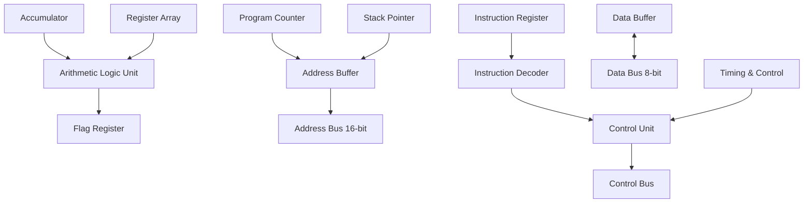
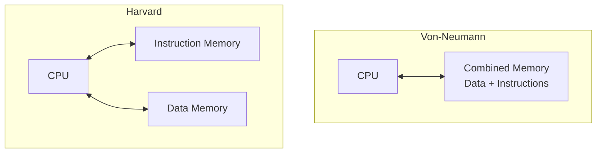
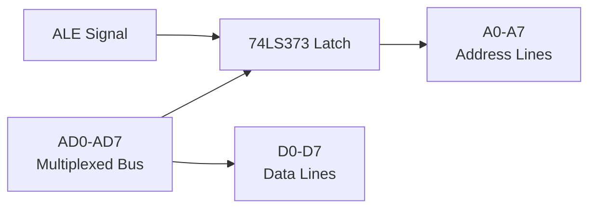
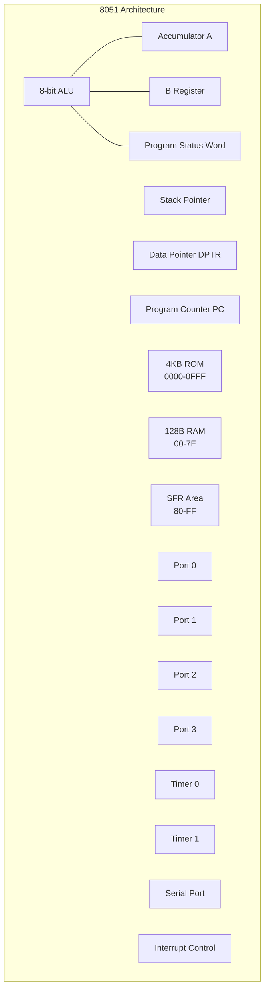

## પ્રશ્ન 1(અ) [3 ગુણ]

**8085 નું બસ ઓર્ગેનાઈઝેશન દોરો.**

**જવાબ**:

```goat
                    8085 MICROPROCESSOR
                    
    +-------+      16-bit         +-------+
    |       |<------------------->| Memory|
    |       |   Address Bus       |       |
    |  8085 |                     +-------+
    |  CPU  |      8-bit          
    |       |<------------------->+-------+
    |       |    Data Bus         | I/O   |
    +-------+                     | Ports |
         ^                        +-------+
         |
         | Control Bus
         v
    +-----------+
    | Control   |
    | Signals   |
    +-----------+
```

**બસના પ્રકારો:**

- **Address Bus**: મેમરી એડ્રેસિંગ માટે 16-bit એકદિશીય બસ
- **Data Bus**: ડેટા ટ્રાન્સફર માટે 8-bit દ્વિદિશીય બસ  
- **Control Bus**: RD, WR, ALE, IO/M જેવા કંટ્રોલ સિગ્નલ્સ

**મેમરી ટ્રીક:** "ADC - Address, Data, Control"

## પ્રશ્ન 1(બ) [4 ગુણ]

**માઈક્રોપ્રોસેસરની માઈક્રોકંટ્રોલર સાથે સરખામણી કરો.**

**જવાબ**:

| લક્ષણ | માઈક્રોપ્રોસેસર | માઈક્રોકંટ્રોલર |
|-------|-----------------|-----------------|
| **આર્કિટેક્ચર** | બાહ્ય ઘટકોની જરૂર | એક જ ચિપ પર બધા ઘટકો |
| **મેમરી** | બાહ્ય RAM/ROM જરૂરી | આંતરિક RAM/ROM ઉપલબ્ધ |
| **કિંમત** | વધુ સિસ્ટમ કોસ્ટ | ઓછી સિસ્ટમ કોસ્ટ |
| **પાવર** | વધુ પાવર વપરાશ | ઓછો પાવર વપરાશ |
| **સાઈઝ** | મોટું સિસ્ટમ સાઈઝ | કોમ્પેક્ટ સિસ્ટમ |
| **ઉપયોગ** | સામાન્ય હેતુ કમ્પ્યુટિંગ | એમ્બેડેડ કંટ્રોલ એપ્લિકેશનો |

**મુખ્ય મુદ્દાઓ:**

- **માઈક્રોપ્રોસેસર**: માત્ર CPU, બાહ્ય સપોર્ટ ચિપ્સ જરૂરી
- **માઈક્રોકંટ્રોલર**: ચિપ પર સંપૂર્ણ કમ્પ્યુટર સિસ્ટમ

**મેમરી ટ્રીક:** "MICRO - Memory Internal, Compact, Reduced cost, Optimized"

## પ્રશ્ન 1(ક) [7 ગુણ]

**8085 માઈક્રોપ્રોસેસરના દરેક બ્લોક દોરો અને સમજાવો.**

**જવાબ**:



**બ્લોકના કાર્યો:**

- **ALU**: અંકગણિત અને તાર્કિક ઓપરેશન કરે છે
- **Accumulator**: ડેટા પ્રોસેસિંગ માટે પ્રાથમિક કામકાજ રજિસ્ટર
- **Register Array**: B, C, D, E, H, L સામાન્ય હેતુ રજિસ્ટરો
- **Program Counter**: આગળના instruction નું address ધરાવે છે
- **Stack Pointer**: મેમરીમાં stack ના ટોપને પોઈન્ટ કરે છે
- **Control Unit**: પ્રોસેસરના એકંદર ઓપરેશનને કંટ્રોલ કરે છે

**મેમરી ટ્રીક:** "APRIL - ALU, Program counter, Registers, Instruction decoder, Logic control"

## પ્રશ્ન 1(ક) OR [7 ગુણ]

**8085 માઈક્રોપ્રોસેસરનો પીન ડાયાગ્રામ દોરો અને કોઈ પણ 4 પીન સમજાવો.**

**જવાબ**:

```goat
                  8085 PIN DIAGRAM
                  
      X1    1 +-------+ 40  Vcc
      X2    2 |       | 39  HOLD
    RESET   3 |       | 38  HLDA  
     SOD    4 |       | 37  CLK(OUT)
     SID    5 |  8085 | 36  RESET IN
    TRAP    6 |       | 35  READY
    RST7.5  7 |       | 34  IO/M
    RST6.5  8 |       | 33  S1
    RST5.5  9 |       | 32  RD
    INTR   10 |       | 31  WR
    INTA   11 |       | 30  ALE
   AD0-7 12-19|       | 23-29 A8-A15
     Vss   20 +-------+ 21  A15-A8
```

**પીન સમજાવટ:**

- **ALE (Pin 30)**: Address Latch Enable - multiplexed bus પર address અને data અલગ કરે છે
- **RD (Pin 32)**: Read control signal - active low, read operation દર્શાવે છે
- **WR (Pin 31)**: Write control signal - active low, write operation દર્શાવે છે
- **RESET (Pin 36)**: Reset input - low થાય ત્યારે processor initialize કરે છે

**મેમરી ટ્રીક:** "ARWA - ALE, Read, Write, rAset"

## પ્રશ્ન 2(અ) [3 ગુણ]

**વ્યાખ્યા આપો: (1) Opcode (2) Operand**

**જવાબ**:

**વ્યાખ્યાઓ:**

- **Opcode**: Operation Code - કરવાનું operation સ્પષ્ટ કરે છે (ADD, MOV, JMP)
- **Operand**: જે ડેટા અથવા address પર operation કરવાનું છે

**ઉદાહરણ:**

```
MOV A, B
|   |  |
|   |  +-- Operand 2 (Source)  
|   +-- Operand 1 (Destination)
+-- Opcode
```

**મેમરી ટ્રીક:** "OO - Operation + Operand"

## પ્રશ્ન 2(બ) [4 ગુણ]

**RISC અને CISC વચ્ચે તફાવત આપો.**

**જવાબ**:

| લક્ષણ | RISC | CISC |
|-------|------|------|
| **Instructions** | સરળ, fixed format | જટિલ, variable format |
| **Execution** | Single cycle execution | Multiple cycle execution |
| **Addressing** | થોડા addressing modes | ઘણા addressing modes |
| **Memory** | Load/Store architecture | Memory-to-memory operations |
| **Compiler** | જટિલ compiler design | સરળ compiler design |

**મુખ્ય મુદ્દાઓ:**

- **RISC**: Reduced Instruction Set Computer - સરળ, ઝડપી
- **CISC**: Complex Instruction Set Computer - feature rich

**મેમરી ટ્રીક:** "RISC is SLIM - Simple, Load-store, Instruction reduced, Memory efficient"

## પ્રશ્ન 2(ક) [7 ગુણ]

**Von-Neumann અને Harvard Architecture વચ્ચે તફાવત આપો.**

**જવાબ**:

| લક્ષણ | Von-Neumann | Harvard |
|-------|-------------|---------|
| **Memory** | data અને instructions માટે single memory | data અને instructions માટે અલગ memory |
| **Bus Structure** | Single bus system | Dual bus system |
| **Access** | data અને instructions ને sequential access | simultaneous access શક્ય |
| **Cost** | ઓછી કિંમત | વધુ કિંમત |
| **Speed** | bus conflicts કારણે ધીમું | parallel access કારણે ઝડપી |
| **Examples** | 8085, સામાન્ય computers | 8051, DSP processors |



**મેમરી ટ્રીક:** "VH - Von has one bus, Harvard has two"

## પ્રશ્ન 2(અ) OR [3 ગુણ]

**વ્યાખ્યા આપો: (1) T-State (2) Instruction Cycle (3) Machine Cycle**

**જવાબ**:

**વ્યાખ્યાઓ:**

- **T-State**: Time state - મૂળભૂત timing unit, એક clock period
- **Instruction Cycle**: એક instruction નું સંપૂર્ણ execution
- **Machine Cycle**: એક memory operation માટે જરૂરી T-states નું જૂથ

**સંબંધ:**

```
Instruction Cycle = Multiple Machine Cycles
Machine Cycle = Multiple T-States (3-6 T-states)
```

**મેમરી ટ્રીક:** "TIM - T-state, Instruction cycle, Machine cycle"

## પ્રશ્ન 2(બ) OR [4 ગુણ]

**8085 ના Address અને Data Bus નું De-Multiplexing સમજાવો.**

**જવાબ**:



**પ્રક્રિયા:**

- **Step 1**: T1 દરમિયાન, AD0-AD7 માં lower 8-bit address હોય છે
- **Step 2**: ALE high થાય છે, external latch માં address latch થાય છે
- **Step 3**: બાકીના T-states માટે AD0-AD7 data bus બને છે

**જરૂરી ઘટકો:**

- **74LS373**: Address latching માટે Octal latch IC
- **ALE**: Timing માટે Address Latch Enable signal

**મેમરી ટ્રીક:** "LAD - Latch Address with Data separation"

## પ્રશ્ન 2(ક) OR [7 ગુણ]

**8085 નો Flag Register દોરો અને સમજાવો.**

**જવાબ**:

```goat
    D7   D6   D5   D4   D3   D2   D1   D0
   +----+----+----+----+----+----+----+----+
   | S  | Z  | X  | AC | X  | P  | X  | CY |
   +----+----+----+----+----+----+----+----+
```

**Flag વર્ણન:**

- **CY (D0)**: Carry flag - carry આવે ત્યારે set થાય છે
- **P (D2)**: Parity flag - even parity માટે set થાય છે
- **AC (D4)**: Auxiliary carry - BCD operations માટે set થાય છે
- **Z (D6)**: Zero flag - પરિણામ zero હોય ત્યારે set થાય છે
- **S (D7)**: Sign flag - પરિણામ negative હોય ત્યારે set થાય છે

**Flag Operations:**

- **Conditional Jumps**: Flag status પર આધારિત (JZ, JC, JP)
- **Arithmetic Results**: ALU operations પછી automatically update થાય છે

**મેમરી ટ્રીક:** "SZAPC - Sign, Zero, Auxiliary, Parity, Carry"

## પ્રશ્ન 3(અ) [3 ગુણ]

**SFR એટલે શું? કોઈ પણ ત્રણ SFR ની યાદી બનાવો.**

**જવાબ**:

**SFR વ્યાખ્યા:**
**Special Function Register** - microcontroller માં વિશિષ્ટ કાર્યો સાથે dedicated registers

**ત્રણ SFRs:**

- **ACC (E0H)**: Accumulator register
- **PSW (D0H)**: Program Status Word
- **SP (81H)**: Stack Pointer register

**લાક્ષણિકતાઓ:**

- **Address Range**: Internal RAM માં 80H થી FFH
- **Bit Addressable**: કેટલાક SFRs individual bit access આપે છે
- **Function Specific**: દરેકનું dedicated hardware function હોય છે

**મેમરી ટ્રીક:** "APS - ACC, PSW, Stack Pointer"

## પ્રશ્ન 3(બ) [4 ગુણ]

**Program Counter (PC) અને Data Pointer (DPTR) Register સમજાવો.**

**જવાબ**:

**Program Counter (PC):**

- **Size**: 16-bit register
- **Function**: આગળના instruction નું address ધરાવે છે
- **Auto-increment**: Instruction fetch પછી automatically increment થાય છે
- **Range**: 0000H થી FFFFH

**Data Pointer (DPTR):**

- **Size**: 16-bit register (DPH + DPL)
- **Function**: External data memory locations ને point કરે છે
- **Usage**: External memory access માટે MOVX instructions સાથે વપરાય છે
- **Components**: DPH (83H) અને DPL (82H)

```goat
PC:   +--------+--------+
      |   PCH  |   PCL  |  16-bit
      +--------+--------+

DPTR: +--------+--------+
      |   DPH  |   DPL  |  16-bit  
      +--------+--------+
      |  83H   |  82H   |
```

**મેમરી ટ્રીક:** "PD - PC Points to Program, DPTR Points to Data"

## પ્રશ્ન 3(ક) [7 ગુણ]

**8051 નું આર્કિટેક્ચર દોરો અને સમજાવો.**

**જવાબ**:



**આર્કિટેક્ચર ઘટકો:**

- **CPU**: Accumulator અને B register સાથે 8-bit ALU
- **Memory**: 4KB internal ROM, 128B internal RAM
- **I/O Ports**: ચાર 8-bit bidirectional ports (P0-P3)
- **Timers**: બે 16-bit timers/counters (T0, T1)
- **Serial Port**: Communication માટે full duplex UART
- **Interrupts**: Priority levels સાથે 5 interrupt sources

**વિશેષ લક્ષણો:**

- **Boolean Processor**: Bit manipulation capabilities
- **Addressing Modes**: 8 અલગ addressing modes
- **Power Management**: Idle અને power-down modes

**મેમરી ટ્રીક:** "MIPTIS - Memory, I/O, Processor, Timers, Interrupts, Serial"

## પ્રશ્ન 3(અ) OR [3 ગુણ]

**8051 ની નીચેની પીન સમજાવો: (1) ALE (2) PSEN (3) XTAL1 & XTAL2**

**જવાબ**:

**પીન કાર્યો:**

- **ALE (Pin 30)**: Address Latch Enable
  - Lower address byte latch કરવા માટે output pulse
  - Oscillator frequency ના 1/6 પર active high signal

- **PSEN (Pin 29)**: Program Store Enable
  - External program memory read માટે active low output
  - External EPROM ના OE pin સાથે જોડાય છે

- **XTAL1 & XTAL2 (Pins 19, 18)**: Crystal connections
  - Clock generation માટે external crystal જોડાય છે
  - સામાન્ય frequency: 11.0592 MHz અથવા 12 MHz

```goat
Crystal Oscillator Connection:
    
    XTAL1 ----[Crystal]---- XTAL2
      |                      |
     [C1]                   [C2]
      |                      |
     GND                    GND
```

**મેમરી ટ્રીક:** "APX - ALE latches Address, PSEN enables Program, XTAL generates clocK"

## પ્રશ્ન 3(બ) OR [4 ગુણ]

**8051 માઈક્રોકંટ્રોલરનું આંતરિક RAM ઓર્ગેનાઈઝેશન સમજાવો.**

**જવાબ**:

```goat
    8051 Internal RAM Organization (128 Bytes)
    
    7FH +------------------------+
        |    General Purpose     |  
        |    Scratch Pad Area    |  78H-7FH (8 bytes)
    78H +------------------------+
        |                        |
        |    General Purpose     |  30H-77H (72 bytes)  
        |    Data Memory         |
    30H +------------------------+
        |  Bank 3 (R0-R7)        |  18H-1FH
    20H +------------------------+
        |  Bank 2 (R0-R7)        |  10H-17H  
    18H +------------------------+
        |  Bank 1 (R0-R7)        |  08H-0FH
    10H +------------------------+
        |  Bank 0 (R0-R7)        |  00H-07H
    08H +------------------------+
        |  Default Register Bank |
    00H +------------------------+
```

**RAM વિભાગો:**

- **Register Banks**: 4 banks × 8 registers દરેક (00H-1FH)
- **Bit Addressable**: Individual bit access સાથે 16 bytes (20H-2FH)
- **General Purpose**: User data માટે 80 bytes (30H-7FH)
- **Stack Area**: સામાન્યતે 08H થી ઉપર શરૂ થાય છે

**Addressing:**

- **Direct**: વાસ્તવિક address વાપરીને (MOV 30H, A)
- **Indirect**: Register pointer વાપરીને (MOV @R0, A)

**મેમરી ટ્રીક:** "RBGS - Register banks, Bit addressable, General purpose, Stack"

## પ્રશ્ન 3(ક) OR [7 ગુણ]

**8051 નો પીન ડાયાગ્રામ દોરો અને કોઈ પણ 4 પીન સમજાવો.**

**જવાબ**:

```goat
                    8051 PIN DIAGRAM
                    
    P1.0     1 +-------+ 40  Vcc
    P1.1     2 |       | 39  P0.0/AD0
    P1.2     3 |       | 38  P0.1/AD1  
    P1.3     4 |       | 37  P0.2/AD2
    P1.4     5 |  8051 | 36  P0.3/AD3
    P1.5     6 |       | 35  P0.4/AD4
    P1.6     7 |       | 34  P0.5/AD5
    P1.7     8 |       | 33  P0.6/AD6
    RESET    9 |       | 32  P0.7/AD7
   P3.0/RXD  10|       | 31  EA/VPP
   P3.1/TXD  11|       | 30  ALE/PROG
   P3.2/INT0 12|       | 29  PSEN
   P3.3/INT1 13|       | 28  P2.7/A15
   P3.4/T0   14|       | 27  P2.6/A14
   P3.5/T1   15|       | 26  P2.5/A13
   P3.6/WR   16|       | 25  P2.4/A12
   P3.7/RD   17|       | 24  P2.3/A11
   XTAL2     18|       | 23  P2.2/A10
   XTAL1     19|       | 22  P2.1/A9
    VSS      20+-------+ 21  P2.0/A8
```

**પીન સમજાવટ:**

- **RESET (Pin 9)**: Reset input - Active high, microcontroller initialize કરે છે
- **EA/VPP (Pin 31)**: External Access - Program memory selection control કરે છે
- **P0 (Pins 32-39)**: Port 0 - External memory માટે multiplexed address/data bus
- **P2 (Pins 21-28)**: Port 2 - External memory માટે high-order address bus

**મેમરી ટ્રીક:** "REPP - REset, External Access, Port 0, Port 2"

## પ્રશ્ન 4(અ) [3 ગુણ]

**R0 રજિસ્ટરમાં સ્ટોર થયેલ ડેટાને R1 રજિસ્ટરમાં સ્ટોર થયેલ ડેટા સાથે ગુણાકાર કરો અને પરિણામ R2 રજિસ્ટરમાં(LSB) અને R3 રજિસ્ટરમાં(MSB) સ્ટોર કરવાનો પ્રોગ્રામ લખો.**

**જવાબ**:

```assembly
ORG 0000H
MOV R0, #05H    ; પહેલો નંબર લોડ કરો
MOV R1, #03H    ; બીજો નંબર લોડ કરો
MOV A, R0       ; R0 ને accumulator માં મૂકો
MOV B, R1       ; R1 ને B register માં મૂકો
MUL AB          ; A અને B નો ગુણાકાર કરો
MOV R2, A       ; LSB ને R2 માં સ્ટોર કરો
MOV R3, B       ; MSB ને R3 માં સ્ટોર કરો
END
```

**પ્રોગ્રામ ફ્લો:**

- **Operands લોડ કરો** R0 અને R1 માં
- **ટ્રાન્સફર કરો** ગુણાકાર માટે A અને B registers માં
- **Execute કરો** MUL AB instruction
- **સ્ટોર કરો** 16-bit પરિણામ (A=LSB, B=MSB)

**પરિણામ સ્ટોરેજ:**

- **R2**: Product ના lower 8 bits
- **R3**: Product ના upper 8 bits

**મેમરી ટ્રીક:** "LTSE - Load, Transfer, multiply, Store result"

## પ્રશ્ન 4(બ) [4 ગુણ]

**ડેટા ટ્રાન્સફર ઇન્સ્ટ્રકશનની યાદી આપો. કોઈ પણ બે ડેટા ટ્રાન્સફર ઇન્સ્ટ્રકશન ઉદાહરણ સહિત સમજાવો.**

**જવાબ**:

**ડેટા ટ્રાન્સફર ઇન્સ્ટ્રકશન:**

| Instruction | કાર્ય |
|-------------|-------|
| MOV | Registers/memory વચ્ચે data move કરે છે |
| MOVX | External memory થી data move કરે છે |
| MOVC | Code byte ને accumulator માં move કરે છે |
| PUSH | Data ને stack પર push કરે છે |
| POP | Stack માંથી data pop કરે છે |
| XCH | Accumulator સાથે register exchange કરે છે |
| XCHD | Lower nibble exchange કરે છે |

**વિગતવાર ઉદાહરણો:**

**1. MOV Instruction:**

```assembly
MOV A, #50H     ; Immediate data 50H ને accumulator માં લોડ કરો
MOV R0, A       ; Accumulator content ને R0 માં copy કરો
MOV 30H, A      ; Accumulator content ને address 30H પર સ્ટોર કરો
```

**2. PUSH/POP Instructions:**

```assembly
PUSH ACC        ; Accumulator ને stack પર push કરો
PUSH 00H        ; R0 content ને stack પર push કરો
POP 01H         ; Stack content ને R1 માં pop કરો
POP ACC         ; Stack content ને accumulator માં pop કરો
```

**મેમરી ટ્રીક:** "Move Makes Programs Possible - MOV, MOVX, PUSH, POP"

## પ્રશ્ન 4(ક) [7 ગુણ]

**8051 ના એડ્રેસિંગ મોડ્સને વ્યાખ્યાયિત કરો અને સમજાવો.**

**જવાબ**:

**8051 એડ્રેસિંગ મોડ્સ:**

| મોડ | વર્ણન | ઉદાહરણ | ઉપયોગ |
|-----|--------|---------|--------|
| **Immediate** | Data instruction નો ભાગ છે | MOV A, #50H | સ્થિર મૂલ્યો |
| **Register** | Register નો સીધો ઉપયોગ | MOV A, R0 | ઝડપી access |
| **Direct** | સીધું address વાપરે છે | MOV A, 30H | RAM locations |
| **Indirect** | Register ને pointer તરીકે વાપરે છે | MOV A, @R0 | Dynamic addressing |
| **Indexed** | Base + offset addressing | MOVC A, @A+DPTR | Table lookup |
| **Relative** | PC + offset | SJMP LOOP | Branch instructions |
| **Absolute** | Direct jump address | LJMP 1000H | Long jumps |
| **Bit** | Individual bit access | SETB P1.0 | Control operations |

**વિગતવાર ઉદાહરણો:**

```assembly
; Immediate Addressing
MOV A, #25H         ; 25H ને A માં લોડ કરો

; Register Addressing  
MOV A, R1           ; R1 ને A માં copy કરો

; Direct Addressing
MOV A, 40H          ; Address 40H માંથી લોડ કરો

; Indirect Addressing
MOV R0, #40H        ; R0 40H ને point કરે છે
MOV A, @R0          ; R0 દ્વારા pointed address માંથી લોડ કરો

; Indexed Addressing
MOV DPTR, #TABLE    ; Table ને point કરો
MOV A, #02H         ; Index value
MOVC A, @A+DPTR     ; TABLE+2 માંથી લોડ કરો
```

**મેમરી ટ્રીક:** "IRIDRAB - Immediate, Register, Indirect, Direct, Relative, Absolute, Bit"

## પ્રશ્ન 4(અ) OR [3 ગુણ]

**R0 રજિસ્ટરમાં સ્ટોર થયેલ ડેટાનું 2's Complement શોધવાનો પ્રોગ્રામ લખો.**

**જવાબ**:

```assembly
ORG 0000H
MOV R0, #85H        ; ટેસ્ટ ડેટા લોડ કરો
MOV A, R0           ; ડેટાને accumulator માં copy કરો
CPL A               ; બધા bits complement કરો (1's complement)
INC A               ; 2's complement માટે 1 ઉમેરો
MOV R1, A           ; પરિણામ R1 માં સ્ટોર કરો
END
```

**Algorithm:**

- **Step 1**: R0 માંથી ડેટાને accumulator માં લોડ કરો
- **Step 2**: CPL A વાપરીને બધા bits complement કરો
- **Step 3**: 2's complement માટે INC A વાપરીને 1 ઉમેરો
- **Step 4**: પરિણામ પાછું સ્ટોર કરો

**ચકાસણી:**

```
મૂળ: 85H = 10000101B
1's Comp: 7AH = 01111010B  
2's Comp: 7BH = 01111011B
```

**મેમરી ટ્રીક:** "CCI - Complement, aCd 1, Include result"

## પ્રશ્ન 4(બ) OR [4 ગુણ]

**લોજિકલ ઇન્સ્ટ્રકશનની યાદી આપો. કોઈ પણ બે લોજિકલ ઇન્સ્ટ્રકશન ઉદાહરણ સહિત સમજાવો.**

**જવાબ**:

**લોજિકલ ઇન્સ્ટ્રકશન:**

| Instruction | કાર્ય |
|-------------|-------|
| ANL | Logical AND operation |
| ORL | Logical OR operation |
| XRL | Logical XOR operation |
| CPL | Complement operation |
| RL/RLC | Rotate left |
| RR/RRC | Rotate right |
| SWAP | Swap nibbles |

**વિગતવાર ઉદાહરણો:**

**1. ANL (AND Logic):**

```assembly
MOV A, #0F0H        ; A = 11110000B
ANL A, #0AAH        ; 10101010B સાથે AND કરો
                    ; પરિણામ: A = 10100000B = A0H
```

**ઉપયોગ**: વિશિષ્ટ bits masking, અનચાહતા bits clear કરવા

**2. ORL (OR Logic):**

```assembly
MOV A, #0F0H        ; A = 11110000B  
ORL A, #00FH        ; 00001111B સાથે OR કરો
                    ; પરિણામ: A = 11111111B = FFH
```

**ઉપયોગ**: વિશિષ્ટ bits setting, bit patterns combine કરવા

**મેમરી ટ્રીક:** "AXOR - AND masks, XOR toggles, OR sets, Rotate shifts"

## પ્રશ્ન 4(ક) OR [7 ગુણ]

**નીચેની ઇન્સ્ટ્રકશન સમજાવો: (1)ADDC (2) INC (3) DEC (4) JZ (5) SUBB (6) NOP (7) RET**

**જવાબ**:

**ઇન્સ્ટ્રકશન સમજાવટ:**

**1. ADDC (Add with Carry):**

```assembly
MOV A, #80H
ADDC A, #90H    ; A = A + 90H + Carry flag
```

**કાર્ય**: Source, destination, અને carry flag ઉમેરે છે

**2. INC (Increment):**

```assembly
INC A           ; A = A + 1
INC R0          ; R0 = R0 + 1  
INC 30H         ; (30H) = (30H) + 1
```

**કાર્ય**: Operand માં 1 વધારે છે

**3. DEC (Decrement):**

```assembly
DEC A           ; A = A - 1
DEC R1          ; R1 = R1 - 1
DEC 40H         ; (40H) = (40H) - 1  
```

**કાર્ય**: Operand માંથી 1 ઓછું કરે છે

**4. JZ (Jump on Zero):**

```assembly
DEC A
JZ ZERO_LABEL   ; A = 0 હોય તો jump કરો
```

**કાર્ય**: Zero flag set હોય ત્યારે conditional jump

**5. SUBB (Subtract with Borrow):**

```assembly
MOV A, #50H
SUBB A, #30H    ; A = A - 30H - Carry flag
```

**કાર્ય**: Accumulator માંથી source અને carry ઓછું કરે છે

**6. NOP (No Operation):**

```assembly
NOP             ; કંઈ ન કરો, 1 cycle વાપરો
```

**કાર્ય**: Timing delay આપે છે, placeholder

**7. RET (Return):**

```assembly
CALL SUBROUTINE
...
SUBROUTINE:
    MOV A, #10H
    RET         ; Caller ને પાછા જાઓ
```

**કાર્ય**: Subroutine માંથી calling address પર પાછા જાય છે

**મેમરી ટ્રીક:** "AIDS NR - Add, Increment, Decrement, Subtract, No-op, Return"

## પ્રશ્ન 5(અ) [3 ગુણ]

**DJNZ અને CJNE ઇન્સ્ટ્રકશન યોગ્ય ઉદાહરણ સહિત સમજાવો.**

**જવાબ**:

**DJNZ (Decrement and Jump if Not Zero):**

```assembly
MOV R0, #05H        ; Counter initialize કરો
LOOP:
    MOV A, #00H     ; કોઈ operation
    DJNZ R0, LOOP   ; R0 ઓછું કરો, zero નથી તો jump કરો
```

**કાર્ય**: Decrement અને conditional jump operations combine કરે છે

**CJNE (Compare and Jump if Not Equal):**

```assembly
MOV A, #30H
CJNE A, #30H, NOT_EQUAL  ; A ને 30H સાથે compare કરો
MOV R0, #01H             ; Equal case
SJMP CONTINUE
NOT_EQUAL:
    MOV R0, #00H         ; Not equal case
CONTINUE:
```

**કાર્ય**: બે operands compare કરે છે અને સમાન નથી તો jump કરે છે

**ઉપયોગો:**

- **DJNZ**: Loop control, counting operations
- **CJNE**: Decision making, condition checking

**મેમરી ટ્રીક:** "DC - Decrement count, Compare jump"

## પ્રશ્ન 5(બ) [4 ગુણ]

**ટાઈમર 0 નો ઉપયોગ કરી 30 મિલી સેકંડનો ટાઈમ ડિલે જનરેટ કરવા માટે એસેમ્બલી પ્રોગ્રામ બનાવો. ક્રિસ્ટલ ફ્રિકવન્સી 12 મેગા હર્ટઝ ગણતરીમાં લેવી.**

**જવાબ**:

```assembly
ORG 0000H
MAIN:
    CALL DELAY_30MS     ; 30ms delay call કરો
    SJMP MAIN           ; Repeat કરો

DELAY_30MS:
    MOV TMOD, #01H      ; Timer 0, Mode 1 (16-bit)
    MOV TH0, #8AH       ; 30ms માટે high byte લોડ કરો
    MOV TL0, #23H       ; Low byte લોડ કરો
    SETB TR0            ; Timer 0 start કરો
WAIT:
    JNB TF0, WAIT       ; Timer overflow માટે રાહ જુઓ
    CLR TR0             ; Timer stop કરો
    CLR TF0             ; Timer flag clear કરો
    RET
END
```

**30ms delay માટે ગણતરી:**

```
Crystal Frequency = 12 MHz
Machine Cycle = 12/12 MHz = 1 µs
30ms માટે = 30,000 µs = 30,000 machine cycles

Timer Count = 65536 - 30000 = 35536 = 8A23H
TH0 = 8AH, TL0 = 23H
```

**Timer Configuration:**

- **TMOD**: Timer mode register configuration
- **TH0/TL0**: Timer 0 high/low byte registers
- **TR0**: Timer 0 run control bit
- **TF0**: Timer 0 overflow flag

**મેમરી ટ્રીક:** "CLSW - Calculate, Load, Start, Wait"

## પ્રશ્ન 5(ક) [7 ગુણ]

**8051 માઈક્રોકંટ્રોલર સાથે LCD નો ઇન્ટરફેસિંગ ડાયાગ્રામ દોરો અને ઇન્ટરફેસિંગ માટે જરૂરી LCD ની તમામ પીનો સમજાવો.**

**જવાબ**:

```goat
    8051 to LCD Interfacing (4-bit mode)
    
    8051                      16x2 LCD
    ----                      --------
    P2.7 ---------> D7  (Pin 14)
    P2.6 ---------> D6  (Pin 13)  
    P2.5 ---------> D5  (Pin 12)
    P2.4 ---------> D4  (Pin 11)
    
    P1.2 ---------> EN  (Pin 6)
    P1.1 ---------> RW  (Pin 5)
    P1.0 ---------> RS  (Pin 4)
    
    +5V  ---------> VCC (Pin 2)
    GND  ---------> VSS (Pin 1)
    GND  ---------> VEE (Pin 3) [Contrast]
```

**LCD પીન કાર્યો:**

- **RS (Pin 4)**: Register Select - 0=Command, 1=Data
- **RW (Pin 5)**: Read/Write - 0=Write, 1=Read  
- **EN (Pin 6)**: Enable - Data transfer માટે high to low pulse
- **D4-D7 (Pins 11-14)**: Commands/data માટે 4-bit data lines

**ઇન્ટરફેસ જરૂરિયાતો:**

- **Power Supply**: VCC=+5V, VSS=GND, VEE=Contrast control
- **Control Lines**: LCD control માટે 3 pins (RS, RW, EN)
- **Data Lines**: 4-bit mode operation માટે 4 pins (D4-D7)

**મૂળભૂત LCD Commands:**

- **0x38**: Function set (8-bit, 2 lines)
- **0x0E**: Display ON, cursor ON
- **0x01**: Clear display
- **0x80**: Set cursor to first line

**મેમરી ટ્રીક:** "REED - RS selects, RW reads, EN enables, Data transfers"

## પ્રશ્ન 5(અ) OR [3 ગુણ]

**65h મેમરી લોકેશન પર સ્ટોર થયેલ ડેટાનું 75h મેમરી લોકેશન પર સ્ટોર થયેલ ડેટા સાથે OR ઓપરેશન કરો અને પરિણામ R6 રજિસ્ટરમાં સ્ટોર કરવાનો પ્રોગ્રામ લખો.**

**જવાબ**:

```assembly
ORG 0000H
MOV 65H, #0F0H      ; 65H પર ટેસ્ટ ડેટા સ્ટોર કરો
MOV 75H, #0AAH      ; 75H પર ટેસ્ટ ડેટા સ્ટોર કરો

MOV A, 65H          ; 65H માંથી ડેટાને accumulator માં લોડ કરો
ORL A, 75H          ; 75H પરના ડેટા સાથે OR કરો
MOV R6, A           ; પરિણામ R6 register માં સ્ટોર કરો
END
```

**ઓપરેશન વિગતો:**

- **Load**: Memory location 65H માંથી પહેલો operand
- **OR**: 75H પરના બીજા operand સાથે logical OR કરો
- **Store**: પરિણામ R6 register માં

**ઉદાહરણ ગણતરી:**

```
65H પરનો ડેટા: F0H = 11110000B
75H પરનો ડેટા: AAH = 10101010B  
OR પરિણામ:   FAH = 11111010B
```

**મેમરી ટ્રીક:** "LOS - Load, OR, Store result"

## પ્રશ્ન 5(બ) OR [4 ગુણ]

**P1.3 પર 2 કિલો હર્ટઝનો સ્કવેર વેવ જનરેટ કરવા માટે એસેમ્બલી પ્રોગ્રામ લખો. ક્રિસ્ટલ ફ્રિકવન્સી 11.0592 મેગા હર્ટઝ ગણતરીમાં લેવી.**

**જવાબ**:

```assembly
ORG 0000H
MAIN:
    SETB P1.3           ; P1.3 ને high કરો
    CALL DELAY_250US    ; અડધા period માટે delay
    CLR P1.3            ; P1.3 ને low કરો
    CALL DELAY_250US    ; અડધા period માટે delay
    SJMP MAIN           ; સતત repeat કરો

DELAY_250US:
    MOV TMOD, #01H      ; Timer 0, Mode 1
    MOV TH0, #0FEH      ; High byte લોડ કરો
    MOV TL0, #0CBH      ; Low byte લોડ કરો
    SETB TR0            ; Timer 0 start કરો
WAIT:
    JNB TF0, WAIT       ; Overflow માટે રાહ જુઓ
    CLR TR0             ; Timer stop કરો
    CLR TF0             ; Flag clear કરો
    RET
END
```

**2KHz Square Wave માટે ગણતરી:**

```
Frequency = 2KHz, Period = 500µs
Half Period = 250µs

Crystal = 11.0592 MHz
Machine Cycle = 11.0592/12 = 0.921 MHz = 1.085µs

Timer Count = 250µs / 1.085µs = 230 cycles
Timer Value = 65536 - 230 = 65306 = FECBH
TH0 = FEH, TL0 = CBH
```

**Square Wave Generation:**

- **High Period**: Pin high કરો, 250µs રાહ જુઓ
- **Low Period**: Pin low કરો, 250µs રાહ જુઓ
- **Frequency**: 1/(250µs + 250µs) = 2KHz

**મેમરી ટ્રીક:** "SCDW - Set high, Clear low, Delay, Wait"

## પ્રશ્ન 5(ક) OR [7 ગુણ]

**8051 માઈક્રોકંટ્રોલર સાથે 7-Segment ડિસ્પ્લેનો ઇન્ટરફેસિંગ દોરો અને સમજાવો.**

**જવાબ**:

```goat
    8051 to 7-Segment Display Interfacing
    
    8051 Port 1              7-Segment Display
    -----------              -----------------
    P1.0 ----[R]----> a  (Pin 7)     
    P1.1 ----[R]----> b  (Pin 6)      aaaa
    P1.2 ----[R]----> c  (Pin 4)     f    b
    P1.3 ----[R]----> d  (Pin 2)     f    b
    P1.4 ----[R]----> e  (Pin 1)      gggg
    P1.5 ----[R]----> f  (Pin 9)     e    c
    P1.6 ----[R]----> g  (Pin 10)    e    c
    P1.7 ----[R]----> dp (Pin 5)      dddd dp
    
    [R] = Current limiting resistor (330Ω)
    
    For Common Cathode:
    Common pin (Pin 3,8) ---> GND
    
    For Common Anode:  
    Common pin (Pin 3,8) ---> +5V
```

**ડિસ્પ્લે કોન્ફિગરેશન:**

| અક્ષર | Common Cathode કોડ | Common Anode કોડ |
|-------|-------------------|------------------|
| 0 | 3FH | C0H |
| 1 | 06H | F9H |
| 2 | 5BH | A4H |
| 3 | 4FH | B0H |
| 4 | 66H | 99H |
| 5 | 6DH | 92H |
| 6 | 7DH | 82H |
| 7 | 07H | F8H |
| 8 | 7FH | 80H |
| 9 | 6FH | 90H |

**નમૂના પ્રોગ્રામ:**

```assembly
ORG 0000H
MOV DPTR, #DIGIT_TABLE  ; Lookup table ને point કરો
MOV A, #05H             ; અંક 5 દર્શાવો
MOVC A, @A+DPTR         ; 7-segment કોડ મેળવો
MOV P1, A               ; Display ને મોકલો
SJMP $                  ; અહીં રહો

DIGIT_TABLE:
DB 3FH, 06H, 5BH, 4FH, 66H  ; 0,1,2,3,4
DB 6DH, 7DH, 07H, 7FH, 6FH  ; 5,6,7,8,9
END
```

**ઇન્ટરફેસ ઘટકો:**

- **Current Limiting Resistors**: LED current મર્યાદિત કરવા 330Ω
- **Common Connection**: GND ને cathode અથવા +5V ને anode
- **Data Lines**: Segments a-g અને decimal point માટે 8 bits

**મલ્ટિપલ ડિજિટ્સ માટે Multiplexing:**

- **Digit Select**: Digit selection માટે વધારાના pins
- **Time Division**: Digits વચ્ચે ઝડપથી switch કરવું
- **Persistence of Vision**: એકસાથે display નો ભ્રમ બનાવે છે

**મેમરી ટ્રીક:** "CRAM - Common connection, Resistors limit, Address segments, Multiplex digits"
