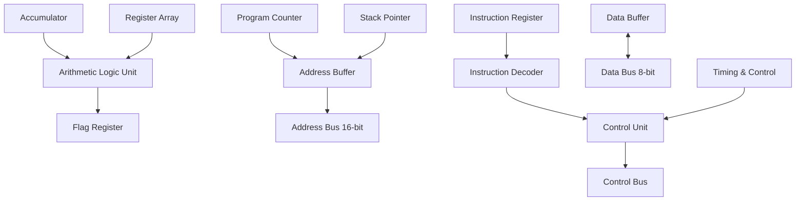
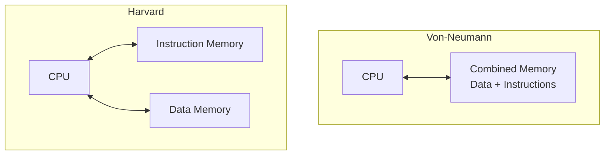
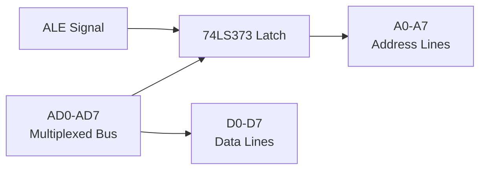
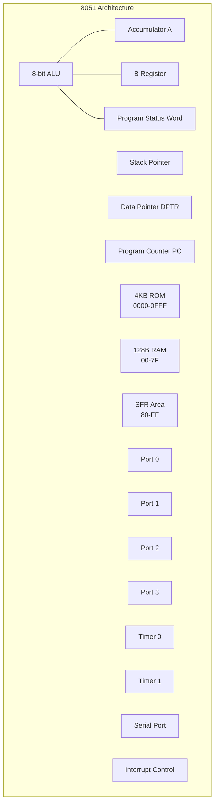

## Question 1(A) [3 marks]

**Draw The Bus Organization Of 8085.**

**Answer**:

```goat
                    8085 MICROPROCESSOR
                    
    +-------+      16-bit         +-------+
    |       |<------------------->| Memory|
    |       |   Address Bus       |       |
    |  8085 |                     +-------+
    |  CPU  |      8-bit          
    |       |<------------------->+-------+
    |       |    Data Bus         | I/O   |
    +-------+                     | Ports |
         ^                        +-------+
         |
         | Control Bus
         v
    +-----------+
    | Control   |
    | Signals   |
    +-----------+
```

**Bus Types:**

- **Address Bus**: 16-bit unidirectional bus for memory addressing
- **Data Bus**: 8-bit bidirectional bus for data transfer  
- **Control Bus**: Control signals like RD, WR, ALE, IO/M

**Mnemonic:** "ADC - Address, Data, Control"

## Question 1(B) [4 marks]

**Compare Microprocessor With Microcontroller.**

**Answer**:

| Feature | Microprocessor | Microcontroller |
|---------|---------------|-----------------|
| **Architecture** | External components needed | All components on single chip |
| **Memory** | External RAM/ROM required | Internal RAM/ROM available |
| **Cost** | Higher system cost | Lower system cost |
| **Power** | Higher power consumption | Lower power consumption |
| **Size** | Larger system size | Compact system |
| **Applications** | General purpose computing | Embedded control applications |

**Key Points:**

- **Microprocessor**: CPU only, requires external support chips
- **Microcontroller**: Complete computer system on chip

**Mnemonic:** "MICRO - Memory Internal, Compact, Reduced cost, Optimized"

## Question 1(C) [7 marks]  

**Draw And Explain Each Block Of 8085 Microprocessor.**

**Answer**:



**Block Functions:**

- **ALU**: Performs arithmetic and logical operations
- **Accumulator**: Primary working register for data processing
- **Register Array**: B, C, D, E, H, L general purpose registers
- **Program Counter**: Holds address of next instruction
- **Stack Pointer**: Points to top of stack in memory
- **Control Unit**: Controls overall operation of processor

**Mnemonic:** "APRIL - ALU, Program counter, Registers, Instruction decoder, Logic control"

## Question 1(C) OR [7 marks]

**Draw Pin Diagram Of 8085 Microprocessor And Explain Any 4(Four) Pins.**

**Answer**:

```goat
                  8085 PIN DIAGRAM
                  
      X1    1 +-------+ 40  Vcc
      X2    2 |       | 39  HOLD
    RESET   3 |       | 38  HLDA  
     SOD    4 |       | 37  CLK(OUT)
     SID    5 |  8085 | 36  RESET IN
    TRAP    6 |       | 35  READY
    RST7.5  7 |       | 34  IO/M
    RST6.5  8 |       | 33  S1
    RST5.5  9 |       | 32  RD
    INTR   10 |       | 31  WR
    INTA   11 |       | 30  ALE
   AD0-7 12-19|       | 23-29 A8-A15
     Vss   20 +-------+ 21  A15-A8
```

**Pin Explanations:**

- **ALE (Pin 30)**: Address Latch Enable - separates address and data on multiplexed bus
- **RD (Pin 32)**: Read control signal - active low, indicates read operation
- **WR (Pin 31)**: Write control signal - active low, indicates write operation  
- **RESET (Pin 36)**: Reset input - initializes processor when low

**Mnemonic:** "ARWA - ALE, Read, Write, rAset"

## Question 2(A) [3 marks]

**Define : (1) Opcode (2) Operand**

**Answer**:

**Definitions:**

- **Opcode**: Operation Code - specifies the operation to be performed (ADD, MOV, JMP)
- **Operand**: Data or address on which operation is performed

**Example:**

```
MOV A, B
|   |  |
|   |  +-- Operand 2 (Source)  
|   +-- Operand 1 (Destination)
+-- Opcode
```

**Mnemonic:** "OO - Operation + Operand"

## Question 2(B) [4 marks]

**Give Differences Between RISC And CISC.**

**Answer**:

| Feature | RISC | CISC |
|---------|------|------|
| **Instructions** | Simple, fixed format | Complex, variable format |
| **Execution** | Single cycle execution | Multiple cycle execution |
| **Addressing** | Few addressing modes | Many addressing modes |
| **Memory** | Load/Store architecture | Memory-to-memory operations |
| **Compiler** | Complex compiler design | Simple compiler design |

**Key Points:**

- **RISC**: Reduced Instruction Set Computer - simpler, faster
- **CISC**: Complex Instruction Set Computer - feature rich

**Mnemonic:** "RISC is SLIM - Simple, Load-store, Instruction reduced, Memory efficient"

## Question 2(C) [7 marks]

**Give Differences Between Von-Neumann & Harvard Architecture.**

**Answer**:

| Feature | Von-Neumann | Harvard |
|---------|-------------|---------|
| **Memory** | Single memory for data and instructions | Separate memory for data and instructions |
| **Bus Structure** | Single bus system | Dual bus system |
| **Access** | Sequential access to data and instructions | Simultaneous access possible |
| **Cost** | Lower cost | Higher cost |
| **Speed** | Slower due to bus conflicts | Faster parallel access |
| **Examples** | 8085, General computers | 8051, DSP processors |



**Mnemonic:** "VH - Von has one bus, Harvard has two"

## Question 2(A) OR [3 marks]  

**Define : (1) T-State (2) Instruction Cycle (3) Machine Cycle**

**Answer**:

**Definitions:**

- **T-State**: Time state - basic timing unit, one clock period
- **Instruction Cycle**: Complete execution of one instruction
- **Machine Cycle**: Group of T-states required for one memory operation

**Relationship:**

```
Instruction Cycle = Multiple Machine Cycles
Machine Cycle = Multiple T-States (3-6 T-states)
```

**Mnemonic:** "TIM - T-state, Instruction cycle, Machine cycle"

## Question 2(B) OR [4 marks]

**Explain De-Multiplexing Of Address And Data Bus Of 8085.**

**Answer**:



**Process:**

- **Step 1**: During T1, AD0-AD7 contains lower 8-bit address
- **Step 2**: ALE goes high, latches address in external latch
- **Step 3**: AD0-AD7 becomes data bus for remaining T-states

**Components Required:**

- **74LS373**: Octal latch IC for address latching
- **ALE**: Address Latch Enable signal for timing

**Mnemonic:** "LAD - Latch Address with Data separation"

## Question 2(C) OR [7 marks]

**Draw And Explain Flag Register Of 8085.**

**Answer**:

```goat
    D7   D6   D5   D4   D3   D2   D1   D0
   +----+----+----+----+----+----+----+----+
   | S  | Z  | X  | AC | X  | P  | X  | CY |
   +----+----+----+----+----+----+----+----+
```

**Flag Descriptions:**

- **CY (D0)**: Carry flag - Set when carry occurs
- **P (D2)**: Parity flag - Set for even parity  
- **AC (D4)**: Auxiliary carry - Set for BCD operations
- **Z (D6)**: Zero flag - Set when result is zero
- **S (D7)**: Sign flag - Set when result is negative

**Flag Operations:**

- **Conditional Jumps**: Based on flag status (JZ, JC, JP)
- **Arithmetic Results**: Automatically updated after ALU operations

**Mnemonic:** "SZAPC - Sign, Zero, Auxiliary, Parity, Carry"

## Question 3(A) [3 marks]

**What Is SFR ? List Out Any Three SFR.**

**Answer**:

**SFR Definition:**
**Special Function Register** - Dedicated registers with specific functions in microcontroller

**Three SFRs:**

- **ACC (E0H)**: Accumulator register
- **PSW (D0H)**: Program Status Word  
- **SP (81H)**: Stack Pointer register

**Characteristics:**

- **Address Range**: 80H to FFH in internal RAM
- **Bit Addressable**: Some SFRs allow individual bit access
- **Function Specific**: Each has dedicated hardware function

**Mnemonic:** "APS - ACC, PSW, Stack Pointer"

## Question 3(B) [4 marks]

**Explain Program Counter (PC) And Data Pointer (DPTR) Register.**

**Answer**:

**Program Counter (PC):**

- **Size**: 16-bit register
- **Function**: Holds address of next instruction to be executed
- **Auto-increment**: Automatically increments after instruction fetch
- **Range**: 0000H to FFFFH

**Data Pointer (DPTR):**

- **Size**: 16-bit register (DPH + DPL)
- **Function**: Points to external data memory locations
- **Usage**: Used with MOVX instructions for external memory access
- **Components**: DPH (83H) and DPL (82H)

```goat
PC:   +--------+--------+
      |   PCH  |   PCL  |  16-bit
      +--------+--------+

DPTR: +--------+--------+
      |   DPH  |   DPL  |  16-bit  
      +--------+--------+
      |  83H   |  82H   |
```

**Mnemonic:** "PD - PC Points to Program, DPTR Points to Data"

## Question 3(C) [7 marks]

**Draw And Explain Architecture Of 8051.**

**Answer**:



**Architecture Components:**

- **CPU**: 8-bit ALU with accumulator and B register
- **Memory**: 4KB internal ROM, 128B internal RAM
- **I/O Ports**: Four 8-bit bidirectional ports (P0-P3)
- **Timers**: Two 16-bit timers/counters (T0, T1)
- **Serial Port**: Full duplex UART for communication
- **Interrupts**: 5 interrupt sources with priority levels

**Special Features:**

- **Boolean Processor**: Bit manipulation capabilities
- **Addressing Modes**: 8 different addressing modes
- **Power Management**: Idle and power-down modes

**Mnemonic:** "MIPTIS - Memory, I/O, Processor, Timers, Interrupts, Serial"

## Question 3(A) OR [3 marks]

**Explain Following Pins Of 8051: (1) ALE (2) PSEN (3) XTAL1 & XTAL2**

**Answer**:

**Pin Functions:**

- **ALE (Pin 30)**: Address Latch Enable
  - Output pulse for latching lower address byte
  - Active high signal at 1/6 of oscillator frequency

- **PSEN (Pin 29)**: Program Store Enable  
  - Active low output for external program memory read
  - Connected to OE pin of external EPROM

- **XTAL1 & XTAL2 (Pins 19, 18)**: Crystal connections
  - Connect external crystal for clock generation
  - Typical frequency: 11.0592 MHz or 12 MHz

```goat
Crystal Oscillator Connection:
    
    XTAL1 ----[Crystal]---- XTAL2
      |                      |
     [C1]                   [C2]
      |                      |
     GND                    GND
```

**Mnemonic:** "APX - ALE latches Address, PSEN enables Program, XTAL generates clocK"

## Question 3(B) OR [4 marks] 

**Describe Internal RAM Organization Of 8051 Microcontroller.**

**Answer**:

```goat
    8051 Internal RAM Organization (128 Bytes)
    
    7FH +------------------------+
        |    General Purpose     |  
        |    Scratch Pad Area    |  78H-7FH (8 bytes)
    78H +------------------------+
        |                        |
        |    General Purpose     |  30H-77H (72 bytes)  
        |    Data Memory         |
    30H +------------------------+
        |  Bank 3 (R0-R7)        |  18H-1FH
    20H +------------------------+
        |  Bank 2 (R0-R7)        |  10H-17H  
    18H +------------------------+
        |  Bank 1 (R0-R7)        |  08H-0FH
    10H +------------------------+
        |  Bank 0 (R0-R7)        |  00H-07H
    08H +------------------------+
        |  Default Register Bank |
    00H +------------------------+
```

**RAM Sections:**

- **Register Banks**: 4 banks × 8 registers each (00H-1FH)
- **Bit Addressable**: 16 bytes with individual bit access (20H-2FH)  
- **General Purpose**: 80 bytes for user data (30H-7FH)
- **Stack Area**: Usually starts from 08H upward

**Addressing:**

- **Direct**: Using actual address (MOV 30H, A)
- **Indirect**: Using register pointer (MOV @R0, A)

**Mnemonic:** "RBGS - Register banks, Bit addressable, General purpose, Stack"

## Question 3(C) OR [7 marks]

**Draw Pin Diagram Of 8051 And Explain Any 04(Four) Pins.**

**Answer**:

```goat
                    8051 PIN DIAGRAM
                    
    P1.0     1 +-------+ 40  Vcc
    P1.1     2 |       | 39  P0.0/AD0
    P1.2     3 |       | 38  P0.1/AD1  
    P1.3     4 |       | 37  P0.2/AD2
    P1.4     5 |  8051 | 36  P0.3/AD3
    P1.5     6 |       | 35  P0.4/AD4
    P1.6     7 |       | 34  P0.5/AD5
    P1.7     8 |       | 33  P0.6/AD6
    RESET    9 |       | 32  P0.7/AD7
   P3.0/RXD  10|       | 31  EA/VPP
   P3.1/TXD  11|       | 30  ALE/PROG
   P3.2/INT0 12|       | 29  PSEN
   P3.3/INT1 13|       | 28  P2.7/A15
   P3.4/T0   14|       | 27  P2.6/A14
   P3.5/T1   15|       | 26  P2.5/A13
   P3.6/WR   16|       | 25  P2.4/A12
   P3.7/RD   17|       | 24  P2.3/A11
   XTAL2     18|       | 23  P2.2/A10
   XTAL1     19|       | 22  P2.1/A9
    VSS      20+-------+ 21  P2.0/A8
```

**Pin Explanations:**

- **RESET (Pin 9)**: Reset input - Active high, initializes microcontroller
- **EA/VPP (Pin 31)**: External Access - Controls program memory selection
- **P0 (Pins 32-39)**: Port 0 - Multiplexed address/data bus for external memory
- **P2 (Pins 21-28)**: Port 2 - High-order address bus for external memory

**Mnemonic:** "REPP - REset, External Access, Port 0, Port 2"

## Question 4(A) [3 marks]

**Write A Program To Multiply Data Stored In R0 Register With Data Stored In R1 Register. Store The Result In R2 Register (LSB) And R3 Register (MSB).**

**Answer**:

```assembly
ORG 0000H
MOV R0, #05H    ; Load first number
MOV R1, #03H    ; Load second number  
MOV A, R0       ; Move R0 to accumulator
MOV B, R1       ; Move R1 to B register
MUL AB          ; Multiply A and B
MOV R2, A       ; Store LSB in R2
MOV R3, B       ; Store MSB in R3
END
```

**Program Flow:**

- **Load operands** into R0 and R1
- **Transfer** to A and B registers for multiplication
- **Execute** MUL AB instruction
- **Store** 16-bit result (A=LSB, B=MSB)

**Result Storage:**

- **R2**: Contains lower 8 bits of product
- **R3**: Contains upper 8 bits of product

**Mnemonic:** "LTSE - Load, Transfer, multiply, Store result"

## Question 4(B) [4 marks]

**List Out Data Transfer Instructions And Explain Any Two Data Transfer Instructions With Suitable Examples.**

**Answer**:

**Data Transfer Instructions:**

| Instruction | Function |
|-------------|----------|
| MOV | Move data between registers/memory |
| MOVX | Move data to/from external memory |
| MOVC | Move code byte to accumulator |
| PUSH | Push data onto stack |
| POP | Pop data from stack |
| XCH | Exchange accumulator with register |
| XCHD | Exchange lower nibble |

**Detailed Examples:**

**1. MOV Instruction:**

```assembly
MOV A, #50H     ; Load immediate data 50H into accumulator
MOV R0, A       ; Copy accumulator content to R0
MOV 30H, A      ; Store accumulator content at address 30H
```

**2. PUSH/POP Instructions:**

```assembly
PUSH ACC        ; Push accumulator onto stack
PUSH 00H        ; Push R0 content onto stack  
POP 01H         ; Pop stack content to R1
POP ACC         ; Pop stack content to accumulator
```

**Mnemonic:** "Move Makes Programs Possible - MOV, MOVX, PUSH, POP"

## Question 4(C) [7 marks]

**Define And Explain Addressing Modes Of 8051.**

**Answer**:

**8051 Addressing Modes:**

| Mode | Description | Example | Usage |
|------|-------------|---------|--------|
| **Immediate** | Data is part of instruction | MOV A, #50H | Constant values |
| **Register** | Uses register directly | MOV A, R0 | Fast access |
| **Direct** | Uses direct address | MOV A, 30H | RAM locations |
| **Indirect** | Uses register as pointer | MOV A, @R0 | Dynamic addressing |
| **Indexed** | Base + offset addressing | MOVC A, @A+DPTR | Table lookup |
| **Relative** | PC + offset | SJMP LOOP | Branch instructions |
| **Absolute** | Direct jump address | LJMP 1000H | Long jumps |
| **Bit** | Individual bit access | SETB P1.0 | Control operations |

**Detailed Examples:**

```assembly
; Immediate Addressing
MOV A, #25H         ; Load 25H into A

; Register Addressing  
MOV A, R1           ; Copy R1 to A

; Direct Addressing
MOV A, 40H          ; Load from address 40H

; Indirect Addressing
MOV R0, #40H        ; R0 points to 40H
MOV A, @R0          ; Load from address pointed by R0

; Indexed Addressing
MOV DPTR, #TABLE    ; Point to table
MOV A, #02H         ; Index value
MOVC A, @A+DPTR     ; Load from TABLE+2
```

**Mnemonic:** "IRIDRAB - Immediate, Register, Indirect, Direct, Relative, Absolute, Bit"

## Question 4(A) OR [3 marks]

**Write A Program To Find 2's Complement of Data Stored in R0 Register.**

**Answer**:

```assembly
ORG 0000H
MOV R0, #85H        ; Load test data
MOV A, R0           ; Copy data to accumulator
CPL A               ; Complement all bits (1's complement)
INC A               ; Add 1 to get 2's complement
MOV R1, A           ; Store result in R1
END
```

**Algorithm:**

- **Step 1**: Load data from R0 to accumulator
- **Step 2**: Complement all bits using CPL A
- **Step 3**: Add 1 using INC A for 2's complement
- **Step 4**: Store result back

**Verification:**

```
Original: 85H = 10000101B
1's Comp: 7AH = 01111010B  
2's Comp: 7BH = 01111011B
```

**Mnemonic:** "CCI - Complement, aCd 1, Include result"

## Question 4(B) OR [4 marks]

**List Logical Instructions And Explain Any Two Logical Instructions With Suitable Examples.**

**Answer**:

**Logical Instructions:**

| Instruction | Function |
|-------------|----------|
| ANL | Logical AND operation |
| ORL | Logical OR operation |
| XRL | Logical XOR operation |
| CPL | Complement operation |
| RL/RLC | Rotate left |
| RR/RRC | Rotate right |
| SWAP | Swap nibbles |

**Detailed Examples:**

**1. ANL (AND Logic):**

```assembly
MOV A, #0F0H        ; A = 11110000B
ANL A, #0AAH        ; AND with 10101010B
                    ; Result: A = 10100000B = A0H
```

**Usage**: Masking specific bits, clearing unwanted bits

**2. ORL (OR Logic):**

```assembly
MOV A, #0F0H        ; A = 11110000B  
ORL A, #00FH        ; OR with 00001111B
                    ; Result: A = 11111111B = FFH
```

**Usage**: Setting specific bits, combining bit patterns

**Mnemonic:** "AXOR - AND masks, XOR toggles, OR sets, Rotate shifts"

## Question 4(C) OR [7 marks]

**Explain Following Instructions: (1)ADDC (2) INC (3) DEC (4) JZ (5) SUBB (6) NOP (7) RET**

**Answer**:

**Instruction Explanations:**

**1. ADDC (Add with Carry):**

```assembly
MOV A, #80H
ADDC A, #90H    ; A = A + 90H + Carry flag
```

**Function**: Adds source, destination, and carry flag

**2. INC (Increment):**

```assembly
INC A           ; A = A + 1
INC R0          ; R0 = R0 + 1  
INC 30H         ; (30H) = (30H) + 1
```

**Function**: Increases operand by 1

**3. DEC (Decrement):**

```assembly
DEC A           ; A = A - 1
DEC R1          ; R1 = R1 - 1
DEC 40H         ; (40H) = (40H) - 1  
```

**Function**: Decreases operand by 1

**4. JZ (Jump on Zero):**

```assembly
DEC A
JZ ZERO_LABEL   ; Jump if A = 0
```

**Function**: Conditional jump when zero flag is set

**5. SUBB (Subtract with Borrow):**

```assembly
MOV A, #50H
SUBB A, #30H    ; A = A - 30H - Carry flag
```

**Function**: Subtracts source and carry from accumulator

**6. NOP (No Operation):**

```assembly
NOP             ; Do nothing, consume 1 cycle
```

**Function**: Provides timing delay, placeholder

**7. RET (Return):**

```assembly
CALL SUBROUTINE
...
SUBROUTINE:
    MOV A, #10H
    RET         ; Return to caller
```

**Function**: Returns from subroutine to calling address

**Mnemonic:** "AIDS NR - Add, Increment, Decrement, Subtract, No-op, Return"

## Question 5(A) [3 marks]

**Explain DJNZ And CJNE Instructions With Suitable Examples.**

**Answer**:

**DJNZ (Decrement and Jump if Not Zero):**

```assembly
MOV R0, #05H        ; Initialize counter
LOOP:
    MOV A, #00H     ; Some operation
    DJNZ R0, LOOP   ; Decrement R0, jump if not zero
```

**Function**: Combines decrement and conditional jump operations

**CJNE (Compare and Jump if Not Equal):**

```assembly
MOV A, #30H
CJNE A, #30H, NOT_EQUAL  ; Compare A with 30H
MOV R0, #01H             ; Equal case
SJMP CONTINUE
NOT_EQUAL:
    MOV R0, #00H         ; Not equal case
CONTINUE:
```

**Function**: Compares two operands and jumps if not equal

**Applications:**

- **DJNZ**: Loop control, counting operations
- **CJNE**: Decision making, condition checking

**Mnemonic:** "DC - Decrement count, Compare jump"

## Question 5(B) [4 marks]

**Write An Assembly Language Program To Generate The Time Delay Of 30ms Using Timer 0. Assume Crystal Frequency Is 12 MHz**

**Answer**:

```assembly
ORG 0000H
MAIN:
    CALL DELAY_30MS     ; Call 30ms delay
    SJMP MAIN           ; Repeat

DELAY_30MS:
    MOV TMOD, #01H      ; Timer 0, Mode 1 (16-bit)
    MOV TH0, #8AH       ; Load high byte for 30ms
    MOV TL0, #23H       ; Load low byte  
    SETB TR0            ; Start Timer 0
WAIT:
    JNB TF0, WAIT       ; Wait for timer overflow
    CLR TR0             ; Stop timer
    CLR TF0             ; Clear timer flag
    RET
END
```

**Calculation for 30ms delay:**

```
Crystal Frequency = 12 MHz
Machine Cycle = 12/12 MHz = 1 µs
For 30ms = 30,000 µs = 30,000 machine cycles

Timer Count = 65536 - 30000 = 35536 = 8A23H
TH0 = 8AH, TL0 = 23H
```

**Timer Configuration:**

- **TMOD**: Timer mode register configuration
- **TH0/TL0**: Timer 0 high/low byte registers
- **TR0**: Timer 0 run control bit
- **TF0**: Timer 0 overflow flag

**Mnemonic:** "CLSW - Calculate, Load, Start, Wait"

## Question 5(C) [7 marks]

**Draw The Interfacing Diagram Of LCD With 8051. Explain Pins Of LCD Which Are Necessary For Interfacing.**

**Answer**:

```goat
    8051 to LCD Interfacing (4-bit mode)
    
    8051                      16x2 LCD
    ----                      --------
    P2.7 ---------> D7  (Pin 14)
    P2.6 ---------> D6  (Pin 13)  
    P2.5 ---------> D5  (Pin 12)
    P2.4 ---------> D4  (Pin 11)
    
    P1.2 ---------> EN  (Pin 6)
    P1.1 ---------> RW  (Pin 5)
    P1.0 ---------> RS  (Pin 4)
    
    +5V  ---------> VCC (Pin 2)
    GND  ---------> VSS (Pin 1)
    GND  ---------> VEE (Pin 3) [Contrast]
```

**LCD Pin Functions:**

- **RS (Pin 4)**: Register Select - 0=Command, 1=Data
- **RW (Pin 5)**: Read/Write - 0=Write, 1=Read  
- **EN (Pin 6)**: Enable - High to low pulse for data transfer
- **D4-D7 (Pins 11-14)**: 4-bit data lines for commands/data

**Interface Requirements:**

- **Power Supply**: VCC=+5V, VSS=GND, VEE=Contrast control
- **Control Lines**: 3 pins (RS, RW, EN) for LCD control
- **Data Lines**: 4 pins (D4-D7) for 4-bit mode operation

**Basic LCD Commands:**

- **0x38**: Function set (8-bit, 2 lines)
- **0x0E**: Display ON, cursor ON
- **0x01**: Clear display
- **0x80**: Set cursor to first line

**Mnemonic:** "REED - RS selects, RW reads, EN enables, Data transfers"

## Question 5(A) OR [3 marks]

**Write A Program To Perform OR Operation On Data Stored In 65h Memory Location With Data Stored In 75h Memory Location. Store The Result In R6 Register.**

**Answer**:

```assembly
ORG 0000H
MOV 65H, #0F0H      ; Store test data at 65H
MOV 75H, #0AAH      ; Store test data at 75H

MOV A, 65H          ; Load data from 65H to accumulator
ORL A, 75H          ; OR with data at 75H
MOV R6, A           ; Store result in R6 register
END
```

**Operation Details:**

- **Load**: First operand from memory location 65H
- **OR**: Perform logical OR with second operand at 75H
- **Store**: Result in R6 register

**Example Calculation:**

```
Data at 65H: F0H = 11110000B
Data at 75H: AAH = 10101010B  
OR Result:   FAH = 11111010B
```

**Mnemonic:** "LOS - Load, OR, Store result"

## Question 5(B) OR [4 marks]

**Write An Assembly Language Program To Generate A Square Wave Of 2khz On P1.3. Crystal Frequency Is 11.0592 Mhz.**

**Answer**:

```assembly
ORG 0000H
MAIN:
    SETB P1.3           ; Set P1.3 high
    CALL DELAY_250US    ; Delay for half period
    CLR P1.3            ; Set P1.3 low
    CALL DELAY_250US    ; Delay for half period
    SJMP MAIN           ; Repeat continuously

DELAY_250US:
    MOV TMOD, #01H      ; Timer 0, Mode 1
    MOV TH0, #0FEH      ; Load high byte
    MOV TL0, #0CBH      ; Load low byte
    SETB TR0            ; Start Timer 0
WAIT:
    JNB TF0, WAIT       ; Wait for overflow
    CLR TR0             ; Stop timer
    CLR TF0             ; Clear flag
    RET
END
```

**Calculation for 2KHz Square Wave:**

```
Frequency = 2KHz, Period = 500µs
Half Period = 250µs

Crystal = 11.0592 MHz
Machine Cycle = 11.0592/12 = 0.921 MHz = 1.085µs

Timer Count = 250µs / 1.085µs = 230 cycles
Timer Value = 65536 - 230 = 65306 = FECBH
TH0 = FEH, TL0 = CBH
```

**Square Wave Generation:**

- **High Period**: Set pin high, wait 250µs
- **Low Period**: Set pin low, wait 250µs
- **Frequency**: 1/(250µs + 250µs) = 2KHz

**Mnemonic:** "SCDW - Set high, Clear low, Delay, Wait"

## Question 5(C) OR [7 marks]

**Draw & Explain The Interfacing Of 7-Segment Display With 8051.**

**Answer**:

```goat
    8051 to 7-Segment Display Interfacing
    
    8051 Port 1              7-Segment Display
    -----------              -----------------
    P1.0 ----[R]----> a  (Pin 7)     
    P1.1 ----[R]----> b  (Pin 6)      aaaa
    P1.2 ----[R]----> c  (Pin 4)     f    b
    P1.3 ----[R]----> d  (Pin 2)     f    b
    P1.4 ----[R]----> e  (Pin 1)      gggg
    P1.5 ----[R]----> f  (Pin 9)     e    c
    P1.6 ----[R]----> g  (Pin 10)    e    c
    P1.7 ----[R]----> dp (Pin 5)      dddd dp
    
    [R] = Current limiting resistor (330Ω)
    
    For Common Cathode:
    Common pin (Pin 3,8) ---> GND
    
    For Common Anode:  
    Common pin (Pin 3,8) ---> +5V
```

**Display Configuration:**

| Character | Common Cathode Code | Common Anode Code |
|-----------|-------------------|------------------|
| 0 | 3FH | C0H |
| 1 | 06H | F9H |
| 2 | 5BH | A4H |
| 3 | 4FH | B0H |
| 4 | 66H | 99H |
| 5 | 6DH | 92H |
| 6 | 7DH | 82H |
| 7 | 07H | F8H |
| 8 | 7FH | 80H |
| 9 | 6FH | 90H |

**Sample Program:**

```assembly
ORG 0000H
MOV DPTR, #DIGIT_TABLE  ; Point to lookup table
MOV A, #05H             ; Display digit 5
MOVC A, @A+DPTR         ; Get 7-segment code
MOV P1, A               ; Send to display
SJMP $                  ; Stay here

DIGIT_TABLE:
DB 3FH, 06H, 5BH, 4FH, 66H  ; 0,1,2,3,4
DB 6DH, 7DH, 07H, 7FH, 6FH  ; 5,6,7,8,9
ENDs
```

**Interface Components:**

- **Current Limiting Resistors**: 330Ω to limit LED current
- **Common Connection**: Cathode to GND or Anode to +5V
- **Data Lines**: 8 bits for segments a-g and decimal point

**Multiplexing for Multiple Digits:**

- **Digit Select**: Additional pins for digit selection
- **Time Division**: Rapidly switch between digits
- **Persistence of Vision**: Creates illusion of simultaneous display

**Mnemonic:** "CRAM - Common connection, Resistors limit, Address segments, Multiplex digits"
