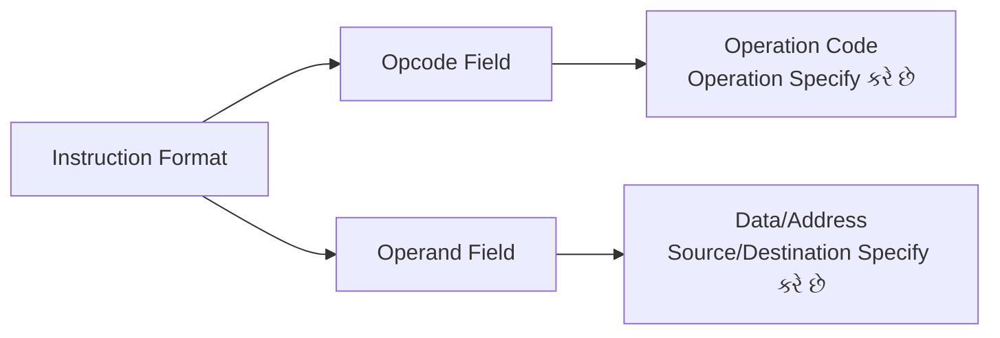
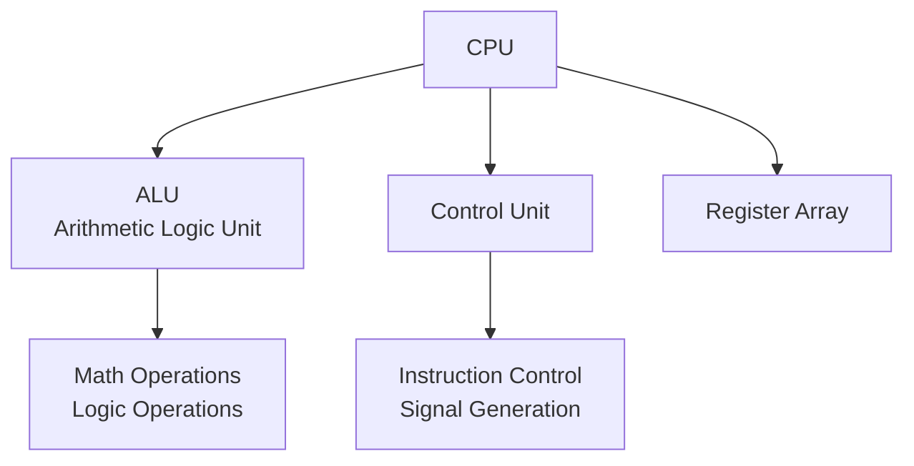
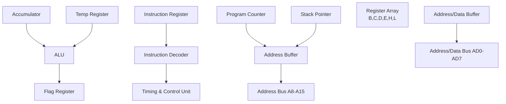
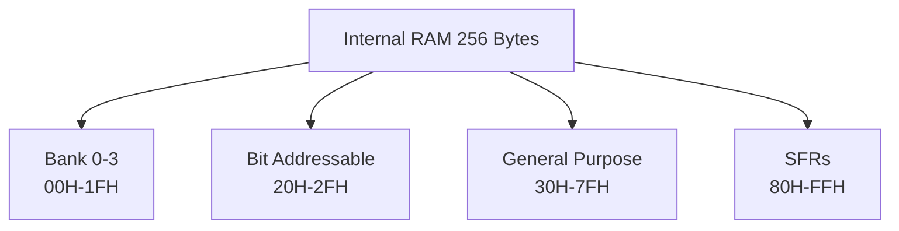
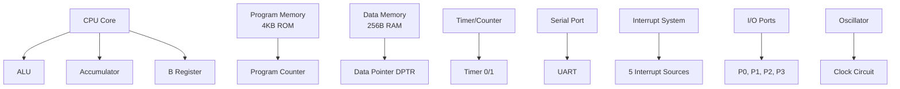
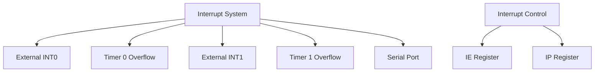
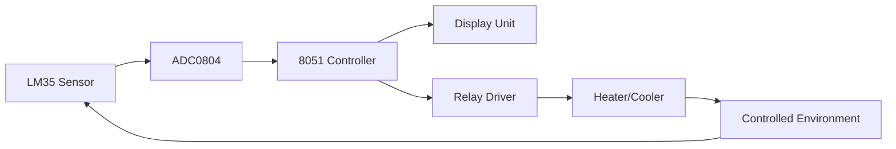

## પ્રશ્ન 1(અ) [3 ગુણ]

**માઇક્રોપ્રોસેસર ની વ્યાખ્યા આપો.**

**જવાબ:**

માઇક્રોપ્રોસેસર એ એક સિંગલ ચિપ CPU છે જેમાં digital computer ના central processing unit ના કાર્યો કરવા માટે જરૂરી બધા arithmetic, logic અને control circuits હોય છે.

**કોષ્ટક: માઇક્રોપ્રોસેસર ની મુખ્ય વિશેષતાઓ**

| વિશેષતા | વર્ણન |
|---------|-------|
| **Single Chip** | એક integrated circuit પર સંપૂર્ણ CPU |
| **Processing Unit** | instructions execute કરે છે અને calculations કરે છે |
| **Control Logic** | system operations અને data flow ને manage કરે છે |

- **Central Processing Unit**: મુખ્ય component જે instructions execute કરે છે
- **Integrated Circuit**: બધા functions એક જ silicon chip પર combined
- **Programmable Device**: stored instructions આધારે વિવિધ programs execute કરી શકે છે

**મેમરી ટ્રીક:** "Single Chip CPU = Smart Computer Processor Unit"

## પ્રશ્ન 1(બ) [4 ગુણ]

**માઇક્રોપ્રોસેસર ના ફ્લેગ રેજિસ્ટર ને સમજાવો.**

**જવાબ:**

Flag register માં ALU દ્વારા કરવામાં આવેલા arithmetic અને logical operations ના result વિશે status information store થાય છે.

**કોષ્ટક: 8085 Flag Register Bits**

| Flag | Position | હેતુ |
|------|----------|------|
| **S (Sign)** | Bit 7 | Result નું sign દશાર્વે છે (1=negative, 0=positive) |
| **Z (Zero)** | Bit 6 | Result zero હોય ત્યારે set થાય છે |
| **AC (Auxiliary Carry)** | Bit 4 | Bit 3 થી bit 4 માં carry |
| **P (Parity)** | Bit 2 | Even parity flag |
| **CY (Carry)** | Bit 0 | MSB માંથી carry |

- **Status Indicator**: છેલ્લા operation result ની condition બતાવે છે
- **Conditional Instructions**: Branching અને decision making માટે ઉપયોગ થાય છે
- **5 Active Flags**: Sign, Zero, Auxiliary Carry, Parity અને Carry flags

**મેમરી ટ્રીક:** "Flags Show Zero, Sign, Parity, Auxiliary, Carry"

## પ્રશ્ન 1(ક) [7 ગુણ]

**માઇક્રોપ્રોસેસર નું instruction format ઉદાહરણ સાથે સમજાવો.**

**જવાબ:**

Microprocessor instructions માં opcode અને operand fields હોય છે જે operation અને data locations specify કરે છે.

**કોષ્ટક: 8085 Instruction Format Types**

| Format | Size | Structure | Example |
|--------|------|-----------|---------|
| **1-Byte** | 8 bits | Opcode only | MOV A,B |
| **2-Byte** | 16 bits | Opcode + 8-bit data | MVI A,05H |
| **3-Byte** | 24 bits | Opcode + 16-bit address | LDA 2000H |

**ડાયાગ્રામ:**



- **Opcode Field**: કયું operation કરવું છે તે define કરે છે (ADD, MOV, JMP)
- **Operand Field**: Data, register અથવા memory address information હોય છે
- **Variable Length**: Instructions 1, 2 અથવા 3 bytes ની હોઈ શકે છે
- **Addressing Modes**: Operand location specify કરવાની વિવિધ રીતો

**મેમરી ટ્રીક:** "Opcode Operations + Operand Objects = Complete Commands"

## પ્રશ્ન 1(ક OR) [7 ગુણ]

**માઇક્રોપ્રોસેસરમાં ALU, Control Unit અને CPU સમજાવો.**

**જવાબ:**

CPU માં ત્રણ મુખ્ય functional units છે જે instructions execute કરવા માટે સાથે મળીને કામ કરે છે.

**કોષ્ટક: CPU Components અને Functions**

| Component | Primary Function | Key Operations |
|-----------|------------------|----------------|
| **ALU** | Arithmetic & Logic Operations | ADD, SUB, AND, OR, XOR |
| **Control Unit** | Instruction Control | Fetch, Decode, Execute |
| **CPU** | Overall Processing | બધા operations coordinate કરે છે |

**ડાયાગ્રામ:**



- **ALU Functions**: બધા arithmetic calculations અને logical operations કરે છે
- **Control Unit Tasks**: Instruction execution cycle manage કરે છે અને control signals generate કરે છે
- **CPU Coordination**: Complete processing માટે ALU અને Control Unit ને integrate કરે છે

**મેમરી ટ્રીક:** "ALU Adds, Control Commands, CPU Coordinates"

## પ્રશ્ન 2(અ) [3 ગુણ]

**ALE signal નું કાર્ય સમજાવો.**

**જવાબ:**

ALE (Address Latch Enable) signal નો ઉપયોગ lower-order address અને data lines ને demultiplex કરવા માટે થાય છે.

**કોષ્ટક: ALE Signal Functions**

| Function | વર્ણન |
|----------|-------|
| **Address Latching** | Lower 8-bit address capture કરે છે |
| **Demultiplexing** | Address ને data થી separate કરે છે |
| **Timing Control** | Timing reference પ્રદાન કરે છે |

**ડાયાગ્રામ:**

```goat
    +--------+     ALE     +--------+
    |  8085  |------------>| Latch  |
    |        |             | 74373  |
    | AD0-7  |<----------->|        |
    +--------+             +--------+
                               |
                           A0-A7 (Address)
```

- **Active High Signal**: T1 state દરમિયાન ALE high જાય છે
- **External Latching**: Address hold કરવા માટે 74373 latch સાથે ઉપયોગ થાય છે
- **System Timing**: External devices માટે reference પ્રદાન કરે છે

**મેમરી ટ્રીક:** "ALE Always Latches External Addresses"

## પ્રશ્ન 2(બ) [4 ગુણ]

**માઇક્રોપ્રોસેસર અને માઇક્રોકંટ્રોલર ની સરખામણી કરો**

**જવાબ:**

**કોષ્ટક: Microprocessor vs Microcontroller Comparison**

| Parameter | Microprocessor | Microcontroller |
|-----------|----------------|-----------------|
| **Design** | General purpose | Application specific |
| **Memory** | External RAM/ROM | Internal RAM/ROM |
| **I/O Ports** | External interface | Built-in I/O ports |
| **Timers** | External | Built-in timers |
| **Cost** | વધુ system cost | ઓછો system cost |
| **Power** | વધુ consumption | ઓછો consumption |

- **Integration Level**: Microcontroller માં વધુ integrated components હોય છે
- **Application Focus**: Microprocessor computing માટે, microcontroller control માટે
- **System Complexity**: Microprocessor ને વધુ external components જોઈએ છે
- **Design Flexibility**: Microprocessor વધુ expandability આપે છે

**મેમરી ટ્રીક:** "Microprocessor = More Power, Microcontroller = More Control"

## પ્રશ્ન 2(ક) [7 ગુણ]

**માઇક્રોપ્રોસેસરનો બ્લોક ડાયાગ્રામ દોરો અને સમજાવો.**

**જવાબ:**

8085 microprocessor માં કેટલાક functional blocks છે જે સાથે મળીને કામ કરે છે.

**ડાયાગ્રામ:**



**કોષ્ટક: Block Functions**

| Block | Function |
|-------|----------|
| **ALU** | Arithmetic અને logical operations |
| **Register Array** | Temporary data storage (B,C,D,E,H,L) |
| **Control Unit** | Instruction execution control |
| **Address Buffer** | Address bus lines drive કરે છે |

- **Data Path**: Internal bus દ્વારા registers વચ્ચે information flow થાય છે
- **Control Signals**: Timing અને control unit દ્વારા generate થાય છે
- **Bus Interface**: External memory અને I/O devices સાથે connect કરે છે
- **Register Operations**: Operands અને results માટે temporary storage

**મેમરી ટ્રીક:** "Blocks Build Better Processing Systems"

## પ્રશ્ન 2(અ OR) [3 ગુણ]

**માઇક્રોપ્રોસેસરના 16 bits registers સમજાવો.**

**જવાબ:**

8085 માં 8-bit register pairs ને combine કરીને બનેલા ત્રણ 16-bit registers છે.

**કોષ્ટક: 16-bit Registers**

| Register | Formation | Purpose |
|----------|-----------|---------|
| **PC** | Single 16-bit | Program Counter - next instruction address |
| **SP** | Single 16-bit | Stack Pointer - stack ના top નું address |
| **HL** | H + L registers | Memory pointer - data address |

- **Program Counter**: આપમેળે next instruction પર increment થાય છે
- **Stack Pointer**: Stack પર last pushed data તરફ point કરે છે
- **HL Pair**: Memory addressing માટે સૌથી વધુ વપરાતું

**મેમરી ટ્રીક:** "PC Points Program, SP Stacks Properly, HL Holds Location"

## પ્રશ્ન 2(બ OR) [4 ગુણ]

**માઇક્રોપ્રોસેસર માં lower order address અને data lines ને de-multiplexing કરવાનું સમજાવો.**

**જવાબ:**

8085 pin count ઘટાડવા માટે lower 8-bit address ને data lines સાથે multiplex કરે છે.

**કોષ્ટક: Multiplexed Lines**

| Lines | T1 State | T2-T4 States |
|-------|----------|--------------|
| **AD0-AD7** | Lower Address A0-A7 | Data D0-D7 |
| **ALE Signal** | High | Low |

**ડાયાગ્રામ:**

```goat
           8085
    +----------------+
    |                | ALE
    |      AD0-AD7   |---->+
    |                |     |
    +----------------+     |
            |              |
            |         +----v----+
            +-------->| 74373   |
                      | Latch   |
                      +---------+
                           |
                       A0-A7
```

- **Time Division**: સમાન lines પહેલા address પછી data carry કરે છે
- **External Latch**: ALE high હોય ત્યારે 74373 address capture કરે છે
- **Signal Separation**: અલગ address અને data buses બનાવે છે

**મેમરી ટ્રીક:** "ALE Always Latches External Address Elegantly"

## પ્રશ્ન 2(ક OR) [7 ગુણ]

**8085 નો pin diagram દોરો અને સમજાવો.**

**જવાબ:**

8085 એ multiplexed address/data bus વાળું 40-pin microprocessor છે.

**ડાયાગ્રામ:**

```goat
        8085 Pin Diagram
    +-------------------+
X1  |1               40| Vcc
X2  |2               39| HOLD
RST |3               38| HLDA  
SOD |4               37| CLK
SID |5               36| RESET
TRAP|6               35| READY
RST7|7               34| IO/M*
RST6|8               33| S1
RST5|9               32| RD*
INTR|10              31| WR*
INTA|11              30| ALE
AD0 |12              29| S0
AD1 |13              28| A15
AD2 |14              27| A14
AD3 |15              26| A13
AD4 |16              25| A12
AD5 |17              24| A11
AD6 |18              23| A10
AD7 |19              22| A9
Vss |20              21| A8
    +-------------------+
```

**કોષ્ટક: Pin Groups**

| Group | Pins | Function |
|-------|------|----------|
| **Address/Data** | AD0-AD7, A8-A15 | Memory addressing અને data transfer |
| **Control** | ALE, RD*, WR*, IO/M* | Bus control signals |
| **Interrupts** | INTR, RST7-RST5, TRAP | Interrupt handling |
| **Power** | Vcc, Vss | Power supply connections |

- **Multiplexed Bus**: AD0-AD7 address અને data બંને carry કરે છે
- **Active Low Signals**: * વાળા signals active low છે
- **Crystal Connections**: Clock generation માટે X1, X2

**મેમરી ટ્રીક:** "Forty Pins Provide Perfect Processing Power"

## પ્રશ્ન 3(અ) [3 ગુણ]

**માઇક્રોકંટ્રોલર ની clock અને reset circuit નો diagram દોરો**

**જવાબ:**

8051 ને proper operation માટે external clock અને reset circuits જોઈએ છે.

**ડાયાગ્રામ:**

```goat
Clock Circuit:
    +12MHz Crystal
    |
XTAL1 +---||---+ XTAL2
      |       |
     30pF    30pF
      |       |
     GND     GND

Reset Circuit:
     +5V
      |
     10K
      |
RST --+---||---GND
          10µF
```

**કોષ્ટક: Circuit Components**

| Component | Value | Purpose |
|-----------|--------|---------|
| **Crystal** | 11.0592 MHz | Clock generation |
| **Capacitors** | 30pF દરેક | Crystal stabilization |
| **Reset Resistor** | 10KΩ | Reset માટે pull-up |
| **Reset Capacitor** | 10µF | Power-on reset delay |

- **Clock Frequency**: Serial communication માટે સામાન્ય રીતે 11.0592 MHz
- **Reset Duration**: ઓછામાં ઓછા 2 machine cycles માટે high હોવું જોઈએ
- **Power-on Reset**: Power apply થાય ત્યારે automatic reset

**મેમરી ટ્રીક:** "Crystals Create Clock, Resistors Reset Reliably"

## પ્રશ્ન 3(બ) [4 ગુણ]

**માઇક્રોકંટ્રોલર ની આંતરીક RAM સમજાવો.**

**જવાબ:**

8051 માં વિવિધ sections માં organize થયેલા 256 bytes નો internal RAM છે.

**કોષ્ટક: Internal RAM Organization**

| Address Range | Size | Purpose |
|---------------|------|---------|
| **00H-1FH** | 32 bytes | Register Banks (4 banks × 8 registers) |
| **20H-2FH** | 16 bytes | Bit-addressable area |
| **30H-7FH** | 80 bytes | General purpose RAM |
| **80H-FFH** | 128 bytes | Special Function Registers (SFRs) |

**ડાયાગ્રામ:**



- **Register Banks**: દરેકમાં 8 registers (R0-R7) વાળા ચાર banks
- **Bit Addressing**: 20H-2FH area માં individual bits address કરી શકાય છે
- **Stack Area**: સામાન્ય રીતે general purpose RAM area માં હોય છે
- **Direct Access**: બધા locations direct addressing દ્વારા accessible છે

**મેમરી ટ્રીક:** "RAM Registers, Bits, General, Special Functions"

## પ્રશ્ન 3(ક) [7 ગુણ]

**8051 નો બ્લોક ડાયાગ્રામ સમજાવો.**

**જવાબ:**

8051 microcontroller એક જ chip પર CPU, memory અને I/O integrate કરે છે.

**ડાયાગ્રામ:**



**કોષ્ટક: મુખ્ય Blocks**

| Block | Function |
|-------|----------|
| **CPU** | Instruction execution અને control |
| **Memory** | 4KB ROM + 256B RAM |
| **Timers** | બે 16-bit timer/counters |
| **I/O Ports** | ચાર 8-bit bidirectional ports |
| **Serial Port** | Full-duplex UART |
| **Interrupts** | 5-source interrupt system |

- **Harvard Architecture**: અલગ program અને data memory spaces
- **Built-in Peripherals**: Timers, serial port, interrupts integrated
- **Expandable**: External memory અને I/O add કરી શકાય છે
- **Control Applications**: Embedded control tasks માટે optimized

**મેમરી ટ્રીક:** "Complete Control Chip Contains CPU, Memory, I/O"

## પ્રશ્ન 3(અ OR) [3 ગુણ]

**DPTR અને PC નું કાર્ય સમજાવો.**

**જવાબ:**

DPTR અને PC એ memory addressing માટે 8051 માં મહત્વપૂર્ણ 16-bit registers છે.

**કોષ્ટક: DPTR અને PC Functions**

| Register | Full Form | Function |
|----------|-----------|----------|
| **DPTR** | Data Pointer | External data memory તરફ point કરે છે |
| **PC** | Program Counter | Next instruction address તરફ point કરે છે |

- **DPTR Usage**: External RAM અને lookup tables access કરવા માટે
- **PC Function**: Instruction fetch પછી આપમેળે increment થાય છે
- **16-bit Addressing**: બંને 64KB memory space address કરી શકે છે

**મેમરી ટ્રીક:** "DPTR Data Pointer, PC Program Counter"

## પ્રશ્ન 3(બ OR) [4 ગુણ]

**માઇક્રોકંટ્રોલરમાં timer ના અલગ અલગ modes સમજાવો.**

**જવાબ:**

8051 માં ચાર અલગ operating modes સાથે બે timers છે.

**કોષ્ટક: Timer Modes**

| Mode | Configuration | Purpose |
|------|---------------|---------|
| **Mode 0** | 13-bit timer | 8048 સાથે compatible |
| **Mode 1** | 16-bit timer | Maximum count capability |
| **Mode 2** | 8-bit auto-reload | Constant time intervals |
| **Mode 3** | બે 8-bit timers | Timer 0 split operation |

- **Mode Selection**: TMOD register bits દ્વારા control થાય છે
- **Timer 0/1**: બંને timers modes 0, 1, 2 support કરે છે
- **Mode 3 Special**: ફક્ત Timer 0 જ mode 3 માં operate કરી શકે છે
- **Applications**: Delays, baud rate generation, event counting

**મેમરી ટ્રીક:** "Modes Make Timers Tremendously Versatile"

## પ્રશ્ન 3(ક OR) [7 ગુણ]

**માઇક્રોકંટ્રોલર ની interrupts સમજાવો.**

**જવાબ:**

8051 માં external events handle કરવા માટે 5-source interrupt system છે.

**કોષ્ટક: 8051 Interrupt Sources**

| Interrupt | Vector Address | Priority | Trigger |
|-----------|----------------|----------|---------|
| **Reset** | 0000H | સૌથી વધુ | Power-on/External |
| **External 0** | 0003H | વધુ | INT0 pin |
| **Timer 0** | 000BH | મધ્યમ | Timer 0 overflow |
| **External 1** | 0013H | મધ્યમ | INT1 pin |
| **Timer 1** | 001BH | ઓછું | Timer 1 overflow |
| **Serial** | 0023H | સૌથી ઓછું | Serial communication |

**ડાયાગ્રામ:**



- **Interrupt Enable**: IE register individual interrupt enables control કરે છે
- **Priority Control**: IP register interrupt priorities set કરે છે
- **Vector Addresses**: દરેક interrupt નું fixed vector location છે
- **Nested Interrupts**: વધુ priority ઓછી priority ને interrupt કરી શકે છે

**મેમરી ટ્રીક:** "Five Interrupt Sources Serve System Efficiently"

## પ્રશ્ન 4(અ) [3 ગુણ]

**8051 ની data transfer instruction ઉદાહરણ આપી સમજાવો.**

**જવાબ:**

Data transfer instructions registers, memory અને I/O ports વચ્ચે data move કરે છે.

**કોષ્ટક: Data Transfer Instructions**

| Instruction | Example | Function |
|-------------|---------|----------|
| **MOV** | MOV A,#55H | Immediate data ને accumulator માં move કરે છે |
| **MOVX** | MOVX A,@DPTR | External RAM ને accumulator માં move કરે છે |
| **MOVC** | MOVC A,@A+PC | Code memory ને accumulator માં move કરે છે |

- **MOV Variants**: Register to register, immediate to register
- **External Access**: External RAM operations માટે MOVX
- **Code Access**: Program memory tables read કરવા માટે MOVC

**મેમરી ટ્રીક:** "MOV Moves data, MOVX eXternal, MOVC Code"

## પ્રશ્ન 4(બ) [4 ગુણ]

**માઇક્રોકંટ્રોલરના addressing modes નું list બનાવી સમજાવો.**

**જવાબ:**

8051 flexible data access માટે કેટલાક addressing modes support કરે છે.

**કોષ્ટક: 8051 Addressing Modes**

| Mode | Example | વર્ણન |
|------|---------|-------|
| **Immediate** | MOV A,#55H | Instruction માં data specify કર્યો છે |
| **Register** | MOV A,R0 | Register contents ઉપયોગ કરે છે |
| **Direct** | MOV A,30H | Direct memory address |
| **Indirect** | MOV A,@R0 | Register માં stored address |
| **Indexed** | MOVC A,@A+DPTR | Base address plus offset |

- **Immediate Mode**: Instruction માં constant data included છે
- **Register Mode**: Register file ઉપયોગ કરીને સૌથી ઝડપી execution
- **Direct Mode**: કોઈપણ internal RAM location access કરે છે
- **Indirect Mode**: Arrays માટે pointer-based addressing
- **Indexed Mode**: Table lookup અને array access

**મેમરી ટ્રીક:** "Immediate, Register, Direct, Indirect, Indexed Addressing"

## પ્રશ્ન 4(ક) [7 ગુણ]

**8 data block ને શરુઆત ના address location 100h થી 200h માં copy કરવાનો program લખો.**

**જવાબ:**

**Assembly Program:**

```assembly
ORG 0000H           ; Start address
MOV R0,#100H        ; Source address pointer
MOV R1,#200H        ; Destination address pointer  
MOV R2,#08H         ; 8 bytes માટે counter

LOOP:
MOV A,@R0           ; Source માંથી data read કરો
MOV @R1,A           ; Destination માં data write કરો
INC R0              ; Source pointer increment કરો
INC R1              ; Destination pointer increment કરો
DJNZ R2,LOOP        ; Counter decrement કરો અને zero નથી તો jump

END                 ; Program નો end
```

**કોષ્ટક: Register Usage**

| Register | Purpose |
|----------|---------|
| **R0** | Source address pointer (100H) |
| **R1** | Destination address pointer (200H) |
| **R2** | Loop counter (8 bytes) |
| **A** | Temporary data storage |

- **Indirect Addressing**: Memory access માટે @R0 અને @R1
- **Loop Control**: DJNZ instruction decrements અને tests કરે છે
- **Block Transfer**: 8 consecutive bytes efficiently copy કરે છે

**મેમરી ટ્રીક:** "Read, Write, Increment, Decrement, Jump Loop"

## પ્રશ્ન 4(અ OR) [3 ગુણ]

**બે data bytes ને ઉમેરો અને result ને R0 register માં save કરો.**

**જવાબ:**

**Assembly Program:**

```assembly
ORG 0000H           ; Start address
MOV A,#25H          ; પ્રથમ byte load કરો
ADD A,#35H          ; બીજો byte add કરો
MOV R0,A            ; Result ને R0 માં store કરો
END                 ; Program end
```

**કોષ્ટક: Operation Steps**

| Step | Instruction | Result |
|------|-------------|---------|
| 1 | MOV A,#25H | A = 25H |
| 2 | ADD A,#35H | A = 5AH |
| 3 | MOV R0,A | R0 = 5AH |

- **Addition Result**: 25H + 35H = 5AH
- **Flag Effects**: Result > FFH હોય તો carry flag set થાય છે

**મેમરી ટ્રીક:** "Move, Add, Move = Simple Addition"

## પ્રશ્ન 4(બ OR) [4 ગુણ]

**Indexed addressing mode ઉદાહરણ સાથે સમજાવો.**

**જવાબ:**

Indexed addressing memory access માટે base address plus offset ઉપયોગ કરે છે.

**કોષ્ટક: Indexed Addressing Details**

| Component | વર્ણન | Example |
|-----------|-------|---------|
| **Base Address** | DPTR અથવા PC register | DPTR = 1000H |
| **Index** | Accumulator contents | A = 05H |
| **Effective Address** | Base + Index | 1000H + 05H = 1005H |

**Example:**

```assembly
MOV DPTR,#1000H     ; Base address
MOV A,#05H          ; Index value
MOVC A,@A+DPTR      ; Address 1005H માંથી read કરો
```

- **Table Access**: Lookup tables અને arrays માટે આદર્શ
- **Program Memory**: MOVC ફક્ત code memory માંથી જ read કરે છે
- **Dynamic Indexing**: Execution દરમિયાન index બદલાઈ શકે છે

**મેમરી ટ્રીક:** "Base + Index = Dynamic Access"

## પ્રશ્ન 4(ક OR) [7 ગુણ]

**માઇક્રોકંટ્રોલરનું stack operation, PUSH અને POP instruction સમજાવો.**

**જવાબ:**

Stack એ temporary data storage માટે ઉપયોગમાં લેવાતું LIFO memory structure છે.

**કોષ્ટક: Stack Operations**

| Operation | Instruction | Function |
|-----------|-------------|----------|
| **PUSH** | PUSH 30H | Stack પર data store કરે છે |
| **POP** | POP 30H | Stack માંથી data retrieve કરે છે |
| **Stack Pointer** | SP register | Stack ના top તરફ point કરે છે |

**ડાયાગ્રામ:**

```goat
Stack Operation:
    
PUSH પહેલાં:        PUSH 30H પછી:      POP 30H પછી:
SP → 07H            SP → 08H           SP → 07H
     06H                 08H: 30H           06H
     05H                 07H: old           05H
     
Stack memory માં upward grow કરે છે
```

**Example Program:**

```assembly
MOV SP,#30H         ; Stack pointer initialize કરો
PUSH ACC            ; Accumulator save કરો
PUSH B              ; B register save કરો
POP B               ; B register restore કરો
POP ACC             ; Accumulator restore કરો
```

- **LIFO Structure**: Last In, First Out data organization
- **SP Auto-increment**: Stack pointer આપમેળે adjust થાય છે
- **Subroutine Calls**: Stack return addresses save કરે છે
- **Register Preservation**: Register contents save/restore કરે છે

**મેમરી ટ્રીક:** "PUSH Puts Up, Stack Holds, POP Pulls Out"

## પ્રશ્ન 5(અ) [3 ગુણ]

**Branching instruction ઉદાહરણ સાથે સમજાવો.**

**જવાબ:**

Branching instructions conditions આધારે અથવા unconditionally program flow alter કરે છે.

**કોષ્ટક: Branching Instructions**

| Type | Instruction | Example |
|------|-------------|---------|
| **Unconditional** | LJMP address | LJMP 2000H |
| **Conditional** | JZ address | JZ ZERO_LABEL |
| **Call/Return** | LCALL address | LCALL SUBROUTINE |

**Example:**

```assembly
MOV A,#00H          ; Zero load કરો
JZ ZERO_FOUND       ; A zero છે તો jump કરો
LJMP CONTINUE       ; Continue તરફ jump કરો
ZERO_FOUND:
    MOV R0,#01H     ; Flag set કરો
CONTINUE:
    NOP             ; Execution continue કરો
```

- **Program Control**: Execution sequence બદલે છે
- **Conditional Jumps**: Flag register status આધારે
- **Address Range**: કોઈપણ program memory location પર jump કરી શકે છે

**મેમરી ટ્રીક:** "Jump Changes Control Flow"

## પ્રશ્ન 5(બ) [4 ગુણ]

**માઇક્રોકંટ્રોલર સાથે 8 LEDs ને interface કરો અને તેને on અને off કરવા માટેનો program લખો.**

**જવાબ:**

**Circuit Diagram:**

```goat
8051        LEDs
P1.0 ----[330Ω]----LED1----+5V
P1.1 ----[330Ω]----LED2----+5V  
P1.2 ----[330Ω]----LED3----+5V
P1.3 ----[330Ω]----LED4----+5V
P1.4 ----[330Ω]----LED5----+5V
P1.5 ----[330Ω]----LED6----+5V
P1.6 ----[330Ω]----LED7----+5V
P1.7 ----[330Ω]----LED8----+5V
```

**Program:**

```assembly
ORG 0000H
MAIN:
    MOV P1,#0FFH        ; બધા LEDs ON કરો
    CALL DELAY          ; Wait કરો
    MOV P1,#00H         ; બધા LEDs OFF કરો  
    CALL DELAY          ; Wait કરો
    SJMP MAIN           ; Repeat કરો

DELAY:
    MOV R0,#0FFH        ; Outer loop counter
LOOP1:
    MOV R1,#0FFH        ; Inner loop counter  
LOOP2:
    DJNZ R1,LOOP2       ; Inner delay loop
    DJNZ R0,LOOP1       ; Outer delay loop
    RET                 ; Return કરો
END
```

**કોષ્ટક: Components**

| Component | Value | Purpose |
|-----------|-------|---------|
| **Resistor** | 330Ω | Current limiting |
| **LEDs** | 8 pieces | Visual indicators |
| **Port** | P1 | 8-bit output port |

- **Current Limiting**: Resistors LEDs ને overcurrent થી protect કરે છે
- **Port Configuration**: LED control માટે P1 ને output port તરીકે ઉપયોગ
- **Delay Routine**: Visible ON/OFF timing બનાવે છે

**મેમરી ટ્રીક:** "Port Controls LEDs with Resistance and Delay"

## પ્રશ્ન 5(ક) [7 ગુણ]

**માઇક્રોકંટ્રોલર સાથે LCD ને interface કરો અને "welcome" display કરવાનો program લખો.**

**જવાબ:**

**Circuit Connections:**

```goat
8051        16x2 LCD
P2.0 --------> D4
P2.1 --------> D5  
P2.2 --------> D6
P2.3 --------> D7
P1.0 --------> RS (Register Select)
P1.1 --------> EN (Enable)
GND  --------> R/W (Write mode)
```

**Program:**

```assembly
ORG 0000H
    CALL LCD_INIT       ; LCD initialize કરો
    CALL DISPLAY_MSG    ; Message display કરો
    SJMP $              ; અહીં stop કરો

LCD_INIT:
    MOV P2,#38H         ; Function set: 8-bit, 2-line
    CALL COMMAND
    MOV P2,#0EH         ; Display ON, Cursor ON
    CALL COMMAND  
    MOV P2,#01H         ; Display clear કરો
    CALL COMMAND
    MOV P2,#06H         ; Entry mode set
    CALL COMMAND
    RET

DISPLAY_MSG:
    MOV DPTR,#MESSAGE   ; Message તરફ point કરો
NEXT_CHAR:
    CLR A
    MOVC A,@A+DPTR      ; Character read કરો
    JZ DONE             ; Zero હોય તો string end
    CALL SEND_CHAR      ; LCD પર character send કરો
    INC DPTR            ; Next character
    SJMP NEXT_CHAR
DONE:
    RET

COMMAND:
    CLR P1.0            ; Command માટે RS = 0
    SETB P1.1           ; EN = 1
    CLR P1.1            ; EN = 0 (pulse)
    CALL DELAY
    RET

SEND_CHAR:
    MOV P2,A            ; Data lines પર character put કરો
    SETB P1.0           ; Data માટે RS = 1
    SETB P1.1           ; EN = 1
    CLR P1.1            ; EN = 0 (pulse)
    CALL DELAY
    RET

DELAY:
    MOV R0,#50          ; Delay routine
DELAY_LOOP:
    MOV R1,#255
DELAY_INNER:
    DJNZ R1,DELAY_INNER
    DJNZ R0,DELAY_LOOP
    RET

MESSAGE:
    DB "WELCOME",0       ; Null terminator સાથે message string
END
```

**કોષ્ટક: LCD Interface Pins**

| 8051 Pin | LCD Pin | Function |
|----------|---------|----------|
| **P2.0-P2.3** | D4-D7 | 4-bit data lines |
| **P1.0** | RS | Register select (0=command, 1=data) |
| **P1.1** | EN | Enable pulse |
| **GND** | R/W | Read/Write (write માટે ground સાથે tied) |

- **4-bit Mode**: Pins save કરવા માટે ફક્ત upper 4 data lines ઉપયોગ કરે છે
- **Control Signals**: RS command/data select કરે છે, EN timing pulse આપે છે
- **Character Display**: દરેક character ASCII code તરીકે send થાય છે
- **Initialization**: Proper operation માટે જરૂરી command sequence

**મેમરી ટ્રીક:** "LCD Displays Characters with Commands and Data"

## પ્રશ્ન 5(અ OR) [3 ગુણ]

**Logical instruction ઉદાહરણ સાથે સમજાવો.**

**જવાબ:**

Logical instructions data પર bitwise operations કરે છે.

**કોષ્ટક: Logical Instructions**

| Instruction | Example | Function |
|-------------|---------|----------|
| **ANL** | ANL A,#0FH | Bitwise AND operation |
| **ORL** | ORL A,#F0H | Bitwise OR operation |
| **XRL** | XRL A,#FFH | Bitwise XOR operation |

**Example:**

```assembly
MOV A,#55H          ; A = 01010101B
ANL A,#0FH          ; A = 00000101B (upper bits mask કરો)
ORL A,#F0H          ; A = 11110101B (upper bits set કરો)
XRL A,#FFH          ; A = 00001010B (બધા bits complement કરો)
```

- **Bit Manipulation**: Bits setting, clearing અને testing માટે ઉપયોગ થાય છે
- **Masking Operations**: ANL unwanted bits clear કરે છે
- **Flag Effects**: Result આધારે parity flag update થાય છે

**મેમરી ટ્રીક:** "AND Masks, OR Sets, XOR Toggles"

## પ્રશ્ન 5(બ OR) [4 ગુણ]

**માઇક્રોકંટ્રોલર સાથે 7 segment ને interface કરો.**

**જવાબ:**

**Circuit Diagram:**

```goat
8051          7-Segment Display
P1.0 ----[330Ω]----a
P1.1 ----[330Ω]----b  
P1.2 ----[330Ω]----c
P1.3 ----[330Ω]----d
P1.4 ----[330Ω]----e
P1.5 ----[330Ω]----f
P1.6 ----[330Ω]----g
P1.7 ----[330Ω]----dp (decimal point)
```

**Program to Display 0-9:**

```assembly
ORG 0000H
    MOV DPTR,#DIGIT_TABLE   ; Lookup table તરફ point કરો
    MOV R0,#0               ; Digit 0 થી start કરો

MAIN_LOOP:
    MOV A,R0                ; Current digit get કરો
    MOVC A,@A+DPTR          ; 7-segment code get કરો
    MOV P1,A                ; 7-segment પર display કરો
    CALL DELAY              ; 1 second wait કરો
    INC R0                  ; Next digit
    CJNE R0,#10,MAIN_LOOP   ; 10 reached છે કે check કરો
    MOV R0,#0               ; 0 પર reset કરો
    SJMP MAIN_LOOP          ; Repeat કરો

DIGIT_TABLE:
    DB 3FH, 06H, 5BH, 4FH, 66H    ; 0,1,2,3,4
    DB 6DH, 7DH, 07H, 7FH, 6FH    ; 5,6,7,8,9
END
```

**કોષ્ટક: 7-Segment Codes**

| Digit | Hex Code | Binary | Segments Lit |
|-------|----------|--------|--------------|
| **0** | 3FH | 00111111 | a,b,c,d,e,f |
| **1** | 06H | 00000110 | b,c |
| **2** | 5BH | 01011011 | a,b,g,e,d |

- **Common Cathode**: Port pin high હોય ત્યારે segments light થાય છે
- **Current Limiting**: Resistors segment damage અટકાવે છે
- **Lookup Table**: Segment patterns નું efficient storage

**મેમરી ટ્રીક:** "Seven Segments Show Digits Clearly"

## પ્રશ્ન 5(ક OR) [7 ગુણ]

**માઇક્રોકંટ્રોલર સાથે LM 35 ને interface કરો અને temperature controller નો block diagram સમજાવો.**

**જવાબ:**

**Circuit Diagram:**

```goat
LM35 Temperature Sensor Interface:

+5V ----+---- LM35 ----+---- ADC0804 ----+---- 8051
        |     (Vout)   |     (Vin)       |     (P1)
       GND             |                 |
                      GND                |
                                         |
Relay Control:                           |
8051 P3.0 ----[ULN2003]---- Relay -------+
                                         |
                                    Load (Heater/Fan)
```

**Temperature Controller Block Diagram:**



**Control Program:**

```assembly
ORG 0000H
MAIN:
    CALL READ_TEMP      ; ADC માંથી temperature read કરો
    CALL DISPLAY_TEMP   ; Display પર temperature show કરો
    CALL TEMP_CONTROL   ; Heating/cooling control કરો
    CALL DELAY          ; Next reading પહેલાં wait કરો
    SJMP MAIN

READ_TEMP:
    CLR P2.0            ; ADC conversion start કરો
    SETB P2.0           ; Start માટે pulse
    JNB P2.1,$          ; Conversion complete થવાની wait કરો
    MOV A,P1            ; Temperature data read કરો
    RET

TEMP_CONTROL:
    CJNE A,#30,CHECK_HIGH   ; Setpoint (30°C) સાથે compare કરો
CHECK_HIGH:
    JC TEMP_LOW             ; A < 30 હોય તો temperature low છે
    SETB P3.0               ; Cooling (fan) ON કરો
    CLR P3.1                ; Heating OFF કરો
    RET
TEMP_LOW:
    CLR P3.0                ; Cooling OFF કરો
    SETB P3.1               ; Heating ON કરો
    RET
END
```

**કોષ્ટક: System Components**

| Component | Function |
|-----------|----------|
| **LM35** | Temperature sensor (10mV/°C) |
| **ADC0804** | Analog to digital converter |
| **8051** | Main controller |
| **Relay** | High power loads switch કરે છે |
| **Display** | Current temperature show કરે છે |

- **Temperature Sensing**: LM35 દરેક degree Celsius માટે 10mV આપે છે
- **ADC Conversion**: Analog voltage ને digital value માં convert કરે છે
- **Control Logic**: Setpoint સાથે compare કરે છે અને relays control કરે છે
- **Feedback System**: Continuous monitoring અને adjustment
- **Safety Features**: Over-temperature protection શક્ય છે

**મેમરી ટ્રીક:** "Sense, Convert, Compare, Control Temperature Automatically"
