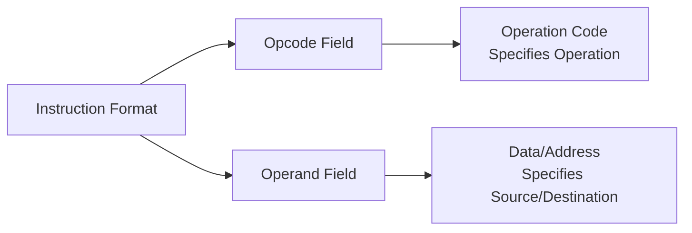
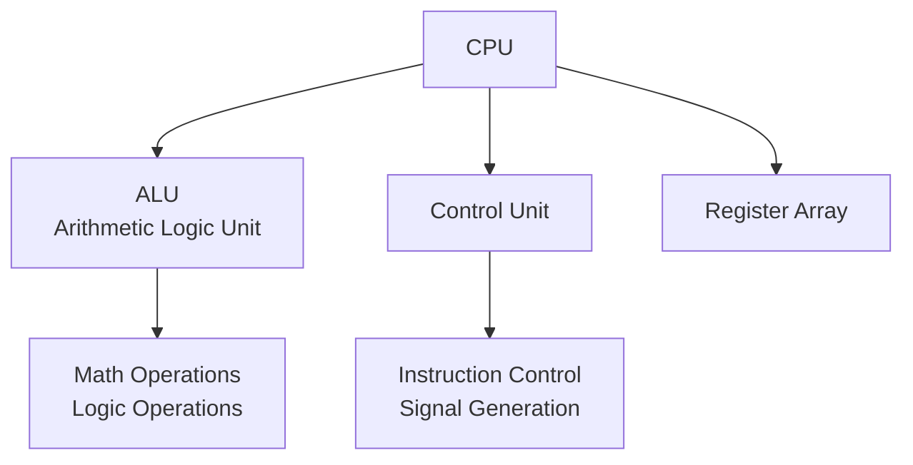
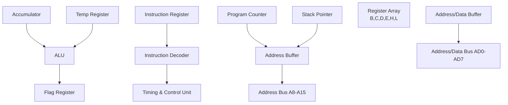
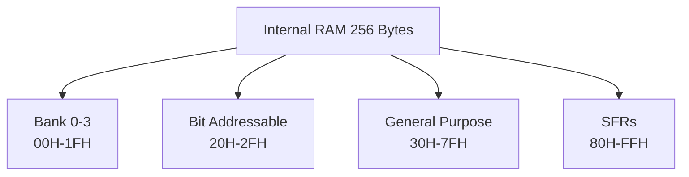
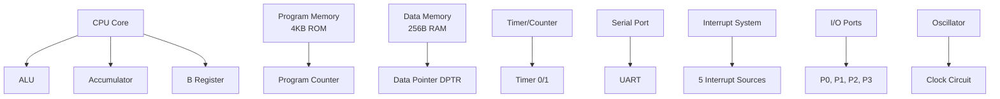
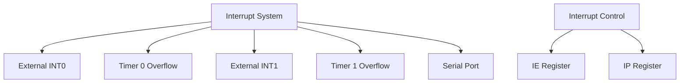
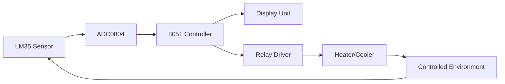

## Question 1(a) [3 marks]

**Define Microprocessor.**

**Answer:**

A microprocessor is a single-chip CPU that contains all the arithmetic, logic, and control circuitry required to perform the functions of a digital computer's central processing unit.

**Table: Microprocessor Key Features**

| Feature | Description |
|---------|-------------|
| **Single Chip** | Complete CPU on one integrated circuit |
| **Processing Unit** | Executes instructions and performs calculations |
| **Control Logic** | Manages system operations and data flow |

- **Central Processing Unit**: Core component that executes instructions
- **Integrated Circuit**: All functions combined on single silicon chip
- **Programmable Device**: Can execute different programs based on stored instructions

**Mnemonic:** "Single Chip CPU = Smart Computer Processor Unit"

## Question 1(b) [4 marks]

**Explain Flag register of microprocessor.**

**Answer:**

The Flag register stores status information about the result of arithmetic and logical operations performed by the ALU.

**Table: 8085 Flag Register Bits**

| Flag | Position | Purpose |
|------|----------|---------|
| **S (Sign)** | Bit 7 | Indicates sign of result (1=negative, 0=positive) |
| **Z (Zero)** | Bit 6 | Set when result is zero |
| **AC (Auxiliary Carry)** | Bit 4 | Carry from bit 3 to bit 4 |
| **P (Parity)** | Bit 2 | Even parity flag |
| **CY (Carry)** | Bit 0 | Carry from MSB |

- **Status Indicator**: Shows condition of last operation result  
- **Conditional Instructions**: Used for branching and decision making
- **5 Active Flags**: Sign, Zero, Auxiliary Carry, Parity, and Carry flags

**Mnemonic:** "Flags Show Zero, Sign, Parity, Auxiliary, Carry"

## Question 1(c) [7 marks]

**Explain format of instruction of microprocessor with example.**

**Answer:**

Microprocessor instructions consist of opcode and operand fields that specify the operation and data locations.

**Table: 8085 Instruction Format Types**

| Format | Size | Structure | Example |
|--------|------|-----------|---------|
| **1-Byte** | 8 bits | Opcode only | MOV A,B |
| **2-Byte** | 16 bits | Opcode + 8-bit data | MVI A,05H |
| **3-Byte** | 24 bits | Opcode + 16-bit address | LDA 2000H |

**Diagram:**



- **Opcode Field**: Defines the operation to be performed (ADD, MOV, JMP)
- **Operand Field**: Contains data, register, or memory address information
- **Variable Length**: Instructions can be 1, 2, or 3 bytes long
- **Addressing Modes**: Different ways to specify operand location

**Mnemonic:** "Opcode Operations + Operand Objects = Complete Commands"

## Question 1(c OR) [7 marks]

**Explain function of ALU, Control Unit and CPU of Microprocessor.**

**Answer:**

The CPU consists of three main functional units that work together to execute instructions.

**Table: CPU Components and Functions**

| Component | Primary Function | Key Operations |
|-----------|------------------|----------------|
| **ALU** | Arithmetic & Logic Operations | ADD, SUB, AND, OR, XOR |
| **Control Unit** | Instruction Control | Fetch, Decode, Execute |
| **CPU** | Overall Processing | Coordinate all operations |

**Diagram:**



- **ALU Functions**: Performs all arithmetic calculations and logical operations
- **Control Unit Tasks**: Manages instruction execution cycle and generates control signals
- **CPU Coordination**: Integrates ALU and Control Unit for complete processing

**Mnemonic:** "ALU Adds, Control Commands, CPU Coordinates"

## Question 2(a) [3 marks]

**Explain function of ALE signal with diagram.**

**Answer:**

ALE (Address Latch Enable) signal is used to demultiplex the lower-order address and data lines.

**Table: ALE Signal Functions**

| Function | Description |
|----------|-------------|
| **Address Latching** | Captures lower 8-bit address |
| **Demultiplexing** | Separates address from data |
| **Timing Control** | Provides timing reference |

**Diagram:**

```goat
    +--------+     ALE     +--------+
    |  8085  |------------>| Latch  |
    |        |             | 74373  |
    | AD0-7  |<----------->|        |
    +--------+             +--------+
                               |
                           A0-A7 (Address)
```

- **Active High Signal**: ALE goes high during T1 state
- **External Latching**: Used with 74373 latch to hold address
- **System Timing**: Provides reference for external devices

**Mnemonic:** "ALE Always Latches External Addresses"

## Question 2(b) [4 marks]

**Compare microprocessor and microcontroller**

**Answer:**

**Table: Microprocessor vs Microcontroller Comparison**

| Parameter | Microprocessor | Microcontroller |
|-----------|----------------|-----------------|
| **Design** | General purpose | Application specific |
| **Memory** | External RAM/ROM | Internal RAM/ROM |
| **I/O Ports** | External interface | Built-in I/O ports |
| **Timers** | External | Built-in timers |
| **Cost** | Higher system cost | Lower system cost |
| **Power** | Higher consumption | Lower consumption |

- **Integration Level**: Microcontroller has more integrated components
- **Application Focus**: Microprocessor for computing, microcontroller for control
- **System Complexity**: Microprocessor needs more external components
- **Design Flexibility**: Microprocessor offers more expandability

**Mnemonic:** "Microprocessor = More Power, Microcontroller = More Control"

## Question 2(c) [7 marks]

**Draw & explain block diagram of microprocessor.**

**Answer:**

The 8085 microprocessor consists of several functional blocks that work together.

**Diagram:**



**Table: Block Functions**

| Block | Function |
|-------|----------|
| **ALU** | Arithmetic and logical operations |
| **Register Array** | Temporary data storage (B,C,D,E,H,L) |
| **Control Unit** | Instruction execution control |
| **Address Buffer** | Drive address bus lines |

- **Data Path**: Information flows between registers through internal bus
- **Control Signals**: Generated by timing and control unit  
- **Bus Interface**: Connects to external memory and I/O devices
- **Register Operations**: Temporary storage for operands and results

**Mnemonic:** "Blocks Build Better Processing Systems"

## Question 2(a OR) [3 marks]

**Explain 16 bits registers of microprocessor.**

**Answer:**

The 8085 has three 16-bit registers formed by combining 8-bit register pairs.

**Table: 16-bit Registers**

| Register | Formation | Purpose |
|----------|-----------|---------|
| **PC** | Single 16-bit | Program Counter - next instruction address |
| **SP** | Single 16-bit | Stack Pointer - top of stack address |
| **HL** | H + L registers | Memory pointer - data address |

- **Program Counter**: Automatically increments to next instruction
- **Stack Pointer**: Points to last pushed data on stack  
- **HL Pair**: Most frequently used for memory addressing

**Mnemonic:** "PC Points Program, SP Stacks Properly, HL Holds Location"

## Question 2(b OR) [4 marks]

**Explain de-multiplexing lower order address and data lines with diagram of microprocessor.**

**Answer:**

The 8085 multiplexes lower 8-bit address with data lines to reduce pin count.

**Table: Multiplexed Lines**

| Lines | T1 State | T2-T4 States |
|-------|----------|--------------|
| **AD0-AD7** | Lower Address A0-A7 | Data D0-D7 |
| **ALE Signal** | High | Low |

**Diagram:**

```goat
           8085
    +----------------+
    |                | ALE
    |      AD0-AD7   |---->+
    |                |     |
    +----------------+     |
            |              |
            |         +----v----+
            +-------->| 74373   |
                      | Latch   |
                      +---------+
                           |
                       A0-A7
```

- **Time Division**: Same lines carry address then data
- **External Latch**: 74373 captures address when ALE is high
- **Signal Separation**: Creates separate address and data buses

**Mnemonic:** "ALE Always Latches External Address Elegantly"

## Question 2(c OR) [7 marks]

**Draw and explain pin diagram of 8085.**

**Answer:**

The 8085 is a 40-pin microprocessor with multiplexed address/data bus.

**Diagram:**

```goat
        8085 Pin Diagram
    +-------------------+
X1  |1               40| Vcc
X2  |2               39| HOLD
RST |3               38| HLDA  
SOD |4               37| CLK
SID |5               36| RESET
TRAP|6               35| READY
RST7|7               34| IO/M*
RST6|8               33| S1
RST5|9               32| RD*
INTR|10              31| WR*
INTA|11              30| ALE
AD0 |12              29| S0
AD1 |13              28| A15
AD2 |14              27| A14
AD3 |15              26| A13
AD4 |16              25| A12
AD5 |17              24| A11
AD6 |18              23| A10
AD7 |19              22| A9
Vss |20              21| A8
    +-------------------+
```

**Table: Pin Groups**

| Group | Pins | Function |
|-------|------|----------|
| **Address/Data** | AD0-AD7, A8-A15 | Memory addressing and data transfer |
| **Control** | ALE, RD*, WR*, IO/M* | Bus control signals |
| **Interrupts** | INTR, RST7-RST5, TRAP | Interrupt handling |
| **Power** | Vcc, Vss | Power supply connections |

- **Multiplexed Bus**: AD0-AD7 carry both address and data
- **Active Low Signals**: Signals with * are active low
- **Crystal Connections**: X1, X2 for clock generation

**Mnemonic:** "Forty Pins Provide Perfect Processing Power"

## Question 3(a) [3 marks]

**Draw clock and reset circuit of microcontroller**

**Answer:**

The 8051 requires external clock and reset circuits for proper operation.

**Diagram:**

```goat
Clock Circuit:
    +12MHz Crystal
    |
XTAL1 +---||---+ XTAL2
      |       |
     30pF    30pF
      |       |
     GND     GND

Reset Circuit:
     +5V
      |
     10K
      |
RST --+---||---GND
          10µF
```

**Table: Circuit Components**

| Component | Value | Purpose |
|-----------|--------|---------|
| **Crystal** | 11.0592 MHz | Clock generation |
| **Capacitors** | 30pF each | Crystal stabilization |
| **Reset Resistor** | 10KΩ | Pull-up for reset |
| **Reset Capacitor** | 10µF | Power-on reset delay |

- **Clock Frequency**: Commonly 11.0592 MHz for serial communication
- **Reset Duration**: Must be high for at least 2 machine cycles
- **Power-on Reset**: Automatic reset when power is applied

**Mnemonic:** "Crystals Create Clock, Resistors Reset Reliably"

## Question 3(b) [4 marks]

**Explain internal RAM of 8051.**

**Answer:**

The 8051 contains 256 bytes of internal RAM organized in different sections.

**Table: Internal RAM Organization**

| Address Range | Size | Purpose |
|---------------|------|---------|
| **00H-1FH** | 32 bytes | Register Banks (4 banks × 8 registers) |
| **20H-2FH** | 16 bytes | Bit-addressable area |
| **30H-7FH** | 80 bytes | General purpose RAM |
| **80H-FFH** | 128 bytes | Special Function Registers (SFRs) |

**Diagram:**



- **Register Banks**: Four banks of 8 registers each (R0-R7)
- **Bit Addressing**: Individual bits can be addressed in 20H-2FH area
- **Stack Area**: Usually located in general purpose RAM area
- **Direct Access**: All locations accessible through direct addressing

**Mnemonic:** "RAM Registers, Bits, General, Special Functions"

## Question 3(c) [7 marks]

**Explain block diagram of 8051.**

**Answer:**

The 8051 microcontroller integrates CPU, memory, and I/O on a single chip.

**Diagram:**



**Table: Major Blocks**

| Block | Function |
|-------|----------|
| **CPU** | Instruction execution and control |
| **Memory** | 4KB ROM + 256B RAM |
| **Timers** | Two 16-bit timer/counters |
| **I/O Ports** | Four 8-bit bidirectional ports |
| **Serial Port** | Full-duplex UART |
| **Interrupts** | 5-source interrupt system |

- **Harvard Architecture**: Separate program and data memory spaces
- **Built-in Peripherals**: Timers, serial port, interrupts integrated
- **Expandable**: External memory and I/O can be added
- **Control Applications**: Optimized for embedded control tasks

**Mnemonic:** "Complete Control Chip Contains CPU, Memory, I/O"

## Question 3(a OR) [3 marks]

**Explain function of DPTR and PC.**

**Answer:**

DPTR and PC are important 16-bit registers in 8051 for memory addressing.

**Table: DPTR and PC Functions**

| Register | Full Form | Function |
|----------|-----------|----------|
| **DPTR** | Data Pointer | Points to external data memory |
| **PC** | Program Counter | Points to next instruction address |

- **DPTR Usage**: Accessing external RAM and lookup tables
- **PC Function**: Automatically increments after instruction fetch
- **16-bit Addressing**: Both can address 64KB memory space

**Mnemonic:** "DPTR Data Pointer, PC Program Counter"

## Question 3(b OR) [4 marks]

**Explain different timer modes of microcontroller.**

**Answer:**

The 8051 has two timers with four different operating modes.

**Table: Timer Modes**

| Mode | Configuration | Purpose |
|------|---------------|---------|
| **Mode 0** | 13-bit timer | Compatible with 8048 |
| **Mode 1** | 16-bit timer | Maximum count capability |
| **Mode 2** | 8-bit auto-reload | Constant time intervals |
| **Mode 3** | Two 8-bit timers | Timer 0 split operation |

- **Mode Selection**: Controlled by TMOD register bits
- **Timer 0/1**: Both timers support modes 0, 1, 2
- **Mode 3 Special**: Only Timer 0 can operate in mode 3
- **Applications**: Delays, baud rate generation, event counting

**Mnemonic:** "Modes Make Timers Tremendously Versatile"

## Question 3(c OR) [7 marks]

**Explain interrupts of microcontroller.**

**Answer:**

The 8051 has a 5-source interrupt system for handling external events.

**Table: 8051 Interrupt Sources**

| Interrupt | Vector Address | Priority | Trigger |
|-----------|----------------|----------|---------|
| **Reset** | 0000H | Highest | Power-on/External |
| **External 0** | 0003H | High | INT0 pin |
| **Timer 0** | 000BH | Medium | Timer 0 overflow |
| **External 1** | 0013H | Medium | INT1 pin |
| **Timer 1** | 001BH | Low | Timer 1 overflow |
| **Serial** | 0023H | Lowest | Serial communication |

**Diagram:**



- **Interrupt Enable**: IE register controls individual interrupt enables
- **Priority Control**: IP register sets interrupt priorities
- **Vector Addresses**: Each interrupt has fixed vector location
- **Nested Interrupts**: Higher priority can interrupt lower priority

**Mnemonic:** "Five Interrupt Sources Serve System Efficiently"

## Question 4(a) [3 marks]

**Explain data transfer instruction with example for 8051.**

**Answer:**

Data transfer instructions move data between registers, memory, and I/O ports.

**Table: Data Transfer Instructions**

| Instruction | Example | Function |
|-------------|---------|----------|
| **MOV** | MOV A,#55H | Move immediate data to accumulator |
| **MOVX** | MOVX A,@DPTR | Move external RAM to accumulator |
| **MOVC** | MOVC A,@A+PC | Move code memory to accumulator |

- **MOV Variants**: Register to register, immediate to register
- **External Access**: MOVX for external RAM operations  
- **Code Access**: MOVC for reading program memory tables

**Mnemonic:** "MOV Moves data, MOVX eXternal, MOVC Code"

## Question 4(b) [4 marks]

**List and explain different addressing modes of microcontroller.**

**Answer:**

The 8051 supports several addressing modes for flexible data access.

**Table: 8051 Addressing Modes**

| Mode | Example | Description |
|------|---------|-------------|
| **Immediate** | MOV A,#55H | Data specified in instruction |
| **Register** | MOV A,R0 | Use register contents |
| **Direct** | MOV A,30H | Direct memory address |
| **Indirect** | MOV A,@R0 | Address stored in register |
| **Indexed** | MOVC A,@A+DPTR | Base address plus offset |

- **Immediate Mode**: Constant data included in instruction
- **Register Mode**: Fastest execution using register file
- **Direct Mode**: Access any internal RAM location
- **Indirect Mode**: Pointer-based addressing for arrays
- **Indexed Mode**: Table lookup and array access

**Mnemonic:** "Immediate, Register, Direct, Indirect, Indexed Addressing"

## Question 4(c) [7 marks]

**Write a program to copy block of 8 data starting from location 100h to 200h.**

**Answer:**

**Assembly Program:**

```assembly
ORG 0000H           ; Start address
MOV R0,#100H        ; Source address pointer
MOV R1,#200H        ; Destination address pointer  
MOV R2,#08H         ; Counter for 8 bytes

LOOP:
MOV A,@R0           ; Read data from source
MOV @R1,A           ; Write data to destination
INC R0              ; Increment source pointer
INC R1              ; Increment destination pointer
DJNZ R2,LOOP        ; Decrement counter and jump if not zero

END                 ; End of program
```

**Table: Register Usage**

| Register | Purpose |
|----------|---------|
| **R0** | Source address pointer (100H) |
| **R1** | Destination address pointer (200H) |
| **R2** | Loop counter (8 bytes) |
| **A** | Temporary data storage |

- **Indirect Addressing**: @R0 and @R1 for memory access
- **Loop Control**: DJNZ instruction decrements and tests
- **Block Transfer**: Copies 8 consecutive bytes efficiently

**Mnemonic:** "Read, Write, Increment, Decrement, Jump Loop"

## Question 4(a OR) [3 marks]

**Write a program to add two bytes of data and store result in R0 register.**

**Answer:**

**Assembly Program:**

```assembly
ORG 0000H           ; Start address
MOV A,#25H          ; Load first byte
ADD A,#35H          ; Add second byte
MOV R0,A            ; Store result in R0
END                 ; End program
```

**Table: Operation Steps**

| Step | Instruction | Result |
|------|-------------|---------|
| 1 | MOV A,#25H | A = 25H |
| 2 | ADD A,#35H | A = 5AH |
| 3 | MOV R0,A | R0 = 5AH |

- **Addition Result**: 25H + 35H = 5AH
- **Flag Effects**: Carry flag set if result > FFH

**Mnemonic:** "Move, Add, Move = Simple Addition"

## Question 4(b OR) [4 marks]

**Explain indexed addressing mode with example.**

**Answer:**

Indexed addressing uses a base address plus an offset for memory access.

**Table: Indexed Addressing Details**

| Component | Description | Example |
|-----------|-------------|---------|
| **Base Address** | DPTR or PC register | DPTR = 1000H |
| **Index** | Accumulator contents | A = 05H |
| **Effective Address** | Base + Index | 1000H + 05H = 1005H |

**Example:**

```assembly
MOV DPTR,#1000H     ; Base address
MOV A,#05H          ; Index value
MOVC A,@A+DPTR      ; Read from address 1005H
```

- **Table Access**: Ideal for lookup tables and arrays
- **Program Memory**: MOVC reads from code memory only
- **Dynamic Indexing**: Index can change during execution

**Mnemonic:** "Base + Index = Dynamic Access"

## Question 4(c OR) [7 marks]

**Explain stack operation of microcontroller, PUSH and POP instruction.**

**Answer:**

The stack is a LIFO memory structure used for temporary data storage.

**Table: Stack Operations**

| Operation | Instruction | Function |
|-----------|-------------|----------|
| **PUSH** | PUSH 30H | Store data on stack |
| **POP** | POP 30H | Retrieve data from stack |
| **Stack Pointer** | SP register | Points to top of stack |

**Diagram:**

```goat
Stack Operation:
    
Before PUSH:     After PUSH 30H:    After POP 30H:
SP → 07H            SP → 08H           SP → 07H
     06H                 08H: 30H           06H
     05H                 07H: old           05H
     
Stack grows upward in memory
```

**Example Program:**

```assembly
MOV SP,#30H         ; Initialize stack pointer
PUSH ACC            ; Save accumulator
PUSH B              ; Save B register
POP B               ; Restore B register
POP ACC             ; Restore accumulator
```

- **LIFO Structure**: Last In, First Out data organization
- **SP Auto-increment**: Stack pointer automatically adjusts
- **Subroutine Calls**: Stack saves return addresses
- **Register Preservation**: Save/restore register contents

**Mnemonic:** "PUSH Puts Up, Stack Holds, POP Pulls Out"

## Question 5(a) [3 marks]

**Explain branching instruction with example.**

**Answer:**

Branching instructions alter program flow based on conditions or unconditionally.

**Table: Branching Instructions**

| Type | Instruction | Example |
|------|-------------|---------|
| **Unconditional** | LJMP address | LJMP 2000H |
| **Conditional** | JZ address | JZ ZERO_LABEL |
| **Call/Return** | LCALL address | LCALL SUBROUTINE |

**Example:**

```assembly
MOV A,#00H          ; Load zero
JZ ZERO_FOUND       ; Jump if A is zero
LJMP CONTINUE       ; Jump to continue
ZERO_FOUND:
    MOV R0,#01H     ; Set flag
CONTINUE:
    NOP             ; Continue execution
```

- **Program Control**: Changes execution sequence
- **Conditional Jumps**: Based on flag register status
- **Address Range**: Can jump to any program memory location

**Mnemonic:** "Jump Changes Control Flow"

## Question 5(b) [4 marks]

**Interface 8 leds with microcontroller and write a program to turn on and off.**

**Answer:**

**Circuit Diagram:**

```goat
8051        LEDs
P1.0 ----[330Ω]----LED1----+5V
P1.1 ----[330Ω]----LED2----+5V  
P1.2 ----[330Ω]----LED3----+5V
P1.3 ----[330Ω]----LED4----+5V
P1.4 ----[330Ω]----LED5----+5V
P1.5 ----[330Ω]----LED6----+5V
P1.6 ----[330Ω]----LED7----+5V
P1.7 ----[330Ω]----LED8----+5V
```

**Program:**

```assembly
ORG 0000H
MAIN:
    MOV P1,#0FFH        ; Turn ON all LEDs
    CALL DELAY          ; Wait
    MOV P1,#00H         ; Turn OFF all LEDs  
    CALL DELAY          ; Wait
    SJMP MAIN           ; Repeat

DELAY:
    MOV R0,#0FFH        ; Outer loop counter
LOOP1:
    MOV R1,#0FFH        ; Inner loop counter  
LOOP2:
    DJNZ R1,LOOP2       ; Inner delay loop
    DJNZ R0,LOOP1       ; Outer delay loop
    RET                 ; Return
END
```

**Table: Components**

| Component | Value | Purpose |
|-----------|-------|---------|
| **Resistor** | 330Ω | Current limiting |
| **LEDs** | 8 pieces | Visual indicators |
| **Port** | P1 | 8-bit output port |

- **Current Limiting**: Resistors protect LEDs from overcurrent
- **Port Configuration**: P1 used as output port for LED control
- **Delay Routine**: Creates visible ON/OFF timing

**Mnemonic:** "Port Controls LEDs with Resistance and Delay"

## Question 5(c) [7 marks]

**Interface LCD with microcontroller and write a program to display "welcome".**

**Answer:**

**Circuit Connections:**

```goat
8051        16x2 LCD
P2.0 --------> D4
P2.1 --------> D5  
P2.2 --------> D6
P2.3 --------> D7
P1.0 --------> RS (Register Select)
P1.1 --------> EN (Enable)
GND  --------> R/W (Write mode)
```

**Program:**

```assembly
ORG 0000H
    CALL LCD_INIT       ; Initialize LCD
    CALL DISPLAY_MSG    ; Display message
    SJMP $              ; Stop here

LCD_INIT:
    MOV P2,#38H         ; Function set: 8-bit, 2-line
    CALL COMMAND
    MOV P2,#0EH         ; Display ON, Cursor ON
    CALL COMMAND  
    MOV P2,#01H         ; Clear display
    CALL COMMAND
    MOV P2,#06H         ; Entry mode set
    CALL COMMAND
    RET

DISPLAY_MSG:
    MOV DPTR,#MESSAGE   ; Point to message
NEXT_CHAR:
    CLR A
    MOVC A,@A+DPTR      ; Read character
    JZ DONE             ; If zero, end of string
    CALL SEND_CHAR      ; Send character to LCD
    INC DPTR            ; Next character
    SJMP NEXT_CHAR
DONE:
    RET

COMMAND:
    CLR P1.0            ; RS = 0 for command
    SETB P1.1           ; EN = 1
    CLR P1.1            ; EN = 0 (pulse)
    CALL DELAY
    RET

SEND_CHAR:
    MOV P2,A            ; Put character on data lines
    SETB P1.0           ; RS = 1 for data
    SETB P1.1           ; EN = 1
    CLR P1.1            ; EN = 0 (pulse)
    CALL DELAY
    RET

DELAY:
    MOV R0,#50          ; Delay routine
DELAY_LOOP:
    MOV R1,#255
DELAY_INNER:
    DJNZ R1,DELAY_INNER
    DJNZ R0,DELAY_LOOP
    RET

MESSAGE:
    DB "WELCOME",0       ; Message string with null terminator
END
```

**Table: LCD Interface Pins**

| 8051 Pin | LCD Pin | Function |
|----------|---------|----------|
| **P2.0-P2.3** | D4-D7 | 4-bit data lines |
| **P1.0** | RS | Register select (0=command, 1=data) |
| **P1.1** | EN | Enable pulse |
| **GND** | R/W | Read/Write (tied to ground for write) |

- **4-bit Mode**: Uses only upper 4 data lines to save pins
- **Control Signals**: RS selects command/data, EN provides timing pulse
- **Character Display**: Each character sent as ASCII code
- **Initialization**: Required command sequence for proper operation

**Mnemonic:** "LCD Displays Characters with Commands and Data"

## Question 5(a OR) [3 marks]

**Explain logical instruction with example.**

**Answer:**

Logical instructions perform bitwise operations on data.

**Table: Logical Instructions**

| Instruction | Example | Function |
|-------------|---------|----------|
| **ANL** | ANL A,#0FH | Bitwise AND operation |
| **ORL** | ORL A,#F0H | Bitwise OR operation |
| **XRL** | XRL A,#FFH | Bitwise XOR operation |

**Example:**

```assembly
MOV A,#55H          ; A = 01010101B
ANL A,#0FH          ; A = 00000101B (mask upper bits)
ORL A,#F0H          ; A = 11110101B (set upper bits)
XRL A,#FFH          ; A = 00001010B (complement all bits)
```

- **Bit Manipulation**: Used for setting, clearing, and testing bits
- **Masking Operations**: ANL clears unwanted bits
- **Flag Effects**: Updates parity flag based on result

**Mnemonic:** "AND Masks, OR Sets, XOR Toggles"

## Question 5(b OR) [4 marks]

**Interface 7 segment with microcontroller.**

**Answer:**

**Circuit Diagram:**

```goat
8051          7-Segment Display
P1.0 ----[330Ω]----a
P1.1 ----[330Ω]----b  
P1.2 ----[330Ω]----c
P1.3 ----[330Ω]----d
P1.4 ----[330Ω]----e
P1.5 ----[330Ω]----f
P1.6 ----[330Ω]----g
P1.7 ----[330Ω]----dp (decimal point)
```

**Program to Display 0-9:**

```assembly
ORG 0000H
    MOV DPTR,#DIGIT_TABLE   ; Point to lookup table
    MOV R0,#0               ; Start with digit 0

MAIN_LOOP:
    MOV A,R0                ; Get current digit
    MOVC A,@A+DPTR          ; Get 7-segment code
    MOV P1,A                ; Display on 7-segment
    CALL DELAY              ; Wait 1 second
    INC R0                  ; Next digit
    CJNE R0,#10,MAIN_LOOP   ; Check if reached 10
    MOV R0,#0               ; Reset to 0
    SJMP MAIN_LOOP          ; Repeat

DIGIT_TABLE:
    DB 3FH, 06H, 5BH, 4FH, 66H    ; 0,1,2,3,4
    DB 6DH, 7DH, 07H, 7FH, 6FH    ; 5,6,7,8,9
END
```

**Table: 7-Segment Codes**

| Digit | Hex Code | Binary | Segments Lit |
|-------|----------|--------|--------------|
| **0** | 3FH | 00111111 | a,b,c,d,e,f |
| **1** | 06H | 00000110 | b,c |
| **2** | 5BH | 01011011 | a,b,g,e,d |

- **Common Cathode**: Segments light when port pin is high
- **Current Limiting**: Resistors prevent segment damage
- **Lookup Table**: Efficient storage of segment patterns

**Mnemonic:** "Seven Segments Show Digits Clearly"

## Question 5(c OR) [7 marks]

**Interface LM 35 with microcontroller and explain block diagram of temperature controller.**

**Answer:**

**Circuit Diagram:**

```goat
LM35 Temperature Sensor Interface:

+5V ----+---- LM35 ----+---- ADC0804 ----+---- 8051
        |     (Vout)   |     (Vin)       |     (P1)
       GND             |                 |
                      GND                |
                                         |
Relay Control:                           |
8051 P3.0 ----[ULN2003]---- Relay -------+
                                         |
                                    Load (Heater/Fan)
```

**Temperature Controller Block Diagram:**



**Control Program:**

```assembly
ORG 0000H
MAIN:
    CALL READ_TEMP      ; Read temperature from ADC
    CALL DISPLAY_TEMP   ; Show temperature on display
    CALL TEMP_CONTROL   ; Control heating/cooling
    CALL DELAY          ; Wait before next reading
    SJMP MAIN

READ_TEMP:
    CLR P2.0            ; Start ADC conversion
    SETB P2.0           ; Pulse to start
    JNB P2.1,$          ; Wait for conversion complete
    MOV A,P1            ; Read temperature data
    RET

TEMP_CONTROL:
    CJNE A,#30,CHECK_HIGH   ; Compare with setpoint (30°C)
CHECK_HIGH:
    JC TEMP_LOW             ; If A < 30, temperature is low
    SETB P3.0               ; Turn ON cooling (fan)
    CLR P3.1                ; Turn OFF heating
    RET
TEMP_LOW:
    CLR P3.0                ; Turn OFF cooling
    SETB P3.1               ; Turn ON heating
    RET
END
```

**Table: System Components**

| Component | Function |
|-----------|----------|
| **LM35** | Temperature sensor (10mV/°C) |
| **ADC0804** | Analog to digital converter |
| **8051** | Main controller |
| **Relay** | Switch high power loads |
| **Display** | Show current temperature |

- **Temperature Sensing**: LM35 provides 10mV per degree Celsius
- **ADC Conversion**: Converts analog voltage to digital value
- **Control Logic**: Compares with setpoint and controls relay
- **Feedback System**: Continuous monitoring and adjustment
- **Safety Features**: Over-temperature protection possible

**Mnemonic:** "Sense, Convert, Compare, Control Temperature Automatically"
