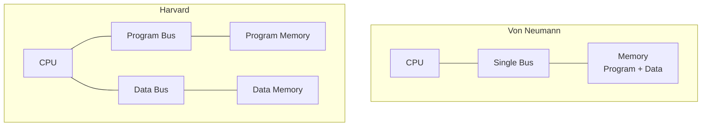
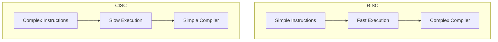
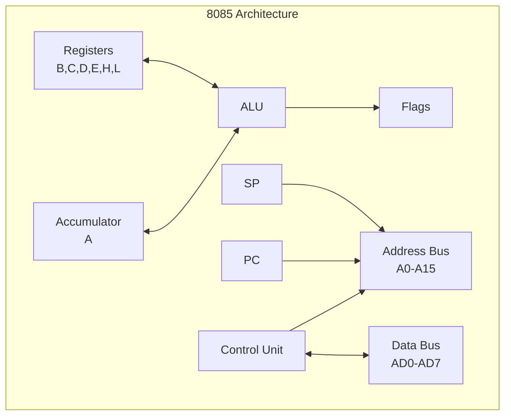
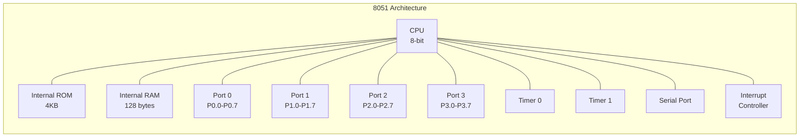

## પ્રશ્ન 1(અ) [3 ગુણ]

**8051 માઇક્રોકન્ટ્રોલરના ફીચર્સની યાદી બનાવો.**

**જવાબ**:

8051 માઇક્રોકન્ટ્રોલરમાં કેટલાક મહત્વના ફીચર્સ છે:

| ફીચર | વર્ણન |
|-------|--------|
| **CPU** | Control applications માટે optimized 8-bit CPU |
| **Memory** | 4KB internal ROM, 128 bytes internal RAM |
| **I/O Ports** | 4 bidirectional 8-bit I/O ports (P0-P3) |
| **Timers** | બે 16-bit timer/counters (Timer 0 & Timer 1) |
| **Interrupts** | 2 priority levels સાથે 5 interrupt sources |
| **Serial Port** | Serial communication માટે full duplex UART |

**મેમરી ટ્રીક:** "CPU Memory Input-Output Timers Interrupts Serial" (C-MIT-IS)

## પ્રશ્ન 1(બ) [4 ગુણ]

**વ્યાખ્યા આપો: Opcode, Operand, Instruction cycle, Machine cycle**

**જવાબ**:

| શબ્દ | વ્યાખ્યા |
|------|---------|
| **Opcode** | Operation code જે કરવાનું operation specify કરે છે |
| **Operand** | Data અથવા address જેના પર operation કરવામાં આવે છે |
| **Instruction Cycle** | Instruction ને fetch, decode અને execute કરવાની સંપૂર્ણ પ્રક્રિયા |
| **Machine Cycle** | Memory અથવા I/O device ને access કરવા માટે જરૂરી સમય |

**ડાયાગ્રામ:**


**મેમરી ટ્રીક:** "OOID" - Opcode Operand Instruction-cycle Data-cycle

## પ્રશ્ન 1(ક) [7 ગુણ]

**Von Neumann અને Harvard Architecture ની સરખામણી કરો.**

**જવાબ**:

| Parameter | Von Neumann | Harvard |
|-----------|-------------|---------|
| **Memory Structure** | Program અને data માટે single memory | Program અને data માટે separate memory |
| **Bus System** | Single bus system | Program અને data માટે separate bus |
| **Speed** | Bus conflicts થી slower | Simultaneous access થી faster |
| **Cost** | Lower cost | Higher cost |
| **Complexity** | Simple design | Complex design |
| **Examples** | 8085, x86 processors | 8051, DSP processors |

**ડાયાગ્રામ:**



**મેમરી ટ્રીક:** "VSBSC vs HSDFC" (Von-Single-Bus-Simple-Cheap vs Harvard-Separate-Dual-Fast-Complex)

## પ્રશ્ન 1(ક) OR [7 ગુણ]

**RISC અને CISC ની સરખામણી કરો.**

**જવાબ**:

| Parameter | RISC | CISC |
|-----------|------|------|
| **Instruction Set** | Reduced, simple instructions | Complex instruction set |
| **Instruction Size** | Fixed size instructions | Variable size instructions |
| **Execution Time** | Single clock cycle per instruction | Multiple clock cycles |
| **Memory Access** | Load/Store architecture | Memory-to-memory operations |
| **Compiler** | Complex compiler જરૂરી | Simple compiler |
| **Examples** | ARM, MIPS | 8085, x86 |

**ડાયાગ્રામ:**



**મેમરી ટ્રીક:** "RISC-SFS vs CISC-CSS" (Simple-Fast-Complex vs Complex-Slow-Simple)

## પ્રશ્ન 2(અ) [3 ગુણ]

**8085 માં ઉપલબ્ધ 16-bit Registers ની યાદી બનાવો અને તેનું કાર્ય સમજાવો.**

**જવાબ**:

| Register | કાર્ય |
|----------|-------|
| **PC (Program Counter)** | Next instruction address નો pointer |
| **SP (Stack Pointer)** | Memory માં stack ના top નો pointer |
| **BC, DE, HL** | Data storage માટે general purpose register pairs |

- **PC**: દરેક instruction fetch પછી automatically increment થાય છે
- **SP**: PUSH operations દરમિયાન decrement, POP દરમિયાન increment થાય છે  
- **Register Pairs**: 16-bit addresses અથવા data store કરી શકે છે

**મેમરી ટ્રીક:** "PC SP BDH" (Program-Counter Stack-Pointer BC-DE-HL)

## પ્રશ્ન 2(બ) [4 ગુણ]

**8085 માં Address અને Data Bus ડી-મલ્ટિપ્લેક્સિંગ સમજાવો.**

**જવાબ**:

De-multiplexing AD0-AD7 pins માંથી address અને data signals ને અલગ કરે છે.

**પ્રક્રિયા:**

- **ALE (Address Latch Enable)** signal આ પ્રક્રિયાને control કરે છે
- **T1 state દરમિયાન**: AD0-AD7 માં lower 8-bit address હોય છે
- **ALE HIGH જાય છે**: Address external latch (74LS373) માં latch થાય છે
- **T2-T3 દરમિયાન**: AD0-AD7 data bus બને છે

**ડાયાગ્રામ:**

```goat
     +-------+    ALE   +--------+
AD0-7|  8085 |--------->| 74LS373|----> A0-A7
     |       |          | Latch  |
     +-------+          +--------+
         |
         +---> D0-D7 (Data Bus)
```

**મેમરી ટ્રીક:** "ALE Latches Address Low"

## પ્રશ્ન 2(ક) [7 ગુણ]

**આકૃતિની મદદથી 8085 નો Pin Diagram સમજાવો.**

**જવાબ**:

8085 એ 40-pin microprocessor છે જેમાં નીચેનું pin configuration છે:

| Pin Group | કાર્ય |
|-----------|------|
| **AD0-AD7** | Multiplexed Address/Data bus (Lower 8-bit) |
| **A8-A15** | Higher order Address bus |
| **ALE** | Address Latch Enable signal |
| **RD, WR** | Read અને Write control signals |
| **IO/M** | I/O અથવા Memory operation indicator |
| **S0, S1** | Status signals |

**Pin Diagram:**

```goat
        +---\\_/---+
   X1 --|1      40|-- Vcc
   X2 --|2      39|-- HOLD  
RESET --|3      38|-- HLDA
  SOD --|4      37|-- CLK
  SID --|5 8085 36|-- RESET IN
 TRAP --|6      35|-- READY
RST7.5--|7      34|-- IO/M
RST6.5--|8      33|-- S1
RST5.5--|9      32|-- RD
 INTR --|10     31|-- WR
 INTA --|11     30|-- ALE
  AD0 --|12     29|-- S0
  AD1 --|13     28|-- A15
  AD2 --|14     27|-- A14
  AD3 --|15     26|-- A13
  AD4 --|16     25|-- A12
  AD5 --|17     24|-- A11
  AD6 --|18     23|-- A10
  AD7 --|19     22|-- A9
  Vss --|20     21|-- A8
        +---------+
```

**મુખ્ય વિશેષતાઓ:**

- **40-pin DIP package**
- **Multiplexed bus** pin count ઘટાડે છે
- **Control signals** timing અને operation માટે
- **Interrupt pins** external device communication માટે

**મેમરી ટ્રીક:** "Address Data Control Power Interrupt" (ADCPI)

## પ્રશ્ન 2(અ) OR [3 ગુણ]

**8085 માં Instruction Fetching Operation સમજાવો.**

**જવાબ**:

Instruction fetching એ instruction cycle નું પહેલું પગલું છે:

**પગલાં:**

1. **PC contents** address bus (A0-A15) પર મૂકવામાં આવે છે
2. **ALE signal** high જાય છે address latch કરવા માટે
3. **RD signal** low જાય છે memory read કરવા માટે
4. **Instruction** memory માંથી data bus પર fetch થાય છે
5. **PC increment** થાય છે next instruction માટે

**Timing:**

- Machine cycle ના **T1 અને T2** states દરમિયાન થાય છે
- Simple instructions માટે **4 clock cycles** લે છે

**મેમરી ટ્રીક:** "PC ALE RD Fetch Increment" (PARFI)

## પ્રશ્ન 2(બ) OR [4 ગુણ]

**8085 નો Flag Register સમજાવો.**

**જવાબ**:

Flag Register arithmetic/logical operations પછી status information store કરે છે:

| Bit | Flag | કાર્ય |
|-----|------|------|
| **D7** | **S (Sign)** | Result negative હોય તો set થાય છે |
| **D6** | **Z (Zero)** | Result zero હોય તો set થાય છે |
| **D5** | **-** | Use થતું નથી |
| **D4** | **AC (Auxiliary Carry)** | Bit 3 થી 4 માં carry હોય તો set |
| **D3** | **-** | Use થતું નથી |
| **D2** | **P (Parity)** | Result માં even parity હોય તો set |
| **D1** | **-** | Use થતું નથી |
| **D0** | **CY (Carry)** | Carry/borrow generate થાય તો set |

**ડાયાગ્રામ:**

```goat
D7  D6  D5  D4  D3  D2  D1  D0
+---+---+---+---+---+---+---+---+
| S | Z | X | AC| X | P | X |CY |
+---+---+---+---+---+---+---+---+
```

**મેમરી ટ્રીક:** "S-Z-X-AC-X-P-X-CY"

## પ્રશ્ન 2(ક) OR [7 ગુણ]

**આકૃતિની મદદથી 8085 નું Architecture સમજાવો.**

**જવાબ**:

8085 architecture માં કેટલાક functional blocks છે:

**મુખ્ય Components:**

- **ALU (Arithmetic Logic Unit)**: Arithmetic અને logical operations કરે છે
- **Registers**: Data અને addresses temporarily store કરે છે
- **Control Unit**: Operation માટે control signals generate કરે છે
- **Address/Data Bus**: External devices સાથે communicate કરે છે

**Block Diagram:**



**મુખ્ય વિશેષતાઓ:**

- **8-bit microprocessor** 16-bit address bus સાથે
- **Von Neumann architecture** shared bus સાથે
- **Register-based operations** faster execution માટે
- **Interrupt capability** real-time applications માટે

**મેમરી ટ્રીક:** "ALU Registers Control Address Data" (ARCAD)

## પ્રશ્ન 3(અ) [3 ગુણ]

**8051 માઇક્રોકન્ટ્રોલરની Internal RAM Organization સમજાવો.**

**જવાબ**:

8051 માં 128 bytes નું internal RAM આ પ્રમાણે organized છે:

| Address Range | હેતુ |
|---------------|------|
| **00H-1FH** | Register Banks (4 banks, દરેકમાં 8 registers) |
| **20H-2FH** | Bit Addressable Area (16 bytes) |
| **30H-7FH** | General Purpose RAM (80 bytes) |

**Organization:**

- **Bank 0**: 00H-07H (Default register bank)
- **Bank 1**: 08H-0FH
- **Bank 2**: 10H-17H
- **Bank 3**: 18H-1FH

**ડાયાગ્રામ:**

```goat
7FH +----------------+
    | General Purpose|
    |      RAM       |
30H +----------------+
    | Bit Addressable|
    |     Area       |
20H +----------------+
    |  Register      |
    |   Banks        |
00H +----------------+
```

**મેમરી ટ્રીક:** "Register Bit General" (RBG)

## પ્રશ્ન 3(બ) [4 ગુણ]

**8051 માઇક્રોકન્ટ્રોલરના TMOD SFR ના દરેક bit નું કાર્ય સમજાવો.**

**જવાબ**:

TMOD (Timer Mode) register Timer 0 અને Timer 1 ના operation ને control કરે છે:

| Bit | નામ | કાર્ય |
|-----|-----|------|
| **D7** | **GATE1** | Timer 1 gate control |
| **D6** | **C/T1** | Timer 1 માટે Timer/Counter select |
| **D5** | **M11** | Timer 1 માટે Mode bit 1 |
| **D4** | **M01** | Timer 1 માટે Mode bit 0 |
| **D3** | **GATE0** | Timer 0 gate control |
| **D2** | **C/T0** | Timer 0 માટે Timer/Counter select |
| **D1** | **M10** | Timer 0 માટે Mode bit 1 |
| **D0** | **M00** | Timer 0 માટે Mode bit 0 |

**Bit કાર્યો:**

- **GATE**: 1 = External gate control, 0 = Internal control
- **C/T**: 1 = Counter mode, 0 = Timer mode
- **M1,M0**: Timer operating modes (00=Mode0, 01=Mode1, 10=Mode2, 11=Mode3)

**મેમરી ટ્રીક:** "GATE C/T Mode1 Mode0" દરેક timer માટે

## પ્રશ્ન 3(ક) [7 ગુણ]

**આકૃતિની મદદથી 8051 નું Architecture સમજાવો.**

**જવાબ**:

8051 microcontroller માં separate program અને data memory સાથે Harvard architecture છે:

**મુખ્ય Components:**

- **8-bit CPU** Boolean processor સાથે
- **Internal ROM**: 4KB program memory
- **Internal RAM**: 128 bytes data memory
- **ચાર I/O Ports**: P0, P1, P2, P3 (દરેક 8-bit)
- **બે Timers**: 16-bit Timer/Counter 0 અને 1
- **Serial Port**: Full duplex UART

**Architecture Diagram:**



**વિશેષ વિશેષતાઓ:**

- **Harvard Architecture**: Program અને data માટે separate buses
- **SFR (Special Function Registers)**: વિવિધ peripherals ને control કરે છે
- **Interrupt System**: 5 interrupt sources
- **Power Saving Modes**: Idle અને Power-down modes

**મેમરી ટ્રીક:** "CPU ROM RAM Ports Timers Serial Interrupts" (CRRRPTI)

## પ્રશ્ન 3(અ) OR [3 ગુણ]

**8051 માઇક્રોકન્ટ્રોલરનો PSW SFR સમજાવો.**

**જવાબ**:

PSW (Program Status Word) માં status flags અને register bank selection છે:

| Bit | Flag | કાર્ય |
|-----|------|------|
| **D7** | **CY** | Carry flag |
| **D6** | **AC** | Auxiliary carry flag |
| **D5** | **F0** | Flag 0 (user defined) |
| **D4** | **RS1** | Register bank select bit 1 |
| **D3** | **RS0** | Register bank select bit 0 |
| **D2** | **OV** | Overflow flag |
| **D1** | **-** | Reserved |
| **D0** | **P** | Parity flag |

**Register Bank Selection:**

- **RS1=0, RS0=0**: Bank 0 (00H-07H)
- **RS1=0, RS0=1**: Bank 1 (08H-0FH)
- **RS1=1, RS0=0**: Bank 2 (10H-17H)
- **RS1=1, RS0=1**: Bank 3 (18H-1FH)

**મેમરી ટ્રીક:** "CY AC F0 RS1 RS0 OV - P"

## પ્રશ્ન 3(બ) OR [4 ગુણ]

**8051 માઇક્રોકન્ટ્રોલરના SCON SFR ના દરેક bit નું કાર્ય સમજાવો.**

**જવાબ**:

SCON (Serial Control) register serial port operation ને control કરે છે:

| Bit | નામ | કાર્ય |
|-----|-----|------|
| **D7** | **SM0** | Serial mode bit 0 |
| **D6** | **SM1** | Serial mode bit 1 |
| **D5** | **SM2** | Multiprocessor communication |
| **D4** | **REN** | Receive enable |
| **D3** | **TB8** | Transmit કરવાનો 9th bit |
| **D2** | **RB8** | Receive થયેલો 9th bit |
| **D1** | **TI** | Transmit interrupt flag |
| **D0** | **RI** | Receive interrupt flag |

**Serial Modes:**

- **Mode 0**: Shift register, fixed baud rate
- **Mode 1**: 8-bit UART, variable baud rate  
- **Mode 2**: 9-bit UART, fixed baud rate
- **Mode 3**: 9-bit UART, variable baud rate

**Control કાર્યો:**

- **REN**: Reception enable કરવા માટે set કરવું જરૂરી
- **TI/RI**: Hardware દ્વારા set, software દ્વારા clear

**મેમરી ટ્રીક:** "SM0 SM1 SM2 REN TB8 RB8 TI RI"

## પ્રશ્ન 3(ક) OR [7 ગુણ]

**આકૃતિની મદદથી 8051 નો Pin Diagram સમજાવો.**

**જવાબ**:

8051 એ 40-pin DIP package માં available છે:

**Pin Groups:**

- **Ports 0-3**: Dual functions સાથે I/O pins
- **Power**: VCC, VSS pins
- **Crystal**: Clock માટે XTAL1, XTAL2
- **Control**: RST, EA, ALE, PSEN

**Pin Diagram:**

```goat
           +---\\_/---+
  P1.0   --|1       40|-- Vcc
  P1.1   --|2       39|-- P0.0/AD0
  P1.2   --|3       38|-- P0.1/AD1
  P1.3   --|4       37|-- P0.2/AD2
  P1.4   --|5  8051 36|-- P0.3/AD3
  P1.5   --|6       35|-- P0.4/AD4
  P1.6   --|7       34|-- P0.5/AD5
  P1.7   --|8       33|-- P0.6/AD6
   RST   --|9       32|-- P0.7/AD7
P3.0/RXD --|10      31|-- EA/VPP
P3.1/TXD --|11      30|-- ALE/PROG
P3.2/INT0--|12      29|-- PSEN
P3.3/INT1--|13      28|-- P2.7/A15
P3.4/T0  --|14      27|-- P2.6/A14
P3.5/T1  --|15      26|-- P2.5/A13
P3.6/WR  --|16      25|-- P2.4/A12
P3.7/RD  --|17      24|-- P2.3/A11
 XTAL2   --|18      23|-- P2.2/A10
 XTAL1   --|19      22|-- P2.1/A9
   Vss   --|20      21|-- P2.0/A8
           +----------+
```

**Port કાર્યો:**

- **Port 0**: Multiplexed address/data bus
- **Port 1**: General purpose I/O
- **Port 2**: Higher order address bus
- **Port 3**: Alternate functions (UART, interrupts, timers)

**મેમરી ટ્રીક:** "Port Power Crystal Control" (PPCC)

## પ્રશ્ન 4(અ) [3 ગુણ]

**8051 માઇક્રોકન્ટ્રોલરની કોઇપણ ત્રણ Data Transfer Instructions લખો અને સમજાવો.**

**જવાબ**:

Data transfer instructions registers, memory અને I/O વચ્ચે data move કરે છે:

| Instruction | કાર્ય |
|-------------|------|
| **MOV A,R0** | R0 ના contents Accumulator માં move કરે છે |
| **MOV R1,#50H** | Immediate data 50H ને R1 માં move કરે છે |
| **MOV 30H,A** | Accumulator ના contents address 30H પર move કરે છે |

**Code Examples:**

```assembly
MOV A,R0        ; A = R0
MOV R1,#50H     ; R1 = 50H  
MOV 30H,A       ; [30H] = A
```

**મુખ્ય વિશેષતાઓ:**

- **કોઇ flags પ્રભાવિત નથી** data transfer દરમિયાન
- **વિવિધ addressing modes** supported
- **Single cycle execution** મોટાભાગની instructions માટે

**મેમરી ટ્રીક:** "MOV Between Register Immediate Direct" (MBRID)

## પ્રશ્ન 4(બ) [4 ગુણ]

**રજિસ્ટર R0 અને R1 માં રહેલ ડેટાનો ગુણાકાર કરી જવાબ R5(લોઅર બાઇટ) અને R6(હાયર બાઇટ) માં સ્ટોર કરવા માટે 8051 નો એસેમ્બલી પ્રોગ્રામ લખો.**

**જવાબ**:

```assembly
ORG 0000H           ; Origin at 0000H

START:
    MOV A,R0        ; R0 ને Accumulator માં load કરો
    MOV B,R1        ; R1 ને B register માં load કરો
    MUL AB          ; A અને B નો ગુણાકાર કરો
    MOV R5,A        ; Lower byte R5 માં store કરો
    MOV R6,B        ; Higher byte R6 માં store કરો
    
    SJMP $          ; Program stop કરો

END                 ; Program નો અંત
```

**Program Flow:**

1. **Multiplicand load કરો** R0 થી A માં
2. **Multiplier load કરો** R1 થી B માં  
3. **Multiplication execute કરો** MUL AB use કરીને
4. **Lower byte store કરો** result નો R5 માં
5. **Higher byte store કરો** result નો R6 માં

**નોંધ:** MUL AB instruction automatically 16-bit result store કરે છે lower byte A માં અને higher byte B માં.

## પ્રશ્ન 4(ક) [7 ગુણ]

**8051 માઇક્રોકન્ટ્રોલરના Addressing Modes ની યાદી બનાવો અને દરેકને ઉદાહરણ સાથે સમજાવો.**

**જવાબ**:

8051 કેટલાક addressing modes support કરે છે:

| Mode | વર્ણન | Example |
|------|-------|---------|
| **Immediate** | Instruction માં data specify કરાયો છે | MOV A,#50H |
| **Register** | Register માં data છે | MOV A,R0 |
| **Direct** | Memory address specify કરાયો છે | MOV A,30H |
| **Indirect** | Register માં address છે | MOV A,@R0 |
| **Indexed** | Base + offset addressing | MOVC A,@A+DPTR |
| **Relative** | PC + offset | SJMP LABEL |
| **Bit** | Bit-specific operations | SETB P1.0 |

**વિગતવાર Examples:**

**1. Immediate Addressing:**

```assembly
MOV A,#25H      ; A = 25H (immediate data)
```

**2. Register Addressing:**

```assembly
MOV A,R1        ; A = R1 ના contents
```

**3. Direct Addressing:**

```assembly
MOV A,40H       ; A = memory location 40H ના contents
```

**4. Indirect Addressing:**

```assembly
MOV R0,#40H     ; R0 = 40H (address)
MOV A,@R0       ; A = R0 દ્વારા point કરાયેલ location ના contents
```

**મેમરી ટ્રીક:** "I-R-D-I-I-R-B" (Immediate Register Direct Indirect Indexed Relative Bit)

## પ્રશ્ન 4(અ) OR [3 ગુણ]

**8051 માઇક્રોકન્ટ્રોલર માટેની કોઇપણ ત્રણ Logical Instructions લખો અને સમજાવો.**

**જવાબ**:

Logical instructions bitwise operations કરે છે:

| Instruction | કાર્ય |
|-------------|------|
| **ANL A,R0** | Accumulator અને R0 નું AND કરે છે |
| **ORL A,#0FH** | Accumulator અને immediate data 0FH નું OR કરે છે |
| **XRL A,30H** | Accumulator અને address 30H ના contents નું XOR કરે છે |

**Code Examples:**

```assembly
ANL A,R0        ; A = A AND R0
ORL A,#0FH      ; A = A OR 0FH
XRL A,30H       ; A = A XOR [30H]
```

**Applications:**

- **ANL**: Specific bits masking (unwanted bits clear કરવા)
- **ORL**: Specific bits setting  
- **XRL**: Bits toggling, checksum calculations

**મેમરી ટ્રીક:** "AND OR XOR" logical operations

## પ્રશ્ન 4(બ) OR [4 ગુણ]

**2000h મેમરી લોકેશન માં સ્ટોર કરેલ સંખ્યા માંથી 2001h મેમરી લોકેશન માં સ્ટોર કરેલ સંખ્યા બાદ કરી 2002h મેમરી લોકેશનમાં જવાબ સ્ટોર કરવા માટે 8051 નો એસેમ્બલી પ્રોગ્રામ લખો. અહીં આપેલા તમામ મેમરી લોકેશન બાહ્ય મેમરી ના છે.**

**જવાબ**:

```assembly
ORG 0000H           ; Origin at 0000H

START:
    MOV DPTR,#2001H ; Minuend address પર point કરો
    MOVX A,@DPTR    ; External memory માંથી minuend load કરો
    MOV R0,A        ; Minuend ને R0 માં store કરો
    
    MOV DPTR,#2000H ; Subtrahend address પર point કરો  
    MOVX A,@DPTR    ; External memory માંથી subtrahend load કરો
    MOV R1,A        ; Subtrahend ને R1 માં store કરો
    
    MOV A,R0        ; Minuend ને A માં load કરો
    CLR C           ; Carry flag clear કરો
    SUBB A,R1       ; Subtraction: A = R0 - R1
    
    MOV DPTR,#2002H ; Result address પર point કરો
    MOVX @DPTR,A    ; Result ને external memory માં store કરો
    
    SJMP $          ; Program stop કરો

END                 ; Program નો અંત
```

**Program પગલાં:**

1. **Minuend load કરો** external memory 2001H માંથી
2. **Subtrahend load કરો** external memory 2000H માંથી
3. **Subtraction કરો** SUBB instruction use કરીને
4. **Result store કરો** external memory location 2002H માં

**નોંધ:** External memory access માટે MOVX instruction નો use થાય છે.

## પ્રશ્ન 4(ક) OR [7 ગુણ]

**Instructions સમજાવો: (i) RET (ii) PUSH (iii) CLR PSW.0 (iv) RLC A (v) CJNE A,#DATA,LABEL (vi) NOP (vii) ANL A,#DATA**

**જવાબ**:

| Instruction | કાર્ય | વર્ણન |
|-------------|------|-------|
| **RET** | Subroutine માંથી return | Stack માંથી PC pop કરે છે અને control return કરે છે |
| **PUSH 30H** | Stack પર push કરે છે | Address 30H ના contents stack પર push કરે છે |
| **CLR PSW.0** | Carry flag clear કરે છે | PSW નો bit 0 (Carry flag) clear કરે છે |
| **RLC A** | Carry થકી left rotate | A ને carry flag થકી left rotate કરે છે |
| **CJNE A,#50H,NEXT** | Compare અને jump | A ≠ 50H હોય તો NEXT પર jump કરે છે |
| **NOP** | કંઇ operation નહીં | કંઇ કરતું નથી, એક cycle consume કરે છે |
| **ANL A,#0FH** | Immediate સાથે AND | A = A AND 0FH |

**વિગતવાર સમજાવટ:**

**RET:** Subroutine calls માંથી return કરવા માટે

```assembly
CALL SUB1       ; Subroutine call કરો
...
SUB1: 
    MOV A,#10H
    RET         ; Caller ને return કરો
```

**PUSH:** Stack પર data save કરે છે

```assembly
PUSH ACC        ; Accumulator ને stack પર save કરો
```

**RLC A:** Carry સાથે bit rotation

```goat
CY <- A7 <- A6 <- A5 <- A4 <- A3 <- A2 <- A1 <- A0 <- CY
```

**CJNE:** Conditional branching

```assembly
CJNE A,#50H,NOT_EQUAL   ; A≠50H હોય તો NOT_EQUAL પર jump
; A equals 50H
NOT_EQUAL:
; A not equal to 50H
```

**મેમરી ટ્રીક:** "Return Push Clear Rotate Compare No-op AND" (RPCRNA)

## પ્રશ્ન 5(અ) [3 ગુણ]

**માઇક્રોકન્ટ્રોલરની વિવિધ ક્ષેત્રે ઉપયોગોની સૂચી બનાવો.**

**જવાબ**:

માઇક્રોકન્ટ્રોલર વિવિધ ક્ષેત્રોમાં અસંખ્ય applications માં use થાય છે:

| ક્ષેત્ર | Applications |
|-------|-------------|
| **Consumer Electronics** | TV remotes, washing machines, microwaves |
| **Automotive** | Engine control, ABS, airbag systems |
| **Industrial** | Process control, robotics, automation |
| **Medical** | Pacemakers, blood glucose meters, ventilators |
| **Communication** | Mobile phones, modems, routers |
| **Home Automation** | Smart thermostats, security systems, lighting |

**મુખ્ય ફાયદા:**

- **ઓછી કિંમત** અને **compact size**
- **ઓછી power consumption**
- **Real-time operation**
- Sensors અને actuators સાથે **સરળ interfacing**

**મેમરી ટ્રીક:** "Consumer Automotive Industrial Medical Communication Home" (CAIMCH)

## પ્રશ્ન 5(બ) [4 ગુણ]

**8051 માઇક્રોકન્ટ્રોલર સાથે સ્ટેપર મોટર ઇન્ટરફેસ કરો અને ટૂંકમાં સમજાવો.**

**જવાબ**:

Stepper motor interfacing માટે current requirements ને કારણે driver circuit જરૂરી છે:

**Interface Circuit:**

```goat
    8051          ULN2003         Stepper Motor
P1.0 ----+---> Input1 -----> Coil A
P1.1 ----+---> Input2 -----> Coil B  
P1.2 ----+---> Input3 -----> Coil C
P1.3 ----+---> Input4 -----> Coil D
         |
        GND
```

**Control Sequence (Half-Step):**

| Step | P1.3 | P1.2 | P1.1 | P1.0 | Binary |
|------|------|------|------|------|--------|
| 1 | 0 | 0 | 0 | 1 | 01H |
| 2 | 0 | 0 | 1 | 1 | 03H |
| 3 | 0 | 0 | 1 | 0 | 02H |
| 4 | 0 | 1 | 1 | 0 | 06H |
| 5 | 0 | 1 | 0 | 0 | 04H |
| 6 | 1 | 1 | 0 | 0 | 0CH |
| 7 | 1 | 0 | 0 | 0 | 08H |
| 8 | 1 | 0 | 0 | 1 | 09H |

**Driver Circuit:**

- **ULN2003**: Darlington driver IC current amplification provide કરે છે
- **Protection diodes**: Back EMF સામે protect કરે છે
- **Common ground**: 8051 અને motor supply વચ્ચે

**મેમરી ટ્રીક:** "Step Sequence Driver Protection" (SSDP)

## પ્રશ્ન 5(ક) [7 ગુણ]

**8051 માઇક્રોકન્ટ્રોલરના પોર્ટ 2.0 થી 2.3 પર ચાર LED ઇન્ટરફેસ કરો અને તેને ચાલુ-બંધ કરવા માટેનો એસેમ્બલી પ્રોગ્રામ લખો.**

**જવાબ**:

**Interface Circuit:**

```goat
8051 Pin    Resistor     LED
P2.0 -----> 330Ω -----> LED1 -----> GND
P2.1 -----> 330Ω -----> LED2 -----> GND  
P2.2 -----> 330Ω -----> LED3 -----> GND
P2.3 -----> 330Ω -----> LED4 -----> GND
```

**Assembly Program:**

```assembly
ORG 0000H               ; Start address

MAIN:
    MOV P2,#0FH         ; બધા LEDs ON કરો (P2.0-P2.3)
    CALL DELAY          ; Delay subroutine call કરો
    MOV P2,#00H         ; બધા LEDs OFF કરો
    CALL DELAY          ; Delay subroutine call કરો
    SJMP MAIN           ; Flashing repeat કરો

DELAY:
    MOV R0,#255         ; Outer loop counter
LOOP1:
    MOV R1,#255         ; Inner loop counter  
LOOP2:
    DJNZ R1,LOOP2       ; Zero નહીં હોય તો decrement અને jump
    DJNZ R0,LOOP1       ; Outer counter decrement કરો
    RET                 ; Delay માંથી return કરો

END                     ; Program નો અંત
```

**Circuit Components:**

- **Current limiting resistors**: LED current limit કરવા માટે 330Ω
- **LEDs**: Active HIGH configuration માં connected
- **Common ground**: બધા LED cathodes ground સાથે connected

**Program Operation:**

1. **LEDs ON કરો**: P2.0-P2.3 high set કરો
2. **Delay**: Visible flash duration માટે wait કરો
3. **LEDs OFF કરો**: P2.0-P2.3 clear કરો
4. **Repeat**: Continuous flashing loop

**મેમરી ટ્રીક:** "Resistor LED Ground Program" (RLGP)

## પ્રશ્ન 5(અ) OR [3 ગુણ]

**8051 માઇક્રોકન્ટ્રોલર સાથે પુશ બટન સ્વીચ અને LED નું ઇન્ટરફેસિંગ દોરો.**

**જવાબ**:

**Interface Circuit:**

```goat
       +5V
        |
        ├─── 10KΩ ──── P1.0 (Input)
        |         |
      Switch      |
        |        GND
       GND
       
P1.1 ──── 330Ω ──── LED ──── GND
                   (Output)
```

**Circuit વર્ણન:**

- **Push Button**: Pull-up resistor સાથે P1.0 સાથે connected
- **Pull-up Resistor**: Switch open હોય ત્યારે logic HIGH ensure કરવા માટે 10KΩ
- **LED**: Current limiting resistor દ્વારા P1.1 સાથે connected
- **Current Limiting**: LED ને protect કરવા માટે 330Ω resistor

**Operation:**

- **Switch Open**: P1.0 = 1 (HIGH)
- **Switch Pressed**: P1.0 = 0 (LOW)
- **LED Control**: P1.1 pin દ્વારા

**મેમરી ટ્રીક:** "Pull-up Switch LED Current-limit" (PSLC)

## પ્રશ્ન 5(બ) OR [4 ગુણ]

**8051 માઇક્રોકન્ટ્રોલર સાથે રીલે ઇન્ટરફેસ કરો અને ટૂંકમાં સમજાવો.**

**જવાબ**:

**Interface Circuit:**

```goat
8051    Transistor    Relay      Load
P1.0 ──┬─ 1KΩ ──┬─── BC547 ────┬──── Relay Coil ──── +12V
       |        |    (NPN)     |                    |
      GND      Base           Collector            NO/NC
                |               |                    |
               Emitter ────────GND               Load Device
                |
            Flyback Diode
            (1N4007)
```

**Components:**

- **Transistor BC547**: Relay coil માટે switching element
- **Base Resistor**: Base current limit કરવા માટે 1KΩ
- **Flyback Diode**: Back EMF સામે protect કરવા માટે 1N4007
- **Relay**: NO/NC contacts સાથે 12V DC relay

**Operation:**

1. P1.0 પર **Logic HIGH** → Transistor ON → Relay energized
2. P1.0 પર **Logic LOW** → Transistor OFF → Relay de-energized
3. **Relay contacts** load circuit ને switch કરે છે

**Protection:**

- **Flyback diode** relay coil ના back EMF થી damage prevent કરે છે
- Base resistor દ્વારા **Current limiting**

**મેમરી ટ્રીક:** "Transistor Resistor Diode Relay" (TRDR)

## પ્રશ્ન 5(ક) OR [7 ગુણ]

**8051 માઇક્રોકન્ટ્રોલર સાથે 7 સેગ્મેન્ટ LED ઇન્ટરફેસ કરો અને 0 પ્રિન્ટ કરવા માટે એસેમ્બલી પ્રોગ્રામ લખો.**

**જવાબ**:

**Interface Circuit:**

```goat
       a
    -------
f  |       |  b
   |   g   |
    -------
e  |       |  c
   |       |
    -------
       d

8051 Connections:
P1.0 ──── 330Ω ──── a segment
P1.1 ──── 330Ω ──── b segment  
P1.2 ──── 330Ω ──── c segment
P1.3 ──── 330Ω ──── d segment
P1.4 ──── 330Ω ──── e segment
P1.5 ──── 330Ω ──── f segment
P1.6 ──── 330Ω ──── g segment
P1.7 ──── 330Ω ──── dp (decimal point)

Common Cathode: બધા cathodes GND સાથે
```

**7-Segment Code Table:**

| Digit | Display | gfedcba | Hex Code |
|-------|---------|---------|----------|
| 0 | Display 0 | 0111111 | 3FH |
| 1 | Display 1 | 0000110 | 06H |
| 2 | Display 2 | 1011011 | 5BH |

**'0' Display કરવા માટે Assembly Program:**

```assembly
ORG 0000H               ; Start address

MAIN:
    MOV P1,#3FH         ; 7-segment પર '0' display કરો
                        ; a,b,c,d,e,f ON, g OFF
    SJMP MAIN           ; Display કરતા રહો

END                     ; Program નો અંત
```

**'0' માટે Segment Pattern:**

- **Segments ON**: a, b, c, d, e, f (bits 0-5 = 1)
- **Segment OFF**: g (bit 6 = 0)
- **Binary**: 00111111 = 3FH

**Circuit વિશેષતાઓ:**

- **Common Cathode**: બધા segment cathodes ground સાથે connected
- **Current Limiting**: દરેક segment માટે 330Ω resistors
- **Active HIGH**: Logic 1 segment ON કરે છે

**અન્ય Patterns:**

```assembly
; અન્ય digits display કરવા માટે:
MOV P1,#06H         ; '1' Display કરવા માટે
MOV P1,#5BH         ; '2' Display કરવા માટે
```

**મેમરી ટ્રીક:** "Seven Segments Common Cathode Current-limit" (SSCCC)
