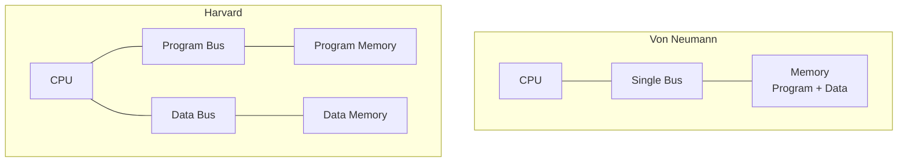
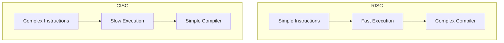
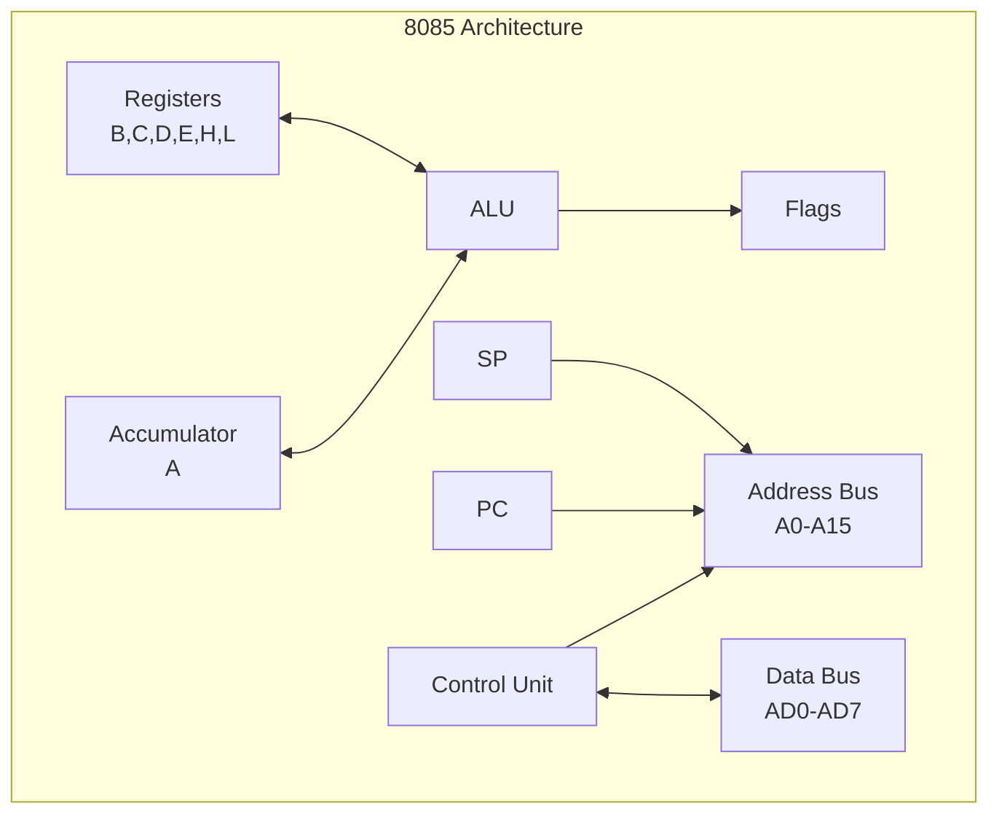
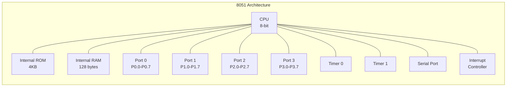

## Question 1(a) [3 marks]

**List the features of 8051 Microcontroller.**

**Answer**:

The 8051 microcontroller has several important features:

| Feature | Description |
|---------|-------------|
| **CPU** | 8-bit CPU optimized for control applications |
| **Memory** | 4KB internal ROM, 128 bytes internal RAM |
| **I/O Ports** | 4 bidirectional 8-bit I/O ports (P0-P3) |
| **Timers** | Two 16-bit timer/counters (Timer 0 & Timer 1) |
| **Interrupts** | 5 interrupt sources with 2 priority levels |
| **Serial Port** | Full duplex UART for serial communication |

**Mnemonic:** "CPU Memory Input-Output Timers Interrupts Serial" (C-MIT-IS)

## Question 1(b) [4 marks]

**Define: Opcode, Operand, Instruction cycle, Machine cycle**

**Answer**:

| Term | Definition |
|------|------------|
| **Opcode** | Operation code that specifies the operation to be performed |
| **Operand** | Data or address on which the operation is performed |
| **Instruction Cycle** | Complete process of fetching, decoding and executing an instruction |
| **Machine Cycle** | Time required to access memory or I/O device |

**Diagram:**


**Mnemonic:** "OOID" - Opcode Operand Instruction-cycle Data-cycle

## Question 1(c) [7 marks]

**Compare Von Neumann and Harvard Architecture.**

**Answer**:

| Parameter | Von Neumann | Harvard |
|-----------|-------------|---------|
| **Memory Structure** | Single memory for program and data | Separate memory for program and data |
| **Bus System** | Single bus system | Separate bus for program and data |
| **Speed** | Slower due to bus conflicts | Faster simultaneous access |
| **Cost** | Lower cost | Higher cost |
| **Complexity** | Simple design | Complex design |
| **Examples** | 8085, x86 processors | 8051, DSP processors |

**Diagram:**



**Mnemonic:** "VSBSC vs HSDFC" (Von-Single-Bus-Simple-Cheap vs Harvard-Separate-Dual-Fast-Complex)

## Question 1(c) OR [7 marks]

**Compare RISC and CISC.**

**Answer**:

| Parameter | RISC | CISC |
|-----------|------|------|
| **Instruction Set** | Reduced, simple instructions | Complex instruction set |
| **Instruction Size** | Fixed size instructions | Variable size instructions |
| **Execution Time** | Single clock cycle per instruction | Multiple clock cycles |
| **Memory Access** | Load/Store architecture | Memory-to-memory operations |
| **Compiler** | Complex compiler required | Simple compiler |
| **Examples** | ARM, MIPS | 8085, x86 |

**Diagram:**



**Mnemonic:** "RISC-SFS vs CISC-CSS" (Simple-Fast-Complex vs Complex-Slow-Simple)

## Question 2(a) [3 marks]

**List the 16-bit Registers available in 8085 and Explain its Function.**

**Answer**:

| Register | Function |
|----------|----------|
| **PC (Program Counter)** | Points to next instruction address |
| **SP (Stack Pointer)** | Points to top of stack in memory |
| **BC, DE, HL** | General purpose register pairs for data storage |

- **PC**: Automatically increments after each instruction fetch
- **SP**: Decrements during PUSH, increments during POP operations  
- **Register Pairs**: Can store 16-bit addresses or data

**Mnemonic:** "PC SP BDH" (Program-Counter Stack-Pointer BC-DE-HL)

## Question 2(b) [4 marks]

**Explain Address and Data Bus De-multiplexing in 8085.**

**Answer**:

De-multiplexing separates address and data signals from AD0-AD7 pins.

**Process:**

- **ALE (Address Latch Enable)** signal controls the process
- During **T1 state**: AD0-AD7 contains lower 8-bit address
- **ALE goes HIGH**: Address is latched in external latch (74LS373)
- During **T2-T3**: AD0-AD7 becomes data bus

**Diagram:**

```goat
     +-------+    ALE   +--------+
AD0-7|  8085 |--------->| 74LS373|----> A0-A7
     |       |          | Latch  |
     +-------+          +--------+
         |
         +---> D0-D7 (Data Bus)
```

**Mnemonic:** "ALE Latches Address Low" 

## Question 2(c) [7 marks]

**Explain Pin Diagram of 8085 with neat sketch.**

**Answer**:

The 8085 is a 40-pin microprocessor with the following pin configuration:

| Pin Group | Function |
|-----------|----------|
| **AD0-AD7** | Multiplexed Address/Data bus (Lower 8-bit) |
| **A8-A15** | Higher order Address bus |
| **ALE** | Address Latch Enable signal |
| **RD, WR** | Read and Write control signals |
| **IO/M** | I/O or Memory operation indicator |
| **S0, S1** | Status signals |

**Pin Diagram:**

```goat
        +---\\_/---+
   X1 --|1      40|-- Vcc
   X2 --|2      39|-- HOLD  
RESET --|3      38|-- HLDA
  SOD --|4      37|-- CLK
  SID --|5 8085 36|-- RESET IN
 TRAP --|6      35|-- READY
RST7.5--|7      34|-- IO/M
RST6.5--|8      33|-- S1
RST5.5--|9      32|-- RD
 INTR --|10     31|-- WR
 INTA --|11     30|-- ALE
  AD0 --|12     29|-- S0
  AD1 --|13     28|-- A15
  AD2 --|14     27|-- A14
  AD3 --|15     26|-- A13
  AD4 --|16     25|-- A12
  AD5 --|17     24|-- A11
  AD6 --|18     23|-- A10
  AD7 --|19     22|-- A9
  Vss --|20     21|-- A8
        +---------+
```

**Key Features:**

- **40-pin DIP package**
- **Multiplexed bus** reduces pin count
- **Control signals** for timing and operation
- **Interrupt pins** for external device communication

**Mnemonic:** "Address Data Control Power Interrupt" (ADCPI)

## Question 2(a) OR [3 marks]

**Explain Instruction Fetching Operation in 8085.**

**Answer**:

Instruction fetching is the first step in instruction cycle:

**Steps:**

1. **PC contents** placed on address bus (A0-A15)
2. **ALE signal** goes high to latch address
3. **RD signal** goes low to read memory
4. **Instruction** fetched from memory to data bus
5. **PC incremented** to point to next instruction

**Timing:**

- Occurs during **T1 and T2** states of machine cycle
- Takes **4 clock cycles** for simple instructions

**Mnemonic:** "PC ALE RD Fetch Increment" (PARFI)

## Question 2(b) OR [4 marks]

**Explain Flag Register of 8085.**

**Answer**:

The Flag Register stores status information after arithmetic/logical operations:

| Bit | Flag | Function |
|-----|------|----------|
| **D7** | **S (Sign)** | Set if result is negative |
| **D6** | **Z (Zero)** | Set if result is zero |
| **D5** | **-** | Not used |
| **D4** | **AC (Auxiliary Carry)** | Set if carry from bit 3 to 4 |
| **D3** | **-** | Not used |
| **D2** | **P (Parity)** | Set if result has even parity |
| **D1** | **-** | Not used |
| **D0** | **CY (Carry)** | Set if carry/borrow generated |

**Diagram:**

```goat
D7  D6  D5  D4  D3  D2  D1  D0
+---+---+---+---+---+---+---+---+
| S | Z | X | AC| X | P | X |CY |
+---+---+---+---+---+---+---+---+
```

**Mnemonic:** "S-Z-X-AC-X-P-X-CY"

## Question 2(c) OR [7 marks]

**Explain Architecture of 8085 with neat sketch.**

**Answer**:

The 8085 architecture consists of several functional blocks:

**Major Components:**

- **ALU (Arithmetic Logic Unit)**: Performs arithmetic and logical operations
- **Registers**: Store data and addresses temporarily
- **Control Unit**: Generates control signals for operation
- **Address/Data Bus**: Communicates with external devices

**Block Diagram:**



**Key Features:**

- **8-bit microprocessor** with 16-bit address bus
- **Von Neumann architecture** with shared bus
- **Register-based operations** for faster execution
- **Interrupt capability** for real-time applications

**Mnemonic:** "ALU Registers Control Address Data" (ARCAD)

## Question 3(a) [3 marks]

**Explain Internal RAM Organization of 8051 Microcontroller.**

**Answer**:

The 8051 has 128 bytes of internal RAM organized as:

| Address Range | Purpose |
|---------------|---------|
| **00H-1FH** | Register Banks (4 banks of 8 registers each) |
| **20H-2FH** | Bit Addressable Area (16 bytes) |
| **30H-7FH** | General Purpose RAM (80 bytes) |

**Organization:**

- **Bank 0**: 00H-07H (Default register bank)
- **Bank 1**: 08H-0FH 
- **Bank 2**: 10H-17H
- **Bank 3**: 18H-1FH

**Diagram:**

```goat
7FH +----------------+
    | General Purpose|
    |      RAM       |
30H +----------------+
    | Bit Addressable|
    |     Area       |
20H +----------------+
    |  Register      |
    |   Banks        |
00H +----------------+
```

**Mnemonic:** "Register Bit General" (RBG)

## Question 3(b) [4 marks]

**Explain Function of Each bit of TMOD SFR of 8051 Microcontroller.**

**Answer**:

TMOD (Timer Mode) register controls the operation of Timer 0 and Timer 1:

| Bit | Name | Function |
|-----|------|----------|
| **D7** | **GATE1** | Timer 1 gate control |
| **D6** | **C/T1** | Timer/Counter select for Timer 1 |
| **D5** | **M11** | Mode bit 1 for Timer 1 |
| **D4** | **M01** | Mode bit 0 for Timer 1 |
| **D3** | **GATE0** | Timer 0 gate control |
| **D2** | **C/T0** | Timer/Counter select for Timer 0 |
| **D1** | **M10** | Mode bit 1 for Timer 0 |
| **D0** | **M00** | Mode bit 0 for Timer 0 |

**Bit Functions:**

- **GATE**: 1 = External gate control, 0 = Internal control
- **C/T**: 1 = Counter mode, 0 = Timer mode
- **M1,M0**: Timer operating modes (00=Mode0, 01=Mode1, 10=Mode2, 11=Mode3)

**Mnemonic:** "GATE C/T Mode1 Mode0" for each timer

## Question 3(c) [7 marks]

**Explain Architecture of 8051 with neat sketch.**

**Answer**:

The 8051 microcontroller has Harvard architecture with separate program and data memory:

**Key Components:**

- **8-bit CPU** with Boolean processor
- **Internal ROM**: 4KB program memory
- **Internal RAM**: 128 bytes data memory
- **Four I/O Ports**: P0, P1, P2, P3 (8-bit each)
- **Two Timers**: 16-bit Timer/Counter 0 and 1
- **Serial Port**: Full duplex UART

**Architecture Diagram:**



**Special Features:**

- **Harvard Architecture**: Separate buses for program and data
- **SFR (Special Function Registers)**: Control various peripherals
- **Interrupt System**: 5 interrupt sources
- **Power Saving Modes**: Idle and Power-down modes

**Mnemonic:** "CPU ROM RAM Ports Timers Serial Interrupts" (CRRRPTI)

## Question 3(a) OR [3 marks]

**Explain PSW SFR of 8051 Microcontroller.**

**Answer**:

PSW (Program Status Word) contains status flags and register bank selection:

| Bit | Flag | Function |
|-----|------|----------|
| **D7** | **CY** | Carry flag |
| **D6** | **AC** | Auxiliary carry flag |
| **D5** | **F0** | Flag 0 (user defined) |
| **D4** | **RS1** | Register bank select bit 1 |
| **D3** | **RS0** | Register bank select bit 0 |
| **D2** | **OV** | Overflow flag |
| **D1** | **-** | Reserved |
| **D0** | **P** | Parity flag |

**Register Bank Selection:**

- **RS1=0, RS0=0**: Bank 0 (00H-07H)
- **RS1=0, RS0=1**: Bank 1 (08H-0FH)
- **RS1=1, RS0=0**: Bank 2 (10H-17H)
- **RS1=1, RS0=1**: Bank 3 (18H-1FH)

**Mnemonic:** "CY AC F0 RS1 RS0 OV - P"

## Question 3(b) OR [4 marks]

**Explain Function of Each bit of SCON SFR of 8051 Microcontroller.**

**Answer**:

SCON (Serial Control) register controls the serial port operation:

| Bit | Name | Function |
|-----|------|----------|
| **D7** | **SM0** | Serial mode bit 0 |
| **D6** | **SM1** | Serial mode bit 1 |
| **D5** | **SM2** | Multiprocessor communication |
| **D4** | **REN** | Receive enable |
| **D3** | **TB8** | 9th bit to transmit |
| **D2** | **RB8** | 9th bit received |
| **D1** | **TI** | Transmit interrupt flag |
| **D0** | **RI** | Receive interrupt flag |

**Serial Modes:**

- **Mode 0**: Shift register, fixed baud rate
- **Mode 1**: 8-bit UART, variable baud rate  
- **Mode 2**: 9-bit UART, fixed baud rate
- **Mode 3**: 9-bit UART, variable baud rate

**Control Functions:**

- **REN**: Must be set to enable reception
- **TI/RI**: Set by hardware, cleared by software

**Mnemonic:** "SM0 SM1 SM2 REN TB8 RB8 TI RI"

## Question 3(c) OR [7 marks]

**Explain Pin Diagram of 8051 with neat sketch.**

**Answer**:

The 8051 is available in 40-pin DIP package:

**Pin Groups:**

- **Ports 0-3**: I/O pins with dual functions
- **Power**: VCC, VSS pins
- **Crystal**: XTAL1, XTAL2 for clock
- **Control**: RST, EA, ALE, PSEN

**Pin Diagram:**

```goat
           +---\\_/---+
  P1.0   --|1       40|-- Vcc
  P1.1   --|2       39|-- P0.0/AD0
  P1.2   --|3       38|-- P0.1/AD1
  P1.3   --|4       37|-- P0.2/AD2
  P1.4   --|5  8051 36|-- P0.3/AD3
  P1.5   --|6       35|-- P0.4/AD4
  P1.6   --|7       34|-- P0.5/AD5
  P1.7   --|8       33|-- P0.6/AD6
   RST   --|9       32|-- P0.7/AD7
P3.0/RXD --|10      31|-- EA/VPP
P3.1/TXD --|11      30|-- ALE/PROG
P3.2/INT0--|12      29|-- PSEN
P3.3/INT1--|13      28|-- P2.7/A15
P3.4/T0  --|14      27|-- P2.6/A14
P3.5/T1  --|15      26|-- P2.5/A13
P3.6/WR  --|16      25|-- P2.4/A12
P3.7/RD  --|17      24|-- P2.3/A11
 XTAL2   --|18      23|-- P2.2/A10
 XTAL1   --|19      22|-- P2.1/A9
   Vss   --|20      21|-- P2.0/A8
           +----------+
```

**Port Functions:**

- **Port 0**: Multiplexed address/data bus
- **Port 1**: General purpose I/O
- **Port 2**: Higher order address bus
- **Port 3**: Alternate functions (UART, interrupts, timers)

**Mnemonic:** "Port Power Crystal Control" (PPCC)

## Question 4(a) [3 marks]

**Write and Explain any Three Data Transfer Instructions of 8051 Microcontroller.**

**Answer**:

Data transfer instructions move data between registers, memory, and I/O:

| Instruction | Function |
|-------------|----------|
| **MOV A,R0** | Move contents of R0 to Accumulator |
| **MOV R1,#50H** | Move immediate data 50H to R1 |
| **MOV 30H,A** | Move Accumulator contents to address 30H |

**Code Examples:**

```assembly
MOV A,R0        ; A = R0
MOV R1,#50H     ; R1 = 50H  
MOV 30H,A       ; [30H] = A
```

**Key Features:**

- **No flags affected** during data transfer
- **Various addressing modes** supported
- **Single cycle execution** for most instructions

**Mnemonic:** "MOV Between Register Immediate Direct" (MBRID)

## Question 4(b) [4 marks]

**Write 8051 Assembly Language Program to Multiply Content of R0 and R1 and Store Result in R5 (Lower Byte) and R6 (Higher Byte).**

**Answer**:

```assembly
ORG 0000H           ; Origin at 0000H

START:
    MOV A,R0        ; Load R0 into Accumulator
    MOV B,R1        ; Load R1 into B register
    MUL AB          ; Multiply A and B
    MOV R5,A        ; Store lower byte in R5
    MOV R6,B        ; Store higher byte in R6
    
    SJMP $          ; Stop program

END                 ; End of program
```

**Program Flow:**

1. **Load multiplicand** from R0 to A
2. **Load multiplier** from R1 to B  
3. **Execute multiplication** using MUL AB
4. **Store lower byte** of result in R5
5. **Store higher byte** of result in R6

**Note:** MUL AB instruction automatically stores 16-bit result with lower byte in A and higher byte in B.

## Question 4(c) [7 marks]

**List Addressing Modes of 8051 Microcontroller and Explain each with Example.**

**Answer**:

The 8051 supports several addressing modes:

| Mode | Description | Example |
|------|-------------|---------|
| **Immediate** | Data specified in instruction | MOV A,#50H |
| **Register** | Register contains data | MOV A,R0 |
| **Direct** | Memory address specified | MOV A,30H |
| **Indirect** | Register contains address | MOV A,@R0 |
| **Indexed** | Base + offset addressing | MOVC A,@A+DPTR |
| **Relative** | PC + offset | SJMP LABEL |
| **Bit** | Bit-specific operations | SETB P1.0 |

**Detailed Examples:**

**1. Immediate Addressing:**

```assembly
MOV A,#25H      ; A = 25H (immediate data)
```

**2. Register Addressing:**

```assembly
MOV A,R1        ; A = contents of R1
```

**3. Direct Addressing:**

```assembly
MOV A,40H       ; A = contents of memory location 40H
```

**4. Indirect Addressing:**

```assembly
MOV R0,#40H     ; R0 = 40H (address)
MOV A,@R0       ; A = contents of location pointed by R0
```

**Mnemonic:** "I-R-D-I-I-R-B" (Immediate Register Direct Indirect Indexed Relative Bit)

## Question 4(a) OR [3 marks]

**Write and Explain any Three Logical Instructions 8051 Microcontroller.**

**Answer**:

Logical instructions perform bitwise operations:

| Instruction | Function |
|-------------|----------|
| **ANL A,R0** | AND Accumulator with R0 |
| **ORL A,#0FH** | OR Accumulator with immediate data 0FH |
| **XRL A,30H** | XOR Accumulator with contents of address 30H |

**Code Examples:**

```assembly
ANL A,R0        ; A = A AND R0
ORL A,#0FH      ; A = A OR 0FH
XRL A,30H       ; A = A XOR [30H]
```

**Applications:**

- **ANL**: Masking specific bits (clear unwanted bits)
- **ORL**: Setting specific bits  
- **XRL**: Toggling bits, checksum calculations

**Mnemonic:** "AND OR XOR" logical operations

## Question 4(b) OR [4 marks]

**Write 8051 Assembly Language Program to Subtract Number Stored in 2000h from 2001h and Store result in 2002h. All given memory locations are External Memory locations.**

**Answer**:

```assembly
ORG 0000H           ; Origin at 0000H

START:
    MOV DPTR,#2001H ; Point to minuend address
    MOVX A,@DPTR    ; Load minuend from external memory
    MOV R0,A        ; Store minuend in R0
    
    MOV DPTR,#2000H ; Point to subtrahend address  
    MOVX A,@DPTR    ; Load subtrahend from external memory
    MOV R1,A        ; Store subtrahend in R1
    
    MOV A,R0        ; Load minuend into A
    CLR C           ; Clear carry flag
    SUBB A,R1       ; Subtract: A = R0 - R1
    
    MOV DPTR,#2002H ; Point to result address
    MOVX @DPTR,A    ; Store result in external memory
    
    SJMP $          ; Stop program

END                 ; End of program
```

**Program Steps:**

1. **Load minuend** from external memory 2001H
2. **Load subtrahend** from external memory 2000H
3. **Perform subtraction** using SUBB instruction
4. **Store result** in external memory location 2002H

**Note:** MOVX instruction is used for external memory access.

## Question 4(c) OR [7 marks]

**Explain Instructions: (i) RET (ii) PUSH (iii) CLR PSW.0 (iv) RLC A (v) CJNE A,#DATA,LABEL (vi) NOP (vii) ANL A,#DATA**

**Answer**:

| Instruction | Function | Description |
|-------------|----------|-------------|
| **RET** | Return from subroutine | Pops PC from stack and returns control |
| **PUSH 30H** | Push to stack | Pushes contents of address 30H to stack |
| **CLR PSW.0** | Clear carry flag | Clears bit 0 of PSW (Carry flag) |
| **RLC A** | Rotate left through carry | Rotates A left through carry flag |
| **CJNE A,#50H,NEXT** | Compare and jump | Jump to NEXT if A ≠ 50H |
| **NOP** | No operation | Does nothing, consumes one cycle |
| **ANL A,#0FH** | AND with immediate | A = A AND 0FH |

**Detailed Explanations:**

**RET:** Used to return from subroutine calls

```assembly
CALL SUB1       ; Call subroutine
...
SUB1: 
    MOV A,#10H
    RET         ; Return to caller
```

**PUSH:** Saves data on stack

```assembly
PUSH ACC        ; Save accumulator on stack
```

**RLC A:** Bit rotation with carry

```goat
CY <- A7 <- A6 <- A5 <- A4 <- A3 <- A2 <- A1 <- A0 <- CY
```

**CJNE:** Conditional branching

```assembly
CJNE A,#50H,NOT_EQUAL   ; If A≠50H, jump to NOT_EQUAL
; A equals 50H
NOT_EQUAL:
; A not equal to 50H
```

**Mnemonic:** "Return Push Clear Rotate Compare No-op AND" (RPCRNA)

## Question 5(a) [3 marks]

**List the application of Microcontroller in various fields.**

**Answer**:

Microcontrollers are used in numerous applications across various fields:

| Field | Applications |
|-------|-------------|
| **Consumer Electronics** | TV remotes, washing machines, microwaves |
| **Automotive** | Engine control, ABS, airbag systems |
| **Industrial** | Process control, robotics, automation |
| **Medical** | Pacemakers, blood glucose meters, ventilators |
| **Communication** | Mobile phones, modems, routers |
| **Home Automation** | Smart thermostats, security systems, lighting |

**Key Advantages:**

- **Low cost** and **compact size**
- **Low power consumption**
- **Real-time operation**
- **Easy interfacing** with sensors and actuators

**Mnemonic:** "Consumer Automotive Industrial Medical Communication Home" (CAIMCH)

## Question 5(b) [4 marks]

**Interface Stepper Motor with 8051 Microcontroller and Explain in brief.**

**Answer**:

Stepper motor interfacing requires driver circuit due to current requirements:

**Interface Circuit:**

```goat
    8051          ULN2003         Stepper Motor
P1.0 ----+---> Input1 -----> Coil A
P1.1 ----+---> Input2 -----> Coil B  
P1.2 ----+---> Input3 -----> Coil C
P1.3 ----+---> Input4 -----> Coil D
         |
        GND
```

**Control Sequence (Half-Step):**

| Step | P1.3 | P1.2 | P1.1 | P1.0 | Binary |
|------|------|------|------|------|--------|
| 1 | 0 | 0 | 0 | 1 | 01H |
| 2 | 0 | 0 | 1 | 1 | 03H |
| 3 | 0 | 0 | 1 | 0 | 02H |
| 4 | 0 | 1 | 1 | 0 | 06H |
| 5 | 0 | 1 | 0 | 0 | 04H |
| 6 | 1 | 1 | 0 | 0 | 0CH |
| 7 | 1 | 0 | 0 | 0 | 08H |
| 8 | 1 | 0 | 0 | 1 | 09H |

**Driver Circuit:**

- **ULN2003**: Darlington driver IC provides current amplification
- **Protection diodes**: Protect against back EMF
- **Common ground**: Between 8051 and motor supply

**Mnemonic:** "Step Sequence Driver Protection" (SSDP)

## Question 5(c) [7 marks]

**Draw interfacing circuit to interface 4 LED at port 2.0 to 2.3 of microcontroller 8051 and write assembly language program to flash it.**

**Answer**:

**Interface Circuit:**

```goat
8051 Pin    Resistor     LED
P2.0 -----> 330Ω -----> LED1 -----> GND
P2.1 -----> 330Ω -----> LED2 -----> GND  
P2.2 -----> 330Ω -----> LED3 -----> GND
P2.3 -----> 330Ω -----> LED4 -----> GND
```

**Assembly Program:**

```assembly
ORG 0000H               ; Start address

MAIN:
    MOV P2,#0FH         ; Turn ON all LEDs (P2.0-P2.3)
    CALL DELAY          ; Call delay subroutine
    MOV P2,#00H         ; Turn OFF all LEDs
    CALL DELAY          ; Call delay subroutine
    SJMP MAIN           ; Repeat flashing

DELAY:
    MOV R0,#255         ; Outer loop counter
LOOP1:
    MOV R1,#255         ; Inner loop counter  
LOOP2:
    DJNZ R1,LOOP2       ; Decrement and jump if not zero
    DJNZ R0,LOOP1       ; Decrement outer counter
    RET                 ; Return from delay

END                     ; End of program
```

**Circuit Components:**

- **Current limiting resistors**: 330Ω to limit LED current
- **LEDs**: Connected in active HIGH configuration
- **Common ground**: All LED cathodes connected to ground

**Program Operation:**

1. **Turn ON LEDs**: Set P2.0-P2.3 high
2. **Delay**: Wait for visible flash duration
3. **Turn OFF LEDs**: Clear P2.0-P2.3
4. **Repeat**: Continuous flashing loop

**Mnemonic:** "Resistor LED Ground Program" (RLGP)

## Question 5(a) OR [3 marks]

**Draw Interfacing of Push button switch and LED with 8051 Microcontroller.**

**Answer**:

**Interface Circuit:**

```goat
       +5V
        |
        ├─── 10KΩ ──── P1.0 (Input)
        |         |
      Switch      |
        |        GND
       GND
       
P1.1 ──── 330Ω ──── LED ──── GND
                   (Output)
```

**Circuit Description:**

- **Push Button**: Connected to P1.0 with pull-up resistor
- **Pull-up Resistor**: 10KΩ ensures logic HIGH when switch open
- **LED**: Connected to P1.1 through current limiting resistor
- **Current Limiting**: 330Ω resistor protects LED

**Operation:**

- **Switch Open**: P1.0 = 1 (HIGH)
- **Switch Pressed**: P1.0 = 0 (LOW)
- **LED Control**: Through P1.1 pin

**Mnemonic:** "Pull-up Switch LED Current-limit" (PSLC)

## Question 5(b) OR [4 marks]

**Interface Relay with 8051 Microcontroller and Explain in brief.**

**Answer**:

**Interface Circuit:**

```goat
8051    Transistor    Relay      Load
P1.0 ──┬─ 1KΩ ──┬─── BC547 ────┬──── Relay Coil ──── +12V
       |        |    (NPN)     |                    |
      GND      Base           Collector            NO/NC
                |               |                    |
               Emitter ────────GND               Load Device
                |
            Flyback Diode
            (1N4007)
```

**Components:**

- **Transistor BC547**: Switching element for relay coil
- **Base Resistor**: 1KΩ limits base current
- **Flyback Diode**: 1N4007 protects against back EMF
- **Relay**: 12V DC relay with NO/NC contacts

**Operation:**

1. **Logic HIGH** on P1.0 → Transistor ON → Relay energized
2. **Logic LOW** on P1.0 → Transistor OFF → Relay de-energized
3. **Relay contacts** switch the load circuit

**Protection:**

- **Flyback diode** prevents damage from relay coil's back EMF
- **Current limiting** through base resistor

**Mnemonic:** "Transistor Resistor Diode Relay" (TRDR)

## Question 5(c) OR [7 marks]

**Interface 7 segment LED with 8051 Microcontroller and write assembly language program to print 0 on it.**

**Answer**:

**Interface Circuit:**

```goat
       a
    -------
f  |       |  b
   |   g   |
    -------
e  |       |  c
   |       |
    -------
       d

8051 Connections:
P1.0 ──── 330Ω ──── a segment
P1.1 ──── 330Ω ──── b segment  
P1.2 ──── 330Ω ──── c segment
P1.3 ──── 330Ω ──── d segment
P1.4 ──── 330Ω ──── e segment
P1.5 ──── 330Ω ──── f segment
P1.6 ──── 330Ω ──── g segment
P1.7 ──── 330Ω ──── dp (decimal point)

Common Cathode: All cathodes to GND
```

**7-Segment Code Table:**

| Digit | Display | gfedcba | Hex Code |
|-------|---------|---------|----------|
| 0 | Display 0 | 0111111 | 3FH |
| 1 | Display 1 | 0000110 | 06H |
| 2 | Display 2 | 1011011 | 5BH |

**Assembly Program to Display '0':**

```assembly
ORG 0000H               ; Start address

MAIN:
    MOV P1,#3FH         ; Display '0' on 7-segment
                        ; a,b,c,d,e,f ON, g OFF
    SJMP MAIN           ; Keep displaying

END                     ; End of program
```

**Segment Pattern for '0':**

- **Segments ON**: a, b, c, d, e, f (bits 0-5 = 1)
- **Segment OFF**: g (bit 6 = 0)
- **Binary**: 00111111 = 3FH

**Circuit Features:**

- **Common Cathode**: All segment cathodes connected to ground
- **Current Limiting**: 330Ω resistors for each segment
- **Active HIGH**: Logic 1 turns ON segment

**Alternative Patterns:**

```assembly
; Other digits can be displayed using:
MOV P1,#06H         ; Display '1'
MOV P1,#5BH         ; Display '2'
```

**Mnemonic:** "Seven Segments Common Cathode Current-limit" (SSCCC)
