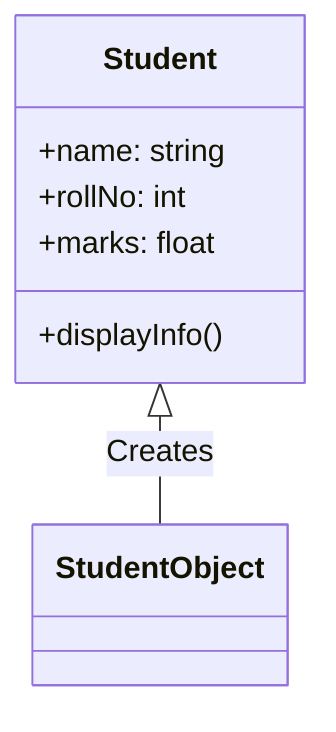
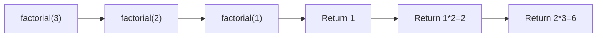
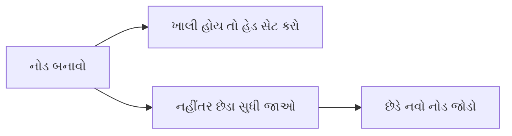
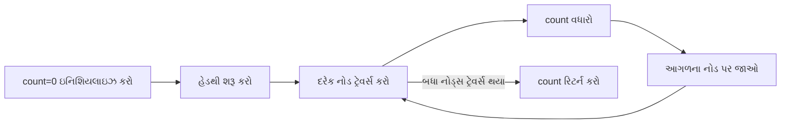
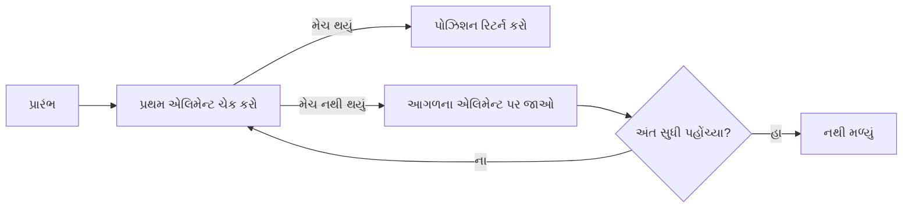
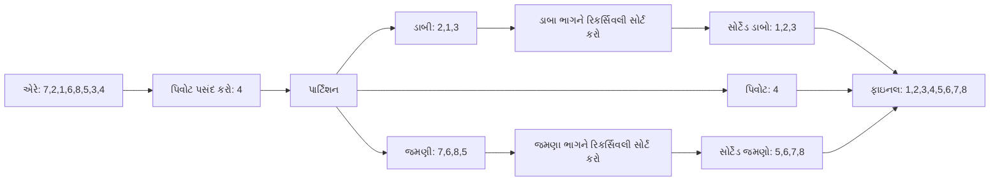
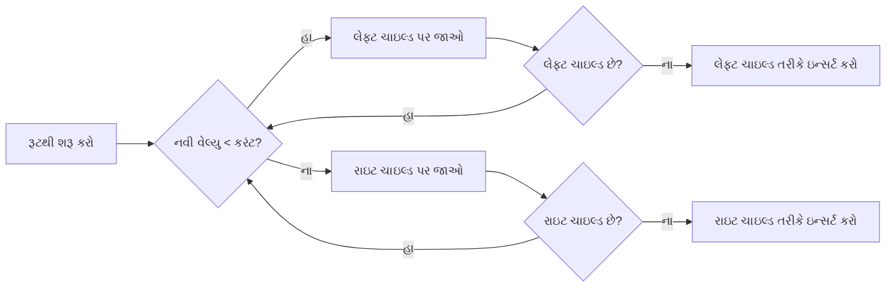

## પ્રશ્ન 1(અ) [3 ગુણ]

**રેખીય ડેટા સ્ટ્રક્ચર વ્યાખ્યાયિત કરો અને તેના ઉદાહરણો આપો.**

**જવાબ**:
રેખીય ડેટા સ્ટ્રક્ચર એ એલિમેન્ટ્સનો એવો સંગ્રહ છે કે જેમાં દરેક એલિમેન્ટની પહેલાં અને પછી એક જ એલિમેન્ટ હોય છે (સિવાય કે પ્રથમ અને છેલ્લા એલિમેન્ટ).

**કોષ્ટક: રેખીય ડેટા સ્ટ્રક્ચરના ઉદાહરણો**

| ડેટા સ્ટ્રક્ચર | વર્ણન |
|---------------|-------------|
| Array | નિશ્ચિત સાઇઝનો એલિમેન્ટ્સનો સંગ્રહ જે ઇન્ડેક્સ દ્વારા ઍક્સેસ થાય છે |
| Linked List | નોડ્સની શ્રેણી જેમાં ડેટા અને આગળના નોડનો રેફરન્સ હોય છે |
| Stack | LIFO (લાસ્ટ ઇન ફર્સ્ટ આઉટ) સ્ટ્રક્ચર |
| Queue | FIFO (ફર્સ્ટ ઇન ફર્સ્ટ આઉટ) સ્ટ્રક્ચર |

**મેમરી ટ્રીક:** "ALSQ એ લાઇનમાં છે"

## પ્રશ્ન 1(બ) [4 ગુણ]

**ટાઇમ અને સ્સ્પેસ કોમ્પ્લેક્ષીટી વ્યાખ્યાયિત કરો.**

**જવાબ**:
ટાઇમ અને સ્પેસ કોમ્પ્લેક્સિટી એલ્ગોરિધમની કાર્યક્ષમતાને એક્ઝિક્યુશન ટાઇમ અને મેમરી વપરાશના સંદર્ભમાં માપે છે, જેમ ઇનપુટ સાઇઝ વધે છે.

**કોષ્ટક: કોમ્પ્લેક્સિટી કમ્પેરિઝન**

| કોમ્પ્લેક્સિટી પ્રકાર | વ્યાખ્યા | માપન | મહત્વ |
|----------------|------------|-------------|------------|
| ટાઇમ કોમ્પ્લેક્સિટી | એલ્ગોરિધમના એક્ઝિક્યુશન ટાઇમને ઇનપુટ સાઇઝના ફંક્શન તરીકે માપે છે | બિગ O નોટેશન (O(n), O(1), O(n²)) | એલ્ગોરિધમ કેટલી ઝડપથી ચાલે છે તે નક્કી કરે છે |
| સ્પેસ કોમ્પ્લેક્સિટી | એલ્ગોરિધમને જરૂરી મેમરી સ્પેસને ઇનપુટ સાઇઝના ફંક્શન તરીકે માપે છે | બિગ O નોટેશન (O(n), O(1), O(n²)) | એલ્ગોરિધમને કેટલી મેમરી જોઈએ છે તે નક્કી કરે છે |

**મેમરી ટ્રીક:** "TS: ટાઇમ-સ્પીડ અને સ્પેસ-સ્ટોરેજ"

## પ્રશ્ન 1(ક) [7 ગુણ]

**ક્લાસ અને ઓબ્જેક્ટ ઉદાહરણ સાથે સમજાવો.**

**જવાબ**:
ક્લાસ અને ઓબ્જેક્ટ એ OOP ના મૂળભૂત કોન્સેપ્ટ છે જ્યાં ક્લાસ એ એટ્રિબ્યુટ્સ અને બિહેવિયર્સ ધરાવતા ઓબ્જેક્ટ બનાવવા માટેના બ્લુપ્રિન્ટ છે.

**ડાયાગ્રામ: ક્લાસ અને ઓબ્જેક્ટ રિલેશનશિપ**



**કોડ ઉદાહરણ:**

```python
class Student:
    def __init__(self, name, rollNo, marks):
        self.name = name
        self.rollNo = rollNo
        self.marks = marks
    
    def displayInfo(self):
        print(f"Name: {self.name}, Roll No: {self.rollNo}, Marks: {self.marks}")

# ઓબ્જેક્ટ બનાવવા
student1 = Student("રાજ", 101, 85.5)
student1.displayInfo()
```

- **ક્લાસ**: એટ્રિબ્યુટ્સ (name, rollNo, marks) અને મેથડ્સ (displayInfo) વ્યાખ્યાયિત કરતા બ્લુપ્રિન્ટ
- **ઓબ્જેક્ટ**: ક્લાસથી બનાવેલ ઇન્સ્ટન્સ (student1) જેમાં ચોક્કસ વેલ્યુઝ હોય છે

**મેમરી ટ્રીક:** "CAR - ક્લાસ એટ્રિબ્યુટ્સ અને રુટિન્સ વ્યાખ્યાયિત કરે છે"

## પ્રશ્ન 1(ક) OR [7 ગુણ]

**ઇંસ્ટટંસ મેથડ, ક્લાસ મેથડ અને સ્ટેટિક મેથડ ઉદાહરણ સાથે સમજાવો.**

**જવાબ**:
Python ત્રણ પ્રકારની મેથડ્સને સપોર્ટ કરે છે: ઇન્સ્ટન્સ, ક્લાસ અને સ્ટેટિક મેથડ, દરેક અલગ હેતુ માટે વપરાય છે.

**કોષ્ટક: મેથડ પ્રકારોની તુલના**

| મેથડ પ્રકાર | ડેકોરેટર | પ્રથમ પેરામીટર | હેતુ | એક્સેસ |
|-------------|-----------|-----------------|---------|--------|
| ઇન્સ્ટન્સ મેથડ | કોઈ નહીં | self | ઇન્સ્ટન્સ ડેટા પર કામ કરે | ઇન્સ્ટન્સ સ્ટેટને એક્સેસ/મોડિફાઇ કરી શકે |
| ક્લાસ મેથડ | @classmethod | cls | ક્લાસ ડેટા પર કામ કરે | ક્લાસ સ્ટેટને એક્સેસ/મોડિફાઇ કરી શકે |
| સ્ટેટિક મેથડ | @staticmethod | કોઈ નહીં | યુટિલિટી ફંક્શન્સ | ઇન્સ્ટન્સ કે ક્લાસ સ્ટેટને એક્સેસ કરી શકતી નથી |

**કોડ ઉદાહરણ:**

```python
class Student:
    school = "ABC School"  # ક્લાસ વેરિએબલ
    
    def __init__(self, name):
        self.name = name  # ઇન્સ્ટન્સ વેરિએબલ
    
    def instance_method(self):  # ઇન્સ્ટન્સ મેથડ
        return f"Hi {self.name} from {self.school}"
    
    @classmethod
    def class_method(cls):  # ક્લાસ મેથડ
        return f"School is {cls.school}"
    
    @staticmethod
    def static_method():  # સ્ટેટિક મેથડ
        return "This is a utility function"
```

**મેમરી ટ્રીક:** "ICS: ઇન્સ્ટન્સ-Self, ક્લાસ-Cls, સ્ટેટિક-Solo"

## પ્રશ્ન 2(અ) [3 ગુણ]

**રીકર્ઝીવ ફંકશન નો કોંસેપ્ટ સમજાવો.**

**જવાબ**:
રિકર્સિવ ફંક્શન એ એવું ફંક્શન છે જે પોતાની એક્ઝિક્યુશન દરમિયાન સમાન સમસ્યાના નાના ઉદાહરણોને હલ કરવા માટે પોતાને જ કૉલ કરે છે.

**ડાયાગ્રામ: રિકર્સિવ ફંક્શન એક્ઝિક્યુશન**



**મેમરી ટ્રીક:** "BASE અને RECURSE - બેઝ કેસ સ્ટોપ્સ, રિકર્ઝન રિપીટ્સ"

## પ્રશ્ન 2(બ) [4 ગુણ]

**સ્ટેક અને ક્યુ વ્યાખ્યાયિત કરો.**

**જવાબ**:
સ્ટેક અને ક્યુ એ લીનિયર ડેટા સ્ટ્રક્ચર છે જેમાં ડેટા ઇન્સર્શન અને રિમૂવલ માટે અલગ એક્સેસ પેટર્ન છે.

**કોષ્ટક: સ્ટેક વિ. ક્યુ**

| ફીચર | સ્ટેક | ક્યુ |
|---------|-------|-------|
| એક્સેસ પેટર્ન | LIFO (લાસ્ટ ઇન ફર્સ્ટ આઉટ) | FIFO (ફર્સ્ટ ઇન ફર્સ્ટ આઉટ) |
| ઓપરેશન્સ | પુશ (ઇન્સર્ટ), પૉપ (રિમૂવ) | એનક્યુ (ઇન્સર્ટ), ડિક્યુ (રિમૂવ) |
| એક્સેસ પોઇન્ટ્સ | સિંગલ એન્ડ (ટોપ) | ટુ એન્ડ્સ (ફ્રન્ટ, રિયર) |
| વિઝ્યુઅલાઇઝેશન | ઊભા થાંભલામાં ગોઠવેલી થાળીઓ જેવું | લાઇનમાં ઊભેલા લોકો જેવું |
| એપ્લિકેશન્સ | ફંક્શન કૉલ્સ, અનડુ ઓપરેશન્સ | પ્રિન્ટ જોબ્સ, પ્રોસેસ શેડ્યુલિંગ |

**મેમરી ટ્રીક:** "SLIFF vs QFIFF - સ્ટેક-LIFO vs ક્યુ-FIFO"

## પ્રશ્ન 2(ક) [7 ગુણ]

**સ્ટેક ના બેઝિક ઓપરેશન સમજાવો.**

**જવાબ**:
સ્ટેક ઓપરેશન્સ LIFO (લાસ્ટ ઇન ફર્સ્ટ આઉટ) સિદ્ધાંતને અનુસરે છે અને નીચેના મૂળભૂત ઓપરેશન્સ ધરાવે છે:

**કોષ્ટક: સ્ટેક ઓપરેશન્સ**

| ઓપરેશન | વર્ણન | ટાઇમ કોમ્પ્લેક્સિટી |
|-----------|-------------|-----------------|
| પુશ | ટોપ પર એલિમેન્ટ ઇન્સર્ટ કરવું | O(1) |
| પૉપ | ટોપથી એલિમેન્ટ રિમૂવ કરવું | O(1) |
| પીક/ટોપ | રિમૂવ કર્યા વિના ટોપ એલિમેન્ટ જોવું | O(1) |
| isEmpty | ચેક કરવું કે સ્ટેક ખાલી છે કે નહીં | O(1) |
| isFull | ચેક કરવું કે સ્ટેક ભરેલો છે કે નહીં (એરે ઇમ્પ્લિમેન્ટેશન માટે) | O(1) |

**ડાયાગ્રામ: સ્ટેક ઓપરેશન્સ**

```goat
       +---+    Push
       | 8 | <-------
Top -> +---+
       | 5 |    Pop
       +---+ -------->
       | 3 |
       +---+
       | 1 |
       +---+
```

**કોડ ઉદાહરણ:**

```python
class Stack:
    def __init__(self):
        self.items = []
    
    def push(self, item):
        self.items.append(item)
    
    def pop(self):
        if not self.isEmpty():
            return self.items.pop()
    
    def peek(self):
        if not self.isEmpty():
            return self.items[-1]
    
    def isEmpty(self):
        return len(self.items) == 0
```

**મેમરી ટ્રીક:** "PIPES - Push In, Pop Exit, See top"

## પ્રશ્ન 2(અ) OR [3 ગુણ]

**સિંગલી લિંક્ડ લિસ્ટ વ્યાખ્યાયિત કરો.**

**જવાબ**:
સિંગલી લિંક્ડ લિસ્ટ એ એક લીનિયર ડેટા સ્ટ્રક્ચર છે જેમાં નોડ્સનો કલેક્શન હોય છે જ્યાં દરેક નોડમાં ડેટા અને આગળના નોડનો રેફરન્સ હોય છે.

**ડાયાગ્રામ: સિંગલી લિંક્ડ લિસ્ટ**

```goat
    +---------+    +---------+    +---------+    +---------+
    | Data:10 |    | Data:20 |    | Data:30 |    | Data:40 |
    |  Next:--|--->|  Next:--|--->|  Next:--|--->|  Next:/0|
    +---------+    +---------+    +---------+    +---------+
     Head Node                                    Tail Node
```

**મેમરી ટ્રીક:** "DNL - ડેટા અને નેક્સ્ટ લિંક"

## પ્રશ્ન 2(બ) OR [4 ગુણ]

**ક્યુ ઉપર એનક્યુ ડીક્યુ ઓપરેશન સમજાવો.**

**જવાબ**:
એનક્યુ અને ડિક્યુ ક્યુ ડેટા સ્ટ્રક્ચરમાં એલિમેન્ટ્સ ઉમેરવા અને કાઢવા માટેના મુખ્ય ઓપરેશન્સ છે.

**કોષ્ટક: ક્યુ ઓપરેશન્સ**

| ઓપરેશન | વર્ણન | ઇમ્પ્લિમેન્ટેશન | ટાઇમ કોમ્પ્લેક્સિટી |
|-----------|-------------|----------------|-----------------|
| એનક્યુ | રિયર એન્ડ પર એલિમેન્ટ ઉમેરવું | queue.append(element) | O(1) |
| ડિક્યુ | ફ્રન્ટ એન્ડથી એલિમેન્ટ કાઢવું | element = queue.pop(0) | લિંક્ડ લિસ્ટ સાથે O(1), એરે સાથે O(n) |

**ડાયાગ્રામ: ક્યુ ઓપરેશન્સ**

```goat
      Enqueue                         Dequeue
     -------->                       --------->
     +-----+    +-----+    +-----+    +-----+
Rear |  30 |    |  20 |    |  10 | Front
     +-----+    +-----+    +-----+
```

**મેમરી ટ્રીક:** "ERfDFr - Enqueue at Rear, Dequeue from Front"

## પ્રશ્ન 2(ક) OR [7 ગુણ]

**A+B/C+D પદ ને પોસ્ટફિક્સ મા ફેરવો અને STACK નો ઉપયોગ કરીને A,B,C અને D ની કોઇ યકમત ધારીને એનુ મુલ્ય શોધો.**

**જવાબ**:
"A+B/C+D" એક્સપ્રેશનને પોસ્ટફિક્સમાં કન્વર્ટ કરીને સ્ટેકનો ઉપયોગ કરીને તેનું મૂલ્યાંકન કરવું:

**સ્ટેપ 1: પોસ્ટફિક્સમાં કન્વર્ટ કરવું**

**કોષ્ટક: ઇનફિક્સથી પોસ્ટફિક્સ કન્વર્ઝન**

| સિમ્બોલ | સ્ટેક | આઉટપુટ | એક્શન |
|--------|-------|--------|--------|
| A | | A | આઉટપુટમાં ઉમેરો |
| + | + | A | સ્ટેકમાં પુશ કરો |
| B | + | A B | આઉટપુટમાં ઉમેરો |
| / | + / | A B | સ્ટેકમાં પુશ કરો (ઉચ્ચ પ્રિસિડન્સ) |
| C | + / | A B C | આઉટપુટમાં ઉમેરો |
| + | + | A B C / | ઉચ્ચ/સમાન પ્રિસિડન્સના બધા ઓપરેટર્સ પૉપ કરો, + પુશ કરો |
| D | + | A B C / + D | આઉટપુટમાં ઉમેરો |
| End | | A B C / + D + | બાકીના ઓપરેટર્સ પૉપ કરો |

**ફાઇનલ પોસ્ટફિક્સ:** A B C / + D +

**સ્ટેપ 2: વેલ્યુઝ A=5, B=10, C=2, D=3 સાથે મૂલ્યાંકન કરવું**

**કોષ્ટક: પોસ્ટફિક્સ ઇવેલ્યુએશન**

| સિમ્બોલ | સ્ટેક | કેલ્ક્યુલેશન |
|--------|-------|-------------|
| 5 (A) | 5 | વેલ્યુ પુશ કરો |
| 10 (B) | 5, 10 | વેલ્યુ પુશ કરો |
| 2 (C) | 5, 10, 2 | વેલ્યુ પુશ કરો |
| / | 5, 5 | 10/2 = 5 |
| + | 10 | 5+5 = 10 |
| 3 (D) | 10, 3 | વેલ્યુ પુશ કરો |
| + | 13 | 10+3 = 13 |

**રિઝલ્ટ:** 13

**મેમરી ટ્રીક:** "PC-SE - પુશ ઓપરેન્ડ્સ, કેલ્ક્યુલેટ ઓપરેટર્સ પર, સ્ટેક બધું સ્ટોર કરે"

## પ્રશ્ન 3(અ) [3 ગુણ]

**લિંક્ડ લિસ્ટ ના ઉપયોગો લખો.**

**જવાબ**:
લિંક્ડ લિસ્ટ એ વર્સેટાઇલ ડેટા સ્ટ્રક્ચર છે જેના ઘણા વ્યવહારિક ઉપયોગો છે.

**કોષ્ટક: લિંક્ડ લિસ્ટના ઉપયોગો**

| એપ્લિકેશન | શા માટે લિંક્ડ લિસ્ટ વપરાય છે |
|-------------|-------------------------|
| ડાયનેમિક મેમરી એલોકેશન | રિએલોકેશન વિના કાર્યક્ષમ ઇન્સર્શન/ડિલીશન |
| સ્ટેક અને ક્યુ ઇમ્પ્લિમેન્ટેશન | જરૂરિયાત મુજબ વધી અને ઘટી શકે છે |
| અનડુ ફંક્શનાલિટી | હિસ્ટરીમાંથી ઓપરેશન્સ સરળતાથી ઉમેરી/કાઢી શકાય છે |
| હેશ ટેબલ્સ | ચેઇનિંગ દ્વારા કોલિઝન હેન્ડલિંગ માટે |
| મ્યુઝિક પ્લેલિસ્ટ | ગીતો વચ્ચે સરળ નેવિગેશન (આગળ/પાછળ) |

**મેમરી ટ્રીક:** "DSUHM - ડાયનેમિક એલોકેશન, સ્ટેક & ક્યુ, અનડુ, હેશ ટેબલ્સ, મ્યુઝિક પ્લેયર"

## પ્રશ્ન 3(બ) [4 ગુણ]

**પાયથનમા સિંગલી લિંક્ડ લિસ્ટ કેવી રીતે બનાવી શકાય એ સમજાવો.**

**જવાબ**:
પાયથનમાં સિંગલી લિંક્ડ લિસ્ટ બનાવવા માટે નોડ ક્લાસ ડિફાઇન કરવી અને બેઝિક ઓપરેશન્સ ઇમ્પ્લિમેન્ટ કરવા પડે છે.

**કોડ ઉદાહરણ:**

```python
class Node:
    def __init__(self, data):
        self.data = data
        self.next = None

class LinkedList:
    def __init__(self):
        self.head = None
    
    def append(self, data):
        new_node = Node(data)
        # જો લિસ્ટ ખાલી હોય, તો નવા નોડને હેડ તરીકે સેટ કરો
        if self.head is None:
            self.head = new_node
            return
        # છેલ્લે સુધી ટ્રેવર્સ કરીને નોડ ઉમેરો
        last = self.head
        while last.next:
            last = last.next
        last.next = new_node
```

**ડાયાગ્રામ: લિંક્ડ લિસ્ટ બનાવવી**



**મેમરી ટ્રીક:** "CHEN - Create nodes, Head first, End attachment, Next pointers"

## પ્રશ્ન 3(ક) [7 ગુણ]

**સિંગલી લિંક્ડ લિસ્ટ ની શરૂઆતમાં અને અંતમાં નવા નોડ ઉમેરવાનો કોડ લખો.**

**જવાબ**:
સિંગલી લિંક્ડ લિસ્ટની શરૂઆત અને અંતમાં નોડ ઉમેરવા માટે અલગ અલગ અભિગમની જરૂર પડે છે.

**કોડ ઉદાહરણ:**

```python
class Node:
    def __init__(self, data):
        self.data = data
        self.next = None

class LinkedList:
    def __init__(self):
        self.head = None
    
    # શરૂઆતમાં ઉમેરવું (prepend)
    def insert_at_beginning(self, data):
        new_node = Node(data)
        new_node.next = self.head
        self.head = new_node
    
    # અંતમાં ઉમેરવું (append)
    def insert_at_end(self, data):
        new_node = Node(data)
        # જો ખાલી લિસ્ટ હોય
        if self.head is None:
            self.head = new_node
            return
        
        # છેલ્લા નોડ સુધી ટ્રેવર્સ કરો
        current = self.head
        while current.next:
            current = current.next
        
        # નવો નોડ જોડો
        current.next = new_node
```

**ડાયાગ્રામ: ઇન્સર્શન ઓપરેશન્સ**

```goat
  Insert at Beginning:          Insert at End:
  +---------+       +-----+     +-----+     +-----+     +---------+
  | New Node|------>| Head|     | Head|---->| ... |---->| New Node|
  +---------+       +-----+     +-----+     +-----+     +---------+
```

**મેમરી ટ્રીક:** "BEN - Beginning is Easy and Next-based, End Needs traversal"

## પ્રશ્ન 3(અ) OR [3 ગુણ]

**સિંગલી લિંક્ડ મા રહેલ નોડ ની સંખ્યા ગણવા માટેનો કોડ લખો.**

**જવાબ**:
નોડની સંખ્યા ગણવા માટે હેડથી ટેઇલ સુધી આખી લિંક્ડ લિસ્ટ ટ્રેવર્સ કરવી પડે છે.

**કોડ ઉદાહરણ:**

```python
def count_nodes(self):
    count = 0
    current = self.head
    
    # લિસ્ટને ટ્રેવર્સ કરો અને નોડ્સ ગણો
    while current:
        count += 1
        current = current.next
    
    return count
```

**ડાયાગ્રામ: નોડ્સ ગણવા**



**મેમરી ટ્રીક:** "CIT - Count Incrementally while Traversing"

## પ્રશ્ન 3(બ) OR [4 ગુણ]

**કોલમ એ અને કોલમ બી ના યોગ્ય વિકલ્પ જોડો.**

**જવાબ**:
વિવિધ લિંક્ડ લિસ્ટ પ્રકારો અને તેમના લક્ષણો વચ્ચેનું મેચિંગ:

**કોષ્ટક: લિંક્ડ લિસ્ટ પ્રકારો અને લક્ષણોનું મેચિંગ**

| કોલમ એ | કોલમ બી | મેચ |
|----------|----------|-------|
| 1. સિંગલી લિંક્ડ લિસ્ટ | c. નોડ્સમાં ડેટા અને આગામી નોડનો સંદર્ભ હોય છે | 1-c |
| 2. ડબલી લિંક્ડ લિસ્ટ | d. નોડ્સમાં આગામી અને પાછલા બંને નોડ્સનો ડેટા અને સંદર્ભો હોય છે | 2-d |
| 3. સર્ક્યુલર લિંક્ડ લિસ્ટ | b. નોડ્સ એક લૂપ બનાવે જેમા છેલ્લો નોડ પ્રથમ નોડ તરફ નિર્દેશ કરે | 3-b |
| 4. લિંક્ડ લિસ્ટ નો એક નોડ | a. મૂળભૂત એકમ કે જેમા ડેટા અને સંદર્ભ હોઇ | 4-a |

**ડાયાગ્રામ: વિવિધ લિંક્ડ લિસ્ટ પ્રકારો**

```goat
સિંગલી લિંક્ડ:    A->B->C->D->null
ડબલી લિંક્ડ:    A<->B<->C<->D<->null
સર્ક્યુલર લિંક્ડ:  A->B->C->D-+
                  ^          |
                  +----------+
```

**મેમરી ટ્રીક:** "SDCN - Single-Direction, Double-Direction, Circular-Connection, Node-Component"

## પ્રશ્ન 3(ક) OR [7 ગુણ]

**સિંગલી લિંક્ડ લિસ્ટ મા પ્રથમ અને છેલ્લો નોડ ને કાઢી નાખવાનુ સમજાવો.**

**જવાબ**:
સિંગલી લિંક્ડ લિસ્ટમાંથી નોડ કાઢવાની જટિલતા પોઝિશન (પ્રથમ વિ. છેલ્લો) પર આધારિત હોય છે.

**કોષ્ટક: ડિલીશન કંપેરિઝન**

| પોઝિશન | અભિગમ | ટાઇમ કોમ્પ્લેક્સિટી | સ્પેશિયલ કેસ |
|----------|----------|-----------------|-------------|
| પ્રથમ નોડ | હેડ પોઇન્ટર બદલો | O(1) | ચેક કરો કે લિસ્ટ ખાલી છે કે નહીં |
| છેલ્લો નોડ | બીજા છેલ્લા નોડ સુધી ટ્રેવર્સ કરો | O(n) | સિંગલ નોડ લિસ્ટ હેન્ડલ કરો |

**કોડ ઉદાહરણ:**

```python
def delete_first(self):
    # ચેક કરો કે લિસ્ટ ખાલી છે કે નહીં
    if self.head is None:
        return
    
    # હેડને બીજા નોડ પર અપડેટ કરો
    self.head = self.head.next

def delete_last(self):
    # ચેક કરો કે લિસ્ટ ખાલી છે કે નહીં
    if self.head is None:
        return
    
    # જો માત્ર એક જ નોડ હોય
    if self.head.next is None:
        self.head = None
        return
    
    # બીજા છેલ્લા નોડ સુધી ટ્રેવર્સ કરો
    current = self.head
    while current.next.next:
        current = current.next
    
    # છેલ્લો નોડ દૂર કરો
    current.next = None
```

**ડાયાગ્રામ: ડિલીશન ઓપરેશન્સ**

```goat
Delete First:               Delete Last:
+-----+     +-----+         +-----+     +-----+     +-----+
| Head|---->| Next|   =>    | Head|---->| Next|---->| Last|   =>
+-----+     +-----+         +-----+     +-----+     +-----+
                            +-----+     +-----+
                            | Head|---->| Next|--X
                            +-----+     +-----+
```

**મેમરી ટ્રીક:** "FELO - First is Easy, Last needs One-before-last"

## પ્રશ્ન 4(અ) [3 ગુણ]

**ડબ્લી લિંક્ડ લિસ્ટ નો કોન્સૈપ્ટ સમજાવો.**

**જવાબ**:
ડબલી લિંક્ડ લિસ્ટ એ બાયડાયરેક્શનલ લીનિયર ડેટા સ્ટ્રક્ચર છે જેમાં નોડ્સમાં ડેટા, અગાઉના, અને આગળના રેફરન્સ હોય છે.

**ડાયાગ્રામ: ડબલી લિંક્ડ લિસ્ટ**

```goat
    +-------------------+     +-------------------+     +-------------------+
    | prev | data | next|     | prev | data | next|     | prev | data | next|
NULL<------|  10  |---->|<----|  20  |---->|<-----|  30 |----->NULL         |
    +-------------------+     +-------------------+     +-------------------+
```

**મેમરી ટ્રીક:** "PDN - Previous, Data, Next"

## પ્રશ્ન 4(બ) [4 ગુણ]

**લિનિયર સર્ચ નો કોન્સૈપ્ટ સમજાવો.**

**જવાબ**:
લિનિયર સર્ચ એ સરળ સિક્વેન્શિયલ સર્ચ અલ્ગોરિધમ છે જે ટાર્ગેટ શોધવા માટે એક પછી એક દરેક એલિમેન્ટ ચેક કરે છે.

**કોષ્ટક: લિનિયર સર્ચ લક્ષણો**

| પાસું | વર્ણન |
|--------|-------------|
| કાર્યપ્રણાલી | શરૂઆતથી અંત સુધી ક્રમશઃ દરેક એલિમેન્ટ ચેક કરો |
| ટાઇમ કોમ્પ્લેક્સિટી | O(n) - વર્સ્ટ અને એવરેજ કેસ |
| બેસ્ટ કેસ | O(1) - પ્રથમ પોઝિશન પર એલિમેન્ટ મળે |
| અનુકૂળતા | નાના લિસ્ટ અથવા અનસોર્ટેડ ડેટા માટે |
| ફાયદો | સરળ ઇમ્પ્લિમેન્ટેશન, કોઈપણ કલેક્શન પર કામ કરે છે |

**ડાયાગ્રામ: લિનિયર સર્ચ પ્રોસેસ**



**મેમરી ટ્રીક:** "SCENT - Search Consecutively Each element until Target"

## પ્રશ્ન 4(ક) [7 ગુણ]

**બાયનરી સર્ચ અલ્ગોરિધમ ઇમ્પ્લીમેંટ કરવા માટેનો કોડ લખો.**

**જવાબ**:
બાયનરી સર્ચ એક કાર્યક્ષમ અલ્ગોરિધમ છે જે સર્ચ ઇન્ટરવલને વારંવાર અડધા ભાગમાં વિભાજિત કરીને સોર્ટેડ એરેમાં એલિમેન્ટ્સ શોધે છે.

**કોડ ઉદાહરણ:**

```python
def binary_search(arr, target):
    left = 0
    right = len(arr) - 1
    
    while left <= right:
        mid = (left + right) // 2
        
        # ચેક કરો કે ટાર્ગેટ મિડ પર છે કે નહીં
        if arr[mid] == target:
            return mid
        
        # જો ટાર્ગેટ મોટો હોય, તો ડાબા ભાગને અવગણો
        elif arr[mid] < target:
            left = mid + 1
        
        # જો ટાર્ગેટ નાનો હોય, તો જમણા ભાગને અવગણો
        else:
            right = mid - 1
    
    # ટાર્ગેટ નથી મળ્યો
    return -1
```

**ડાયાગ્રામ: બાયનરી સર્ચ પ્રોસેસ**

```goat
 Array: [10, 20, 30, 40, 50, 60, 70]
 Search: 40

 Step 1: mid = 3, arr[mid] = 40 (મળી ગયું!)
  left                 right
   |                     |
  [10, 20, 30, 40, 50, 60, 70]
               ^
              mid
```

**મેમરી ટ્રીક:** "MCLR - Middle Compare, Left or Right adjust"

## પ્રશ્ન 4(અ) OR [3 ગુણ]

**સિલેક્શન સોર્ટ અલ્ગોરીધમ નો કોન્સૈપ્ટ સમજાવો.**

**જવાબ**:
સિલેક્શન સોર્ટ એ સરળ કમ્પેરિઝન-બેઝ્ડ સોર્ટિંગ અલ્ગોરિધમ છે જે એરેને સોર્ટેડ અને અનસોર્ટેડ રીજનમાં વિભાજિત કરે છે.

**કોષ્ટક: સિલેક્શન સોર્ટ લક્ષણો**

| પાસું | વર્ણન |
|--------|-------------|
| અભિગમ | અનસોર્ટેડ ભાગમાંથી મિનિમમ એલિમેન્ટ શોધો અને શરૂઆતમાં મૂકો |
| ટાઇમ કોમ્પ્લેક્સિટી | O(n²) - વર્સ્ટ, એવરેજ, અને બેસ્ટ કેસ |
| સ્પેસ કોમ્પ્લેક્સિટી | O(1) - ઇન-પ્લેસ સોર્ટિંગ |
| સ્ટેબિલિટી | સ્ટેબલ નથી (સમાન એલિમેન્ટ્સનો રિલેટિવ ઓર્ડર બદલાઈ શકે) |
| ફાયદો | સરળ ઇમ્પ્લિમેન્ટેશન સાથે મિનિમલ મેમરી વપરાશ |

**મેમરી ટ્રીક:** "FSMR - Find Smallest, Move to Right position, Repeat"

## પ્રશ્ન 4(બ) OR [4 ગુણ]

**બબલ સોર્ટ મેથડ સમજાવો.**

**જવાબ**:
બબલ સોર્ટ એ સરળ સોર્ટિંગ અલ્ગોરિધમ છે જે વારંવાર લિસ્ટમાં આગળ વધે છે, આસપાસના એલિમેન્ટ્સની તુલના કરે છે, અને જો તેઓ ખોટા ક્રમમાં હોય તો તેમને સ્વેપ કરે છે.

**કોષ્ટક: બબલ સોર્ટ લક્ષણો**

| પાસું | વર્ણન |
|--------|-------------|
| અભિગમ | આસપાસના એલિમેન્ટ્સની વારંવાર તુલના કરો અને જરૂર પડે તો સ્વેપ કરો |
| પાસ | n એલિમેન્ટ્સ માટે (n-1) પાસ |
| ટાઇમ કોમ્પ્લેક્સિટી | O(n²) - વર્સ્ટ અને એવરેજ કેસ, O(n) - બેસ્ટ કેસ |
| સ્પેસ કોમ્પ્લેક્સિટી | O(1) - ઇન-પ્લેસ સોર્ટિંગ |
| ઓપ્ટિમાઇઝેશન | જો કોઈ પાસમાં સ્વેપ ન થાય તો અર્લી ટર્મિનેશન |

**ડાયાગ્રામ: બબલ સોર્ટ પ્રોસેસ**

```goat
Array: [5, 3, 8, 4, 2]

Pass 1: [3, 5, 4, 2, 8]
        ^-^ ^-^ ^-^
         
Pass 2: [3, 4, 2, 5, 8]
         ^-^ ^-^

Pass 3: [3, 2, 4, 5, 8]
         ^-^

Pass 4: [2, 3, 4, 5, 8] (સોર્ટેડ)
         ^-^
```

**મેમરી ટ્રીક:** "CABS - Compare Adjacent, Bubble-up Swapping"

## પ્રશ્ન 4(ક) OR [7 ગુણ]

**ઉદાહરણ સાથે ક્વીક સોર્ટ મેથડનુ વર્કિંગ સમજાવો.**

**જવાબ**:
ક્વિક સોર્ટ એ કાર્યક્ષમ ડિવાઇડ-એન્ડ-કોન્કર સોર્ટિંગ અલ્ગોરિધમ છે જે પિવોટ એલિમેન્ટ પસંદ કરીને અને એરેને પાર્ટિશન કરીને કામ કરે છે.

**કોષ્ટક: ક્વિક સોર્ટ સ્ટેપ્સ**

| સ્ટેપ | વર્ણન |
|------|-------------|
| 1 | એરેમાંથી પિવોટ એલિમેન્ટ પસંદ કરો |
| 2 | પાર્ટિશન: એલિમેન્ટ્સને ફરીથી ગોઠવો (પિવોટથી નાના ડાબી બાજુ, મોટા જમણી બાજુ) |
| 3 | પિવોટની ડાબી અને જમણી બાજુના સબએરે પર રિકર્સિવલી ક્વિક સોર્ટ લાગુ કરો |

**એરે [7, 2, 1, 6, 8, 5, 3, 4] સાથે ઉદાહરણ**:

```
Pivot: 4
After partition: [2, 1, 3] 4 [7, 6, 8, 5]
                 Left      P  Right

Recursively sort left: [1] 2 [3] → [1, 2, 3]
Recursively sort right: [5] 7 [6, 8] → [5, 6, 7, 8]

Final sorted array: [1, 2, 3, 4, 5, 6, 7, 8]
```

**ડાયાગ્રામ: ક્વિક સોર્ટ પાર્ટિશનિંગ**



**મેમરી ટ્રીક:** "PPR - Pivot, Partition, Recursive divide"

## પ્રશ્ન 5(અ) [3 ગુણ]

**બાયનરી ટ્રી સમજાવો.**

**જવાબ**:
બાયનરી ટ્રી એ એક હાયરાર્કિકલ ડેટા સ્ટ્રક્ચર છે જેમાં દરેક નોડને વધુમાં વધુ બે ચિલ્ડ્રન હોય છે જેને લેફ્ટ અને રાઇટ ચાઇલ્ડ તરીકે ઓળખવામાં આવે છે.

**ડાયાગ્રામ: બાયનરી ટ્રી**

```goat
        A
       / \
      B   C
     / \   \
    D   E   F
```

**કોષ્ટક: બાયનરી ટ્રી પ્રોપર્ટીઝ**

| પ્રોપર્ટી | વર્ણન |
|----------|-------------|
| નોડ | ડેટા અને લેફ્ટ અને રાઇટ ચિલ્ડ્રનના રેફરન્સ ધરાવે છે |
| ડેપ્થ | રૂટથી નોડ સુધીના પાથની લંબાઈ |
| હાઇટ | નોડથી લીફ સુધીના સૌથી લાંબા પાથની લંબાઈ |
| બાયનરી ટ્રી | દરેક નોડને વધુમાં વધુ 2 ચિલ્ડ્રન હોય છે |

**મેમરી ટ્રીક:** "RLTM - Root, Left, Two, Maximum"

## પ્રશ્ન 5(બ) [4 ગુણ]

**ટ્રી ના સંદભભ મા રૂટ, પાથ, પેરંટ અને ચિલ્ડ્રન પદો વ્યાખ્યાયિત કરો.**

**જવાબ**:
ટ્રીમાં હાયરાર્કીમાં નોડ્સ વચ્ચેના સંબંધોને વર્ણવવા માટે ચોક્કસ શબ્દાવલી છે.

**કોષ્ટક: ટ્રી શબ્દાવલી**

| પદ | વ્યાખ્યા |
|------|------------|
| રૂટ | ટ્રીનો સૌથી ઉપરનો નોડ જેને કોઈ પેરેન્ટ નથી હોતા |
| પાથ | એક નોડથી બીજા નોડ સુધી એજ દ્વારા જોડાયેલા નોડ્સનો સિક્વન્સ |
| પેરેન્ટ | એક અથવા વધુ ચાઇલ્ડ નોડ્સ ધરાવતો નોડ |
| ચિલ્ડ્રન | પેરેન્ટ નોડથી સીધા જોડાયેલા નોડ્સ |

**ડાયાગ્રામ: ટ્રી શબ્દાવલી**

```goat
        A  <-- Root
       / \
      B   C  <-- Children of A, A is Parent
     / \   \   
    D   E   F  <-- Path from A to F: A->C->F
```

**મેમરી ટ્રીક:** "RPPC - Root at Top, Path connects, Parent above, Children below"

## પ્રશ્ન 5(ક) [7 ગુણ]

**નીચે આપેલા ટ્રી માટે પ્રીઓર્ડર અને પોસ્ટઓર્ડર ટ્રાવર્સલ લાગુ કરો.**

**જવાબ**:
પ્રીઓર્ડર અને પોસ્ટઓર્ડર એ ડેપ્થ-ફર્સ્ટ ટ્રી ટ્રાવર્સલ મેથડ્સ છે જેમાં અલગ અલગ નોડ વિઝિટિંગ સિક્વન્સ હોય છે.

**આપેલ ટ્રી:**

```goat
        40
       /  \
     30    50
    / \    / \
   25 35  45  60
  / \        / \
 15  28     55  70
```

**કોષ્ટક: ટ્રી ટ્રાવર્સલ કંપેરિઝન**

| ટ્રાવર્સલ | ઓર્ડર | આપેલ ટ્રી માટે રિઝલ્ટ |
|-----------|-------|------------------------|
| પ્રીઓર્ડર | રૂટ, લેફ્ટ, રાઇટ | 40, 30, 25, 15, 28, 35, 50, 45, 60, 55, 70 |
| પોસ્ટઓર્ડર | લેફ્ટ, રાઇટ, રૂટ | 15, 28, 25, 35, 30, 45, 55, 70, 60, 50, 40 |

**કોડ ઉદાહરણ:**

```python
def preorder(root):
    if root:
        print(root.data, end=", ")  # રૂટ વિઝિટ
        preorder(root.left)         # લેફ્ટ સબટ્રી વિઝિટ
        preorder(root.right)        # રાઇટ સબટ્રી વિઝિટ

def postorder(root):
    if root:
        postorder(root.left)        # લેફ્ટ સબટ્રી વિઝિટ
        postorder(root.right)       # રાઇટ સબટ્રી વિઝિટ
        print(root.data, end=", ")  # રૂટ વિઝિટ
```

**મેમરી ટ્રીક:** "PRE-NLR, POST-LRN - પ્રીઓર્ડર (Node-Left-Right), પોસ્ટઓર્ડર (Left-Right-Node)"

## પ્રશ્ન 5(અ) OR [3 ગુણ]

**બાયનરી ટ્રી ની એપ્લિકેશન્સ લખો.**

**જવાબ**:
બાયનરી ટ્રીના કમ્પ્યુટર સાયન્સના વિવિધ ક્ષેત્રોમાં અનેક વ્યવહારિક ઉપયોગો છે.

**કોષ્ટક: બાયનરી ટ્રી એપ્લિકેશન્સ**

| એપ્લિકેશન | વર્ણન |
|-------------|-------------|
| બાયનરી સર્ચ ટ્રી | કાર્યક્ષમ સર્ચિંગ, ઇન્સર્શન, અને ડિલીશન ઓપરેશન્સ |
| એક્સપ્રેશન ટ્રી | ઇવેલ્યુએશન માટે મેથેમેટિકલ એક્સપ્રેશન્સ રજૂ કરવા |
| હફમેન કોડિંગ | ડેટા કમ્પ્રેશન અલ્ગોરિધમ્સ |
| પ્રાયોરિટી ક્યુ | હીપ ડેટા સ્ટ્રક્ચરનું ઇમ્પ્લિમેન્ટેશન |
| ડિસિઝન ટ્રી | મશીન લર્નિંગમાં ક્લાસિફિકેશન અલ્ગોરિધમ્સ |

**મેમરી ટ્રીક:** "BEHPD - BST, Expression, Huffman, Priority queue, Decision tree"

## પ્રશ્ન 5(બ) OR [4 ગુણ]

**બાયનરી સર્ચ ટ્રી મા નોડ કેવી રીતે ઉમેરી શકાય તે સમજાવો.**

**જવાબ**:
બાયનરી સર્ચ ટ્રી (BST)માં ઇન્સર્શન BST પ્રોપર્ટી અનુસરે છે: લેફ્ટ ચાઇલ્ડ < પેરેન્ટ < રાઇટ ચાઇલ્ડ.

**કોષ્ટક: BST માં ઇન્સર્શન સ્ટેપ્સ**

| સ્ટેપ | વર્ણન |
|------|-------------|
| 1 | રૂટ નોડથી શરૂ કરો |
| 2 | જો નવી વેલ્યુ < કરંટ નોડ વેલ્યુ, તો લેફ્ટ સબટ્રીમાં જાઓ |
| 3 | જો નવી વેલ્યુ > કરંટ નોડ વેલ્યુ, તો રાઇટ સબટ્રીમાં જાઓ |
| 4 | ખાલી પોઝિશન (નલ પોઇન્ટર) મળે ત્યાં સુધી રિપીટ કરો |
| 5 | મળેલી ખાલી પોઝિશન પર નવો નોડ ઇન્સર્ટ કરો |

**ડાયાગ્રામ: BST ઇન્સર્શન**



**મેમરી ટ્રીક:** "LSRG - Less-go-left, Same-or-greater-go-right"

## પ્રશ્ન 5(ક) OR [7 ગુણ]

**8, 4, 12, 2, 6, 10, 14, 1, 3, 5 નમ્બર માટે બાયનરી સર્ચ ટ્રી દોરો અને ટ્રી માટે ઇન ઓર્ડર ટ્રાવર્સલ લખો.**

**જવાબ**:
બાયનરી સર્ચ ટ્રી (BST) BST પ્રોપર્ટી જાળવીને નોડ્સ ઇન્સર્ટ કરીને બનાવવામાં આવે છે.

**આપેલ એલિમેન્ટ્સ માટે બાયનરી સર્ચ ટ્રી:**

```goat
        8
       / \
      4   12
     / \  / \
    2   6 10 14
   / \  /
  1   3 5
```

**કોષ્ટક: BST કન્સ્ટ્રક્શન પ્રોસેસ**

| સ્ટેપ | ઇન્સર્ટ | ટ્રી સ્ટ્રક્ચર |
|------|--------|----------------|
| 1 | 8 | રૂટ = 8 |
| 2 | 4 | 8 ની ડાબી બાજુ |
| 3 | 12 | 8 ની જમણી બાજુ |
| 4 | 2 | 4 ની ડાબી બાજુ |
| 5 | 6 | 4 ની જમણી બાજુ |
| 6 | 10 | 12 ની ડાબી બાજુ |
| 7 | 14 | 12 ની જમણી બાજુ |
| 8 | 1 | 2 ની ડાબી બાજુ |
| 9 | 3 | 2 ની જમણી બાજુ |
| 10 | 5 | 6 ની ડાબી બાજુ |

**ઇન-ઓર્ડર ટ્રાવર્સલ:**

ઇન-ઓર્ડર ટ્રાવર્સલ નોડ્સને આ ક્રમમાં વિઝિટ કરે છે: લેફ્ટ સબટ્રી, કરંટ નોડ, રાઇટ સબટ્રી.

આપેલ BST માટે, ઇન-ઓર્ડર ટ્રાવર્સલ આ છે:
1, 2, 3, 4, 5, 6, 8, 10, 12, 14

**કોડ ઉદાહરણ:**

```python
def inorder_traversal(root):
    if root:
        inorder_traversal(root.left)    # લેફ્ટ સબટ્રી વિઝિટ
        print(root.data, end=", ")      # કરંટ નોડ વિઝિટ
        inorder_traversal(root.right)   # રાઇટ સબટ્રી વિઝિટ
```

**મેમરી ટ્રીક:** "LNR - Left, Node, Right makes sorted order in BST"
