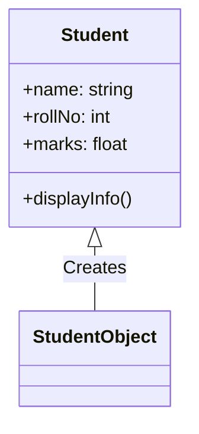
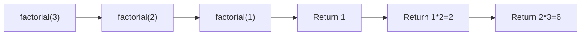
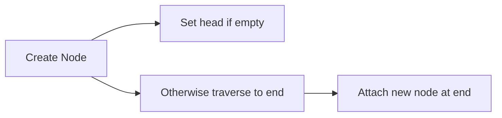
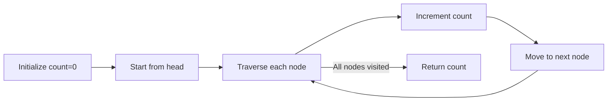
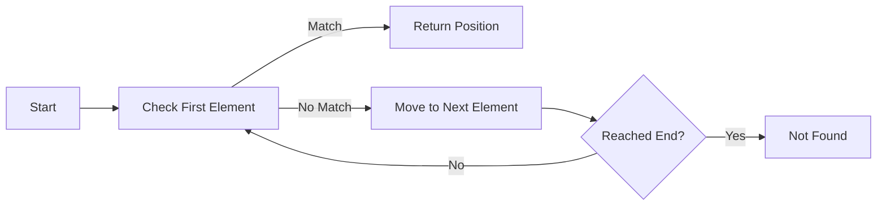
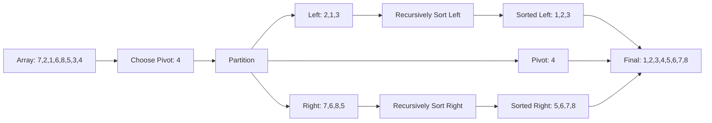
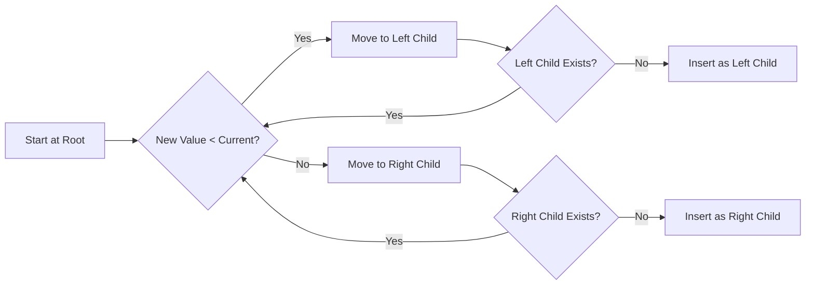

## Question 1(a) [3 marks]

**Define linear data structure and give its examples.**

**Answer**:
A linear data structure is a collection of elements arranged in sequential order where each element has exactly one predecessor and one successor (except first and last elements).

**Table: Linear Data Structures Examples**

| Data Structure | Description |
|---------------|-------------|
| Array | Fixed-size collection of elements accessed by index |
| Linked List | Chain of nodes with data and reference to next node |
| Stack | LIFO (Last In First Out) structure |
| Queue | FIFO (First In First Out) structure |

**Mnemonic:** "ALSQ are in a Line"

## Question 1(b) [4 marks]

**Define time and space complexity.**

**Answer**:
Time and space complexity measure algorithm efficiency in terms of execution time and memory usage as input size grows.

**Table: Complexity Comparison**

| Complexity Type | Definition | Measurement | Importance |
|----------------|------------|-------------|------------|
| Time Complexity | Measures execution time required by an algorithm as a function of input size | Big O notation (O(n), O(1), O(n²)) | Determines how fast an algorithm runs |
| Space Complexity | Measures memory space required by an algorithm as a function of input size | Big O notation (O(n), O(1), O(n²)) | Determines how much memory an algorithm needs |

**Mnemonic:** "TS: Time-Speed and Space-Storage"

## Question 1(c) [7 marks]

**Explain the concept of class and object with example.**

**Answer**:
Classes and objects are fundamental OOP concepts where classes are blueprints for creating objects with attributes and behaviors.

**Diagram: Class and Object Relationship**



**Code Example:**

```python
class Student:
    def __init__(self, name, rollNo, marks):
        self.name = name
        self.rollNo = rollNo
        self.marks = marks
    
    def displayInfo(self):
        print(f"Name: {self.name}, Roll No: {self.rollNo}, Marks: {self.marks}")

# Creating object
student1 = Student("Raj", 101, 85.5)
student1.displayInfo()
```

- **Class**: Blueprint defining attributes (name, rollNo, marks) and methods (displayInfo)
- **Object**: Instance (student1) created from the class with specific values

**Mnemonic:** "CAR - Class defines Attributes and Routines"

## Question 1(c) OR [7 marks]

**Explain instance method, class method and static method with example.**

**Answer**:
Python supports three method types: instance, class, and static methods, each serving different purposes.

**Table: Comparison of Method Types**

| Method Type | Decorator | First Parameter | Purpose | Access |
|-------------|-----------|-----------------|---------|--------|
| Instance Method | None | self | Operate on instance data | Can access/modify instance state |
| Class Method | @classmethod | cls | Operate on class data | Can access/modify class state |
| Static Method | @staticmethod | None | Utility functions | Cannot access instance or class state |

**Code Example:**

```python
class Student:
    school = "ABC School"  # class variable
    
    def __init__(self, name):
        self.name = name  # instance variable
    
    def instance_method(self):  # instance method
        return f"Hi {self.name} from {self.school}"
    
    @classmethod
    def class_method(cls):  # class method
        return f"School is {cls.school}"
    
    @staticmethod
    def static_method():  # static method
        return "This is a utility function"
```

**Mnemonic:** "ICS: Instance-Self, Class-Cls, Static-Solo"

## Question 2(a) [3 marks]

**Explain concept of recursive function.**

**Answer**:
A recursive function is a function that calls itself during its execution to solve smaller instances of the same problem.

**Diagram: Recursive Function Execution**



**Mnemonic:** "BASE and RECURSE - Base case stops, Recursion repeats"

## Question 2(b) [4 marks]

**Define stack and queue.**

**Answer**:
Stack and queue are linear data structures with different access patterns for data insertion and removal.

**Table: Stack vs Queue**

| Feature | Stack | Queue |
|---------|-------|-------|
| Access Pattern | LIFO (Last In First Out) | FIFO (First In First Out) |
| Operations | Push (insert), Pop (remove) | Enqueue (insert), Dequeue (remove) |
| Access Points | Single end (top) | Two ends (front, rear) |
| Visualization | Like plates stacked vertically | Like people in a line |
| Applications | Function calls, undo operations | Print jobs, process scheduling |

**Mnemonic:** "SLIFF vs QFIFF - Stack-LIFO vs Queue-FIFO"

## Question 2(c) [7 marks]

**Explain basic operations on stack.**

**Answer**:
Stack operations follow LIFO (Last In First Out) principle with the following basic operations:

**Table: Stack Operations**

| Operation | Description | Time Complexity |
|-----------|-------------|-----------------|
| Push | Insert element at the top | O(1) |
| Pop | Remove element from the top | O(1) |
| Peek/Top | View top element without removing | O(1) |
| isEmpty | Check if stack is empty | O(1) |
| isFull | Check if stack is full (for array implementation) | O(1) |

**Diagram: Stack Operations**

```goat
       +---+    Push
       | 8 | <-------
Top -> +---+
       | 5 |    Pop
       +---+ -------->
       | 3 |
       +---+
       | 1 |
       +---+
```

**Code Example:**

```python
class Stack:
    def __init__(self):
        self.items = []
    
    def push(self, item):
        self.items.append(item)
    
    def pop(self):
        if not self.isEmpty():
            return self.items.pop()
    
    def peek(self):
        if not self.isEmpty():
            return self.items[-1]
    
    def isEmpty(self):
        return len(self.items) == 0
```

**Mnemonic:** "PIPES - Push In, Pop Exit, See top"

## Question 2(a) OR [3 marks]

**Define singly linked list.**

**Answer**:
A singly linked list is a linear data structure with a collection of nodes where each node contains data and a reference to the next node.

**Diagram: Singly Linked List**

```goat
    +---------+    +---------+    +---------+    +---------+
    | Data:10 |    | Data:20 |    | Data:30 |    | Data:40 |
    |  Next:--|--->|  Next:--|--->|  Next:--|--->|  Next:/0|
    +---------+    +---------+    +---------+    +---------+
     Head Node                                    Tail Node
```

**Mnemonic:** "DNL - Data and Next Link"

## Question 2(b) OR [4 marks]

**Explain Enqueue and Dequeue operations on Queue.**

**Answer**:
Enqueue and Dequeue are the primary operations for adding and removing elements in a queue data structure.

**Table: Queue Operations**

| Operation | Description | Implementation | Time Complexity |
|-----------|-------------|----------------|-----------------|
| Enqueue | Add element at the rear end | queue.append(element) | O(1) |
| Dequeue | Remove element from the front end | element = queue.pop(0) | O(1) with linked list, O(n) with array |

**Diagram: Queue Operations**

```goat
      Enqueue                         Dequeue
     -------->                       --------->
     +-----+    +-----+    +-----+    +-----+
Rear |  30 |    |  20 |    |  10 |   Front
     +-----+    +-----+    +-----+
```

**Mnemonic:** "ERfDFr - Enqueue at Rear, Dequeue from Front"

## Question 2(c) OR [7 marks]

**Convert expression A+B/C+D to postfix and evaluate postfix expression using stack assuming some values for A, B, C and D.**

**Answer**:
Converting and evaluating the expression "A+B/C+D" using stack:

**Step 1: Convert to Postfix**

**Table: Infix to Postfix Conversion**

| Symbol | Stack | Output | Action |
|--------|-------|--------|--------|
| A | | A | Add to output |
| + | + | A | Push to stack |
| B | + | A B | Add to output |
| / | + / | A B | Push to stack (higher precedence) |
| C | + / | A B C | Add to output |
| + | + | A B C / | Pop all higher/equal precedence, push + |
| D | + | A B C / + D | Add to output |
| End | | A B C / + D + | Pop remaining operators |

**Final Postfix:** A B C / + D +

**Step 2: Evaluate with values A=5, B=10, C=2, D=3**

**Table: Postfix Evaluation**

| Symbol | Stack | Calculation |
|--------|-------|-------------|
| 5 (A) | 5 | Push value |
| 10 (B) | 5, 10 | Push value |
| 2 (C) | 5, 10, 2 | Push value |
| / | 5, 5 | 10/2 = 5 |
| + | 10 | 5+5 = 10 |
| 3 (D) | 10, 3 | Push value |
| + | 13 | 10+3 = 13 |

**Result:** 13

**Mnemonic:** "PC-SE - Push operands, Calculate when operators, Stack holds Everything"

## Question 3(a) [3 marks]

**Enlist applications of Linked List.**

**Answer**:
Linked lists are versatile data structures with many practical applications.

**Table: Applications of Linked List**

| Application | Why Linked List is Used |
|-------------|-------------------------|
| Dynamic Memory Allocation | Efficient insertion/deletion without reallocation |
| Implementing Stacks & Queues | Can grow and shrink as needed |
| Undo Functionality | Easy to add/remove operations from history |
| Hash Tables | For handling collisions via chaining |
| Music Playlists | Easy navigation between songs (next/previous) |

**Mnemonic:** "DSUHM - Dynamic allocation, Stacks & queues, Undo, Hash tables, Music players"

## Question 3(b) [4 marks]

**Explain creation of singly linked list in python.**

**Answer**:
Creating a singly linked list in Python involves defining a Node class and implementing basic operations.

**Code Example:**

```python
class Node:
    def __init__(self, data):
        self.data = data
        self.next = None

class LinkedList:
    def __init__(self):
        self.head = None
    
    def append(self, data):
        new_node = Node(data)
        # If empty list, set new node as head
        if self.head is None:
            self.head = new_node
            return
        # Traverse to the end and add node
        last = self.head
        while last.next:
            last = last.next
        last.next = new_node
```

**Diagram: Creating a Linked List**



**Mnemonic:** "CHEN - Create nodes, Head first, End attachment, Next pointers"

## Question 3(c) [7 marks]

**Write a code to insert a new node at the beginning and end of singly linked list.**

**Answer**:
Adding nodes at the beginning and end of a singly linked list requires different approaches.

**Code Example:**

```python
class Node:
    def __init__(self, data):
        self.data = data
        self.next = None

class LinkedList:
    def __init__(self):
        self.head = None
    
    # Insert at beginning (prepend)
    def insert_at_beginning(self, data):
        new_node = Node(data)
        new_node.next = self.head
        self.head = new_node
    
    # Insert at end (append)
    def insert_at_end(self, data):
        new_node = Node(data)
        # If empty list
        if self.head is None:
            self.head = new_node
            return
        
        # Traverse to last node
        current = self.head
        while current.next:
            current = current.next
        
        # Attach new node
        current.next = new_node
```

**Diagram: Insertion Operations**

```goat
  Insert at Beginning:          Insert at End:
  +---------+       +-----+     +-----+     +-----+     +---------+
  | New Node|------>| Head|     | Head|---->| ... |---->| New Node|
  +---------+       +-----+     +-----+     +-----+     +---------+
```

**Mnemonic:** "BEN - Beginning is Easy and Next-based, End Needs traversal"

## Question 3(a) OR [3 marks]

**Write a code to count the number of nodes in singly linked list.**

**Answer**:
Counting nodes requires traversing the entire linked list from head to tail.

**Code Example:**

```python
def count_nodes(self):
    count = 0
    current = self.head
    
    # Traverse the list and count nodes
    while current:
        count += 1
        current = current.next
    
    return count
```

**Diagram: Counting Nodes**



**Mnemonic:** "CIT - Count Incrementally while Traversing"

## Question 3(b) OR [4 marks]

**Match appropriate options from column A and B**

**Answer**:
The matching between different linked list types and their characteristics:

**Table: Matching Linked List Types with Characteristics**

| Column A | Column B | Match |
|----------|----------|-------|
| 1. Singly Linked List | c. Nodes contain data and a reference to the next node | 1-c |
| 2. Doubly Linked List | d. Nodes contain data and references to both the next and previous nodes | 2-d |
| 3. Circular Linked List | b. Nodes form a loop where the last node points to the first node | 3-b |
| 4. Node in a Linked List | a. Basic unit containing data and references | 4-a |

**Diagram: Different Linked List Types**

```goat
Singly Linked:    A->B->C->D->null
Doubly Linked:    A<->B<->C<->D<->null
Circular Linked:  A->B->C->D-+
                  ^          |
                  +----------+
```

**Mnemonic:** "SDCN - Single-Direction, Double-Direction, Circular-Connection, Node-Component"

## Question 3(c) OR [7 marks]

**Explain deletion of first and last node in singly linked list.**

**Answer**:
Deleting nodes from a singly linked list varies in complexity based on the position (first vs. last).

**Table: Deletion Comparison**

| Position | Approach | Time Complexity | Special Case |
|----------|----------|-----------------|-------------|
| First Node | Change head pointer | O(1) | Check if list is empty |
| Last Node | Traverse to second-last node | O(n) | Handle single node list |

**Code Example:**

```python
def delete_first(self):
    # Check if list is empty
    if self.head is None:
        return
    
    # Update head to second node
    self.head = self.head.next

def delete_last(self):
    # Check if list is empty
    if self.head is None:
        return
    
    # If only one node
    if self.head.next is None:
        self.head = None
        return
    
    # Traverse to second last node
    current = self.head
    while current.next.next:
        current = current.next
    
    # Remove last node
    current.next = None
```

**Diagram: Deletion Operations**

```goat
Delete First:               Delete Last:
+-----+     +-----+         +-----+     +-----+     +-----+
| Head|---->| Next|   =>    | Head|---->| Next|---->| Last|   =>
+-----+     +-----+         +-----+     +-----+     +-----+
                            +-----+     +-----+
                            | Head|---->| Next|--X
                            +-----+     +-----+
```

**Mnemonic:** "FELO - First is Easy, Last needs One-before-last"

## Question 4(a) [3 marks]

**Explain concept of doubly linked list.**

**Answer**:
A doubly linked list is a bidirectional linear data structure with nodes containing data, previous, and next references.

**Diagram: Doubly Linked List**

```goat
    +-------------------+     +-------------------+     +-------------------+
    | prev | data | next|     | prev | data | next|     | prev | data | next|
NULL<------|  10  |---->|<----|  20  |---->|<-----|  30 |----->NULL         |
    +-------------------+     +-------------------+     +-------------------+
```

**Mnemonic:** "PDN - Previous, Data, Next"

## Question 4(b) [4 marks]

**Explain concept of linear search.**

**Answer**:
Linear search is a simple sequential search algorithm that checks each element one by one until finding the target.

**Table: Linear Search Characteristics**

| Aspect | Description |
|--------|-------------|
| Working | Sequentially check each element from start to end |
| Time Complexity | O(n) - worst and average case |
| Best Case | O(1) - element found at first position |
| Suitability | Small lists or unsorted data |
| Advantage | Simple implementation, works on any collection |

**Diagram: Linear Search Process**



**Mnemonic:** "SCENT - Search Consecutively Each element until Target"

## Question 4(c) [7 marks]

**Write a code to implement binary search algorithm.**

**Answer**:
Binary search is an efficient algorithm for finding elements in a sorted array by repeatedly dividing the search interval in half.

**Code Example:**

```python
def binary_search(arr, target):
    left = 0
    right = len(arr) - 1
    
    while left <= right:
        mid = (left + right) // 2
        
        # Check if target is present at mid
        if arr[mid] == target:
            return mid
        
        # If target is greater, ignore left half
        elif arr[mid] < target:
            left = mid + 1
        
        # If target is smaller, ignore right half
        else:
            right = mid - 1
    
    # Target not found
    return -1
```

**Diagram: Binary Search Process**

```goat
 Array: [10, 20, 30, 40, 50, 60, 70]
 Search: 40

 Step 1: mid = 3, arr[mid] = 40 (Found!)
  left                 right
   |                     |
  [10, 20, 30, 40, 50, 60, 70]
               ^
              mid
```

**Mnemonic:** "MCLR - Middle Compare, Left or Right adjust"

## Question 4(a) OR [3 marks]

**Explain concept of selection sort algorithm.**

**Answer**:
Selection sort is a simple comparison-based sorting algorithm that divides the array into sorted and unsorted regions.

**Table: Selection Sort Characteristics**

| Aspect | Description |
|--------|-------------|
| Approach | Find minimum element from unsorted part and place at beginning |
| Time Complexity | O(n²) - worst, average, and best cases |
| Space Complexity | O(1) - in-place sorting |
| Stability | Not stable (equal elements may change relative order) |
| Advantage | Simple implementation with minimal memory usage |

**Mnemonic:** "FSMR - Find Smallest, Move to Right position, Repeat"

## Question 4(b) OR [4 marks]

**Explain bubble sort method.**

**Answer**:
Bubble sort is a simple sorting algorithm that repeatedly steps through the list, compares adjacent elements, and swaps them if they're in the wrong order.

**Table: Bubble Sort Characteristics**

| Aspect | Description |
|--------|-------------|
| Approach | Repeatedly compare adjacent elements and swap if needed |
| Passes | (n-1) passes for n elements |
| Time Complexity | O(n²) - worst and average case, O(n) - best case |
| Space Complexity | O(1) - in-place sorting |
| Optimization | Early termination if no swaps occur in a pass |

**Diagram: Bubble Sort Process**

```goat
Array: [5, 3, 8, 4, 2]

Pass 1: [3, 5, 4, 2, 8]
        ^-^ ^-^ ^-^
         
Pass 2: [3, 4, 2, 5, 8]
         ^-^ ^-^

Pass 3: [3, 2, 4, 5, 8]
         ^-^

Pass 4: [2, 3, 4, 5, 8] (Sorted)
         ^-^
```

**Mnemonic:** "CABS - Compare Adjacent, Bubble-up Swapping"

## Question 4(c) OR [7 marks]

**Explain the working of quick sort method with example.**

**Answer**:
Quick sort is an efficient divide-and-conquer sorting algorithm that works by selecting a pivot element and partitioning the array.

**Table: Quick Sort Steps**

| Step | Description |
|------|-------------|
| 1 | Choose a pivot element from the array |
| 2 | Partition: Rearrange elements (smaller than pivot to left, larger to right) |
| 3 | Recursively apply quick sort to subarrays on left and right of pivot |

**Example with Array [7, 2, 1, 6, 8, 5, 3, 4]**:

```
Pivot: 4
After partition: [2, 1, 3] 4 [7, 6, 8, 5]
                 Left      P  Right

Recursively sort left: [1] 2 [3] → [1, 2, 3]
Recursively sort right: [5] 7 [6, 8] → [5, 6, 7, 8]

Final sorted array: [1, 2, 3, 4, 5, 6, 7, 8]
```

**Diagram: Quick Sort Partitioning**



**Mnemonic:** "PPR - Pivot, Partition, Recursive divide"

## Question 5(a) [3 marks]

**Explain binary tree.**

**Answer**:
A binary tree is a hierarchical data structure where each node has at most two children referred to as left and right child.

**Diagram: Binary Tree**

```goat
        A
       / \
      B   C
     / \   \
    D   E   F
```

**Table: Binary Tree Properties**

| Property | Description |
|----------|-------------|
| Node | Contains data and references to left and right children |
| Depth | Length of path from root to the node |
| Height | Length of the longest path from node to a leaf |
| Binary Tree | Each node has at most 2 children |

**Mnemonic:** "RLTM - Root, Left, Two, Maximum"

## Question 5(b) [4 marks]

**Define the terms root, path, parent and children with reference to tree.**

**Answer**:
Trees have specific terminology to describe relationships between nodes in the hierarchy.

**Table: Tree Terminology**

| Term | Definition |
|------|------------|
| Root | Topmost node of the tree with no parent |
| Path | Sequence of nodes connected by edges from one node to another |
| Parent | Node that has one or more child nodes |
| Children | Nodes directly connected to a parent node |

**Diagram: Tree Terminology**

```goat
        A  <-- Root
       / \
      B   C  <-- Children of A, A is Parent
     / \   \   
    D   E   F  <-- Path from A to F: A->C->F
```

**Mnemonic:** "RPPC - Root at Top, Path connects, Parent above, Children below"

## Question 5(c) [7 marks]

**Apply preorder and postorder traversal for given below tree.**

**Answer**:
Preorder and postorder are depth-first tree traversal methods with different node visiting sequences.

**Given Tree:**

```goat
        40
       /  \
     30    50
    / \    / \
   25 35  45  60
  / \        / \
 15  28     55  70
```

**Table: Tree Traversal Comparison**

| Traversal | Order | Result for Given Tree |
|-----------|-------|------------------------|
| Preorder | Root, Left, Right | 40, 30, 25, 15, 28, 35, 50, 45, 60, 55, 70 |
| Postorder | Left, Right, Root | 15, 28, 25, 35, 30, 45, 55, 70, 60, 50, 40 |

**Code Example:**

```python
def preorder(root):
    if root:
        print(root.data, end=", ")  # Visit root
        preorder(root.left)         # Visit left subtree
        preorder(root.right)        # Visit right subtree

def postorder(root):
    if root:
        postorder(root.left)        # Visit left subtree
        postorder(root.right)       # Visit right subtree
        print(root.data, end=", ")  # Visit root
```

**Mnemonic:** "PRE-NLR, POST-LRN - Preorder (Node-Left-Right), Postorder (Left-Right-Node)"

## Question 5(a) OR [3 marks]

**Enlist applications of binary tree.**

**Answer**:
Binary trees have numerous practical applications in various fields of computer science.

**Table: Binary Tree Applications**

| Application | Description |
|-------------|-------------|
| Binary Search Trees | Efficient searching, insertion, and deletion operations |
| Expression Trees | Representing mathematical expressions for evaluation |
| Huffman Coding | Data compression algorithms |
| Priority Queues | Implementation of heap data structure |
| Decision Trees | Classification algorithms in machine learning |

**Mnemonic:** "BEHPD - BST, Expression, Huffman, Priority queue, Decision tree"

## Question 5(b) OR [4 marks]

**Explain insertion of a node in binary search tree.**

**Answer**:
Insertion in a Binary Search Tree (BST) follows the BST property: left child < parent < right child.

**Table: Insertion Steps in BST**

| Step | Description |
|------|-------------|
| 1 | Start at the root node |
| 2 | If new value < current node value, go to left subtree |
| 3 | If new value > current node value, go to right subtree |
| 4 | Repeat until finding an empty position (null pointer) |
| 5 | Insert the new node at the empty position found |

**Diagram: BST Insertion**



**Mnemonic:** "LSRG - Less-go-left, Same-or-greater-go-right"

## Question 5(c) OR [7 marks]

**Draw Binary search tree for 8, 4, 12, 2, 6, 10, 14, 1, 3, 5 and write In-order traversal for the tree.**

**Answer**:
Binary Search Tree (BST) is constructed by inserting nodes while maintaining the BST property.

**Binary Search Tree for the given elements:**

```goat
        8
       / \
      4   12
     / \  / \
    2   6 10 14
   / \  /
  1   3 5
```

**Table: BST Construction Process**

| Step | Insert | Tree Structure |
|------|--------|----------------|
| 1 | 8 | Root = 8 |
| 2 | 4 | Left of 8 |
| 3 | 12 | Right of 8 |
| 4 | 2 | Left of 4 |
| 5 | 6 | Right of 4 |
| 6 | 10 | Left of 12 |
| 7 | 14 | Right of 12 |
| 8 | 1 | Left of 2 |
| 9 | 3 | Right of 2 |
| 10 | 5 | Left of 6 |

**In-order Traversal:**

An in-order traversal visits nodes in the order: left subtree, current node, right subtree.

For the given BST, the in-order traversal is:
1, 2, 3, 4, 5, 6, 8, 10, 12, 14

**Code Example:**

```python
def inorder_traversal(root):
    if root:
        inorder_traversal(root.left)    # Visit left subtree
        print(root.data, end=", ")      # Visit current node
        inorder_traversal(root.right)   # Visit right subtree
```

**Mnemonic:** "LNR - Left, Node, Right makes sorted order in BST"
