## પ્રશ્ન 1(અ) [3 ગુણ]

**લીન્કડ લીસ્ટની વ્યાખ્યા આપો. વિવિધ પ્રકારના લિન્ક્ડ લીસ્ટ ની યાદી આપો.**

**જવાબ**:

| વ્યાખ્યા | લિન્ક્ડ લિસ્ટના પ્રકાર |
|------------|---------------------|
| લિન્ક્ડ લિસ્ટ એ લીનિયર ડેટા સ્ટ્રક્ચર છે જેમાં એલિમેન્ટ્સ નોડ્સમાં સ્ટોર થાય છે, અને દરેક નોડ ક્રમમાં આગળના નોડને પોઇન્ટ કરે છે | 1. સિંગલી લિન્ક્ડ લિસ્ટ <br> 2. ડબલી લિન્ક્ડ લિસ્ટ <br> 3. સર્ક્યુલર લિન્ક્ડ લિસ્ટ <br> 4. સર્ક્યુલર ડબલી લિન્ક્ડ લિસ્ટ |

**ડાયાગ્રામ:**

```goat
Singly:     [Data|Next] → [Data|Next] → [Data|Next] → NULL
Doubly:     [Prev|Data|Next] ⟷ [Prev|Data|Next] ⟷ [Prev|Data|Next] → NULL
Circular:   [Data|Next] → [Data|Next] → [Data|Next] ↩
```

**મેમરી ટ્રીક:** "એક, બે, ગોળ, બે-ગોળ"

## પ્રશ્ન 1(બ) [4 ગુણ]

**પાયથનમાં લીનીયર અને નોન-લીનીયર ડેટા સ્ટર્ચર ઉદાહરણ સાથે સમજાવો.**

**જવાબ**:

| ડેટા સ્ટ્રક્ચર | વર્ણન | પાયથન ઉદાહરણો |
|----------------|-------------|----------------|
| લીનીયર | એલિમેન્ટ્સ ક્રમિક રીતે ગોઠવાયેલા હોય છે જેમાં દરેક એલિમેન્ટને એકદમ એક અગાઉનું અને એક પછીનું એલિમેન્ટ હોય છે (પ્રથમ અને છેલ્લા સિવાય) | Lists: `[1, 2, 3]` <br> Tuples: `(1, 2, 3)` <br> Strings: `"abc"` <br> Queue: `queue.Queue()` |
| નોન-લીનીયર | એલિમેન્ટ્સ ક્રમિક રીતે ગોઠવાયેલા નથી; એક એલિમેન્ટ અનેક એલિમેન્ટ્સ સાથે જોડાઈ શકે છે | Dictionary: `{"a": 1, "b": 2}` <br> Set: `{1, 2, 3}` <br> Tree: કસ્ટમ ઇમ્પ્લીમેન્ટેશન <br> Graph: કસ્ટમ ઇમ્પ્લીમેન્ટેશન |

**ડાયાગ્રામ:**

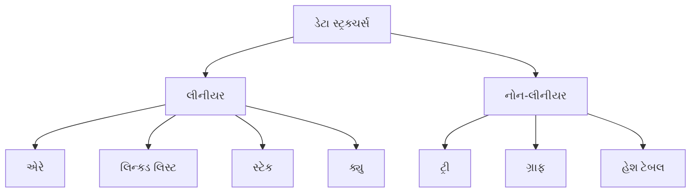

**મેમરી ટ્રીક:** "લીનીયર લાઈનમાં, નોન-લીનીયર ચારે બાજુ"

## પ્રશ્ન 1(ક) [7 ગુણ]

**પાયથનમાં ક્લાસ, એટ્રીબ્યુટ, ઓબ્જેક્ટ અને ક્લાસ મેથડ યોગ્ય ઉદાહરણ સાથે સમજાવો.**

**જવાબ**:

**ડાયાગ્રામ:**

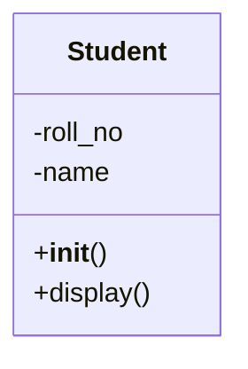

| શબ્દ | વર્ણન |
|------|-------------|
| ક્લાસ | ઓબ્જેક્ટ્સ બનાવવા માટેનો બ્લૂપ્રિન્ટ, જેમાં શેર્ડ એટ્રિબ્યુટ્સ અને મેથડ્સ હોય છે |
| એટ્રિબ્યુટ્સ | ક્લાસની અંદર ડેટા સ્ટોર કરતા વેરિએબલ્સ |
| ઓબ્જેક્ટ | ક્લાસનું ઇન્સ્ટન્સ, જેમાં ચોક્કસ એટ્રિબ્યુટ વેલ્યુ હોય છે |
| ક્લાસ મેથડ | ક્લાસની અંદર ડિફાઇન થયેલા ફંક્શન્સ જે ક્લાસની સ્થિતિને એક્સેસ અને મોડિફાય કરી શકે છે |

**કોડ:**

```python
class Student:
    # ક્લાસ એટ્રિબ્યુટ
    school = "GTU"
    
    # કન્સ્ટ્રક્ટર
    def __init__(self, roll_no, name):
        # ઇન્સ્ટન્સ એટ્રિબ્યુટ્સ
        self.roll_no = roll_no
        self.name = name
    
    # ઇન્સ્ટન્સ મેથડ
    def display(self):
        print(f"Roll No: {self.roll_no}, Name: {self.name}")
    
    # ક્લાસ મેથડ
    @classmethod
    def change_school(cls, new_school):
        cls.school = new_school

# ઓબ્જેક્ટ બનાવવું
student1 = Student(101, "રાજ")
student1.display()  # આઉટપુટ: Roll No: 101, Name: રાજ
```

**મેમરી ટ્રીક:** "ક્લાસ બનાવે, એટ્રિબ્યુટ સંગ્રહે, ઓબ્જેક્ટ વાપરે, મેથડ ક્રિયા કરે"

## પ્રશ્ન 1(ક) OR [7 ગુણ]

**ડેટા એન્કેપ્સુલેસન અને પોલી મોર્ફીસમની વ્યાખ્યા આપો. પોલી મોર્ફીસમ સમજાવવા માટેનો પાયથન કોડ વિકસાવો.**

**જવાબ**:

| કોન્સેપ્ટ | વ્યાખ્યા |
|---------|------------|
| ડેટા એન્કેપ્સુલેસન | ડેટા અને મેથડ્સને એક એકમ (ક્લાસ)માં બંધ કરવા અને કેટલાક કોમ્પોનન્ટ્સને સીધી એક્સેસથી પ્રતિબંધિત કરવા |
| પોલીમોર્ફિઝમ | વિવિધ ક્લાસને એક જ નામના મેથડનો પોતાનો અમલ પૂરો પાડવાની ક્ષમતા |

**ડાયાગ્રામ:**

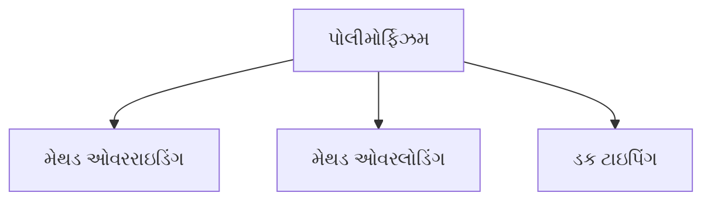

**કોડ:**

```python
# પોલીમોર્ફિઝમ ઉદાહરણ
class Animal:
    def speak(self):
        pass

class Dog(Animal):
    def speak(self):
        return "ભૌં ભૌં!"

class Cat(Animal):
    def speak(self):
        return "મ્યાઉં!"

class Duck(Animal):
    def speak(self):
        return "ક્વેક!"

# પોલીમોર્ફિઝમ દર્શાવતું ફંક્શન
def animal_sound(animal):
    return animal.speak()

# ઓબ્જેક્ટ્સ બનાવવા
dog = Dog()
cat = Cat()
duck = Duck()

# એક જ ફંક્શન વિવિધ પ્રાણી ઓબ્જેક્ટ્સ માટે કામ કરે છે
print(animal_sound(dog))   # આઉટપુટ: ભૌં ભૌં!
print(animal_sound(cat))   # આઉટપુટ: મ્યાઉં!
print(animal_sound(duck))  # આઉટપુટ: ક્વેક!
```

**મેમરી ટ્રીક:** "એન્કેપ્સુલેશન છુપાવે છે, પોલીમોર્ફિઝમ બદલાય છે"

## પ્રશ્ન 2(અ) [3 ગુણ]

**સ્ટેક અને ક્યુ નો તફાવત આપો.**

**જવાબ**:

| ફીચર | સ્ટેક | ક્યુ |
|---------|-------|-------|
| સિદ્ધાંત | LIFO (છેલ્લું આવે પહેલું જાય) | FIFO (પહેલું આવે પહેલું જાય) |
| ઓપરેશન | પુશ, પોપ | એનક્યુ, ડિક્યુ |
| એક્સેસ | એલિમેન્ટ્સ ફક્ત એક છેડેથી ઉમેરાય/દૂર થાય છે (ટોપ) | એલિમેન્ટ્સ છેલ્લે ઉમેરાય છે અને આગળથી દૂર થાય છે |

**ડાયાગ્રામ:**

```goat
Stack:       [3]      Queue:  [1] → [2] → [3]
             [2]              Front      Rear
             [1]      
             ---
```

**મેમરી ટ્રીક:** "સ્ટેક ઉપરનું પહેલા, ક્યુ આગળનું પહેલા"

## પ્રશ્ન 2(બ) [4 ગુણ]

**પુશ અને પોપ ઓપરેશન માટેનો અલ્ગોરીધમ લખો.**

**જવાબ**:

**PUSH અલ્ગોરિધમ:**

```goat
શરુઆત
  1. ચેક કરો કે સ્ટેક ભરેલો છે કે નહીં
  2. જો ભરેલો ન હોય, તો top ને 1 વધારો
  3. 'top' પોઝિશન પર એલિમેન્ટ ઉમેરો
સમાપ્ત
```

**POP અલ્ગોરિધમ:**

```goat
શરુઆત
  1. ચેક કરો કે સ્ટેક ખાલી છે કે નહીં
  2. જો ખાલી ન હોય, તો 'top' પરના એલિમેન્ટને લો
  3. top ને 1 ઘટાડો
  4. મેળવેલ એલિમેન્ટ પાછો આપો
સમાપ્ત
```

**કોડ:**

```python
class Stack:
    def __init__(self, size):
        self.stack = []
        self.size = size
        self.top = -1
    
    def push(self, element):
        if self.top >= self.size - 1:
            return "Stack Overflow"
        else:
            self.top += 1
            self.stack.append(element)
            return "Pushed " + str(element)
    
    def pop(self):
        if self.top < 0:
            return "Stack Underflow"
        else:
            element = self.stack.pop()
            self.top -= 1
            return element
```

**મેમરી ટ્રીક:** "ટોપ પર પુશ, ટોપથી પોપ"

## પ્રશ્ન 2(ક) [7 ગુણ]

**નીચે. આપેલ સમીકરણ ને ઇન્ફીક્સ માંથી પોસ્ટફિક્ષ માં બદલો.**
**A * (B + C) - D / (E + F)**

**જવાબ**:

**ડાયાગ્રામ:**

```goat
Infix:   A * (B + C) - D / (E + F)
Postfix: A B C + * D E F + / -
```

| સ્ટેપ | સિમ્બોલ | સ્ટેક | આઉટપુટ |
|------|--------|-------|--------|
| 1 | A | | A |
| 2 | * | * | A |
| 3 | ( | * ( | A |
| 4 | B | * ( | A B |
| 5 | + | * ( + | A B |
| 6 | C | * ( + | A B C |
| 7 | ) | * | A B C + |
| 8 | - | - | A B C + * |
| 9 | D | - | A B C + * D |
| 10 | / | - / | A B C + * D |
| 11 | ( | - / ( | A B C + * D |
| 12 | E | - / ( | A B C + * D E |
| 13 | + | - / ( + | A B C + * D E |
| 14 | F | - / ( + | A B C + * D E F |
| 15 | ) | - / | A B C + * D E F + |
| 16 | end | | A B C + * D E F + / - |

**જવાબ:** `A B C + * D E F + / -`

**મેમરી ટ્રીક:** "ઓપરેટર સ્ટેક પર, ઓપરન્ડ સીધા પ્રિન્ટ"

## પ્રશ્ન 2(અ) OR [3 ગુણ]

**સિમ્પલ ક્યુ અને સર્ક્યુલર ક્યુ નો તફાવત આપો.**

**જવાબ**:

| ફીચર | સિમ્પલ ક્યુ | સર્ક્યુલર ક્યુ |
|---------|--------------|----------------|
| સ્ટ્રક્ચર | લીનિયર ડેટા સ્ટ્રક્ચર | જોડાયેલા છેડાવાળો લીનિયર ડેટા સ્ટ્રક્ચર |
| મેમરી | ડિક્યુ પછી ખાલી જગ્યાઓને કારણે અકાર્યક્ષમ મેમરી વપરાશ | ખાલી જગ્યાઓનો ફરીથી ઉપયોગ કરીને કાર્યક્ષમ મેમરી વપરાશ |
| ઇમ્પ્લિમેન્ટેશન | ફ્રન્ટ હંમેશા ઇન્ડેક્સ 0 પર, રીયર વધે | ફ્રન્ટ અને રીયર મોડ્યુલો ઓપરેશન સાથે સર્ક્યુલર રીતે ફરે |

**ડાયાગ્રામ:**

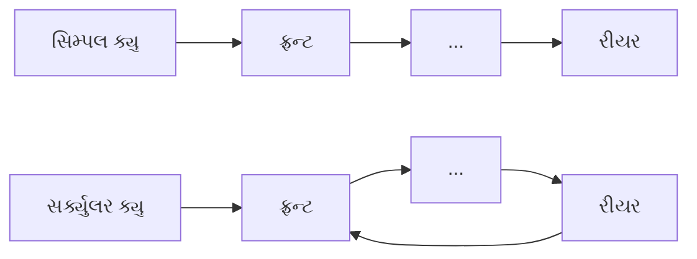

**મેમરી ટ્રીક:** "સાદી વેડફે, ગોળ ફરીથી વાપરે"

## પ્રશ્ન 2(બ) OR [4 ગુણ]

**રીકસીવ ફંક્શનનો કોન્સેપ્ટ યોગ્ય ઉદાહરણ સાથે સમજાવો.**

**જવાબ**:

| મુખ્ય પાસાઓ | વર્ણન |
|-------------|-------------|
| વ્યાખ્યા | એવું ફંક્શન જે એક જ સમસ્યાના નાના ભાગને હલ કરવા માટે પોતાને જ કોલ કરે છે |
| બેઝ કેસ | એવી સ્થિતિ જ્યાં ફંક્શન પોતાને કોલ કરવાનું બંધ કરે છે |
| રિકર્સિવ કેસ | એવી સ્થિતિ જ્યાં ફંક્શન સમસ્યાના સરળ સ્વરૂપ સાથે પોતાને કોલ કરે છે |

**ડાયાગ્રામ:**

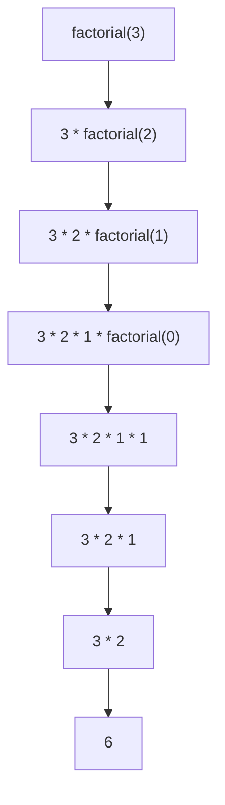

**કોડ:**

```python
def factorial(n):
    # બેઝ કેસ
    if n == 0:
        return 1
    # રિકર્સિવ કેસ
    else:
        return n * factorial(n-1)

# ઉદાહરણ
result = factorial(5)  # 5! = 120
```

**મેમરી ટ્રીક:** "બેઝ તોડે, રિકર્શન પાછું આપે"

## પ્રશ્ન 2(ક) OR [7 ગુણ]

**Enqueue અને Dequeue ઓપરેશન માટેનો પાયથન કોડ વિકસાવો.**

**જવાબ**:

**ડાયાગ્રામ:**

```goat
Enqueue:
  [1][2][3] → [1][2][3][4]
  
Dequeue:
  [1][2][3][4] → [2][3][4]
```

**કોડ:**

```python
class Queue:
    def __init__(self, size):
        self.queue = []
        self.size = size
        self.front = 0
        self.rear = -1
        self.count = 0
    
    def enqueue(self, item):
        if self.count >= self.size:
            return "ક્યુ ભરેલી છે"
        else:
            self.rear += 1
            self.queue.append(item)
            self.count += 1
            return "Enqueued " + str(item)
    
    def dequeue(self):
        if self.count <= 0:
            return "ક્યુ ખાલી છે"
        else:
            item = self.queue.pop(0)
            self.count -= 1
            return item
    
    def display(self):
        return self.queue

# ટેસ્ટ
q = Queue(5)
q.enqueue(10)
q.enqueue(20)
q.enqueue(30)
print(q.display())  # [10, 20, 30]
print(q.dequeue())  # 10
print(q.display())  # [20, 30]
```

**મેમરી ટ્રીક:** "છેડે ઉમેરો, શરૂઆતથી કાઢો"

## પ્રશ્ન 3(અ) [3 ગુણ]

**સીન્ગલી લિન્ક્ડ લીસ્ટ અને સર્ક્યુલર લિન્ક્ડ લીસ્ટ નો તફાવત આપો.**

**જવાબ**:

| ફીચર | સિંગલી લિન્ક્ડ લિસ્ટ | સર્ક્યુલર લિન્ક્ડ લિસ્ટ |
|---------|-------------------|----------------------|
| છેલ્લો નોડ | NULL તરફ પોઇન્ટ કરે છે | પહેલા નોડ તરફ પાછો પોઇન્ટ કરે છે |
| ટ્રાવર્સલ | ચોક્કસ અંત ધરાવે છે | સતત ટ્રાવર્સ કરી શકાય છે |
| મેમરી | દરેક નોડને એક પોઇન્ટર જોઈએ | દરેક નોડને એક પોઇન્ટર જોઈએ |

**ડાયાગ્રામ:**

```goat
Singly:   [1] → [2] → [3] → NULL
Circular: [1] → [2] → [3] → ↩
```

**મેમરી ટ્રીક:** "સિંગલી અટકે, સર્ક્યુલર ફરે"

## પ્રશ્ન 3(બ) [4 ગુણ]

**ડબલી લિન્ક્ડ લીસ્ટ નો કોન્સેપ્ટ સમજાવો.**

**જવાબ**:

**ડાયાગ્રામ:**

```goat
NULL ← [Prev|1|Next] ⟷ [Prev|2|Next] ⟷ [Prev|3|Next] → NULL
```

| ફીચર | વર્ણન |
|---------|-------------|
| નોડ સ્ટ્રક્ચર | દરેક નોડમાં ડેટા અને બે પોઇન્ટર્સ (previous અને next) હોય છે |
| નેવિગેશન | આગળ અને પાછળ એમ બંને દિશામાં ટ્રાવર્સ કરી શકાય છે |
| ઓપરેશન્સ | બંને છેડેથી ઇન્સર્શન અને ડિલીશન કરી શકાય છે |
| મેમરી વપરાશ | વધારાના પોઇન્ટરને કારણે સિંગલી લિન્ક્ડ લિસ્ટ કરતા વધુ મેમરી જોઈએ |

**કોડ:**

```python
class Node:
    def __init__(self, data):
        self.data = data
        self.prev = None
        self.next = None
```

**મેમરી ટ્રીક:** "બે પોઇન્ટર, બે દિશા"

## પ્રશ્ન 3(ક) [7 ગુણ]

**નીચે આપેલ ઓપરેશન માટે અલગોરિધમ લખો:**
**૧. લીસ્ટ ની શરૂઆતમાં નોડ દાખલ કરવા**
**૨. લીસ્ટ ના અંતમાં નોડ દાખલ કરવા**

**જવાબ**:

**શરૂઆતમાં ઇન્સર્ટ:**

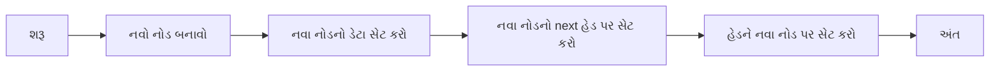

**અંતે ઇન્સર્ટ:**

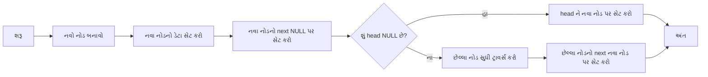

**કોડ:**

```python
def insert_at_beginning(head, data):
    new_node = Node(data)
    new_node.next = head
    return new_node  # નવો head

def insert_at_end(head, data):
    new_node = Node(data)
    new_node.next = None
    
    # જો લિન્ક્ડ લિસ્ટ ખાલી હોય
    if head is None:
        return new_node
    
    # છેલ્લા નોડ સુધી ટ્રાવર્સ કરો
    temp = head
    while temp.next:
        temp = temp.next
    
    # છેલ્લા નોડને નવા નોડ સાથે જોડો
    temp.next = new_node
    return head
```

**મેમરી ટ્રીક:** "શરૂઆત: નવો જૂનાને આગળ કરે, અંત: જૂનો નવાને આગળ કરે"

## પ્રશ્ન 3(અ) OR [3 ગુણ]

**સીન્ગલી લિન્ક્ડ લીસ્ટ પરના વિવિધ ઓપરેશન ની યાદી આપો.**

**જવાબ**:

| સિંગલી લિન્ક્ડ લિસ્ટ પરના ઓપરેશન |
|----------------------------------|
| 1. ઇન્સર્શન (શરૂઆતમાં, મધ્યમાં, અંતે) |
| 2. ડિલીશન (શરૂઆતથી, મધ્યમાંથી, અંતથી) |
| 3. ટ્રાવર્સલ (દરેક નોડની મુલાકાત) |
| 4. શોધ (ચોક્કસ નોડ શોધવો) |
| 5. અપડેટિંગ (નોડ ડેટા બદલવો) |

**ડાયાગ્રામ:**

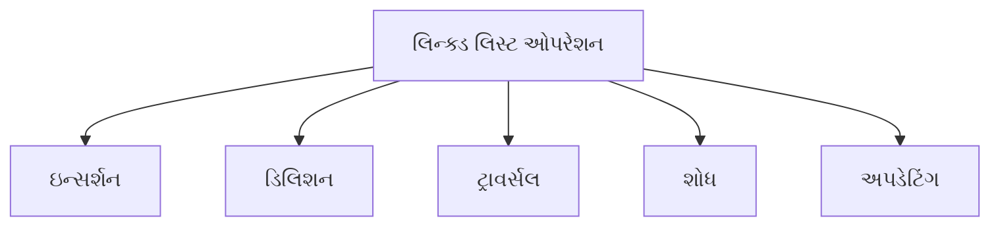

**મેમરી ટ્રીક:** "ઉમેરો કાઢો ફરો શોધો બદલો"

## પ્રશ્ન 3(બ) OR [4 ગુણ]

**સર્ક્યુલર લિન્ક્ડ લીસ્ટ નો કોન્સેપ્ટ સમજાવો.**

**જવાબ**:

**ડાયાગ્રામ:**

```goat
    ↗-----------↘
   /             \
  ↓               ↓
[1] → [2] → [3] → [4]
```

| ફીચર | વર્ણન |
|---------|-------------|
| સ્ટ્રક્ચર | છેલ્લો નોડ NULL ને બદલે પહેલા નોડને પોઇન્ટ કરે છે |
| ફાયદો | બધા નોડમાં સતત ટ્રાવર્સલની અનુમતિ આપે છે |
| એપ્લિકેશન | રાઉન્ડ રોબિન શેડ્યુલિંગ, સર્ક્યુલર બફર ઇમ્પ્લિમેન્ટેશન |
| ઓપરેશન | છેલ્લા નોડ માટે ખાસ હેન્ડલિંગ સાથે સિંગલી લિન્ક્ડ લિસ્ટ જેવા ઇન્સર્શન અને ડિલીશન |

**કોડ:**

```python
class Node:
    def __init__(self, data):
        self.data = data
        self.next = None

# 3 નોડવાળી સર્ક્યુલર લિન્ક્ડ લિસ્ટ બનાવવી
head = Node(1)
node2 = Node(2)
node3 = Node(3)

head.next = node2
node2.next = node3
node3.next = head  # તેને સર્ક્યુલર બનાવે છે
```

**મેમરી ટ્રીક:** "છેલ્લો પહેલાને જોડે"

## પ્રશ્ન 3(ક) OR [7 ગુણ]

**લિન્ક્ડ લીસ્ટની એપ્લીકેશનોની યાદી આપો. સીન્ગલી લિન્ક્ડ લીસ્ટમાં કુલ નોડ ગણવા માટેનો અલગોરિધમ લખો.**

**જવાબ**:

| લિન્ક્ડ લિસ્ટની એપ્લિકેશન |
|-------------------------------|
| 1. સ્ટેક અને ક્યુનો અમલીકરણ |
| 2. ડાયનેમિક મેમરી એલોકેશન |
| 3. એપ્લિકેશનમાં અન્ડુ ફંક્શનાલિટી |
| 4. હેશ ટેબલ્સ (ચેઇનિંગ) |
| 5. ગ્રાફ્સ માટે એડજસન્સી લિસ્ટ |

**નોડ ગણવા માટેનો અલ્ગોરિધમ:**

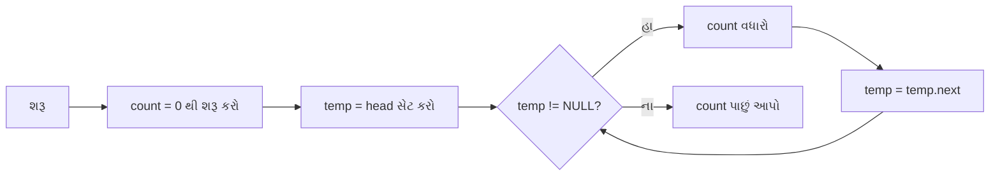

**કોડ:**

```python
def count_nodes(head):
    count = 0
    temp = head
    
    while temp:
        count += 1
        temp = temp.next
    
    return count

# ઉદાહરણ
# ધારી લો કે head લિન્ક્ડ લિસ્ટના પ્રથમ નોડને પોઇન્ટ કરે છે
total_nodes = count_nodes(head)
print(f"કુલ નોડ: {total_nodes}")
```

**મેમરી ટ્રીક:** "ગણો ત્યારે ખસો"

## પ્રશ્ન 4(અ) [3 ગુણ]

**લીનીયર સર્ચ અને બાયનરી સર્ચની સરખામણી કરો.**

**જવાબ**:

| ફીચર | લીનીયર સર્ચ | બાયનરી સર્ચ |
|---------|--------------|---------------|
| ડેટા ગોઠવણ | સોર્ટેડ અને અનસોર્ટેડ બંને ડેટા પર કામ કરે છે | ફક્ત સોર્ટેડ ડેટા પર કામ કરે છે |
| ટાઇમ કોમ્પ્લેક્સિટી | O(n) | O(log n) |
| ઇમ્પ્લિમેન્ટેશન | સરળ | વધુ જટિલ |
| શેના માટે શ્રેષ્ઠ | નાના ડેટાસેટ અથવા અનસોર્ટેડ ડેટા | મોટા સોર્ટેડ ડેટાસેટ |

**ડાયાગ્રામ:**

```goat
Linear: [1] [2] [3] [4] [5] [6] [7] [8]
        ↓   ↓   ↓   ↓   ↓   ↓   ↓   ↓
        ક્રમવાર ચેક કરવું

Binary: [1] [2] [3] [4] [5] [6] [7] [8]
                    ↓
                 મધ્ય ચેક
                /     \
               /       \
         નીચો ભાગ    ઉપરનો ભાગ
```

**મેમરી ટ્રીક:** "લીનીયર બધું જુએ, બાઈનરી આધું કાપે"

## પ્રશ્ન 4(બ) [4 ગુણ]

**સિલેકશન સોર્ટ માટેનો અલગોરિધમ લખો.**

**જવાબ**:

**ડાયાગ્રામ:**

```goat
Initial: [5, 3, 8, 1, 2]
Pass 1:  [1, 3, 8, 5, 2]  (min = 1 શોધો, 5 સાથે સ્વેપ)
Pass 2:  [1, 2, 8, 5, 3]  (min = 2 શોધો, 3 સાથે સ્વેપ)
Pass 3:  [1, 2, 3, 5, 8]  (min = 3 શોધો, 8 સાથે સ્વેપ)
Pass 4:  [1, 2, 3, 5, 8]  (min = 5 શોધો, જગ્યા પર છે જ)
```

**અલ્ગોરિધમ:**

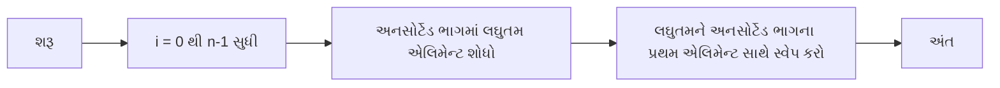

**કોડનો ઢાંચો:**

```python
def selection_sort(arr):
    n = len(arr)
    
    for i in range(n):
        min_idx = i
        
        # અનસોર્ટેડ એરેમાં લઘુતમ એલિમેન્ટ શોધો
        for j in range(i+1, n):
            if arr[j] < arr[min_idx]:
                min_idx = j
        
        # શોધેલા લઘુતમ એલિમેન્ટને પ્રથમ એલિમેન્ટ સાથે સ્વેપ કરો
        arr[i], arr[min_idx] = arr[min_idx], arr[i]
```

**મેમરી ટ્રીક:** "લઘુતમ શોધો, પોઝિશન બદલો"

## પ્રશ્ન 4(ક) [7 ગુણ]

**નીચે આપેલા લીસ્ટ ને બબલ સોર્ટ મેથડ વડે ચઢતા ક્રમમાં ગોઠવવા માટેનો પાયથન કોડ વિકસાવો.**
**list1=[5,4,3,2,1,0]**

**જવાબ**:

**ડાયાગ્રામ:**

```goat
Initial: [5, 4, 3, 2, 1, 0]
Pass 1:  [4, 3, 2, 1, 0, 5]
Pass 2:  [3, 2, 1, 0, 4, 5]
Pass 3:  [2, 1, 0, 3, 4, 5]
Pass 4:  [1, 0, 2, 3, 4, 5]
Pass 5:  [0, 1, 2, 3, 4, 5]
```

**કોડ:**

```python
def bubble_sort(arr):
    n = len(arr)
    
    # બધા એરે એલિમેન્ટ્સ પર ટ્રાવર્સ કરો
    for i in range(n):
        # છેલ્લા i એલિમેન્ટ્સ પહેલેથી જ યોગ્ય જગ્યા પર છે
        for j in range(0, n-i-1):
            # જો વર્તમાન એલિમેન્ટ આગળના એલિમેન્ટ કરતાં મોટો હોય, તો સ્વેપ કરો
            if arr[j] > arr[j+1]:
                arr[j], arr[j+1] = arr[j+1], arr[j]
    
    return arr

# ઇનપુટ લિસ્ટ
list1 = [5, 4, 3, 2, 1, 0]

# લિસ્ટ સોર્ટ કરવી
sorted_list = bubble_sort(list1)

# રિઝલ્ટ ડિસ્પ્લે કરવું
print("સોર્ટેડ લિસ્ટ:", sorted_list)
# આઉટપુટ: સોર્ટેડ લિસ્ટ: [0, 1, 2, 3, 4, 5]
```

**મેમરી ટ્રીક:** "મોટા બબલ ઉપર જાય"

## પ્રશ્ન 4(અ) OR [3 ગુણ]

**સોર્ટિંગ ની વ્યાખ્યા આપો. વિવિધ પ્રકારના સોર્ટિંગ ની યાદી આપો.**

**જવાબ**:

| વ્યાખ્યા | સોર્ટિંગ મેથડ્સ |
|------------|-----------------|
| સોર્ટિંગ એટલે ડેટાને ચોક્કસ ક્રમમાં (ચઢતા અથવા ઉતરતા) ગોઠવવાની પ્રક્રિયા | 1. બબલ સોર્ટ <br> 2. સિલેક્શન સોર્ટ <br> 3. ઇન્સર્શન સોર્ટ <br> 4. મર્જ સોર્ટ <br> 5. ક્વિક સોર્ટ <br> 6. હીપ સોર્ટ <br> 7. રેડિક્સ સોર્ટ |

**ડાયાગ્રામ:**

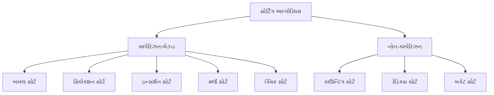

**મેમરી ટ્રીક:** "સારા સોર્ટથી શોધવાનું સરળ બને"

## પ્રશ્ન 4(બ) OR [4 ગુણ]

**Insertion sort method નો અલગોરિધમ લખો.**

**જવાબ**:

**ડાયાગ્રામ:**

```goat
Initial: [5, 2, 4, 6, 1, 3]
Pass 1:  [2, 5, 4, 6, 1, 3]  (2 ને 5 પહેલા મૂકો)
Pass 2:  [2, 4, 5, 6, 1, 3]  (4 ને 5 પહેલા મૂકો)
Pass 3:  [2, 4, 5, 6, 1, 3]  (6 પહેલેથી જગ્યા પર છે)
Pass 4:  [1, 2, 4, 5, 6, 3]  (1 ને શરૂઆતમાં મૂકો)
Pass 5:  [1, 2, 3, 4, 5, 6]  (3 ને 2 પછી મૂકો)
```

**અલ્ગોરિધમ:**

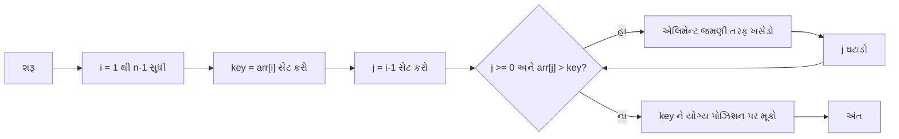

**કોડનો ઢાંચો:**

```python
def insertion_sort(arr):
    for i in range(1, len(arr)):
        key = arr[i]
        j = i - 1
        
        # key કરતાં મોટા એલિમેન્ટ્સને એક પોઝિશન આગળ ખસેડો
        while j >= 0 and arr[j] > key:
            arr[j + 1] = arr[j]
            j -= 1
        
        arr[j + 1] = key
```

**મેમરી ટ્રીક:** "કાર્ડ લો, યોગ્ય ક્રમમાં મૂકો"

## પ્રશ્ન 4(ક) OR [7 ગુણ]

**નીચે આપેલા લીસ્ટ ને સિલેકશન સોર્ટ મેથડ વડે ચઢતા ક્રમમાં ગોઠવવા માટેનો પાયથન કોડ વિકસાવો.**
**list1=[6,3,25,8,-1,55,0]**

**જવાબ**:

**ડાયાગ્રામ:**

```goat
Initial: [6, 3, 25, 8, -1, 55, 0]
Pass 1:  [-1, 3, 25, 8, 6, 55, 0]  (min = -1 શોધો, 6 સાથે સ્વેપ)
Pass 2:  [-1, 0, 25, 8, 6, 55, 3]  (min = 0 શોધો, 3 સાથે સ્વેપ)
Pass 3:  [-1, 0, 3, 8, 6, 55, 25]  (min = 3 શોધો, 25 સાથે સ્વેપ)
Pass 4:  [-1, 0, 3, 6, 8, 55, 25]  (min = 6 શોધો, 8 સાથે સ્વેપ)
Pass 5:  [-1, 0, 3, 6, 8, 55, 25]  (min = 8 શોધો, પહેલેથી જગ્યા પર છે)
Pass 6:  [-1, 0, 3, 6, 8, 25, 55]  (min = 25 શોધો, 55 સાથે સ્વેપ)
```

**કોડ:**

```python
def selection_sort(arr):
    n = len(arr)
    
    for i in range(n):
        # બાકીના અનસોર્ટેડ એરેમાં લઘુતમ એલિમેન્ટ શોધો
        min_idx = i
        for j in range(i+1, n):
            if arr[j] < arr[min_idx]:
                min_idx = j
                
        # શોધેલા લઘુતમ એલિમેન્ટને પ્રથમ એલિમેન્ટ સાથે સ્વેપ કરો
        arr[i], arr[min_idx] = arr[min_idx], arr[i]
    
    return arr

# ઇનપુટ લિસ્ટ
list1 = [6, 3, 25, 8, -1, 55, 0]

# લિસ્ટ સોર્ટ કરવી
sorted_list = selection_sort(list1)

# રિઝલ્ટ ડિસ્પ્લે કરવું
print("સોર્ટેડ લિસ્ટ:", sorted_list)
# આઉટપુટ: સોર્ટેડ લિસ્ટ: [-1, 0, 3, 6, 8, 25, 55]
```

**મેમરી ટ્રીક:** "નાનામાં નાનું શોધો, આગળ મૂકો"

## પ્રશ્ન 5(અ) [3 ગુણ]

**Tree data structure ને લગતા નીચે આપેલ પદોની વ્યાખ્યા આપો.**
**1. Forest**
**2. Root node**
**3. Leaf node**

**જવાબ**:

| પદ | વ્યાખ્યા |
|------|------------|
| Forest | અલગ-અલગ ટ્રીઓનો સમૂહ (ટ્રીઓ વચ્ચે કોઈ જોડાણ નથી) |
| Root Node | ટ્રીનો સૌથી ઉપરનો નોડ જેનો કોઈ પેરેન્ટ નથી, જેનાથી બધા બીજા નોડ્સ ઉતરે છે |
| Leaf Node | એવો નોડ જેને કોઈ ચિલ્ડ્રન નથી (ટ્રીના તળિયે આવેલો ટર્મિનલ નોડ) |

**ડાયાગ્રામ:**

```goat
Forest:    Tree1    Tree2    Tree3
           /  \      / \      |
          /    \    /   \     |
         
Root:     [R]
         /   \
        /     \
        
Leaf:  [A] → [B] → [L] → [L]
                    કોઈ ચિલ્ડ્રન નથી
```

**મેમરી ટ્રીક:** "ફોરેસ્ટમાં ઘણા રૂટ, રૂટથી બધું શરૂ, લીફ્સ બધું પૂરું"

## પ્રશ્ન 5(બ) [4 ગુણ]

**78,58,82,15,66,80,99 માટે Binary search tree દોરો અને તે tree માટેનું In-order traversal લખો.**

**જવાબ**:

**બાઈનરી સર્ચ ટ્રી:**

```goat
          78
         /  \
        /    \
      58      82
     /  \    /  \
   15   66  80   99
```

**ઇન-ઓર્ડર ટ્રાવર્સલ:**

| સ્ટેપ | વિઝિટ ક્રમ |
|------|-------------|
| 1 | 78 ના ડાબા સબટ્રી પર જાઓ |
| 2 | 58 ના ડાબા સબટ્રી પર જાઓ |
| 3 | 15 ને વિઝિટ કરો |
| 4 | 58 ને વિઝિટ કરો |
| 5 | 66 ને વિઝિટ કરો |
| 6 | 78 ને વિઝિટ કરો |
| 7 | 82 ના ડાબા સબટ્રી પર જાઓ |
| 8 | 80 ને વિઝિટ કરો |
| 9 | 82 ને વિઝિટ કરો |
| 10 | 99 ને વિઝિટ કરો |

**ઇન-ઓર્ડર ટ્રાવર્સલ રિઝલ્ટ: 15, 58, 66, 78, 80, 82, 99**

**મેમરી ટ્રીક:** "ડાબું, રૂટ, જમણું"

## પ્રશ્ન 5(ક) [7 ગુણ]

**નીચે આપેલ ઓપરેશન માટે અલગોરિધમ લખો:**
**૧. Binary Tree માં નોડ દાખલ કરવા**
**૨. Binary Tree માંથી નોડ કાઢવા માટે**

**જવાબ**:

**ઇન્સર્શન અલ્ગોરિધમ:**

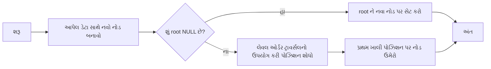

**ડિલીશન અલ્ગોરિધમ:**

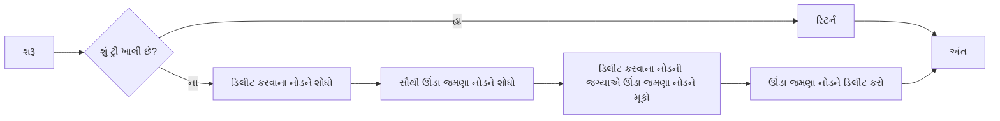

**કોડ:**

```python
class Node:
    def __init__(self, data):
        self.data = data
        self.left = None
        self.right = None

# Binary Tree માં ઇન્સર્શન
def insert(root, data):
    if root is None:
        return Node(data)
    
    # લેવલ ઓર્ડર ટ્રાવર્સલથી ખાલી પોઝિશન શોધવી
    queue = []
    queue.append(root)
    
    while queue:
        temp = queue.pop(0)
        
        if temp.left is None:
            temp.left = Node(data)
            break
        else:
            queue.append(temp.left)
            
        if temp.right is None:
            temp.right = Node(data)
            break
        else:
            queue.append(temp.right)
    
    return root

# Binary Tree માંથી ડિલીશન
def delete_node(root, key):
    if root is None:
        return None
    
    if root.left is None and root.right is None:
        if root.data == key:
            return None
        else:
            return root
    
    # ડિલીટ કરવાના નોડને શોધો
    key_node = None
    # છેવટના નોડને શોધો
    last = None
    parent = None
    
    # લેવલ ઓર્ડર ટ્રાવર્સલ
    queue = []
    queue.append(root)
    
    while queue:
        temp = queue.pop(0)
        
        if temp.data == key:
            key_node = temp
            
        if temp.left:
            parent = temp
            queue.append(temp.left)
            last = temp.left
            
        if temp.right:
            parent = temp
            queue.append(temp.right)
            last = temp.right
    
    if key_node:
        # છેવટના નોડના ડેટા સાથે બદલો
        key_node.data = last.data
        
        # છેવટના નોડને ડિલીટ કરો
        if parent.right == last:
            parent.right = None
        else:
            parent.left = None
    
    return root
```

**મેમરી ટ્રીક:** "ખાલી જગ્યાએ ઉમેરો, બદલીને કાઢો"

## પ્રશ્ન 5(અ) OR [3 ગુણ]

**Tree data structure ને લગતા નીચે આપેલ પદોની વ્યાખ્યા આપો.**
**1. In-degree**
**2. Out-degree**
**3. Depth**

**જવાબ**:

| પદ | વ્યાખ્યા |
|------|------------|
| In-degree | નોડમાં આવતી એજ્જીસની સંખ્યા (ટ્રીમાં પ્રત્યેક નોડ માટે (રૂટ સિવાય) હંમેશા 1 હોય છે) |
| Out-degree | નોડમાંથી બહાર જતી એજ્જીસની સંખ્યા (નોડના ચિલ્ડ્રનની સંખ્યા) |
| Depth | રૂટથી નોડ સુધીના પાથની લંબાઈ (પાથમાં એજ્જીસની સંખ્યા) |

**ડાયાગ્રામ:**

```goat
        A (રૂટ, ડેપ્થ 0)
       / \
      /   \
     B     C (ડેપ્થ 1)
    / \     \
   D   E     F (ડેપ્થ 2)
```

| નોડ | In-degree | Out-degree |
|------|-----------|------------|
| A | 0 | 2 |
| B | 1 | 2 |
| C | 1 | 1 |
| D | 1 | 0 |
| E | 1 | 0 |
| F | 1 | 0 |

**મેમરી ટ્રીક:** "ઈન કાઉન્ટ્સ પેરેન્ટ્સ, આઉટ કાઉન્ટ્સ ચિલ્ડ્રન, ડેપ્થ કાઉન્ટ્સ એજ્જીસ ફ્રોમ રૂટ"

## પ્રશ્ન 5(બ) OR [4 ગુણ]

**નીચે દર્શાવેલા Binary tree માટે Preorder and postorder traversal લખો.**

**બાઈનરી ટ્રી:**

```goat
        100
       /   \
      /     \
    20      200
   /  \     /  \
  10   30  150  300
```

**જવાબ**:

| ટ્રાવર્સલ | ક્રમ | રિઝલ્ટ |
|-----------|-------|--------|
| Preorder | રૂટ, ડાબું, જમણું | 100, 20, 10, 30, 200, 150, 300 |
| Postorder | ડાબું, જમણું, રૂટ | 10, 30, 20, 150, 300, 200, 100 |

**પ્રીઓર્ડર વિઝ્યુઅલાઈઝેશન:**

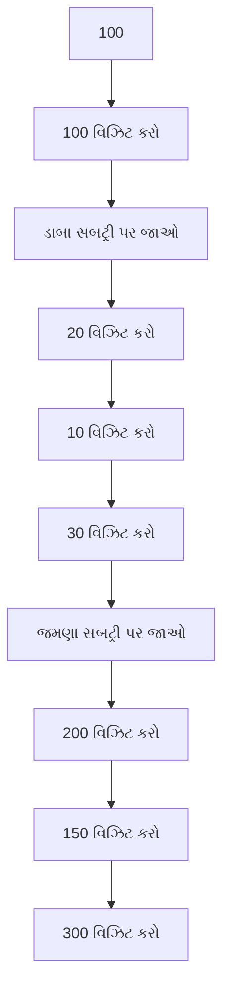

**પોસ્ટઓર્ડર વિઝ્યુઅલાઈઝેશન:**

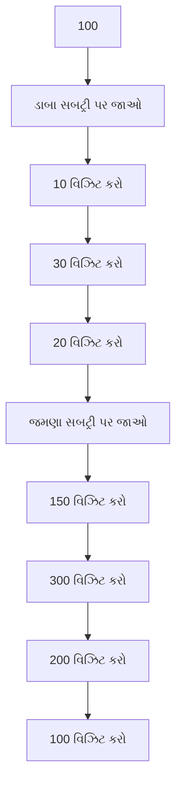

**મેમરી ટ્રીક:**

- પ્રીઓર્ડર: "રૂટ પહેલા, પછી બાળકો"
- પોસ્ટઓર્ડર: "બાળકો પહેલા, પછી રૂટ"

## પ્રશ્ન 5(ક) OR [7 ગુણ]

**Binary Search Tree રચવા માટેનો પાયથન કોડ વિકસાવો.**

**જવાબ**:

**ડાયાગ્રામ:**

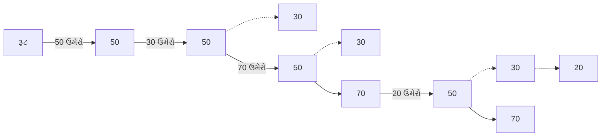

**કોડ:**

```python
class Node:
    def __init__(self, key):
        self.key = key
        self.left = None
        self.right = None

def insert(root, key):
    # જો ટ્રી ખાલી હોય, તો નવો નોડ પાછો આપો
    if root is None:
        return Node(key)
    
    # અન્યથા, ટ્રીમાં નીચે જાઓ
    if key < root.key:
        root.left = insert(root.left, key)
    else:
        root.right = insert(root.right, key)
    
    # અબદાયેલ નોડ પોઈન્ટર પાછો આપો
    return root

def inorder(root):
    if root:
        inorder(root.left)
        print(root.key, end=" ")
        inorder(root.right)

def preorder(root):
    if root:
        print(root.key, end=" ")
        preorder(root.left)
        preorder(root.right)

def postorder(root):
    if root:
        postorder(root.left)
        postorder(root.right)
        print(root.key, end=" ")

# ટેસ્ટ માટેનો પ્રોગ્રામ
def main():
    # આ એલિમેન્ટ્સ સાથે BST બનાવો: 50, 30, 20, 40, 70, 60, 80
    root = None
    elements = [50, 30, 20, 40, 70, 60, 80]
    
    for element in elements:
        root = insert(root, element)
    
    # ટ્રાવર્સલ્સ પ્રિન્ટ કરો
    print("ઇનઓર્ડર ટ્રાવર્સલ: ", end="")
    inorder(root)
    print("\nપ્રીઓર્ડર ટ્રાવર્સલ: ", end="")
    preorder(root)
    print("\nપોસ્ટઓર્ડર ટ્રાવર્સલ: ", end="")
    postorder(root)

# પ્રોગ્રામ ચલાવો
main()
```

**ઉદાહરણ આઉટપુટ:**

```
ઇનઓર્ડર ટ્રાવર્સલ: 20 30 40 50 60 70 80
પ્રીઓર્ડર ટ્રાવર્સલ: 50 30 20 40 70 60 80
પોસ્ટઓર્ડર ટ્રાવર્સલ: 20 40 30 60 80 70 50
```

**મેમરી ટ્રીક:** "નાના ડાબે, મોટા જમણે"
