## Question 1(a) [3 marks]

**Define linked list. List different types of linked list.**

**Answer**:

| Definition | Types of Linked List |
|------------|---------------------|
| A linked list is a linear data structure where elements are stored in nodes, and each node points to the next node in the sequence | 1. Singly Linked List <br> 2. Doubly Linked List <br> 3. Circular Linked List <br> 4. Circular Doubly Linked List |

**Diagram:**

```goat
Singly:     [Data|Next] → [Data|Next] → [Data|Next] → NULL
Doubly:     [Prev|Data|Next] ⟷ [Prev|Data|Next] ⟷ [Prev|Data|Next] → NULL
Circular:   [Data|Next] → [Data|Next] → [Data|Next] ↩
```

**Mnemonic:** "Single, Double, Circle, Double-Circle"

## Question 1(b) [4 marks]

**Explain Linear and Non Linear Data structure in Python with examples.**

**Answer**:

| Data Structure | Description | Python Examples |
|----------------|-------------|----------------|
| Linear | Elements arranged in sequential order where each element has exactly one predecessor and successor (except first and last) | Lists: `[1, 2, 3]` <br> Tuples: `(1, 2, 3)` <br> Strings: `"abc"` <br> Queue: `queue.Queue()` |
| Non-Linear | Elements not arranged sequentially; an element can connect to multiple elements | Dictionary: `{"a": 1, "b": 2}` <br> Set: `{1, 2, 3}` <br> Tree: Custom implementation <br> Graph: Custom implementation |

**Diagram:**

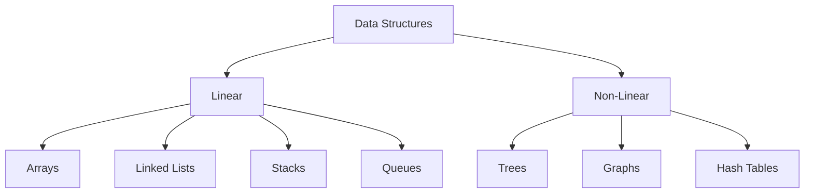

**Mnemonic:** "Linear Listens In Sequence, Non-linear Navigates Various Paths"

## Question 1(c) [7 marks]

**Explain class, attributes, object and class method in python with suitable example.**

**Answer**:

**Diagram:**

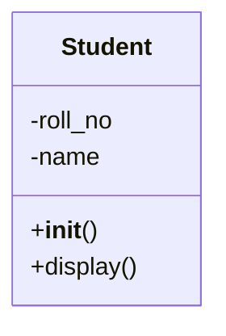

| Term | Description |
|------|-------------|
| Class | Blueprint for creating objects with shared attributes and methods |
| Attributes | Variables that store data inside a class |
| Object | Instance of a class with specific attribute values |
| Class Method | Functions defined within a class that can access and modify class states |

**Code:**

```python
class Student:
    # Class attribute
    school = "GTU"
    
    # Constructor
    def __init__(self, roll_no, name):
        # Instance attributes
        self.roll_no = roll_no
        self.name = name
    
    # Instance method
    def display(self):
        print(f"Roll No: {self.roll_no}, Name: {self.name}")
    
    # Class method
    @classmethod
    def change_school(cls, new_school):
        cls.school = new_school

# Creating object
student1 = Student(101, "Raj")
student1.display()  # Output: Roll No: 101, Name: Raj
```

**Mnemonic:** "Class Creates, Attributes Store, Objects Use, Methods Operate"

## Question 1(c) OR [7 marks]

**Define Data Encapsulation & Polymorphism. Develop a Python code to explain Polymorphism.**

**Answer**:

| Concept | Definition |
|---------|------------|
| Data Encapsulation | Bundling data and methods into a single unit (class) and restricting direct access to some components |
| Polymorphism | Ability of different classes to provide their own implementation of methods with the same name |

**Diagram:**

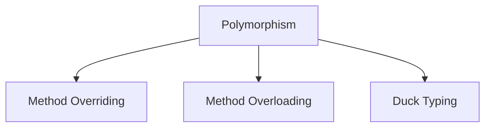

**Code:**

```python
# Polymorphism example
class Animal:
    def speak(self):
        pass

class Dog(Animal):
    def speak(self):
        return "Woof!"

class Cat(Animal):
    def speak(self):
        return "Meow!"

class Duck(Animal):
    def speak(self):
        return "Quack!"

# Function demonstrating polymorphism
def animal_sound(animal):
    return animal.speak()

# Creating objects
dog = Dog()
cat = Cat()
duck = Duck()

# Same function works for different animal objects
print(animal_sound(dog))   # Output: Woof!
print(animal_sound(cat))   # Output: Meow!
print(animal_sound(duck))  # Output: Quack!
```

**Mnemonic:** "Encapsulate to Protect, Polymorphism for Flexibility"

## Question 2(a) [3 marks]

**Differentiate between Stack and Queue.**

**Answer**:

| Feature | Stack | Queue |
|---------|-------|-------|
| Principle | LIFO (Last In First Out) | FIFO (First In First Out) |
| Operations | Push, Pop | Enqueue, Dequeue |
| Access | Elements can only be added/removed from one end (top) | Elements are added at rear end and removed from front end |

**Diagram:**

```goat
Stack:       [3]      Queue:  [1] → [2] → [3]
             [2]              Front      Rear
             [1]      
             ---
```

**Mnemonic:** "Stack Piles Up, Queue Lines Up"

## Question 2(b) [4 marks]

**Write an algorithm for PUSH and POP operation of stack in python.**

**Answer**:

**PUSH Algorithm:**

```goat
Start
  1. Check if stack is full
  2. If not full, increment top by 1
  3. Add element at position 'top'
End
```

**POP Algorithm:**

```goat
Start
  1. Check if stack is empty
  2. If not empty, retrieve element at 'top'
  3. Decrement top by 1
  4. Return retrieved element
End
```

**Code:**

```python
class Stack:
    def __init__(self, size):
        self.stack = []
        self.size = size
        self.top = -1
    
    def push(self, element):
        if self.top >= self.size - 1:
            return "Stack Overflow"
        else:
            self.top += 1
            self.stack.append(element)
            return "Pushed " + str(element)
    
    def pop(self):
        if self.top < 0:
            return "Stack Underflow"
        else:
            element = self.stack.pop()
            self.top -= 1
            return element
```

**Mnemonic:** "Push to Top, Pop from Top"

## Question 2(c) [7 marks]

**Convert following equation from infix to postfix using Stack.**
**A * (B + C) - D / (E + F)**

**Answer**:

**Diagram:**

```goat
Infix:   A * (B + C) - D / (E + F)
Postfix: A B C + * D E F + / -
```

| Step | Symbol | Stack | Output |
|------|--------|-------|--------|
| 1 | A | | A |
| 2 | * | * | A |
| 3 | ( | * ( | A |
| 4 | B | * ( | A B |
| 5 | + | * ( + | A B |
| 6 | C | * ( + | A B C |
| 7 | ) | * | A B C + |
| 8 | - | - | A B C + * |
| 9 | D | - | A B C + * D |
| 10 | / | - / | A B C + * D |
| 11 | ( | - / ( | A B C + * D |
| 12 | E | - / ( | A B C + * D E |
| 13 | + | - / ( + | A B C + * D E |
| 14 | F | - / ( + | A B C + * D E F |
| 15 | ) | - / | A B C + * D E F + |
| 16 | end | | A B C + * D E F + / - |

**Answer:** `A B C + * D E F + / -`

**Mnemonic:** "Operators Stack, Operands Print"

## Question 2(a) OR [3 marks]

**Differentiate between simple Queue and circular Queue.**

**Answer**:

| Feature | Simple Queue | Circular Queue |
|---------|--------------|----------------|
| Structure | Linear data structure | Linear data structure with connected ends |
| Memory | Inefficient memory usage due to unused space after dequeue | Efficient memory usage by reusing empty spaces |
| Implementation | Front always at index 0, rear increases | Front and rear move in circular fashion using modulo |

**Diagram:**

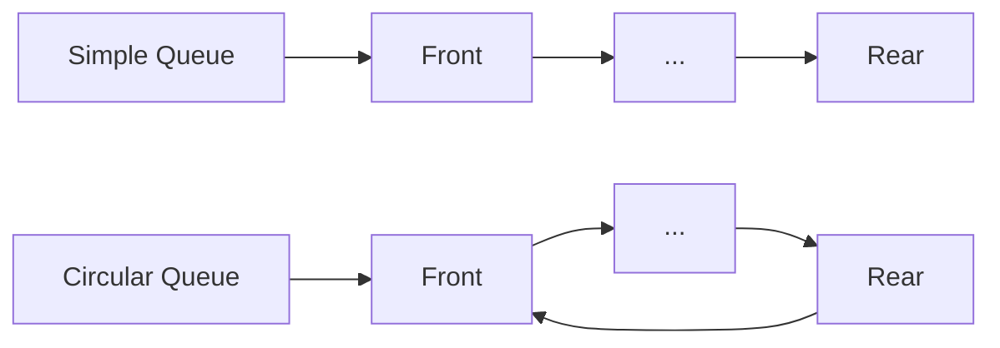

**Mnemonic:** "Simple Wastes, Circular Reuses"

## Question 2(b) OR [4 marks]

**Explain concept of recursive function with suitable example.**

**Answer**:

| Key Aspects | Description |
|-------------|-------------|
| Definition | A function that calls itself to solve a smaller instance of the same problem |
| Base Case | The condition where the function stops calling itself |
| Recursive Case | The condition where the function calls itself with a simpler version of the problem |

**Diagram:**

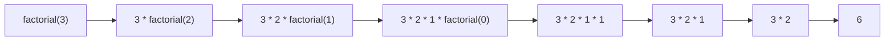

**Code:**

```python
def factorial(n):
    # Base case
    if n == 0:
        return 1
    # Recursive case
    else:
        return n * factorial(n-1)

# Example
result = factorial(5)  # 5! = 120
```

**Mnemonic:** "Base Breaks, Recursion Returns"

## Question 2(c) OR [7 marks]

**Develop a python code to implement Enqueue and Dequeue operation in Queue.**

**Answer**:

**Diagram:**

```goat
Enqueue:
  [1][2][3] → [1][2][3][4]
  
Dequeue:
  [1][2][3][4] → [2][3][4]
```

**Code:**

```python
class Queue:
    def __init__(self, size):
        self.queue = []
        self.size = size
        self.front = 0
        self.rear = -1
        self.count = 0
    
    def enqueue(self, item):
        if self.count >= self.size:
            return "Queue is full"
        else:
            self.rear += 1
            self.queue.append(item)
            self.count += 1
            return "Enqueued " + str(item)
    
    def dequeue(self):
        if self.count <= 0:
            return "Queue is empty"
        else:
            item = self.queue.pop(0)
            self.count -= 1
            return item
    
    def display(self):
        return self.queue

# Test
q = Queue(5)
q.enqueue(10)
q.enqueue(20)
q.enqueue(30)
print(q.display())  # [10, 20, 30]
print(q.dequeue())  # 10
print(q.display())  # [20, 30]
```

**Mnemonic:** "Enqueue at End, Dequeue from Start"

## Question 3(a) [3 marks]

**Give Difference between Singly linked list and Circular linked list.**

**Answer**:

| Feature | Singly Linked List | Circular Linked List |
|---------|-------------------|----------------------|
| Last Node | Points to NULL | Points back to the first node |
| Traversal | Has a definite end | Can be traversed continuously |
| Memory | Each node needs one pointer | Each node needs one pointer |

**Diagram:**

```goat
Singly:   [1] → [2] → [3] → NULL
Circular: [1] → [2] → [3] → ↩
```

**Mnemonic:** "Singly Stops, Circular Cycles"

## Question 3(b) [4 marks]

**Explain concept of Doubly linked list.**

**Answer**:

**Diagram:**

```goat
NULL ← [Prev|1|Next] ⟷ [Prev|2|Next] ⟷ [Prev|3|Next] → NULL
```

| Feature | Description |
|---------|-------------|
| Node Structure | Each node contains data and two pointers (previous and next) |
| Navigation | Can traverse in both forward and backward directions |
| Operations | Insertion and deletion can be performed from both ends |
| Memory Usage | Requires more memory than singly linked list due to extra pointer |

**Code:**

```python
class Node:
    def __init__(self, data):
        self.data = data
        self.prev = None
        self.next = None
```

**Mnemonic:** "Double Pointers, Double Directions"

## Question 3(c) [7 marks]

**Write an algorithm for following operation on singly linked list:**
**1. To insert a node at the beginning of the list.**
**2. To insert the node at the end of the list.**

**Answer**:

**Insert at Beginning:**

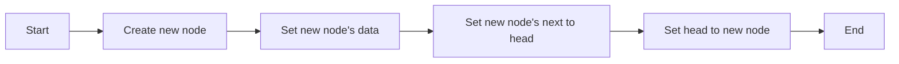

**Insert at End:**

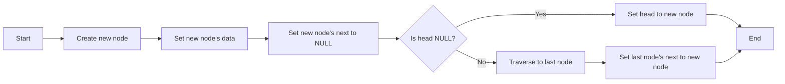

**Code:**

```python
def insert_at_beginning(head, data):
    new_node = Node(data)
    new_node.next = head
    return new_node  # New head

def insert_at_end(head, data):
    new_node = Node(data)
    new_node.next = None
    
    # If linked list is empty
    if head is None:
        return new_node
    
    # Traverse to the last node
    temp = head
    while temp.next:
        temp = temp.next
    
    # Link the last node to new node
    temp.next = new_node
    return head
```

**Mnemonic:** "Begin: New Leads Old, End: Old Leads New"

## Question 3(a) OR [3 marks]

**List different operations performed on singly linked list.**

**Answer**:

| Operations on Singly Linked List |
|----------------------------------|
| 1. Insertion (at beginning, middle, end) |
| 2. Deletion (from beginning, middle, end) |
| 3. Traversal (visiting each node) |
| 4. Searching (finding a specific node) |
| 5. Updating (modifying node data) |

**Diagram:**

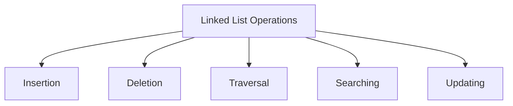

**Mnemonic:** "Insert Delete Traverse Search Update"

## Question 3(b) OR [4 marks]

**Explain concept of Circular linked list.**

**Answer**:

**Diagram:**

```goat
    ↗-----------↘
   /             \
  ↓               ↓
[1] → [2] → [3] → [4]
```

| Feature | Description |
|---------|-------------|
| Structure | Last node points to the first node instead of NULL |
| Advantage | Allows continuous traversal through all nodes |
| Applications | Round robin scheduling, circular buffer implementation |
| Operations | Insertion and deletion similar to singly linked list with special handling for the last node |

**Code:**

```python
class Node:
    def __init__(self, data):
        self.data = data
        self.next = None

# Creating a circular linked list with 3 nodes
head = Node(1)
node2 = Node(2)
node3 = Node(3)

head.next = node2
node2.next = node3
node3.next = head  # Makes it circular
```

**Mnemonic:** "Last Links to First"

## Question 3(c) OR [7 marks]

**List application of linked list. Write an algorithm to count the number of nodes in singly linked list.**

**Answer**:

| Applications of Linked List |
|-------------------------------|
| 1. Implementation of stacks and queues |
| 2. Dynamic memory allocation |
| 3. Undo functionality in applications |
| 4. Hash tables (chaining) |
| 5. Adjacency lists for graphs |

**Algorithm to Count Nodes:**

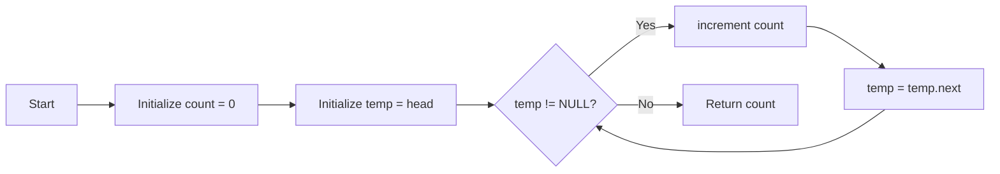

**Code:**

```python
def count_nodes(head):
    count = 0
    temp = head
    
    while temp:
        count += 1
        temp = temp.next
    
    return count

# Example usage
# Assuming head points to the first node of a linked list
total_nodes = count_nodes(head)
print(f"Total nodes: {total_nodes}")
```

**Mnemonic:** "Count While Moving"

## Question 4(a) [3 marks]

**Compare Linear search with Binary search.**

**Answer**:

| Feature | Linear Search | Binary Search |
|---------|--------------|---------------|
| Data Arrangement | Works on both sorted and unsorted data | Works only on sorted data |
| Time Complexity | O(n) | O(log n) |
| Implementation | Simpler | More complex |
| Best For | Small datasets or unsorted data | Large sorted datasets |

**Diagram:**

```goat
Linear: [1] [2] [3] [4] [5] [6] [7] [8]
        ↓   ↓   ↓   ↓   ↓   ↓   ↓   ↓
        Sequential checking

Binary: [1] [2] [3] [4] [5] [6] [7] [8]
                    ↓
                Check middle
                /     \
               /       \
        Lower half    Upper half
```

**Mnemonic:** "Linear Looks at All, Binary Breaks in Half"

## Question 4(b) [4 marks]

**Write an algorithm for selection sort method.**

**Answer**:

**Diagram:**

```goat
Initial: [5, 3, 8, 1, 2]
Pass 1:  [1, 3, 8, 5, 2]  (Find min = 1, swap with 5)
Pass 2:  [1, 2, 8, 5, 3]  (Find min = 2, swap with 3)
Pass 3:  [1, 2, 3, 5, 8]  (Find min = 3, swap with 8)
Pass 4:  [1, 2, 3, 5, 8]  (Find min = 5, already in place)
```

**Algorithm:**

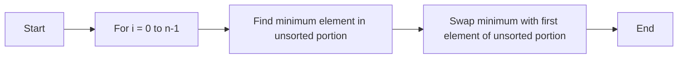

**Code Outline:**

```python
def selection_sort(arr):
    n = len(arr)
    
    for i in range(n):
        min_idx = i
        
        # Find the minimum element in unsorted array
        for j in range(i+1, n):
            if arr[j] < arr[min_idx]:
                min_idx = j
        
        # Swap the found minimum element with the first element
        arr[i], arr[min_idx] = arr[min_idx], arr[i]
```

**Mnemonic:** "Find Minimum, Swap Position"

## Question 4(c) [7 marks]

**Develop a python code to sort following list in ascending order using Bubble sort method.**
**list1=[5,4,3,2,1,0]**

**Answer**:

**Diagram:**

```goat
Initial: [5, 4, 3, 2, 1, 0]
Pass 1:  [4, 3, 2, 1, 0, 5]
Pass 2:  [3, 2, 1, 0, 4, 5]
Pass 3:  [2, 1, 0, 3, 4, 5]
Pass 4:  [1, 0, 2, 3, 4, 5]
Pass 5:  [0, 1, 2, 3, 4, 5]
```

**Code:**

```python
def bubble_sort(arr):
    n = len(arr)
    
    # Traverse through all array elements
    for i in range(n):
        # Last i elements are already in place
        for j in range(0, n-i-1):
            # Swap if current element is greater than next element
            if arr[j] > arr[j+1]:
                arr[j], arr[j+1] = arr[j+1], arr[j]
    
    return arr

# Input list
list1 = [5, 4, 3, 2, 1, 0]

# Sorting the list
sorted_list = bubble_sort(list1)

# Displaying the result
print("Sorted list:", sorted_list)
# Output: Sorted list: [0, 1, 2, 3, 4, 5]
```

**Mnemonic:** "Bubble Biggest Upward"

## Question 4(a) OR [3 marks]

**Define sorting. List different sorting methods.**

**Answer**:

| Definition | Sorting Methods |
|------------|-----------------|
| Sorting is the process of arranging data in a specified order (ascending or descending) | 1. Bubble Sort <br> 2. Selection Sort <br> 3. Insertion Sort <br> 4. Merge Sort <br> 5. Quick Sort <br> 6. Heap Sort <br> 7. Radix Sort |

**Diagram:**

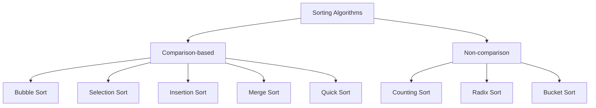

**Mnemonic:** "Better Sort Improves Many Query Results"

## Question 4(b) OR [4 marks]

**Write an algorithm for Insertion sort method.**

**Answer**:

**Diagram:**

```goat
Initial: [5, 2, 4, 6, 1, 3]
Pass 1:  [2, 5, 4, 6, 1, 3]  (Insert 2 before 5)
Pass 2:  [2, 4, 5, 6, 1, 3]  (Insert 4 before 5)
Pass 3:  [2, 4, 5, 6, 1, 3]  (6 is already in place)
Pass 4:  [1, 2, 4, 5, 6, 3]  (Insert 1 at beginning)
Pass 5:  [1, 2, 3, 4, 5, 6]  (Insert 3 after 2)
```

**Algorithm:**

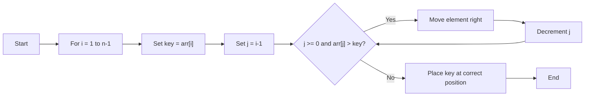

**Code Outline:**

```python
def insertion_sort(arr):
    for i in range(1, len(arr)):
        key = arr[i]
        j = i - 1
        
        # Move elements that are greater than key
        # to one position ahead of their current position
        while j >= 0 and arr[j] > key:
            arr[j + 1] = arr[j]
            j -= 1
        
        arr[j + 1] = key
```

**Mnemonic:** "Take Card, Insert In Order"

## Question 4(c) OR [7 marks]

**Develop a python code to sort following list in ascending order using selection sort method.**
**list1=[6,3,25,8,-1,55,0]**

**Answer**:

**Diagram:**

```goat
Initial: [6, 3, 25, 8, -1, 55, 0]
Pass 1:  [-1, 3, 25, 8, 6, 55, 0]  (Find min = -1, swap with 6)
Pass 2:  [-1, 0, 25, 8, 6, 55, 3]  (Find min = 0, swap with 3)
Pass 3:  [-1, 0, 3, 8, 6, 55, 25]  (Find min = 3, swap with 25)
Pass 4:  [-1, 0, 3, 6, 8, 55, 25]  (Find min = 6, swap with 8)
Pass 5:  [-1, 0, 3, 6, 8, 55, 25]  (Find min = 8, already in place)
Pass 6:  [-1, 0, 3, 6, 8, 25, 55]  (Find min = 25, swap with 55)
```

**Code:**

```python
def selection_sort(arr):
    n = len(arr)
    
    for i in range(n):
        # Find the minimum element in remaining unsorted array
        min_idx = i
        for j in range(i+1, n):
            if arr[j] < arr[min_idx]:
                min_idx = j
                
        # Swap the found minimum element with the first element
        arr[i], arr[min_idx] = arr[min_idx], arr[i]
    
    return arr

# Input list
list1 = [6, 3, 25, 8, -1, 55, 0]

# Sorting the list
sorted_list = selection_sort(list1)

# Displaying the result
print("Sorted list:", sorted_list)
# Output: Sorted list: [-1, 0, 3, 6, 8, 25, 55]
```

**Mnemonic:** "Select Smallest, Shift to Start"

## Question 5(a) [3 marks]

**Define following terms regarding Tree data structure:**
**1. Forest**
**2. Root node**
**3. Leaf node**

**Answer**:

| Term | Definition |
|------|------------|
| Forest | Collection of disjoint trees (multiple trees without connections between them) |
| Root Node | Topmost node of a tree with no parent, from which all other nodes are descended |
| Leaf Node | Node with no children (terminal node at the bottom of the tree) |

**Diagram:**

```goat
Forest:    Tree1    Tree2    Tree3
           /  \      / \      |
          /    \    /   \     |
         
Root:     [R]
         /   \
        /     \
        
Leaf:  [A] → [B] → [L] → [L]
                    No children
```

**Mnemonic:** "Forest has Many Roots, Roots Lead All, Leaves End All"

## Question 5(b) [4 marks]

**Draw Binary search tree for 78,58,82,15,66,80,99 and write In-order traversal for the tree.**

**Answer**:

**Binary Search Tree:**

```goat
          78
         /  \
        /    \
      58      82
     /  \    /  \
   15   66  80   99
```

**In-order Traversal:**

| Step | Visit Order |
|------|-------------|
| 1 | Visit left subtree of 78 |
| 2 | Visit left subtree of 58 |
| 3 | Visit 15 |
| 4 | Visit 58 |
| 5 | Visit 66 |
| 6 | Visit 78 |
| 7 | Visit left subtree of 82 |
| 8 | Visit 80 |
| 9 | Visit 82 |
| 10 | Visit 99 |

**In-order Traversal Result: 15, 58, 66, 78, 80, 82, 99**

**Mnemonic:** "Left, Root, Right"

## Question 5(c) [7 marks]

**Write an algorithm for following operation:**
**1. Insertion of Node in Binary Tree**
**2. Deletion of Node in Binary Tree**

**Answer**:

**Insertion Algorithm:**

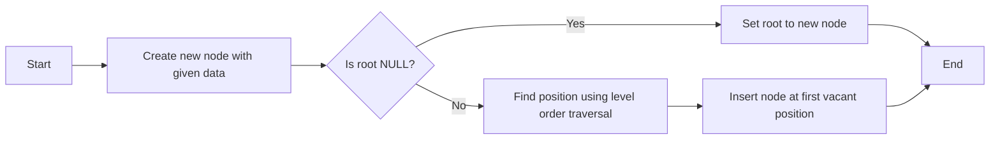

**Deletion Algorithm:**

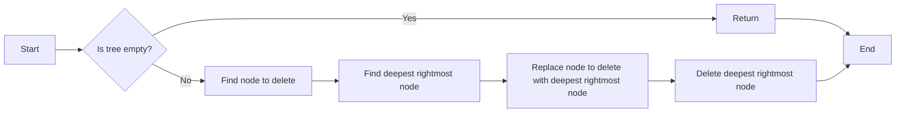

**Code:**

```python
class Node:
    def __init__(self, data):
        self.data = data
        self.left = None
        self.right = None

# Insertion in Binary Tree
def insert(root, data):
    if root is None:
        return Node(data)
    
    # Level order traversal to find vacant position
    queue = []
    queue.append(root)
    
    while queue:
        temp = queue.pop(0)
        
        if temp.left is None:
            temp.left = Node(data)
            break
        else:
            queue.append(temp.left)
            
        if temp.right is None:
            temp.right = Node(data)
            break
        else:
            queue.append(temp.right)
    
    return root

# Deletion in Binary Tree
def delete_node(root, key):
    if root is None:
        return None
    
    if root.left is None and root.right is None:
        if root.data == key:
            return None
        else:
            return root
    
    # Find the node to delete
    key_node = None
    # Find the deepest node
    last = None
    parent = None
    
    # Level order traversal
    queue = []
    queue.append(root)
    
    while queue:
        temp = queue.pop(0)
        
        if temp.data == key:
            key_node = temp
            
        if temp.left:
            parent = temp
            queue.append(temp.left)
            last = temp.left
            
        if temp.right:
            parent = temp
            queue.append(temp.right)
            last = temp.right
    
    if key_node:
        # Replace with deepest node's data
        key_node.data = last.data
        
        # Delete the deepest node
        if parent.right == last:
            parent.right = None
        else:
            parent.left = None
    
    return root
```

**Mnemonic:** "Insert at Empty, Delete by Swap and Remove"

## Question 5(a) OR [3 marks]

**Define following terms regarding Tree data structure:**
**1. In-degree**
**2. Out-degree**
**3. Depth**

**Answer**:

| Term | Definition |
|------|------------|
| In-degree | Number of edges coming into a node (always 1 for each node except root node in a tree) |
| Out-degree | Number of edges going out from a node (number of children) |
| Depth | Length of the path from root to the node (number of edges in path) |

**Diagram:**

```goat
        A (Root, Depth 0)
       / \
      /   \
     B     C (Depth 1)
    / \     \
   D   E     F (Depth 2)
```

| Node | In-degree | Out-degree |
|------|-----------|------------|
| A | 0 | 2 |
| B | 1 | 2 |
| C | 1 | 1 |
| D | 1 | 0 |
| E | 1 | 0 |
| F | 1 | 0 |

**Mnemonic:** "In Counts Parents, Out Counts Children, Depth Counts Edges from Root"

## Question 5(b) OR [4 marks]

**Write Preorder and postorder traversal of following Binary tree.**

**Binary Tree:**

```goat
        100
       /   \
      /     \
    20      200
   /  \     /  \
  10   30  150  300
```

**Answer**:

| Traversal | Order | Result |
|-----------|-------|--------|
| Preorder | Root, Left, Right | 100, 20, 10, 30, 200, 150, 300 |
| Postorder | Left, Right, Root | 10, 30, 20, 150, 300, 200, 100 |

**Preorder Visualization:**

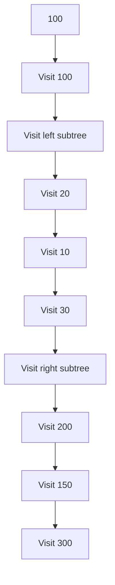

**Postorder Visualization:**

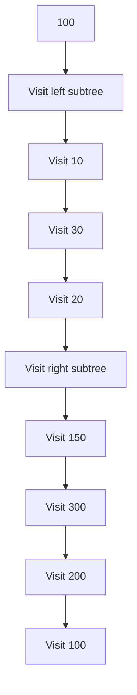

**Mnemonic:** 

- Preorder: "Root First, Then Children"
- Postorder: "Children First, Then Root"

## Question 5(c) OR [7 marks]

**Develop a program to implement construction of Binary Search Tree.**

**Answer**:

**Diagram:**

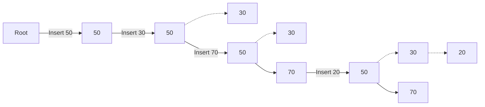

**Code:**

```python
class Node:
    def __init__(self, key):
        self.key = key
        self.left = None
        self.right = None

def insert(root, key):
    # If the tree is empty, return a new node
    if root is None:
        return Node(key)
    
    # Otherwise, recur down the tree
    if key < root.key:
        root.left = insert(root.left, key)
    else:
        root.right = insert(root.right, key)
    
    # Return the unchanged node pointer
    return root

def inorder(root):
    if root:
        inorder(root.left)
        print(root.key, end=" ")
        inorder(root.right)

def preorder(root):
    if root:
        print(root.key, end=" ")
        preorder(root.left)
        preorder(root.right)

def postorder(root):
    if root:
        postorder(root.left)
        postorder(root.right)
        print(root.key, end=" ")

# Driver program to test the above functions
def main():
    # Create BST with these elements: 50, 30, 20, 40, 70, 60, 80
    root = None
    elements = [50, 30, 20, 40, 70, 60, 80]
    
    for element in elements:
        root = insert(root, element)
    
    # Print traversals
    print("Inorder traversal: ", end="")
    inorder(root)
    print("\nPreorder traversal: ", end="")
    preorder(root)
    print("\nPostorder traversal: ", end="")
    postorder(root)

# Run the program
main()
```

**Example Output:**

```
Inorder traversal: 20 30 40 50 60 70 80
Preorder traversal: 50 30 20 40 70 60 80
Postorder traversal: 20 40 30 60 80 70 50
```

**Mnemonic:** "Insert Smaller Left, Larger Right"
