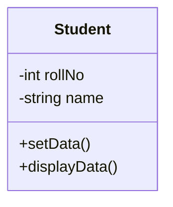
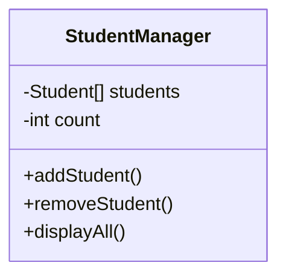
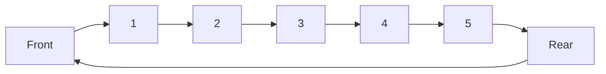
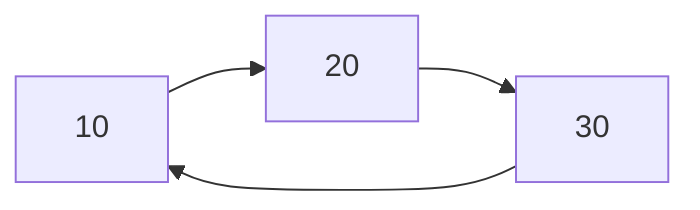
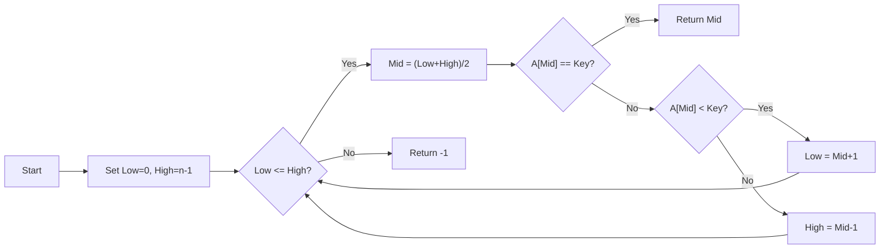
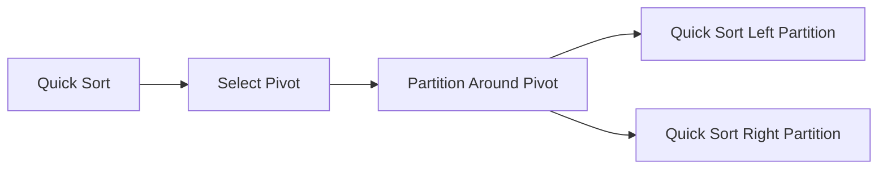
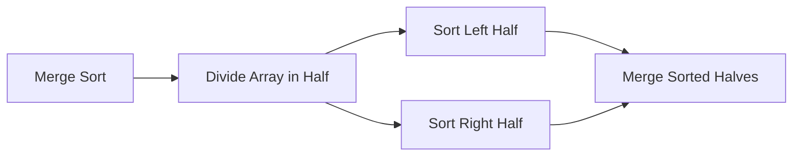
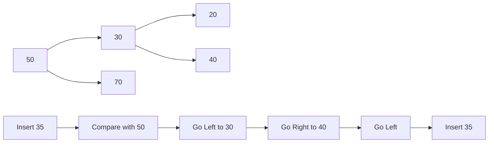
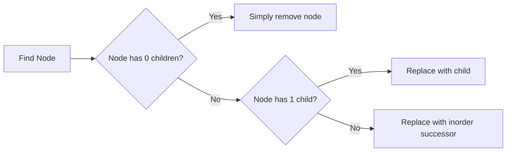

## પ્રશ્ન 1(અ) [3 ગુણ]

**રેખીય ડેટા સ્ટ્રક્ચર્સના નામ લખો.**

**જવાબ**:

| રેખીય ડેટા સ્ટ્રક્ચર્સ |
|------------------------|
| 1. એરે (Array)          |
| 2. સ્ટેક (Stack)        |
| 3. ક્યુ (Queue)        |
| 4. લિંક્ડ લિસ્ટ (Linked List) |

**મેમરી ટ્રીક:** "બધા વિદ્યાર્થીઓ લાઈનમાં ઊભા રહે છે"

## પ્રશ્ન 1(બ) [4 ગુણ]

**ટાઇમ અને સ્પેસ કોમ્પલેક્ષીટી વ્યાખ્યાયીત કરો.**

**જવાબ**:

| કોમ્પ્લેક્સિટી પ્રકાર | વ્યાખ્યા | નોટેશન |
|----------------|------------|----------|
| ટાઇમ કોમ્પ્લેક્સિટી | માપે છે કે ઇનપુટ સાઇઝ વધતાં એક્ઝિક્યુશન ટાઇમ કેવી રીતે વધે છે | O(n), O(1), O(log n) |
| સ્પેસ કોમ્પ્લેક્સિટી | માપે છે કે ઇનપુટ સાઇઝ વધતાં મેમરી વપરાશ કેવી રીતે વધે છે | O(n), O(1), O(log n) |

**ડાયાગ્રામ:**

```goat
+---------------+         +----------------+
| INPUT SIZE    |-------->| ALGORITHM      |
| (n)           |         |                |
+---------------+         +----------------+
                              |       |
                              v       v
                   +---------+       +----------+
                   | TIME    |       | SPACE    |
                   | O(n)    |       | O(n)     |
                   +---------+       +----------+
```

**મેમરી ટ્રીક:** "ટાઇમ સ્ટેપ્સ, સ્પેસ સ્ટોર્સ"

## પ્રશ્ન 1(ક) [7 ગુણ]

**ઉદાહરણ સાથે ક્લાસ અને ઓબ્જેક્ટનો કોન્સેપ્ટ સમજાવો.**

**જવાબ**:

**ડાયાગ્રામ:**



| કોન્સેપ્ટ | વ્યાખ્યા | ઉદાહરણ |
|---------|------------|---------|
| ક્લાસ | ઓબ્જેક્ટ બનાવવા માટેનો બ્લૂપ્રિન્ટ અથવા ટેમ્પલેટ | Student ક્લાસ જેમાં properties (rollNo, name) અને methods (setData, displayData) છે |
| ઓબ્જેક્ટ | ક્લાસનું ચોક્કસ ડેટા ધરાવતું ઇન્સ્ટન્સ | student1 (rollNo=101, name="રાજ") |

**કોડ ઉદાહરણ:**

```python
class Student:
    def __init__(self):
        self.rollNo = 0
        self.name = ""
        
    def setData(self, r, n):
        self.rollNo = r
        self.name = n
        
    def displayData(self):
        print(self.rollNo, self.name)

# ઓબ્જેક્ટ બનાવવા
student1 = Student()
student1.setData(101, "રાજ")
```

**મેમરી ટ્રીક:** "ક્લાસ બનાવે, ઓબ્જેક્ટ વાપરે"

## પ્રશ્ન 1(ક) OR [7 ગુણ]

**વિદ્યાર્થીઓના રેકોર્ડ્સ ને સંચાલિત કરવા માટેનો એક ક્લાસ બનાવો જેમા વિદ્યાર્થીને ઉમેરવા તેમજ બાદ કરવા માટેની મેથડ હોય.**

**જવાબ**:

**ડાયાગ્રામ:**



**કોડ:**

```python
class StudentManager:
    def __init__(self):
        self.students = []
        
    def addStudent(self, roll, name):
        student = Student()
        student.setData(roll, name)
        self.students.append(student)
        
    def removeStudent(self, roll):
        for i in range(len(self.students)):
            if self.students[i].rollNo == roll:
                self.students.pop(i)
                break
    
    def displayAll(self):
        for student in self.students:
            student.displayData()
```

**મેમરી ટ્રીક:** "ઉમેરો વધારે, કાઢો ઘટાડે"

## પ્રશ્ન 2(અ) [3 ગુણ]

**ક્લાસમાં કન્સ્ટ્રક્ટરનું મહત્વ સમજાવો.**

**જવાબ**:

| કન્સ્ટ્રક્ટરનું મહત્વ |
|------------------------|
| 1. ઓબ્જેક્ટના ડેટા મેમ્બર્સને પ્રારંભિક મૂલ્ય આપે છે |
| 2. ઓબ્જેક્ટ બનતી વખતે આપોઆપ કોલ થાય છે |
| 3. અલગ અલગ પ્રકારના હોઈ શકે (ડિફોલ્ટ, પેરામીટરાઈઝ્ડ, કોપી) |

**મેમરી ટ્રીક:** "શરૂઆત હંમેશા સારી"

## પ્રશ્ન 2(બ) [4 ગુણ]

**સ્ટેક પર વિવિધ ઓપરેશન સમજાવો.**

**જવાબ**:

| ઓપરેશન | વર્ણન | ઉદાહરણ |
|-----------|-------------|---------|
| પુશ (Push) | ટોપ પર એલિમેન્ટ ઉમેરે છે | push(5) |
| પોપ (Pop) | ટોપ પરથી એલિમેન્ટ દૂર કરે છે | x = pop() |
| પીક/ટોપ (Peek/Top) | ટોપ એલિમેન્ટને દૂર કર્યા વગર જુએ છે | x = peek() |
| isEmpty | ચકાસે છે કે સ્ટેક ખાલી છે કે નહીં | if(isEmpty()) |

**ડાયાગ્રામ:**

```goat
     PUSH                     POP
      |                        ^
      v                        |
    +---+                    +---+
    | 5 |                    | 8 |
    +---+                    +---+
    | 7 |  PEEK/TOP ------>  | 7 |
    +---+                    +---+
    | 8 |                    | 2 |
    +---+                    +---+
```

**મેમરી ટ્રીક:** "નાખો કાઢો જુઓ"

## પ્રશ્ન 2(ક) [7 ગુણ]

**પોસ્ટફિક્સ એક્સપ્રેશન ABC+*D/ નું મૂલ્યાંકન અલગોરિધમનું વર્ણન કરો.**

**જવાબ**:

**ડાયાગ્રામ:**

```goat
Input: A B C + * D /

+---+---+---+---+---+---+---+---+
| A | B | C | + | * | D | / |   |
+---+---+---+---+---+---+---+---+
      Read left to right
```

| સ્ટેપ | સિમ્બોલ | એક્શન | સ્ટેક |
|------|--------|--------|-------|
| 1 | A | સ્ટેક પર પુશ કરો | A |
| 2 | B | સ્ટેક પર પુશ કરો | A,B |
| 3 | C | સ્ટેક પર પુશ કરો | A,B,C |
| 4 | + | B,C પોપ કરો; B+C પુશ કરો | A,B+C |
| 5 | * | A,B+C પોપ કરો; A*(B+C) પુશ કરો | A*(B+C) |
| 6 | D | સ્ટેક પર પુશ કરો | A*(B+C),D |
| 7 | / | A*(B+C),D પોપ કરો; A*(B+C)/D પુશ કરો | A*(B+C)/D |

**મેમરી ટ્રીક:** "વાંચો, પુશ કરો, પોપ કરો, ગણતરી કરો"

## પ્રશ્ન 2(અ) OR [3 ગુણ]

**સ્ટેક અને ક્યુ વચ્ચેનો તફાવત લખો.**

**જવાબ**:

| ફીચર | સ્ટેક | ક્યુ |
|---------|-------|-------|
| સિદ્ધાંત | LIFO (છેલ્લું આવે પહેલું જાય) | FIFO (પહેલું આવે પહેલું જાય) |
| ઓપરેશન | પુશ/પોપ | એનક્યુ/ડિક્યુ |
| એક્સેસ પોઈન્ટ્સ | એક છેડો (ટોપ) | બે છેડા (ફ્રન્ટ, રીઅર) |

**મેમરી ટ્રીક:** "સ્ટેક છેલ્લું પહેલું, ક્યુ પહેલું પહેલું"

## પ્રશ્ન 2(બ) OR [4 ગુણ]

**સર્ક્યુલર ક્યુ નો કોન્સેપ્ટ સમજાવો.**

**જવાબ**:

**ડાયાગ્રામ:**



| ફીચર | વર્ણન |
|---------|-------------|
| સ્ટ્રક્ચર | છેડાઓ જોડાયેલ હોય તેવો લીનિયર ડેટા સ્ટ્રક્ચર |
| ફાયદો | ખાલી જગ્યાનો ફરીથી ઉપયોગ કરીને મેમરી કાર્યક્ષમ રીતે વાપરે છે |
| ઓપરેશન | એનક્યુ, ડિક્યુ (મોડ્યુલો ગણતરી સાથે) |

**મેમરી ટ્રીક:** "સર્ક્યુલર ફ્રન્ટને રીઅર સાથે જોડે"

## પ્રશ્ન 2(ક) OR [7 ગુણ]

**સિંગલી લિંક્ડ લિસ્ટમાં આપેલ નોડ પછી અને પહેલાં નવા નોડ દાખલ કરવાની પ્રક્રિયાનું વર્ણન કરો.**

**જવાબ**:

**ડાયાગ્રામ:**

```goat
Insert After Node X:
Before: A → X → B
After:  A → X → N → B

Insert Before Node X:
Before: A → X → B
After:  A → N → X → B
```

| ઇન્સર્શન | સ્ટેપ્સ |
|-----------|-------|
| નોડ X પછી | 1. નવો નોડ N બનાવો<br>2. N નો next X ના next પર સેટ કરો<br>3. X નો next N પર સેટ કરો |
| નોડ X પહેલા | 1. નવો નોડ N બનાવો<br>2. X પર પોઇન્ટ કરતો નોડ A શોધો<br>3. N નો next X પર સેટ કરો<br>4. A નો next N પર સેટ કરો |

**મેમરી ટ્રીક:** "પછી: લિંક બદલો, પહેલા: અગાઉનો શોધો"

## પ્રશ્ન 3(અ) [3 ગુણ]

**લિંક્ડ લિસ્ટ મા એક છેડાથી બીજા છેડા સુધી પસાર થવાની પ્રક્રિયા સમજાવો.**

**જવાબ**:

**ડાયાગ્રામ:**

```goat
start → [10] → [20] → [30] → NULL
         ^      ^      ^
         |      |      |
       Visit  Visit  Visit
```

| સ્ટેપ | એક્શન |
|------|--------|
| 1 | હેડ નોડથી શરૂ કરો |
| 2 | વર્તમાન નોડનો ડેટા એક્સેસ કરો |
| 3 | પોઈન્ટરને આગળના નોડ પર ખસેડો |
| 4 | NULL મળે ત્યાં સુધી દોહરાવો |

**મેમરી ટ્રીક:** "શરૂ કરો, જુઓ, આગળ વધો, દોહરાવો"

## પ્રશ્ન 3(બ) [4 ગુણ]

**ઇનફિક્સથી પોસ્ટફિક્સમાં એક્સપ્રેસનનું રૂપાંતર સમજાવો.**

**જવાબ**:

**ડાયાગ્રામ:**

```goat
Infix:    A + B * C
Postfix:  A B C * +
```

| સ્ટેપ | એક્શન | સ્ટેક | આઉટપુટ |
|------|--------|-------|--------|
| 1 | ડાબેથી જમણે સ્કેન કરો | | |
| 2 | જો ઓપરેન્ડ હોય, તો આઉટપુટમાં ઉમેરો | | A |
| 3 | જો ઓપરેટર હોય, તો ઉચ્ચ પ્રાધાન્યતા હોય તો પુશ કરો | + | A |
| 4 | ઓછી પ્રાધાન્યતાવાળા ઓપરેટર પોપ કરો | + | A B |
| 5 | વર્તમાન ઓપરેટર પુશ કરો | * | A B |
| 6 | એક્સપ્રેશન પૂરું થાય ત્યાં સુધી ચાલુ રાખો | * | A B C |
| 7 | બાકીના ઓપરેટર પોપ કરો | | A B C * + |

**મેમરી ટ્રીક:** "ઓપરેટર પુશ-પોપ, ઓપરેન્ડ સીધા આઉટપુટમાં"

## પ્રશ્ન 3(ક) [7 ગુણ]

**સિંગલી લિંક્ડ લિસ્ટની શરૂઆતનો અને અંતનો નોડ ડીલીટ કરવા માટેનો પ્રોગ્રામ લખો.**

**જવાબ**:

**ડાયાગ્રામ:**

```goat
Before:  Head → [10] → [20] → [30] → NULL
After:   Head → [20] → NULL
```

**કોડ:**

```python
class Node:
    def __init__(self, data):
        self.data = data
        self.next = None

class LinkedList:
    def __init__(self):
        self.head = None
    
    def deleteFirst(self):
        if self.head is None:
            return
        self.head = self.head.next
    
    def deleteLast(self):
        if self.head is None:
            return
        
        # જો માત્ર એક જ નોડ હોય
        if self.head.next is None:
            self.head = None
            return
            
        temp = self.head
        while temp.next.next:
            temp = temp.next
        
        temp.next = None
```

**મેમરી ટ્રીક:** "પહેલો: હેડ શિફ્ટ કરો, છેલ્લો: પાછલો શોધો"

## પ્રશ્ન 3(અ) OR [3 ગુણ]

**લિંક્ડ લિસ્ટમાં કોઇ એલિમેન્ટ શોધવાની પ્રક્રિયા સમજાવો.**

**જવાબ**:

**ડાયાગ્રામ:**

```goat
Head → [10] → [20] → [30] → NULL
         ^      ^      ^
       Check  Check  Check
```

| સ્ટેપ | વર્ણન |
|------|-------------|
| 1 | હેડ નોડથી શરૂ કરો |
| 2 | વર્તમાન નોડના ડેટાને કી સાથે સરખાવો |
| 3 | જો મેચ મળે, તો true રીટર્ન કરો |
| 4 | નહીંતર, આગળના નોડ પર જાઓ અને રિપીટ કરો |

**મેમરી ટ્રીક:** "શરૂ કરો, ચેક કરો, આગળ વધો, દોહરાવો"

## પ્રશ્ન 3(બ) OR [4 ગુણ]

**સર્ક્યુલર લિંક્ડ લિસ્ટ નો કોન્સેપ્ટ સમજાવો.**

**જવાબ**:

**ડાયાગ્રામ:**



| ફીચર | વર્ણન |
|---------|-------------|
| સ્ટ્રક્ચર | છેલ્લો નોડ પહેલા નોડને પોઇન્ટ કરે છે |
| ફાયદો | NULL પોઈન્ટર્સ નથી, સર્ક્યુલર ઓપરેશન માટે કાર્યક્ષમ |
| ટ્રાવર્સલ | અનંત લૂપ ટાળવા માટે વધારાની શરત જરૂરી |

**મેમરી ટ્રીક:** "છેલ્લો પહેલાને જોડે"

## પ્રશ્ન 3(ક) OR [7 ગુણ]

**લિસ્ટમાંથી બાઇનરી સર્ચનો ઉપયોગ કરીને કોઇ એક એલિમેન્ટ શોધવાનું અલગોરીધમ સમજાવો.**

**જવાબ**:

**ડાયાગ્રામ:**



**કોડ:**

```python
def binarySearch(arr, key):
    low = 0
    high = len(arr) - 1
    
    while low <= high:
        mid = (low + high) // 2
        
        if arr[mid] == key:
            return mid
        elif arr[mid] < key:
            low = mid + 1
        else:
            high = mid - 1
            
    return -1
```

**મેમરી ટ્રીક:** "મધ્ય, તુલના, અડધું કાઢો"

## પ્રશ્ન 4(અ) [3 ગુણ]

**લિંક્ડ લિસ્ટના ઉપયોગ લખો.**

**જવાબ**:

| લિંક્ડ લિસ્ટના ઉપયોગ |
|----------------------------|
| 1. સ્ટેક અને ક્યુનો અમલીકરણ |
| 2. ડાયનેમિક મેમરી એલોકેશન |
| 3. ઇમેજ વ્યૂઅર (આગલી/પાછલી ઇમેજ) |

**મેમરી ટ્રીક:** "ડેટા ડાયનેમિક સ્ટોર કરો"

## પ્રશ્ન 4(બ) [4 ગુણ]

**સિંગલી અને ડબલી લિંક્ડ લિસ્ટ વચ્ચેનો તફાવત લખો.**

**જવાબ**:

| ફીચર | સિંગલી લિંક્ડ લિસ્ટ | ડબલી લિંક્ડ લિસ્ટ |
|---------|-------------------|-------------------|
| નોડ સ્ટ્રક્ચર | એક પોઈન્ટર (next) | બે પોઈન્ટર (next, prev) |
| ટ્રાવર્સલ | માત્ર ફોરવર્ડ | બંને દિશામાં |
| મેમરી | ઓછી મેમરી | વધુ મેમરી |
| ઓપરેશન | સરળ, ઓછો કોડ | જટિલ, વધુ ફ્લેક્સિબલ |

**ડાયાગ્રામ:**

```goat
Singly: [Data|Next] → [Data|Next] → [Data|Next]

Doubly: [Prev|Data|Next] ⟷ [Prev|Data|Next] ⟷ [Prev|Data|Next]
```

**મેમરી ટ્રીક:** "એક દિશા, બે દિશા"

## પ્રશ્ન 4(ક) [7 ગુણ]

**સિલેક્શન સોર્ટ અલગોરીધમનો ઉપયોગ કરીને આંકડાઓને ચઢતા ક્રમમાં ગોઠવવાનો પ્રોગ્રામ લખો.**

**જવાબ**:

**ડાયાગ્રામ:**

```goat
Initial: [5, 3, 8, 1, 2]
Pass 1:  [1, 3, 8, 5, 2]  (Swap 5,1)
Pass 2:  [1, 2, 8, 5, 3]  (Swap 3,2)
Pass 3:  [1, 2, 3, 5, 8]  (Swap 8,3)
Pass 4:  [1, 2, 3, 5, 8]  (No swap)
```

**કોડ:**

```python
def selectionSort(arr):
    n = len(arr)
    
    for i in range(n):
        min_idx = i
        
        for j in range(i+1, n):
            if arr[j] < arr[min_idx]:
                min_idx = j
        
        # મિનિમમ એલિમેન્ટને પહેલા એલિમેન્ટ સાથે સ્વેપ કરો
        arr[i], arr[min_idx] = arr[min_idx], arr[i]
    
    return arr

# ઉદાહરણ
arr = [5, 3, 8, 1, 2]
sorted_arr = selectionSort(arr)
print(sorted_arr)  # આઉટપુટ: [1, 2, 3, 5, 8]
```

**મેમરી ટ્રીક:** "મિનિમમ શોધો, પોઝિશન બદલો"

## પ્રશ્ન 4(અ) OR [3 ગુણ]

**બબલ સોર્ટ અલગોરીધમ સમજાવો.**

**જવાબ**:

**ડાયાગ્રામ:**


| મુખ્ય પોઈન્ટ્સ |
|------------|
| આસપાસના એલિમેન્ટની તુલના કરો |
| જો ખોટા ક્રમમાં હોય તો સ્વેપ કરો |
| દરેક પાસમાં મોટા એલિમેન્ટ છેવટે પહોંચે |

**મેમરી ટ્રીક:** "મોટા બબલ ઉપર જાય"

## પ્રશ્ન 4(બ) OR [4 ગુણ]

**લિનિયર અને બાઇનરી સર્ચ વચ્ચેનો તફાવત લખો.**

**જવાબ**:

| ફીચર | લિનિયર સર્ચ | બાઇનરી સર્ચ |
|---------|--------------|---------------|
| કાર્ય સિદ્ધાંત | ક્રમિક ચકાસણી | વિભાજન અને જીત |
| ટાઇમ કોમ્પ્લેક્સિટી | O(n) | O(log n) |
| ડેટા અરેન્જમેન્ટ | અનસોર્ટેડ અથવા સોર્ટેડ | સોર્ટેડ હોવું જરૂરી |
| શેના માટે સારું | નાના ડેટાસેટ | મોટા ડેટાસેટ |

**મેમરી ટ્રીક:** "લિનિયર બધાને જુએ, બાઇનરી અડધું કાપે"

## પ્રશ્ન 4(ક) OR [7 ગુણ]

**ક્વીક સોર્ટ અને મર્જ સોર્ટ સમજાવો.**

**જવાબ**:

**ક્વીક સોર્ટ:**



**મર્જ સોર્ટ:**



| અલગોરિધમ | સિદ્ધાંત | સરેરાશ ટાઇમ | સ્પેસ કોમ્પ્લેક્સિટી |
|-----------|-----------|--------------|------------------|
| ક્વીક સોર્ટ | પીવોટની આસપાસ પાર્ટિશનિંગ | O(n log n) | O(log n) |
| મર્જ સોર્ટ | વિભાજન, જીત, જોડાણ | O(n log n) | O(n) |

**મેમરી ટ્રીક:** "ક્વીક વિભાજે, મર્જ જોડે"

## પ્રશ્ન 5(અ) [3 ગુણ]

**પૂર્ણ બાઇનરી ટ્રી ની વ્યાખ્યા આપો.**

**જવાબ**:

**ડાયાગ્રામ:**

```goat
    1
   / \
  2   3
 / \  /
4  5 6
```

| પ્રોપર્ટી | વર્ણન |
|----------|-------------|
| બધા લેવલ ભરેલા | છેલ્લા લેવલ સિવાય |
| છેલ્લુ લેવલ ડાબેથી ભરેલું | નોડ ડાબેથી જમણે એડ થાય |

**મેમરી ટ્રીક:** "ડાબેથી જમણે, લેવલ દર લેવલ ભરો"

## પ્રશ્ન 5(બ) [4 ગુણ]

**બાઇનરી ટ્રી મા ઇનઓર્ડર ટ્રાવર્સલ સમજાવો.**

**જવાબ**:

**ડાયાગ્રામ:**

```goat
      A
     / \
    B   C
   / \
  D   E

Inorder: D → B → E → A → C
```

| સ્ટેપ | એક્શન |
|------|--------|
| 1 | ડાબા સબટ્રી પર ટ્રાવર્સ કરો |
| 2 | રૂટ નોડની મુલાકાત લો |
| 3 | જમણા સબટ્રી પર ટ્રાવર્સ કરો |

**કોડ:**

```python
def inorderTraversal(root):
    if root:
        inorderTraversal(root.left)
        print(root.data, end=" → ")
        inorderTraversal(root.right)
```

**મેમરી ટ્રીક:** "ડાબું, રૂટ, જમણું"

## પ્રશ્ન 5(ક) [7 ગુણ]

**બાઇનરી સર્ચ ટ્રી મા નોડ દાખલ કરવા માટેનો પ્રોગ્રામ લખો.**

**જવાબ**:

**ડાયાગ્રામ:**



**કોડ:**

```python
class Node:
    def __init__(self, key):
        self.key = key
        self.left = None
        self.right = None

def insert(root, key):
    if root is None:
        return Node(key)
    
    if key < root.key:
        root.left = insert(root.left, key)
    else:
        root.right = insert(root.right, key)
        
    return root
```

**મેમરી ટ્રીક:** "તુલના કરો, મૂવ કરો, દાખલ કરો"

## પ્રશ્ન 5(અ) OR [3 ગુણ]

**બાઇનરી સર્ચ ટ્રીની મૂળભૂત ખાસિયતો જણાવો.**

**જવાબ**:

| બાઇનરી સર્ચ ટ્રીની ખાસિયતો |
|--------------------------------------|
| 1. ડાબા ચાઈલ્ડ નોડ < પેરેન્ટ નોડ |
| 2. જમણા ચાઈલ્ડ નોડ > પેરેન્ટ નોડ |
| 3. ડુપ્લિકેટ વેલ્યુ માન્ય નથી |

**મેમરી ટ્રીક:** "ડાબે ઓછું, જમણે વધુ"

## પ્રશ્ન 5(બ) OR [4 ગુણ]

**બાઇનરી ટ્રી મા પોસ્ટ ઓર્ડર ટ્રાવર્સલ સમજાવો.**

**જવાબ**:

**ડાયાગ્રામ:**

```goat
      A
     / \
    B   C
   / \
  D   E

Postorder: D → E → B → C → A
```

| સ્ટેપ | એક્શન |
|------|--------|
| 1 | ડાબા સબટ્રી પર ટ્રાવર્સ કરો |
| 2 | જમણા સબટ્રી પર ટ્રાવર્સ કરો |
| 3 | રૂટ નોડની મુલાકાત લો |

**કોડ:**

```python
def postorderTraversal(root):
    if root:
        postorderTraversal(root.left)
        postorderTraversal(root.right)
        print(root.data, end=" → ")
```

**મેમરી ટ્રીક:** "ડાબું, જમણું, રૂટ"

## પ્રશ્ન 5(ક) OR [7 ગુણ]

**બાઇનરી સર્ચ ટ્રી માંથી નોડ ડીલીટ કરવા માટેનો પ્રોગ્રામ લખો.**

**જવાબ**:

**ડાયાગ્રામ:**



**કોડ:**

```python
def minValueNode(node):
    current = node
    while current.left is not None:
        current = current.left
    return current

def deleteNode(root, key):
    if root is None:
        return root
        
    if key < root.key:
        root.left = deleteNode(root.left, key)
    elif key > root.key:
        root.right = deleteNode(root.right, key)
    else:
        # એક અથવા કોઈ ચાઈલ્ડ નથી
        if root.left is None:
            return root.right
        elif root.right is None:
            return root.left
            
        # બે ચાઈલ્ડ
        successor = minValueNode(root.right)
        root.key = successor.key
        root.right = deleteNode(root.right, successor.key)
        
    return root
```

**મેમરી ટ્રીક:** "શોધો, બદલો, ફરી જોડો"
