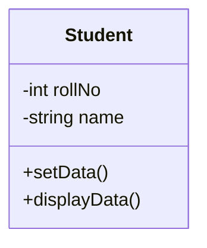
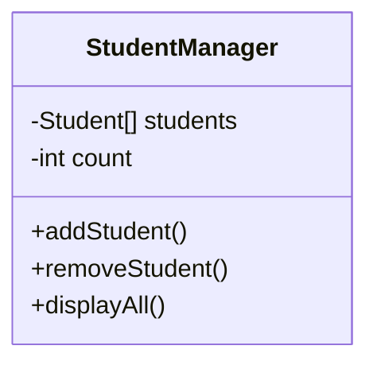
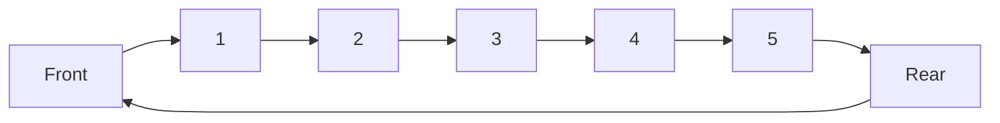
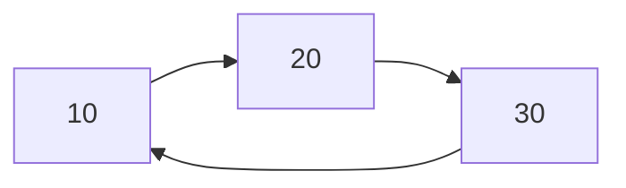
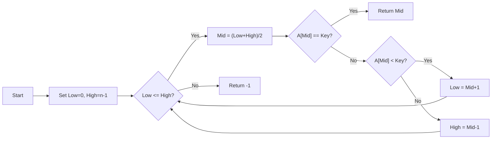
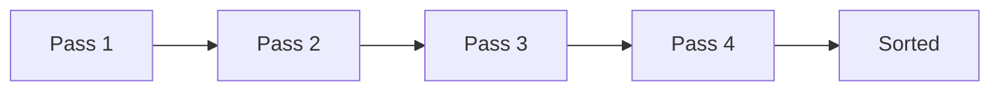
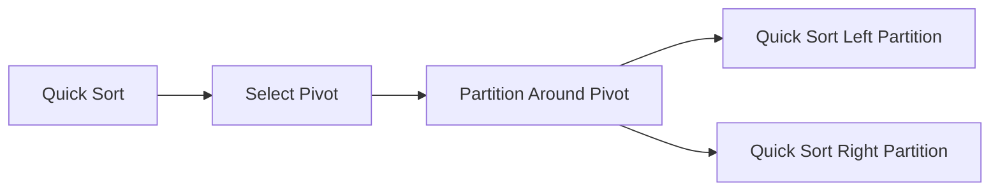
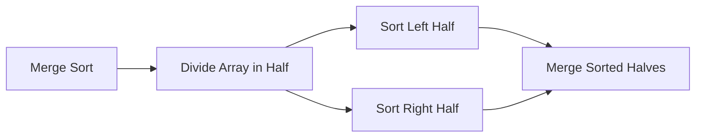
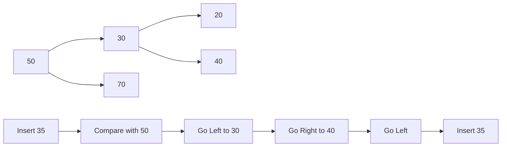
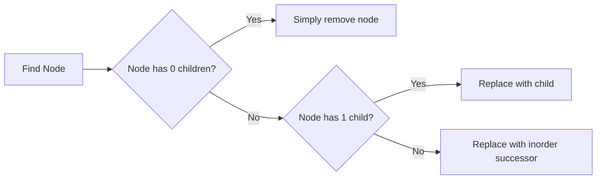

## Question 1(a) [3 marks]

**Write names of linear data structures.**

**Answer**:

| Linear Data Structures |
|------------------------|
| 1. Array               |
| 2. Stack               |
| 3. Queue               |
| 4. Linked List         |

**Mnemonic:** "All Students Queue Lazily"

## Question 1(b) [4 marks]

**Define Time and space complexity.**

**Answer**:

| Complexity Type | Definition | Notation |
|----------------|------------|----------|
| Time Complexity | Measures how execution time increases as input size grows | O(n), O(1), O(log n) |
| Space Complexity | Measures how memory usage increases as input size grows | O(n), O(1), O(log n) |

**Diagram:**

```goat
+---------------+         +----------------+
| INPUT SIZE    |-------->| ALGORITHM      |
| (n)           |         |                |
+---------------+         +----------------+
                              |       |
                              v       v
                   +---------+       +----------+
                   | TIME    |       | SPACE    |
                   | O(n)    |       | O(n)     |
                   +---------+       +----------+
```

**Mnemonic:** "Time Steps, Space Stores"

## Question 1(c) [7 marks]

**Explain concept of class & object with example.**

**Answer**:

**Diagram:**



| Concept | Definition | Example |
|---------|------------|---------|
| Class | Blueprint or template for creating objects | Student class with properties (rollNo, name) and methods (setData, displayData) |
| Object | Instance of a class with specific values | student1 (rollNo=101, name="Raj") |

**Code Example:**

```python
class Student:
    def __init__(self):
        self.rollNo = 0
        self.name = ""
        
    def setData(self, r, n):
        self.rollNo = r
        self.name = n
        
    def displayData(self):
        print(self.rollNo, self.name)

# Creating objects
student1 = Student()
student1.setData(101, "Raj")
```

**Mnemonic:** "Class Creates, Objects Operate"

## Question 1(c) OR [7 marks]

**Develop a class for managing student records with instance methods for adding and removing students from a class.**

**Answer**:

**Diagram:**



**Code:**

```python
class StudentManager:
    def __init__(self):
        self.students = []
        
    def addStudent(self, roll, name):
        student = Student()
        student.setData(roll, name)
        self.students.append(student)
        
    def removeStudent(self, roll):
        for i in range(len(self.students)):
            if self.students[i].rollNo == roll:
                self.students.pop(i)
                break
    
    def displayAll(self):
        for student in self.students:
            student.displayData()
```

**Mnemonic:** "Add Accumulates, Remove Reduces"

## Question 2(a) [3 marks]

**Explain the importance of constructor in class.**

**Answer**:

| Constructor Importance |
|------------------------|
| 1. Initializes object's data members |
| 2. Automatically called when object is created |
| 3. Can have different versions (default, parameterized, copy) |

**Mnemonic:** "Initialization Always Creates"

## Question 2(b) [4 marks]

**Explain different operations on stack.**

**Answer**:

| Operation | Description | Example |
|-----------|-------------|---------|
| Push | Adds element to top | push(5) |
| Pop | Removes element from top | x = pop() |
| Peek/Top | Views top element without removing | x = peek() |
| isEmpty | Checks if stack is empty | if(isEmpty()) |

**Diagram:**

```goat
     PUSH                     POP
      |                        ^
      v                        |
    +---+                    +---+
    | 5 |                    | 8 |
    +---+                    +---+
    | 7 |  PEEK/TOP ------>  | 7 |
    +---+                    +---+
    | 8 |                    | 2 |
    +---+                    +---+
```

**Mnemonic:** "Push Pop Peek Properly"

## Question 2(c) [7 marks]

**Describe evaluation algorithm of postfix expression A B C + * D /**

**Answer**:

**Diagram:**

```goat
Input: A B C + * D /

+---+---+---+---+---+---+---+---+
| A | B | C | + | * | D | / |   |
+---+---+---+---+---+---+---+---+
      Read left to right
```

| Step | Symbol | Action | Stack |
|------|--------|--------|-------|
| 1 | A | Push onto stack | A |
| 2 | B | Push onto stack | A,B |
| 3 | C | Push onto stack | A,B,C |
| 4 | + | Pop B,C; Push B+C | A,B+C |
| 5 | * | Pop A,B+C; Push A*(B+C) | A*(B+C) |
| 6 | D | Push onto stack | A*(B+C),D |
| 7 | / | Pop A*(B+C),D; Push A*(B+C)/D | A*(B+C)/D |

**Mnemonic:** "Read, Push, Pop, Calculate"

## Question 2(a) OR [3 marks]

**Write difference between stack and queue.**

**Answer**:

| Feature | Stack | Queue |
|---------|-------|-------|
| Principle | LIFO (Last In First Out) | FIFO (First In First Out) |
| Operations | Push/Pop | Enqueue/Dequeue |
| Access Points | Single end (top) | Two ends (front, rear) |

**Mnemonic:** "Stack LIFO, Queue FIFO"

## Question 2(b) OR [4 marks]

**Explain concept of circular queue.**

**Answer**:

**Diagram:**



| Feature | Description |
|---------|-------------|
| Structure | Linear data structure with connected ends |
| Advantage | Efficiently uses memory by reusing empty spaces |
| Operations | Enqueue, Dequeue with modulo arithmetic |

**Mnemonic:** "Circular Connects Front to Rear"

## Question 2(c) OR [7 marks]

**Describe the procedure for inserting a new node after and before a given node in a singly linked list.**

**Answer**:

**Diagram:**

```goat
Insert After Node X:
Before: A → X → B
After:  A → X → N → B

Insert Before Node X:
Before: A → X → B
After:  A → N → X → B
```

| Insertion | Steps |
|-----------|-------|
| After Node X | 1. Create new node N<br>2. Set N's next to X's next<br>3. Set X's next to N |
| Before Node X | 1. Create new node N<br>2. Find node A pointing to X<br>3. Set N's next to X<br>4. Set A's next to N |

**Mnemonic:** "After: Set Next Links, Before: Find Previous First"

## Question 3(a) [3 marks]

**Explain traversing a linked list.**

**Answer**:

**Diagram:**

```goat
start → [10] → [20] → [30] → NULL
         ^      ^      ^
         |      |      |
       Visit  Visit  Visit
```

| Step | Action |
|------|--------|
| 1 | Initialize pointer to head |
| 2 | Access data at current node |
| 3 | Move pointer to next node |
| 4 | Repeat until NULL |

**Mnemonic:** "Start, Access, Move, Repeat"

## Question 3(b) [4 marks]

**Explain expression conversion from infix to postfix.**

**Answer**:

**Diagram:**

```goat
Infix:    A + B * C
Postfix:  A B C * +
```

| Step | Action | Stack | Output |
|------|--------|-------|--------|
| 1 | Scan from left to right | | |
| 2 | If operand, add to output | | A |
| 3 | If operator, push if higher precedence | + | A |
| 4 | Pop lower precedence operators | + | A B |
| 5 | Push current operator | * | A B |
| 6 | Continue until expression ends | * | A B C |
| 7 | Pop remaining operators | | A B C * + |

**Mnemonic:** "Operators Push Pop, Operands Output Directly"

## Question 3(c) [7 marks]

**Write a program to delete a node at the beginning and end of singly linked list.**

**Answer**:

**Diagram:**

```goat
Before:  Head → [10] → [20] → [30] → NULL
After:   Head → [20] → NULL
```

**Code:**

```python
class Node:
    def __init__(self, data):
        self.data = data
        self.next = None

class LinkedList:
    def __init__(self):
        self.head = None
    
    def deleteFirst(self):
        if self.head is None:
            return
        self.head = self.head.next
    
    def deleteLast(self):
        if self.head is None:
            return
        
        # If only one node
        if self.head.next is None:
            self.head = None
            return
            
        temp = self.head
        while temp.next.next:
            temp = temp.next
        
        temp.next = None
```

**Mnemonic:** "Delete First: Shift Head, Delete Last: Find Second-Last"

## Question 3(a) OR [3 marks]

**Explain searching an element in linked list.**

**Answer**:

**Diagram:**

```goat
Head → [10] → [20] → [30] → NULL
         ^      ^      ^
       Check  Check  Check
```

| Step | Description |
|------|-------------|
| 1 | Start from head node |
| 2 | Compare current node's data with key |
| 3 | If match found, return true |
| 4 | Else, move to next node and repeat |

**Mnemonic:** "Start, Compare, Move, Repeat"

## Question 3(b) OR [4 marks]

**Explain concepts of circular linked lists.**

**Answer**:

**Diagram:**



| Feature | Description |
|---------|-------------|
| Structure | Last node points to first node |
| Advantage | No NULL pointers, efficient for circular operations |
| Traversal | Need extra condition to prevent infinite loop |

**Mnemonic:** "Last Links to First"

## Question 3(c) OR [7 marks]

**Explain algorithm to search a particular element from list using Binary Search.**

**Answer**:

**Diagram:**



**Code:**

```python
def binarySearch(arr, key):
    low = 0
    high = len(arr) - 1
    
    while low <= high:
        mid = (low + high) // 2
        
        if arr[mid] == key:
            return mid
        elif arr[mid] < key:
            low = mid + 1
        else:
            high = mid - 1
            
    return -1
```

**Mnemonic:** "Middle, Compare, Eliminate Half"

## Question 4(a) [3 marks]

**Write applications of linked list.**

**Answer**:

| Applications of Linked List |
|----------------------------|
| 1. Implementation of stacks and queues |
| 2. Dynamic memory allocation |
| 3. Image viewer (next/previous images) |

**Mnemonic:** "Store Data Dynamically"

## Question 4(b) [4 marks]

**Differentiate between singly linked list and doubly linked list.**

**Answer**:

| Feature | Singly Linked List | Doubly Linked List |
|---------|-------------------|-------------------|
| Node Structure | One pointer (next) | Two pointers (next, prev) |
| Traversal | Forward only | Both directions |
| Memory | Less memory | More memory |
| Operations | Simple, less code | Complex, more flexible |

**Diagram:**

```goat
Singly: [Data|Next] → [Data|Next] → [Data|Next]

Doubly: [Prev|Data|Next] ⟷ [Prev|Data|Next] ⟷ [Prev|Data|Next]
```

**Mnemonic:** "Single Direction, Double Direction"

## Question 4(c) [7 marks]

**Write a program to sort numbers in ascending order using selection sort algorithm.**

**Answer**:

**Diagram:**

```goat
Initial: [5, 3, 8, 1, 2]
Pass 1:  [1, 3, 8, 5, 2]  (Swap 5,1)
Pass 2:  [1, 2, 8, 5, 3]  (Swap 3,2)
Pass 3:  [1, 2, 3, 5, 8]  (Swap 8,3)
Pass 4:  [1, 2, 3, 5, 8]  (No swap)
```

**Code:**

```python
def selectionSort(arr):
    n = len(arr)
    
    for i in range(n):
        min_idx = i
        
        for j in range(i+1, n):
            if arr[j] < arr[min_idx]:
                min_idx = j
        
        # Swap the found minimum element with the first element
        arr[i], arr[min_idx] = arr[min_idx], arr[i]
    
    return arr

# Example usage
arr = [5, 3, 8, 1, 2]
sorted_arr = selectionSort(arr)
print(sorted_arr)  # Output: [1, 2, 3, 5, 8]
```

**Mnemonic:** "Find Minimum, Swap Position"

## Question 4(a) OR [3 marks]

**Explain bubble sort algorithm.**

**Answer**:

**Diagram:**



| Key Points |
|------------|
| Compare adjacent elements |
| Swap if they are in wrong order |
| Largest element bubbles to end in each pass |

**Mnemonic:** "Bubble Bigger Elements Upward"

## Question 4(b) OR [4 marks]

**Differentiate Linear & Binary search.**

**Answer**:

| Feature | Linear Search | Binary Search |
|---------|--------------|---------------|
| Working Principle | Sequential checking | Divide and conquer |
| Time Complexity | O(n) | O(log n) |
| Data Arrangement | Unsorted or sorted | Must be sorted |
| Best For | Small datasets | Large datasets |

**Mnemonic:** "Linear Looks at All, Binary Breaks in Half"

## Question 4(c) OR [7 marks]

**Explain Quick sort & Merge sort algorithm.**

**Answer**:

**Quick Sort:**



**Merge Sort:**



| Algorithm | Principle | Average Time | Space Complexity |
|-----------|-----------|--------------|------------------|
| Quick Sort | Partitioning around pivot | O(n log n) | O(log n) |
| Merge Sort | Divide, conquer, combine | O(n log n) | O(n) |

**Mnemonic:** "Quick Partitions, Merge Divides"

## Question 5(a) [3 marks]

**Define a complete binary tree.**

**Answer**:

**Diagram:**

```goat
    1
   / \
  2   3
 / \  /
4  5 6
```

| Property | Description |
|----------|-------------|
| All levels filled | Except possibly the last level |
| Last level filled from left | Nodes added from left to right |

**Mnemonic:** "Fill Left to Right, Level by Level"

## Question 5(b) [4 marks]

**Explain inorder traversal of a binary tree.**

**Answer**:

**Diagram:**

```goat
      A
     / \
    B   C
   / \
  D   E

Inorder: D → B → E → A → C
```

| Step | Action |
|------|--------|
| 1 | Traverse left subtree |
| 2 | Visit root node |
| 3 | Traverse right subtree |

**Code:**

```python
def inorderTraversal(root):
    if root:
        inorderTraversal(root.left)
        print(root.data, end=" → ")
        inorderTraversal(root.right)
```

**Mnemonic:** "Left, Root, Right"

## Question 5(c) [7 marks]

**Write a program to inserting a node into a binary search tree.**

**Answer**:

**Diagram:**



**Code:**

```python
class Node:
    def __init__(self, key):
        self.key = key
        self.left = None
        self.right = None

def insert(root, key):
    if root is None:
        return Node(key)
    
    if key < root.key:
        root.left = insert(root.left, key)
    else:
        root.right = insert(root.right, key)
        
    return root
```

**Mnemonic:** "Compare, Move, Insert"

## Question 5(a) OR [3 marks]

**State the fundamental characteristic of a binary search tree.**

**Answer**:

| Characteristics of Binary Search Tree |
|--------------------------------------|
| 1. Left child nodes < Parent node |
| 2. Right child nodes > Parent node |
| 3. No duplicate values allowed |

**Mnemonic:** "Left Less, Right More"

## Question 5(b) OR [4 marks]

**Explain postorder traversal of a binary tree.**

**Answer**:

**Diagram:**

```goat
      A
     / \
    B   C
   / \
  D   E

Postorder: D → E → B → C → A
```

| Step | Action |
|------|--------|
| 1 | Traverse left subtree |
| 2 | Traverse right subtree |
| 3 | Visit root node |

**Code:**

```python
def postorderTraversal(root):
    if root:
        postorderTraversal(root.left)
        postorderTraversal(root.right)
        print(root.data, end=" → ")
```

**Mnemonic:** "Left, Right, Root"

## Question 5(c) OR [7 marks]

**Write a program to delete a node from a binary search tree.**

**Answer**:

**Diagram:**



**Code:**

```python
def minValueNode(node):
    current = node
    while current.left is not None:
        current = current.left
    return current

def deleteNode(root, key):
    if root is None:
        return root
        
    if key < root.key:
        root.left = deleteNode(root.left, key)
    elif key > root.key:
        root.right = deleteNode(root.right, key)
    else:
        # Node with one or no child
        if root.left is None:
            return root.right
        elif root.right is None:
            return root.left
            
        # Node with two children
        successor = minValueNode(root.right)
        root.key = successor.key
        root.right = deleteNode(root.right, successor.key)
        
    return root
```

**Mnemonic:** "Find, Replace, Reconnect"
