## પ્રશ્ન 1(અ) [3 માર્ક્સ]

**વ્યાખ્યા આપો: DBMS, ઈન્સટન્સ, મેટાડેટા**

**ઉત્તર**:

- **DBMS (ડેટાબેઝ મેનેજમેન્ટ સિસ્ટમ)**: એક સોફ્ટવેર જે વપરાશકર્તાઓને ડેટાબેઝ બનાવવા, જાળવવા, અને ઍક્સેસ કરવા સક્ષમ બનાવે છે. જે ડેટા ઑર્ગેનાઈઝેશન, સ્ટોરેજ, પુનઃપ્રાપ્તિ, સુરક્ષા, અને અખંડતાનું નિયંત્રણ કરે છે.
- **ઈન્સટન્સ**: કોઈ ચોક્કસ સમયે ડેટાબેઝમાં સંગ્રહિત વાસ્તવિક ડેટા. તે ડેટાબેઝની વર્તમાન સ્થિતિ અથવા સ્નેપશોટ છે.
- **મેટાડેટા**: ડેટા વિશેનો ડેટા, જે ડેટાબેઝ સ્ટ્રક્ચરનું વર્ણન કરે છે, જેમાં ટેબલ્સ, ફીલ્ડ્સ, સંબંધો, કન્સ્ટ્રેઈન્ટ્સ, અને ઇન્ડેક્સનો સમાવેશ થાય છે.

**મેમરી ટ્રીક:** "DIM દૃશ્ય" - ડેટાબેઝ સિસ્ટમ, ઈન્સટન્સ સ્નેપશોટ, મેટાડેટા વર્ણન

## પ્રશ્ન 1(બ) [4 માર્ક્સ]

**વ્યાખ્યા આપો અને ઉદાહરણ સાથે સમજાવો: 1.Entity 2. Attribute**

**ઉત્તર**:

**કોષ્ટક: Entity અને Attribute વચ્ચેનો તફાવત**

| કોન્સેપ્ટ | વ્યાખ્યા | ઉદાહરણ |
|---------|------------|---------|
| એન્ટિટી | એક વાસ્તવિક દુનિયાની વસ્તુ અથવા ખ્યાલ જેને સ્પષ્ટપણે ઓળખી શકાય છે | વિદ્યાર્થી (જોન), પુસ્તક (હેરી પોટર), કાર (ટોયોટા કેમરી) |
| એટ્રિબ્યુટ | એક લક્ષણ અથવા ગુણધર્મ જે એન્ટિટીનું વર્ણન કરે છે | વિદ્યાર્થી: રોલ_નં, નામ, સરનામું<br>પુસ્તક: ISBN, શીર્ષક, લેખક |

**આકૃતિ:**

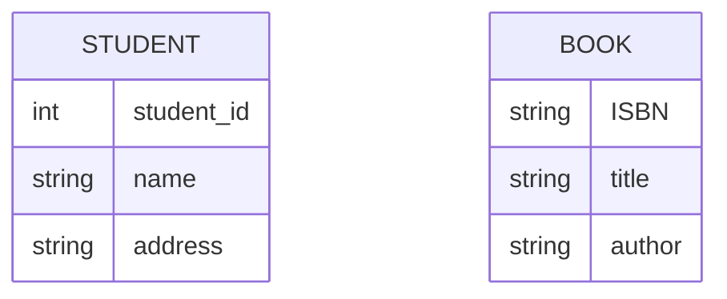

**મેમરી ટ્રીક:** "EA-PC" - એન્ટિટીઝ આર ફિઝિકલ/કોન્સેપ્ચ્યુઅલ, એટ્રિબ્યુટ્સ પ્રોવાઇડ કેરેક્ટરિસ્ટિક્સ

## પ્રશ્ન 1(ક) [7 માર્ક્સ]

**DBA નું પૂર્ણ નામ લખો. DBAની ભૂમિકા અને જવાબદારીઓ સમજાવો.**

**ઉત્તર**:

DBA એટલે **ડેટાબેઝ એડમિનિસ્ટ્રેટર**.

**કોષ્ટક: DBA જવાબદારીઓ**

| ભૂમિકા | વર્ણન |
|------|-------------|
| ડેટાબેઝ ડિઝાઇન | લોજિકલ/ફિઝિકલ ડેટાબેઝ સ્ટ્રક્ચર અને સ્કીમા બનાવે છે |
| સિક્યોરિટી મેનેજમેન્ટ | યુઝર એકાઉન્ટ્સ અને પરમિશન્સ દ્વારા ઍક્સેસ નિયંત્રિત કરે છે |
| પરફોર્મન્સ ટ્યુનિંગ | ઝડપી ડેટા પુનઃપ્રાપ્તિ માટે ક્વેરીઝ, ઇન્ડેક્સ ઓપ્ટિમાઇઝ કરે છે |
| બેકઅપ & રિકવરી | ડેટા નુકસાન રોકવા માટેની વ્યૂહરચના અમલમાં મૂકે છે |
| મેઇન્ટેનન્સ | સોફ્ટવેર અપડેટ કરે છે, પેચિસ લાગુ કરે છે, સ્પેસનું મોનિટરિંગ કરે છે |

**આકૃતિ:**

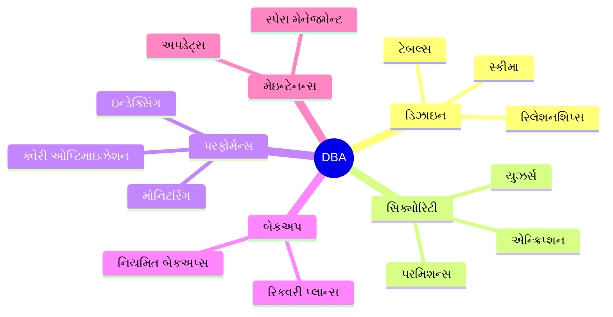

**મેમરી ટ્રીક:** "SPMBU" - સિક્યોરિટી, પરફોર્મન્સ, મેઇન્ટેનન્સ, બેકઅપ, અપડેટ્સ

## પ્રશ્ન 1(ક) OR [7 માર્ક્સ]

**રીલેશનલ અને નેટવર્ક ડેટા મોડેલ વિસ્તારથી સમજાવો.**

**ઉત્તર**:

**કોષ્ટક: રીલેશનલ અને નેટવર્ક ડેટા મોડેલની તુલના**

| લક્ષણ | રીલેશનલ મોડેલ | નેટવર્ક મોડેલ |
|---------|------------------|---------------|
| સ્ટ્રક્ચર | ટેબલ્સ (રીલેશન્સ) - રો અને કોલમ્સ સાથે | રેકોર્ડ્સ પોઇન્ટર્સ દ્વારા જોડાયેલા જટિલ નેટવર્ક બનાવે છે |
| સંબંધ | પ્રાઇમરી અને ફોરેન કી દ્વારા જોડાયેલા | પેરન્ટ-ચાઇલ્ડ રેકોર્ડ્સ વચ્ચે ડાયરેક્ટ લિંક્સ |
| ફ્લેક્સિબિલિટી | ઉચ્ચ - ટેબલ્સ જરૂરિયાત મુજબ જોઈન કરી શકાય છે | સીમિત - પૂર્વનિર્ધારિત ફિઝિકલ કનેક્શન |
| ઉદાહરણો | MySQL, Oracle, SQL Server | IDS, IDMS |
| ક્વેરી લેંગ્વેજ | SQL (સ્ટ્રક્ચર્ડ ક્વેરી લેંગ્વેજ) | પ્રોસીજરલ લેંગ્વેજ |

**આકૃતિ:**

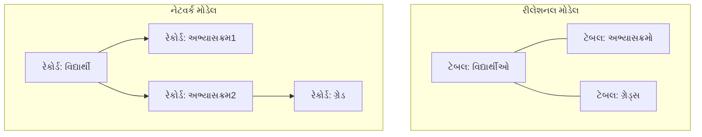

**મેમરી ટ્રીક:** "RSPEN" - રીલેશનલ યુઝિસ સેટ્સ, પોઇન્ટર્સ એનેબલ નેટવર્ક્સ

## પ્રશ્ન 2(અ) [3 માર્ક્સ]

**Generalization આકૃતિ સાથે સમજાવો.**

**ઉત્તર**:

**Generalization**: બે કે વધુ એન્ટિટીઓમાંથી સામાન્ય લક્ષણો કાઢીને નવી ઉચ્ચ સ્તરની એન્ટિટી બનાવવાની પ્રક્રિયા.

**આકૃતિ:**

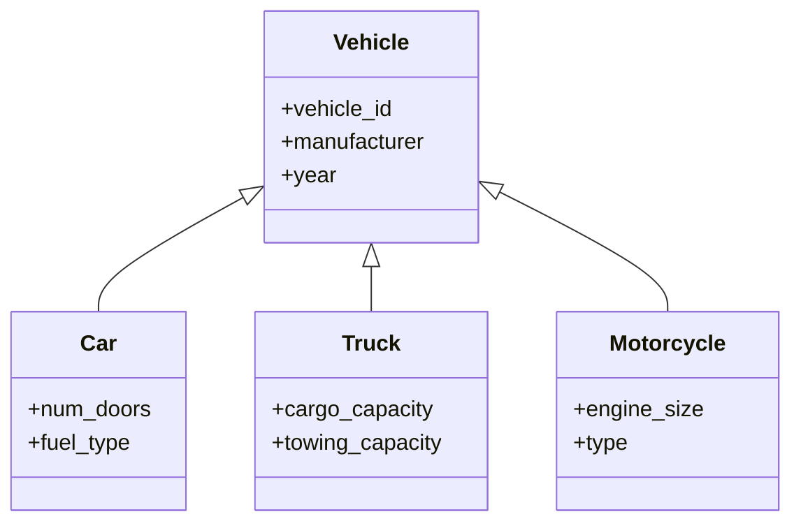

**મેમરી ટ્રીક:** "BUSH" - બોટમ-અપ શેર્ડ હાયરાર્કી

## પ્રશ્ન 2(બ) [4 માર્ક્સ]

**Primary કી અને Foreign કી Constraints સમજાઓ.**

**ઉત્તર**:

**કોષ્ટક: પ્રાઇમરી કી વિ. ફોરેન કી**

| કન્સ્ટ્રેઇન્ટ | વ્યાખ્યા | ગુણધર્મો | ઉદાહરણ |
|------------|------------|------------|---------|
| પ્રાઇમરી કી | ટેબલમાં દરેક રેકોર્ડને અનન્ય રીતે ઓળખે છે | અનન્ય, નોટ નલ, ટેબલ દીઠ માત્ર એક | વિદ્યાર્થી ટેબલમાં StudentID |
| ફોરેન કી | ટેબલો વચ્ચે ડેટાને જોડે છે, બીજા ટેબલના પ્રાઇમરી કીનો સંદર્ભ આપે છે | NULL હોઈ શકે, એક ટેબલમાં અનેક હોઈ શકે | એમ્પ્લોયી ટેબલમાં DeptID |

**આકૃતિ:**

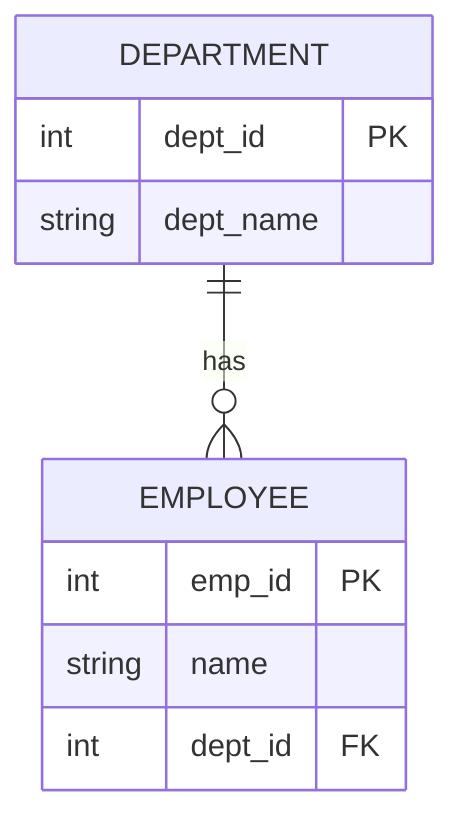

**મેમરી ટ્રીક:** "PURE FIRE" - પ્રાઇમરી યુનિકલી રેફરન્સિસ એન્ટિટીઝ, ફોરેન ઇમ્પોર્ટ્સ રેફરન્સ્ડ એન્ટિટીઝ

## પ્રશ્ન 2(ક) [7 માર્ક્સ]

**હોસ્પિટલ મેનેજમેન્ટ સિસ્ટમ માટે E-R ડાયાગ્રામ બનાવો**

**ઉત્તર**:

**હોસ્પિટલ મેનેજમેન્ટ સિસ્ટમ માટે E-R ડાયાગ્રામ:**

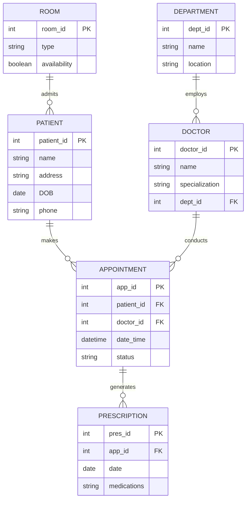

**મેમરી ટ્રીક:** "PADRE" - પેશન્ટ અપોઇન્ટમેન્ટ ડોક્ટર રૂમ એન્ટિટીઝ

## પ્રશ્ન 2(અ) OR [3 માર્ક્સ]

**Specialization આકૃતિ સાથે સમજાવો.**

**ઉત્તર**:

**Specialization**: હાલની એન્ટિટીમાંથી તેમને અલગ ઓળખવા માટે અનન્ય લક્ષણો ઉમેરીને નવી એન્ટિટીઓ બનાવવાની પ્રક્રિયા.

**આકૃતિ:**

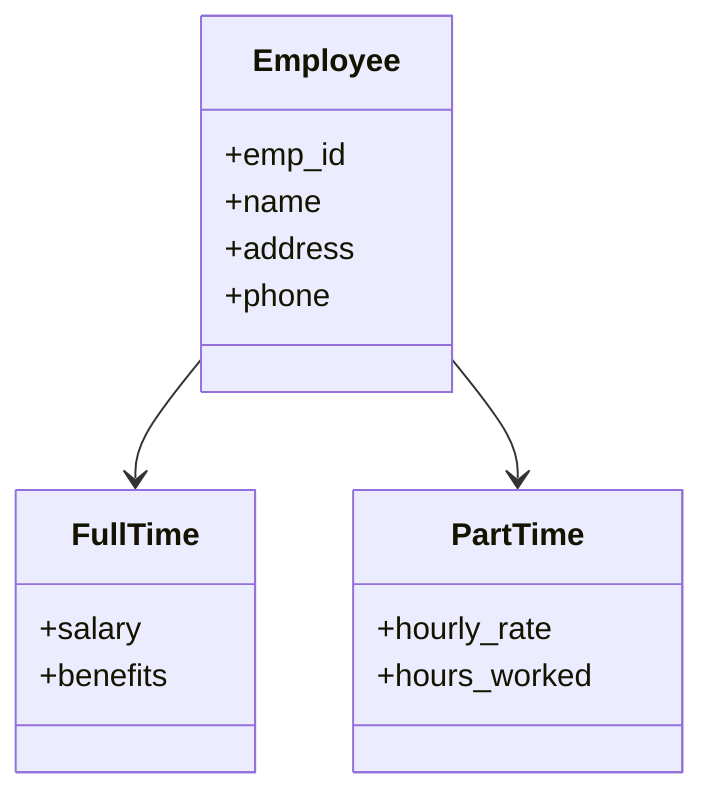

**મેમરી ટ્રીક:** "TDSB" - ટોપ-ડાઉન સ્પેશલાઇઝ્ડ બ્રેકડાઉન

## પ્રશ્ન 2(બ) OR [4 માર્ક્સ]

**યોગ્ય ઉદાહરણ સાથે સિંગલ વેલ્યુડ અને મલ્ટીવેલ્યુડ એટ્રીબ્યુટ વચ્ચેનો તફાવત સમજાવો.**

**ઉત્તર**:

**કોષ્ટક: સિંગલ-વેલ્યુડ અને મલ્ટી-વેલ્યુડ એટ્રીબ્યુટ્સ**

| પ્રકાર | વ્યાખ્યા | ઉદાહરણ | ઇમ્પ્લિમેન્ટેશન |
|------|------------|---------|----------------|
| સિંગલ-વેલ્યુડ | દરેક એન્ટિટી ઇન્સ્ટન્સ માટે માત્ર એક જ મૂલ્ય ધરાવે છે | વ્યક્તિની જન્મતારીખ, SSN | સીધા ટેબલ કોલમમાં સંગ્રહિત |
| મલ્ટી-વેલ્યુડ | એક જ એન્ટિટી માટે અનેક મૂલ્યો ધરાવી શકે છે | વ્યક્તિની કુશળતાઓ, ફોન નંબરો | અલગ ટેબલ અથવા વિશિષ્ટ ફોર્મેટ |

**આકૃતિ:**

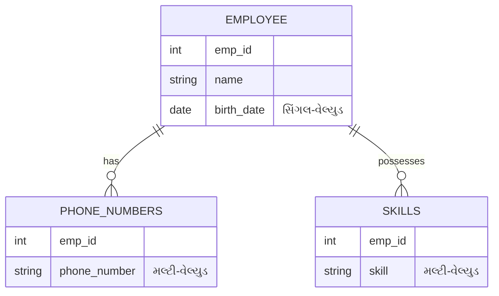

**મેમરી ટ્રીક:** "SOME" - સિંગલ વન, મલ્ટિપલ એન્ટ્રીઝ

## પ્રશ્ન 2(ક) OR [7 માર્ક્સ]

**બેન્કિંગ મેનેજમેન્ટ સિસ્ટમ માટે E-R ડાયાગ્રામ બનાવો**

**ઉત્તર**:

**બેન્કિંગ મેનેજમેન્ટ સિસ્ટમ માટે E-R ડાયાગ્રામ:**

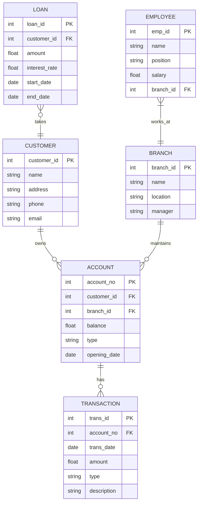

**મેમરી ટ્રીક:** "CABLE" - કસ્ટમર્સ અકાઉન્ટ્સ બ્રાન્ચિસ લોન્સ એમ્પ્લોયીઝ

## પ્રશ્ન 3(અ) [3 માર્ક્સ]

**WHERE અને DESC ક્લોઝ ઉદાહરણ સાથે સમજાવો.**

**ઉત્તર**:

**કોષ્ટક: WHERE અને DESC ક્લોઝનો ઉપયોગ**

| ક્લોઝ | હેતુ | સિન્ટેક્સ | ઉદાહરણ |
|--------|---------|--------|---------|
| WHERE | ચોક્કસ શરત પર આધારિત રો ફિલ્ટર કરે છે | SELECT columns FROM table WHERE condition | SELECT * FROM employees WHERE salary > 50000 |
| DESC | પરિણામોને ઉતરતા ક્રમમાં ગોઠવે છે | SELECT columns FROM table ORDER BY column DESC | SELECT * FROM products ORDER BY price DESC |

**આકૃતિ:**

```sql
-- Students ટેબલમાં મૂળ ડેટા
| ID | Name   | Marks |
|----|--------|-------|
| 1  | Alice  | 85    |
| 2  | Bob    | 92    |
| 3  | Carol  | 78    |
| 4  | David  | 65    |

-- WHERE વાપરીને: SELECT * FROM Students WHERE Marks > 80
| ID | Name   | Marks |
|----|--------|-------|
| 1  | Alice  | 85    |
| 2  | Bob    | 92    |

-- DESC વાપરીને: SELECT * FROM Students ORDER BY Marks DESC
| ID | Name   | Marks |
|----|--------|-------|
| 2  | Bob    | 92    |
| 1  | Alice  | 85    |
| 3  | Carol  | 78    |
| 4  | David  | 65    |
```

**મેમરી ટ્રીક:** "WDF" - Where ડેટા ફિલ્ટર કરે છે, DESC ઉચ્ચતમ પહેલા ક્રમ આપે છે

## પ્રશ્ન 3(બ) [4 માર્ક્સ]

**DDL કમાન્ડની યાદી બનાવો. કોઈ પણ ૨ DDL કમાન્ડ ઉદાહરણ સાથે સમજાવો.**

**ઉત્તર**:

**DDL (ડેટા ડેફિનિશન લેંગ્વેજ) કમાન્ડ્સ:**

1. CREATE
2. ALTER
3. DROP
4. TRUNCATE
5. RENAME

**કોષ્ટક: CREATE અને ALTER કમાન્ડ્સ**

| કમાન્ડ | હેતુ | સિન્ટેક્સ | ઉદાહરણ |
|---------|---------|--------|---------|
| CREATE | ટેબલ, વ્યૂ, ઇન્ડેક્સ જેવા ડેટાબેઝ ઑબ્જેક્ટ્સ બનાવે છે | CREATE TABLE table_name (column definitions) | CREATE TABLE students (id INT PRIMARY KEY, name VARCHAR(50)) |
| ALTER | હાલના ડેટાબેઝ ઑબ્જેક્ટની સ્ટ્રક્ચર સુધારે છે | ALTER TABLE table_name action | ALTER TABLE students ADD COLUMN email VARCHAR(100) |

**કોડબ્લોક:**

```sql
-- CREATE ઉદાહરણ
CREATE TABLE employees (
    emp_id INT PRIMARY KEY,
    name VARCHAR(50) NOT NULL,
    dept VARCHAR(30),
    salary DECIMAL(10,2)
);

-- ALTER ઉદાહરણ
ALTER TABLE employees 
ADD COLUMN hire_date DATE;
```

**મેમરી ટ્રીક:** "CADTR" - Create Alter Drop Truncate Rename

## પ્રશ્ન 3(ક) [7 માર્ક્સ]

**eno, ename, salary, dept ફિલ્ડ ધરાવતા Company ટેબલ પર નીચેની Query perform કરો.**
**૧. Company ટેબલના તમામ રેકોર્ડ ડિસ્પ્લે કરો.**
**૨. ડુપ્લિકેટ વેલ્યુ સિવાય માત્ર dept ડિસ્પ્લે કરો.**
**૩. ename ના ઉતરતા ક્રમમાં તમામ રેકોર્ડ ડિસ્પ્લે કરો.**
**૪. શહેરનું નામ સ્ટોર કરવા માટે "cityname" નામથી નવી કોલમ ઉમેરો.**
**૫. "Mumbai" શહેરમાં ન રહેતા હોય તેવા તમામ કર્મચારીઓનાં નામ ડિસ્પ્લે કરો.**
**૬. ૧૦૦૦૦ કરતા ઓછું પગાર ધરાવતા તમામ કર્મચારીઓને ડીલીટ કરો.**
**૭. "A" થી શરુ થતા તમામ કર્મચારીઓના નામ ડિસ્પ્લે કરો.**

**ઉત્તર**:

**કોડબ્લોક:**

```sql
-- ૧. Company ટેબલના તમામ રેકોર્ડ ડિસ્પ્લે કરો
SELECT * FROM Company;

-- ૨. ડુપ્લિકેટ વેલ્યુ સિવાય માત્ર dept ડિસ્પ્લે કરો
SELECT DISTINCT dept FROM Company;

-- ૩. ename ના ઉતરતા ક્રમમાં તમામ રેકોર્ડ ડિસ્પ્લે કરો
SELECT * FROM Company ORDER BY ename DESC;

-- ૪. શહેરનું નામ સ્ટોર કરવા માટે "cityname" નામથી નવી કોલમ ઉમેરો
ALTER TABLE Company ADD COLUMN cityname VARCHAR(50);

-- ૫. "Mumbai" શહેરમાં ન રહેતા હોય તેવા તમામ કર્મચારીઓનાં નામ ડિસ્પ્લે કરો
SELECT ename FROM Company WHERE cityname != 'Mumbai';

-- ૬. ૧૦૦૦૦ કરતા ઓછું પગાર ધરાવતા તમામ કર્મચારીઓને ડીલીટ કરો
DELETE FROM Company WHERE salary < 10000;

-- ૭. "A" થી શરુ થતા તમામ કર્મચારીઓના નામ ડિસ્પ્લે કરો
SELECT ename FROM Company WHERE ename LIKE 'A%';
```

**કોષ્ટક: SQL ઓપરેશન્સ**

| ઓપરેશન | SQL કમાન્ડ | હેતુ |
|-----------|-------------|---------|
| SELECT | SELECT * FROM Company | બધો ડેટા મેળવે છે |
| DISTINCT | SELECT DISTINCT dept | ડુપ્લિકેટ દૂર કરે છે |
| ORDER BY | ORDER BY ename DESC | ઉતરતા ક્રમમાં ગોઠવે છે |
| ALTER | ALTER TABLE ADD COLUMN | નવી કોલમ ઉમેરે છે |
| WHERE | WHERE cityname != 'Mumbai' | ફિલ્ટર શરત |
| DELETE | DELETE FROM WHERE | રેકોર્ડ દૂર કરે છે |
| LIKE | WHERE ename LIKE 'A%' | પેટર્ન મેચિંગ |

**મેમરી ટ્રીક:** "SODA-WDL" - Select Order Distinct Alter - Where Delete Like

## પ્રશ્ન 3(અ) OR [3 માર્ક્સ]

**SELECT અને DISTINCT ક્લોઝ ઉદાહરણ સાથે સમજાવો.**

**ઉત્તર**:

**કોષ્ટક: SELECT અને DISTINCT ક્લોઝનો ઉપયોગ**

| ક્લોઝ | હેતુ | સિન્ટેક્સ | ઉદાહરણ |
|--------|---------|--------|---------|
| SELECT | ડેટાબેઝમાંથી ડેટા મેળવે છે | SELECT columns FROM table | SELECT name, age FROM students |
| DISTINCT | ડુપ્લિકેટ મૂલ્યો દૂર કરે છે | SELECT DISTINCT columns FROM table | SELECT DISTINCT department FROM employees |

**આકૃતિ:**

```sql
-- Departments ટેબલમાં મૂળ ડેટા
| dept_id | dept_name |
|---------|-----------|
| 1       | Sales     |
| 2       | IT        |
| 3       | HR        |
| 4       | IT        |
| 5       | Sales     |

-- SELECT વાપરીને: SELECT dept_name FROM Departments
| dept_name |
|-----------|
| Sales     |
| IT        |
| HR        |
| IT        |
| Sales     |

-- DISTINCT વાપરીને: SELECT DISTINCT dept_name FROM Departments
| dept_name |
|-----------|
| Sales     |
| IT        |
| HR        |
```

**મેમરી ટ્રીક:** "SUD" - Select Unique with Distinct

## પ્રશ્ન 3(બ) OR [4 માર્ક્સ]

**DML કમાન્ડની યાદી બનાવો. કોઈ પણ ૨ DML કમાન્ડ ઉદાહરણ સાથે સમજાવો.**

**ઉત્તર**:

**DML (ડેટા મેનિપ્યુલેશન લેંગ્વેજ) કમાન્ડ્સ:**

1. INSERT
2. UPDATE
3. DELETE
4. SELECT

**કોષ્ટક: INSERT અને UPDATE કમાન્ડ્સ**

| કમાન્ડ | હેતુ | સિન્ટેક્સ | ઉદાહરણ |
|---------|---------|--------|---------|
| INSERT | ટેબલમાં નવા રેકોર્ડ ઉમેરે છે | INSERT INTO table_name VALUES (values) | INSERT INTO students VALUES (1, 'John', 85) |
| UPDATE | હાલના રેકોર્ડમાં ફેરફાર કરે છે | UPDATE table_name SET column=value WHERE condition | UPDATE students SET marks=90 WHERE id=1 |

**કોડબ્લોક:**

```sql
-- INSERT ઉદાહરણ
INSERT INTO employees (emp_id, name, dept, salary)
VALUES (101, 'John Smith', 'IT', 65000);

-- UPDATE ઉદાહરણ
UPDATE employees 
SET salary = 70000 
WHERE emp_id = 101;
```

**મેમરી ટ્રીક:** "IUDS" - Insert Update Delete Select

## પ્રશ્ન 3(ક) OR [7 માર્ક્સ]

**નીચેની Query ના આઉટપુટ લખો.**
**1. ABS(-34),ABS(16)**
**2. SQRT(16),SQRT(64)**
**3. POWER(5,2), POWER(2,4)**
**4. MOD(15,3), MOD(13,3)**
**5. ROUND(123.456,1), ROUND(123.456,2)**
**6. CEIL(122.6), CEIL(-122.6)**
**7. FLOOR(-157.5),FLOOR(157.5)**

**ઉત્તર**:

**કોષ્ટક: SQL ફંક્શન આઉટપુટ**

| ફંક્શન | વર્ણન | આઉટપુટ |
|----------|-------------|--------|
| ABS(-34),ABS(16) | નિરપેક્ષ મૂલ્ય | 34, 16 |
| SQRT(16),SQRT(64) | વર્ગમૂળ | 4, 8 |
| POWER(5,2), POWER(2,4) | પાવર ફંક્શન | 25, 16 |
| MOD(15,3), MOD(13,3) | મોડ્યુલસ (બાકી) | 0, 1 |
| ROUND(123.456,1), ROUND(123.456,2) | દશાંશ સ્થાન સુધી રાઉન્ડ | 123.5, 123.46 |
| CEIL(122.6), CEIL(-122.6) | પૂર્ણાંક સુધી ઉપર રાઉન્ડ | 123, -122 |
| FLOOR(-157.5),FLOOR(157.5) | પૂર્ણાંક સુધી નીચે રાઉન્ડ | -158, 157 |

**આકૃતિ:**

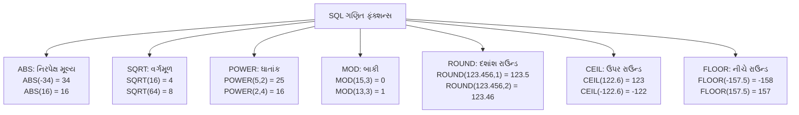

**મેમરી ટ્રીક:** "ASPRCF" - Absolute Square Power Remainder Ceiling Floor

## પ્રશ્ન 4(અ) [3 માર્ક્સ]

**SQLમાં ડેટા ટાઈપની યાદી બનાવો. 1.VARCHAR() અને 2.INT() ડેટા ટાઈપ ઉદાહરણ સાથે સમજાવો.**

**ઉત્તર**:

**SQL ડેટા ટાઈપ કેટેગરીઝ:**

1. ન્યુમેરિક (INT, FLOAT, DECIMAL)
2. કેરેક્ટર (CHAR, VARCHAR)
3. ડેટ/ટાઈમ (DATE, TIME, DATETIME)
4. બાઈનરી (BLOB, BINARY)
5. બૂલિયન (BOOL)

**કોષ્ટક: VARCHAR અને INT ડેટા ટાઈપ્સ**

| ડેટા ટાઈપ | વર્ણન | સાઈઝ | ઉદાહરણ |
|-----------|-------------|------|---------|
| VARCHAR(n) | વેરિએબલ-લેન્થ કેરેક્ટર સ્ટ્રિંગ | n કેરેક્ટર સુધી, માત્ર જરૂરી જગ્યાનો ઉપયોગ | નામ, ઈમેલ માટે VARCHAR(50) |
| INT | ઇન્ટિજર ન્યુમેરિક ડેટા | સામાન્ય રીતે 4 બાઈટ્સ, -2,147,483,648 થી 2,147,483,647 | ID, કાઉન્ટ, ઉંમર માટે INT |

**કોડબ્લોક:**

```sql
CREATE TABLE students (
    student_id INT PRIMARY KEY,
    name VARCHAR(50) NOT NULL,
    age INT,
    email VARCHAR(100)
);
```

**મેમરી ટ્રીક:** "VIA" - Variable strings, Integers for Ages

## પ્રશ્ન 4(બ) [4 માર્ક્સ]

**2NF (સેકન્ડ નોર્મલ ફોર્મ) ઉદાહરણ અને ઉકેલ સાથે સમજાવો.**

**ઉત્તર**:

**2NF વ્યાખ્યા**: એક સંબંધ 2NF માં છે જો તે 1NF માં હોય અને કોઈપણ નોન-પ્રાઈમ એટ્રિબ્યુટ કોઈપણ કેન્ડિડેટ કીના સબસેટ પર આધારિત ન હોય.

**કોષ્ટક: 2NF પહેલાં**

| student_id | course_id | course_name | instructor |
|------------|-----------|-------------|------------|
| S1 | C1 | Database | Prof. Smith |
| S1 | C2 | Networking | Prof. Jones |
| S2 | C1 | Database | Prof. Smith |
| S3 | C3 | Programming | Prof. Wilson |

**સમસ્યા**: નોન-પ્રાઈમ એટ્રિબ્યુટ્સ (course_name, instructor) માત્ર course_id પર આધારિત છે, સંપૂર્ણ કી (student_id, course_id) પર નહીં.

**આકૃતિ: 2NF ઉકેલ**

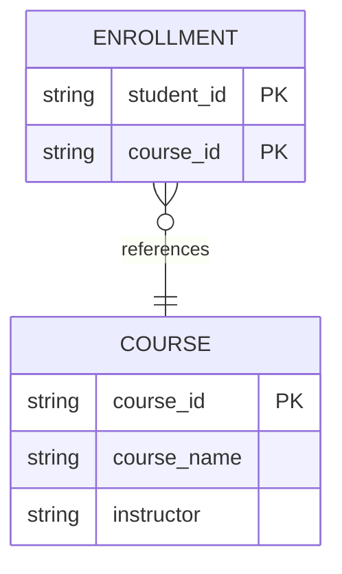

**કોષ્ટક: 2NF પછી**
Enrollment ટેબલ:

| student_id | course_id |
|------------|-----------|
| S1 | C1 |
| S1 | C2 |
| S2 | C1 |
| S3 | C3 |

Course ટેબલ:

| course_id | course_name | instructor |
|-----------|-------------|------------|
| C1 | Database | Prof. Smith |
| C2 | Networking | Prof. Jones |
| C3 | Programming | Prof. Wilson |

**મેમરી ટ્રીક:** "PFPK" - Partial Functional dependency on Primary Key

## પ્રશ્ન 4(ક) [7 માર્ક્સ]

**Function dependency સમજાવો. Partial function dependency ઉદાહરણ સાથે સમજાવો.**

**ઉત્તર**:

**Functional Dependency**: એટ્રિબ્યુટ્સ વચ્ચેનો સંબંધ જ્યાં એક એટ્રિબ્યુટનું મૂલ્ય બીજા એટ્રિબ્યુટના મૂલ્યને નક્કી કરે છે.

**નોટેશન**: X → Y (X Y ને નક્કી કરે છે)

**Partial Functional Dependency**: જ્યારે નોન-પ્રાઈમ એટ્રિબ્યુટ કંપોઝિટ કીના સંપૂર્ણ કરતાં ભાગ પર આધારિત હોય.

**કોષ્ટક: Order Details (નોર્મલાઈઝેશન પહેલાં)**

| order_id | product_id | quantity | product_name | price |
|----------|------------|----------|--------------|-------|
| O1 | P1 | 5 | Keyboard | 50 |
| O1 | P2 | 2 | Mouse | 25 |
| O2 | P1 | 1 | Keyboard | 50 |
| O3 | P3 | 3 | Monitor | 200 |

**Functional Dependencies:**

- (order_id, product_id) → quantity
- product_id → product_name
- product_id → price

**આકૃતિ:**

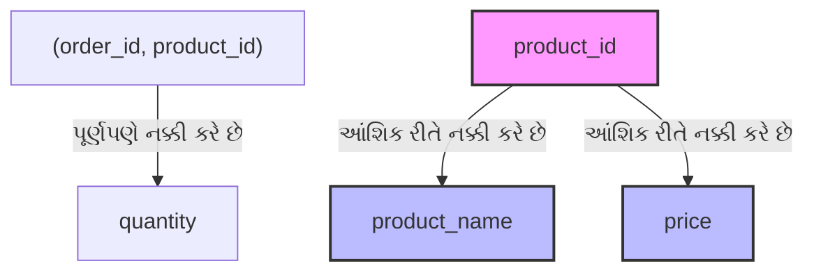

**ઉકેલ (નોર્મલાઈઝ્ડ ટેબલ્સ):**
Orders ટેબલ:

| order_id | product_id | quantity |
|----------|------------|----------|
| O1 | P1 | 5 |
| O1 | P2 | 2 |
| O2 | P1 | 1 |
| O3 | P3 | 3 |

Products ટેબલ:

| product_id | product_name | price |
|------------|--------------|-------|
| P1 | Keyboard | 50 |
| P2 | Mouse | 25 |
| P3 | Monitor | 200 |

**મેમરી ટ્રીક:** "PDPK" - Partial Dependency on Part of Key

## પ્રશ્ન 4(અ) OR [3 માર્ક્સ]

**કમાન્ડ સમજાવવો: 1) To_Char() 2) To_Date()**

**ઉત્તર**:

**કોષ્ટક: કન્વર્ઝન ફંક્શન્સ**

| ફંક્શન | હેતુ | સિન્ટેક્સ | ઉદાહરણ |
|----------|---------|--------|---------|
| TO_CHAR() | ડેટ/નંબરને ફોર્મેટ મોડેલનો ઉપયોગ કરીને કેરેક્ટર સ્ટ્રિંગમાં રૂપાંતરિત કરે છે | TO_CHAR(value, [format]) | TO_CHAR(SYSDATE, 'DD-MON-YYYY') → '14-JUN-2024' |
| TO_DATE() | કેરેક્ટર સ્ટ્રિંગને ફોર્મેટ મોડેલનો ઉપયોગ કરીને ડેટમાં રૂપાંતરિત કરે છે | TO_DATE(string, [format]) | TO_DATE('14-JUN-2024', 'DD-MON-YYYY') → ડેટ વેલ્યુ |

**કોડબ્લોક:**

```sql
-- TO_CHAR ઉદાહરણો
SELECT TO_CHAR(SYSDATE, 'DD-MON-YYYY') FROM DUAL;  -- '14-JUN-2024'
SELECT TO_CHAR(1234.56, '$9,999.99') FROM DUAL;    -- '$1,234.56'

-- TO_DATE ઉદાહરણો
SELECT TO_DATE('2024-06-14', 'YYYY-MM-DD') FROM DUAL;
SELECT TO_DATE('14/06/24', 'DD/MM/YY') FROM DUAL;
```

**મેમરી ટ્રીક:** "DCS" - Date Conversion Strings

## પ્રશ્ન 4(બ) OR [4 માર્ક્સ]

**Full function dependency ઉદાહરણ સાથે સમજાવો.**

**ઉત્તર**:

**Full Functional Dependency**: જ્યારે એક એટ્રિબ્યુટ કંપોઝિટ કી પર ફંક્શનલી ડિપેન્ડન્ટ હોય, અને માત્ર ભાગ પર નહીં પણ સંપૂર્ણ કી પર આધારિત હોય.

**કોષ્ટક: Exam Results**

| student_id | course_id | exam_date | score |
|------------|-----------|-----------|-------|
| S1 | C1 | 2024-05-10 | 85 |
| S1 | C2 | 2024-05-15 | 92 |
| S2 | C1 | 2024-05-10 | 78 |
| S2 | C2 | 2024-05-15 | 88 |

**Full Functional Dependency:**

- (student_id, course_id) → score (સ્કોર વિદ્યાર્થી અને કોર્સ બંને પર આધારિત છે)

**આકૃતિ:**

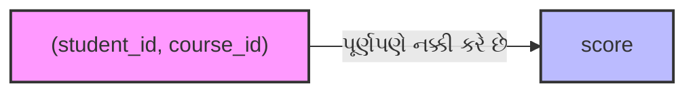

**સમજૂતી**: સ્કોર એટ્રિબ્યુટ સંપૂર્ણ રીતે કંપોઝિટ કી (student_id, course_id) પર આધારિત છે કારણ કે:

- અલગ અલગ વિદ્યાર્થીઓના એક જ કોર્સ માટે અલગ અલગ સ્કોર હોઈ શકે છે
- એક જ વિદ્યાર્થીના અલગ અલગ કોર્સ માટે અલગ અલગ સ્કોર હોઈ શકે છે
- ચોક્કસ સ્કોર જાણવા માટે આપણને student_id અને course_id બંનેની જરૂર પડે છે

**મેમરી ટ્રીક:** "FCEK" - Fully dependent on Complete/Entire Key

## પ્રશ્ન 4(ક) OR [7 માર્ક્સ]

**નોર્મલાઇઝેશનની વ્યાખ્યા આપો. 1NF (ફર્સ્ટ નોર્મલ ફોર્મ) ઉદાહરણ અને ઉકેલ સાથે સમજાવો.**

**ઉત્તર**:

**નોર્મલાઇઝેશન**: ડેટા રિડન્ડન્સી ઘટાડવા, ડેટા અખંડતા સુધારવા અને એનોમલીઓને દૂર કરવા માટે મોટા ટેબલને નાના સંબંધિત ટેબલમાં વિભાજિત કરીને ડેટાને વ્યવસ્થિત કરવાની પ્રક્રિયા.

**1NF વ્યાખ્યા**: એક સંબંધ 1NF માં છે જો તેના બધા એટ્રિબ્યુટ્સ માત્ર અવિભાજ્ય (એટોમિક) મૂલ્યો ધરાવતા હોય.

**કોષ્ટક: 1NF પહેલાં**

| student_id | name | courses |
|------------|------|---------|
| S1 | John | Math, Physics |
| S2 | Mary | Chemistry, Biology, Physics |
| S3 | Tim | Computer Science |

**સમસ્યાઓ**:

- નોન-એટોમિક મૂલ્યો (એક સેલમાં અનેક કોર્સ)
- ચોક્કસ કોર્સને ક્વેરી કે અપડેટ કરવું સરળ નથી

**આકૃતિ:**

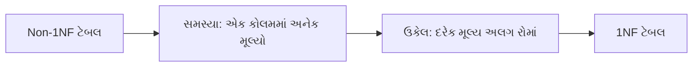

**કોષ્ટક: 1NF પછી**

| student_id | name | course |
|------------|------|--------|
| S1 | John | Math |
| S1 | John | Physics |
| S2 | Mary | Chemistry |
| S2 | Mary | Biology |
| S2 | Mary | Physics |
| S3 | Tim | Computer Science |

**મેમરી ટ્રીક:** "ASAV" - Atomic Single-value Attributes only Valid

## પ્રશ્ન 5(અ) [3 માર્ક્સ]

**Transaction નો concept ઉદાહરણ સાથે સમજાવો.**

**ઉત્તર**:

**Transaction**: એક લૉજિકલ કાર્ય એકમ જે સંપૂર્ણપણે અમલમાં મૂકવામાં આવે અથવા સંપૂર્ણપણે રદ કરવામાં આવે.

**કોષ્ટક: Transaction ગુણધર્મો**

| ગુણધર્મ | વર્ણન |
|----------|-------------|
| Atomicity | બધા ઓપરેશન સફળતાપૂર્વક પૂર્ણ થાય અથવા કોઈ નહીં |
| Consistency | ટ્રાન્ઝેક્શન પહેલાં અને પછી ડેટાબેઝ સુસંગત સ્થિતિમાં રહે |
| Isolation | સમાંતર ટ્રાન્ઝેક્શન એકબીજામાં દખલ ન કરે |
| Durability | સફળ ટ્રાન્ઝેક્શન પછી પણ ફેરફાર ટકી રહે |

**ઉદાહરણ:**

```sql
-- બેંક અકાઉન્ટ ટ્રાન્સફર ટ્રાન્ઝેક્શન
BEGIN TRANSACTION;
    -- અકાઉન્ટ A માંથી $500 કાઢવા
    UPDATE accounts SET balance = balance - 500 WHERE account_id = 'A';
    
    -- અકાઉન્ટ B માં $500 ઉમેરવા
    UPDATE accounts SET balance = balance + 500 WHERE account_id = 'B';
    
    -- જો બંને ઓપરેશન સફળ હોય તો
    COMMIT;
    -- જો કોઈ ઓપરેશન નિષ્ફળ જાય તો
    -- ROLLBACK;
END TRANSACTION;
```

**મેમરી ટ્રીક:** "ACID" - Atomicity Consistency Isolation Durability

## પ્રશ્ન 5(બ) [4 માર્ક્સ]

**equi join સિન્ટેક્સ અને ઉદાહરણ સાથે સમજાવો.**

**ઉત્તર**:

**Equi Join**: એક જોઈન જે સામાન્ય ફીલ્ડના આધારે બે કે વધુ ટેબલના રેકોર્ડને મેચ કરવા માટે સમાનતા તુલના ઓપરેટરનો ઉપયોગ કરે છે.

**સિન્ટેક્સ:**

```sql
SELECT columns
FROM table1, table2 
WHERE table1.column = table2.column;

-- વૈકલ્પિક સિન્ટેક્સ (સ્પષ્ટ JOIN)
SELECT columns
FROM table1 JOIN table2
ON table1.column = table2.column;
```

**ટેબલ ઉદાહરણ:**
Employees ટેબલ:

| emp_id | name | dept_id |
|--------|------|---------|
| 101 | Alice | 1 |
| 102 | Bob | 2 |
| 103 | Carol | 1 |

Departments ટેબલ:

| dept_id | dept_name | location |
|---------|-----------|----------|
| 1 | HR | New York |
| 2 | IT | Chicago |
| 3 | Finance | Boston |

**કોડબ્લોક:**

```sql
-- Equi Join ઉદાહરણ
SELECT e.name, d.dept_name, d.location
FROM employees e, departments d
WHERE e.dept_id = d.dept_id;
```

**પરિણામ:**

| name | dept_name | location |
|------|-----------|----------|
| Alice | HR | New York |
| Bob | IT | Chicago |
| Carol | HR | New York |

**આકૃતિ:**

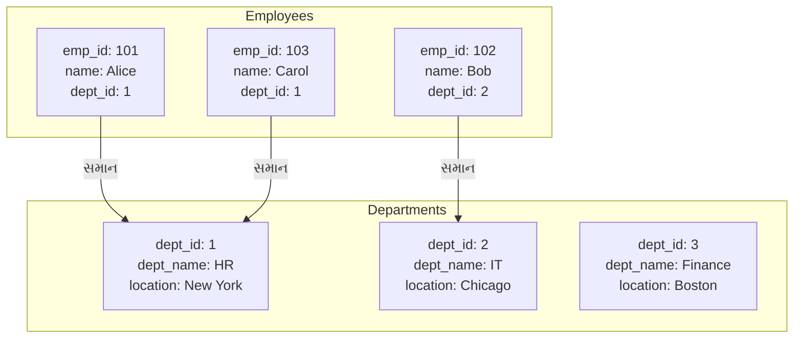

**મેમરી ટ્રીક:** "MEET" - Match Equal Elements Every Table

## પ્રશ્ન 5(ક) [7 માર્ક્સ]

**Conflict serializability વિસ્તારથી સમજાવો.**

**ઉત્તર**:

**Conflict Serializability**: સમાંતર ટ્રાન્ઝેક્શનની સાચી કાર્યપ્રણાલી સુનિશ્ચિત કરવાની એક રીત, જે એ ગેરંટી આપે છે કે એક્ઝિક્યુશન શેડ્યૂલ કોઈ સીરિયલ એક્ઝિક્યુશનના સમકક્ષ છે.

**કોષ્ટક: Conflict Serializability ના મુખ્ય ખ્યાલો**

| ખ્યાલ | વર્ણન |
|---------|-------------|
| Conflicting Operations | બે ઓપરેશન કોન્ફ્લિક્ટ કરે છે જો તેઓ એક જ ડેટા આઇટમ ઍક્સેસ કરે અને ઓછામાં ઓછું એક રાઇટ હોય |
| Precedence Graph | સંઘર્ષો દર્શાવતો ડાયરેક્ટેડ ગ્રાફ |
| Conflict Serializable | શેડ્યૂલ conflict serializable છે જો તેનો precedence graph એસાઇક્લિક હોય |

**આકૃતિ:**

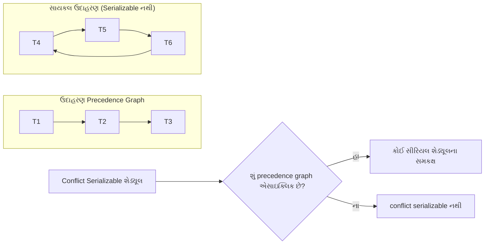

**ઉદાહરણ:**
ટ્રાન્ઝેક્શન T1 અને T2 ધ્યાનમાં લો:

- T1: Read(A), Write(A)
- T2: Read(A), Write(A)

શેડ્યૂલ S1: R1(A), W1(A), R2(A), W2(A) - Serializable (T1→T2 સમકક્ષ)
શેડ્યૂલ S2: R1(A), R2(A), W1(A), W2(A) - Not serializable (precedence ગ્રાફમાં સાયકલ છે)

**Conflict Serializability નક્કી કરવાના પગલાં:**

1. બધા કોન્ફ્લિક્ટિંગ ઓપરેશન જોડીઓ ઓળખો
2. precedence ગ્રાફ બનાવો
3. ચેક કરો કે ગ્રાફમાં સાયકલ છે કે નહીં
4. જો સાયકલ ન હોય, તો શેડ્યૂલ conflict serializable છે

**મેમરી ટ્રીક:** "COPS" - Conflicts, Operations, Precedence, Serializability

## પ્રશ્ન 5(અ) OR [3 માર્ક્સ]

**Transaction નાં ગુણધર્મો ઉદાહરણ સાથે સમજાવો.**

**ઉત્તર**:

**ટ્રાન્ઝેક્શનના ACID ગુણધર્મો:**

**કોષ્ટક: ACID ગુણધર્મો**

| ગુણધર્મ | વર્ણન | ઉદાહરણ |
|----------|-------------|---------|
| Atomicity | બધા ઓપરેશન સફળતાપૂર્વક પૂર્ણ થાય અથવા કોઈ નહીં | બેંક ટ્રાન્સફર - ડેબિટ અને ક્રેડિટ બંને એકસાથે સફળ થવા જોઈએ અથવા નિષ્ફળ થવા જોઈએ |
| Consistency | ટ્રાન્ઝેક્શન પહેલાં અને પછી ડેટાબેઝ સુસંગત સ્થિતિમાં રહે | $100 ટ્રાન્સફર કર્યા પછી, સિસ્ટમમાં કુલ પૈસા અપરિવર્તિત રહે |
| Isolation | સમાંતર ટ્રાન્ઝેક્શન એકબીજામાં દખલ ન કરે | ટ્રાન્ઝેક્શન A ટ્રાન્ઝેક્શન B ના આંશિક પરિણામો જોતું નથી |
| Durability | એકવાર કમિટ થયા પછી, ફેરફારો કાયમી છે | પાવર ફેલ્યોર પણ કમિટેડ ટ્રાન્ઝેક્શનને ખોવાતું નથી |

**આકૃતિ:**

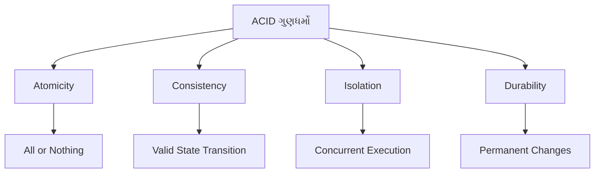

**ઉદાહરણ:**

```sql
-- ATM Withdrawal ટ્રાન્ઝેક્શન
BEGIN TRANSACTION;
    -- બેલેન્સ ચેક કરો
    SELECT balance FROM accounts WHERE account_id = 'A123';
    
    -- જો પૂરતું હોય, તો બેલેન્સ અપડેટ કરો
    UPDATE accounts SET balance = balance - 100 WHERE account_id = 'A123';
    
    -- ઉપાડની નોંધ કરો
    INSERT INTO transactions (account_id, type, amount, date)
    VALUES ('A123', 'WITHDRAWAL', 100, SYSDATE);
    
    -- જો બધા ઓપરેશન સફળ હોય તો
    COMMIT;
    -- જો કોઈ ઓપરેશન નિષ્ફળ જાય તો
    -- ROLLBACK;
END TRANSACTION;
```

**મેમરી ટ્રીક:** "ACID" - Atomicity Consistency Isolation Durability

## પ્રશ્ન 5(બ) OR [4 માર્ક્સ]

**ઉપર Q.5 (b) માં આપેલ "Faculty" અને "CT" ટેબલનો ઉપયોગ કરીને સેટ ઓપરેટર દ્વારા નીચેની Query લખો.**
**૧. Faculty અથવા CT હોય તેવા વ્યક્તિઓની યાદી બનાવો.**
**૨. Faculty અને CT હોય તેવા વ્યક્તિઓની યાદી બનાવો.**
**૩. માત્ર Faculty હોય તેવા વ્યક્તિઓની યાદી બનાવો.**
**૪. માત્ર CT હોય તેવા વ્યક્તિઓની યાદી બનાવો.**

**ઉત્તર**:

**ટેબલ ડેટા:**
Faculty ટેબલ:

| FacultyName | ErNo | Dept |
|-------------|------|------|
| Prakash | FC01 | ICT |
| Ronak | FC02 | IT |
| Rakesh | FC03 | EC |
| Kinjal | FC04 | ICT |

CT (ક્લાસ ટીચર) ટેબલ:

| Dept | CTName |
|------|--------|
| EC | Rakesh |
| CE | Jigar |
| ICT | Prakash |
| IT | Gunjan |

**કોડબ્લોક:**

```sql
-- ૧. Faculty અથવા CT હોય તેવા વ્યક્તિઓની યાદી બનાવો
SELECT FacultyName AS Name FROM Faculty
UNION
SELECT CTName AS Name FROM CT;

-- ૨. Faculty અને CT હોય તેવા વ્યક્તિઓની યાદી બનાવો
SELECT FacultyName AS Name FROM Faculty
INTERSECT
SELECT CTName AS Name FROM CT;

-- ૩. માત્ર Faculty હોય તેવા વ્યક્તિઓની યાદી બનાવો
SELECT FacultyName AS Name FROM Faculty
MINUS
SELECT CTName AS Name FROM CT;

-- ૪. માત્ર CT હોય તેવા વ્યક્તિઓની યાદી બનાવો
SELECT CTName AS Name FROM CT
MINUS
SELECT FacultyName AS Name FROM Faculty;
```

**આકૃતિ:**

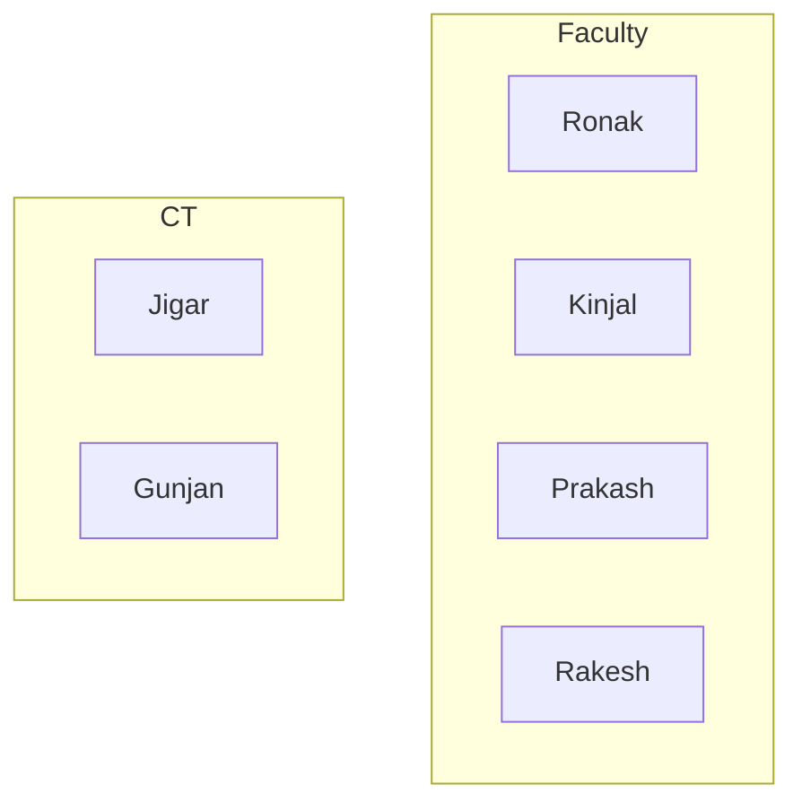

**પરિણામો:**

1. UNION: Prakash, Ronak, Rakesh, Kinjal, Jigar, Gunjan
2. INTERSECT: Prakash, Rakesh
3. MINUS (Faculty - CT): Ronak, Kinjal
4. MINUS (CT - Faculty): Jigar, Gunjan

**મેમરી ટ્રીક:** "UIMM" - Union Intersect Minus Minus

## પ્રશ્ન 5(ક) OR [7 માર્ક્સ]

**View serializability વિસ્તારથી સમજાવો.**

**ઉત્તર**:

**View Serializability**: એક શેડ્યૂલ view serializable છે જો તે કોઈ સીરિયલ શેડ્યૂલના view equivalent હોય, એટલે કે તે ડેટાબેઝની એક જ "દૃશ્ય" (અથવા અંતિમ સ્થિતિ) ઉત્પન્ન કરે.

**કોષ્ટક: Conflict Serializability સાથે તુલના**

| પાસું | View Serializability | Conflict Serializability |
|--------|---------------------|--------------------------|
| વ્યાખ્યા | રીડ અને રાઇટના અંતિમ પરિણામો પર આધારિત | ઓપરેશન વચ્ચેના કોન્ફ્લિક્ટ પર આધારિત |
| શરત | પ્રારંભિક રીડ, અંતિમ લખાણ, અને રીડ-રાઇટ ડિપેન્ડન્સી જાળવે છે | ઓપરેશન વચ્ચેના બધા કોન્ફ્લિક્ટ જાળવે છે |
| સ્કોપ | શેડ્યૂલનો વ્યાપક વર્ગ | view serializable શેડ્યૂલનો સબસેટ |
| ટેસ્ટિંગ | પરીક્ષણ વધુ જટિલ | precedence ગ્રાફ વડે ટેસ્ટ કરી શકાય |

**આકૃતિ:**

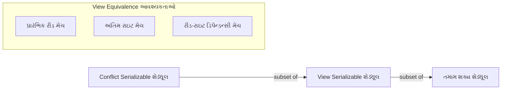

**View Equivalence શરતો:**

1. પ્રારંભિક રીડ: જો T1 શેડ્યૂલ S1 માં ડેટા આઇટમ A ની પ્રારંભિક વેલ્યુ વાંચે છે, તો તેણે S2 માં પણ પ્રારંભિક વેલ્યુ વાંચવી જોઈએ.
2. અંતિમ રાઇટ: જો T1 શેડ્યૂલ S1 માં ડેટા આઇટમ A પર અંતિમ લખાણ કરે છે, તો તેણે S2 માં પણ અંતિમ લખાણ કરવું જોઈએ.
3. રીડ-રાઇટ ડિપેન્ડન્સી: જો T1 શેડ્યૂલ S1 માં T2 દ્વારા લખાયેલ A ની વેલ્યુ વાંચે છે, તો તેણે S2 માં પણ T2 દ્વારા લખાયેલ વેલ્યુ વાંચવી જોઈએ.

**ઉદાહરણ - View Serializable પરંતુ Conflict Serializable નહીં:**
બ્લાઇન્ડ રાઇટ (વાંચ્યા વિના લખાણ) ધરાવતા ટ્રાન્ઝેક્શન ધ્યાનમાં લો:

- T1: W1(A)
- T2: W2(A)

શેડ્યૂલ S: W1(A), W2(A) - T1→T2 અને T2→T1 બંને માટે view serializable છે (અંતિમ લખાણ હંમેશા T2 દ્વારા થાય છે)
પરંતુ W1(A) અને W2(A) કોન્ફ્લિક્ટ કરે છે, એટલે કોન્ફ્લિક્ટ ગ્રાફમાં બંને દિશામાં એજ હશે.

**મેમરી ટ્રીક:** "IRF" - Initial reads, Result writes, Final view
