## Question 1(a) [3 marks]

**Define: DBMS, Instance, Metadata**

**Answer**:

- **DBMS (Database Management System)**: Software that enables users to create, maintain, and access databases by controlling data organization, storage, retrieval, security, and integrity.
- **Instance**: The actual data stored in a database at a particular moment in time. It's the current state or snapshot of a database.
- **Metadata**: Data about data that describes database structure, including tables, fields, relationships, constraints, and indexes.

**Mnemonic:** "DIM view" - Database system, Instance snapshot, Metadata description

## Question 1(b) [4 marks]

**Define and Explain with example: 1.Entity 2. Attribute**

**Answer**:

**Table: Entity vs Attribute**

| Concept | Definition | Example |
|---------|------------|---------|
| Entity | A real-world object or concept that can be distinctly identified | Student (John), Book (Harry Potter), Car (Toyota Camry) |
| Attribute | Characteristic or property that describes an entity | Student: roll_no, name, address<br>Book: ISBN, title, author |

**Diagram:**

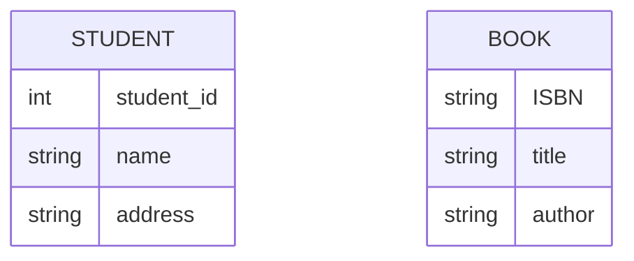

**Mnemonic:** "EA-PC" - Entities Are Physical/Conceptual, Attributes Provide Characteristics

## Question 1(c) [7 marks]

**Write the full form of DBA. Explain the roles and responsibilities of DBA.**

**Answer**:

DBA stands for **Database Administrator**.

**Table: DBA Responsibilities**

| Role | Description |
|------|-------------|
| Database Design | Creates logical/physical database structure and schema |
| Security Management | Controls access through user accounts and permissions |
| Performance Tuning | Optimizes queries, indexes for faster data retrieval |
| Backup & Recovery | Implements strategies to prevent data loss |
| Maintenance | Updates software, applies patches, monitors space |

**Diagram:**

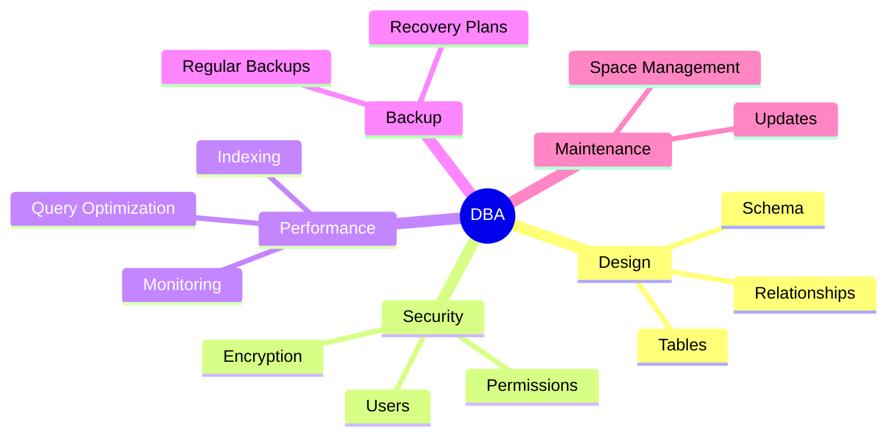

**Mnemonic:** "SPMBU" - Security, Performance, Maintenance, Backup, Updates

## Question 1(c) OR [7 marks]

**Explain relational and network data models in detail.**

**Answer**:

**Table: Relational vs Network Data Models**

| Feature | Relational Model | Network Model |
|---------|------------------|---------------|
| Structure | Tables (relations) with rows and columns | Records connected by pointers forming complex networks |
| Relationship | Related through primary & foreign keys | Direct links between parent-child records |
| Flexibility | High - tables can be joined as needed | Limited - predefined physical connections |
| Examples | MySQL, Oracle, SQL Server | IDS, IDMS |
| Query Language | SQL (structured query language) | Procedural languages |

**Diagram:**

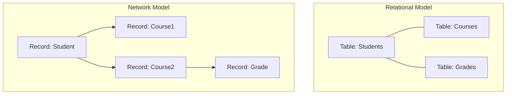

**Mnemonic:** "RSPEN" - Relational uses Sets, Pointers Enable Networks

## Question 2(a) [3 marks]

**Draw figure and Explain Generalization.**

**Answer**:

**Generalization**: The process of extracting common characteristics from two or more entities to create a new higher-level entity.

**Diagram:**

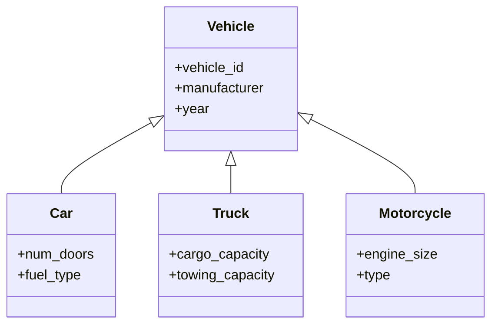

**Mnemonic:** "BUSH" - Bottom-Up Shared Hierarchy

## Question 2(b) [4 marks]

**Explain Primary Key and Foreign Key Constraints.**

**Answer**:

**Table: Primary Key vs Foreign Key**

| Constraint | Definition | Properties | Example |
|------------|------------|------------|---------|
| Primary Key | Uniquely identifies each record in a table | Unique, Not Null, Only one per table | StudentID in Students table |
| Foreign Key | Links data between tables, references a primary key in another table | Can be NULL, Multiple allowed per table | DeptID in Employees table referencing Departments table |

**Diagram:**

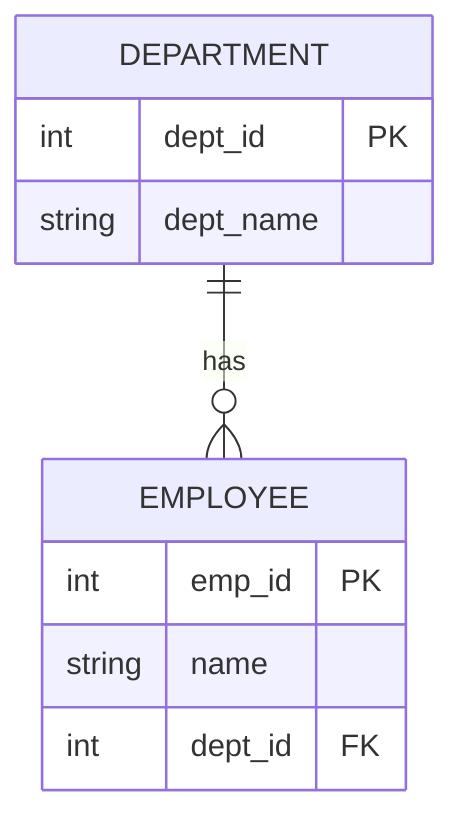

**Mnemonic:** "PURE FIRE" - Primary Uniquely References Entities, Foreign Imports Referenced Entities

## Question 2(c) [7 marks]

**Construct an E-R diagram for Hospital Management System.**

**Answer**:

**E-R Diagram for Hospital Management System:**

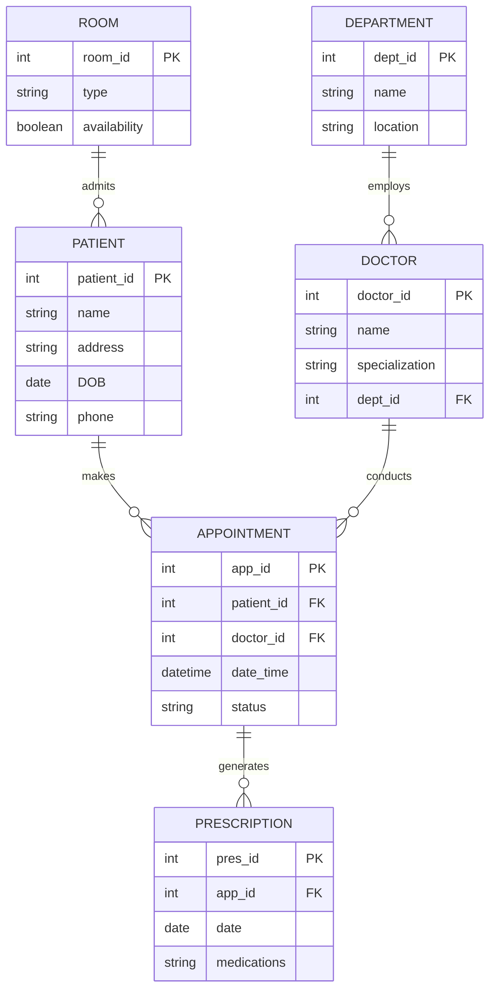

**Mnemonic:** "PADRE" - Patients Appointments Doctors Rooms Entities

## Question 2(a) OR [3 marks]

**Draw figure and Explain Specialization.**

**Answer**:

**Specialization**: The process of creating new entities from an existing entity by adding unique attributes to distinguish them.

**Diagram:**

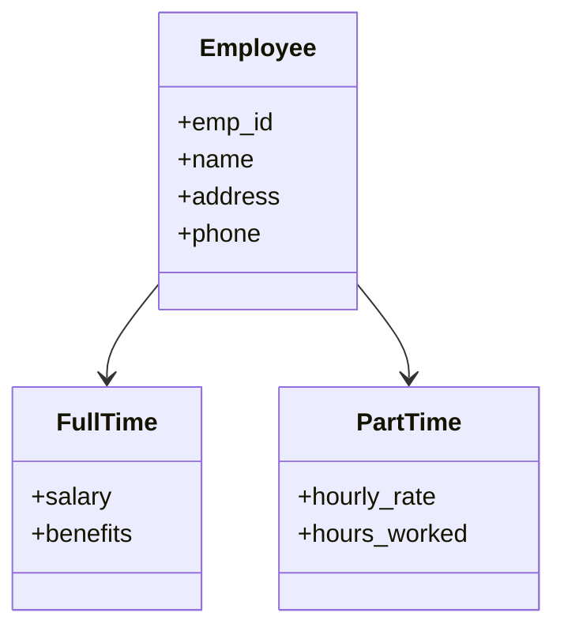

**Mnemonic:** "TDSB" - Top-Down Specialized Breakdown

## Question 2(b) OR [4 marks]

**Explain single valued v/s multi-valued attributes with suitable examples.**

**Answer**:

**Table: Single-valued vs Multi-valued Attributes**

| Type | Definition | Example | Implementation |
|------|------------|---------|----------------|
| Single-valued | Contains only one value for each entity instance | Person's birth date, SSN | Directly stored in table columns |
| Multi-valued | Can have multiple values for the same entity | Person's skills, phone numbers | Separate table or specialized formats |

**Diagram:**

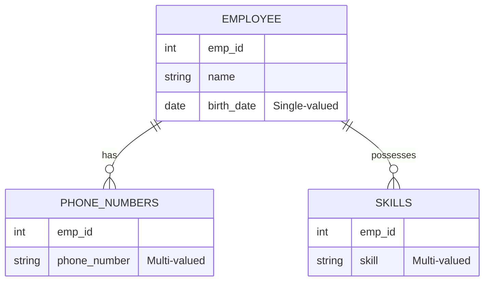

**Mnemonic:** "SOME" - Single One, Multiple Entries

## Question 2(c) OR [7 marks]

**Construct an E-R diagram for Banking Management System.**

**Answer**:

**E-R Diagram for Banking Management System:**

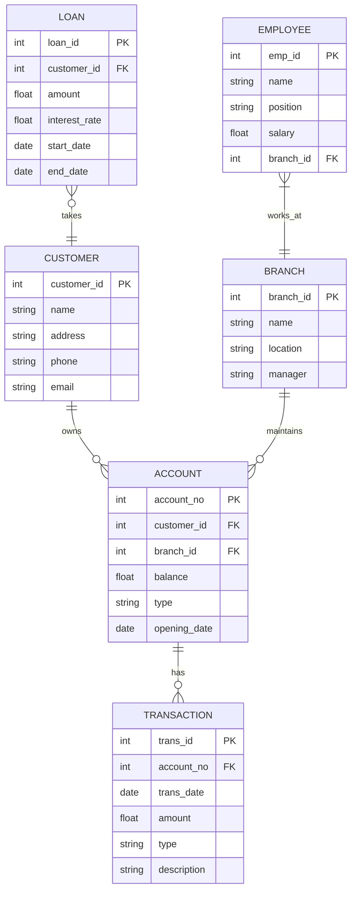

**Mnemonic:** "CABLE" - Customers Accounts Branches Loans Employees

## Question 3(a) [3 marks]

**Explain WHERE and DESC clause with example.**

**Answer**:

**Table: WHERE and DESC Clauses**

| Clause | Purpose | Syntax | Example |
|--------|---------|--------|---------|
| WHERE | Filters rows based on specified condition | SELECT columns FROM table WHERE condition | SELECT * FROM employees WHERE salary > 50000 |
| DESC | Sorts results in descending order | SELECT columns FROM table ORDER BY column DESC | SELECT * FROM products ORDER BY price DESC |

**Diagram:**

```sql
-- Original data in Students table
| ID | Name   | Marks |
|----|--------|-------|
| 1  | Alice  | 85    |
| 2  | Bob    | 92    |
| 3  | Carol  | 78    |
| 4  | David  | 65    |

-- Using WHERE: SELECT * FROM Students WHERE Marks > 80
| ID | Name   | Marks |
|----|--------|-------|
| 1  | Alice  | 85    |
| 2  | Bob    | 92    |

-- Using DESC: SELECT * FROM Students ORDER BY Marks DESC
| ID | Name   | Marks |
|----|--------|-------|
| 2  | Bob    | 92    |
| 1  | Alice  | 85    |
| 3  | Carol  | 78    |
| 4  | David  | 65    |
```

**Mnemonic:** "WDF" - Where filters Data, DESC orders First-highest

## Question 3(b) [4 marks]

**List DDL commands. Explain any two DDL commands with examples.**

**Answer**:

**DDL (Data Definition Language) Commands:**

1. CREATE
2. ALTER
3. DROP
4. TRUNCATE
5. RENAME

**Table: CREATE and ALTER Commands**

| Command | Purpose | Syntax | Example |
|---------|---------|--------|---------|
| CREATE | Creates database objects like tables, views, indexes | CREATE TABLE table_name (column definitions) | CREATE TABLE students (id INT PRIMARY KEY, name VARCHAR(50)) |
| ALTER | Modifies structure of existing database objects | ALTER TABLE table_name action | ALTER TABLE students ADD COLUMN email VARCHAR(100) |

**CodeBlock:**

```sql
-- CREATE example
CREATE TABLE employees (
    emp_id INT PRIMARY KEY,
    name VARCHAR(50) NOT NULL,
    dept VARCHAR(30),
    salary DECIMAL(10,2)
);

-- ALTER example
ALTER TABLE employees 
ADD COLUMN hire_date DATE;
```

**Mnemonic:** "CADTR" - Create Alter Drop Truncate Rename

## Question 3(c) [7 marks]

**Perform the following Query on the table "Company" having the field's eno, ename, salary, dept in SQL.**
**1. Display all records in Company table.**
**2. Display only dept without duplicate value.**
**3. Display all records sorted in descending order of ename.**
**4. Add one new column "cityname" to store city.**
**5. Display name of all employees who do not stay in city "Mumbai".**
**6. Delete all employees having salary less than 10,000.**
**7. Display the employee names starts with "A".**

**Answer**:

**CodeBlock:**

```sql
-- 1. Display all records in Company table
SELECT * FROM Company;

-- 2. Display only dept without duplicate value
SELECT DISTINCT dept FROM Company;

-- 3. Display all records sorted in descending order of ename
SELECT * FROM Company ORDER BY ename DESC;

-- 4. Add one new column "cityname" to store city
ALTER TABLE Company ADD COLUMN cityname VARCHAR(50);

-- 5. Display name of all employees who do not stay in city "Mumbai"
SELECT ename FROM Company WHERE cityname != 'Mumbai';

-- 6. Delete all employees having salary less than 10,000
DELETE FROM Company WHERE salary < 10000;

-- 7. Display the employee names starts with "A"
SELECT ename FROM Company WHERE ename LIKE 'A%';
```

**Table: SQL Operations**

| Operation | SQL Command | Purpose |
|-----------|-------------|---------|
| SELECT | SELECT * FROM Company | Retrieve all data |
| DISTINCT | SELECT DISTINCT dept | Remove duplicates |
| ORDER BY | ORDER BY ename DESC | Sort in descending |
| ALTER | ALTER TABLE ADD COLUMN | Add new column |
| WHERE | WHERE cityname != 'Mumbai' | Filter condition |
| DELETE | DELETE FROM WHERE | Remove records |
| LIKE | WHERE ename LIKE 'A%' | Pattern matching |

**Mnemonic:** "SODA-WDL" - Select Order Distinct Alter - Where Delete Like

## Question 3(a) OR [3 marks]

**Explain SELECT and DISTINCT clause with example.**

**Answer**:

**Table: SELECT and DISTINCT Clauses**

| Clause | Purpose | Syntax | Example |
|--------|---------|--------|---------|
| SELECT | Retrieves data from database | SELECT columns FROM table | SELECT name, age FROM students |
| DISTINCT | Eliminates duplicate values | SELECT DISTINCT columns FROM table | SELECT DISTINCT department FROM employees |

**Diagram:**

```sql
-- Original data in Departments table
| dept_id | dept_name |
|---------|-----------|
| 1       | Sales     |
| 2       | IT        |
| 3       | HR        |
| 4       | IT        |
| 5       | Sales     |

-- Using SELECT: SELECT dept_name FROM Departments
| dept_name |
|-----------|
| Sales     |
| IT        |
| HR        |
| IT        |
| Sales     |

-- Using DISTINCT: SELECT DISTINCT dept_name FROM Departments
| dept_name |
|-----------|
| Sales     |
| IT        |
| HR        |
```

**Mnemonic:** "SUD" - Select Unique with Distinct

## Question 3(b) OR [4 marks]

**List DML commands. Explain any two DML commands with examples.**

**Answer**:

**DML (Data Manipulation Language) Commands:**

1. INSERT
2. UPDATE
3. DELETE
4. SELECT

**Table: INSERT and UPDATE Commands**

| Command | Purpose | Syntax | Example |
|---------|---------|--------|---------|
| INSERT | Adds new records to a table | INSERT INTO table_name VALUES (values) | INSERT INTO students VALUES (1, 'John', 85) |
| UPDATE | Modifies existing records | UPDATE table_name SET column=value WHERE condition | UPDATE students SET marks=90 WHERE id=1 |

**CodeBlock:**

```sql
-- INSERT example
INSERT INTO employees (emp_id, name, dept, salary)
VALUES (101, 'John Smith', 'IT', 65000);

-- UPDATE example
UPDATE employees 
SET salary = 70000 
WHERE emp_id = 101;
```

**Mnemonic:** "IUDS" - Insert Update Delete Select

## Question 3(c) OR [7 marks]

**Write the Output of Following Query.**
**1. ABS(-34),ABS(16)**
**2. SQRT(16),SQRT(64)**
**3. POWER(5,2), POWER(2,4)**
**4. MOD(15,3), MOD(13,3)**
**5. ROUND(123.456,1), ROUND(123.456,2)**
**6. CEIL(122.6), CEIL(-122.6)**
**7. FLOOR(-157.5),FLOOR(157.5)**

**Answer**:

**Table: SQL Function Outputs**

| Function | Description | Output |
|----------|-------------|--------|
| ABS(-34),ABS(16) | Absolute value | 34, 16 |
| SQRT(16),SQRT(64) | Square root | 4, 8 |
| POWER(5,2), POWER(2,4) | Power function | 25, 16 |
| MOD(15,3), MOD(13,3) | Modulus (remainder) | 0, 1 |
| ROUND(123.456,1), ROUND(123.456,2) | Round to decimal places | 123.5, 123.46 |
| CEIL(122.6), CEIL(-122.6) | Round up to nearest integer | 123, -122 |
| FLOOR(-157.5),FLOOR(157.5) | Round down to nearest integer | -158, 157 |

**Diagram:**

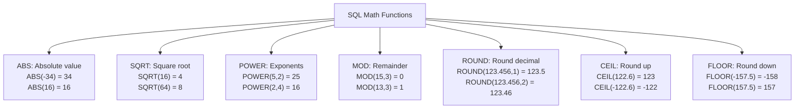

**Mnemonic:** "ASPRCF" - Absolute Square Power Remainder Ceiling Floor

## Question 4(a) [3 marks]

**List data types in SQL. Explain 1.VARCHAR() and 2.INT() data types with example.**

**Answer**:

**SQL Data Types Categories:**

1. Numeric (INT, FLOAT, DECIMAL)
2. Character (CHAR, VARCHAR)
3. Date/Time (DATE, TIME, DATETIME)
4. Binary (BLOB, BINARY)
5. Boolean (BOOL)

**Table: VARCHAR and INT Data Types**

| Data Type | Description | Size | Example |
|-----------|-------------|------|---------|
| VARCHAR(n) | Variable-length character string | Up to n characters, only uses needed space | VARCHAR(50) for names, emails |
| INT | Integer numeric data | Usually 4 bytes, -2,147,483,648 to 2,147,483,647 | INT for IDs, counts, ages |

**CodeBlock:**

```sql
CREATE TABLE students (
    student_id INT PRIMARY KEY,
    name VARCHAR(50) NOT NULL,
    age INT,
    email VARCHAR(100)
);
```

**Mnemonic:** "VIA" - Variable strings, Integers for Ages

## Question 4(b) [4 marks]

**Explain 2NF (Second Normal Form) with example and solution.**

**Answer**:

**2NF Definition**: A relation is in 2NF if it is in 1NF and no non-prime attribute is dependent on any proper subset of any candidate key.

**Table: Before 2NF**

| student_id | course_id | course_name | instructor |
|------------|-----------|-------------|------------|
| S1 | C1 | Database | Prof. Smith |
| S1 | C2 | Networking | Prof. Jones |
| S2 | C1 | Database | Prof. Smith |
| S3 | C3 | Programming | Prof. Wilson |

**Problem**: Non-prime attributes (course_name, instructor) depend only on course_id, not the entire key (student_id, course_id).

**Diagram: 2NF Solution**

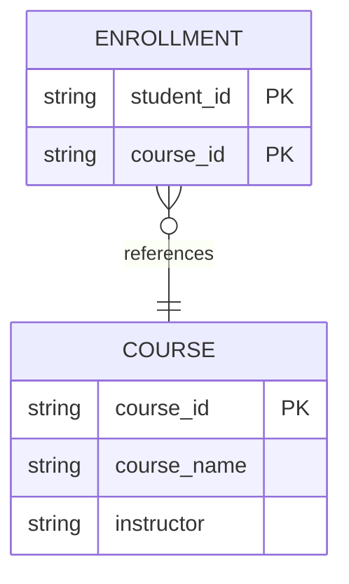

**Table: After 2NF**
Enrollment Table:

| student_id | course_id |
|------------|-----------|
| S1 | C1 |
| S1 | C2 |
| S2 | C1 |
| S3 | C3 |

Course Table:

| course_id | course_name | instructor |
|-----------|-------------|------------|
| C1 | Database | Prof. Smith |
| C2 | Networking | Prof. Jones |
| C3 | Programming | Prof. Wilson |

**Mnemonic:** "PFPK" - Partial Functional dependency on Primary Key

## Question 4(c) [7 marks]

**Explain function dependency. Explain Partial function dependency with example.**

**Answer**:

**Functional Dependency**: Relationship between attributes where one attribute's value determines another attribute's value.

**Notation**: X → Y (X determines Y)

**Partial Functional Dependency**: When a non-prime attribute depends on part of a composite key rather than the whole key.

**Table: Order Details (Before Normalization)**

| order_id | product_id | quantity | product_name | price |
|----------|------------|----------|--------------|-------|
| O1 | P1 | 5 | Keyboard | 50 |
| O1 | P2 | 2 | Mouse | 25 |
| O2 | P1 | 1 | Keyboard | 50 |
| O3 | P3 | 3 | Monitor | 200 |

**Functional Dependencies:**

- (order_id, product_id) → quantity
- product_id → product_name
- product_id → price

**Diagram:**

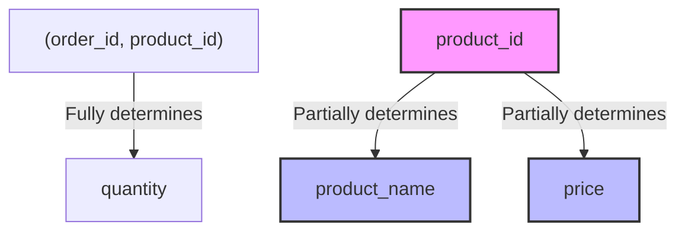

**Solution (Normalized Tables):**
Orders Table:

| order_id | product_id | quantity |
|----------|------------|----------|
| O1 | P1 | 5 |
| O1 | P2 | 2 |
| O2 | P1 | 1 |
| O3 | P3 | 3 |

Products Table:

| product_id | product_name | price |
|------------|--------------|-------|
| P1 | Keyboard | 50 |
| P2 | Mouse | 25 |
| P3 | Monitor | 200 |

**Mnemonic:** "PDPK" - Partial Dependency on Part of Key

## Question 4(a) OR [3 marks]

**Explain commands: 1) To_Char() 2) To_Date()**

**Answer**:

**Table: Conversion Functions**

| Function | Purpose | Syntax | Example |
|----------|---------|--------|---------|
| TO_CHAR() | Converts date/number to character string using format model | TO_CHAR(value, [format]) | TO_CHAR(SYSDATE, 'DD-MON-YYYY') → '14-JUN-2024' |
| TO_DATE() | Converts character string to date using format model | TO_DATE(string, [format]) | TO_DATE('14-JUN-2024', 'DD-MON-YYYY') → date value |

**CodeBlock:**

```sql
-- TO_CHAR examples
SELECT TO_CHAR(SYSDATE, 'DD-MON-YYYY') FROM DUAL;  -- '14-JUN-2024'
SELECT TO_CHAR(1234.56, '$9,999.99') FROM DUAL;    -- '$1,234.56'

-- TO_DATE examples
SELECT TO_DATE('2024-06-14', 'YYYY-MM-DD') FROM DUAL;
SELECT TO_DATE('14/06/24', 'DD/MM/YY') FROM DUAL;
```

**Mnemonic:** "DCS" - Date Conversion Strings

## Question 4(b) OR [4 marks]

**Explain Full function dependency with example.**

**Answer**:

**Full Functional Dependency**: When an attribute is functionally dependent on a composite key, and dependent on the entire key, not just part of it.

**Table: Exam Results**

| student_id | course_id | exam_date | score |
|------------|-----------|-----------|-------|
| S1 | C1 | 2024-05-10 | 85 |
| S1 | C2 | 2024-05-15 | 92 |
| S2 | C1 | 2024-05-10 | 78 |
| S2 | C2 | 2024-05-15 | 88 |

**Full Functional Dependency:**

- (student_id, course_id) → score (score depends on both student and course)

**Diagram:**

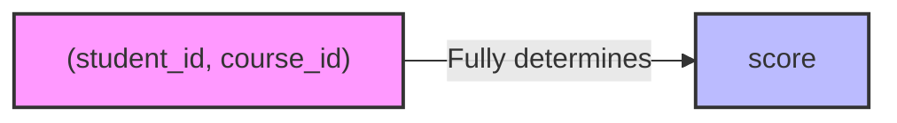

**Explanation**: The score attribute fully depends on the composite key (student_id, course_id) because:

- Different students can have different scores for the same course
- Same student can have different scores for different courses
- We need both student_id and course_id to determine a specific score

**Mnemonic:** "FCEK" - Fully dependent on Complete/Entire Key

## Question 4(c) OR [7 marks]

**Define normalization. Explain 1NF (First Normal Form) with example and solution.**

**Answer**:

**Normalization**: Process of organizing data to minimize redundancy, improve data integrity, and eliminate anomalies by dividing larger tables into smaller related tables.

**1NF Definition**: A relation is in 1NF if all attributes contain atomic (indivisible) values only.

**Table: Before 1NF**

| student_id | name | courses |
|------------|------|---------|
| S1 | John | Math, Physics |
| S2 | Mary | Chemistry, Biology, Physics |
| S3 | Tim | Computer Science |

**Problems**:

- Non-atomic values (multiple courses per cell)
- Cannot easily query or update specific courses

**Diagram:**

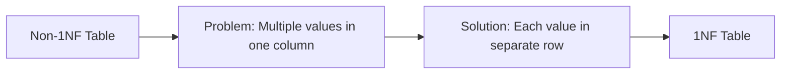

**Table: After 1NF**

| student_id | name | course |
|------------|------|--------|
| S1 | John | Math |
| S1 | John | Physics |
| S2 | Mary | Chemistry |
| S2 | Mary | Biology |
| S2 | Mary | Physics |
| S3 | Tim | Computer Science |

**Mnemonic:** "ASAV" - Atomic Single-value Attributes only Valid

## Question 5(a) [3 marks]

**Explain the concept of Transaction with example.**

**Answer**:

**Transaction**: A logical unit of work that must be either completely executed or completely undone.

**Table: Transaction Properties**

| Property | Description |
|----------|-------------|
| Atomicity | All operations complete successfully or none do |
| Consistency | Database remains in consistent state before and after transaction |
| Isolation | Concurrent transactions don't interfere with each other |
| Durability | Completed transactions persist even after system failures |

**Example:**

```sql
-- Bank Account Transfer Transaction
BEGIN TRANSACTION;
    -- Deduct $500 from Account A
    UPDATE accounts SET balance = balance - 500 WHERE account_id = 'A';
    
    -- Add $500 to Account B
    UPDATE accounts SET balance = balance + 500 WHERE account_id = 'B';
    
    -- If both operations successful
    COMMIT;
    -- If any operation fails
    -- ROLLBACK;
END TRANSACTION;
```

**Mnemonic:** "ACID" - Atomicity Consistency Isolation Durability

## Question 5(b) [4 marks]

**Explain equi join with syntax and example.**

**Answer**:

**Equi Join**: A join that uses equality comparison operator to match records from two or more tables based on a common field.

**Syntax:**

```sql
SELECT columns
FROM table1, table2 
WHERE table1.column = table2.column;

-- Alternative syntax (explicit JOIN)
SELECT columns
FROM table1 JOIN table2
ON table1.column = table2.column;
```

**Table Example:**
Employees Table:

| emp_id | name | dept_id |
|--------|------|---------|
| 101 | Alice | 1 |
| 102 | Bob | 2 |
| 103 | Carol | 1 |

Departments Table:

| dept_id | dept_name | location |
|---------|-----------|----------|
| 1 | HR | New York |
| 2 | IT | Chicago |
| 3 | Finance | Boston |

**CodeBlock:**

```sql
-- Equi Join Example
SELECT e.name, d.dept_name, d.location
FROM employees e, departments d
WHERE e.dept_id = d.dept_id;
```

**Result:**

| name | dept_name | location |
|------|-----------|----------|
| Alice | HR | New York |
| Bob | IT | Chicago |
| Carol | HR | New York |

**Diagram:**

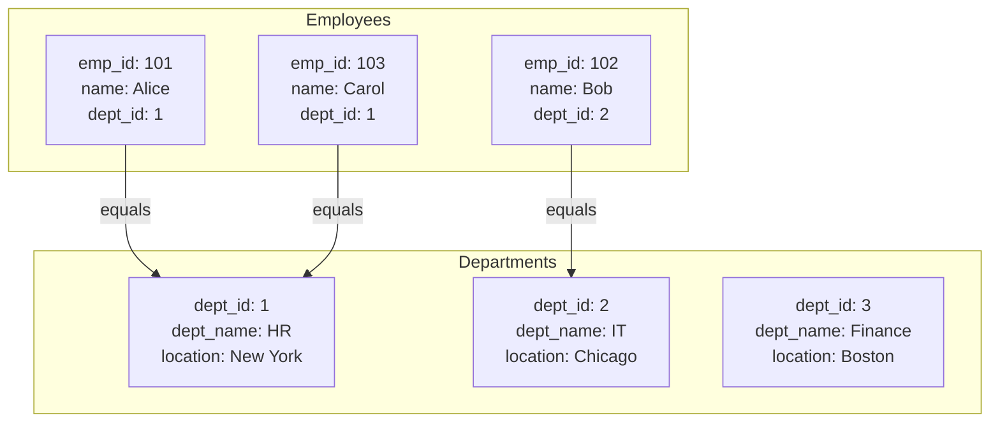

**Mnemonic:** "MEET" - Match Equal Elements Every Table

## Question 5(c) [7 marks]

**Explain Conflict Serializability in detail.**

**Answer**:

**Conflict Serializability**: A way to ensure correctness of concurrent transactions by guaranteeing that the execution schedule is equivalent to some serial execution.

**Table: Key Concepts in Conflict Serializability**

| Concept | Description |
|---------|-------------|
| Conflicting Operations | Two operations conflict if they access same data item and at least one is a write |
| Precedence Graph | Directed graph showing conflicts between transactions |
| Conflict Serializable | Schedule is conflict serializable if its precedence graph is acyclic |

**Diagram:**

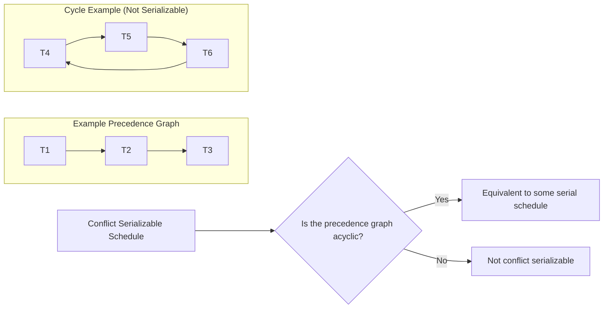

**Example:**
Consider transactions T1 and T2:

- T1: Read(A), Write(A)
- T2: Read(A), Write(A)

Schedule S1: R1(A), W1(A), R2(A), W2(A) - Serializable (equivalent to T1→T2)
Schedule S2: R1(A), R2(A), W1(A), W2(A) - Not serializable (contains cycle in precedence graph)

**Steps to Determine Conflict Serializability:**

1. Identify all pairs of conflicting operations
2. Construct the precedence graph
3. Check if the graph has cycles
4. If no cycles, the schedule is conflict serializable

**Mnemonic:** "COPS" - Conflicts, Operations, Precedence, Serializability

## Question 5(a) OR [3 marks]

**Explain the properties of Transaction with example.**

**Answer**:

**ACID Properties of Transactions:**

**Table: ACID Properties**

| Property | Description | Example |
|----------|-------------|---------|
| Atomicity | All operations complete successfully or none do | Bank transfer - both debit and credit must succeed or fail together |
| Consistency | Database must be in a consistent state before and after transaction | After transferring $100, total money in system remains unchanged |
| Isolation | Concurrent transactions don't interfere with each other | Transaction A doesn't see partial results of Transaction B |
| Durability | Once committed, changes are permanent | Power failure won't cause committed transaction to be lost |

**Diagram:**

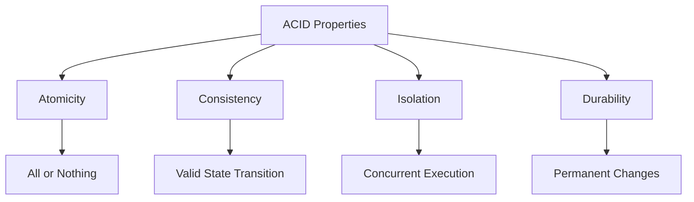

**Example:**

```sql
-- ATM Withdrawal Transaction
BEGIN TRANSACTION;
    -- Check balance
    SELECT balance FROM accounts WHERE account_id = 'A123';
    
    -- If sufficient, update balance
    UPDATE accounts SET balance = balance - 100 WHERE account_id = 'A123';
    
    -- Record the withdrawal
    INSERT INTO transactions (account_id, type, amount, date)
    VALUES ('A123', 'WITHDRAWAL', 100, SYSDATE);
    
    -- If all operations successful
    COMMIT;
    -- If any operation fails
    -- ROLLBACK;
END TRANSACTION;
```

**Mnemonic:** "ACID" - Atomicity Consistency Isolation Durability

## Question 5(b) OR [4 marks]

**Write the Queries using set operators to find following using given "Faculty" and "CT" tables.**
**1. List the name of the persons who are either a Faculty or a CT.**
**2. List the name of the persons who are a Faculty as well as a CT.**
**3. List the name of the persons who are only a Faculty and not a CT.**
**4. List the name of the persons who are only a CT and not a Faculty.**

**Answer**:

**Table Data:**
Faculty Table:

| FacultyName | ErNo | Dept |
|-------------|------|------|
| Prakash | FC01 | ICT |
| Ronak | FC02 | IT |
| Rakesh | FC03 | EC |
| Kinjal | FC04 | ICT |

CT (Class Teacher) Table:

| Dept | CTName |
|------|--------|
| EC | Rakesh |
| CE | Jigar |
| ICT | Prakash |
| IT | Gunjan |

**CodeBlock:**

```sql
-- 1. List the name of the persons who are either a Faculty or a CT
SELECT FacultyName AS Name FROM Faculty
UNION
SELECT CTName AS Name FROM CT;

-- 2. List the name of the persons who are a Faculty as well as a CT
SELECT FacultyName AS Name FROM Faculty
INTERSECT
SELECT CTName AS Name FROM CT;

-- 3. List the name of the persons who are only a Faculty and not a CT
SELECT FacultyName AS Name FROM Faculty
MINUS
SELECT CTName AS Name FROM CT;

-- 4. List the name of the persons who are only a CT and not a Faculty
SELECT CTName AS Name FROM CT
MINUS
SELECT FacultyName AS Name FROM Faculty;
```

**Diagram:**

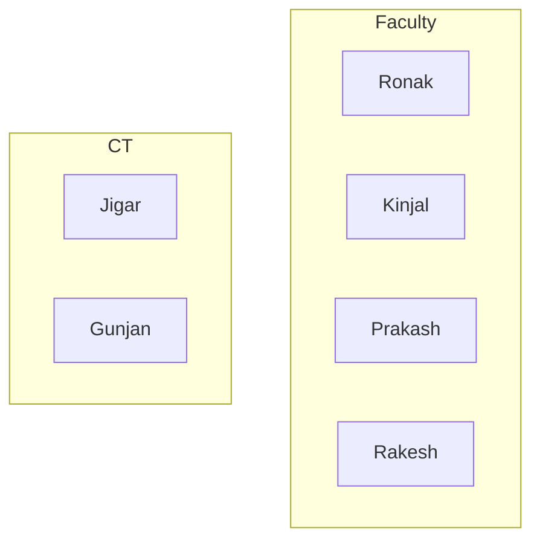

**Results:**

1. UNION: Prakash, Ronak, Rakesh, Kinjal, Jigar, Gunjan
2. INTERSECT: Prakash, Rakesh
3. MINUS (Faculty - CT): Ronak, Kinjal
4. MINUS (CT - Faculty): Jigar, Gunjan

**Mnemonic:** "UIMM" - Union Intersect Minus Minus

## Question 5(c) OR [7 marks]

**Explain View Serializability in detail.**

**Answer**:

**View Serializability**: A schedule is view serializable if it is view equivalent to some serial schedule, meaning it produces the same "view" (or final state) of the database.

**Table: Comparison with Conflict Serializability**

| Aspect | View Serializability | Conflict Serializability |
|--------|---------------------|--------------------------|
| Definition | Based on the final results of reads and writes | Based on conflicts between operations |
| Condition | Preserves initial read, final write, and read-write dependency | Preserves all conflicts between operations |
| Scope | Broader class of schedules | Subset of view serializable schedules |
| Testing | More complex to test | Can test with precedence graph |

**Diagram:**

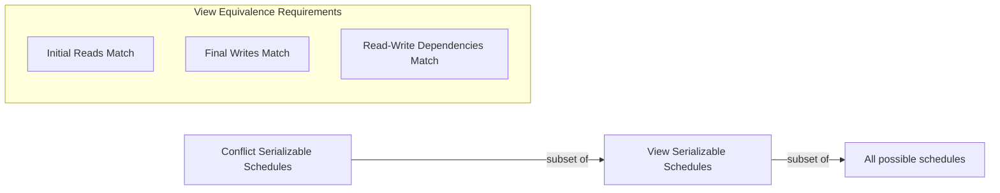

**View Equivalence Conditions:**

1. Initial Reads: If T1 reads an initial value of data item A in schedule S1, it must also read the initial value in S2.
2. Final Writes: If T1 performs the final write on data item A in S1, it must also perform the final write in S2.
3. Read-Write Dependency: If T1 reads a value of A written by T2 in S1, it must also read the value written by T2 in S2.

**Example of View Serializable but not Conflict Serializable Schedule:**
Consider transactions with blind writes (writes without reading):

- T1: W1(A)
- T2: W2(A)

Schedule S: W1(A), W2(A) - View serializable to both T1→T2 and T2→T1 (final write is always T2)
But W1(A) and W2(A) conflict, so a conflict graph would have an edge in both directions.

**Mnemonic:** "IRF" - Initial reads, Result writes, Final view
