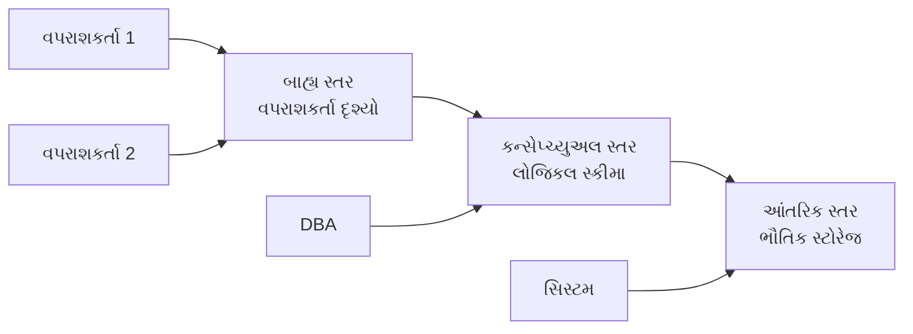
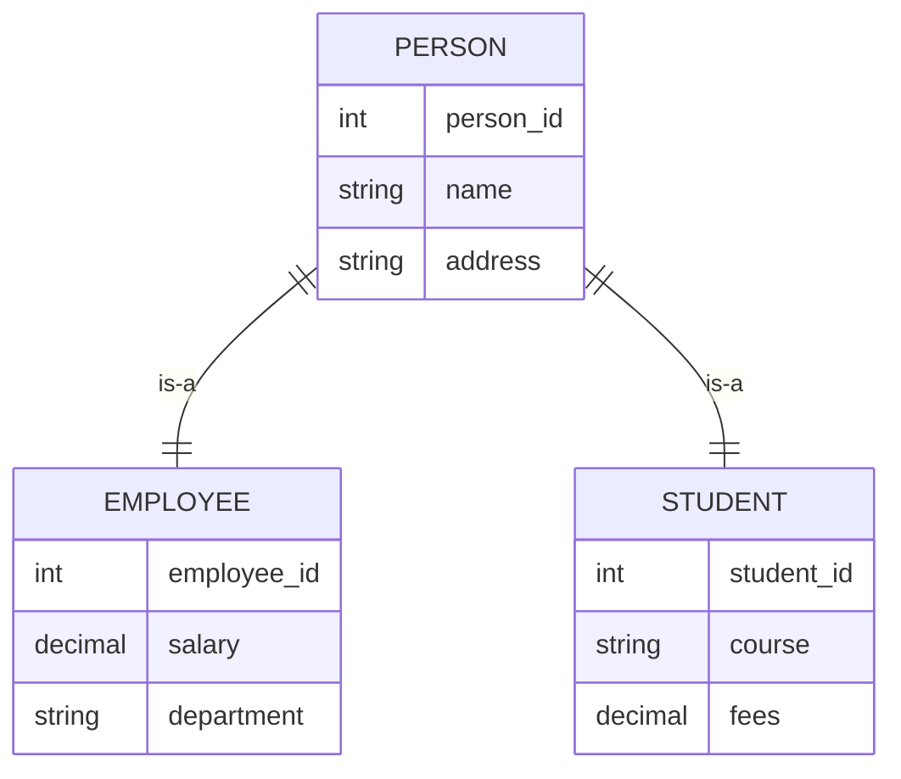
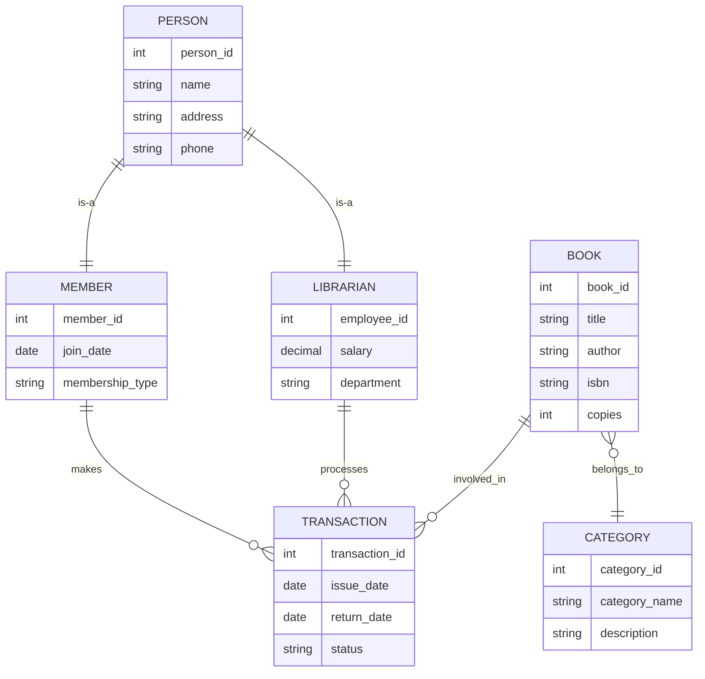
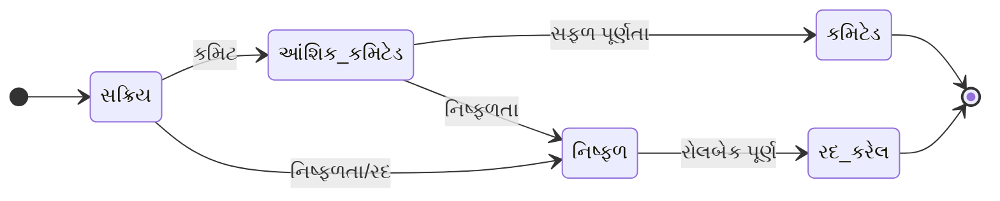

## પ્રશ્ન 1(અ) [3 ગુણ]

**ટૂંકી નોંધ લખો: ડેટા ડિક્શનરી**

**જવાબ**:
**ડેટા ડિક્શનરી** એ કેન્દ્રીય ભંડાર છે જે ડેટાબેઝ બંધારણ, તત્વો અને સંબંધો વિશે મેટાડેટા સંગ્રહિત કરે છે.

**કોષ્ટક: ડેટા ડિક્શનરી ઘટકો**

| ઘટક | વર્ણન |
|------|--------|
| **ટેબલ નામો** | ડેટાબેઝમાં બધા ટેબલોની યાદી |
| **કૉલમ વિગતો** | ડેટા પ્રકારો, મર્યાદાઓ, લંબાઈ |
| **સંબંધો** | ફોરેન કી કનેક્શન્સ |
| **ઇન્ડેક્સ** | પ્રદર્શન ઑપ્ટિમાઇઝેશન બંધારણો |

**મુખ્ય લક્ષણો:**

- **મેટાડેટા સ્ટોરેજ**: ડેટા બંધારણ વિશે માહિતી સમાવે છે
- **ડેટા અખંડિતતા**: સુસંગતતા નિયમો અને મર્યાદાઓ જાળવે છે
- **દસ્તાવેજીકરણ**: વ્યાપક ડેટાબેઝ દસ્તાવેજીકરણ પ્રદાન કરે છે

**મેમરી ટ્રીક:** "ડેટા ડિક્શનરી વિગતો આપે"

## પ્રશ્ન 1(બ) [4 ગુણ]

**વ્યાખ્યા આપો (i) E-R મોડેલ (ii) એન્ટિટી (iii) એન્ટિટી સેટ અને (iv) ગુણધર્મો**

**જવાબ**:

**કોષ્ટક: ER મોડેલ વ્યાખ્યાઓ**

| શબ્દ | વ્યાખ્યા |
|------|---------|
| **E-R મોડેલ** | એન્ટિટી અને સંબંધોનો ઉપયોગ કરતો કન્સેપ્ચ્યુઅલ ડેટા મોડેલ |
| **એન્ટિટી** | સ્વતંત્ર અસ્તિત્વ ધરાવતો વાસ્તવિક વિશ્વનો ઑબ્જેક્ટ |
| **એન્ટિટી સેટ** | સમાન પ્રકારની સમાન એન્ટિટીઓનો સંગ્રહ |
| **ગુણધર્મો** | એન્ટિટીની લાક્ષણિકતાઓનું વર્ણન કરતા ગુણધર્મો |

**આકૃતિ: ER મોડેલ ઘટકો**

```goat
    +----------+     +-------------+     +----------+
    |  Entity  |-----| Relationship|-----|  Entity  |
    |    A     |     |             |     |    B     |
    +----------+     +-------------+     +----------+
         |                                    |
    Attributes                           Attributes
```

**મુખ્ય મુદ્દાઓ:**

- **કન્સેપ્ચ્યુઅલ ડિઝાઇન**: ઉચ્ચ સ્તરનો ડેટાબેઝ ડિઝાઇન અભિગમ
- **વિઝ્યુઅલ રજૂઆત**: સ્પષ્ટ સમજ માટે આકૃતિઓનો ઉપયોગ

**મેમરી ટ્રીક:** "એન્ટિટી સંબંધો અર્થપૂર્ણ રીતે"

## પ્રશ્ન 1(ક) [7 ગુણ]

**DBMS ના ફાયદા સમજાવો**

**જવાબ**:

**કોષ્ટક: DBMS ફાયદા**

| ફાયદો | લાભ |
|--------|------|
| **ડેટા સ્વતંત્રતા** | એપ્લિકેશન ડેટા સ્ટ્રક્ચર ફેરફારોથી અલગ |
| **ડેટા શેરિંગ** | બહુવિધ વપરાશકર્તાઓ એકસાથે સમાન ડેટા એક્સેસ કરે |
| **ડેટા સુરક્ષા** | એક્સેસ કંટ્રોલ અને પ્રમાણીકરણ પદ્ધતિઓ |
| **ડેટા અખંડિતતા** | મર્યાદાઓ દ્વારા સુસંગતતા જાળવવામાં આવે છે |
| **બેકઅપ અને રિકવરી** | આપોઆપ ડેટા સંરક્ષણ અને પુનઃસ્થાપન |
| **ઘટાડેલી રીડન્ડન્સી** | ડુપ્લિકેટ ડેટા સ્ટોરેજ દૂર કરે છે |

**મુખ્ય લાભો:**

- **કેન્દ્રીકૃત નિયંત્રણ**: ડેટા વ્યવસ્થાપનનો એક બિંદુ
- **ખર્ચ અસરકારકતા**: વિકાસ અને જાળવણીનો ખર્ચ ઘટાડે છે
- **ડેટા સુસંગતતા**: એપ્લિકેશન્સમાં એકસમાન ડેટા સુનિશ્ચિત કરે છે
- **સંગામિત એક્સેસ**: બહુવિધ વપરાશકર્તાઓ એકસાથે કામ કરી શકે છે
- **ક્વેરી ઑપ્ટિમાઇઝેશન**: કાર્યક્ષમ ડેટા પુનઃપ્રાપ્તિ પદ્ધતિઓ

**મેમરી ટ્રીક:** "ડેટાબેઝ બિઝનેસને બહેતર બનાવે"

## પ્રશ્ન 1(ક) અથવા [7 ગુણ]

**DBMS નું આર્કિટેક્ચર સમજાવો**

**જવાબ**:

**આકૃતિ: ત્રણ-સ્તરીય DBMS આર્કિટેક્ચર**



**કોષ્ટક: આર્કિટેક્ચર સ્તરો**

| સ્તર | હેતુ | વપરાશકર્તાઓ |
|------|-----|-------------|
| **બાહ્ય** | વ્યક્તિગત વપરાશકર્તા દૃશ્યો | અંતિમ વપરાશકર્તાઓ, એપ્લિકેશન્સ |
| **કન્સેપ્ચ્યુઅલ** | સંપૂર્ણ લોજિકલ બંધારણ | ડેટાબેઝ એડમિનિસ્ટ્રેટર |
| **આંતરિક** | ભૌતિક સ્ટોરેજ વિગતો | સિસ્ટમ પ્રોગ્રામર્સ |

**મુખ્ય લક્ષણો:**

- **ડેટા સ્વતંત્રતા**: એક સ્તરે ફેરફારો અન્યને અસર કરતા નથી
- **સુરક્ષા**: વિવિધ વપરાશકર્તાઓ માટે વિવિધ એક્સેસ સ્તરો
- **અમૂર્તતા**: વપરાશકર્તાઓથી જટિલતા છુપાવે છે

**મેમરી ટ્રીક:** "બાહ્ય કન્સેપ્ચ્યુઅલ આંતરિક આર્કિટેક્ચર"

## પ્રશ્ન 2(અ) [3 ગુણ]

**UNIQUE KEY અને PRIMARY KEY સમજાવો**

**જવાબ**:

**કોષ્ટક: કી સરખામણી**

| લક્ષણ | PRIMARY KEY | UNIQUE KEY |
|-------|-------------|------------|
| **Null મૂલ્યો** | મંજૂર નથી | એક null મંજૂર |
| **ટેબલ દીઠ સંખ્યા** | માત્ર એક | બહુવિધ મંજૂર |
| **ઇન્ડેક્સ બનાવટ** | આપોઆપ clustered | આપોઆપ non-clustered |
| **હેતુ** | એન્ટિટી ઓળખ | ડેટા વિશિષ્ટતા |

**મુખ્ય તફાવતો:**

- **પ્રાથમિક કી**: દરેક રેકોર્ડને વિશિષ્ટ રીતે ઓળખે છે, null હોઈ શકતી નથી
- **યુનિક કી**: વિશિષ્ટતા સુનિશ્ચિત કરે છે પણ એક null મૂલ્યની મંજૂરી આપે છે

**મેમરી ટ્રીક:** "પ્રાથમિક નલને અટકાવે, યુનિક નલને સમજે"

## પ્રશ્ન 2(બ) [4 ગુણ]

**ER ડાયાગ્રામમાં એન્ટિટીની Participation પર ટૂંકી નોંધ લખો**

**જવાબ**:

**કોષ્ટક: Participation પ્રકારો**

| પ્રકાર | વર્ણન | પ્રતીક |
|------|--------|-------|
| **કુલ Participation** | દરેક એન્ટિટી સહભાગી થવી જ જોઈએ | ડબલ લાઇન |
| **આંશિક Participation** | કેટલીક એન્ટિટી સહભાગી ન પણ થઈ શકે | સિંગલ લાઇન |

**આકૃતિ: Participation ઉદાહરણ**

```goat
કર્મચારી ========== કામ_કરે ---------- વિભાગ
  (કુલ)                                 (આંશિક)
```

**મુખ્ય સંકેતો:**

- **ફરજિયાત Participation**: દરેક ઇન્સ્ટન્સ સંકળાયેલું હોવું જ જોઈએ
- **વૈકલ્પિક Participation**: કેટલાક ઇન્સ્ટન્સ સંકળાયેલા ન હોઈ શકે
- **બિઝનેસ નિયમો**: વાસ્તવિક વિશ્વની મર્યાદાઓને પ્રતિબિંબિત કરે છે

**મેમરી ટ્રીક:** "કુલ Participation બધાની જરૂર"

## પ્રશ્ન 2(ક) [7 ગુણ]

**ER ડાયાગ્રામ માટે Generalization concept વિગતવાર વર્ણન કરો**

**જવાબ**:

**આકૃતિ: Generalization ઉદાહરણ**



**કોષ્ટક: Generalization લાક્ષણિકતાઓ**

| પાસું | વર્ણન |
|------|--------|
| **બોટમ-અપ પ્રક્રિયા** | સમાન એન્ટિટીઓને સુપરક્લાસમાં જોડે છે |
| **વારસાગતતા** | સબક્લાસ સુપરક્લાસ ગુણધર્મો વારસે મેળવે છે |
| **વિશેષીકરણ** | Generalization ની વિપરીત પ્રક્રિયા |
| **ઓવરલેપ મર્યાદાઓ** | અલગ અથવા ઓવરલેપિંગ સબક્લાસ |

**મુખ્ય લક્ષણો:**

- **ગુણધર્મ વારસાગતતા**: સામાન્ય ગુણધર્મો સુપરક્લાસમાં ખસેડવામાં આવે છે
- **સંબંધ વારસાગતતા**: સંબંધો પણ વારસામાં મળે છે
- **મર્યાદા પ્રકારો**: કુલ/આંશિક, અલગ/ઓવરલેપિંગ
- **ISA સંબંધ**: "is-a" કનેક્શનને રજૂ કરે છે

**મેમરી ટ્રીક:** "સામાન્યીકરણ સમાન એન્ટિટીઓને જૂથ બનાવે"

## પ્રશ્ન 2(અ) અથવા [3 ગુણ]

**ER ડાયાગ્રામમાં મેપિંગ કાર્ડિનાલિટી સમજાવો**

**જવાબ**:

**કોષ્ટક: કાર્ડિનાલિટી પ્રકારો**

| પ્રકાર | વર્ણન | ઉદાહરણ |
|------|--------|---------|
| **એક-થી-એક (1:1)** | એક એન્ટિટી અન્ય એક સાથે સંબંધિત | વ્યક્તિ-પાસપોર્ટ |
| **એક-થી-ઘણા (1:M)** | એક એન્ટિટી ઘણા અન્ય સાથે સંબંધિત | વિભાગ-કર્મચારી |
| **ઘણા-થી-એક (M:1)** | ઘણી એન્ટિટી એક સાથે સંબંધિત | કર્મચારી-વિભાગ |
| **ઘણા-થી-ઘણા (M:N)** | ઘણી એન્ટિટી ઘણા સાથે સંબંધિત | વિદ્યાર્થી-કોર્સ |

**મુખ્ય સંકેતો:**

- **સંબંધ મર્યાદાઓ**: એન્ટિટી કેવી રીતે સંબંધિત થઈ શકે છે તે વ્યાખ્યાયિત કરે છે
- **બિઝનેસ નિયમો**: વાસ્તવિક વિશ્વ સંબંધ મર્યાદાઓને પ્રતિબિંબિત કરે છે

**મેમરી ટ્રીક:** "એક કે ઘણા મેપિંગ મહત્વપૂર્ણ"

## પ્રશ્ન 2(બ) અથવા [4 ગુણ]

**E-R ડાયાગ્રામમાં Aggregation સમજાવો**

**જવાબ**:

**આકૃતિ: Aggregation ઉદાહરણ**

```goat
    કર્મચારી ---- કામ_કરે ---- પ્રોજેક્ટ
        |                         |
        +----------+----------+
                   |
               વ્યવસ્થાપન
                   |
                મેનેજર
```

**મુખ્ય લક્ષણો:**

- **સંબંધ એન્ટિટી તરીકે**: સંબંધ સેટને એન્ટિટી તરીકે ગણે છે
- **ઉચ્ચ સ્તરના સંબંધો**: સંબંધો વચ્ચે સંબંધોની મંજૂરી આપે છે
- **જટિલ મોડેલિંગ**: અદ્યતન બિઝનેસ દૃશ્યોને હેન્ડલ કરે છે
- **અમૂર્ત પદ્ધતિ**: જટિલ સંબંધોને સરળ બનાવે છે

**કોષ્ટક: Aggregation લાભો**

| લાભ | વર્ણન |
|------|--------|
| **મોડેલિંગ લવચીકતા** | જટિલ સંબંધોને હેન્ડલ કરે છે |
| **અર્થપૂર્ણ સ્પષ્ટતા** | બિઝનેસ નિયમોની સ્પષ્ટ રજૂઆત |
| **ડિઝાઇન સરળતા** | મોડેલ જટિલતા ઘટાડે છે |

**મેમરી ટ્રીક:** "એકીકરણ અદ્યતન સંગઠનોને અમૂર્ત બનાવે"

## પ્રશ્ન 2(ક) અથવા [7 ગુણ]

**Enhanced ER મોડેલનો ઉપયોગ કરીને લાઇબ્રેરી મેનેજમેન્ટ સિસ્ટમનો ER ડાયાગ્રામ દોરો**

**જવાબ**:

**આકૃતિ: લાઇબ્રેરી મેનેજમેન્ટ સિસ્ટમ**



**વપરાયેલ Enhanced ER લક્ષણો:**

- **સામાન્યીકરણ**: મેમ્બર અને લાઇબ્રેરિયન સબક્લાસ સાથે વ્યક્તિ સુપરક્લાસ
- **વિશેષીકરણ**: વિવિધ વ્યક્તિ પ્રકારો માટે વિવિધ ગુણધર્મો
- **એકીકરણ**: બહુવિધ એન્ટિટી સાથે Transaction સંબંધ
- **બહુવિધ વારસાગતતા**: જટિલ સંબંધ હેન્ડલિંગ

**મેમરી ટ્રીક:** "લાઇબ્રેરી સાહિત્યને તાર્કિક રીતે જોડે"

---

## પ્રશ્ન 3(અ) [3 ગુણ]

**SQL ડેટા પ્રકાર સમજાવો**

**જવાબ**:

**કોષ્ટક: સામાન્ય SQL ડેટા પ્રકારો**

| કેટેગરી | ડેટા પ્રકાર | વર્ણન |
|----------|-------------|--------|
| **સંખ્યાત્મક** | INT, DECIMAL, FLOAT | સંખ્યાઓ સંગ્રહિત કરે |
| **અક્ષર** | CHAR, VARCHAR, TEXT | ટેક્સ્ટ સંગ્રહિત કરે |
| **તારીખ/સમય** | DATE, TIME, DATETIME | સમયગત ડેટા સંગ્રહિત કરે |
| **બુલિયન** | BOOLEAN | સાચું/ખોટું સંગ્રહિત કરે |

**મુખ્ય મુદ્દાઓ:**

- **ડેટા અખંડિતતા**: યોગ્ય ડેટા સ્ટોરેજ સુનિશ્ચિત કરે છે
- **સ્ટોરેજ ઑપ્ટિમાઇઝેશન**: યોગ્ય કદ ફાળવણી
- **માન્યતા**: આપોઆપ ડેટા પ્રકાર તપાસ

**મેમરી ટ્રીક:** "ડેટા પ્રકારો સ્ટોરેજ વ્યાખ્યાયિત કરે"

## પ્રશ્ન 3(બ) [4 ગુણ]

**DROP અને TRUNCATE COMMAND સરખામણી કરો**

**જવાબ**:

**કોષ્ટક: DROP vs TRUNCATE સરખામણી**

| લક્ષણ | DROP | TRUNCATE |
|--------|------|----------|
| **ઑપરેશન** | ટેબલ સ્ટ્રક્ચર દૂર કરે | માત્ર બધો ડેટા દૂર કરે |
| **રોલબેક** | રોલબેક કરી શકાતું નથી | રોલબેક કરી શકાય (ટ્રાન્ઝેક્શનમાં) |
| **ઝડપ** | ધીમું | ઝડપી |
| **ટ્રિગર્સ** | ટ્રિગર્સ ચલાવે છે | ટ્રિગર્સ ચલાવતું નથી |
| **વ્હેર ક્લોઝ** | લાગુ નથી | સપોર્ટ કરતું નથી |
| **ઓટો-ઇન્ક્રિમેન્ટ** | રીસેટ થાય છે | પ્રારંભિક વેલ્યુ પર રીસેટ થાય છે |

**કોડ ઉદાહરણો:**

```sql
-- DROP આદેશ
DROP TABLE student;

-- TRUNCATE આદેશ  
TRUNCATE TABLE student;
```

**મુખ્ય તફાવતો:**

- **સ્ટ્રક્ચર પ્રભાવ**: DROP બધું દૂર કરે છે, TRUNCATE સ્ટ્રક્ચર રાખે છે
- **પ્રદર્શન**: TRUNCATE મોટા ટેબલો માટે ઝડપી છે

**મેમરી ટ્રીક:** "DROP નાશ કરે, TRUNCATE કાપે"

## પ્રશ્ન 3(ક) [7 ગુણ]

**નીચેના Relational Schema અને નીચેના પ્રશ્નો માટે Relational Algebra Expression આપો**
**વિદ્યાર્થીઓ (નામ, SPI, DOB, નોંધણી નંબર)**

**જવાબ**:

**રિલેશનલ આલ્જિબ્રા એક્સપ્રેશન્સ:**

**i) એવા તમામ વિદ્યાર્થીઓની યાદી બનાવો કે જેમનું SPI 6.0 કરતાં ઓછું છે:**

```
σ(SPI < 6.0)(વિદ્યાર્થીઓ)
```

**ii) વિદ્યાર્થીનું નામ જેની નોંધણી નંબર 006 ધરાવે છે:**

```
π(નામ)(σ(નોંધણી_નંબર LIKE '%006%')(વિદ્યાર્થીઓ))
```

**iii) સમાન DOB ધરાવતા તમામ વિદ્યાર્થીઓની યાદી બનાવો:**

```
વિદ્યાર્થીઓ ⋈ (ρ(S2)(વિદ્યાર્થીઓ)) WHERE વિદ્યાર્થીઓ.DOB = S2.DOB AND વિદ્યાર્થીઓ.નોંધણી_નંબર ≠ S2.નોંધણી_નંબર
```

**iv) સમાન અક્ષરથી શરૂ થતા વિદ્યાર્થીઓનું નામ દર્શાવો:**

```
π(નામ)(વિદ્યાર્થીઓ ⋈ (ρ(S2)(વિદ્યાર્થીઓ)) WHERE SUBSTR(વિદ્યાર્થીઓ.નામ,1,1) = SUBSTR(S2.નામ,1,1) AND વિદ્યાર્થીઓ.નોંધણી_નંબર ≠ S2.નોંધણી_નંબર)
```

**કોષ્ટક: વપરાયેલ રિલેશનલ આલ્જિબ્રા ઓપરેટર્સ**

| ઓપરેટર | પ્રતીક | હેતુ |
|---------|--------|------|
| **પસંદગી** | σ | શરત આધારિત પંક્તિઓ ફિલ્ટર કરે |
| **પ્રોજેક્શન** | π | ચોક્કસ કોલમ પસંદ કરે |
| **જોઇન** | ⋈ | સંબંધિત ટ્યુપલ્સ સંયોજિત કરે |
| **નામ બદલવું** | ρ | રિલેશન્સ/એટ્રિબ્યુટ્સનું નામ બદલે |

**મેમરી ટ્રીક:** "પસંદ કરો પ્રોજેક્ટ કરો જોડો નામ બદલો"

## પ્રશ્ન 3(અ) અથવા [3 ગુણ]

**ઉદાહરણ સાથે Grant અને Revoke આદેશનો ઉપયોગ સમજાવો**

**જવાબ**:

**કોડ ઉદાહરણો:**

```sql
-- GRANT આદેશ
GRANT SELECT, INSERT ON student TO user1;
GRANT ALL PRIVILEGES ON database1 TO user2;

-- REVOKE આદેશ  
REVOKE INSERT ON student FROM user1;
REVOKE ALL PRIVILEGES ON database1 FROM user2;
```

**મુખ્ય લક્ષણો:**

- **એક્સેસ કંટ્રોલ**: વપરાશકર્તા અનુમતિઓ સંચાલિત કરે છે
- **સુરક્ષા**: અનધિકૃત એક્સેસ અટકાવે છે
- **ગ્રેન્યુલર કંટ્રોલ**: ચોક્કસ વિશેષાધિકાર અસાઇનમેન્ટ

**કોષ્ટક: સામાન્ય વિશેષાધિકારો**

| વિશેષાધિકાર | વર્ણન |
|-------------|--------|
| **SELECT** | ડેટા વાંચે |
| **INSERT** | નવા રેકોર્ડ ઉમેરે |
| **UPDATE** | હાલનો ડેટા બદલે |
| **DELETE** | રેકોર્ડ દૂર કરે |
| **ALL** | સંપૂર્ણ એક્સેસ |

**મેમરી ટ્રીક:** "Grant આપે, Revoke દૂર કરે"

## પ્રશ્ન 3(બ) અથવા [4 ગુણ]

**ઉદાહરણ સાથે DML આદેશોનું વર્ણન કરો**

**જવાબ**:

**કોષ્ટક: DML આદેશો**

| આદેશ | હેતુ | ઉદાહરણ |
|-------|------|---------|
| **INSERT** | નવા રેકોર્ડ ઉમેરે | `INSERT INTO student VALUES (1,'John',8.5)` |
| **UPDATE** | હાલનો ડેટા બદલે | `UPDATE student SET spi=9.0 WHERE id=1` |
| **DELETE** | રેકોર્ડ દૂર કરે | `DELETE FROM student WHERE spi<6.0` |
| **SELECT** | ડેટા પુનઃપ્રાપ્ત કરે | `SELECT * FROM student WHERE spi>8.0` |

**કોડ ઉદાહરણો:**

```sql
-- INSERT આદેશ
INSERT INTO Students (name, spi, dob) 
VALUES ('Alice', 8.5, '2000-05-15');

-- UPDATE આદેશ
UPDATE Students SET spi = 9.0 
WHERE name = 'Alice';

-- DELETE આદેશ
DELETE FROM Students 
WHERE spi < 6.0;

-- SELECT આદેશ
SELECT name, spi FROM Students 
WHERE spi > 8.0;
```

**મુખ્ય લક્ષણો:**

- **ડેટા મેનિપ્યુલેશન**: મુખ્ય ડેટાબેઝ ઓપરેશન્સ
- **ટ્રાન્ઝેક્શન સપોર્ટ**: રોલબેક કરી શકાય છે
- **શરતી ઓપરેશન્સ**: WHERE ક્લોઝ સપોર્ટ

**મેમરી ટ્રીક:** "Insert Update Delete Select"

## પ્રશ્ન 3(ક) અથવા [7 ગુણ]

**DBMS ના તમામ કન્વર્ઝન ફંક્શનની યાદી બનાવો અને તેમાંથી કોઈપણ ત્રણને વિગતવાર સમજાવો**

**જવાબ**:

**કોષ્ટક: કન્વર્ઝન ફંક્શન્સ**

| ફંક્શન | હેતુ | ઉદાહરણ |
|--------|------|---------|
| **TO_CHAR** | કેરેક્ટરમાં કન્વર્ટ કરે | `TO_CHAR(sysdate, 'DD-MM-YYYY')` |
| **TO_DATE** | તારીખમાં કન્વર્ટ કરે | `TO_DATE('15-05-2025', 'DD-MM-YYYY')` |
| **TO_NUMBER** | નંબરમાં કન્વર્ટ કરે | `TO_NUMBER('123.45')` |
| **CAST** | સામાન્ય કન્વર્ઝન | `CAST('123' AS INTEGER)` |
| **CONVERT** | ડેટા પ્રકાર કન્વર્ઝન | `CONVERT(varchar, 123)` |

**ત્રણ ફંક્શન્સની વિગતવાર સમજૂતી:**

**1. TO_CHAR ફંક્શન:**

- **હેતુ**: તારીખો અને નંબરોને કેરેક્ટર સ્ટ્રિંગમાં કન્વર્ટ કરે છે
- **સિન્ટેક્સ**: `TO_CHAR(value, format)`
- **ઉપયોગ**: તારીખ ફોર્મેટિંગ, ચોક્કસ પેટર્ન સાથે નંબર ફોર્મેટિંગ

**2. TO_DATE ફંક્શન:**

- **હેતુ**: કેરેક્ટર સ્ટ્રિંગને તારીખ વેલ્યુમાં કન્વર્ટ કરે છે
- **સિન્ટેક્સ**: `TO_DATE(string, format)`  
- **ઉપયોગ**: ચોક્કસ ફોર્મેટ સાથે સ્ટ્રિંગ થી તારીખ કન્વર્ઝન

**3. TO_NUMBER ફંક્શન:**

- **હેતુ**: કેરેક્ટર સ્ટ્રિંગને સંખ્યાત્મક વેલ્યુમાં કન્વર્ટ કરે છે
- **સિન્ટેક્સ**: `TO_NUMBER(string, format)`
- **ઉપયોગ**: ગણતરીઓ માટે સ્ટ્રિંગ થી નંબર કન્વર્ઝન

**મુખ્ય લાભો:**

- **ડેટા પ્રકાર લવચીકતા**: પ્રકારો વચ્ચે સહજ કન્વર્ઝન
- **ફોર્મેટ કંટ્રોલ**: ચોક્કસ ફોર્મેટિંગ વિકલ્પો
- **એરર હેન્ડલિંગ**: કન્વર્ઝન દરમિયાન માન્યતા

**મેમરી ટ્રીક:** "કેરેક્ટર્સ તારીખો નંબર્સ કન્વર્ટ કરો"

## પ્રશ્ન 4(અ) [3 ગુણ]

**ટૂંકી નોંધ લખો: ડોમેઇન ઇન્ટેગ્રિટી કન્સ્ટ્રેઇન્ટ**

**જવાબ**:

**ડોમેઇન ઇન્ટેગ્રિટી કન્સ્ટ્રેઇન્ટ્સ** સુનિશ્ચિત કરે છે કે ડેટા વેલ્યુઝ ચોક્કસ એટ્રિબ્યુટ્સ માટે સ્વીકાર્ય રેન્જ અને ફોર્મેટમાં આવે છે.

**કોષ્ટક: ડોમેઇન કન્સ્ટ્રેઇન્ટ પ્રકારો**

| કન્સ્ટ્રેઇન્ટ | હેતુ | ઉદાહરણ |
|-------------|------|---------|
| **CHECK** | વેલ્યુ રેન્જ માન્યતા | `CHECK (age >= 0 AND age <= 100)` |
| **NOT NULL** | null વેલ્યુઝ અટકાવે છે | `name VARCHAR(50) NOT NULL` |
| **DEFAULT** | ડિફોલ્ટ વેલ્યુઝ સેટ કરે છે | `status VARCHAR(10) DEFAULT 'Active'` |

**મુખ્ય લક્ષણો:**

- **ડેટા માન્યતા**: એન્ટ્રી વખતે ડેટા ગુણવત્તા સુનિશ્ચિત કરે છે
- **બિઝનેસ રૂલ્સ**: ડોમેઇન-સ્પેસિફિક રૂલ્સ અમલમાં મૂકે છે
- **આપોઆપ તપાસ**: DML ઓપરેશન્સ દરમિયાન માન્યતા થાય છે

**મેમરી ટ્રીક:** "ડોમેઇન ડેટા બાઉન્ડરીઝ વ્યાખ્યાયિત કરે"

## પ્રશ્ન 4(બ) [4 ગુણ]

**DBMS માં બધા JOIN ની યાદી બનાવો અને કોઈપણ બે સમજાવો**

**જવાબ**:

**કોષ્ટક: JOIN પ્રકારો**

| JOIN પ્રકાર | વર્ણન |
|-------------|--------|
| **INNER JOIN** | બંને ટેબલમાંથી મેચિંગ રેકોર્ડ્સ પરત કરે |
| **LEFT JOIN** | ડાબા ટેબલના બધા રેકોર્ડ્સ પરત કરે |
| **RIGHT JOIN** | જમણા ટેબલના બધા રેકોર્ડ્સ પરત કરે |
| **FULL OUTER JOIN** | બંને ટેબલના બધા રેકોર્ડ્સ પરત કરે |
| **CROSS JOIN** | બંને ટેબલનું કાર્ટેસિયન પ્રોડક્ટ |
| **SELF JOIN** | ટેબલ પોતાની સાથે જોડાય છે |

**વિગતવાર સમજૂતી:**

**1. INNER JOIN:**

```sql
SELECT s.name, c.course_name
FROM students s
INNER JOIN courses c ON s.course_id = c.course_id;
```

- બંને ટેબલમાંથી માત્ર મેચિંગ રેકોર્ડ્સ પરત કરે છે
- સૌથી વધુ વપરાતો join પ્રકાર

**2. LEFT JOIN:**

```sql
SELECT s.name, c.course_name
FROM students s
LEFT JOIN courses c ON s.course_id = c.course_id;
```

- બધા વિદ્યાર્થીઓ પરત કરે છે, ભલે કોઈ કોર્સ અસાઇન ન હોય
- અનમેચ્ડ રેકોર્ડ્સ માટે NULL વેલ્યુઝ

**મેમરી ટ્રીક:** "ટેબલોને વિચારપૂર્વક જોડો"

## પ્રશ્ન 4(ક) [7 ગુણ]

**ફંક્શનલ ડિપેન્ડેન્સીનો કન્સેપ્ટ વિગતવાર સમજાવો**

**જવાબ**:

**ફંક્શનલ ડિપેન્ડેન્સી** ત્યારે થાય છે જ્યારે એક એટ્રિબ્યુટની વેલ્યુ અન્ય એટ્રિબ્યુટની વેલ્યુને વિશિષ્ટ રીતે નિર્ધારિત કરે છે.

**નોટેશન:** A → B (A ફંક્શનલી B નિર્ધારિત કરે છે)

**કોષ્ટક: ફંક્શનલ ડિપેન્ડેન્સીના પ્રકારો**

| પ્રકાર | વ્યાખ્યા | ઉદાહરણ |
|------|---------|---------|
| **પૂર્ણ FD** | LHS માં બધા એટ્રિબ્યુટ્સ જરૂરી | {Student_ID, Course_ID} → Grade |
| **આંશિક FD** | કેટલાક LHS એટ્રિબ્યુટ્સ રીડન્ડન્ટ | {Student_ID, Course_ID} → Student_Name |
| **ટ્રાન્ઝિટિવ FD** | અન્ય એટ્રિબ્યુટ દ્વારા અપ્રત્યક્ષ ડિપેન્ડેન્સી | Student_ID → Dept_ID → Dept_Name |

**આકૃતિ: ફંક્શનલ ડિપેન્ડેન્સી ઉદાહરણ**

```goat
Student_ID ---------> Student_Name
    |                      |
    |                      v
    |-----------------> Address
    |
    v
Course_ID ---------> Course_Name
```

**મુખ્ય ગુણધર્મો:**

- **રિફ્લેક્સિવિટી**: A → A (ટ્રિવિયલ ડિપેન્ડેન્સી)
- **ઓગમેન્ટેશન**: જો A → B, તો AC → BC
- **ટ્રાન્ઝિટિવિટી**: જો A → B અને B → C, તો A → C
- **ડીકમ્પોઝિશન**: જો A → BC, તો A → B અને A → C

**ઉપયોગો:**

- **નોર્મલાઇઝેશન**: FD નો ઉપયોગ કરીને રીડન્ડન્સી દૂર કરે છે
- **ડેટાબેઝ ડિઝાઇન**: ટેબલ સ્ટ્રક્ચર નિર્ધારિત કરે છે
- **ડેટા ઇન્ટેગ્રિટી**: સુસંગતતા જાળવે છે

**મેમરી ટ્રીક:** "ફંક્શન્સ ડિરેક્ટલી ડિપેન્ડેન્સીઝ નિર્ધારિત કરે"

## પ્રશ્ન 4(અ) અથવા [3 ગુણ]

**ટૂંકી નોંધ લખો: રેફરેન્શિયલ ઇન્ટેગ્રિટી કન્સ્ટ્રેઇન્ટ્સ**

**જવાબ**:

**રેફરેન્શિયલ ઇન્ટેગ્રિટી** સુનિશ્ચિત કરે છે કે એક ટેબલમાં ફોરેન કી વેલ્યુઝ રેફરેન્સ કરેલા ટેબલમાં હાલના પ્રાથમિક કી વેલ્યુઝને અનુરૂપ હોય.

**કોષ્ટક: રેફરેન્શિયલ ઇન્ટેગ્રિટી નિયમો**

| નિયમ | વર્ણન | ક્રિયા |
|------|--------|-------|
| **INSERT નિયમ** | ફોરેન કી પેરેન્ટમાં હોવી જ જોઈએ | અમાન્ય inserts નકારે |
| **DELETE નિયમ** | પેરેન્ટ રેકોર્ડ ડિલીશન હેન્ડલ કરે | CASCADE, RESTRICT, SET NULL |
| **UPDATE નિયમ** | પ્રાથમિક કી અપડેટ્સ હેન્ડલ કરે | CASCADE, RESTRICT |

**મુખ્ય લક્ષણો:**

- **ફોરેન કી કન્સ્ટ્રેઇન્ટ**: સંબંધિત ટેબલોને લિંક કરે છે
- **ડેટા સુસંગતતા**: અનાથ રેકોર્ડ્સ અટકાવે છે
- **સંબંધ જાળવણી**: ટેબલ સંબંધો જાળવે છે

**કોડ ઉદાહરણ:**

```sql
ALTER TABLE Orders 
ADD CONSTRAINT FK_Customer 
FOREIGN KEY (customer_id) 
REFERENCES Customers(customer_id);
```

**મેમરી ટ્રીક:** "રેફરેન્સને સંબંધિત રેકોર્ડ્સ જરૂરી"

## પ્રશ્ન 4(બ) અથવા [4 ગુણ]

**રિલેશનલ આલ્જિબ્રાના યુનિયન અને ઇન્ટરસેક્શન ઓપરેશન્સ સમજાવો**

**જવાબ**:

**કોષ્ટક: સેટ ઓપરેશન્સ સરખામણી**

| ઓપરેશન | પ્રતીક | વર્ણન | જરૂરિયાત |
|---------|--------|--------|----------|
| **યુનિયન** | ∪ | બંને રિલેશન્સના બધા ટ્યુપલ્સ સંયોજિત કરે | યુનિયન કોમ્પેટિબલ |
| **ઇન્ટરસેક્શન** | ∩ | બંને રિલેશન્સમાં સામાન્ય ટ્યુપલ્સ | યુનિયન કોમ્પેટિબલ |

**યુનિયન ઓપરેશન:**

- **સિન્ટેક્સ**: R ∪ S
- **પરિણામ**: R અને S ના બધા ટ્યુપલ્સ (ડુપ્લિકેટ્સ દૂર કરવામાં આવે છે)
- **જરૂરિયાત**: સમાન સંખ્યા અને પ્રકારના એટ્રિબ્યુટ્સ

**ઇન્ટરસેક્શન ઓપરેશન:**

- **સિન્ટેક્સ**: R ∩ S  
- **પરિણામ**: R અને S બંનેમાં અસ્તિત્વ ધરાવતા ટ્યુપલ્સ
- **જરૂરિયાત**: યુનિયન કોમ્પેટિબલ રિલેશન્સ

**ઉદાહરણ:**

```
Students_CS ∪ Students_IT = બંને વિભાગના બધા વિદ્યાર્થીઓ
Students_CS ∩ Students_IT = બંને વિભાગમાં વિદ્યાર્થીઓ
```

**મુખ્ય મુદ્દાઓ:**

- **યુનિયન કોમ્પેટિબિલિટી**: રિલેશન્સનું સમાન સ્ટ્રક્ચર હોવું જ જોઈએ
- **ડુપ્લિકેટ એલિમિનેશન**: પરિણામોમાં માત્ર યુનિક ટ્યુપલ્સ સમાવે છે

**મેમરી ટ્રીક:** "યુનિયન એકમ કરે, ઇન્ટરસેક્શન સામાન્ય ઓળખે"

## પ્રશ્ન 4(ક) અથવા [7 ગુણ]

**DBMS માં નોર્મલાઇઝેશનનો કન્સેપ્ટ વિગતવાર સમજાવો**

**જવાબ**:

**નોર્મલાઇઝેશન** એ ડેટા રીડન્ડન્સી ઘટાડવા અને ડેટા ઇન્ટેગ્રિટી સુધારવા માટે ડેટાબેઝ ટેબલોને સંગઠિત કરવાની પ્રક્રિયા છે.

**કોષ્ટક: નોર્મલ ફોર્મ્સ**

| નોર્મલ ફોર્મ | જરૂરિયાતો | દૂર કરે છે |
|-------------|-----------|-----------|
| **1NF** | અણુ વેલ્યુઝ, પુનરાવર્તન જૂથો નહીં | બહુવિધ વેલ્યુ એટ્રિબ્યુટ્સ |
| **2NF** | 1NF + આંશિક ડિપેન્ડેન્સીઝ નહીં | આંશિક ફંક્શનલ ડિપેન્ડેન્સીઝ |
| **3NF** | 2NF + ટ્રાન્ઝિટિવ ડિપેન્ડેન્સીઝ નહીં | ટ્રાન્ઝિટિવ ડિપેન્ડેન્સીઝ |
| **BCNF** | 3NF + દરેક ડિટર્મિનન્ટ કેન્ડિડેટ કી | બાકીની વિસંગતતાઓ |

**નોર્મલાઇઝેશન પ્રક્રિયા:**

**સ્ટેપ 1 - પ્રથમ નોર્મલ ફોર્મ (1NF):**

- પુનરાવર્તન જૂથો દૂર કરો
- દરેક સેલમાં એક જ વેલ્યુ સમાવો
- દરેક રેકોર્ડ વિશિષ્ટ હોય

**સ્ટેપ 2 - બીજું નોર્મલ ફોર્મ (2NF):**

- 1NF માં હોવું જ જોઈએ
- આંશિક ડિપેન્ડેન્સીઝ દૂર કરો
- નોન-કી એટ્રિબ્યુટ્સ પ્રાથમિક કી પર સંપૂર્ણ આધારિત

**સ્ટેપ 3 - ત્રીજું નોર્મલ ફોર્મ (3NF):**

- 2NF માં હોવું જ જોઈએ
- ટ્રાન્ઝિટિવ ડિપેન્ડેન્સીઝ દૂર કરો
- નોન-કી એટ્રિબ્યુટ્સ અન્ય નોન-કી એટ્રિબ્યુટ્સ પર આધારિત નહીં

**નોર્મલાઇઝેશનના ફાયદા:**

- **ઘટાડેલી રીડન્ડન્સી**: ડુપ્લિકેટ ડેટા દૂર કરે છે
- **ડેટા ઇન્ટેગ્રિટી**: સુસંગતતા જાળવે છે
- **સ્ટોરેજ એફિશિયન્સી**: સ્ટોરેજ સ્પેસ ઘટાડે છે
- **અપડેટ એનોમેલીઝ**: અસંગત અપડેટ્સ અટકાવે છે

**ગેરફાયદા:**

- **જટિલ ક્વેરીઝ**: બહુવિધ join જરૂરી થઈ શકે છે
- **પ્રદર્શન પ્રભાવ**: પુનઃપ્રાપ્તિ ધીમી કરી શકે છે

**મેમરી ટ્રીક:** "વ્યવસ્થિત, નોન-રીડન્ડન્ટ ટેબલો માટે નોર્મલાઇઝ કરો"

## પ્રશ્ન 5(અ) [3 ગુણ]

**DBMS માં નોર્મલાઇઝેશનની જરૂરિયાતું વર્ણન કરો**

**જવાબ**:

**કોષ્ટક: નોર્મલાઇઝેશન દ્વારા હલ થતી સમસ્યાઓ**

| સમસ્યા | વર્ણન | ઉકેલ |
|--------|--------|------|
| **ઇન્સર્શન એનોમેલી** | સંપૂર્ણ માહિતી વિના ડેટા ઇન્સર્ટ કરી શકાતો નથી | અલગ ટેબલો |
| **અપડેટ એનોમેલી** | એક ફેરફાર માટે બહુવિધ અપડેટ્સ | રીડન્ડન્સી દૂર કરો |
| **ડિલીશન એનોમેલી** | ડિલીટ કરતી વખતે મહત્વપૂર્ણ ડેટાની ખોટ | ડિપેન્ડેન્સીઝ સાચવો |

**મુખ્ય જરૂરિયાતો:**

- **ડેટા સુસંગતતા**: ડેટાબેઝમાં એકસમાન ડેટા સુનિશ્ચિત કરે છે
- **સ્ટોરેજ ઑપ્ટિમાઇઝેશન**: રીડન્ડન્ટ સ્ટોરેજ ઘટાડે છે
- **જાળવણી સરળતા**: સરળ ડેટાબેઝ અપડેટ્સ

**ફાયદા:**

- **સુધારેલી ડેટા ગુણવત્તા**: એરર્સ અને અસંગતતાઓ ઘટાડે છે
- **લવચીક ડિઝાઇન**: બદલવું અને વિસ્તારવું સરળ
- **બહેતર પ્રદર્શન**: અપડેટ ઑપરેશન્સ માટે

**મેમરી ટ્રીક:** "નોર્મલાઇઝેશનને વ્યવસ્થિત સંગઠનની જરૂર"

## પ્રશ્ન 5(બ) [4 ગુણ]

**DBMS માં ટ્રાન્ઝેક્શનના પ્રોપર્ટીઝ સમજાવો**

**જવાબ**:

**કોષ્ટક: ACID પ્રોપર્ટીઝ**

| પ્રોપર્ટી | વર્ણન | હેતુ |
|---------|--------|------|
| **અટોમિસિટી** | બધા ઑપરેશન્સ સફળ થાય અથવા બધા નિષ્ફળ થાય | સંપૂર્ણતા સુનિશ્ચિત કરે |
| **કન્સિસ્ટન્સી** | ડેટાબેઝ માન્ય સ્થિતિમાં રહે છે | ઇન્ટેગ્રિટી જાળવે છે |
| **આઇસોલેશન** | સંગામિત ટ્રાન્ઝેક્શન્સ દખલ કરતા નથી | સંઘર્ષ અટકાવે છે |
| **ડ્યુરેબિલિટી** | કમિટ થયેલા ફેરફારો કાયમી છે | પર્સિસ્ટન્સ સુનિશ્ચિત કરે |

**વિગતવાર સમજૂતી:**

**અટોમિસિટી:**

- ટ્રાન્ઝેક્શન અવિભાજ્ય એકમ છે
- કાં તો બધા ઑપરેશન્સ સંપૂર્ણ થાય અથવા કોઈ પણ નહીં

**કન્સિસ્ટન્સી:**

- ડેટાબેઝ એક માન્ય સ્થિતિથી બીજી માન્ય સ્થિતિમાં ટ્રાન્ઝિશન
- બધી ઇન્ટેગ્રિટી કન્સ્ટ્રેઇન્ટ્સ જાળવાય છે

**આઇસોલેશન:**

- સંગામિત ટ્રાન્ઝેક્શન્સ અનુક્રમિક રીતે ચાલે છે એમ લાગે છે
- ઇન્ટરમીડિયેટ સ્ટેટ્સ અન્ય ટ્રાન્ઝેક્શન્સને દેખાતા નથી

**ડ્યુરેબિલિટી:**

- એકવાર કમિટ થયા પછી, ફેરફારો સિસ્ટમ ફેલ્યોર્સથી બચે છે
- ડેટા કાયમી ધોરણે સ્ટોર થાય છે

**મેમરી ટ્રીક:** "ACID યોગ્ય ડેટાબેઝની ખાતરી આપે"

## પ્રશ્ન 5(ક) [7 ગુણ]

**વ્યુ સીરિયલાઇઝેબિલિટી વિગતવાર સમજાવો**

**જવાબ**:

**વ્યુ સીરિયલાઇઝેબિલિટી** રીડ અને રાઇટ ઑપરેશન્સની તપાસ કરીને સંગામિત શેડ્યુલ કોઈ સીરિયલ શેડ્યુલ જેવો જ પરિણામ આપે છે કે કેમ તે નિર્ધારિત કરે છે.

**કોષ્ટક: વ્યુ સમકક્ષતાની શરતો**

| શરત | વર્ણન |
|------|--------|
| **પ્રારંભિક રીડ્સ** | સમાન ટ્રાન્ઝેક્શન્સ પ્રારંભિક વેલ્યુઝ વાંચે છે |
| **અંતિમ રાઇટ્સ** | સમાન ટ્રાન્ઝેક્શન્સ અંતિમ રાઇટ્સ કરે છે |
| **ઇન્ટરમીડિયેટ રીડ્સ** | સમાન રાઇટિંગ ટ્રાન્ઝેક્શન્સમાંથી વેલ્યુ વાંચે છે |

**મુખ્ય સંકેતો:**

**વ્યુ સમકક્ષ શેડ્યુલ્સ:**
બે શેડ્યુલ્સ વ્યુ સમકક્ષ છે જો:

1. દરેક ડેટા આઇટમ માટે, જો ટ્રાન્ઝેક્શન T એક શેડ્યુલમાં પ્રારંભિક વેલ્યુ વાંચે છે, તો બીજામાં પણ પ્રારંભિક વેલ્યુ વાંચે છે
2. દરેક રીડ ઑપરેશન માટે, જો T એક શેડ્યુલમાં T' દ્વારા લખાયેલી વેલ્યુ વાંચે છે, તો બીજામાં પણ તે જ થાય છે
3. દરેક ડેટા આઇટમ માટે, જો T એક શેડ્યુલમાં અંતિમ રાઇટ કરે છે, તો બીજામાં પણ અંતિમ રાઇટ કરે છે

**વ્યુ સીરિયલાઇઝેબિલિટીની તપાસ:**

1. **પ્રીસીડન્સ ગ્રાફ**: ડાયરેક્ટેડ ગ્રાફ બનાવો
2. **સાયકલ ડિટેક્શન**: ગ્રાફમાં સાયકલ્સ તપાસો
3. **કોટલિક્ટ વિશ્લેષણ**: રીડ-રાઇટ કોટલિક્ટ્સની તપાસ કરો

**ઉદાહરણ વિશ્લેષણ:**

```
શેડ્યુલ S1: R1(X) W1(X) R2(X) W2(X)
શેડ્યુલ S2: R1(X) R2(X) W1(X) W2(X)
```

**ફાયદા:**

- **કન્કરન્સી કંટ્રોલ**: શુદ્ધતા સુનિશ્ચિત કરે છે
- **પ્રદર્શન**: મહત્તમ કન્કરન્સીની મંજૂરી આપે છે
- **સુસંગતતા**: ડેટાબેઝ ઇન્ટેગ્રિટી જાળવે છે

**કોટલિક્ટ સીરિયલાઇઝેબિલિટી સાથે સરખામણી:**

- વ્યુ સીરિયલાઇઝેબિલિટી ઓછી પ્રતિબંધક છે
- કેટલાક વ્યુ સીરિયલાઇઝેબલ શેડ્યુલ્સ કોટલિક્ટ સીરિયલાઇઝેબલ નથી
- તપાસવું વધુ જટિલ છે

**મેમરી ટ્રીક:** "વ્યુ માન્ય શેડ્યુલ્સ વેરિફાઇ કરે"

## પ્રશ્ન 5(અ) અથવા [3 ગુણ]

**કોઈપણ ડેટાબેઝ પર 2NF પરફોર્મ કરો**

**જવાબ**:

**ઉદાહરણ: સ્ટુડન્ટ કોર્સ ડેટાબેઝ**

**મૂળ ટેબલ (2NF માં નથી):**

```
Student_Course (Student_ID, Student_Name, Course_ID, Course_Name, Grade, Instructor)
પ્રાથમિક કી: {Student_ID, Course_ID}
```

**ફંક્શનલ ડિપેન્ડેન્સીઝ:**

- Student_ID → Student_Name (આંશિક ડિપેન્ડેન્સી)
- Course_ID → Course_Name, Instructor (આંશિક ડિપેન્ડેન્સી)
- {Student_ID, Course_ID} → Grade

**2NF ડીકમ્પોઝિશન:**

**ટેબલ 1: વિદ્યાર્થીઓ**

```
Students (Student_ID, Student_Name)
પ્રાથમિક કી: Student_ID
```

**ટેબલ 2: કોર્સેસ**

```
Courses (Course_ID, Course_Name, Instructor)  
પ્રાથમિક કી: Course_ID
```

**ટેબલ 3: નોંધણીઓ**

```
Enrollments (Student_ID, Course_ID, Grade)
પ્રાથમિક કી: {Student_ID, Course_ID}
ફોરેન કીઝ: Student_ID → Students, Course_ID → Courses
```

**પરિણામ:** બધી આંશિક ડિપેન્ડેન્સીઝ દૂર કરવામાં આવી, હવે 2NF માં છે.

**મેમરી ટ્રીક:** "બીજું નોર્મલ ફોર્મ ડિપેન્ડેન્સીઝ અલગ કરે"

## પ્રશ્ન 5(બ) અથવા [4 ગુણ]

**ટ્રાન્ઝેક્શનની સ્ટેટ્સ સમજાવો**

**જવાબ**:

**આકૃતિ: ટ્રાન્ઝેક્શન સ્ટેટ ડાયાગ્રામ**



**કોષ્ટક: ટ્રાન્ઝેક્શન સ્ટેટ્સ**

| સ્ટેટ | વર્ણન | ક્રિયાઓ |
|------|--------|---------|
| **સક્રિય** | ટ્રાન્ઝેક્શન ચાલી રહ્યું છે | રીડ/રાઇટ ઑપરેશન્સ |
| **આંશિક કમિટેડ** | અંતિમ સ્ટેટમેન્ટ એક્ઝિક્યુટ થયું | કમિટની રાહમાં |
| **કમિટેડ** | ટ્રાન્ઝેક્શન સફળતાપૂર્વક પૂર્ણ | ફેરફારો કાયમી |
| **નિષ્ફળ** | સામાન્ય રીતે આગળ વધી શકતું નથી | એરર આવી ગયો |
| **રદ કરેલ** | ટ્રાન્ઝેક્શન રોલબેક કરવામાં આવ્યું | બધા ફેરફારો પાછા ફેરવાયા |

**સ્ટેટ ટ્રાન્ઝિશન્સ:**

- **સક્રિય થી નિષ્ફળ**: એરર્સ અથવા સ્પષ્ટ રદ કારણે
- **સક્રિય થી આંશિક કમિટેડ**: અંતિમ સ્ટેટમેન્ટ પછી
- **આંશિક કમિટેડ થી કમિટેડ**: સફળ પૂર્ણતા
- **નિષ્ફળ થી રદ કરેલ**: રોલબેક ઑપરેશન્સ પછી

**મુખ્ય મુદ્દાઓ:**

- **રિકવરી**: સિસ્ટમ નિષ્ફળ સ્ટેટ્સમાંથી રિકવર કરી શકે છે
- **ડ્યુરેબિલિટી**: કમિટેડ ફેરફારો કાયમી છે
- **અટોમિસિટી**: રદ કરેલા ટ્રાન્ઝેક્શન્સ કોઈ ચિહ્ન છોડતા નથી

**મેમરી ટ્રીક:** "ટ્રાન્ઝેક્શન્સ સ્ટેટ્સ દ્વારા મુસાફરી કરે"

## પ્રશ્ન 5(ક) અથવા [7 ગુણ]

**કોટલિક્ટ સીરિયલાઇઝેબિલિટી વિગતવાર સમજાવો**

**જવાબ**:

**કોટલિક્ટ સીરિયલાઇઝેબિલિટી** કોટલિક્ટિંગ ઑપરેશન્સના વિશ્લેષણ દ્વારા સંગામિત શેડ્યુલ કોઈ સીરિયલ શેડ્યુલની સમકક્ષ છે કે કેમ તે સુનિશ્ચિત કરે છે.

**કોષ્ટક: કોટલિક્ટિંગ ઑપરેશન્સ**

| ઑપરેશન જોડી | કોટલિક્ટ પ્રકાર | કારણ |
|-------------|---------------|-------|
| **રીડ-રાઇટ** | RW કોટલિક્ટ | રાઇટ પહેલાં રીડ |
| **રાઇટ-રીડ** | WR કોટલિક્ટ | રીડ પહેલાં રાઇટ |
| **રાઇટ-રાઇટ** | WW કોટલિક્ટ | બહુવિધ રાઇટ્સ |

**કોટલિક્ટ સીરિયલાઇઝેબિલિટીની તપાસ:**

**સ્ટેપ 1: કોટલિક્ટ્સ ઓળખો**

- સમાન ડેટા આઇટમ પર ઑપરેશન જોડીઓ શોધો
- તપાસો કે ઑપરેશન્સ વિવિધ ટ્રાન્ઝેક્શન્સના છે કે કેમ
- નિર્ધારિત કરો કે ઑપરેશન્સ કોટલિક્ટ કરે છે કે કેમ

**સ્ટેપ 2: પ્રીસીડન્સ ગ્રાફ બનાવો**

- નોડ્સ ટ્રાન્ઝેક્શન્સ દર્શાવે છે
- ડાયરેક્ટેડ એજેસ કોટલિક્ટ્સ દર્શાવે છે
- Ti થી Tj એજ જો Ti, Tj સાથે કોટલિક્ટ કરે છે

**સ્ટેપ 3: સાયકલ્સ તપાસો**

- જો ગ્રાફમાં સાયકલ્સ નથી → કોટલિક્ટ સીરિયલાઇઝેબલ
- જો ગ્રાફમાં સાયકલ્સ છે → કોટલિક્ટ સીરિયલાઇઝેબલ નથી

**ઉદાહરણ વિશ્લેષણ:**

```
શેડ્યુલ: R1(A) W1(A) R2(A) W2(B) R1(B) W1(B)

કોટલિક્ટ્સ:
- W1(A) કોટલિક્ટ R2(A) સાથે → T1 પહેલાં T2
- W2(B) કોટલિક્ટ R1(B) સાથે → T2 પહેલાં T1
- W2(B) કોટલિક્ટ W1(B) સાથે → T2 પહેલાં T1
```

**પ્રીસીડન્સ ગ્રાફ:**

```goat
    T1 ←----→ T2
       (સાયકલ)
```

**પરિણામ:** સાયકલ સમાવે છે, તેથી કોટલિક્ટ સીરિયલાઇઝેબલ નથી.

**મુખ્ય ગુણધર્મો:**

- **કોટલિક્ટ સમકક્ષ**: સમાન કોટલિક્ટ્સ, સમાન સંબંધિત ક્રમ
- **સીરિયલ શેડ્યુલ**: એક સમયે એક ટ્રાન્ઝેક્શન
- **પ્રીસીડન્સ ગ્રાફ**: ડિપેન્ડેન્સીઝ દર્શાવતો ડાયરેક્ટેડ ગ્રાફ
- **સાયકલ ડિટેક્શન**: કોટલિક્ટ સીરિયલાઇઝેબિલિટી નિર્ધારિત કરે છે

**ફાયદા:**

- **કન્કરન્સી કંટ્રોલ**: શુદ્ધતા સુનિશ્ચિત કરે છે
- **પ્રદર્શન**: મહત્તમ સંગામિત એક્ઝિક્યુશન
- **સુસંગતતા**: ડેટાબેઝ ઇન્ટેગ્રિટી જાળવે છે

**વ્યુ સીરિયલાઇઝેબિલિટી સાથે સરખામણી:**

- કોટલિક્ટ સીરિયલાઇઝેબિલિટી વધુ પ્રતિબંધક છે
- બધા કોટલિક્ટ સીરિયલાઇઝેબલ શેડ્યુલ્સ વ્યુ સીરિયલાઇઝેબલ છે
- વ્યુ સીરિયલાઇઝેબિલિટી કરતાં તપાસવું સરળ છે

**તપાસ માટેના અલ્ગોરિધમ્સ:**

1. **પ્રીસીડન્સ ગ્રાફ મેથડ**: ગ્રાફ બનાવો અને સાયકલ્સ તપાસો
2. **ટાઇમસ્ટેમ્પ ઓર્ડરિંગ**: ઑપરેશન્સને ઓર્ડર કરવા માટે ટાઇમસ્ટેમ્પનો ઉપયોગ
3. **ટુ-ફેઝ લોકિંગ**: સીરિયલાઇઝેબિલિટી સુનિશ્ચિત કરવા માટે લોકનો ઉપયોગ

**મેમરી ટ્રીક:** "કોટલિક્ટ્સ સાયકલ્સ બનાવે, કાળજીપૂર્વક તપાસો"
