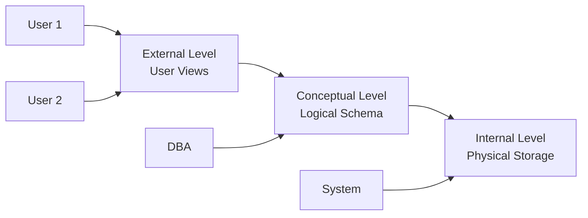
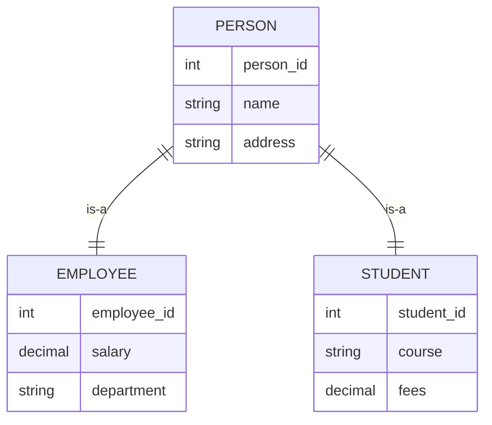
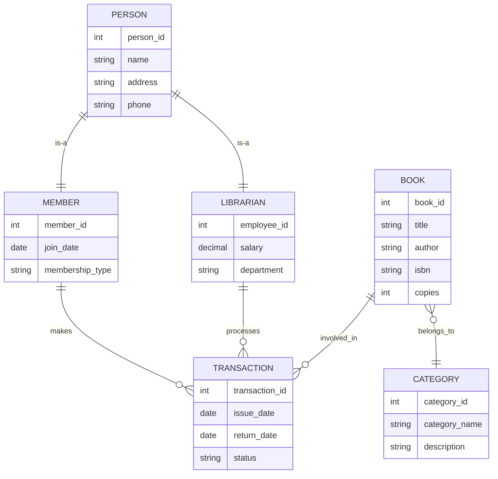
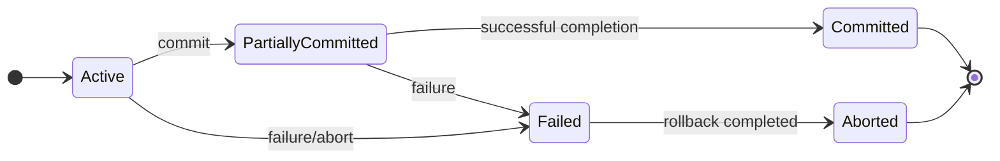

## Question 1(a) [3 marks]

**Write a short note: Data Dictionary**

**Answer**:
A **Data Dictionary** is a centralized repository that stores metadata about database structure, elements, and relationships.

**Table: Data Dictionary Components**

| Component | Description |
|-----------|-------------|
| **Table Names** | List of all tables in database |
| **Column Details** | Data types, constraints, lengths |
| **Relationships** | Foreign key connections |
| **Indexes** | Performance optimization structures |

**Key Features:**

- **Metadata Storage**: Contains information about data structure
- **Data Integrity**: Maintains consistency rules and constraints
- **Documentation**: Provides comprehensive database documentation

**Mnemonic:** "Data Dictionary Delivers Details"

## Question 1(b) [4 marks]

**Define (i) E-R model (ii) Entity (iii) Entity set and (iv) attributes**

**Answer**:

**Table: ER Model Definitions**

| Term | Definition |
|------|------------|
| **E-R Model** | Conceptual data model using entities and relationships |
| **Entity** | Real-world object with independent existence |
| **Entity Set** | Collection of similar entities of same type |
| **Attributes** | Properties that describe entity characteristics |

**Diagram: ER Model Components**

```goat
    +----------+     +-------------+     +----------+
    |  Entity  |-----| Relationship|-----|  Entity  |
    |    A     |     |             |     |    B     |
    +----------+     +-------------+     +----------+
         |                                    |
    Attributes                           Attributes
```

**Key Points:**

- **Conceptual Design**: High-level database design approach
- **Visual Representation**: Uses diagrams for clear understanding

**Mnemonic:** "Entities Relate Meaningfully"

## Question 1(c) [7 marks]

**Explain Advantages of DBMS**

**Answer**:

**Table: DBMS Advantages**

| Advantage | Benefit |
|-----------|---------|
| **Data Independence** | Applications isolated from data structure changes |
| **Data Sharing** | Multiple users access same data simultaneously |
| **Data Security** | Access control and authentication mechanisms |
| **Data Integrity** | Consistency maintained through constraints |
| **Backup & Recovery** | Automatic data protection and restoration |
| **Reduced Redundancy** | Eliminates duplicate data storage |

**Key Benefits:**

- **Centralized Control**: Single point of data management
- **Cost Effectiveness**: Reduces development and maintenance costs
- **Data Consistency**: Ensures uniform data across applications
- **Concurrent Access**: Multiple users can work simultaneously
- **Query Optimization**: Efficient data retrieval mechanisms

**Mnemonic:** "Database Benefits Business Better"

## Question 1(c) OR [7 marks]

**Explain Architecture of DBMS**

**Answer**:

**Diagram: Three-Level DBMS Architecture**



**Table: Architecture Levels**

| Level | Purpose | Users |
|-------|---------|--------|
| **External** | Individual user views | End users, Applications |
| **Conceptual** | Complete logical structure | Database Administrator |
| **Internal** | Physical storage details | System programmers |

**Key Features:**

- **Data Independence**: Changes at one level don't affect others
- **Security**: Different access levels for different users
- **Abstraction**: Hides complexity from users

**Mnemonic:** "External Conceptual Internal Architecture"

## Question 2(a) [3 marks]

**Explain UNIQUE KEY and PRIMARY KEY**

**Answer**:

**Table: Key Comparison**

| Feature | PRIMARY KEY | UNIQUE KEY |
|---------|-------------|------------|
| **Null Values** | Not allowed | One null allowed |
| **Number per Table** | Only one | Multiple allowed |
| **Index Creation** | Automatic clustered | Automatic non-clustered |
| **Purpose** | Entity identification | Data uniqueness |

**Key Differences:**

- **Primary Key**: Uniquely identifies each record, cannot be null
- **Unique Key**: Ensures uniqueness but allows one null value

**Mnemonic:** "Primary Prevents Nulls, Unique Understands Nulls"

## Question 2(b) [4 marks]

**Write a short note on Participation of Entity in ER diagram**

**Answer**:

**Table: Participation Types**

| Type | Description | Symbol |
|------|-------------|--------|
| **Total Participation** | Every entity must participate | Double line |
| **Partial Participation** | Some entities may not participate | Single line |

**Diagram: Participation Example**

```goat
Employee ========== Works_for ---------- Department
  (Total)                                 (Partial)
```

**Key Concepts:**

- **Mandatory Participation**: Every instance must be involved
- **Optional Participation**: Some instances may not be involved
- **Business Rules**: Reflects real-world constraints

**Mnemonic:** "Total Participation Requires All"

## Question 2(c) [7 marks]

**Describe Generalization concept in Detail for ER diagram**

**Answer**:

**Diagram: Generalization Example**



**Table: Generalization Characteristics**

| Aspect | Description |
|--------|-------------|
| **Bottom-up Process** | Combines similar entities into superclass |
| **Inheritance** | Subclasses inherit superclass attributes |
| **Specialization** | Reverse process of generalization |
| **Overlap Constraints** | Disjoint or overlapping subclasses |

**Key Features:**

- **Attribute Inheritance**: Common attributes moved to superclass
- **Relationship Inheritance**: Relationships also inherited
- **Constraint Types**: Total/partial, disjoint/overlapping
- **ISA Relationship**: Represents "is-a" connection

**Mnemonic:** "Generalization Groups Similar Entities"

## Question 2(a) OR [3 marks]

**Explain Mapping Cardinality in ER diagram**

**Answer**:

**Table: Cardinality Types**

| Type | Description | Example |
|------|-------------|---------|
| **One-to-One (1:1)** | One entity relates to one other | Person-Passport |
| **One-to-Many (1:M)** | One entity relates to many others | Department-Employee |
| **Many-to-One (M:1)** | Many entities relate to one | Employee-Department |
| **Many-to-Many (M:N)** | Many entities relate to many | Student-Course |

**Key Concepts:**

- **Relationship Constraints**: Defines how entities can be related
- **Business Rules**: Reflects real-world relationship limits

**Mnemonic:** "One Or Many Mappings Matter"

## Question 2(b) OR [4 marks]

**Explain Aggregation in E-R diagram**

**Answer**:

**Diagram: Aggregation Example**

```goat
    Employee ---- Works_on ---- Project
        |                         |
        +----------+----------+
                   |
               Manages
                   |
                Manager
```

**Key Features:**

- **Relationship as Entity**: Treats relationship set as entity
- **Higher-level Relationships**: Allows relationships between relationships
- **Complex Modeling**: Handles advanced business scenarios
- **Abstraction Mechanism**: Simplifies complex relationships

**Table: Aggregation Benefits**

| Benefit | Description |
|---------|-------------|
| **Modeling Flexibility** | Handles complex relationships |
| **Semantic Clarity** | Clear representation of business rules |
| **Design Simplicity** | Reduces model complexity |

**Mnemonic:** "Aggregation Abstracts Advanced Associations"

## Question 2(c) OR [7 marks]

**Draw ER diagram of Library Management system using Enhanced ER model**

**Answer**:

**Diagram: Library Management System**



**Enhanced ER Features Used:**

- **Generalization**: Person superclass with Member and Librarian subclasses
- **Specialization**: Different attributes for different person types
- **Aggregation**: Transaction relationship involving multiple entities
- **Multiple Inheritance**: Complex relationship handling

**Mnemonic:** "Library Links Literature Logically"

## Question 3(a) [3 marks]

**Explain SQL data types**

**Answer**:

**Table: Common SQL Data Types**

| Category | Data Type | Description |
|----------|-----------|-------------|
| **Numeric** | INT, DECIMAL, FLOAT | Store numbers |
| **Character** | CHAR, VARCHAR, TEXT | Store text |
| **Date/Time** | DATE, TIME, DATETIME | Store temporal data |
| **Boolean** | BOOLEAN | Store true/false |

**Key Points:**

- **Data Integrity**: Ensures correct data storage
- **Storage Optimization**: Appropriate size allocation
- **Validation**: Automatic data type checking

**Mnemonic:** "Data Types Define Storage"

## Question 3(b) [4 marks]

**Compare DROP and TRUNCATE commands**

**Answer**:

**Table: DROP vs TRUNCATE Comparison**

| Feature | DROP | TRUNCATE |
|---------|------|----------|
| **Operation** | Removes table structure | Removes all data only |
| **Rollback** | Cannot rollback | Can rollback (in transaction) |
| **Speed** | Slower | Faster |
| **Triggers** | Fires triggers | Does not fire triggers |
| **Where Clause** | Not applicable | Not supported |
| **Auto-increment** | Resets | Resets to initial value |

**Code Examples:**

```sql
-- DROP command
DROP TABLE student;

-- TRUNCATE command  
TRUNCATE TABLE student;
```

**Key Differences:**

- **Structure Impact**: DROP removes everything, TRUNCATE keeps structure
- **Performance**: TRUNCATE is faster for large tables

**Mnemonic:** "DROP Destroys, TRUNCATE Trims"

## Question 3(c) [7 marks]

**Consider a following Relational Schema and give Relational Algebra Expression for the following Queries**
**Students (Name, SPI, DOB, Enrollment No)**

**Answer**:

**Relational Algebra Expressions:**

**i) List out all students whose SPI is lower than 6.0:**

```
σ(SPI < 6.0)(Students)
```

**ii) List name of student whose enrollment number contains 006:**

```
π(Name)(σ(Enrollment_No LIKE '%006%')(Students))
```

**iii) List all students with same DOB:**

```
Students ⋈ (ρ(S2)(Students)) WHERE Students.DOB = S2.DOB AND Students.Enrollment_No ≠ S2.Enrollment_No
```

**iv) Display students name starting from same letter:**

```
π(Name)(Students ⋈ (ρ(S2)(Students)) WHERE SUBSTR(Students.Name,1,1) = SUBSTR(S2.Name,1,1) AND Students.Enrollment_No ≠ S2.Enrollment_No)
```

**Table: Relational Algebra Operators Used**

| Operator | Symbol | Purpose |
|----------|--------|---------|
| **Selection** | σ | Filter rows based on condition |
| **Projection** | π | Select specific columns |
| **Join** | ⋈ | Combine related tuples |
| **Rename** | ρ | Rename relations/attributes |

**Mnemonic:** "Select Project Join Rename"

## Question 3(a) OR [3 marks]

**Explain use of Grant and Revoke command with example**

**Answer**:

**Code Examples:**

```sql
-- GRANT command
GRANT SELECT, INSERT ON student TO user1;
GRANT ALL PRIVILEGES ON database1 TO user2;

-- REVOKE command  
REVOKE INSERT ON student FROM user1;
REVOKE ALL PRIVILEGES ON database1 FROM user2;
```

**Key Features:**

- **Access Control**: Manages user permissions
- **Security**: Prevents unauthorized access
- **Granular Control**: Specific privilege assignment

**Table: Common Privileges**

| Privilege | Description |
|-----------|-------------|
| **SELECT** | Read data |
| **INSERT** | Add new records |
| **UPDATE** | Modify existing data |
| **DELETE** | Remove records |
| **ALL** | Complete access |

**Mnemonic:** "Grant Gives, Revoke Removes"

## Question 3(b) OR [4 marks]

**Describe DML commands with Example**

**Answer**:

**Table: DML Commands**

| Command | Purpose | Example |
|---------|---------|---------|
| **INSERT** | Add new records | `INSERT INTO student VALUES (1,'John',8.5)` |
| **UPDATE** | Modify existing data | `UPDATE student SET spi=9.0 WHERE id=1` |
| **DELETE** | Remove records | `DELETE FROM student WHERE spi<6.0` |
| **SELECT** | Retrieve data | `SELECT * FROM student WHERE spi>8.0` |

**Code Examples:**

```sql
-- INSERT command
INSERT INTO Students (name, spi, dob) 
VALUES ('Alice', 8.5, '2000-05-15');

-- UPDATE command
UPDATE Students SET spi = 9.0 
WHERE name = 'Alice';

-- DELETE command
DELETE FROM Students 
WHERE spi < 6.0;

-- SELECT command
SELECT name, spi FROM Students 
WHERE spi > 8.0;
```

**Key Features:**

- **Data Manipulation**: Core database operations
- **Transaction Support**: Can be rolled back
- **Conditional Operations**: WHERE clause support

**Mnemonic:** "Insert Update Delete Select"

## Question 3(c) OR [7 marks]

**List all Conversion function of DBMS and explain any three of them in detail**

**Answer**:

**Table: Conversion Functions**

| Function | Purpose | Example |
|----------|---------|---------|
| **TO_CHAR** | Convert to character | `TO_CHAR(sysdate, 'DD-MM-YYYY')` |
| **TO_DATE** | Convert to date | `TO_DATE('15-05-2025', 'DD-MM-YYYY')` |
| **TO_NUMBER** | Convert to number | `TO_NUMBER('123.45')` |
| **CAST** | General conversion | `CAST('123' AS INTEGER)` |
| **CONVERT** | Data type conversion | `CONVERT(varchar, 123)` |

**Detailed Explanation of Three Functions:**

**1. TO_CHAR Function:**

- **Purpose**: Converts dates and numbers to character strings
- **Syntax**: `TO_CHAR(value, format)`
- **Usage**: Date formatting, number formatting with specific patterns

**2. TO_DATE Function:**

- **Purpose**: Converts character strings to date values
- **Syntax**: `TO_DATE(string, format)`  
- **Usage**: String to date conversion with specified format

**3. TO_NUMBER Function:**

- **Purpose**: Converts character strings to numeric values
- **Syntax**: `TO_NUMBER(string, format)`
- **Usage**: String to number conversion for calculations

**Key Benefits:**

- **Data Type Flexibility**: Seamless conversion between types
- **Format Control**: Specific formatting options
- **Error Handling**: Validation during conversion

**Mnemonic:** "Convert Characters Dates Numbers"

## Question 4(a) [3 marks]

**Write short note: Domain Integrity Constraint**

**Answer**:

**Domain Integrity Constraints** ensure that data values fall within acceptable ranges and formats for specific attributes.

**Table: Domain Constraint Types**

| Constraint | Purpose | Example |
|------------|---------|---------|
| **CHECK** | Value range validation | `CHECK (age >= 0 AND age <= 100)` |
| **NOT NULL** | Prevents null values | `name VARCHAR(50) NOT NULL` |
| **DEFAULT** | Sets default values | `status VARCHAR(10) DEFAULT 'Active'` |

**Key Features:**

- **Data Validation**: Ensures data quality at entry
- **Business Rules**: Implements domain-specific rules
- **Automatic Checking**: Validation occurs during DML operations

**Mnemonic:** "Domain Defines Data Boundaries"

## Question 4(b) [4 marks]

**List all JOIN in DBMS and explain any two**

**Answer**:

**Table: Types of JOINs**

| JOIN Type | Description |
|-----------|-------------|
| **INNER JOIN** | Returns matching records from both tables |
| **LEFT JOIN** | Returns all records from left table |
| **RIGHT JOIN** | Returns all records from right table |
| **FULL OUTER JOIN** | Returns all records from both tables |
| **CROSS JOIN** | Cartesian product of both tables |
| **SELF JOIN** | Table joined with itself |

**Detailed Explanation:**

**1. INNER JOIN:**

```sql
SELECT s.name, c.course_name
FROM students s
INNER JOIN courses c ON s.course_id = c.course_id;
```

- Returns only matching records from both tables
- Most commonly used join type

**2. LEFT JOIN:**

```sql
SELECT s.name, c.course_name
FROM students s
LEFT JOIN courses c ON s.course_id = c.course_id;
```

- Returns all students, even if no course assigned
- NULL values for unmatched records

**Mnemonic:** "Join Tables Together Thoughtfully"

## Question 4(c) [7 marks]

**Explain Concept of Functional Dependency in detail**

**Answer**:

**Functional Dependency** occurs when the value of one attribute uniquely determines the value of another attribute.

**Notation:** A → B (A functionally determines B)

**Table: Types of Functional Dependencies**

| Type | Definition | Example |
|------|------------|---------|
| **Full FD** | All attributes in LHS needed | {Student_ID, Course_ID} → Grade |
| **Partial FD** | Some LHS attributes redundant | {Student_ID, Course_ID} → Student_Name |
| **Transitive FD** | Indirect dependency through another attribute | Student_ID → Dept_ID → Dept_Name |

**Diagram: Functional Dependency Example**

```goat
Student_ID ---------> Student_Name
    |                      |
    |                      v
    |-----------------> Address
    |
    v
Course_ID ---------> Course_Name
```

**Key Properties:**

- **Reflexivity**: A → A (trivial dependency)
- **Augmentation**: If A → B, then AC → BC
- **Transitivity**: If A → B and B → C, then A → C
- **Decomposition**: If A → BC, then A → B and A → C

**Applications:**

- **Normalization**: Eliminates redundancy using FD
- **Database Design**: Determines table structure
- **Data Integrity**: Maintains consistency

**Mnemonic:** "Functions Determine Dependencies Directly"

## Question 4(a) OR [3 marks]

**Write short note: Referential integrity Constraints**

**Answer**:

**Referential Integrity** ensures that foreign key values in one table correspond to existing primary key values in referenced table.

**Table: Referential Integrity Rules**

| Rule | Description | Action |
|------|-------------|--------|
| **INSERT Rule** | Foreign key must exist in parent | Reject invalid inserts |
| **DELETE Rule** | Handle parent record deletion | CASCADE, RESTRICT, SET NULL |
| **UPDATE Rule** | Handle primary key updates | CASCADE, RESTRICT |

**Key Features:**

- **Foreign Key Constraint**: Links related tables
- **Data Consistency**: Prevents orphaned records
- **Relationship Maintenance**: Preserves table relationships

**Code Example:**

```sql
ALTER TABLE Orders 
ADD CONSTRAINT FK_Customer 
FOREIGN KEY (customer_id) 
REFERENCES Customers(customer_id);
```

**Mnemonic:** "References Require Related Records"

## Question 4(b) OR [4 marks]

**Explain union and intersection operations of relational algebra**

**Answer**:

**Table: Set Operations Comparison**

| Operation | Symbol | Description | Requirement |
|-----------|--------|-------------|-------------|
| **UNION** | ∪ | Combines all tuples from both relations | Union compatible |
| **INTERSECTION** | ∩ | Common tuples in both relations | Union compatible |

**Union Operation:**

- **Syntax**: R ∪ S
- **Result**: All tuples from R and S (duplicates removed)
- **Requirement**: Same number and types of attributes

**Intersection Operation:**

- **Syntax**: R ∩ S  
- **Result**: Tuples that exist in both R and S
- **Requirement**: Union compatible relations

**Example:**

```
Students_CS ∪ Students_IT = All students from both departments
Students_CS ∩ Students_IT = Students in both departments
```

**Key Points:**

- **Union Compatibility**: Relations must have same structure
- **Duplicate Elimination**: Results contain unique tuples only

**Mnemonic:** "Union Unites, Intersection Identifies Common"

## Question 4(c) OR [7 marks]

**Explain Concept of Normalization in DBMS in detail**

**Answer**:

**Normalization** is the process of organizing database tables to minimize data redundancy and improve data integrity.

**Table: Normal Forms**

| Normal Form | Requirements | Eliminates |
|-------------|-------------|------------|
| **1NF** | Atomic values, no repeating groups | Multivalued attributes |
| **2NF** | 1NF + No partial dependencies | Partial functional dependencies |
| **3NF** | 2NF + No transitive dependencies | Transitive dependencies |
| **BCNF** | 3NF + Every determinant is candidate key | Remaining anomalies |

**Normalization Process:**

**Step 1 - First Normal Form (1NF):**

- Eliminate repeating groups
- Each cell contains single value
- Each record is unique

**Step 2 - Second Normal Form (2NF):**

- Must be in 1NF
- Remove partial dependencies
- Non-key attributes fully dependent on primary key

**Step 3 - Third Normal Form (3NF):**

- Must be in 2NF
- Remove transitive dependencies
- Non-key attributes not dependent on other non-key attributes

**Benefits of Normalization:**

- **Reduced Redundancy**: Eliminates duplicate data
- **Data Integrity**: Maintains consistency
- **Storage Efficiency**: Minimizes storage space
- **Update Anomalies**: Prevents inconsistent updates

**Drawbacks:**

- **Complex Queries**: May require multiple joins
- **Performance Impact**: Can slow down retrieval

**Mnemonic:** "Normalize to Neat, Non-redundant Tables"

## Question 5(a) [3 marks]

**Describe Need of Normalization in DBMS**

**Answer**:

**Table: Problems Solved by Normalization**

| Problem | Description | Solution |
|---------|-------------|----------|
| **Insertion Anomaly** | Cannot insert data without complete info | Separate tables |
| **Update Anomaly** | Multiple updates for single change | Remove redundancy |
| **Deletion Anomaly** | Loss of important data when deleting | Preserve dependencies |

**Key Needs:**

- **Data Consistency**: Ensures uniform data across database
- **Storage Optimization**: Reduces redundant storage
- **Maintenance Simplicity**: Easier database updates

**Benefits:**

- **Improved Data Quality**: Reduces errors and inconsistencies
- **Flexible Design**: Easier to modify and extend
- **Better Performance**: For update operations

**Mnemonic:** "Normalization Needs Neat Organization"

## Question 5(b) [4 marks]

**Explain properties of Transaction in DBMS**

**Answer**:

**Table: ACID Properties**

| Property | Description | Purpose |
|----------|-------------|---------|
| **Atomicity** | All operations succeed or all fail | Ensures completeness |
| **Consistency** | Database remains in valid state | Maintains integrity |
| **Isolation** | Concurrent transactions don't interfere | Prevents conflicts |
| **Durability** | Committed changes are permanent | Ensures persistence |

**Detailed Explanation:**

**Atomicity:**

- Transaction is indivisible unit
- Either all operations complete or none

**Consistency:**

- Database transitions from one valid state to another
- All integrity constraints maintained

**Isolation:**

- Concurrent transactions appear to run sequentially
- Intermediate states not visible to other transactions

**Durability:**

- Once committed, changes survive system failures
- Data permanently stored

**Mnemonic:** "ACID Assures Correct Database"

## Question 5(c) [7 marks]

**Explain View Serializability in detail**

**Answer**:

**View Serializability** determines if a concurrent schedule produces the same result as some serial schedule by examining read and write operations.

**Table: View Equivalence Conditions**

| Condition | Description |
|-----------|-------------|
| **Initial Reads** | Same transactions read initial values |
| **Final Writes** | Same transactions perform final writes |
| **Intermediate Reads** | Read values from same writing transactions |

**Key Concepts:**

**View Equivalent Schedules:**
Two schedules are view equivalent if:

1. For each data item, if transaction T reads initial value in one schedule, it reads initial value in other
2. For each read operation, if T reads value written by T' in one schedule, same holds in other
3. For each data item, if T performs final write in one schedule, it performs final write in other

**Testing View Serializability:**

1. **Precedence Graph**: Create directed graph
2. **Cycle Detection**: Check for cycles in graph
3. **Conflict Analysis**: Examine read-write conflicts

**Example Analysis:**

```
Schedule S1: R1(X) W1(X) R2(X) W2(X)
Schedule S2: R1(X) R2(X) W1(X) W2(X)
```

**Benefits:**

- **Concurrency Control**: Ensures correctness
- **Performance**: Allows maximum concurrency
- **Consistency**: Maintains database integrity

**Comparison with Conflict Serializability:**

- View serializability is less restrictive
- Some view serializable schedules are not conflict serializable
- More complex to test

**Mnemonic:** "View Verifies Valid Schedules"

## Question 5(a) OR [3 marks]

**Perform 2NF on any Database**

**Answer**:

**Example: Student Course Database**

**Original Table (Not in 2NF):**

```
Student_Course (Student_ID, Student_Name, Course_ID, Course_Name, Grade, Instructor)
Primary Key: {Student_ID, Course_ID}
```

**Functional Dependencies:**

- Student_ID → Student_Name (Partial dependency)
- Course_ID → Course_Name, Instructor (Partial dependency)
- {Student_ID, Course_ID} → Grade

**2NF Decomposition:**

**Table 1: Students**

```
Students (Student_ID, Student_Name)
Primary Key: Student_ID
```

**Table 2: Courses**

```
Courses (Course_ID, Course_Name, Instructor)  
Primary Key: Course_ID
```

**Table 3: Enrollments**

```
Enrollments (Student_ID, Course_ID, Grade)
Primary Key: {Student_ID, Course_ID}
Foreign Keys: Student_ID → Students, Course_ID → Courses
```

**Result:** All partial dependencies eliminated, now in 2NF.

**Mnemonic:** "Second Normal Form Separates Dependencies"

## Question 5(b) OR [4 marks]

**Explain States of Transaction**

**Answer**:

**Diagram: Transaction State Diagram**



**Table: Transaction States**

| State | Description | Actions |
|-------|-------------|---------|
| **Active** | Transaction is executing | Read/Write operations |
| **Partially Committed** | Final statement executed | Waiting for commit |
| **Committed** | Transaction completed successfully | Changes permanent |
| **Failed** | Cannot proceed normally | Error occurred |
| **Aborted** | Transaction rolled back | All changes undone |

**State Transitions:**

- **Active to Failed**: Due to errors or explicit abort
- **Active to Partially Committed**: After final statement
- **Partially Committed to Committed**: Successful completion
- **Failed to Aborted**: After rollback operations

**Key Points:**

- **Recovery**: System can recover from failed states
- **Durability**: Committed changes are permanent
- **Atomicity**: Aborted transactions leave no trace

**Mnemonic:** "Transactions Travel Through States"

## Question 5(c) OR [7 marks]

**Explain Conflict Serializability in detail**

**Answer**:

**Conflict Serializability** ensures that a concurrent schedule is equivalent to some serial schedule by analyzing conflicting operations.

**Table: Conflicting Operations**

| Operation Pair | Conflict Type | Reason |
|----------------|---------------|--------|
| **Read-Write** | RW Conflict | Read before write |
| **Write-Read** | WR Conflict | Write before read |
| **Write-Write** | WW Conflict | Multiple writes |

**Testing Conflict Serializability:**

**Step 1: Identify Conflicts**

- Find pairs of operations on same data item
- Check if operations belong to different transactions
- Determine if operations conflict

**Step 2: Create Precedence Graph**

- Nodes represent transactions
- Directed edges represent conflicts
- Edge from Ti to Tj if Ti conflicts with Tj

**Step 3: Check for Cycles**

- If graph has no cycles → Conflict serializable
- If graph has cycles → Not conflict serializable

**Example Analysis:**

```
Schedule: R1(A) W1(A) R2(A) W2(B) R1(B) W1(B)

Conflicts:
- W1(A) conflicts with R2(A) → T1 before T2
- W2(B) conflicts with R1(B) → T2 before T1
- W2(B) conflicts with W1(B) → T2 before T1
```

**Precedence Graph:**

```goat
    T1 ←----→ T2
       (cycle)
```

**Result:** Contains cycle, therefore NOT conflict serializable.

**Table: Serializability Testing Steps**

| Step | Action | Purpose |
|------|--------|---------|
| **1** | List all operations | Identify transaction operations |
| **2** | Find conflicts | Determine operation dependencies |
| **3** | Build precedence graph | Visualize dependencies |
| **4** | Check for cycles | Test serializability |

**Key Properties:**

- **Conflict Equivalent**: Same conflicts, same relative order
- **Serial Schedule**: One transaction at a time
- **Precedence Graph**: Directed graph showing dependencies
- **Cycle Detection**: Determines conflict serializability

**Benefits:**

- **Concurrency Control**: Ensures correctness
- **Performance**: Maximizes concurrent execution
- **Consistency**: Maintains database integrity

**Comparison with View Serializability:**

- Conflict serializability is more restrictive
- All conflict serializable schedules are view serializable
- Easier to test than view serializability

**Algorithms for Testing:**

1. **Precedence Graph Method**: Build graph and check cycles
2. **Timestamp Ordering**: Use timestamps to order operations
3. **Two-Phase Locking**: Use locks to ensure serializability

**Mnemonic:** "Conflicts Create Cycles, Check Carefully"
