## પ્રશ્ન 1(અ) [3 ગુણ]

**વ્યાખ્યા આપો: ફિલ્ડ, રેકોર્ડ, મેટાડેટા**

**જવાબ**:

| શબ્દ | વ્યાખ્યા |
|------|------------|
| **ફિલ્ડ** | ડેટાબેઝ ટેબલમાં ચોક્કસ એટ્રિબ્યુટને રજૂ કરતી ડેટાની એક એકલ એકમ (દા.ત. નામ, ઉંમર, ID) |
| **રેકોર્ડ** | સંબંધિત ફિલ્ડ્સનો સંપૂર્ણ સેટ જે એક એન્ટિટી ઇન્સ્ટન્સને રજૂ કરે છે (ટેબલમાં એક રો) |
| **મેટાડેટા** | ડેટા જે અન્ય ડેટાની રચના, ગુણધર્મો અને સંબંધોનું વર્ણન કરે છે ("ડેટા વિશે ડેટા") |

**મેમરી ટ્રીક:** "FRM: ફિલ્ડ્સ રો-અપ એઝ મેટાડેટા"

## પ્રશ્ન 1(બ) [4 ગુણ]

**વ્યાખ્યા લખો (i) E-R મોડલ (ii) એન્ટિટી (iii) એન્ટિટી સેટ અને (iv) એટ્રીબ્યુટ્સ**

**જવાબ**:

| શબ્દ | વ્યાખ્યા |
|------|------------|
| **E-R મોડલ** | ડેટાબેઝ ડિઝાઇનનો ગ્રાફિકલ અભિગમ જે એન્ટિટીઝ, તેમના એટ્રિબ્યુટ્સ અને રિલેશનશીપને મોડેલ કરે છે |
| **એન્ટિટી** | એક વાસ્તવિક-વિશ્વ વસ્તુ, વિચાર અથવા ચીજ જેનું સ્વતંત્ર અસ્તિત્વ છે |
| **એન્ટિટી સેટ** | સમાન એન્ટિટીઓનો સંગ્રહ જે સમાન એટ્રિબ્યુટ્સ ધરાવે છે (ટેબલ તરીકે રજૂ કરાય છે) |
| **એટ્રિબ્યુટ્સ** | ગુણધર્મો અથવા લક્ષણો જે એન્ટિટીનું વર્ણન કરે છે (ટેબલના કોલમ તરીકે રજૂ કરાય છે) |

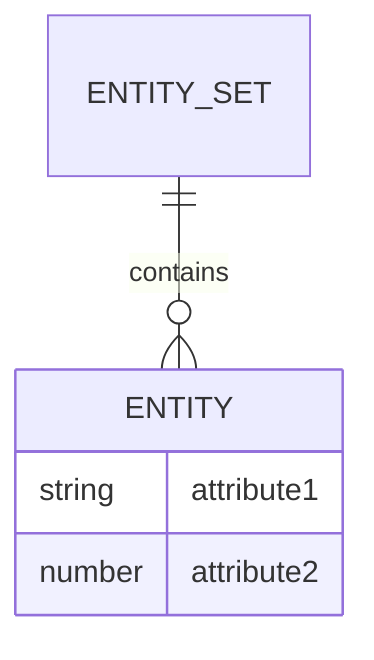

**મેમરી ટ્રીક:** "EEAA: એન્ટિટીસ એક્ઝિસ્ટ એઝ એટ્રિબ્યુટ્સ"

## પ્રશ્ન 1(ક) [7 ગુણ]

**DBMS નાં ફાયદા અને ગેરફાયદા જણાવો.**

**જવાબ**:

| ફાયદા | ગેરફાયદા |
|------------|---------------|
| **ડેટા શેરિંગ**: ઘણા વપરાશકર્તાઓ એક સાથે એક્સેસ કરી શકે છે | **ખર્ચ**: મોંઘા હાર્ડવેર/સોફ્ટવેર જરૂરિયાતો |
| **ડેટા ઇન્ટિગ્રિટી**: કન્સ્ટ્રેન્ટ્સ દ્વારા ચોકસાઈ જાળવે છે | **જટિલતા**: વિશિષ્ટ તાલીમની જરૂર પડે છે |
| **ડેટા સિક્યુરિટી**: પરમિશન દ્વારા એક્સેસ નિયંત્રિત કરે છે | **પ્રદર્શન**: મોટા ડેટાબેઝ માટે ધીમું હોઈ શકે છે |
| **ડેટા ઇન્ડિપેન્ડન્સ**: સ્ટોરેજ બદલવાથી એપ્લિકેશન પર અસર થતી નથી | **નબળાઈ**: કેન્દ્રીય નિષ્ફળતા બિંદુ ડેટા લોસનું જોખમ છે |
| **ઘટાડેલ રિડન્ડન્સી**: ડુપ્લીકેટ ડેટા દૂર કરે છે | **કન્વર્ઝન ખર્ચ**: ફાઇલ સિસ્ટમથી માઇગ્રેટ કરવું ખર્ચાળ છે |

**મેમરી ટ્રીક:** "SIDSR vs CCPVC" (શેરિંગ, ઇન્ટિગ્રિટી, ડેટા ઇન્ડિપેન્ડન્સ, સિક્યુરિટી, રિડન્ડન્સી vs કોસ્ટ, કોમ્પ્લેક્સિટી, પરફોર્મન્સ, વલ્નરેબિલિટી, કન્વર્ઝન)

## પ્રશ્ન 1(ક) OR [7 ગુણ]

**DBA નું પુરુનામ લખો. DBAની ભૂમિકા અને જવાબદારીઓ સમજાવો.**

**જવાબ**:

**DBA**: Database Administrator (ડેટાબેઝ એડમિનિસ્ટ્રેટર)

| DBAની જવાબદારીઓ |
|-------------------------|
| **ડેટાબેઝ ડિઝાઇન**: કાર્યક્ષમ ડેટાબેઝ સ્કીમા બનાવે છે |
| **સિક્યુરિટી મેનેજમેન્ટ**: યુઝર એક્સેસ કંટ્રોલ સેટ કરે છે |
| **પ્રદર્શન ટ્યુનિંગ**: ક્વેરી અને ઇન્ડેક્સને ઓપ્ટિમાઇઝ કરે છે |
| **બેકઅપ અને રિકવરી**: ડેટા સુરક્ષા યોજનાઓ લાગુ કરે છે |
| **મેઇન્ટેનન્સ**: સોફ્ટવેર અપડેટ કરે છે અને પેચ લાગુ કરે છે |
| **ટ્રબલશૂટિંગ**: ડેટાબેઝ સમસ્યાઓનો ઉકેલ કરે છે |
| **યુઝર સપોર્ટ**: ડેટાબેઝ વપરાશકર્તાઓને તાલીમ આપે છે અને સહાય કરે છે |

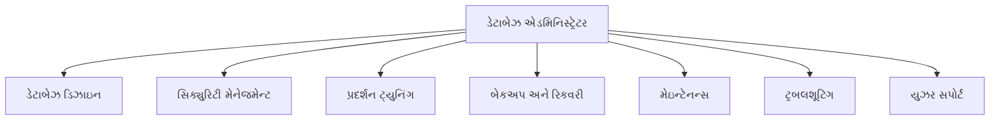

**મેમરી ટ્રીક:** "SPBT-MUS" (સિક્યુરિટી, પરફોર્મન્સ, બેકઅપ, ટ્રબલશૂટિંગ, મેઇન્ટેનન્સ, યુઝર સપોર્ટ)

## પ્રશ્ન 2(અ) [3 ગુણ]

**યોગ્ય ઉદાહરણ સાથે સિંગલ વેલ્યુડ અને મલ્ટી વેલ્યુડ એટ્રીબ્યુટ્સ વચ્ચેનો તફાવત સમજાવો**

**જવાબ**:

| એટ્રિબ્યુટ પ્રકાર | વર્ણન | ઉદાહરણો |
|----------------|-------------|----------|
| **સિંગલ-વેલ્યુડ** | દરેક એન્ટિટી ઇન્સ્ટન્સ માટે માત્ર એક મૂલ્ય ધરાવે છે | Employee ID, જન્મતારીખ, નામ |
| **મલ્ટી-વેલ્યુડ** | એક જ એન્ટિટી માટે ઘણા મૂલ્યો ધરાવી શકે છે | ફોન નંબર, કૌશલ્યો, ઇમેઇલ એડ્રેસ |

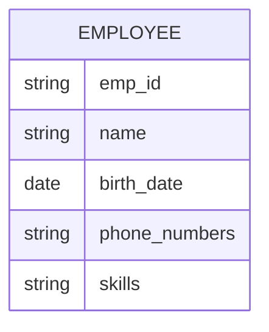

**મેમરી ટ્રીક:** "SIM: સિંગલ ઇઝ મિનિમલ, મલ્ટી ઇઝ મેની"

## પ્રશ્ન 2(બ) [4 ગુણ]

**E-R ડાયાગ્રામ માટે કી કન્સ્ટ્રેન્ટ્સ સમજાવો**

**જવાબ**:

| કી કન્સ્ટ્રેન્ટ | વર્ણન |
|----------------|-------------|
| **પ્રાઇમરી કી** | એન્ટિટી સેટમાં દરેક એન્ટિટીને અનન્ય રીતે ઓળખે છે |
| **કેન્ડિડેટ કી** | કોઈપણ એટ્રિબ્યુટ જે પ્રાઇમરી કી તરીકે કામ કરી શકે |
| **ફોરેન કી** | અન્ય એન્ટિટી સેટની પ્રાઇમરી કીનો સંદર્ભ આપે છે |
| **સુપર કી** | એટ્રિબ્યુટ્સનો કોઈપણ સેટ જે અનન્ય રીતે એન્ટિટીને ઓળખે છે |

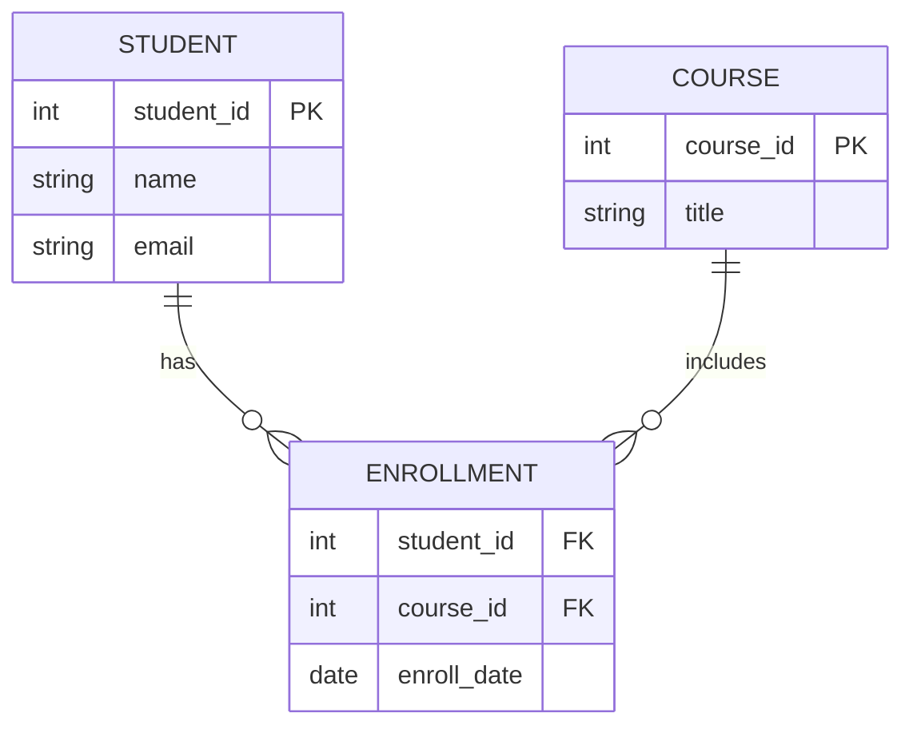

**મેમરી ટ્રીક:** "PCFS: પ્રાઇમરી કેન્ડિડેટ્સ ફાઇન્ડ સુપરકીઝ"

## પ્રશ્ન 2(ક) [7 ગુણ]

**બેંકિંગ મેનેજમેન્ટ સિસ્ટમ માટે E-R ડાયાગ્રામ બનાવો**

**જવાબ**:

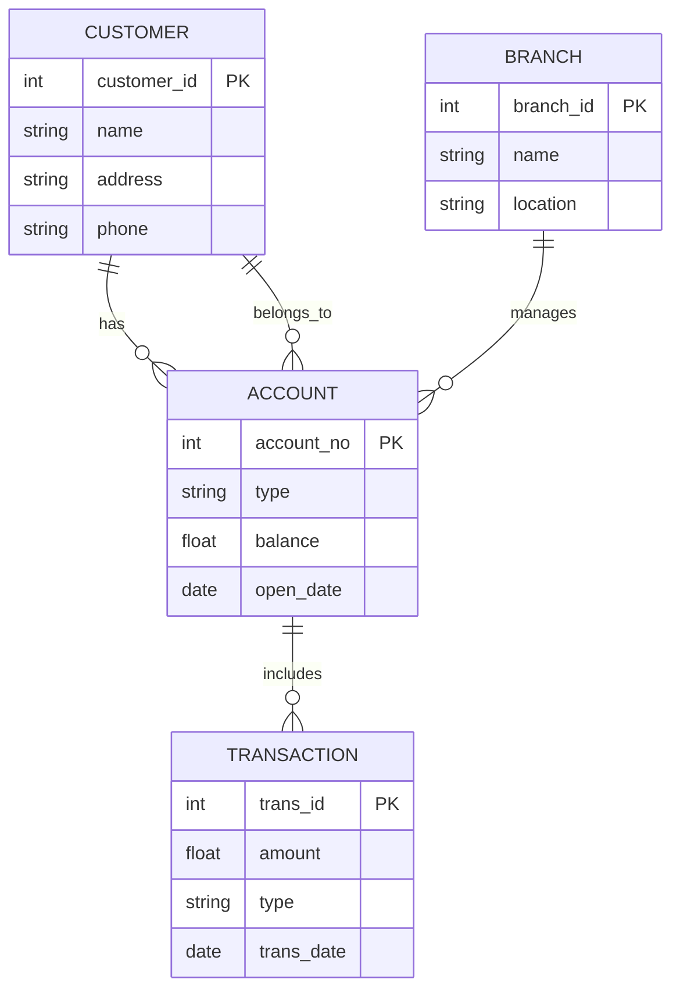

**મુખ્ય એન્ટિટીઝ અને રિલેશનશિપ્સ**:

- **ગ્રાહક**: ગ્રાહક માહિતી સંગ્રહિત કરે છે
- **એકાઉન્ટ**: વિવિધ એકાઉન્ટ પ્રકારો (સેવિંગ્સ, ચેકિંગ)
- **ટ્રાન્ઝેક્શન**: ડિપોઝિટ, વિડ્રોઅલ રેકોર્ડ કરે છે
- **બ્રાન્ચ**: વિવિધ બેંક સ્થાનો
- **રિલેશનશિપ્સ**: ગ્રાહકો પાસે એકાઉન્ટ છે, એકાઉન્ટમાં ટ્રાન્ઝેક્શન છે, બ્રાન્ચ એકાઉન્ટ મેનેજ કરે છે

**મેમરી ટ્રીક:** "CATB: કસ્ટમર્સ એક્સેસ ટ્રાન્ઝેક્શન્સ એટ બ્રાન્ચીસ"

## પ્રશ્ન 2(અ) OR [3 ગુણ]

**યોગ્ય ઉદાહરણ સાથે સ્પેશિયલાઈઝેશન અને જનરલાઈઝેશન વચ્ચેનો તફાવત સમજાવો**

**જવાબ**:

| વિચાર | દિશા | વર્ણન | ઉદાહરણ |
|---------|-----------|-------------|---------|
| **સ્પેશિયલાઈઝેશન** | ટોપ-ડાઉન | સામાન્ય એન્ટિટીને વધુ ચોક્કસ સબ-એન્ટિટીઓમાં વિભાજિત કરવું | વ્યક્તિ → વિદ્યાર્થી, કર્મચારી |
| **જનરલાઈઝેશન** | બોટમ-અપ | સમાન એન્ટિટીઓને ઉચ્ચ-સ્તરીય એન્ટિટીમાં જોડવું | કાર, ટ્રક → વાહન |

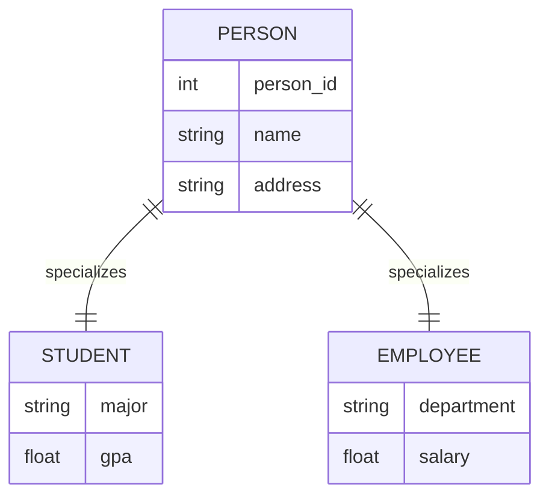

**મેમરી ટ્રીક:** "SG-TD-BU: સ્પેશિયલાઈઝેશન ગોઝ ટોપ-ડાઉન, જનરલાઈઝેશન બિલ્ડ્સ અપ"

## પ્રશ્ન 2(બ) OR [4 ગુણ]

**ચાસ્પ ટ્રેપની વ્યાખ્યા લખો. તે ક્યારે ઉદ્ભવે છે તે સમજાવો. ચાસ્પ ટ્રેપ માટેનો ઉપાય સમજાવો**

**જવાબ**:

**ચાસ્પ ટ્રેપ**: ER ડાયાગ્રામમાં ઉદ્ભવતી સમસ્યા જ્યારે એન્ટિટીઓ વચ્ચે મલ્ટિપલ પાથ હોય છે, જેથી રિલેશનશિપના અર્થઘટનમાં અસ્પષ્ટતા આવે છે.

| પાસું | વર્ણન |
|--------|-------------|
| **ઉદ્ભવ** | જ્યારે એન્ટિટી પ્રકારો વચ્ચે બે અથવા વધુ અલગ પાથ હોય જે ચક્ર બનાવે છે |
| **સમસ્યા** | અયોગ્ય અથવા અસ્પષ્ટ ક્વેરી પરિણામો તરફ દોરી જાય છે |
| **ઉકેલ** | એક રિલેશનશિપને તોડવું અથવા ઇચ્છિત પાથને સ્પષ્ટ કરવા માટે કન્સ્ટ્રેન્ટ્સ ઉમેરવા |

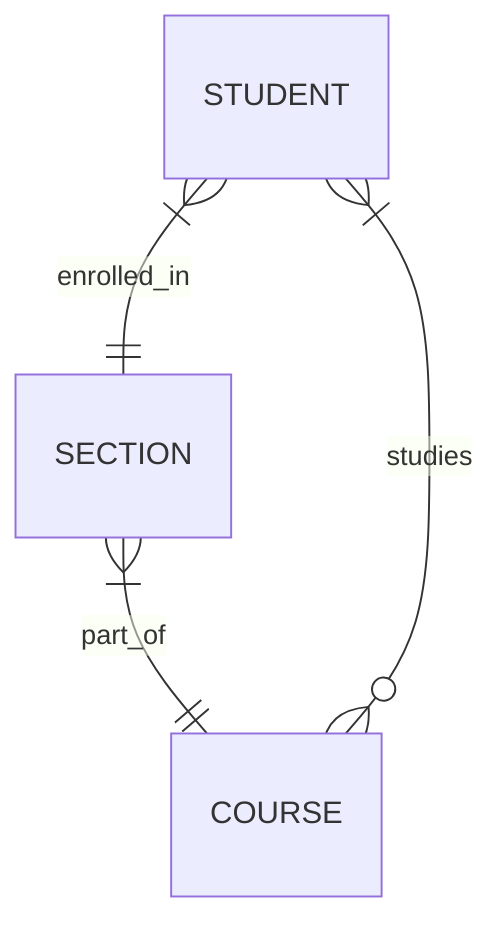

**મેમરી ટ્રીક:** "COP: સાયકલ્સ ઓફ પાથસ નીડ બ્રેકિંગ"

## પ્રશ્ન 2(ક) OR [7 ગુણ]

**કોલેજ મેનેજમેન્ટ સિસ્ટમ માટે E-R ડાયાગ્રામ બનાવો**

**જવાબ**:

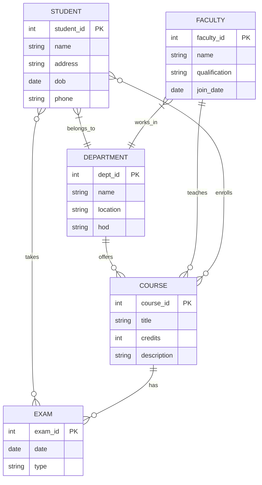

**મુખ્ય એન્ટિટીઝ અને રિલેશનશિપ્સ**:

- **વિદ્યાર્થી**: વિદ્યાર્થી વિગતો સંગ્રહિત કરે છે
- **વિભાગ**: શૈક્ષણિક વિભાગો
- **ફેકલ્ટી**: શિક્ષકો અને પ્રોફેસરો
- **કોર્સ**: ભણાવવામાં આવતા વિષયો
- **પરીક્ષા**: મૂલ્યાંકન કાર્યક્રમો
- **રિલેશનશિપ્સ**: વિદ્યાર્થીઓ કોર્સમાં એનરોલ થાય છે, ફેકલ્ટી કોર્સ શીખવે છે, વિભાગો કોર્સ ઓફર કરે છે

**મેમરી ટ્રીક:** "SDFCE: સ્ટુડન્ટ્સ ડિલાઇટ ફેકલ્ટી બાય કમ્પ્લીટિંગ એક્ઝામ્સ"

## પ્રશ્ન 3(અ) [3 ગુણ]

**GROUP BY ક્લોઝ ઉદાહરણ સાથે સમજાવો.**

**જવાબ**:

**GROUP BY** ક્લોઝ સમાન મૂલ્યો ધરાવતી રો સારાંશ રોમાં જૂથ કરે છે.

| ફીચર | વર્ણન |
|---------|-------------|
| **હેતુ** | એકસરખા ડેટાને એગ્રીગેટ ફંક્શન માટે જૂથોમાં ગોઠવે છે |
| **ઉપયોગ** | એગ્રીગેટ ફંક્શન (COUNT, SUM, AVG, MAX, MIN) સાથે વપરાય છે |
| **સિન્ટેક્સ** | SELECT column1, COUNT(*) FROM table GROUP BY column1; |

```sql
SELECT department, AVG(salary) 
FROM employees
GROUP BY department;
```

**મેમરી ટ્રીક:** "GAS: ગ્રુપ એન્ડ સમરાઈઝ"

## પ્રશ્ન 3(બ) [4 ગુણ]

**Data Definition Language (DDL) કમાન્ડની યાદી બનાવો. કોઈ પણ ૨ DDL કમાન્ડ ઉદાહરણ સાથે સમજાવો.**

**જવાબ**:

**DDL કમાન્ડ્સ**: CREATE, ALTER, DROP, TRUNCATE, RENAME

| કમાન્ડ | વર્ણન | ઉદાહરણ |
|---------|-------------|---------|
| **CREATE** | ડેટાબેઝ ઓબ્જેક્ટ્સ જેમ કે ટેબલ, વ્યૂ, ઇન્ડેક્સ બનાવે છે | `CREATE TABLE students (id INT PRIMARY KEY, name VARCHAR(50));` |
| **ALTER** | મૌજૂદા ડેટાબેઝ ઓબ્જેક્ટ્સ સુધારે છે | `ALTER TABLE students ADD COLUMN email VARCHAR(100);` |
| **DROP** | ડેટાબેઝ ઓબ્જેક્ટ્સ દૂર કરે છે | `DROP TABLE students;` |
| **TRUNCATE** | ટેબલમાંથી બધા રેકોર્ડ્સ દૂર કરે છે | `TRUNCATE TABLE students;` |

**મેમરી ટ્રીક:** "CADTR: ક્રિએટ, ઓલ્ટર, ડ્રોપ, ટ્રન્કેટ, રીનેમ"

## પ્રશ્ન 3(ક) [7 ગુણ]

**enr_no, name, percent, branch ફિલ્ડ ધરાવતા Students ટેબલ પર નીચેની Query perform કરો.**

**જવાબ**:

```sql
-- ૧. Students ટેબલના તમામ રેકોર્ડ ડિસ્પ્લે કરો.
SELECT * FROM Students;

-- ૨. ડુપ્લીકેટ વેલ્યુ સિવાય માત્ર branch ડિસ્પ્લે કરો.
SELECT DISTINCT branch FROM Students;

-- ૩. name નાં ઉતરતા ક્રમમાં તમામ રેકોર્ડ ડિસ્પ્લે કરો.
SELECT * FROM Students ORDER BY name DESC;

-- ૪. સરનામું સ્ટોર કરવા માટે "address" નામથી નવી કોલમ ઉમેરો.
ALTER TABLE Students ADD address VARCHAR(100);

-- ૫. "ICT" બ્રાંચ ધરાવતા બધા વિદ્યાર્થીને ડિસ્પ્લે કરો.
SELECT * FROM Students WHERE branch = 'ICT';

-- ૬. ૬૦ કરતા ઓછા percent ધરાવતા વિદ્યાર્થીઓને ડીલીટ કરો.
DELETE FROM Students WHERE percent < 60;

-- ૭. "S" થી શરૂ થતા તમામ વિદ્યાર્થીઓના નામ ડિસ્પ્લે કરો.
SELECT * FROM Students WHERE name LIKE 'S%';
```

| ક્વેરી | હેતુ |
|-------|---------|
| **SELECT** | ટેબલમાંથી ડેટા મેળવે છે |
| **DISTINCT** | ડુપ્લિકેટ મૂલ્યો દૂર કરે છે |
| **ORDER BY** | પરિણામોને ચોક્કસ ક્રમમાં ગોઠવે છે |
| **ALTER TABLE** | ટેબલ સ્ટ્રક્ચર સુધારે છે |
| **WHERE** | શરતો પર આધારિત રેકોર્ડ્સ ફિલ્ટર કરે છે |
| **DELETE** | શરતો મેળવતા રેકોર્ડ્સ દૂર કરે છે |
| **LIKE** | સ્ટ્રિંગ તુલનામાં પેટર્ન મેચિંગ |

**મેમરી ટ્રીક:** "SDOAWDL: સિલેક્ટ ડિસ્ટિંક્ટ ઓર્ડર ઓલ્ટર વ્હેર ડિલીટ લાઇક"

## પ્રશ્ન 3(અ) OR [3 ગુણ]

**સિન્ટેક્સ અને ઉદાહરણ સાથે GRANT કમાન્ડ સમજાવો.**

**જવાબ**:

**GRANT** કમાન્ડ વપરાશકર્તાઓને ડેટાબેઝ ઓબ્જેક્ટ્સ પર ચોક્કસ અધિકારો આપે છે.

| ઘટક | વર્ણન |
|-----------|-------------|
| **સિન્ટેક્સ** | `GRANT privilege(s) ON object TO user [WITH GRANT OPTION];` |
| **પ્રિવિલેજીસ** | SELECT, INSERT, UPDATE, DELETE, ALL PRIVILEGES |
| **ઓબ્જેક્ટ્સ** | ટેબલ્સ, વ્યૂ, સિક્વેન્સિસ, વગેરે |

```sql
GRANT SELECT, UPDATE ON employees TO user1;
GRANT ALL PRIVILEGES ON database_name.* TO user2 WITH GRANT OPTION;
```

**મેમરી ટ્રીક:** "GPO: ગ્રાન્ટ પ્રિવિલેજીસ ટુ અધર્સ"

## પ્રશ્ન 3(બ) OR [4 ગુણ]

**Truncate અને Drop કમાન્ડનો તફાવત લખો.**

**જવાબ**:

| ફીચર | TRUNCATE | DROP |
|---------|----------|------|
| **હેતુ** | ટેબલથી બધી પંક્તિઓ દૂર કરે છે | સંપૂર્ણ ટેબલ સ્ટ્રક્ચર દૂર કરે છે |
| **સ્ટ્રક્ચર** | ટેબલ સ્ટ્રક્ચર જાળવી રાખે છે | ટેબલની વ્યાખ્યા સંપૂર્ણપણે દૂર કરે છે |
| **રિકવરી** | સરળતાથી રોલબેક નથી કરી શકાતું | કમિટ થાય ત્યાં સુધી પુનઃપ્રાપ્ત કરી શકાય છે |
| **સ્પીડ** | DELETE કરતાં ઝડપી | ઝડપી ઓપરેશન |
| **ટ્રિગર્સ** | ટ્રિગર્સ સક્રિય કરતું નથી | ટ્રિગર્સ સક્રિય કરતું નથી |

```sql
-- Truncate ઉદાહરણ
TRUNCATE TABLE students;

-- Drop ઉદાહરણ
DROP TABLE students;
```

**મેમરી ટ્રીક:** "TRC-DST: ટ્રન્કેટ રિમૂવ્સ કન્ટેન્ટ્સ, ડ્રોપ ડિસ્ટ્રોય્સ સ્ટ્રક્ચર ટોટલી"

## પ્રશ્ન 3(ક) OR [7 ગુણ]

**નીચેની Query ના આઉટપુટ લખો.**

**જવાબ**:

| ક્વેરી | આઉટપુટ | સમજૂતી |
|-------|--------|-------------|
| **ABS(-23), ABS(49)** | 23, 49 | નિરપેક્ષ મૂલ્ય પાછું આપે છે |
| **SQRT(25), SQRT(81)** | 5, 9 | વર્ગમૂળ પાછું આપે છે |
| **POWER(3,2), POWER(-2,3)** | 9, -8 | x^y (પ્રથમ મૂલ્યને બીજા મૂલ્યની પાવર સુધી ઉંચકે છે) |
| **MOD(15,4), MOD(21,3)** | 3, 0 | વિભાજન પછી શેષ પાછો આપે છે |
| **ROUND(123.446,1), ROUND(123.456,2)** | 123.4, 123.46 | ચોક્કસ દશાંશ જગ્યાઓ પર રાઉન્ડ કરે છે |
| **CEIL(234.45), CEIL(-234.45)** | 235, -234 | નજીકના પૂર્ણાંક સુધી ઉપર રાઉન્ડ કરે છે |
| **FLOOR(-12.7), FLOOR(12.7)** | -13, 12 | નજીકના પૂર્ણાંક સુધી નીચે રાઉન્ડ કરે છે |

```sql
SELECT ABS(-23), ABS(49);          -- 23, 49
SELECT SQRT(25), SQRT(81);         -- 5, 9
SELECT POWER(3,2), POWER(-2,3);    -- 9, -8
SELECT MOD(15,4), MOD(21,3);       -- 3, 0
SELECT ROUND(123.446,1), ROUND(123.456,2); -- 123.4, 123.46
SELECT CEIL(234.45), CEIL(-234.45);  -- 235, -234
SELECT FLOOR(-12.7), FLOOR(12.7);    -- -13, 12
```

**મેમરી ટ્રીક:** "ASPMRCF: એબ્સોલ્યુટ સ્ક્વેર પાવર મોડ્યુલો રાઉન્ડ સીલિંગ ફ્લોર"

## પ્રશ્ન 4(અ) [3 ગુણ]

**SQLમાં ડેટા ટાઈપની યાદી બનાવો. કોઈ પણ ૨ ડેટા ટાઈપ ઉદાહરણ સાથે સમજાવો.**

**જવાબ**:

**SQL ડેટા ટાઈપ**: INTEGER, FLOAT, VARCHAR, CHAR, DATE, DATETIME, BOOLEAN, BLOB

| ડેટા ટાઈપ | વર્ણન | ઉદાહરણ |
|-----------|-------------|---------|
| **INTEGER** | દશાંશ પોઇન્ટ વિના પૂર્ણ સંખ્યાઓ | `id INTEGER = 101` |
| **VARCHAR** | પરિવર્તનશીલ-લંબાઈ સ્ટ્રિંગ | `name VARCHAR(50) = 'John'` |
| **DATE** | તારીખ મૂલ્યો સંગ્રહિત કરે છે (YYYY-MM-DD) | `birth_date DATE = '2000-05-15'` |
| **FLOAT** | ફ્લોટિંગ પોઇન્ટ સાથે દશાંશ સંખ્યાઓ | `salary FLOAT = 45000.50` |

```sql
CREATE TABLE employees (
    id INTEGER,
    name VARCHAR(50),
    salary FLOAT
);
```

**મેમરી ટ્રીક:** "IVDB: ઈન્ટિજર અને વારચાર આર ડેટાબેઝ બેસિક્સ"

## પ્રશ્ન 4(બ) [4 ગુણ]

**Full function dependency ઉદાહરણ સાથે સમજાવો.**

**જવાબ**:

**Full Function Dependency**: જ્યારે Y, X પર ફંક્શનલી ડિપેન્ડન્ટ હોય, પરંતુ X ના કોઈ સબસેટ પર નહીં.

| વિચાર | વર્ણન | ઉદાહરણ |
|---------|-------------|---------|
| **વ્યાખ્યા** | એટ્રિબ્યુટ B, A પર પૂર્ણપણે ફંક્શનલી ડિપેન્ડન્ટ છે જો B સંપૂર્ણ A પર આધાર રાખે છે | Student_ID → Name (પૂર્ણ ડિપેન્ડન્સી) |
| **નોન-ઉદાહરણ** | જ્યારે એટ્રિબ્યુટ કોમ્પોઝિટ કીના માત્ર ભાગ પર આધાર રાખે છે | {Student_ID, Course_ID} → Student_Name (આંશિક) |

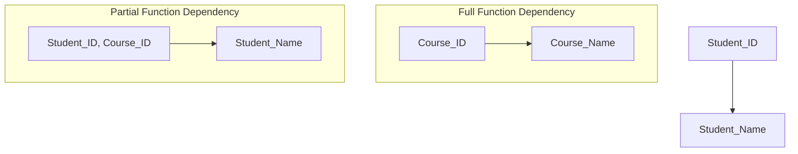

**મેમરી ટ્રીક:** "FFD: ફુલ, નોટ ફ્રેક્શન ઓફ ડિપેન્ડન્સી"

## પ્રશ્ન 4(ક) [7 ગુણ]

**નોર્મલાઇઝેશનની વ્યાખ્યા આપો. 2NF (સેકન્ડ નોર્મલ ફોર્મ) ઉદાહરણ અને ઉકેલ સાથે સમજાવો.**

**જવાબ**:

**નોર્મલાઈઝેશન**: ડેટાબેઝની રચના કરવાની પ્રક્રિયા જેથી મોટા ટેબલને નાના ટેબલોમાં વિભાજિત કરીને અને તેમની વચ્ચે સંબંધો વ્યાખ્યાયિત કરીને, રિડન્ડન્સી અને ડિપેન્ડન્સી ઘટાડવામાં આવે.

**2NF (સેકન્ડ નોર્મલ ફોર્મ)**:

- ટેબલ 2NF માં છે જો તે 1NF માં હોય અને કોઈ નોન-પ્રાઇમ એટ્રિબ્યુટ કેન્ડિડેટ કીના કોઈ પણ યોગ્ય સબસેટ પર આધાર રાખતું ન હોય.

| 2NF પહેલાં | સમસ્યા |
|------------|---------|
| **Order(Order_ID, Product_ID, Product_Name, Quantity, Price)** | Product_Name માત્ર Product_ID પર આધાર રાખે છે, સંપૂર્ણ કી પર નહીં |

| 2NF પછી | ઉકેલ |
|-----------|----------|
| **Order(Order_ID, Product_ID, Quantity)** | માત્ર પૂર્ણ કી ડિપેન્ડન્સી |
| **Product(Product_ID, Product_Name, Price)** | પ્રોડક્ટ વિગતો માત્ર Product_ID પર આધાર રાખે છે |

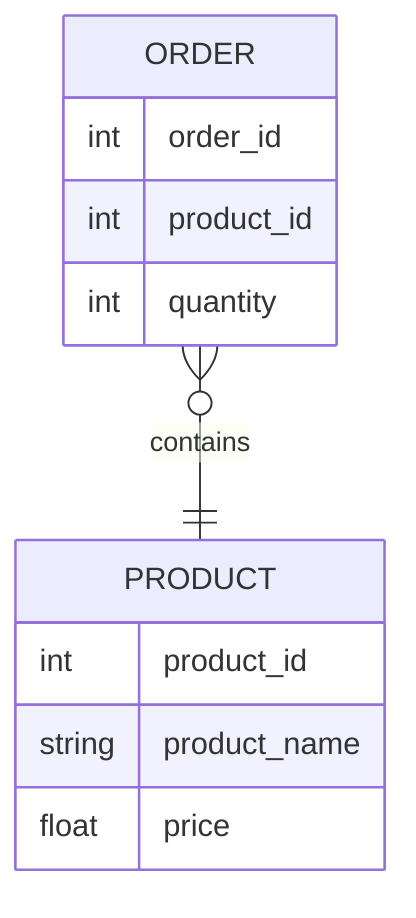

**મેમરી ટ્રીક:** "2NF-PPD: પાર્શિયલ ડિપેન્ડન્સી પ્રોબ્લેમ્સ ડિવાઇડેડ"

## પ્રશ્ન 4(અ) OR [3 ગુણ]

**કમાન્ડ સમજાવવો. ૧) To_Number (), ૨) To_Char()**

**જવાબ**:

| ફંક્શન | હેતુ | સિન્ટેક્સ | ઉદાહરણ |
|----------|---------|--------|---------|
| **TO_NUMBER()** | સ્ટ્રિંગને નંબરમાં રૂપાંતરિત કરે છે | `TO_NUMBER(string, [format])` | `TO_NUMBER('123.45') = 123.45` |
| **TO_CHAR()** | નંબર/તારીખને સ્ટ્રિંગમાં રૂપાંતરિત કરે છે | `TO_CHAR(value, [format])` | `TO_CHAR(1234, '9999') = '1234'` |

```sql
-- સ્ટ્રિંગને નંબરમાં રૂપાંતરિત કરે છે
SELECT TO_NUMBER('123.45') FROM dual;  -- 123.45

-- તારીખને ફોર્મેટેડ સ્ટ્રિંગમાં રૂપાંતરિત કરે છે
SELECT TO_CHAR(SYSDATE, 'DD-MON-YYYY') FROM dual;  -- 20-JAN-2024

-- નંબરને ફોર્મેટેડ સ્ટ્રિંગમાં રૂપાંતરિત કરે છે
SELECT TO_CHAR(1234.56, '$9,999.99') FROM dual;  -- $1,234.56
```

**મેમરી ટ્રીક:** "NC: નંબર્સ એન્ડ કેરેક્ટર્સ કન્વર્ઝન"

## પ્રશ્ન 4(બ) OR [4 ગુણ]

**1NF (ફર્સ્ટ નોર્મલ ફોર્મ) ઉદાહરણ અને ઉકેલ સાથે સમજાવો.**

**જવાબ**:

**1NF (ફર્સ્ટ નોર્મલ ફોર્મ)**: એક રિલેશન 1NF માં છે જો તેમાં કોઈ રિપીટિંગ ગ્રુપ્સ અથવા એરે ન હોય.

| 1NF પહેલાં | સમસ્યા |
|------------|---------|
| **Student(ID, Name, Courses)** | Courses કોલમમાં મલ્ટિપલ વેલ્યુ છે |
| **ઉદાહરણ**: (101, John, "Math,Science,History") | મલ્ટી-વેલ્યુડ એટ્રિબ્યુટ |

| 1NF પછી | ઉકેલ |
|-----------|----------|
| **Student(ID, Name, Course)** | દરેક રોમાં એક કોર્સ |
| **ઉદાહરણો**: (101, John, Math), (101, John, Science), (101, John, History) | એટોમિક વેલ્યુઝ |

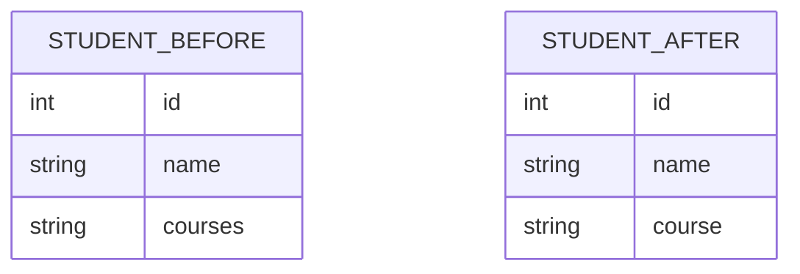

**મેમરી ટ્રીક:** "1NF-ARM: એટોમિક વેલ્યુઝ રિમૂવ મલ્ટિવેલ્યુઝ"

## પ્રશ્ન 4(ક) OR [7 ગુણ]

**SQL માં Function dependency સમજાવો. Partial function dependency ઉદાહરણ સાથે સમજાવો.**

**જવાબ**:

**ફંક્શનલ ડિપેન્ડન્સી**: એક સંબંધ જ્યાં એક એટ્રિબ્યુટ બીજા એટ્રિબ્યુટનું મૂલ્ય નક્કી કરે છે.

**નોટેશન**: X → Y (X, Y ને નક્કી કરે છે)

**પાર્શિયલ ફંક્શનલ ડિપેન્ડન્સી**: જ્યારે એક એટ્રિબ્યુટ કમ્પોઝિટ પ્રાઇમરી કીના માત્ર એક ભાગ પર આધાર રાખે છે.

| વિચાર | ઉદાહરણ | સમજૂતી |
|---------|---------|-------------|
| **કમ્પોઝિટ કી** | {Student_ID, Course_ID} | સાથે મળીને પ્રાઇમરી કી બનાવે છે |
| **પાર્શિયલ ડિપેન્ડન્સી** | {Student_ID, Course_ID} → Student_Name | Student_Name માત્ર Student_ID પર આધાર રાખે છે |
| **સમસ્યા** | અપડેટ એનોમલીઝ, ડેટા રિડન્ડન્સી | એક જ વિદ્યાર્થીનું નામ ઘણા બધા કોર્સ માટે પુનરાવર્તિત થાય છે |

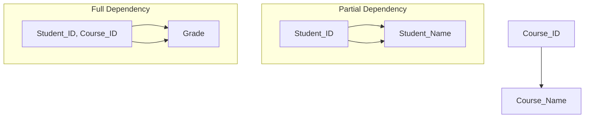

**ઉકેલ**: અલગ ટેબલોમાં વિભાજિત કરો જ્યાં દરેક નોન-કી એટ્રિબ્યુટ કી પર સંપૂર્ણપણે આધારિત હોય.

**મેમરી ટ્રીક:** "PD-CPK: પાર્શિયલ ડિપેન્ડન્સી - કમ્પોનન્ટ ઓફ પ્રાઇમરી કી"

## પ્રશ્ન 5(અ) [3 ગુણ]

**Transaction નાં ગુણધર્મો ઉદાહરણ સાથે સમજાવો.**

**જવાબ**:

**Transaction ગુણધર્મો** (ACID):

| ગુણધર્મ | વર્ણન | ઉદાહરણ |
|----------|-------------|---------|
| **એટોમિસિટી** | બધા ઓપરેશનો સફળતાપૂર્વક પૂર્ણ થાય છે અથવા એક પણ થતું નથી | બેંક ટ્રાન્સફર: ડેબિટ અને ક્રેડિટ બંને થાય અથવા બંને ન થાય |
| **કન્સિસ્ટન્સી** | ડેટાબેઝ પહેલા અને પછી માન્ય સ્થિતિમાં રહે છે | એકાઉન્ટ બેલેન્સ કન્સ્ટ્રેન્ટ્સ માન્ય રહે છે |
| **આઇસોલેશન** | ટ્રાન્ઝેક્શન એવી રીતે એક્ઝિક્યુટ થાય છે જાણે તે એકમાત્ર હોય | બે યુઝર એક જ રેકોર્ડ અપડેટ કરી રહ્યા હોય ત્યારે દખલ કરતા નથી |
| **ડ્યુરેબિલિટી** | કમિટ કરેલા ફેરફારો સિસ્ટમ નિષ્ફળતા પછી પણ ટકી રહે છે | એકવાર પુષ્ટિ થઈ જાય, પછી વીજળી જતી રહે તો પણ ડિપોઝિટ યથાવત રહે છે |

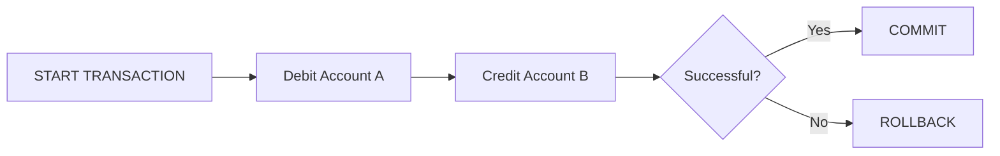

**મેમરી ટ્રીક:** "ACID: એટોમિસિટી, કન્સિસ્ટન્સી, આઇસોલેશન, ડ્યુરેબિલિટી"

## પ્રશ્ન 5(બ) [4 ગુણ]

**ઉપર Q.5 (b) માં આપેલ "Students" અને "CR" ટેબલનો ઉપયોગ કરીને સેટ ઓપરેટર દ્વારા નીચેની Query લખો.**

**જવાબ**:

```sql
-- ૧. Students અથવા CR હોય તેવા વ્યક્તિઓની યાદી બનાવો.
SELECT Stnd_Name FROM Student
UNION
SELECT CR_Name FROM CR;

-- ૨. Students અને CR હોય તેવા વ્યક્તિઓની યાદી બનાવો.
SELECT Stnd_Name FROM Student
INTERSECT
SELECT CR_Name FROM CR;

-- ૩. Students હોય અને CR ન હોય માત્ર તેવા વ્યક્તિઓની યાદી બનાવો.
SELECT Stnd_Name FROM Student
MINUS
SELECT CR_Name FROM CR;

-- ૪. CR હોય અને Student ન હોય માત્ર તેવા વ્યક્તિઓની યાદી બનાવો.
SELECT CR_Name FROM CR
MINUS
SELECT Stnd_Name FROM Student;
```

| સેટ ઓપરેટર | હેતુ | ઉદાહરણ માટે પરિણામ |
|--------------|---------|-------------------|
| **UNION** | બધી અલગ રો જોડે છે | Manoj, Rahil, Jiya, Rina, Jitesh, Priya |
| **INTERSECT** | માત્ર સામાન્ય રો પરત કરે છે | Manoj, Rina |
| **MINUS** | પ્રથમ સેટમાં હોય પણ બીજા સેટમાં ન હોય તે રો | Rahil, Jiya |
| **MINUS (ઊલટું)** | બીજા સેટમાં હોય પણ પહેલા સેટમાં ન હોય તે રો | Jitesh, Priya |

**મેમરી ટ્રીક:** "UIMD: યુનિયન ઇન્ક્લૂડ્સ, માઈનસ ડિવાઈડ્સ"

## પ્રશ્ન 5(ક) [7 ગુણ]

**Conflict serializability વિસ્તારથી સમજાવો.**

**જવાબ**:

**Conflict Serializability**: એક શેડ્યૂલ કન્ફ્લિક્ટ સીરિયલાઇઝેબલ છે જો તેને નોન-કન્ફ્લિક્ટિંગ ઓપરેશન્સને સ્વેપ કરીને સીરિયલ શેડ્યૂલમાં રૂપાંતરિત કરી શકાય.

| મુખ્ય વિચારો | વર્ણન |
|--------------|-------------|
| **કન્ફ્લિક્ટ ઓપરેશન્સ** | બે ઓપરેશન કન્ફ્લિક્ટ કરે છે જો તેઓ એક જ ડેટા આઇટમને એક્સેસ કરે છે અને ઓછામાં ઓછું એક રાઇટ હોય |
| **પ્રીસિડન્સ ગ્રાફ** | ટ્રાન્ઝેક્શન વચ્ચેના કન્ફ્લિક્ટને દર્શાવતો ડાયરેક્ટેડ ગ્રાફ |
| **સીરિયલાઇઝેબલ** | જો પ્રીસિડન્સ ગ્રાફમાં કોઈ સાયકલ ન હોય, તો શેડ્યૂલ કન્ફ્લિક્ટ સીરિયલાઇઝેબલ છે |

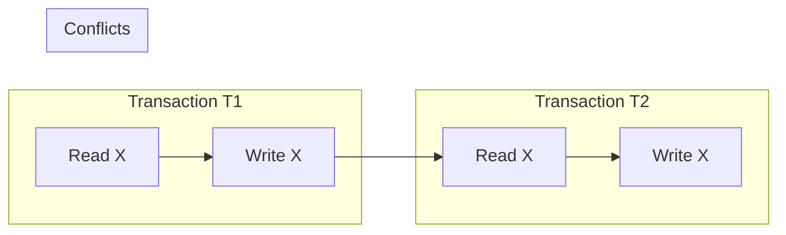

**ઉદાહરણ**:

- T1: R(X), W(X)
- T2: R(X), W(X)

**સીરિયલાઇઝેબલ શેડ્યૂલ્સ**:

- T1 બાદ T2: R1(X), W1(X), R2(X), W2(X)
- T2 બાદ T1: R2(X), W2(X), R1(X), W1(X)

**નોન-સીરિયલાઇઝેબલ**: R1(X), R2(X), W1(X), W2(X) - પ્રીસિડન્સ ગ્રાફમાં સાયકલ બનાવે છે

**મેમરી ટ્રીક:** "COPS: કન્ફ્લિક્ટ ઓપરેશન્સ પ્રોડ્યુસ સીરિયલાઇઝેબિલિટી"

## પ્રશ્ન 5(અ) OR [3 ગુણ]

**Transaction નો concept ઉદાહરણ સાથે સમજાવો.**

**જવાબ**:

**ટ્રાન્ઝેક્શન**: કામની એક તાર્કિક એકમ જે સંપૂર્ણપણે કરવું અથવા સંપૂર્ણપણે અનડૂ કરવું આવશ્યક છે.

| ટ્રાન્ઝેક્શન તબક્કાઓ | વર્ણન | ઉદાહરણ |
|-------------------|-------------|---------|
| **BEGIN** | ટ્રાન્ઝેક્શનની શરૂઆત ચિહ્નિત કરે છે | START TRANSACTION |
| **ઓપરેશન્સ એક્ઝિક્યુટ** | ડેટાબેઝ ઓપરેશન્સ (રીડ/રાઇટ) | UPDATE account SET balance = balance - 1000 WHERE id = 123 |
| **COMMIT/ROLLBACK** | સફળતા/નિષ્ફળતા સાથે ટ્રાન્ઝેક્શન સમાપ્ત કરે છે | COMMIT અથવા ROLLBACK |

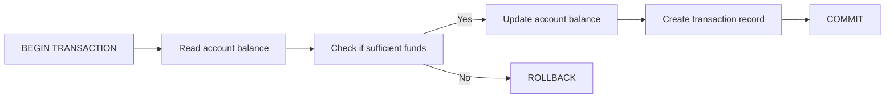

**ઉદાહરણ**:
```sql
BEGIN TRANSACTION;
UPDATE accounts SET balance = balance - 1000 WHERE acc_no = 123;
UPDATE accounts SET balance = balance + 1000 WHERE acc_no = 456;
COMMIT;
```

**મેમરી ટ્રીક:** "BEC: બિગિન, એક્ઝિક્યુટ, કમિટ"

## પ્રશ્ન 5(બ) OR [4 ગુણ]

**Equi-join સિન્ટેક્સ અને ઉદાહરણ સાથે સમજાવો.**

**જવાબ**:

**Equi-join**: એક જોઈન ઓપરેશન જે સમાનતા કમ્પેરિઝન ઓપરેટરનો ઉપયોગ કરે છે.

| ફીચર | વર્ણન |
|---------|-------------|
| **સિન્ટેક્સ** | `SELECT columns FROM table1, table2 WHERE table1.column = table2.column;` |
| **હેતુ** | મેચિંગ કોલમ વેલ્યુના આધારે બે ટેબલમાંથી રો જોડે છે |
| **વૈકલ્પિક** | `SELECT columns FROM table1 INNER JOIN table2 ON table1.column = table2.column;` |

```sql
-- પરંપરાગત સિન્ટેક્સ
SELECT s.name, d.dept_name 
FROM students s, departments d 
WHERE s.dept_id = d.dept_id;

-- INNER JOIN સિન્ટેક્સ
SELECT s.name, d.dept_name 
FROM students s INNER JOIN departments d 
ON s.dept_id = d.dept_id;
```

**મેમરી ટ્રીક:** "EQ-ME: ઇક્વાલિટી મેચિસ એન્ટ્રીસ"

## પ્રશ્ન 5(ક) OR [7 ગુણ]

**View serializability વિસ્તારથી સમજાવો.**

**જવાબ**:

**View Serializability**: એક શેડ્યૂલ વ્યૂ સીરિયલાઇઝેબલ છે જો તે કોઈ સીરિયલ શેડ્યૂલ સાથે વ્યૂ ઇક્વિવેલન્ટ હોય.

| શરત | વર્ણન |
|-----------|-------------|
| **ઇનિશિયલ રીડ** | જો T1 શેડ્યૂલ S માં ડેટા આઇટમ X ની પ્રારંભિક વેલ્યુ વાંચે છે, તો તેણે S' શેડ્યૂલમાં પણ પ્રારંભિક વેલ્યુ વાંચવી જોઈએ |
| **ફાઇનલ રાઇટ** | જો T1, S માં ડેટા આઇટમ X નું અંતિમ લખાણ કરે છે, તો તેણે S' માં પણ અંતિમ લખાણ કરવું જોઈએ |
| **ડિપેન્ડન્સી પ્રિઝર્વેશન** | જો T1, S માં T2 દ્વારા લખાયેલ X ની વેલ્યુ વાંચે છે, તો તેણે S' માં પણ T2 પાસેથી વાંચવું જોઈએ |

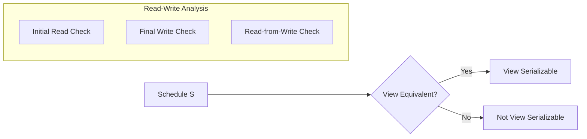

**તુલના**:

- **કન્ફ્લિક્ટ સીરિયલાઇઝેબિલિટી**: વધુ પ્રતિબંધિત, પરીક્ષણ કરવું સરળ (પ્રીસિડન્સ ગ્રાફ)
- **વ્યૂ સીરિયલાઇઝેબિલિટી**: વધુ સામાન્ય, પરીક્ષણ કરવું વધુ મુશ્કેલ (NP-કમ્પ્લીટ)

**વ્યૂ સીરિયલાઇઝેબલ પરંતુ કન્ફ્લિક્ટ સીરિયલાઇઝેબલ નહીં તેનું ઉદાહરણ**:

- T1: W(X)
- T2: W(X)
- T3: R(X)
- શેડ્યૂલ: W1(X), W2(X), R3(X) - સીરિયલ શેડ્યૂલ T2,T1,T3 સાથે વ્યૂ ઇક્વિવેલન્ટ

**મેમરી ટ્રીક:** "VIR-FF: વ્યૂ પ્રિઝર્વ્સ ઇનિશિયલ રીડ્સ એન્ડ ફાઇનલ રાઇટ્સ"
