## Question 1(a) [3 marks]

**Define: Field, Record, Metadata**

**Answer**:

| Term | Definition |
|------|------------|
| **Field** | A single unit of data representing a specific attribute in a database table (e.g., name, age, ID) |
| **Record** | A complete set of related fields that represents one entity instance (a row in a table) |
| **Metadata** | Data that describes the structure, properties, and relationships of other data ("data about data") |

**Mnemonic:** "FRM: Fields Row-up as Metadata"

## Question 1(b) [4 marks]

**Define (i) E-R model (ii) Entity (iii) Entity set and (iv) attributes**

**Answer**:

| Term | Definition |
|------|------------|
| **E-R Model** | A graphical approach to database design that models entities, their attributes, and relationships |
| **Entity** | A real-world object, concept, or thing that has an independent existence |
| **Entity Set** | A collection of similar entities that share the same attributes (represented as a table) |
| **Attributes** | Properties or characteristics that describe an entity (represented as columns in tables) |

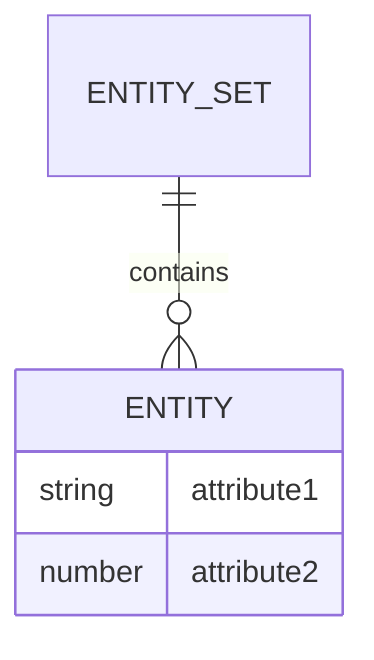

**Mnemonic:** "EEAA: Entities Exist As Attributes"

## Question 1(c) [7 marks]

**List the advantages and disadvantages of DBMS.**

**Answer**:

| Advantages | Disadvantages |
|------------|---------------|
| **Data sharing**: Multiple users can access simultaneously | **Cost**: Expensive hardware/software requirements |
| **Data integrity**: Maintains accuracy through constraints | **Complexity**: Requires specialized training |
| **Data security**: Controls access through permissions | **Performance**: Can be slow for large databases |
| **Data independence**: Changes to storage don't affect apps | **Vulnerability**: Central failure point risks data loss |
| **Reduced redundancy**: Eliminates duplicate data | **Conversion costs**: Migrating from file systems is expensive |

**Mnemonic:** "SIDSR vs CCPVC" (Sharing, Integrity, Data independence, Security, Redundancy vs Cost, Complexity, Performance, Vulnerability, Conversion)

## Question 1(c) OR [7 marks]

**Write the full form of DBA. Explain the roles and responsibilities of DBA.**

**Answer**:

**DBA**: Database Administrator

| Responsibilities of DBA |
|-------------------------|
| **Database design**: Creates efficient database schema |
| **Security management**: Sets up user access controls |
| **Performance tuning**: Optimizes queries and indexes |
| **Backup & recovery**: Implements data protection plans |
| **Maintenance**: Updates software and applies patches |
| **Troubleshooting**: Resolves database issues |
| **User support**: Trains and assists database users |

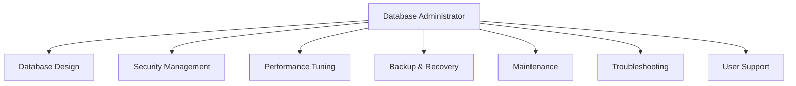

**Mnemonic:** "SPBT-MUS" (Security, Performance, Backup, Troubleshooting, Maintenance, User support)

## Question 2(a) [3 marks]

**Explain single valued v/s multi-valued attributes with suitable examples**

**Answer**:

| Attribute Type | Description | Examples |
|----------------|-------------|----------|
| **Single-valued** | Holds only one value for each entity instance | Employee ID, Birth Date, Name |
| **Multi-valued** | Can hold multiple values for the same entity | Phone Numbers, Skills, Email Addresses |

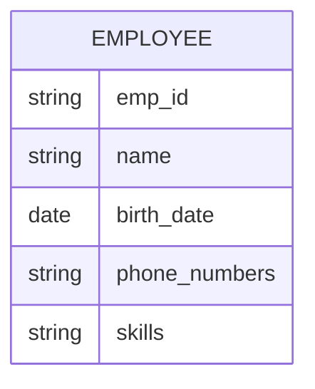

**Mnemonic:** "SIM: Single Is Minimal, Multi Is Many"

## Question 2(b) [4 marks]

**Explain Key Constraints for E-R diagram**

**Answer**:

| Key Constraint | Description |
|----------------|-------------|
| **Primary Key** | Uniquely identifies each entity in an entity set |
| **Candidate Key** | Any attribute that could serve as a primary key |
| **Foreign Key** | References primary key of another entity set |
| **Super Key** | Any set of attributes that uniquely identifies an entity |

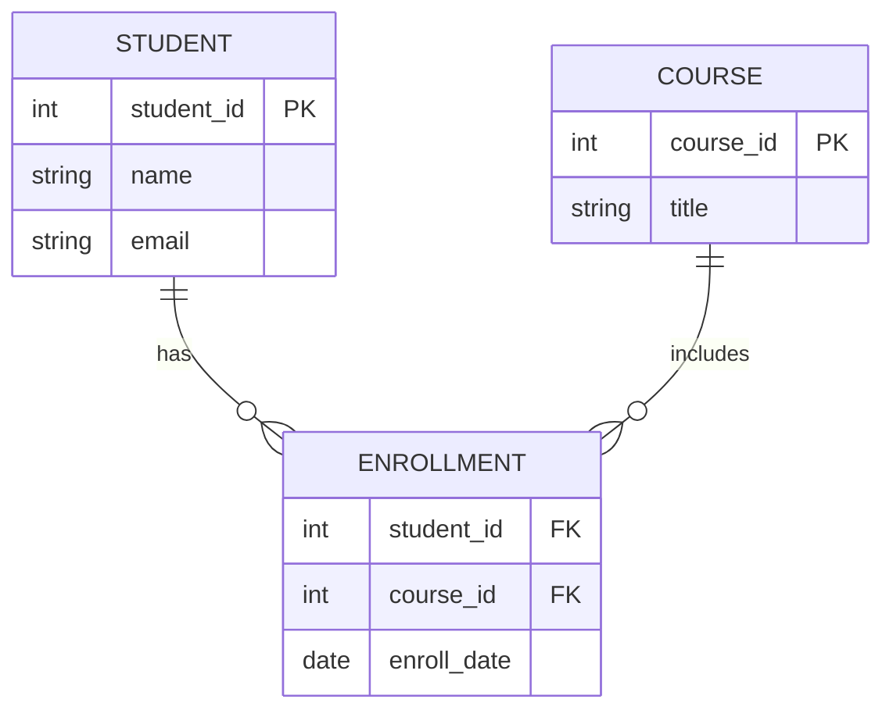

**Mnemonic:** "PCFS: Primary Candidates Find Superkeys"

## Question 2(c) [7 marks]

**Construct an E-R diagram for banking management system.**

**Answer**:

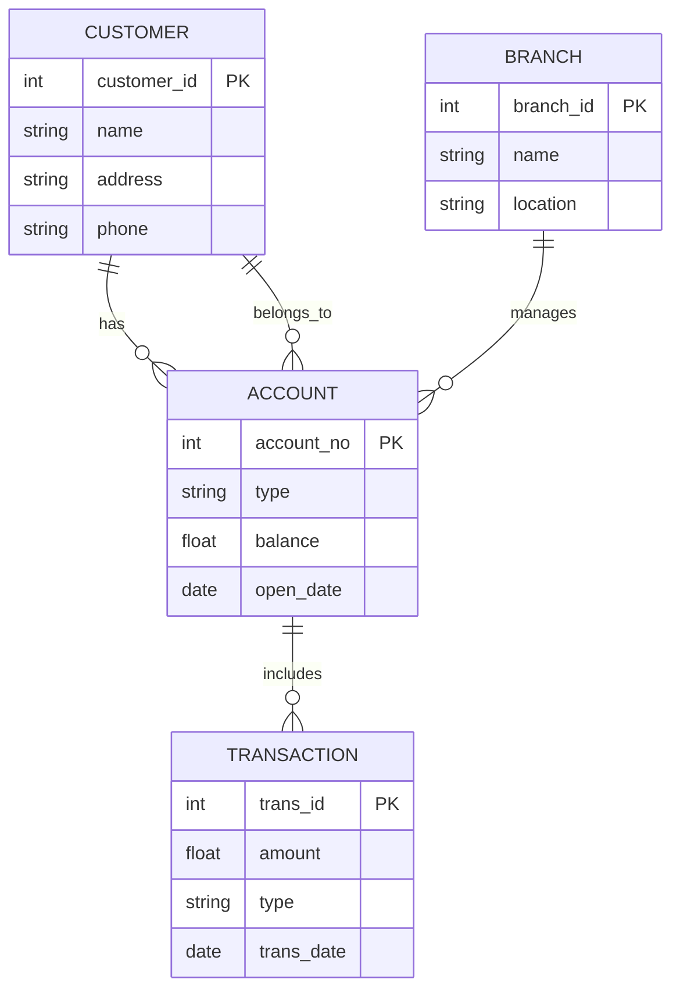

**Key Entities and Relationships**:

- **Customer**: Stores customer information
- **Account**: Different account types (savings, checking)
- **Transaction**: Records deposits, withdrawals
- **Branch**: Different bank locations
- **Relationships**: Customers have accounts, accounts have transactions, branches manage accounts

**Mnemonic:** "CATB: Customers Access Transactions at Branches"

## Question 2(a) OR [3 marks]

**Explain specialization v/s generalization with suitable examples**

**Answer**:

| Concept | Direction | Description | Example |
|---------|-----------|-------------|---------|
| **Specialization** | Top-down | Breaking a general entity into more specific sub-entities | Person → Student, Employee |
| **Generalization** | Bottom-up | Combining similar entities into a higher-level entity | Car, Truck → Vehicle |

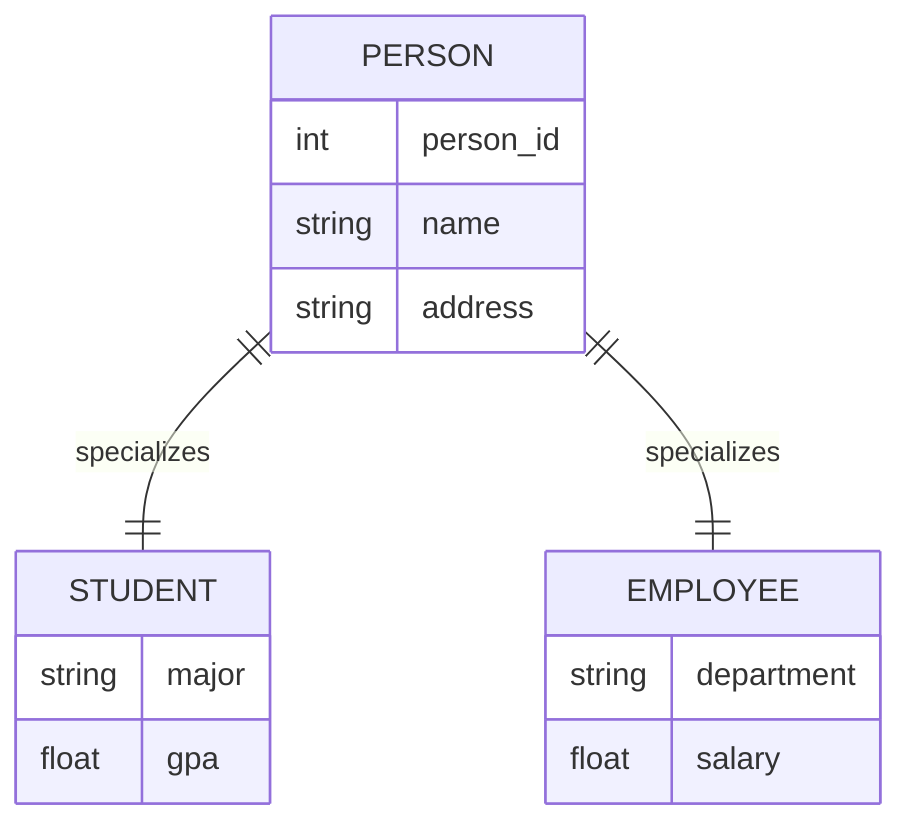

**Mnemonic:** "SG-TD-BU: Specialization Goes Top-Down, Generalization Builds Up"

## Question 2(b) OR [4 marks]

**Define Chasp trap. Explain when it occurs. Explain the solution for Chasp trap**

**Answer**:

**Chasp trap**: A problem that occurs in ER diagrams when there are multiple paths between entities, causing ambiguity in relationship interpretations.

| Aspect | Description |
|--------|-------------|
| **Occurrence** | When there are two or more distinct paths between entity types creating a cycle |
| **Problem** | Leads to incorrect or ambiguous query results |
| **Solution** | Break one of the relationships or add constraints to clarify the intended path |

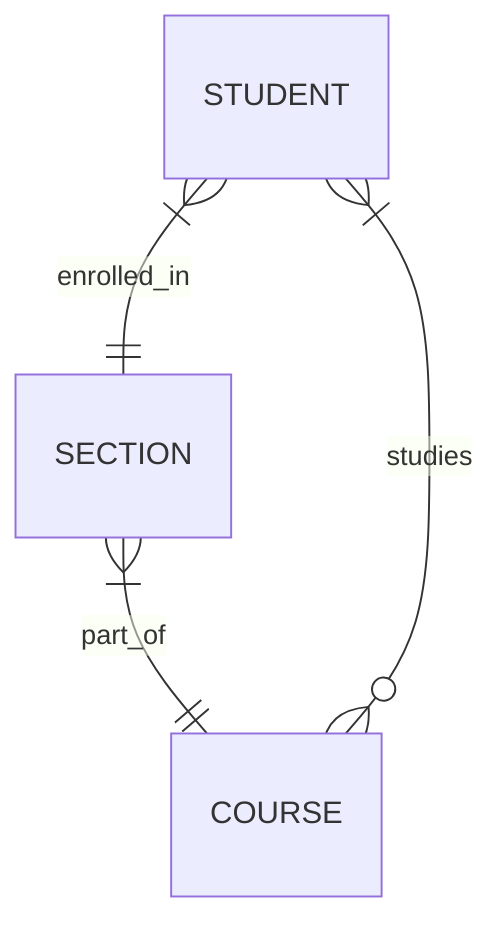

**Mnemonic:** "COP: Cycles Of Paths need breaking"

## Question 2(c) OR [7 marks]

**Construct an E-R diagram for college management system.**

**Answer**:

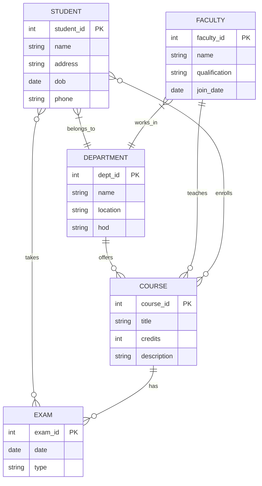

**Key Entities and Relationships**:

- **Student**: Stores student details
- **Department**: Academic divisions
- **Faculty**: Teachers and professors
- **Course**: Subjects taught
- **Exam**: Evaluation events
- **Relationships**: Students enroll in courses, faculty teach courses, departments offer courses

**Mnemonic:** "SDFCE: Students Delight Faculty by Completing Exams"

## Question 3(a) [3 marks]

**Explain GROUP BY clause with example.**

**Answer**:

**GROUP BY** clause groups rows that have the same values into summary rows.

| Feature | Description |
|---------|-------------|
| **Purpose** | Arranges identical data into groups for aggregate functions |
| **Usage** | Used with aggregate functions (COUNT, SUM, AVG, MAX, MIN) |
| **Syntax** | SELECT column1, COUNT(*) FROM table GROUP BY column1; |

```sql
SELECT department, AVG(salary) 
FROM employees
GROUP BY department;
```

**Mnemonic:** "GAS: Group And Summarize"

## Question 3(b) [4 marks]

**List Data Definition Language (DDL) commands. Explain any two DDL commands with examples.**

**Answer**:

**DDL Commands**: CREATE, ALTER, DROP, TRUNCATE, RENAME

| Command | Description | Example |
|---------|-------------|---------|
| **CREATE** | Creates database objects like tables, views, indexes | `CREATE TABLE students (id INT PRIMARY KEY, name VARCHAR(50));` |
| **ALTER** | Modifies existing database objects | `ALTER TABLE students ADD COLUMN email VARCHAR(100);` |
| **DROP** | Removes database objects | `DROP TABLE students;` |
| **TRUNCATE** | Removes all records from a table | `TRUNCATE TABLE students;` |

**Mnemonic:** "CADTR: Create, Alter, Drop, Truncate, Rename"

## Question 3(c) [7 marks]

**Perform the following Query on the "Students" table having the field's enr_no, name, percent, branch in SQL.**

**Answer**:

```sql
-- 1. Display all records in Students table
SELECT * FROM Students;

-- 2. Display only branch without duplicate value
SELECT DISTINCT branch FROM Students;

-- 3. Display all records sorted in descending order of name
SELECT * FROM Students ORDER BY name DESC;

-- 4. Add one new column to store address, named "address"
ALTER TABLE Students ADD address VARCHAR(100);

-- 5. Display all students belongs to branch "ICT"
SELECT * FROM Students WHERE branch = 'ICT';

-- 6. Delete all students having percent less than 60
DELETE FROM Students WHERE percent < 60;

-- 7. Display the students names starts with "S"
SELECT * FROM Students WHERE name LIKE 'S%';
```

| Query | Purpose |
|-------|---------|
| **SELECT** | Retrieves data from tables |
| **DISTINCT** | Eliminates duplicate values |
| **ORDER BY** | Sorts results in specified order |
| **ALTER TABLE** | Modifies table structure |
| **WHERE** | Filters records based on conditions |
| **DELETE** | Removes records matching conditions |
| **LIKE** | Pattern matching in string comparison |

**Mnemonic:** "SDOAWDL: Select Distinct Order Alter Where Delete Like"

## Question 3(a) OR [3 marks]

**Explain GRANT command with syntax and example.**

**Answer**:

**GRANT** command gives specific privileges to users on database objects.

| Component | Description |
|-----------|-------------|
| **Syntax** | `GRANT privilege(s) ON object TO user [WITH GRANT OPTION];` |
| **Privileges** | SELECT, INSERT, UPDATE, DELETE, ALL PRIVILEGES |
| **Objects** | Tables, views, sequences, etc. |

```sql
GRANT SELECT, UPDATE ON employees TO user1;
GRANT ALL PRIVILEGES ON database_name.* TO user2 WITH GRANT OPTION;
```

**Mnemonic:** "GPO: Grant Privileges to Others"

## Question 3(b) OR [4 marks]

**Compare Truncate command and Drop command.**

**Answer**:

| Feature | TRUNCATE | DROP |
|---------|----------|------|
| **Purpose** | Removes all rows from table | Removes entire table structure |
| **Structure** | Keeps table structure intact | Deletes table definition completely |
| **Recovery** | Cannot be easily rolled back | Can be recovered until committed |
| **Speed** | Faster than DELETE | Quick operation |
| **Triggers** | Does not activate triggers | Does not activate triggers |

```sql
-- Truncate example
TRUNCATE TABLE students;

-- Drop example
DROP TABLE students;
```

**Mnemonic:** "TRC-DST: Truncate Removes Contents, Drop Destroys Structure Totally"

## Question 3(c) OR [7 marks]

**Write the Output of Following Query.**

**Answer**:

| Query | Output | Explanation |
|-------|--------|-------------|
| **ABS(-23), ABS(49)** | 23, 49 | Returns absolute value |
| **SQRT(25), SQRT(81)** | 5, 9 | Returns square root |
| **POWER(3,2), POWER(-2,3)** | 9, -8 | Returns x^y (first value raised to power of second) |
| **MOD(15,4), MOD(21,3)** | 3, 0 | Returns remainder after division |
| **ROUND(123.446,1), ROUND(123.456,2)** | 123.4, 123.46 | Rounds to specified decimal places |
| **CEIL(234.45), CEIL(-234.45)** | 235, -234 | Rounds up to nearest integer |
| **FLOOR(-12.7), FLOOR(12.7)** | -13, 12 | Rounds down to nearest integer |

```sql
SELECT ABS(-23), ABS(49);          -- 23, 49
SELECT SQRT(25), SQRT(81);         -- 5, 9
SELECT POWER(3,2), POWER(-2,3);    -- 9, -8
SELECT MOD(15,4), MOD(21,3);       -- 3, 0
SELECT ROUND(123.446,1), ROUND(123.456,2); -- 123.4, 123.46
SELECT CEIL(234.45), CEIL(-234.45);  -- 235, -234
SELECT FLOOR(-12.7), FLOOR(12.7);    -- -13, 12
```

**Mnemonic:** "ASPMRCF: Absolute Square Power Modulo Round Ceiling Floor"

## Question 4(a) [3 marks]

**List data types in SQL. Explain any two data types with example.**

**Answer**:

**SQL Data Types**: INTEGER, FLOAT, VARCHAR, CHAR, DATE, DATETIME, BOOLEAN, BLOB

| Data Type | Description | Example |
|-----------|-------------|---------|
| **INTEGER** | Whole numbers without decimal points | `id INTEGER = 101` |
| **VARCHAR** | Variable-length character string | `name VARCHAR(50) = 'John'` |
| **DATE** | Stores date values (YYYY-MM-DD) | `birth_date DATE = '2000-05-15'` |
| **FLOAT** | Decimal numbers with floating point | `salary FLOAT = 45000.50` |

```sql
CREATE TABLE employees (
    id INTEGER,
    name VARCHAR(50),
    salary FLOAT
);
```

**Mnemonic:** "IVDB: Integers & Varchars are Database Basics"

## Question 4(b) [4 marks]

**Explain Full function dependency with example.**

**Answer**:

**Full Function Dependency**: When Y is functionally dependent on X, but not on any subset of X.

| Concept | Description | Example |
|---------|-------------|---------|
| **Definition** | Attribute B is fully functionally dependent on A if B depends on all of A | Student_ID → Name (full dependency) |
| **Non-example** | When attribute depends only on part of composite key | {Student_ID, Course_ID} → Student_Name (partial) |

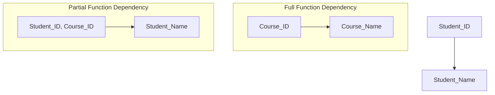

**Mnemonic:** "FFD: Full, not Fraction of Dependency"

## Question 4(c) [7 marks]

**Define normalization. Explain 2NF (Second Normal Form) with example and solution.**

**Answer**:

**Normalization**: Process of organizing database to minimize redundancy and dependency by dividing large tables into smaller tables and defining relationships between them.

**2NF (Second Normal Form)**:

- A table is in 2NF if it is in 1NF and no non-prime attribute is dependent on any proper subset of candidate key.

| Before 2NF | Problem |
|------------|---------|
| **Order(Order_ID, Product_ID, Product_Name, Quantity, Price)** | Product_Name depends on only Product_ID, not full key |

| After 2NF | Solution |
|-----------|----------|
| **Order(Order_ID, Product_ID, Quantity)** | Only full key dependencies |
| **Product(Product_ID, Product_Name, Price)** | Product details depend only on Product_ID |

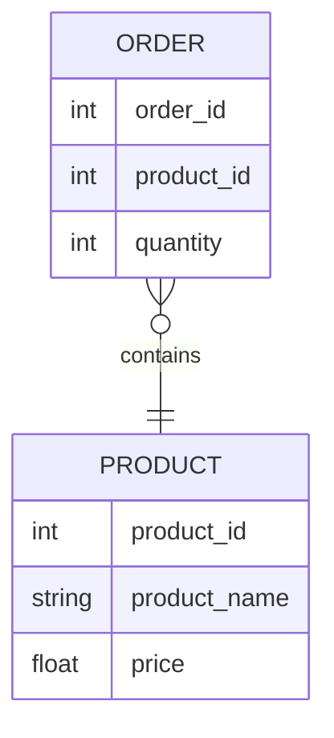

**Mnemonic:** "2NF-PPD: Partial dependency Problems Divided"

## Question 4(a) OR [3 marks]

**Explain commands: 1) To_Number() 2) To_Char()**

**Answer**:

| Function | Purpose | Syntax | Example |
|----------|---------|--------|---------|
| **TO_NUMBER()** | Converts string to number | `TO_NUMBER(string, [format])` | `TO_NUMBER('123.45') = 123.45` |
| **TO_CHAR()** | Converts number/date to string | `TO_CHAR(value, [format])` | `TO_CHAR(1234, '9999') = '1234'` |

```sql
-- Convert string to number
SELECT TO_NUMBER('123.45') FROM dual;  -- 123.45

-- Convert date to formatted string
SELECT TO_CHAR(SYSDATE, 'DD-MON-YYYY') FROM dual;  -- 20-JAN-2024

-- Convert number to formatted string
SELECT TO_CHAR(1234.56, '$9,999.99') FROM dual;  -- $1,234.56
```

**Mnemonic:** "NC: Numbers and Characters conversion"

## Question 4(b) OR [4 marks]

**Explain 1NF (First Normal Form) with example and solution.**

**Answer**:

**1NF (First Normal Form)**: A relation is in 1NF if it contains no repeating groups or arrays.

| Before 1NF | Problem |
|------------|---------|
| **Student(ID, Name, Courses)** | Courses column contains multiple values |
| **Example**: (101, John, "Math,Science,History") | Multi-valued attribute |

| After 1NF | Solution |
|-----------|----------|
| **Student(ID, Name, Course)** | One course per row |
| **Examples**: (101, John, Math), (101, John, Science), (101, John, History) | Atomic values |

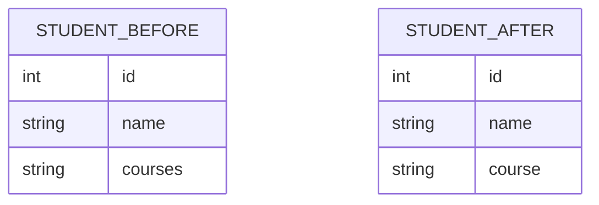

**Mnemonic:** "1NF-ARM: Atomic values Remove Multivalues"

## Question 4(c) OR [7 marks]

**Explain function dependency in SQL. Explain Partial function dependency with example.**

**Answer**:

**Functional Dependency**: A relationship where one attribute determines the value of another attribute.

**Notation**: X → Y (X determines Y)

**Partial Functional Dependency**: When an attribute depends on only part of a composite primary key.

| Concept | Example | Explanation |
|---------|---------|-------------|
| **Composite Key** | {Student_ID, Course_ID} | Together forms primary key |
| **Partial Dependency** | {Student_ID, Course_ID} → Student_Name | Student_Name depends only on Student_ID |
| **Problem** | Update anomalies, data redundancy | Same student name repeated for multiple courses |

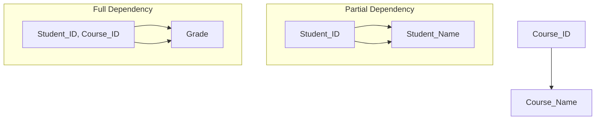

**Solution**: Decompose into separate tables where each non-key attribute is fully dependent on the key.

**Mnemonic:** "PD-CPK: Partial Dependency - Component of Primary Key"

## Question 5(a) [3 marks]

**Explain the properties of Transaction with example.**

**Answer**:

**Transaction Properties** (ACID):

| Property | Description | Example |
|----------|-------------|---------|
| **Atomicity** | All operations complete successfully or none does | Bank transfer: debit and credit both happen or neither |
| **Consistency** | Database remains in valid state before and after | Account balance constraints remain valid |
| **Isolation** | Transactions execute as if they were the only one | Two users updating same record don't interfere |
| **Durability** | Committed changes survive system failure | Once confirmed, a deposit remains even after power loss |

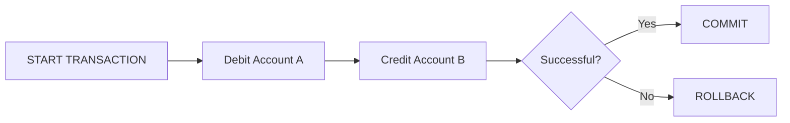

**Mnemonic:** "ACID: Atomicity, Consistency, Isolation, Durability"

## Question 5(b) [4 marks]

**Write the Queries using set operators to find following using given "Student" and "CR" (Class Representative) tables.**

**Answer**:

```sql
-- 1. List the name of the persons who are either a student or a CR
SELECT Stnd_Name FROM Student
UNION
SELECT CR_Name FROM CR;

-- 2. List the name of the persons who are a student as well as a CR
SELECT Stnd_Name FROM Student
INTERSECT
SELECT CR_Name FROM CR;

-- 3. List the name of the persons who are only a student and not a CR
SELECT Stnd_Name FROM Student
MINUS
SELECT CR_Name FROM CR;

-- 4. List the name of the persons who are only a CR and not a student
SELECT CR_Name FROM CR
MINUS
SELECT Stnd_Name FROM Student;
```

| Set Operator | Purpose | Result for Example |
|--------------|---------|-------------------|
| **UNION** | Combines all distinct rows | Manoj, Rahil, Jiya, Rina, Jitesh, Priya |
| **INTERSECT** | Returns only common rows | Manoj, Rina |
| **MINUS** | Returns rows in first set but not second | Rahil, Jiya |
| **MINUS (reversed)** | Returns rows in second set but not first | Jitesh, Priya |

**Mnemonic:** "UIMD: Union Includes, Minus Divides"

## Question 5(c) [7 marks]

**Explain Conflict Serializability in detail.**

**Answer**:

**Conflict Serializability**: A schedule is conflict serializable if it can be transformed into a serial schedule by swapping non-conflicting operations.

| Key Concepts | Description |
|--------------|-------------|
| **Conflict operations** | Two operations conflict if they access same data item and at least one is write |
| **Precedence graph** | Directed graph showing conflicts between transactions |
| **Serializable** | If precedence graph has no cycles, schedule is conflict serializable |

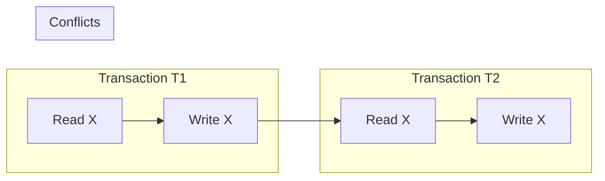

**Example**: 

- T1: R(X), W(X)
- T2: R(X), W(X)

**Serializable schedules**:

- T1 followed by T2: R1(X), W1(X), R2(X), W2(X)
- T2 followed by T1: R2(X), W2(X), R1(X), W1(X)

**Non-serializable**: R1(X), R2(X), W1(X), W2(X) - Creates cycle in precedence graph

**Mnemonic:** "COPS: Conflict Operations Produce Serializability"

## Question 5(a) OR [3 marks]

**Explain the concept of Transaction with example.**

**Answer**:

**Transaction**: A logical unit of work that must be either completely performed or completely undone.

| Transaction Phases | Description | Example |
|-------------------|-------------|---------|
| **BEGIN** | Marks start of transaction | START TRANSACTION |
| **Execute operations** | Database operations (read/write) | UPDATE account SET balance = balance - 1000 WHERE id = 123 |
| **COMMIT/ROLLBACK** | End transaction with success/failure | COMMIT or ROLLBACK |

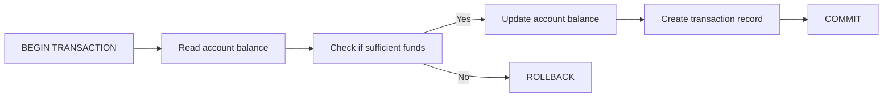

**Example**:
```sql
BEGIN TRANSACTION;
UPDATE accounts SET balance = balance - 1000 WHERE acc_no = 123;
UPDATE accounts SET balance = balance + 1000 WHERE acc_no = 456;
COMMIT;
```

**Mnemonic:** "BEC: Begin, Execute, Commit"

## Question 5(b) OR [4 marks]

**Explain equi-join with syntax and example.**

**Answer**:

**Equi-join**: A join operation that uses equality comparison operator.

| Feature | Description |
|---------|-------------|
| **Syntax** | `SELECT columns FROM table1, table2 WHERE table1.column = table2.column;` |
| **Purpose** | Combines rows from two tables based on matching column values |
| **Alternative** | `SELECT columns FROM table1 INNER JOIN table2 ON table1.column = table2.column;` |

```sql
-- Traditional syntax
SELECT s.name, d.dept_name 
FROM students s, departments d 
WHERE s.dept_id = d.dept_id;

-- INNER JOIN syntax
SELECT s.name, d.dept_name 
FROM students s INNER JOIN departments d 
ON s.dept_id = d.dept_id;
```

**Mnemonic:** "EQ-ME: Equality Matches Entries"

## Question 5(c) OR [7 marks]

**Explain View Serializability in detail.**

**Answer**:

**View Serializability**: A schedule is view serializable if it is view equivalent to some serial schedule.

| Condition | Description |
|-----------|-------------|
| **Initial read** | If T1 reads initial value of data item X in schedule S, it must also read initial value in schedule S' |
| **Final write** | If T1 performs final write of data item X in S, it must also perform final write in S' |
| **Dependency preservation** | If T1 reads value of X written by T2 in S, it must also read from T2 in S' |

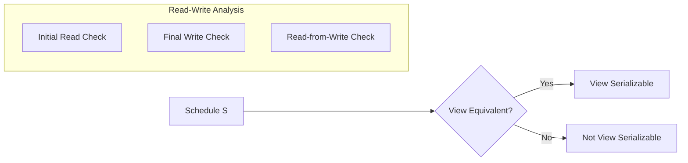

**Comparison**:

- **Conflict serializability**: More restrictive, easier to test (precedence graph)
- **View serializability**: More general, harder to test (NP-complete)

**Example of view serializable but not conflict serializable**:

- T1: W(X)
- T2: W(X)
- T3: R(X)
- Schedule: W1(X), W2(X), R3(X) - View equivalent to serial schedule T2,T1,T3

**Mnemonic:** "VIR-FF: View preserves Initial Reads and Final writes"
