## પ્રશ્ન 1(અ) [3 માર્ક્સ]

**ફિલ્ડ, રેકોર્ડ, મેટાડેટા ને વ્યાખ્યાયિત કરો.**

**ઉત્તર**:

- **ફિલ્ડ**: એન્ટિટીના એક એટ્રિબ્યુટને રજૂ કરતો ડેટાનો એક એકમ
- **રેકોર્ડ**: એન્ટિટી વિશે ડેટા સંગ્રહિત કરતા સંબંધિત ફિલ્ડ્સનો સમૂહ
- **મેટાડેટા**: ડેટા વિશેની માહિતી જે ડેટાબેઝ ઓબ્જેક્ટ્સની સંરચના, ગુણધર્મો અને સંબંધોનું વર્ણન કરે છે

**મેમરી ટ્રીક:** "FRaMe" (ફિલ્ડ, રેકોર્ડ, મેટાડેટા)

## પ્રશ્ન 1(બ) [4 માર્ક્સ]

**સ્ટ્રોંગ અને વીક entity set ને વ્યાખ્યાયિત કરો.**

**ઉત્તર**:

| એન્ટિટી પ્રકાર | વર્ણન | ઓળખ | ઉદાહરણ |
|-------------|-------------|----------------|---------|
| **સ્ટ્રોંગ એન્ટિટી** | સ્વતંત્ર રીતે અસ્તિત્વમાં છે | તેની પોતાની પ્રાથમિક કી ધરાવે છે | ગ્રાહક, કર્મચારી |
| **વીક એન્ટિટી** | સ્ટ્રોંગ એન્ટિટી પર આધાર રાખે છે | પેરેન્ટ એન્ટિટી કી જરૂરી છે | બેંક એકાઉન્ટ, ઓર્ડર આઈટમ |

**મેમરી ટ્રીક:** "SWing" (Strong is With own identity, weak is Not Getting own identity)

## પ્રશ્ન 1(ક) [7 માર્ક્સ]

**ડેટા એબ્સ્ટ્રેક્શનના 3 સ્તરો સમજાવો.**

**ઉત્તર**:

| સ્તર | વર્ણન | વપરાશકર્તા |
|-------|-------------|---------|
| **ફિઝિકલ લેવલ** | ડેટા ભૌતિક રીતે કેવી રીતે સંગ્રહિત થાય છે તે વર્ણવે છે | સિસ્ટમ એડમિનિસ્ટ્રેટર્સ |
| **કન્સેપ્ચુઅલ લેવલ** | કયો ડેટા સંગ્રહિત થયેલો છે અને સંબંધોનું વર્ણન કરે છે | ડેટાબેઝ ડિઝાઇનર્સ |
| **વ્યૂ લેવલ** | વપરાશકર્તાઓ માટે પ્રસ્તુત ડેટાબેઝનો ભાગ વર્ણવે છે | એન્ડ યુઝર્સ |

**ડાયાગ્રામ:**

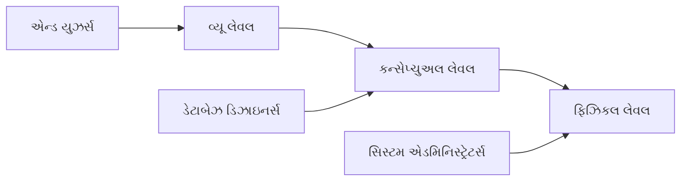

**મેમરી ટ્રીક:** "PCV" (Physical, Conceptual, View - નીચેથી ઉપર)

## પ્રશ્ન 1(ક) OR [7 માર્ક્સ]

**DBMS ના ફાયદાઓ અને ગેરફાયદાઓ સમજાવો.**

**ઉત્તર**:

| ફાયદાઓ | ગેરફાયદાઓ |
|------------|---------------|
| **ડેટા રીડન્ડન્સી કંટ્રોલ** | સોફ્ટવેર અને હાર્ડવેરની **ઊંચી કિંમત** |
| **ડેટા કન્સિસ્ટન્સી** | ડિઝાઇન અને જાળવણીમાં **જટિલતા** |
| **બહેતર ડેટા સિક્યુરિટી** | ભારે ઉપયોગ સાથે **પર્ફોર્મન્સ પર અસર** |
| **ડેટા શેરિંગ** | સિસ્ટમ નિષ્ફળતાઓથી **સંવેદનશીલતા** |
| **ડેટા ઇન્ડિપેન્ડન્સ** | નિષ્ફળતા પછી **રિકવરી ચેલેન્જીસ** |
| **પ્રમાણભૂત એક્સેસ** | **વધારેલ તાલીમ આવશ્યકતાઓ** |

**મેમરી ટ્રીક:** "BASIC-DV" (Benefits: Access, Security, Independence, Consistency - Drawbacks: Vulnerability)

## પ્રશ્ન 2(અ) [3 માર્ક્સ]

**રિલેશનલ એલ્જેબ્રા નું સિલેક્ટ ઓપરેશન સમજાવો.**

**ઉત્તર**:

| સિલેક્ટ ઓપરેશન (σ) | વર્ણન |
|---------------------|-------------|
| **સિન્ટેક્સ** | σ<condition>(Relation) |
| **કાર્ય** | શરત સંતોષતા ટપલ્સ મેળવે છે |
| **ઉદાહરણ** | σ<sub>salary>30000</sub>(Employee) |

**મેમરી ટ્રીક:** "SERVe" (Select Exactly Required Values)

## પ્રશ્ન 2(બ) [4 માર્ક્સ]

**DBMS માં પ્રાઇમરી, ફોરેઇન, સુપર, કેન્ડીડેટ કી ની વ્યાખ્યા આપો.**

**ઉત્તર**:

| કી પ્રકાર | વર્ણન |
|----------|-------------|
| **પ્રાઇમરી કી** | દરેક રેકોર્ડ માટે યુનિક ઓળખકર્તા |
| **ફોરેઇન કી** | અન્ય ટેબલમાં પ્રાઇમરી કી સાથે જોડાતું એટ્રિબ્યુટ |
| **સુપર કી** | એટ્રિબ્યુટ્સનો સેટ જે રેકોર્ડ્સને યુનિક રીતે ઓળખી શકે છે |
| **કેન્ડીડેટ કી** | મિનિમલ સુપર કી જે પ્રાઇમરી કી બની શકે છે |

**મેમરી ટ્રીક:** "PFSC" (Person First Shows Credentials)

## પ્રશ્ન 2(ક) [7 માર્ક્સ]

**Library Management System નો E R Diagram દોરો.**

**ઉત્તર**:

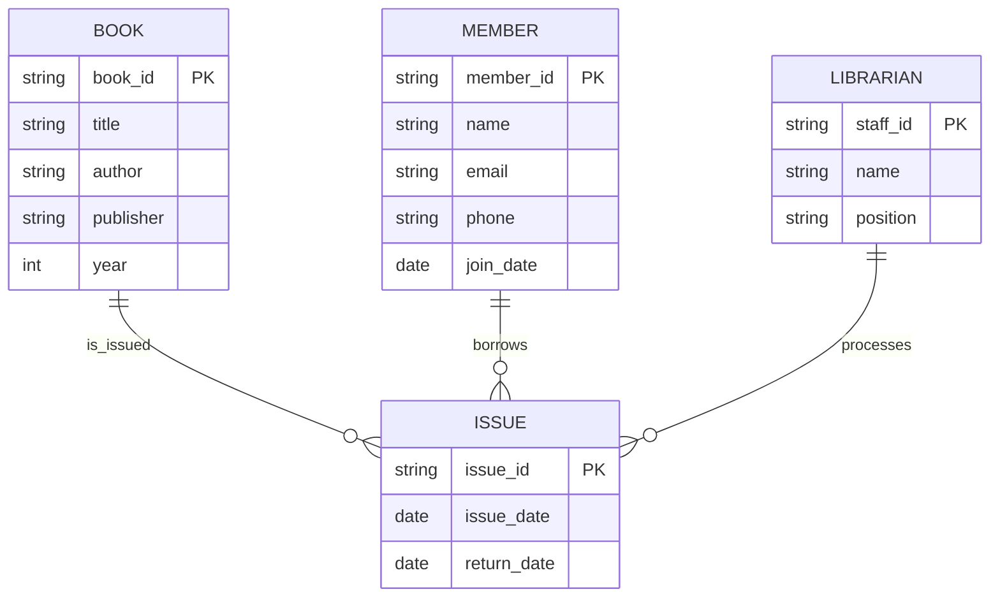

**મેમરી ટ્રીક:** "LIMB" (Library Items, Members, Borrowing)

## પ્રશ્ન 2(અ) OR [3 માર્ક્સ]

**રિલેશનલ એલ્જેબ્રા નું યુનિયન ઓપરેશન સમજાવો.**

**ઉત્તર**:

| યુનિયન ઓપરેશન (∪) | વર્ણન |
|--------------------|-------------|
| **સિન્ટેક્સ** | Relation1 ∪ Relation2 |
| **કાર્ય** | બંને સંબંધોમાંથી ટપલ્સ એકત્રિત કરે છે |
| **આવશ્યકતા** | બંને સંબંધો યુનિયન-સંગત હોવા જોઈએ |

**ઉદાહરણ:** Students_CS ∪ Students_IT

**મેમરી ટ્રીક:** "CUP" (Combining Union of Parts)

## પ્રશ્ન 2(બ) OR [4 માર્ક્સ]

**ઉદાહરણ સાથે કંપોઝિટ એટ્રિબ્યુટ અને મલ્ટીવેલ્યુડ એટ્રિબ્યુટ ને વ્યાખ્યાયિત કરો.**

**ઉત્તર**:

| એટ્રિબ્યુટ પ્રકાર | વર્ણન | ઉદાહરણ |
|---------------|-------------|---------|
| **કંપોઝિટ** | નાના સબપાર્ટ્સમાં વિભાજિત થઈ શકે છે | એડ્રેસ (સ્ટ્રીટ, શહેર, રાજ્ય, પિન) |
| **મલ્ટીવેલ્યુડ** | એક કરતાં વધુ મૂલ્ય ધરાવી શકે છે | ફોન નંબર્સ, ઈમેલ એડ્રેસિસ |

**ડાયાગ્રામ:**

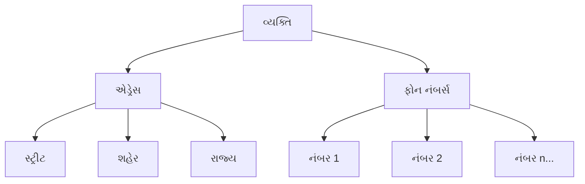

**મેમરી ટ્રીક:** "CoMbo" (Composite has Multiple components)

## પ્રશ્ન 2(ક) OR [7 માર્ક્સ]

**College Management System નો E R Diagram દોરો.**

**ઉત્તર**:

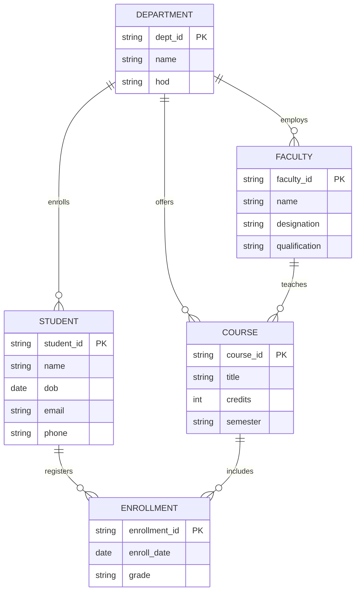

**મેમરી ટ્રીક:** "DECFS" (Departments, Enrollments, Courses, Faculty, Students)

## પ્રશ્ન 3(અ) [3 માર્ક્સ]

**SQL માં વિવિધ ડેટા ટાઈપ્સ ની યાદી બનાવો અને ટુંક માં સમજાવો**

**ઉત્તર**:

| ડેટા ટાઈપ કેટેગરી | ઉદાહરણો | ઉપયોગ |
|-------------------|----------|-------|
| **ન્યુમેરિક** | INT, FLOAT, DECIMAL | સંખ્યાઓ સંગ્રહ કરવા |
| **કેરેક્ટર** | CHAR, VARCHAR, TEXT | ટેક્સ્ટ સંગ્રહ કરવા |
| **ડેટ/ટાઈમ** | DATE, TIME, TIMESTAMP | સમય સંબંધિત ડેટા સંગ્રહ કરવા |
| **બૂલિયન** | BOOLEAN | સાચા/ખોટા મૂલ્યો સંગ્રહ કરવા |
| **બાઇનરી** | BLOB, BINARY | બાઇનરી ડેટા સંગ્રહ કરવા |

**મેમરી ટ્રીક:** "NCDBB" (Numbers, Characters, Dates, Booleans, Binaries)

## પ્રશ્ન 3(બ) [4 માર્ક્સ]

**કોઈ પણ બે DDL કમાન્ડસ સિંટેક્ષ અને ઉદાહરણ સાથે સમજાવો.**

**ઉત્તર**:

| કમાન્ડ | સિન્ટેક્સ | ઉદાહરણ |
|---------|--------|---------|
| **CREATE** | CREATE TABLE table_name (column_definitions); | CREATE TABLE Student (id INT PRIMARY KEY, name VARCHAR(50)); |
| **ALTER** | ALTER TABLE table_name ADD/DROP/MODIFY column_name data_type; | ALTER TABLE Student ADD email VARCHAR(100); |

**ડાયાગ્રામ:**

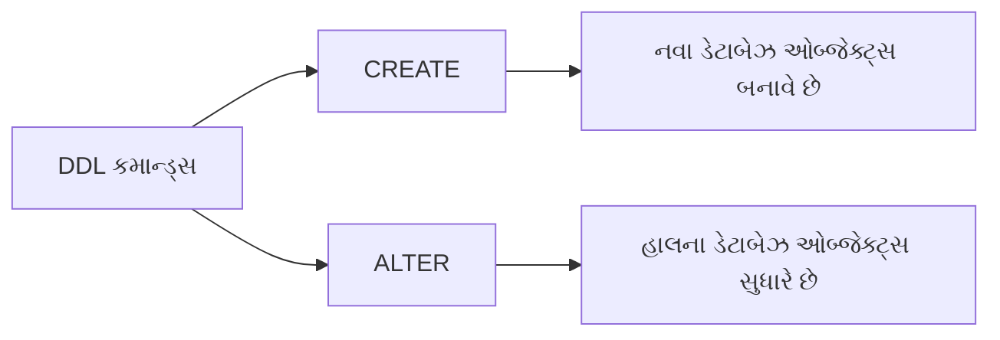

**મેમરી ટ્રીક:** "CAD" (Create And Define)

## પ્રશ્ન 3(ક) [7 માર્ક્સ]

**નીચે ની ક્વેરી નું આઉટપુટ લખો.**
**a. CEIL(123.57), CEIL(4.1)**
**b. MOD(12,4), MOD(10,4)**
**c. POWER(2,3), POWER(3,3)**
**d. ROUND(121.413,1), ROUND(121.413,2)**
**e. FLOOR(25.3),FLOOR(25.7)**
**f. LENGTH('AHMEDABAD')**
**g. ABS(-25),ABS(36)**

**ઉત્તર**:

| ફંક્શન | પરિણામ | સમજૂતી |
|----------|--------|-------------|
| **CEIL(123.57)** | 124 | 123.57 થી મોટી કે સમાન સૌથી નાની પૂર્ણ સંખ્યા |
| **CEIL(4.1)** | 5 | 4.1 થી મોટી કે સમાન સૌથી નાની પૂર્ણ સંખ્યા |
| **MOD(12,4)** | 0 | 12÷4 નો શેષ |
| **MOD(10,4)** | 2 | 10÷4 નો શેષ |
| **POWER(2,3)** | 8 | 2 ને 3 ની ઘાત |
| **POWER(3,3)** | 27 | 3 ને 3 ની ઘાત |
| **ROUND(121.413,1)** | 121.4 | 1 દશાંશ સ્થાન સુધી રાઉન્ડ |
| **ROUND(121.413,2)** | 121.41 | 2 દશાંશ સ્થાન સુધી રાઉન્ડ |
| **FLOOR(25.3)** | 25 | 25.3 થી નાની કે સમાન સૌથી મોટી પૂર્ણ સંખ્યા |
| **FLOOR(25.7)** | 25 | 25.7 થી નાની કે સમાન સૌથી મોટી પૂર્ણ સંખ્યા |
| **LENGTH('AHMEDABAD')** | 9 | અક્ષરોની સંખ્યા |
| **ABS(-25)** | 25 | -25 ની નિરપેક્ષ કિંમત |
| **ABS(36)** | 36 | 36 ની નિરપેક્ષ કિંમત |

**મેમરી ટ્રીક:** "CMPRFLA" (Ceiling, Modulus, Power, Round, Floor, Length, Absolute)

## પ્રશ્ન 3(અ) OR [3 માર્ક્સ]

**કોઈ પણ ત્રણ ડેટ ફંક્શન સમજાવો.**

**ઉત્તર**:

| ડેટ ફંક્શન | હેતુ | ઉદાહરણ | પરિણામ |
|--------------|---------|---------|--------|
| **ADD_MONTHS** | તારીખમાં મહિના ઉમેરે છે | ADD_MONTHS('01-JAN-2023', 3) | 01-APR-2023 |
| **MONTHS_BETWEEN** | બે તારીખો વચ્ચેના મહિના ગણે છે | MONTHS_BETWEEN('01-MAR-2023', '01-JAN-2023') | 2 |
| **SYSDATE** | વર્તમાન તારીખ અને સમય આપે છે | SYSDATE | વર્તમાન સિસ્ટમ તારીખ/સમય |

**મેમરી ટ્રીક:** "AMS" (Add_months, Months_between, Sysdate)

## પ્રશ્ન 3(બ) OR [4 માર્ક્સ]

**કોઈ પણ બે DML કમાન્ડ સિંટેક્ષ અને ઉદાહરણ સાથે સમજાવો.**

**ઉત્તર**:

| કમાન્ડ | સિન્ટેક્સ | ઉદાહરણ |
|---------|--------|---------|
| **INSERT** | INSERT INTO table_name VALUES (value1, value2,...); | INSERT INTO Student VALUES (1, 'Raj', 'raj@example.com'); |
| **UPDATE** | UPDATE table_name SET column=value WHERE condition; | UPDATE Student SET email='new@example.com' WHERE id=1; |

**ડાયાગ્રામ:**

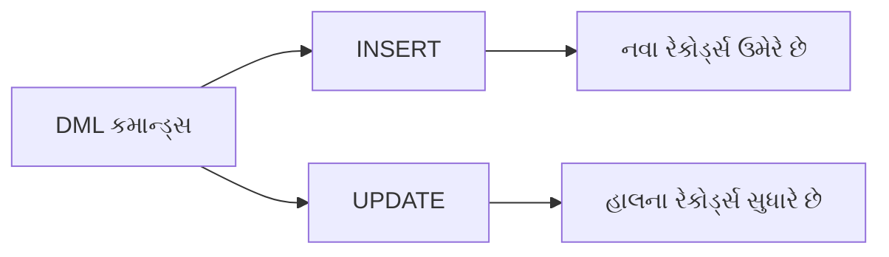

**મેમરી ટ્રીક:** "IUM" (Insert, Update, Manipulate)

## પ્રશ્ન 3(ક) OR [7 માર્ક્સ]

**ટેબલ EMP(emp_no, emp_name, designation, salary, deptno) ને ધ્યાને લઈ ને નીચે આપેલા operations માટે SQL commands લખો.**

**ઉત્તર**:

| ઓપરેશન | SQL કમાન્ડ |
|-----------|-------------|
| **EMP ટેબલ ને ક્રિએટ કરો** | CREATE TABLE EMP (emp_no INT PRIMARY KEY, emp_name VARCHAR(50), designation VARCHAR(30), salary DECIMAL(10,2), deptno INT); |
| **emp_no, emp_name, designation, salary, deptno ને EMP ને આપો** | SELECT emp_no, emp_name, designation, salary, deptno FROM EMP; |
| **જેમના નામ 'p' થી શરૂ થતાં હોય તેવા બધા એમ્પ્લોયી ની માહિતી દશાર્વો** | SELECT * FROM EMP WHERE emp_name LIKE 'p%'; |
| **Department wise salary total દશાર્વો** | SELECT deptno, SUM(salary) AS total_salary FROM EMP GROUP BY deptno; |
| **EMP table માં નવી કૉલમ email_id ઉમેરો** | ALTER TABLE EMP ADD email_id VARCHAR(100); |
| **કૉલમ નામ "designation" ને "post" તરીકે બદલાવો** | ALTER TABLE EMP RENAME COLUMN designation TO post; |
| **ટેબલ person ના તમામ records delete કરો** | DELETE FROM person; |

**મેમરી ટ્રીક:** "CSDAACD" (Create, Select, Display, Aggregate, Add, Change, Delete)

## પ્રશ્ન 4(અ) [3 માર્ક્સ]

**વિવિધ aggregate functions ની યાદી બનાવો અને કોઈ એક ને syntax અને ઉદાહરણ સાથે સમજાવો.**

**ઉત્તર**:

| એગ્રીગેટ ફંક્શન | હેતુ |
|-------------------|---------|
| **SUM** | કુલ ગણતરી કરે છે |
| **AVG** | સરેરાશ ગણતરી કરે છે |
| **COUNT** | રો ની સંખ્યા ગણે છે |
| **MAX** | મહત્તમ મૂલ્ય શોધે છે |
| **MIN** | લઘુત્તમ મૂલ્ય શોધે છે |

**AVG માટે ઉદાહરણ:**  
`AVG(column_name)` - કોલમમાં મૂલ્યોની સરેરાશ ગણતરી કરે છે  
`SELECT AVG(salary) FROM Employee;` - સરેરાશ પગાર આપે છે

**મેમરી ટ્રીક:** "SCAMM" (Sum, Count, Avg, Max, Min)

## પ્રશ્ન 4(બ) [4 માર્ક્સ]

**ટ્રાન્સેક્શન ને ઉદાહરણ સાથે વ્યાખ્યાયિત કરો.**

**ઉત્તર**:

| ટ્રાન્સેક્શન કન્સેપ્ટ | વર્ણન |
|--------------------|-------------|
| **વ્યાખ્યા** | કાર્યનો તાર્કિક એકમ જે સંપૂર્ણપણે પ્રોસેસ થવો જોઈએ અથવા સંપૂર્ણપણે નિષ્ફળ જવો જોઈએ |
| **ગુણધર્મો** | ACID (એટોમિસિટી, કન્સિસ્ટન્સી, આઈસોલેશન, ડ્યુરેબિલિટી) |
| **સ્થિતિઓ** | એક્ટિવ, પાર્શિયલી કમિટેડ, કમિટેડ, ફેઇલ્ડ, એબોર્ટેડ |

**ઉદાહરણ:**

```sql
BEGIN TRANSACTION;
    UPDATE Accounts SET balance = balance - 5000 WHERE acc_no = 'A123';
    UPDATE Accounts SET balance = balance + 5000 WHERE acc_no = 'B456';
COMMIT;
```

**મેમરી ટ્રીક:** "TAPS" (Transaction As Process Set)

## પ્રશ્ન 4(ક) [7 માર્ક્સ]

**SQL માં ઓપરેટર શું છે? એરિથમેટિક અને લોજિકલ ઓપરેટર ઉદાહરણ સાથે સમજાવો.**

**ઉત્તર**:

| પ્રકાર | ઓપરેટર્સ | ઉદાહરણ | પરિણામ |
|------|-----------|---------|--------|
| **એરિથમેટિક** | + (ઉમેરો) | 5 + 3 | 8 |
|  | - (બાદબાકી) | 5 - 3 | 2 |
|  | * (ગુણાકાર) | 5 * 3 | 15 |
|  | / (ભાગાકાર) | 15 / 3 | 5 |
|  | % (મોડ્યુલસ) | 5 % 2 | 1 |
| **લોજિકલ** | AND | salary > 30000 AND dept = 'IT' | બંને શરતો સાચી હોય તો સાચું |
|  | OR | salary > 50000 OR dept = 'HR' | કોઈપણ એક શરત સાચી હોય તો સાચું |
|  | NOT | NOT (salary < 20000) | જો પગાર 20000 થી ઓછો ન હોય તો સાચું |

**SQL ઉદાહરણો:**

```sql
-- એરિથમેટિક
SELECT product_name, price * 1.18 AS price_with_tax FROM Products;

-- લોજિકલ
SELECT * FROM Employees WHERE (salary > 30000 AND dept = 'IT') OR (experience > 5);
```

**મેમરી ટ્રીક:** "ASMDOLA" (Add, Subtract, Multiply, Divide, OR, AND, NOT)

## પ્રશ્ન 4(અ) OR [3 માર્ક્સ]

**વિવિધ numeric functions ની યાદી બનાવો અને કોઈ એક ને syntax અને ઉદાહરણ સાથે સમજાવો.**

**ઉત્તર**:

| ન્યુમેરિક ફંક્શન | હેતુ |
|-----------------|---------|
| **ROUND** | સંખ્યાને નિર્દિષ્ટ દશાંશ સ્થાનો સુધી રાઉન્ડ કરે છે |
| **TRUNC** | સંખ્યાને નિર્દિષ્ટ દશાંશ સ્થાનો સુધી ટ્રંકેટ કરે છે |
| **CEIL** | સંખ્યાથી મોટી કે સમાન સૌથી નાની પૂર્ણ સંખ્યા આપે છે |
| **FLOOR** | સંખ્યાથી નાની કે સમાન સૌથી મોટી પૂર્ણ સંખ્યા આપે છે |
| **ABS** | નિરપેક્ષ મૂલ્ય આપે છે |

**ROUND માટે ઉદાહરણ:**  
`ROUND(number, decimal_places)` - સંખ્યાને નિર્દિષ્ટ દશાંશ સ્થાનો સુધી રાઉન્ડ કરે છે  
`SELECT ROUND(125.679, 2) FROM DUAL;` - 125.68 આપે છે

**મેમરી ટ્રીક:** "RTCFA" (Round, Truncate, Ceiling, Floor, Absolute)

## પ્રશ્ન 4(બ) OR [4 માર્ક્સ]

**ટ્રાન્સેક્શન માટે વિવિધ database operations ની યાદી બનાવો.**

**ઉત્તર**:

| ઓપરેશન | વર્ણન |
|-----------|-------------|
| **BEGIN/START** | ટ્રાન્સેક્શન શરૂઆત બિંદુ ચિહ્નિત કરે છે |
| **READ** | ડેટાબેઝમાંથી ડેટા મેળવે છે |
| **WRITE** | ડેટાબેઝમાં ડેટા સુધારે છે |
| **COMMIT** | ફેરફારો કાયમી બનાવે છે |
| **ROLLBACK** | ફેરફારો રદ કરે છે અને પ્રારંભિક બિંદુ પર પાછા ફરે છે |
| **SAVEPOINT** | આંશિક રૂપે પાછા ફરવા માટે બિંદુઓ બનાવે છે |

**ડાયાગ્રામ:**

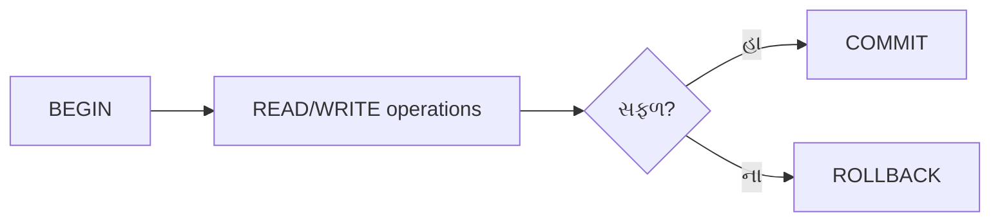

**મેમરી ટ્રીક:** "BRWCRS" (Begin, Read, Write, Commit, Rollback, Savepoint)

## પ્રશ્ન 4(ક) OR [7 માર્ક્સ]

**જોઇન શું છે? વિવિધ પ્રકાર ના જોઇન ને syntax અને ઉદાહરણ સાથે સમજાવો.**

**ઉત્તર**:

| જોઇન પ્રકાર | વર્ણન | સિન્ટેક્સ ઉદાહરણ |
|-----------|-------------|----------------|
| **INNER JOIN** | બંને ટેબલમાં મેચ હોય ત્યારે રો આપે છે | SELECT * FROM TableA INNER JOIN TableB ON TableA.id = TableB.id; |
| **LEFT JOIN** | ડાબા ટેબલના બધા રો અને જમણા ટેબલના મેચ થતા રો આપે છે | SELECT * FROM TableA LEFT JOIN TableB ON TableA.id = TableB.id; |
| **RIGHT JOIN** | જમણા ટેબલના બધા રો અને ડાબા ટેબલના મેચ થતા રો આપે છે | SELECT * FROM TableA RIGHT JOIN TableB ON TableA.id = TableB.id; |
| **FULL JOIN** | કોઈપણ એક ટેબલમાં મેચ હોય ત્યારે રો આપે છે | SELECT * FROM TableA FULL JOIN TableB ON TableA.id = TableB.id; |
| **SELF JOIN** | ટેબલને તેની જાત સાથે જોડે છે | SELECT * FROM Employee e1 JOIN Employee e2 ON e1.manager_id = e2.emp_id; |

**ડાયાગ્રામ:**

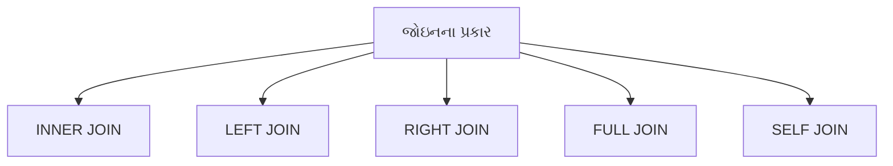

**મેમરી ટ્રીક:** "ILRFS" (Inner, Left, Right, Full, Self)

## પ્રશ્ન 5(અ) [3 માર્ક્સ]

**નીચે આપેલા customer relation ને 1NF માં બદલાવો.**

**Customer**

| cid | name | address | Contact_no |
|-----|------|---------|------------|
| CO1 | Riya | Amu aavas, Anand | {5322332123} |
| CO2 | Jiya | Sardar colony, Ahmedabad | {5326521456, 5265232849} |

**ઉત્તર**:

**Customer Table (1NF):**

| cid | name | society | city | Contact_no |
|-----|------|---------|------|------------|
| CO1 | Riya | Amu aavas | Anand | 5322332123 |
| CO2 | Jiya | Sardar colony | Ahmedabad | 5326521456 |
| CO2 | Jiya | Sardar colony | Ahmedabad | 5265232849 |

**મેમરી ટ્રીક:** "AFM" (Atomic values, Flatten Multivalued attributes)

## પ્રશ્ન 5(બ) [4 માર્ક્સ]

**ટ્રાન્સેક્શન ની ACID properties ની યાદી બનાવો અને સમજાવો.**

**ઉત્તર**:

| ACID Property | વર્ણન |
|---------------|-------------|
| **Atomicity** | ટ્રાન્સેક્શન સંપૂર્ણપણે ચાલે છે અથવા બિલકુલ નહીં |
| **Consistency** | ડેટાબેઝ ટ્રાન્સેક્શન પહેલાં અને પછી સુસંગત રહે છે |
| **Isolation** | સમાંતર ટ્રાન્સેક્શન એકબીજા સાથે દખલ કરતા નથી |
| **Durability** | કમિટેડ ફેરફારો સિસ્ટમ નિષ્ફળતા પછી પણ કાયમી રહે છે |

**ડાયાગ્રામ:**

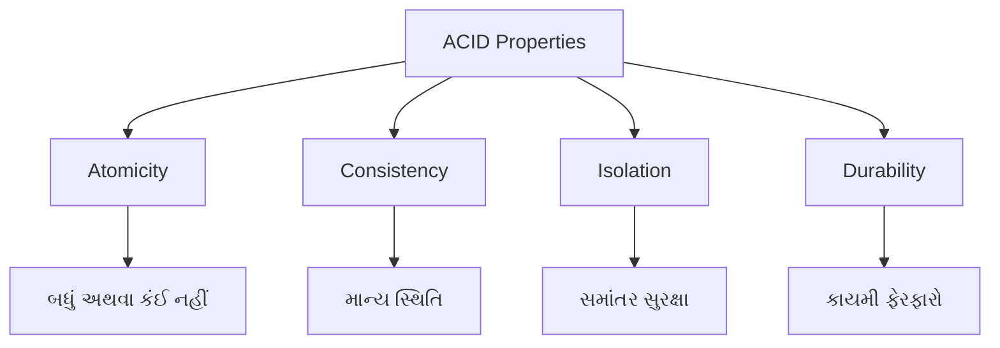

**મેમરી ટ્રીક:** "ACID" (Atomicity, Consistency, Isolation, Durability)

## પ્રશ્ન 5(ક) [7 માર્ક્સ]

**વિવિધ functional dependencies ની યાદી બનાવો અને દરેક ને ઉદાહરણ સાથે સમજાવો.**

**ઉત્તર**:

| Functional Dependency | વર્ણન | ઉદાહરણ |
|----------------------|-------------|---------|
| **Trivial FD** | X → Y જ્યાં Y એ X નો સબસેટ છે | {StudentID, Name} → {Name} |
| **Non-trivial FD** | X → Y જ્યાં Y એ X નો સબસેટ નથી | {StudentID} → {Name} |
| **Partial FD** | કમ્પોઝિટ કી નો ભાગ નોન-કી એટ્રિબ્યુટ નક્કી કરે છે | {CourseID, StudentID} → {CourseName} |
| **Transitive FD** | X → Y અને Y → Z એટલે X → Z | {StudentID} → {DeptID} અને {DeptID} → {DeptName} |
| **Multivalued FD** | એક એટ્રિબ્યુટ બીજા એટ્રિબ્યુટના મૂલ્યોનો સેટ નક્કી કરે છે | {CourseID} →→ {TextbookID} |

**ડાયાગ્રામ:**

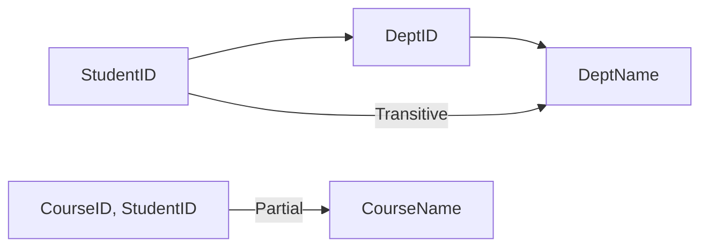

**મેમરી ટ્રીક:** "TNPTMv" (Trivial, Non-trivial, Partial, Transitive, Multivalued)

## પ્રશ્ન 5(અ) OR [3 માર્ક્સ]

**નીચે આપેલા Depositor_Account relation ને 2NF માં બદલાવો.**
**જ્યાં functional dependencies(FD) નીચે મુજબ છે.**
**FD1: {cid, ano} → {access_date, balance, bname}**
**FD2: ano → {balance, bname}**

**Depositor_Account**

| cid | ano | access_date | balance | bname |
|-----|-----|-------------|---------|-------|

**ઉત્તર**:

**Account Table (2NF):**

| ano | balance | bname |
|-----|---------|-------|

**Depositor Table (2NF):**

| cid | ano | access_date |
|-----|-----|-------------|

**મેમરી ટ્રીક:** "RPKD" (Remove Partial Key Dependencies)

## પ્રશ્ન 5(બ) OR [4 માર્ક્સ]

**Conflict serializability સમજાવો.**

**ઉત્તર**:

| કન્સેપ્ટ | વર્ણન |
|---------|-------------|
| **વ્યાખ્યા** | સિરિયલ શેડ્યૂલ સાથે સમકક્ષ હોય તો શેડ્યૂલ કન્ફ્લિક્ટ સીરિયલાઇઝેબલ છે |
| **કન્ફ્લિક્ટ ઓપરેશન્સ** | એક જ ડેટા આઇટમ પર રીડ-રાઇટ, રાઇટ-રીડ, રાઇટ-રાઇટ ઓપરેશન્સ |
| **કન્ફ્લિક્ટ ગ્રાફ** | ટ્રાન્સેક્શન વચ્ચેના કન્ફ્લિક્ટ દર્શાવતો ડાયરેક્ટેડ ગ્રાફ |
| **ટેસ્ટિંગ** | જો કન્ફ્લિક્ટ ગ્રાફમાં ચક્ર ન હોય તો શેડ્યૂલ કન્ફ્લિક્ટ સીરિયલાઇઝેબલ છે |

**ડાયાગ્રામ:**

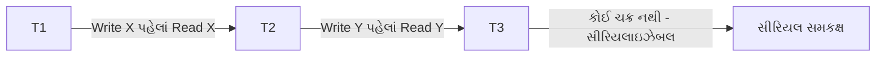

**મેમરી ટ્રીક:** "COGS" (Conflict Operations Graph Serializable)

## પ્રશ્ન 5(ક) OR [7 માર્ક્સ]

**ઉદાહરણ સાથે 3NF normalization સમજાવો.**

**ઉત્તર**:

| Normal Form | વ્યાખ્યા | ઉદાહરણ |
|-------------|------------|---------|
| **1NF** | એટોમિક વેલ્યુ, કોઈ રિપીટિંગ ગ્રુપ નહીં | Student(ID, Name, Phone1, Phone2) → Student(ID, Name, Phone) |
| **2NF** | 1NF + કોઈ પાર્શિયલ ડિપેન્ડન્સી નહીં | Order(OrderID, ProductID, CustomerID, ProductName) → Order(OrderID, ProductID, CustomerID) + Product(ProductID, ProductName) |
| **3NF** | 2NF + કોઈ ટ્રાન્ઝિટિવ ડિપેન્ડન્સી નહીં | Student(ID, DeptID, DeptName) → Student(ID, DeptID) + Department(DeptID, DeptName) |

**ઉલ્લંઘન ઉદાહરણ:**

```
Employee(EmpID, EmpName, DeptID, DeptName, Location)
```

**3NF રૂપાંતરણ:**

```
Employee(EmpID, EmpName, DeptID)
Department(DeptID, DeptName, Location)
```

**ડાયાગ્રામ:**

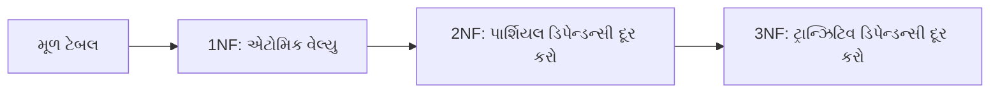

**મેમરી ટ્રીક:** "APTN" (Atomic values, Partial dependencies removed, Transitive dependencies removed, Normalized)
