## Question 1(a) [3 marks]

**Define: Field, Record, Metadata**

**Answer**:

- **Field**: A single unit of data representing one attribute of an entity
- **Record**: Collection of related fields that store data about an entity
- **Metadata**: Data about data that describes the structure, properties, and relationships of database objects

**Mnemonic:** "FRaMe" (Field, Record, Metadata)

## Question 1(b) [4 marks]

**Define: strong and weak entity set.**

**Answer**:

| Entity Type | Description | Identification | Example |
|-------------|-------------|----------------|---------|
| **Strong Entity** | Exists independently | Has its own primary key | Customer, Employee |
| **Weak Entity** | Depends on strong entity | Requires parent entity key | Bank Account, Order Item |

**Mnemonic:** "SWing" (Strong is With own identity, weak is Not Getting own identity)

## Question 1(c) [7 marks]

**Explain 3 Levels of Data Abstraction**

**Answer**:

| Level | Description | Used By |
|-------|-------------|---------|
| **Physical Level** | Describes how data is stored physically | System Administrators |
| **Conceptual Level** | Describes what data is stored and relationships | Database Designers |
| **View Level** | Describes part of database relevant to users | End Users |

**Diagram:**

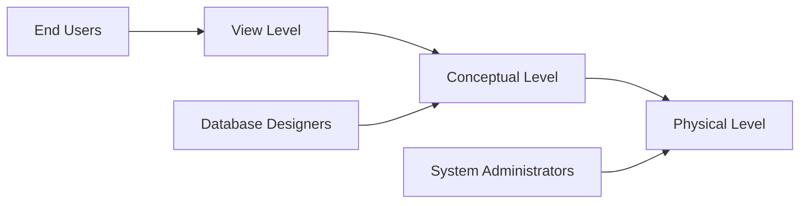

**Mnemonic:** "PCV" (Physical, Conceptual, View - bottom to top)

## Question 1(c) OR [7 marks]

**Explain advantages and disadvantages of DBMS.**

**Answer**:

| Advantages | Disadvantages |
|------------|---------------|
| **Data Redundancy Control** | **High Cost** of software and hardware |
| **Data Consistency** | **Complexity** in design and maintenance |
| **Improved Data Security** | **Performance Impact** with heavy usage |
| **Data Sharing** | **Vulnerability** to system failures |
| **Data Independence** | **Recovery Challenges** after failure |
| **Standardized Access** | **Increased Training Requirements** |

**Mnemonic:** "BASIC-DV" (Benefits: Access, Security, Independence, Consistency - Drawbacks: Vulnerability)

## Question 2(a) [3 marks]

**Explain select operation in relational algebra with example**

**Answer**:

| Select Operation (σ) | Description |
|---------------------|-------------|
| **Syntax** | σ<condition>(Relation) |
| **Function** | Retrieves tuples satisfying condition |
| **Example** | σ<sub>salary>30000</sub>(Employee) |

**Mnemonic:** "SERVe" (Select Exactly Required Values)

## Question 2(b) [4 marks]

**Define Primary, Foreign, Super, Candidate Keys in DBMS.**

**Answer**:

| Key Type | Description |
|----------|-------------|
| **Primary Key** | Unique identifier for each record |
| **Foreign Key** | Attribute linking to primary key in another table |
| **Super Key** | Set of attributes that can uniquely identify records |
| **Candidate Key** | Minimal super key that can be primary key |

**Mnemonic:** "PFSC" (Person First Shows Credentials)

## Question 2(c) [7 marks]

**Draw E R Diagram of Library Management System.**

**Answer**:

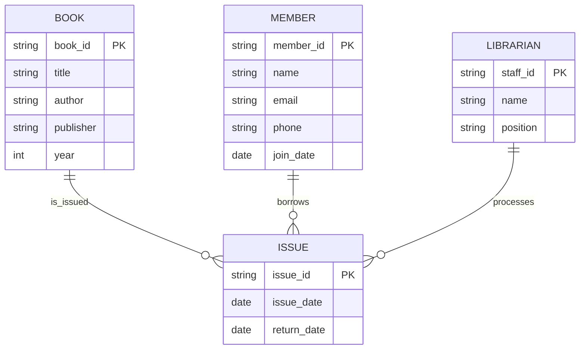

**Mnemonic:** "LIMB" (Library Items, Members, Borrowing)

## Question 2(a) OR [3 marks]

**Explain union operation in relational algebra with example.**

**Answer**:

| Union Operation (∪) | Description |
|--------------------|-------------|
| **Syntax** | Relation1 ∪ Relation2 |
| **Function** | Combines tuples from both relations |
| **Requirement** | Both relations must be union-compatible |

**Example:** Students_CS ∪ Students_IT

**Mnemonic:** "CUP" (Combining Union of Parts)

## Question 2(b) OR [4 marks]

**Define Composite attribute and Multivalued attribute with example**

**Answer**:

| Attribute Type | Description | Example |
|---------------|-------------|---------|
| **Composite** | Can be divided into smaller subparts | Address (street, city, state, zip) |
| **Multivalued** | Can have more than one value | Phone numbers, Email addresses |

**Diagram:**

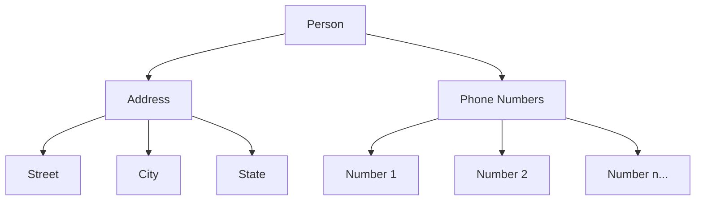

**Mnemonic:** "CoMbo" (Composite has Multiple components)

## Question 2(c) OR [7 marks]

**Draw E R Diagram of College Management System.**

**Answer**:

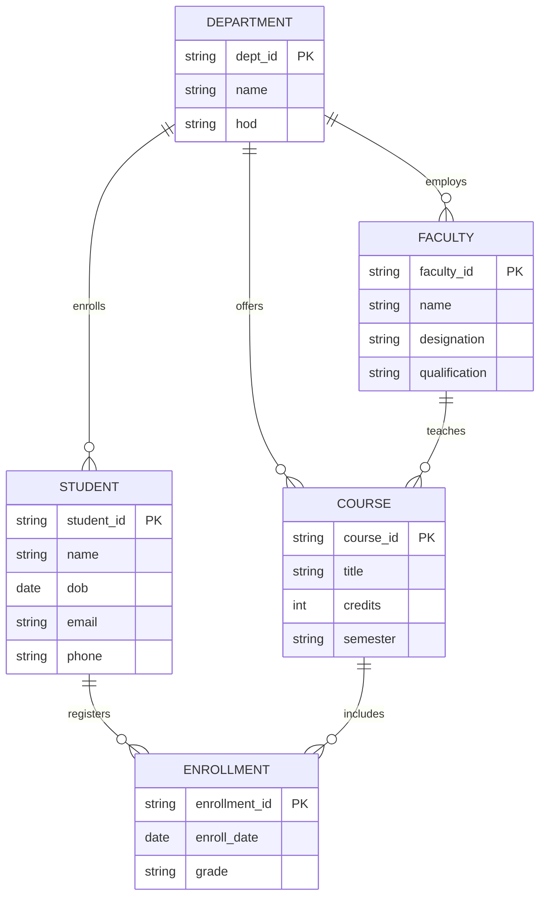

**Mnemonic:** "DECFS" (Departments, Enrollments, Courses, Faculty, Students)

## Question 3(a) [3 marks]

**List different data types in SQL and Explain in brief**

**Answer**:

| Data Type Category | Examples | Usage |
|-------------------|----------|-------|
| **Numeric** | INT, FLOAT, DECIMAL | Store numbers |
| **Character** | CHAR, VARCHAR, TEXT | Store text |
| **Date/Time** | DATE, TIME, TIMESTAMP | Store temporal data |
| **Boolean** | BOOLEAN | Store true/false values |
| **Binary** | BLOB, BINARY | Store binary data |

**Mnemonic:** "NCDBB" (Numbers, Characters, Dates, Booleans, Binaries)

## Question 3(b) [4 marks]

**Explain any two DDL Commands with Syntax and Example**

**Answer**:

| Command | Syntax | Example |
|---------|--------|---------|
| **CREATE** | CREATE TABLE table_name (column_definitions); | CREATE TABLE Student (id INT PRIMARY KEY, name VARCHAR(50)); |
| **ALTER** | ALTER TABLE table_name ADD/DROP/MODIFY column_name data_type; | ALTER TABLE Student ADD email VARCHAR(100); |

**Diagram:**

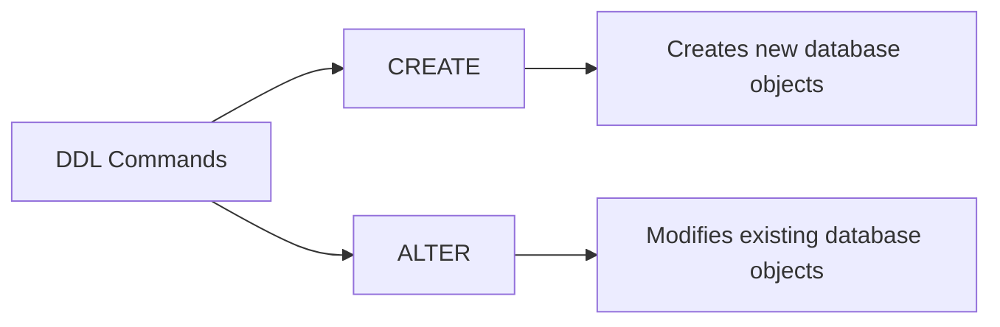

**Mnemonic:** "CAD" (Create And Define)

## Question 3(c) [7 marks]

**Write the Output of Following Query.**
**a. CEIL(123.57), CEIL(4.1)**
**b. MOD(12,4), MOD(10,4)**
**c. POWER(2,3), POWER(3,3)**
**d. ROUND(121.413,1), ROUND(121.413,2)**
**e. FLOOR(25.3),FLOOR(25.7)**
**f. LENGTH('AHMEDABAD')**
**g. ABS(-25),ABS(36)**

**Answer**:

| Function | Result | Explanation |
|----------|--------|-------------|
| **CEIL(123.57)** | 124 | Smallest integer ≥ 123.57 |
| **CEIL(4.1)** | 5 | Smallest integer ≥ 4.1 |
| **MOD(12,4)** | 0 | Remainder of 12÷4 |
| **MOD(10,4)** | 2 | Remainder of 10÷4 |
| **POWER(2,3)** | 8 | 2 raised to power 3 |
| **POWER(3,3)** | 27 | 3 raised to power 3 |
| **ROUND(121.413,1)** | 121.4 | Round to 1 decimal place |
| **ROUND(121.413,2)** | 121.41 | Round to 2 decimal places |
| **FLOOR(25.3)** | 25 | Largest integer ≤ 25.3 |
| **FLOOR(25.7)** | 25 | Largest integer ≤ 25.7 |
| **LENGTH('AHMEDABAD')** | 9 | Number of characters |
| **ABS(-25)** | 25 | Absolute value of -25 |
| **ABS(36)** | 36 | Absolute value of 36 |

**Mnemonic:** "CMPRFLA" (Ceiling, Modulus, Power, Round, Floor, Length, Absolute)

## Question 3(a) OR [3 marks]

**Explain any three Date Functions.**

**Answer**:

| Date Function | Purpose | Example | Result |
|--------------|---------|---------|--------|
| **ADD_MONTHS** | Adds months to date | ADD_MONTHS('01-JAN-2023', 3) | 01-APR-2023 |
| **MONTHS_BETWEEN** | Calculates months between dates | MONTHS_BETWEEN('01-MAR-2023', '01-JAN-2023') | 2 |
| **SYSDATE** | Returns current date and time | SYSDATE | Current system date/time |

**Mnemonic:** "AMS" (Add_months, Months_between, Sysdate)

## Question 3(b) OR [4 marks]

**Explain any two DML Commands with Syntax and Example**

**Answer**:

| Command | Syntax | Example |
|---------|--------|---------|
| **INSERT** | INSERT INTO table_name VALUES (value1, value2,...); | INSERT INTO Student VALUES (1, 'Raj', 'raj@example.com'); |
| **UPDATE** | UPDATE table_name SET column=value WHERE condition; | UPDATE Student SET email='new@example.com' WHERE id=1; |

**Diagram:**

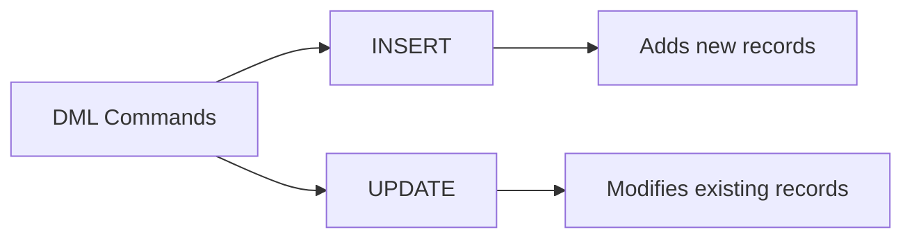

**Mnemonic:** "IUM" (Insert, Update, Manipulate)

## Question 3(c) OR [7 marks]

**For the table: EMP(emp_no, emp_name, designation, salary, deptno), Write SQL commands for following operations.**

**Answer**:

| Operation | SQL Command |
|-----------|-------------|
| **Create table EMP** | CREATE TABLE EMP (emp_no INT PRIMARY KEY, emp_name VARCHAR(50), designation VARCHAR(30), salary DECIMAL(10,2), deptno INT); |
| **Give the emp_no, emp_name, designation, salary, deptno of EMP** | SELECT emp_no, emp_name, designation, salary, deptno FROM EMP; |
| **Display information of all employees whose name starts with 'p'** | SELECT * FROM EMP WHERE emp_name LIKE 'p%'; |
| **Display department wise salary total** | SELECT deptno, SUM(salary) AS total_salary FROM EMP GROUP BY deptno; |
| **Add new column email_id in EMP table** | ALTER TABLE EMP ADD email_id VARCHAR(100); |
| **Change the column name "designation" to "post"** | ALTER TABLE EMP RENAME COLUMN designation TO post; |
| **Delete all the records from the table person** | DELETE FROM person; |

**Mnemonic:** "CSDAACD" (Create, Select, Display, Aggregate, Add, Change, Delete)

## Question 4(a) [3 marks]

**List different aggregate functions and explain any one with syntax and example.**

**Answer**:

| Aggregate Function | Purpose |
|-------------------|---------|
| **SUM** | Calculates total |
| **AVG** | Calculates average |
| **COUNT** | Counts number of rows |
| **MAX** | Finds maximum value |
| **MIN** | Finds minimum value |

**Example for AVG:**  
`AVG(column_name)` - Calculates average of values in column  
`SELECT AVG(salary) FROM Employee;` - Returns average salary

**Mnemonic:** "SCAMM" (Sum, Count, Avg, Max, Min)

## Question 4(b) [4 marks]

**Define the transaction with example.**

**Answer**:

| Transaction Concept | Description |
|--------------------|-------------|
| **Definition** | Logical unit of work that must be completely processed or completely fail |
| **Properties** | ACID (Atomicity, Consistency, Isolation, Durability) |
| **States** | Active, Partially Committed, Committed, Failed, Aborted |

**Example:**

```sql
BEGIN TRANSACTION;
    UPDATE Accounts SET balance = balance - 5000 WHERE acc_no = 'A123';
    UPDATE Accounts SET balance = balance + 5000 WHERE acc_no = 'B456';
COMMIT;
```

**Mnemonic:** "TAPS" (Transaction As Process Set)

## Question 4(c) [7 marks]

**What is an Operator in SQL? Explain Arithmetic and Logical operators with Syntax and Example**

**Answer**:

| Type | Operators | Example | Result |
|------|-----------|---------|--------|
| **Arithmetic** | + (Addition) | 5 + 3 | 8 |
|  | - (Subtraction) | 5 - 3 | 2 |
|  | * (Multiplication) | 5 * 3 | 15 |
|  | / (Division) | 15 / 3 | 5 |
|  | % (Modulus) | 5 % 2 | 1 |
| **Logical** | AND | salary > 30000 AND dept = 'IT' | True if both conditions true |
|  | OR | salary > 50000 OR dept = 'HR' | True if either condition true |
|  | NOT | NOT (salary < 20000) | True if salary not less than 20000 |

**SQL Examples:**

```sql
-- Arithmetic
SELECT product_name, price * 1.18 AS price_with_tax FROM Products;

-- Logical
SELECT * FROM Employees WHERE (salary > 30000 AND dept = 'IT') OR (experience > 5);
```

**Mnemonic:** "ASMDOLA" (Add, Subtract, Multiply, Divide, OR, AND, NOT)

## Question 4(a) OR [3 marks]

**List different numeric functions and explain any one with syntax and example.**

**Answer**:

| Numeric Function | Purpose |
|-----------------|---------|
| **ROUND** | Rounds a number to specified decimal places |
| **TRUNC** | Truncates a number to specified decimal places |
| **CEIL** | Returns smallest integer greater than or equal to number |
| **FLOOR** | Returns largest integer less than or equal to number |
| **ABS** | Returns absolute value |

**Example for ROUND:**  
`ROUND(number, decimal_places)` - Rounds number to specified decimal places  
`SELECT ROUND(125.679, 2) FROM DUAL;` - Returns 125.68

**Mnemonic:** "RTCFA" (Round, Truncate, Ceiling, Floor, Absolute)

## Question 4(b) OR [4 marks]

**List various database operations of a transaction.**

**Answer**:

| Operation | Description |
|-----------|-------------|
| **BEGIN/START** | Marks transaction start point |
| **READ** | Retrieves data from database |
| **WRITE** | Modifies data in database |
| **COMMIT** | Makes changes permanent |
| **ROLLBACK** | Undoes changes and returns to start point |
| **SAVEPOINT** | Creates points to rollback partially |

**Diagram:**

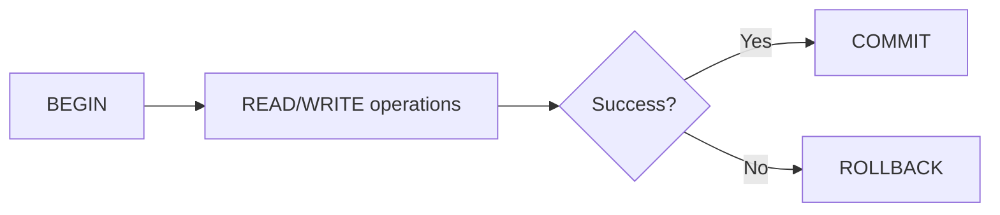

**Mnemonic:** "BRWCRS" (Begin, Read, Write, Commit, Rollback, Savepoint)

## Question 4(c) OR [7 marks]

**What is join? Explain different types of joins with syntax and example.**

**Answer**:

| Join Type | Description | Syntax Example |
|-----------|-------------|----------------|
| **INNER JOIN** | Returns rows when there is a match in both tables | SELECT * FROM TableA INNER JOIN TableB ON TableA.id = TableB.id; |
| **LEFT JOIN** | Returns all rows from left table and matched rows from right | SELECT * FROM TableA LEFT JOIN TableB ON TableA.id = TableB.id; |
| **RIGHT JOIN** | Returns all rows from right table and matched rows from left | SELECT * FROM TableA RIGHT JOIN TableB ON TableA.id = TableB.id; |
| **FULL JOIN** | Returns rows when there is a match in one of the tables | SELECT * FROM TableA FULL JOIN TableB ON TableA.id = TableB.id; |
| **SELF JOIN** | Joins a table to itself | SELECT * FROM Employee e1 JOIN Employee e2 ON e1.manager_id = e2.emp_id; |

**Diagram:**

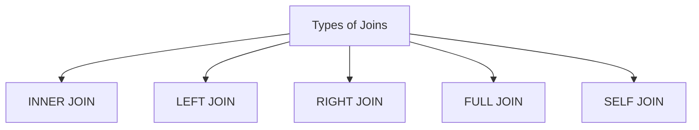

**Mnemonic:** "ILRFS" (Inner, Left, Right, Full, Self)

## Question 5(a) [3 marks]

**Convert the customer relation into 1NF shown below.**
**Customer**

| cid | name | address | Contact_no |
|-----|------|---------|------------|
| CO1 | Riya | Amu aavas, Anand | {5322332123} |
| CO2 | Jiya | Sardar colony, Ahmedabad | {5326521456, 5265232849} |

**Answer**:

**Customer Table (1NF):**

| cid | name | society | city | Contact_no |
|-----|------|---------|------|------------|
| CO1 | Riya | Amu aavas | Anand | 5322332123 |
| CO2 | Jiya | Sardar colony | Ahmedabad | 5326521456 |
| CO2 | Jiya | Sardar colony | Ahmedabad | 5265232849 |

**Mnemonic:** "AFM" (Atomic values, Flatten Multivalued attributes)

## Question 5(b) [4 marks]

**List and Explain ACID properties of transaction.**

**Answer**:

| ACID Property | Description |
|---------------|-------------|
| **Atomicity** | Transaction executes completely or not at all |
| **Consistency** | Database remains consistent before and after transaction |
| **Isolation** | Concurrent transactions don't interfere with each other |
| **Durability** | Committed changes are permanent even after system failure |

**Diagram:**

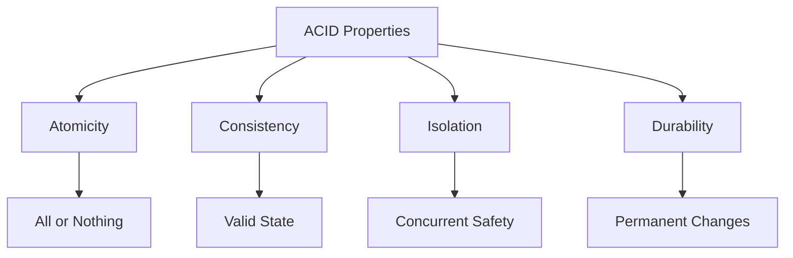

**Mnemonic:** "ACID" (Atomicity, Consistency, Isolation, Durability)

## Question 5(c) [7 marks]

**List different types of functional dependencies and explain each using example.**

**Answer**:

| Functional Dependency | Description | Example |
|----------------------|-------------|---------|
| **Trivial FD** | X → Y where Y is a subset of X | {StudentID, Name} → {Name} |
| **Non-trivial FD** | X → Y where Y is not a subset of X | {StudentID} → {Name} |
| **Partial FD** | Part of composite key determines non-key attribute | {CourseID, StudentID} → {CourseName} |
| **Transitive FD** | X → Y and Y → Z implies X → Z | {StudentID} → {DeptID} and {DeptID} → {DeptName} |
| **Multivalued FD** | One attribute determines set of values for another | {CourseID} →→ {TextbookID} |

**Diagram:**

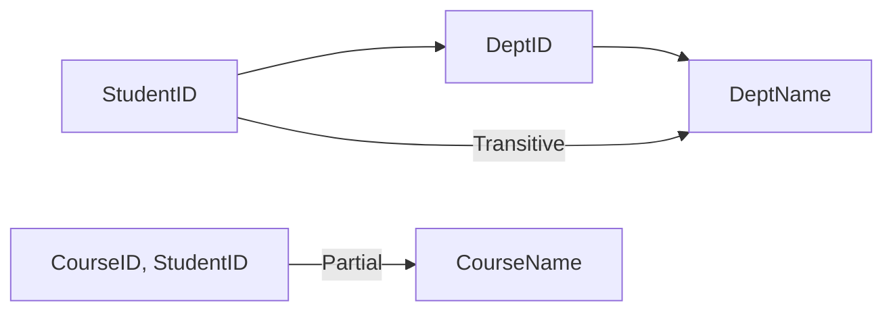

**Mnemonic:** "TNPTMv" (Trivial, Non-trivial, Partial, Transitive, Multivalued)

## Question 5(a) OR [3 marks]

**Convert the Depositor_Account relation into 2NF shown below.**
**Where functional dependencies(FD) are as under,**
**FD1: {cid, ano} → {access_date, balance, bname}**
**FD2: ano → {balance, bname}**

**Depositor_Account**

| cid | ano | access_date | balance | bname |
|-----|-----|-------------|---------|-------|

**Answer**:

**Account Table (2NF):**

| ano | balance | bname |
|-----|---------|-------|

**Depositor Table (2NF):**

| cid | ano | access_date |
|-----|-----|-------------|

**Mnemonic:** "RPKD" (Remove Partial Key Dependencies)

## Question 5(b) OR [4 marks]

**Explain conflict serializability.**

**Answer**:

| Concept | Description |
|---------|-------------|
| **Definition** | Schedule is conflict serializable if equivalent to some serial schedule |
| **Conflict Operations** | Read-Write, Write-Read, Write-Write operations on same data item |
| **Conflict Graph** | Directed graph showing conflicts between transactions |
| **Testing** | Schedule is conflict serializable if conflict graph has no cycles |

**Diagram:**

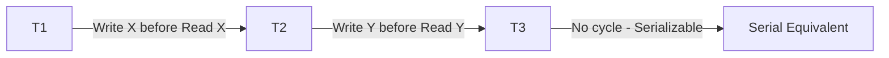

**Mnemonic:** "COGS" (Conflict Operations Graph Serializable)

## Question 5(c) OR [7 marks]

**Explain 3NF normalization with example**

**Answer**:

| Normal Form | Definition | Example |
|-------------|------------|---------|
| **1NF** | Atomic values, no repeating groups | Student(ID, Name, Phone1, Phone2) → Student(ID, Name, Phone) |
| **2NF** | 1NF + No partial dependencies | Order(OrderID, ProductID, CustomerID, ProductName) → Order(OrderID, ProductID, CustomerID) + Product(ProductID, ProductName) |
| **3NF** | 2NF + No transitive dependencies | Student(ID, DeptID, DeptName) → Student(ID, DeptID) + Department(DeptID, DeptName) |

**Violation Example:**

```
Employee(EmpID, EmpName, DeptID, DeptName, Location)
```

**3NF Conversion:**

```
Employee(EmpID, EmpName, DeptID)
Department(DeptID, DeptName, Location)
```

**Diagram:**

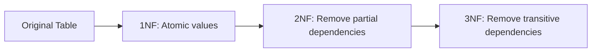

**Mnemonic:** "APTN" (Atomic values, Partial dependencies removed, Transitive dependencies removed, Normalized)
