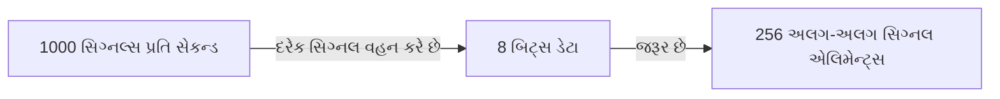
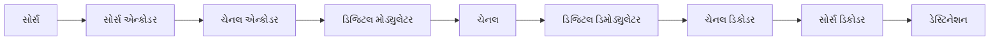
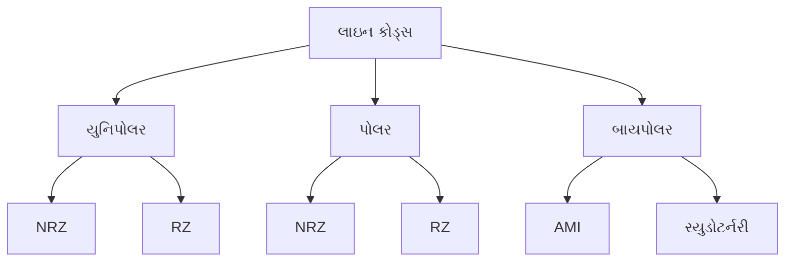
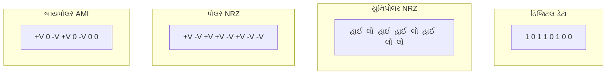
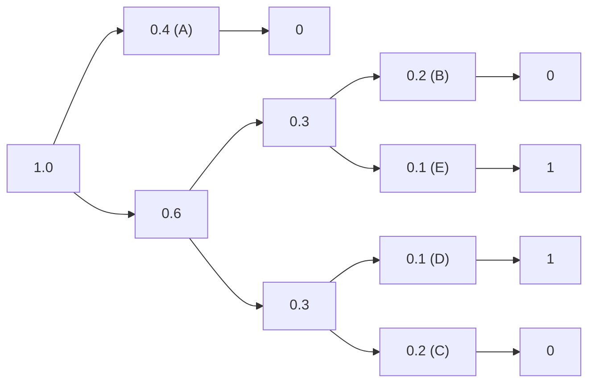
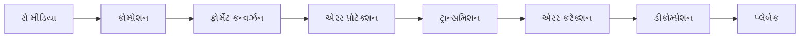
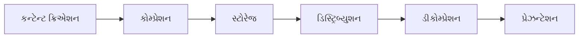
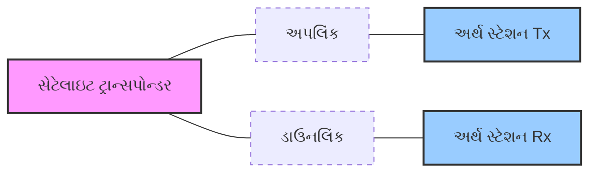
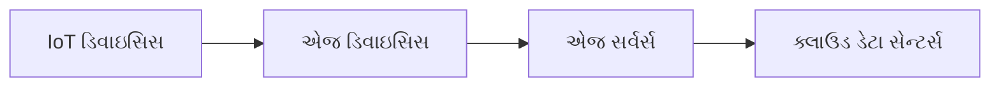
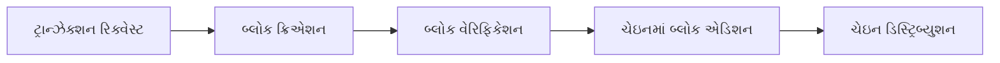

## પ્રશ્ન 1(અ) [3 ગુણ]

**વ્યાખ્યાયિત કરો: (1) બીટ રેટ, (2) બાઉન્ડ રેટ અને (3) બેન્ડવિડ્થ**

**જવાબ**:

| શબ્દ | વ્યાખ્યા |
|------|------------|
| **બીટ રેટ** | દર સેકન્ડે ટ્રાન્સમિટ થતા બિટ્સની સંખ્યા (bps) |
| **બાઉન્ડ રેટ** | દર સેકન્ડે ટ્રાન્સમિટ થતા સિગ્નલ એલિમેન્ટ્સ અથવા સિમ્બોલ્સની સંખ્યા |
| **બેન્ડવિડ્થ** | સિગ્નલ ટ્રાન્સમિટ કરવા માટે જરૂરી ફ્રીક્વન્સીઓની રેન્જ, હર્ટ્ઝ (Hz)માં માપવામાં આવે છે |

**મેમરી ટ્રીક:** "BBB - બિટ્સ મૂવ બાય બેન્ડ્સ"

## પ્રશ્ન 1(બ) [4 ગુણ]

**સિગ્નલનો બીટ રેટ 8000bps અને બાઉન્ડ રેટ 1000 બાઉન્ડ છે. દરેક સિગ્નલ દ્વારા કેટલા ડેટા એલિમેન્ટ વહન કરવામાં આવે છે? આપણને કેટલા સિગ્નલ તત્વોની જરૂર છે?**

**જવાબ**:

**કોષ્ટક: સિગ્નલ ગણતરી**

| પેરામીટર | મૂલ્ય | ગણતરી |
|-----------|-------|-------------|
| બીટ રેટ | 8000 bps | આપેલ છે |
| બાઉન્ડ રેટ | 1000 બાઉન્ડ | આપેલ છે |
| દરેક સિગ્નલમાં ડેટા એલિમેન્ટ્સ | 8 બિટ્સ | બીટ રેટ ÷ બાઉન્ડ રેટ = 8000 ÷ 1000 = 8 |
| જરૂરી સિગ્નલ એલિમેન્ટ્સ | 2^8 = 256 | 2^(દરેક સિગ્નલના બિટ્સ) |

**આકૃતિ: સિગ્નલ એલિમેન્ટ રેપ્રેઝન્ટેશન**



**મેમરી ટ્રીક:** "ડિવાઇડ ટુ ડિસાઇડ" - દરેક સિગ્નલમાં કેટલા બિટ્સ છે તે નક્કી કરવા માટે બીટ રેટને બાઉન્ડ રેટથી ભાગો.

## પ્રશ્ન 1(ક) [7 ગુણ]

**ડિજીટલ કોમ્યુનિકેશન સિસ્ટમના તત્વોનું તેના બ્લોક ડાયાગ્રામ સાથે વર્ણન કરો**

**જવાબ**:

**આકૃતિ: ડિજિટલ કોમ્યુનિકેશન સિસ્ટમ**



**મુખ્ય તત્વો:**

| તત્વ | કાર્ય |
|---------|----------|
| **સોર્સ** | ટ્રાન્સમિટ કરવા માટેના મેસેજ જનરેટ કરે છે |
| **સોર્સ એન્કોડર** | મેસેજને ડિજિટલ ફોર્મેટમાં કન્વર્ટ કરે છે, રિડન્ડન્સી દૂર કરે છે |
| **ચેનલ એન્કોડર** | એરર ડિટેક્શન/કરેક્શન માટે રિડન્ડન્સી ઉમેરે છે |
| **ડિજિટલ મોડ્યુલેટર** | ડિજિટલ ડેટાને ચેનલ માટે યોગ્ય સિગ્નલમાં રૂપાંતરિત કરે છે |
| **ચેનલ** | ભૌતિક માધ્યમ જે સિગ્નલને વહન કરે છે |
| **ડિજિટલ ડિમોડ્યુલેટર** | પ્રાપ્ત સિગ્નલમાંથી ડિજિટલ માહિતી અલગ કરે છે |
| **ચેનલ ડિકોડર** | ઉમેરેલી રિડન્ડન્સીનો ઉપયોગ કરીને ભૂલો શોધે/સુધારે છે |
| **સોર્સ ડિકોડર** | ડિજિટલ ડેટામાંથી ઓરિજિનલ મેસેજને ફરીથી બનાવે છે |
| **ડેસ્ટિનેશન** | અંતિમ મેસેજ પ્રાપ્ત કરે છે |

**મેમરી ટ્રીક:** "સેન્ડ મેસેજિસ કેરફુલી; ડેસ્ટિનેશન મસ્ટ કોમ્પ્રિહેન્ડ સિગ્નલ્સ ડીપલી"

## પ્રશ્ન 1(ક OR) [7 ગુણ]

**ડિજિટલ કોમ્યુનિકેશન સિસ્ટમની મૂળભૂત મર્યાદા શું છે? ડિજિટલ કોમ્યુનિકેશન સિસ્ટમના ફાયદા અને ગેરફાયદા શું છે?**

**જવાબ**:

**મૂળભૂત મર્યાદાઓ:**

| મર્યાદા | વર્ણન |
|------------|-------------|
| **બેન્ડવિડ્થ** | ડિજિટલ સિગ્નલને એનાલોગ કરતાં વધુ બેન્ડવિડ્થની જરૂર પડે છે |
| **નોઇઝ** | મહત્તમ પ્રાપ્ય ડેટા રેટને મર્યાદિત કરે છે |
| **ઇક્વિપમેન્ટ** | ડિજિટલ સિસ્ટમને જટિલ હાર્ડવેર અને પ્રોસેસિંગની જરૂર પડે છે |

**ફાયદા vs ગેરફાયદા:**

| ફાયદા | ગેરફાયદા |
|------------|---------------|
| **નોઇઝ ઇમ્યુનિટી** | ઊંચી બેન્ડવિડ્થની જરૂરિયાતો |
| **સરળ મલ્ટિપ્લેક્સિંગ** | જટિલ ઉપકરણો |
| **એરર ડિટેક્શન & કરેક્શન** | ક્વોન્ટાઇઝેશન એરર |
| **વધુ સુરક્ષા** | સિંક્રોનાઇઝેશન સમસ્યાઓ |
| **સિગ્નલ રિજનરેશન** | ઊંચી પ્રારંભિક કિંમત |
| **કોમ્પ્યુટર સાથે ઇન્ટિગ્રેશન** | સેમ્પલિંગ રેટની મર્યાદાઓ |

**મેમરી ટ્રીક:** "NEEDS" - નોઇઝ, ઇક્વિપમેન્ટ, એન્ડ એન્વાયરન્મેન્ટ ડિટરમાઇન સક્સેસ

## પ્રશ્ન 2(અ) [3 ગુણ]

**બ્લોક ડાયાગ્રામ સાથે QPSK મોડ્યુલેટરનું વર્ણન કરો**

**જવાબ**:

**આકૃતિ: QPSK મોડ્યુલેટર**

```goat
              +------------+
              |  2-bit     |          +-----------+
input         | Serial-to- |--bit 1-->| Cos       |
data -------->| Parallel   |          | Carrier   |----+
              | Converter  |          +-----------+    |   QPSK
              |            |                           +-->Signal
              |            |          +-----------+    |   Output
              |            |--bit 2-->| Sin       |----+
              +------------+          | Carrier   |
                                      +-----------+
```

**મુખ્ય ઘટકો:**

- **સીરિયલ-ટુ-પેરેલલ કન્વર્ટર**: ડેટાને 2-બિટ ગ્રુપ્સમાં વિભાજિત કરે છે
- **કોસાઇન કેરિયર**: પ્રથમ બિટને મોડ્યુલેટ કરે છે (I-ચેનલ)
- **સાઇન કેરિયર**: બીજા બિટને મોડ્યુલેટ કરે છે (Q-ચેનલ)

**મેમરી ટ્રીક:** "સ્પ્લિટ પેર, કેરિયર સ્ક્વેર" - ડેટા જોડી (પેર)માં વહેંચાય છે, ચોરસ સિગ્નલ્સ દ્વારા વહન થાય છે

## પ્રશ્ન 2(બ) [4 ગુણ]

**બ્લોક ડાયાગ્રામ સાથે ASK મોડ્યુલેટરનું વર્ણન કરો**

**જવાબ**:

**આકૃતિ: ASK મોડ્યુલેટર**

```goat
              +------------+     +---------+
Digital       | Product    |     |         |
Input ------->| Modulator  |---->| Filter  |---> ASK Signal
              | (Mixer)    |     |         |
              +------------+     +---------+
                     ^
                     |
              +------------+
              | Carrier    |
              | Oscillator |
              +------------+
```

**ASK મોડ્યુલેશન પ્રક્રિયા:**

| ઘટક | કાર્ય |
|-----------|----------|
| **ડિજિટલ ઇનપુટ** | ટ્રાન્સમિટ કરવાના બાઇનરી ડેટા (0 અને 1) |
| **કેરિયર ઓસિલેટર** | ઉચ્ચ ફ્રીક્વન્સી સાઇન વેવ જનરેટ કરે છે |
| **પ્રોડક્ટ મોડ્યુલેટર** | ઇનપુટને કેરિયર સાથે ગુણે છે (ON/OFF) |
| **ફિલ્ટર** | અનિચ્છનીય ફ્રીક્વન્સી ઘટકોને દૂર કરે છે |

**મેમરી ટ્રીક:** "એમ્પ્લિફાય સિગ્નલ વેન કીન" - સિગ્નલ હાઈ હોય ત્યારે કેરિયર એમ્પ્લિટ્યુડ બદલાય છે

## પ્રશ્ન 2(ક) [7 ગુણ]

**ASK, FSK અને PSK ની સરખામણી કરો અને ઇનપુટ ડિજિટલ સિગ્નલ 100101000101 માટે ASK, FSK અને PSK ના વેવ ફોર્મ દોરો**

**જવાબ**:

**તુલનાત્મક કોષ્ટક:**

| પેરામીટર | ASK | FSK | PSK |
|-----------|-----|-----|-----|
| **મોડ્યુલેશન પેરામીટર** | એમ્પ્લિટ્યુડ | ફ્રીક્વન્સી | ફેઝ |
| **નોઇઝ ઇમ્યુનિટી** | ખરાબ | મધ્યમ | સારું |
| **બેન્ડવિડ્થ** | સાંકડું | વિશાળ | મધ્યમ |
| **પાવર એફિશિયન્સી** | ખરાબ | મધ્યમ | સારું |
| **ઇમ્પ્લિમેન્ટેશન** | સરળ | મધ્યમ | જટિલ |
| **BER પરફોર્મન્સ** | ખરાબ | મધ્યમ | સારું |

**ઇનપુટ 100101000101 માટે વેવફોર્મ્સ:**

```goat
Digital: ‾‾‾_‾_‾‾___‾_‾  (1 0 0 1 0 1 0 0 0 1 0 1)
         
ASK:     ✓✓✓___✓___✓✓✓___✓___✓✓✓
         high low low high low high low low low high low high

FSK:     ✓✓✓~~~✓✓✓~~~✓✓✓~~~✓✓✓~~~✓✓✓
         f1  f2  f2  f1  f2  f1  f2  f2  f2  f1  f2  f1

PSK:     ✓✓✓˜˜˜✓✓✓˜˜˜✓✓✓˜˜˜✓✓✓˜˜˜✓✓✓
         0°  180° 180° 0°  180° 0°  180° 180° 180° 0°  180° 0°
```

**મેમરી ટ્રીક:** "AFP - ઓલ્ટર ફ્રીક્વન્સીઝ ઓર ફેઝિસ" - મોડ્યુલેશન પ્રકારો યાદ રાખવા માટે

## પ્રશ્ન 2(અ OR) [3 ગુણ]

**બ્લોક ડાયાગ્રામ સાથે QPSK ડિમોડ્યુલેટરનું વર્ણન કરો**

**જવાબ**:

**આકૃતિ: QPSK ડિમોડ્યુલેટર**

```goat
                +-----------+
                | Cos       |
                | Carrier   |--+
                +-----------+  |
                               v
QPSK      +-----+      +------------+     +---------+
Signal--->| BPF |----->| Product    |---->| LPF     |----> Bit 1
          +-----+      | Detect     |     +---------+
                       +------------+
                             ^
                             |      +------------+    +---------+
                             +----->| Product    |--->| LPF     |----> Bit 2
                                    | Detect     |    +---------+
                             +      +------------+
                             |
                        +-----------+
                        | Sin       |
                        | Carrier   |
                        +-----------+
```

**મુખ્ય ઘટકો:**

- **BPF (બેન્ડપાસ ફિલ્ટર)**: સિગ્નલ બેન્ડવિડ્થ બહારના નોઇઝને દૂર કરે છે
- **પ્રોડક્ટ ડિટેક્ટર્સ**: કેરિયર સિગ્નલ્સ (cos & sin) સાથે ગુણાકાર કરે છે
- **LPF (લોપાસ ફિલ્ટર્સ)**: મૂળ ડેટા બિટ્સને અલગ કરે છે

**મેમરી ટ્રીક:** "ફિલ્ટર્ડ પેર્સ ડિલિવર ડેટા" - ફિલ્ટર્સ અને જોડી કેરિયર્સ ડેટા પુનઃપ્રાપ્ત કરે છે

## પ્રશ્ન 2(બ) [4 ગુણ]

**ASK, BPSK અને QPSK ના નક્ષત્ર રેખાકૃતિ દોરો**

**જવાબ**:

**નક્ષત્ર આકૃતિઓ:**

```goat
ASK Constellation:      BPSK Constellation:     QPSK Constellation:
       
       |                      |                      |
       |                      |                      |      * 01
       |                      |                      |
       |                      |                      |
-------+-------       -------+-------       -------+-------
       |                      |                      |
       |                      |                      |
   *   |               *      |      *         *     |     *
 (0)   |  * (1)         (1)   |    (0)        10     |    00
       |                      |                      |
Q axis |                Q axis|                Q axis|
       I axis                 I axis                 I axis
```

**કોષ્ટક: નક્ષત્ર આકૃતિઓની લક્ષણો**

| મોડ્યુલેશન | પોઇન્ટ્સ | ફેઝ સ્ટેટ્સ | એમ્પ્લિટ્યુડ સ્ટેટ્સ |
|------------|--------|--------------|------------------|
| **ASK** | 2 | 1 (0°) | 2 (0, A) |
| **BPSK** | 2 | 2 (0°, 180°) | 1 (A) |
| **QPSK** | 4 | 4 (45°, 135°, 225°, 315°) | 1 (A) |

**મેમરી ટ્રીક:** "પોઇન્ટ્સ ડબલ વેન ફેઝિસ ડબલ" - BPSK માં 2 પોઇન્ટ્સ છે, QPSK માં 4 પોઇન્ટ્સ છે

## પ્રશ્ન 2(ક) [7 ગુણ]

**બ્લોક ડાયાગ્રામ અને આઉટપુટ વેવ ફોર્મ સાથે FSK મોડ્યુલેટર અને ડિમોડ્યુલેટરનું વર્ણન કરો**

**જવાબ**:

**FSK મોડ્યુલેટર આકૃતિ:**

```goat
                         +---------+
             +--------+  |         |
     '1' --->| Switch |->| Osc f1  |--+
             |        |  |         |  |
Digital      +--------+  +---------+  |     +---------+
Input ---+                            +---->|         |
          |                                 | Adder   |---> FSK Signal
          |   +--------+  +---------+  +--->|         |
     '0' -+-->| Switch |->| Osc f2  |--+    +---------+
              |        |  |         |
              +--------+  +---------+
```

**FSK ડિમોડ્યુલેટર આકૃતિ:**

```goat
                +---------+  +---------+  +---------+
                |         |  |         |  |         |
                | BPF f1  |->| Env     |->| Thresh  |--+
                |         |  | Detect  |  | Detect  |  |
                +---------+  +---------+  +---------+  |
                                                       |  +---------+
FSK Signal --+                                         +->|         |
             |                                            | Logic   |---> Digital
             |  +---------+  +---------+  +---------+  +->| Circuit |     Output
             |  |         |  |         |  |         |  |  |         |
             +->| BPF f2  |->| Env     |->| Thresh  |--+  +---------+
                |         |  | Detect  |  | Detect  |
                +---------+  +---------+  +---------+
```

**FSK વેવફોર્મ:**

```goat
Digital:  ___‾‾‾___
          0  1  0

FSK:      ~~~~~~~
          f2 f1 f2
          Low freq when 0
          High freq when 1
```

**મુખ્ય ઘટકો:**

| ઘટક | કાર્ય |
|-----------|----------|
| **ઓસિલેટર્સ** | 0 અને 1 માટે અલગ ફ્રીક્વન્સી જનરેટ કરે છે |
| **બેન્ડપાસ ફિલ્ટર્સ** | બે ફ્રીક્વન્સીઓને અલગ કરે છે |
| **એન્વેલોપ ડિટેક્ટર્સ** | એમ્પ્લિટ્યુડ વેરિએશન્સ અલગ કરે છે |
| **થ્રેશોલ્ડ ડિટેક્ટર્સ** | એનાલોગને ડિજિટલમાં કન્વર્ટ કરે છે |

**મેમરી ટ્રીક:** "ફ્રીક્વન્સી શિફ્ટ કી - ટુ ટોન્સ ટેલ ટ્રુથ"

## પ્રશ્ન 3(અ) [3 ગુણ]

**સંચારમાં સંભાવનાનું મહત્વ જણાવો**

**જવાબ**:

| મહત્વ | વર્ણન |
|--------------|-------------|
| **ઇન્ફોર્મેશન મેઝરમેન્ટ** | મેસેજમાં અનિશ્ચિતતા/આશ્ચર્યને ક્વાન્ટિફાય કરે છે |
| **ચેનલ કેપેસિટી** | શક્ય મહત્તમ ડેટા રેટ નિર્ધારિત કરે છે |
| **એરર એનાલિસિસ** | કોમ્યુનિકેશન એરર્સની આગાહી કરે છે અને ન્યૂનતમ કરે છે |

**મેમરી ટ્રીક:** "ICE - ઇન્ફોર્મેશન, કેપેસિટી, એરર્સ" ને સંભાવનાની જરૂર પડે છે

## પ્રશ્ન 3(બ) [4 ગુણ]

**SNR ના સંદર્ભમાં રાજ્ય ચેનલ ક્ષમતા અને તેનું મહત્વ સમજાવો**

**જવાબ**:

**શેનન ચેનલ કેપેસિટી ફોર્મ્યુલા:**

```
C = B × log₂(1 + SNR)
```

**જ્યાં:**

- C = ચેનલ કેપેસિટી (બિટ્સ/સેકન્ડ)
- B = બેન્ડવિડ્થ (Hz)
- SNR = સિગ્નલ-ટુ-નોઇઝ રેશિયો

**મહત્વ:**

| પાસું | મહત્વ |
|--------|------------|
| **થિયોરેટિકલ લિમિટ** | એરર-ફ્રી ડેટા રેટની મહત્તમ શક્ય સીમા નિર્ધારિત કરે છે |
| **સિસ્ટમ ડિઝાઇન** | બેન્ડવિડ્થ અને પાવર જરૂરિયાતોનું માર્ગદર્શન આપે છે |
| **પરફોર્મન્સ ઇવેલ્યુએશન** | વાસ્તવિક સિસ્ટમ પરફોર્મન્સ માટે બેન્ચમાર્ક |
| **કોડિંગ એફિશિયન્સી** | દર્શાવે છે કે સિસ્ટમ ઓપ્ટિમલ પરફોર્મન્સથી કેટલી નજીક છે |

**મેમરી ટ્રીક:** "BEST" - બેન્ડવિડ્થ એન્ડ એરર-ફ્રી સિગ્નલ ટ્રાન્સમિશન

## પ્રશ્ન 3(ક) [7 ગુણ]

**યોગ્ય ઉદાહરણ સાથે લાઇન કોડના વર્ગીકરણની ચર્ચા કરો**

**જવાબ**:

**આકૃતિ: લાઇન કોડ વર્ગીકરણ**



**લાઇન કોડ ઉદાહરણો:**



**વેવફોર્મ વિઝ્યુલાઇઝેશન:**

```goat
Data:       1    0    1    1    0    1    0    0
           _|_   |   _|_  _|_   |   _|_   |    |

Unipolar   ‾‾‾‾‾     ‾‾‾‾‾‾‾‾‾     ‾‾‾‾‾
NRZ:       _____‾‾‾‾‾_____‾‾‾‾‾‾‾‾‾_____‾‾‾‾‾‾‾‾‾‾‾‾‾

Polar      ‾‾‾‾‾_____‾‾‾‾‾‾‾‾‾_____‾‾‾‾‾_______________
NRZ:       

Bipolar    ‾‾‾‾‾     _____‾‾‾‾‾     
AMI:       _____‾‾‾‾‾     _____‾‾‾‾‾‾‾‾‾‾‾‾‾‾‾‾‾‾‾‾‾‾‾
           (+ for first 1, - for second 1, etc.)
```

**તુલનાત્મક કોષ્ટક:**

| લાઇન કોડ પ્રકાર | સિગ્નલ લેવલ્સ | DC કોમ્પોનેન્ટ | ક્લોક રિકવરી | બેન્ડવિડ્થ |
|----------------|---------------|--------------|----------------|-----------|
| **યુનિપોલર NRZ** | 0, +A | હા | ખરાબ | સાંકડું |
| **પોલર NRZ** | -A, +A | કદાચ | ખરાબ | મધ્યમ |
| **બાયપોલર AMI** | -A, 0, +A | ના | સારું | વિશાળ |

**મેમરી ટ્રીક:** "UPB - યુઝ પ્રોપર બિટ્સ" - યુનિપોલર, પોલર, બાયપોલર માટે

## પ્રશ્ન 3(અ OR) [3 ગુણ]

**શરતી સંભાવનાની ચર્ચા કરો**

**જવાબ**:

**શરતી સંભાવના વ્યાખ્યા:**

```
P(A|B) = P(A∩B) / P(B)
```

**કોષ્ટક: કોમ્યુનિકેશનમાં શરતી સંભાવના**

| એપ્લિકેશન | વર્ણન |
|-------------|-------------|
| **ચેનલ મોડેલિંગ** | X મોકલવામાં આવ્યું હોય તો Y પ્રાપ્ત થવાની સંભાવના |
| **એરર ડિટેક્શન** | ચોક્કસ પેટર્ન આપેલી હોય તે સંજોગોમાં એરર થવાની સંભાવના |
| **નિર્ણય લેવો** | અવલોકનોના આધારે રિસીવર નિર્ણયને ઓપ્ટિમાઇઝ કરવું |

**મેમરી ટ્રીક:** "CEaD" - કેલ્ક્યુલેટ ઇવેન્ટ્સ આફ્ટર ડેટા

## પ્રશ્ન 3(બ) [4 ગુણ]

**એન્ટ્રોપી અને માહિતી વ્યાખ્યાયિત કરો. તેના ભૌતિક મહત્વની ચર્ચા કરો**

**જવાબ**:

**વ્યાખ્યાઓ:**

| શબ્દ | વ્યાખ્યા | ફોર્મ્યુલા |
|------|------------|---------|
| **એન્ટ્રોપી** | સોર્સમાં સરેરાશ માહિતી સામગ્રી | H(X) = -∑P(x)log₂P(x) |
| **માહિતી** | અનિશ્ચિતતા ઘટાડાનું માપ | I(x) = log₂(1/P(x)) |

**ભૌતિક મહત્વ:**

| પાસું | મહત્વ |
|--------|-------------|
| **અનપ્રેડિક્ટેબિલિટી** | ઊંચી એન્ટ્રોપીનો અર્થ છે ઓછો પ્રેડિક્ટેબલ સોર્સ |
| **કોમ્પ્રેશન લિમિટ** | સોર્સને રજૂ કરવા માટે જરૂરી ન્યૂનતમ બિટ્સ |
| **ઓપ્ટિમલ કોડિંગ** | કાર્યક્ષમ સોર્સ કોડિંગ ડિઝાઇનનું માર્ગદર્શન આપે છે |
| **રિસોર્સ એલોકેશન** | બેન્ડવિડ્થ/પાવર જરૂરિયાતો નક્કી કરે છે |

**મેમરી ટ્રીક:** "UCOR" - અનસર્ટેનીટી કોરિલેટ્સ વિથ ઓપ્ટિમલ રિસોર્સિસ

## પ્રશ્ન 3(ક) [7 ગુણ]

**યોગ્ય ઉદાહરણ સાથે હફમેન કોડનું વર્ણન કરો**

**જવાબ**:

**હફમેન કોડિંગ: લોસલેસ ડેટા કોમ્પ્રેશન માટે વેરિએબલ-લેન્થ પ્રીફિક્સ કોડ**

**ઉદાહરણ: સિમ્બોલ્સ {A, B, C, D, E} એન્કોડિંગ**

**સ્ટેપ 1: સંભાવના ગણતરી**

| સિમ્બોલ | સંભાવના |
|--------|-------------|
| A | 0.4 |
| B | 0.2 |
| C | 0.2 |
| D | 0.1 |
| E | 0.1 |

**સ્ટેપ 2: હફમેન ટ્રી બનાવો**



**સ્ટેપ 3: કોડ્સ અસાઇન કરો**

| સિમ્બોલ | સંભાવના | હફમેન કોડ |
|--------|-------------|--------------|
| A | 0.4 | 0 |
| B | 0.2 | 10 |
| C | 0.2 | 11 |
| D | 0.1 | 100 |
| E | 0.1 | 101 |

**સરેરાશ કોડ લંબાઈ:** (0.4×1) + (0.2×2) + (0.2×2) + (0.1×3) + (0.1×3) = 1.8 બિટ્સ/સિમ્બોલ

**મેમરી ટ્રીક:** "હાઈ પ્રોબ, લો બિટ્સ" - ઊંચી સંભાવના ધરાવતા સિમ્બોલ્સને ટૂંકા કોડ મળે છે

## પ્રશ્ન 4(અ) [3 ગુણ]

**ડેટા ટ્રાન્સમિશન તકનીકોની સૂચિ બનાવો**

**જવાબ**:

**કોષ્ટક: ડેટા ટ્રાન્સમિશન તકનીકો**

| તકનીક | વર્ણન |
|-----------|-------------|
| **સીરિયલ ટ્રાન્સમિશન** | સિંગલ ચેનલ પર એક પછી એક બિટ્સ મોકલવામાં આવે છે |
| **પેરેલલ ટ્રાન્સમિશન** | મલ્ટિપલ ચેનલ્સ પર એકસાથે મલ્ટિપલ બિટ્સ મોકલવામાં આવે છે |
| **સિંક્રોનસ ટ્રાન્સમિશન** | ક્લોક દ્વારા નિયંત્રિત ટાઈમિંગ સાથે ડેટા બ્લોક્સમાં મોકલવામાં આવે છે |
| **એસિંક્રોનસ ટ્રાન્સમિશન** | સ્ટાર્ટ/સ્ટોપ બિટ્સ સાથે ડેટા મોકલવામાં આવે છે, કોમન ક્લોક નથી |
| **હાફ-ડુપ્લેક્સ** | ડેટા બંને દિશામાં વહે છે, પરંતુ એક સાથે નહીં |
| **ફુલ-ડુપ્લેક્સ** | ડેટા બંને દિશામાં એક સાથે વહે છે |

**મેમરી ટ્રીક:** "SPASH-F" - સીરિયલ, પેરેલલ, એસિંક્રોનસ, સિંક્રોનસ, હાફ/ફુલ

## પ્રશ્ન 4(બ) [4 ગુણ]

**સંચાર માટે મલ્ટીમીડિયા પ્રોસેસિંગની જરૂરિયાતો સમજાવો**

**જવાબ**:

**મલ્ટીમીડિયા પ્રોસેસિંગ જરૂરિયાતો:**

| જરૂરિયાત | વર્ણન |
|------|-------------|
| **કોમ્પ્રેશન** | મોટી મીડિયા ફાઇલો માટે બેન્ડવિડ્થ જરૂરિયાતો ઘટાડે છે |
| **ફોર્મેટ સ્ટાન્ડર્ડાઇઝેશન** | જુદા જુદા સિસ્ટમો વચ્ચે સુસંગતતા સુનિશ્ચિત કરે છે |
| **ક્વોલિટી કંટ્રોલ** | સ્વીકાર્ય ઓડિયો/વિડિયો ક્વોલિટી સ્તર જાળવે છે |
| **સિંક્રોનાઇઝેશન** | જુદા જુદા મીડિયા પ્રકારો (ઓડિયો, વિડિયો, ટેક્સ્ટ) સંકલિત કરે છે |
| **એરર રેસિસ્ટન્સ** | ટ્રાન્સમિશન દરમિયાન ડેટા લોસથી રક્ષણ કરે છે |

**આકૃતિ: મલ્ટીમીડિયા પ્રોસેસિંગ ફ્લો**



**મેમરી ટ્રીક:** "CQSEF" - કોમ્પ્રેસ ક્વોલિટી, સ્ટાન્ડર્ડાઇઝ એન્ડ એન્શ્યોર ફિડિલિટી

## પ્રશ્ન 4(ક) [7 ગુણ]

**ડેટા ટ્રાન્સમિશન મોડ સમજાવો**

**જવાબ**:

**કોષ્ટક: ડેટા ટ્રાન્સમિશન મોડ**

| મોડ | દિશા | ઓપરેશન | ઉદાહરણ |
|------|-----------|-----------|---------|
| **સિમ્પ્લેક્સ** | ફક્ત એક દિશામાં | સેન્ડર રિસીવ કરી શકતો નથી | રેડિયો બ્રોડકાસ્ટ |
| **હાફ-ડુપ્લેક્સ** | બે-દિશામાં, વારાફરતી | એક સમયે ફક્ત એક ડિવાઇસ ટ્રાન્સમિટ કરે છે | વોકી-ટોકી |
| **ફુલ-ડુપ્લેક્સ** | બે-દિશામાં, એકસાથે | બંને ડિવાઇસિસ એક સાથે ટ્રાન્સમિટ કરે છે | ટેલિફોન કોલ |

**આકૃતિ: ડેટા ટ્રાન્સમિશન મોડ**

```goat
Simplex:
  A -----------------> B
     Data flows one way

Half-Duplex:
  A <----------------> B
     Data flows in both directions,
     but only one direction at a time

Full-Duplex:
  A <=================> B
     Data flows in both directions
     simultaneously
```

**તુલના:**

| પેરામીટર | સિમ્પ્લેક્સ | હાફ-ડુપ્લેક્સ | ફુલ-ડુપ્લેક્સ |
|-----------|---------|-------------|-------------|
| **ચેનલ ઉપયોગ** | 100% એક દિશામાં | 100% વારાફરતી | 100% બંને દિશામાં |
| **કાર્યક્ષમતા** | નીચી | મધ્યમ | ઊંચી |
| **ઇમ્પ્લિમેન્ટેશન** | સરળ | મધ્યમ | જટિલ |
| **ખર્ચ** | ઓછો | મધ્યમ | ઊંચો |

**મેમરી ટ્રીક:** "SHF - સ્પીડ એન્ડ હેન્ડલિંગ ફેક્ટર્સ" - સિમ્પ્લેક્સ, હાફ-ડુપ્લેક્સ, ફુલ-ડુપ્લેક્સ માટે

## પ્રશ્ન 4(અ OR) [3 ગુણ]

**ડેટા કમ્યુનિકેશનની મહત્વપૂર્ણ લાક્ષણિકતાઓની સૂચિ બનાવો**

**જવાબ**:

**ડેટા કોમ્યુનિકેશનની મુખ્ય લાક્ષણિકતાઓ:**

| લાક્ષણિકતા | વર્ણન |
|----------------|-------------|
| **ડિલિવરી** | સિસ્ટમે ડેટાને યોગ્ય ડેસ્ટિનેશન પર પહોંચાડવો જોઈએ |
| **એક્યુરસી** | ડેટા ફેરફાર વિના પહોંચવો જોઈએ |
| **ટાઇમલીનેસ** | ડેટા ઉપયોગી સમય ફ્રેમની અંદર પહોંચવો જોઈએ |
| **જિટર** | પેકેટ આગમન સમયમાં વેરિએશન |
| **સિક્યોરિટી** | અનધિકૃત એક્સેસથી સુરક્ષા |
| **રિલાયબિલિટી** | નિષ્ફળતાઓ સામે સિસ્ટમ રેસિલિયન્સ |

**મેમરી ટ્રીક:** "DATJSR" - ડિલિવરી, એક્યુરસી, ટાઇમલીનેસ, જિટર, સિક્યોરિટી, રિલાયબિલિટી

## પ્રશ્ન 4(બ) [4 ગુણ]

**ડેટા કમ્યુનિકેશન માટેના ધોરણોની ચર્ચા કરો**

**જવાબ**:

**કોષ્ટક: ડેટા કોમ્યુનિકેશનના મુખ્ય ધોરણો**

| ધોરણ | સંસ્થા | હેતુ |
|----------|--------------|---------|
| **IEEE 802.x** | IEEE | LAN/MAN નેટવર્કિંગ પ્રોટોકોલ્સ |
| **X.25, X.400** | ITU-T | પેકેટ સ્વિચિંગ, મેસેજિંગ |
| **TCP/IP** | IETF | ઇન્ટરનેટ પ્રોટોકોલ્સ |
| **RS-232/422/485** | EIA/TIA | ફિઝિકલ ઇન્ટરફેસિસ |
| **USB, HDMI** | USB-IF, HDMI Forum | ડિવાઇસ કનેક્શન્સ |

**સ્ટાન્ડર્ડ્સ ઓર્ગેનાઇઝેશન્સ:**

| સંસ્થા | ભૂમિકા |
|--------------|------|
| **IEEE** | નેટવર્ક્સ માટે ટેક્નિકલ સ્ટાન્ડર્ડ્સ |
| **ITU-T** | ટેલિકોમ્યુનિકેશન સ્ટાન્ડર્ડ્સ |
| **IETF** | ઇન્ટરનેટ પ્રોટોકોલ્સ |
| **ISO** | સમગ્ર સ્ટાન્ડર્ડાઇઝેશન |

**મેમરી ટ્રીક:** "PITS" - પ્રોટોકોલ્સ, ઇન્ટરફેસિસ, ટ્રાન્સમિશન એન્ડ સ્ટાન્ડર્ડ્સ

## પ્રશ્ન 4(ક) [7 ગુણ]

**મલ્ટીમીડિયા કોમ્યુનિકેશન્સનું મોડેલ અને મલ્ટીમીડિયા સિસ્ટમના તત્વો સમજાવો**

**જવાબ**:

**મલ્ટીમીડિયા કોમ્યુનિકેશન મોડેલ:**



**મલ્ટીમીડિયા સિસ્ટમ તત્વો:**

| તત્વ | કાર્ય |
|---------|----------|
| **ઇનપુટ ડિવાઇસિસ** | મલ્ટીમીડિયા કન્ટેન્ટ કેપ્ચર કરે છે (કેમેરા, માઇક્રોફોન) |
| **પ્રોસેસિંગ હાર્ડવેર** | મલ્ટીમીડિયા ડેટા હેન્ડલિંગ માટે CPU, GPU |
| **સ્ટોરેજ** | હાર્ડ ડ્રાઇવ, SSD, ક્લાઉડ સ્ટોરેજ |
| **કોમ્યુનિકેશન નેટવર્ક** | સિસ્ટમો વચ્ચે મલ્ટીમીડિયા ડેટા ટ્રાન્સમિટ કરે છે |
| **આઉટપુટ ડિવાઇસિસ** | કન્ટેન્ટ પ્રેઝન્ટેશન માટે ડિસ્પ્લે, સ્પીકર્સ |
| **સોફ્ટવેર** | કન્ટેન્ટ મેનિપ્યુલેશન માટે કોડેક્સ, પ્લેયર્સ, એડિટર્સ |

**મીડિયા ટાઇપ્સ:**

| મીડિયા ટાઇપ | લક્ષણો | સામાન્ય ફોર્મેટ્સ |
|------------|-----------------|----------------|
| **ઓડિયો** | ટેમ્પોરલ, સ્ટ્રીમિંગ | MP3, WAV, AAC |
| **વિડિયો** | ટેમ્પોરલ, સ્પેશિયલ, હાઈ બેન્ડવિડ્થ | MP4, AVI, HEVC |
| **ઇમેજ** | સ્પેશિયલ, સ્ટેટિક | JPEG, PNG, GIF |
| **ટેક્સ્ટ** | સ્ટ્રકચર્ડ, લો બેન્ડવિડ્થ | TXT, HTML, XML |

**મેમરી ટ્રીક:** "CNIS-OS" - કેપ્ચર, નેટવર્ક, ઇનપુટ-આઉટપુટ, સ્ટોરેજ, આઉટપુટ, સોફ્ટવેર

## પ્રશ્ન 5(અ) [3 ગુણ]

**5G ટેક્નોલોજીના મહત્વના ઘટકો સમજાવો**

**જવાબ**:

**5G ના મુખ્ય ઘટકો:**

| ઘટક | વર્ણન |
|---------|-------------|
| **મિલિમીટર વેવ્સ** | વધુ બેન્ડવિડ્થ માટે ઊંચી ફ્રીક્વન્સી (24-100 GHz) |
| **મેસિવ MIMO** | સુધારેલી ક્ષમતા માટે મલ્ટિપલ-ઇનપુટ મલ્ટિપલ-આઉટપુટ એન્ટેનાઓ |
| **બીમફોર્મિંગ** | વધુ કાર્યક્ષમતા માટે કેન્દ્રિત સિગ્નલ ટ્રાન્સમિશન |
| **નેટવર્ક સ્લાઇસિંગ** | શેર્ડ ઇન્ફ્રાસ્ટ્રક્ચર પર વર્ચ્યુઅલ નેટવર્ક્સ |
| **એજ કમ્પ્યુટિંગ** | ઓછા લેટન્સી માટે ડેટા સોર્સની નજીક પ્રોસેસિંગ |

**મેમરી ટ્રીક:** "MMBN-E" - મિલિમીટર, MIMO, બીમફોર્મિંગ, નેટવર્ક, એજ

## પ્રશ્ન 5(બ) [4 ગુણ]

**સ્પ્રેડ સ્પેક્ટ્રમ કમ્યુનિકેશનનું વર્ણન કરો**

**જવાબ**:

**સ્પ્રેડ સ્પેક્ટ્રમ વ્યાખ્યા:** એવી તકનીક જેમાં સિગ્નલને પહોળા ફ્રીક્વન્સી બેન્ડ પર ફેલાવવામાં આવે છે, જે જરૂરી મિનિમમ બેન્ડવિડ્થ કરતાં ઘણું વધારે છે.

**સ્પ્રેડ સ્પેક્ટ્રમના પ્રકારો:**

| પ્રકાર | પદ્ધતિ | ફાયદા |
|------|--------|------------|
| **DSSS** (ડાયરેક્ટ સિક્વન્સ) | ઊંચા-રેટવાળા સ્યુડોરેન્ડમ કોડ સાથે ડેટાને XOR | સારી નોઇઝ ઇમ્યુનિટી |
| **FHSS** (ફ્રીક્વન્સી હોપિંગ) | કેરિયરને ઝડપથી ઘણી ફ્રીક્વન્સીઓ પર બદલાય છે | જેમિંગનો પ્રતિકાર કરે છે |
| **THSS** (ટાઇમ હોપિંગ) | અલગ-અલગ ટાઇમ સ્લોટ્સમાં ટૂંકા બર્સ્ટ ટ્રાન્સમિટ કરે છે | ઇન્ટરસેપ્ટની ઓછી સંભાવના |

**આકૃતિ: DSSS પ્રક્રિયા**

```goat
Data:       |___|‾‾‾|___|
            
PN Code:    |_|‾|_|‾|_|‾|_|‾|

Spread
Signal:     |_|‾|‾|_|‾|_|_|‾|
```

**મેમરી ટ્રીક:** "DFT - ડિફિકલ્ટ ફોર ટ્રેકર્સ" - ડાયરેક્ટ, ફ્રીક્વન્સી, ટાઇમ હોપિંગ

## પ્રશ્ન 5(ક) [7 ગુણ]

**સેટેલાઇટ કોમ્યુનિકેશનના બ્લોક ડાયાગ્રામને સમજાવો**

**જવાબ**:

**સેટેલાઇટ કોમ્યુનિકેશન બ્લોક ડાયાગ્રામ:**



**મુખ્ય ઘટકો:**

| ઘટક | કાર્ય |
|-----------|----------|
| **અર્થ સ્ટેશન (Tx)** | સિગ્નલ્સનો સ્ત્રોત, અપલિંક ફંક્શન્સ કરે છે |
| **અપલિંક** | પૃથ્વીથી સેટેલાઇટ સુધીનું ટ્રાન્સમિશન (ઊંચી ફ્રીક્વન્સી) |
| **સેટેલાઇટ ટ્રાન્સપોન્ડર** | સિગ્નલ્સ પ્રાપ્ત કરે છે, એમ્પ્લિફાય કરે છે, અને ફરીથી ટ્રાન્સમિટ કરે છે |
| **ડાઉનલિંક** | સેટેલાઇટથી પૃથ્વી સુધીનું ટ્રાન્સમિશન (નીચી ફ્રીક્વન્સી) |
| **અર્થ સ્ટેશન (Rx)** | ડાઉનલિંક સિગ્નલ્સ પ્રાપ્ત કરે છે અને પ્રોસેસ કરે છે |

**ફ્રીક્વન્સી બેન્ડ્સ:**

| બેન્ડ | ફ્રીક્વન્સી રેન્જ | એપ્લિકેશન્સ |
|------|-----------------|--------------|
| **C-બેન્ડ** | 4-8 GHz | ટેલિવિઝન, વોઇસ, ડેટા |
| **Ku-બેન્ડ** | 12-18 GHz | ડાયરેક્ટ બ્રોડકાસ્ટ, VSAT |
| **Ka-બેન્ડ** | 26-40 GHz | હાઈ-સ્પીડ ડેટા, ઇન્ટરનેટ |

**મેમરી ટ્રીક:** "STUDER" - સ્ટેશન ટ્રાન્સમિટ્સ અપલિંક, ડાઉનલિંક ટુ અર્થ રિસીવર

## પ્રશ્ન 5(અ OR) [3 ગુણ]

**5G ટેકનોલોજીની વિશેષતાઓ અને ફાયદાઓ સમજાવો**

**જવાબ**:

**5G વિશેષતાઓ અને ફાયદાઓ:**

| વિશેષતા | ફાયદો |
|---------|-----------|
| **હાઈ સ્પીડ** | ઝડપી ડાઉનલોડ્સ માટે 10 Gbps સુધીના ડેટા રેટ્સ |
| **અલ્ટ્રા-લો લેટન્સી** | રિયલ-ટાઇમ એપ્લિકેશન્સ માટે <1ms રિસ્પોન્સ ટાઇમ |
| **મેસિવ કનેક્ટિવિટી** | દર ચોરસ કિમી દીઠ 1 મિલિયન ઉપકરણો સુધી |
| **નેટવર્ક સ્લાઇસિંગ** | ચોક્કસ એપ્લિકેશન્સ માટે કસ્ટમાઇઝ્ડ વર્ચ્યુઅલ નેટવર્ક્સ |
| **સુધારેલી વિશ્વસનીયતા** | ક્રિટિકલ સર્વિસિસ માટે 99.999% ઉપલબ્ધતા |
| **એનર્જી એફિશિયન્સી** | ડેટાના દરેક બિટ દીઠ ઓછી પાવર વપરાશ |

**મેમરી ટ્રીક:** "HUMNER" - હાઈ-સ્પીડ, અલ્ટ્રા-લો લેટન્સી, મેસિવ કનેક્ટિવિટી, નેટવર્ક સ્લાઇસિંગ, એન્હાન્સ્ડ રિલાયબિલિટી

## પ્રશ્ન 5(બ) [4 ગુણ]

**એજ કમ્પ્યુટિંગનું વર્ણન કરો**

**જવાબ**:

**એજ કમ્પ્યુટિંગ વ્યાખ્યા:** કમ્પ્યુટિંગ પેરાડાઇમ જે ડેટા પ્રોસેસિંગને ડેટા જનરેશનના સ્ત્રોતની નજીક લાવે છે.

**આકૃતિ: એજ કમ્પ્યુટિંગ આર્કિટેક્ચર**



**મુખ્ય લક્ષણો:**

| લક્ષણ | વર્ણન |
|----------------|-------------|
| **પ્રોક્સિમિટી** | ડેટા સોર્સની નજીક પ્રોસેસિંગ લેટન્સી ઘટાડે છે |
| **ડિસ્ટ્રિબ્યુટેડ** | નેટવર્ક એજ પર ફેલાયેલા કમ્પ્યુટિંગ રિસોર્સિસ |
| **રિયલ-ટાઇમ પ્રોસેસિંગ** | સમય-મહત્વપૂર્ણ એપ્લિકેશન્સ માટે ઝડપી પ્રતિસાદ |
| **બેન્ડવિડ્થ ઓપ્ટિમાઇઝેશન** | સેન્ટ્રલ ક્લાઉડને મોકલવામાં આવતો ડેટા ઘટાડે છે |
| **ડેટા પ્રાઇવસી** | સંવેદનશીલ ડેટા સ્થાનિક રીતે પ્રોસેસ થાય છે |

**મેમરી ટ્રીક:** "PDRBD" - પ્રોસેસ ડેટા રેપિડલી બાય ડિસ્ટ્રિબ્યુટિંગ

## પ્રશ્ન 5(ક) [7 ગુણ]

**કોમ્યુનિકેશન સિક્યોરિટીમાં બ્લોક ચેઈનનું મહત્વ સમજાવો**

**જવાબ**:

**કોમ્યુનિકેશન સિક્યોરિટીમાં બ્લોકચેઇન:**



**સિક્યોરિટી બેનિફિટ્સ:**

| બેનિફિટ | વર્ણન |
|---------|-------------|
| **ઇમ્યુટેબિલિટી** | એકવાર રેકોર્ડ થયેલો ડેટા બદલી શકાતો નથી |
| **ડિસેન્ટ્રલાઇઝેશન** | નિયંત્રણ કે નિષ્ફળતાનો કોઈ એકલ પોઇન્ટ નથી |
| **ટ્રાન્સપેરન્સી** | બધા ટ્રાન્ઝેક્શન્સ નેટવર્ક પાર્ટિસિપન્ટ્સને દેખાય છે |
| **ક્રિપ્ટોગ્રાફિક સિક્યોરિટી** | મજબૂત એન્ક્રિપ્શન ડેટા ઇન્ટેગ્રિટીનું રક્ષણ કરે છે |
| **સ્માર્ટ કોન્ટ્રાક્ટ્સ** | બિલ્ટ-ઇન સિક્યોરિટી સાથે સેલ્ફ-એક્ઝિક્યુટિંગ એગ્રીમેન્ટ્સ |
| **કન્સેન્સસ મેકેનિઝમ્સ** | મલ્ટિપલ વેલિડેટર્સ ટ્રાન્ઝેક્શન લેજિટિમસી સુનિશ્ચિત કરે છે |

**કોમ્યુનિકેશન એપ્લિકેશન્સ:**

| એપ્લિકેશન | સિક્યોરિટી બેનિફિટ |
|-------------|------------------|
| **સિક્યોર મેસેજિંગ** | ટેમ્પર-પ્રૂફ રેકોર્ડ્સ સાથે એન્ડ-ટુ-એન્ડ એન્ક્રિપ્શન |
| **આઇડેન્ટિટી મેનેજમેન્ટ** | સેલ્ફ-સોવરેન આઇડેન્ટિટી વેરિફિકેશન |
| **IoT સિક્યોરિટી** | સિક્યોર ડિવાઇસ ઓથેન્ટિકેશન અને ડેટા ઇન્ટેગ્રિટી |
| **નેટવર્ક ઇન્ફ્રાસ્ટ્રક્ચર** | સિક્યોર રાઉટિંગ અને DNS સિસ્ટમ્સ |

**મેમરી ટ્રીક:** "DTCSCI" - ડિસેન્ટ્રલાઇઝ્ડ ટ્રાન્સપેરન્ટ ક્રિપ્ટોગ્રાફિક સિસ્ટમ ક્રિએટ્સ ઇમ્યુટેબિલિટી
