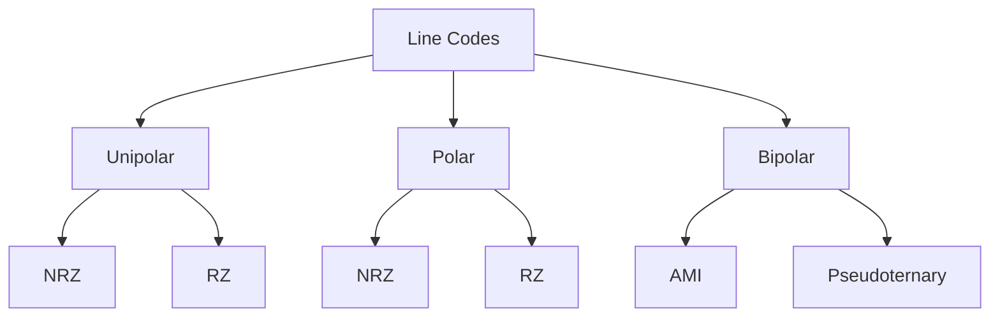
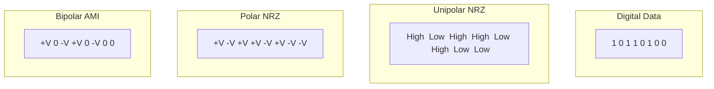
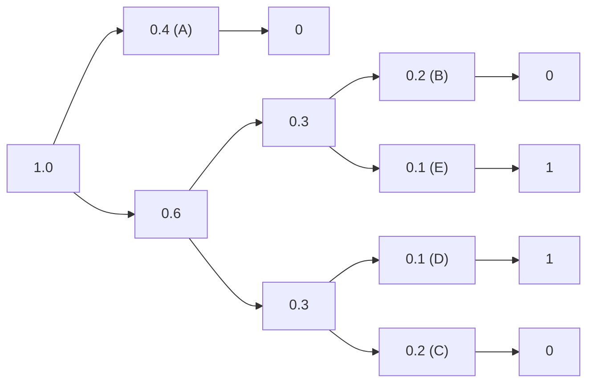
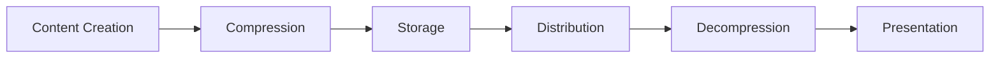
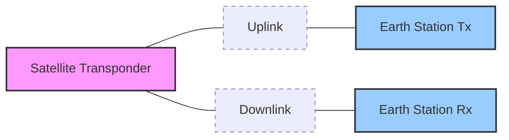
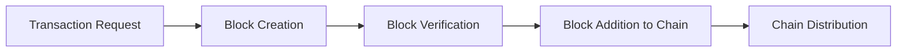

## Question 1(a) [3 marks]

**Define: (1) Bit rate, (2) Baud rate, and (3) Bandwidth**

**Answer**:

| Term | Definition |
|------|------------|
| **Bit Rate** | Number of bits transmitted per second (bps) |
| **Baud Rate** | Number of signal elements or symbols transmitted per second |
| **Bandwidth** | Range of frequencies required to transmit a signal, measured in Hertz (Hz) |

**Mnemonic:** "BBB - Bits move By Bands"

## Question 1(b) [4 marks]

**A signal has a bit rate of 8000bps and baud rate of 1000 baud. How many data element is carry by each signal? How many signals element do we need?**

**Answer**:

**Table: Signal Calculation**

| Parameter | Value | Calculation |
|-----------|-------|-------------|
| Bit rate | 8000 bps | Given |
| Baud rate | 1000 baud | Given |
| Data elements per signal | 8 bits | Bit rate ÷ Baud rate = 8000 ÷ 1000 = 8 |
| Signal elements needed | 2^8 = 256 | 2^(bits per signal) |

**Diagram: Signal Element Representation**


**Mnemonic:** "Divide to Decide" - Divide bit rate by baud rate to decide how many bits per signal.

## Question 1(c) [7 marks]

**Describe Elements of digital communication system with its block diagram**

**Answer**:

**Diagram: Digital Communication System**


**Key Elements:**

| Element | Function |
|---------|----------|
| **Source** | Generates message to be transmitted |
| **Source Encoder** | Converts message to digital format, removes redundancy |
| **Channel Encoder** | Adds redundancy for error detection/correction |
| **Digital Modulator** | Converts digital data to signals suitable for channel |
| **Channel** | Physical medium that carries the signal |
| **Digital Demodulator** | Extracts digital information from received signals |
| **Channel Decoder** | Detects/corrects errors using added redundancy |
| **Source Decoder** | Reconstructs original message from digital data |
| **Destination** | Receives the final message |

**Mnemonic:** "Send Messages Carefully; Destination Must Comprehend Signals Deeply"

## Question 1(c OR) [7 marks]

**What is fundamental limitation of digital communication system? What are the advantages and disadvantages of digital communication system?**

**Answer**:

**Fundamental Limitations:**

| Limitation | Description |
|------------|-------------|
| **Bandwidth** | Digital signals require more bandwidth than analog |
| **Noise** | Limits maximum achievable data rate |
| **Equipment** | Digital systems need complex hardware and processing |

**Advantages vs Disadvantages:**

| Advantages | Disadvantages |
|------------|---------------|
| **Noise Immunity** | Higher bandwidth requirements |
| **Easy Multiplexing** | Complex equipment |
| **Error Detection & Correction** | Quantization errors |
| **Enhanced Security** | Synchronization problems |
| **Signal Regeneration** | Higher initial cost |
| **Integration with Computers** | Sampling rate limitations |

**Mnemonic:** "NEEDS" - Noise, Equipment, and Environment Determine Success

## Question 2(a) [3 marks]

**Describe QPSK Modulator with block diagram**

**Answer**:

**Diagram: QPSK Modulator**

```goat
              +------------+
              |  2-bit     |          +-----------+
input         | Serial-to- |--bit 1-->| Cos       |
data -------->| Parallel   |          | Carrier   |----+
              | Converter  |          +-----------+    |   QPSK
              |            |                           +-->Signal
              |            |          +-----------+    |   Output
              |            |--bit 2-->| Sin       |----+
              +------------+          | Carrier   |
                                      +-----------+
```

**Key Components:**

- **Serial-to-Parallel Converter**: Splits data into 2-bit groups
- **Cosine Carrier**: Modulates first bit (I-channel)
- **Sine Carrier**: Modulates second bit (Q-channel)

**Mnemonic:** "Split Pair, Carrier Square" - data split into pairs, carried by squared signals

## Question 2(b) [4 marks]

**Describe ASK Modulator with block diagram**

**Answer**:

**Diagram: ASK Modulator**

```goat
              +------------+     +---------+
Digital       | Product    |     |         |
Input ------->| Modulator  |---->| Filter  |---> ASK Signal
              | (Mixer)    |     |         |
              +------------+     +---------+
                     ^
                     |
              +------------+
              | Carrier    |
              | Oscillator |
              +------------+
```

**ASK Modulation Process:**

| Component | Function |
|-----------|----------|
| **Digital Input** | Binary data (0s and 1s) to be transmitted |
| **Carrier Oscillator** | Generates high-frequency sine wave |
| **Product Modulator** | Multiplies input with carrier (ON/OFF) |
| **Filter** | Removes unwanted frequency components |

**Mnemonic:** "Amplify Signal when Keen" - carrier amplitude changes when signal is high

## Question 2(c) [7 marks]

**Compare ASK, FSK and PSK and Draw the wave form of ASK, FSK and PSK for the input digital signal 100101000101**

**Answer**:

**Comparison Table:**

| Parameter | ASK | FSK | PSK |
|-----------|-----|-----|-----|
| **Modulation Parameter** | Amplitude | Frequency | Phase |
| **Noise Immunity** | Poor | Moderate | Good |
| **Bandwidth** | Narrow | Wide | Moderate |
| **Power Efficiency** | Poor | Moderate | Good |
| **Implementation** | Simple | Moderate | Complex |
| **BER Performance** | Poor | Moderate | Good |

**Waveforms for input 100101000101:**

```goat
Digital: ‾‾‾_‾_‾‾___‾_‾  (1 0 0 1 0 1 0 0 0 1 0 1)
         
ASK:     ✓✓✓___✓___✓✓✓___✓___✓✓✓
         high low low high low high low low low high low high

FSK:     ✓✓✓~~~✓✓✓~~~✓✓✓~~~✓✓✓~~~✓✓✓
         f1  f2  f2  f1  f2  f1  f2  f2  f2  f1  f2  f1

PSK:     ✓✓✓˜˜˜✓✓✓˜˜˜✓✓✓˜˜˜✓✓✓˜˜˜✓✓✓
         0°  180° 180° 0°  180° 0°  180° 180° 180° 0°  180° 0°
```

**Mnemonic:** "AFP - Alter Frequencies or Phases" to remember modulation types

## Question 2(a OR) [3 marks]

**Describe QPSK Demodulator with block diagram**

**Answer**:

**Diagram: QPSK Demodulator**

```goat
                +-----------+
                | Cos       |
                | Carrier   |--+
                +-----------+  |
                               v
QPSK      +-----+      +------------+     +---------+
Signal--->| BPF |----->| Product    |---->| LPF     |----> Bit 1
          +-----+      | Detect     |     +---------+
                       +------------+
                             ^
                             |      +------------+    +---------+
                             +----->| Product    |--->| LPF     |----> Bit 2
                                    | Detect     |    +---------+
                             +      +------------+
                             |
                        +-----------+
                        | Sin       |
                        | Carrier   |
                        +-----------+
```

**Key Components:**

- **BPF (Bandpass Filter)**: Removes noise outside signal bandwidth
- **Product Detectors**: Multiply with carrier signals (cos & sin)
- **LPF (Lowpass Filters)**: Extract original data bits

**Mnemonic:** "Filtered Pairs Deliver Data" - filters and paired carriers recover data

## Question 2(b OR) [4 marks]

**Draw the Constellation diagram of ASK, BPSK and QPSK**

**Answer**:

**Constellation Diagrams:**

```goat
ASK Constellation:      BPSK Constellation:     QPSK Constellation:
       
       |                      |                      |
       |                      |                      |      * 01
       |                      |                      |
       |                      |                      |
-------+-------       -------+-------       -------+-------
       |                      |                      |
       |                      |                      |
   *   |               *      |      *         *     |     *
 (0)   |  * (1)         (1)   |   (0)        10     |    00
       |                      |                      |
Q axis |                Q axis|                Q axis|
       I axis                 I axis                 I axis
```

**Table: Constellation Characteristics**

| Modulation | Points | Phase States | Amplitude States |
|------------|--------|--------------|------------------|
| **ASK** | 2 | 1 (0°) | 2 (0, A) |
| **BPSK** | 2 | 2 (0°, 180°) | 1 (A) |
| **QPSK** | 4 | 4 (45°, 135°, 225°, 315°) | 1 (A) |

**Mnemonic:** "Points Double When Phases Double" - BPSK has 2 points, QPSK has 4 points

## Question 2(c OR) [7 marks]

**Describe FSK Modulator and demodulator with block diagram and output wave form**

**Answer**:

**FSK Modulator Diagram:**

```goat
                         +---------+
             +--------+  |         |
     '1' --->| Switch |->| Osc f1  |--+
             |        |  |         |  |
Digital      +--------+  +---------+  |     +---------+
Input ---+                            +---->|         |
          |                                 | Adder   |---> FSK Signal
          |   +--------+  +---------+  +--->|         |
     '0' -+-->| Switch |->| Osc f2  |--+    +---------+
              |        |  |         |
              +--------+  +---------+
```

**FSK Demodulator Diagram:**

```goat
                +---------+  +---------+  +---------+
                |         |  |         |  |         |
                | BPF f1  |->| Env     |->| Thresh  |--+
                |         |  | Detect  |  | Detect  |  |
                +---------+  +---------+  +---------+  |
                                                       |  +---------+
FSK Signal --+                                         +->|         |
             |                                            | Logic   |---> Digital
             |  +---------+  +---------+  +---------+  +->| Circuit |     Output
             |  |         |  |         |  |         |  |  |         |
             +->| BPF f2  |->| Env     |->| Thresh  |--+  +---------+
                |         |  | Detect  |  | Detect  |
                +---------+  +---------+  +---------+
```

**FSK Waveform:**

```goat
Digital:  ___‾‾‾___
          0  1  0

FSK:      ~~~~~~~
          f2 f1 f2
          Low freq when 0
          High freq when 1
```

**Key Components:**

| Component | Function |
|-----------|----------|
| **Oscillators** | Generate different frequencies for 0 and 1 |
| **Bandpass Filters** | Separate the two frequencies |
| **Envelope Detectors** | Extract amplitude variations |
| **Threshold Detectors** | Convert analog to digital |

**Mnemonic:** "Frequency Shift Key - Two Tones Tell Truth"

## Question 3(a) [3 marks]

**State the significance of probability in communication**

**Answer**:

| Significance | Description |
|--------------|-------------|
| **Information Measurement** | Quantifies uncertainty/surprise in messages |
| **Channel Capacity** | Determines maximum possible data rate |
| **Error Analysis** | Predicts and minimizes communication errors |

**Mnemonic:** "ICE - Information, Capacity, Errors" need probability

## Question 3(b) [4 marks]

**State channel capacity in terms of SNR and explain its importance**

**Answer**:

**Shannon's Channel Capacity Formula:**

```
C = B × log₂(1 + SNR)
```

**Where:**

- C = Channel capacity (bits/second)
- B = Bandwidth (Hz)
- SNR = Signal-to-Noise Ratio

**Importance:**

| Aspect | Importance |
|--------|------------|
| **Theoretical Limit** | Defines maximum possible error-free data rate |
| **System Design** | Guides bandwidth and power requirements |
| **Performance Evaluation** | Benchmark for actual system performance |
| **Coding Efficiency** | Indicates how close a system is to optimal performance |

**Mnemonic:** "BEST" - Bandwidth and Error-free Signal Transmission

## Question 3(c) [7 marks]

**Discuss classification of line codes with suitable example**

**Answer**:

**Diagram: Line Code Classification**



**Line Code Examples:**



**Waveform Visualization:**

```goat
Data:       1    0    1    1    0    1    0    0
           _|_   |   _|_  _|_   |   _|_   |    |

Unipolar   ‾‾‾‾‾     ‾‾‾‾‾‾‾‾‾     ‾‾‾‾‾
NRZ:       _____‾‾‾‾‾_____‾‾‾‾‾‾‾‾‾_____‾‾‾‾‾‾‾‾‾‾‾‾‾

Polar      ‾‾‾‾‾_____‾‾‾‾‾‾‾‾‾_____‾‾‾‾‾_______________
NRZ:       

Bipolar    ‾‾‾‾‾     _____‾‾‾‾‾     
AMI:       _____‾‾‾‾‾     _____‾‾‾‾‾‾‾‾‾‾‾‾‾‾‾‾‾‾‾‾‾‾‾
           (+ for first 1, - for second 1, etc.)
```

**Comparison Table:**

| Line Code Type | Signal Levels | DC Component | Clock Recovery | Bandwidth |
|----------------|---------------|--------------|----------------|-----------|
| **Unipolar NRZ** | 0, +A | Yes | Poor | Narrow |
| **Polar NRZ** | -A, +A | Maybe | Poor | Moderate |
| **Bipolar AMI** | -A, 0, +A | No | Good | Wide |

**Mnemonic:** "UPB - Use Proper Bits" for Unipolar, Polar, Bipolar

## Question 3(a OR) [3 marks]

**Discuss conditional probability**

**Answer**:

**Conditional Probability Definition:**

```
P(A|B) = P(A∩B) / P(B)
```

**Table: Conditional Probability in Communication**

| Application | Description |
|-------------|-------------|
| **Channel Modeling** | Probability of receiving Y given X was sent |
| **Error Detection** | Probability of error given specific patterns |
| **Decision Making** | Optimizing receiver decisions based on observations |

**Mnemonic:** "CEaD" - Calculate Events after Data

## Question 3(b OR) [4 marks]

**Define Entropy and Information. Discuss its physical significance**

**Answer**:

**Definitions:**

| Term | Definition | Formula |
|------|------------|---------|
| **Entropy** | Average information content of a source | H(X) = -∑P(x)log₂P(x) |
| **Information** | Measure of uncertainty reduction | I(x) = log₂(1/P(x)) |

**Physical Significance:**

| Aspect | Significance |
|--------|-------------|
| **Unpredictability** | Higher entropy means less predictable source |
| **Compression Limit** | Minimum bits needed to represent a source |
| **Optimal Coding** | Guides efficient source coding design |
| **Resource Allocation** | Determines bandwidth/power requirements |

**Mnemonic:** "UCOR" - Uncertainty Correlates with Optimal Resources

## Question 3(c OR) [7 marks]

**Describe Huffman code with suitable example**

**Answer**:

**Huffman Coding: Variable-length prefix code for lossless data compression**

**Example: Encoding symbols {A, B, C, D, E}**

**Step 1: Calculate probabilities**

| Symbol | Probability |
|--------|-------------|
| A | 0.4 |
| B | 0.2 |
| C | 0.2 |
| D | 0.1 |
| E | 0.1 |

**Step 2: Build Huffman Tree**



**Step 3: Assign codes**

| Symbol | Probability | Huffman Code |
|--------|-------------|--------------|
| A | 0.4 | 0 |
| B | 0.2 | 10 |
| C | 0.2 | 11 |
| D | 0.1 | 100 |
| E | 0.1 | 101 |

**Average code length:** (0.4×1) + (0.2×2) + (0.2×2) + (0.1×3) + (0.1×3) = 1.8 bits/symbol

**Mnemonic:** "HIGH PROB, LOW BITS" - Higher probability symbols get shorter codes

## Question 4(a) [3 marks]

**List Data transmission techniques**

**Answer**:

**Table: Data Transmission Techniques**

| Technique | Description |
|-----------|-------------|
| **Serial Transmission** | Bits sent one after another over single channel |
| **Parallel Transmission** | Multiple bits sent simultaneously over multiple channels |
| **Synchronous Transmission** | Data sent in blocks with timing controlled by clock |
| **Asynchronous Transmission** | Data sent with start/stop bits, no common clock |
| **Half-Duplex** | Data flows in both directions but not simultaneously |
| **Full-Duplex** | Data flows in both directions simultaneously |

**Mnemonic:** "SPASH-F" - Serial, Parallel, Asynchronous, Synchronous, Half/Full

## Question 4(b) [4 marks]

**Explain needs of multimedia processing for communication**

**Answer**:

**Multimedia Processing Needs:**

| Need | Description |
|------|-------------|
| **Compression** | Reduces bandwidth requirements for large media files |
| **Format Standardization** | Ensures compatibility across different systems |
| **Quality Control** | Maintains acceptable audio/video quality levels |
| **Synchronization** | Coordinates different media types (audio, video, text) |
| **Error Resilience** | Protects against data loss during transmission |

**Diagram: Multimedia Processing Flow**


**Mnemonic:** "CQSEF" - Compress Quality, Standardize and Ensure Fidelity

## Question 4(c) [7 marks]

**Explain data transmission mode**

**Answer**:

**Table: Data Transmission Modes**

| Mode | Direction | Operation | Example |
|------|-----------|-----------|---------|
| **Simplex** | One-way only | Sender can't receive | Radio broadcast |
| **Half-Duplex** | Two-way, alternating | Only one device transmits at a time | Walkie-talkie |
| **Full-Duplex** | Two-way, simultaneous | Both devices transmit at same time | Telephone call |

**Diagram: Data Transmission Modes**

```goat
Simplex:
  A -----------------> B
     Data flows one way

Half-Duplex:
  A <----------------> B
     Data flows in both directions,
     but only one direction at a time

Full-Duplex:
  A <=================> B
     Data flows in both directions
     simultaneously
```

**Comparison:**

| Parameter | Simplex | Half-Duplex | Full-Duplex |
|-----------|---------|-------------|-------------|
| **Channel Usage** | 100% one way | 100% alternating | 100% both ways |
| **Efficiency** | Low | Medium | High |
| **Implementation** | Simple | Moderate | Complex |
| **Cost** | Low | Medium | High |

**Mnemonic:** "SHF - Speed and Handling Factors" for Simplex, Half-duplex, Full-duplex

## Question 4(a OR) [3 marks]

**List Important characteristics of data communication**

**Answer**:

**Key Data Communication Characteristics:**

| Characteristic | Description |
|----------------|-------------|
| **Delivery** | System must deliver data to correct destination |
| **Accuracy** | Data must arrive without alteration |
| **Timeliness** | Data must arrive within useful timeframe |
| **Jitter** | Variation in packet arrival times |
| **Security** | Protection from unauthorized access |
| **Reliability** | System resilience against failures |

**Mnemonic:** "DATJSR" - Delivery, Accuracy, Timeliness, Jitter, Security, Reliability

## Question 4(b OR) [4 marks]

**Discuss the standards for data communication**

**Answer**:

**Table: Key Data Communication Standards**

| Standard | Organization | Purpose |
|----------|--------------|---------|
| **IEEE 802.x** | IEEE | LAN/MAN networking protocols |
| **X.25, X.400** | ITU-T | Packet switching, messaging |
| **TCP/IP** | IETF | Internet protocols |
| **RS-232/422/485** | EIA/TIA | Physical interfaces |
| **USB, HDMI** | USB-IF, HDMI Forum | Device connections |

**Standards Organizations:**

| Organization | Role |
|--------------|------|
| **IEEE** | Technical standards for networks |
| **ITU-T** | Telecommunications standards |
| **IETF** | Internet protocols |
| **ISO** | Overall standardization |

**Mnemonic:** "PITS" - Protocols, Interfaces, Transmission and Standards

## Question 4(c OR) [7 marks]

**Explain model of Multimedia communications and elements of Multimedia system**

**Answer**:

**Multimedia Communication Model:**



**Multimedia System Elements:**

| Element | Function |
|---------|----------|
| **Input Devices** | Capture multimedia content (camera, microphone) |
| **Processing Hardware** | CPU, GPU for handling multimedia data |
| **Storage** | Hard drives, SSDs, cloud storage |
| **Communication Network** | Transmits multimedia data between systems |
| **Output Devices** | Display, speakers for content presentation |
| **Software** | Codecs, players, editors for content manipulation |

**Media Types:**

| Media Type | Characteristics | Common Formats |
|------------|-----------------|----------------|
| **Audio** | Temporal, streaming | MP3, WAV, AAC |
| **Video** | Temporal, spatial, high bandwidth | MP4, AVI, HEVC |
| **Image** | Spatial, static | JPEG, PNG, GIF |
| **Text** | Structured, low bandwidth | TXT, HTML, XML |

**Mnemonic:** "CNIS-OS" - Capture, Network, Input-output, Storage, Output, Software

## Question 5(a) [3 marks]

**Explain important elements of 5G technology**

**Answer**:

**Key 5G Elements:**

| Element | Description |
|---------|-------------|
| **Millimeter Waves** | Higher frequency (24-100 GHz) for more bandwidth |
| **Massive MIMO** | Multiple-input multiple-output antennas for improved capacity |
| **Beamforming** | Focused signal transmission for better efficiency |
| **Network Slicing** | Virtual networks on shared infrastructure |
| **Edge Computing** | Processing closer to data source for lower latency |

**Mnemonic:** "MMBN-E" - Millimeter, MIMO, Beamforming, Network, Edge

## Question 5(b) [4 marks]

**Describe Spread spectrum communication**

**Answer**:

**Spread Spectrum Definition:** Technique where signal is spread over a wide frequency band, much wider than the minimum bandwidth required.

**Types of Spread Spectrum:**

| Type | Method | Advantages |
|------|--------|------------|
| **DSSS** (Direct Sequence) | XOR data with higher-rate pseudorandom code | Good noise immunity |
| **FHSS** (Frequency Hopping) | Rapidly switches carrier among many frequencies | Resists jamming |
| **THSS** (Time Hopping) | Transmits in short bursts at different time slots | Low probability of intercept |

**Diagram: DSSS Process**

```goat
Data:       |___|‾‾‾|___|
            
PN Code:    |_|‾|_|‾|_|‾|_|‾|

Spread
Signal:     |_|‾|‾|_|‾|_|_|‾|
```

**Mnemonic:** "DFT - Difficult For Trackers" - Direct, Frequency, Time Hopping

## Question 5(c) [7 marks]

**Explain block diagram of satellite communication**

**Answer**:

**Satellite Communication Block Diagram:**



**Key Components:**

| Component | Function |
|-----------|----------|
| **Earth Station (Tx)** | Source of signals, performs uplink functions |
| **Uplink** | Transmission from earth to satellite (higher frequency) |
| **Satellite Transponder** | Receives, amplifies, and retransmits signals |
| **Downlink** | Transmission from satellite to earth (lower frequency) |
| **Earth Station (Rx)** | Receives and processes downlink signals |

**Frequency Bands:**

| Band | Frequency Range | Applications |
|------|-----------------|--------------|
| **C-band** | 4-8 GHz | Television, voice, data |
| **Ku-band** | 12-18 GHz | Direct broadcast, VSAT |
| **Ka-band** | 26-40 GHz | High-speed data, internet |

**Mnemonic:** "STUDER" - Station Transmits Uplink, Downlink to Earth Receiver

## Question 5(a OR) [3 marks]

**Explain features and advantages of 5G technology**

**Answer**:

**5G Features and Advantages:**

| Feature | Advantage |
|---------|-----------|
| **High Speed** | Up to 10 Gbps data rates for faster downloads |
| **Ultra-Low Latency** | <1ms response time for real-time applications |
| **Massive Connectivity** | Up to 1 million devices per sq. km |
| **Network Slicing** | Customized virtual networks for specific applications |
| **Improved Reliability** | 99.999% availability for critical services |
| **Energy Efficiency** | Lower power consumption per bit of data |

**Mnemonic:** "HUMNER" - High-speed, Ultra-low latency, Massive connectivity, Network slicing, Enhanced reliability

## Question 5(b OR) [4 marks]

**Describe Edge Computing**

**Answer**:

**Edge Computing Definition:** Computing paradigm that brings data processing closer to the source of data generation.

**Diagram: Edge Computing Architecture**


**Key Characteristics:**

| Characteristic | Description |
|----------------|-------------|
| **Proximity** | Processing near data source reduces latency |
| **Distributed** | Computing resources spread across network edge |
| **Real-time Processing** | Fast response for time-critical applications |
| **Bandwidth Optimization** | Reduces data sent to central cloud |
| **Data Privacy** | Sensitive data processed locally |

**Mnemonic:** "PDRBD" - Process Data Rapidly By Distributing

## Question 5(c OR) [7 marks]

**Explain importance of block chain in Communication Security**

**Answer**:

**Blockchain in Communication Security:**



**Security Benefits:**

| Benefit | Description |
|---------|-------------|
| **Immutability** | Once recorded, data cannot be altered |
| **Decentralization** | No single point of failure or control |
| **Transparency** | All transactions visible to network participants |
| **Cryptographic Security** | Strong encryption protects data integrity |
| **Smart Contracts** | Self-executing agreements with built-in security |
| **Consensus Mechanisms** | Multiple validators ensure transaction legitimacy |

**Communication Applications:**

| Application | Security Benefit |
|-------------|------------------|
| **Secure Messaging** | End-to-end encryption with tamper-proof records |
| **Identity Management** | Self-sovereign identity verification |
| **IoT Security** | Secure device authentication and data integrity |
| **Network Infrastructure** | Secure routing and DNS systems |

**Mnemonic:** "DTCSCI" - Decentralized Transparent Cryptographic System Creates Immutability
