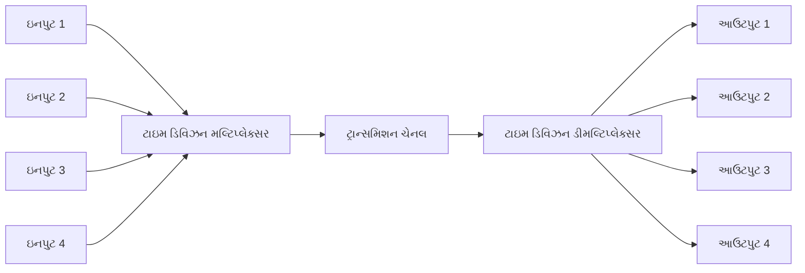
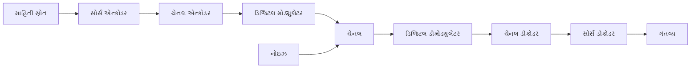
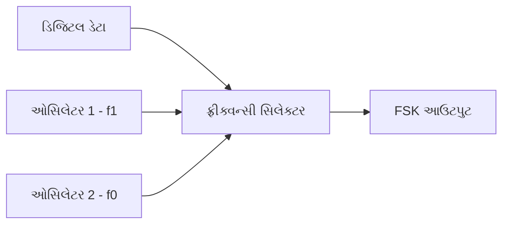
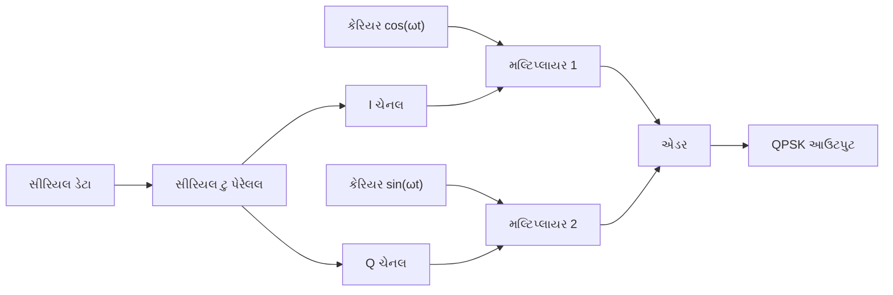
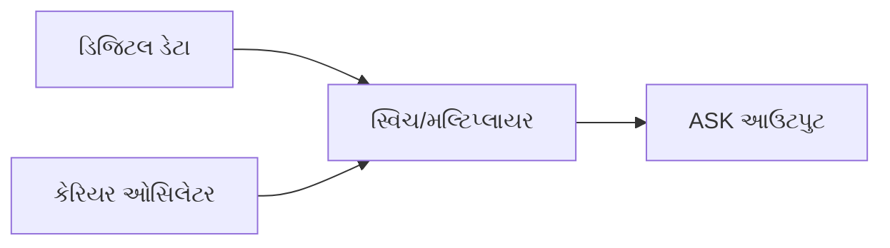
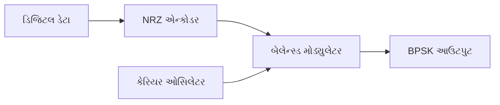
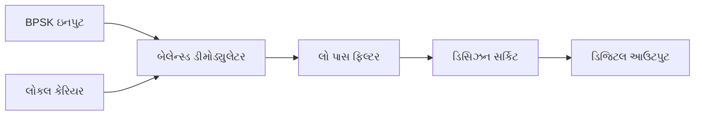
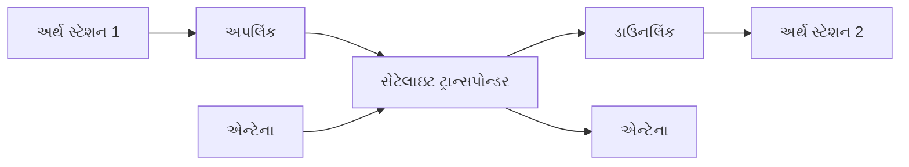
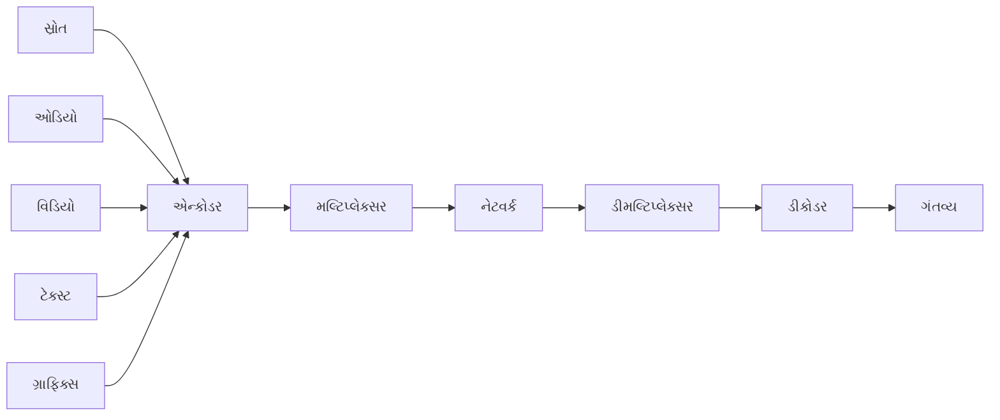

## પ્રશ્ન 1(અ) [3 ગુણ]

**બિટ રેટ, બાઉડ રેટ અને બેન્ડવિડ્થ વ્યાખ્યાયિત કરો**

**જવાબ**:

| પેરામીટર | વ્યાખ્યા | એકમ |
|-----------|------------|------|
| **બિટ રેટ** | પ્રતિ સેકન્ડ ટ્રાન્સમિટ થતા બિટ્સની સંખ્યા | bps (બિટ્સ પર સેકન્ડ) |
| **બાઉડ રેટ** | પ્રતિ સેકન્ડ સિગ્નલ ફેરફારની સંખ્યા | બાઉડ |
| **બેન્ડવિડ્થ** | કોમ્યુનિકેશન ચેનલમાં ફ્રીક્વન્સીની રેંજ | Hz (હર્ટ્ઝ) |

- **બિટ રેટ**: વાસ્તવિક ડેટા ટ્રાન્સમિશન સ્પીડ
- **બાઉડ રેટ**: મોડ્યુલેશન રેટ અથવા સિમ્બોલ રેટ  
- **બેન્ડવિડ્થ**: ફ્રીક્વન્સી રેંજ માટે ચેનલ કેપેસિટી

**મેમરી ટ્રીક:** "બિટ્સ બાઉડ બેન્ડવિડ્થ - કોમ્યુનિકેશન માટે BBB"

## પ્રશ્ન 1(બ) [4 ગુણ]

**બ્લોક ડાયાગ્રામ સાથે TDM સમજાવો**

**જવાબ**:



- **TDM સિદ્ધાંત**: બહુવિધ સિગ્નલ્સ ટાઇમ સ્લોટ્સ દ્વારા સિંગલ ચેનલ શેર કરે છે
- **ટાઇમ સ્લોટ્સ**: દરેક ઇનપુટને સમર્પિત સમય અવધિ મળે છે
- **સિંક્રોનાઇઝેશન**: ટ્રાન્સમિટર અને રિસીવર સિંક્રોનાઇઝ હોવા જોઇએ
- **ઉપયોગ**: ડિજિટલ ટેલિફોન સિસ્ટમ્સ, કમ્પ્યુટર નેટવર્ક્સ

**મેમરી ટ્રીક:** "ટાઇમ ડિવાઇડેડ મલ્ટિપલ - TDM સમય શેર કરે છે"

## પ્રશ્ન 1(ક) [7 ગુણ]

**ડિજિટલ કોમ્યુનિકેશન સિસ્ટમનો બ્લોક ડાયાગ્રામ સમજાવો**

**જવાબ**:



**ટેબલ: સિસ્ટમ કોમ્પોનન્ટ્સ**

| કોમ્પોનન્ટ | કાર્ય |
|-----------|----------|
| **સોર્સ એન્કોડર** | એનાલોગને ડિજિટલમાં કન્વર્ટ કરે છે |
| **ચેનલ એન્કોડર** | એરર કરેક્શન કોડ્સ ઉમેરે છે |
| **ડિજિટલ મોડ્યુલેટર** | ડિજિટલને એનાલોગ સિગ્નલમાં કન્વર્ટ કરે છે |
| **ચેનલ** | ટ્રાન્સમિશન મીડિયમ |
| **ડિજિટલ ડીમોડ્યુલેટર** | ડિજિટલ સિગ્નલ પુનઃપ્રાપ્ત કરે છે |
| **ચેનલ ડીકોડર** | એરર શોધે અને સુધારે છે |
| **સોર્સ ડીકોડર** | મૂળ સિગ્નલ પુનર્નિર્માણ કરે છે |

- **ફાયદાઓ**: નોઇઝ પ્રતિરોધકતા, એરર કરેક્શન ક્ષમતા
- **પ્રોસેસિંગ**: ડિજિટલ સિગ્નલ પ્રોસેસિંગ તકનીકો
- **વિશ્વસનીયતા**: લાંબા અંતર પર વધુ સારી કામગીરી

**મેમરી ટ્રીક:** "સોર્સ ચેનલ મોડ્યુલેટ ટ્રાન્સમિટ ડીમોડ્યુલેટ ડીકોડ - SCMTDD"

## પ્રશ્ન 1(ક OR) [7 ગુણ]

**કોમ્યુનિકેશન ચેનલના વિવિધ પ્રકારો સમજાવો**

**જવાબ**:

**ચેનલ પ્રકારો ટેબલ:**

| ચેનલ પ્રકાર | લાક્ષણિકતાઓ | ઉપયોગ |
|--------------|-----------------|--------------|
| **ટેલિફોન ચેનલ** | 300-3400 Hz બેન્ડવિડ્થ | વૉઇસ કોમ્યુનિકેશન |
| **કોએક્સિયલ કેબલ** | હાઇ બેન્ડવિડ્થ, શિલ્ડેડ | કેબલ TV, ઇન્ટરનેટ |
| **ઓપ્ટિકલ ફાઇબર** | ખૂબ હાઇ બેન્ડવિડ્થ, લાઇટ સિગ્નલ્સ | લાંબા અંતર, હાઇ સ્પીડ |
| **વાયરલેસ ચેનલ** | રેડિયો ફ્રીક્વન્સી ટ્રાન્સમિશન | મોબાઇલ, સેટેલાઇટ |
| **સેટેલાઇટ ચેનલ** | લાંબા અંતર, સ્પેસ કોમ્યુનિકેશન | ગ્લોબલ કોમ્યુનિકેશન |

- **બેન્ડવિડ્થ**: વિવિધ ચેનલ્સ અલગ-અલગ ફ્રીક્વન્સી રેંજ આપે છે
- **નોઇઝ લાક્ષણિકતાઓ**: દરેક ચેનલની વિશિષ્ટ નોઇઝ પ્રોપર્ટીઝ છે
- **અંતર ક્ષમતા**: લોકલથી ગ્લોબલ કવરેજ સુધી બદલાય છે
- **કોસ્ટ ફેક્ટર્સ**: ઇન્સ્ટોલેશન અને મેઇન્ટેનન્સ કોસ્ટ અલગ છે

**મેમરી ટ્રીક:** "ટેલિફોન કોએક્સ ઓપ્ટિકલ વાયરલેસ સેટેલાઇટ - TCOWS ચેનલ્સ"

## પ્રશ્ન 2(અ) [3 ગુણ]

**ડિજિટલ સિક્વન્સ 11100110 માટે ASK, FSK અને BPSK માટે મોડ્યુલેશન વેવફોર્મ દોરો**

**જવાબ**:

```goat
ડિજિટલ ડેટા: 1  1  1  0  0  1  1  0
             +--+--+--+  +  +--+--+  +
             |  |  |  |  |  |  |  |  |
             |  |  |  |  |  |  |  |  |
             +  +  +  +--+--+  +  +--+

ASK:         +--+--+--+     +--+--+   
             |  |  |  |     |  |  |   
             |  |  |  |     |  |  |   
             +  +  +  +-----+  +  +---

FSK:         ∩∩∩∩∩∩∩∩∩    ∩∩∩∩∩∩∩   
             ∪∪∪∪     ∪∪∪∪     ∪∪∪∪
             હાઇ ફ્રીક્વ   લો   હાઇ  લો

BPSK:        +--+--+--+     +--+--+   
             |  |  |  |     |  |  |   
             +  +  +  +-----+  +  +---
             -  -  -  -----   -  ----
```

**મેમરી ટ્રીક:** "ASK એમ્પ્લિટ્યુડ, FSK ફ્રીક્વન્સી, BPSK ફેઝ - AFP મોડ્યુલેશન"

## પ્રશ્ન 2(બ) [4 ગુણ]

**ફ્રીક્વન્સી શિફ્ટ કીઇંગ (FSK) સિગ્નલના મૂળભૂત સિદ્ધાંત અને જનરેશનને સમજાવો**

**જવાબ**:

**FSK જનરેશન ટેબલ:**

| બાઇનરી ડેટા | ફ્રીક્વન્સી | આઉટપુટ |
|-------------|-----------|---------|
| લોજિક '1' | f₁ (હાઇ ફ્રીક્વન્સી) | હાઇ ફ્રીક્વ કેરિયર |
| લોજિક '0' | f₀ (લો ફ્રીક્વન્સી) | લો ફ્રીક્વ કેરિયર |



- **સિદ્ધાંત**: બાઇનરી ડેટા કેરિયર ફ્રીક્વન્સી કંટ્રોલ કરે છે
- **બે ફ્રીક્વન્સીઝ**: '1' માટે f₁ અને '0' માટે f₀
- **કોન્સ્ટન્ટ એમ્પ્લિટ્યુડ**: માત્ર ફ્રીક્વન્સી બદલાય છે
- **ડિટેક્શન**: રિસીવર પર ફ્રીક્વન્સી ડિસ્ક્રિમિનેશન

**મેમરી ટ્રીક:** "ફ્રીક્વન્સી શિફ્ટ્સ કી - FSK ફ્રીક્વન્સી કંટ્રોલ"

## પ્રશ્ન 2(ક) [7 ગુણ]

**બ્લોક ડાયાગ્રામ અને કોન્સ્ટેલેશન ડાયાગ્રામ સાથે QPSK મોડ્યુલેટર અને ડીમોડ્યુલેટરની કામગીરી સમજાવો**

**જવાબ**:

**QPSK મોડ્યુલેટર બ્લોક ડાયાગ્રામ:**


**કોન્સ્ટેલેશન ડાયાગ્રામ:**

```goat
     Q
     |
  01 * * 00
     |
-----*-----  I
     |
  11 * * 10
     |
```

**QPSK ટ્રુથ ટેબલ:**

| I | Q | ફેઝ | સિમ્બોલ |
|---|---|-------|---------|
| 0 | 0 | 45° | 00 |
| 0 | 1 | 135° | 01 |
| 1 | 1 | 225° | 11 |
| 1 | 0 | 315° | 10 |

- **ચાર ફેઝ**: 45°, 135°, 225°, 315°
- **બે બિટ્સ પર સિમ્બોલ**: હાયર ડેટા રેટ
- **કોન્સ્ટન્ટ એન્વેલોપ**: એમ્પ્લિટ્યુડ કોન્સ્ટન્ટ રહે છે
- **ડીમોડ્યુલેશન**: ફેઝ ડિટેક્શન અને પેરેલલ ટુ સીરિયલ કન્વર્શન

**મેમરી ટ્રીક:** "ક્વાડરેચર ફેઝ શિફ્ટ કી - QPSK ચાર ફેઝ"

## પ્રશ્ન 2(અ OR) [3 ગુણ]

**ASK મોડ્યુલેટરનો બ્લોક ડાયાગ્રામ દોરો અને તેના કામનું વર્ણન કરો**

**જવાબ**:



- **કામનો સિદ્ધાંત**: ડિજિટલ ડેટા કેરિયર એમ્પ્લિટ્યુડ કંટ્રોલ કરે છે
- **લોજિક '1'**: પૂર્ણ એમ્પ્લિટ્યુડ સાથે કેરિયર ટ્રાન્સમિટ થાય છે
- **લોજિક '0'**: કોઇ કેરિયર ટ્રાન્સમિટ થતું નથી (ઝીરો એમ્પ્લિટ્યુડ)
- **સિમ્પલ ઇમ્પ્લિમેન્ટેશન**: એનાલોગ સ્વિચ અથવા મલ્ટિપ્લાયર વાપરે છે

**મેમરી ટ્રીક:** "એમ્પ્લિટ્યુડ શિફ્ટ કી - ASK એમ્પ્લિટ્યુડ કંટ્રોલ"

## પ્રશ્ન 2(બ OR) [4 ગુણ]

**16-QAM ના પ્રિન્સિપલને સમજાવો અને કોન્સ્ટેલેશન ડાયાગ્રામ દોરો**

**જવાબ**:

**16-QAM કોન્સ્ટેલેશન:**

```goat
     Q
     |
  *  *  *  *
     |
  *  *  *  *
-----*-----  I
     |
  *  *  *  *
     |
  *  *  *  *
```

**16-QAM લાક્ષણિકતાઓ ટેબલ:**

| પેરામીટર | વેલ્યુ |
|-----------|-------|
| **બિટ્સ પર સિમ્બોલ** | 4 બિટ્સ |
| **સ્ટેટ્સની સંખ્યા** | 16 |
| **એમ્પ્લિટ્યુડ લેવલ્સ** | 4 લેવલ્સ |
| **ફેઝ લેવલ્સ** | 4 ફેઝ |

- **સિદ્ધાંત**: એમ્પ્લિટ્યુડ અને ફેઝ મોડ્યુલેશન કોમ્બાઇન કરે છે
- **હાયર ડેટા રેટ**: 4 બિટ્સ પર સિમ્બોલ
- **કોમ્પ્લેક્સ મોડ્યુલેશન**: પ્રિસાઇસ એમ્પ્લિટ્યુડ અને ફેઝ કંટ્રોલ જરૂરી
- **ઉપયોગ**: હાઇ-સ્પીડ ડિજિટલ કોમ્યુનિકેશન

**મેમરી ટ્રીક:** "16 ક્વાડરેચર એમ્પ્લિટ્યુડ મોડ્યુલેશન - 16QAM કોમ્પ્લેક્સ સિગ્નલ્સ"

## પ્રશ્ન 2(ક OR) [7 ગુણ]

**બ્લોક ડાયાગ્રામ અને વેવફોર્મ સાથે BPSK મોડ્યુલેટર અને ડીમોડ્યુલેટરનું કામ સમજાવો**

**જવાબ**:

**BPSK મોડ્યુલેટર:**


**BPSK ડીમોડ્યુલેટર:**


**BPSK વેવફોર્મ્સ:**

```goat
ડેટા:    1    0    1    0
        +----+    +----+----
        |    |    |    |
        +    +----+    +----

કેરિયર: ∩∩∩∩∩∩∩∩∩∩∩∩∩∩∩∩
         ∪∪∪∪∪∪∪∪∪∪∪∪∪∪∪∪

BPSK:    ∩∩∩∩     ∩∩∩∩    
         ∪∪∪∪∪∪∪∪∪∪∪∪∪∪∪∪
```

- **ફેઝ શિફ્ટ**: '1' અને '0' વચ્ચે 180°
- **કોહેરન્ટ ડિટેક્શન**: સિંક્રોનાઇઝ્ડ કેરિયર જરૂરી
- **બેસ્ટ પરફોર્મન્સ**: સૌથી ઓછી બિટ એરર રેટ
- **કોન્સ્ટન્ટ એન્વેલોપ**: એમ્પ્લિટ્યુડ કોન્સ્ટન્ટ રહે છે

**મેમરી ટ્રીક:** "બાઇનરી ફેઝ શિફ્ટ કી - BPSK બે ફેઝ"

## પ્રશ્ન 3(અ) [3 ગુણ]

**SNR ના સંદર્ભમાં ચેનલ ક્ષમતાને વ્યાખ્યાયિત કરો અને તેનું મહત્વ સમજાવો**

**જવાબ**:

**શેનોનના ચેનલ કેપેસિટી ફોર્મ્યુલા:**

| ફોર્મ્યુલા | C = B log₂(1 + S/N) |
|---------|---------------------|
| **C** | ચેનલ કેપેસિટી (bps) |
| **B** | બેન્ડવિડ્થ (Hz) |
| **S/N** | સિગ્નલ-ટુ-નોઇઝ રેશિયો |

- **મહત્વ**: મહત્તમ થિયોરેટિકલ ડેટા રેટ
- **SNR અસર**: વધુ SNR વધુ કેપેસિટીને મંજૂરી આપે છે
- **બેન્ડવિડ્થ ટ્રેડ-ઓફ**: SNR માટે બેન્ડવિડ્થ બદલી શકાય છે
- **ડિઝાઇન લિમિટ**: સિસ્ટમ ડિઝાઇન માટે ઉપરની સીમા સેટ કરે છે

**મેમરી ટ્રીક:** "ચેનલ કેપેસિટી શેનોનની લિમિટ - CCSL"

## પ્રશ્ન 3(બ) [4 ગુણ]

**અસિંક્રોનસ અને સિંક્રોનસ સીરિયલ ડેટા કોમ્યુનિકેશન તકનીકોનું વર્ણન કરો**

**જવાબ**:

**સરખામણી ટેબલ:**

| પેરામીટર | સિંક્રોનસ | અસિંક્રોનસ |
|-----------|-------------|--------------|
| **ક્લોક** | અલગ ક્લોક સિગ્નલ | કોઇ અલગ ક્લોક નથી |
| **સ્ટાર્ટ/સ્ટોપ બિટ્સ** | જરૂરી નથી | સ્ટાર્ટ અને સ્ટોપ બિટ્સ |
| **સ્પીડ** | વધારે | ઓછી |
| **કોસ્ટ** | વધારે | ઓછી |

- **સિંક્રોનસ**: ક્લોક સિંક્રોનાઇઝેશન જરૂરી
- **અસિંક્રોનસ**: સ્ટાર્ટ/સ્ટોપ બિટ્સ સાથે સેલ્ફ-સિંક્રોના
- **ઉપયોગ**: સિંક્રોનસ હાઇ-સ્પીડ માટે, અસિંક્રોનસ સિમ્પલ સિસ્ટમ્સ માટે
- **કાર્યક્ષમતા**: સિંક્રોનસ વધુ કાર્યક્ષમ, અસિંક્રોનસ વધુ લવચીક

**મેમરી ટ્રીક:** "સિંક ક્લોક, અસિંક સ્ટાર્ટ-સ્ટોપ - SCSS"

## પ્રશ્ન 3(ક) [7 ગુણ]

**યોગ્ય ઉદાહરણની મદદથી હફમેન કોડિંગ સમજાવો**

**જવાબ**:

**ઉદાહરણ: અક્ષરો A, B, C, D સંભાવનાઓ 0.4, 0.3, 0.2, 0.1 સાથે**

**સ્ટેપ-બાય-સ્ટેપ હફમેન ટ્રી કન્સ્ટ્રક્શન:**

```goat
સ્ટેપ 1: સંભાવનાઓની યાદી
A: 0.4, B: 0.3, C: 0.2, D: 0.1

સ્ટેપ 2: સૌથી નીચી કોમ્બાઇન કરો
       0.3
      /   \
   C:0.2  D:0.1

સ્ટેપ 3: કોમ્બાઇનિંગ ચાલુ રાખો
       0.6
      /   \
   B:0.3   0.3
          /   \
       C:0.2  D:0.1

સ્ટેપ 4: અંતિમ ટ્રી
        1.0
       /   \
    A:0.4   0.6
           /   \
        B:0.3   0.3
               /   \
            C:0.2  D:0.1
```

**હફમેન કોડ્સ ટેબલ:**

| અક્ષર | સંભાવના | કોડ |
|-----------|-------------|------|
| A | 0.4 | 0 |
| B | 0.3 | 10 |
| C | 0.2 | 110 |
| D | 0.1 | 111 |

- **એવરેજ કોડ લેન્થ**: 0.4×1 + 0.3×2 + 0.2×3 + 0.1×3 = 1.9 બિટ્સ
- **કમ્પ્રેશન પ્રાપ્ત**: પ્રતિ અક્ષર એવરેજ બિટ્સ ઘટાડે છે
- **પ્રીફિક્સ પ્રોપર્ટી**: કોઇ કોડ બીજાનો પ્રીફિક્સ નથી

**મેમરી ટ્રીક:** "હફમેન મિનિમમ એવરેજ લેન્થ - HMAL"

## પ્રશ્ન 3(અ OR) [3 ગુણ]

**સંચારમાં સંભાવના અને એન્ટ્રોપીનું મહત્વ જણાવો**

**જવાબ**:

**મહત્વ ટેબલ:**

| કન્સેપ્ટ | મહત્વ |
|---------|---------|
| **સંભાવના** | માહિતીની ઘટનાની સંભાવના માપે છે |
| **એન્ટ્રોપી** | એવરેજ માહિતી સામગ્રી માપે છે |
| **મહત્તમ એન્ટ્રોપી** | સમાન સંભાવના ઘટનાઓ સાથે થાય છે |

- **માહિતી સામગ્રી**: I = log₂(1/P) બિટ્સ
- **એન્ટ્રોપી ફોર્મ્યુલા**: H = -Σ P(x) log₂ P(x)
- **ચેનલ ડિઝાઇન**: કોમ્યુનિકેશન સિસ્ટમ્સ ઑપ્ટિમાઇઝ કરવામાં મદદ કરે છે
- **કોડિંગ કાર્યક્ષમતા**: સોર્સ કોડિંગ ડિઝાઇનને માર્ગદર્શન આપે છે

**મેમરી ટ્રીક:** "પ્રોબેબિલિટી એન્ટ્રોપી ઇન્ફોર્મેશન - PEI કોમ્યુનિકેશન"

## પ્રશ્ન 3(બ OR) [4 ગુણ]

**સિમ્પ્લેક્સ, હાફ ડુપ્લેક્સ અને ફુલ ડુપ્લેક્સ ડેટા ટ્રાન્સમિશન મોડ સમજાવો**

**જવાબ**:

**ટ્રાન્સમિશન મોડ્સ ટેબલ:**

| મોડ | દિશા | ઉદાહરણ | ડાયાગ્રામ |
|------|-----------|---------|---------|
| **સિમ્પ્લેક્સ** | માત્ર એક દિશા | રેડિયો બ્રોડકાસ્ટ | A → B |
| **હાફ ડુપ્લેક્સ** | બંને દિશા, એકસાથે નહીં | વોકી-ટોકી | A ⇄ B |
| **ફુલ ડુપ્લેક્સ** | બંને દિશા, એકસાથે | ટેલિફોન | A ⇌ B |

- **સિમ્પ્લેક્સ**: એકદિશીય કોમ્યુનિકેશન
- **હાફ ડુપ્લેક્સ**: દ્વિદિશીય પરંતુ વૈકલ્પિક
- **ફુલ ડુપ્લેક્સ**: એકસાથે દ્વિદિશીય
- **બેન્ડવિડ્થ આવશ્યકતા**: ફુલ ડુપ્લેક્સને બમણી બેન્ડવિડ્થ જોઇએ

**મેમરી ટ્રીક:** "સિમ્પલ હાફ ફુલ - SHF ટ્રાન્સમિશન મોડ્સ"

## પ્રશ્ન 3(ક OR) [7 ગુણ]

**યોગ્ય ઉદાહરણની મદદથી શેનોન ફાડો કોડિંગ સમજાવો**

**જવાબ**:

**ઉદાહરણ: અક્ષરો A, B, C, D સંભાવનાઓ 0.4, 0.3, 0.2, 0.1 સાથે**

**શેનોન-ફાડો અલ્ગોરિધમ સ્ટેપ્સ:**

```goat
સ્ટેપ 1: ઘટતા ક્રમમાં ગોઠવો
A: 0.4, B: 0.3, C: 0.2, D: 0.1

સ્ટેપ 2: બે ગ્રુપમાં વિભાજિત કરો
ગ્રુપ 1: A(0.4) → કોડ 0 થી શરૂ થાય છે
ગ્રુપ 2: B(0.3), C(0.2), D(0.1) → કોડ 1 થી શરૂ થાય છે

સ્ટેપ 3: ગ્રુપ 2નું પેટાવિભાજન
B(0.3) → કોડ: 10
C(0.2), D(0.1) → કોડ 11 થી શરૂ થાય છે

સ્ટેપ 4: અંતિમ પેટાવિભાજન
C(0.2) → કોડ: 110
D(0.1) → કોડ: 111
```

**શેનોન-ફાડો કોડ્સ ટેબલ:**

| અક્ષર | સંભાવના | કોડ |
|-----------|-------------|------|
| A | 0.4 | 0 |
| B | 0.3 | 10 |
| C | 0.2 | 110 |
| D | 0.1 | 111 |

- **એવરેજ લેન્થ**: હફમેન સમાન (1.9 બિટ્સ)
- **ટોપ-ડાઉન એપ્રોચ**: રૂટથી પાંદડાઓ સુધી વિભાજિત કરે છે
- **હંમેશા ઑપ્ટિમલ નથી**: હફમેન સામાન્ય રીતે વધુ સારું છે

**મેમરી ટ્રીક:** "શેનોન ફાડો ટોપ-ડાઉન - SFTD કોડિંગ"

## પ્રશ્ન 4(અ) [3 ગુણ]

**ડેટા કોમ્યુનિકેશનમાં નૈતિક અને ગોપનીયતાની બાબતોનું વર્ણન કરો**

**જવાબ**:

**નીતિશાસ્ત્ર અને ગોપનીયતા ટેબલ:**

| પાસા | વિચારણા |
|--------|---------------|
| **ડેટા ગોપનીયતા** | વપરાશકર્તાની સંમતિ, ડેટા સુરક્ષા |
| **સિક્યુરિટી** | એન્ક્રિપ્શન, એક્સેસ કંટ્રોલ |
| **પારદર્શિતા** | સ્પષ્ટ ડેટા વપરાશ નીતિઓ |

- **ગોપનીયતાના અધિકારો**: વ્યક્તિગત ડેટા પર વપરાશકર્તાનું નિયંત્રણ
- **નૈતિક ઉપયોગ**: જવાબદાર ડેટા હેન્ડલિંગ પ્રથાઓ
- **કાનૂની પાલન**: ડેટા સુરક્ષા કાયદાઓનું પાલન કરવું
- **સિક્યુરિટી પગલાં**: અનધિકૃત પ્રવેશ સામે સુરક્ષા

**મેમરી ટ્રીક:** "ગોપનીયતા સિક્યુરિટી પારદર્શિતા - PST નીતિશાસ્ત્ર"

## પ્રશ્ન 4(બ) [4 ગુણ]

**RS 232 સ્ટાન્ડર્ડને પિન ડાયાગ્રામ સાથે સમજાવો**

**જવાબ**:

**RS-232 પિન કન્ફિગરેશન (DB-9):**

| પિન | સિગ્નલ | કાર્ય |
|-----|--------|----------|
| 1 | DCD | ડેટા કેરિયર ડિટેક્ટ |
| 2 | RXD | રિસીવ ડેટા |
| 3 | TXD | ટ્રાન્સમિટ ડેટા |
| 4 | DTR | ડેટા ટર્મિનલ રેડી |
| 5 | GND | ગ્રાઉન્ડ |
| 6 | DSR | ડેટા સેટ રેડી |
| 7 | RTS | રિક્વેસ્ટ ટુ સેન્ડ |
| 8 | CTS | ક્લિયર ટુ સેન્ડ |
| 9 | RI | રિંગ ઇન્ડિકેટર |

- **વોલ્ટેજ લેવલ્સ**: '0' માટે +3V થી +25V, '1' માટે -3V થી -25V
- **મહત્તમ અંતર**: 19.2 kbps પર 50 ફુટ
- **ઉપયોગ**: કમ્પ્યુટર અને મોડેમ વચ્ચે સીરિયલ કોમ્યુનિકેશન

**મેમરી ટ્રીક:** "RS-232 નવ પિન્સ સીરિયલ - RNS કોમ્યુનિકેશન"

## પ્રશ્ન 4(ક) [7 ગુણ]

**યોગ્ય ઉદાહરણની મદદથી હેમિંગ કોડ સમજાવો**

**જવાબ**:

**ઉદાહરણ: 4-બિટ ડેટા 1011**

**હેમિંગ કોડ કન્સ્ટ્રક્શન:**

| સ્થિતિ | 1 | 2 | 3 | 4 | 5 | 6 | 7 |
|----------|---|---|---|---|---|---|---|
| **પ્રકાર** | P1 | P2 | D1 | P4 | D2 | D3 | D4 |
| **વેલ્યુ** | ? | ? | 1 | ? | 0 | 1 | 1 |

**પેરિટી કેલ્ક્યુલેશન્સ:**

- **P1** (સ્થિતિઓ 1,3,5,7): P1 ⊕ 1 ⊕ 0 ⊕ 1 = 0, તેથી P1 = 0
- **P2** (સ્થિતિઓ 2,3,6,7): P2 ⊕ 1 ⊕ 1 ⊕ 1 = 1, તેથી P2 = 1  
- **P4** (સ્થિતિઓ 4,5,6,7): P4 ⊕ 0 ⊕ 1 ⊕ 1 = 0, તેથી P4 = 0

**અંતિમ હેમિંગ કોડ: 0110111**

**એરર ડિટેક્શન પ્રોસેસ:**

- સિન્ડ્રોમ S = S4S2S1 કેલ્ક્યુલેટ કરો
- જો S = 000, કોઇ એરર નથી
- જો S ≠ 000, S દ્વારા દર્શાવેલ સ્થિતિએ એરર છે

- **સિંગલ એરર કરેક્શન**: એક-બિટ એરર સુધારી શકે છે
- **ડબલ એરર ડિટેક્શન**: બે-બિટ એરર શોધી શકે છે
- **સિસ્ટેમેટિક એપ્રોચ**: વ્યવસ્થિત પેરિટી બિટ પ્લેસમેન્ટ

**મેમરી ટ્રીક:** "હેમિંગ સિંગલ એરર કરેક્શન - HSEC"

## પ્રશ્ન 4(અ OR) [3 ગુણ]

**એજ કમ્પ્યુટિંગને વ્યાખ્યાયિત કરો અને તેની વિશેષતા સમજાવો**

**જવાબ**:

**એજ કમ્પ્યુટિંગ વિશેષતાઓ:**

| વિશેષતા | વર્ણન |
|---------|-------------|
| **લો લેટન્સી** | ડેટા સોર્સની નજીક પ્રોસેસિંગ |
| **બેન્ડવિડ્થ સેવિંગ** | નેટવર્ક ટ્રાફિક ઘટાડે છે |
| **રિયલ-ટાઇમ પ્રોસેસિંગ** | તાત્કાલિક ડેટા એનાલિસિસ |

- **વ્યાખ્યા**: નેટવર્ક એજ પર, ડેટા સોર્સની નજીક કમ્પ્યુટિંગ
- **ઘટાડેલી લેટન્સી**: ઝડપી રિસ્પોન્સ ટાઇમ
- **ડિસ્ટ્રિબ્યુટેડ પ્રોસેસિંગ**: સેન્ટ્રલ સર્વર લોડ ઘટાડે છે
- **ઉપયોગ**: IoT, ઓટોનોમસ વાહનો, સ્માર્ટ સિટીઓ

**મેમરી ટ્રીક:** "એજ લો-લેટન્સી રિયલ-ટાઇમ - ELR કમ્પ્યુટિંગ"

## પ્રશ્ન 4(બ OR) [4 ગુણ]

**સંદેશાવ્યવહાર માટે મલ્ટીમીડિયા પ્રોસેસિંગની જરૂરિયાતો અને વિવિધ ડેટાના વિવિધ ફાઇલ ફોર્મેટ સમજાવો**

**જવાબ**:

**મલ્ટીમીડિયા ફાઇલ ફોર્મેટ્સ ટેબલ:**

| ડેટા પ્રકાર | ફોર્મેટ્સ | લાક્ષણિકતાઓ |
|-----------|---------|-----------------|
| **ઓડિયો** | MP3, WAV, AAC | કમ્પ્રેસ્ડ/અનકમ્પ્રેસ્ડ |
| **વિડિયો** | MP4, AVI, MOV | વિવિધ કોડેક્સ |
| **ઇમેજ** | JPEG, PNG, GIF | લોસી/લૉસલેસ કમ્પ્રેશન |
| **ટેક્સ્ટ** | TXT, PDF, DOC | વિવિધ એન્કોડિંગ્સ |

- **પ્રોસેસિંગ જરૂરિયાતો**: કમ્પ્રેશન, ફોર્મેટ કન્વર્શન, ક્વોલિટી ઑપ્ટિમાઇઝેશન
- **બેન્ડવિડ્થ ઑપ્ટિમાઇઝેશન**: ટ્રાન્સમિશન માટે ફાઇલ સાઇઝ ઘટાડવું
- **ક્વોલિટી પ્રિઝર્વેશન**: સ્વીકાર્ય ક્વોલિટી લેવલ રાખવું
- **કમ્પેટિબિલિટી**: મલ્ટિપલ ડિવાઇસ અને પ્લેટફોર્મ્સને સપોર્ટ કરવું

**મેમરી ટ્રીક:** "ઓડિયો વિડિયો ઇમેજ ટેક્સ્ટ - AVIT મલ્ટીમીડિયા"

## પ્રશ્ન 4(ક OR) [7 ગુણ]

**વેવફોર્મની મદદથી વિવિધ લાઇન કોડિંગ સમજાવો**

**જવાબ**:

**ડેટા 1011 માટે લાઇન કોડિંગ વેવફોર્મ્સ:**

```goat
ડેટા:        1    0    1    1
            +----+    +----+----
            |    |    |    |
            +    +----+    +

NRZ-L:      +----+    +----+----
            |    |    |    |
            +    +----+    +

NRZ-I:      +----+----+    +
            |    |    |    |
            +    +    +----+----

RZ:         +--+ +    +--+ +--+
            |  | |    |  | |  |
            +  +-+----+  +-+  +

Manchester: +--+    --+ +--+    +
            |  |   |  | |  |   |
            +  +---+  +-+  +---+
```

**લાઇન કોડિંગ સરખામણી:**

| કોડ પ્રકાર | બેન્ડવિડ્થ | DC કોમ્પોનન્ટ | સિંક્રોનાઇઝેશન |
|-----------|-----------|--------------|----------------|
| **NRZ-L** | લો | હાજર | ખરાબ |
| **NRZ-I** | લો | હાજર | ખરાબ |
| **RZ** | હાઇ | હાજર | સારું |
| **Manchester** | હાઇ | ગેરહાજર | ઉત્કૃષ્ટ |

- **NRZ**: નોન-રિટર્ન-ટુ-ઝીરો, સિમ્પલ પરંતુ DC કોમ્પોનન્ટ છે
- **RZ**: રિટર્ન-ટુ-ઝીરો, વધુ સારું સિંક્રોનાઇઝેશન
- **Manchester**: સેલ્ફ-સિંક્રોનાઇઝિંગ, કોઇ DC કોમ્પોનન્ટ નથી
- **સિલેક્શન ક્રાઇટેરિયા**: બેન્ડવિડ્થ, સિંક્રોનાઇઝેશન, જટિલતા

**મેમરી ટ્રીક:** "NRZ RZ Manchester - NRM લાઇન કોડ્સ"

## પ્રશ્ન 5(અ) [3 ગુણ]

**સ્પ્રેડ સ્પેક્ટ્રમ ટેકનોલોજીનો ખ્યાલ સમજાવો**

**જવાબ**:

**સ્પ્રેડ સ્પેક્ટ્રમ લાક્ષણિકતાઓ:**

| પેરામીટર | વર્ણન |
|-----------|-------------|
| **બેન્ડવિડ્થ સ્પ્રેડિંગ** | વાઇડ ફ્રીક્વન્સી પર સિગ્નલ સ્પ્રેડ |
| **લો પાવર ડેન્સિટી** | સ્પેક્ટ્રમમાં પાવર વિતરિત |
| **ઇન્ટરફેરન્સ રેઝિસ્ટન્સ** | જેમિંગ સામે પ્રતિરોધક |

- **સિદ્ધાંત**: જરૂરી કરતાં વધુ વાઇડ બેન્ડવિડ્થ પર સિગ્નલ ફેલાવે છે
- **તકનીકો**: ડાઇરેક્ટ સિક્વન્સ (DS-SS), ફ્રીક્વન્સી હોપિંગ (FH-SS)
- **ફાયદાઓ**: સિક્યુરિટી, ઇન્ટરફેરન્સ પ્રતિરોધ, મલ્ટિપલ એક્સેસ
- **ઉપયોગ**: GPS, CDMA, WiFi, Bluetooth

**મેમરી ટ્રીક:** "સ્પ્રેડ સ્પેક્ટ્રમ સિક્યુરિટી - SSS ટેકનોલોજી"

## પ્રશ્ન 5(બ) [4 ગુણ]

**સેટેલાઇટ કોમ્યુનિકેશનના બ્લોક ડાયાગ્રામને સમજાવો**

**જવાબ**:



**સેટેલાઇટ કોમ્યુનિકેશન કોમ્પોનન્ટ્સ:**

| કોમ્પોનન્ટ | કાર્ય |
|-----------|----------|
| **અર્થ સ્ટેશન** | ગ્રાઉન્ડ-બેસ્ડ ટ્રાન્સમિટ/રિસીવ |
| **અપલિંક** | પૃથ્વીથી સેટેલાઇટ ટ્રાન્સમિશન |
| **ટ્રાન્સપોન્ડર** | સેટેલાઇટ રિસીવર-ટ્રાન્સમિટર |
| **ડાઉનલિંક** | સેટેલાઇટથી પૃથ્વી ટ્રાન્સમિશન |

- **ફ્રીક્વન્સી બેન્ડ્સ**: C-બેન્ડ, Ku-બેન્ડ, Ka-બેન્ડ
- **કવરેજ એરિયા**: મોટા ભૌગોલિક કવરેજ
- **ઉપયોગ**: બ્રોડકાસ્ટિંગ, ટેલિફોની, ઇન્ટરનેટ
- **ફાયદાઓ**: વાઇડ કવરેજ, લાંબા-અંતરની કોમ્યુનિકેશન

**મેમરી ટ્રીક:** "અર્થ અપલિંક ટ્રાન્સપોન્ડર ડાઉનલિંક - EUTD સેટેલાઇટ"

## પ્રશ્ન 5(ક) [7 ગુણ]

**મલ્ટીમીડિયા કોમ્યુનિકેશન્સનું મોડેલ અને મલ્ટીમીડિયા સિસ્ટમના તત્વોનું પ્રદર્શન કરો**

**જવાબ**:

**મલ્ટીમીડિયા કોમ્યુનિકેશન મોડેલ:**



**મલ્ટીમીડિયા સિસ્ટમ તત્વો:**

| તત્વ | કાર્ય | ઉદાહરણો |
|---------|----------|----------|
| **કેપ્ચર** | મલ્ટીમીડિયા ડેટા ઇનપુટ | કેમેરા, માઇક્રોફોન |
| **સ્ટોરેજ** | મલ્ટીમીડિયા ફાઇલ્સ સ્ટોર કરવું | હાર્ડ ડિસ્ક, મેમોરી |
| **પ્રોસેસિંગ** | એડિટ અને મેનિપ્યુલેટ કરવું | વિડિયો એડિટિંગ સોફ્ટવેર |
| **કોમ્યુનિકેશન** | મલ્ટીમીડિયા ટ્રાન્સમિટ કરવું | નેટવર્ક્સ, ઇન્ટરનેટ |
| **પ્રેઝન્ટેશન** | મલ્ટીમીડિયા ડિસ્પ્લે કરવું | મોનિટર, સ્પીકર્સ |

- **સિંક્રોનાઇઝેશન**: ઓડિયો-વિડિયો સિંક્રોનાઇઝેશન મહત્વપૂર્ણ
- **કમ્પ્રેશન**: બેન્ડવિડ્થ આવશ્યકતાઓ ઘટાડે છે
- **ક્વોલિટી ઓફ સર્વિસ**: સ્વીકાર્ય ક્વોલિટી જાળવે છે
- **રિયલ-ટાઇમ કન્સ્ટ્રેઇન્ટ્સ**: સમય-સંવેદનશીલ ડેટા ડિલિવરી

**મેમરી ટ્રીક:** "કેપ્ચર સ્ટોર પ્રોસેસ કોમ્યુનિકેટ પ્રેઝન્ટ - CSPCP મલ્ટીમીડિયા"

## પ્રશ્ન 5(અ OR) [3 ગુણ]

**કોમ્યુનિકેશન સિક્યુરિટીમાં બ્લોક ચેઇનનું મહત્વ સમજાવો**

**જવાબ**:

**બ્લોકચેઇન સિક્યુરિટી વિશેષતાઓ:**

| વિશેષતા | લાભ |
|---------|---------|
| **ડીસેન્ટ્રલાઇઝેશન** | કોઇ સિંગલ પોઇન્ટ ઓફ ફેઇલ્યુર નથી |
| **ઇમ્યુટેબિલિટી** | ભૂતકાળના રેકોર્ડ્સ બદલી શકાતા નથી |
| **ટ્રાન્સપેરન્સી** | બધા ટ્રાન્ઝેક્શન્સ દૃશ્યમાન |

- **ક્રિપ્ટોગ્રાફિક સિક્યુરિટી**: હેશ ફંક્શન્સ અને ડિજિટલ સિગ્નેચર્સ
- **ડિસ્ટ્રિબ્યુટેડ લેજર**: બહુવિધ કોપીઓ ટેમ્પરિંગ અટકાવે છે
- **સ્માર્ટ કોન્ટ્રેક્ટ્સ**: ઓટોમેટેડ સિક્યુરિટી પ્રોટોકોલ્સ
- **ઉપયોગ**: સિક્યુર મેસેજિંગ, આઇડેન્ટિટી વેરિફિકેશન

**મેમરી ટ્રીક:** "બ્લોકચેઇન ડિસ્ટ્રિબ્યુટેડ ઇમ્યુટેબલ - BDI સિક્યુરિટી"

## પ્રશ્ન 5(બ OR) [4 ગુણ]

**5G ટેકનોલોજીના મહત્વના તત્વો, વિશેષતાઓ અને ફાયદાઓ સમજાવો**

**જવાબ**:

**5G ટેકનોલોજી તત્વો:**

| તત્વ | સ્પેસિફિકેશન |
|---------|---------------|
| **સ્પીડ** | 10 Gbps સુધી |
| **લેટન્સી** | 1 ms કરતાં ઓછી |
| **કનેક્શન્સ** | 1 મિલિયન ડિવાઇસ પર km² |
| **રિલાયબિલિટી** | 99.999% ઉપલબ્ધતા |

**મુખ્ય વિશેષતાઓ:**

- **એન્હાન્સ્ડ મોબાઇલ બ્રોડબેન્ડ**: અતિ-હાઇ-સ્પીડ ઇન્ટરનેટ
- **અલ્ટ્રા-રિલાયબલ લો લેટન્સી**: ક્રિટિકલ એપ્લિકેશન્સ
- **મેસિવ મશીન કોમ્યુનિકેશન**: IoT કનેક્ટિવિટી
- **નેટવર્ક સ્લાઇસિંગ**: કસ્ટમાઇઝ્ડ નેટવર્ક સર્વિસીસ

**ફાયદાઓ:**

- **હાયર કેપેસિટી**: વધુ સિમલ્ટેનિયસ યુઝર્સ
- **એનર્જી એફિશિયન્સી**: ડિવાઇસ માટે વધુ સારી બેટરી લાઇફ
- **નવા એપ્લિકેશન્સ**: AR/VR, ઓટોનોમસ વાહનો

**મેમરી ટ્રીક:** "5G સ્પીડ લેટન્સી કનેક્શન્સ - SLC વિશેષતાઓ"

## પ્રશ્ન 5(ક OR) [7 ગુણ]

**RS 232, RS 422 અને RS 485 સ્ટાન્ડર્ડની સરખામણી કરો**

**જવાબ**:

**RS સ્ટાન્ડર્ડ્સ સરખામણી ટેબલ:**

| પેરામીટર | RS-232 | RS-422 | RS-485 |
|-----------|---------|--------|--------|
| **મોડ** | સિંગલ-એન્ડેડ | ડિફરન્શિયલ | ડિફરન્શિયલ |
| **મહત્તમ અંતર** | 50 ફુટ | 4000 ફુટ | 4000 ફુટ |
| **મહત્તમ સ્પીડ** | 20 kbps | 10 Mbps | 10 Mbps |
| **ડ્રાઇવર્સ** | 1 | 1 | 32 |
| **રિસીવર્સ** | 1 | 10 | 32 |
| **ટોપોલોજી** | પોઇન્ટ-ટુ-પોઇન્ટ | પોઇન્ટ-ટુ-મલ્ટિપોઇન્ટ | મલ્ટિપોઇન્ટ |

**વોલ્ટેજ લેવલ્સ:**

| સ્ટાન્ડર્ડ | લોજિક 1 | લોજિક 0 |
|----------|---------|---------|
| **RS-232** | -3V થી -25V | +3V થી +25V |
| **RS-422** | ડિફરન્શિયલ > +200mV | ડિફરન્શિયલ < -200mV |
| **RS-485** | ડિફરન્શિયલ > +200mV | ડિફરન્શિયલ < -200mV |

**ઉપયોગ:**

- **RS-232**: કમ્પ્યુટર સીરિયલ પોર્ટ્સ, મોડેમ્સ
- **RS-422**: ઇન્ડસ્ટ્રિયલ ઓટોમેશન, લાંબા-અંતર
- **RS-485**: બિલ્ડિંગ ઓટોમેશન, ઇન્ડસ્ટ્રિયલ નેટવર્ક્સ

**મુખ્ય તફાવતો:**

- **નોઇઝ ઇમ્યુનિટી**: RS-422/485માં ડિફરન્શિયલ સિગ્નલિંગ RS-232 કરતાં વધુ સારું
- **અંતર ક્ષમતા**: RS-422/485 RS-232 કરતાં ઘણું લાંબું
- **મલ્ટિ-ડ્રોપ ક્ષમતા**: RS-485 બહુવિધ ડિવાઇસને સપોર્ટ કરે છે
- **કોસ્ટ**: RS-232 સૌથી સસ્તું, RS-485 સૌથી જટિલ

**મેમરી ટ્રીક:** "RS-232 સિમ્પલ, RS-422 લાંબું, RS-485 મલ્ટિ - SLM સ્ટાન્ડર્ડ્સ"
