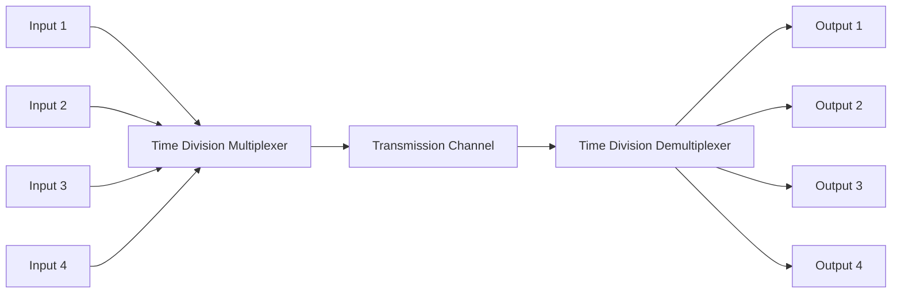
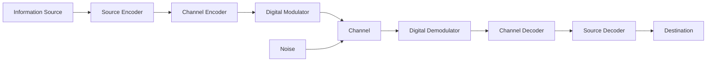
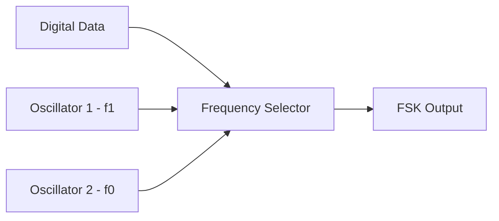
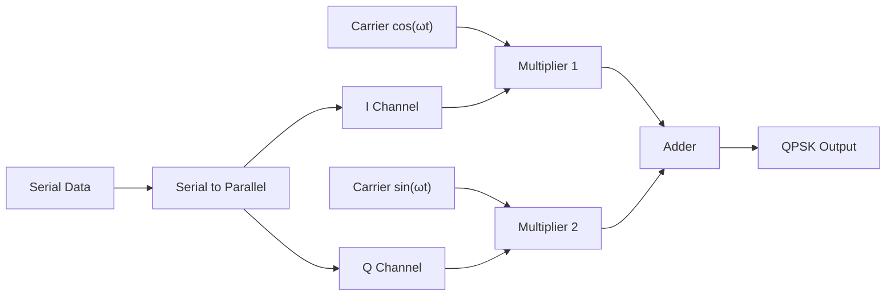
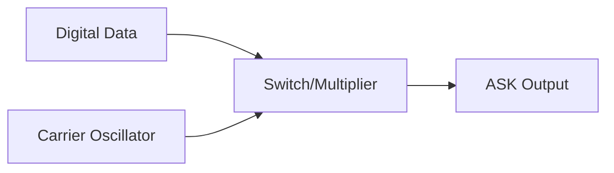
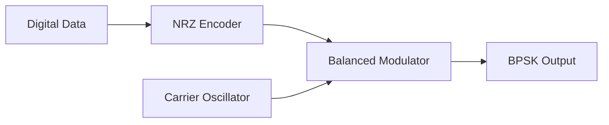
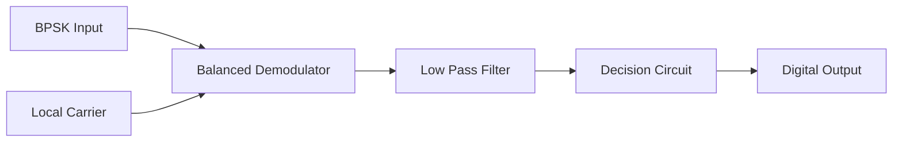
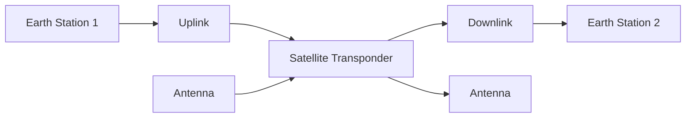
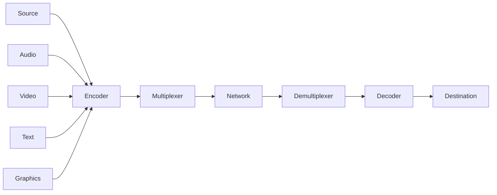

## Question 1(a) [3 marks]

**Define bit rate, baud rate and bandwidth**

**Answer**:

| Parameter | Definition | Unit |
|-----------|------------|------|
| **Bit Rate** | Number of bits transmitted per second | bps (bits per second) |
| **Baud Rate** | Number of signal changes per second | Baud |
| **Bandwidth** | Range of frequencies in communication channel | Hz (Hertz) |

- **Bit rate**: Actual data transmission speed
- **Baud rate**: Modulation rate or symbol rate  
- **Bandwidth**: Channel capacity for frequency range

**Mnemonic:** "Bits Baud Bandwidth - BBB for communication"

## Question 1(b) [4 marks]

**Explain TDM with block diagram**

**Answer**:



- **TDM principle**: Multiple signals share single channel by time slots
- **Time slots**: Each input gets dedicated time period
- **Synchronization**: Transmitter and receiver must be synchronized
- **Applications**: Digital telephone systems, computer networks

**Mnemonic:** "Time Divided Multiple - TDM shares time"

## Question 1(c) [7 marks]

**Explain block diagram of digital communication system**

**Answer**:



**Table: System Components**

| Component | Function |
|-----------|----------|
| **Source Encoder** | Converts analog to digital |
| **Channel Encoder** | Adds error correction codes |
| **Digital Modulator** | Converts digital to analog signal |
| **Channel** | Transmission medium |
| **Digital Demodulator** | Recovers digital signal |
| **Channel Decoder** | Detects and corrects errors |
| **Source Decoder** | Reconstructs original signal |

- **Advantages**: Noise immunity, error correction capability
- **Processing**: Digital signal processing techniques
- **Reliability**: Better performance over long distances

**Mnemonic:** "Source Channel Modulate Transmit Demodulate Decode - SCMTDD"

## Question 1(c OR) [7 marks]

**Explain different types of Communication channel**

**Answer**:

**Channel Types Table:**

| Channel Type | Characteristics | Applications |
|--------------|-----------------|--------------|
| **Telephone Channel** | 300-3400 Hz bandwidth | Voice communication |
| **Coaxial Cable** | High bandwidth, shielded | Cable TV, Internet |
| **Optical Fiber** | Very high bandwidth, light signals | Long distance, high speed |
| **Wireless Channel** | Radio frequency transmission | Mobile, satellite |
| **Satellite Channel** | Long distance, space communication | Global communication |

- **Bandwidth**: Different channels offer varying frequency ranges
- **Noise characteristics**: Each channel has specific noise properties
- **Distance capability**: Varies from local to global coverage
- **Cost factors**: Installation and maintenance costs differ

**Mnemonic:** "Telephone Coax Optical Wireless Satellite - TCOWS channels"

## Question 2(a) [3 marks]

**Draw the modulation waveform for ASK, FSK and BPSK for the digital sequence 11100110**

**Answer**:

```goat
Digital Data: 1  1  1  0  0  1  1  0
             +--+--+--+  +  +--+--+  +
             |  |  |  |  |  |  |  |  |
             |  |  |  |  |  |  |  |  |
             +  +  +  +--+--+  +  +--+

ASK:         +--+--+--+     +--+--+   
             |  |  |  |     |  |  |   
             |  |  |  |     |  |  |   
             +  +  +  +-----+  +  +---

FSK:         ∩∩∩∩∩∩∩∩∩    ∩∩∩∩∩∩∩   
             ∪∪∪∪     ∪∪∪∪     ∪∪∪∪
             High freq   Low   High  Low

BPSK:        +--+--+--+     +--+--+   
             |  |  |  |     |  |  |   
             +  +  +  +-----+  +  +---
             -  -  -  -----   -  ----
```

**Mnemonic:** "ASK Amplitude, FSK Frequency, BPSK Phase - AFP modulation"

## Question 2(b) [4 marks]

**Explain the basic principle and generation of frequency shift keying (FSK) signal**

**Answer**:

**FSK Generation Table:**

| Binary Data | Frequency | Output |
|-------------|-----------|---------|
| Logic '1' | f₁ (High frequency) | High freq carrier |
| Logic '0' | f₀ (Low frequency) | Low freq carrier |



- **Principle**: Binary data controls carrier frequency
- **Two frequencies**: f₁ for '1' and f₀ for '0'
- **Constant amplitude**: Only frequency changes
- **Detection**: Frequency discrimination at receiver

**Mnemonic:** "Frequency Shifts Key - FSK frequency control"

## Question 2(c) [7 marks]

**Explain the working of QPSK modulator and Demodulator with block diagram and constellation diagram**

**Answer**:

**QPSK Modulator Block Diagram:**



**Constellation Diagram:**

```goat
     Q
     |
  01 * * 00
     |
-----*-----  I
     |
  11 * * 10
     |
```

**QPSK Truth Table:**

| I | Q | Phase | Symbol |
|---|---|-------|---------|
| 0 | 0 | 45° | 00 |
| 0 | 1 | 135° | 01 |
| 1 | 1 | 225° | 11 |
| 1 | 0 | 315° | 10 |

- **Four phases**: 45°, 135°, 225°, 315°
- **Two bits per symbol**: Higher data rate
- **Constant envelope**: Amplitude remains constant
- **Demodulation**: Phase detection and parallel to serial conversion

**Mnemonic:** "Quadrature Phase Shift Key - QPSK four phases"

## Question 2(a OR) [3 marks]

**Draw the block diagram of ASK modulator and describe working of it**

**Answer**:



- **Working principle**: Digital data controls carrier amplitude
- **Logic '1'**: Carrier transmitted with full amplitude
- **Logic '0'**: No carrier transmitted (zero amplitude)
- **Simple implementation**: Uses analog switch or multiplier

**Mnemonic:** "Amplitude Shift Key - ASK amplitude control"

## Question 2(b OR) [4 marks]

**Explain the principal of 16-QAM and draw the constellation diagram**

**Answer**:

**16-QAM Constellation:**

```goat
     Q
     |
  *  *  *  *
     |
  *  *  *  *
-----*-----  I
     |
  *  *  *  *
     |
  *  *  *  *
```

**16-QAM Characteristics Table:**

| Parameter | Value |
|-----------|-------|
| **Bits per symbol** | 4 bits |
| **Number of states** | 16 |
| **Amplitude levels** | 4 levels |
| **Phase levels** | 4 phases |

- **Principle**: Combines amplitude and phase modulation
- **Higher data rate**: 4 bits per symbol
- **Complex modulation**: Requires precise amplitude and phase control
- **Applications**: High-speed digital communication

**Mnemonic:** "16 Quadrature Amplitude Modulation - 16QAM complex signals"

## Question 2(c OR) [7 marks]

**Explain working of BPSK modulator and demodulator with block diagram and waveform**

**Answer**:

**BPSK Modulator:**



**BPSK Demodulator:**



**BPSK Waveforms:**

```goat
Data:    1    0    1    0
        +----+    +----+
        |    |    |    |
        +    +----+    +----

Carrier: ∩∩∩∩∩∩∩∩∩∩∩∩∩∩∩∩
         ∪∪∪∪∪∪∪∪∪∪∪∪∪∪∪∪

BPSK:    ∩∩∩∩     ∩∩∩∩    
         ∪∪∪∪∪∪∪∪∪∪∪∪∪∪∪∪
```

- **Phase shift**: 180° between '1' and '0'
- **Coherent detection**: Requires synchronized carrier
- **Best performance**: Lowest bit error rate
- **Constant envelope**: Amplitude remains constant

**Mnemonic:** "Binary Phase Shift Key - BPSK two phases"

## Question 3(a) [3 marks]

**Define Channel Capacity in terms of SNR and explain importance of it**

**Answer**:

**Shannon's Channel Capacity Formula:**

| Formula | C = B log₂(1 + S/N) |
|---------|---------------------|
| **C** | Channel capacity (bps) |
| **B** | Bandwidth (Hz) |
| **S/N** | Signal-to-Noise ratio |

- **Importance**: Maximum theoretical data rate
- **SNR effect**: Higher SNR allows higher capacity
- **Bandwidth trade-off**: Can exchange bandwidth for SNR
- **Design limit**: Sets upper bound for system design

**Mnemonic:** "Channel Capacity Shannon's Limit - CCSL"

## Question 3(b) [4 marks]

**Describe Asynchronous and synchronous serial data communication techniques**

**Answer**:

**Comparison Table:**

| Parameter | Synchronous | Asynchronous |
|-----------|-------------|--------------|
| **Clock** | Separate clock signal | No separate clock |
| **Start/Stop bits** | Not required | Start and stop bits |
| **Speed** | Higher | Lower |
| **Cost** | Higher | Lower |

- **Synchronous**: Clock synchronization required
- **Asynchronous**: Self-synchronizing with start/stop bits
- **Applications**: Synchronous for high-speed, Asynchronous for simple systems
- **Efficiency**: Synchronous more efficient, Asynchronous more flexible

**Mnemonic:** "Sync Clock, Async Start-Stop - SCSS"

## Question 3(c) [7 marks]

**Explain Huffman coding with help of suitable example**

**Answer**:

**Example: Characters A, B, C, D with probabilities 0.4, 0.3, 0.2, 0.1**

**Step-by-step Huffman Tree Construction:**

```goat
Step 1: List probabilities
A: 0.4, B: 0.3, C: 0.2, D: 0.1

Step 2: Combine lowest
       0.3
      /   \
   C:0.2  D:0.1

Step 3: Continue combining
       0.6
      /   \
   B:0.3   0.3
          /   \
       C:0.2  D:0.1

Step 4: Final tree
        1.0
       /   \
    A:0.4   0.6
           /   \
        B:0.3   0.3
               /   \
            C:0.2  D:0.1
```

**Huffman Codes Table:**

| Character | Probability | Code |
|-----------|-------------|------|
| A | 0.4 | 0 |
| B | 0.3 | 10 |
| C | 0.2 | 110 |
| D | 0.1 | 111 |

- **Average code length**: 0.4×1 + 0.3×2 + 0.2×3 + 0.1×3 = 1.9 bits
- **Compression achieved**: Reduces average bits per character
- **Prefix property**: No code is prefix of another

**Mnemonic:** "Huffman Minimum Average Length - HMAL"

## Question 3(a OR) [3 marks]

**State the significance of probability and entropy in communication**

**Answer**:

**Significance Table:**

| Concept | Significance |
|---------|--------------|
| **Probability** | Measures likelihood of information occurrence |
| **Entropy** | Measures average information content |
| **Maximum Entropy** | Occurs with equal probability events |

- **Information content**: I = log₂(1/P) bits
- **Entropy formula**: H = -Σ P(x) log₂ P(x)
- **Channel design**: Helps optimize communication systems
- **Coding efficiency**: Guides source coding design

**Mnemonic:** "Probability Entropy Information - PEI communication"

## Question 3(b OR) [4 marks]

**Explain simplex, half duplex and full duplex data transmission mode**

**Answer**:

**Transmission Modes Table:**

| Mode | Direction | Example | Diagram |
|------|-----------|---------|---------|
| **Simplex** | One-way only | Radio broadcast | A → B |
| **Half Duplex** | Both ways, not simultaneous | Walkie-talkie | A ⇄ B |
| **Full Duplex** | Both ways, simultaneous | Telephone | A ⇌ B |

- **Simplex**: Unidirectional communication
- **Half duplex**: Bidirectional but alternate
- **Full duplex**: Simultaneous bidirectional
- **Bandwidth requirement**: Full duplex needs twice the bandwidth

**Mnemonic:** "Simple Half Full - SHF transmission modes"

## Question 3(c OR) [7 marks]

**Explain Shannon Fano coding with help of suitable example**

**Answer**:

**Example: Characters A, B, C, D with probabilities 0.4, 0.3, 0.2, 0.1**

**Shannon-Fano Algorithm Steps:**

```goat
Step 1: Arrange in descending order
A: 0.4, B: 0.3, C: 0.2, D: 0.1

Step 2: Divide into two groups
Group 1: A(0.4) → Code starts with 0
Group 2: B(0.3), C(0.2), D(0.1) → Code starts with 1

Step 3: Subdivide Group 2
B(0.3) → Code: 10
C(0.2), D(0.1) → Code starts with 11

Step 4: Final subdivision
C(0.2) → Code: 110
D(0.1) → Code: 111
```

**Shannon-Fano Codes Table:**

| Character | Probability | Code |
|-----------|-------------|------|
| A | 0.4 | 0 |
| B | 0.3 | 10 |
| C | 0.2 | 110 |
| D | 0.1 | 111 |

- **Average length**: Same as Huffman (1.9 bits)
- **Top-down approach**: Divides from root to leaves
- **Not always optimal**: Huffman is generally better

**Mnemonic:** "Shannon Fano Top-Down - SFTD coding"

## Question 4(a) [3 marks]

**Describe Ethical and Privacy Considerations in Data Communication**

**Answer**:

**Ethics and Privacy Table:**

| Aspect | Consideration |
|--------|---------------|
| **Data Privacy** | User consent, data protection |
| **Security** | Encryption, access control |
| **Transparency** | Clear data usage policies |

- **Privacy rights**: Users control over personal data
- **Ethical use**: Responsible data handling practices
- **Legal compliance**: Following data protection laws
- **Security measures**: Protecting against unauthorized access

**Mnemonic:** "Privacy Security Transparency - PST ethics"

## Question 4(b) [4 marks]

**Explain RS 232 standard with pin diagram**

**Answer**:

**RS-232 Pin Configuration (DB-9):**

| Pin | Signal | Function |
|-----|--------|----------|
| 1 | DCD | Data Carrier Detect |
| 2 | RXD | Receive Data |
| 3 | TXD | Transmit Data |
| 4 | DTR | Data Terminal Ready |
| 5 | GND | Ground |
| 6 | DSR | Data Set Ready |
| 7 | RTS | Request To Send |
| 8 | CTS | Clear To Send |
| 9 | RI | Ring Indicator |

- **Voltage levels**: +3V to +25V for '0', -3V to -25V for '1'
- **Maximum distance**: 50 feet at 19.2 kbps
- **Applications**: Serial communication between computers and modems

**Mnemonic:** "RS-232 Nine pins Serial - RNS communication"

## Question 4(c) [7 marks]

**Explain Hamming code with help of suitable example**

**Answer**:

**Example: 4-bit data 1011**

**Hamming Code Construction:**

| Position | 1 | 2 | 3 | 4 | 5 | 6 | 7 |
|----------|---|---|---|---|---|---|---|
| **Type** | P1 | P2 | D1 | P4 | D2 | D3 | D4 |
| **Value** | ? | ? | 1 | ? | 0 | 1 | 1 |

**Parity Calculations:**

- **P1** (positions 1,3,5,7): P1 ⊕ 1 ⊕ 0 ⊕ 1 = 0, so P1 = 0
- **P2** (positions 2,3,6,7): P2 ⊕ 1 ⊕ 1 ⊕ 1 = 1, so P2 = 1  
- **P4** (positions 4,5,6,7): P4 ⊕ 0 ⊕ 1 ⊕ 1 = 0, so P4 = 0

**Final Hamming Code: 0110111**

**Error Detection Process:**

- Calculate syndrome S = S4S2S1
- If S = 000, no error
- If S ≠ 000, error at position indicated by S

- **Single error correction**: Can correct one-bit errors
- **Double error detection**: Can detect two-bit errors
- **Systematic approach**: Organized parity bit placement

**Mnemonic:** "Hamming Single Error Correction - HSEC"

## Question 4(a OR) [3 marks]

**Define Edge Computing and explain feature of it**

**Answer**:

**Edge Computing Features:**

| Feature | Description |
|---------|-------------|
| **Low Latency** | Processing near data source |
| **Bandwidth Saving** | Reduces network traffic |
| **Real-time Processing** | Immediate data analysis |

- **Definition**: Computing at network edge, close to data sources
- **Reduced latency**: Faster response times
- **Distributed processing**: Reduces central server load
- **Applications**: IoT, autonomous vehicles, smart cities

**Mnemonic:** "Edge Low-latency Real-time - ELR computing"

## Question 4(b OR) [4 marks]

**Explain needs of multimedia processing for communication and various file formats of different data**

**Answer**:

**Multimedia File Formats Table:**

| Data Type | Formats | Characteristics |
|-----------|---------|-----------------|
| **Audio** | MP3, WAV, AAC | Compressed/Uncompressed |
| **Video** | MP4, AVI, MOV | Different codecs |
| **Image** | JPEG, PNG, GIF | Lossy/Lossless compression |
| **Text** | TXT, PDF, DOC | Various encodings |

- **Processing needs**: Compression, format conversion, quality optimization
- **Bandwidth optimization**: Reducing file sizes for transmission
- **Quality preservation**: Maintaining acceptable quality levels
- **Compatibility**: Supporting multiple devices and platforms

**Mnemonic:** "Audio Video Image Text - AVIT multimedia"

## Question 4(c OR) [7 marks]

**Explain different Line coding with help of waveform**

**Answer**:

**Line Coding Waveforms for data 1011:**

```goat
Data:        1    0    1    1
            +----+    +----+----
            |    |    |    |
            +    +----+    +

NRZ-L:      +----+    +----+----
            |    |    |    |
            +    +----+    +

NRZ-I:      +----+----+    +
            |    |    |    |
            +    +    +----+----

RZ:         +--+ +    +--+ +--+
            |  | |    |  | |  |
            +  +-+----+  +-+  +

Manchester: +--+    --+ +--+    +
            |  |   |  | |  |   |
            +  +---+  +-+  +---+
```

**Line Coding Comparison:**

| Code Type | Bandwidth | DC Component | Synchronization |
|-----------|-----------|--------------|----------------|
| **NRZ-L** | Low | Present | Poor |
| **NRZ-I** | Low | Present | Poor |
| **RZ** | High | Present | Good |
| **Manchester** | High | Absent | Excellent |

- **NRZ**: Non-Return-to-Zero, simple but has DC component
- **RZ**: Return-to-Zero, better synchronization
- **Manchester**: Self-synchronizing, no DC component
- **Selection criteria**: Bandwidth, synchronization, complexity

**Mnemonic:** "NRZ RZ Manchester - NRM line codes"

## Question 5(a) [3 marks]

**Explain concept of spread spectrum technology**

**Answer**:

**Spread Spectrum Characteristics:**

| Parameter | Description |
|-----------|-------------|
| **Bandwidth Spreading** | Signal spread over wide frequency |
| **Low Power Density** | Power distributed across spectrum |
| **Interference Resistance** | Resistant to jamming |

- **Principle**: Spreads signal over much wider bandwidth than required
- **Techniques**: Direct Sequence (DS-SS), Frequency Hopping (FH-SS)
- **Advantages**: Security, interference resistance, multiple access
- **Applications**: GPS, CDMA, WiFi, Bluetooth

**Mnemonic:** "Spread Spectrum Security - SSS technology"

## Question 5(b) [4 marks]

**Explain block diagram of satellite communication**

**Answer**:



**Satellite Communication Components:**

| Component | Function |
|-----------|----------|
| **Earth Station** | Ground-based transmit/receive |
| **Uplink** | Earth to satellite transmission |
| **Transponder** | Satellite receiver-transmitter |
| **Downlink** | Satellite to earth transmission |

- **Frequency bands**: C-band, Ku-band, Ka-band
- **Coverage area**: Large geographical coverage
- **Applications**: Broadcasting, telephony, internet
- **Advantages**: Wide coverage, long-distance communication

**Mnemonic:** "Earth Uplink Transponder Downlink - EUTD satellite"

## Question 5(c) [7 marks]

**Demonstrate model of Multimedia Communications and elements of Multimedia system**

**Answer**:

**Multimedia Communication Model:**



**Multimedia System Elements:**

| Element | Function | Examples |
|---------|----------|----------|
| **Capture** | Input multimedia data | Camera, microphone |
| **Storage** | Store multimedia files | Hard disk, memory |
| **Processing** | Edit and manipulate | Video editing software |
| **Communication** | Transmit multimedia | Networks, internet |
| **Presentation** | Display multimedia | Monitor, speakers |

- **Synchronization**: Audio-video synchronization critical
- **Compression**: Reduces bandwidth requirements
- **Quality of Service**: Maintains acceptable quality
- **Real-time constraints**: Time-sensitive data delivery

**Mnemonic:** "Capture Store Process Communicate Present - CSPCP multimedia"

## Question 5(a OR) [3 marks]

**Explain importance of Block chain in Communication Security**

**Answer**:

**Blockchain Security Features:**

| Feature | Benefit |
|---------|---------|
| **Decentralization** | No single point of failure |
| **Immutability** | Cannot alter past records |
| **Transparency** | All transactions visible |

- **Cryptographic security**: Hash functions and digital signatures
- **Distributed ledger**: Multiple copies prevent tampering
- **Smart contracts**: Automated security protocols
- **Applications**: Secure messaging, identity verification

**Mnemonic:** "Blockchain Distributed Immutable - BDI security"

## Question 5(b OR) [4 marks]

**Explain important elements, features and advantages of 5G technology**

**Answer**:

**5G Technology Elements:**

| Element | Specification |
|---------|---------------|
| **Speed** | Up to 10 Gbps |
| **Latency** | Less than 1 ms |
| **Connections** | 1 million devices per km² |
| **Reliability** | 99.999% availability |

**Key Features:**

- **Enhanced Mobile Broadband**: Ultra-high-speed internet
- **Ultra-Reliable Low Latency**: Critical applications
- **Massive Machine Communication**: IoT connectivity
- **Network Slicing**: Customized network services

**Advantages:**

- **Higher capacity**: More simultaneous users
- **Energy efficiency**: Better battery life for devices
- **New applications**: AR/VR, autonomous vehicles

**Mnemonic:** "5G Speed Latency Connections - SLC features"

## Question 5(c OR) [7 marks]

**Compare RS 232, RS 422 and RS 485 standard**

**Answer**:

**RS Standards Comparison Table:**

| Parameter | RS-232 | RS-422 | RS-485 |
|-----------|---------|--------|--------|
| **Mode** | Single-ended | Differential | Differential |
| **Max Distance** | 50 feet | 4000 feet | 4000 feet |
| **Max Speed** | 20 kbps | 10 Mbps | 10 Mbps |
| **Drivers** | 1 | 1 | 32 |
| **Receivers** | 1 | 10 | 32 |
| **Topology** | Point-to-Point | Point-to-Multipoint | Multipoint |

**Voltage Levels:**

| Standard | Logic 1 | Logic 0 |
|----------|---------|---------|
| **RS-232** | -3V to -25V | +3V to +25V |
| **RS-422** | Differential > +200mV | Differential < -200mV |
| **RS-485** | Differential > +200mV | Differential < -200mV |

**Applications:**

- **RS-232**: Computer serial ports, modems
- **RS-422**: Industrial automation, long-distance
- **RS-485**: Building automation, industrial networks

**Key Differences:**

- **Noise immunity**: Differential signaling in RS-422/485 better than RS-232
- **Distance capability**: RS-422/485 much longer than RS-232
- **Multi-drop capability**: RS-485 supports multiple devices
- **Cost**: RS-232 cheapest, RS-485 most complex

**Mnemonic:** "RS-232 Simple, RS-422 Long, RS-485 Multi - SLM standards"
