## પ્રશ્ન 1(અ) [3 ગુણ]

**કોમ્યુનિકેશનની મૂળભૂત રીતોનો તફાવત આપો: બ્રોડ કાસ્ટિંગ કમ્યુનિકેશન અને પોઈન્ટ ટુ પોઈન્ટ કોમ્યુનિકેશન.**

**જવાબ**:

| પેરામીટર | બ્રોડકાસ્ટિંગ કમ્યુનિકેશન | પોઈન્ટ ટુ પોઈન્ટ કોમ્યુનિકેશન |
|-----------|----------------------------|------------------------------|
| **વ્યાખ્યા** | એક ટ્રાન્સમીટર એક સાથે અનેક રિસીવર્સને સિગ્નલ મોકલે છે | એક ટ્રાન્સમીટર એક જ ચોક્કસ રિસીવર સાથે કમ્યુનિકેશન કરે છે |
| **દિશા** | એકદિશામાં (એકમાર્ગી) | દ્વિદિશામાં (દ્વિમાર્ગી) |
| **ઉદાહરણ** | ટીવી, રેડિયો, એફએમ | ટેલિફોન, મોબાઈલ કૉલ, પ્રાઈવેટ નેટવર્ક |
| **ગોપનીયતા** | ઓછી (મર્યાદામાં આવતા બધાને સિગ્નલ મળે છે) | વધારે (એન્ડપોઈન્ટ વચ્ચે ડેડિકેટેડ કનેક્શન) |
| **કાર્યક્ષમતા** | સામૂહિક કમ્યુનિકેશન માટે ઉત્તમ | વ્યક્તિગત/ખાનગી કમ્યુનિકેશન માટે વધુ સારું |

**મેમરી ટ્રીક:** "BDPEC" - "બ્રોડકાસ્ટિંગ ડિસ્ટ્રિબ્યુટ્સ ટુ પબ્લિક, એન્ડપોઈન્ટ્સ કનેક્ટ ઈન પોઈન્ટ-ટુ-પોઈન્ટ"

## પ્રશ્ન 1(બ) [4 ગુણ]

**વ્યાખ્યા આપો: બિટ રેટ, બોડ રેટ, બેન્ડવીડ્થ અને રીપીટર અંતર.**

**જવાબ**:

| પદ | વ્યાખ્યા |
|------|------------|
| **બિટ રેટ** | એક સેકન્ડમાં ટ્રાન્સમિટ થતા બાઈનરી બિટ્સની સંખ્યા (bps). વાસ્તવિક ડેટા ટ્રાન્સફર સ્પીડ માપે છે. |
| **બોડ રેટ** | એક સેકન્ડમાં ટ્રાન્સમિટ થતા સિગ્નલ યુનિટ્સ કે સિમ્બોલ્સની સંખ્યા. એક સિમ્બોલમાં એકથી વધુ બિટ હોઈ શકે. |
| **બેન્ડવીડ્થ** | સિગ્નલ દ્વારા ઉપયોગમાં લેવાતી ફ્રિક્વન્સીઓની રેન્જ, હર્ટ્ઝ (Hz)માં માપવામાં આવે છે. ચેનલની મહત્તમ ડેટા ક્ષમતા નક્કી કરે છે. |
| **રીપીટર અંતર** | કમ્યુનિકેશન સિસ્ટમમાં રીપીટર્સ વચ્ચેનું મહત્તમ અંતર જ્યાં સુધી સિગ્નલ ડિગ્રેડેશન પહેલાં રીજનરેશનની જરૂર પડે છે. |

**ડાયાગ્રામ:**

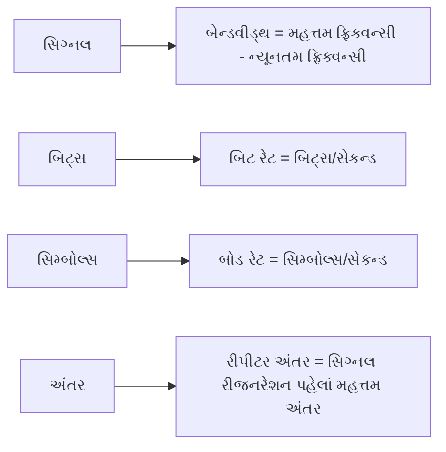

**મેમરી ટ્રીક:** "BBRR" - "બેટર બેન્ડવીડ્થ રિક્વાયર્સ રીપીટર્સ"

## પ્રશ્ન 1(ક) [7 ગુણ]

**ડિજિટલ કોમ્યુનિકેશન સિસ્ટમનો બ્લોક ડાયાગ્રામ દોરો. દરેક બ્લોકના કાર્યોને સંક્ષિપ્તમાં સમજાવો. તેના ફાયદા અને ગેરફાયદા જણાવો.**

**જવાબ**:

**બ્લોક ડાયાગ્રામ:**

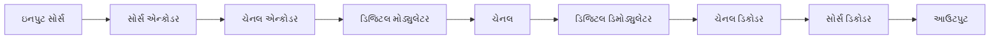

**કાર્યો:**

| બ્લોક | કાર્ય |
|-------|----------|
| **સોર્સ એન્કોડર** | એનાલોગ સિગ્નલને ડિજિટલમાં કન્વર્ટ કરે છે, રિડન્ડન્સી દૂર કરે છે, ડેટા કોમ્પ્રેસ કરે છે |
| **ચેનલ એન્કોડર** | ભૂલ શોધવા અને સુધારવા માટે રિડન્ડન્સી ઉમેરે છે |
| **ડિજિટલ મોડ્યુલેટર** | ડિજિટલ ડેટાને ટ્રાન્સમિશન માટે યોગ્ય ફોર્મમાં કન્વર્ટ કરે છે (ASK, FSK, PSK, વગેરે) |
| **ચેનલ** | માધ્યમ જેના દ્વારા સિગ્નલ પ્રવાસ કરે છે (વાયર્ડ/વાયરલેસ) |
| **ડિજિટલ ડિમોડ્યુલેટર** | મળેલા મોડ્યુલેટેડ સિગ્નલમાંથી મૂળ ડિજિટલ ડેટા એક્સટ્રેક્ટ કરે છે |
| **ચેનલ ડિકોડર** | ઉમેરેલી રિડન્ડન્સીનો ઉપયોગ કરીને ભૂલો શોધે અને સુધારે છે |
| **સોર્સ ડિકોડર** | ડેટાને ડિકોમ્પ્રેસ કરે છે અને મૂળ સ્વરૂપમાં કન્વર્ટ કરે છે |

**ફાયદા અને ગેરફાયદા:**

| ફાયદા | ગેરફાયદા |
|------------|---------------|
| નોઇઝ સામે સારી રક્ષા | વધુ બેન્ડવીડ્થની જરૂર પડે છે |
| સિગ્નલ રીજનરેશન સરળ | જટિલ અમલીકરણ |
| સુરક્ષિત ટ્રાન્સમિશન શક્ય | સિન્ક્રોનાઇઝેશનની જરૂર છે |
| કમ્પ્યુટર સાથે સરળ એકીકરણ | ક્વોન્ટાઇઝેશન ભૂલો |
| લાંબા અંતર માટે સારી ગુણવત્તા | સરળ એપ્લિકેશન માટે વધુ ખર્ચ |

**મેમરી ટ્રીક:** "SECDCSO" - "સિક્યોર એન્કોડિંગ ક્રિએટ્સ ડિજિટલ કમ્યુનિકેશન સિસ્ટમ આઉટપુટ"

## પ્રશ્ન 1(ક) OR [7 ગુણ]

**ડિજિટલ કમ્યુનિકેશન માટે મલ્ટિપ્લેક્સિંગ તકનીકોની જરૂરિયાતોને ન્યાયી ઠેરવો. ટાઇમ ડિવિઝન મલ્ટિપ્લેક્સિંગ ટેકનિક દોરો અને સંક્ષિપ્તમાં સમજાવો. તેના ફાયદા અને ગેરફાયદાની ચર્ચા કરો.**

**જવાબ**:

**મલ્ટિપ્લેક્સિંગની જરૂરિયાત:**

| જરૂરિયાત | સમજૂતી |
|------|-------------|
| **ચેનલ કાર્યક્ષમતા** | એક ચેનલ પર અનેક સિગ્નલ્સ મોકલવાની મંજૂરી આપે છે, બેન્ડવીડ્થ બચાવે છે |
| **ખર્ચ ઘટાડો** | અનેક ટ્રાન્સમિશન માધ્યમોની જરૂરિયાત ઘટાડે છે |
| **ઇન્ફ્રાસ્ટ્રક્ચર ઉપયોગ** | મોંઘા ઇન્ફ્રાસ્ટ્રક્ચરનો મહત્તમ ઉપયોગ કરે છે |
| **સ્પેક્ટ્રમ સંરક્ષણ** | મર્યાદિત ફ્રિક્વન્સી સ્પેક્ટ્રમનું સંરક્ષણ કરે છે |

**ટાઇમ ડિવિઝન મલ્ટિપ્લેક્સિંગ (TDM):**

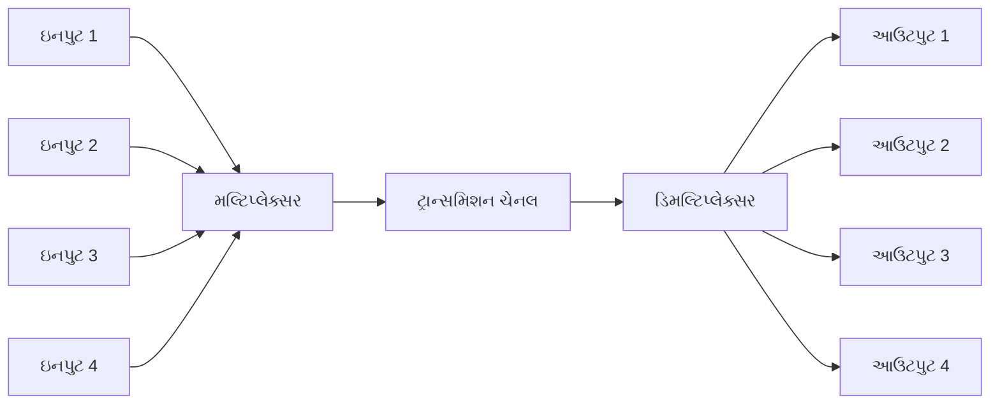

**કાર્યપદ્ધતિ:** TDMમાં, દરેક ઇનપુટ સિગ્નલને એક ચોક્કસ ટાઇમ સ્લોટ મળે છે. મલ્ટિપ્લેક્સર દરેક ઇનપુટને ક્રમાનુસાર સેમ્પલ કરે છે અને તેમને એક ઉચ્ચ-સ્પીડ ડેટા સ્ટ્રીમમાં જોડે છે. રિસીવર પર, ડિમલ્ટિપ્લેક્સર ટાઇમિંગના આધારે સ્ટ્રીમને મૂળ સિગ્નલ્સમાં અલગ કરે છે.

**ફાયદા અને ગેરફાયદા:**

| ફાયદા | ગેરફાયદા |
|--------|----------|
| **કાર્યક્ષમ બેન્ડવીડ્થ ઉપયોગ** | **સિન્ક્રોનાઇઝેશન જરૂરી છે** |
| **ગાર્ડ બેન્ડની જરૂર નથી** | **જટિલ બફરિંગની જરૂર પડે છે** |
| **ક્રોસ-ટોક નથી** | **ટાઇમિંગ સમસ્યાઓ ભૂલો પેદા કરી શકે છે** |
| **ફ્લેક્સિબલ એલોકેશન** | **વણવપરાયેલા સ્લોટ્સ ક્ષમતા બગાડે છે** |
| **ડિજિટલ અમલીકરણ** | **વ્યક્તિગત ચેનલો કરતાં વધુ ડેટા રેટ** |

**મેમરી ટ્રીક:** "TIME" - "ટ્રાન્સમિશન ઇન્ટરલીવ્સ મલ્ટિપલ એન્ડપોઇન્ટ્સ"

## પ્રશ્ન 2(અ) [3 ગુણ]

**તફાવત કરો: કોહેરેંટ અને નોન-કોહેરેન્ટ ડીટેક્શન ટેક્નીક**

**જવાબ**:

| પેરામીટર | કોહેરેંટ ડિટેક્શન | નોન-કોહેરેંટ ડિટેક્શન |
|-----------|-------------------|------------------------|
| **ફેઝ ઇન્ફોર્મેશન** | ફેઝ ઇન્ફોર્મેશનનો ઉપયોગ કરે છે | ફેઝ ઇન્ફોર્મેશનને અવગણે છે |
| **લોકલ ઓસિલેટર** | જરૂરી છે | જરૂરી નથી |
| **જટિલતા** | વધુ જટિલ | સરળ |
| **પરફોર્મન્સ** | નોઇઝમાં વધુ સારું | નોઇઝમાં ઓછું કાર્યક્ષમ |
| **અમલીકરણ** | મુશ્કેલ | સરળ |
| **એપ્લિકેશન્સ** | ઉચ્ચ-ગુણવત્તા સિસ્ટમો | ઓછી-કિંમતની સિસ્ટમો |

**મેમરી ટ્રીક:** "PLCPIA" - "ફેઝ લોકલ કોમ્પ્લેક્સ પરફોર્મન્સ ઇમ્પ્લિમેન્ટેશન એપ્લિકેશન્સ"

## પ્રશ્ન 2(બ) [4 ગુણ]

**ડેટા સિક્વન્સ 101100110110 માટે ASK, FSK, PSK અને QPSK વેવફોર્મ દોરો.**

**જવાબ**:

```goat
Input Data:  1  0  1  1  0  0  1  1  0  1  1  0
            ▄▄    ▄▄▄▄       ▄▄▄▄    ▄▄▄▄    
            │ │   │  │       │  │    │  │    
Data:       │ │   │  │       │  │    │  │    
            │ └───┘  └───────┘  └────┘  └────
            
            ▄▄    ▄▄▄▄       ▄▄▄▄    ▄▄▄▄    
            │ │   │  │       │  │    │  │    
ASK:        │ │   │  │       │  │    │  │    
            └─┴───┴──┴───────┴──┴────┴──┴────
            
            ▄▄▄▄  ████▄▄▄▄▄  ████▄▄  ████▄▄  
FSK High:   │  │  │  │    │  │  │ │  │  │ │  
FSK Low:   ─┘  └──┘  └────┘──┘  └─┘──┘  └─┘──
            
            ▄▄    ▄▄▄▄       ▄▄▄▄    ▄▄▄▄    
            │ │   │  │       │  │    │  │    
PSK 0°:     │ │   │  │       │  │    │  │    
            │ └───┘  └───────┘  └────┘  └────
PSK 180°:  ─┘     ▄▄     ▄▄▄▄▄▄     ▄▄     ▄▄
                  │ │    │    │     │ │    │ 
                  │ │    │    │     │ │    │ 
                  └─┘    └────┘     └─┘    └─

QPSK:     ┌─┐   ┌─┐ ┌─┐   ┌─┐ ┌─┐   ┌─┐ ┌─┐ 
90° 00:  _│ │___│ │_│ │___│ │_│ │___│ │_│ │__
180° 10: _┘ └───┘ └─┘ └───┘ └─┘ └───┘ └─┘ └__
270° 11: ───┐ ┌───┐   ┌───┐   ┌───┐   ┌──────
0° 01:   ───┘ └───┘   └───┘   └───┘   └──────
```

**મેમરી ટ્રીક:** "AFPQ" - "એમ્પ્લિટ્યુડ ફ્રિક્વન્સી ફેઝ ક્વોડ્રેચર"

## પ્રશ્ન 2(ક) [7 ગુણ]

**16-QAMનો સિદ્ધાંત સમજાવો. 16-QAM માટે નક્ષત્ર આકૃતિ અને વેવફોર્મ પણ સમજાવો. તેના ફાયદા અને ગેરફાયદા લખો.**

**જવાબ**:

**16-QAMનો સિદ્ધાંત:**
16-QAM (ક્વોડ્રેચર એમ્પ્લિટ્યુડ મોડ્યુલેશન) એમ્પ્લિટ્યુડ અને ફેઝ મોડ્યુલેશનને જોડે છે જેથી દર સિમ્બોલ દીઠ 4 બિટ્સ ટ્રાન્સમિટ કરી શકાય. તે 16 જુદા જુદા એમ્પ્લિટ્યુડ અને ફેઝના સંયોજનો વાપરે છે, જે સમાન બેન્ડવીડ્થમાં ઉચ્ચ ડેટા રેટની પરવાનગી આપે છે.

**નક્ષત્ર આકૃતિ:**

```goat
           Q
           ▲
           │
   ●   ●   │   ●   ●
           │
   ●   ●   │   ●   ●
-----------+-----------> I
   ●   ●   │   ●   ●
           │
   ●   ●   │   ●   ●
           │
           
Each point represents 4 bits (0000 to 1111)
```

**વેવફોર્મ:**
16-QAM વેવફોર્મ એમ્પ્લિટ્યુડ (4 લેવલ) અને ફેઝ (4 ફેઝ) બંનેમાં બદલાય છે, જે 16 અનન્ય સિમ્બોલ્સ બનાવે છે.

**ફાયદા અને ગેરફાયદા:**

| ફાયદા | ગેરફાયદા |
|------------|---------------|
| **ઉચ્ચ સ્પેક્ટ્રલ કાર્યક્ષમતા** | **નોઇઝ અને ઇન્ટરફેરન્સ પ્રત્યે સંવેદનશીલ** |
| **ઉચ્ચ ડેટા રેટ** | **ઉચ્ચ SNRની જરૂર પડે છે** |
| **બેન્ડવીડ્થ કાર્યક્ષમ** | **જટિલ અમલીકરણ** |
| **ચેનલ ક્ષમતાનો વધુ સારો ઉપયોગ** | **એમ્પ્લિટ્યુડ વિકૃતિ પ્રત્યે સંવેદનશીલ** |

**મેમરી ટ્રીક:** "SCHAP" - "સિક્સટીન કોમ્બિનેશન્સ હેવ એમ્પ્લિટ્યુડ એન્ડ ફેઝ"

## પ્રશ્ન 2(અ) OR [3 ગુણ]

**સરખામણી કરો: ASK અને PSK**

**જવાબ**:

| પેરામીટર | ASK (એમ્પ્લિટ્યુડ શિફ્ટ કીઇંગ) | PSK (ફેઝ શિફ્ટ કીઇંગ) |
|-----------|------------------------------|--------------------------|
| **મોડ્યુલેશન પેરામીટર** | એમ્પ્લિટ્યુડ | ફેઝ |
| **નોઇઝ ઇમ્યુનિટી** | નબળી | સારી |
| **પાવર એફિશિયન્સી** | ઓછી કાર્યક્ષમ | વધુ કાર્યક્ષમ |
| **બેન્ડવીડ્થ એફિશિયન્સી** | નીચી | ઉંચી |
| **અમલીકરણ** | સરળ | વધુ જટિલ |
| **BER પર્ફોર્મન્સ** | ઉચ્ચ ભૂલ દર | નીચો ભૂલ દર |

**મેમરી ટ્રીક:** "ANPBIP" - "એમ્પ્લિટ્યુડ નોઇઝ પાવર બેન્ડવીડ્થ ઇમ્પ્લિમેન્ટેશન પર્ફોર્મન્સ"

## પ્રશ્ન 2(બ) OR [4 ગુણ]

**BPSK મોડ્યુલેટર અને ડિમોડ્યુલેટરનો બ્લોક ડાયાગ્રામ દોરો.**

**જવાબ**:

**BPSK મોડ્યુલેટર:**

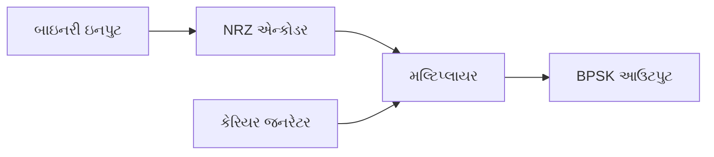

**BPSK ડિમોડ્યુલેટર:**


**મેમરી ટ્રીક:** "MNECO" - "મોડ્યુલેશન નીડ્સ એન્કોડિંગ, કેરિયર્સ, ઓસીલેટર્સ"

## પ્રશ્ન 2(ક) OR [7 ગુણ]

**બ્લોક ડાયાગ્રામ અને વેવફોર્મની મદદથી QPSK જનરેશન અને ડિટેક્શન સમજાવો. તેના ફાયદા અને ગેરફાયદાની ચર્ચા કરો.**

**જવાબ**:

**QPSK જનરેશન બ્લોક ડાયાગ્રામ:**

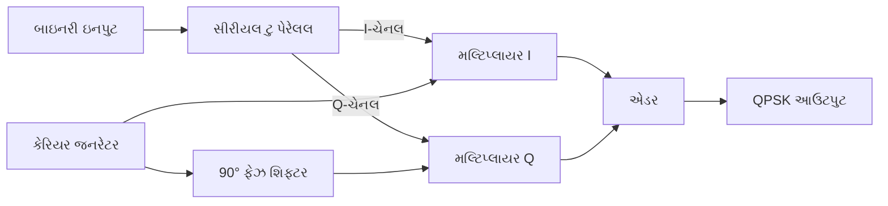

**QPSK ડિટેક્શન બ્લોક ડાયાગ્રામ:**

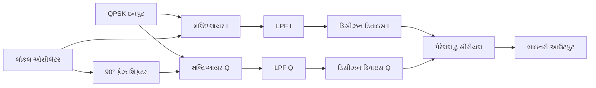

**QPSK વેવફોર્મ:**
QPSKમાં દરેક સિમ્બોલ 2 બિટ્સનું પ્રતિનિધિત્વ કરે છે, જેમાં 4 શક્ય ફેઝ સ્ટેટ્સ (0°, 90°, 180°, 270°) હોય છે.

**ફાયદા અને ગેરફાયદા:**

| ફાયદા | ગેરફાયદા |
|------------|---------------|
| **BPSKની તુલનામાં બમણો ડેટા રેટ** | **વધુ જટિલ અમલીકરણ** |
| **BPSK જેટલું જ બેન્ડવીડ્થ** | **ફેઝ ભૂલો પ્રત્યે સંવેદનશીલ** |
| **સારી નોઇઝ ઇમ્યુનિટી** | **કેરિયર રિકવરીની જરૂર પડે છે** |
| **સ્પેક્ટ્રલ કાર્યક્ષમતા** | **વધુ જટિલ સિન્ક્રોનાઇઝેશન** |

**મેમરી ટ્રીક:** "PACE" - "ફેઝ અલ્ટરેશન કેરીસ એક્સ્ટ્રા ડેટા"

## પ્રશ્ન 3(અ) [3 ગુણ]

**RS-422 ની વિશેષતાઓ જણાવો.**

**જવાબ**:

| RS-422ની વિશેષતાઓ |
|-------------------|
| **ડિફરેન્શિયલ સિગ્નલિંગ** નોઇઝ ઇમ્યુનિટી માટે |
| **મહત્તમ ડેટા રેટ** 10 Mbps |
| **મહત્તમ કેબલ લંબાઈ** 1200 મીટર |
| **મલ્ટિ-ડ્રોપ ક્ષમતા** (1 ડ્રાઇવર, 10 સુધી રિસીવર્સ) |
| **બેલેન્સ્ડ ટ્રાન્સમિશન લાઇન** |
| **RS-232 કરતાં ઉચ્ચ નોઇઝ ઇમ્યુનિટી** |

**મેમરી ટ્રીક:** "DMMBHN" - "ડિફરેન્શિયલ મેક્સિમમ મલ્ટિ-ડ્રોપ બેલેન્સ્ડ હાયર નોઇઝ-ઇમ્યુનિટી"

## પ્રશ્ન 3(બ) [4 ગુણ]

**વ્યાખ્યા આપો: એન્ટ્રોપી, માહિતી, પરસ્પર માહિતી અને સંભાવના.**

**જવાબ**:

| પદ | વ્યાખ્યા |
|------|------------|
| **એન્ટ્રોપી** | મેસેજ સોર્સમાં અનિશ્ચિતતા કે અનિયમિતતાનું માપ, H(X) = -∑p(x)log₂p(x) તરીકે ગણાય છે |
| **માહિતી** | મેસેજ મળ્યા પછી અનિશ્ચિતતામાં ઘટાડો, બિટ્સમાં માપવામાં આવે છે |
| **પરસ્પર માહિતી** | બે રેન્ડમ વેરિએબલ્સ વચ્ચેની નિર્ભરતાનું માપ, જે દર્શાવે છે કે એક વેરિએબલ બીજા વિશે કેટલી માહિતી ધરાવે છે |
| **સંભાવના** | ઘટના ઘટવાની શક્યતાનું ગાણિતિક માપ, 0 (અશક્ય)થી 1 (ચોક્કસ) સુધીની રેન્જમાં હોય છે |

**ડાયાગ્રામ:**

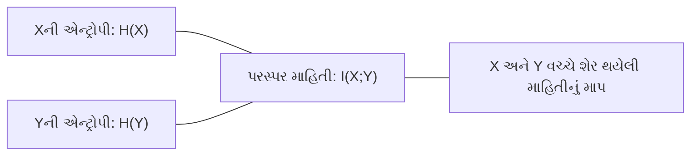

**મેમરી ટ્રીક:** "EIMP" - "એન્ટ્રોપી ઇન્ફોર્મેશન મેઝર્સ પ્રોબેબિલિટી"

## પ્રશ્ન 3(ક) [7 ગુણ]

**યોગ્ય ઉદાહરણ સાથે હફમેન કોડ અને શેનોન-ફેનો કોડ સમજાવો.**

**જવાબ**:

**હફમેન કોડ:**
હફમેન કોડિંગ સિમ્બોલ્સને તેમની ફ્રિક્વન્સીના આધારે વેરિએબલ-લેન્થ કોડ આપે છે, જેમાં વધુ વારંવાર આવતા સિમ્બોલ્સ માટે ટૂંકા કોડ આપે છે.

**ઉદાહરણ:**

| સિમ્બોલ | ફ્રિક્વન્સી | હફમેન કોડ |
|--------|-----------|--------------|
| A | 45% | 0 |
| B | 25% | 10 |
| C | 15% | 110 |
| D | 10% | 1110 |
| E | 5% | 1111 |

**હફમેન ટ્રી:**

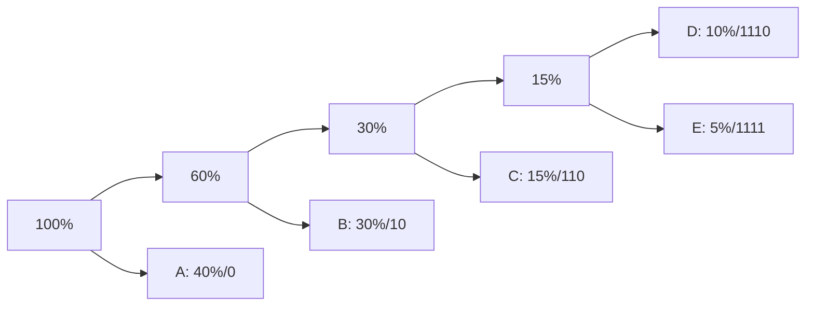

**શેનોન-ફેનો કોડ:**
શેનોન-ફેનો અલ્ગોરિધમ સિમ્બોલ્સને સમાન ફ્રિક્વન્સીના બે ગ્રુપમાં વારંવાર વિભાજિત કરે છે, પછી એક ગ્રુપને 0 અને બીજાને 1 આપે છે.

**ઉદાહરણ:**

| સિમ્બોલ | ફ્રિક્વન્સી | શેનોન-ફેનો કોડ |
|--------|-----------|-------------------|
| A | 45% | 0 |
| B | 25% | 10 |
| C | 15% | 110 |
| D | 10% | 1110 |
| E | 5% | 1111 |

**શેનોન-ફેનો ટ્રી:**

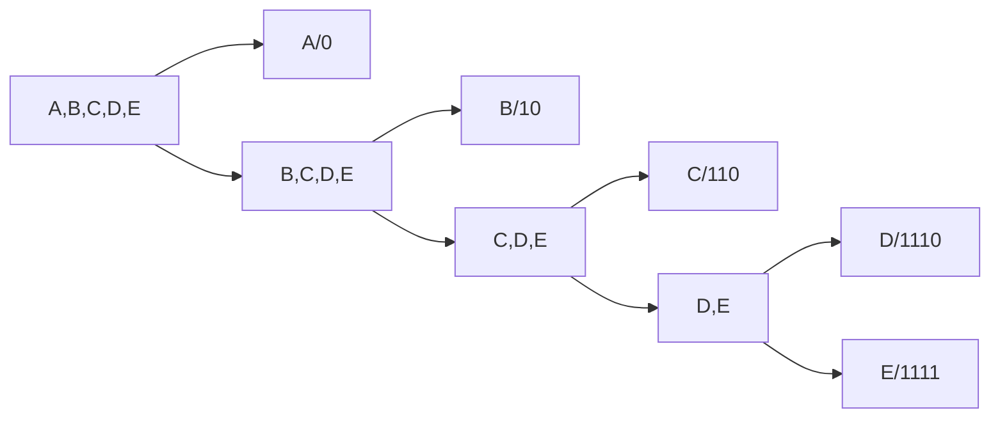

**મેમરી ટ્રીક:** "FREDS" - "ફ્રિક્વન્સી રિડ્યુસીસ એન્કોડિંગ ડિજિટ સાઇઝ"

## પ્રશ્ન 3(અ) OR [3 ગુણ]

**RS-232 ની વિશેષતાઓ જણાવો.**

**જવાબ**:

| RS-232ની વિશેષતાઓ |
|-------------------|
| **સિંગલ-એન્ડેડ સિગ્નલિંગ** |
| **મહત્તમ ડેટા રેટ** 20 kbps |
| **મહત્તમ કેબલ લંબાઈ** 15 મીટર |
| **પોઈન્ટ-ટુ-પોઈન્ટ કમ્યુનિકેશન** (1 ડ્રાઇવર, 1 રિસીવર) |
| **વોલ્ટેજ લેવલ**: -15V થી +15V |
| **25-પિન અથવા 9-પિન** DB કનેક્ટર સ્ટાન્ડર્ડ |

**મેમરી ટ્રીક:** "SMPVD" - "સિંગલ મેક્સિમમ પોઈન્ટ-ટુ-પોઈન્ટ વોલ્ટેજ DB-કનેક્ટર"

## પ્રશ્ન 3(બ) OR [4 ગુણ]

**SNR ના સંદર્ભમાં ચેનલ ક્ષમતા શું છે? તેનું મહત્વ સમજાવો**

**જવાબ**:

**ચેનલ ક્ષમતા:**
એક કમ્યુનિકેશન ચેનલ પર ભૂલની અત્યંત ઓછી સંભાવના સાથે મહત્તમ રેટ જેના પર માહિતી ટ્રાન્સમિટ કરી શકાય છે.

**ફોર્મ્યુલા:** C = B × log₂(1 + SNR)

જ્યાં:

- C = ચેનલ ક્ષમતા બિટ્સ પ્રતિ સેકન્ડમાં
- B = બેન્ડવીડ્થ હર્ટ્ઝમાં
- SNR = સિગ્નલ-ટુ-નોઇઝ રેશિયો

**મહત્વ:**

| ચેનલ ક્ષમતાનું મહત્વ |
|-------------------------------|
| **ડેટા ટ્રાન્સમિશન માટે સૈદ્ધાંતિક મર્યાદા** નિર્ધારિત કરે છે |
| **સિસ્ટમ ડિઝાઇન** અને ઓપ્ટિમાઇઝેશન માર્ગદર્શન આપે છે |
| **કમ્યુનિકેશન સિસ્ટમ્સના પ્રદર્શનનું** મૂલ્યાંકન કરવામાં મદદ કરે છે |
| **આપેલા ડેટા રેટ માટે જરૂરી બેન્ડવીડ્થ** નિર્ધારિત કરે છે |
| **ક્ષમતાના ઉચ્ચતમ સ્તર સુધી પહોંચવા માટે કોડિંગ તકનીકો** વિશે માહિતી આપે છે |

**ડાયાગ્રામ:**

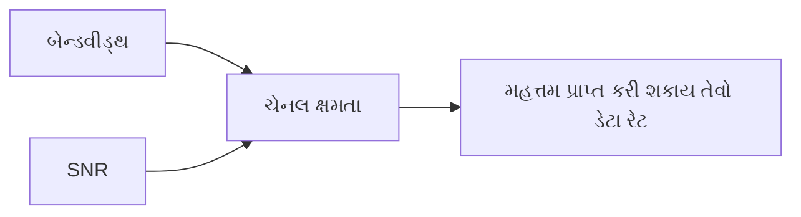

**મેમરી ટ્રીક:** "BSNR" - "બેન્ડવીડ્થ અને SNR નીડ રિલેશનશિપ"

## પ્રશ્ન 3(ક) OR [7 ગુણ]

**ડિજીટલ કોમ્યુનિકેશનમાં કોઈપણ એક એરર શોધવાની અને એરર સુધારવાની તકનીકને વિગતવાર સમજાવો.**

**જવાબ**:

**હેમિંગ કોડ એરર ડિટેક્શન અને કરેક્શન**

હેમિંગ કોડ એક લિનિયર એરર-કરેક્ટિંગ કોડ છે જે ડેટા ટ્રાન્સમિશનમાં સિંગલ-બિટ ભૂલોને શોધી અને સુધારી શકે છે.

**કાર્યસિદ્ધાંત:**

1. ડેટા બિટ્સ એવા સ્થાનો પર મૂકવામાં આવે છે જે 2ની પાવર છે (1, 2, 4, 8, વગેરે)
2. પેરિટી બિટ્સ 1, 2, 4, 8, વગેરે સ્થાનો પર ઉમેરવામાં આવે છે
3. દરેક પેરિટી બિટ તેના સ્થાન અનુસાર ચોક્કસ ડેટા બિટ્સની તપાસ કરે છે
4. મળતી વખતે, પેરિટી ચેક ભૂલનું સ્થાન ઓળખાવે છે

**ઉદાહરણ: 7-બિટ હેમિંગ કોડ (4 ડેટા બિટ્સ, 3 પેરિટી બિટ્સ)**

| સ્થાન | 1 | 2 | 3 | 4 | 5 | 6 | 7 |
|----------|---|---|---|---|---|---|---|
| બિટ પ્રકાર | P₁ | P₂ | D₁ | P₄ | D₂ | D₃ | D₄ |

**પેરિટી બિટ કેલ્ક્યુલેશન:**

- P₁ બિટ્સ 1, 3, 5, 7 (સ્થાન 1, 3, 5, 7) તપાસે છે
- P₂ બિટ્સ 2, 3, 6, 7 (સ્થાન 2, 3, 6, 7) તપાસે છે
- P₄ બિટ્સ 4, 5, 6, 7 (સ્થાન 4, 5, 6, 7) તપાસે છે

**એરર કરેક્શન:**
જો ભૂલ થાય છે, તો પેરિટી ચેક્સ ભૂલનું સ્થાન દર્શાવશે, જેને પછી ફ્લિપ કરીને ભૂલ સુધારી શકાય છે.

**ટેબલ: પેરિટી ચેક પરિણામોથી એરર સ્થાન**

| P₄ | P₂ | P₁ | એરર સ્થાન |
|----|----|----|----------------|
| 0 | 0 | 0 | કોઈ ભૂલ નથી |
| 0 | 0 | 1 | સ્થાન 1 |
| 0 | 1 | 0 | સ્થાન 2 |
| 0 | 1 | 1 | સ્થાન 3 |
| 1 | 0 | 0 | સ્થાન 4 |
| 1 | 0 | 1 | સ્થાન 5 |
| 1 | 1 | 0 | સ્થાન 6 |
| 1 | 1 | 1 | સ્થાન 7 |

**મેમરી ટ્રીક:** "PECD" - "પેરિટી એનેબલ્સ કરેક્શન ઓફ ડેટા"

## પ્રશ્ન 4(અ) [3 ગુણ]

**સેટેલાઇટ કોમ્યુનિકેશનનો બ્લોક ડાયાગ્રામ દોરો અને ટૂંકમાં સમજાવો.**

**જવાબ**:

**સેટેલાઇટ કોમ્યુનિકેશન બ્લોક ડાયાગ્રામ:**

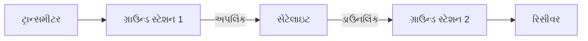

**ટૂંક સમજૂતી:**
સેટેલાઇટ કમ્યુનિકેશનમાં અર્થ સ્ટેશનથી સેટેલાઇટ સુધી સિગ્નલ્સ ટ્રાન્સમિટ કરવામાં આવે છે (અપલિંક), જે પછી સેટેલાઇટ દ્વારા એમ્પ્લિફાય થાય છે અને પૃથ્વી પર પાછા મોકલવામાં આવે છે (ડાઉનલિંક). સેટેલાઇટ અવકાશમાં રિપીટર તરીકે કામ કરે છે, જે લાંબા અંતરના સંચાર શક્ય બનાવે છે.

**મુખ્ય ઘટકો:**

- **અર્થ સ્ટેશન્સ**: સિગ્નલ્સ ટ્રાન્સમિટ અને રિસીવ કરે છે
- **ટ્રાન્સપોન્ડર્સ**: સિગ્નલ્સ મેળવે, એમ્પ્લિફાય કરે અને પુનઃપ્રસારિત કરે છે
- **એન્ટેના**: ઇલેક્ટ્રોમેગ્નેટિક તરંગો ટ્રાન્સમિટ અને રિસીવ કરે છે
- **મોડેમ્સ**: ડિજિટલ ડેટાને એનાલોગ સિગ્નલ્સમાં અને વાઇસ વર્સા રૂપાંતરિત કરે છે

**મેમરી ટ્રીક:** "STAR" - "સેટેલાઇટ ટ્રાન્સમિટ્સ એન્ડ રિસીવ્સ"

## પ્રશ્ન 4(બ) [4 ગુણ]

**10101101 ડેટા સિક્વન્સ માટે યુનિપોલર NRZ, પોલર RZ, પોલર NRZ અને AMI વેવફોર્મ દોરો.**

**જવાબ**:

```goat
Input Data:  1  0  1  0  1  1  0  1
            ▄▄    ▄▄    ▄▄▄▄    ▄▄  
            │ │   │ │   │  │    │ │ 
Data:       │ │   │ │   │  │    │ │ 
            │ └───┘ └───┘  └────┘ └─
            
            ▄▄    ▄▄    ▄▄▄▄    ▄▄  
            │ │   │ │   │  │    │ │ 
Unipolar    │ │   │ │   │  │    │ │ 
NRZ:        │ └───┘ └───┘  └────┘ └─
            
            ┌┐    ┌┐    ┌┐┌┐    ┌┐
Polar       ││    ││    │││││   ││
RZ:         ││    ││    │││││   ││
           ─┘└────┘└────┘┘┘┘└───┘└─
            ▄▄    ▄▄    ▄▄▄▄    ▄▄
            │ │   │ │   │  │    │ │
Polar       │ │   │ │   │  │    │ │
NRZ:       ─┘ └───┐ └───┘  └────┘ └
                 │                  
                 └──────────────────
                 
            ▄▄         ▄▄         ▄▄
            │ │        │ │        │ │
AMI:        │ │        │ │        │ │
           ─┘ └────────┘ └────────┘ └
                ▄▄         ▄▄        
                │ │        │ │       
                │ │        │ │       
           ─────┘ └────────┘ └───────
```

**મેમરી ટ્રીક:** "UPPA" - "યુનિપોલર પોલર પોલર AMI"

## પ્રશ્ન 4(ક) [7 ગુણ]

**ડીજીટલ કોમ્યુનિકેશન માટે યોગ્ય ઉદાહરણ સાથે ડેટા ટ્રાન્સમિશન તકનીકો વિગતોમાં સમજાવો.**

**જવાબ**:

**ડેટા ટ્રાન્સમિશન ટેકનિક્સ:**

| ટેકનિક | વર્ણન | ઉદાહરણ |
|-----------|-------------|---------|
| **સીરિયલ ટ્રાન્સમિશન** | ડેટા બિટ્સ એક સિંગલ ચેનલ પર એક પછી એક મોકલવામાં આવે છે | USB, UART કમ્યુનિકેશન |
| **પેરેલલ ટ્રાન્સમિશન** | અનેક બિટ્સ મલ્ટિપલ ચેનલ્સ પર એકસાથે મોકલવામાં આવે છે | પ્રિન્ટર પોર્ટ્સ, SCSI |
| **સિન્ક્રોનસ ટ્રાન્સમિશન** | ડેટા ટાઇમિંગ સિગ્નલ્સ સાથે સતત સ્ટ્રીમમાં મોકલવામાં આવે છે | ઇથરનેટ, HDLC |
| **એસિન્ક્રોનસ ટ્રાન્સમિશન** | ડેટા સ્ટાર્ટ/સ્ટોપ બિટ્સ સાથે ટાઇમિંગ રેફરન્સ તરીકે મોકલવામાં આવે છે | RS-232, UART |
| **સિમ્પલેક્સ** | એક-માર્ગી કમ્યુનિકેશન | ટીવી બ્રોડકાસ્ટિંગ |
| **હાફ-ડુપ્લેક્સ** | બે-માર્ગી કમ્યુનિકેશન, એક સમયે એક દિશામાં | વોકી-ટોકી |
| **ફુલ-ડુપ્લેક્સ** | બે-માર્ગી સાથોસાથ કમ્યુનિકેશન | ટેલિફોન કૉલ્સ |

**સીરિયલ ટ્રાન્સમિશન ઉદાહરણ:**

```goat
            Start   1  0  1  0  1  1  0  1  Stop
             bit                          bit
            ┌───┐  ┌┐   ┌┐   ┌┐┌┐   ┌┐  ┌───┐
            │   │  ││   ││   │││││  ││  │   │
UART:       │   │  ││   ││   │││││  ││  │   │
          ──┘   └──┘└───┘└───┘┘┘┘└──┘└──┘   └──
```

**પેરેલલ ટ્રાન્સમિશન ઉદાહરણ:**

```goat
Data: 10101101

      Bit 7: ──────┐    ┌────────
                   │    │          
      Bit 6: ──────┘    └────────
                   
      Bit 5: ───────────────────
                   
      Bit 4: ──────┐    ┌────────
                   │    │          
      Bit 3: ──────┘    └────────
                   
      Bit 2: ──────┐          ┌───
                   │          │   
      Bit 1: ──────┘          └───
                   
      Bit 0: ──────┐    ┌────┐    ┌
                   │    │    │    │
           ────────┘    └────┘    └
                   
Clock:      ┌─┐  ┌─┐  ┌─┐  ┌─┐  ┌─┐
            │ │  │ │  │ │  │ │  │ │
            │ │  │ │  │ │  │ │  │ │
          ──┘ └──┘ └──┘ └──┘ └──┘ └─
```

**મેમરી ટ્રીક:** "SPASH" - "સીરિયલ પેરેલલ એસિંક્રોનસ સિંક્રોનસ હાફ-ડુપ્લેક્સ"

## પ્રશ્ન 4(અ) OR [3 ગુણ]

**સ્પ્રેડ સ્પેક્ટ્રમ તકનીકોના પાસાઓનું અર્થઘટન કરો.**

**જવાબ**:

**સ્પ્રેડ સ્પેક્ટ્રમ ટેકનિક્સ:**

| પાસાઓ | અર્થઘટન |
|--------|---------------|
| **બેન્ડવીડ્થ સ્પ્રેડિંગ** | સિગ્નલ જરૂરી કરતાં વધુ પહોળા બેન્ડવિડ્થ પર ફેલાય છે |
| **સુરક્ષા** | સ્પ્રેડિંગને કારણે અવરોધ કે જામિંગમાં મુશ્કેલી |
| **નોઇઝ ઇમ્યુનિટી** | નેરોબેન્ડ ઇન્ટરફેરન્સ સામે પ્રતિરોધક |
| **મલ્ટિપલ એક્સેસ** | અનેક વપરાશકર્તાઓને સમાન ફ્રિક્વન્સી બેન્ડ શેર કરવાની મંજૂરી આપે છે |
| **લો પાવર ડેન્સિટી** | સિગ્નલ પાવર વિશાળ બેન્ડ પર ફેલાય છે, નોઇઝ જેવો દેખાય છે |

**ડાયાગ્રામ:**

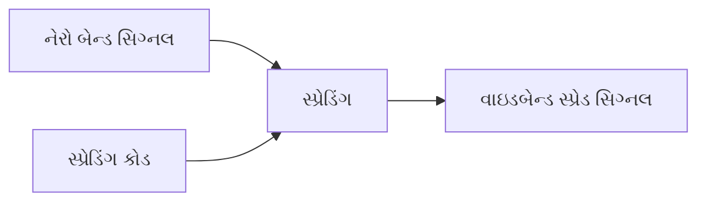

**મેમરી ટ્રીક:** "BSNML" - "બેન્ડવીડ્થ સિક્યોરિટી નોઇઝ મલ્ટિપલ લો-પાવર"

## પ્રશ્ન 4(બ) OR [4 ગુણ]

**સંભાવના પર ટૂંકી નોંધ લખો અને ડિજિટલ સંદેશાવ્યવહાર માટે તેના ગુણધર્મોની ચર્ચા કરો.**

**જવાબ**:

**ડિજિટલ કમ્યુનિકેશનમાં સંભાવના:**
સંભાવના સિદ્ધાંત ડિજિટલ કમ્યુનિકેશન સિસ્ટમ્સના પ્રદર્શન, ભૂલ દર અને વિશ્વસનીયતાના વિશ્લેષણ માટે ગાણિતિક પાયો આપે છે.

**સંભાવનાના ગુણધર્મો:**

| ગુણધર્મ | વર્ણન | ડિજિટલ કમ્યુનિકેશનમાં પ્રસ્તુતતા |
|----------|-------------|-----------------------------------|
| **રેન્જ** | 0 ≤ P(E) ≤ 1 | ભૂલ સંભાવના માટે સીમા નિર્ધારિત કરે છે |
| **નિશ્ચિતતા** | સેમ્પલ સ્પેસ S માટે P(S) = 1 | બધા સંભવિત પરિણામોની કુલ સંભાવના |
| **યોગાત્મકતા** | અલગ ઘટનાઓ માટે P(A∪B) = P(A) + P(B) | ઓવરઓલ સિસ્ટમ એરર રેટ્સની ગણતરી |
| **શરતી સંભાવના** | P(A\|B) = P(A∩B)/P(B) | ચેનલ મોડેલિંગ માટે ઉપયોગી |
| **સ્વતંત્રતા** | P(A∩B) = P(A)×P(B) | અસંબંધિત નોઇઝ સોર્સનું વિશ્લેષણ |

**ડિજિટલ કમ્યુનિકેશનમાં એપ્લિકેશન્સ:**

- બિટ એરર રેટ કેલ્ક્યુલેશન
- સિગ્નલ ડિટેક્શન થિયરી
- ચેનલ ક્ષમતા અંદાજ
- કોડિંગ એફિશિયન્સી એનાલિસિસ

**મેમરી ટ્રીક:** "RACIC" - "રેન્જ એડિટિવિટી સર્ટનટી ઇન્ડિપેન્ડન્સ કન્ડિશનલ"

## પ્રશ્ન 4(ક) OR [7 ગુણ]

**ડેટા ટ્રાન્સમિશન મોડને ઉદાહરણ સાથે વિગતોમાં સમજાવો.**

**જવાબ**:

**ડેટા ટ્રાન્સમિશન મોડ્સ:**

| મોડ | વર્ણન | ડાયાગ્રામ | ઉદાહરણ |
|------|-------------|---------|---------|
| **સિમ્પ્લેક્સ** | ફક્ત એક-માર્ગી કમ્યુનિકેશન. ટ્રાન્સમીટર ફક્ત મોકલી શકે છે, રિસીવર ફક્ત મેળવી શકે છે. | ```mermaidgraph LR; A[ટ્રાન્સમીટર] -->|એક-માર્ગી| B[રિસીવર]``` | ટીવી બ્રોડકાસ્ટિંગ, રેડિયો |
| **હાફ-ડુપ્લેક્સ** | બે-માર્ગી કમ્યુનિકેશન, પરંતુ એક સમયે ફક્ત એક દિશામાં. | ```mermaidgraph LR; A[ડિવાઇસ A] -->|સમય 1| B[ડિવાઇસ B]; B -->|સમય 2| A``` | વોકી-ટોકી, CB રેડિયો |
| **ફુલ-ડુપ્લેક્સ** | બે-માર્ગી સાથોસાથ કમ્યુનિકેશન. | ```mermaidgraph LR; A[ડિવાઇસ A] -->|ચેનલ 1| B[ડિવાઇસ B]; B -->|ચેનલ 2| A``` | ટેલિફોન, મોબાઇલ કૉલ્સ |

**હાફ-ડુપ્લેક્સ કમ્યુનિકેશનનું ઉદાહરણ:**

```goat
    ડિવાઇસ A                     ડિવાઇસ B
       |                            |
       |        REQUEST DATA        |
       |--------------------------->|
       |                            |
       |                            |
       |        SENDING DATA        |
       |<---------------------------|
       |                            |
       |    ACKNOWLEDGMENT (ACK)    |
       |--------------------------->|
       |                            |
```

**ફુલ-ડુપ્લેક્સ કમ્યુનિકેશનનું ઉદાહરણ:**

```goat
    ડિવાઇસ A                     ડિવાઇસ B
       |                            |
       |        SENDING DATA        |
       |--------------------------->|
       |                            |
       |        SENDING DATA        |
       |<---------------------------|
       |                            |
       |      CONTINUOUS DATA       |
       |<-------------------------->|
       |                            |
```

**મેમરી ટ્રીક:** "SHF" - "સિમ્પ્લેક્સ હાફ ફુલ" અથવા "સ્ટોપ, હોલ્ટ, ફ્લો"

## પ્રશ્ન 5(અ) [3 ગુણ]

**એજ કોમ્પ્યુટીંગને વિગતવાર સમજાવો.**

**જવાબ**:

**એજ કોમ્પ્યુટિંગ:**
એજ કોમ્પ્યુટિંગ એક ડિસ્ટ્રિબ્યુટેડ કમ્પ્યુટિંગ પેરાડાઇમ છે જે કમ્પ્યુટેશન અને ડેટા સ્ટોરેજને તે જગ્યાની નજીક લાવે છે જ્યાં તેની જરૂર છે, જેથી રિસ્પોન્સ ટાઇમ સુધરે અને બેન્ડવીડ્થ બચે.

**મુખ્ય પાસાઓ:**

| પાસાઓ | વર્ણન |
|--------|-------------|
| **વિકેન્દ્રીકરણ** | કેન્દ્રીય ક્લાઉડને બદલે નેટવર્ક એજ પર પ્રોસેસિંગ |
| **ઘટાડેલો વિલંબ** | ડેટા સોર્સની નજીકતાને કારણે ઝડપી પ્રતિસાદ |
| **બેન્ડવીડ્થ કાર્યક્ષમતા** | ક્લાઉડને ઓછો ડેટા મોકલવાથી નેટવર્ક કોન્જેશન ઘટે છે |
| **લોકલ ડેટા પ્રોસેસિંગ** | ડેટા કલેક્શન પોઇન્ટની નજીક પ્રોસેસ થાય છે |
| **સુધારેલી સુરક્ષા** | સંવેદનશીલ ડેટા સ્થાનિક રહે છે, એક્સપોઝર ઘટાડે છે |
| **વિશ્વસનીયતા** | ક્લાઉડ કનેક્ટિવિટી સમસ્યાઓ દરમિયાન પણ કાર્ય કરવાનું ચાલુ રાખે છે |

**ડાયાગ્રામ:**

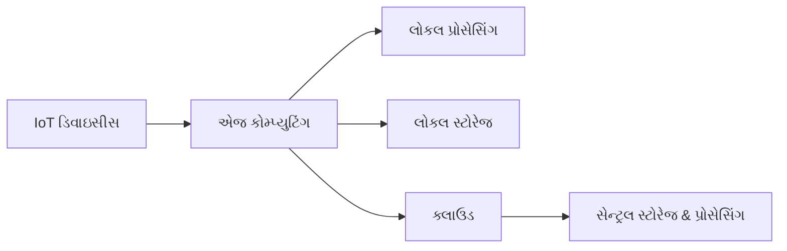

**મેમરી ટ્રીક:** "DRBLES" - "ડિસેન્ટ્રલાઇઝ્ડ રિડ્યુસીસ બેન્ડવિડ્થ, લેટન્સી, એક્સપોઝર, સ્ટ્રેન્થન્સ રિલાયબિલિટી"

## પ્રશ્ન 5(બ) [4 ગુણ]

**ડેટા કમ્યુનિકેશનમાં 5G ટેક્નોલોજીની વિશેષતાઓની યાદી બનાવો.**

**જવાબ**:

| 5G ટેક્નોલોજીની વિશેષતાઓ |
|--------------------------|
| **ઉચ્ચ ડેટા રેટ** (20 Gbps સુધીની પીક) |
| **અલ્ટ્રા-લો લેટન્સી** (1 ms અથવા ઓછી) |
| **મેસિવ ડિવાઇસ કનેક્ટિવિટી** (પ્રતિ km² 1 મિલિયન ડિવાઇસ) |
| **નેટવર્ક સ્લાઇસિંગ** (કસ્ટમાઇઝ્ડ વર્ચ્યુઅલ નેટવર્ક્સ) |
| **બીમફોર્મિંગ** (દિશાસૂચક સિગ્નલ ટ્રાન્સમિશન) |
| **મિલિમીટર વેવ સ્પેક્ટ્રમ** (24-100 GHz) |
| **એન્હાન્સ્ડ મોબાઇલ બ્રોડબેન્ડ** (eMBB) |
| **અલ્ટ્રા-રિલાયબલ લો-લેટન્સી કમ્યુનિકેશન** (URLLC) |

**ડાયાગ્રામ:**

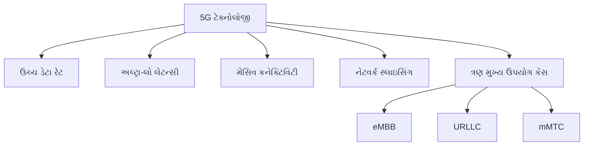

**મેમરી ટ્રીક:** "HUMBLE-MN" - "હાઇ-સ્પીડ અલ્ટ્રા-લો-લેટન્સી મેસિવ બીમફોર્મિંગ લો-લેટન્સી એન્હાન્સ્ડ મિલિમીટર નેટવર્ક"

## પ્રશ્ન 5(ક) [7 ગુણ]

**ડેટા કમ્યુનિકેશન પર તેની લાક્ષણિકતાઓ અને ઘટકો સાથે વિગતમાં લખો.**

**જવાબ**:

**ડેટા કમ્યુનિકેશન:**
ડેટા કમ્યુનિકેશન એ બે અથવા વધુ પોઇન્ટ્સ વચ્ચે ડિજિટલ માહિતી ટ્રાન્સફર કરવાની પ્રક્રિયા છે.

**ડેટા કમ્યુનિકેશનની લાક્ષણિકતાઓ:**

| લાક્ષણિકતા | વર્ણન |
|----------------|-------------|
| **ડિલીવરી** | સિસ્ટમે ડેટા યોગ્ય ગંતવ્ય સ્થાને પહોંચાડવો જોઈએ |
| **એક્યુરસી** | સિસ્ટમે ડેટા ચોક્કસપણે, ભૂલો વિના પહોંચાડવો જોઈએ |
| **ટાઇમલીનેસ** | સિસ્ટમે ડેટા સમયસર પહોંચાડવો જોઈએ |
| **જિટર** | સિસ્ટમે ડેટા આગમન વચ્ચે સાતત્યપૂર્ણ ટાઇમિંગ જાળવવું જોઈએ |
| **સિક્યોરિટી** | સિસ્ટમે અનધિકૃત ઍક્સેસથી ડેટાનું રક્ષણ કરવું જોઈએ |

**ડેટા કમ્યુનિકેશનના ઘટકો:**

| ઘટક | વર્ણન |
|-----------|-------------|
| **મેસેજ** | કમ્યુનિકેટ કરવાની માહિતી (ડેટા) |
| **સેન્ડર** | ડેટા મેસેજ મોકલતું ઉપકરણ |
| **રિસીવર** | મેસેજ મેળવતું ઉપકરણ |
| **ટ્રાન્સમિશન મીડિયમ** | જેના દ્વારા મેસેજ મુસાફરી કરે છે તે ભૌતિક પાથ |
| **પ્રોટોકોલ** | ડેટા કમ્યુનિકેશનનું નિયંત્રણ કરતા નિયમોનો સેટ |

**ડેટા કમ્યુનિકેશન મોડેલ:**

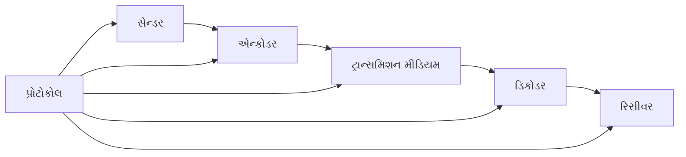

**ડેટા કમ્યુનિકેશનના પ્રકાર:**

| પ્રકાર | વર્ણન |
|------|-------------|
| **એનાલોગ** | સતત સિગ્નલ જે એમ્પ્લિટ્યુડ અથવા ફ્રિક્વન્સીમાં બદલાય છે |
| **ડિજિટલ** | બાઇનરી ડિજિટ્સ (0 અને 1) દ્વારા દર્શાવવામાં આવતા ડિસ્ક્રીટ સિગ્નલ |
| **પેરેલલ** | અલગ ચેનલ્સ પર એકસાથે મલ્ટિપલ બિટ્સ ટ્રાન્સમિટ થાય છે |
| **સીરિયલ** | બિટ્સ સિંગલ ચેનલ પર ક્રમિક રીતે ટ્રાન્સમિટ થાય છે |

**મેમરી ટ્રીક:** "DATJS-MSRTP" - "ડિલીવરી એક્યુરસી ટાઇમલીનેસ જિટર સિક્યોરિટી - મેસેજ સેન્ડર રિસીવર ટ્રાન્સમિશન પ્રોટોકોલ"

## પ્રશ્ન 5(અ) OR [3 ગુણ]

**ડેટા કમ્યુનિકેશનમાં ગોપનીયતાની વિચારણાને ઓળખો અને લખો.**

**જવાબ**:

**ડેટા કમ્યુનિકેશનમાં ગોપનીયતાની વિચારણાઓ:**

| ગોપનીયતાની વિચારણા | વર્ણન |
|----------------------|-------------|
| **ડેટા એન્ક્રિપ્શન** | એન્ક્રિપ્શન અલ્ગોરિધમનો ઉપયોગ કરીને ટ્રાન્સમિશન દરમિયાન ડેટાનું રક્ષણ કરવું |
| **ઍક્સેસ કંટ્રોલ** | માત્ર અધિકૃત વપરાશકર્તાઓ જ કમ્યુનિકેશન સિસ્ટમ્સને ઍક્સેસ કરી શકે તેની ખાતરી કરવી |
| **ઓથેન્ટિકેશન** | વપરાશકર્તાઓ અને ડિવાઇસેસની ઓળખની ચકાસણી કરવી |
| **ડેટા મિનિમાઇઝેશન** | ગોપનીયતા જોખમો ઘટાડવા માટે માત્ર જરૂરી ડેટા એકત્રિત કરવો |
| **સિક્યોર પ્રોટોકોલ્સ** | બિલ્ટ-ઇન સિક્યોરિટી ફીચર્સ સાથેના કમ્યુનિકેશન પ્રોટોકોલ્સનો ઉપયોગ કરવો |
| **એન્ડ-ટુ-એન્ડ સિક્યોરિટી** | સમગ્ર કમ્યુનિકેશન પાથ દરમિયાન ડેટાનું રક્ષણ થાય તેની ખાતરી કરવી |

**ડાયાગ્રામ:**

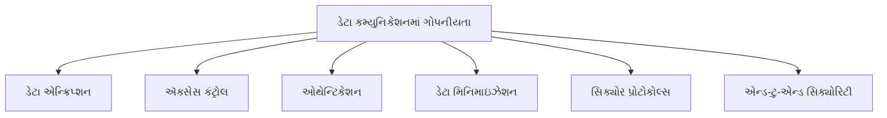

**મેમરી ટ્રીક:** "DAAESE" - "ડેટા ઈઝ ઓથેન્ટિકેટેડ, એક્સેસ્ડ, એન્ક્રિપ્ટેડ સિક્યોરલી એન્ડ-ટુ-એન્ડ"

## પ્રશ્ન 5(બ) OR [4 ગુણ]

**સંચાર સુરક્ષામાં બ્લોક ચેન શું છે? તેની લાક્ષણિકતાઓની યાદી બનાવો.**

**જવાબ**:

**કમ્યુનિકેશન સિક્યોરિટીમાં બ્લોકચેન:**
બ્લોકચેન એ ડિસ્ટ્રિબ્યુટેડ લેજર ટેક્નોલોજી છે જે ડેટા બ્લોક્સની ક્રિપ્ટોગ્રાફિક લિંકિંગ દ્વારા ડેટા કમ્યુનિકેશન માટે સુરક્ષિત, છેડછાડ-પ્રૂફ રેકોર્ડ-કીપિંગ પ્રદાન કરે છે.

**બ્લોકચેનની લાક્ષણિકતાઓ:**

| લાક્ષણિકતા | વર્ણન |
|---------|-------------|
| **વિકેન્દ્રીકરણ** | કોઈ કેન્દ્રીય સત્તા નથી; નેટવર્ક નોડ્સ પર વિતરિત |
| **અપરિવર્તનીયતા** | એકવાર રેકોર્ડ થયા પછી, સર્વસંમતિ વિના ડેટા બદલી શકાતો નથી |
| **પારદર્શિતા** | તમામ વ્યવહારો અધિકૃત સહભાગીઓને દૃશ્યમાન છે |
| **ક્રિપ્ટોગ્રાફિક સિક્યોરિટી** | ડેટા એડવાન્સ્ડ ક્રિપ્ટોગ્રાફિક તકનીકોનો ઉપયોગ કરીને સુરક્ષિત |
| **સર્વસંમતિ તંત્ર** | નેટવર્ક વ્યવહારોની માન્યતા પર સંમત થાય છે |
| **સ્માર્ટ કોન્ટ્રાક્ટ્સ** | સેલ્ફ-એક્ઝિક્યુટિંગ કોન્ટ્રાક્ટ્સ જેમાં શરતો સીધા કોડમાં લખેલી હોય છે |
| **ડિસ્ટ્રિબ્યુટેડ સ્ટોરેજ** | અનેક નોડ્સ પર ડેટા સ્ટોર થાય છે, સિંગલ પોઇન્ટ ઓફ ફેલ્યોર અટકાવે છે |

**ડાયાગ્રામ:**

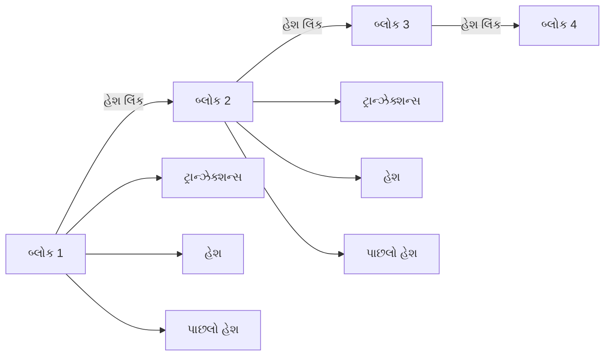

**મેમરી ટ્રીક:** "DITCSD" - "ડિસેન્ટ્રલાઇઝ્ડ ઇમ્યુટેબલ ટ્રાન્સપેરન્ટ ક્રિપ્ટોગ્રાફિક સિક્યોર ડિસ્ટ્રિબ્યુટેડ"

## પ્રશ્ન 5(ક) OR [7 ગુણ]

**વિવિધ સંચાર પોર્ટ લખો અને સમજાવો: USB, HDMI, RCA અને ઈથરનેટ.**

**જવાબ**:

**કમ્યુનિકેશન પોર્ટ્સ:**

1. **USB (યુનિવર્સલ સીરિયલ બસ):**

```goat
    ┌───────────┐
    │           │
    │   USB-A   │
    │   ┌───┐   │
    │   │   │   │
    │   └───┘   │
    └───────────┘

    ┌───────────┐
    │           │
    │   USB-C   │
    │ ┌───────┐ │
    │ │       │ │
    │ └───────┘ │
    └───────────┘
```

**લાક્ષણિકતાઓ:**

- ડેટા ટ્રાન્સફર, પાવર ડિલિવરી અને ડિવાઇસ કનેક્શન
- વર્ઝન: USB 1.0 થી USB 4.0
- સ્પીડ: 40 Gbps સુધી (USB4)
- હોટ-સ્વેપેબલ
- કેસ્કેડમાં 127 ડિવાઇસ સુધી સપોર્ટ કરે છે

2. **HDMI (હાઇ-ડેફિનિશન મલ્ટિમીડિયા ઇન્ટરફેસ):**

```goat
    ┌─────────────────┐
    │                 │
    │      HDMI       │
    │  ┌───────────┐  │
    │  │           │  │
    │  └───────────┘  │
    └─────────────────┘
```

**લાક્ષણિકતાઓ:**

- ડિજિટલ ઓડિયો/વિડિઓ ટ્રાન્સમિશન
- વર્ઝન: HDMI 1.0 થી HDMI 2.1
- રિઝોલ્યુશન સપોર્ટ: 10K સુધી
- બેન્ડવિડ્થ: 48 Gbps સુધી (HDMI 2.1)
- HDCP (હાઇ-બેન્ડવિડ્થ ડિજિટલ કન્ટેન્ટ પ્રોટેક્શન)
- CEC (કન્ઝ્યુમર ઇલેક્ટ્રોનિક્સ કંટ્રોલ) ડિવાઇસ કંટ્રોલ માટે

3. **RCA (રેડિયો કોર્પોરેશન ઓફ અમેરિકા):**

```goat
    ┌───┐  ┌───┐  ┌───┐
    │   │  │   │  │   │
    │ R │  │ G │  │ B │
    │   │  │   │  │   │
    └───┘  └───┘  └───┘
    Red    Green  Blue
    
    ┌───┐  ┌───┐
    │   │  │   │
    │ W │  │ R │
    │   │  │   │
    └───┘  └───┘
    White  Red
    Video  Audio
```

**લાક્ષણિકતાઓ:**

- એનાલોગ ઓડિયો/વિડિયો ટ્રાન્સમિશન
- કલર-કોડેડ કનેક્ટર્સ (રેડ, વ્હાઇટ, યલો)
- કમ્પોઝિટ વિડિઓ અને સ્ટીરિયો ઓડિયો માટે વપરાય છે
- સરળ કનેક્શન પરંતુ મર્યાદિત ગુણવત્તા
- ડિજિટલ કન્ટેન્ટ પ્રોટેક્શન નથી
- ડિજિટલ સ્ટાન્ડર્ડ્સ દ્વારા ધીમે ધીમે બદલાઈ રહ્યું છે

4. **ઈથરનેટ (RJ-45):**

```goat
    ┌───────────────┐
    │               │
    │    RJ-45      │
    │ ┌───────────┐ │
    │ │|||||||||  │ │
    │ └───────────┘ │
    └───────────────┘
```

**લાક્ષણિકતાઓ:**

- નેટવર્ક કનેક્ટિવિટી
- સ્ટાન્ડર્ડ્સ: 10BASE-T થી 10GBASE-T
- સ્પીડ: 10 Mbps થી 10 Gbps
- ટ્વિસ્ટેડ-પેર કેબલિંગ (Cat5e, Cat6, Cat6a) વાપરે છે
- પાવર ઓવર ઈથરનેટ (PoE) સપોર્ટ કરે છે
- TCP/IP નેટવર્ક્સ માટે બેઝ કમ્યુનિકેશન
- મહત્તમ કેબલ લંબાઈ: 100 મીટર

**તુલનાત્મક ટેબલ:**

| પોર્ટ | પ્રકાર | ડેટા પ્રકાર | મહત્તમ સ્પીડ | પાવર ડિલિવરી | મહત્તમ લંબાઈ |
|------|------|-----------|-----------|---------------|------------|
| USB | ડિજિટલ | ડેટા/પાવર | 40 Gbps | હા (100W) | 5m |
| HDMI | ડિજિટલ | ઓડિયો/વિડિયો | 48 Gbps | મર્યાદિત | 15m |
| RCA | એનાલોગ | ઓડિયો/વિડિયો | નીચી | ના | 10m |
| ઈથરનેટ | ડિજિટલ | નેટવર્ક ડેટા | 10 Gbps | હા (PoE) | 100m |

**મેમરી ટ્રીક:** "UHRE" - "USB હેન્ડલ્સ રેપિડ ઈથરનેટ, HDMI ડિલિવર્સ રિચ એન્ટરટેઇનમેન્ટ"
