## Question 1(a) [3 marks]

**Differentiate Basic modes of Communication: Broad casting communication and Point to Point Communication.**

**Answer**:

| Parameter | Broadcasting Communication | Point to Point Communication |
|-----------|----------------------------|------------------------------|
| **Definition** | One transmitter sends signals to multiple receivers simultaneously | One transmitter communicates with one specific receiver |
| **Direction** | Unidirectional (one-way) | Bidirectional (two-way) |
| **Examples** | TV, Radio, FM | Telephone, Mobile calls, Private networks |
| **Privacy** | Low (signal available to everyone in range) | High (dedicated connection between endpoints) |
| **Efficiency** | High for mass communication | Better for personal/private communication |

**Mnemonic:** "BDPEC" - Broadcasting Distributes to Public, Endpoints Connect in point-to-point

## Question 1(b) [4 marks]

**Define: Bit Rate, Baud Rate, Bandwidth and Repeater Distance.**

**Answer**:

| Term | Definition |
|------|------------|
| **Bit Rate** | Number of binary bits transmitted per second (bps). Measures actual data transfer speed. |
| **Baud Rate** | Number of signal units or symbols transmitted per second. One symbol may contain multiple bits. |
| **Bandwidth** | Range of frequencies used by a signal, measured in Hertz (Hz). Determines maximum data capacity of a channel. |
| **Repeater Distance** | Maximum distance between repeaters in a communication system before signal degradation requires regeneration. |

**Diagram:**

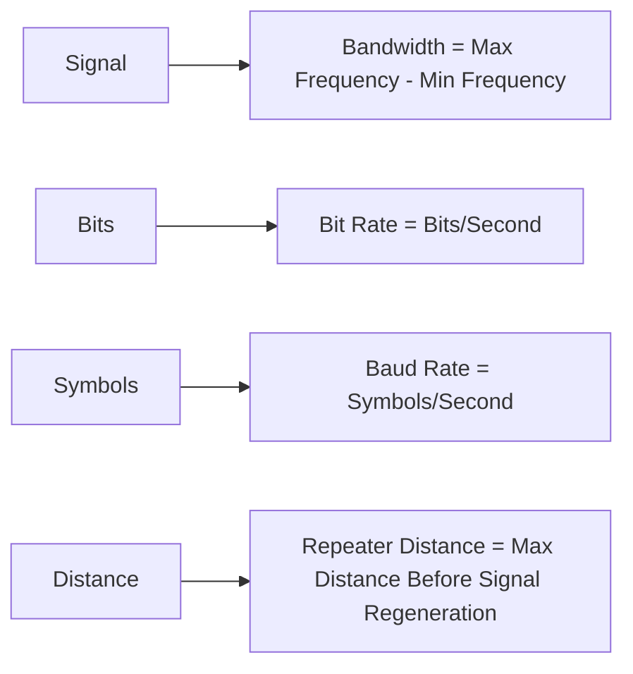

**Mnemonic:** "BBRR" - "Better Bandwidth Requires Repeaters"

## Question 1(c) [7 marks]

**Draw the block diagram of digital communication system. Explain the functions of each block in brief. State advantages and disadvantages of it.**

**Answer**:

**Block Diagram:**

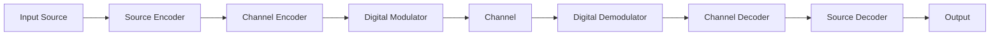

**Functions:**

| Block | Function |
|-------|----------|
| **Source Encoder** | Converts analog signal to digital, removes redundancy, compresses data |
| **Channel Encoder** | Adds redundancy for error detection and correction |
| **Digital Modulator** | Converts digital data to suitable form for transmission (ASK, FSK, PSK, etc.) |
| **Channel** | Medium through which signal travels (wired/wireless) |
| **Digital Demodulator** | Extracts original digital data from received modulated signal |
| **Channel Decoder** | Detects and corrects errors using added redundancy |
| **Source Decoder** | Decompresses data and converts to original form |

**Advantages and Disadvantages:**

| Advantages | Disadvantages |
|------------|---------------|
| Better noise immunity | Requires more bandwidth |
| Easier signal regeneration | Complex implementation |
| Secure transmission possible | Synchronization required |
| Integration with computers | Quantization errors |
| Better quality for long distance | Higher cost for simple applications |

**Mnemonic:** "SECDCSO" - "Secure Encoding Creates Digital Communication System Output"

## Question 1(c) OR [7 marks]

**Justify the needs of multiplexing techniques for digital communication. Draw and explain Time Division multiplexing technique in brief. Discuss its merits and demerits.**

**Answer**:

**Need for Multiplexing:**

| Need | Explanation |
|------|-------------|
| **Channel Efficiency** | Allows multiple signals on one channel, saving bandwidth |
| **Cost Reduction** | Reduces need for multiple transmission media |
| **Infrastructure Utilization** | Maximizes use of expensive infrastructure |
| **Spectrum Conservation** | Conserves limited frequency spectrum |

**Time Division Multiplexing (TDM):**

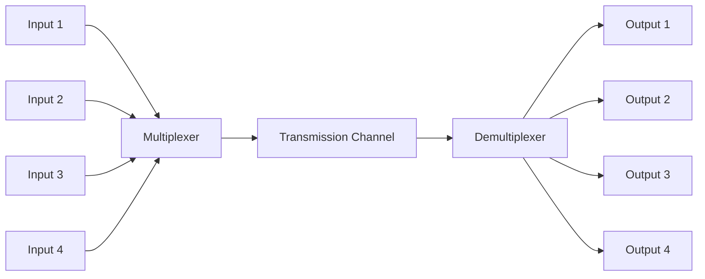

**Working:** In TDM, each input signal gets a specific time slot. The multiplexer samples each input sequentially, combining them into a single high-speed data stream. At the receiver, the demultiplexer separates the stream back into original signals based on timing.

**Merits and Demerits:**

| Merits | Demerits |
|--------|----------|
| **Efficient bandwidth usage** | **Requires synchronization** |
| **No guard bands needed** | **Complex buffering required** |
| **No cross-talk** | **Timing issues can cause errors** |
| **Flexible allocation** | **Unused slots waste capacity** |
| **Digital implementation** | **Higher data rate than individual channels** |

**Mnemonic:** "TIME" - "Transmission Interleaves Multiple Endpoints"

## Question 2(a) [3 marks]

**Differentiate: Coherent and Non-Coherent Detection Technique.**

**Answer**:

| Parameter | Coherent Detection | Non-Coherent Detection |
|-----------|-------------------|------------------------|
| **Phase Information** | Uses phase information | Ignores phase information |
| **Local Oscillator** | Required | Not required |
| **Complexity** | More complex | Simpler |
| **Performance** | Better noise immunity | Less efficient in noise |
| **Implementation** | Difficult | Easier |
| **Applications** | High-quality systems | Low-cost systems |

**Mnemonic:** "PLCPIA" - "Phase Local Complex Performance Implementation Applications"

## Question 2(b) [4 marks]

**Sketch the ASK, FSK, PSK and QPSK waveform for the data sequence 101100110110.**

**Answer**:

```goat
Input Data:  1  0  1  1  0  0  1  1  0  1  1  0
            ▄▄    ▄▄▄▄       ▄▄▄▄    ▄▄▄▄    
            │ │   │  │       │  │    │  │    
Data:       │ │   │  │       │  │    │  │    
            │ └───┘  └───────┘  └────┘  └────
            
            ▄▄    ▄▄▄▄       ▄▄▄▄    ▄▄▄▄    
            │ │   │  │       │  │    │  │    
ASK:        │ │   │  │       │  │    │  │    
            └─┴───┴──┴───────┴──┴────┴──┴────
            
            ▄▄▄▄  ████▄▄▄▄▄  ████▄▄  ████▄▄  
FSK High:   │  │  │  │    │  │  │ │  │  │ │  
FSK Low:   ─┘  └──┘  └────┘──┘  └─┘──┘  └─┘──
            
            ▄▄    ▄▄▄▄       ▄▄▄▄    ▄▄▄▄    
            │ │   │  │       │  │    │  │    
PSK 0°:     │ │   │  │       │  │    │  │    
            │ └───┘  └───────┘  └────┘  └────
PSK 180°:  ─┘     ▄▄     ▄▄▄▄▄▄     ▄▄     ▄▄
                  │ │    │    │     │ │    │ 
                  │ │    │    │     │ │    │ 
                  └─┘    └────┘     └─┘    └─

QPSK:     ┌─┐   ┌─┐ ┌─┐   ┌─┐ ┌─┐   ┌─┐ ┌─┐ 
90° 00:  _│ │___│ │_│ │___│ │_│ │___│ │_│ │__
180° 10: _┘ └───┘ └─┘ └───┘ └─┘ └───┘ └─┘ └__
270° 11: ───┐ ┌───┐   ┌───┐   ┌───┐   ┌──────
0° 01:   ───┘ └───┘   └───┘   └───┘   └──────
```

**Mnemonic:** "AFPQ" - "Amplitude Frequency Phase Quadrature"

## Question 2(c) [7 marks]

**Explain the principle of 16-QAM. Also explain constellation diagram and waveform for 16-QAM. Write its advantages and disadvantages.**

**Answer**:

**Principle of 16-QAM:**
16-QAM (Quadrature Amplitude Modulation) combines amplitude and phase modulation to transmit 4 bits per symbol. It uses 16 different combinations of amplitude and phase, allowing higher data rates in the same bandwidth.

**Constellation Diagram:**

```goat
           Q
           ▲
           │
   ●   ●   │   ●   ●
           │
   ●   ●   │   ●   ●
-----------+-----------> I
   ●   ●   │   ●   ●
           │
   ●   ●   │   ●   ●
           │
           
Each point represents 4 bits (0000 to 1111)
```

**Waveform:**
The 16-QAM waveform varies in both amplitude (4 levels) and phase (4 phases), creating 16 unique symbols.

**Advantages and Disadvantages:**

| Advantages | Disadvantages |
|------------|---------------|
| **High spectral efficiency** | **Sensitive to noise and interference** |
| **Higher data rate** | **Requires higher SNR** |
| **Bandwidth efficient** | **Complex implementation** |
| **Better use of channel capacity** | **Susceptible to amplitude distortion** |

**Mnemonic:** "SCHAP" - "Sixteen Combinations Have Amplitude and Phase"

## Question 2(a) OR [3 marks]

**Compare: ASK and PSK**

**Answer**:

| Parameter | ASK (Amplitude Shift Keying) | PSK (Phase Shift Keying) |
|-----------|------------------------------|--------------------------|
| **Modulation Parameter** | Amplitude | Phase |
| **Noise Immunity** | Poor | Good |
| **Power Efficiency** | Less efficient | More efficient |
| **Bandwidth Efficiency** | Lower | Higher |
| **Implementation** | Simple | More complex |
| **BER Performance** | Higher error rate | Lower error rate |

**Mnemonic:** "ANPBIP" - "Amplitude Noise Power Bandwidth Implementation Performance"

## Question 2(b) OR [4 marks]

**Draw the block diagram of BPSK modulator and demodulator.**

**Answer**:

**BPSK Modulator:**

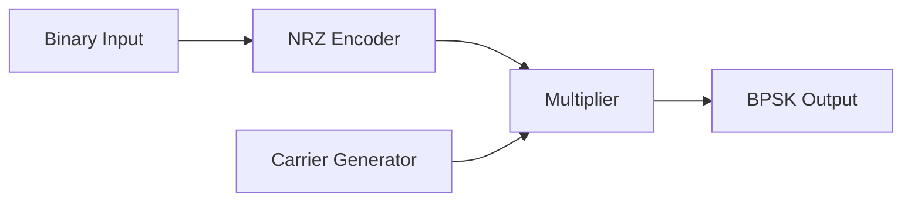

**BPSK Demodulator:**

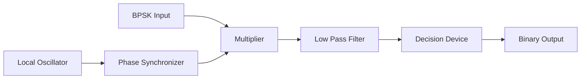

**Mnemonic:** "MNECO" - "Modulation Needs Encoding, Carriers, Oscillators"

## Question 2(c) OR [7 marks]

**Explain QPSK generation and detection with the help of block diagram and waveform. Discuss its advantages and disadvantages.**

**Answer**:

**QPSK Generation Block Diagram:**

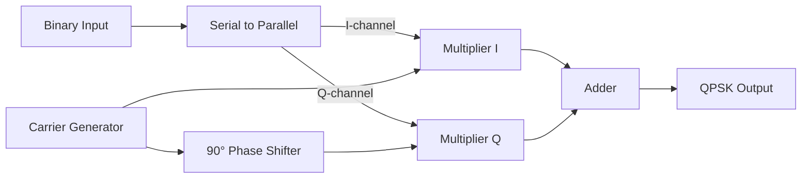

**QPSK Detection Block Diagram:**

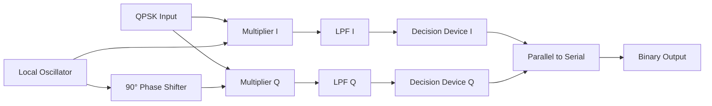

**QPSK Waveform:**
Each symbol in QPSK represents 2 bits, with 4 possible phase states (0°, 90°, 180°, 270°).

**Advantages and Disadvantages:**

| Advantages | Disadvantages |
|------------|---------------|
| **Twice the data rate of BPSK** | **More complex implementation** |
| **Same bandwidth as BPSK** | **Sensitive to phase errors** |
| **Good noise immunity** | **Requires carrier recovery** |
| **Spectral efficiency** | **More complex synchronization** |

**Mnemonic:** "PACE" - "Phase Alteration Carries Extra data"

## Question 3(a) [3 marks]

**State the features of RS-422.**

**Answer**:

| Features of RS-422 |
|-------------------|
| **Differential signaling** for noise immunity |
| **Maximum data rate** of 10 Mbps |
| **Maximum cable length** of 1200 meters |
| **Multi-drop capability** (1 driver, up to 10 receivers) |
| **Balanced transmission line** |
| **Higher noise immunity** than RS-232 |

**Mnemonic:** "DMMBHN" - "Differential Maximum Multi-drop Balanced Higher Noise-immunity"

## Question 3(b) [4 marks]

**Define: Entropy, Information, Mutual Information and Probability.**

**Answer**:

| Term | Definition |
|------|------------|
| **Entropy** | Measure of uncertainty or randomness in a message source, calculated as H(X) = -∑p(x)log₂p(x) |
| **Information** | Reduction in uncertainty when a message is received, measured in bits |
| **Mutual Information** | Measure of dependency between two random variables, indicating how much information one variable contains about the other |
| **Probability** | Mathematical measure of likelihood that an event will occur, ranging from 0 (impossible) to 1 (certain) |

**Diagram:**

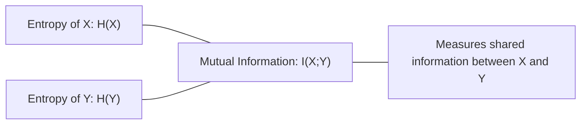

**Mnemonic:** "EIMP" - "Entropy Information Measures Probability"

## Question 3(c) [7 marks]

**Explain Huffman Code and Shannon-Fano code with suitable example.**

**Answer**:

**Huffman Code:**
Huffman coding assigns variable-length codes to symbols based on their frequencies, with shorter codes for more frequent symbols.

**Example:**

| Symbol | Frequency | Huffman Code |
|--------|-----------|--------------|
| A | 45% | 0 |
| B | 25% | 10 |
| C | 15% | 110 |
| D | 10% | 1110 |
| E | 5% | 1111 |

**Huffman Tree:**

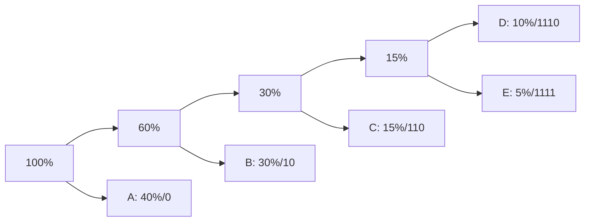

**Shannon-Fano Code:**
Shannon-Fano algorithm recursively divides symbols into two groups of similar frequency, then assigns 0 to one group and 1 to the other.

**Example:**

| Symbol | Frequency | Shannon-Fano Code |
|--------|-----------|-------------------|
| A | 45% | 0 |
| B | 25% | 10 |
| C | 15% | 110 |
| D | 10% | 1110 |
| E | 5% | 1111 |

**Shannon-Fano Tree:**

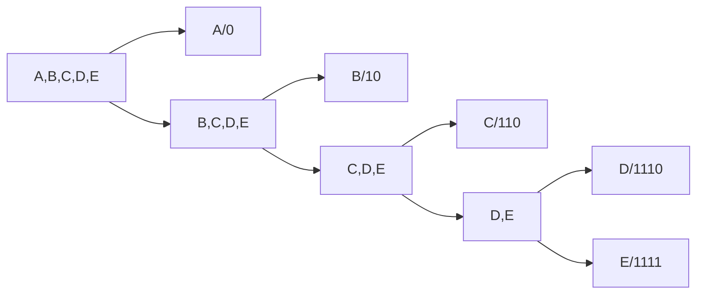

**Mnemonic:** "FREDS" - "Frequency Reduces Encoding Digit Size"

## Question 3(a) OR [3 marks]

**State the features of RS-232.**

**Answer**:

| Features of RS-232 |
|-------------------|
| **Single-ended signaling** |
| **Maximum data rate** of 20 kbps |
| **Maximum cable length** of 15 meters |
| **Point-to-point communication** (1 driver, 1 receiver) |
| **Voltage levels**: -15V to +15V |
| **25-pin or 9-pin** DB connector standard |

**Mnemonic:** "SMPVD" - "Single Maximum Point-to-point Voltage DB-connector"

## Question 3(b) OR [4 marks]

**What is channel capacity in terms of SNR? Explain its importance.**

**Answer**:

**Channel Capacity:**
The maximum rate at which information can be transmitted over a communication channel with an arbitrarily small probability of error.

**Formula:** C = B × log₂(1 + SNR)

Where:

- C = Channel capacity in bits per second
- B = Bandwidth in Hertz
- SNR = Signal-to-Noise Ratio

**Importance:**

| Importance of Channel Capacity |
|-------------------------------|
| **Sets theoretical limits** for data transmission |
| **Guides system design** and optimization |
| **Helps evaluate performance** of communication systems |
| **Determines required bandwidth** for a given data rate |
| **Informs coding techniques** to approach capacity |

**Diagram:**

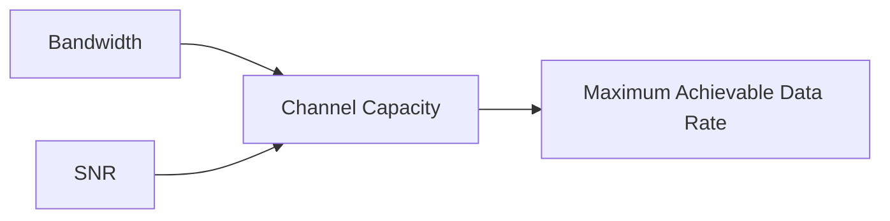

**Mnemonic:** "BSNR" - "Bandwidth and SNR Need Relationship"

## Question 3(c) OR [7 marks]

**Explain in detail any one error detection and error correction technique in digital communication.**

**Answer**:

**Hamming Code Error Detection and Correction**

Hamming code is a linear error-correcting code that can detect and correct single-bit errors in data transmission.

**Working Principle:**

1. Data bits are positioned at locations that are powers of 2 (1, 2, 4, 8, etc.)
2. Parity bits are added at positions 1, 2, 4, 8, etc.
3. Each parity bit checks specific data bits according to its position
4. On receiving, parity checks identify error position

**Example: 7-bit Hamming code (4 data bits, 3 parity bits)**

| Position | 1 | 2 | 3 | 4 | 5 | 6 | 7 |
|----------|---|---|---|---|---|---|---|
| Bit type | P₁ | P₂ | D₁ | P₄ | D₂ | D₃ | D₄ |

**Parity Bit Calculation:**

- P₁ checks bits 1, 3, 5, 7 (positions 1, 3, 5, 7)
- P₂ checks bits 2, 3, 6, 7 (positions 2, 3, 6, 7)
- P₄ checks bits 4, 5, 6, 7 (positions 4, 5, 6, 7)

**Error Correction:**
If an error occurs, the parity checks will indicate the error position, which can then be flipped to correct the error.

**Table: Error Position from Parity Check Results**

| P₄ | P₂ | P₁ | Error Position |
|----|----|----|----------------|
| 0 | 0 | 0 | No error |
| 0 | 0 | 1 | Position 1 |
| 0 | 1 | 0 | Position 2 |
| 0 | 1 | 1 | Position 3 |
| 1 | 0 | 0 | Position 4 |
| 1 | 0 | 1 | Position 5 |
| 1 | 1 | 0 | Position 6 |
| 1 | 1 | 1 | Position 7 |

**Mnemonic:** "PECD" - "Parity Enables Correction of Data"

## Question 4(a) [3 marks]

**Draw the block diagram of satellite communication and explain in brief.**

**Answer**:

**Satellite Communication Block Diagram:**


**Brief Explanation:**
Satellite communication involves transmitting signals from an Earth station to a satellite (uplink), which then amplifies and retransmits the signals back to Earth (downlink). The satellite acts as a repeater in space, enabling long-distance communication.

**Key Components:**

- **Earth Stations**: Transmit and receive signals
- **Transponders**: Receive, amplify, and retransmit signals
- **Antennas**: Transmit and receive electromagnetic waves
- **Modems**: Convert digital data to analog signals and vice versa

**Mnemonic:** "STAR" - "Satellite Transmits And Receives"

## Question 4(b) [4 marks]

**Sketch the Unipolar NRZ, Polar RZ, Polar NRZ and AMI waveform for 10101101 data sequence.**

**Answer**:

```goat
Input Data:  1  0  1  0  1  1  0  1
            ▄▄    ▄▄    ▄▄▄▄    ▄▄  
            │ │   │ │   │  │    │ │ 
Data:       │ │   │ │   │  │    │ │ 
            │ └───┘ └───┘  └────┘ └─
            
            ▄▄    ▄▄    ▄▄▄▄    ▄▄  
            │ │   │ │   │  │    │ │ 
Unipolar    │ │   │ │   │  │    │ │ 
NRZ:        │ └───┘ └───┘  └────┘ └─
            
            ┌┐    ┌┐    ┌┐┌┐    ┌┐
Polar       ││    ││    │││││   ││
RZ:         ││    ││    │││││   ││
           ─┘└────┘└────┘┘┘┘└───┘└─
            ▄▄    ▄▄    ▄▄▄▄    ▄▄
            │ │   │ │   │  │    │ │
Polar       │ │   │ │   │  │    │ │
NRZ:       ─┘ └───┐ └───┘  └────┘ └
                 │                  
                 └──────────────────
                 
            ▄▄         ▄▄         ▄▄
            │ │        │ │        │ │
AMI:        │ │        │ │        │ │
           ─┘ └────────┘ └────────┘ └
                ▄▄         ▄▄        
                │ │        │ │       
                │ │        │ │       
           ─────┘ └────────┘ └───────
```

**Mnemonic:** "UPPA" - "Unipolar Polar Polar AMI"

## Question 4(c) [7 marks]

**Explain data transmission techniques in details with suitable example for digital communication.**

**Answer**:

**Data Transmission Techniques:**

| Technique | Description | Example |
|-----------|-------------|---------|
| **Serial Transmission** | Data bits sent one after another over a single channel | USB, UART communication |
| **Parallel Transmission** | Multiple bits sent simultaneously over multiple channels | Printer ports, SCSI |
| **Synchronous Transmission** | Data sent in continuous stream with timing signals | Ethernet, HDLC |
| **Asynchronous Transmission** | Data sent with start/stop bits as timing references | RS-232, UART |
| **Simplex** | One-way communication | TV broadcasting |
| **Half-Duplex** | Two-way communication, one direction at a time | Walkie-talkie |
| **Full-Duplex** | Two-way simultaneous communication | Telephone calls |

**Serial Transmission Example:**

```goat
            Start   1  0  1  0  1  1  0  1  Stop
             bit                          bit
            ┌───┐  ┌┐   ┌┐   ┌┐┌┐   ┌┐  ┌───┐
            │   │  ││   ││   │││││  ││  │   │
UART:       │   │  ││   ││   │││││  ││  │   │
          ──┘   └──┘└───┘└───┘┘┘┘└──┘└──┘   └──
```

**Parallel Transmission Example:**

```goat
Data: 10101101

      Bit 7: ──────┐    ┌────────
                   │    │          
      Bit 6: ──────┘    └────────
                   
      Bit 5: ───────────────────
                   
      Bit 4: ──────┐    ┌────────
                   │    │          
      Bit 3: ──────┘    └────────
                   
      Bit 2: ──────┐          ┌───
                   │          │   
      Bit 1: ──────┘          └───
                   
      Bit 0: ──────┐    ┌────┐    ┌
                   │    │    │    │
           ────────┘    └────┘    └
                   
Clock:      ┌─┐  ┌─┐  ┌─┐  ┌─┐  ┌─┐
            │ │  │ │  │ │  │ │  │ │
            │ │  │ │  │ │  │ │  │ │
          ──┘ └──┘ └──┘ └──┘ └──┘ └─
```

**Mnemonic:** "SPASH" - "Serial Parallel Asynchronous Synchronous Half-duplex"

## Question 4(a) OR [3 marks]

**Interpret the aspects of spread spectrum techniques.**

**Answer**:

**Spread Spectrum Techniques:**

| Aspect | Interpretation |
|--------|---------------|
| **Bandwidth Spreading** | Signal spread over a wider bandwidth than required |
| **Security** | Difficult to intercept or jam due to spreading |
| **Noise Immunity** | Resistant to narrowband interference |
| **Multiple Access** | Allows multiple users to share same frequency band |
| **Low Power Density** | Signal power spread across wide band, appearing as noise |

**Diagram:**

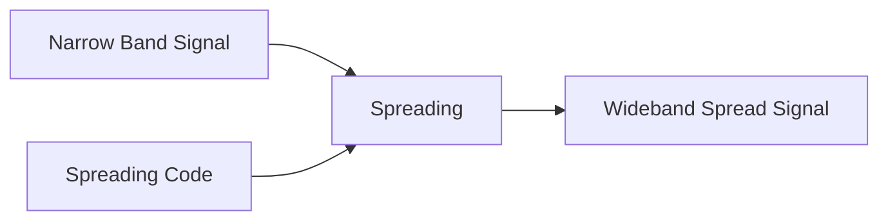

**Mnemonic:** "BSNML" - "Bandwidth Security Noise Multiple Low-power"

## Question 4(b) OR [4 marks]

**Write a short note on probability and discuss its properties for digital communication.**

**Answer**:

**Probability in Digital Communication:**
Probability theory provides the mathematical foundation for analyzing performance, error rates, and reliability of digital communication systems.

**Properties of Probability:**

| Property | Description | Relevance in Digital Communication |
|----------|-------------|-----------------------------------|
| **Range** | 0 ≤ P(E) ≤ 1 | Sets bounds for error probability |
| **Certainty** | P(S) = 1 for sample space S | Total probability of all possible outcomes |
| **Additivity** | P(A∪B) = P(A) + P(B) for disjoint events | Calculating overall system error rates |
| **Conditional Probability** | P(A\|B) = P(A∩B)/P(B) | Useful for channel modeling |
| **Independence** | P(A∩B) = P(A)×P(B) | Analyzing uncorrelated noise sources |

**Applications in Digital Communication:**

- Bit Error Rate calculation
- Signal detection theory
- Channel capacity estimation
- Coding efficiency analysis

**Mnemonic:** "RACIC" - "Range Additivity Certainty Independence Conditional"

## Question 4(c) OR [7 marks]

**Explain Data transmission mode in details with example.**

**Answer**:

**Data Transmission Modes:**

| Mode | Description | Diagram | Example |
|------|-------------|---------|---------|
| **Simplex** | One-way communication only. Transmitter can only send, receiver can only receive. | ```mermaid graph LR; A[Transmitter] -->|One-way| B[Receiver]``` | TV broadcasting, Radio |
| **Half-Duplex** | Two-way communication, but only one direction at a time. | ```mermaid graph LR; A[Device A] -->|Time 1| B[Device B]; B -->|Time 2| A``` | Walkie-talkie, CB radio |
| **Full-Duplex** | Two-way simultaneous communication. | ```mermaid graph LR; A[Device A] -->|Channel 1| B[Device B]; B -->|Channel 2| A``` | Telephone, Mobile calls |

**Example of Half-Duplex Communication:**

```goat
    Device A                     Device B
       |                            |
       |        REQUEST DATA        |
       |--------------------------->|
       |                            |
       |                            |
       |        SENDING DATA        |
       |<---------------------------|
       |                            |
       |    ACKNOWLEDGMENT (ACK)    |
       |--------------------------->|
       |                            |
```

**Example of Full-Duplex Communication:**

```goat
    Device A                     Device B
       |                            |
       |        SENDING DATA        |
       |--------------------------->|
       |                            |
       |        SENDING DATA        |
       |<---------------------------|
       |                            |
       |      CONTINUOUS DATA       |
       |<-------------------------->|
       |                            |
```

**Mnemonic:** "SHF" - "Simplex Half Full" or "Stop, Halt, Flow"

## Question 5(a) [3 marks]

**Explain Edge Computing in detail.**

**Answer**:

**Edge Computing:**
Edge computing is a distributed computing paradigm that brings computation and data storage closer to the location where it is needed to improve response times and save bandwidth.

**Key Aspects:**

| Aspect | Description |
|--------|-------------|
| **Decentralization** | Processing at network edge instead of central cloud |
| **Reduced Latency** | Faster response due to proximity to data source |
| **Bandwidth Efficiency** | Less data sent to cloud, reducing network congestion |
| **Local Data Processing** | Data processed near collection point |
| **Improved Security** | Sensitive data remains local, reducing exposure |
| **Reliability** | Continues to function during cloud connectivity issues |

**Diagram:**

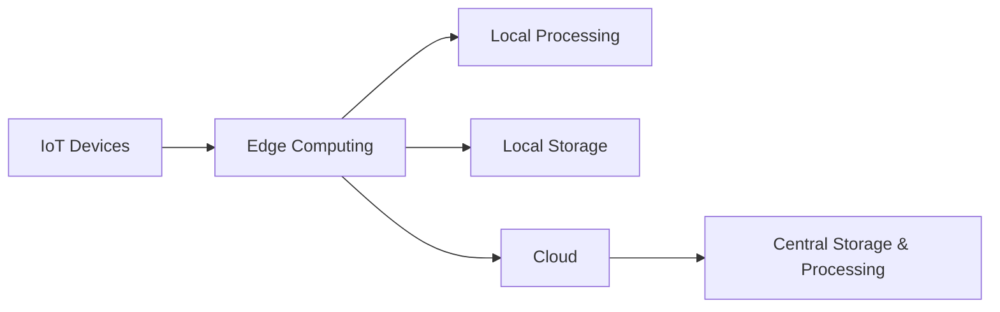

**Mnemonic:** "DRBLES" - "Decentralized Reduces Bandwidth, Latency, Exposure, Strengthens reliability"

## Question 5(b) [4 marks]

**Enlist the features of 5G Technology in data communication.**

**Answer**:

| Features of 5G Technology |
|--------------------------|
| **High Data Rates** (up to 20 Gbps peak) |
| **Ultra-Low Latency** (1 ms or less) |
| **Massive Device Connectivity** (1 million devices per km²) |
| **Network Slicing** (customized virtual networks) |
| **Beamforming** (directed signal transmission) |
| **Millimeter Wave Spectrum** (24-100 GHz) |
| **Enhanced Mobile Broadband** (eMBB) |
| **Ultra-Reliable Low-Latency Communication** (URLLC) |

**Diagram:**

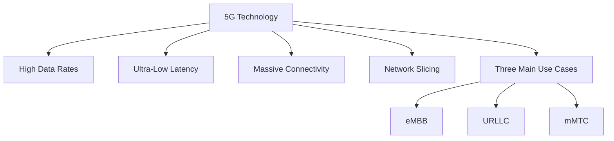

**Mnemonic:** "HUMBLE-MN" - "High-speed Ultra-low-latency Massive Beamforming Low-latency Enhanced Millimeter Network"

## Question 5(c) [7 marks]

**Write a details note on Data communication including its characteristics and components.**

**Answer**:

**Data Communication:**
Data communication is the process of transferring digital information between two or more points.

**Characteristics of Data Communication:**

| Characteristic | Description |
|----------------|-------------|
| **Delivery** | System must deliver data to correct destination |
| **Accuracy** | System must deliver data accurately, without errors |
| **Timeliness** | System must deliver data in a timely manner |
| **Jitter** | System must maintain consistent timing between data arrivals |
| **Security** | System must protect data from unauthorized access |

**Components of Data Communication:**

| Component | Description |
|-----------|-------------|
| **Message** | The information (data) to be communicated |
| **Sender** | Device that sends the data message |
| **Receiver** | Device that receives the message |
| **Transmission Medium** | Physical path by which message travels |
| **Protocol** | Set of rules governing data communication |

**Data Communication Model:**

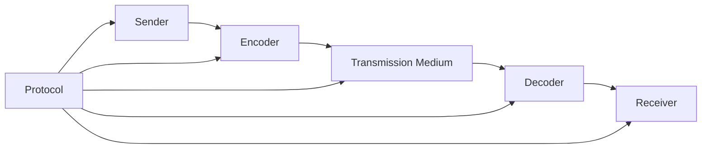

**Data Communication Types:**

| Type | Description |
|------|-------------|
| **Analog** | Continuous signal that varies in amplitude or frequency |
| **Digital** | Discrete signal represented by binary digits (0s and 1s) |
| **Parallel** | Multiple bits transmitted simultaneously on separate channels |
| **Serial** | Bits transmitted sequentially on a single channel |

**Mnemonic:** "DATJS-MSRTP" - "Delivery Accuracy Timeliness Jitter Security - Message Sender Receiver Transmission Protocol"

## Question 5(a) OR [3 marks]

**Identify and write privacy consideration in Data communication.**

**Answer**:

**Privacy Considerations in Data Communication:**

| Privacy Consideration | Description |
|----------------------|-------------|
| **Data Encryption** | Protecting data during transmission using encryption algorithms |
| **Access Control** | Ensuring only authorized users can access communication systems |
| **Authentication** | Verifying the identity of users and devices |
| **Data Minimization** | Collecting only necessary data to minimize privacy risks |
| **Secure Protocols** | Using communication protocols with built-in security features |
| **End-to-End Security** | Ensuring data is protected throughout the entire communication path |

**Diagram:**

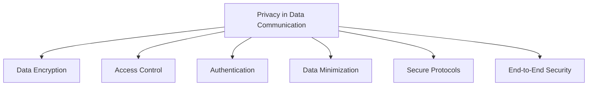

**Mnemonic:** "DAAESE" - "Data is Authenticated, Accessed, Encrypted Securely End-to-end"

## Question 5(b) OR [4 marks]

**What is block chain in communication security? Enlist its features.**

**Answer**:

**Blockchain in Communication Security:**
Blockchain is a distributed ledger technology that provides secure, tamper-proof record-keeping for data communication through cryptographic linking of data blocks.

**Features of Blockchain:**

| Feature | Description |
|---------|-------------|
| **Decentralization** | No central authority; distributed across network nodes |
| **Immutability** | Once recorded, data cannot be altered without consensus |
| **Transparency** | All transactions visible to authorized participants |
| **Cryptographic Security** | Data secured using advanced cryptographic techniques |
| **Consensus Mechanism** | Network agrees on validity of transactions |
| **Smart Contracts** | Self-executing contracts with terms directly written in code |
| **Distributed Storage** | Data stored across multiple nodes, preventing single point of failure |

**Diagram:**

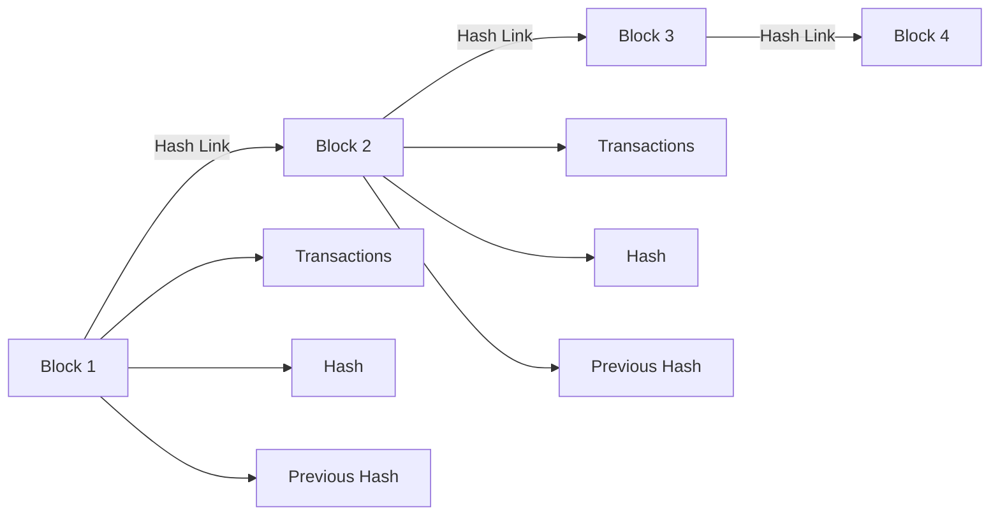

**Mnemonic:** "DITCSD" - "Decentralized Immutable Transparent Cryptographic Secure Distributed"

## Question 5(c) OR [7 marks]

**Write and illustrate different communication ports: USB, HDMI, RCA and Ethernet.**

**Answer**:

**Communication Ports:**

1. **USB (Universal Serial Bus):**

```goat
    ┌───────────┐
    │           │
    │   USB-A   │
    │   ┌───┐   │
    │   │   │   │
    │   └───┘   │
    └───────────┘

    ┌───────────┐
    │           │
    │   USB-C   │
    │ ┌───────┐ │
    │ │       │ │
    │ └───────┘ │
    └───────────┘
```

**Features:**

- Data transfer, power delivery, and device connection
- Versions: USB 1.0 to USB 4.0
- Speed: Up to 40 Gbps (USB4)
- Hot-swappable
- Supports up to 127 devices in cascade

2. **HDMI (High-Definition Multimedia Interface):**

```goat
    ┌─────────────────┐
    │                 │
    │      HDMI       │
    │  ┌───────────┐  │
    │  │           │  │
    │  └───────────┘  │
    └─────────────────┘
```

**Features:**

- Digital audio/video transmission
- Versions: HDMI 1.0 to HDMI 2.1
- Resolution support: Up to 10K
- Bandwidth: Up to 48 Gbps (HDMI 2.1)
- HDCP (High-bandwidth Digital Content Protection)
- CEC (Consumer Electronics Control) for device control

3. **RCA (Radio Corporation of America):**

```goat
    ┌───┐  ┌───┐  ┌───┐
    │   │  │   │  │   │
    │ R │  │ G │  │ B │
    │   │  │   │  │   │
    └───┘  └───┘  └───┘
    Red    Green  Blue
    
    ┌───┐  ┌───┐
    │   │  │   │
    │ W │  │ R │
    │   │  │   │
    └───┘  └───┘
    White  Red
    Video  Audio
```

**Features:**

- Analog audio/video transmission
- Color-coded connectors (Red, White, Yellow)
- Used for composite video and stereo audio
- Simple connection but limited quality
- No digital content protection
- Being phased out by digital standards

4. **Ethernet (RJ-45):**

```goat
    ┌───────────────┐
    │               │
    │    RJ-45      │
    │ ┌───────────┐ │
    │ │|||||||||  │ │
    │ └───────────┘ │
    └───────────────┘
```

**Features:**

- Network connectivity
- Standards: 10BASE-T to 10GBASE-T
- Speed: 10 Mbps to 10 Gbps
- Uses twisted-pair cabling (Cat5e, Cat6, Cat6a)
- Supports Power over Ethernet (PoE)
- Base communication for TCP/IP networks
- Maximum cable length: 100 meters

**Comparison Table:**

| Port | Type | Data Type | Max Speed | Power Delivery | Max Length |
|------|------|-----------|-----------|---------------|------------|
| USB | Digital | Data/Power | 40 Gbps | Yes (100W) | 5m |
| HDMI | Digital | Audio/Video | 48 Gbps | Limited | 15m |
| RCA | Analog | Audio/Video | Low | No | 10m |
| Ethernet | Digital | Network Data | 10 Gbps | Yes (PoE) | 100m |

**Mnemonic:** "UHRE" - "USB Handles Rapid Ethernet, HDMI Delivers Rich Entertainment"
