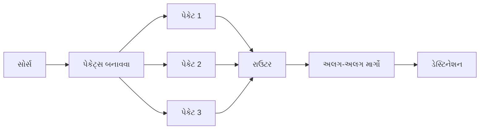

## પ્રશ્ન 1(અ) [3 ગુણ]

**પેકેટ સ્વીચીંગ નેટવર્ક સમજાવો.**

**જવાબ**:
પેકેટ સ્વીચીંગ એ નેટવર્ક કમ્યુનિકેશન પદ્ધતિ છે જેમાં ડેટા ટ્રાન્સમિશન પહેલા નાના પેકેટ્સમાં વિભાજિત કરવામાં આવે છે.

**આકૃતિ:**



- **સ્વતંત્ર રાઉટિંગ**: દરેક પેકેટ નેટવર્કમાં સ્વતંત્ર રીતે પ્રવાસ કરે છે
- **લવચીક માર્ગો**: પેકેટ્સ ડેસ્ટિનેશન સુધી પહોંચવા માટે અલગ-અલગ રૂટ્સ લઈ શકે છે
- **કાર્યક્ષમતા**: નેટવર્ક બેન્ડવિડ્થનો વધુ સારો ઉપયોગ

**મેમરી ટ્રીક:** "DIVE" - ડેટા ઇન્ટુ વેરિયસ એલિમેન્ટ્સ

## પ્રશ્ન 1(બ) [4 ગુણ]

**OSI રેફરન્સ મોડેલનાં કોઈ પણ 4 સ્તરોનું કાર્ય સમજાવો.**

**જવાબ**:
OSI મોડેલ નેટવર્ક કમ્યુનિકેશનને સાત અલગ-અલગ સ્તરોમાં વિભાજિત કરે છે, દરેક સ્તરની ચોક્કસ કાર્યો છે.

| સ્તર | કાર્ય | મુખ્ય પ્રોટોકોલ્સ |
|------|------|-----------------|
| એપ્લિકેશન | યુઝર એપ્લિકેશનને સીધી નેટવર્ક સેવાઓ પ્રદાન કરે છે | HTTP, FTP, SMTP |
| પ્રેઝન્ટેશન | ડેટાનું અનુવાદ, એન્ક્રિપ્શન અને કમ્પ્રેશન કરે છે | SSL, TLS, JPEG |
| સેશન | કનેક્શન સ્થાપિત, સંચાલિત અને સમાપ્ત કરે છે | NetBIOS, RPC |
| ટ્રાન્સપોર્ટ | એન્ડ-ટુ-એન્ડ ડેટા ટ્રાન્સફર સુનિશ્ચિત કરે છે | TCP, UDP |

- **એપ્લિકેશન લેયર**: નેટવર્ક અને એપ્લિકેશન વચ્ચે ઇન્ટરફેસ
- **પ્રેઝન્ટેશન લેયર**: ડેટા ફોર્મેટિંગ અને એન્ક્રિપ્શન
- **સેશન લેયર**: ડાયલોગ કંટ્રોલ અને સિંક્રોનાઇઝેશન
- **ટ્રાન્સપોર્ટ લેયર**: એન્ડ-ટુ-એન્ડ કનેક્શન અને વિશ્વસનીયતા

**મેમરી ટ્રીક:** "All People Seem To Need Data Processing" (બધા લોકોને ડેટા પ્રોસેસિંગની જરૂર લાગે છે)

## પ્રશ્ન 1(ક) [7 ગુણ]

**નેટવર્ક ટોપોલોજી આકૃતિ સાથે સમજાવો.**

**જવાબ**:
નેટવર્ક ટોપોલોજી નેટવર્કમાં ડિવાઇસની ભૌતિક અથવા તાર્કિક ગોઠવણને દર્શાવે છે.

| ટોપોલોજી | ફાયદાઓ | ગેરફાયદાઓ |
|----------|----------|--------------|
| બસ | સરળ, સસ્તી | એક પોઇન્ટ ફેલ્યોર |
| સ્ટાર | સહેલાઈથી ટ્રબલશૂટિંગ, કેન્દ્રીય | હબ/સ્વિચ ફેલ્યોરથી બધા પ્રભાવિત |
| રિંગ | બધા નોડ્સને સમાન એક્સેસ | એક કેબલ ફેલ્યોર નેટવર્કને અસર કરે |
| મેશ | ઉચ્ચ વિશ્વસનીયતા, ટ્રાફિક સમસ્યાઓ નહીં | ખર્ચાળ, જટિલ |
| ટ્રી | સરળતાથી વિસ્તરણીય, સંરચિત | રૂટ પર આધારિત, જટિલ |

**આકૃતિ:**

```goat
              BUS TOPOLOGY              
+-----+    +-----+    +-----+    +-----+
|Node1|====|Node2|====|Node3|====|Node4|
+-----+    +-----+    +-----+    +-----+
                                        
              STAR TOPOLOGY             
                 +------+                
                 |Hub/  |                
                 |Switch|                
                 +------+                
                     |                  
           +---------+---------+         
           |         |         |         
        +-----+   +-----+   +-----+      
        |Node1|   |Node2|   |Node3|      
        +-----+   +-----+   +-----+     
```

- **બસ ટોપોલોજી**: બધા ડિવાઇસ સિંગલ કેબલ સાથે જોડાયેલા
- **સ્ટાર ટોપોલોજી**: બધા ડિવાઇસ સેન્ટ્રલ હબ/સ્વિચ સાથે જોડાયેલા
- **રિંગ ટોપોલોજી**: ડિવાઇસ બંધ લૂપમાં જોડાયેલા
- **મેશ ટોપોલોજી**: દરેક ડિવાઇસ દરેક અન્ય ડિવાઇસ સાથે જોડાયેલું
- **ટ્રી ટોપોલોજી**: હાયરાર્કિકલ સ્ટાર નેટવર્ક્સ બસ વાયા કનેક્ટેડ

**મેમરી ટ્રીક:** "BSRMT" - "બેટર સોલ્યુશન્સ રિક્વાયર મલ્ટિપલ ટોપોલોજીસ"

## પ્રશ્ન 1(ક) અથવા [7 ગુણ]

**TCP/IP પ્રોટોકોલ સ્યુટનો ડાયાગ્રામ દોરો અને એપ્લીકેશન લેયર, ટ્રાન્સપોર્ટ લેયર અને નેટવર્ક લેયરનું કાર્યપધ્ધતી સમજાવો.**

**જવાબ**:
TCP/IP પ્રોટોકોલ સ્યુટ નેટવર્ક કોમ્યુનિકેશનને ચાર કાર્યાત્મક સ્તરોમાં વ્યવસ્થિત કરે છે.

**આકૃતિ:**

```goat
+-------------------------------+
|       APPLICATION LAYER       |
| (HTTP, FTP, SMTP, DNS, TELNET)|
+-------------------------------+
|        TRANSPORT LAYER        |
|           (TCP, UDP)          |
+-------------------------------+
|        INTERNET LAYER         |
|      (IP, ICMP, ARP, RARP)    |
+-------------------------------+
|     NETWORK ACCESS LAYER      |
| (Ethernet, Wi-Fi, Token Ring) |
+-------------------------------+
```

| સ્તર | મુખ્ય કાર્ય | મુખ્ય પ્રોટોકોલ્સ |
|-------|-----------|-----------------|
| એપ્લિકેશન | એપ્લિકેશન્સને નેટવર્ક સેવાઓ પ્રદાન કરે | HTTP, FTP, SMTP |
| ટ્રાન્સપોર્ટ | એન્ડ-ટુ-એન્ડ કોમ્યુનિકેશન, ડેટા ફ્લો કંટ્રોલ | TCP, UDP |
| ઈન્ટરનેટ (નેટવર્ક) | લોજિકલ એડ્રેસિંગ અને રાઉટિંગ | IP, ICMP, ARP |

- **એપ્લિકેશન લેયર**: નેટવર્ક માટે યુઝર ઇન્ટરફેસ, એપ્લિકેશન-સ્પેસિફિક પ્રોટોકોલ્સ
- **ટ્રાન્સપોર્ટ લેયર**: વિશ્વસનીય ડેટા ટ્રાન્સમિશન, એરર રિકવરી, ફ્લો કંટ્રોલ
- **નેટવર્ક લેયર**: નેટવર્ક્સ વચ્ચે પેકેટ્સ રાઉટિંગ, IP એડ્રેસિંગ

**મેમરી ટ્રીક:** "ATN works" - એપ્લિકેશન, ટ્રાન્સપોર્ટ, નેટવર્ક સાથે મળીને કામ કરે છે

## પ્રશ્ન 2(અ) [3 ગુણ]

**કનેક્શન ઓરિએન્ટેડ પ્રોટોકોલ અને કનેક્શન લેસ પ્રોટોકોલની સરખામણી કરો.**

**જવાબ**:
કનેક્શન-ઓરિએન્ટેડ અને કનેક્શનલેસ પ્રોટોકોલ્સ ડેટા ટ્રાન્સમિશનના હેન્ડલિંગમાં અલગ પડે છે.

| ફીચર | કનેક્શન-ઓરિએન્ટેડ | કનેક્શનલેસ |
|-------|-------------------|-------------|
| કનેક્શન | ટ્રાન્સમિશન પહેલા સ્થાપિત | કોઈ કનેક્શન સેટઅપ નહીં |
| વિશ્વસનીયતા | ગેરંટેડ ડિલિવરી | કોઈ ડિલિવરી ગેરંટી નહીં |
| એરર ચેકિંગ | વિસ્તૃત | મર્યાદિત અથવા કોઈ નહીં |
| ઉદાહરણ | TCP | UDP |
| ઉપયોગ | ફાઈલ ટ્રાન્સફર, વેબ બ્રાઉઝિંગ | સ્ટ્રીમિંગ, DNS લુકઅપ્સ |

**મેમરી ટ્રીક:** "REACH" - રિલાયબિલિટી એક્ઝિસ્ટ્સ ઇન ઓલ કનેક્શન હેન્ડશેક્સ

## પ્રશ્ન 2(બ) [4 ગુણ]

**ફાસ્ટ ઇથરનેટ અને ગીગાબાઈટ ઈથરનેટ સમજાવો.**

**જવાબ**:
ફાસ્ટ ઇથરનેટ અને ગીગાબિટ ઇથરનેટ મૂળ ઇથરનેટ સ્ટાન્ડર્ડના ઉચ્ચ-સ્પીડ વર્ઝન છે.

| ફીચર | ફાસ્ટ ઇથરનેટ | ગીગાબિટ ઇથરનેટ |
|--------|-------------|----------------|
| સ્પીડ | 100 Mbps | 1000 Mbps (1 Gbps) |
| IEEE સ્ટાન્ડર્ડ | 802.3u | 802.3z/802.3ab |
| કેબલ ટાઇપ | Cat5 UTP | Cat5e/Cat6 UTP, ફાઇબર |
| મેક્સ ડિસ્ટન્સ | 100m (કોપર) | 100m (કોપર), 5km (ફાઇબર) |

- **ફાસ્ટ ઇથરનેટ**: ઓરિજિનલ 10Base-T ઇથરનેટથી 10x ઝડપી
- **ગીગાબિટ ઇથરનેટ**: ફાસ્ટ ઇથરનેટથી 10x ઝડપી, બેકવર્ડ કમ્પેટિબલ
- **કેબલિંગ**: વધુ સ્પીડ માટે ઉચ્ચ ગુણવત્તાવાળા કેબલિંગનો ઉપયોગ
- **એપ્લિકેશન્સ**: હાઈ-બેન્ડવિડ્થ નેટવર્ક બેકબોન્સ, સર્વર કનેક્શન્સ

**મેમરી ટ્રીક:** "Fast Gets Going" - 100થી 1000 Mbps સુધીની પ્રગતિ

## પ્રશ્ન 2(ક) [7 ગુણ]

**રાઉટર, હબ અને સ્વીચ વચ્ચેનો તફાવત આપો.**

**જવાબ**:
રાઉટર, હબ અને સ્વિચ અલગ-અલગ ક્ષમતાઓ અને કાર્યો ધરાવતા નેટવર્ક ડિવાઇસ છે.

| ફીચર | રાઉટર | હબ | સ્વિચ |
|--------|-------|-----|-------|
| OSI લેયર | નેટવર્ક (3) | ફિઝિકલ (1) | ડેટા લિંક (2) |
| કાર્ય | નેટવર્ક્સ કનેક્ટ કરે | ડિવાઇસ કનેક્ટ કરે | ડિવાઇસ કનેક્ટ કરે |
| ડેટા હેન્ડલિંગ | ઇન્ટેલિજન્ટ રાઉટિંગ | બધાને બ્રોડકાસ્ટ | ચોક્કસ ડિવાઇસને મોકલે |
| સિક્યોરિટી | ફાયરવોલ પ્રદાન કરે | કોઈ સિક્યોરિટી નહીં | બેઝિક ફિલ્ટરિંગ |
| એડ્રેસિંગ | IP એડ્રેસનો ઉપયોગ | કોઈ એડ્રેસિંગ નહીં | MAC એડ્રેસનો ઉપયોગ |
| કાર્યક્ષમતા | ઉચ્ચ | નીચી | ઉચ્ચ |
| બુદ્ધિમત્તા | સ્માર્ટ | ડંબ | મધ્યમ સ્માર્ટ |

**આકૃતિ:**

```goat
    ROUTER                HUB                  SWITCH
  +--------+           +------+              +--------+
  |        |           |      |              |        |
  | Routes |           |Shares|              |Forwards|
  |between |           |signal|              | to MAC |
  |networks|           |to all|              |address |
  |        |           |ports |              |        |
  +--------+           +------+              +--------+
```

**મેમરી ટ્રીક:** "RHS order" - "રાઉટર હેઝ સ્માર્ટ્સ, હબ શેર્સ સિગ્નલ, સ્વિચ સેન્ડ્સ સ્પેસિફિકલી"

## પ્રશ્ન 2(અ) અથવા [3 ગુણ]

**ઈ-મેઈલ સીસ્ટમની વ્યાખ્યા આપો અને ઈ-મેઈલનાં ઉપયોગો જણાવો.**

**જવાબ**:
ઈમેલ સિસ્ટમ એ નેટવર્ક સેવા છે જે યુઝર્સ વચ્ચે ડિજિટલ મેસેજનું આદાન-પ્રદાન કરવાની મંજૂરી આપે છે.

| કોમ્પોનન્ટ | કાર્ય |
|-----------|------|
| મેઇલ યુઝર એજન્ટ (MUA) | એન્ડ-યુઝર્સ દ્વારા ઉપયોગમાં લેવાતા ઈમેઇલ ક્લાયન્ટ સોફ્ટવેર |
| મેઇલ ટ્રાન્સફર એજન્ટ (MTA) | ઈમેઇલ્સ ટ્રાન્સફર કરતું સર્વર સોફ્ટવેર |
| મેઇલ ડિલિવરી એજન્ટ (MDA) | પ્રાપ્તકર્તાના મેઇલબોક્સમાં ઈમેઇલ ડિલિવર કરે છે |
| પ્રોટોકોલ્સ | SMTP, POP3, IMAP |

**ઈમેઇલના ઉપયોગો:**

- બિઝનેસ કોમ્યુનિકેશન
- પર્સનલ મેસેજિંગ
- ફાઇલ શેરિંગ
- માર્કેટિંગ અને ન્યૂઝલેટર્સ
- નોટિફિકેશન્સ અને એલર્ટ્સ

**મેમરી ટ્રીક:** "BCPFN" - "બિઝનેસ કોમ્યુનિકેશન, પર્સનલ, ફાઇલ્સ, ન્યૂઝલેટર્સ"

## પ્રશ્ન 2(બ) અથવા [4 ગુણ]

**IPv4 અને IPv6નો તફાવત આપો.**

**જવાબ**:
IPv4 અને IPv6 ઇન્ટરનેટ પ્રોટોકોલ વર્ઝન્સ છે જેમાં નોંધપાત્ર તફાવતો છે.

| ફીચર | IPv4 | IPv6 |
|-------|------|------|
| એડ્રેસ લંબાઈ | 32-બિટ (4 બાઇટ્સ) | 128-બિટ (16 બાઇટ્સ) |
| ફોર્મેટ | ડોટેડ ડેસિમલ (192.168.1.1) | હેક્સાડેસિમલ વિથ કોલન્સ (2001:0db8:85a3:0000:0000:8a2e:0370:7334) |
| એડ્રેસ સ્પેસ | ~4.3 બિલિયન એડ્રેસ | 340 અન્ડેસિલિયન એડ્રેસ |
| સિક્યોરિટી | સિક્યોરિટી પછીથી ઉમેરાયેલી | બિલ્ટ-ઇન IPSec |
| કોન્ફિગરેશન | મેન્યુઅલ અથવા DHCP | સ્ટેટલેસ ઓટો-કોન્ફિગરેશન |
| હેડર | જટિલ, ચલ | સરળ, ફિક્સ્ડ |

- **IPv4**: મર્યાદિત સ્પેસ સાથે પરંપરાગત એડ્રેસિંગ
- **IPv6**: વિશાળ ક્ષમતા સાથે આગામી-પેઢી એડ્રેસિંગ
- **ટ્રાન્ઝિશન**: ડ્યુઅલ-સ્ટેક, ટનલિંગ અને ટ્રાન્સલેશન મેકેનિઝમ્સ

**મેમરી ટ્રીક:** "4 SMALL, 6 HUGE" - IPv4 નાનો એડ્રેસ સ્પેસ, IPv6 વિશાળ એડ્રેસ સ્પેસ

## પ્રશ્ન 2(ક) અથવા [7 ગુણ]

**નેટવર્કમાં ફાયરવોલ સાથે કોન્સેપ્ટ, પ્રિન્સીપલ, લીમીટેશન, trusted system, Kerberos-conceptની ચર્ચા કરો.**

**જવાબ**:
ફાયરવોલ્સ ક્રિટિકલ નેટવર્ક સિક્યોરિટી સિસ્ટમ્સ છે જે ઇનકમિંગ અને આઉટગોઇંગ ટ્રાફિકને મોનિટર અને કંટ્રોલ કરે છે.

| ફાયરવોલ ટાઇપ | કાર્ય | ઉદાહરણ |
|--------------|--------|--------|
| પેકેટ ફિલ્ટરિંગ | પેકેટ હેડર તપાસે | રાઉટર ACLs |
| સ્ટેટફુલ ઇન્સ્પેક્શન | કનેક્શન સ્ટેટ ટ્રેક કરે | મોટાભાગના હાર્ડવેર ફાયરવોલ્સ |
| એપ્લિકેશન લેયર | ડેટા કન્ટેન્ટ ઇન્સ્પેક્ટ કરે | વેબ એપ્લિકેશન ફાયરવોલ્સ |
| નેક્સ્ટ-જનરેશન | એકાધિક ટેકનિક્સ જોડે | પાલો આલ્ટો, ફોર્ટિનેટ |

**ફાયરવોલના સિદ્ધાંતો:**

- **ડિફોલ્ટ ડિનાય**: સ્પષ્ટપણે મંજૂર ન હોય ત્યાં સુધી બધું બ્લોક કરો
- **ડિફેન્સ ઇન ડેપ્થ**: મલ્ટિપલ સિક્યોરિટી લેયર્સ
- **લીસ્ટ પ્રિવિલેજ**: ન્યૂનતમ જરૂરી એક્સેસ

**મર્યાદાઓ:**

- અધિકૃત યુઝર્સ સામે રક્ષણ આપી શકતું નથી
- એન્ક્રિપ્ટેડ મેલિશિયસ ટ્રાફિક સામે મર્યાદિત
- નેટવર્ક પરફોર્મન્સ પર અસર

**ટ્રસ્ટેડ સિસ્ટમ્સ:**

- ચોક્કસ સિક્યોરિટી આવશ્યકતાઓને પૂર્ણ કરતી સિસ્ટમ્સ
- ફોર્મલ સિક્યોરિટી પોલિસી એન્ફોર્સમેન્ટ
- એક્સેસ કંટ્રોલ અને ઓથેન્ટિકેશન મેકેનિઝમ્સ

**કર્બેરોસ કોન્સેપ્ટ:**

```goat
    +----------+       +----------+       +----------+
    |  Client  |<----->|   KDC    |<----->|  Server  |
    +----------+       +----------+       +----------+
         |                  |                  |
         |<--Ticket-granting ticket--|         |
         |-------Service request ticket------->|
         |<----------Session key-------------->|
```

- ટ્રસ્ટેડ થર્ડ પાર્ટીનો ઉપયોગ કરતો **ઓથેન્ટિકેશન પ્રોટોકોલ**
- **ટિકિટ-આધારિત** એક્સેસ કંટ્રોલ સિસ્ટમ
- ક્લાયન્ટ અને સર્વર વચ્ચે **મ્યુચ્યુઅલ ઓથેન્ટિકેશન**
- રિપ્લે એટેક્સને રોકવા માટે **સમય-સંવેદનશીલ** ટિકિટ્સ

**મેમરી ટ્રીક:** "FLASK" - "ફાયરવોલ્સ લોક એક્સેસ, સિક્યોર વિથ કર્બેરોસ"

## પ્રશ્ન 3(અ) [3 ગુણ]

**ડેટા લિંક લેયરના સબ લેયર્સ સમજાવો.**

**જવાબ**:
OSI મોડેલમાં ડેટા લિંક લેયર બે અલગ-અલગ કાર્યો સાથે બે સબલેયર્સમાં વિભાજિત છે.

| સબલેયર | કાર્ય | સ્ટાન્ડર્ડ્સ |
|---------|------|------------|
| લોજિકલ લિંક કંટ્રોલ (LLC) | ફ્લો કંટ્રોલ, એરર ચેકિંગ | IEEE 802.2 |
| મીડિયા એક્સેસ કંટ્રોલ (MAC) | ચેનલ એક્સેસ, એડ્રેસિંગ | IEEE 802.3, 802.11 |

**આકૃતિ:**

```goat
+-----------------------------+
|        NETWORK LAYER        |
+-----------------------------+
|     LOGICAL LINK CONTROL    |  <-- Flow control, Error handling
|        (LLC - 802.2)        |      Multiplexing, Connection mgmt
+-----------------------------+
|     MEDIA ACCESS CONTROL    |  <-- MAC addressing, Channel access 
|   (MAC - 802.3, 802.11)     |      Frame delimiting, Error detection
+-----------------------------+
|       PHYSICAL LAYER        |
+-----------------------------+
```

- **LLC**: નેટવર્ક લેયર માટે ઇન્ટરફેસ પ્રદાન કરે છે, એરર/ફ્લો કંટ્રોલ
- **MAC**: ફિઝિકલ એડ્રેસિંગ અને મીડિયા એક્સેસનું સંચાલન કરે છે

**મેમરી ટ્રીક:** "MAC LLCs order" - "MAC લોઅર લેયર હેન્ડલ કરે છે, LLC હાયર કોઓર્ડિનેટ કરે છે"

## પ્રશ્ન 3(બ) [4 ગુણ]

**IP layer protocols વિસ્તૃતમાં સમજાવો.**

**જવાબ**:
IP લેયરમાં કેટલાક મહત્વપૂર્ણ પ્રોટોકોલ્સ છે જે ઇન્ટરનેટવર્ક કોમ્યુનિકેશનમાં સાથે મળીને કામ કરે છે.

| પ્રોટોકોલ | કાર્ય | મુખ્ય ફીચર્સ |
|----------|------|--------------|
| IP | બેઝિક ડેટાગ્રામ ડિલિવરી | એડ્રેસિંગ, ફ્રેગમેન્ટેશન, TTL |
| ICMP | નેટવર્ક ડાયગ્નોસ્ટિક્સ | એરર રિપોર્ટિંગ, પિંગ, ટ્રેસરાઉટ |
| ARP | એડ્રેસ રિઝોલ્યુશન | IP થી MAC એડ્રેસ મેપિંગ |
| RARP | રિવર્સ એડ્રેસ રિઝોલ્યુશન | MAC થી IP એડ્રેસ મેપિંગ |
| IGMP | મલ્ટિકાસ્ટ ગ્રુપ મેનેજમેન્ટ | હોસ્ટ ગ્રુપ્સનું મેનેજમેન્ટ |

- **IP**: એડ્રેસિંગ અને પેકેટ્સ રાઉટિંગ માટે કોર પ્રોટોકોલ
- **ICMP**: એરર મેસેજ અને ઓપરેશનલ ઇન્ફોર્મેશન
- **ARP/RARP**: લેયર્સ વચ્ચે એડ્રેસ ટ્રાન્સલેશન
- **IGMP**: મલ્ટિકાસ્ટ ગ્રુપ મેમ્બરશિપનું મેનેજમેન્ટ

**મેમરી ટ્રીક:** "I PAIR-up" - IP, ICMP, ARP, RARP એક ટીમ તરીકે કામ કરે છે

## પ્રશ્ન 3(ક) [7 ગુણ]

**વિવિધ પ્રકારની IP એડ્રેસિંગ સ્કીમનું વર્ણન કરો અને ક્લાસફુલ IP એડ્રેસિંગમાં વિવિધ વર્ગોને ઉદાહરણ સાથે સમજાવો.**

**જવાબ**:
IP એડ્રેસિંગ સ્કીમ્સ IP એડ્રેસના ફાળવણી અને સ્ટ્રક્ચરને વ્યાખ્યાયિત કરે છે.

| IP એડ્રેસિંગ સ્કીમ | વર્ણન | ઉદાહરણ |
|-----------------|-------|--------|
| ક્લાસફુલ | 5 ક્લાસમાં પરંપરાગત વિભાજન | ક્લાસ A: 10.0.0.0 |
| ક્લાસલેસ (CIDR) | ફ્લેક્સિબલ પ્રિફિક્સ, વધુ કાર્યક્ષમ | 192.168.1.0/24 |
| પ્રાઇવેટ | આંતરિક ઉપયોગ માટે નોન-રાઉટેબલ એડ્રેસ | 192.168.0.0/16 |
| સ્પેશિયલ પર્પઝ | ચોક્કસ કાર્યો માટે અનામત | 127.0.0.1 (લોકલહોસ્ટ) |

**ક્લાસફુલ IP એડ્રેસિંગ:**

| ક્લાસ | પ્રથમ બિટ્સ | પ્રથમ બાઇટ રેન્જ | ડિફોલ્ટ સબનેટ માસ્ક | ઉદાહરણ | નેટવર્ક્સ | હોસ્ટ્સ/નેટવર્ક |
|-------|-----------|------------------|---------------------|---------|----------|---------------|
| A | 0 | 1-127 | 255.0.0.0 (/8) | 10.52.36.12 | 126 | 16,777,214 |
| B | 10 | 128-191 | 255.255.0.0 (/16) | 172.16.52.63 | 16,384 | 65,534 |
| C | 110 | 192-223 | 255.255.255.0 (/24) | 192.168.10.15 | 2,097,152 | 254 |
| D | 1110 | 224-239 | N/A (મલ્ટિકાસ્ટ) | 224.0.0.5 | N/A | N/A |
| E | 1111 | 240-255 | N/A (એક્સપેરિમેન્ટલ) | 240.0.0.1 | N/A | N/A |

- **ક્લાસ A**: મોટી સંસ્થાઓ, હોસ્ટ્સની વિશાળ સંખ્યા
- **ક્લાસ B**: મધ્યમ કદની સંસ્થાઓ
- **ક્લાસ C**: ઓછા હોસ્ટ્સ સાથેના નાના નેટવર્ક્સ
- **ક્લાસ D**: મલ્ટિકાસ્ટ ગ્રુપ્સ
- **ક્લાસ E**: પ્રાયોગિક ઉપયોગ માટે અનામત

**મેમરી ટ્રીક:** "All Businesses Care During Exams" - ક્લાસ A, B, C, D, E

## પ્રશ્ન 3(અ) અથવા [3 ગુણ]

**ડીજીટલ સબસ્કાઈબર લાઈન ટેકનોલોજી સમજાવો.**

**જવાબ**:
ડિજિટલ સબસ્ક્રાઇબર લાઇન (DSL) એ ટેલિફોન લાઇન્સ પર ડિજિટલ ડેટા ટ્રાન્સમિશન પ્રદાન કરતી ટેકનોલોજી છે.

| DSL ટાઇપ | સ્પીડ (ડાઉન/અપ) | ડિસ્ટન્સ | એપ્લિકેશન |
|----------|-----------------|----------|-------------|
| ADSL | 8 Mbps/1 Mbps | 5.5 km સુધી | હોમ ઇન્ટરનેટ |
| SDSL | 2 Mbps/2 Mbps | 3 km સુધી | બિઝનેસ |
| VDSL | 52 Mbps/16 Mbps | 1.2 km સુધી | વિડીયો સ્ટ્રીમિંગ |
| HDSL | 2 Mbps/2 Mbps | 3.6 km સુધી | T1/E1 રિપ્લેસમેન્ટ |

**આકૃતિ:**

```goat
                           +-------+
        +--------+         |       |
HOME----|  DSL   |---------| DSLAM |-------INTERNET
        | MODEM  |  Copper |       |
        +--------+   Line  +-------+
                    (POTS)    ISP
```

- **સ્પેક્ટ્રમ ઉપયોગ**: અવાજ કરતાં ઉચ્ચ ફ્રિક્વન્સીનો ઉપયોગ
- **ઓલવેઝ-ઓન**: સતત કનેક્શન, ડાયલ-અપ નહીં
- **xDSL**: અલગ-અલગ ક્ષમતાઓ સાથે ટેકનોલોજીનો પરિવાર

**મેમરી ટ્રીક:** "SAVE Bandwidth" - SDSL, ADSL, VDSL, HDSL બેન્ડવિડ્થ ઓપ્શન્સ

## પ્રશ્ન 3(બ) અથવા [4 ગુણ]

**કેબલ મોડેમ સીસ્ટમને ચર્ચા કરો.**

**જવાબ**:
કેબલ મોડેમ સિસ્ટમ કેબલ ટીવી માટે વપરાતા એજ કોએક્સિયલ કેબલ દ્વારા ઇન્ટરનેટ એક્સેસ પ્રદાન કરે છે.

| કોમ્પોનન્ટ | કાર્ય |
|-----------|------|
| કેબલ મોડેમ | ડિજિટલ સિગ્નલ્સ કન્વર્ટ કરતું યુઝર-એન્ડ ડિવાઇસ |
| CMTS | પ્રોવાઇડર એન્ડ પર કેબલ મોડેમ ટર્મિનેશન સિસ્ટમ |
| HFC | હાઇબ્રિડ ફાઇબર-કોએક્સિયલ નેટવર્ક ઇન્ફ્રાસ્ટ્રક્ચર |
| DOCSIS | ડેટા ઓવર કેબલ સર્વિસ ઇન્ટરફેસ સ્પેસિફિકેશન |

**આકૃતિ:**

```goat
                     FIBER
+--------+        +--------+        +---------+
|  HOME  |  COAX  |  NODE  |        |   ISP   |
| MODEM  |--------|        |--------|  CMTS   |-----INTERNET
+--------+        +--------+        +---------+
                 NEIGHBORHOOD        HEAD-END
```

- **શેર્ડ મીડિયમ**: નેબરહુડ બેન્ડવિડ્થ શેર કરે છે
- **એસિમેટ્રિક**: સામાન્ય રીતે અપલોડ કરતાં ડાઉનલોડ ઝડપી
- **DOCSIS સ્ટાન્ડર્ડ્સ**: સ્પીડ/ફીચર્સ માટે વિકસિત થતાં સ્પેસિફિકેશન્સ

**મેમરી ટ્રીક:** "CHAMPS" - "કેબલ, HFC, એક્સેસ, મોડેમ, પ્રોવાઇડર, શેર્ડ"

## પ્રશ્ન 3(ક) અથવા [7 ગુણ]

**સંક્ષિપ્તમાં તમામ ટ્રાન્સમિશન મીડિયાનું વર્ણન કરો.**

**જવાબ**:
ટ્રાન્સમિશન મીડિયા એ ભૌતિક પાથ છે જેના દ્વારા નેટવર્કમાં ડેટા પ્રવાસ કરે છે.

| મીડિયમ ટાઇપ | ઉદાહરણો | મેક્સ ડિસ્ટન્સ | મેક્સ બેન્ડવિડ્થ | એપ્લિકેશન |
|-------------|----------|--------------|---------------|-------------|
| **ગાઇડેડ (વાયર્ડ)** | | | | |
| ટ્વિસ્ટેડ પેર | UTP, STP | 100m | 10 Gbps | ઓફિસ LANs |
| કોએક્સિયલ કેબલ | RG-6, RG-59 | 500m | 10 Gbps | કેબલ TV, ઇન્ટરનેટ |
| ફાઇબર ઓપ્ટિક | સિંગલ-મોડ, મલ્ટી-મોડ | 100km+ | 100+ Tbps | બેકબોન્સ, લોંગ-ડિસ્ટન્સ |
| **અનગાઇડેડ (વાયરલેસ)** | | | | |
| રેડિયો વેવ્સ | WiFi, સેલ્યુલર | 100m-50km | 600 Mbps | વાયરલેસ નેટવર્ક્સ |
| માઇક્રોવેવ્સ | ટેરેસ્ટ્રિયલ, સેટેલાઇટ | લાઇન ઓફ સાઇટ | 10 Gbps | પોઇન્ટ-ટુ-પોઇન્ટ લિંક્સ |
| ઇન્ફ્રારેડ | IrDA | 1m | 16 Mbps | રિમોટ કંટ્રોલ્સ |

**આકૃતિ:**

```goat
GUIDED MEDIA:
  Twisted Pair: =~=~=~=~=~=~=~
  Coaxial:      =====|=====|=====
  Fiber Optic:  ======================>

UNGUIDED MEDIA:
  Radio:        ((( o )))
  Microwave:    <---> <--->
  Infrared:     * * * >
```

- **ગાઇડેડ મીડિયા**: સિગ્નલ્સને સીમિત કરતા ભૌતિક પાથ
- **અનગાઇડેડ મીડિયા**: હવા/શૂન્યાવકાશ દ્વારા વાયરલેસ ટ્રાન્સમિશન
- **લાક્ષણિકતાઓ**: બેન્ડવિડ્થ, એટેન્યુએશન, નોઇઝ ઇમ્યુનિટી, કોસ્ટ

**મેમરી ટ્રીક:** "TRIM-CWF" - "ટ્વિસ્ટેડ, રેડિયો, ઇન્ફ્રારેડ, માઇક્રોવેવ, કોએક્સિયલ, વાયરલેસ, ફાઇબર"

## પ્રશ્ન 4(અ) [3 ગુણ]

**DNS પર નોંધ લખો.**

**જવાબ**:
ડોમેન નેમ સિસ્ટમ (DNS) માનવ-મૈત્રીપૂર્ણ ડોમેન નેમ્સને IP એડ્રેસમાં અનુવાદિત કરે છે.

| કોમ્પોનન્ટ | કાર્ય |
|-----------|------|
| ડોમેન નેમ | હાયરાર્કિકલ, વાંચી શકાય તેવું એડ્રેસ (www.example.com) |
| DNS સર્વર | ડોમેન નેમ્સને IP એડ્રેસમાં રિઝોલ્વ કરે છે |
| રૂટ સર્વર | DNS હાયરાર્કીનો ટોપ, TLDs તરફ પોઇન્ટ કરે છે |
| TLD સર્વર | ટોપ-લેવલ ડોમેન્સ (.com, .org) મેનેજ કરે છે |
| રેકોર્ડ ટાઇપ્સ | A, AAAA, MX, CNAME, NS, PTR, વગેરે |

**આકૃતિ:**

```goat
  CLIENT                                      ROOT DNS
+--------+   1. Query                        +--------+
|        |---"www.example.com?"------------->|        |
|        |   8. Response                     |        |
|        |<--"192.0.2.1"-------------------- |        |
+--------+      |                            +--------+
                |                                ^
                |                                |
                v                                |
              +--------+  2            +--------+ 7
              |  LOCAL |--TLD Server?->|   TLD  |
              |  DNS   |<-".com"-------|        |
              +--------+  3            +--------+
                  |                        ^
                  v 4                      | 6
              +--------+                +--------+
              |EXAMPLE |<---------------| DOMAIN |
              |  DNS   |--------------->|SERVER  |
              +--------+ 5              +--------+
```

- **ડિસ્ટ્રિબ્યુટેડ ડેટાબેઝ**: હાયરાર્કિકલ, ગ્લોબલી ડિસ્ટ્રિબ્યુટેડ
- **કેશિંગ**: પરફોર્મન્સ સુધારે છે, લોડ ઘટાડે છે
- **ક્રિટિકલ ઇન્ફ્રાસ્ટ્રક્ચર**: ઇન્ટરનેટ ફંક્શનાલિટી માટે આવશ્યક

**મેમરી ટ્રીક:** "DIRT" - "ડોમેન નેમ્સ ઇન્ટુ રાઉટેબલ TCP/IP"

## પ્રશ્ન 4(બ) [4 ગુણ]

**ફાઇલ ટ્રાન્સફર પ્રોટોકોલ સમજાવો.**

**જવાબ**:
ફાઇલ ટ્રાન્સફર પ્રોટોકોલ (FTP) નેટવર્ક પર ક્લાયન્ટ અને સર્વર વચ્ચે ફાઇલ્સના ટ્રાન્સફરને સક્ષમ બનાવે છે.

| ફીચર | વર્ણન |
|-------|------|
| પોર્ટ | કંટ્રોલ: 21, ડેટા: 20 |
| મોડ | એક્ટિવ અને પેસિવ |
| સિક્યોરિટી | બેઝિક (ક્લિયર ટેક્સ્ટ), અથવા એન્ક્રિપ્શન માટે FTPS/SFTP |
| કમાન્ડ્સ | GET, PUT, LIST, DELETE, વગેરે |
| કનેક્શન | અલગ કંટ્રોલ અને ડેટા કનેક્શન્સનો ઉપયોગ કરે છે |

**આકૃતિ:**

```goat
                     Control Connection (Port 21)
               +--------------------------------+
               |                                |
     +--------+|                                |+--------+
     |        ||                                ||        |
     | CLIENT |+--------------------------------+| SERVER |
     |        |                                  |        |
     |        |                                  |        |
     +--------+                                  +--------+
               +--------------------------------+
                     Data Connection (Port 20)
```

- **ડ્યુઅલ ચેનલ**: કંટ્રોલ ચેનલ અને ડેટા ચેનલ
- **ઓથેન્ટિકેશન**: યુઝરનેમ/પાસવર્ડ જરૂરી
- **મોડ્સ**: ASCII (ટેક્સ્ટ) અથવા બાઇનરી (રો ડેટા)
- **એક્ટિવ vs પેસિવ**: અલગ કનેક્શન સ્થાપના પદ્ધતિઓ

**મેમરી ટ્રીક:** "CAPS" - "કંટ્રોલ એન્ડ પોર્ટ સેપરેશન"

## પ્રશ્ન 4(ક) [7 ગુણ]

**વિવિધ ઇન્ટરનેટ સેવાઓનું વર્ગીકરણ કરો અને વિગતવાર સમજાવો.**

**જવાબ**:
ઇન્ટરનેટ સેવાઓ નેટવર્ક પર વિવિધ કાર્યક્ષમતા પ્રદાન કરે છે.

| સેવા કેટેગરી | સામાન્ય પ્રોટોકોલ્સ | વર્ણન | એપ્લિકેશન ઉદાહરણો |
|--------------|------------------|--------|-------------------|
| કોમ્યુનિકેશન | SMTP, POP3, IMAP | મેસેજનું આદાન-પ્રદાન | ઇમેઇલ, ઇન્સ્ટન્ટ મેસેજિંગ |
| ઇન્ફોર્મેશન એક્સેસ | HTTP, HTTPS | માહિતી સ્રોતોનો એક્સેસ | વર્લ્ડ વાઇડ વેબ, પોર્ટલ્સ |
| ફાઇલ શેરિંગ | FTP, BitTorrent, SMB | ફાઇલ્સનું ટ્રાન્સફર અને શેરિંગ | ફાઇલ હોસ્ટિંગ, P2P શેરિંગ |
| રિમોટ એક્સેસ | SSH, Telnet, RDP | રિમોટ કમ્પ્યુટર્સનો એક્સેસ | રિમોટ એડમિનિસ્ટ્રેશન |
| રિયલ-ટાઇમ સર્વિસિસ | VoIP, WebRTC | લાઇવ કોમ્યુનિકેશન | વિડિયો કોન્ફરન્સિંગ, VoIP |
| ડોમેન સર્વિસિસ | DNS, DHCP | નેટવર્ક ઇન્ફ્રાસ્ટ્રક્ચર | એડ્રેસ રિઝોલ્યુશન |

**ઇન્ફોર્મેશન એક્સેસ સર્વિસિસ (વેબ):**

- **HTTP/HTTPS**: હાયપરટેક્સ્ટ ટ્રાન્સફર પ્રોટોકોલ, વેબનો પાયો
- **HTML**: કન્ટેન્ટ ડિસ્પ્લે કરવા માટેનું ડોક્યુમેન્ટ ફોર્મેટ
- **વેબ બ્રાઉઝર્સ**: વેબ કન્ટેન્ટ એક્સેસ અને રેન્ડર કરવા માટે ક્લાયન્ટ સોફ્ટવેર
- **વેબ સર્વર્સ**: વેબસાઇટ્સ અને એપ્લિકેશન્સ હોસ્ટ કરે છે

**કોમ્યુનિકેશન સર્વિસિસ (ઇમેઇલ):**

- **SMTP**: ઇમેઇલ મોકલવા માટે
- **POP3/IMAP**: ઇમેઇલ પ્રાપ્ત કરવા માટે
- **કોમ્પોનન્ટ્સ**: મેઇલ યુઝર એજન્ટ્સ, ટ્રાન્સફર એજન્ટ્સ, ડિલિવરી એજન્ટ્સ

**ફાઇલ શેરિંગ સર્વિસિસ:**

- **FTP**: પરંપરાગત ફાઇલ ટ્રાન્સફર પ્રોટોકોલ
- **P2P**: સેન્ટ્રલ સર્વર વગર ડિસ્ટ્રિબ્યુટેડ ફાઇલ શેરિંગ
- **ક્લાઉડ સ્ટોરેજ**: રિમોટ ફાઇલ સ્ટોરેજ અને સિંક્રોનાઇઝેશન

**મેમરી ટ્રીક:** "CIFRRD" - "કોમ્યુનિકેશન, ઇન્ફોર્મેશન, ફાઇલ, રિમોટ, રિયલ-ટાઇમ, ડોમેન"

## પ્રશ્ન 4(અ) અથવા [3 ગુણ]

**મેઇલ પ્રોટોકોલ્સ સમજાવો.**

**જવાબ**:
મેઇલ પ્રોટોકોલ્સ વપરાશકર્તાઓ વચ્ચે ઇલેક્ટ્રોનિક મેસેજિંગ સરળ બનાવે છે.

| પ્રોટોકોલ | કાર્ય | પોર્ટ | દિશા |
|----------|------|------|-------|
| SMTP | સિમ્પલ મેઇલ ટ્રાન્સફર પ્રોટોકોલ | 25, 587 | મેઇલ મોકલવું |
| POP3 | પોસ્ટ ઓફિસ પ્રોટોકોલ v3 | 110 | મેઇલ પ્રાપ્ત કરવું |
| IMAP | ઇન્ટરનેટ મેસેજ એક્સેસ પ્રોટોકોલ | 143 | એડવાન્સ્ડ મેઇલ રિટ્રિવલ |
| MIME | મલ્ટિપરપઝ ઇન્ટરનેટ મેઇલ એક્સટેન્શન | N/A | એટેચમેન્ટ એન્કોડિંગ |

**આકૃતિ:**

```goat
+---------+   SMTP    +---------+   POP3/IMAP  +---------+
|  Sender |---------->|  Mail   |------------->| Receiver|
|  Client |           |  Server |              |  Client |
+---------+           +---------+              +---------+
```

- **SMTP**: આઉટગોઇંગ મેઇલ ડિલિવરી, પુશ પ્રોટોકોલ
- **POP3**: સરળ મેઇલ રિટ્રિવલ, ડાઉનલોડ અને ડિલીટ કરે છે
- **IMAP**: એડવાન્સ્ડ રિટ્રિવલ, સર્વર-સાઇડ સ્ટોરેજ, ફોલ્ડર્સ
- **MIME**: નોન-ટેક્સ્ટ કન્ટેન્ટ માટે ઇમેઇલ ક્ષમતા વિસ્તારે છે

**મેમરી ટ્રીક:** "SIM-P" - "SMTP સેન્ડ્સ, IMAP મેનેજીસ, POP3 પુલ્સ"

## પ્રશ્ન 4(બ) અથવા [4 ગુણ]

**સંક્ષિપ્તમાં VOIP નું વર્ણન કરો.**

**જવાબ**:
વોઇસ ઓવર ઇન્ટરનેટ પ્રોટોકોલ (VoIP) IP નેટવર્ક્સ પર વોઇસ કોમ્યુનિકેશન ટ્રાન્સમિટ કરે છે.

| કોમ્પોનન્ટ | કાર્ય |
|-----------|------|
| કોડેક | વોઇસ સિગ્નલ્સ એન્કોડ/ડિકોડ કરે છે |
| સિગ્નલિંગ પ્રોટોકોલ | કોલ સેટઅપ/ટિયરડાઉન (SIP, H.323) |
| ટ્રાન્સપોર્ટ પ્રોટોકોલ | વોઇસ પેકેટ ડિલિવરી (RTP) |
| QoS મેકેનિઝમ | વોઇસ ક્વોલિટી સુનિશ્ચિત કરે છે |

**આકૃતિ:**

```goat
+--------+   Internet/   +--------+
| CALLER |---IP Network---| CALLEE |
|ENDPOINT|               |ENDPOINT|
+--------+               +--------+
    |                        |
 [Analog]                 [Analog]
    |                        |
 [Digital]                [Digital]
    |                        |
 [Packets]  <---RTP--->  [Packets]
```

- **પેકેટાઇઝેશન**: એનાલોગ વોઇસને ડિજિટલ પેકેટ્સમાં કન્વર્ટ કરે છે
- **લાભો**: કોસ્ટ સેવિંગ્સ, ફ્લેક્સિબિલિટી, એપ્સ સાથે ઇન્ટિગ્રેશન
- **ચેલેન્જીસ**: ક્વોલિટી ઓફ સર્વિસ, લેટન્સી, જિટર, પેકેટ લોસ

**મેમરી ટ્રીક:** "PALS" - "પેકેટ્સ એલાઉઇંગ લાઇવ સ્પીચ"

## પ્રશ્ન 4(ક) અથવા [7 ગુણ]

**TCP અને UDP પ્રોટોકોલ્સનું વર્ણન કરો.**

**જવાબ**:
TCP અને UDP TCP/IP સ્યુટમાં પ્રાથમિક ટ્રાન્સપોર્ટ લેયર પ્રોટોકોલ્સ છે.

| ફીચર | TCP | UDP |
|--------|-----|-----|
| કનેક્શન | કનેક્શન-ઓરિએન્ટેડ | કનેક્શનલેસ |
| વિશ્વસનીયતા | ગેરંટેડ ડિલિવરી | બેસ્ટ-એફર્ટ ડિલિવરી |
| હેડર સાઇઝ | 20-60 બાઇટ્સ | 8 બાઇટ્સ |
| સ્પીડ | ઓવરહેડને કારણે ધીમું | મિનિમલ ઓવરહેડ સાથે ઝડપી |
| ઓર્ડર | સિક્વન્સ જાળવે છે | કોઈ સિક્વન્સ પ્રિઝર્વેશન નહીં |
| ફ્લો કંટ્રોલ | હા | ના |
| એરર રિકવરી | રિટ્રાન્સમિશન | કોઈ નહીં |
| ઉપયોગ | વેબ, ઇમેઇલ, ફાઇલ ટ્રાન્સફર | સ્ટ્રીમિંગ, DNS, VoIP |

**TCP થ્રી-વે હેન્ડશેક:**

```goat
  CLIENT                SERVER
    |                     |
    |       SYN           |
    |-------------------->|
    |                     |
    |     SYN-ACK         |
    |<--------------------|
    |                     |
    |       ACK           |
    |-------------------->|
    |                     |
    |    DATA TRANSFER    |
    |<------------------->|
```

**TCP ફીચર્સ:**

- **વિશ્વસનીયતા**: એક્નોલેજમેન્ટ્સ, રિટ્રાન્સમિશન
- **ફ્લો કંટ્રોલ**: વિન્ડો-બેઝ્ડ, ઓવરવ્હેલ્મિંગને રોકે છે
- **કન્જેશન કંટ્રોલ**: સ્લો સ્ટાર્ટ, કન્જેશન અવોઇડન્સ
- **કનેક્શન મેનેજમેન્ટ**: સ્થાપના, મેઇન્ટેનન્સ, ટર્મિનેશન

**UDP ફીચર્સ:**

- **લાઇટવેઇટ**: મિનિમલ હેડર્સ, કોઈ કનેક્શન સ્ટેટ નહીં
- **લો લેટન્સી**: કોઈ હેન્ડશેકિંગ કે એક્નોલેજમેન્ટ્સ નહીં
- **કોઈ ગેરંટી નહીં**: ડેટા આઉટ ઓફ ઓર્ડર, ડુપ્લિકેટેડ, અથવા બિલકુલ ન આવે
- **બ્રોડકાસ્ટ/મલ્ટિકાસ્ટ**: વન-ટુ-મેની ટ્રાન્સમિશનને સપોર્ટ કરે છે

**મેમરી ટ્રીક:** "CRUFS" - "કનેક્શન, રિલાયબિલિટી, UDP ફાસ્ટ, સિમ્પલ"

## પ્રશ્ન 5(અ) [3 ગુણ]

**ક્રિપ્ટોગ્રાફીનું વર્ણન કરો.**

**જવાબ**:
ક્રિપ્ટોગ્રાફી એ માહિતીનું રક્ષણ કરતી સુરક્ષિત કોમ્યુનિકેશન ટેકનિક્સનું વિજ્ઞાન છે.

| ટાઇપ | વર્ણન | ઉદાહરણ |
|------|------|--------|
| સિમેટ્રિક | એન્ક્રિપ્શન અને ડિક્રિપ્શન માટે એક જ કી | AES, DES |
| એસિમેટ્રિક | એન્ક્રિપ્શન અને ડિક્રિપ્શન માટે અલગ કી | RSA, ECC |
| હેશ ફંક્શન્સ | વન-વે ફંક્શન્સ, ફિક્સ્ડ આઉટપુટ સાઇઝ | SHA-256, MD5 |
| ડિજિટલ સિગ્નેચર | ઓથેન્ટિકેશન અને ઇન્ટિગ્રિટી વેરિફિકેશન | RSA સિગ્નેચર |

**આકૃતિ:**

```goat
SYMMETRIC:
  Sender --(Encrypt with Key K)--> [Ciphertext] --(Decrypt with Key K)--> Receiver

ASYMMETRIC:
  Sender --(Encrypt with Public Key)--> [Ciphertext] --(Decrypt with Private Key)--> Receiver
```

- **કોન્ફિડેન્શિયાલિટી**: અનધિકૃત એક્સેસથી માહિતીનું રક્ષણ
- **ઇન્ટિગ્રિટી**: માહિતી બદલાઈ નથી તે સુનિશ્ચિત કરવું
- **ઓથેન્ટિકેશન**: કોમ્યુનિકેટિંગ પક્ષોની ઓળખ ચકાસવી

**મેમરી ટ્રીક:** "SHAPE" - "સિમેટ્રિક, હેશિંગ, એસિમેટ્રિક, પ્રોટેક્ટ, એન્ક્રિપ્ટ"

## પ્રશ્ન 5(બ) [4 ગુણ]

**સામાજિક મુદ્દાઓ સમજાવો અને હેકિંગ તેની સાવચેતીઓની પણ ચર્ચા કરો.**

**જવાબ**:
સાયબર સિક્યોરિટીમાં સામાજિક મુદ્દાઓમાં માનવ મેનિપ્યુલેશન અને સાયબર ખતરાઓની સામાજિક અસરો શામેલ છે.

| સામાજિક મુદ્દો | વર્ણન | ઉદાહરણ |
|---------------|------|--------|
| સોશિયલ એન્જિનિયરિંગ | માહિતી જાહેર કરવા માટે લોકોને મેનિપ્યુલેટ કરવા | ફિશિંગ, પ્રિટેક્સ્ટિંગ |
| પ્રાઇવસી કન્સર્ન | અનધિકૃત ડેટા કલેક્શન અને ઉપયોગ | ડેટા બ્રીચ, સર્વેલન્સ |
| ડિજિટલ ડિવાઇડ | ટેકનોલોજી એક્સેસમાં અસમાનતા | ગ્રામીણ વિસ્તારોમાં મર્યાદિત ઇન્ટરનેટ |
| સાયબરબુલિંગ | અન્યને હેરાન કરવા માટે ટેકનોલોજીનો ઉપયોગ | ઓનલાઇન હેરાસમેન્ટ, ધમકીઓ |

**હેકિંગ ટાઇપ્સ:**

- **વ્હાઇટ હેટ**: એથિકલ હેકિંગ, સિક્યોરિટી સુધારણા
- **બ્લેક હેટ**: મેલિશિયસ હેકિંગ, ગેરકાયદેસર પ્રવૃત્તિઓ
- **ગ્રે હેટ**: એથિકલ અને શંકાસ્પદ ક્રિયાઓનું મિશ્રણ

**સાવચેતીઓ:**

- **એજ્યુકેશન**: નિયમિત સિક્યોરિટી અવેરનેસ ટ્રેનિંગ
- **સ્ટ્રોંગ પોલિસીઝ**: સ્પષ્ટ સિક્યોરિટી પ્રક્રિયાઓ અને નીતિઓ
- **ટેકનિકલ કંટ્રોલ્સ**: ફાયરવોલ્સ, એન્ટિવાઇરસ, એન્ક્રિપ્શન
- **રેગ્યુલર અપડેટ્સ**: વલ્નરેબિલિટી સામે સિસ્ટમ્સ પેચિંગ
- **મોનિટરિંગ**: એક્ટિવિટી લોગ્સ, ઇન્ટ્રુઝન ડિટેક્શન

**મેમરી ટ્રીક:** "STEPS" - "સોશિયલ એન્જિનિયરિંગ, ટ્રેનિંગ, એન્ક્રિપ્શન, પેચિસ, સ્ટ્રોંગ પાસવર્ડ્સ"

## પ્રશ્ન 5(ક) [7 ગુણ]

**IP સુરક્ષાને વિગતવાર સમજાવો.**

**જવાબ**:
IP સિક્યોરિટી (IPsec) એ IP લેયર પર કોમ્યુનિકેશન સુરક્ષિત કરતો પ્રોટોકોલ સ્યુટ છે.

| કોમ્પોનન્ટ | કાર્ય | વર્ણન |
|-----------|------|--------|
| AH | ઓથેન્ટિકેશન હેડર | ઇન્ટિગ્રિટી અને ઓથેન્ટિકેશન પ્રદાન કરે છે |
| ESP | એન્કેપ્સુલેટિંગ સિક્યોરિટી પેલોડ | કોન્ફિડેન્શિયાલિટી, ઇન્ટિગ્રિટી, ઓથેન્ટિકેશન પ્રદાન કરે છે |
| IKE | ઇન્ટરનેટ કી એક્સચેન્જ | સિક્યોરિટી એસોસિએશન સ્થાપિત અને સંચાલિત કરે છે |
| SA | સિક્યોરિટી એસોસિએશન | કનેક્શન માટે સિક્યોરિટી પેરામીટર્સ |

**IPsec મોડ્સ:**

| મોડ | વર્ણન | એપ્લિકેશન |
|------|--------|-------------|
| ટ્રાન્સપોર્ટ | માત્ર પેલોડને સુરક્ષિત કરે છે | હોસ્ટ-ટુ-હોસ્ટ કોમ્યુનિકેશન |
| ટનલ | સંપૂર્ણ પેકેટને સુરક્ષિત કરે છે | ગેટવે-ટુ-ગેટવે (VPN) |

**આકૃતિ:**

```goat
TRANSPORT MODE:
  +------+-------+----------------+
  |  IP  | IPsec |    Payload     |
  |Header|Header |                |
  +------+-------+----------------+

TUNNEL MODE:
  +------+-------+------+-------+----------------+
  | New  | IPsec | Orig |  TCP  |    Payload     |
  | IP   |Header | IP   |Header |                |
  +------+-------+------+-------+----------------+
```

**IPsec સર્વિસિસ:**

- **ઓથેન્ટિકેશન**: સેન્ડરની ઓળખ ચકાસે છે
- **કોન્ફિડેન્શિયાલિટી**: ઇવ્સડ્રોપિંગ રોકવા માટે ડેટા એન્ક્રિપ્ટ કરે છે
- **ઇન્ટિગ્રિટી**: ડેટા મોડિફાઈ નથી થયો તે સુનિશ્ચિત કરે છે
- **એન્ટી-રિપ્લે**: પેકેટ રિપ્લે એટેક રોકે છે

**IPsec ઇમ્પ્લિમેન્ટેશન:**

- **VPNs**: સિક્યોર રિમોટ એક્સેસ અને સાઇટ-ટુ-સાઇટ કનેક્શન
- **L2TP/IPsec**: ટનલિંગને સિક્યોરિટી સાથે જોડે છે
- **ઓથેન્ટિકેશન મેથડ્સ**: પ્રી-શેર્ડ કી, સર્ટિફિકેટ્સ, કર્બેરોસ

**મેમરી ટ્રીક:** "ACCEPT" - "ઓથેન્ટિકેશન, કોન્ફિડેન્શિયાલિટી, ક્રિપ્ટોગ્રાફી, એન્કેપ્સુલેશન, પ્રોટોકોલ્સ, ટનલ"

## પ્રશ્ન 5(અ) અથવા [3 ગુણ]

**નેટવર્ક સુરક્ષા વ્યાખ્યાયિત કરો અને તેના ઘટકો સમજાવો.**

| ઘટક | વર્ણન | ઉદાહરણો |
|------|------|---------|
| એક્સેસ કંટ્રોલ | નેટવર્ક એક્સેસને મર્યાદિત કરવું | પાસવર્ડ, મલ્ટી-ફેક્ટર ઓથ |
| થ્રેટ પ્રિવેન્શન | એટેક બ્લોક કરવા | ફાયરવોલ્સ, IDS/IPS |
| એન્ક્રિપ્શન | ટ્રાન્ઝિટમાં ડેટા સુરક્ષિત કરવો | SSL/TLS, IPsec |
| વલ્નરેબિલિટી મેનેજમેન્ટ | નબળાઈઓ ઓળખવી | સ્કેનિંગ, પેચિંગ |
| મોનિટરિંગ | નેટવર્ક એક્ટિવિટી નિરીક્ષણ | SIEM, લોગ એનાલિસિસ |

**આકૃતિ:**

```goat
                +------------------+
                | NETWORK SECURITY |
                +------------------+
                         |
       +--------+-----------+--------+--------+
       |        |           |        |        |
 +-----------+ +-------+ +------+ +------+ +--------+
 |   ACCESS  | |THREAT | |ENCRYP| |VULNER| |MONITOR |
 |  CONTROL  | |PREVENT| |TION  | |MGMT  | |ING     |
 +-----------+ +-------+ +------+ +------+ +--------+
```

- **કોન્ફિડેન્શિયાલિટી**: અનધિકૃત એક્સેસથી માહિતીનું રક્ષણ
- **ઇન્ટિગ્રિટી**: માહિતીની ચોકસાઈ અને વિશ્વસનીયતા સુનિશ્ચિત કરવી
- **અવેલેબિલિટી**: જરૂર પડે ત્યારે સિસ્ટમ્સ એક્સેસિબલ રાખવા

**મેમરી ટ્રીક:** "CIMA TV" - "કોન્ફિડેન્શિયાલિટી, ઇન્ટિગ્રિટી, મોનિટરિંગ, એક્સેસ કંટ્રોલ, થ્રેટ્સ, વલ્નરેબિલિટીસ"

## પ્રશ્ન 5(બ) અથવા [4 ગુણ]

**સંક્ષિપ્તમાં માહિતી ટેકનોલોજી (સુધારા) અધિનિયમ, 2008 અને ભારતમાં સાયબર કાયદાઓ પર તેની અસરનું વર્ણન કરો.**

**જવાબ**:
IT (સુધારા) એક્ટ, 2008 ઉભરતા સાયબર સિક્યોરિટી પડકારોને સંબોધવા માટે ભારતના સાયબર કાયદાઓ અપડેટ કર્યા.

| મુખ્ય પાસાં | વર્ણન |
|------------|-------|
| સાયબર ક્રાઇમ | નવા ગુના ઉમેર્યા, પેનલ્ટી મજબૂત કરી |
| ઇલેક્ટ્રોનિક એવિડન્સ | કોર્ટમાં ડિજિટલ પુરાવાને માન્યતા આપી |
| ડેટા પ્રોટેક્શન | સંવેદનશીલ ડેટા માટે ફરજો લાદી |
| ઇન્ટરમીડિયરી લાયબિલિટી | સર્વિસ પ્રોવાઇડર્સ માટે જવાબદારીઓ વ્યાખ્યાયિત કરી |

**મુખ્ય સેક્શન્સ:**

- **સેક્શન 43**: અનધિકૃત એક્સેસ, ડેટા થેફ્ટ માટે પેનલ્ટી
- **સેક્શન 66**: કમ્પ્યુટર સંબંધિત ગુનાઓ અને સજાઓ
- **સેક્શન 69**: ઇન્ટરસેપ્શન અને મોનિટરિંગ માટે અધિકારો
- **સેક્શન 72A**: વ્યક્તિગત ડેટા ગોપનીયતાનું રક્ષણ

**સાયબર કાયદાઓ પર અસર:**

- **વધુ મજબૂત અમલ**: સાયબર ક્રાઇમ માટે વધારેલી જોગવાઈઓ
- **વિસ્તૃત અવકાશ**: નવા ટેકનોલોજિકલ વિકાસને આવરી લીધા
- **કોર્પોરેટ જવાબદારી**: ડેટા માટે સિક્યોરિટી પ્રેક્ટિસની આવશ્યકતા
- **ગ્લોબલ એલાઇન્મેન્ટ**: આંતરરાષ્ટ્રીય ધોરણો સાથે સંકલન

**મેમરી ટ્રીક:** "SPEC" - "સિક્યોરિટી, પ્રાઇવસી, એવિડન્સ, સાયબર ક્રાઇમ્સ"

## પ્રશ્ન 5(ક) અથવા [7 ગુણ]

**SMTP, PEM, PGP, S/MINE, સ્પામના સંદર્ભમાં ઇમેઇલ સુરક્ષા સમજાવો.**

**જવાબ**:
ઇમેઇલ સિક્યોરિટી ઇમેઇલ કન્ટેન્ટ અને એકાઉન્ટ્સને અનધિકૃત એક્સેસ અને એટેક્સથી સુરક્ષિત કરે છે.

| ટેકનોલોજી | કાર્ય | ફીચર્સ |
|-----------|------|---------|
| SMTP | સિમ્પલ મેઇલ ટ્રાન્સફર પ્રોટોકોલ | બેઝિક ઇમેઇલ ટ્રાન્સમિશન, મર્યાદિત સિક્યોરિટી |
| PEM | પ્રાઇવસી એન્હાન્સ્ડ મેઇલ | અર્લી ઇમેઇલ એન્ક્રિપ્શન સ્ટાન્ડર્ડ |
| PGP | પ્રિટી ગુડ પ્રાઇવસી | એન્ડ-ટુ-એન્ડ એન્ક્રિપ્શન, ડિજિટલ સિગ્નેચર |
| S/MIME | સિક્યોર/મલ્ટિપરપઝ ઇન્ટરનેટ મેઇલ એક્સટેન્શન | સર્ટિફિકેટ-બેઝ્ડ એન્ક્રિપ્શન અને સાઇનિંગ |
| એન્ટી-સ્પામ | અવાંછિત ઇમેઇલ ફિલ્ટરિંગ | કન્ટેન્ટ ફિલ્ટરિંગ, બ્લેકલિસ્ટ, ઓથેન્ટિકેશન |

**SMTP સિક્યોરિટી ઇશ્યુ:**

- મૂળ રૂપે સિક્યોરિટી વગર ડિઝાઇન કરાયેલ
- પછીથી ઓથેન્ટિકેશન એક્સટેન્શન (AUTH) ઉમેરાયા
- એન્ક્રિપ્શન વગર ઇવ્સડ્રોપિંગ માટે વલ્નરેબલ
- એન્ક્રિપ્ટેડ ટ્રાન્સમિશન માટે STARTTLS સપોર્ટ

**PGP ઇમેઇલ સિક્યોરિટી:**

```goat
SENDER                                 RECEIVER
  |                                      |
  |-- Create message                     |
  |-- Sign with private key              |
  |-- Encrypt with recipients public key |
  |                                      |
  |      Encrypted Email                 |
  |------------------------------------->|
  |                                      |
  |                                      |-- Decrypt with private key
  |                                      |-- Verify with sender's public key
```

**S/MIME ફીચર્સ:**

- ઓથેન્ટિકેશન માટે X.509 સર્ટિફિકેટ્સનો ઉપયોગ
- એન્ક્રિપ્શન અને ડિજિટલ સિગ્નેચર પ્રદાન કરે છે
- ઘણા ઇમેઇલ ક્લાયન્ટ્સમાં ઇન્ટિગ્રેટેડ
- સર્ટિફિકેટ ઇન્ફ્રાસ્ટ્રક્ચરની જરૂર

**સ્પામ પ્રોટેક્શન:**

- **કન્ટેન્ટ ફિલ્ટરિંગ**: મેસેજ કન્ટેન્ટનું એનાલિસિસ
- **સેન્ડર વેરિફિકેશન**: SPF, DKIM, DMARC
- **બિહેવિયરલ એનાલિસિસ**: પેટર્ન રિકગ્નિશન
- **બ્લેકલિસ્ટ/વ્હાઇટલિસ્ટ**: ચોક્કસ સેન્ડર્સને બ્લોકિંગ/એલાઉ કરવા

**ઇમેઇલ સિક્યોરિટી બેસ્ટ પ્રેક્ટિસિસ:**

- **એન્ક્રિપ્શન**: મેસેજ કન્ટેન્ટની ગોપનીયતા સુનિશ્ચિત કરવી
- **ઓથેન્ટિકેશન**: સેન્ડરની ઓળખ ચકાસવી
- **એક્સેસ કંટ્રોલ્સ**: ઇમેઇલ એકાઉન્ટ્સનું રક્ષણ કરવું
- **ફિલ્ટરિંગ**: મેલિશિયસ અને અવાંછિત મેસેજ બ્લોક કરવા
- **યુઝર એજ્યુકેશન**: ફિશિંગ પ્રયાસો ઓળખવા

**મેમરી ટ્રીક:** "SPEED" - "S/MIME, PGP, એન્ક્રિપ્શન, ઇમેઇલ સિક્યોરિટી, DMARC"
