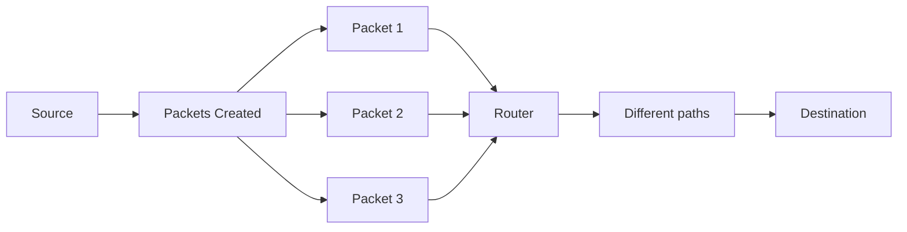

## Question 1(a) [3 marks]

**Explain packet switching network.**

**Answer**:
Packet switching is a network communication method where data is divided into small packets before transmission.

**Diagram:**



- **Independent routing**: Each packet travels independently through network
- **Flexible paths**: Packets can take different routes to reach destination
- **Efficiency**: Better utilization of network bandwidth

**Mnemonic:** "DIVE" - Data Into Various Elements

## Question 1(b) [4 marks]

**Write functional description of any four layers of OSI reference model.**

**Answer**:
The OSI model divides network communication into seven distinct layers, each with specific functions.

| Layer | Function | Key Protocols |
|-------|----------|--------------|
| Application | Provides network services directly to user applications | HTTP, FTP, SMTP |
| Presentation | Translates, encrypts, and compresses data | SSL, TLS, JPEG |
| Session | Establishes, manages, and terminates connections | NetBIOS, RPC |
| Transport | Ensures reliable end-to-end data transfer | TCP, UDP |

- **Application layer**: Interface between network and applications
- **Presentation layer**: Data formatting and encryption
- **Session layer**: Dialog control and synchronization
- **Transport layer**: End-to-end connection and reliability

**Mnemonic:** "All People Seem To Need Data Processing"

## Question 1(c) [7 marks]

**Explain Network topologies and with diagram.**

**Answer**:
Network topology refers to the physical or logical arrangement of devices in a network.

| Topology | Advantages | Disadvantages |
|----------|------------|---------------|
| Bus | Simple, inexpensive | Single point of failure |
| Star | Easy troubleshooting, centralized | Hub/switch failure affects all |
| Ring | Equal access for all nodes | Single cable failure affects network |
| Mesh | High reliability, no traffic problems | Expensive, complex |
| Tree | Easily expandable, structured | Dependent on root, complex |

**Diagram:**

```goat
              BUS TOPOLOGY              
+-----+    +-----+    +-----+    +-----+
|Node1|====|Node2|====|Node3|====|Node4|
+-----+    +-----+    +-----+    +-----+
                                        
              STAR TOPOLOGY             
                 +-----+                
                 |Hub/ |                
                 |Switch|                
                 +-----+                
                     |                  
           +---------+---------+         
           |         |         |         
        +-----+   +-----+   +-----+      
        |Node1|   |Node2|   |Node3|      
        +-----+   +-----+   +-----+     
```

- **Bus topology**: All devices connected to single cable
- **Star topology**: All devices connected to central hub/switch
- **Ring topology**: Devices connected in closed loop
- **Mesh topology**: Each device connected to every other device
- **Tree topology**: Hierarchical star networks connected via bus

**Mnemonic:** "BSRMT" - "Better Solutions Require Multiple Topologies"

## Question 1(c) OR [7 marks]

**Draw the diagram of TCP/IP protocol suite and explain the functions of Application Layer, Transport Layer and Network Layer in detail.**

**Answer**:
The TCP/IP protocol suite organizes network communication into four functional layers.

**Diagram:**

```goat
+-------------------------------+
|       APPLICATION LAYER       |
| (HTTP, FTP, SMTP, DNS, TELNET)|
+-------------------------------+
|        TRANSPORT LAYER        |
|           (TCP, UDP)          |
+-------------------------------+
|        INTERNET LAYER         |
|      (IP, ICMP, ARP, RARP)    |
+-------------------------------+
|     NETWORK ACCESS LAYER      |
| (Ethernet, Wi-Fi, Token Ring) |
+-------------------------------+
```

| Layer | Main Function | Key Protocols |
|-------|--------------|--------------|
| Application | Provides network services to applications | HTTP, FTP, SMTP |
| Transport | End-to-end communication, data flow control | TCP, UDP |
| Internet (Network) | Logical addressing and routing | IP, ICMP, ARP |

- **Application Layer**: User interface to network, application-specific protocols
- **Transport Layer**: Reliable data transmission, error recovery, flow control
- **Network Layer**: Routing packets between networks, IP addressing

**Mnemonic:** "ATN works" - Application, Transport, Network works together

## Question 2(a) [3 marks]

**Compare connection-oriented protocol and connection less protocol.**

**Answer**:
Connection-oriented and connectionless protocols differ in how they handle data transmission.

| Feature | Connection-oriented | Connectionless |
|---------|---------------------|---------------|
| Connection | Establishes before transmission | No connection setup |
| Reliability | Guaranteed delivery | No delivery guarantee |
| Error checking | Extensive | Limited or none |
| Example | TCP | UDP |
| Usage | File transfer, web browsing | Streaming, DNS lookups |

**Mnemonic:** "REACH" - Reliability Exists in All Connection Handshakes

## Question 2(b) [4 marks]

**Explain Fast Ethernet & Gigabit Ethernet.**

**Answer**:
Fast Ethernet and Gigabit Ethernet are higher-speed versions of the original Ethernet standard.

| Feature | Fast Ethernet | Gigabit Ethernet |
|---------|--------------|------------------|
| Speed | 100 Mbps | 1000 Mbps (1 Gbps) |
| IEEE Standard | 802.3u | 802.3z/802.3ab |
| Cable Type | Cat5 UTP | Cat5e/Cat6 UTP, Fiber |
| Max Distance | 100m (copper) | 100m (copper), 5km (fiber) |

- **Fast Ethernet**: 10x faster than original 10Base-T Ethernet
- **Gigabit Ethernet**: 10x faster than Fast Ethernet, backward compatible
- **Cabling**: Uses higher quality cabling to achieve greater speeds
- **Applications**: High-bandwidth network backbones, server connections

**Mnemonic:** "Fast Gets Going" - 100 to 1000 Mbps progression

## Question 2(c) [7 marks]

**Differentiate between Router, Hub and Switch.**

**Answer**:
Routers, hubs, and switches are network devices with different capabilities and functions.

| Feature | Router | Hub | Switch |
|---------|--------|-----|--------|
| OSI Layer | Network (3) | Physical (1) | Data Link (2) |
| Function | Connects networks | Connects devices | Connects devices |
| Data handling | Intelligent routing | Broadcasts to all | Sends to specific device |
| Security | Provides firewall | No security | Basic filtering |
| Addressing | Uses IP addresses | No addressing | Uses MAC addresses |
| Efficiency | High | Low | High |
| Intelligence | Smart | Dumb | Moderately smart |

**Diagram:**

```goat
    ROUTER                HUB                  SWITCH
  +--------+           +------+              +--------+
  |        |           |      |              |        |
  | Routes |           |Shares|              |Forwards|
  |between |           |signal|              | to MAC |
  |networks|           |to all|              |address |
  |        |           |ports |              |        |
  +--------+           +------+              +--------+
```

**Mnemonic:** "RHS order" - "Router Has Smarts, Hub Shares Signal, Switch Sends Specifically"

## Question 2(a) OR [3 marks]

**Define E-mail system and list application of E-Mail.**

**Answer**:
An email system is a network service that allows exchange of digital messages between users.

| Component | Function |
|-----------|----------|
| Mail User Agent (MUA) | Email client software used by end-users |
| Mail Transfer Agent (MTA) | Server software that transfers emails |
| Mail Delivery Agent (MDA) | Delivers email to recipient's mailbox |
| Protocols | SMTP, POP3, IMAP |

**Applications of Email:**

- Business communication
- Personal messaging
- File sharing
- Marketing and newsletters
- Notifications and alerts

**Mnemonic:** "BCPFN" - "Business Communication, Personal, Files, Newsletters"

## Question 2(b) OR [4 marks]

**Differentiate between IPv4 and IPv6.**

**Answer**:
IPv4 and IPv6 are Internet Protocol versions with significant differences.

| Feature | IPv4 | IPv6 |
|---------|------|------|
| Address length | 32-bit (4 bytes) | 128-bit (16 bytes) |
| Format | Dotted decimal (192.168.1.1) | Hexadecimal with colons (2001:0db8:85a3:0000:0000:8a2e:0370:7334) |
| Address space | ~4.3 billion addresses | 340 undecillion addresses |
| Security | Security added later | Built-in IPSec |
| Configuration | Manual or DHCP | Stateless auto-configuration |
| Header | Complex, variable | Simplified, fixed |

- **IPv4**: Traditional addressing with limited space
- **IPv6**: Next-generation addressing with massive capacity
- **Transition**: Dual-stack, tunneling and translation mechanisms

**Mnemonic:** "4 SMALL, 6 HUGE" - IPv4 Small address space, IPv6 Huge address space

## Question 2(c) OR [7 marks]

**Discuss on Firewall with concept, principles, limitations, trusted system, Kerberos- concept in network security.**

**Answer**:
Firewalls are critical network security systems that monitor and control incoming and outgoing traffic.

| Firewall Type | Function | Example |
|--------------|----------|---------|
| Packet filtering | Examines packet headers | Router ACLs |
| Stateful inspection | Tracks connection state | Most hardware firewalls |
| Application layer | Inspects data contents | Web application firewalls |
| Next-generation | Combines multiple techniques | Palo Alto, Fortinet |

**Principles of Firewall:**

- **Default deny**: Block everything unless explicitly allowed
- **Defense in depth**: Multiple security layers
- **Least privilege**: Minimal necessary access

**Limitations:**

- Cannot protect against authorized users
- Limited against encrypted malicious traffic
- Performance impact on network

**Trusted Systems:**

- Systems meeting specific security requirements
- Formal security policy enforcement
- Access control and authentication mechanisms

**Kerberos Concept:**

```goat
    +----------+       +----------+       +----------+
    |  Client  |<----->|   KDC    |<----->|  Server  |
    +----------+       +----------+       +----------+
         |                  |                  |
         |<--Ticket-granting ticket--|         |
         |-------Service request ticket------->|
         |<----------Session key-------------->|
```

- **Authentication protocol** using trusted third party
- **Ticket-based** access control system
- **Mutual authentication** between client and server
- **Time-sensitive** tickets prevent replay attacks

**Mnemonic:** "FLASK" - "Firewalls Lock Access, Secure with Kerberos"

## Question 3(a) [3 marks]

**Describe Sub-layers of Data link Layers.**

**Answer**:
The Data Link Layer in the OSI model is divided into two sublayers with distinct functions.

| Sublayer | Function | Standards |
|----------|----------|-----------|
| Logical Link Control (LLC) | Flow control, error checking | IEEE 802.2 |
| Media Access Control (MAC) | Channel access, addressing | IEEE 802.3, 802.11 |

**Diagram:**

```goat
+-----------------------------+
|        NETWORK LAYER        |
+-----------------------------+
|     LOGICAL LINK CONTROL    |  <-- Flow control, Error handling
|        (LLC - 802.2)        |      Multiplexing, Connection mgmt
+-----------------------------+
|     MEDIA ACCESS CONTROL    |  <-- MAC addressing, Channel access 
|   (MAC - 802.3, 802.11)     |      Frame delimiting, Error detection
+-----------------------------+
|       PHYSICAL LAYER        |
+-----------------------------+
```

- **LLC**: Provides interface to network layer, error/flow control
- **MAC**: Handles physical addressing and media access

**Mnemonic:** "MAC LLCs order" - "MAC handles Lower Layer, LLC coordinates higher"

## Question 3(b) [4 marks]

**Explain IP layer protocols in detail.**

**Answer**:
The IP layer contains several key protocols that work together to facilitate internetwork communication.

| Protocol | Function | Key Features |
|----------|----------|-------------|
| IP | Basic datagram delivery | Addressing, fragmentation, TTL |
| ICMP | Network diagnostics | Error reporting, ping, traceroute |
| ARP | Address resolution | Maps IP to MAC addresses |
| RARP | Reverse address resolution | Maps MAC to IP addresses |
| IGMP | Multicast group management | Manages host groups |

- **IP**: Core protocol for addressing and routing packets
- **ICMP**: Error messages and operational information
- **ARP/RARP**: Address translation between layers
- **IGMP**: Manages multicast group memberships

**Mnemonic:** "I PAIR-up" - IP, ICMP, ARP, RARP work as a team

## Question 3(c) [7 marks]

**Describe different types of IP addressing schemes and explain various classes in classful IP addressing with example.**

**Answer**:
IP addressing schemes define how IP addresses are allocated and structured.

| IP Addressing Scheme | Description | Example |
|-----------------|-------------|---------|
| Classful | Traditional division into 5 classes | Class A: 10.0.0.0 |
| Classless (CIDR) | Flexible prefixes, more efficient | 192.168.1.0/24 |
| Private | Non-routable addresses for internal use | 192.168.0.0/16 |
| Special Purpose | Reserved for specific functions | 127.0.0.1 (localhost) |

**Classful IP Addressing:**

| Class | First Bits | First Byte Range | Default Subnet Mask | Example | Networks | Hosts/Network |
|-------|-----------|------------------|---------------------|---------|----------|---------------|
| A | 0 | 1-127 | 255.0.0.0 (/8) | 10.52.36.12 | 126 | 16,777,214 |
| B | 10 | 128-191 | 255.255.0.0 (/16) | 172.16.52.63 | 16,384 | 65,534 |
| C | 110 | 192-223 | 255.255.255.0 (/24) | 192.168.10.15 | 2,097,152 | 254 |
| D | 1110 | 224-239 | N/A (Multicast) | 224.0.0.5 | N/A | N/A |
| E | 1111 | 240-255 | N/A (Experimental) | 240.0.0.1 | N/A | N/A |

- **Class A**: Large organizations, huge number of hosts
- **Class B**: Medium-sized organizations
- **Class C**: Small networks with few hosts
- **Class D**: Multicast groups
- **Class E**: Reserved for experimental use

**Mnemonic:** "All Businesses Care During Exams" - Classes A, B, C, D, E

## Question 3(a) OR [3 marks]

**Describe Digital Subscriber Line technology.**

**Answer**:
Digital Subscriber Line (DSL) is a technology that provides digital data transmission over telephone lines.

| DSL Type | Speed (Down/Up) | Distance | Application |
|----------|-----------------|----------|-------------|
| ADSL | 8 Mbps/1 Mbps | Up to 5.5 km | Home internet |
| SDSL | 2 Mbps/2 Mbps | Up to 3 km | Business |
| VDSL | 52 Mbps/16 Mbps | Up to 1.2 km | Video streaming |
| HDSL | 2 Mbps/2 Mbps | Up to 3.6 km | T1/E1 replacement |

**Diagram:**

```goat
                           +-------+
        +--------+         |       |
HOME----|  DSL   |---------| DSLAM |-------INTERNET
        | MODEM  |  Copper |       |
        +--------+   Line  +-------+
                    (POTS)    ISP
```

- **Spectrum usage**: Uses higher frequencies than voice
- **Always-on**: Continuous connection, no dial-up
- **xDSL**: Family of technologies with different capabilities

**Mnemonic:** "SAVE Bandwidth" - SDSL, ADSL, VDSL, HDSL Bandwidth options

## Question 3(b) OR [4 marks]

**Discuss Cable Modem System.**

**Answer**:
Cable modem system provides internet access through the same coaxial cable used for cable TV.

| Component | Function |
|-----------|----------|
| Cable modem | User-end device converting digital signals |
| CMTS | Cable Modem Termination System at provider end |
| HFC | Hybrid Fiber-Coaxial network infrastructure |
| DOCSIS | Data Over Cable Service Interface Specification |

**Diagram:**

```goat
                     FIBER
+--------+        +--------+        +---------+
|  HOME  |  COAX  |  NODE  |        |   ISP   |
| MODEM  |--------|        |--------|  CMTS   |-----INTERNET
+--------+        +--------+        +---------+
                 NEIGHBORHOOD        HEAD-END
```

- **Shared medium**: Neighborhood shares bandwidth
- **Asymmetric**: Typically faster download than upload
- **DOCSIS standards**: Evolving specifications for speed/features

**Mnemonic:** "CHAMPS" - "Cable, HFC, Access, Modem, Provider, Shared"

## Question 3(c) OR [7 marks]

**Describe in brief all Transmission Media.**

**Answer**:
Transmission media are the physical paths through which data travels in a network.

| Medium Type | Examples | Max Distance | Max Bandwidth | Application |
|-------------|----------|--------------|---------------|-------------|
| **Guided (Wired)** | | | | |
| Twisted Pair | UTP, STP | 100m | 10 Gbps | Office LANs |
| Coaxial Cable | RG-6, RG-59 | 500m | 10 Gbps | Cable TV, Internet |
| Fiber Optic | Single-mode, Multi-mode | 100km+ | 100+ Tbps | Backbones, Long-distance |
| **Unguided (Wireless)** | | | | |
| Radio Waves | WiFi, Cellular | 100m-50km | 600 Mbps | Wireless networks |
| Microwaves | Terrestrial, Satellite | Line of sight | 10 Gbps | Point-to-point links |
| Infrared | IrDA | 1m | 16 Mbps | Remote controls |

**Diagram:**

```goat
GUIDED MEDIA:
  Twisted Pair: =~=~=~=~=~=~=~
  Coaxial:      =====|=====|=====
  Fiber Optic:  ======================>

UNGUIDED MEDIA:
  Radio:        ((( o )))
  Microwave:    <---> <--->
  Infrared:     * * * >
```

- **Guided media**: Physical paths confining signals
- **Unguided media**: Wireless transmission through air/vacuum
- **Characteristics**: Bandwidth, attenuation, noise immunity, cost

**Mnemonic:** "TRIM-CWF" - "Twisted, Radio, Infrared, Microwave, Coaxial, Wireless, Fiber"

## Question 4(a) [3 marks]

**Write note on DNS.**

**Answer**:
Domain Name System (DNS) translates human-friendly domain names to IP addresses.

| Component | Function |
|-----------|----------|
| Domain Name | Hierarchical, readable address (www.example.com) |
| DNS Server | Resolves domain names to IP addresses |
| Root Server | Top of DNS hierarchy, points to TLDs |
| TLD Server | Manages top-level domains (.com, .org) |
| Record Types | A, AAAA, MX, CNAME, NS, PTR, etc. |

**Diagram:**

```goat
  CLIENT                                      ROOT DNS
+--------+   1. Query                        +--------+
|        |---"www.example.com?"------------->|        |
|        |   8. Response                     |        |
|        |<--"192.0.2.1"-------------------- |        |
+--------+      |                            +--------+
                |                                ^
                |                                |
                v                                |
              +--------+  2            +--------+ 7
              |  LOCAL |--TLD Server?->|   TLD  |
              |  DNS   |<-".com"-------|        |
              +--------+  3            +--------+
                  |                        ^
                  v 4                      | 6
              +--------+                +--------+
              |EXAMPLE |<---------------| DOMAIN |
              |  DNS   |--------------->|SERVER  |
              +--------+ 5              +--------+
```

- **Distributed database**: Hierarchical, globally distributed
- **Caching**: Improves performance, reduces load
- **Critical infrastructure**: Essential for Internet functionality

**Mnemonic:** "DIRT" - "Domain names Into Routable TCP/IP"

## Question 4(b) [4 marks]

**Explain File Transfer Protocol.**

**Answer**:
File Transfer Protocol (FTP) enables transfer of files between client and server over a network.

| Feature | Description |
|---------|-------------|
| Port | Control: 21, Data: 20 |
| Mode | Active and Passive |
| Security | Basic (clear text), or FTPS/SFTP for encryption |
| Commands | GET, PUT, LIST, DELETE, etc. |
| Connection | Uses separate control and data connections |

**Diagram:**

```goat
                     Control Connection (Port 21)
               +--------------------------------+
               |                                |
     +--------+|                                |+--------+
     |        ||                                ||        |
     | CLIENT |+--------------------------------+| SERVER |
     |        |                                  |        |
     |        |                                  |        |
     +--------+                                  +--------+
               +--------------------------------+
                     Data Connection (Port 20)
```

- **Dual channel**: Control channel and data channel
- **Authentication**: Username/password required
- **Modes**: ASCII (text) or Binary (raw data)
- **Active vs Passive**: Different connection establishment methods

**Mnemonic:** "CAPS" - "Control And Port Separation"

## Question 4(c) [7 marks]

**Classify different Internet Services and explain in detail.**

**Answer**:
Internet services provide various functionality over the network.

| Service Category | Common Protocols | Description | Example Applications |
|-----------------|------------------|-------------|----------------------|
| Communication | SMTP, POP3, IMAP | Exchange of messages | Email, Instant Messaging |
| Information Access | HTTP, HTTPS | Access to information resources | World Wide Web, Portals |
| File Sharing | FTP, BitTorrent, SMB | Transfer and sharing of files | File hosting, P2P sharing |
| Remote Access | SSH, Telnet, RDP | Access remote computers | Remote administration |
| Real-time Services | VoIP, WebRTC | Live communication | Video conferencing, VoIP |
| Domain Services | DNS, DHCP | Network infrastructure | Address resolution |

**Information Access Services (Web):**

- **HTTP/HTTPS**: HyperText Transfer Protocol, foundation of web
- **HTML**: Document format for displaying content
- **Web browsers**: Client software to access and render web content
- **Web servers**: Hosts websites and applications

**Communication Services (Email):**

- **SMTP**: For sending email
- **POP3/IMAP**: For receiving email
- **Components**: Mail user agents, transfer agents, delivery agents

**File Sharing Services:**

- **FTP**: Traditional file transfer protocol
- **P2P**: Distributed file sharing without central server
- **Cloud storage**: Remote file storage and synchronization

**Mnemonic:** "CIFRRD" - "Communication, Information, File, Remote, Real-time, Domain"

## Question 4(a) OR [3 marks]

**Explain Mail Protocols.**

**Answer**:
Mail protocols facilitate electronic messaging between users.

| Protocol | Function | Port | Direction |
|----------|----------|------|-----------|
| SMTP | Simple Mail Transfer Protocol | 25, 587 | Sending mail |
| POP3 | Post Office Protocol v3 | 110 | Retrieving mail |
| IMAP | Internet Message Access Protocol | 143 | Advanced mail retrieval |
| MIME | Multipurpose Internet Mail Extensions | N/A | Encoding attachments |

**Diagram:**

```goat
+---------+   SMTP    +---------+   POP3/IMAP  +---------+
|  Sender |---------->|  Mail   |------------->| Receiver|
|  Client |           |  Server |              |  Client |
+---------+           +---------+              +---------+
```

- **SMTP**: Outgoing mail delivery, push protocol
- **POP3**: Simple mail retrieval, downloads and deletes
- **IMAP**: Advanced retrieval, server-side storage, folders
- **MIME**: Extends email capability for non-text content

**Mnemonic:** "SIM-P" - "SMTP sends, IMAP manages, POP3 pulls"

## Question 4(b) OR [4 marks]

**Describe VOIP in brief.**

**Answer**:
Voice over Internet Protocol (VoIP) transmits voice communications over IP networks.

| Component | Function |
|-----------|----------|
| Codec | Encodes/decodes voice signals |
| Signaling Protocol | Call setup/tear down (SIP, H.323) |
| Transport Protocol | Voice packet delivery (RTP) |
| QoS mechanism | Ensures voice quality |

**Diagram:**

```goat
+--------+   Internet/   +--------+
| CALLER |---IP Network---| CALLEE |
|ENDPOINT|               |ENDPOINT|
+--------+               +--------+
    |                        |
 [Analog]                 [Analog]
    |                        |
 [Digital]                [Digital]
    |                        |
 [Packets]  <---RTP--->  [Packets]
```

- **Packetization**: Converts analog voice to digital packets
- **Benefits**: Cost savings, flexibility, integration with apps
- **Challenges**: Quality of service, latency, jitter, packet loss

**Mnemonic:** "PALS" - "Packets Allowing Live Speech"

## Question 4(c) OR [7 marks]

**Describe TCP and UDP protocols.**

**Answer**:
TCP and UDP are the primary transport layer protocols in the TCP/IP suite.

| Feature | TCP | UDP |
|---------|-----|-----|
| Connection | Connection-oriented | Connectionless |
| Reliability | Guaranteed delivery | Best-effort delivery |
| Header size | 20-60 bytes | 8 bytes |
| Speed | Slower due to overhead | Faster with minimal overhead |
| Order | Maintains sequence | No sequence preservation |
| Flow control | Yes | No |
| Error recovery | Retransmission | None |
| Usage | Web, email, file transfer | Streaming, DNS, VoIP |

**TCP Three-Way Handshake:**

```goat
  CLIENT                SERVER
    |                     |
    |       SYN           |
    |-------------------->|
    |                     |
    |     SYN-ACK         |
    |<--------------------|
    |                     |
    |       ACK           |
    |-------------------->|
    |                     |
    |    DATA TRANSFER    |
    |<------------------->|
```

**TCP Features:**

- **Reliability**: Acknowledgments, retransmission
- **Flow control**: Window-based, prevents overwhelming
- **Congestion control**: Slow start, congestion avoidance
- **Connection management**: Establishment, maintenance, termination

**UDP Features:**

- **Lightweight**: Minimal headers, no connection state
- **Low latency**: No handshaking or acknowledgments
- **No guarantees**: Data may arrive out of order, duplicated, or not at all
- **Broadcast/multicast**: Supports one-to-many transmission

**Mnemonic:** "CRUFS" - "Connection, Reliability, UDP Fast, Simple"

## Question 5(a) [3 marks]

**Describe Cryptography.**

**Answer**:
Cryptography is the science of secure communication techniques that protect information.

| Type | Description | Example |
|------|-------------|---------|
| Symmetric | Same key for encryption and decryption | AES, DES |
| Asymmetric | Different keys for encryption and decryption | RSA, ECC |
| Hash Functions | One-way functions, fixed output size | SHA-256, MD5 |
| Digital Signatures | Authentication and integrity verification | RSA signatures |

**Diagram:**

```goat
SYMMETRIC:
  Sender --(Encrypt with Key K)--> [Ciphertext] --(Decrypt with Key K)--> Receiver

ASYMMETRIC:
  Sender --(Encrypt with Public Key)--> [Ciphertext] --(Decrypt with Private Key)--> Receiver
```

- **Confidentiality**: Protect information from unauthorized access
- **Integrity**: Ensure information hasn't been altered
- **Authentication**: Verify identity of communicating parties

**Mnemonic:** "SHAPE" - "Symmetric, Hashing, Asymmetric, Protect, Encrypt"

## Question 5(b) [4 marks]

**Explain Social issues and Hacking also discuss its precautions.**

**Answer**:
Social issues in cybersecurity involve human manipulation and societal impacts of cyber threats.

| Social Issue | Description | Example |
|--------------|------------|---------|
| Social Engineering | Manipulating people to reveal information | Phishing, pretexting |
| Privacy Concerns | Unauthorized data collection and use | Data breaches, surveillance |
| Digital Divide | Inequality in technology access | Limited Internet in rural areas |
| Cyberbullying | Using technology to harass others | Online harassment, threats |

**Hacking Types:**

- **White Hat**: Ethical hacking, security improvement
- **Black Hat**: Malicious hacking, illegal activities
- **Grey Hat**: Mix of ethical and questionable actions

**Precautions:**

- **Education**: Regular security awareness training
- **Strong Policies**: Clear security procedures and policies
- **Technical Controls**: Firewalls, antivirus, encryption
- **Regular Updates**: Patching systems against vulnerabilities
- **Monitoring**: Activity logs, intrusion detection

**Mnemonic:** "STEPS" - "Social engineering, Training, Encryption, Patches, Strong passwords"

## Question 5(c) [7 marks]

**Explain IP Security in detail.**

**Answer**:
IP Security (IPsec) is a protocol suite that secures communications at the IP layer.

| Component | Function | Description |
|-----------|----------|-------------|
| AH | Authentication Header | Provides integrity and authentication |
| ESP | Encapsulating Security Payload | Provides confidentiality, integrity, authentication |
| IKE | Internet Key Exchange | Establishes and manages security associations |
| SA | Security Association | Security parameters for a connection |

**IPsec Modes:**

| Mode | Description | Application |
|------|-------------|-------------|
| Transport | Protects payload only | Host-to-host communications |
| Tunnel | Protects entire packet | Gateway-to-gateway (VPN) |

**Diagram:**

```goat
TRANSPORT MODE:
  +------+-------+----------------+
  |  IP  | IPsec |    Payload     |
  |Header|Header |                |
  +------+-------+----------------+

TUNNEL MODE:
  +------+-------+------+-------+----------------+
  | New  | IPsec | Orig |  TCP  |    Payload     |
  | IP   |Header | IP   |Header |                |
  +------+-------+------+-------+----------------+
```

**IPsec Services:**

- **Authentication**: Verifies sender identity
- **Confidentiality**: Encrypts data to prevent eavesdropping
- **Integrity**: Ensures data hasn't been modified
- **Anti-replay**: Prevents packet replay attacks

**IPsec Implementation:**

- **VPNs**: Secure remote access and site-to-site connections
- **L2TP/IPsec**: Combines tunneling with security
- **Authentication methods**: Pre-shared keys, certificates, Kerberos

**Mnemonic:** "ACCEPT" - "Authentication, Confidentiality, Cryptography, Encapsulation, Protocols, Tunnel"

## Question 5(a) OR [3 marks]

**Define Network Security and explain its elements.**

**Answer**:
Network security is the protection of network infrastructure, data, and access against unauthorized use, malfunction, modification, or destruction.

| Element | Description | Examples |
|---------|-------------|----------|
| Access Control | Limiting network access | Passwords, multi-factor auth |
| Threat Prevention | Blocking attacks | Firewalls, IDS/IPS |
| Encryption | Securing data in transit | SSL/TLS, IPsec |
| Vulnerability Management | Identifying weaknesses | Scanning, patching |
| Monitoring | Observing network activity | SIEM, log analysis |

**Diagram:**

```goat
                +------------------+
                | NETWORK SECURITY |
                +------------------+
                         |
       +--------+-----------+--------+--------+
       |        |           |        |        |
 +-----------+ +-------+ +------+ +------+ +--------+
 |   ACCESS  | |THREAT | |ENCRYP| |VULNER| |MONITOR |
 |  CONTROL  | |PREVENT| |TION  | |MGMT  | |ING     |
 +-----------+ +-------+ +------+ +------+ +--------+
```

- **Confidentiality**: Protecting information from unauthorized access
- **Integrity**: Ensuring information accuracy and reliability
- **Availability**: Maintaining systems accessible when needed

**Mnemonic:** "CIMA TV" - "Confidentiality, Integrity, Monitoring, Access control, Threats, Vulnerabilities"

## Question 5(b) OR [4 marks]

**Briefly describe the Information Technology (Amendment) Act, 2008, and its impact on cyber laws in India.**

**Answer**:
The IT (Amendment) Act, 2008 updated India's cyber laws to address emerging cybersecurity challenges.

| Key Aspect | Description |
|------------|-------------|
| Cyber Crimes | Added new offenses, strengthened penalties |
| Electronic Evidence | Recognized digital evidence in court |
| Data Protection | Imposed obligations for sensitive data |
| Intermediary Liability | Defined responsibilities for service providers |

**Key Sections:**

- **Section 43**: Penalties for unauthorized access, data theft
- **Section 66**: Computer-related offenses and punishments
- **Section 69**: Powers for interception and monitoring
- **Section 72A**: Protection of personal data privacy

**Impact on Cyber Laws:**

- **Stronger enforcement**: Enhanced penalties for cyber crimes
- **Expanded scope**: Covered new technological developments
- **Corporate responsibility**: Required security practices for data
- **Global alignment**: Harmonized with international standards

**Mnemonic:** "SPEC" - "Security, Privacy, Evidence, Cyber crimes"

## Question 5(c) OR [7 marks]

**Explain Email security in terms of SMTP, PEM, PGP, S/MINE, spam.**

**Answer**:
Email security protects email content and accounts from unauthorized access and attacks.

| Technology | Function | Features |
|------------|----------|----------|
| SMTP | Simple Mail Transfer Protocol | Basic email transmission, limited security |
| PEM | Privacy Enhanced Mail | Early email encryption standard |
| PGP | Pretty Good Privacy | End-to-end encryption, digital signatures |
| S/MIME | Secure/Multipurpose Internet Mail Extensions | Certificate-based encryption and signing |
| Anti-spam | Unwanted email filtering | Content filtering, blacklists, authentication |

**SMTP Security Issues:**

- Originally designed without security
- Authentication extensions (AUTH) added later
- Vulnerable to eavesdropping without encryption
- Supports STARTTLS for encrypted transmission

**PGP Email Security:**

```goat
SENDER                                 RECEIVER
  |                                      |
  |-- Create message                     |
  |-- Sign with private key              |
  |-- Encrypt with recipients public key |
  |                                      |
  |      Encrypted Email                 |
  |------------------------------------->|
  |                                      |
  |                                      |-- Decrypt with private key
  |                                      |-- Verify with sender's public key
```

**S/MIME Features:**

- Uses X.509 certificates for authentication
- Provides encryption and digital signatures
- Integrated into many email clients
- Requires certificate infrastructure

**Spam Protection:**

- **Content filtering**: Analyzing message content
- **Sender verification**: SPF, DKIM, DMARC
- **Behavioral analysis**: Pattern recognition
- **Blacklists/whitelists**: Blocking/allowing specific senders

**Email Security Best Practices:**

- **Encryption**: Ensure privacy of message content
- **Authentication**: Verify sender identity
- **Access controls**: Protect email accounts
- **Filtering**: Block malicious and unwanted messages
- **User education**: Recognize phishing attempts

**Mnemonic:** "SPEED" - "S/MIME, PGP, Encryption, Email security, DMARC"
