## પ્રશ્ન 1(અ) [3 ગુણ]

**કમ્પ્યુટર નેટવર્કની વિવિધ નેટવર્ક ટોપોલોજીની યાદી બનાવો અને કોઈપણ એકને સમજાવો.**

**જવાબ**:

**નેટવર્ક ટોપોલોજીઓનું ટેબલ:**

| ટોપોલોજી | વર્ણન |
|----------|--------|
| **સ્ટાર** | કેન્દ્રીય હબ બધા ઉપકરણોને જોડે છે |
| **રિંગ** | ઉપકરણો વર્તુળાકાર શૃંખલામાં જોડાયેલા |
| **બસ** | સિંગલ કેબલ બેકબોન કનેક્શન |
| **મેશ** | દરેક ઉપકરણ બીજા બધા સાથે જોડાય છે |
| **ટ્રી** | લવાલવ શાખાઓનું માળખું |
| **હાઇબ્રિડ** | અનેક ટોપોલોજીનું મિશ્રણ |

**સ્ટાર ટોપોલોજી સમજૂતી:**

- **કેન્દ્રીય હબ**: બધા ઉપકરણો એક કેન્દ્રીય બિંદુ સાથે જોડાય
- **સરળ ઇન્સ્ટોલેશન**: ઉપકરણો ઉમેરવા/દૂર કરવા સરળ
- **સિંગલ પોઇન્ટ ફેલ્યર**: હબ નિષ્ફળતા આખા નેટવર્કને અસર કરે

**મેમરી ટ્રીક:** "SRBMTH - સ્ટાર રિંગ બસ મેશ ટ્રી હાઇબ્રિડ"

## પ્રશ્ન 1(બ) [4 ગુણ]

**LAN, WAN અને MAN ની સરખામણી કરો.**

**જવાબ**:

**સરખામણી ટેબલ:**

| પેરામીટર | **LAN** | **MAN** | **WAN** |
|-----------|---------|---------|---------|
| **કવરેજ** | બિલ્ડિંગ/કેમ્પસ | શહેર/મેટ્રોપોલિટન | દેશ/વૈશ્વિક |
| **સ્પીડ** | અત્યંત વધુ (1-100 Gbps) | વધુ (10-100 Mbps) | મધ્યમ (1-100 Mbps) |
| **કિંમત** | ઓછી | મધ્યમ | વધુ |
| **માલિકી** | ખાનગી | સાર્વજનિક/ખાનગી | સાર્વજનિક |

**મુખ્ય મુદ્દાઓ:**

- **LAN**: નાના વિસ્તારો માટે લોકલ એરિયા નેટવર્ક
- **MAN**: શહેરો માટે મેટ્રોપોલિટન એરિયા નેટવર્ક
- **WAN**: મોટા અંતર માટે વાઇડ એરિયા નેટવર્ક

**મેમરી ટ્રીક:** "LMW - લોકલ મેટ્રોપોલિટન વાઇડ"

## પ્રશ્ન 1(ક) [7 ગુણ]

**OSI સંદર્ભ મોડેલનું સ્તરીય આર્કિટેક્ચર દોરો અને મોડેલના દરેક સ્તર દ્વારા પૂરી પાડવામાં આવતી ઓછામાં ઓછી બે સેવાઓ લખો.**

**જવાબ**:

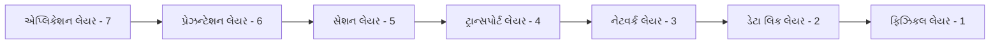

**દરેક લેયરની સેવાઓ:**

| લેયર | **સેવાઓ** |
|------|-----------|
| **એપ્લિકેશન (7)** | ઇમેઇલ સેવાઓ, ફાઇલ ટ્રાન્સફર |
| **પ્રેઝન્ટેશન (6)** | ડેટા એન્ક્રિપ્શન, ડેટા કમ્પ્રેશન |
| **સેશન (5)** | સેશન સ્થાપના, સેશન સમાપ્તિ |
| **ટ્રાન્સપોર્ટ (4)** | ફ્લો કંટ્રોલ, એરર કરેક્શન |
| **નેટવર્ક (3)** | રૂટિંગ, પાથ નિર્ધારણ |
| **ડેટા લિંક (2)** | ફ્રેમ સિંક્રોનાઇઝેશન, એરર ડિટેક્શન |
| **ફિઝિકલ (1)** | બિટ ટ્રાન્સમિશન, સિગ્નલ કન્વર્ઝન |

**મેમરી ટ્રીક:** "All People Seem To Need Data Processing"

## પ્રશ્ન 1(ક OR) [7 ગુણ]

**TCP/IP મોડેલના દરેક સ્તરને તેના પ્રોટોકોલ સાથે સમજાવો.**

**જવાબ**:

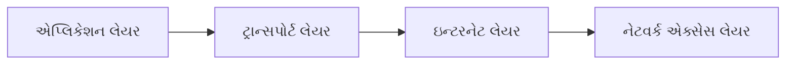

**TCP/IP મોડેલ લેયર્સ:**

| લેયર | **પ્રોટોકોલ** | **કાર્ય** |
|------|---------------|----------|
| **એપ્લિકેશન** | HTTP, FTP, SMTP, DNS | યુઝર એપ્લિકેશન્સ |
| **ટ્રાન્સપોર્ટ** | TCP, UDP | અંત-થી-અંત ડિલિવરી |
| **ઇન્ટરનેટ** | IP, ICMP, ARP | પેકેટ રૂટિંગ |
| **નેટવર્ક એક્સેસ** | Ethernet, Wi-Fi | ફિઝિકલ ટ્રાન્સમિશન |

**મુખ્ય લક્ષણો:**

- **સરળ મોડેલ**: OSI ના 7 ની સામે માત્ર 4 લેયર
- **પ્રોટોકોલ સ્યૂટ**: સંપૂર્ણ નેટવર્કિંગ સોલ્યુશન
- **ઇન્ટરનેટ સ્ટાન્ડર્ડ**: આધુનિક ઇન્ટરનેટનો આધાર

**મેમરી ટ્રીક:** "ATIN - એપ્લિકેશન ટ્રાન્સપોર્ટ ઇન્ટરનેટ નેટવર્ક"

## પ્રશ્ન 2(અ) [3 ગુણ]

**નીચેના નેટવર્ક ઉપકરણોના કાર્યો સમજાવો: રીપીટર, હબ**

**જવાબ**:

**ઉપકરણ કાર્યો:**

| ઉપકરણ | **કાર્ય** | **લેયર** |
|--------|-----------|----------|
| **રીપીટર** | સિગ્નલ એમ્પ્લિફિકેશન, રેન્જ વિસ્તરણ | ફિઝિકલ (1) |
| **હબ** | સિગ્નલ બ્રોડકાસ્ટિંગ, કોલિઝન ડોમેન શેરિંગ | ફિઝિકલ (1) |

**વિગતો:**

- **રીપીટર**: લાંબા અંતર પર નબળા સિગ્નલને પુનર્જનરેટ કરે છે
- **હબ**: સ્ટાર ટોપોલોજીમાં અનેક ઉપકરણોને જોડે છે
- **શેર્ડ મીડિયમ**: બંને સિંગલ કોલિઝન ડોમેન બનાવે છે

**મેમરી ટ્રીક:** "RH - રીપીટ હબ સિગ્નલ્સ"

## પ્રશ્ન 2(બ) [4 ગુણ]

**નીચેના શબ્દને સમજાવો 1) FDDI 2) ARP, RARP**

**જવાબ**:

**FDDI (ફાઇબર ડિસ્ટ્રિબ્યુટેડ ડેટા ઇન્ટરફેસ):**

- **ટેકનોલોજી**: 100 Mbps ફાઇબર ઓપ્ટિક નેટવર્ક
- **ટોપોલોજી**: ફોલ્ટ ટોલરન્સ માટે ડ્યુઅલ રિંગ
- **એપ્લિકેશન**: બેકબોન નેટવર્ક્સ, ઉચ્ચ વિશ્વસનીયતા

**ARP (એડ્રેસ રિઝોલ્યુશન પ્રોટોકોલ):**

- **કાર્ય**: IP એડ્રેસને MAC એડ્રેસ સાથે મેપ કરે છે
- **પ્રક્રિયા**: રિક્વેસ્ટ બ્રોડકાસ્ટ કરે, રિપ્લાય મેળવે

**RARP (રિવર્સ ARP):**

- **કાર્ય**: MAC એડ્રેસને IP એડ્રેસ સાથે મેપ કરે છે
- **ઉપયોગ**: ડિસ્કલેસ વર્કસ્ટેશન્સ, બૂટ પ્રક્રિયા

**મેમરી ટ્રીક:** "FAR - FDDI ARP RARP"

## પ્રશ્ન 2(ક) [7 ગુણ]

**સિદ્ધાન્તો અને કર્બેરોસ-કન્સેપ્ટ સાથે નેટવર્ક સુરક્ષામાં ફાયરવોલનું કાર્ય સમજાવો**

**જવાબ**:

**ફાયરવોલ કાર્યો:**

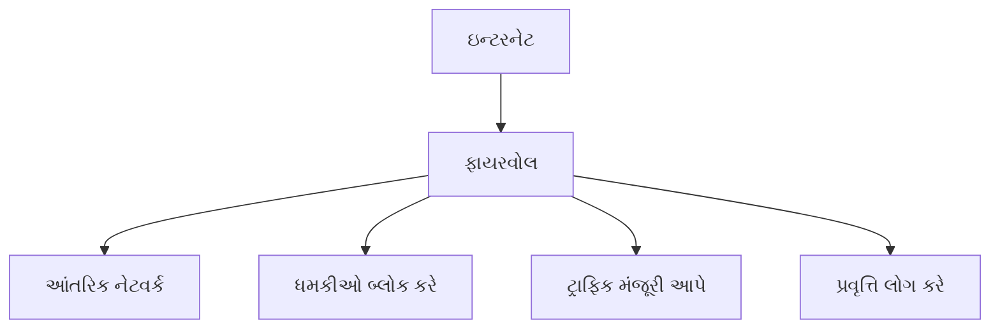

**ફાયરવોલ સિદ્ધાન્તો:**

- **પેકેટ ફિલ્ટરિંગ**: પેકેટ હેડર્સની તપાસ કરે છે
- **સ્ટેટફુલ ઇન્સ્પેક્શન**: કનેક્શન સ્ટેટ્સને ટ્રેક કરે છે
- **એપ્લિકેશન ગેટવે**: ડીપ પેકેટ ઇન્સ્પેક્શન

**કર્બેરોસ કન્સેપ્ટ:**

- **ઓથેન્ટિકેશન સર્વિસ**: સુરક્ષિત યુઝર વેરિફિકેશન
- **ટિકિટ સિસ્ટમ**: સમય-મર્યાદિત એક્સેસ ટોકન્સ
- **થ્રી-પાર્ટી પ્રોટોકોલ**: ક્લાયંટ, સર્વર, key ડિસ્ટ્રિબ્યુશન સેન્ટર

**સુરક્ષા લાભો:**

- **એક્સેસ કંટ્રોલ**: અનધિકૃત પ્રવેશ અટકાવે છે
- **નેટવર્ક પ્રોટેક્શન**: આંતરિક સંસાધનોને સુરક્ષા આપે છે

**મેમરી ટ્રીક:** "FPK - ફાયરવોલ કર્બેરોસ સાથે પ્રોટેક્ટ કરે"

## પ્રશ્ન 2(અ OR) [3 ગુણ]

**નીચેના નેટવર્ક ઉપકરણોના કાર્યો સમજાવો: સ્વિચ , રાઉટર**

**જવાબ**:

**ઉપકરણ કાર્યો:**

| ઉપકરણ | **કાર્ય** | **લેયર** |
|--------|-----------|----------|
| **સ્વિચ** | MAC એડ્રેસ લર્નિંગ, ફ્રેમ ફોરવર્ડિંગ | ડેટા લિંક (2) |
| **રાઉટર** | IP રૂટિંગ, પાથ સિલેક્શન | નેટવર્ક (3) |

**વિગતો:**

- **સ્વિચ**: દરેક પોર્ટ માટે અલગ કોલિઝન ડોમેન બનાવે છે
- **રાઉટર**: વિવિધ નેટવર્ક્સને જોડે છે, રૂટિંગ નિર્ણયો લે છે
- **ઇન્ટેલિજન્સ**: સ્વિચ MAC શીખે છે, રાઉટર રૂટિંગ ટેબલ રાખે છે

**મેમરી ટ્રીક:** "SR - સ્વિચ રૂટ્સ ઇન્ટેલિજન્ટલી"

## પ્રશ્ન 2(બ OR) [4 ગુણ]

**નીચેના શબ્દ સમજાવો 1) CDDI 2) DHCP અને BOOTP**

**જવાબ**:

**CDDI (કોપર ડિસ્ટ્રિબ્યુટેડ ડેટા ઇન્ટરફેસ):**

- **ટેકનોલોજી**: કોપર કેબલ પર FDDI
- **સ્પીડ**: ટ્વિસ્ટેડ પેર પર 100 Mbps
- **કિંમત**: ફાઇબર FDDI કરતાં સસ્તું વિકલ્પ

**DHCP (ડાયનેમિક હોસ્ટ કન્ફિગરેશન પ્રોટોકોલ):**

- **કાર્ય**: ઓટોમેટિક IP એડ્રેસ અસાઇનમેન્ટ
- **પ્રક્રિયા**: ડિસ્કવર, ઓફર, રિક્વેસ્ટ, એકનોલેજ
- **લાભો**: કેન્દ્રીકૃત IP મેનેજમેન્ટ

**BOOTP (બૂટસ્ટ્રેપ પ્રોટોકોલ):**

- **કાર્ય**: ડિસ્કલેસ ક્લાયંટ્સ માટે નેટવર્ક બૂટસ્ટ્રેપ
- **સ્ટેટિક**: ફિક્સ્ડ IP એડ્રેસ અસાઇનમેન્ટ
- **પૂર્વવર્તી**: DHCP નું અગાઉનું વર્ઝન

**મેમરી ટ્રીક:** "CDB - CDDI DHCP BOOTP"

## પ્રશ્ન 2(ક OR) [7 ગુણ]

**સોફ્ટવેર ડિફાઇન નેટવર્ક(SDN) ને તેના આર્કિટેક્ચર, એપ્લિકેશન, એડવાન્ટેજ અને મર્યાદા સાથે સમજાવો.**

**જવાબ**:

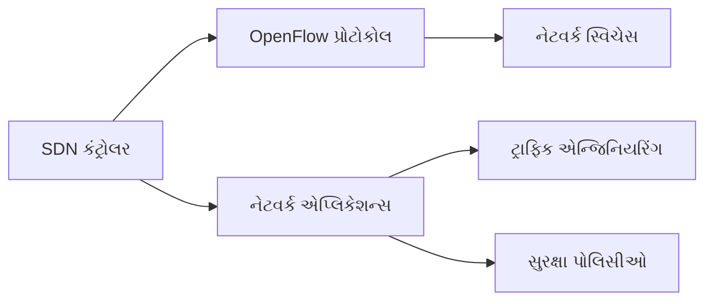

**SDN આર્કિટેક્ચર:**

- **કંટ્રોલ પ્લેન**: કેન્દ્રીકૃત નેટવર્ક ઇન્ટેલિજન્સ
- **ડેટા પ્લેન**: પેકેટ ફોરવર્ડિંગ ઉપકરણો
- **એપ્લિકેશન પ્લેન**: નેટવર્ક એપ્લિકેશન્સ અને સેવાઓ

**એપ્લિકેશન્સ:**

- **ક્લાઉડ કમ્પ્યુટિંગ**: ડાયનેમિક રિસોર્સ એલોકેશન
- **નેટવર્ક વર્ચ્યુઅલાઇઝેશન**: મલ્ટિપલ વર્ચ્યુઅલ નેટવર્ક્સ
- **ટ્રાફિક એન્જિનિયરિંગ**: ઓપ્ટિમાઇઝ્ડ પાથ સિલેક્શન

**ફાયદાઓ:**

- **કેન્દ્રીકૃત કંટ્રોલ**: સરળ નેટવર્ક મેનેજમેન્ટ
- **પ્રોગ્રામેબિલિટી**: કસ્ટમ નેટવર્ક બિહેવિયર
- **લવચીકતા**: ઝડપી સેવા ડિપ્લોયમેન્ટ

**મર્યાદાઓ:**

- **સિંગલ પોઇન્ટ ફેલ્યર**: કંટ્રોલર ડિપેન્ડન્સી
- **સ્કેલેબિલિટી**: પર્ફોર્મન્સ બોટલનેક્સ
- **સુરક્ષા**: નવા એટેક વેક્ટર્સ

**મેમરી ટ્રીક:** "SCAP - સોફ્ટવેર કંટ્રોલ એપ્લિકેશન પ્રોગ્રામેબલ"

## પ્રશ્ન 3(અ) [3 ગુણ]

**નીચેના IP સરનામાનો વર્ગ શોધો.**
**1) 01111000 00001111 10101010 11000000**
**2) 11101000 01010101 11111111 11000011**

**જવાબ**:

**IP એડ્રેસ વર્ગીકરણ:**

| બાઇનરી એડ્રેસ | **ડેસિમલ** | **પ્રથમ ઓક્ટેટ** | **વર્ગ** |
|----------------|-------------|-----------------|-----------|
| 01111000... | 120.15.170.192 | 120 (64-127) | **વર્ગ A** |
| 11101000... | 232.85.255.195 | 232 (224-239) | **વર્ગ D** |

**વર્ગ રેન્જ:**

- **વર્ગ A**: 1-126 (0xxxxxxx)
- **વર્ગ B**: 128-191 (10xxxxxx)
- **વર્ગ C**: 192-223 (110xxxxx)
- **વર્ગ D**: 224-239 (1110xxxx)

**પરિણામો:**

- **પ્રથમ IP**: વર્ગ A (યુનિકાસ્ટ)
- **બીજું IP**: વર્ગ D (મલ્ટિકાસ્ટ)

**મેમરી ટ્રીક:** "ABCD - A(1-126) B(128-191) C(192-223) D(224-239)"

## પ્રશ્ન 3(બ) [4 ગુણ]

**IPv4 અને IPv6 વચ્ચે તફાવત આપો.**

**જવાબ**:

**IPv4 vs IPv6 સરખામણી:**

| લક્ષણ | **IPv4** | **IPv6** |
|-------|----------|----------|
| **એડ્રેસ લેન્થ** | 32 બિટ્સ | 128 બિટ્સ |
| **એડ્રેસ ફોર્મેટ** | ડોટેડ ડેસિમલ | હેક્સાડેસિમલ |
| **એડ્રેસ સ્પેસ** | 4.3 બિલિયન | 340 અન્ડેસિલિયન |
| **હેડર સાઇઝ** | વેરિયેબલ (20-60 બાઇટ્સ) | ફિક્સ્ડ (40 બાઇટ્સ) |
| **સુરક્ષા** | વૈકલ્પિક (IPSec) | બિલ્ટ-ઇન (IPSec) |
| **કન્ફિગરેશન** | મેન્યુઅલ/DHCP | ઓટો-કન્ફિગરેશન |

**મુખ્ય તફાવતો:**

- **એડ્રેસિંગ**: IPv6 વધુ વિશાળ એડ્રેસ પ્રદાન કરે છે
- **સુરક્ષા**: IPv6 માં ફરજિયાત સુરક્ષા લક્ષણો છે
- **પર્ફોર્મન્સ**: IPv6 માં સરળ હેડર સ્ટ્રક્ચર છે

**મેમરી ટ્રીક:** "IPv4 થી IPv6 = વધુ એડ્રેસ, બેહતર સુરક્ષા"

## પ્રશ્ન 3(ક) [7 ગુણ]

**સ્ટેટિક અને ડાયનેમિક રૂટિંગ અલ્ગોરિધમ્સ સમજાવો.**

**જવાબ**:

**સ્ટેટિક રૂટિંગ:**

**ડાયનેમિક રૂટિંગ:**

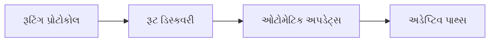

**સરખામણી ટેબલ:**

| પાસાં | **સ્ટેટિક રૂટિંગ** | **ડાયનેમિક રૂટિંગ** |
|-------|-------------------|-------------------|
| **કન્ફિગરેશન** | મેન્યુઅલ સેટઅપ | ઓટોમેટિક ડિસ્કવરી |
| **અડેપ્ટેબિલિટી** | કોઈ અડેપ્ટેશન નહીં | ફેરફારોને અડેપ્ટ કરે |
| **રિસોર્સ યુસેજ** | ઓછું CPU/મેમરી | વધારે CPU/મેમરી |
| **સ્કેલેબિલિટી** | મોટા નેટવર્ક માટે નબળું | મોટા નેટવર્ક માટે સારું |
| **પ્રોટોકોલ** | કોઈ જરૂરી નહીં | RIP, OSPF, BGP |

**એપ્લિકેશન્સ:**

- **સ્ટેટિક**: નાના નેટવર્ક્સ, વિશિષ્ટ પાથ્સ
- **ડાયનેમિક**: મોટા નેટવર્ક્સ, ફોલ્ટ ટોલરન્સ

**મેમરી ટ્રીક:** "SD - સ્ટેટિક=સિમ્પલ, ડાયનેમિક=ઓટોમેટિક"

## પ્રશ્ન 3(અ OR) [3 ગુણ]

**CIDR સમજાવો.તે પરંપરાગત IP સરનામું ફાળવણી પદ્ધતિઓથી કેવી રીતે અલગ છે?**

**જવાબ**:

**CIDR (ક્લાસલેસ ઇન્ટર-ડોમેન રૂટિંગ):**

- **કન્સેપ્ટ**: વેરિયેબલ લેન્થ સબનેટ માસ્કિંગ
- **નોટેશન**: IP એડ્રેસ/પ્રીફિક્સ લેન્થ (દા.ત., 192.168.1.0/24)
- **લવચીકતા**: કોઈપણ સાઇઝના સબનેટ્સ

**પરંપરાગત vs CIDR:**

| પદ્ધતિ | **ફાળવણી** | **કાર્યક્ષમતા** |
|--------|-------------|-----------------|
| **પરંપરાગત** | ફિક્સ્ડ વર્ગ બાઉન્ડરીઝ | વેસ્ટફુલ (વર્ગ B = 65,536 IPs) |
| **CIDR** | વેરિયેબલ સબનેટ સાઇઝ | કાર્યક્ષમ ફાળવણી |

**લાભો:**

- **એડ્રેસ કન્ઝર્વેશન**: IP એડ્રેસ વેસ્ટેજ ઘટાડે છે
- **રૂટ એગ્રીગેશન**: મલ્ટિપલ રૂટ્સનો સારાંશ આપે છે

**મેમરી ટ્રીક:** "CIDR = ક્લાસલેસ ઇન્ટેલિજન્ટ એડ્રેસ રૂટિંગ"

## પ્રશ્ન 3(બ OR) [4 ગુણ]

**DSL ટેકનોલોજીના પ્રકારો, ફાયદા અને મર્યાદાઓ નું વર્ણન કરો.**

**જવાબ**:

**DSL (ડિજિટલ સબસ્ક્રાઇબર લાઇન):**

- **ટેકનોલોજી**: ટેલિફોન લાઇન્સ પર હાઇ-સ્પીડ ઇન્ટરનેટ
- **ફ્રીક્વન્સી**: વોઇસ કરતાં વધારે ફ્રીક્વન્સીનો ઉપયોગ

**DSL પ્રકારો:**

| પ્રકાર | **સ્પીડ** | **એપ્લિકેશન** |
|-------|-----------|----------------|
| **ADSL** | એસિમેટ્રિક (ઝડપી ડાઉનલોડ) | ઘર વપરાશકર્તાઓ |
| **SDSL** | સિમેટ્રિક (સમાન અપ/ડાઉન) | બિઝનેસ |
| **VDSL** | અત્યંત ઉચ્ચ ગતિ | ટૂંકા અંતર |

**ફાયદાઓ:**

- **હંમેશા-ઓન કનેક્શન**: ડાયલ-અપની જરૂર નહીં
- **હાલનું ઇન્ફ્રાસ્ટ્રક્ચર**: ફોન લાઇન્સનો ઉપયોગ
- **કિફાયતી**: પોસાય તેવી હાઇ-સ્પીડ એક્સેસ

**મર્યાદાઓ:**

- **અંતર આધારિત**: અંતર વધે તો સ્પીડ ઘટે
- **લાઇન ક્વોલિટી**: સારી કોપર લાઇન્સની જરૂર
- **ઉપલબ્ધતા**: બધે ઉપલબ્ધ નથી

**મેમરી ટ્રીક:** "DSL = ડિજિટલ સ્પીડ અંતરથી મર્યાદિત"

## પ્રશ્ન 3(ક OR) [7 ગુણ]

**ડેટા લિંક લેયર પર error control અને flow control વિસ્તરવાર સમજાવો.**

**જવાબ**:

**એરર કંટ્રોલ:**

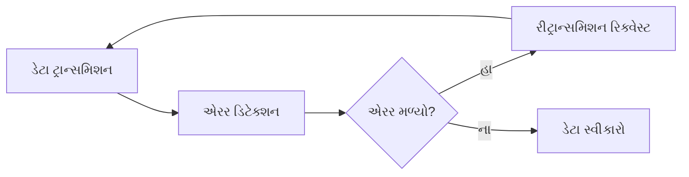

**એરર કંટ્રોલ પદ્ધતિઓ:**

| પદ્ધતિ | **ટેકનીક** | **એપ્લિકેશન** |
|--------|-------------|----------------|
| **પેરિટી ચેક** | સિંગલ બિટ એરર ડિટેક્શન | સિમ્પલ સિસ્ટમ્સ |
| **ચેકસમ** | ગાણિતિક સરવાળો વેરિફિકેશન | TCP/UDP |
| **CRC** | પોલિનોમિયલ ડિવિઝન | Ethernet, Wi-Fi |
| **ARQ** | ઓટોમેટિક રિપીટ રિક્વેસ્ટ | વિશ્વસનીય પ્રોટોકોલ્સ |

**ફ્લો કંટ્રોલ:**

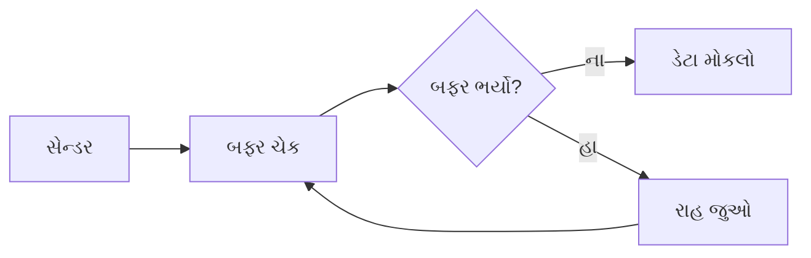

**ફ્લો કંટ્રોલ ટેકનીક્સ:**

- **સ્ટોપ-એન્ડ-વેઇટ**: એક ફ્રેમ મોકલો, ACK ની રાહ જુઓ
- **સ્લાઇડિંગ વિન્ડો**: મલ્ટિપલ ફ્રેમ્સ ટ્રાન્ઝિટમાં
- **બફર મેનેજમેન્ટ**: ઓવરફ્લો અટકાવે છે

**ઇમ્પ્લિમેન્ટેશન:**

- **હાર્ડવેર લેવલ**: બફર સ્ટેટસ સિગ્નલ્સ
- **સોફ્ટવેર લેવલ**: પ્રોટોકોલ એકનોલેજમેન્ટ્સ

**મેમરી ટ્રીક:** "EF - એરર ડિટેક્શન, ફ્લો રેગ્યુલેશન"

## પ્રશ્ન 4(અ) [3 ગુણ]

**Video over IP સમજાવો.**

**જવાબ**:

**વિડિયો ઓવર IP (VoIP):**

- **ટેકનોલોજી**: IP નેટવર્ક્સ પર વિડિયો સિગ્નલ્સ ટ્રાન્સમિટ કરે છે
- **ડિજિટાઇઝેશન**: એનાલોગ વિડિયોને ડિજિટલ પેકેટ્સમાં કન્વર્ટ કરે છે
- **રિયલ-ટાઇમ**: ઓછી લેટન્સી ટ્રાન્સમિશનની જરૂર

**કમ્પોનન્ટ્સ:**

- **એનકોડર**: વિડિયો ડેટાને કમ્પ્રેસ કરે છે
- **નેટવર્ક**: ટ્રાન્સપોર્ટ માટે IP ઇન્ફ્રાસ્ટ્રક્ચર
- **ડીકોડર**: ડેસ્ટિનેશન પર ડીકમ્પ્રેસ કરે છે

**એપ્લિકેશન્સ:**

- **વિડિયો કોન્ફરન્સિંગ**: બિઝનેસ કમ્યુનિકેશન્સ
- **સ્ટ્રીમિંગ**: મનોરંજન સેવાઓ
- **સર્વેલન્સ**: સુરક્ષા સિસ્ટમ્સ

**જરૂરિયાતો:**

- **બેન્ડવિડ્થ**: ઉચ્ચ ડેટા રેટની જરૂર
- **QoS**: કોવાલિટી ઓફ સર્વિસ ગેરંટીઝ

**મેમરી ટ્રીક:** "VIP = વિડિયો ઇન્ટરનેટ પ્રોટોકોલ"

## પ્રશ્ન 4(બ) [4 ગુણ]

**ઇલેક્ટ્રોનિક-મેઇલ તેના પ્રોટોકોલ સાથે સમજાવો.**

**જવાબ**:

**ઇમેઇલ સિસ્ટમ કમ્પોનન્ટ્સ:**

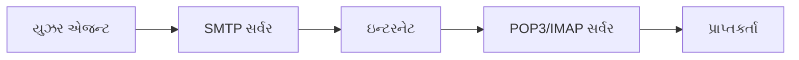

**ઇમેઇલ પ્રોટોકોલ્સ:**

| પ્રોટોકોલ | **કાર્ય** | **પોર્ટ** |
|----------|------------|----------|
| **SMTP** | મેસેજ મોકલો/રિલે કરો | 25, 587 |
| **POP3** | મેસેજ ડાઉનલોડ કરો | 110 |
| **IMAP** | સર્વર-બેસ્ડ એક્સેસ | 143 |

**પ્રોટોકોલ વિગતો:**

- **SMTP**: મોકલવા માટે સિમ્પલ મેઇલ ટ્રાન્સફર પ્રોટોકોલ
- **POP3**: લોકલ ડિવાઇસ પર મેઇલ ડાઉનલોડ કરે છે
- **IMAP**: મેઇલ સર્વર પર રાખે છે, મલ્ટિ-ડિવાઇસ એક્સેસ

**મેસેજ ફ્લો:**

- **કમ્પોઝિશન**: યુઝર મેસેજ બનાવે છે
- **સબમિશન**: SMTP સર્વર પર મોકલે છે
- **ડિલિવરી**: સર્વર પ્રાપ્તકર્તા પર ફોરવર્ડ કરે છે
- **રિટ્રીવલ**: POP3/IMAP મેસેજ ડાઉનલોડ કરે છે

**મેમરી ટ્રીક:** "SPI - SMTP મોકલે, POP3/IMAP મેળવે"

## પ્રશ્ન 4(ક) [7 ગુણ]

**DNS- ડોમેન-નેમ સિસ્ટમની ભૂમિકા સમજાવો DNS રિઝોલ્યુશનની પ્રક્રિયાનું વર્ણન કરો.**

**જવાબ**:

**DNS ભૂમિકા:**

- **નેમ રિઝોલ્યુશન**: ડોમેન નેમ્સને IP એડ્રેસમાં કન્વર્ટ કરે છે
- **હાયરાર્કિકલ સિસ્ટમ**: વિતરિત ડેટાબેસ સ્ટ્રક્ચર
- **ઇન્ટરનેટ નેવિગેશન**: વેબ બ્રાઉઝિંગને યુઝર-ફ્રેન્ડલી બનાવે છે

**DNS રિઝોલ્યુશન પ્રક્રિયા:**

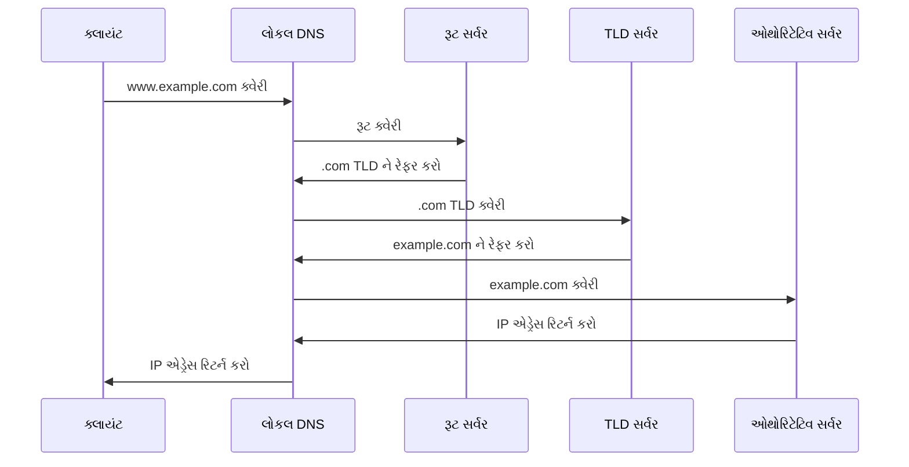

**રિઝોલ્યુશન સ્ટેપ્સ:**

1. **લોકલ કેશ ચેક**: લોકલ DNS કેશ ચેક કરો
2. **રિકર્સિવ ક્વેરી**: લોકલ DNS સર્વરનો સંપર્ક કરો
3. **રૂટ સર્વર**: TLD સર્વર રેફરન્સ મેળવો
4. **TLD સર્વર**: ઓથોરિટેટિવ સર્વર રેફરન્સ મેળવો
5. **ઓથોરિટેટિવ સર્વર**: અંતિમ IP એડ્રેસ મેળવો
6. **રિસ્પોન્સ રિટર્ન**: ક્લાયંટને IP એડ્રેસ પરત કરો

**DNS રેકોર્ડ પ્રકારો:**

- **A રેકોર્ડ**: નેમને IPv4 એડ્રેસ સાથે મેપ કરે છે
- **AAAA રેકોર્ડ**: નેમને IPv6 એડ્રેસ સાથે મેપ કરે છે
- **CNAME**: કેનોનિકલ નેમ એલિયાસ
- **MX**: મેઇલ એક્સચેન્જ સર્વર

**લાભો:**

- **યુઝર ફ્રેન્ડલી**: નંબર્સ નહીં, નેમ્સ યાદ રાખો
- **લોડ ડિસ્ટ્રિબ્યુશન**: મલ્ટિપલ IP એડ્રેસ
- **સર્વિસ લોકેશન**: વિશિષ્ટ સેવાઓ શોધો

**મેમરી ટ્રીક:** "DNS = ડાયરેક્ટરી નેમ સર્વિસ"

## પ્રશ્ન 4(અ OR) [3 ગુણ]

**WWW, HTML સમજાવો.**

**જવાબ**:

**WWW (વર્લ્ડ વાઇડ વેબ):**

- **વ્યાખ્યા**: ઇન્ટરલિંક્ડ ડોક્યુમેન્ટ્સની માહિતી સિસ્ટમ
- **એક્સેસ**: HTTP ઉપયોગ કરીને વેબ બ્રાઉઝર દ્વારા
- **કમ્પોનન્ટ્સ**: વેબ પેજ, લિંક્સ, URLs

**HTML (હાઇપરટેક્સ્ટ માર્કઅપ લેંગ્વેજ):**

- **હેતુ**: વેબ પેજ માટે સ્ટાન્ડર્ડ માર્કઅપ લેંગ્વેજ
- **સ્ટ્રક્ચર**: ટેગ્સ ડોક્યુમેન્ટ એલિમેન્ટ્સ વ્યાખ્યાયિત કરે છે
- **હાઇપરલિંક્સ**: વિવિધ વેબ રિસોર્સ કનેક્ટ કરે છે

**સંબંધ:**

- **WWW**: સિસ્ટમ/પ્લેટફોર્મ
- **HTML**: કન્ટેન્ટ ફોર્મેટ
- **ઇન્ટિગ્રેશન**: HTML WWW કન્ટેન્ટ બનાવે છે

**મેમરી ટ્રીક:** "WWW કન્ટેન્ટ માટે HTML નો ઉપયોગ કરે છે"

## પ્રશ્ન 4(બ OR) [4 ગુણ]

**HTTP અને FTP સમજાવો.**

**જવાબ**:

**પ્રોટોકોલ સરખામણી:**

| લક્ષણ | **HTTP** | **FTP** |
|-------|----------|---------|
| **હેતુ** | વેબ પેજ ટ્રાન્સફર | ફાઇલ ટ્રાન્સફર |
| **પોર્ટ** | 80 (HTTP), 443 (HTTPS) | 21 (કંટ્રોલ), 20 (ડેટા) |
| **કનેક્શન** | સ્ટેટલેસ | સ્ટેટફુલ |
| **સુરક્ષા** | સુરક્ષા માટે HTTPS | સુરક્ષા માટે FTPS |

**HTTP (હાઇપરટેક્સ્ટ ટ્રાન્સફર પ્રોટોકોલ):**

- **કાર્ય**: વેબ માટે રિક્વેસ્ટ-રિસ્પોન્સ પ્રોટોકોલ
- **મેથડ્સ**: GET, POST, PUT, DELETE
- **સ્ટેટલેસ**: દરેક રિક્વેસ્ટ સ્વતંત્ર

**FTP (ફાઇલ ટ્રાન્સફર પ્રોટોકોલ):**

- **કાર્ય**: સિસ્ટમ્સ વચ્ચે ફાઇલો અપલોડ/ડાઉનલોડ
- **મોડ્સ**: એક્ટિવ અને પેસિવ
- **ઓથેન્ટિકેશન**: યુઝરનેમ/પાસવર્ડ જરૂરી

**એપ્લિકેશન્સ:**

- **HTTP**: વેબ બ્રાઉઝિંગ, API કોલ્સ
- **FTP**: ફાઇલ શેરિંગ, વેબસાઇટ મેઇન્ટેનન્સ

**મેમરી ટ્રીક:** "HF - HTTP હાઇપરટેક્સ્ટ માટે, FTP ફાઇલો માટે"

## પ્રશ્ન 4(ક OR) [7 ગુણ]

**કનેક્શન ઓરિએન્ટેડ અને કનેક્શન લેસ નેટવર્કના સંબંધમાં ટ્રાન્સપોર્ટ લેયરમાં TCP અને UDP પ્રોટોકોલ સમજાવો.**

**જવાબ**:

**ટ્રાન્સપોર્ટ લેયર પ્રોટોકોલ્સ:**

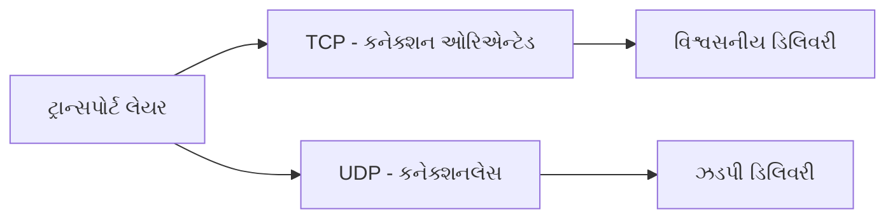

**પ્રોટોકોલ સરખામણી:**

| લક્ષણ | **TCP** | **UDP** |
|-------|---------|---------|
| **કનેક્શન** | કનેક્શન-ઓરિએન્ટેડ | કનેક્શનલેસ |
| **વિશ્વસનીયતા** | ગેરંટીડ ડિલિવરી | બેસ્ટ એફર્ટ |
| **સ્પીડ** | ધીમું (ઓવરહેડ) | ઝડપી (મિનિમલ ઓવરહેડ) |
| **હેડર સાઇઝ** | 20 બાઇટ્સ | 8 બાઇટ્સ |
| **ફ્લો કંટ્રોલ** | હા | ના |
| **એરર કંટ્રોલ** | હા | મર્યાદિત |

**TCP (ટ્રાન્સમિશન કંટ્રોલ પ્રોટોકોલ):**

- **થ્રી-વે હેન્ડશેક**: SYN, SYN-ACK, ACK
- **વિશ્વસનીય**: એકનોલેજમેન્ટ અને રીટ્રાન્સમિશન
- **ફ્લો કંટ્રોલ**: બફર ઓવરફ્લો અટકાવે છે
- **એપ્લિકેશન્સ**: વેબ બ્રાઉઝિંગ, ઇમેઇલ, ફાઇલ ટ્રાન્સફર

**UDP (યુઝર ડેટાગ્રામ પ્રોટોકોલ):**

- **કોઈ કનેક્શન સેટઅપ નહીં**: સીધું ડેટા ટ્રાન્સમિશન
- **લાઇટવેઇટ**: મિનિમલ પ્રોટોકોલ ઓવરહેડ
- **કોઈ ગેરંટી નહીં**: ફાયર-એન્ડ-ફોરગેટ એપ્રોચ
- **એપ્લિકેશન્સ**: વિડિયો સ્ટ્રીમિંગ, DNS, ગેમિંગ

**કનેક્શન મોડલ્સ:**

- **કનેક્શન-ઓરિએન્ટેડ**: સ્થાપિત, ટ્રાન્સફર, સમાપ્ત
- **કનેક્શનલેસ**: સેટઅપ વિના સીધું ટ્રાન્સમિશન

**સિલેક્શન માપદંડ:**

- **TCP ઉપયોગ કરો**: જ્યારે વિશ્વસનીયતા મહત્વપૂર્ણ હોય
- **UDP ઉપયોગ કરો**: જ્યારે સ્પીડ વધુ મહત્વપૂર્ણ હોય

**મેમરી ટ્રીક:** "TCP = સંપૂર્ણ, UDP = અલ્ટ્રા-ફાસ્ટ"

## પ્રશ્ન 5(અ) [3 ગુણ]

**હેકિંગ અને તેની સંબંધિત સાવચેતીઓનું વર્ણન કરો.**

**જવાબ**:

**હેકિંગ વ્યાખ્યા:**

- **અનધિકૃત પ્રવેશ**: કમ્પ્યુટર સિસ્ટમમાં પ્રવેશ
- **દુષ્ટ હેતુ**: ડેટા ચોરી, સુધારો અથવા નાશ
- **સુરક્ષા ભંગ**: સિસ્ટમ નબળાઈઓનો ગેરફાયદો

**હેકિંગના પ્રકારો:**

- **એથિકલ હેકિંગ**: અધિકૃત સુરક્ષા પરીક્ષણ
- **મેલિશિયસ હેકિંગ**: ગુનાહિત પ્રવૃત્તિઓ
- **સોશિયલ એન્જિનિયરિંગ**: માનવીય વર્તણૂકની હેરાફેરી

**સાવચેતીઓ:**

| સુરક્ષા માપ | **અમલીકરણ** |
|-------------|--------------|
| **મજબૂત પાસવર્ડ** | જટિલ, અનન્ય પાસવર્ડ |
| **સોફ્ટવેર અપડેટ્સ** | નિયમિત પેચ અને અપડેટ્સ |
| **ફાયરવોલ** | નેટવર્ક એક્સેસ કંટ્રોલ |
| **એન્ટિવાયરસ** | મેલવેર ડિટેક્શન અને દૂર કરવું |
| **બેકઅપ** | નિયમિત ડેટા બેકઅપ |
| **યુઝર ટ્રેનિંગ** | સુરક્ષા જાગરૂકતા કાર્યક્રમો |

**મેમરી ટ્રીક:** "HSPFAB - હેકિંગ પાસવર્ડ, ફાયરવોલ, એન્ટિવાયરસ, બેકઅપથી અટકાવાય"

## પ્રશ્ન 5(બ) [4 ગુણ]

**IPSec આર્કિટેક્ચર સમજાવો.**

**જવાબ**:

**IPSec (ઇન્ટરનેટ પ્રોટોકોલ સિક્યુરિટી):**

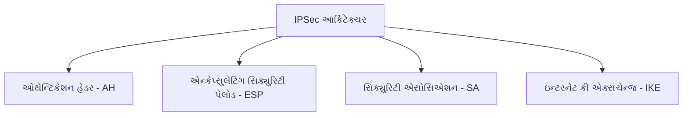

**IPSec કમ્પોનન્ટ્સ:**

| કમ્પોનન્ટ | **કાર્ય** |
|-----------|------------|
| **AH** | ઓથેન્ટિકેશન અને ઇન્ટેગ્રિટી |
| **ESP** | ગુપ્તતા અને ઓથેન્ટિકેશન |
| **SA** | સુરક્ષા પેરામીટર એગ્રીમેન્ટ |
| **IKE** | કી મેનેજમેન્ટ પ્રોટોકોલ |

**ઓપરેટિંગ મોડ્સ:**

- **ટ્રાન્સપોર્ટ મોડ**: માત્ર પેલોડને સુરક્ષા આપે છે
- **ટનલ મોડ**: સંપૂર્ણ IP પેકેટને સુરક્ષા આપે છે

**સુરક્ષા સેવાઓ:**

- **ઓથેન્ટિકેશન**: મોકલનારની ઓળખ ચકાસો
- **ઇન્ટેગ્રિટી**: ડેટા અપરિવર્તિત છે તેની ખાતરી
- **ગુપ્તતા**: ડેટા કન્ટેન્ટ એન્ક્રિપ્ટ કરો
- **એન્ટિ-રિપ્લે**: પેકેટ રિપ્લે એટેક અટકાવો

**મેમરી ટ્રીક:** "AISE - AH, IPSec, SA, ESP"

## પ્રશ્ન 5(ક) [7 ગુણ]

**નેટવર્ક સુરક્ષા ટોપોલોજી સમજાવો.**

**જવાબ**:

**નેટવર્ક સુરક્ષા ટોપોલોજીઓ:**

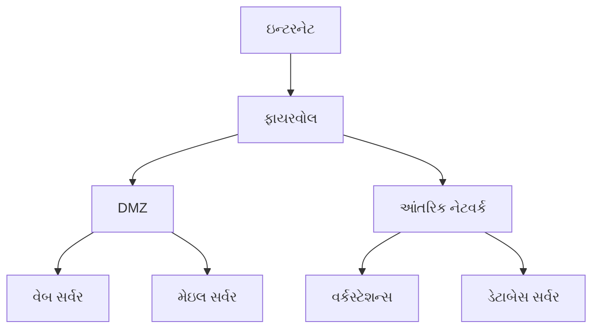

**સુરક્ષા ઝોન્સ:**

| ઝોન | **હેતુ** | **સુરક્ષા સ્તર** |
|------|----------|------------------|
| **ઇન્ટરનેટ** | બાહ્ય અવિશ્વસનીય નેટવર્ક | સૌથી ઓછું |
| **DMZ** | સેમિ-ટ્રસ્ટેડ પબ્લિક સેવાઓ | મધ્યમ |
| **આંતરિક** | ખાનગી વિશ્વસનીય નેટવર્ક | સૌથી વધુ |

**ટોપોલોજી કમ્પોનન્ટ્સ:**

- **પેરિમીટર સિક્યુરિટી**: ફાયરવોલ, IDS/IPS
- **નેટવર્ક સેગમેન્ટેશન**: VLANs, સબનેટ્સ
- **એક્સેસ કંટ્રોલ**: ઓથેન્ટિકેશન, ઓથોરાઇઝેશન
- **મોનિટરિંગ**: લોગિંગ, SIEM સિસ્ટમ્સ

**સુરક્ષા સિદ્ધાન્તો:**

- **ડિફેન્સ ઇન ડેપ્થ**: મલ્ટિપલ સુરક્ષા સ્તરો
- **લીસ્ટ પ્રિવિલેજ**: મિનિમમ જરૂરી એક્સેસ
- **નેટવર્ક આઇસોલેશન**: ક્રિટિકલ સિસ્ટમ્સ અલગ કરો

**અમલીકરણ વ્યૂહરચનાઓ:**

- **ફાયરવોલ નિયમો**: ટ્રાફિક ફ્લો કંટ્રોલ કરો
- **VPN એક્સેસ**: સુરક્ષિત રિમોટ કનેક્શન્સ
- **નેટવર્ક મોનિટરિંગ**: ધમકીઓ શોધો
- **ઇન્સિડન્ટ રિસ્પોન્સ**: સુરક્ષા ઘટનાઓ હેન્ડલ કરો

**લાભો:**

- **રિસ્ક રિડક્શન**: એટેક સર્ફેસ મિનિમાઇઝ કરો
- **કમ્પ્લાયન્સ**: નિયમન જરૂરિયાતો પૂરી કરો
- **બિઝનેસ કન્ટિન્યુટી**: ઓપરેશન્સને સુરક્ષા આપો

**મેમરી ટ્રીક:** "NST = નેટવર્ક સિક્યુરિટી ટોપોલોજી ડિઝાઇન દ્વારા"

## પ્રશ્ન 5(અ OR) [3 ગુણ]

**ISO સમજાવો અને તે માહિતી સુરક્ષામાં કેવી રીતે ફાળો આપે છે?**

**જવાબ**:

**ISO (ઇન્ટરનેશનલ ઓર્ગેનાઇઝેશન ફોર સ્ટેન્ડર્ડાઇઝેશન):**

- **ગ્લોબલ સ્ટેન્ડર્ડ્સ**: આંતરરાષ્ટ્રીય ધોરણો વિકસાવે છે
- **ક્વોલિટી એશ્યુરન્સ**: સતત પ્રથાઓની ખાતરી કરે છે
- **બેસ્ટ પ્રેક્ટિસિસ**: અમલીકરણ માટે ફ્રેમવર્ક પ્રદાન કરે છે

**ISO 27001 - ઇન્ફર્મેશન સિક્યુરિટી:**

- **ISMS**: ઇન્ફર્મેશન સિક્યુરિટી મેનેજમેન્ટ સિસ્ટમ
- **રિસ્ક મેનેજમેન્ટ**: સુરક્ષા માટે વ્યવસ્થિત અભિગમ
- **સતત સુધારણા**: નિયમિત સમીક્ષા અને અપડેટ્સ

**ઇન્ફર્મેશન સિક્યુરિટીમાં યોગદાન:**

- **ફ્રેમવર્ક**: સુરક્ષા માટે સંરચિત અભિગમ
- **કમ્પ્લાયન્સ**: નિયમન જરૂરિયાતો પૂરી કરો
- **રિસ્ક એસેસમેન્ટ**: ધમકીઓ ઓળખો અને ઘટાડો

**લાભો:**

- **સ્ટેન્ડર્ડાઇઝેશન**: સામાન્ય સુરક્ષા ભાષા
- **વિશ્વસનીયતા**: આંતરરાષ્ટ્રીય માન્યતા
- **સુધારણા**: ચાલુ સુરક્ષા વૃદ્ધિ

**મેમરી ટ્રીક:** "ISO = ઇન્ટરનેશનલ સિક્યુરિટી ઓર્ગેનાઇઝેશન"

## પ્રશ્ન 5(બ OR) [4 ગુણ]

**સમપ્રમાણ અને અસમપ્રમાણ એન્ક્રિપ્શન અલ્ગોરિધમ્સ વચ્ચે તફાવત આપો.**

**જવાબ**:

**એન્ક્રિપ્શન અલ્ગોરિધમ સરખામણી:**

| લક્ષણ | **સમપ્રમાણ** | **અસમપ્રમાણ** |
|-------|---------------|----------------|
| **કીઓ** | સિંગલ શેર્ડ કી | કી પેર (પબ્લિક/પ્રાઇવેટ) |
| **સ્પીડ** | ઝડપી | ધીમું |
| **કી ડિસ્ટ્રિબ્યુશન** | મુશ્કેલ | સરળ |
| **સ્કેલેબિલિટી** | નબળું (n²-1 કીઓ) | બેહતર |
| **સુરક્ષા** | કી ગુપ્તતા પર આધાર | ગાણિતિક જટિલતા |

**સમપ્રમાણ એન્ક્રિપ્શન:**

- **ઉદાહરણો**: AES, DES, 3DES
- **પ્રક્રિયા**: સમાન કી એન્ક્રિપ્ટ અને ડિક્રિપ્ટ કરે છે
- **પડકાર**: સુરક્ષિત કી ડિસ્ટ્રિબ્યુશન

**અસમપ્રમાણ એન્ક્રિપ્શન:**

- **ઉદાહરણો**: RSA, ECC, Diffie-Hellman
- **પ્રક્રિયા**: પબ્લિક કી એન્ક્રિપ્ટ કરે, પ્રાઇવેટ કી ડિક્રિપ્ટ કરે
- **ફાયદો**: કી ડિસ્ટ્રિબ્યુશન સમસ્યા નથી

**હાઇબ્રિડ અભિગમ:**

- **કોમ્બિનેશન**: બંને પ્રકારનો સાથે ઉપયોગ
- **પદ્ધતિ**: કી એક્સચેન્જ માટે અસમપ્રમાણ, ડેટા માટે સમપ્રમાણ

**એપ્લિકેશન્સ:**

- **સમપ્રમાણ**: બલ્ક ડેટા એન્ક્રિપ્શન
- **અસમપ્રમાણ**: ડિજિટલ સિગ્નેચર, કી એક્સચેન્જ

**મેમરી ટ્રીક:** "SA = સમપ્રમાણ શેર્ડ, અસમપ્રમાણ અલગ"

## પ્રશ્ન 5(ક OR) [7 ગુણ]

**IEmail સુરક્ષાને તેના standards સાથે સમજાવો.**

**જવાબ**:

**ઇમેઇલ સુરક્ષા પડકારો:**

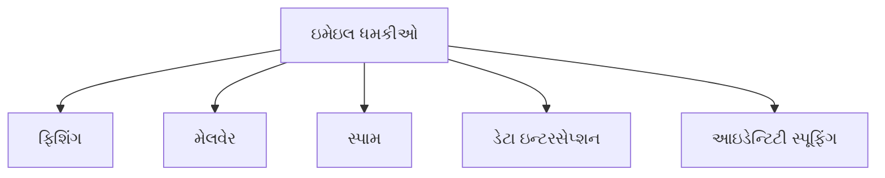

**ઇમેઇલ સુરક્ષા સ્ટેન્ડર્ડ્સ:**

| સ્ટેન્ડર્ડ | **હેતુ** | **કાર્ય** |
|-----------|-----------|-----------|
| **S/MIME** | સુરક્ષિત ઇમેઇલ કન્ટેન્ટ | એન્ક્રિપ્શન અને ડિજિટલ સિગ્નેચર |
| **PGP** | પ્રિટી ગુડ પ્રાઇવસી | એન્ડ-ટુ-એન્ડ એન્ક્રિપ્શન |
| **TLS** | ટ્રાન્સપોર્ટ સુરક્ષા | સુરક્ષિત ઇમેઇલ ટ્રાન્સમિશન |
| **SPF** | સેન્ડર ઓથેન્ટિકેશન | ઇમેઇલ સ્પૂફિંગ અટકાવો |
| **DKIM** | મેસેજ ઇન્ટેગ્રિટી | ડિજિટલ સિગ્નેચર વેરિફિકેશન |
| **DMARC** | પોલિસી એન્ફોર્સમેન્ટ | ઇમેઇલ ઓથેન્ટિકેશન પોલિસી |

**સુરક્ષા મેકેનિઝમ્સ:**

- **એન્ક્રિપ્શન**: મેસેજ કન્ટેન્ટ સુરક્ષા
- **ડિજિટલ સિગ્નેચર**: સેન્ડર આઇડેન્ટિટી વેરિફાય કરો
- **ઓથેન્ટિકેશન**: મેસેજ ઓરિજિન કન્ફર્મ કરો
- **ઇન્ટેગ્રિટી**: મેસેજ અપરિવર્તિત છે તેની ખાતરી

**અમલીકરણ સ્તરો:**

- **ટ્રાન્સપોર્ટ લેયર**: TLS/SSL એન્ક્રિપ્શન
- **મેસેજ લેયર**: S/MIME, PGP એન્ક્રિપ્શન
- **પોલિસી લેયર**: SPF, DKIM, DMARC

**બેસ્ટ પ્રેક્ટિસિસ:**

- **યુઝર એજ્યુકેશન**: ફિશિંગ પ્રયાસો ઓળખો
- **ગેટવે ફિલ્ટરિંગ**: દુષ્ટ ઇમેઇલ્સ બ્લોક કરો
- **રેગ્યુલર અપડેટ્સ**: સુરક્ષા સોફ્ટવેર અપ-ટુ-ડેટ રાખો
- **બેકઅપ સિસ્ટમ્સ**: ડેટા લોસ સામે સુરક્ષા

**લાભો:**

- **ગુપ્તતા**: ખાનગી સંવાદ
- **ઓથેન્ટિકેશન**: વેરિફાઇડ સેન્ડર્સ
- **કમ્પ્લાયન્સ**: નિયમન જરૂરિયાતો પૂરી કરો
- **ટ્રસ્ટ**: સુરક્ષિત બિઝનેસ કમ્યુનિકેશન્સ

**મેમરી ટ્રીક:** "SPTSD = S/MIME, PGP, TLS, SPF, DKIM ઇમેઇલ સુરક્ષા આપે છે"
