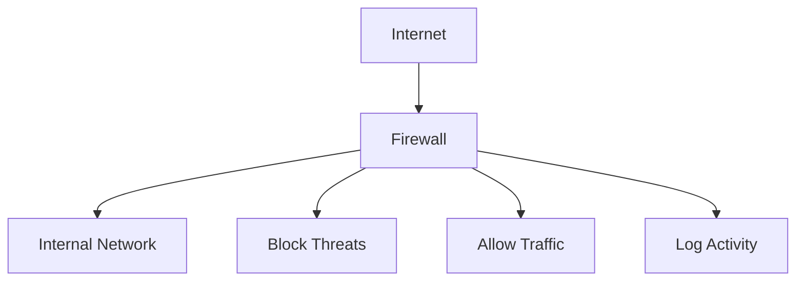
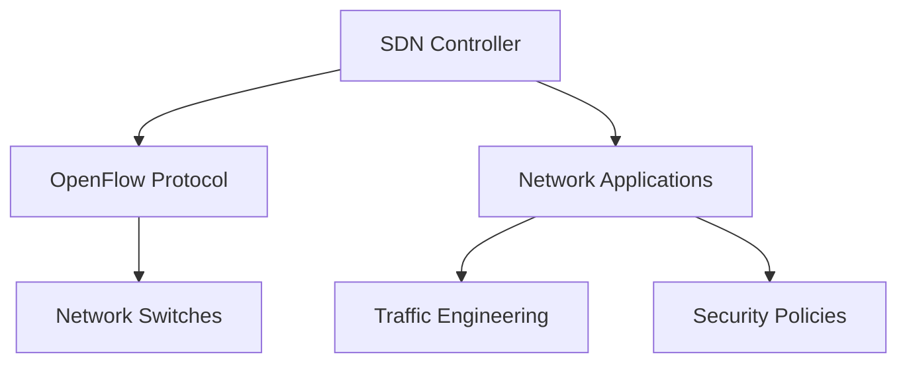
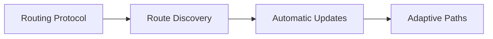
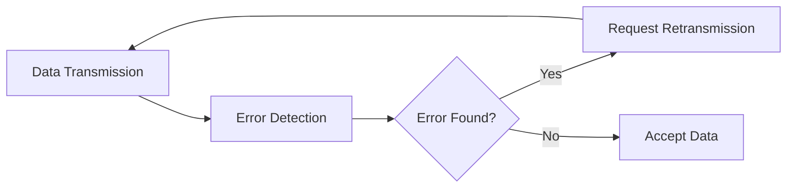
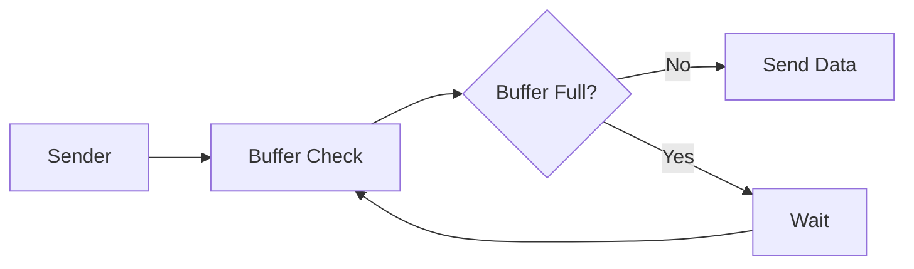
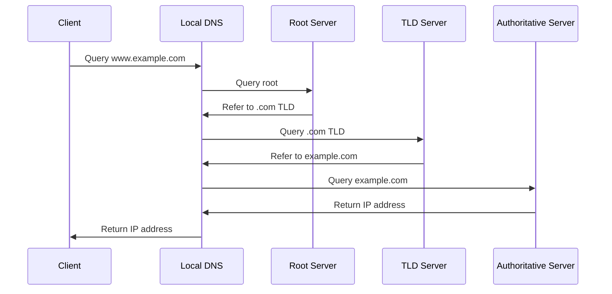
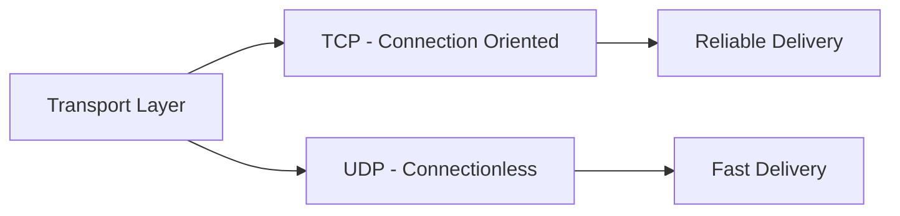
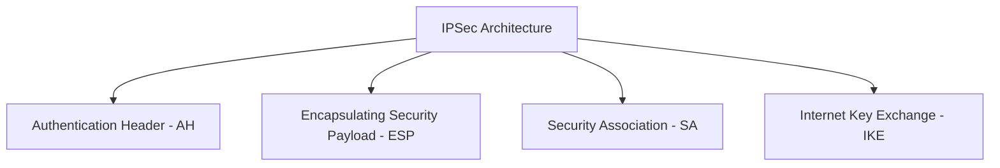
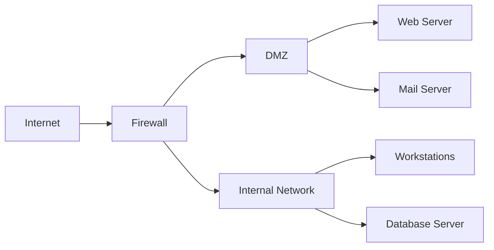
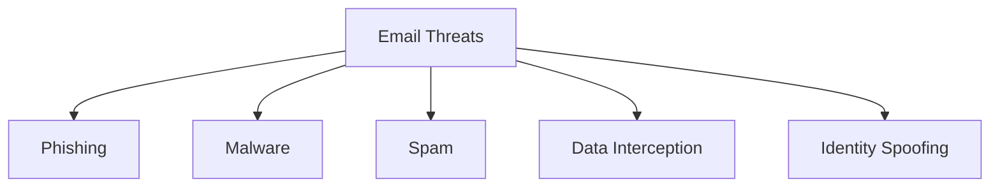

## Question 1(a) [3 marks]

**List Various network Topologies of computer network and explain any one.**

**Answer**:

**Table: Network Topologies**

| Topology | Description |
|----------|-------------|
| **Star** | Central hub connects all devices |
| **Ring** | Devices connected in circular chain |
| **Bus** | Single cable backbone connection |
| **Mesh** | Every device connects to every other |
| **Tree** | Hierarchical branching structure |
| **Hybrid** | Combination of multiple topologies |

**Star Topology Explanation:**

- **Central Hub**: All devices connect to one central point
- **Easy Installation**: Simple to add/remove devices
- **Single Point Failure**: Hub failure affects entire network

**Mnemonic:** "SRBMTH - Star Ring Bus Mesh Tree Hybrid"

## Question 1(b) [4 marks]

**Compare LAN, WAN and MAN.**

**Answer**:

**Comparison Table:**

| Parameter | **LAN** | **MAN** | **WAN** |
|-----------|---------|---------|---------|
| **Coverage** | Building/Campus | City/Metropolitan | Country/Global |
| **Speed** | Very High (1-100 Gbps) | High (10-100 Mbps) | Medium (1-100 Mbps) |
| **Cost** | Low | Medium | High |
| **Ownership** | Private | Public/Private | Public |

**Key Points:**

- **LAN**: Local Area Network for small areas
- **MAN**: Metropolitan Area Network for cities
- **WAN**: Wide Area Network for large distances

**Mnemonic:** "LMW - Local Metropolitan Wide"

## Question 1(c) [7 marks]

**Draw the layered architecture of OSI reference model and write at least two services provided by each layer of the model.**

**Answer**:

**Services by Each Layer:**

| Layer | **Services** |
|-------|-------------|
| **Application (7)** | Email services, File transfer |
| **Presentation (6)** | Data encryption, Data compression |
| **Session (5)** | Session establishment, Session termination |
| **Transport (4)** | Flow control, Error correction |
| **Network (3)** | Routing, Path determination |
| **Data Link (2)** | Frame synchronization, Error detection |
| **Physical (1)** | Bit transmission, Signal conversion |

**Mnemonic:** "All People Seem To Need Data Processing"

## Question 1(c OR) [7 marks]

**Explain Each layer of TCP/IP Model with its protocol.**

**Answer**:

**TCP/IP Model Layers:**

| Layer | **Protocols** | **Function** |
|-------|---------------|--------------|
| **Application** | HTTP, FTP, SMTP, DNS | User applications |
| **Transport** | TCP, UDP | End-to-end delivery |
| **Internet** | IP, ICMP, ARP | Routing packets |
| **Network Access** | Ethernet, Wi-Fi | Physical transmission |

**Key Features:**

- **Simplified Model**: Only 4 layers vs OSI's 7
- **Protocol Suite**: Complete networking solution
- **Internet Standard**: Basis of modern internet

**Mnemonic:** "ATIN - Application Transport Internet Network"

## Question 2(a) [3 marks]

**Explain functions of following network devices: Repeater, Hub**

**Answer**:

**Device Functions:**

| Device | **Function** | **Layer** |
|--------|--------------|-----------|
| **Repeater** | Signal amplification, Range extension | Physical (1) |
| **Hub** | Signal broadcasting, Collision domain sharing | Physical (1) |

**Details:**

- **Repeater**: Regenerates weak signals over long distances
- **Hub**: Connects multiple devices in star topology
- **Shared Medium**: Both create single collision domain

**Mnemonic:** "RH - Repeat Hub signals"

## Question 2(b) [4 marks]

**Explain the following term 1) FDDI 2) ARP, RARP**

**Answer**:

**FDDI (Fiber Distributed Data Interface):**

- **Technology**: 100 Mbps fiber optic network
- **Topology**: Dual ring for fault tolerance
- **Application**: Backbone networks, high reliability

**ARP (Address Resolution Protocol):**

- **Function**: Maps IP address to MAC address
- **Process**: Broadcasts request, receives reply

**RARP (Reverse ARP):**

- **Function**: Maps MAC address to IP address
- **Usage**: Diskless workstations, boot process

**Mnemonic:** "FAR - FDDI ARP RARP"

## Question 2(c) [7 marks]

**Explain the Function of firewall in network security with principles and Kerberos-concept.**

**Answer**:

**Firewall Functions:**

**Firewall Principles:**

- **Packet Filtering**: Examines packet headers
- **Stateful Inspection**: Tracks connection states
- **Application Gateway**: Deep packet inspection

**Kerberos Concept:**

- **Authentication Service**: Secure user verification
- **Ticket System**: Time-limited access tokens
- **Three-party Protocol**: Client, Server, Key Distribution Center

**Security Benefits:**

- **Access Control**: Prevents unauthorized access
- **Network Protection**: Shields internal resources

**Mnemonic:** "FPK - Firewall Protects with Kerberos"

## Question 2(a OR) [3 marks]

**Explain functions of following network devices: Switch, Router**

**Answer**:

**Device Functions:**

| Device | **Function** | **Layer** |
|--------|--------------|-----------|
| **Switch** | MAC address learning, Frame forwarding | Data Link (2) |
| **Router** | IP routing, Path selection | Network (3) |

**Details:**

- **Switch**: Creates separate collision domains per port
- **Router**: Connects different networks, makes routing decisions
- **Intelligence**: Switch learns MAC, Router maintains routing table

**Mnemonic:** "SR - Switch Routes intelligently"

## Question 2(b OR) [4 marks]

**Explain the following term 1) CDDI 2) DHCP and BOOTP**

**Answer**:

**CDDI (Copper Distributed Data Interface):**

- **Technology**: FDDI over copper cables
- **Speed**: 100 Mbps over twisted pair
- **Cost**: Cheaper alternative to fiber FDDI

**DHCP (Dynamic Host Configuration Protocol):**

- **Function**: Automatic IP address assignment
- **Process**: Discover, Offer, Request, Acknowledge
- **Benefits**: Centralized IP management

**BOOTP (Bootstrap Protocol):**

- **Function**: Network bootstrap for diskless clients
- **Static**: Fixed IP address assignment
- **Predecessor**: Earlier version of DHCP

**Mnemonic:** "CDB - CDDI DHCP BOOTP"

## Question 2(c OR) [7 marks]

**Explain Software define network(SDN) with its Architecture, Application, Advantage and limitation.**

**Answer**:

**SDN Architecture:**

- **Control Plane**: Centralized network intelligence
- **Data Plane**: Packet forwarding devices
- **Application Plane**: Network applications and services

**Applications:**

- **Cloud Computing**: Dynamic resource allocation
- **Network Virtualization**: Multiple virtual networks
- **Traffic Engineering**: Optimized path selection

**Advantages:**

- **Centralized Control**: Simplified network management
- **Programmability**: Custom network behaviors
- **Flexibility**: Rapid service deployment

**Limitations:**

- **Single Point Failure**: Controller dependency
- **Scalability**: Performance bottlenecks
- **Security**: New attack vectors

**Mnemonic:** "SCAP - Software Control Application Programmable"

## Question 3(a) [3 marks]

**Find the class of following IP address.**
**1) 01111000 00001111 10101010 11000000**
**2) 11101000 01010101 11111111 11000011**

**Answer**:

**IP Address Classification:**

| Binary Address | **Decimal** | **First Octet** | **Class** |
|----------------|-------------|-----------------|-----------|
| 01111000... | 120.15.170.192 | 120 (64-127) | **Class A** |
| 11101000... | 232.85.255.195 | 232 (224-239) | **Class D** |

**Class Ranges:**

- **Class A**: 1-126 (0xxxxxxx)
- **Class B**: 128-191 (10xxxxxx)
- **Class C**: 192-223 (110xxxxx)
- **Class D**: 224-239 (1110xxxx)

**Results:**

- **First IP**: Class A (Unicast)
- **Second IP**: Class D (Multicast)

**Mnemonic:** "ABCD - A(1-126) B(128-191) C(192-223) D(224-239)"

## Question 3(b) [4 marks]

**Differentiate IPv4 and IPv6.**

**Answer**:

**IPv4 vs IPv6 Comparison:**

| Feature | **IPv4** | **IPv6** |
|---------|----------|----------|
| **Address Length** | 32 bits | 128 bits |
| **Address Format** | Dotted decimal | Hexadecimal |
| **Address Space** | 4.3 billion | 340 undecillion |
| **Header Size** | Variable (20-60 bytes) | Fixed (40 bytes) |
| **Security** | Optional (IPSec) | Built-in (IPSec) |
| **Configuration** | Manual/DHCP | Auto-configuration |

**Key Differences:**

- **Addressing**: IPv6 provides vastly more addresses
- **Security**: IPv6 has mandatory security features
- **Performance**: IPv6 has simplified header structure

**Mnemonic:** "IPv4 to IPv6 = More addresses, Better security"

## Question 3(c) [7 marks]

**Explain Static and Dynamic Routing Algorithms.**

**Answer**:

**Static Routing:**

**Dynamic Routing:**

**Comparison Table:**

| Aspect | **Static Routing** | **Dynamic Routing** |
|--------|-------------------|-------------------|
| **Configuration** | Manual setup | Automatic discovery |
| **Adaptability** | No adaptation | Adapts to changes |
| **Resource Usage** | Low CPU/Memory | Higher CPU/Memory |
| **Scalability** | Poor for large networks | Good for large networks |
| **Protocols** | None required | RIP, OSPF, BGP |

**Applications:**

- **Static**: Small networks, specific paths
- **Dynamic**: Large networks, fault tolerance

**Mnemonic:** "SD - Static=Simple, Dynamic=Automatic"

## Question 3(a OR) [3 marks]

**Explain CIDR. How does it differ from traditional IP address allocation methods?**

**Answer**:

**CIDR (Classless Inter-Domain Routing):**

- **Concept**: Variable length subnet masking
- **Notation**: IP address/prefix length (e.g., 192.168.1.0/24)
- **Flexibility**: Subnets of any size

**Traditional vs CIDR:**

| Method | **Allocation** | **Efficiency** |
|--------|----------------|----------------|
| **Traditional** | Fixed class boundaries | Wasteful (Class B = 65,536 IPs) |
| **CIDR** | Variable subnet sizes | Efficient allocation |

**Benefits:**

- **Address Conservation**: Reduces IP address waste
- **Route Aggregation**: Summarizes multiple routes

**Mnemonic:** "CIDR = Classless Intelligent Address Routing"

## Question 3(b OR) [4 marks]

**Describe DSL technology with its types, advantages and limitations.**

**Answer**:

**DSL (Digital Subscriber Line):**

- **Technology**: High-speed internet over telephone lines
- **Frequency**: Uses higher frequencies than voice

**DSL Types:**

| Type | **Speed** | **Application** |
|------|-----------|-----------------|
| **ADSL** | Asymmetric (faster download) | Home users |
| **SDSL** | Symmetric (equal up/down) | Business |
| **VDSL** | Very high speed | Short distances |

**Advantages:**

- **Always-on Connection**: No dial-up required
- **Existing Infrastructure**: Uses phone lines
- **Cost-effective**: Affordable high-speed access

**Limitations:**

- **Distance Dependent**: Speed decreases with distance
- **Line Quality**: Requires good copper lines
- **Availability**: Not available everywhere

**Mnemonic:** "DSL = Digital Speed Limited by distance"

## Question 3(c OR) [7 marks]

**Explain error control and flow control at data link layer in detail.**

**Answer**:

**Error Control:**

**Error Control Methods:**

| Method | **Technique** | **Application** |
|--------|---------------|-----------------|
| **Parity Check** | Single bit error detection | Simple systems |
| **Checksum** | Mathematical sum verification | TCP/UDP |
| **CRC** | Polynomial division | Ethernet, Wi-Fi |
| **ARQ** | Automatic Repeat Request | Reliable protocols |

**Flow Control:**

**Flow Control Techniques:**

- **Stop-and-Wait**: Send one frame, wait for ACK
- **Sliding Window**: Multiple frames in transit
- **Buffer Management**: Prevents overflow

**Implementation:**

- **Hardware Level**: Buffer status signals
- **Software Level**: Protocol acknowledgments

**Mnemonic:** "EF - Error detection, Flow regulation"

## Question 4(a) [3 marks]

**Explain video over IP.**

**Answer**:

**Video over IP (VoIP):**

- **Technology**: Transmits video signals over IP networks
- **Digitization**: Converts analog video to digital packets
- **Real-time**: Requires low latency transmission

**Components:**

- **Encoder**: Compresses video data
- **Network**: IP infrastructure for transport
- **Decoder**: Decompresses at destination

**Applications:**

- **Video Conferencing**: Business communications
- **Streaming**: Entertainment services
- **Surveillance**: Security systems

**Requirements:**

- **Bandwidth**: High data rate needs
- **QoS**: Quality of Service guarantees

**Mnemonic:** "VIP = Video Internet Protocol"

## Question 4(b) [4 marks]

**Explain Electronic-Mail with its protocol.**

**Answer**:

**Email System Components:**

**Email Protocols:**

| Protocol | **Function** | **Port** |
|----------|--------------|----------|
| **SMTP** | Send/relay messages | 25, 587 |
| **POP3** | Download messages | 110 |
| **IMAP** | Server-based access | 143 |

**Protocol Details:**

- **SMTP**: Simple Mail Transfer Protocol for sending
- **POP3**: Downloads mail to local device
- **IMAP**: Keeps mail on server, multi-device access

**Message Flow:**

- **Composition**: User creates message
- **Submission**: SMTP sends to server
- **Delivery**: Server forwards to recipient
- **Retrieval**: POP3/IMAP downloads message

**Mnemonic:** "SPI - SMTP sends, POP3/IMAP receives"

## Question 4(c) [7 marks]

**Explain Role of DNS- Domain Name System Describe the process of DNS resolution.**

**Answer**:

**DNS Role:**

- **Name Resolution**: Converts domain names to IP addresses
- **Hierarchical System**: Distributed database structure
- **Internet Navigation**: Makes web browsing user-friendly

**DNS Resolution Process:**

**Resolution Steps:**

1. **Local Cache Check**: Check local DNS cache
2. **Recursive Query**: Contact local DNS server
3. **Root Server**: Get TLD server reference
4. **TLD Server**: Get authoritative server reference
5. **Authoritative Server**: Get final IP address
6. **Response Return**: IP address returned to client

**DNS Record Types:**

- **A Record**: Maps name to IPv4 address
- **AAAA Record**: Maps name to IPv6 address
- **CNAME**: Canonical name alias
- **MX**: Mail exchange server

**Benefits:**

- **User Friendly**: Remember names, not numbers
- **Load Distribution**: Multiple IP addresses
- **Service Location**: Find specific services

**Mnemonic:** "DNS = Directory Name Service"

## Question 4(a OR) [3 marks]

**Explain WWW, HTML.**

**Answer**:

**WWW (World Wide Web):**

- **Definition**: Information system of interlinked documents
- **Access**: Through web browsers using HTTP
- **Components**: Web pages, links, URLs

**HTML (HyperText Markup Language):**

- **Purpose**: Standard markup language for web pages
- **Structure**: Tags define document elements
- **Hyperlinks**: Connect different web resources

**Relationship:**

- **WWW**: The system/platform
- **HTML**: The content format
- **Integration**: HTML creates WWW content

**Mnemonic:** "WWW uses HTML for content"

## Question 4(b OR) [4 marks]

**Explain HTTP and FTP.**

**Answer**:

**Protocol Comparison:**

| Feature | **HTTP** | **FTP** |
|---------|----------|---------|
| **Purpose** | Web page transfer | File transfer |
| **Port** | 80 (HTTP), 443 (HTTPS) | 21 (control), 20 (data) |
| **Connection** | Stateless | Stateful |
| **Security** | HTTPS for security | FTPS for security |

**HTTP (HyperText Transfer Protocol):**

- **Function**: Request-response protocol for web
- **Methods**: GET, POST, PUT, DELETE
- **Stateless**: Each request independent

**FTP (File Transfer Protocol):**

- **Function**: Upload/download files between systems
- **Modes**: Active and Passive
- **Authentication**: Username/password required

**Applications:**

- **HTTP**: Web browsing, API calls
- **FTP**: File sharing, website maintenance

**Mnemonic:** "HF - HTTP for Hypertext, FTP for Files"

## Question 4(c OR) [7 marks]

**Explain TCP and UDP protocol in transport layer in relation to connection oriented and connection less network.**

**Answer**:

**Transport Layer Protocols:**

**Protocol Comparison:**

| Feature | **TCP** | **UDP** |
|---------|---------|---------|
| **Connection** | Connection-oriented | Connectionless |
| **Reliability** | Guaranteed delivery | Best effort |
| **Speed** | Slower (overhead) | Faster (minimal overhead) |
| **Header Size** | 20 bytes | 8 bytes |
| **Flow Control** | Yes | No |
| **Error Control** | Yes | Limited |

**TCP (Transmission Control Protocol):**

- **Three-way Handshake**: SYN, SYN-ACK, ACK
- **Reliable**: Acknowledgment and retransmission
- **Flow Control**: Prevents buffer overflow
- **Applications**: Web browsing, email, file transfer

**UDP (User Datagram Protocol):**

- **No Connection Setup**: Direct data transmission
- **Lightweight**: Minimal protocol overhead
- **No Guarantees**: Fire-and-forget approach
- **Applications**: Video streaming, DNS, gaming

**Connection Models:**

- **Connection-Oriented**: Establish, transfer, terminate
- **Connectionless**: Direct transmission without setup

**Selection Criteria:**

- **Use TCP**: When reliability is critical
- **Use UDP**: When speed is more important

**Mnemonic:** "TCP = Thorough, UDP = Ultra-fast"

## Question 5(a) [3 marks]

**Describe Hacking and its related precautions.**

**Answer**:

**Hacking Definition:**

- **Unauthorized Access**: Breaking into computer systems
- **Malicious Intent**: Steal, modify, or destroy data
- **Security Breach**: Exploit system vulnerabilities

**Types of Hacking:**

- **Ethical Hacking**: Authorized security testing
- **Malicious Hacking**: Criminal activities
- **Social Engineering**: Manipulate human behavior

**Precautions:**

| Security Measure | **Implementation** |
|------------------|-------------------|
| **Strong Passwords** | Complex, unique passwords |
| **Software Updates** | Regular patches and updates |
| **Firewalls** | Network access control |
| **Antivirus** | Malware detection and removal |
| **Backup** | Regular data backups |
| **User Training** | Security awareness programs |

**Mnemonic:** "HSPFAB - Hacking Stopped by Passwords, Firewalls, Antivirus, Backups"

## Question 5(b) [4 marks]

**Explain IPSec architecture.**

**Answer**:

**IPSec (Internet Protocol Security):**

**IPSec Components:**

| Component | **Function** |
|-----------|--------------|
| **AH** | Authentication and integrity |
| **ESP** | Confidentiality and authentication |
| **SA** | Security parameter agreement |
| **IKE** | Key management protocol |

**Operating Modes:**

- **Transport Mode**: Protects payload only
- **Tunnel Mode**: Protects entire IP packet

**Security Services:**

- **Authentication**: Verify sender identity
- **Integrity**: Ensure data unchanged
- **Confidentiality**: Encrypt data content
- **Anti-replay**: Prevent packet replay attacks

**Mnemonic:** "AISE - AH, IPSec, SA, ESP"

## Question 5(c) [7 marks]

**Explain network Security topologies.**

**Answer**:

**Network Security Topologies:**

**Security Zones:**

| Zone | **Purpose** | **Security Level** |
|------|-------------|-------------------|
| **Internet** | External untrusted network | Lowest |
| **DMZ** | Semi-trusted public services | Medium |
| **Internal** | Private trusted network | Highest |

**Topology Components:**

- **Perimeter Security**: Firewalls, IDS/IPS
- **Network Segmentation**: VLANs, subnets
- **Access Control**: Authentication, authorization
- **Monitoring**: Logging, SIEM systems

**Security Principles:**

- **Defense in Depth**: Multiple security layers
- **Least Privilege**: Minimum required access
- **Network Isolation**: Separate critical systems

**Implementation Strategies:**

- **Firewall Rules**: Control traffic flow
- **VPN Access**: Secure remote connections
- **Network Monitoring**: Detect threats
- **Incident Response**: Handle security events

**Benefits:**

- **Risk Reduction**: Minimize attack surface
- **Compliance**: Meet regulatory requirements
- **Business Continuity**: Protect operations

**Mnemonic:** "NST = Network Security Through topology design"

## Question 5(a OR) [3 marks]

**Explain ISO and how it contributes to information security?**

**Answer**:

**ISO (International Organization for Standardization):**

- **Global Standards**: Develops international standards
- **Quality Assurance**: Ensures consistent practices
- **Best Practices**: Provides framework for implementation

**ISO 27001 - Information Security:**

- **ISMS**: Information Security Management System
- **Risk Management**: Systematic approach to security
- **Continuous Improvement**: Regular review and updates

**Contributions to Information Security:**

- **Framework**: Structured approach to security
- **Compliance**: Meet regulatory requirements
- **Risk Assessment**: Identify and mitigate threats

**Benefits:**

- **Standardization**: Common security language
- **Credibility**: International recognition
- **Improvement**: Ongoing security enhancement

**Mnemonic:** "ISO = International Security Organization"

## Question 5(b OR) [4 marks]

**Give Difference between symmetric and asymmetric encryption algorithms.**

**Answer**:

**Encryption Algorithm Comparison:**

| Feature | **Symmetric** | **Asymmetric** |
|---------|---------------|----------------|
| **Keys** | Single shared key | Key pair (public/private) |
| **Speed** | Fast | Slower |
| **Key Distribution** | Difficult | Easier |
| **Scalability** | Poor (n²-1 keys) | Better |
| **Security** | Depends on key secrecy | Mathematical complexity |

**Symmetric Encryption:**

- **Examples**: AES, DES, 3DES
- **Process**: Same key encrypts and decrypts
- **Challenge**: Secure key distribution

**Asymmetric Encryption:**

- **Examples**: RSA, ECC, Diffie-Hellman
- **Process**: Public key encrypts, private key decrypts
- **Advantage**: No key distribution problem

**Hybrid Approach:**

- **Combination**: Use both types together
- **Method**: Asymmetric for key exchange, symmetric for data

**Applications:**

- **Symmetric**: Bulk data encryption
- **Asymmetric**: Digital signatures, key exchange

**Mnemonic:** "SA = Symmetric Shared, Asymmetric Apart"

## Question 5(c OR) [7 marks]

**Explain Email security with its standards.**

**Answer**:

**Email Security Challenges:**

**Email Security Standards:**

| Standard | **Purpose** | **Function** |
|----------|-------------|--------------|
| **S/MIME** | Secure email content | Encryption and digital signatures |
| **PGP** | Pretty Good Privacy | End-to-end encryption |
| **TLS** | Transport security | Secure email transmission |
| **SPF** | Sender authentication | Prevent email spoofing |
| **DKIM** | Message integrity | Digital signature verification |
| **DMARC** | Policy enforcement | Email authentication policy |

**Security Mechanisms:**

- **Encryption**: Protect message content
- **Digital Signatures**: Verify sender identity
- **Authentication**: Confirm message origin
- **Integrity**: Ensure message unchanged

**Implementation Layers:**

- **Transport Layer**: TLS/SSL encryption
- **Message Layer**: S/MIME, PGP encryption
- **Policy Layer**: SPF, DKIM, DMARC

**Best Practices:**

- **User Education**: Recognize phishing attempts
- **Gateway Filtering**: Block malicious emails
- **Regular Updates**: Keep security software current
- **Backup Systems**: Protect against data loss

**Benefits:**

- **Confidentiality**: Private communications
- **Authentication**: Verified senders
- **Compliance**: Meet regulatory requirements
- **Trust**: Secure business communications

**Mnemonic:** "SPTSD = S/MIME, PGP, TLS, SPF, DKIM protect email"
