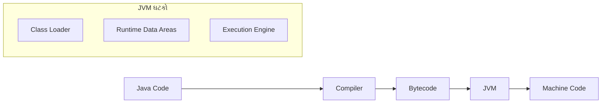
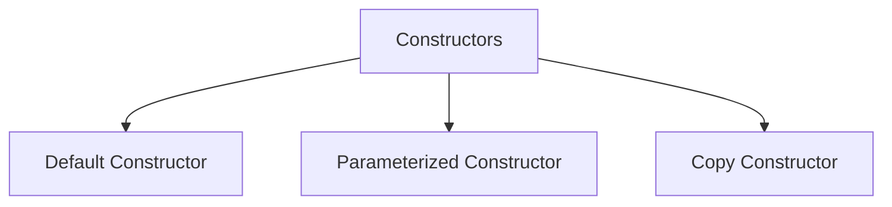
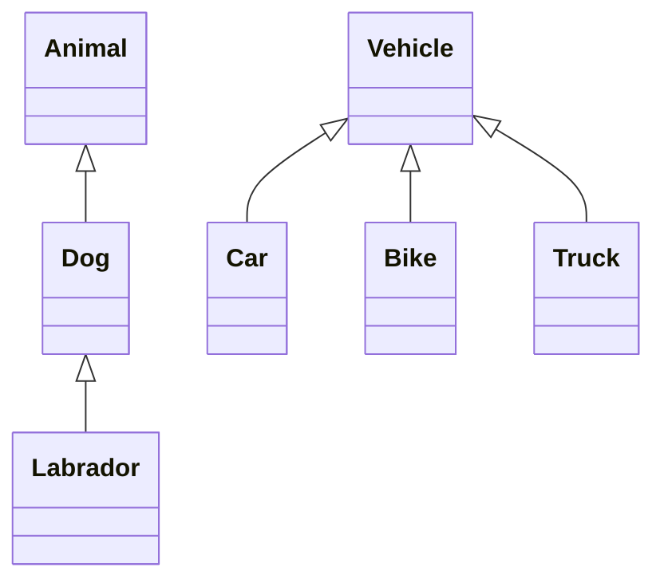
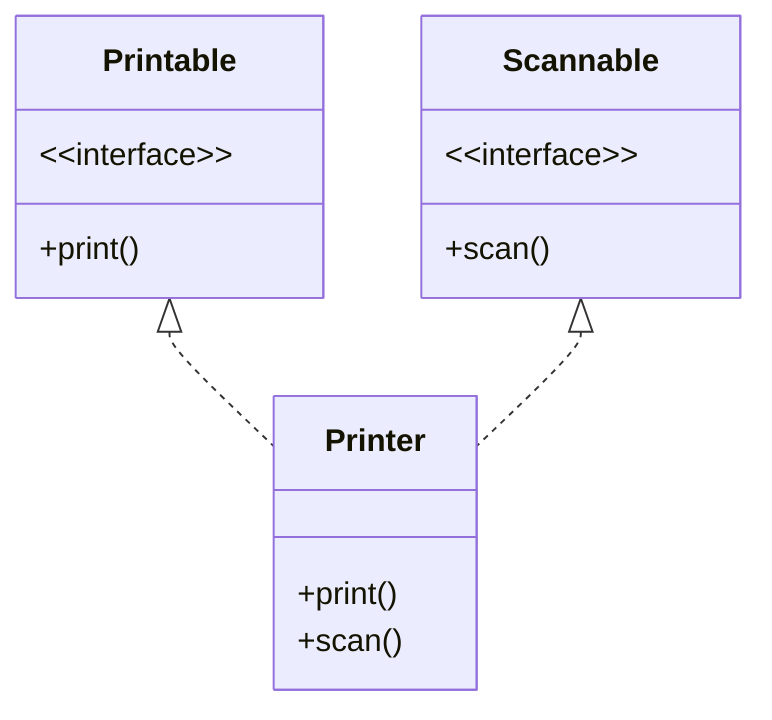
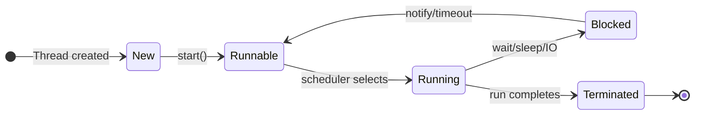
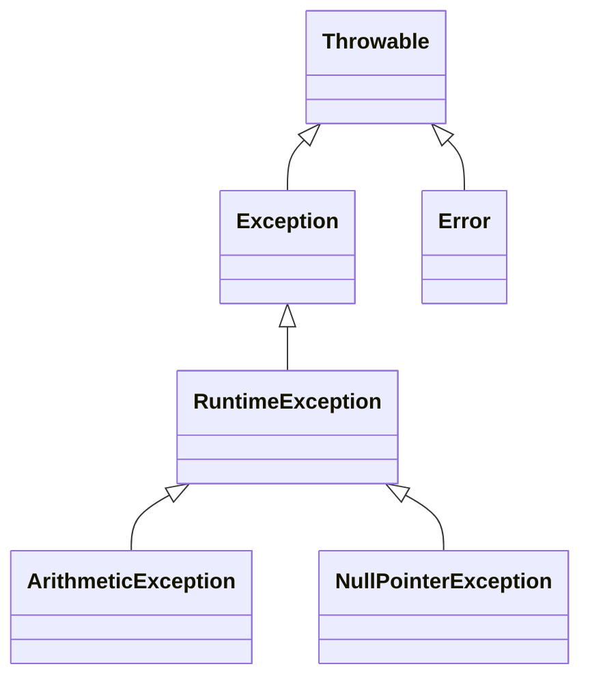

## પ્રશ્ન 1(અ) [3 ગુણ]

**જાવામાં Garbage collection સમજાવો.**

**જવાબ**:
જાવામાં Garbage collection વણવપરાયેલા ઓબ્જેક્ટ્સને દૂર કરીને આપમેળે મેમરી ખાલી કરે છે.

**કોષ્ટક: Garbage Collection પ્રક્રિયા**

| તબક્કો | વર્ણન |
|-------|-------------|
| Mark | JVM મેમરીમાં બધા live ઓબ્જેક્ટ્સને ઓળખે છે |
| Sweep | વણવપરાયેલા ઓબ્જેક્ટ્સ દૂર કરવામાં આવે છે |
| Compact | બાકીના ઓબ્જેક્ટ્સને જગ્યા ખાલી કરવા માટે પુનર્ગઠિત કરવામાં આવે છે |

- **આપમેળે**: મેન્યુઅલ મેમરી મેનેજમેન્ટની જરૂર નથી
- **બેકગ્રાઉન્ડ**: અલગ ઓછી પ્રાથમિકતાવાળા થ્રેડમાં ચાલે છે

**મેમરી ટ્રીક:** "MSC: Mark-Sweep-Compact આપમેળે મેમરી ખાલી કરે છે"

## પ્રશ્ન 1(બ) [4 ગુણ]

**JVM ને વિગતવાર સમજાવો.**

**જવાબ**:
JVM (Java Virtual Machine) એક વર્ચ્યુઅલ મશીન છે જે bytecode ને મશીન કોડમાં રૂપાંતરિત કરીને જાવાની પ્લેટફોર્મ સ્વતંત્રતા આપે છે.

**આકૃતિ: JVM આર્કિટેક્ચર**



- **પ્લેટફોર્મ સ્વતંત્રતા**: એકવાર લખો, બધે ચલાવો
- **સુરક્ષા**: Bytecode વેરિફિકેશન ખતરનાક કામગીરીને રોકે છે
- **ઓપ્ટિમાઈઝેશન**: Just-in-time કમ્પાઈલેશન કામગીરી સુધારે છે

**મેમરી ટ્રીક:** "CLASS: Class Loader સુરક્ષિત સિસ્ટમ સંચાલન કરે છે"

## પ્રશ્ન 1(ક) [7 ગુણ]

**Fibonacci series પ્રિન્ટ કરવા માટેનો જાવા પ્રોગ્રામ લખો.**

**જવાબ**:
Fibonacci series એવી શ્રેણી બનાવે છે જેમાં દરેક સંખ્યા તેના અગાઉની બે સંખ્યાઓનો સરવાળો હોય.

**કોડ બ્લોક:**

```java
import java.util.Scanner;

public class FibonacciSeries {
    public static void main(String[] args) {
        Scanner input = new Scanner(System.in);
        
        System.out.print("Enter number of terms: ");
        int n = input.nextInt();
        
        int first = 0, second = 1;
        
        System.out.print("Fibonacci Series: ");
        
        for (int i = 1; i <= n; i++) {
            System.out.print(first + " ");
            
            int next = first + second;
            first = second;
            second = next;
        }
        
        input.close();
    }
}
```

- **પ્રારંભિક**: 0 અને 1 થી શરૂઆત કરો
- **લૂપ**: શ્રેણી બનાવવા માટે N વખત પુનરાવર્તન કરો
- **ગણતરી**: દરેક સંખ્યા પાછલી બે સંખ્યાનો સરવાળો છે

**મેમરી ટ્રીક:** "FSN: પ્રથમ + બીજી = આગળની સંખ્યા શ્રેણીમાં"

## પ્રશ્ન 1(ક OR) [7 ગુણ]

**કમાન્ડ લાઇન arguments નો ઉપયોગ કરીને કોઈપણ દસ સંખ્યાઓ માંથી ન્યૂનતમ શોધવા માટે જાવા પ્રોગ્રામ લખો.**

**જવાબ**:
કમાન્ડ લાઇન આર્ગ્યુમેન્ટ્સ જાવા પ્રોગ્રામ ચલાવતી વખતે સીધા ઇનપુટ આપવાની સુવિધા આપે છે.

**કોડ બ્લોક:**

```java
public class FindMinimum {
    public static void main(String[] args) {
        if (args.length < 10) {
            System.out.println("Please provide 10 numbers");
            return;
        }
        
        int min = Integer.parseInt(args[0]);
        
        for (int i = 1; i < 10; i++) {
            int current = Integer.parseInt(args[i]);
            if (current < min) {
                min = current;
            }
        }
        
        System.out.println("Minimum number is: " + min);
    }
}
```

- **આર્ગ્યુમેન્ટ્સ પારસિંગ**: સ્ટ્રિંગ આર્ગ્યુમેન્ટ્સને ઇન્ટીજરમાં રૂપાંતરિત કરો
- **પ્રારંભિક**: પ્રથમ સંખ્યાને ન્યૂનતમ તરીકે સેટ કરો
- **તુલના**: દરેક સંખ્યાને વર્તમાન ન્યૂનતમ સાથે ચકાસો

**મેમરી ટ્રીક:** "ICU: શરૂઆત, ચકાસણી, અપડેટ ન્યૂનતમ"

## પ્રશ્ન 2(અ) [3 ગુણ]

**Java OOP ના મૂળભૂત ખ્યાલોની યાદી બનાવો. કોઈપણ એક વિગતવાર સમજાવો.**

**જવાબ**:
જાવા ઓબ્જેક્ટ-ઓરિએન્ટેડ પ્રોગ્રામિંગ વાસ્તવિક દુનિયાની વસ્તુઓને મોડેલિંગ કરવા માટે મૂળભૂત સિદ્ધાંતો પર આધારિત છે.

**કોષ્ટક: જાવામાં OOP ખ્યાલો**

| ખ્યાલ | વર્ણન |
|---------|-------------|
| Encapsulation | ડેટા અને મેથડને એક એકમ તરીકે જોડવું |
| Inheritance | હાલના class માંથી નવા class બનાવવા |
| Polymorphism | એક ઇન્ટરફેસ, વિવિધ અમલીકરણો |
| Abstraction | અમલીકરણની વિગતો છુપાવવી, કાર્યક્ષમતા બતાવવી |

- **Encapsulation**: એક્સેસ કંટ્રોલ દ્વારા ડેટાનું રક્ષણ કરે છે
- **ડેટા છુપાવવો**: ખાનગી વેરિયેબલ્સ મેથડ્સ દ્વારા એક્સેસ થાય છે

**મેમરી ટ્રીક:** "PEAI: પ્રોગ્રામિંગ Encapsulates Abstracts Inherits"

## પ્રશ્ન 2(બ) [4 ગુણ]

**final કી-વર્ડ ઉદાહરણ સાથે સમજાવો.**

**જવાબ**:
જાવામાં final કી-વર્ડ ફેરફાર, વારસો અને ઓવરરાઇડિંગને મર્યાદિત કરવા માટે વપરાય છે.

**કોષ્ટક: final કી-વર્ડના ઉપયોગો**

| ઉપયોગ | અસર | ઉદાહરણ |
|-------|--------|---------|
| final variable | બદલી શકાતું નથી | `final int MAX = 100;` |
| final method | ઓવરરાઇડ કરી શકાતી નથી | `final void display() {}` |
| final class | વારસામાં લઈ શકાતો નથી | `final class Math {}` |

**કોડ બ્લોક:**

```java
public class FinalDemo {
    final int MAX_VALUE = 100;  // નિયતાંક
    
    final void display() {
        System.out.println("This method cannot be overridden");
    }
}

final class MathOperations {
    // આ class નો વારસો મળી શકતો નથી
}
```

**મેમરી ટ્રીક:** "VCM: Variables Constants Methods બદલી શકાતા નથી"

## પ્રશ્ન 2(ક) [7 ગુણ]

**કન્સ્ટ્રક્ટર શું છે? Parameterized કન્સ્ટ્રક્ટર ને ઉદાહરણ સાથે સમજાવો.**

**જવાબ**:
કન્સ્ટ્રક્ટર એ ઓબ્જેક્ટ બનાવતી વખતે તેને શરૂઆતી મૂલ્યો આપવા માટેની વિશેષ મેથડ છે.

**આકૃતિ: કન્સ્ટ્રક્ટરના પ્રકારો**



**કોડ બ્લોક:**

```java
public class Student {
    String name;
    int age;
    
    // Parameterized constructor
    Student(String n, int a) {
        name = n;
        age = a;
    }
    
    void display() {
        System.out.println("Name: " + name + ", Age: " + age);
    }
    
    public static void main(String[] args) {
        // Object creation using parameterized constructor
        Student s1 = new Student("John", 20);
        s1.display();
    }
}
```

- **પેરામીટર્સ**: ઓબ્જેક્ટ બનાવતી વખતે કિંમતો સ્વીકારે છે
- **પ્રારંભિક**: પાસ કરેલા મૂલ્યો સાથે ઓબ્જેક્ટ પ્રોપર્ટી સેટ કરે છે
- **ઓવરલોડિંગ**: અલગ અલગ પેરામીટર્સ સાથે ઘણા કન્સ્ટ્રક્ટર્સ

**મેમરી ટ્રીક:** "SPO: વિદ્યાર્થી પેરામીટર્સ ઓબ્જેક્ટ પ્રોપર્ટી શરૂ કરે છે"

## પ્રશ્ન 2(અ OR) [3 ગુણ]

**ઉદાહરણ સાથે જાવા પ્રોગ્રામ સ્ટ્રક્ચર સમજાવો.**

**જવાબ**:
જાવા પ્રોગ્રામ સ્ટ્રક્ચર તાર્કિક રીતે ગોઠવાયેલા તત્વોના વિશિષ્ટ ક્રમને અનુસરે છે.

**આકૃતિ: જાવા પ્રોગ્રામ સ્ટ્રક્ચર**

```goat
+--------------------+
| Documentation      |
| package statement  |
| import statements  |
+--------------------+
| Class declaration  |
|  +----------------+|
|  | Variables      ||
|  | Constructors   ||
|  | Methods        ||
|  +----------------+|
+--------------------+
```

- **Package**: સંબંધિત ક્લાસને જૂથમાં રાખે છે
- **Import**: બાહ્ય ક્લાસને સમાવે છે
- **Class**: વેરિયેબલ્સ અને મેથડ્સ ધરાવે છે

**મેમરી ટ્રીક:** "PIC: દરેક પ્રોગ્રામમાં Package Imports Class"

## પ્રશ્ન 2(બ OR) [4 ગુણ]

**યોગ્ય ઉદાહરણ સાથે static કી-વર્ડ સમજાવો.**

**જવાબ**:
Static કી-વર્ડ ક્લાસ-લેવલ વેરિયેબલ્સ અને મેથડ્સ બનાવે છે જે બધા ઓબ્જેક્ટ્સ વચ્ચે શેર થાય છે.

**કોષ્ટક: Static vs Non-Static**

| ફીચર | Static | Non-Static |
|---------|--------|------------|
| મેમરી | એક કોપી | ઘણી કોપીઓ |
| એક્સેસ | ઓબ્જેક્ટ વગર | ઓબ્જેક્ટ દ્વારા |
| રેફરન્સ | ક્લાસ નામ | ઓબ્જેક્ટ નામ |
| લોડ થવાનો સમય | ક્લાસ લોડિંગ | ઓબ્જેક્ટ બનાવટ |

**કોડ બ્લોક:**

```java
public class Counter {
    static int count = 0;  // બધા ઓબ્જેક્ટ્સ માટે શેર
    int instanceCount = 0; // દરેક ઓબ્જેક્ટ માટે અલગ
    
    Counter() {
        count++;
        instanceCount++;
    }
    
    public static void main(String[] args) {
        Counter c1 = new Counter();
        Counter c2 = new Counter();
        
        System.out.println("Static count: " + Counter.count);
        System.out.println("c1's instance count: " + c1.instanceCount);
        System.out.println("c2's instance count: " + c2.instanceCount);
    }
}
```

**મેમરી ટ્રીક:** "SCM: Static બધા ઓબ્જેક્ટ માટે એકવાર મેમરી બનાવે છે"

## પ્રશ્ન 2(ક OR) [7 ગુણ]

**ઇનહેરીટન્સ વ્યાખ્યાયિત કરો. તેના પ્રકારોની યાદી બનાવો. Multilevel અને Hierarchical ઇનહેરીટન્સ ને યોગ્ય ઉદાહરણ સાથે સમજાવો.**

**જવાબ**:
ઇનહેરીટન્સ એ OOP સિદ્ધાંત છે જેમાં નવો ક્લાસ હાલના ક્લાસની સંપત્તિઓ અને વર્તનને મેળવે છે.

**કોષ્ટક: જાવામાં ઇનહેરીટન્સના પ્રકારો**

| પ્રકાર | વર્ણન |
|------|-------------|
| Single | એક સબક્લાસ એક સુપરક્લાસથી વિસ્તરે છે |
| Multilevel | ઇનહેરીટન્સની સાંકળ (A→B→C) |
| Hierarchical | ઘણા સબક્લાસ એક સુપરક્લાસથી વિસ્તરે છે |
| Multiple | એક ક્લાસ ઘણા ક્લાસથી વિસ્તરે છે (ઇન્ટરફેસ દ્વારા) |

**આકૃતિ: Multilevel vs Hierarchical ઇનહેરીટન્સ**



**કોડ બ્લોક:**

```java
// Multilevel inheritance
class Animal {
    void eat() { System.out.println("eating"); }
}

class Dog extends Animal {
    void bark() { System.out.println("barking"); }
}

class Labrador extends Dog {
    void color() { System.out.println("golden"); }
}

// Hierarchical inheritance
class Vehicle {
    void move() { System.out.println("moving"); }
}

class Car extends Vehicle {
    void wheels() { System.out.println("4 wheels"); }
}

class Bike extends Vehicle {
    void wheels() { System.out.println("2 wheels"); }
}
```

**મેમરી ટ્રીક:** "SMHM: Single Multilevel Hierarchical ઇનહેરીટન્સના પ્રકારો છે"

## પ્રશ્ન 3(અ) [3 ગુણ]

**this કી-વર્ડને યોગ્ય ઉદાહરણ સાથે સમજાવો.**

**જવાબ**:
જાવામાં 'this' કી-વર્ડ વર્તમાન ઓબ્જેક્ટનો સંદર્ભ આપે છે, જે ઇન્સ્ટન્સ વેરિયેબલ્સ અને પેરામીટર્સ વચ્ચે તફાવત પાડે છે.

**કોષ્ટક: 'this' કી-વર્ડના ઉપયોગો**

| ઉપયોગ | હેતુ |
|-----|---------|
| this.variable | ઇન્સ્ટન્સ વેરિયેબલ્સ એક્સેસ કરવા |
| this() | વર્તમાન ક્લાસના કન્સ્ટ્રક્ટરને કોલ કરવા |
| return this | વર્તમાન ઓબ્જેક્ટ પાછો આપવા |

**કોડ બ્લોક:**

```java
public class Student {
    String name;
    
    Student(String name) {
        this.name = name;  // ઇન્સ્ટન્સ વેરિયેબલનો સંદર્ભ આપે છે
    }
    
    void display() {
        System.out.println("Name: " + this.name);
    }
}
```

**મેમરી ટ્રીક:** "VAR: Variables Access Resolution this નો ઉપયોગ કરીને"

## પ્રશ્ન 3(બ) [4 ગુણ]

**જાવામાં વિવિધ એક્સેસ કંટ્રોલ સમજાવો.**

**જવાબ**:
જાવામાં એક્સેસ કંટ્રોલ ક્લાસેસ, મેથડ્સ અને વેરિયેબલ્સની દૃશ્યતા અને પહોંચને નિયંત્રિત કરે છે.

**કોષ્ટક: જાવા એક્સેસ મોડિફાયર્સ**

| મોડિફાયર | ક્લાસ | પેકેજ | સબક્લાસ | જગત |
|----------|-------|---------|----------|-------|
| private | ✓ | ✗ | ✗ | ✗ |
| default | ✓ | ✓ | ✗ | ✗ |
| protected | ✓ | ✓ | ✓ | ✗ |
| public | ✓ | ✓ | ✓ | ✓ |

- **Private**: માત્ર તે જ ક્લાસની અંદર
- **Default**: તે જ પેકેજની અંદર
- **Protected**: પેકેજ અને સબક્લાસમાં
- **Public**: બધે જ પહોંચ

**મેમરી ટ્રીક:** "PDPP: Private Default Protected Public સંકુચિતથી વિશાળ"

## પ્રશ્ન 3(ક) [7 ગુણ]

**ઈન્ટરફેસ શું છે? ઈન્ટરફેસ દ્વારા ઉદાહરણ સાથે multiple inheritance સમજાવો.**

**જવાબ**:
ઈન્ટરફેસ એક એવો કરાર છે જે ક્લાસે શું કરવું જોઈએ તે નિર્દિષ્ટ કરે છે, જેમાં abstract મેથડ્સ, નિયતાંકો અને (Java 8થી) default મેથડ્સ હોય છે.

**આકૃતિ: ઈન્ટરફેસથી Multiple Inheritance**



**કોડ બ્લોક:**

```java
interface Printable {
    void print();
}

interface Scannable {
    void scan();
}

// Multiple inheritance using interfaces
class Printer implements Printable, Scannable {
    public void print() {
        System.out.println("Printing...");
    }
    
    public void scan() {
        System.out.println("Scanning...");
    }
    
    public static void main(String[] args) {
        Printer p = new Printer();
        p.print();
        p.scan();
    }
}
```

- **કરાર**: અમલીકરણ વગર વર્તન વ્યાખ્યાયિત કરે છે
- **Implements**: ક્લાસ કરાર પૂર્ણ કરે છે
- **Multiple**: ઘણા ઈન્ટરફેસ લાગુ કરી શકાય છે

**મેમરી ટ્રીક:** "CIM: કરાર Implements Multiple ઈન્ટરફેસ"

## પ્રશ્ન 3(અ OR) [3 ગુણ]

**super કી-વર્ડ ઉદાહરણ સાથે સમજાવો.**

**જવાબ**:
super કી-વર્ડ પેરન્ટ ક્લાસનો સંદર્ભ આપે છે, જે પેરન્ટ મેથડ્સ, કન્સ્ટ્રક્ટર્સ અને વેરિયેબલ્સ એક્સેસ કરવા વપરાય છે.

**કોષ્ટક: super કી-વર્ડના ઉપયોગો**

| ઉપયોગ | હેતુ |
|-----|---------|
| super.variable | પેરન્ટ વેરિયેબલ એક્સેસ કરવા |
| super.method() | પેરન્ટ મેથડ કોલ કરવા |
| super() | પેરન્ટ કન્સ્ટ્રક્ટર કોલ કરવા |

**કોડ બ્લોક:**

```java
class Vehicle {
    String color = "white";
    
    void display() {
        System.out.println("Vehicle class");
    }
}

class Car extends Vehicle {
    String color = "black";
    
    void display() {
        super.display();  // પેરન્ટ મેથડ કોલ કરે છે
        System.out.println("Car color: " + color);
        System.out.println("Vehicle color: " + super.color);
    }
}
```

**મેમરી ટ્રીક:** "VMC: Variables Methods Constructors super દ્વારા એક્સેસ થાય છે"

## પ્રશ્ન 3(બ OR) [4 ગુણ]

**પેકેજ શું છે? પેકેજ બનાવવાના પગલાં લખો અને તેનું ઉદાહરણ આપો.**

**જવાબ**:
પેકેજ એ જાવામાં સંબંધિત ક્લાસ અને ઈન્ટરફેસને સંગઠિત કરતું નેમસ્પેસ છે, જે નામકરણ સંઘર્ષને રોકે છે.

**કોષ્ટક: પેકેજ બનાવવાના પગલાં**

| પગલું | ક્રિયા |
|------|--------|
| 1 | ફાઈલની ટોચે પેકેજ નામ જાહેર કરો |
| 2 | પેકેજ નામને અનુરૂપ ડિરેક્ટરી સ્ટ્રક્ચર બનાવો |
| 3 | જાવા ફાઈલને ડિરેક્ટરીમાં સેવ કરો |
| 4 | -d વિકલ્પ સાથે કમ્પાઈલ કરો |
| 5 | ઉપયોગ કરવા માટે પેકેજ ઈમ્પોર્ટ કરો |

**કોડ બ્લોક:**

```java
// પગલું 1: પેકેજ જાહેર કરો (Calculator.java તરીકે સેવ કરો)
package mathematics;

public class Calculator {
    public int add(int a, int b) {
        return a + b;
    }
}

// બીજી ફાઈલમાં (UseCalculator.java)
import mathematics.Calculator;

class UseCalculator {
    public static void main(String[] args) {
        Calculator calc = new Calculator();
        System.out.println(calc.add(10, 20));
    }
}
```

**મેમરી ટ્રીક:** "DISCO: Declare Import Save Compile Organize"

## પ્રશ્ન 3(ક OR) [7 ગુણ]

**વ્યાખ્યાયિત કરો: થ્રેડ ઓવરરાઇડિંગ. થ્રેડ ઓવરરાઇડિંગ માટેના નિયમોની યાદી બનાવો. થ્રેડ ઓવરરાઇડિંગને ઇમ્પલેમેન્ટ કરતો જાવા પ્રોગ્રામ લખો.**

**જવાબ**:
મેથડ ઓવરરાઈડિંગ ત્યારે થાય છે જ્યારે સબક્લાસ તેના પેરન્ટ ક્લાસમાં વ્યાખ્યાયિત મેથડ માટે ચોક્કસ અમલીકરણ આપે છે.

**કોષ્ટક: મેથડ ઓવરરાઈડિંગના નિયમો**

| નિયમ | વર્ણન |
|------|-------------|
| એક જ નામ | મેથડનું નામ સરખું હોવું જોઈએ |
| એક જ પેરામીટર્સ | પેરામીટર સંખ્યા અને પ્રકાર મેળ ખાવા જોઈએ |
| એક જ રિટર્ન પ્રકાર | રિટર્ન પ્રકાર સરખો અથવા સબટાઈપ હોવો જોઈએ |
| એક્સેસ મોડિફાયર | વધુ પ્રતિબંધિત ન હોઈ શકે |
| એક્સેપ્શન્સ | વધુ વિસ્તૃત checked exception ફેંકી ન શકે |

**કોડ બ્લોક:**

```java
class Animal {
    void makeSound() {
        System.out.println("Animal makes a sound");
    }
}

class Dog extends Animal {
    // મેથડ ઓવરરાઈડિંગ
    @Override
    void makeSound() {
        System.out.println("Dog barks");
    }
}

class Cat extends Animal {
    // મેથડ ઓવરરાઈડિંગ
    @Override
    void makeSound() {
        System.out.println("Cat meows");
    }
}

public class MethodOverridingDemo {
    public static void main(String[] args) {
        Animal animal = new Animal();
        Animal dog = new Dog();
        Animal cat = new Cat();
        
        animal.makeSound();  // Output: Animal makes a sound
        dog.makeSound();     // Output: Dog barks
        cat.makeSound();     // Output: Cat meows
    }
}
```

- **રનટાઈમ પોલિમોર્ફિઝમ**: રનટાઈમ પર મેથડનું રિઝોલ્યુશન થાય છે
- **@Override**: એનોટેશન ખાતરી કરે છે કે મેથડ ઓવરરાઈડ થઈ રહી છે
- **ઇનહેરીટન્સ**: IS-A સંબંધની જરૂર છે

**મેમરી ટ્રીક:** "SPARE: એક જ પેરામીટર્સ, એક્સેસ, રિટર્ન, એક્સેપ્શન્સ"

## પ્રશ્ન 4(અ) [3 ગુણ]

**યોગ્ય ઉદાહરણ સાથે abstract class સમજાવો.**

**જવાબ**:
Abstract class ને ઈન્સ્ટન્સ બનાવી ન શકાય અને તેમાં abstract મેથડ્સ હોઈ શકે જે સબક્લાસમાં અમલીકરણ કરવી જરૂરી છે.

**કોષ્ટક: Abstract Class vs Interface**

| ફીચર | Abstract Class | Interface |
|---------|---------------|-----------|
| ઈન્સ્ટન્સ | બનાવી ન શકાય | બનાવી ન શકાય |
| મેથડ્સ | કોન્ક્રીટ અને abstract | Abstract (+ Java 8થી default) |
| વેરિયેબલ્સ | કોઈપણ પ્રકાર | માત્ર નિયતાંકો |
| કન્સ્ટ્રક્ટર | ધરાવે છે | ધરાવતું નથી |

**કોડ બ્લોક:**

```java
abstract class Shape {
    // Abstract મેથડ - અમલીકરણ નથી
    abstract double area();
    
    // કોન્ક્રીટ મેથડ
    void display() {
        System.out.println("This is a shape");
    }
}

class Circle extends Shape {
    double radius;
    
    Circle(double r) {
        radius = r;
    }
    
    // Abstract મેથડનું અમલીકરણ
    double area() {
        return 3.14 * radius * radius;
    }
}
```

**મેમરી ટ્રીક:** "PAI: આંશિક Abstract અમલીકરણ મુખ્ય છે"

## પ્રશ્ન 4(બ) [4 ગુણ]

**થ્રેડ શું છે? થ્રેડ જીવનચક્ર સમજાવો.**

**જવાબ**:
થ્રેડ એ લાઈટવેઈટ સબપ્રોસેસ છે, જે પ્રોસેસિંગની સૌથી નાની એકમ છે જે એક સાથે ચાલતી પ્રક્રિયાઓની મંજૂરી આપે છે.

**આકૃતિ: થ્રેડ જીવનચક્ર**



- **New**: થ્રેડ બનેલ છે પણ શરૂ થયેલ નથી
- **Runnable**: CPU સમય મળે ત્યારે ચાલવા તૈયાર
- **Running**: હાલમાં ચાલી રહ્યું છે
- **Blocked/Waiting**: અસ્થાયી રૂપે નિષ્ક્રિય
- **Terminated**: કાર્ય પૂર્ણ થયેલ છે

**મેમરી ટ્રીક:** "NRRBT: New Runnable Running Blocked Terminated"

## પ્રશ્ન 4(ક) [7 ગુણ]

**જાવામાં એક પ્રોગ્રામ લખો જે Thread Class નો અમલ કરીને બહુવિધ થ્રેડો બનાવે છે.**

**જવાબ**:
Thread class ને અમલ કરીને થ્રેડ બનાવવાથી ઘણા કાર્યો એક સાથે ચલાવી શકાય છે.

**કોડ બ્લોક:**

```java
class MyThread extends Thread {
    private String threadName;
    
    MyThread(String name) {
        this.threadName = name;
    }
    
    @Override
    public void run() {
        try {
            for (int i = 1; i <= 5; i++) {
                System.out.println(threadName + ": " + i);
                Thread.sleep(500);
            }
        } catch (InterruptedException e) {
            System.out.println(threadName + " interrupted");
        }
        System.out.println(threadName + " completed");
    }
}

public class MultiThreadDemo {
    public static void main(String[] args) {
        MyThread thread1 = new MyThread("Thread-1");
        MyThread thread2 = new MyThread("Thread-2");
        MyThread thread3 = new MyThread("Thread-3");
        
        thread1.start();
        thread2.start();
        thread3.start();
    }
}
```

- **Thread વિસ્તારો**: Thread class વિસ્તારી થ્રેડ બનાવો
- **run() ઓવરરાઈડ**: run મેથડમાં કાર્ય વ્યાખ્યાયિત કરો
- **start()**: થ્રેડ ચલાવવાનું શરૂ કરો

**મેમરી ટ્રીક:** "ERS: Extend Run Start થ્રેડ બનાવવા માટે"

## પ્રશ્ન 4(અ OR) [3 ગુણ]

**યોગ્ય ઉદાહરણ સાથે final class સમજાવો.**

**જવાબ**:
Final class નો વારસો મળી શકતો નથી, જેથી તેના ડિઝાઈનમાં ફેરફાર અને વિસ્તરણ અટકાવે છે.

**કોષ્ટક: Final Class લક્ષણો**

| ફીચર | વર્ણન |
|---------|-------------|
| ઇનહેરીટન્સ | સબક્લાસ બનાવી શકાતો નથી |
| મેથડ્સ | અંતર્નિહિત final છે |
| સુરક્ષા | ડિઝાઈન ફેરફારને રોકે છે |
| ઉદાહરણ | String, Math ક્લાસ |

**કોડ બ્લોક:**

```java
final class Security {
    void secureMethod() {
        System.out.println("Secure implementation");
    }
}

// Error: Cannot extend final class
// class HackAttempt extends Security { }
```

- **સુરક્ષા**: સંવેદનશીલ અમલીકરણનું રક્ષણ કરે છે
- **અપરિવર્તનશીલતા**: અપરિવર્તનશીલ ક્લાસ બનાવવામાં મદદ કરે છે
- **ઓપ્ટિમાઈઝેશન**: JVM final ક્લાસને ઓપ્ટિમાઈઝ કરી શકે છે

**મેમરી ટ્રીક:** "SIO: સુરક્ષા અપરિવર્તનશીલતા ઓપ્ટિમાઈઝેશન"

## પ્રશ્ન 4(બ OR) [4 ગુણ]

**યોગ્ય ઉદાહરણ સાથે thread ની પ્રાથમિકતાઓ સમજાવો.**

**જવાબ**:
થ્રેડ પ્રાથમિકતાઓ નક્કી કરે છે કે થ્રેડ્સને અમલીકરણ માટે કયા ક્રમમાં શેડ્યુલ કરવા, 1 (ન્યૂનતમ) થી 10 (ઉચ્ચતમ).

**કોષ્ટક: થ્રેડ પ્રાયોરિટી નિયતાંકો**

| નિયતાંક | મૂલ્ય | વર્ણન |
|----------|-------|-------------|
| MIN_PRIORITY | 1 | ન્યૂનતમ પ્રાથમિકતા |
| NORM_PRIORITY | 5 | ડિફોલ્ટ પ્રાથમિકતા |
| MAX_PRIORITY | 10 | ઉચ્ચતમ પ્રાથમિકતા |

**કોડ બ્લોક:**

```java
class PriorityThread extends Thread {
    PriorityThread(String name) {
        super(name);
    }
    
    public void run() {
        System.out.println("Running: " + getName() + 
                          " with priority: " + getPriority());
    }
}

public class ThreadPriorityDemo {
    public static void main(String[] args) {
        PriorityThread low = new PriorityThread("Low Priority");
        PriorityThread norm = new PriorityThread("Normal Priority");
        PriorityThread high = new PriorityThread("High Priority");
        
        low.setPriority(Thread.MIN_PRIORITY);
        high.setPriority(Thread.MAX_PRIORITY);
        
        low.start();
        norm.start();
        high.start();
    }
}
```

**મેમરી ટ્રીક:** "HNL: ઉચ્ચ સામાન્ય નિમ્ન પ્રાથમિકતાઓ થ્રેડ્સમાં"

## પ્રશ્ન 4(ક OR) [7 ગુણ]

**Exception શું છે? Arithmetic Exception નો ઉપયોગ દર્શાવતો પ્રોગ્રામ લખો.**

**જવાબ**:
Exception એ અસામાન્ય સ્થિતિ છે જે પ્રોગ્રામના સામાન્ય પ્રવાહને વિક્ષેપિત કરે છે.

**આકૃતિ: Exception હાયરાર્કી**



**કોડ બ્લોક:**

```java
public class ArithmeticExceptionDemo {
    public static void main(String[] args) {
        try {
            // આ ArithmeticException ઉત્પન્ન કરશે
            int result = 100 / 0;
            System.out.println("Result: " + result);
        } 
        catch (ArithmeticException e) {
            System.out.println("ArithmeticException caught: " + e.getMessage());
            System.out.println("Cannot divide by zero");
        }
        finally {
            System.out.println("This block always executes");
        }
        
        System.out.println("Program continues after exception handling");
    }
}
```

- **Try Block**: એવો કોડ ધરાવે છે જે exception ફેંકી શકે છે
- **Catch Block**: ચોક્કસ exception હેન્ડલ કરે છે
- **Finally Block**: exception ફેંકાય કે ન ફેંકાય, હંમેશા ચાલે છે

**મેમરી ટ્રીક:** "TCF: Try Catch Finally exceptions હેન્ડલ કરે છે"

## પ્રશ્ન 5(અ) [3 ગુણ]

**એરેની 10 સંખ્યાઓનો સરવાળો અને સરેરાશ શોધવા માટેનો જાવા પ્રોગ્રામ લખો.**

**જવાબ**:
એરે એક જ પ્રકારની ઘણી કિંમતો સંગ્રહે છે, જે તત્વોની ક્રમિક પ્રક્રિયા કરવાની મંજૂરી આપે છે.

**કોડ બ્લોક:**

```java
public class ArraySumAverage {
    public static void main(String[] args) {
        int[] numbers = {10, 20, 30, 40, 50, 60, 70, 80, 90, 100};
        
        int sum = 0;
        
        // સરવાળો ગણો
        for (int i = 0; i < numbers.length; i++) {
            sum += numbers[i];
        }
        
        // સરેરાશ ગણો
        double average = (double) sum / numbers.length;
        
        System.out.println("Sum = " + sum);
        System.out.println("Average = " + average);
    }
}
```

- **ઘોષણા**: નિશ્ચિત-કદના સંગ્રહ બનાવે છે
- **પુનરાવર્તન**: તત્વોનો ક્રમિક એક્સેસ
- **ગણતરી**: પરિણામો માટે મૂલ્યો પર પ્રક્રિયા કરો

**મેમરી ટ્રીક:** "DIC: Declare Iterate Calculate એરે પ્રોસેસિંગ માટે"

## પ્રશ્ન 5(બ) [4 ગુણ]

**'DivideByZero' એરર માટે યુઝર ડિફાઈન્ડ Exception હેન્ડલ કરવા માટે જાવા પ્રોગ્રામ લખો.**

**જવાબ**:
યુઝર-ડિફાઈન્ડ exception ચોક્કસ એપ્લિકેશન જરૂરિયાતો માટે કસ્ટમ exception પ્રકારો બનાવવાની મંજૂરી આપે છે.

**કોડ બ્લોક:**

```java
// કસ્ટમ exception ક્લાસ
class DivideByZeroException extends Exception {
    public DivideByZeroException(String message) {
        super(message);
    }
}

public class CustomExceptionDemo {
    // કસ્ટમ exception ફેંકતી મેથડ
    static double divide(int numerator, int denominator) throws DivideByZeroException {
        if (denominator == 0) {
            throw new DivideByZeroException("Cannot divide by zero!");
        }
        return (double) numerator / denominator;
    }
    
    public static void main(String[] args) {
        try {
            System.out.println(divide(10, 2));
            System.out.println(divide(20, 0));
        } catch (DivideByZeroException e) {
            System.out.println("Custom exception caught: " + e.getMessage());
        }
    }
}
```

- **કસ્ટમ ક્લાસ**: Exception ક્લાસ વિસ્તારે છે
- **ફેંકવું**: throw કીવર્ડનો નવા ઇન્સ્ટન્સ સાથે ઉપયોગ કરો
- **હેન્ડલિંગ**: ચોક્કસ exception પ્રકાર પકડો

**મેમરી ટ્રીક:** "CTE: Create Throw Exception જ્યારે જરૂર હોય"

## પ્રશ્ન 5(ક) [7 ગુણ]

**ટેક્સ્ટ ફાઇલ બનાવવા માટે જાવા પ્રોગ્રામ લખો અને ટેક્સ્ટ ફાઇલ પર રીડ ઑપરેશન કરો.**

**જવાબ**:
જાવા I/O ક્લાસ ફાઇલો સાથે કામ કરવા માટે સગવડ આપે છે, જે સર્જન, લેખન અને વાંચન ઓપરેશન્સની મંજૂરી આપે છે.

**કોડ બ્લોક:**

```java
import java.io.FileWriter;
import java.io.FileReader;
import java.io.IOException;
import java.io.BufferedReader;

public class FileOperationsDemo {
    public static void main(String[] args) {
        try {
            // ફાઇલ બનાવો અને લખો
            FileWriter writer = new FileWriter("sample.txt");
            writer.write("Hello World!\n");
            writer.write("Welcome to Java File Handling.\n");
            writer.write("This is the third line.");
            writer.close();
            System.out.println("Successfully wrote to the file.");
            
            // ફાઇલમાંથી વાંચો
            FileReader reader = new FileReader("sample.txt");
            BufferedReader buffReader = new BufferedReader(reader);
            
            String line;
            System.out.println("\nFile contents:");
            while ((line = buffReader.readLine()) != null) {
                System.out.println(line);
            }
            
            reader.close();
            
        } catch (IOException e) {
            System.out.println("An error occurred: " + e.getMessage());
        }
    }
}
```

- **FileWriter**: ફાઇલો બનાવે અને લખે છે
- **FileReader**: ફાઇલોમાંથી અક્ષર ડેટા વાંચે છે
- **BufferedReader**: લાઇન દ્વારા ટેક્સ્ટ કાર્યક્ષમતાથી વાંચે છે

**મેમરી ટ્રીક:** "WRC: Write Read Close ફાઇલ ઓપરેશન્સ માટે"

## પ્રશ્ન 5(અ OR) [3 ગુણ]

**Java I/O પ્રક્રિયા સમજાવો.**

**જવાબ**:
Java I/O પ્રક્રિયામાં સ્ટ્રીમ્સનો ઉપયોગ કરીને વિવિધ સ્રોતોથી ડેટા ટ્રાન્સફર કરવાનો સમાવેશ થાય છે.

**કોષ્ટક: Java I/O સ્ટ્રીમ પ્રકારો**

| વર્ગીકરણ | પ્રકારો |
|----------------|-------|
| દિશા | ઇનપુટ, આઉટપુટ |
| ડેટા પ્રકાર | બાઇટ સ્ટ્રીમ્સ, કેરેક્ટર સ્ટ્રીમ્સ |
| કાર્યક્ષમતા | બેઝિક, બફર્ડ, ડેટા, ઓબ્જેક્ટ |

**આકૃતિ: Java I/O હાયરાર્કી**

```goat
   +-----------+
   |  Stream   |
   +-----------+
        |
   +----+----+
   |         |
+-----+   +------+
|Input|   |Output|
+-----+   +------+
   |         |
+------+  +------+
| Byte |  | Char |
+------+  +------+
```

- **સ્ટ્રીમ**: સ્રોત અને લક્ષ્ય વચ્ચે વહેતા ડેટાની શ્રેણી
- **બફરિંગ**: ડિસ્ક એક્સેસ ઘટાડીને કાર્યક્ષમતા સુધારે છે

**મેમરી ટ્રીક:** "SBI: સ્ટ્રીમ બફર્ડ ઇનપુટ/આઉટપુટ"

## પ્રશ્ન 5(બ OR) [4 ગુણ]

**Exception હેન્ડલિંગમાં throw અને finally ઉદાહરણ સાથે સમજાવો.**

**જવાબ**:
Exception હેન્ડલિંગ મેકેનિઝમ્સ ભૂલો દરમિયાન પ્રોગ્રામ ફ્લોને નિયંત્રિત કરે છે, સુંદર અમલીકરણ સુનિશ્ચિત કરે છે.

**કોષ્ટક: throw vs finally**

| ફીચર | throw | finally |
|---------|-------|---------|
| હેતુ | સ્પષ્ટપણે exception ફેંકે છે | કોડ અમલીકરણ સુનિશ્ચિત કરે છે |
| સ્થાન | મેથડની અંદર | try-catch બ્લોક્સ પછી |
| અમલીકરણ | શરત પૂરી થાય ત્યારે | return હોય તો પણ હંમેશા |
| ઉપયોગ | કંટ્રોલ ફ્લો | રિસોર્સ ક્લીનઅપ |

**કોડ બ્લોક:**

```java
public class ThrowFinallyDemo {
    public static void validateAge(int age) {
        try {
            if (age < 18) {
                throw new ArithmeticException("Not eligible to vote");
            } else {
                System.out.println("Welcome to vote");
            }
        } catch (ArithmeticException e) {
            System.out.println("Exception caught: " + e.getMessage());
        } finally {
            System.out.println("Validation process completed");
        }
    }
    
    public static void main(String[] args) {
        validateAge(15);
        System.out.println("---------");
        validateAge(20);
    }
}
```

**મેમરી ટ્રીક:** "TERA: Throw Exception, Regardless Always, finally હંમેશા ચાલે છે"

## પ્રશ્ન 5(ક OR) [7 ગુણ]

**ટેક્સ્ટ ફાઇલ ના કન્ટેન્ટ ડિસ્પ્લે કરવા અને ટેક્સ્ટ ફાઇલ પર એપેન્ડ ઓપરેશન કરવા માટે જાવા પ્રોગ્રામ લખો.**

**જવાબ**:
જાવામાં ફાઇલ ઓપરેશન્સ ફાઇલ કન્ટેન્ટને હેરફેર કરવાની મંજૂરી આપે છે, નવા ડેટા ઉમેરવા સહિત.

**કોડ બ્લોક:**

```java
import java.io.*;

public class FileAppendDemo {
    public static void main(String[] args) {
        try {
            // પ્રારંભિક ફાઇલ બનાવો
            FileWriter writer = new FileWriter("example.txt");
            writer.write("Original content line 1\n");
            writer.write("Original content line 2\n");
            writer.close();
            
            // ફાઇલ કન્ટેન્ટ દર્શાવો
            System.out.println("Original file content:");
            readFile("example.txt");
            
            // ફાઇલમાં ઉમેરો
            FileWriter appendWriter = new FileWriter("example.txt", true);
            appendWriter.write("Appended content line 1\n");
            appendWriter.write("Appended content line 2\n");
            appendWriter.close();
            
            // અપડેટ થયેલ કન્ટેન્ટ દર્શાવો
            System.out.println("\nFile content after append:");
            readFile("example.txt");
            
        } catch (IOException e) {
            System.out.println("An error occurred: " + e.getMessage());
        }
    }
    
    // ફાઇલ કન્ટેન્ટ વાંચવા અને દર્શાવવા માટેની મેથડ
    public static void readFile(String fileName) {
        try {
            BufferedReader reader = new BufferedReader(new FileReader(fileName));
            String line;
            while ((line = reader.readLine()) != null) {
                System.out.println(line);
            }
            reader.close();
        } catch (IOException e) {
            System.out.println("Error reading file: " + e.getMessage());
        }
    }
}
```

- **FileWriter(file, true)**: બીજો પેરામીટર એપેન્ડ મોડ સક્ષમ કરે છે
- **BufferedReader**: લાઇન દ્વારા ટેક્સ્ટને કાર્યક્ષમતાથી વાંચે છે
- **ફરીથી વાપરી શકાય તેવી મેથડ**: વાચન કાર્યક્ષમતાને સંકલિત કરે છે

**મેમરી ટ્રીક:** "CAD: Create Append Display ફાઇલ ઓપરેશન્સ"
