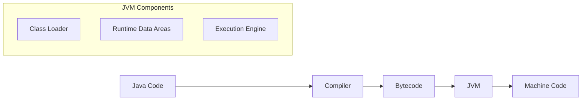
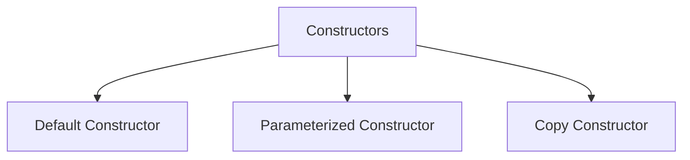
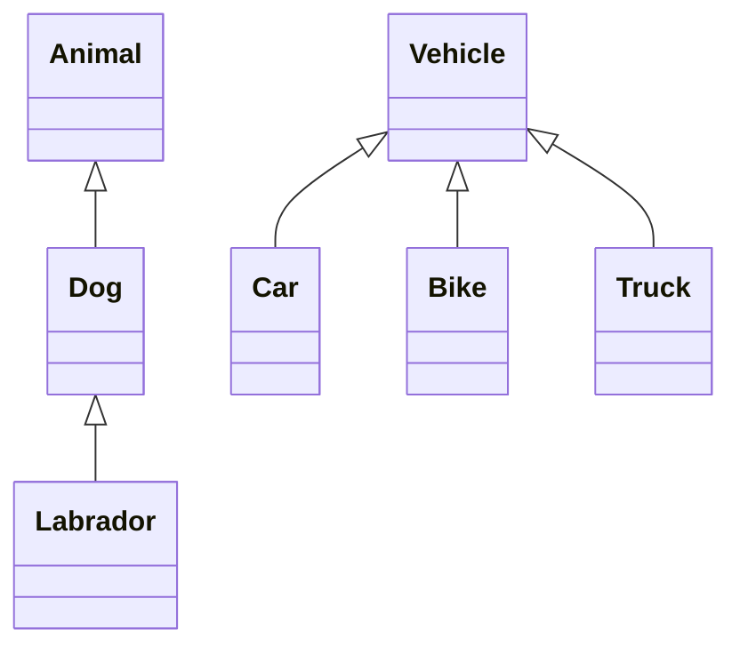
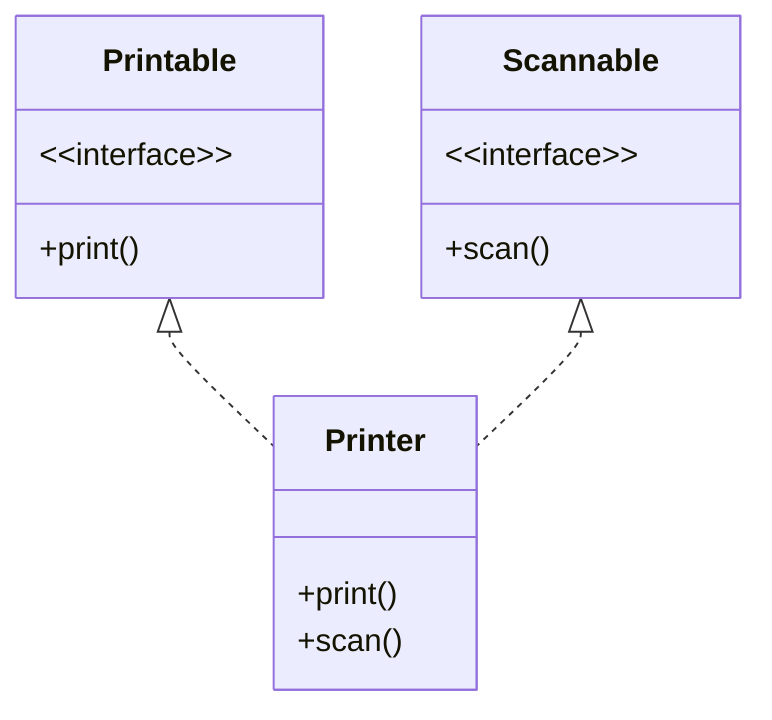
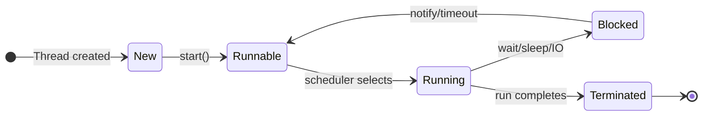
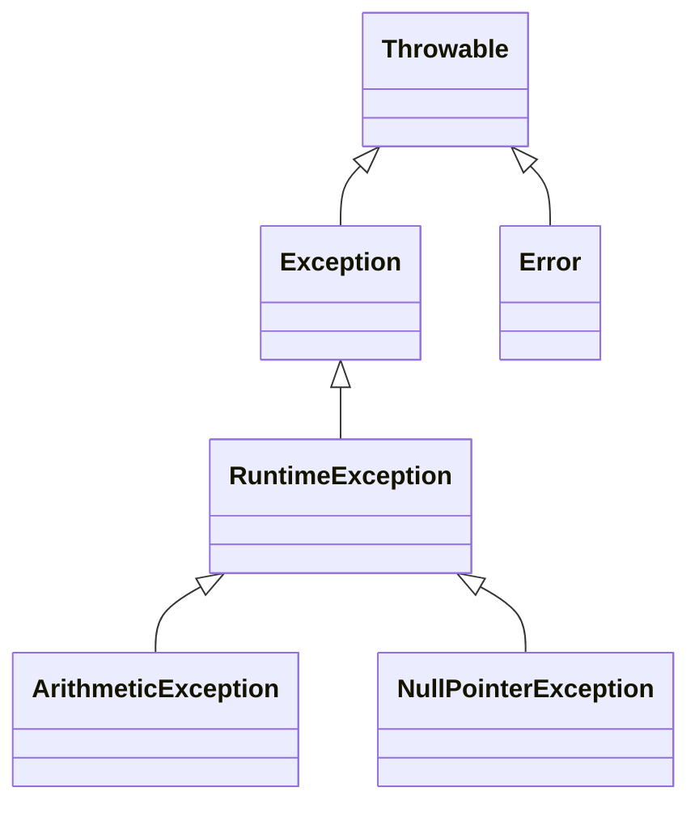

## Question 1(a) [3 marks]

**Explain Garbage collection in java.**

**Answer**:
Garbage collection in Java automatically reclaims memory by removing unused objects.

**Table: Garbage Collection Process**

| Phase | Description |
|-------|-------------|
| Mark | JVM identifies all live objects in memory |
| Sweep | Unused objects are removed |
| Compact | Remaining objects are reorganized to free up space |

- **Automatic**: No manual memory management required
- **Background**: Runs in separate low-priority thread

**Mnemonic:** "MSC: Mark-Sweep-Compact frees memory automatically"

## Question 1(b) [4 marks]

**Explain JVM in detail.**

**Answer**:
JVM (Java Virtual Machine) is a virtual machine that enables Java's platform independence by converting bytecode to machine code.

**Diagram: JVM Architecture**



- **Platform Independence**: Write once, run anywhere
- **Security**: Bytecode verification prevents dangerous operations
- **Optimization**: Just-in-time compilation improves performance

**Mnemonic:** "CLASS: Class Loader Leads All System Security"

## Question 1(c) [7 marks]

**Write a program in java to print Fibonacci series for N terms.**

**Answer**:
Fibonacci series generates numbers where each is the sum of the two preceding ones.

**Code Block:**

```java
import java.util.Scanner;

public class FibonacciSeries {
    public static void main(String[] args) {
        Scanner input = new Scanner(System.in);
        
        System.out.print("Enter number of terms: ");
        int n = input.nextInt();
        
        int first = 0, second = 1;
        
        System.out.print("Fibonacci Series: ");
        
        for (int i = 1; i <= n; i++) {
            System.out.print(first + " ");
            
            int next = first + second;
            first = second;
            second = next;
        }
        
        input.close();
    }
}
```

- **Initialize**: Start with 0 and 1
- **Loop**: Iterate N times to generate sequence
- **Calculation**: Each number is sum of previous two

**Mnemonic:** "FSN: First + Second = Next number in sequence"

## Question 1(c OR) [7 marks]

**Write a program in java to find out minimum from any ten numbers using command line argument.**

**Answer**:
Command line arguments allow passing input values directly when executing a Java program.

**Code Block:**

```java
public class FindMinimum {
    public static void main(String[] args) {
        if (args.length < 10) {
            System.out.println("Please provide 10 numbers");
            return;
        }
        
        int min = Integer.parseInt(args[0]);
        
        for (int i = 1; i < 10; i++) {
            int current = Integer.parseInt(args[i]);
            if (current < min) {
                min = current;
            }
        }
        
        System.out.println("Minimum number is: " + min);
    }
}
```

- **Parse Arguments**: Convert string arguments to integers
- **Initialize**: Set first number as minimum
- **Compare**: Check each number against current minimum

**Mnemonic:** "ICU: Initialize, Compare, Update the minimum"

## Question 2(a) [3 marks]

**List out basic concepts of Java OOP. Explain any one in details.**

**Answer**:
Java Object-Oriented Programming is built on fundamental concepts for modeling real-world entities.

**Table: OOP Concepts in Java**

| Concept | Description |
|---------|-------------|
| Encapsulation | Binding data and methods together as a single unit |
| Inheritance | Creating new classes from existing ones |
| Polymorphism | One interface, multiple implementations |
| Abstraction | Hiding implementation details, showing functionality |

- **Encapsulation**: Protects data through access control
- **Data Hiding**: Private variables accessible through methods

**Mnemonic:** "PEAI: Programming Encapsulates Abstracts Inherits"

## Question 2(b) [4 marks]

**Explain final keyword with example.**

**Answer**:
The final keyword in Java restricts modification and creates constants, unchangeable methods, and non-inheritable classes.

**Table: Uses of final Keyword**

| Usage | Effect | Example |
|-------|--------|---------|
| final variable | Cannot be changed | `final int MAX = 100;` |
| final method | Cannot be overridden | `final void display() {}` |
| final class | Cannot be extended | `final class Math {}` |

**Code Block:**

```java
public class FinalDemo {
    final int MAX_VALUE = 100;  // constant
    
    final void display() {
        System.out.println("This method cannot be overridden");
    }
}

final class MathOperations {
    // This class cannot be inherited
}
```

**Mnemonic:** "VCM: Variables Constants Methods can't change"

## Question 2(c) [7 marks]

**What is constructor? Explain parameterized constructor with example.**

**Answer**:
A constructor initializes objects when created, with the same name as its class and no return type.

**Diagram: Constructor Types**



**Code Block:**

```java
public class Student {
    String name;
    int age;
    
    // Parameterized constructor
    Student(String n, int a) {
        name = n;
        age = a;
    }
    
    void display() {
        System.out.println("Name: " + name + ", Age: " + age);
    }
    
    public static void main(String[] args) {
        // Object creation using parameterized constructor
        Student s1 = new Student("John", 20);
        s1.display();
    }
}
```

- **Parameters**: Accept values during object creation
- **Initialization**: Set object properties with passed values
- **Overloading**: Multiple constructors with different parameters

**Mnemonic:** "SPO: Student Parameters Object initializes properties"

## Question 2(a OR) [3 marks]

**Explain the Java Program Structure with example.**

**Answer**:
Java program structure follows a specific hierarchy of elements organized logically.

**Diagram: Java Program Structure**

```goat
+--------------------+
| Documentation      |
| package statement  |
| import statements  |
+--------------------+
| Class declaration  |
|  +----------------+|
|  | Variables      ||
|  | Constructors   ||
|  | Methods        ||
|  +----------------+|
+--------------------+
```

- **Package**: Groups related classes
- **Import**: Includes external classes
- **Class**: Contains variables and methods

**Mnemonic:** "PIC: Package Imports Class in every program"

## Question 2(b OR) [4 marks]

**Explain static keyword with suitable example.**

**Answer**:
Static keyword creates class-level variables and methods shared by all objects, accessible without creating instances.

**Table: Static vs Non-Static**

| Feature | Static | Non-Static |
|---------|--------|------------|
| Memory | Single copy | Multiple copies |
| Access | Without object | Through object |
| Reference | Class name | Object name |
| When loaded | Class loading | Object creation |

**Code Block:**

```java
public class Counter {
    static int count = 0;  // Shared by all objects
    int instanceCount = 0; // Unique to each object
    
    Counter() {
        count++;
        instanceCount++;
    }
    
    public static void main(String[] args) {
        Counter c1 = new Counter();
        Counter c2 = new Counter();
        
        System.out.println("Static count: " + Counter.count);
        System.out.println("c1's instance count: " + c1.instanceCount);
        System.out.println("c2's instance count: " + c2.instanceCount);
    }
}
```

**Mnemonic:** "SCM: Static Creates Memory once for all objects"

## Question 2(c OR) [7 marks]

**Define Inheritance. List out types of it. Explain multilevel and hierarchical inheritance with suitable example.**

**Answer**:
Inheritance is an OOP principle where a new class acquires properties and behaviors from an existing class.

**Table: Types of Inheritance in Java**

| Type | Description |
|------|-------------|
| Single | One subclass extends one superclass |
| Multilevel | Chain of inheritance (A→B→C) |
| Hierarchical | Multiple subclasses extend one superclass |
| Multiple | One class extends multiple classes (via interfaces) |

**Diagram: Multilevel vs Hierarchical Inheritance**



**Code Block:**

```java
// Multilevel inheritance
class Animal {
    void eat() { System.out.println("eating"); }
}

class Dog extends Animal {
    void bark() { System.out.println("barking"); }
}

class Labrador extends Dog {
    void color() { System.out.println("golden"); }
}

// Hierarchical inheritance
class Vehicle {
    void move() { System.out.println("moving"); }
}

class Car extends Vehicle {
    void wheels() { System.out.println("4 wheels"); }
}

class Bike extends Vehicle {
    void wheels() { System.out.println("2 wheels"); }
}
```

**Mnemonic:** "SMHM: Single Multilevel Hierarchical Makes inheritance types"

## Question 3(a) [3 marks]

**Explain this keyword with suitable example.**

**Answer**:
The 'this' keyword in Java refers to the current object, used to differentiate between instance variables and parameters.

**Table: Uses of 'this' Keyword**

| Use | Purpose |
|-----|---------|
| this.variable | Access instance variables |
| this() | Call current class constructor |
| return this | Return current object |

**Code Block:**

```java
public class Student {
    String name;
    
    Student(String name) {
        this.name = name;  // Refers to instance variable
    }
    
    void display() {
        System.out.println("Name: " + this.name);
    }
}
```

**Mnemonic:** "VAR: Variables Access Resolution using this"

## Question 3(b) [4 marks]

**Explain different access controls in Java.**

**Answer**:
Access controls in Java regulate visibility and accessibility of classes, methods, and variables.

**Table: Java Access Modifiers**

| Modifier | Class | Package | Subclass | World |
|----------|-------|---------|----------|-------|
| private | ✓ | ✗ | ✗ | ✗ |
| default | ✓ | ✓ | ✗ | ✗ |
| protected | ✓ | ✓ | ✓ | ✗ |
| public | ✓ | ✓ | ✓ | ✓ |

- **Private**: Only within the same class
- **Default**: Within the same package
- **Protected**: Within package and subclasses
- **Public**: Accessible everywhere

**Mnemonic:** "PDPP: Private Default Protected Public from narrow to wide"

## Question 3(c) [7 marks]

**What is interface? Explain multiple inheritance using interface with example.**

**Answer**:
An interface is a contract that specifies what a class must do, containing abstract methods, constants, and (since Java 8) default methods.

**Diagram: Multiple Inheritance with Interfaces**



**Code Block:**

```java
interface Printable {
    void print();
}

interface Scannable {
    void scan();
}

// Multiple inheritance using interfaces
class Printer implements Printable, Scannable {
    public void print() {
        System.out.println("Printing...");
    }
    
    public void scan() {
        System.out.println("Scanning...");
    }
    
    public static void main(String[] args) {
        Printer p = new Printer();
        p.print();
        p.scan();
    }
}
```

- **Contract**: Defines behavior without implementation
- **Implements**: Classes fulfill the contract
- **Multiple**: Can implement many interfaces

**Mnemonic:** "CIM: Contract Implements Multiple interfaces"

## Question 3(a OR) [3 marks]

**Explain super keyword with example.**

**Answer**:
The super keyword refers to the parent class, used to access parent methods, constructors, and variables.

**Table: Uses of super Keyword**

| Use | Purpose |
|-----|---------|
| super.variable | Access parent variable |
| super.method() | Call parent method |
| super() | Call parent constructor |

**Code Block:**

```java
class Vehicle {
    String color = "white";
    
    void display() {
        System.out.println("Vehicle class");
    }
}

class Car extends Vehicle {
    String color = "black";
    
    void display() {
        super.display();  // Calls parent method
        System.out.println("Car color: " + color);
        System.out.println("Vehicle color: " + super.color);
    }
}
```

**Mnemonic:** "VMC: Variables Methods Constructors accessed by super"

## Question 3(b OR) [4 marks]

**What is package? Write steps to create a package and give example of it.**

**Answer**:
A package in Java is a namespace that organizes related classes and interfaces, preventing naming conflicts.

**Table: Steps to Create a Package**

| Step | Action |
|------|--------|
| 1 | Declare package name at top of file |
| 2 | Create directory structure matching package name |
| 3 | Save Java file in the directory |
| 4 | Compile with -d option |
| 5 | Import package to use it |

**Code Block:**

```java
// Step 1: Declare package (save as Calculator.java)
package mathematics;

public class Calculator {
    public int add(int a, int b) {
        return a + b;
    }
}

// In another file (UseCalculator.java)
import mathematics.Calculator;

class UseCalculator {
    public static void main(String[] args) {
        Calculator calc = new Calculator();
        System.out.println(calc.add(10, 20));
    }
}
```

**Mnemonic:** "DISCO: Declare Import Save Compile Organize"

## Question 3(c OR) [7 marks]

**Define: Method Overriding. List out Rules for method overriding. Write a java program that implements method overriding.**

**Answer**:
Method overriding occurs when a subclass provides a specific implementation for a method already defined in its parent class.

**Table: Rules for Method Overriding**

| Rule | Description |
|------|-------------|
| Same name | Method must have same name |
| Same parameters | Parameter count and type must match |
| Same return type | Return type must be same or subtype (covariant) |
| Access modifier | Can't be more restrictive |
| Exceptions | Can't throw broader checked exceptions |

**Code Block:**

```java
class Animal {
    void makeSound() {
        System.out.println("Animal makes a sound");
    }
}

class Dog extends Animal {
    // Method overriding
    @Override
    void makeSound() {
        System.out.println("Dog barks");
    }
}

class Cat extends Animal {
    // Method overriding
    @Override
    void makeSound() {
        System.out.println("Cat meows");
    }
}

public class MethodOverridingDemo {
    public static void main(String[] args) {
        Animal animal = new Animal();
        Animal dog = new Dog();
        Animal cat = new Cat();
        
        animal.makeSound();  // Output: Animal makes a sound
        dog.makeSound();     // Output: Dog barks
        cat.makeSound();     // Output: Cat meows
    }
}
```

- **Runtime Polymorphism**: Method resolution at runtime
- **@Override**: Annotation ensures method is overriding
- **Inheritance**: Requires IS-A relationship

**Mnemonic:** "SPARE: Same Parameters Access Return Exceptions"

## Question 4(a) [3 marks]

**Explain abstract class with suitable example.**

**Answer**:
An abstract class cannot be instantiated and may contain abstract methods that must be implemented by subclasses.

**Table: Abstract Class vs Interface**

| Feature | Abstract Class | Interface |
|---------|---------------|-----------|
| Instantiation | Cannot | Cannot |
| Methods | Concrete and abstract | Abstract (+ default since Java 8) |
| Variables | Any type | Only constants |
| Constructor | Has | Doesn't have |

**Code Block:**

```java
abstract class Shape {
    // Abstract method - no implementation
    abstract double area();
    
    // Concrete method
    void display() {
        System.out.println("This is a shape");
    }
}

class Circle extends Shape {
    double radius;
    
    Circle(double r) {
        radius = r;
    }
    
    // Implementation of abstract method
    double area() {
        return 3.14 * radius * radius;
    }
}
```

**Mnemonic:** "PAI: Partial Abstract Implementation is key"

## Question 4(b) [4 marks]

**What is Thread? Explain Thread life cycle.**

**Answer**:
A thread is a lightweight subprocess, the smallest unit of processing that allows concurrent execution.

**Diagram: Thread Life Cycle**



- **New**: Thread created but not started
- **Runnable**: Ready to run when CPU time is given
- **Running**: Currently executing
- **Blocked/Waiting**: Temporarily inactive
- **Terminated**: Completed execution

**Mnemonic:** "NRRBT: New Runnable Running Blocked Terminated"

## Question 4(c) [7 marks]

**Write a program in java that creates the multiple threads by implementing the Thread class.**

**Answer**:
Creating threads by implementing Thread class allows multiple tasks to execute concurrently.

**Code Block:**

```java
class MyThread extends Thread {
    private String threadName;
    
    MyThread(String name) {
        this.threadName = name;
    }
    
    @Override
    public void run() {
        try {
            for (int i = 1; i <= 5; i++) {
                System.out.println(threadName + ": " + i);
                Thread.sleep(500);
            }
        } catch (InterruptedException e) {
            System.out.println(threadName + " interrupted");
        }
        System.out.println(threadName + " completed");
    }
}

public class MultiThreadDemo {
    public static void main(String[] args) {
        MyThread thread1 = new MyThread("Thread-1");
        MyThread thread2 = new MyThread("Thread-2");
        MyThread thread3 = new MyThread("Thread-3");
        
        thread1.start();
        thread2.start();
        thread3.start();
    }
}
```

- **Extend Thread**: Create thread by extending Thread class
- **Override run()**: Define task in run method
- **start()**: Begin thread execution

**Mnemonic:** "ERS: Extend Run Start to create threads"

## Question 4(a OR) [3 marks]

**Explain final class with suitable example.**

**Answer**:
A final class cannot be extended, preventing inheritance and modification of its design.

**Table: Final Class Characteristics**

| Feature | Description |
|---------|-------------|
| Inheritance | Cannot be subclassed |
| Methods | Implicitly final |
| Security | Prevents design alteration |
| Example | String, Math classes |

**Code Block:**

```java
final class Security {
    void secureMethod() {
        System.out.println("Secure implementation");
    }
}

// Error: Cannot extend final class
// class HackAttempt extends Security { }
```

- **Security**: Protects sensitive implementations
- **Immutability**: Helps create immutable classes
- **Optimization**: JVM can optimize final classes

**Mnemonic:** "SIO: Security Immutability Optimization"

## Question 4(b OR) [4 marks]

**Explain thread priorities with suitable example.**

**Answer**:
Thread priorities determine the order in which threads are scheduled for execution, from 1 (lowest) to 10 (highest).

**Table: Thread Priority Constants**

| Constant | Value | Description |
|----------|-------|-------------|
| MIN_PRIORITY | 1 | Lowest priority |
| NORM_PRIORITY | 5 | Default priority |
| MAX_PRIORITY | 10 | Highest priority |

**Code Block:**

```java
class PriorityThread extends Thread {
    PriorityThread(String name) {
        super(name);
    }
    
    public void run() {
        System.out.println("Running: " + getName() + 
                          " with priority: " + getPriority());
    }
}

public class ThreadPriorityDemo {
    public static void main(String[] args) {
        PriorityThread low = new PriorityThread("Low Priority");
        PriorityThread norm = new PriorityThread("Normal Priority");
        PriorityThread high = new PriorityThread("High Priority");
        
        low.setPriority(Thread.MIN_PRIORITY);
        high.setPriority(Thread.MAX_PRIORITY);
        
        low.start();
        norm.start();
        high.start();
    }
}
```

**Mnemonic:** "HNL: High Normal Low priorities in threads"

## Question 4(c OR) [7 marks]

**What is Exception? Write a program that shows the use of Arithmetic Exception.**

**Answer**:
An exception is an abnormal condition that disrupts the normal flow of program execution.

**Diagram: Exception Hierarchy**



**Code Block:**

```java
public class ArithmeticExceptionDemo {
    public static void main(String[] args) {
        try {
            // This will cause ArithmeticException
            int result = 100 / 0;
            System.out.println("Result: " + result);
        } 
        catch (ArithmeticException e) {
            System.out.println("ArithmeticException caught: " + e.getMessage());
            System.out.println("Cannot divide by zero");
        }
        finally {
            System.out.println("This block always executes");
        }
        
        System.out.println("Program continues after exception handling");
    }
}
```

- **Try Block**: Contains code that might throw exceptions
- **Catch Block**: Handles the specific exception
- **Finally Block**: Always executes regardless of exception

**Mnemonic:** "TCF: Try Catch Finally handles exceptions"

## Question 5(a) [3 marks]

**Write a Java Program to find sum and average of 10 numbers of an array.**

**Answer**:
Arrays store multiple values of the same type, enabling sequential processing of elements.

**Code Block:**

```java
public class ArraySumAverage {
    public static void main(String[] args) {
        int[] numbers = {10, 20, 30, 40, 50, 60, 70, 80, 90, 100};
        
        int sum = 0;
        
        // Calculate sum
        for (int i = 0; i < numbers.length; i++) {
            sum += numbers[i];
        }
        
        // Calculate average
        double average = (double) sum / numbers.length;
        
        System.out.println("Sum = " + sum);
        System.out.println("Average = " + average);
    }
}
```

- **Declaration**: Creates fixed-size collection
- **Iteration**: Sequential access to elements
- **Calculation**: Process values for results

**Mnemonic:** "DIC: Declare Iterate Calculate for array processing"

## Question 5(b) [4 marks]

**Write a Java program to handle user defined exception for 'Divide by Zero' error.**

**Answer**:
User-defined exceptions allow creating custom exception types for specific application requirements.

**Code Block:**

```java
// Custom exception class
class DivideByZeroException extends Exception {
    public DivideByZeroException(String message) {
        super(message);
    }
}

public class CustomExceptionDemo {
    // Method that throws custom exception
    static double divide(int numerator, int denominator) throws DivideByZeroException {
        if (denominator == 0) {
            throw new DivideByZeroException("Cannot divide by zero!");
        }
        return (double) numerator / denominator;
    }
    
    public static void main(String[] args) {
        try {
            System.out.println(divide(10, 2));
            System.out.println(divide(20, 0));
        } catch (DivideByZeroException e) {
            System.out.println("Custom exception caught: " + e.getMessage());
        }
    }
}
```

- **Custom Class**: Extends Exception class
- **Throwing**: Use throw keyword with new instance
- **Handling**: Catch specific exception type

**Mnemonic:** "CTE: Create Throw Exception when needed"

## Question 5(c) [7 marks]

**Write a java program to create a text file and perform read operation on the text file.**

**Answer**:
Java provides I/O classes to work with files, allowing creation, writing, and reading operations.

**Code Block:**

```java
import java.io.FileWriter;
import java.io.FileReader;
import java.io.IOException;
import java.io.BufferedReader;

public class FileOperationsDemo {
    public static void main(String[] args) {
        try {
            // Create and write to file
            FileWriter writer = new FileWriter("sample.txt");
            writer.write("Hello World!\n");
            writer.write("Welcome to Java File Handling.\n");
            writer.write("This is the third line.");
            writer.close();
            System.out.println("Successfully wrote to the file.");
            
            // Read from file
            FileReader reader = new FileReader("sample.txt");
            BufferedReader buffReader = new BufferedReader(reader);
            
            String line;
            System.out.println("\nFile contents:");
            while ((line = buffReader.readLine()) != null) {
                System.out.println(line);
            }
            
            reader.close();
            
        } catch (IOException e) {
            System.out.println("An error occurred: " + e.getMessage());
        }
    }
}
```

- **FileWriter**: Creates and writes to files
- **FileReader**: Reads character data from files
- **BufferedReader**: Efficiently reads text by lines

**Mnemonic:** "WRC: Write Read Close for file operations"

## Question 5(a OR) [3 marks]

**Explain java I/O process.**

**Answer**:
Java I/O process involves transferring data to and from various sources using streams.

**Table: Java I/O Stream Types**

| Classification | Types |
|----------------|-------|
| Direction | Input, Output |
| Data Type | Byte Streams, Character Streams |
| Functionality | Basic, Buffered, Data, Object |

**Diagram: Java I/O Hierarchy**

```goat
   +-----------+
   |  Stream   |
   +-----------+
        |
   +----+----+
   |         |
+-----+   +------+
|Input|   |Output|
+-----+   +------+
   |         |
+------+  +------+
| Byte |  | Char |
+------+  +------+
```

- **Stream**: Sequence of data flowing between source and destination
- **Buffering**: Improves performance by reducing disk access

**Mnemonic:** "SBI: Stream Buffered Input/Output"

## Question 5(b OR) [4 marks]

**Explain throw and finally in Exception Handling with example.**

**Answer**:
Exception handling mechanisms control program flow during errors, ensuring graceful execution.

**Table: throw vs finally**

| Feature | throw | finally |
|---------|-------|---------|
| Purpose | Explicitly throws exception | Ensures code execution |
| Placement | Inside method | After try-catch blocks |
| Execution | When condition met | Always, even with return |
| Usage | Control flow | Resource cleanup |

**Code Block:**

```java
public class ThrowFinallyDemo {
    public static void validateAge(int age) {
        try {
            if (age < 18) {
                throw new ArithmeticException("Not eligible to vote");
            } else {
                System.out.println("Welcome to vote");
            }
        } catch (ArithmeticException e) {
            System.out.println("Exception caught: " + e.getMessage());
        } finally {
            System.out.println("Validation process completed");
        }
    }
    
    public static void main(String[] args) {
        validateAge(15);
        System.out.println("---------");
        validateAge(20);
    }
}
```

**Mnemonic:** "TERA: Throw Exception Regardless Always finally executes"

## Question 5(c OR) [7 marks]

**Write a java program to display the content of a text file and perform append operation on the text file.**

**Code Block:**

```java
import java.io.*;

public class FileAppendDemo {
    public static void main(String[] args) {
        try {
            // Create initial file
            FileWriter writer = new FileWriter("example.txt");
            writer.write("Original content line 1\n");
            writer.write("Original content line 2\n");
            writer.close();
            
            // Display file content
            System.out.println("Original file content:");
            readFile("example.txt");
            
            // Append to file
            FileWriter appendWriter = new FileWriter("example.txt", true);
            appendWriter.write("Appended content line 1\n");
            appendWriter.write("Appended content line 2\n");
            appendWriter.close();
            
            // Display updated content
            System.out.println("\nFile content after append:");
            readFile("example.txt");
            
        } catch (IOException e) {
            System.out.println("An error occurred: " + e.getMessage());
        }
    }
    
    // Method to read and display file content
    public static void readFile(String fileName) {
        try {
            BufferedReader reader = new BufferedReader(new FileReader(fileName));
            String line;
            while ((line = reader.readLine()) != null) {
                System.out.println(line);
            }
            reader.close();
        } catch (IOException e) {
            System.out.println("Error reading file: " + e.getMessage());
        }
    }
}
```

- **FileWriter(file, true)**: Second parameter enables append mode
- **BufferedReader**: Efficiently reads text by lines
- **Reusable Method**: Encapsulates reading functionality

**Mnemonic:** "CAD: Create Append Display file operations"
