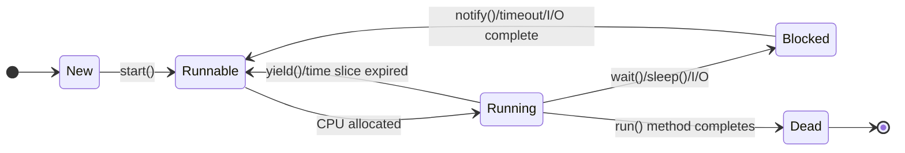

## પ્રશ્ન 1(અ) [3 ગુણ]

**Java માં identifier ને નામ આપવાના નિયમોની યાદી માન્ય અને અમાન્ય ઉદાહરણો સાથે બનાવો.**

**જવાબ**:

**Java Identifier ના નિયમો:**

| નિયમ | વર્ણન | માન્ય ઉદાહરણ | અમાન્ય ઉદાહરણ |
|------|-------------|---------------|-----------------|
| **શરૂઆતી અક્ષર** | letter, underscore અથવા dollar sign થી શરૂ | `name`, `_value`, `$cost` | `2name`, `#id` |
| **પછીના અક્ષરો** | letters, digits, underscore, dollar હોઈ શકે | `student123`, `user_name` | `my-var`, `class@` |
| **Keyword પ્રતિબંધ** | Java reserved words વાપરી શકાતા નથી | `myClass`, `userName` | `class`, `int` |
| **Case Sensitivity** | Identifier case-sensitive છે | `Name` ≠ `name` | - |
| **લંબાઈ** | કોઈ લંબાઈની મર્યાદા નથી | `verylongvariablename` | - |

**મેમરી ટ્રીક:** "Letters First, Keywords Never, Case Counts"

---

## પ્રશ્ન 1(બ) [4 ગુણ]

**Java ના operator ની યાદી બનાવો. Arithmetic અને Logical operator ને સમજાવો.**

**જવાબ**:

**Java Operator ના પ્રકારો:**

| Operator નો પ્રકાર | ઉદાહરણો |
|---------------|----------|
| **Arithmetic** | `+`, `-`, `*`, `/`, `%` |
| **Relational** | `==`, `!=`, `<`, `>`, `<=`, `>=` |
| **Logical** | `&&`, `||`, `!` |
| **Assignment** | `=`, `+=`, `-=`, `*=`, `/=` |
| **Unary** | `++`, `--`, `+`, `-`, `!` |
| **Bitwise** | `&`, `|`, `^`, `~`, `<<`, `>>` |
| **Ternary** | `condition ? value1 : value2` |

**Arithmetic Operators:**

- **Addition (+)**: બે operand નો સરવાળો કરે છે
- **Subtraction (-)**: પહેલામાંથી બીજો બાદ કરે છે
- **Multiplication (*)**: બે operand નો ગુણાકાર કરે છે
- **Division (/)**: પહેલાને બીજા વડે ભાગ આપે છે
- **Modulus (%)**: ભાગાકારનો શેષ આપે છે

**Logical Operators:**

- **AND (&&)**: બંને શરતો સાચી હોય તો true આપે છે
- **OR (||)**: ઓછામાં ઓછી એક શરત સાચી હોય તો true આપે છે
- **NOT (!)**: logical state ને ઉલટાવે છે

**મેમરી ટ્રીક:** "Add Subtract Multiply Divide Remainder, And Or Not"

---

## પ્રશ્ન 1(ક) [7 ગુણ]

**3 આંકડાની સંખ્યાને વિપરીત કરવા માટે Java પ્રોગ્રામ લખો. ઉદાહરણ તરીકે, સંખ્યા 653 છે તો તેની વિપરીત સંખ્યા 356 છે.**

**જવાબ**:

```java
import java.util.Scanner;

public class ReverseNumber {
    public static void main(String[] args) {
        Scanner sc = new Scanner(System.in);
        
        System.out.print("3 આંકડાની સંખ્યા દાખલ કરો: ");
        int num = sc.nextInt();
        
        int reverse = 0;
        int temp = num;
        
        while (temp > 0) {
            reverse = reverse * 10 + temp % 10;
            temp = temp / 10;
        }
        
        System.out.println("મૂળ સંખ્યા: " + num);
        System.out.println("વિપરીત સંખ્યા: " + reverse);
    }
}
```

**Algorithm:**

- **છેલ્લો આંકડો કાઢો**: Modulus operator (%) નો ઉપયોગ કરો
- **વિપરીત સંખ્યા બનાવો**: 10 થી ગુણો અને આંકડો ઉમેરો
- **છેલ્લો આંકડો દૂર કરો**: Integer division (/) નો ઉપયોગ કરો
- **પુનરાવર્તન કરો**: મૂળ સંખ્યા 0 થાય ત્યાં સુધી

**મેમરી ટ્રીક:** "Extract, Build, Remove, Repeat"

---

## પ્રશ્ન 1(ક OR) [7 ગુણ]

**3*3 મેટ્રિક્સનો સરવાળો કરવા માટેનો Java પ્રોગ્રામ લખો.**

**જવાબ**:

```java
import java.util.Scanner;

public class MatrixAddition {
    public static void main(String[] args) {
        Scanner sc = new Scanner(System.in);
        int[][] matrix1 = new int[3][3];
        int[][] matrix2 = new int[3][3];
        int[][] result = new int[3][3];
        
        // પહેલું મેટ્રિક્સ દાખલ કરો
        System.out.println("પહેલું મેટ્રિક્સ દાખલ કરો:");
        for (int i = 0; i < 3; i++) {
            for (int j = 0; j < 3; j++) {
                matrix1[i][j] = sc.nextInt();
            }
        }
        
        // બીજું મેટ્રિક્સ દાખલ કરો
        System.out.println("બીજું મેટ્રિક્સ દાખલ કરો:");
        for (int i = 0; i < 3; i++) {
            for (int j = 0; j < 3; j++) {
                matrix2[i][j] = sc.nextInt();
            }
        }
        
        // મેટ્રિક્સનો સરવાળો
        for (int i = 0; i < 3; i++) {
            for (int j = 0; j < 3; j++) {
                result[i][j] = matrix1[i][j] + matrix2[i][j];
            }
        }
        
        // પરિણામ દર્શાવો
        System.out.println("મેટ્રિક્સનો સરવાળો:");
        for (int i = 0; i < 3; i++) {
            for (int j = 0; j < 3; j++) {
                System.out.print(result[i][j] + " ");
            }
            System.out.println();
        }
    }
}
```

**Matrix Addition ના પગલાં:**

- **Array બનાવો**: ત્રણ 3x3 integer array
- **મેટ્રિક્સ દાખલ કરો**: બંને મેટ્રિક્સ માટે values વાંચો
- **સંબંધિત elements ઉમેરો**: result[i][j] = matrix1[i][j] + matrix2[i][j]
- **પરિણામ દર્શાવો**: સરવાળાનું મેટ્રિક્સ print કરો

**મેમરી ટ્રીક:** "Create, Input, Add, Display"

---

## પ્રશ્ન 2(અ) [3 ગુણ]

**પેરામીટરાઇઝ્ડ કન્સ્ટ્રક્ટર નો ઉપયોગ દર્શાવતો Java પ્રોગ્રામ લખો.**

**જવાબ**:

```java
class Student {
    private String name;
    private int rollNo;
    
    // Parameterized Constructor
    public Student(String name, int rollNo) {
        this.name = name;
        this.rollNo = rollNo;
    }
    
    public void display() {
        System.out.println("નામ: " + name);
        System.out.println("રોલ નંબર: " + rollNo);
    }
}

public class ParameterizedConstructor {
    public static void main(String[] args) {
        Student s1 = new Student("જોન", 101);
        s1.display();
    }
}
```

**Parameterized Constructor ની વિશેષતાઓ:**

- **પેરામીટર લે છે**: Object બનાવતી વખતે values સ્વીકારે છે
- **Instance variables initialize કરે છે**: Object ની state સેટ કરે છે
- **Class જેવું જ નામ**: Constructor નું નામ class સાથે મેળ ખાય છે
- **Return type નથી**: Constructor નો return type હોતો નથી

**મેમરી ટ્રીક:** "Parameters Initialize Same-name No-return"

---

## પ્રશ્ન 2(બ) [4 ગુણ]

**ઉદાહરણ સાથે નીચેના શબ્દોની બેસીક સીન્ટેક્સ આપો: (1) ક્લાસ બનાવવા માટે, (2) ઓબ્જેક્ટ બનાવવા માટે, (3) મેથડને વ્યાખ્યાયિત કરવા માટે, (4) ચલ(વેરીએબલ)ને ડિક્લેર કરવા માટે.**

**જવાબ**:

**Java Basic Syntax:**

| ઘટક | Syntax | ઉદાહરણ |
|-----------|--------|---------|
| **Class બનાવવું** | `class ClassName { }` | `class Car { }` |
| **Object બનાવવું** | `ClassName objectName = new ClassName();` | `Car myCar = new Car();` |
| **Method વ્યાખ્યા** | `returnType methodName(parameters) { }` | `public void start() { }` |
| **Variable declaration** | `dataType variableName;` | `int age;` |

**સંપૂર્ણ ઉદાહરણ:**

```java
class Car {                           // Class બનાવવું
    int speed;                        // Variable Declaration
    
    public void accelerate() {        // Method વ્યાખ્યા
        speed += 10;
    }
}

public class Main {
    public static void main(String[] args) {
        Car myCar = new Car();        // Object બનાવવું
    }
}
```

**મેમરી ટ્રીક:** "Class Object Method Variable - COMV"

---

## પ્રશ્ન 2(ક) [7 ગુણ]

**Java માં એક પ્રોગ્રામ લખો જેમાં Student નામનો Class છે. જેમાં enrollmentNo અને name નામ ના બે ઇન્સ્ટન્ટ વેરીએબલ હોય. Student Class ના 3 ઓબ્જેક્ટ main મેથડમાં બનાવો અને Student's ના નામ દર્શાવો.**

**જવાબ**:

```java
class Student {
    String enrollmentNo;
    String name;
    
    // Student data initialize કરવા માટે constructor
    public Student(String enrollmentNo, String name) {
        this.enrollmentNo = enrollmentNo;
        this.name = name;
    }
    
    // Student નું નામ display કરવા માટે method
    public void displayName() {
        System.out.println("વિદ્યાર્થીનું નામ: " + name);
    }
}

public class StudentDemo {
    public static void main(String[] args) {
        // Student class ના 3 objects બનાવવા
        Student s1 = new Student("CS001", "અલિસ");
        Student s2 = new Student("CS002", "બોબ");
        Student s3 = new Student("CS003", "ચાર્લી");
        
        // વિદ્યાર્થીઓના નામ દર્શાવવા
        s1.displayName();
        s2.displayName();
        s3.displayName();
    }
}
```

**પ્રોગ્રામની રચના:**

- **Class વ્યાખ્યા**: Instance variables સાથે Student class
- **Constructor**: enrollmentNo અને name initialize કરવા માટે
- **Method**: displayName() વિદ્યાર્થીનું નામ બતાવવા માટે
- **Object બનાવવું**: main method માં ત્રણ Student objects
- **Method calling**: displayName() વાપરીને નામ દર્શાવવા

**મેમરી ટ્રીક:** "Define Initialize Display Create Call"

---

## પ્રશ્ન 2(અ OR) [3 ગુણ]

**ડિફોલ્ટ કન્સ્ટ્રક્ટર નો ઉપયોગ દર્શાવતો Java પ્રોગ્રામ લખો.**

**જવાબ**:

```java
class Rectangle {
    int length;
    int width;
    
    // Default Constructor
    public Rectangle() {
        length = 5;
        width = 3;
        System.out.println("Default constructor કોલ થયો");
    }
    
    public void displayArea() {
        System.out.println("વિસ્તાર: " + (length * width));
    }
}

public class DefaultConstructor {
    public static void main(String[] args) {
        Rectangle r1 = new Rectangle();
        r1.displayArea();
    }
}
```

**Default Constructor ની વિશેષતાઓ:**

- **કોઈ પેરામીટર નથી**: કોઈ arguments લેતો નથી
- **Default values**: Instance variables માટે default values સેટ કરે છે
- **આપોઆપ કોલ**: Object બનાવતી વખતે કોલ થાય છે
- **Class જેવું જ નામ**: Constructor નું નામ class સાથે મેળ ખાય છે

**મેમરી ટ્રીક:** "No-parameters Default Automatic Same-name"

---

## પ્રશ્ન 2(બ OR) [4 ગુણ]

**પ્રોસિજર-ઓરિએન્ટેડ પ્રોગ્રામિંગ અને ઓબ્જેક્ટ-ઓરિએન્ટેડ પ્રોગ્રામિંગ વચ્ચે ચાર તફાવત આપો.**

**જવાબ**:

**POP vs OOP તુલના:**

| પાસું | Procedure Oriented Programming | Object-Oriented Programming |
|--------|-------------------------------|----------------------------|
| **અભિગમ** | Top-down approach | Bottom-up approach |
| **ધ્યાન** | Functions અને procedures પર | Objects અને classes પર |
| **Data સુરક્ષા** | Data hiding નથી, global access | Data encapsulation અને hiding |
| **સમસ્યા ઉકેલ** | Functions માં વહેંચવું | Objects માં વહેંચવું |
| **Code પુનઃઉપયોગ** | મર્યાદિત પુનઃઉપયોગ | Inheritance દ્વારા ઉચ્ચ પુનઃઉપયોગ |
| **જાળવણી** | જાળવવું મુશ્કેલ | જાળવવું અને સુધારવું સરળ |

**મુખ્ય તફાવતો:**

- **રચના**: POP functions વાપરે છે, OOP classes વાપરે છે
- **સુરક્ષા**: OOP વધુ સારી data protection આપે છે
- **પુનઃઉપયોગ**: OOP inheritance અને polymorphism ને support કરે છે
- **જાળવણી**: OOP code જાળવવા માટે સરળ છે

**મેમરી ટ્રીક:** "Structure Security Reusability Maintenance"

---

## પ્રશ્ન 2(ક OR) [7 ગુણ]

**Java માં એક પ્રોગ્રામ લખો જેમાં Shape નામની Class હોય જે 2 ઓવરલોડ મેથડ area (ફ્લોટ radius) અને area (ફ્લોટ length, ફ્લોટ width) ધરાવતો હોય. ઓવરલોડ પદ્ધતિઓનો ઉપયોગ કરીને વર્તુળ અને લંબચોરસનો area (વિસ્તાર) દર્શાવો.**

**જવાબ**:

```java
class Shape {
    // વર્તુળનો વિસ્તાર કેલ્ક્યુલેટ કરવા માટે method
    public void area(float radius) {
        float circleArea = 3.14f * radius * radius;
        System.out.println("વર્તુળનો વિસ્તાર: " + circleArea);
    }
    
    // લંબચોરસનો વિસ્તાર કેલ્ક્યુલેટ કરવા માટે overloaded method
    public void area(float length, float width) {
        float rectangleArea = length * width;
        System.out.println("લંબચોરસનો વિસ્તાર: " + rectangleArea);
    }
}

public class MethodOverloading {
    public static void main(String[] args) {
        Shape shape = new Shape();
        
        // radius 5 સાથે વર્તુળનો વિસ્તાર કેલ્ક્યુલેટ કરો
        shape.area(5.0f);
        
        // length 4 અને width 6 સાથે લંબચોરસનો વિસ્તાર કેલ્ક્યુલેટ કરો
        shape.area(4.0f, 6.0f);
    }
}
```

**Method Overloading ની વિભાવનાઓ:**

- **સમાન method નામ**: બંને methods નું નામ "area"
- **અલગ પેરામીટર**: એક radius લે છે, બીજો length અને width લે છે
- **Compile-time polymorphism**: Method compile time પર પસંદ થાય છે
- **પેરામીટર તફાવત**: પેરામીટરની સંખ્યા અથવા પ્રકાર અલગ

**મેમરી ટ્રીક:** "Same-name Different-parameters Compile-time Parameter-differentiation"

---

## પ્રશ્ન 3(અ) [3 ગુણ]

**સિંગલ ઇનહેરીટેન્સ દર્શાવવા માટે Java પ્રોગ્રામ લખો.**

**જવાબ**:

```java
// Parent class
class Animal {
    public void eat() {
        System.out.println("પ્રાણી ખાય છે");
    }
    
    public void sleep() {
        System.out.println("પ્રાણી સૂય છે");
    }
}

// Animal માંથી inherit કરતો Child class
class Dog extends Animal {
    public void bark() {
        System.out.println("કૂતરો ભસે છે");
    }
}

public class SingleInheritance {
    public static void main(String[] args) {
        Dog dog = new Dog();
        
        // Animal class માંથી inherited methods
        dog.eat();
        dog.sleep();
        
        // Dog class નો પોતાનો method
        dog.bark();
    }
}
```

**Single Inheritance ની વિશેષતાઓ:**

- **એક parent**: Child class એક parent class માંથી inherit કરે છે
- **extends keyword**: Inheritance સંબંધ સ્થાપિત કરવા માટે વપરાય છે
- **Method inheritance**: Child class parent ના methods inherit કરે છે
- **IS-A સંબંધ**: Dog IS-A Animal

**મેમરી ટ્રીક:** "One-parent Extends Method IS-A"

---

## પ્રશ્ન 3(બ) [4 ગુણ]

**Java માં એબ્સ્ટ્રેક્ટ ક્લાસને ઉદાહરણ સાથે વ્યાખ્યાયિત કરો.**

**જવાબ**:

**Abstract Class વ્યાખ્યા:**
Abstract class એ એવો class છે જેનો instantiate કરી શકાતો નથી અને તેમાં abstract methods (implementation વિનાના methods) હોઈ શકે છે.

```java
// Abstract class
abstract class Vehicle {
    String brand;
    
    // સામાન્ય method
    public void displayBrand() {
        System.out.println("બ્રાન્ડ: " + brand);
    }
    
    // Abstract methods (implementation નથી)
    public abstract void start();
    public abstract void stop();
}

// Abstract class ને extend કરતો concrete class
class Car extends Vehicle {
    public Car(String brand) {
        this.brand = brand;
    }
    
    // Abstract methods ને implement કરવા જ પડશે
    public void start() {
        System.out.println("કાર ચાવી વડે સ્ટાર્ટ થયો");
    }
    
    public void stop() {
        System.out.println("કાર બ્રેક વડે બંધ થયો");
    }
}

public class AbstractDemo {
    public static void main(String[] args) {
        Car car = new Car("ટોયોટા");
        car.displayBrand();
        car.start();
        car.stop();
    }
}
```

**Abstract Class ની વિશેષતાઓ:**

- **Instantiate કરી શકાતો નથી**: સીધા objects બનાવી શકાતા નથી
- **Abstract methods**: Body વિનાના methods
- **Concrete methods**: Implementation સાથેના સામાન્ય methods
- **Extend કરવું જરૂરી**: Child classes ને abstract methods implement કરવા પડે છે

**મેમરી ટ્રીક:** "Cannot-instantiate Abstract-methods Concrete-methods Must-extend"

---

## પ્રશ્ન 3(ક) [7 ગુણ]

**ઇન્ટરફેસનો ઉપયોગ કરીને મલ્ટીપલ ઇનહેરીટન્સને ઇમ્પ્લીમેંટ કરવા માટે Java માં પ્રોગ્રામ લખો.**

**જવાબ**:

```java
// પહેલું interface
interface Flyable {
    void fly();
}

// બીજું interface  
interface Swimmable {
    void swim();
}

// અનેક interfaces implement કરતો class
class Duck implements Flyable, Swimmable {
    private String name;
    
    public Duck(String name) {
        this.name = name;
    }
    
    // Flyable interface માંથી fly method implement કરવું
    public void fly() {
        System.out.println(name + " આકાશમાં ઉડે છે");
    }
    
    // Swimmable interface માંથી swim method implement કરવું
    public void swim() {
        System.out.println(name + " પાણીમાં સ્વિમ કરે છે");
    }
    
    public void walk() {
        System.out.println(name + " જમીન પર ચાલે છે");
    }
}

public class MultipleInheritance {
    public static void main(String[] args) {
        Duck duck = new Duck("ડોનાલ્ડ");
        
        // Interfaces ના methods
        duck.fly();
        duck.swim();
        
        // પોતાનો method
        duck.walk();
    }
}
```

**Interfaces દ્વારા Multiple Inheritance:**

- **અનેક interfaces**: Class અનેક interfaces implement કરી શકે છે
- **implements keyword**: Interfaces implement કરવા માટે વપરાય છે
- **બધા methods implement કરવા જરૂરી**: Interface ના બધા methods implement કરવા પડે છે
- **Diamond problem હલ કરે છે**: Multiple inheritance ની અસ્પષ્ટતા ટાળે છે

**મેમરી ટ્રીક:** "Multiple-interfaces Implements Must-implement Solves-diamond"

---

## પ્રશ્ન 3(અ OR) [3 ગુણ]

**મલ્ટીલેવલ ઇનહેરીટેન્સ દર્શાવવા માટે Java પ્રોગ્રામ લખો.**

**જવાબ**:

```java
// Grandparent class
class Animal {
    public void breathe() {
        System.out.println("પ્રાણી શ્વાસ લે છે");
    }
}

// Animal માંથી inherit કરતો Parent class
class Mammal extends Animal {
    public void giveBirth() {
        System.out.println("સ્તનધારી બચ્ચાંને જન્મ આપે છે");
    }
}

// Mammal માંથી inherit કરતો Child class
class Dog extends Mammal {
    public void bark() {
        System.out.println("કૂતરો ભસે છે");
    }
}

public class MultilevelInheritance {
    public static void main(String[] args) {
        Dog dog = new Dog();
        
        // Animal class (grandparent) નો method
        dog.breathe();
        
        // Mammal class (parent) નો method
        dog.giveBirth();
        
        // Dog class નો પોતાનો method
        dog.bark();
    }
}
```

**Multilevel Inheritance ની વિશેષતાઓ:**

- **Inheritance ની સાંકળ**: Child → Parent → Grandparent
- **અનેક સ્તરો**: બે કરતાં વધુ સ્તરો inheritance ના
- **Transitive inheritance**: Properties સ્તરો દ્વારા પસાર થાય છે
- **extends keyword**: દરેક સ્તર extends વાપરે છે

**મેમરી ટ્રીક:** "Chain Multiple Transitive Extends"

---

## પ્રશ્ન 3(બ OR) [4 ગુણ]

**પેકેજ વ્યાખ્યાયિત કરો અને ઉદાહરણ સાથે પેકેજ બનાવવા માટે સીન્ટેક્સ લખો.**

**જવાબ**:

**Package વ્યાખ્યા:**
Package એ namespace છે જે સંબંધિત classes અને interfaces ને organize કરે છે. તે access protection અને namespace management પ્રદાન કરે છે.

**Package Syntax:**

```java
package packageName;
```

**ઉદાહરણ:**

**File: mypackage/Calculator.java**

```java
package mypackage;

public class Calculator {
    public int add(int a, int b) {
        return a + b;
    }
    
    public int subtract(int a, int b) {
        return a - b;
    }
}
```

**File: TestCalculator.java**

```java
import mypackage.Calculator;

public class TestCalculator {
    public static void main(String[] args) {
        Calculator calc = new Calculator();
        
        System.out.println("સરવાળો: " + calc.add(10, 5));
        System.out.println("બાદબાકી: " + calc.subtract(10, 5));
    }
}
```

**Package ના ફાયદા:**

- **Namespace management**: નામકરણની ગૂંચવણો ટાળે છે
- **Access control**: Class ની visibility control કરે છે
- **Code organization**: સંબંધિત classes ને group કરે છે
- **પુનઃઉપયોગ**: Packaged classes નો સરળ પુનઃઉપયોગ

**મેમરી ટ્રીક:** "Namespace Access Organization Reusability"

---

## પ્રશ્ન 3(ક OR) [7 ગુણ]

**મેથડ ઓવરરાઇડિંગ દર્શાવવા માટે Java પ્રોગ્રામ લખો.**

**જવાબ**:

```java
// Parent class
class Animal {
    public void makeSound() {
        System.out.println("પ્રાણી અવાજ કરે છે");
    }
    
    public void move() {
        System.out.println("પ્રાણી ફરે છે");
    }
}

// Parent methods ને override કરતો Child class
class Dog extends Animal {
    // Method overriding
    @Override
    public void makeSound() {
        System.out.println("કૂતરો ભસે છે: ભવ! ભવ!");
    }
    
    @Override
    public void move() {
        System.out.println("કૂતરો ચાર પગ પર દોડે છે");
    }
}

class Cat extends Animal {
    // Method overriding
    @Override
    public void makeSound() {
        System.out.println("બિલાડી મ્યાઉં કરે છે: મ્યાઉં! મ્યાઉં!");
    }
    
    @Override
    public void move() {
        System.out.println("બિલાડી શાંતિથી ચાલે છે");
    }
}

public class MethodOverriding {
    public static void main(String[] args) {
        Animal animal;
        
        // Dog object
        animal = new Dog();
        animal.makeSound();  // Dog નો makeSound() call કરે છે
        animal.move();       // Dog નો move() call કરે છે
        
        System.out.println();
        
        // Cat object
        animal = new Cat();
        animal.makeSound();  // Cat નો makeSound() call કરે છે
        animal.move();       // Cat નો move() call કરે છે
    }
}
```

**Method Overriding ની વિશેષતાઓ:**

- **સમાન method signature**: સમાન નામ, પેરામીટર અને return type
- **Runtime polymorphism**: Method runtime પર નક્કી થાય છે
- **@Override annotation**: વૈકલ્પિક પણ સુચવેલું
- **IS-A સંબંધ**: Child class parent ના method ને override કરે છે

**મેમરી ટ્રીક:** "Same-signature Runtime Override IS-A"

---

## પ્રશ્ન 4(અ) [3 ગુણ]

**Java માં વિવિધ પ્રકારની એરરની યાદી બનાવો અને સમજાવો.**

**જવાબ**:

**Java Error ના પ્રકારો:**

| Error નો પ્રકાર | વર્ણન | ઉદાહરણ |
|------------|-------------|---------|
| **Compile-time Errors** | Compilation દરમિયાન શોધાય છે | Syntax errors, missing semicolons |
| **Runtime Errors** | Program execution દરમિયાન થાય છે | Division by zero, null pointer |
| **Logical Errors** | Program ચાલે છે પણ ખોટું output આપે છે | ખોટા algorithm logic |

**વિસ્તૃત સમજૂતી:**

- **Compile-time**: Compiler દ્વારા અટકાવાય છે, run કરતાં પહેલાં fix કરવું પડશે
- **Runtime**: Program execution દરમિયાન crash થાય છે, exceptions દ્વારા handle થાય છે
- **Logical**: શોધવા સૌથી મુશ્કેલ, program કામ કરે છે પણ પરિણામ ખોટા આવે છે

**સામાન્ય ઉદાહરણો:**

- **Syntax Error**: Semicolon ગુમ, ખોટા brackets
- **RuntimeException**: ArrayIndexOutOfBounds, NullPointer
- **Logic Error**: ખોટા formula, ખોટી condition

**મેમરી ટ્રીક:** "Compile Runtime Logic - CRL"

---

## પ્રશ્ન 4(બ) [4 ગુણ]

**રેપર ક્લાસ શું છે? કોઈપણ બે રેપર ક્લાસનો ઉપયોગ સમજાવો.**

**જવાબ**:

**Wrapper Class વ્યાખ્યા:**
Wrapper classes primitive data types ના object representation પ્રદાન કરે છે. તેઓ primitives ને objects માં convert કરે છે.

**Wrapper Class ટેબલ:**

| Primitive | Wrapper Class |
|-----------|---------------|
| int | Integer |
| double | Double |
| boolean | Boolean |
| char | Character |

**ઉદાહરણ - Integer Wrapper:**

```java
// Primitive to Object (Boxing)
int num = 100;
Integer intObj = Integer.valueOf(num);

// Object to Primitive (Unboxing)  
int value = intObj.intValue();

// Utility methods
String str = "123";
int parsed = Integer.parseInt(str);
```

**ઉદાહરણ - Double Wrapper:**

```java
// Double object બનાવવું
Double doubleObj = Double.valueOf(45.67);

// String ને double માં convert કરવું
String str = "123.45";
double value = Double.parseDouble(str);

// Special values check કરવા
boolean isNaN = Double.isNaN(doubleObj);
```

**Wrapper Class ના ઉપયોગો:**

- **Collections**: Collections માં primitives store કરવા માટે
- **Null values**: Primitives વિપરીત null store કરી શકે છે
- **Utility methods**: Parsing, conversion methods
- **Generics**: Generic types સાથે વાપરવા માટે

**મેમરી ટ્રીક:** "Collections Null Utility Generics"

---

## પ્રશ્ન 4(ક) [7 ગુણ]

**બેંકિંગ એપ્લિકેશન વિકસાવવા માટે Java માં એક પ્રોગ્રામ લખો જેમાં વપરાશકર્તા 25000 રૂપિયા જમા કરે અને પછી 20000, 4000 રૂપિયા ઉપાડવાનું શરૂ કરે અને ત્યારબાદ જ્યારે વપરાશકર્તા રૂ. 2000 ઉપાડે તો પ્રોગ્રામ "પૂરતું ભંડોળ નથી" એક્સેપ્શન(exception) આપે.**

**જવાબ**:

```java
// Custom Exception class
class InsufficientFundException extends Exception {
    public InsufficientFundException(String message) {
        super(message);
    }
}

// Bank Account class
class BankAccount {
    private double balance;
    
    public BankAccount(double initialBalance) {
        this.balance = initialBalance;
    }
    
    public void deposit(double amount) {
        balance += amount;
        System.out.println("જમા કર્યું: રૂ." + amount);
        System.out.println("વર્તમાન બેલેન્સ: રૂ." + balance);
    }
    
    public void withdraw(double amount) throws InsufficientFundException {
        if (amount > balance) {
            throw new InsufficientFundException("પૂરતું ભંડોળ નથી");
        }
        balance -= amount;
        System.out.println("ઉપાડ્યું: રૂ." + amount);
        System.out.println("બાકી બેલેન્સ: રૂ." + balance);
    }
    
    public double getBalance() {
        return balance;
    }
}

public class BankingApplication {
    public static void main(String[] args) {
        BankAccount account = new BankAccount(0);
        
        try {
            // રૂ. 25000 જમા કરો
            account.deposit(25000);
            System.out.println();
            
            // રૂ. 20000 ઉપાડો
            account.withdraw(20000);
            System.out.println();
            
            // રૂ. 4000 ઉપાડો
            account.withdraw(4000);
            System.out.println();
            
            // રૂ. 2000 ઉપાડવાનો પ્રયાસ (exception throw કરશે)
            account.withdraw(2000);
            
        } catch (InsufficientFundException e) {
            System.out.println("Exception: " + e.getMessage());
            System.out.println("ઉપલબ્ધ બેલેન્સ: રૂ." + account.getBalance());
        }
    }
}
```

**Exception Handling ના ઘટકો:**

- **Custom exception**: InsufficientFundException extends Exception
- **throw keyword**: Balance અપૂરતું હોય ત્યારે exception throw કરે છે
- **try-catch block**: Exception ને handle કરે છે
- **Exception message**: "પૂરતું ભંડોળ નથી" દર્શાવે છે

**Banking Operations:**

- **Deposit**: Balance માં પૈસા ઉમેરે છે
- **Withdraw**: પૂરતું balance હોય તો પૈસા બાદ કરે છે
- **Balance check**: ઉપાડતાં પહેલાં validate કરે છે
- **Exception handling**: Program crash થતું અટકાવે છે

**મેમરી ટ્રીક:** "Custom Throw Try-catch Message, Deposit Withdraw Check Handle"

---

## પ્રશ્ન 4(અ OR) [3 ગુણ]

**થ્રેડના સંપૂર્ણ જીવનચક્રનું વર્ણન કરો.**

**જવાબ**:

**Thread Lifecycle States:**



**Thread States:**

- **New**: Thread object બન્યો પણ start થયો નથી
- **Runnable**: Thread run થવા માટે તૈયાર, CPU ની રાહ જોઈ રહ્યો
- **Running**: Thread હાલમાં execute થઈ રહ્યો છે
- **Blocked**: Thread resource અથવા condition ની રાહ જોઈ રહ્યો
- **Dead**: Thread execution પૂર્ણ થયું

**State Transitions:**

- **start()**: New → Runnable
- **CPU allocation**: Runnable → Running  
- **wait()/sleep()**: Running → Blocked
- **notify()/timeout**: Blocked → Runnable
- **completion**: Running → Dead

**મેમરી ટ્રીક:** "New Runnable Running Blocked Dead"

---

## પ્રશ્ન 4(બ OR) [4 ગુણ]

**એક્સેસ સ્પેસીફાયરની યાદી બનાવો અને Java માં તેમના હેતુનું વર્ણન કરો.**

**જવાબ**:

**Java Access Specifiers:**

| Access Specifier | Same Class | Same Package | Subclass | Other Package |
|------------------|------------|--------------|----------|---------------|
| **private** | ✓ | ✗ | ✗ | ✗ |
| **default** | ✓ | ✓ | ✗ | ✗ |
| **protected** | ✓ | ✓ | ✓ | ✗ |
| **public** | ✓ | ✓ | ✓ | ✓ |

**Access Specifier ના હેતુઓ:**

**Private:**

- **Encapsulation**: Implementation details છુપાવે છે
- **Data સુરક્ષા**: Sensitive data ને સુરક્ષિત રાખે છે
- **Class-only access**: ફક્ત same class માં accessible

**Default (Package-private):**

- **Package access**: Same package માં accessible
- **Module organization**: સંબંધિત classes ને group કરે છે
- **કોઈ keyword જરૂરી નથી**: કોઈ specifier ન મૂક્યું હોય ત્યારે default

**Protected:**

- **Inheritance support**: Subclasses માં accessible
- **Package + inheritance**: Same package + subclasses
- **Controlled access**: Private કરતાં વધુ access, public કરતાં ઓછું

**Public:**

- **સાર્વત્રિક access**: કયાંથી પણ accessible
- **Interface methods**: Public APIs માટે વપરાય છે
- **મહત્તમ visibility**: કોઈ access restrictions નથી

**મેમરી ટ્રીક:** "Private Encapsulates, Default Packages, Protected inherits, Public Universal"

---

## પ્રશ્ન 4(ક OR) [7 ગુણ]

**Java પ્રોગ્રામ લખો જે 2 થ્રેડો ચલાવે છે દર થ્રેડ એક .1000 મીલીસેકન્ડે "થ્રેડ –I" ને પ્રિન્ટ કરે છે, બીજો થ્રેડ દર 2000 મીલીસેકન્ડે – થ્રેડ "II" ને પ્રિન્ટ કરે છે. થ્રેડ Class ને એક્સટેન્ડ કરીને થ્રેડ બનાવો.**

**જવાબ**:

```java
// પહેલો thread class
class Thread1 extends Thread {
    public void run() {
        try {
            for (int i = 1; i <= 10; i++) {
                System.out.println("Thread1 - Count: " + i);
                Thread.sleep(1000); // 1000 milliseconds સુધી sleep
            }
        } catch (InterruptedException e) {
            System.out.println("Thread1 interrupt થયો: " + e.getMessage());
        }
    }
}

// બીજો thread class
class Thread2 extends Thread {
    public void run() {
        try {
            for (int i = 1; i <= 5; i++) {
                System.out.println("Thread2 - Count: " + i);
                Thread.sleep(2000); // 2000 milliseconds સુધી sleep
            }
        } catch (InterruptedException e) {
            System.out.println("Thread2 interrupt થયો: " + e.getMessage());
        }
    }
}

public class MultiThreadDemo {
    public static void main(String[] args) {
        // Thread objects બનાવો
        Thread1 t1 = new Thread1();
        Thread2 t2 = new Thread2();
        
        System.out.println("બંને threads શરૂ કરી રહ્યા છીએ...");
        
        // બંને threads start કરો
        t1.start();
        t2.start();
        
        try {
            // બંને threads complete થવાની રાહ જુઓ
            t1.join();
            t2.join();
        } catch (InterruptedException e) {
            System.out.println("Main thread interrupt થયો: " + e.getMessage());
        }
        
        System.out.println("બંને threads પૂર્ણ થયા");
    }
}
```

**Multithreading વિભાવનાઓ:**

- **Thread class extension**: બંને classes Thread ને extend કરે છે
- **run() method**: Thread execution code સમાવે છે
- **sleep() method**: નિર્દિષ્ટ સમય માટે thread ને pause કરે છે
- **start() method**: Thread execution શરૂ કરે છે
- **join() method**: Thread completion ની રાહ જુએ છે

**Thread Synchronization:**

- **Concurrent execution**: બંને threads એકસાથે run થાય છે
- **Independent timing**: દરેક thread નો પોતાનો sleep interval છે
- **Exception handling**: InterruptedException catch અને handle થાય છે
- **Thread coordination**: join() ensure કરે છે કે main thread રાહ જુએ

**મેમરી ટ્રીક:** "Extend Run Sleep Start Join"

---

## પ્રશ્ન 5(અ) [3 ગુણ]

**સ્ટ્રીમ ક્લાસ શું છે? સ્ટ્રીમ ક્લાસ કેવી રીતે વર્ગીકૃત કરવામાં આવે છે?**

**જવાબ**:

**Stream Class વ્યાખ્યા:**
Java માં Stream classes input અને output operations handle કરવાની રીત પ્રદાન કરે છે. તેઓ source થી destination સુધી data ના flow ને represent કરે છે.

**Stream Classification:**

```goat
                    Stream Classes
                          |
        ┌─────────────────┼─────────────────┐
        |                                   |
   Input Streams                      Output Streams
        |                                   |
┌───────┼───────┐                  ┌───────┼───────┐
|               |                  |               |
Byte Streams  Character Streams   Byte Streams  Character Streams
|               |                  |               |
InputStream   Reader             OutputStream    Writer
```

**Stream ના પ્રકારો:**

| Stream Type | હેતુ | ઉદાહરણ Classes |
|-------------|---------|-----------------|
| **InputStream** | Bytes વાંચવા માટે | FileInputStream, BufferedInputStream |
| **OutputStream** | Bytes લખવા માટે | FileOutputStream, BufferedOutputStream |
| **Reader** | Characters વાંચવા માટે | FileReader, BufferedReader |
| **Writer** | Characters લખવા માટે | FileWriter, BufferedWriter |

**Classification ની વિશેષતાઓ:**

- **દિશા**: Input (read) vs Output (write)
- **Data type**: Byte streams vs Character streams
- **કાર્યક્ષમતા**: Basic vs Buffered streams

**મેમરી ટ્રીક:** "Direction Data-type Functionality"

---

## પ્રશ્ન 5(બ) [4 ગુણ]

**ઉદાહરણ સાથે મેથડ ઓવરરાઇડિંગનો હેતુ સમજાવો.**

**જવાબ**:

**Method Overriding નો હેતુ:**
Method overriding subclass ને parent class માં પહેલેથી જ define કરેલા method નું specific implementation પ્રદાન કરવાની મંજૂરી આપે છે.

```java
// Parent class
class Shape {
    public void draw() {
        System.out.println("સામાન્ય આકાર દોરી રહ્યા છીએ");
    }
    
    public double area() {
        return 0.0;
    }
}

// Parent methods ને override કરતો Child class
class Circle extends Shape {
    private double radius;
    
    public Circle(double radius) {
        this.radius = radius;
    }
    
    // draw method ને overriding
    @Override
    public void draw() {
        System.out.println("વર્તુળ દોરી રહ્યા છીએ radius " + radius + " સાથે");
    }
    
    // area method ને overriding
    @Override
    public double area() {
        return 3.14 * radius * radius;
    }
}

class Rectangle extends Shape {
    private double length, width;
    
    public Rectangle(double length, double width) {
        this.length = length;
        this.width = width;
    }
    
    @Override
    public void draw() {
        System.out.println("લંબચોરસ દોરી રહ્યા છીએ " + length + "x" + width);
    }
    
    @Override
    public double area() {
        return length * width;
    }
}

public class OverridingDemo {
    public static void main(String[] args) {
        Shape[] shapes = {
            new Circle(5.0),
            new Rectangle(4.0, 6.0)
        };
        
        for (Shape shape : shapes) {
            shape.draw();           // Overridden method call કરે છે
            System.out.println("વિસ્તાર: " + shape.area());
            System.out.println();
        }
    }
}
```

**Method Overriding ના ફાયદા:**

- **Runtime polymorphism**: Runtime પર method selection
- **Specific implementation**: Child class specific behavior પ્રદાન કરે છે
- **Code flexibility**: Same interface, અલગ implementations
- **Dynamic method dispatch**: Object type અનુસાર યોગ્ય method call

**મેમરી ટ્રીક:** "Runtime Specific Flexibility Dynamic"

---

## પ્રશ્ન 5(ક) [7 ગુણ]

**Abc.txt નામની ટેક્સ્ટ ફાઇલ પર વાંચવા અને લખવાની કામગીરી કરવા માટેનો Java પ્રોગ્રામ લખો.**

**જવાબ**:

```java
import java.io.*;

public class FileOperations {
    public static void main(String[] args) {
        String fileName = "Abc.txt";
        
        // Write operation
        writeToFile(fileName);
        
        // Read operation
        readFromFile(fileName);
    }
    
    // File માં data લખવા માટે method
    public static void writeToFile(String fileName) {
        try {
            FileWriter writer = new FileWriter(fileName);
            
            // File માં data લખવા
            writer.write("નમસ્તે, આ Java file handling છે.\n");
            writer.write("આ file ની બીજી લાઇન છે.\n");
            writer.write("Java માં file operations સરળ છે.\n");
            writer.write("File content નો અંત.");
            
            writer.close();
            System.out.println("Data સફળતાપૂર્વક file માં લખાયો.");
            
        } catch (IOException e) {
            System.out.println("File લખવામાં એરર: " + e.getMessage());
        }
    }
    
    // File માંથી data વાંચવા માટે method
    public static void readFromFile(String fileName) {
        try {
            FileReader reader = new FileReader(fileName);
            BufferedReader bufferedReader = new BufferedReader(reader);
            
            System.out.println("\nFile માંથી વાંચી રહ્યા છીએ:");
            System.out.println("-------------------");
            
            String line;
            int lineNumber = 1;
            
            // File ને line by line વાંચવા
            while ((line = bufferedReader.readLine()) != null) {
                System.out.println("લાઇન " + lineNumber + ": " + line);
                lineNumber++;
            }
            
            bufferedReader.close();
            reader.close();
            
        } catch (FileNotFoundException e) {
            System.out.println("File મળી નથી: " + e.getMessage());
        } catch (IOException e) {
            System.out.println("File વાંચવામાં એરર: " + e.getMessage());
        }
    }
}
```

**Try-with-resources વાપરીને વધુ સારો વિકલ્પ:**

```java
// Try-with-resources વાપરીને વધુ કાર્યક્ષમ રીત
public static void writeToFileImproved(String fileName) {
    try (FileWriter writer = new FileWriter(fileName)) {
        writer.write("સુધારેલા method માંથી નમસ્તે!\n");
        writer.write("Try-with-resources વાપરી રહ્યા છીએ.\n");
        System.out.println("Data સફળતાપૂર્વક લખાયો.");
    } catch (IOException e) {
        System.out.println("એરર: " + e.getMessage());
    }
}

public static void readFromFileImproved(String fileName) {
    try (BufferedReader reader = new BufferedReader(new FileReader(fileName))) {
        String line;
        while ((line = reader.readLine()) != null) {
            System.out.println(line);
        }
    } catch (IOException e) {
        System.out.println("એરર: " + e.getMessage());
    }
}
```

**File Operation ના ઘટકો:**

- **FileWriter**: File માં character data લખવા માટે વપરાય છે
- **FileReader**: File માંથી character data વાંચવા માટે વપરાય છે
- **BufferedReader**: Buffering સાથે વધુ કાર્યક્ષમ વાંચવા માટે
- **Exception handling**: IOException અને FileNotFoundException
- **Resource management**: Memory leaks ટાળવા માટે streams બંધ કરવા

**File Handling ના પગલાં:**

- **Stream બનાવો**: FileWriter/FileReader object
- **Operation કરો**: write()/readLine() methods
- **Exceptions handle કરો**: try-catch blocks
- **Resources બંધ કરો**: close() method અથવા try-with-resources

**મેમરી ટ્રીક:** "Create Perform Handle Close"

---

## પ્રશ્ન 5(અ OR) [3 ગુણ]

**ઇનપુટ સ્ટ્રીમ સમજાવો.**

**જવાબ**:

**InputStream વ્યાખ્યા:**
InputStream એ abstract class છે જે bytes ના input stream ને represent કરે છે. તે input stream of bytes represent કરતા બધા classes નો superclass છે.

**InputStream Hierarchy:**

```goat
                    InputStream
                         |
        ┌────────────────┼────────────────┐
        |                |                |
FileInputStream   ByteArrayInputStream  FilterInputStream
                                             |
                                    ┌────────┼────────┐
                                    |                 |
                            BufferedInputStream  DataInputStream
```

**સામાન્ય InputStream Methods:**

| Method | વર્ણન | ઉદાહરણ |
|--------|-------------|---------|
| **read()** | એક byte વાંચે છે | `int b = in.read();` |
| **read(byte[])** | Bytes ને array માં વાંચે છે | `in.read(buffer);` |
| **available()** | ઉપલબ્ધ bytes પરત કરે છે | `int count = in.available();` |
| **close()** | Stream બંધ કરે છે | `in.close();` |
| **skip(long)** | નિર્દિષ્ટ bytes skip કરે છે | `in.skip(10);` |

**ઉપયોગનું ઉદાહરણ:**

```java
try (FileInputStream fis = new FileInputStream("data.txt")) {
    int data;
    while ((data = fis.read()) != -1) {
        System.out.print((char) data);
    }
} catch (IOException e) {
    e.printStackTrace();
}
```

**InputStream ની વિશેષતાઓ:**

- **Abstract class**: સીધા instantiate કરી શકાતો નથી
- **Byte-oriented**: Byte data handle કરે છે
- **Input operations**: વિવિધ sources માંથી data વાંચવા માટે
- **Resource management**: ઉપયોગ પછી બંધ કરવો જરૂરી

**મેમરી ટ્રીક:** "Abstract Byte Input Resource"

---

## પ્રશ્ન 5(બ OR) [4 ગુણ]

**Java માં પેકેજ વ્યાખ્યાયિત કરો. યોગ્ય સીન્ટેક્સ અને એક ઉદાહરણ સાથે Java માં પેકેજ કેવી રીતે ઇમ્પ્લીમેન્ટ કરી શકાય તે લખો.**

**જવાબ**:

**Package વ્યાખ્યા:**
Java માં package એ namespace છે જે સંબંધિત classes અને interfaces ને સાથે organize કરે છે. તે access protection અને namespace management પ્રદાન કરે છે.

**Package Implementation Syntax:**

```java
// 1. Package declaration (પહેલી લાઇન હોવી જોઈએ)
package packageName;

// 2. Import statements
import java.util.*;
import anotherPackage.ClassName;

// 3. Class definition
public class ClassName {
    // class body
}
```

**Package બનાવવાના પગલાં:**

| પગલું | ક્રિયા | ઉદાહરણ |
|------|--------|---------|
| **1. Directory બનાવો** | Package name સાથે folder બનાવો | `mkdir mypackage` |
| **2. Package declaration** | Package statement ઉમેરો | `package mypackage;` |
| **3. Compile** | યોગ્ય classpath સાથે compile કરો | `javac -d . ClassName.java` |
| **4. Run** | Fully qualified name સાથે run કરો | `java mypackage.ClassName` |

**સંપૂર્ણ ઉદાહરણ:**

**File: utilities/MathOperations.java**

```java
package utilities;

public class MathOperations {
    public static int add(int a, int b) {
        return a + b;
    }
    
    public static int multiply(int a, int b) {
        return a * b;
    }
    
    public static double calculateArea(double radius) {
        return 3.14 * radius * radius;
    }
}
```

**File: utilities/StringOperations.java**

```java
package utilities;

public class StringOperations {
    public static String reverse(String str) {
        return new StringBuilder(str).reverse().toString();
    }
    
    public static boolean isPalindrome(String str) {
        String reversed = reverse(str);
        return str.equals(reversed);
    }
}
```

**File: TestPackage.java**

```java
import utilities.MathOperations;
import utilities.StringOperations;

public class TestPackage {
    public static void main(String[] args) {
        // MathOperations વાપરવા
        int sum = MathOperations.add(10, 20);
        int product = MathOperations.multiply(5, 4);
        double area = MathOperations.calculateArea(7.0);
        
        System.out.println("સરવાળો: " + sum);
        System.out.println("ગુણાકાર: " + product);
        System.out.println("વિસ્તાર: " + area);
        
        // StringOperations વાપરવા
        String original = "hello";
        String reversed = StringOperations.reverse(original);
        boolean isPalindrome = StringOperations.isPalindrome("madam");
        
        System.out.println("મૂળ: " + original);
        System.out.println("વિપરીત: " + reversed);
        System.out.println("શું 'madam' palindrome છે? " + isPalindrome);
    }
}
```

**Package ના ફાયદા:**

- **Namespace management**: નામકરણની સમસ્યાઓ ટાળે છે
- **Access control**: Package-private access level
- **Code organization**: સંબંધિત functionality ને group કરે છે
- **પુનઃઉપયોગ**: Import અને વાપરવા માટે સરળ

**મેમરી ટ્રીક:** "Namespace Access Organization Reusability"

---

## પ્રશ્ન 5(ક OR) [7 ગુણ]

**List નો ઉપયોગ દર્શાવવા માટે Java મા પ્રોગ્રામ લખો .1) ArrayList બનાવો અને અઠવાડિયાના દિવસો ઉમેરો (સ્ટ્રિંગ સ્વરૂપમા) 2) LinkedList બનાવો અને મહિના ઉમેરો )સ્ટ્રિંગ સ્વરૂપમા (બંને List ને ડિસ્પ્લે કરો.**

**જવાબ**:

```java
import java.util.*;

public class ListDemo {
    public static void main(String[] args) {
        // અઠવાડિયાના દિવસો સાથે ArrayList demonstrate કરો
        demonstrateArrayList();
        
        System.out.println("\n" + "=".repeat(50) + "\n");
        
        // મહિનાઓ સાથે LinkedList demonstrate કરો
        demonstrateLinkedList();
        
        System.out.println("\n" + "=".repeat(50) + "\n");
        
        // બંને lists ની comparison કરો
        compareListOperations();
    }
    
    // ArrayList demonstrate કરવા માટે method
    public static void demonstrateArrayList() {
        System.out.println("ARRAYLIST DEMONSTRATION");
        System.out.println("========================");
        
        // ArrayList બનાવો અને અઠવાડિયાના દિવસો ઉમેરો
        ArrayList<String> weekdays = new ArrayList<>();
        
        // અઠવાડિયાના દિવસો ઉમેરવા
        weekdays.add("સોમવાર");
        weekdays.add("મંગળવાર");
        weekdays.add("બુધવાર");
        weekdays.add("ગુરુવાર");
        weekdays.add("શુક્રવાર");
        weekdays.add("શનિવાર");
        weekdays.add("રવિવાર");
        
        // ArrayList display કરો
        System.out.println("ArrayList માં અઠવાડિયાના દિવસો:");
        for (int i = 0; i < weekdays.size(); i++) {
            System.out.println((i + 1) + ". " + weekdays.get(i));
        }
        
        // ArrayList specific operations
        System.out.println("\nArrayList Operations:");
        System.out.println("સાઇઝ: " + weekdays.size());
        System.out.println("પહેલો દિવસ: " + weekdays.get(0));
        System.out.println("છેલ્લો દિવસ: " + weekdays.get(weekdays.size() - 1));
        System.out.println("શું 'શુક્રવાર' છે: " + weekdays.contains("શુક્રવાર"));
        
        // Enhanced for loop
        System.out.println("\nEnhanced For Loop વાપરીને:");
        for (String day : weekdays) {
            System.out.print(day + " ");
        }
        System.out.println();
    }
    
    // LinkedList demonstrate કરવા માટે method
    public static void demonstrateLinkedList() {
        System.out.println("LINKEDLIST DEMONSTRATION");
        System.out.println("=========================");
        
        // LinkedList બનાવો અને મહિનાઓ ઉમેરો
        LinkedList<String> months = new LinkedList<>();
        
        // મહિનાઓ ઉમેરવા
        months.add("જાન્યુઆરી");
        months.add("ફેબ્રુઆરી");
        months.add("માર્ચ");
        months.add("એપ્રિલ");
        months.add("મે");
        months.add("જૂન");
        months.add("જુલાઈ");
        months.add("ઓગસ્ટ");
        months.add("સપ્ટેમ્બર");
        months.add("ઓક્ટોબર");
        months.add("નવેમ્બર");
        months.add("ડિસેમ્બર");
        
        // LinkedList display કરો
        System.out.println("LinkedList માં મહિનાઓ:");
        for (int i = 0; i < months.size(); i++) {
            System.out.println((i + 1) + ". " + months.get(i));
        }
        
        // LinkedList specific operations
        System.out.println("\nLinkedList Operations:");
        System.out.println("સાઇઝ: " + months.size());
        System.out.println("પહેલો મહિનો: " + months.getFirst());
        System.out.println("છેલ્લો મહિનો: " + months.getLast());
        
        // વિશિષ્ટ પોઝિશન પર ઉમેરો
        months.addFirst("શરૂઆત");
        months.addLast("અંત");
        
        System.out.println("\nપહેલા અને છેલ્લે ઉમેર્યા પછી:");
        System.out.println("પહેલું element: " + months.getFirst());
        System.out.println("છેલ્લું element: " + months.getLast());
        System.out.println("કુલ સાઇઝ: " + months.size());
        
        // ઉમેરેલા elements દૂર કરો
        months.removeFirst();
        months.removeLast();
        
        // Iterator વાપરવા
        System.out.println("\nIterator વાપરીને:");
        Iterator<String> iterator = months.iterator();
        while (iterator.hasNext()) {
            System.out.print(iterator.next() + " ");
        }
        System.out.println();
    }
    
    // List operations ની comparison કરવા માટે method
    public static void compareListOperations() {
        System.out.println("LIST COMPARISON");
        System.out.println("================");
        
        // Sample data સાથે બંને lists બનાવો
        ArrayList<String> arrayList = new ArrayList<>();
        LinkedList<String> linkedList = new LinkedList<>();
        
        // Sample data ઉમેરો
        String[] data = {"A", "B", "C", "D", "E"};
        
        for (String item : data) {
            arrayList.add(item);
            linkedList.add(item);
        }
        
        System.out.println("ArrayList: " + arrayList);
        System.out.println("LinkedList: " + linkedList);
        
        // Performance comparison info
        System.out.println("\nPerformance વિશેષતાઓ:");
        System.out.println("ArrayList - વધુ સારું છે: Random access, Memory efficient");
        System.out.println("LinkedList - વધુ સારું છે: Insertion/Deletion, Dynamic size");
    }
}
```

**List Interface ની વિશેષતાઓ:**

| વિશેષતા | ArrayList | LinkedList |
|---------|-----------|------------|
| **આંતરિક રચના** | Dynamic array | Doubly linked list |
| **Access Time** | O(1) random access | O(n) sequential access |
| **Insertion/Deletion** | O(n) at middle | O(1) at ends |
| **Memory** | ઓછી memory overhead | Pointers માટે વધુ memory |

**સામાન્ય List Methods:**

- **add()**: List માં element ઉમેરે છે
- **get()**: Index દ્વારા element મેળવે છે
- **size()**: Elements ની સંખ્યા પરત કરે છે
- **contains()**: Element અસ્તિત્વ ચકાસે છે
- **remove()**: Element દૂર કરે છે
- **iterator()**: Traversal માટે iterator પરત કરે છે

**List ના ફાયદા:**

- **Dynamic size**: આપોઆપ વધે અને ઘટે છે
- **Ordered collection**: Insertion order જાળવે છે
- **Duplicate elements**: Duplicate values ની મંજૂરી આપે છે
- **Index-based access**: Position દ્વારા elements access કરો

**મેમરી ટ્રીક:** "Dynamic Ordered Duplicate Index-based"
