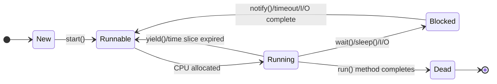

## Question 1(a) [3 marks]

**List out the rules to name an identifier in Java with valid and invalid examples.**

**Answer**:

**Rules for Java Identifiers:**

| Rule | Description | Valid Example | Invalid Example |
|------|-------------|---------------|-----------------|
| **Start Character** | Must begin with letter, underscore, or dollar sign | `name`, `_value`, `$cost` | `2name`, `#id` |
| **Following Characters** | Can contain letters, digits, underscore, dollar | `student123`, `user_name` | `my-var`, `class@` |
| **Keywords Restriction** | Cannot use Java reserved words | `myClass`, `userName` | `class`, `int` |
| **Case Sensitivity** | Identifiers are case-sensitive | `Name` ≠ `name` | - |
| **Length** | No length limit (practically reasonable) | `verylongvariablename` | - |

**Mnemonic:** "Letters First, Keywords Never, Case Counts"

---

## Question 1(b) [4 marks]

**List out different types of operators in Java. Explain Arithmetic and Logical Operators in detail.**

**Answer**:

**Java Operator Types:**

| Operator Type | Examples |
|---------------|----------|
| **Arithmetic** | `+`, `-`, `*`, `/`, `%` |
| **Relational** | `==`, `!=`, `<`, `>`, `<=`, `>=` |
| **Logical** | `&&`, `||`, `!` |
| **Assignment** | `=`, `+=`, `-=`, `*=`, `/=` |
| **Unary** | `++`, `--`, `+`, `-`, `!` |
| **Bitwise** | `&`, `|`, `^`, `~`, `<<`, `>>` |
| **Ternary** | `condition ? value1 : value2` |

**Arithmetic Operators:**

- **Addition (+)**: Adds two operands
- **Subtraction (-)**: Subtracts second from first
- **Multiplication (*)**: Multiplies two operands
- **Division (/)**: Divides first by second
- **Modulus (%)**: Returns remainder of division

**Logical Operators:**

- **AND (&&)**: Returns true if both conditions are true
- **OR (||)**: Returns true if at least one condition is true
- **NOT (!)**: Reverses the logical state

**Mnemonic:** "Add Subtract Multiply Divide Remainder, And Or Not"

---

## Question 1(c) [7 marks]

**Write a program in Java to reverse the digits of a number for number having three digits. Like reverse of 653 is 356.**

**Answer**:

```java
import java.util.Scanner;

public class ReverseNumber {
    public static void main(String[] args) {
        Scanner sc = new Scanner(System.in);
        
        System.out.print("Enter 3-digit number: ");
        int num = sc.nextInt();
        
        int reverse = 0;
        int temp = num;
        
        while (temp > 0) {
            reverse = reverse * 10 + temp % 10;
            temp = temp / 10;
        }
        
        System.out.println("Original: " + num);
        System.out.println("Reversed: " + reverse);
    }
}
```

**Algorithm:**

- **Extract last digit**: Use modulus operator (%)
- **Build reversed number**: Multiply by 10 and add digit
- **Remove last digit**: Use integer division (/)
- **Repeat**: Until original number becomes 0

**Mnemonic:** "Extract, Build, Remove, Repeat"

---

## Question 1(c OR) [7 marks]

**Write a program in Java to add two 3*3 matrices.**

**Answer**:

```java
import java.util.Scanner;

public class MatrixAddition {
    public static void main(String[] args) {
        Scanner sc = new Scanner(System.in);
        int[][] matrix1 = new int[3][3];
        int[][] matrix2 = new int[3][3];
        int[][] result = new int[3][3];
        
        // Input first matrix
        System.out.println("Enter first matrix:");
        for (int i = 0; i < 3; i++) {
            for (int j = 0; j < 3; j++) {
                matrix1[i][j] = sc.nextInt();
            }
        }
        
        // Input second matrix
        System.out.println("Enter second matrix:");
        for (int i = 0; i < 3; i++) {
            for (int j = 0; j < 3; j++) {
                matrix2[i][j] = sc.nextInt();
            }
        }
        
        // Add matrices
        for (int i = 0; i < 3; i++) {
            for (int j = 0; j < 3; j++) {
                result[i][j] = matrix1[i][j] + matrix2[i][j];
            }
        }
        
        // Display result
        System.out.println("Sum of matrices:");
        for (int i = 0; i < 3; i++) {
            for (int j = 0; j < 3; j++) {
                System.out.print(result[i][j] + " ");
            }
            System.out.println();
        }
    }
}
```

**Matrix Addition Steps:**

- **Create arrays**: Three 3x3 integer arrays
- **Input matrices**: Read values for both matrices
- **Add corresponding elements**: result[i][j] = matrix1[i][j] + matrix2[i][j]
- **Display result**: Print the sum matrix

**Mnemonic:** "Create, Input, Add, Display"

---

## Question 2(a) [3 marks]

**Write a program in Java that shows the use of parameterized Constructor.**

**Answer**:

```java
class Student {
    private String name;
    private int rollNo;
    
    // Parameterized Constructor
    public Student(String name, int rollNo) {
        this.name = name;
        this.rollNo = rollNo;
    }
    
    public void display() {
        System.out.println("Name: " + name);
        System.out.println("Roll No: " + rollNo);
    }
}

public class ParameterizedConstructor {
    public static void main(String[] args) {
        Student s1 = new Student("John", 101);
        s1.display();
    }
}
```

**Parameterized Constructor Features:**

- **Takes parameters**: Accepts values during object creation
- **Initializes instance variables**: Sets object state
- **Same name as class**: Constructor name matches class name
- **No return type**: Constructors don't have return type

**Mnemonic:** "Parameters Initialize Same-name No-return"

---

## Question 2(b) [4 marks]

**Give the basic syntax of the following terms with an example: (1) To create a Class, (2) To create an Object, (3) To define a Method, (4) To declare a Variable.**

**Answer**:

**Java Basic Syntax:**

| Component | Syntax | Example |
|-----------|--------|---------|
| **Class Creation** | `class ClassName { }` | `class Car { }` |
| **Object Creation** | `ClassName objectName = new ClassName();` | `Car myCar = new Car();` |
| **Method Definition** | `returnType methodName(parameters) { }` | `public void start() { }` |
| **Variable Declaration** | `dataType variableName;` | `int age;` |

**Complete Example:**

```java
class Car {                           // Class Creation
    int speed;                        // Variable Declaration
    
    public void accelerate() {        // Method Definition
        speed += 10;
    }
}

public class Main {
    public static void main(String[] args) {
        Car myCar = new Car();        // Object Creation
    }
}
```

**Mnemonic:** "Class Object Method Variable - COMV"

---

## Question 2(c) [7 marks]

**Write a program in Java which has a class Student having two instance variables enrollmentNo and name. Create 3 objects of Student class in main method and display student's name.**

**Answer**:

```java
class Student {
    String enrollmentNo;
    String name;
    
    // Constructor to initialize student data
    public Student(String enrollmentNo, String name) {
        this.enrollmentNo = enrollmentNo;
        this.name = name;
    }
    
    // Method to display student name
    public void displayName() {
        System.out.println("Student Name: " + name);
    }
}

public class StudentDemo {
    public static void main(String[] args) {
        // Creating 3 objects of Student class
        Student s1 = new Student("CS001", "Alice");
        Student s2 = new Student("CS002", "Bob");
        Student s3 = new Student("CS003", "Charlie");
        
        // Displaying student names
        s1.displayName();
        s2.displayName();
        s3.displayName();
    }
}
```

**Program Structure:**

- **Class definition**: Student class with instance variables
- **Constructor**: Initialize enrollmentNo and name
- **Method**: displayName() to show student name
- **Object creation**: Three Student objects in main method
- **Method calling**: Display names using displayName()

**Mnemonic:** "Define Initialize Display Create Call"

---

## Question 2(a OR) [3 marks]

**Write a program in Java that shows the use of Default Constructor.**

**Answer**:

```java
class Rectangle {
    int length;
    int width;
    
    // Default Constructor
    public Rectangle() {
        length = 5;
        width = 3;
        System.out.println("Default constructor called");
    }
    
    public void displayArea() {
        System.out.println("Area: " + (length * width));
    }
}

public class DefaultConstructor {
    public static void main(String[] args) {
        Rectangle r1 = new Rectangle();
        r1.displayArea();
    }
}
```

**Default Constructor Features:**

- **No parameters**: Takes no arguments
- **Default values**: Sets default values for instance variables
- **Automatic call**: Called when object is created
- **Same name as class**: Constructor name matches class name

**Mnemonic:** "No-parameters Default Automatic Same-name"

---

## Question 2(b OR) [4 marks]

**Give four Difference between Procedure Oriented Programming and Object-Oriented Programming.**

**Answer**:

**POP vs OOP Comparison:**

| Aspect | Procedure Oriented Programming | Object-Oriented Programming |
|--------|-------------------------------|----------------------------|
| **Approach** | Top-down approach | Bottom-up approach |
| **Focus** | Functions and procedures | Objects and classes |
| **Data Security** | No data hiding, global access | Data encapsulation and hiding |
| **Problem Solving** | Divide into functions | Divide into objects |
| **Code Reusability** | Limited reusability | High reusability through inheritance |
| **Maintenance** | Difficult to maintain | Easy to maintain and modify |

**Key Differences:**

- **Structure**: POP uses functions, OOP uses classes
- **Security**: OOP provides better data protection
- **Reusability**: OOP supports inheritance and polymorphism
- **Maintenance**: OOP code is easier to maintain

**Mnemonic:** "Structure Security Reusability Maintenance"

---

## Question 2(c OR) [7 marks]

**Write a program in Java which has a class Shape having 2 overloaded methods area (float radius) and area (float length, float width). Display the area of circle and rectangle using overloaded methods.**

**Answer**:

```java
class Shape {
    // Method to calculate area of circle
    public void area(float radius) {
        float circleArea = 3.14f * radius * radius;
        System.out.println("Area of Circle: " + circleArea);
    }
    
    // Overloaded method to calculate area of rectangle
    public void area(float length, float width) {
        float rectangleArea = length * width;
        System.out.println("Area of Rectangle: " + rectangleArea);
    }
}

public class MethodOverloading {
    public static void main(String[] args) {
        Shape shape = new Shape();
        
        // Calculate area of circle with radius 5
        shape.area(5.0f);
        
        // Calculate area of rectangle with length 4 and width 6
        shape.area(4.0f, 6.0f);
    }
}
```

**Method Overloading Concepts:**

- **Same method name**: Both methods named "area"
- **Different parameters**: One takes radius, other takes length and width
- **Compile-time polymorphism**: Method selected at compile time
- **Parameter differentiation**: Different number or type of parameters

**Mnemonic:** "Same-name Different-parameters Compile-time Parameter-differentiation"

---

## Question 3(a) [3 marks]

**Write a program in Java to demonstrate single inheritance.**

**Answer**:

```java
// Parent class
class Animal {
    public void eat() {
        System.out.println("Animal is eating");
    }
    
    public void sleep() {
        System.out.println("Animal is sleeping");
    }
}

// Child class inheriting from Animal
class Dog extends Animal {
    public void bark() {
        System.out.println("Dog is barking");
    }
}

public class SingleInheritance {
    public static void main(String[] args) {
        Dog dog = new Dog();
        
        // Inherited methods from Animal class
        dog.eat();
        dog.sleep();
        
        // Own method of Dog class
        dog.bark();
    }
}
```

**Single Inheritance Features:**

- **One parent**: Child class inherits from one parent class
- **extends keyword**: Used to establish inheritance relationship
- **Method inheritance**: Child class inherits parent methods
- **IS-A relationship**: Dog IS-A Animal

**Mnemonic:** "One-parent Extends Method IS-A"

---

## Question 3(b) [4 marks]

**Define abstract class in JAVA with example.**

**Answer**:

**Abstract Class Definition:**
An abstract class is a class that cannot be instantiated and may contain abstract methods (methods without implementation).

```java
// Abstract class
abstract class Vehicle {
    String brand;
    
    // Regular method
    public void displayBrand() {
        System.out.println("Brand: " + brand);
    }
    
    // Abstract method (no implementation)
    public abstract void start();
    public abstract void stop();
}

// Concrete class extending abstract class
class Car extends Vehicle {
    public Car(String brand) {
        this.brand = brand;
    }
    
    // Must implement abstract methods
    public void start() {
        System.out.println("Car started with key");
    }
    
    public void stop() {
        System.out.println("Car stopped with brake");
    }
}

public class AbstractDemo {
    public static void main(String[] args) {
        Car car = new Car("Toyota");
        car.displayBrand();
        car.start();
        car.stop();
    }
}
```

**Abstract Class Features:**

- **Cannot instantiate**: Cannot create objects directly
- **Abstract methods**: Methods without body
- **Concrete methods**: Regular methods with implementation
- **Must extend**: Child classes must implement abstract methods

**Mnemonic:** "Cannot-instantiate Abstract-methods Concrete-methods Must-extend"

---

## Question 3(c) [7 marks]

**Write a program in Java to implement multiple inheritance using interfaces.**

**Answer**:

```java
// First interface
interface Flyable {
    void fly();
}

// Second interface  
interface Swimmable {
    void swim();
}

// Class implementing multiple interfaces
class Duck implements Flyable, Swimmable {
    private String name;
    
    public Duck(String name) {
        this.name = name;
    }
    
    // Implementing fly method from Flyable interface
    public void fly() {
        System.out.println(name + " is flying in the sky");
    }
    
    // Implementing swim method from Swimmable interface
    public void swim() {
        System.out.println(name + " is swimming in water");
    }
    
    public void walk() {
        System.out.println(name + " is walking on land");
    }
}

public class MultipleInheritance {
    public static void main(String[] args) {
        Duck duck = new Duck("Donald");
        
        // Methods from interfaces
        duck.fly();
        duck.swim();
        
        // Own method
        duck.walk();
    }
}
```

**Multiple Inheritance via Interfaces:**

- **Multiple interfaces**: Class can implement multiple interfaces
- **implements keyword**: Used to implement interfaces
- **Must implement all methods**: All interface methods must be implemented
- **Solves diamond problem**: Avoids ambiguity of multiple inheritance

**Mnemonic:** "Multiple-interfaces Implements Must-implement Solves-diamond"

---

## Question 3(a OR) [3 marks]

**Write a program in Java to demonstrate multilevel inheritance.**

**Answer**:

```java
// Grandparent class
class Animal {
    public void breathe() {
        System.out.println("Animal is breathing");
    }
}

// Parent class inheriting from Animal
class Mammal extends Animal {
    public void giveBirth() {
        System.out.println("Mammal gives birth to babies");
    }
}

// Child class inheriting from Mammal
class Dog extends Mammal {
    public void bark() {
        System.out.println("Dog is barking");
    }
}

public class MultilevelInheritance {
    public static void main(String[] args) {
        Dog dog = new Dog();
        
        // Method from Animal class (grandparent)
        dog.breathe();
        
        // Method from Mammal class (parent)
        dog.giveBirth();
        
        // Own method of Dog class
        dog.bark();
    }
}
```

**Multilevel Inheritance Features:**

- **Chain of inheritance**: Child → Parent → Grandparent
- **Multiple levels**: More than two levels of inheritance
- **Transitive inheritance**: Properties passed through levels
- **extends keyword**: Each level uses extends

**Mnemonic:** "Chain Multiple Transitive Extends"

---

## Question 3(b OR) [4 marks]

**Define package and write the syntax to create a package with example.**

**Answer**:

**Package Definition:**
A package is a namespace that organizes related classes and interfaces. It provides access protection and namespace management.

**Package Syntax:**

```java
package packageName;
```

**Example:**

**File: mypackage/Calculator.java**

```java
package mypackage;

public class Calculator {
    public int add(int a, int b) {
        return a + b;
    }
    
    public int subtract(int a, int b) {
        return a - b;
    }
}
```

**File: TestCalculator.java**

```java
import mypackage.Calculator;

public class TestCalculator {
    public static void main(String[] args) {
        Calculator calc = new Calculator();
        
        System.out.println("Addition: " + calc.add(10, 5));
        System.out.println("Subtraction: " + calc.subtract(10, 5));
    }
}
```

**Package Benefits:**

- **Namespace management**: Avoids naming conflicts
- **Access control**: Controls class visibility
- **Code organization**: Groups related classes
- **Reusability**: Easy to reuse packaged classes

**Mnemonic:** "Namespace Access Organization Reusability"

---

## Question 3(c OR) [7 marks]

**Write a program in Java to demonstrate method overriding.**

**Answer**:

```java
// Parent class
class Animal {
    public void makeSound() {
        System.out.println("Animal makes a sound");
    }
    
    public void move() {
        System.out.println("Animal moves");
    }
}

// Child class overriding parent methods
class Dog extends Animal {
    // Method overriding
    @Override
    public void makeSound() {
        System.out.println("Dog barks: Woof! Woof!");
    }
    
    @Override
    public void move() {
        System.out.println("Dog runs on four legs");
    }
}

class Cat extends Animal {
    // Method overriding
    @Override
    public void makeSound() {
        System.out.println("Cat meows: Meow! Meow!");
    }
    
    @Override
    public void move() {
        System.out.println("Cat walks silently");
    }
}

public class MethodOverriding {
    public static void main(String[] args) {
        Animal animal;
        
        // Dog object
        animal = new Dog();
        animal.makeSound();  // Calls Dog's makeSound()
        animal.move();       // Calls Dog's move()
        
        System.out.println();
        
        // Cat object
        animal = new Cat();
        animal.makeSound();  // Calls Cat's makeSound()
        animal.move();       // Calls Cat's move()
    }
}
```

**Method Overriding Features:**

- **Same method signature**: Same name, parameters, and return type
- **Runtime polymorphism**: Method decided at runtime
- **@Override annotation**: Optional but recommended
- **IS-A relationship**: Child class overrides parent method

**Mnemonic:** "Same-signature Runtime Override IS-A"

---

## Question 4(a) [3 marks]

**List and explain different types of errors in Java.**

**Answer**:

**Java Error Types:**

| Error Type | Description | Example |
|------------|-------------|---------|
| **Compile-time Errors** | Detected during compilation | Syntax errors, missing semicolons |
| **Runtime Errors** | Occur during program execution | Division by zero, null pointer |
| **Logical Errors** | Program runs but gives wrong output | Incorrect algorithm logic |

**Detailed Explanation:**

- **Compile-time**: Prevented by compiler, must fix before running
- **Runtime**: Program crashes during execution, handled by exceptions
- **Logical**: Hardest to find, program works but results are incorrect

**Common Examples:**

- **Syntax Error**: Missing semicolon, wrong brackets
- **RuntimeException**: ArrayIndexOutOfBounds, NullPointer
- **Logic Error**: Wrong formula, incorrect condition

**Mnemonic:** "Compile Runtime Logic - CRL"

---

## Question 4(b) [4 marks]

**What is wrapper class? Explain use of any two wrapper class.**

**Answer**:

**Wrapper Class Definition:**
Wrapper classes provide object representation of primitive data types. They convert primitives into objects.

**Wrapper Class Table:**

| Primitive | Wrapper Class |
|-----------|---------------|
| int | Integer |
| double | Double |
| boolean | Boolean |
| char | Character |

**Example - Integer Wrapper:**

```java
// Primitive to Object (Boxing)
int num = 100;
Integer intObj = Integer.valueOf(num);

// Object to Primitive (Unboxing)  
int value = intObj.intValue();

// Utility methods
String str = "123";
int parsed = Integer.parseInt(str);
```

**Example - Double Wrapper:**

```java
// Creating Double object
Double doubleObj = Double.valueOf(45.67);

// Converting string to double
String str = "123.45";
double value = Double.parseDouble(str);

// Checking special values
boolean isNaN = Double.isNaN(doubleObj);
```

**Wrapper Class Uses:**

- **Collections**: Store primitives in collections
- **Null values**: Can store null unlike primitives
- **Utility methods**: Parsing, conversion methods
- **Generics**: Use with generic types

**Mnemonic:** "Collections Null Utility Generics"

---

## Question 4(c) [7 marks]

**Write a program in Java to develop Banking Application in which user deposits the amount Rs 25000 and then start withdrawing of Rs 20000, Rs 4000 and it throws exception "Not Sufficient Fund" when user withdraws Rs. 2000 thereafter.**

**Answer**:

```java
// Custom Exception class
class InsufficientFundException extends Exception {
    public InsufficientFundException(String message) {
        super(message);
    }
}

// Bank Account class
class BankAccount {
    private double balance;
    
    public BankAccount(double initialBalance) {
        this.balance = initialBalance;
    }
    
    public void deposit(double amount) {
        balance += amount;
        System.out.println("Deposited: Rs." + amount);
        System.out.println("Current Balance: Rs." + balance);
    }
    
    public void withdraw(double amount) throws InsufficientFundException {
        if (amount > balance) {
            throw new InsufficientFundException("Not Sufficient Fund");
        }
        balance -= amount;
        System.out.println("Withdrawn: Rs." + amount);
        System.out.println("Remaining Balance: Rs." + balance);
    }
    
    public double getBalance() {
        return balance;
    }
}

public class BankingApplication {
    public static void main(String[] args) {
        BankAccount account = new BankAccount(0);
        
        try {
            // Deposit Rs. 25000
            account.deposit(25000);
            System.out.println();
            
            // Withdraw Rs. 20000
            account.withdraw(20000);
            System.out.println();
            
            // Withdraw Rs. 4000
            account.withdraw(4000);
            System.out.println();
            
            // Try to withdraw Rs. 2000 (will throw exception)
            account.withdraw(2000);
            
        } catch (InsufficientFundException e) {
            System.out.println("Exception: " + e.getMessage());
            System.out.println("Available Balance: Rs." + account.getBalance());
        }
    }
}
```

**Exception Handling Components:**

- **Custom exception**: InsufficientFundException extends Exception
- **throw keyword**: Throws exception when balance insufficient
- **try-catch block**: Handles the exception
- **Exception message**: Displays "Not Sufficient Fund"

**Banking Operations:**

- **Deposit**: Adds money to balance
- **Withdraw**: Subtracts money if sufficient balance
- **Balance check**: Validates before withdrawal
- **Exception handling**: Prevents program crash

**Mnemonic:** "Custom Throw Try-catch Message, Deposit Withdraw Check Handle"

---

## Question 4(a OR) [3 marks]

**Describe the complete lifecycle of a thread.**

**Answer**:

**Thread Lifecycle States:**



**Thread States:**

- **New**: Thread object created but not started
- **Runnable**: Thread ready to run, waiting for CPU
- **Running**: Thread currently executing
- **Blocked**: Thread waiting for resource or condition
- **Dead**: Thread execution completed

**State Transitions:**

- **start()**: New → Runnable
- **CPU allocation**: Runnable → Running  
- **wait()/sleep()**: Running → Blocked
- **notify()/timeout**: Blocked → Runnable
- **completion**: Running → Dead

**Mnemonic:** "New Runnable Running Blocked Dead"

---

## Question 4(b OR) [4 marks]

**List access specifiers and describe their purpose in JAVA.**

**Answer**:

**Java Access Specifiers:**

| Access Specifier | Same Class | Same Package | Subclass | Other Package |
|------------------|------------|--------------|----------|---------------|
| **private** | ✓ | ✗ | ✗ | ✗ |
| **default** | ✓ | ✓ | ✗ | ✗ |
| **protected** | ✓ | ✓ | ✓ | ✗ |
| **public** | ✓ | ✓ | ✓ | ✓ |

**Access Specifier Purposes:**

**Private:**

- **Encapsulation**: Hides implementation details
- **Data security**: Protects sensitive data
- **Class-only access**: Accessible within same class only

**Default (Package-private):**

- **Package access**: Accessible within same package
- **Module organization**: Groups related classes
- **No keyword needed**: Default when no specifier mentioned

**Protected:**

- **Inheritance support**: Accessible to subclasses
- **Package + inheritance**: Same package + subclasses
- **Controlled access**: More access than private, less than public

**Public:**

- **Universal access**: Accessible from anywhere
- **Interface methods**: Used for public APIs
- **Maximum visibility**: No access restrictions

**Mnemonic:** "Private Encapsulates, Default Packages, Protected inherits, Public Universal"

---

## Question 4(c OR) [7 marks]

**Write a program that executes two threads. One thread displays "Thread1" every 1000 milliseconds, and the other displays "Thread2" every 2000 milliseconds. Create the threads by extending the Thread class.**

**Answer**:

```java
// First thread class
class Thread1 extends Thread {
    public void run() {
        try {
            for (int i = 1; i <= 10; i++) {
                System.out.println("Thread1 - Count: " + i);
                Thread.sleep(1000); // Sleep for 1000 milliseconds
            }
        } catch (InterruptedException e) {
            System.out.println("Thread1 interrupted: " + e.getMessage());
        }
    }
}

// Second thread class
class Thread2 extends Thread {
    public void run() {
        try {
            for (int i = 1; i <= 5; i++) {
                System.out.println("Thread2 - Count: " + i);
                Thread.sleep(2000); // Sleep for 2000 milliseconds
            }
        } catch (InterruptedException e) {
            System.out.println("Thread2 interrupted: " + e.getMessage());
        }
    }
}

public class MultiThreadDemo {
    public static void main(String[] args) {
        // Create thread objects
        Thread1 t1 = new Thread1();
        Thread2 t2 = new Thread2();
        
        System.out.println("Starting both threads...");
        
        // Start both threads
        t1.start();
        t2.start();
        
        try {
            // Wait for both threads to complete
            t1.join();
            t2.join();
        } catch (InterruptedException e) {
            System.out.println("Main thread interrupted: " + e.getMessage());
        }
        
        System.out.println("Both threads completed execution");
    }
}
```

**Multithreading Concepts:**

- **Thread class extension**: Both classes extend Thread
- **run() method**: Contains thread execution code
- **sleep() method**: Pauses thread for specified time
- **start() method**: Begins thread execution
- **join() method**: Waits for thread completion

**Thread Synchronization:**

- **Concurrent execution**: Both threads run simultaneously
- **Independent timing**: Each thread has its own sleep interval
- **Exception handling**: InterruptedException caught and handled
- **Thread coordination**: join() ensures main waits for completion

**Mnemonic:** "Extend Run Sleep Start Join"

---

## Question 5(a) [3 marks]

**What is stream class? How are the stream classes classified?**

**Answer**:

**Stream Class Definition:**
Stream classes in Java provide a way to handle input and output operations. They represent a flow of data from source to destination.

**Stream Classification:**

```goat
                    Stream Classes
                          |
        ┌─────────────────┼─────────────────┐
        |                                   |
   Input Streams                      Output Streams
        |                                   |
┌───────┼───────┐                   ┌───────┼───────┐
|               |                   |               |
Byte Streams  Character Streams    Byte Streams  Character Streams
|               |                   |               |
InputStream   Reader              OutputStream    Writer
```

**Stream Types:**

| Stream Type | Purpose | Example Classes |
|-------------|---------|-----------------|
| **InputStream** | Read bytes | FileInputStream, BufferedInputStream |
| **OutputStream** | Write bytes | FileOutputStream, BufferedOutputStream |
| **Reader** | Read characters | FileReader, BufferedReader |
| **Writer** | Write characters | FileWriter, BufferedWriter |

**Classification Features:**

- **Direction**: Input (read) vs Output (write)
- **Data type**: Byte streams vs Character streams
- **Functionality**: Basic vs Buffered streams

**Mnemonic:** "Direction Data-type Functionality"

---

## Question 5(b) [4 marks]

**Illustrate purpose of method overriding with example.**

**Answer**:

**Method Overriding Purpose:**
Method overriding allows a subclass to provide specific implementation of a method that is already defined in its parent class.

```java
// Parent class
class Shape {
    public void draw() {
        System.out.println("Drawing a generic shape");
    }
    
    public double area() {
        return 0.0;
    }
}

// Child class overriding parent methods
class Circle extends Shape {
    private double radius;
    
    public Circle(double radius) {
        this.radius = radius;
    }
    
    // Overriding draw method
    @Override
    public void draw() {
        System.out.println("Drawing a circle with radius " + radius);
    }
    
    // Overriding area method
    @Override
    public double area() {
        return 3.14 * radius * radius;
    }
}

class Rectangle extends Shape {
    private double length, width;
    
    public Rectangle(double length, double width) {
        this.length = length;
        this.width = width;
    }
    
    @Override
    public void draw() {
        System.out.println("Drawing rectangle " + length + "x" + width);
    }
    
    @Override
    public double area() {
        return length * width;
    }
}

public class OverridingDemo {
    public static void main(String[] args) {
        Shape[] shapes = {
            new Circle(5.0),
            new Rectangle(4.0, 6.0)
        };
        
        for (Shape shape : shapes) {
            shape.draw();           // Calls overridden method
            System.out.println("Area: " + shape.area());
            System.out.println();
        }
    }
}
```

**Method Overriding Benefits:**

- **Runtime polymorphism**: Method selection at runtime
- **Specific implementation**: Child class provides specific behavior
- **Code flexibility**: Same interface, different implementations
- **Dynamic method dispatch**: Correct method called based on object type

**Mnemonic:** "Runtime Specific Flexibility Dynamic"

---

## Question 5(c) [7 marks]

**Write a program in Java to perform read and write operations on a Text file named Abc.txt.**

**Answer**:

```java
import java.io.*;

public class FileOperations {
    public static void main(String[] args) {
        String fileName = "Abc.txt";
        
        // Write operation
        writeToFile(fileName);
        
        // Read operation
        readFromFile(fileName);
    }
    
    // Method to write data to file
    public static void writeToFile(String fileName) {
        try {
            FileWriter writer = new FileWriter(fileName);
            
            // Writing data to file
            writer.write("Hello, this is Java file handling.\n");
            writer.write("This is line 2 of the file.\n");
            writer.write("File operations in Java are easy.\n");
            writer.write("End of file content.");
            
            writer.close();
            System.out.println("Data written to file successfully.");
            
        } catch (IOException e) {
            System.out.println("Error writing to file: " + e.getMessage());
        }
    }
    
    // Method to read data from file
    public static void readFromFile(String fileName) {
        try {
            FileReader reader = new FileReader(fileName);
            BufferedReader bufferedReader = new BufferedReader(reader);
            
            System.out.println("\nReading from file:");
            System.out.println("-------------------");
            
            String line;
            int lineNumber = 1;
            
            // Reading file line by line
            while ((line = bufferedReader.readLine()) != null) {
                System.out.println("Line " + lineNumber + ": " + line);
                lineNumber++;
            }
            
            bufferedReader.close();
            reader.close();
            
        } catch (FileNotFoundException e) {
            System.out.println("File not found: " + e.getMessage());
        } catch (IOException e) {
            System.out.println("Error reading file: " + e.getMessage());
        }
    }
}
```

**Alternative using try-with-resources:**

```java
// More efficient way using try-with-resources
public static void writeToFileImproved(String fileName) {
    try (FileWriter writer = new FileWriter(fileName)) {
        writer.write("Hello from improved method!\n");
        writer.write("Using try-with-resources.\n");
        System.out.println("Data written successfully.");
    } catch (IOException e) {
        System.out.println("Error: " + e.getMessage());
    }
}

public static void readFromFileImproved(String fileName) {
    try (BufferedReader reader = new BufferedReader(new FileReader(fileName))) {
        String line;
        while ((line = reader.readLine()) != null) {
            System.out.println(line);
        }
    } catch (IOException e) {
        System.out.println("Error: " + e.getMessage());
    }
}
```

**File Operation Components:**

- **FileWriter**: Used for writing character data to file
- **FileReader**: Used for reading character data from file
- **BufferedReader**: More efficient reading with buffering
- **Exception handling**: IOException and FileNotFoundException
- **Resource management**: Close streams to prevent memory leaks

**File Handling Steps:**

- **Create stream**: FileWriter/FileReader object
- **Perform operation**: write()/readLine() methods
- **Handle exceptions**: try-catch blocks
- **Close resources**: close() method or try-with-resources

**Mnemonic:** "Create Perform Handle Close"

---

## Question 5(a OR) [3 marks]

**Explain InputStream.**

**Answer**:

**InputStream Definition:**
InputStream is an abstract class that represents an input stream of bytes. It is the superclass of all classes representing an input stream of bytes.

**InputStream Hierarchy:**

```goat
                    InputStream
                         |
        ┌────────────────┼────────────────┐
        |                |                |
FileInputStream   ByteArrayInputStream  FilterInputStream
                                             |
                                    ┌────────┼────────┐
                                    |                 |
                            BufferedInputStream  DataInputStream
```

**Common InputStream Methods:**

| Method | Description | Example |
|--------|-------------|---------|
| **read()** | Reads single byte | `int b = in.read();` |
| **read(byte[])** | Reads bytes into array | `in.read(buffer);` |
| **available()** | Returns available bytes | `int count = in.available();` |
| **close()** | Closes the stream | `in.close();` |
| **skip(long)** | Skips specified bytes | `in.skip(10);` |

**Example Usage:**

```java
try (FileInputStream fis = new FileInputStream("data.txt")) {
    int data;
    while ((data = fis.read()) != -1) {
        System.out.print((char) data);
    }
} catch (IOException e) {
    e.printStackTrace();
}
```

**InputStream Features:**

- **Abstract class**: Cannot be instantiated directly
- **Byte-oriented**: Handles byte data
- **Input operations**: Reading data from various sources
- **Resource management**: Must be closed after use

**Mnemonic:** "Abstract Byte Input Resource"

---

## Question 5(b OR) [4 marks]

**Define package in JAVA. Write how package can be implemented in Java with proper syntax and one example.**

**Answer**:

**Package Definition:**
A package in Java is a namespace that organizes related classes and interfaces together. It provides access protection and namespace management.

**Package Implementation Syntax:**

```java
// 1. Package declaration (must be first line)
package packageName;

// 2. Import statements
import java.util.*;
import anotherPackage.ClassName;

// 3. Class definition
public class ClassName {
    // class body
}
```

**Package Creation Steps:**

| Step | Action | Example |
|------|--------|---------|
| **1. Create directory** | Make folder with package name | `mkdir mypackage` |
| **2. Package declaration** | Add package statement | `package mypackage;` |
| **3. Compile** | Compile with proper classpath | `javac -d . ClassName.java` |
| **4. Run** | Run with fully qualified name | `java mypackage.ClassName` |

**Complete Example:**

**File: utilities/MathOperations.java**

```java
package utilities;

public class MathOperations {
    public static int add(int a, int b) {
        return a + b;
    }
    
    public static int multiply(int a, int b) {
        return a * b;
    }
    
    public static double calculateArea(double radius) {
        return 3.14 * radius * radius;
    }
}
```

**File: utilities/StringOperations.java**

```java
package utilities;

public class StringOperations {
    public static String reverse(String str) {
        return new StringBuilder(str).reverse().toString();
    }
    
    public static boolean isPalindrome(String str) {
        String reversed = reverse(str);
        return str.equals(reversed);
    }
}
```

**File: TestPackage.java**

```java
import utilities.MathOperations;
import utilities.StringOperations;

public class TestPackage {
    public static void main(String[] args) {
        // Using MathOperations
        int sum = MathOperations.add(10, 20);
        int product = MathOperations.multiply(5, 4);
        double area = MathOperations.calculateArea(7.0);
        
        System.out.println("Sum: " + sum);
        System.out.println("Product: " + product);
        System.out.println("Area: " + area);
        
        // Using StringOperations
        String original = "hello";
        String reversed = StringOperations.reverse(original);
        boolean isPalindrome = StringOperations.isPalindrome("madam");
        
        System.out.println("Original: " + original);
        System.out.println("Reversed: " + reversed);
        System.out.println("Is 'madam' palindrome? " + isPalindrome);
    }
}
```

**Package Benefits:**

- **Namespace management**: Avoids naming conflicts
- **Access control**: Package-private access level
- **Code organization**: Groups related functionality
- **Reusability**: Easy to import and use

**Mnemonic:** "Namespace Access Organization Reusability"

---

## Question 5(c OR) [7 marks]

**Write a program in Java to demonstrate use of List. 1) Create ArrayList and add weekdays (in string form), 2) Create LinkedList and add months (in string form). Display both List.**

**Answer**:

```java
import java.util.*;

public class ListDemo {
    public static void main(String[] args) {
        // Demonstrate ArrayList with weekdays
        demonstrateArrayList();
        
        System.out.println("\n" + "=".repeat(50) + "\n");
        
        // Demonstrate LinkedList with months
        demonstrateLinkedList();
        
        System.out.println("\n" + "=".repeat(50) + "\n");
        
        // Compare both lists
        compareListOperations();
    }
    
    // Method to demonstrate ArrayList
    public static void demonstrateArrayList() {
        System.out.println("ARRAYLIST DEMONSTRATION");
        System.out.println("========================");
        
        // Create ArrayList and add weekdays
        ArrayList<String> weekdays = new ArrayList<>();
        
        // Adding weekdays
        weekdays.add("Monday");
        weekdays.add("Tuesday");
        weekdays.add("Wednesday");
        weekdays.add("Thursday");
        weekdays.add("Friday");
        weekdays.add("Saturday");
        weekdays.add("Sunday");
        
        // Display ArrayList
        System.out.println("Weekdays in ArrayList:");
        for (int i = 0; i < weekdays.size(); i++) {
            System.out.println((i + 1) + ". " + weekdays.get(i));
        }
        
        // ArrayList specific operations
        System.out.println("\nArrayList Operations:");
        System.out.println("Size: " + weekdays.size());
        System.out.println("First day: " + weekdays.get(0));
        System.out.println("Last day: " + weekdays.get(weekdays.size() - 1));
        System.out.println("Contains 'Friday': " + weekdays.contains("Friday"));
        
        // Enhanced for loop
        System.out.println("\nUsing Enhanced For Loop:");
        for (String day : weekdays) {
            System.out.print(day + " ");
        }
        System.out.println();
    }
    
    // Method to demonstrate LinkedList
    public static void demonstrateLinkedList() {
        System.out.println("LINKEDLIST DEMONSTRATION");
        System.out.println("=========================");
        
        // Create LinkedList and add months
        LinkedList<String> months = new LinkedList<>();
        
        // Adding months
        months.add("January");
        months.add("February");
        months.add("March");
        months.add("April");
        months.add("May");
        months.add("June");
        months.add("July");
        months.add("August");
        months.add("September");
        months.add("October");
        months.add("November");
        months.add("December");
        
        // Display LinkedList
        System.out.println("Months in LinkedList:");
        for (int i = 0; i < months.size(); i++) {
            System.out.println((i + 1) + ". " + months.get(i));
        }
        
        // LinkedList specific operations
        System.out.println("\nLinkedList Operations:");
        System.out.println("Size: " + months.size());
        System.out.println("First month: " + months.getFirst());
        System.out.println("Last month: " + months.getLast());
        
        // Add at specific positions
        months.addFirst("START");
        months.addLast("END");
        
        System.out.println("\nAfter adding at first and last:");
        System.out.println("First element: " + months.getFirst());
        System.out.println("Last element: " + months.getLast());
        System.out.println("Total size: " + months.size());
        
        // Remove the added elements
        months.removeFirst();
        months.removeLast();
        
        // Using Iterator
        System.out.println("\nUsing Iterator:");
        Iterator<String> iterator = months.iterator();
        while (iterator.hasNext()) {
            System.out.print(iterator.next() + " ");
        }
        System.out.println();
    }
    
    // Method to compare list operations
    public static void compareListOperations() {
        System.out.println("LIST COMPARISON");
        System.out.println("================");
        
        // Create both lists with sample data
        ArrayList<String> arrayList = new ArrayList<>();
        LinkedList<String> linkedList = new LinkedList<>();
        
        // Add sample data
        String[] data = {"A", "B", "C", "D", "E"};
        
        for (String item : data) {
            arrayList.add(item);
            linkedList.add(item);
        }
        
        System.out.println("ArrayList: " + arrayList);
        System.out.println("LinkedList: " + linkedList);
        
        // Performance comparison info
        System.out.println("\nPerformance Characteristics:");
        System.out.println("ArrayList - Better for: Random access, Memory efficient");
        System.out.println("LinkedList - Better for: Insertion/Deletion, Dynamic size");
    }
}
```

**List Interface Features:**

| Feature | ArrayList | LinkedList |
|---------|-----------|------------|
| **Internal Structure** | Dynamic array | Doubly linked list |
| **Access Time** | O(1) random access | O(n) sequential access |
| **Insertion/Deletion** | O(n) at middle | O(1) at ends |
| **Memory** | Less memory overhead | More memory for pointers |

**Common List Methods:**

- **add()**: Adds element to list
- **get()**: Retrieves element by index
- **size()**: Returns number of elements
- **contains()**: Checks if element exists
- **remove()**: Removes element
- **iterator()**: Returns iterator for traversal

**List Benefits:**

- **Dynamic size**: Grows and shrinks automatically
- **Ordered collection**: Maintains insertion order
- **Duplicate elements**: Allows duplicate values
- **Index-based access**: Access elements by position

**Mnemonic:** "Dynamic Ordered Duplicate Index-based"
