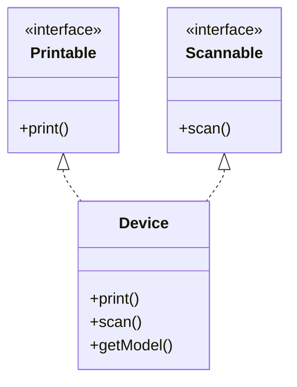
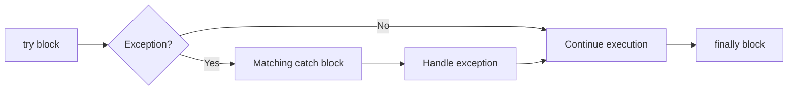
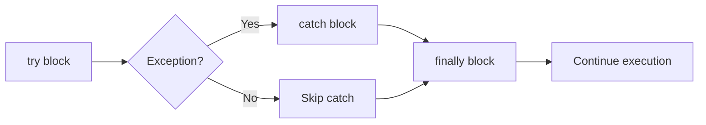

## પ્રશ્ન 1(અ) [3 ગુણ]

**Java ના વિવિધ પ્રકારના Primitive data typeની યાદી આપો.**

**જવાબ**:
Java મેમરીમાં સીધા સાદા મૂલ્યો સંગ્રહિત કરવા માટે આઠ primitive data types આપે છે.

**કોષ્ટક: Java Primitive Data Types**

| Data Type | સાઈઝ | વર્ણન | રેન્જ |
|-----------|------|-------------|-------|
| byte | 8 બિટ્સ | પૂર્ણાંક પ્રકાર | -128 થી 127 |
| short | 16 બિટ્સ | પૂર્ણાંક પ્રકાર | -32,768 થી 32,767 |
| int | 32 બિટ્સ | પૂર્ણાંક પ્રકાર | -2^31 થી 2^31-1 |
| long | 64 બિટ્સ | પૂર્ણાંક પ્રકાર | -2^63 થી 2^63-1 |
| float | 32 બિટ્સ | ફ્લોટિંગ-પોઇન્ટ | સિંગલ પ્રિસિઝન |
| double | 64 બિટ્સ | ફ્લોટિંગ-પોઇન્ટ | ડબલ પ્રિસિઝન |
| char | 16 બિટ્સ | અક્ષર | યુનિકોડ અક્ષરો |
| boolean | 1 બિટ | લોજિકલ | true અથવા false |

**મેમરી ટ્રીક:** "BILFDC-B: Byte Int Long Float Double Char Boolean પ્રકારો"

## પ્રશ્ન 1(બ) [4 ગુણ]

**યોગ્ય ઉદાહરણ સાથે Java Programનું સ્ટ્રક્ચર સમજાવો.**

**જવાબ**:
Java પ્રોગ્રામનું સ્ટ્રક્ચર package ડેક્લેરેશન, imports, ક્લાસ ડેફિનિશન, અને મેથોડ્સ સાથે ચોક્કસ સંગઠનને અનુસરે છે.

**આકૃતિ: Java પ્રોગ્રામ સ્ટ્રક્ચર**

```goat
+-----------------------+
| Documentation Comments|
+-----------------------+
| Package Declaration   |
+-----------------------+
| Import Statements     |
+-----------------------+
| Class Declaration     |
|  +------------------+ |
|  | Variables        | |
|  | Constructors     | |
|  | Methods          | |
|  +------------------+ |
+-----------------------+
```

**કોડ બ્લોક:**

```java
// Documentation comment
/**
 * Simple program to demonstrate Java structure
 * @author GTU Student
 */

// Package declaration
package com.example;

// Import statements
import java.util.Scanner;

// Class declaration
public class HelloWorld {
    // Variable declaration
    private String message;
    
    // Constructor
    public HelloWorld() {
        message = "Hello, World!";
    }
    
    // Method
    public void displayMessage() {
        System.out.println(message);
    }
    
    // Main method
    public static void main(String[] args) {
        HelloWorld obj = new HelloWorld();
        obj.displayMessage();
    }
}
```

**મેમરી ટ્રીક:** "PICOM: Package Import Class Objects Methods ક્રમમાં"

## પ્રશ્ન 1(ક) [7 ગુણ]

**Java ના arithmetic operatorsની યાદી આપો. કોઈ પણ ત્રણ arithmetic operatorsનો ઉપયોગ કરીને Java Program વિકસાવો અને તેનું output બતાવો.**

**જવાબ**:
Java માં arithmetic operators સંખ્યાત્મક મૂલ્યો પર ગાણિતિક કાર્યો કરે છે.

**કોષ્ટક: Java Arithmetic Operators**

| Operator | વર્ણન | ઉદાહરણ |
|----------|-------------|---------|
| + | સરવાળો | a + b |
| - | બાદબાકી | a - b |
| * | ગુણાકાર | a * b |
| / | ભાગાકાર | a / b |
| % | મોડ્યુલસ (શેષ) | a % b |
| ++ | ઇન્ક્રિમેન્ટ | a++ અથવા ++a |
| -- | ડિક્રિમેન્ટ | a-- અથવા --a |

**કોડ બ્લોક:**

```java
public class ArithmeticDemo {
    public static void main(String[] args) {
        int a = 10;
        int b = 3;
        
        // સરવાળો
        int sum = a + b;
        
        // ગુણાકાર
        int product = a * b;
        
        // મોડ્યુલસ
        int remainder = a % b;
        
        // પરિણામો દર્શાવો
        System.out.println("Values: a = " + a + ", b = " + b);
        System.out.println("Addition (a + b): " + sum);
        System.out.println("Multiplication (a * b): " + product);
        System.out.println("Modulus (a % b): " + remainder);
    }
}
```

**આઉટપુટ:**

```
Values: a = 10, b = 3
Addition (a + b): 13
Multiplication (a * b): 30
Modulus (a % b): 1
```

**મેમરી ટ્રીક:** "SAME: સરવાળો, Addition, Multiply, Exponentiation મૂળભૂત ઓપરેશન્સ"

## પ્રશ્ન 1(ક OR) [7 ગુણ]

**Javaમાં for લૂપ માટેની સિન્ટેક્ષ લખો. ૧ થી ૧૦ વચ્ચે આવતા પ્રાઈમ નંબર શોધવા માટેનો java કોડ વિકસાવો.**

**જવાબ**:
Java માં for લૂપ મૂલ્યોની શ્રેણી પર પુનરાવર્તન માટે કૉમ્પેક્ટ રીત પ્રદાન કરે છે.

**Java for લૂપની સિન્ટેક્ષ:**

```
for (initialization; condition; increment/decrement) {
    // statements to be executed
}
```

**કોડ બ્લોક:**

```java
public class PrimeNumbers {
    public static void main(String[] args) {
        System.out.println("Prime numbers between 1 and 10:");
        
        // 1 થી 10 સુધીની દરેક સંખ્યા તપાસો
        for (int num = 1; num <= 10; num++) {
            boolean isPrime = true;
            
            // num આ 2 થી num-1 સુધીની કોઈપણ સંખ્યાથી વિભાજ્ય છે કે નહીં તપાસો
            if (num > 1) {
                for (int i = 2; i < num; i++) {
                    if (num % i == 0) {
                        isPrime = false;
                        break;
                    }
                }
                
                // પ્રાઇમ હોય તો પ્રિન્ટ કરો
                if (isPrime) {
                    System.out.print(num + " ");
                }
            }
        }
    }
}
```

**આઉટપુટ:**

```
Prime numbers between 1 and 10:
2 3 5 7
```

**મેમરી ટ્રીક:** "ICE: Initialize, Check, Execute for લૂપના પગલાઓ"

## પ્રશ્ન 2(અ) [3 ગુણ]

**Procedure-Oriented Programming (POP) અને Object-Oriented Programming (OOP) ના તફાવતોની યાદી આપો.**

**જવાબ**:
Procedure-Oriented અને Object-Oriented Programming મૂળભૂત રીતે અલગ પ્રોગ્રામિંગ પેરાડાઇમ્સનું પ્રતિનિધિત્વ કરે છે.

**કોષ્ટક: POP vs OOP**

| ફીચર | Procedure-Oriented | Object-Oriented |
|---------|-------------------|-----------------|
| ફોકસ | ફંક્શન્સ/પ્રોસીજર્સ | ઓબ્જેક્ટ્સ |
| ડેટા | ફંક્શન્સથી અલગ | ઓબ્જેક્ટ્સમાં એન્કેપ્સ્યુલેટેડ |
| સુરક્ષા | ઓછી સુરક્ષિત | એક્સેસ કંટ્રોલ સાથે વધુ સુરક્ષિત |
| વારસો | સપોર્ટ નથી | સપોર્ટ કરે છે |
| રીયુઝેબિલિટી | ઓછી રીયુઝેબલ | ખૂબ રીયુઝેબલ |
| જટિલતા | નાના પ્રોગ્રામ માટે સરળ | જટિલ સિસ્ટમ માટે વધુ સારું |

- **સંગઠન**: POP ફંક્શન્સમાં વિભાજિત કરે છે; OOP ઓબ્જેક્ટ્સમાં જૂથ બનાવે છે
- **અભિગમ**: POP ટોપ-ડાઉન અનુસરે છે; OOP બોટમ-અપ અનુસરે છે

**મેમરી ટ્રીક:** "FIOS: Functions In Objects Structure મુખ્ય તફાવત"

## પ્રશ્ન 2(બ) [4 ગુણ]

**યોગ્ય ઉદાહરણ સાથે static કીવર્ડ સમજાવો.**

**જવાબ**:
Java માં static કીવર્ડ તે ક્લાસના બધા ઓબ્જેક્ટ્સ વચ્ચે શેર થતા ક્લાસ-લેવલ મેમ્બર્સ બનાવે છે.

**કોષ્ટક: static કીવર્ડના ઉપયોગો**

| ઉપયોગ | હેતુ | ઉદાહરણ |
|-----|---------|---------|
| static variable | બધા ઓબ્જેક્ટ્સ વચ્ચે શેર થાય છે | `static int count;` |
| static method | ઓબ્જેક્ટ વગર કૉલ કરી શકાય છે | `static void display()` |
| static block | ક્લાસ લોડ થાય ત્યારે એક્ઝિક્યુટ થાય છે | `static { // code }` |
| static nested class | આઉટર ક્લાસ સાથે જોડાયેલ | `static class Inner {}` |

**કોડ બ્લોક:**

```java
public class Counter {
    // બધા ઓબ્જેક્ટ્સ દ્વારા શેર કરેલ Static variable
    static int count = 0;
    
    // દરેક ઓબ્જેક્ટ માટે અનન્ય Instance variable
    int instanceCount = 0;
    
    // Constructor
    Counter() {
        count++;         // શેર કરેલ કાઉન્ટને વધારે છે
        instanceCount++; // આ ઓબ્જેક્ટના કાઉન્ટને વધારે છે
    }
    
    public static void main(String[] args) {
        Counter c1 = new Counter();
        Counter c2 = new Counter();
        Counter c3 = new Counter();
        
        System.out.println("Static count: " + Counter.count);
        System.out.println("c1's instance count: " + c1.instanceCount);
        System.out.println("c2's instance count: " + c2.instanceCount);
        System.out.println("c3's instance count: " + c3.instanceCount);
    }
}
```

**આઉટપુટ:**

```
Static count: 3
c1's instance count: 1
c2's instance count: 1
c3's instance count: 1
```

**મેમરી ટ્રીક:** "CBMS: Class-level, Before objects, Memory single, Shared by all"

## પ્રશ્ન 2(ક) [7 ગુણ]

**Constructorની વ્યાખ્યા આપો. Constructorના વિવિધ પ્રકારોની યાદી આપો. Parameterized constructor સમજાવવા માટેનો java code વિકસાવો.**

**જવાબ**:
Constructor એ વિશેષ મેથડ છે જેનું નામ તેના ક્લાસ સાથે સમાન હોય છે, જેનો ઉપયોગ ઓબ્જેક્ટ્સ બનાવતી વખતે તેમને પ્રારંભિક મૂલ્ય આપવા માટે થાય છે.

**Constructor ના પ્રકારો:**

**કોષ્ટક: Java માં Constructor ના પ્રકારો**

| પ્રકાર | વર્ણન | ઉદાહરણ |
|------|-------------|---------|
| Default | કોઈ પેરામીટર નહીં, કમ્પાઇલર દ્વારા બનાવાયેલ | `Student() {}` |
| No-arg | સ્પષ્ટપણે વ્યાખ્યાયિત, પેરામીટર નહીં | `Student() { name = "Unknown"; }` |
| Parameterized | પેરામીટર સ્વીકારે છે | `Student(String n) { name = n; }` |
| Copy | બીજા ઓબ્જેક્ટથી ઓબ્જેક્ટ બનાવે | `Student(Student s) { name = s.name; }` |

**કોડ બ્લોક:**

```java
public class Student {
    // Instance variables
    private String name;
    private int age;
    private String course;
    
    // Parameterized constructor
    public Student(String name, int age, String course) {
        this.name = name;
        this.age = age;
        this.course = course;
    }
    
    // વિદ્યાર્થીની વિગતો દર્શાવવા માટેની મેથડ
    public void displayDetails() {
        System.out.println("Student Details:");
        System.out.println("Name: " + name);
        System.out.println("Age: " + age);
        System.out.println("Course: " + course);
    }
    
    // ડેમોન્સ્ટ્રેશન માટે main મેથડ
    public static void main(String[] args) {
        // Parameterized constructor નો ઉપયોગ કરીને ઓબ્જેક્ટ બનાવવું
        Student student1 = new Student("John", 20, "Computer Science");
        student1.displayDetails();
        
        // બીજો વિદ્યાર્થી
        Student student2 = new Student("Lisa", 22, "Engineering");
        student2.displayDetails();
    }
}
```

**આઉટપુટ:**

```
Student Details:
Name: John
Age: 20
Course: Computer Science
Student Details:
Name: Lisa
Age: 22
Course: Engineering
```

**મેમરી ટ્રીક:** "IDCR: Initialize Data Create Ready ઓબ્જેક્ટ્સ"

## પ્રશ્ન 2(અ OR) [3 ગુણ]

**java મા મૂળભૂત OOP conceptsની યાદી આપો અને કોઈ પણ એક સમજાવો.**

**જવાબ**:
Java વિવિધ મૂળભૂત કન્સેપ્ટ્સ દ્વારા Object-Oriented Programming નો અમલ કરે છે.

**કોષ્ટક: Java માં મૂળભૂત OOP Concepts**

| Concept | વર્ણન |
|---------|-------------|
| Encapsulation | ડેટા અને મેથડ્સને એક સાથે બાંધવા |
| Inheritance | હાલના ક્લાસથી નવા ક્લાસ બનાવવા |
| Polymorphism | એક ઈન્ટરફેસ, વિવિધ અમલીકરણો |
| Abstraction | અમલીકરણની વિગતો છુપાવવી |
| Association | ઓબ્જેક્ટ્સ વચ્ચે સંબંધ |

**Encapsulation ઉદાહરણ:**

```java
public class Person {
    // Private data - બહારથી છુપાયેલ
    private String name;
    private int age;
    
    // Public methods - ડેટા ઍક્સેસ કરવા માટેનો ઇન્ટરફેસ
    public void setName(String name) {
        this.name = name;
    }
    
    public String getName() {
        return name;
    }
    
    public void setAge(int age) {
        // માન્યતા ડેટા અખંડિતતા સુનિશ્ચિત કરે છે
        if (age > 0 && age < 120) {
            this.age = age;
        } else {
            System.out.println("Invalid age");
        }
    }
    
    public int getAge() {
        return age;
    }
}
```

- **ડેટા છુપાવવું**: Private variables બહારથી અપ્રાપ્ય
- **નિયંત્રિત ઍક્સેસ**: Public methods (getters/setters) દ્વારા
- **અખંડિતતા**: ડેટા માન્યતા યોગ્ય મૂલ્યો સુનિશ્ચિત કરે છે

**મેમરી ટ્રીક:** "EIPA: Encapsulate Inherit Polymorphize Abstract"

## પ્રશ્ન 2(બ OR) [4 ગુણ]

**યોગ્ય ઉદાહરણ સાથે final કીવર્ડ સમજાવો.**

**જવાબ**:
Java માં final કીવર્ડ એન્ટિટીઓમાં ફેરફારોને મર્યાદિત કરે છે, કોન્સ્ટન્ટ્સ, અપરિવર્તનીય મેથડ્સ, અને નોન-ઇન્હેરિટેબલ ક્લાસ બનાવે છે.

**કોષ્ટક: final કીવર્ડના ઉપયોગો**

| ઉપયોગ | અસર | ઉદાહરણ |
|-----|--------|---------|
| final variable | સુધારી શકાતું નથી | `final int MAX = 100;` |
| final method | ઓવરરાઇડ કરી શકાતી નથી | `final void display() {}` |
| final class | વિસ્તૃત કરી શકાતો નથી | `final class Math {}` |
| final parameter | મેથડમાં બદલી શકાતા નથી | `void method(final int x) {}` |

**કોડ બ્લોક:**

```java
public class FinalDemo {
    // Final variable (constant)
    final int MAX_SPEED = 120;
    
    // Final method ઓવરરાઇડ કરી શકાતી નથી
    final void showLimit() {
        System.out.println("Speed limit: " + MAX_SPEED);
    }
    
    public static void main(String[] args) {
        FinalDemo car = new FinalDemo();
        car.showLimit();
        
        // આ કમ્પાઇલ એરર કરશે:
        // car.MAX_SPEED = 150;
    }
}

// Final class વિસ્તૃત કરી શકાતો નથી
final class MathUtil {
    public int square(int num) {
        return num * num;
    }
}

// આ કમ્પાઇલ એરર કરશે:
// class AdvancedMath extends MathUtil { }
```

**આઉટપુટ:**

```
Speed limit: 120
```

**મેમરી ટ્રીક:** "VMP: Variables Methods Permanence with final"

## પ્રશ્ન 2(ક OR) [7 ગુણ]

**java access modifierમાટેનો scope લખો. public modifier સમજાવવા માટેનો java code વિકસાવો.**

**જવાબ**:
Java માં access modifiers ક્લાસ, મેથડ્સ, અને વેરિએબલ્સની દૃશ્યતા અને ઍક્સેસિબિલિટીને નિયંત્રિત કરે છે.

**કોષ્ટક: Java Access Modifier Scope**

| Modifier | Class | Package | Subclass | World |
|----------|-------|---------|----------|-------|
| private | ✓ | ✗ | ✗ | ✗ |
| default (no modifier) | ✓ | ✓ | ✗ | ✗ |
| protected | ✓ | ✓ | ✓ | ✗ |
| public | ✓ | ✓ | ✓ | ✓ |

**કોડ બ્લોક:**

```java
// ફાઇલ: PublicDemo.java
package com.example;

// Public class બધે ઍક્સેસિબલ છે
public class PublicDemo {
    // Public variable બધે ઍક્સેસિબલ છે
    public String message = "Hello, World!";
    
    // Public method બધે ઍક્સેસિબલ છે
    public void displayMessage() {
        System.out.println(message);
    }
}

// ફાઇલ: Main.java
package com.test;

// અલગ પેકેજમાંથી import કરવું
import com.example.PublicDemo;

public class Main {
    public static void main(String[] args) {
        // અલગ પેકેજના ક્લાસનો ઓબ્જેક્ટ બનાવવો
        PublicDemo demo = new PublicDemo();
        
        // અલગ પેકેજમાંથી public variable ઍક્સેસ કરવો
        System.out.println("Message: " + demo.message);
        
        // અલગ પેકેજમાંથી public method કૉલ કરવી
        demo.displayMessage();
        
        // અલગ પેકેજમાંથી public variable સુધારવો
        demo.message = "Modified message";
        demo.displayMessage();
    }
}
```

**આઉટપુટ:**

```
Message: Hello, World!
Hello, World!
Modified message
```

**મેમરી ટ્રીક:** "CEPM: Class Everywhere Public Most accessible"

## પ્રશ્ન 3(અ) [3 ગુણ]

**વિવિધ પ્રકારના inheritance ની યાદી આપો અને કોઈ પણ એક ઉદાહરણ સાથે સમજાવો.**

**જવાબ**:
Inheritance એક ક્લાસને બીજા ક્લાસમાંથી attributes અને behaviors વારસામાં લેવાની ક્ષમતા આપે છે.

**કોષ્ટક: Java માં Inheritance ના પ્રકારો**

| પ્રકાર | વર્ણન |
|------|-------------|
| Single | એક ક્લાસ એક ક્લાસને extends કરે છે |
| Multilevel | Inheritance ની સાંકળ (A→B→C) |
| Hierarchical | ઘણા ક્લાસ એક ક્લાસને extends કરે છે |
| Multiple | એક ક્લાસ ઘણા ક્લાસમાંથી વારસો મેળવે છે (ઇન્ટરફેસ દ્વારા) |
| Hybrid | ઘણા inheritance પ્રકારોનું સંયોજન |

**Single Inheritance ઉદાહરણ:**

```java
// પેરેન્ટ ક્લાસ
class Animal {
    protected String name;
    
    public Animal(String name) {
        this.name = name;
    }
    
    public void eat() {
        System.out.println(name + " is eating");
    }
}

// Animal માંથી વારસો મેળવતો ચાઇલ્ડ ક્લાસ
class Dog extends Animal {
    private String breed;
    
    public Dog(String name, String breed) {
        super(name);  // પેરેન્ટ કન્સ્ટ્રક્ટર કૉલ કરો
        this.breed = breed;
    }
    
    public void bark() {
        System.out.println(name + " is barking");
    }
    
    public void displayInfo() {
        System.out.println("Name: " + name);
        System.out.println("Breed: " + breed);
    }
}

// મુખ્ય ક્લાસ
public class InheritanceDemo {
    public static void main(String[] args) {
        Dog dog = new Dog("Max", "Labrador");
        dog.displayInfo();
        dog.eat();     // વારસામાં મળેલી મેથડ
        dog.bark();    // પોતાની મેથડ
    }
}
```

**આઉટપુટ:**

```
Name: Max
Breed: Labrador
Max is eating
Max is barking
```

**મેમરી ટ્રીક:** "SMHMH: Single Multilevel Hierarchical Multiple Hybrid પ્રકારો"

## પ્રશ્ન 3(બ) [4 ગુણ]

**કોઈ પણ બે String buffer class methods યોગ્ય ઉદાહરણ સાથે સમજાવો.**

**જવાબ**:
StringBuffer અક્ષરોનો બદલી શકાય તેવો ક્રમ છે જેનો ઉપયોગ સ્ટ્રિંગ્સને મોડિફાય કરવા માટે થાય છે, વિવિધ હેરફેર મેથડ્સ ઓફર કરે છે.

**કોષ્ટક: બે StringBuffer મેથડ્સ**

| મેથડ | હેતુ | સિન્ટેક્સ |
|--------|---------|--------|
| append() | અંતે સ્ટ્રિંગ ઉમેરે છે | `sb.append(String str)` |
| insert() | નિર્દિષ્ટ સ્થાને સ્ટ્રિંગ ઉમેરે છે | `sb.insert(int offset, String str)` |

**કોડ બ્લોક:**

```java
public class StringBufferMethodsDemo {
    public static void main(String[] args) {
        // StringBuffer બનાવો
        StringBuffer sb = new StringBuffer("Hello");
        System.out.println("Original: " + sb);
        
        // append() મેથડ - અંતે ટેક્સ્ટ ઉમેરે છે
        sb.append(" World");
        System.out.println("After append(): " + sb);
        
        // વિવિધ ડેટા પ્રકારો append કરી શકે છે
        sb.append('!');
        sb.append(2024);
        System.out.println("After appending more: " + sb);
        
        // ડેમોન્સ્ટ્રેશન માટે રીસેટ
        sb = new StringBuffer("Java");
        System.out.println("\nNew Original: " + sb);
        
        // insert() મેથડ - નિર્દિષ્ટ સ્થાને ટેક્સ્ટ ઉમેરે છે
        sb.insert(0, "Learn ");
        System.out.println("After insert() at beginning: " + sb);
        
        sb.insert(10, " Programming");
        System.out.println("After insert() in middle: " + sb);
    }
}
```

**આઉટપુટ:**

```
Original: Hello
After append(): Hello World
After appending more: Hello World!2024

New Original: Java
After insert() at beginning: Learn Java
After insert() in middle: Learn Java Programming
```

**મેમરી ટ્રીક:** "AIMS: Append Insert Modify StringBuffer"

## પ્રશ્ન 3(ક) [7 ગુણ]

**Interfaceની વ્યાખ્યા આપો. Interfaceની મદદથી multiple inheritance નો java program લખો.**

**જવાબ**:
Interface એક કરાર છે જે એવી મેથડ્સ ઘોષિત કરે છે જે એક ક્લાસ અમલ કરવા માટે જરૂરી છે, જે Java માં multiple inheritance શક્ય બનાવે છે.

**વ્યાખ્યા:**
Interface એ એક રેફરન્સ પ્રકાર છે જેમાં માત્ર કોન્સ્ટન્ટ્સ, મેથડ સિગ્નેચર્સ, ડિફોલ્ટ મેથડ્સ, સ્ટેટિક મેથડ્સ, અને નેસ્ટેડ પ્રકારો સમાવિષ્ટ છે, જેમાં abstract મેથડ્સ માટે કોઈ અમલીકરણ નથી.

**આકૃતિ: Interfaces નો ઉપયોગ કરીને Multiple Inheritance**



**કોડ બ્લોક:**

```java
// પ્રથમ ઇન્ટરફેસ
interface Printable {
    void print();
}

// બીજું ઇન્ટરફેસ
interface Scannable {
    void scan();
}

// બંને ઇન્ટરફેસને અમલ કરતો ક્લાસ
class Device implements Printable, Scannable {
    private String model;
    
    public Device(String model) {
        this.model = model;
    }
    
    // Printable માંથી print() મેથડનું અમલીકરણ
    @Override
    public void print() {
        System.out.println(model + " is printing a document");
    }
    
    // Scannable માંથી scan() મેથડનું અમલીકરણ
    @Override
    public void scan() {
        System.out.println(model + " is scanning a document");
    }
    
    // ક્લાસની પોતાની મેથડ
    public void getModel() {
        System.out.println("Device Model: " + model);
    }
}

// મુખ્ય ક્લાસ
public class MultipleInheritanceDemo {
    public static void main(String[] args) {
        Device device = new Device("HP LaserJet");
        
        // મોડેલ દર્શાવો
        device.getModel();
        
        // ઘણા ઇન્ટરફેસની મેથડ્સનો ઉપયોગ
        device.print();
        device.scan();
        
        // ડિવાઇસ ઇન્ટરફેસનો ઇન્સ્ટન્સ છે કે નહીં તપાસો
        System.out.println("Is device Printable? " + (device instanceof Printable));
        System.out.println("Is device Scannable? " + (device instanceof Scannable));
    }
}
```

**આઉટપુટ:**

```
Device Model: HP LaserJet
HP LaserJet is printing a document
HP LaserJet is scanning a document
Is device Printable? true
Is device Scannable? true
```

**મેમરી ટ્રીક:** "IMAC: Interface Multiple Abstract Contract"

## પ્રશ્ન 3(અ OR) [3 ગુણ]

**Abstract class અને Interface નો તફાવત આપો.**

**જવાબ**:
Abstract class અને interface બંને abstraction માટે વપરાય છે પરંતુ ઘણા મહત્વપૂર્ણ પાસાઓમાં અલગ પડે છે.

**કોષ્ટક: Abstract Class vs Interface**

| ફીચર | Abstract Class | Interface |
|---------|---------------|-----------|
| કીવર્ડ | abstract | interface |
| મેથડ્સ | abstract અને concrete બંને | Abstract (અને Java 8થી default) |
| વેરિએબલ્સ | કોઈપણ પ્રકાર | માત્ર public static final |
| કન્સ્ટ્રક્ટર | ધરાવે છે | ધરાવતું નથી |
| વારસો | સિંગલ | મલ્ટિપલ |
| એક્સેસ મોડિફાયર્સ | કોઈપણ | માત્ર public |
| હેતુ | આંશિક અમલીકરણ | સંપૂર્ણ abstraction |

- **અમલીકરણ**: Abstract class આંશિક અમલીકરણ પ્રદાન કરી શકે છે; interface પરંપરાગત રીતે કોઈ નહીં
- **સંબંધ**: Abstract class કહે છે "is-a"; interface કહે છે "can-do-this"

**મેમરી ટ્રીક:** "MAPS: Methods Access Purpose Single vs multiple"

## પ્રશ્ન 3(બ OR) [4 ગુણ]

**કોઈ પણ બે String class methods યોગ્ય ઉદાહરણ સાથે સમજાવો.**

**જવાબ**:
String ક્લાસ સ્ટ્રિંગ મેનિપ્યુલેશન, કમ્પેરિઝન અને ટ્રાન્સફોર્મેશન માટે વિવિધ મેથડ્સ આપે છે.

**કોષ્ટક: બે String મેથડ્સ**

| મેથડ | હેતુ | સિન્ટેક્સ |
|--------|---------|--------|
| substring() | સ્ટ્રિંગનો ભાગ કાઢે છે | `str.substring(int beginIndex, int endIndex)` |
| equals() | સ્ટ્રિંગ કન્ટેન્ટની તુલના કરે છે | `str1.equals(str2)` |

**કોડ બ્લોક:**

```java
public class StringMethodsDemo {
    public static void main(String[] args) {
        String message = "Java Programming";
        
        // substring() મેથડ
        // "Java" ને કાઢો (ઇન્ડેક્સ 0 થી 3)
        String sub1 = message.substring(0, 4);
        System.out.println("substring(0, 4): " + sub1);
        
        // "Programming" ને કાઢો (ઇન્ડેક્સ 5 થી અંત)
        String sub2 = message.substring(5);
        System.out.println("substring(5): " + sub2);
        
        // equals() મેથડ
        String str1 = "Hello";
        String str2 = "Hello";
        String str3 = "hello";
        String str4 = new String("Hello");
        
        System.out.println("\nComparing strings with equals():");
        System.out.println("str1.equals(str2): " + str1.equals(str2));  // true
        System.out.println("str1.equals(str3): " + str1.equals(str3));  // false
        System.out.println("str1.equals(str4): " + str1.equals(str4));  // true
        
        System.out.println("\nComparing strings with ==:");
        System.out.println("str1 == str2: " + (str1 == str2));  // true
        System.out.println("str1 == str4: " + (str1 == str4));  // false
    }
}
```

**આઉટપુટ:**

```
substring(0, 4): Java
substring(5): Programming

Comparing strings with equals():
str1.equals(str2): true
str1.equals(str3): false
str1.equals(str4): true

Comparing strings with ==:
str1 == str2: true
str1 == str4: false
```

**મેમરી ટ્રીક:** "SEC: Substring Equals Compare સ્ટ્રિંગ કન્ટેન્ટ"

## પ્રશ્ન 3(ક OR) [7 ગુણ]

**Package સમજાવો અને package create કરવા માટેના સ્ટેપ્સની યાદી બનાવો.**

**જવાબ**:
Java માં package એ નેમસ્પેસ છે જે સંબંધિત ક્લાસ અને ઇન્ટરફેસને સંગઠિત કરે છે, નામકરણ સંઘર્ષોને અટકાવે છે.

**Package બનાવવાના પગલાં:**

**કોષ્ટક: Package બનાવવાના પગલાં**

| પગલું | ક્રિયા |
|------|--------|
| 1 | સોર્સ ફાઇલોની ટોચે package નામ ઘોષિત કરો |
| 2 | package નામને મેચ કરતું ડિરેક્ટરી સ્ટ્રક્ચર બનાવો |
| 3 | Java ફાઇલને યોગ્ય ડિરેક્ટરીમાં સેવ કરો |
| 4 | javac -d વિકલ્પ સાથે package ડિરેક્ટરી બનાવવા માટે કમ્પાઇલ કરો |
| 5 | ફુલી ક્વોલિફાઇડ નામથી પ્રોગ્રામ ચલાવો |

**કોડ બ્લોક:**

```java
// પગલું 1: ટોચે package ઘોષિત કરો (Calculator.java તરીકે સેવ કરો)
package com.example.math;

// Calculator ક્લાસ
public class Calculator {
    public int add(int a, int b) {
        return a + b;
    }
    
    public int subtract(int a, int b) {
        return a - b;
    }
    
    public int multiply(int a, int b) {
        return a * b;
    }
    
    public double divide(int a, int b) {
        if (b == 0) {
            throw new ArithmeticException("Cannot divide by zero");
        }
        return (double) a / b;
    }
}

// પગલું 1: package ઘોષિત કરો (CalculatorApp.java તરીકે સેવ કરો)
package com.example.app;

// પેકેજ import કરો
import com.example.math.Calculator;

public class CalculatorApp {
    public static void main(String[] args) {
        // package માંથી Calculator ક્લાસનો ઉપયોગ
        Calculator calc = new Calculator();
        
        System.out.println("Addition: " + calc.add(10, 5));
        System.out.println("Subtraction: " + calc.subtract(10, 5));
        System.out.println("Multiplication: " + calc.multiply(10, 5));
        System.out.println("Division: " + calc.divide(10, 5));
    }
}
```

**ટર્મિનલ કમાન્ડ્સ:**

```
// પગલું 2: ડિરેક્ટરી સ્ટ્રક્ચર બનાવો
mkdir -p com/example/math
mkdir -p com/example/app

// પગલું 3: ફાઇલ્સ યોગ્ય ડિરેક્ટરીમાં મૂકો
mv Calculator.java com/example/math/
mv CalculatorApp.java com/example/app/

// પગલું 4: -d વિકલ્પ સાથે કમ્પાઇલ કરો
javac -d . com/example/math/Calculator.java
javac -d . -cp . com/example/app/CalculatorApp.java

// પગલું 5: ફુલી ક્વોલિફાઇડ નામથી ચલાવો
java com.example.app.CalculatorApp
```

**આઉટપુટ:**

```
Addition: 15
Subtraction: 5
Multiplication: 50
Division: 2.0
```

**મેમરી ટ્રીક:** "DISCO: Declare Import Save Compile Organize"

## પ્રશ્ન 4(અ) [3 ગુણ]

**java માં errorના પ્રકારોની યાદી આપો.**

**જવાબ**:
Java પ્રોગ્રામ્સ ડેવલપમેન્ટ અને એક્ઝિક્યુશન દરમિયાન વિવિધ errors નો સામનો કરી શકે છે.

**કોષ્ટક: Java માં Errors ના પ્રકારો**

| Error પ્રકાર | ક્યારે થાય છે | ઉદાહરણ |
|------------|-------------|---------|
| Compile-time Errors | કમ્પાઇલેશન દરમિયાન | Syntax errors, type errors |
| Runtime Errors | એક્ઝિક્યુશન દરમિયાન | NullPointerException, ArrayIndexOutOfBoundsException |
| Logical Errors | ખોટા આઉટપુટ સાથે એક્ઝિક્યુશન દરમિયાન | ખોટી ગણતરી, અનંત લૂપ |
| Linkage Errors | ક્લાસ લોડિંગ દરમિયાન | NoClassDefFoundError |
| Thread Death | જ્યારે થ્રેડ સમાપ્ત થાય | ThreadDeath |

- **Syntax Errors**: સેમિકોલોન, બ્રેકેટ્સની ગેરહાજરી, અથવા ટાઇપો
- **Semantic Errors**: ટાઇપ મિસમેચિસ, અસંગત ઓપરેશન્સ
- **Exceptions**: હેન્ડલિંગની જરૂર પડતી રનટાઇમ સમસ્યાઓ

**મેમરી ટ્રીક:** "CRLLT: Compile Runtime Logical Linkage Thread errors"

## પ્રશ્ન 4(બ) [4 ગુણ]

**try catch block યોગ્ય ઉદાહરણ સાથે સમજાવો.**

**જવાબ**:
Java માં try-catch બ્લોકએ exceptions ને હેન્ડલ કરે છે, જેનાથી ભૂલો હોવા છતાં પ્રોગ્રામ્સને ચાલુ રાખવાની મંજૂરી મળે છે.

**આકૃતિ: Try-Catch ફ્લો**



**કોડ બ્લોક:**

```java
public class TryCatchDemo {
    public static void main(String[] args) {
        int[] numbers = {10, 20, 30};
        
        try {
            // એરે બાઉન્ડ્સની બહાર એલિમેન્ટને ઍક્સેસ કરવાનો પ્રયાસ
            System.out.println("Trying to access element 5: " + numbers[4]);
            
            // જો exception થાય તો આ કોડ એક્ઝિક્યુટ નહીં થાય
            System.out.println("This won't be printed");
        } 
        catch (ArrayIndexOutOfBoundsException e) {
            // ચોક્કસ exception ને હેન્ડલ કરો
            System.out.println("Exception caught: " + e.getMessage());
            System.out.println("Array index out of bounds");
        }
        catch (Exception e) {
            // અન્ય exceptions ને હેન્ડલ કરો
            System.out.println("General exception caught: " + e.getMessage());
        }
        finally {
            // આ બ્લોક હંમેશા એક્ઝિક્યુટ થાય છે
            System.out.println("Finally block executed");
        }
        
        // પ્રોગ્રામ એક્ઝિક્યુશન ચાલુ રાખે છે
        System.out.println("Program continues after exception handling");
    }
}
```

**આઉટપુટ:**

```
Exception caught: Index 4 out of bounds for length 3
Array index out of bounds
Finally block executed
Program continues after exception handling
```

**મેમરી ટ્રીક:** "TCFE: Try Catch Finally Execute ભૂલો હોવા છતાં"

## પ્રશ્ન 4(ક) [7 ગુણ]

**method overloading અને overriding વચ્ચેના ચાર તફાવત આપો. method overriding સમજાવવા માટેનો java program લખો.**

**જવાબ**:
Method overloading અને overriding બંને polymorphism ના પ્રકારો છે પરંતુ ફંક્શનાલિટી અને અમલીકરણમાં અલગ પડે છે.

**કોષ્ટક: Method Overloading vs Overriding**

| ફીચર | Method Overloading | Method Overriding |
|---------|-------------------|-------------------|
| ઉદ્ભવ | એક જ ક્લાસમાં | પેરન્ટ અને ચાઇલ્ડ ક્લાસમાં |
| પેરામીટર્સ | અલગ પેરામીટર્સ | સમાન પેરામીટર્સ |
| રિટર્ન ટાઇપ | અલગ હોઈ શકે | સમાન અથવા સબટાઇપ (કોવેરિયન્ટ) હોવી જોઈએ |
| Access Modifier | અલગ હોઈ શકે | વધુ પ્રતિબંધિત ન હોઈ શકે |
| બાઇન્ડિંગ | કમ્પાઇલ-ટાઇમ (સ્ટેટિક) | રનટાઇમ (ડાયનેમિક) |
| હેતુ | એક મેથડના ઘણા વર્તન | વિશેષ અમલીકરણ |
| ઇન્હેરિટન્સ | જરૂરી નથી | જરૂરી છે |
| @Override | વપરાતું નથી | ભલામણ કરાય છે |

**કોડ બ્લોક:**

```java
// પેરન્ટ ક્લાસ
class Animal {
    public void makeSound() {
        System.out.println("Animal makes a sound");
    }
    
    public void eat() {
        System.out.println("Animal eats food");
    }
}

// મેથડ્સ ઓવરરાઇડ કરતો ચાઇલ્ડ ક્લાસ
class Dog extends Animal {
    // Method overriding
    @Override
    public void makeSound() {
        System.out.println("Dog barks");
    }
    
    @Override
    public void eat() {
        System.out.println("Dog eats meat");
    }
}

// બીજો ચાઇલ્ડ ક્લાસ અલગ ઓવરરાઇડ્સ સાથે
class Cat extends Animal {
    // Method overriding
    @Override
    public void makeSound() {
        System.out.println("Cat meows");
    }
}

// Method overriding ડેમોન્સ્ટ્રેટ કરવા માટેનો મુખ્ય ક્લાસ
public class MethodOverridingDemo {
    public static void main(String[] args) {
        // પેરન્ટ ક્લાસ રેફરન્સ અને ઓબ્જેક્ટ
        Animal animal = new Animal();
        
        // ચાઇલ્ડ ક્લાસ રેફરન્સ અને ઓબ્જેક્ટ્સ
        Animal dog = new Dog();
        Animal cat = new Cat();
        
        // Method overriding વર્તન ડેમોન્સ્ટ્રેટ કરવું
        System.out.println("Animal behavior:");
        animal.makeSound();
        animal.eat();
        
        System.out.println("\nDog behavior:");
        dog.makeSound();  // ઓવરરાઇડ મેથડ કૉલ કરે છે
        dog.eat();        // ઓવરરાઇડ મેથડ કૉલ કરે છે
        
        System.out.println("\nCat behavior:");
        cat.makeSound();  // ઓવરરાઇડ મેથડ કૉલ કરે છે
        cat.eat();        // પેરન્ટ મેથડ કૉલ કરે છે (ઓવરરાઇડ નથી કરી)
    }
}
```

**આઉટપુટ:**

```
Animal behavior:
Animal makes a sound
Animal eats food

Dog behavior:
Dog barks
Dog eats meat

Cat behavior:
Cat meows
Animal eats food
```

**મેમરી ટ્રીક:** "SBRE: Same-name, Base-derived, Runtime-resolution, Extend functionality"

## પ્રશ્ન 4(અ OR) [3 ગુણ]

**કોઈ પણ ચાર inbuilt exceptions ની યાદી આપો.**

**જવાબ**:
Java ઘણા બિલ્ટ-ઇન exception ક્લાસ પ્રદાન કરે છે જે વિવિધ ભૂલની સ્થિતિઓનું પ્રતિનિધિત્વ કરે છે.

**કોષ્ટક: ચાર સામાન્ય Inbuilt Exceptions**

| Exception | કારણ | Package |
|-----------|-------|---------|
| NullPointerException | null રેફરન્સને ઍક્સેસ/મોડિફાય | java.lang |
| ArrayIndexOutOfBoundsException | અમાન્ય એરે ઇન્ડેક્સ | java.lang |
| ArithmeticException | અમાન્ય ગાણિતિક ઓપરેશન (શૂન્ય વડે ભાગાકાર) | java.lang |
| ClassCastException | અમાન્ય ક્લાસ કાસ્ટિંગ | java.lang |

- **Unchecked**: Runtime exceptions (સ્પષ્ટ હેન્ડલિંગની જરૂર નથી)
- **Hierarchy**: બધા Exception ક્લાસમાંથી extends થાય છે
- **Handling**: try-catch બ્લોક્સથી પકડી શકાય છે

**મેમરી ટ્રીક:** "NAAC: Null Array Arithmetic Cast સામાન્ય exceptions"

## પ્રશ્ન 4(બ OR) [4 ગુણ]

**યોગ્ય ઉદાહરણ સાથે "throw" કીવર્ડ સમજાવો.**

**જવાબ**:
Java માં throw કીવર્ડ પ્રોગ્રામ્સમાં અસાધારણ સ્થિતિઓ માટે મેન્યુઅલી exceptions જનરેટ કરે છે.

**કોષ્ટક: throw કીવર્ડના ઉપયોગો**

| ઉપયોગ | હેતુ |
|-------|---------|
| throw new ExceptionType() | Exception બનાવવી અને ફેંકવી |
| throw new ExceptionType(message) | કસ્ટમ મેસેજ સાથે બનાવવી |
| throws in method signature | મેથડ કઈ exception ફેંકી શકે છે તે ઘોષિત કરવું |
| checked/unchecked ફેંકી શકે | checked exceptions માટે try-catch જરૂરી |

**કોડ બ્લોક:**

```java
public class ThrowDemo {
    // exception જનરેટ કરવા માટે throw નો ઉપયોગ કરતી મેથડ
    public static void validateAge(int age) {
        // અમાન્ય ઉંમર માટે તપાસ
        if (age < 0) {
            throw new IllegalArgumentException("Age cannot be negative");
        }
        
        // ઉંમર પ્રતિબંધ માટે તપાસ
        if (age < 18) {
            throw new ArithmeticException("Not eligible to vote");
        } else {
            System.out.println("Eligible to vote");
        }
    }
    
    public static void main(String[] args) {
        try {
            // માન્ય ઉંમર
            System.out.println("Validating age 20:");
            validateAge(20);
            
            // અપૂરતી ઉંમર
            System.out.println("\nValidating age 15:");
            validateAge(15);
        } catch (ArithmeticException e) {
            System.out.println("ArithmeticException: " + e.getMessage());
        } catch (IllegalArgumentException e) {
            System.out.println("IllegalArgumentException: " + e.getMessage());
        }
        
        try {
            // નેગેટિવ ઉંમર
            System.out.println("\nValidating age -5:");
            validateAge(-5);
        } catch (Exception e) {
            System.out.println("Exception: " + e.getMessage());
        }
    }
}
```

**આઉટપુટ:**

```
Validating age 20:
Eligible to vote

Validating age 15:
ArithmeticException: Not eligible to vote

Validating age -5:
Exception: Age cannot be negative
```

**મેમરી ટ્રીક:** "CET: Create Exception Throw error handling માટે"

## પ્રશ્ન 4(ક OR) [7 ગુણ]

**'this' કીવર્ડ 'Super' કીવર્ડ સાથે સરખાવો. યોગ્ય ઉદાહરણ સાથે super કીવર્ડ સમજાવો.**

**જવાબ**:
'this' અને 'super' કીવર્ડ Java માં રેફરન્સિંગ માટે વપરાય છે, અલગ-અલગ હેતુઓ અને વર્તન સાથે.

**કોષ્ટક: this vs super કીવર્ડ સરખામણી**

| ફીચર | this કીવર્ડ | super કીવર્ડ |
|---------|-------------|---------------|
| રેફરન્સ | વર્તમાન ક્લાસ | પેરન્ટ ક્લાસ |
| ઉપયોગ | વર્તમાન ક્લાસ મેમ્બર્સ ઍક્સેસ કરવા | પેરન્ટ ક્લાસ મેમ્બર્સ ઍક્સેસ કરવા |
| કન્સ્ટ્રક્ટર કૉલ | this() | super() |
| વેરિએબલ રેઝોલ્યુશન | this.var (વર્તમાન ક્લાસ) | super.var (પેરન્ટ ક્લાસ) |
| મેથડ ઇન્વોકેશન | this.method() (વર્તમાન ક્લાસ) | super.method() (પેરન્ટ ક્લાસ) |
| પોઝિશન | કન્સ્ટ્રક્ટરમાં પ્રથમ સ્ટેટમેન્ટ | કન્સ્ટ્રક્ટરમાં પ્રથમ સ્ટેટમેન્ટ |
| ઇન્હેરિટન્સ | ઇન્હેરિટન્સ સાથે સંબંધિત નથી | ઇન્હેરિટન્સ સાથે વપરાય છે |

**કોડ બ્લોક:**

```java
// પેરન્ટ ક્લાસ
class Vehicle {
    // પેરન્ટ ક્લાસ વેરિએબલ્સ
    protected String brand = "Ford";
    protected String color = "Red";
    
    // પેરન્ટ ક્લાસ કન્સ્ટ્રક્ટર
    Vehicle() {
        System.out.println("Vehicle constructor called");
    }
    
    // પેરન્ટ ક્લાસ મેથડ
    void displayInfo() {
        System.out.println("Brand: " + brand);
        System.out.println("Color: " + color);
    }
}

// ચાઇલ્ડ ક્લાસ
class Car extends Vehicle {
    // ચાઇલ્ડ ક્લાસ વેરિએબલ્સ (પેરન્ટ સાથે સમાન નામ)
    private String brand = "Toyota";
    private String color = "Blue";
    
    // ચાઇલ્ડ ક્લાસ કન્સ્ટ્રક્ટર
    Car() {
        super(); // પેરન્ટ કન્સ્ટ્રક્ટર કૉલ કરો
        System.out.println("Car constructor called");
    }
    
    // વેરિએબલ્સ સાથે super નો ઉપયોગ કરતી મેથડ
    void printDetails() {
        // this નો ઉપયોગ કરી ચાઇલ્ડ ક્લાસ વેરિએબલ્સ ઍક્સેસ કરો
        System.out.println("Car brand (this): " + this.brand);
        System.out.println("Car color (this): " + this.color);
        
        // super નો ઉપયોગ કરી પેરન્ટ ક્લાસ વેરિએબલ્સ ઍક્સેસ કરો
        System.out.println("Vehicle brand (super): " + super.brand);
        System.out.println("Vehicle color (super): " + super.color);
    }
    
    // મેથડ્સ સાથે super નો ઉપયોગ કરતી મેથડ
    @Override
    void displayInfo() {
        System.out.println("Car information:");
        // પેરન્ટ મેથડ કૉલ કરો
        super.displayInfo();
        System.out.println("Model: Corolla");
    }
}

// મુખ્ય ક્લાસ
public class SuperKeywordDemo {
    public static void main(String[] args) {
        // Car ઓબ્જેક્ટ બનાવો
        Car myCar = new Car();
        
        System.out.println("\nVariable access with this and super:");
        myCar.printDetails();
        
        System.out.println("\nMethod call with super:");
        myCar.displayInfo();
    }
}
```

**આઉટપુટ:**

```
Vehicle constructor called
Car constructor called

Variable access with this and super:
Car brand (this): Toyota
Car color (this): Blue
Vehicle brand (super): Ford
Vehicle color (super): Red

Method call with super:
Car information:
Brand: Ford
Color: Red
Model: Corolla
```

**મેમરી ટ્રીક:** "PCIM: Parent Class Inheritance Members with super"

## પ્રશ્ન 5(અ) [3 ગુણ]

**વિવિધ Stream Classes ની યાદી આપો.**

**જવાબ**:
Java I/O ઇનપુટ અને આઉટપુટ ઓપરેશન્સ માટે વિવિધ સ્ટ્રીમ ક્લાસ પ્રદાન કરે છે.

**કોષ્ટક: Java Stream Classes**

| કેટેગરી | સ્ટ્રીમ ક્લાસ |
|----------|---------------|
| Byte Streams | FileInputStream, FileOutputStream, BufferedInputStream, BufferedOutputStream |
| Character Streams | FileReader, FileWriter, BufferedReader, BufferedWriter |
| Data Streams | DataInputStream, DataOutputStream |
| Object Streams | ObjectInputStream, ObjectOutputStream |
| Print Streams | PrintStream, PrintWriter |

- **Byte Streams**: બાઇનરી ડેટા (8-બિટ બાઇટ્સ) સાથે કામ કરે છે
- **Character Streams**: અક્ષરો (16-બિટ યુનિકોડ) સાથે કામ કરે છે
- **Buffered Streams**: બફરિંગ દ્વારા પરફોર્મન્સ સુધારે છે

**મેમરી ટ્રીક:** "BCDOP: Byte Character Data Object Print streams"

## પ્રશ્ન 5(બ) [4 ગુણ]

**'Divide by Zero' એરર માટે યુઝર ડીફાઇન એક્સેપ્સન હેન્ડલ કરવા માટે જાવા પ્રોગ્રામ લખો.**

**જવાબ**:
યુઝર-ડિફાઈન્ડ exceptions એપ્લિકેશન-સ્પેસિફિક ભૂલની સ્થિતિઓ માટે કસ્ટમ exception પ્રકારો બનાવવાની મંજૂરી આપે છે.

**કોડ બ્લોક:**

```java
// ડિવાઇડ બાય ઝીરો માટે કસ્ટમ exception
class DivideByZeroException extends Exception {
    // પેરામીટર્સ વગરનો કન્સ્ટ્રક્ટર
    public DivideByZeroException() {
        super("Cannot divide by zero");
    }
    
    // કસ્ટમ મેસેજ સાથેનો કન્સ્ટ્રક્ટર
    public DivideByZeroException(String message) {
        super(message);
    }
}

// કસ્ટમ exception ડેમોન્સ્ટ્રેટ કરતો મુખ્ય ક્લાસ
public class CustomExceptionDemo {
    // આપણી કસ્ટમ exception ફેંકી શકે તેવી મેથડ
    public static double divide(int numerator, int denominator) throws DivideByZeroException {
        if (denominator == 0) {
            throw new DivideByZeroException("Division by zero not allowed");
        }
        return (double) numerator / denominator;
    }
    
    public static void main(String[] args) {
        try {
            // માન્ય ઇનપુટ સાથે ટેસ્ટ
            System.out.println("10 / 2 = " + divide(10, 2));
            
            // ડિનોમિનેટર તરીકે ઝીરો સાથે ટેસ્ટ
            System.out.println("10 / 0 = " + divide(10, 0));
        } catch (DivideByZeroException e) {
            System.out.println("Error: " + e.getMessage());
            System.out.println("Custom exception stack trace:");
            e.printStackTrace();
        }
        
        System.out.println("Program continues execution...");
    }
}
```

**આઉટપુટ:**

```
10 / 2 = 5.0
Error: Division by zero not allowed
Custom exception stack trace:
DivideByZeroException: Division by zero not allowed
    at CustomExceptionDemo.divide(CustomExceptionDemo.java:19)
    at CustomExceptionDemo.main(CustomExceptionDemo.java:29)
Program continues execution...
```

**મેમરી ટ્રીક:** "ETC: Extend Throw Catch custom exceptions"

## પ્રશ્ન 5(ક) [7 ગુણ]

**જાવામાં એક પ્રોગ્રામ લખો જે બાઈટ બાય બાઈટ ફાઈલના કન્ટેન્ટ વાંચે અને તેને બીજી ફાઈલ માં કોપી કરે.**

**જવાબ**:
Java માં ફાઇલ I/O ઓપરેશન્સ ફાઇલ્સ માંથી વાંચવા અને લખવાની મંજૂરી આપે છે, બાઇટ સ્ટ્રીમ્સ બાઇનરી ડેટાને હેન્ડલ કરે છે.

**કોડ બ્લોક:**

```java
import java.io.FileInputStream;
import java.io.FileOutputStream;
import java.io.IOException;

public class FileCopyByteByByte {
    public static void main(String[] args) {
        // સોર્સ અને ડેસ્ટિનેશન ફાઇલ પાથ્સ વ્યાખ્યાયિત કરો
        String sourceFile = "source.txt";
        String destinationFile = "destination.txt";
        
        // ફાઇલ સ્ટ્રીમ્સ માટે વેરિએબલ્સ
        FileInputStream inputStream = null;
        FileOutputStream outputStream = null;
        
        try {
            // ઇનપુટ અને આઉટપુટ સ્ટ્રીમ્સ ઇનિશિયલાઇઝ કરો
            inputStream = new FileInputStream(sourceFile);
            outputStream = new FileOutputStream(destinationFile);
            
            System.out.println("Copying file " + sourceFile + " to " + destinationFile);
            
            // કોપી પ્રોસેસ ટ્રેક કરવા માટે વેરિએબલ્સ
            int byteData;
            int byteCount = 0;
            
            // ફાઇલનો અંત (-1) આવે ત્યાં સુધી બાઇટ બાય બાઇટ ફાઇલ વાંચો
            while ((byteData = inputStream.read()) != -1) {
                // બાઇટને ડેસ્ટિનેશન ફાઇલમાં લખો
                outputStream.write(byteData);
                byteCount++;
            }
            
            System.out.println("File copied successfully!");
            System.out.println("Total bytes copied: " + byteCount);
            
        } catch (IOException e) {
            System.out.println("Error during file copy: " + e.getMessage());
            e.printStackTrace();
        } finally {
            // finally બ્લોકમાં રિસોર્સિસ બંધ કરો
            try {
                if (inputStream != null) {
                    inputStream.close();
                }
                if (outputStream != null) {
                    outputStream.close();
                }
                System.out.println("File streams closed successfully");
            } catch (IOException e) {
                System.out.println("Error closing streams: " + e.getMessage());
            }
        }
    }
}
```

**પ્રથમ source.txt ફાઇલ બનાવવી:**

```java
import java.io.FileWriter;
import java.io.IOException;

public class CreateSourceFile {
    public static void main(String[] args) {
        try {
            FileWriter writer = new FileWriter("source.txt");
            writer.write("This is a sample file.\n");
            writer.write("It will be copied byte by byte.\n");
            writer.write("Java I/O operations demo.");
            writer.close();
            System.out.println("Source file created successfully!");
        } catch (IOException e) {
            System.out.println("Error creating source file: " + e.getMessage());
        }
    }
}
```

**આઉટપુટ:**

```
Source file created successfully!
Copying file source.txt to destination.txt
File copied successfully!
Total bytes copied: 82
File streams closed successfully
```

**મેમરી ટ્રીક:** "CROW: Create Read Open Write file operations"

## પ્રશ્ન 5(અ OR) [3 ગુણ]

**javaના વિવિધ file operationsની યાદી આપો.**

**જવાબ**:
Java વિવિધ ફાઇલ ઓપરેશન્સ દ્વારા વ્યાપક ફાઇલ હેન્ડલિંગ ક્ષમતાઓ પ્રદાન કરે છે.

**કોષ્ટક: Java માં File Operations**

| ઓપરેશન | વર્ણન | વપરાતા ક્લાસ |
|-----------|-------------|--------------|
| File Creation | નવી ફાઇલ્સ બનાવવી | File, FileOutputStream, FileWriter |
| File Reading | ફાઇલ્સમાંથી વાંચવું | FileInputStream, FileReader, Scanner |
| File Writing | ફાઇલ્સમાં લખવું | FileOutputStream, FileWriter, PrintWriter |
| File Deletion | ફાઇલ્સ ડિલીટ કરવી | File.delete() |
| File Information | ફાઇલ મેટાડેટા મેળવવા | File methods (length, isFile, વગેરે) |
| Directory Operations | ડિરેક્ટરીઓ બનાવવી/લિસ્ટ કરવી | File methods (mkdir, list, વગેરે) |
| File Copy | ફાઇલ કન્ટેન્ટ કોપી કરવા | FileInputStream with FileOutputStream |
| File Renaming | ફાઇલ્સનું નામ બદલવું અથવા ખસેડવી | File.renameTo() |

- **Stream-based**: લો-લેવલ બાઇટ અથવા કેરેક્ટર સ્ટ્રીમ્સ
- **Reader/Writer**: કેરેક્ટર-ઓરિએન્ટેડ ફાઇલ ઓપરેશન્સ
- **NIO Package**: એન્હાન્સ્ડ ફાઇલ ઓપરેશન્સ (Java 7થી)

**મેમરી ટ્રીક:** "CRWD: Create Read Write Delete મૂળભૂત ઓપરેશન્સ"

## પ્રશ્ન 5(બ OR) [4 ગુણ]

**એક્સેપ્સન હેન્ડલિંગ માં finally block સમજાવતો જાવા પ્રોગ્રામ લખો.**

**જવાબ**:
Exception હેન્ડલિંગમાં finally બ્લોક છે કે exception થાય કે ન થાય, કોડ એક્ઝિક્યુશન સુનિશ્ચિત કરે છે.

**આકૃતિ: try-catch-finally ફ્લો**



**કોડ બ્લોક:**

```java
import java.io.FileInputStream;
import java.io.FileNotFoundException;
import java.io.IOException;

public class FinallyBlockDemo {
    public static void main(String[] args) {
        // ઉદાહરણ 1: કોઈ exception વગર finally
        System.out.println("Example 1: No exception");
        try {
            int result = 10 / 5;
            System.out.println("Result: " + result);
        } catch (ArithmeticException e) {
            System.out.println("Arithmetic exception caught: " + e.getMessage());
        } finally {
            System.out.println("Finally block executed - Example 1");
        }
        
        // ઉદાહરણ 2: catch થયેલા exception સાથે finally
        System.out.println("\nExample 2: Exception caught");
        try {
            int result = 10 / 0; // આ exception ફેંકશે
            System.out.println("This won't be printed");
        } catch (ArithmeticException e) {
            System.out.println("Arithmetic exception caught: " + e.getMessage());
        } finally {
            System.out.println("Finally block executed - Example 2");
        }
        
        // ઉદાહરણ 3: રિસોર્સ મેનેજમેન્ટ સાથે finally
        System.out.println("\nExample 3: Resource management");
        FileInputStream file = null;
        try {
            file = new FileInputStream("nonexistent.txt"); // આ exception ફેંકશે
            System.out.println("File opened successfully");
        } catch (FileNotFoundException e) {
            System.out.println("File not found: " + e.getMessage());
        } finally {
            // exception થાય તોપણ રિસોર્સિસ બંધ કરો
            try {
                if (file != null) {
                    file.close();
                }
                System.out.println("File resource closed in finally block");
            } catch (IOException e) {
                System.out.println("Error closing file: " + e.getMessage());
            }
        }
        
        System.out.println("\nProgram continues execution...");
    }
}
```

**આઉટપુટ:**

```
Example 1: No exception
Result: 2
Finally block executed - Example 1

Example 2: Exception caught
Arithmetic exception caught: / by zero
Finally block executed - Example 2

Example 3: Resource management
File not found: nonexistent.txt (No such file or directory)
File resource closed in finally block

Program continues execution...
```

**મેમરી ટ્રીક:** "ACRE: Always Cleanup Resources Executes"

## પ્રશ્ન 5(ક OR) [7 ગુણ]

**ફાઈલ ક્રિએટ કરવા અને તેમાં લખવા માટેનો જાવા પ્રોગ્રામ લખો.**

**જવાબ**:
Java કેરેક્ટર અથવા બાઇટ સ્ટ્રીમ્સનો ઉપયોગ કરીને ફાઇલ્સ બનાવવા અને તેમાં ડેટા લખવા માટે ઘણી રીતો પ્રદાન કરે છે.

**કોડ બ્લોક:**

```java
import java.io.File;
import java.io.FileWriter;
import java.io.IOException;
import java.io.BufferedWriter;
import java.text.SimpleDateFormat;
import java.util.Date;
import java.util.Scanner;

public class FileWriteDemo {
    public static void main(String[] args) {
        Scanner scanner = null;
        FileWriter fileWriter = null;
        BufferedWriter bufferedWriter = null;
        
        try {
            // File ઓબ્જેક્ટ બનાવો
            File myFile = new File("sample_data.txt");
            
            // ફાઇલ પહેલેથી અસ્તિત્વમાં છે કે નહીં તપાસો
            if (myFile.exists()) {
                System.out.println("File already exists: " + myFile.getName());
                System.out.println("File path: " + myFile.getAbsolutePath());
                System.out.println("File size: " + myFile.length() + " bytes");
            } else {
                // નવી ફાઇલ બનાવો
                if (myFile.createNewFile()) {
                    System.out.println("File created successfully: " + myFile.getName());
                } else {
                    System.out.println("Failed to create file");
                    return;
                }
            }
            
            // FileWriter ઇનિશિયલાઇઝ કરો (true પેરામીટર ફાઇલમાં ઉમેરે છે)
            fileWriter = new FileWriter(myFile);
            
            // કાર્યક્ષમ લેખન માટે BufferedWriter વાપરો
            bufferedWriter = new BufferedWriter(fileWriter);
            
            // વર્તમાન તારીખ અને સમય મેળવો
            SimpleDateFormat formatter = new SimpleDateFormat("dd/MM/yyyy HH:mm:ss");
            Date date = new Date();
            
            // ફાઇલમાં લખો
            bufferedWriter.write("==== File Write Demonstration ====");
            bufferedWriter.newLine();
            bufferedWriter.write("Created on: " + formatter.format(date));
            bufferedWriter.newLine();
            
            // ફાઇલમાં લખવા માટે યુઝર ઇનપુટ મેળવો
            scanner = new Scanner(System.in);
            System.out.println("\nEnter text to write to file (type 'exit' to finish):");
            
            String line;
            while (true) {
                line = scanner.nextLine();
                if (line.equalsIgnoreCase("exit")) {
                    break;
                }
                bufferedWriter.write(line);
                bufferedWriter.newLine();
            }
            
            System.out.println("\nFile write operation completed successfully!");
            
        } catch (IOException e) {
            System.out.println("Error occurred: " + e.getMessage());
            e.printStackTrace();
        } finally {
            // રિસોર્સિસ બંધ કરો
            try {
                if (bufferedWriter != null) {
                    bufferedWriter.close();
                }
                if (fileWriter != null) {
                    fileWriter.close();
                }
                if (scanner != null) {
                    scanner.close();
                }
            } catch (IOException e) {
                System.out.println("Error closing resources: " + e.getMessage());
            }
        }
    }
}
```

**ઉદાહરણ આઉટપુટ:**

```
File created successfully: sample_data.txt

Enter text to write to file (type 'exit' to finish):
This is line 1 of my file.
This is line 2 with some Java content.
Here is line 3 with more text.
exit

File write operation completed successfully!
```

**મેમરી ટ્રીક:** "COWS: Create Open Write Save file operations"
