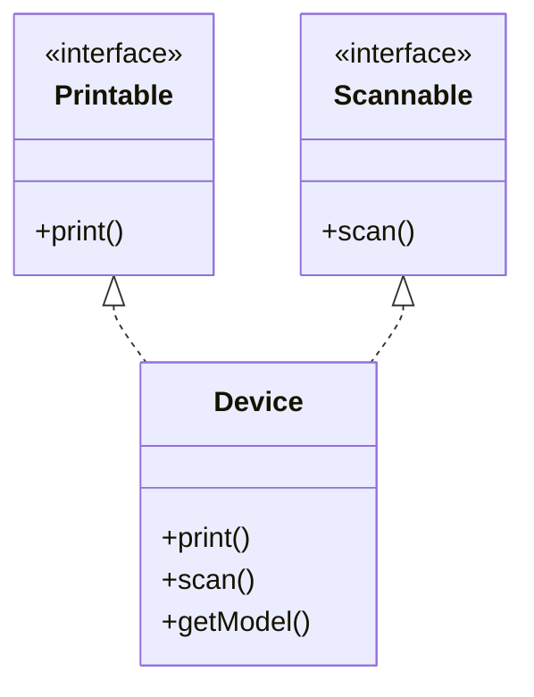
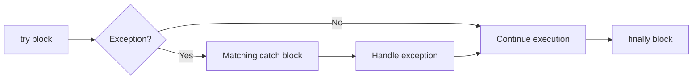
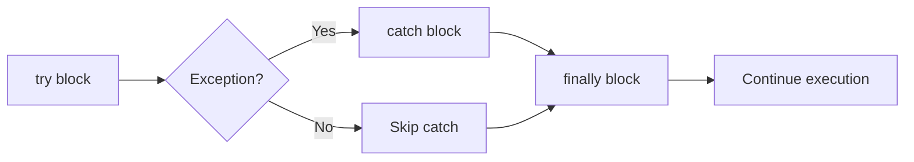

## Question 1(a) [3 marks]

**List out various Primitive data types in Java.**

**Answer**:
Java offers eight primitive data types for storing simple values directly in memory.

**Table: Java Primitive Data Types**

| Data Type | Size | Description | Range |
|-----------|------|-------------|-------|
| byte | 8 bits | Integer type | -128 to 127 |
| short | 16 bits | Integer type | -32,768 to 32,767 |
| int | 32 bits | Integer type | -2^31 to 2^31-1 |
| long | 64 bits | Integer type | -2^63 to 2^63-1 |
| float | 32 bits | Floating-point | Single precision |
| double | 64 bits | Floating-point | Double precision |
| char | 16 bits | Character | Unicode characters |
| boolean | 1 bit | Logical | true or false |

**Mnemonic:** "BILFDC-B: Byte Int Long Float Double Char Boolean types"

## Question 1(b) [4 marks]

**Explain Structure of Java Program with suitable example.**

**Answer**:
Java program structure follows a specific organization with package declarations, imports, class definitions, and methods.

**Diagram: Java Program Structure**

```goat
+-----------------------+
| Documentation Comments|
+-----------------------+
| Package Declaration   |
+-----------------------+
| Import Statements     |
+-----------------------+
| Class Declaration     |
|  +------------------+ |
|  | Variables        | |
|  | Constructors     | |
|  | Methods          | |
|  +------------------+ |
+-----------------------+
```

**Code Block:**

```java
// Documentation comment
/**
 * Simple program to demonstrate Java structure
 * @author GTU Student
 */

// Package declaration
package com.example;

// Import statements
import java.util.Scanner;

// Class declaration
public class HelloWorld {
    // Variable declaration
    private String message;
    
    // Constructor
    public HelloWorld() {
        message = "Hello, World!";
    }
    
    // Method
    public void displayMessage() {
        System.out.println(message);
    }
    
    // Main method
    public static void main(String[] args) {
        HelloWorld obj = new HelloWorld();
        obj.displayMessage();
    }
}
```

**Mnemonic:** "PICOM: Package Import Class Objects Methods in order"

## Question 1(c) [7 marks]

**List arithmetic operators in Java. Develop a Java program using any three arithmetic operators and show the output of program.**

**Answer**:
Arithmetic operators in Java perform mathematical operations on numeric values.

**Table: Java Arithmetic Operators**

| Operator | Description | Example |
|----------|-------------|---------|
| + | Addition | a + b |
| - | Subtraction | a - b |
| * | Multiplication | a * b |
| / | Division | a / b |
| % | Modulus (Remainder) | a % b |
| ++ | Increment | a++ or ++a |
| -- | Decrement | a-- or --a |

**Code Block:**

```java
public class ArithmeticDemo {
    public static void main(String[] args) {
        int a = 10;
        int b = 3;
        
        // Addition
        int sum = a + b;
        
        // Multiplication
        int product = a * b;
        
        // Modulus
        int remainder = a % b;
        
        // Display results
        System.out.println("Values: a = " + a + ", b = " + b);
        System.out.println("Addition (a + b): " + sum);
        System.out.println("Multiplication (a * b): " + product);
        System.out.println("Modulus (a % b): " + remainder);
    }
}
```

**Output:**

```
Values: a = 10, b = 3
Addition (a + b): 13
Multiplication (a * b): 30
Modulus (a % b): 1
```

**Mnemonic:** "SAME: Sum Addition Multiply Exponentiation basic operations"

## Question 1(c OR) [7 marks]

**Write syntax of Java for loop statement. Develop a Java program to find out prime number between 1 to 10.**

**Answer**:
The for loop in Java provides a compact way to iterate over a range of values.

**Syntax of Java for loop:**

```
for (initialization; condition; increment/decrement) {
    // statements to be executed
}
```

**Code Block:**

```java
public class PrimeNumbers {
    public static void main(String[] args) {
        System.out.println("Prime numbers between 1 and 10:");
        
        // Check each number from 1 to 10
        for (int num = 1; num <= 10; num++) {
            boolean isPrime = true;
            
            // Check if num is divisible by any number from 2 to num-1
            if (num > 1) {
                for (int i = 2; i < num; i++) {
                    if (num % i == 0) {
                        isPrime = false;
                        break;
                    }
                }
                
                // Print if prime
                if (isPrime) {
                    System.out.print(num + " ");
                }
            }
        }
    }
}
```

**Output:**

```
Prime numbers between 1 and 10:
2 3 5 7
```

**Mnemonic:** "ICE: Initialize, Check, Execute steps of for loop"

## Question 2(a) [3 marks]

**List the differences between Procedure-Oriented Programming (POP) and Object-Oriented Programming (OOP).**

**Answer**:
Procedure-Oriented and Object-Oriented Programming represent fundamentally different programming paradigms.

**Table: POP vs OOP**

| Feature | Procedure-Oriented | Object-Oriented |
|---------|-------------------|-----------------|
| Focus | Functions/Procedures | Objects |
| Data | Separate from functions | Encapsulated in objects |
| Security | Less secure | More secure with access control |
| Inheritance | Not supported | Supported |
| Reusability | Less reusable | Highly reusable |
| Complexity | Simpler for small programs | Better for complex systems |

- **Organization**: POP divides into functions; OOP groups into objects
- **Approach**: POP follows top-down; OOP follows bottom-up

**Mnemonic:** "FIOS: Functions In Objects Structure key difference"

## Question 2(b) [4 marks]

**Explain static keyword with example.**

**Answer**:
The static keyword in Java creates class-level members shared across all objects of that class.

**Table: Uses of static Keyword**

| Use | Purpose | Example |
|-----|---------|---------|
| static variable | Shared across all objects | `static int count;` |
| static method | Can be called without object | `static void display()` |
| static block | Executed when class loads | `static { // code }` |
| static nested class | Associated with outer class | `static class Inner {}` |

**Code Block:**

```java
public class Counter {
    // Static variable shared by all objects
    static int count = 0;
    
    // Instance variable unique to each object
    int instanceCount = 0;
    
    // Constructor
    Counter() {
        count++;         // Increments the shared count
        instanceCount++; // Increments this object's count
    }
    
    public static void main(String[] args) {
        Counter c1 = new Counter();
        Counter c2 = new Counter();
        Counter c3 = new Counter();
        
        System.out.println("Static count: " + Counter.count);
        System.out.println("c1's instance count: " + c1.instanceCount);
        System.out.println("c2's instance count: " + c2.instanceCount);
        System.out.println("c3's instance count: " + c3.instanceCount);
    }
}
```

**Output:**

```
Static count: 3
c1's instance count: 1
c2's instance count: 1
c3's instance count: 1
```

**Mnemonic:** "CBMS: Class-level, Before objects, Memory single, Shared by all"

## Question 2(c) [7 marks]

**Define Constructor. List types of Constructors. Develop a java code to explain Parameterized constructor.**

**Answer**:
A constructor is a special method with the same name as its class, used to initialize objects when created.

**Types of Constructors:**

**Table: Constructor Types in Java**

| Type | Description | Example |
|------|-------------|---------|
| Default | No parameters, created by compiler | `Student() {}` |
| No-arg | Explicitly defined, no parameters | `Student() { name = "Unknown"; }` |
| Parameterized | Accepts parameters | `Student(String n) { name = n; }` |
| Copy | Creates object from another object | `Student(Student s) { name = s.name; }` |

**Code Block:**

```java
public class Student {
    // Instance variables
    private String name;
    private int age;
    private String course;
    
    // Parameterized constructor
    public Student(String name, int age, String course) {
        this.name = name;
        this.age = age;
        this.course = course;
    }
    
    // Method to display student details
    public void displayDetails() {
        System.out.println("Student Details:");
        System.out.println("Name: " + name);
        System.out.println("Age: " + age);
        System.out.println("Course: " + course);
    }
    
    // Main method for demonstration
    public static void main(String[] args) {
        // Creating object using parameterized constructor
        Student student1 = new Student("John", 20, "Computer Science");
        student1.displayDetails();
        
        // Another student
        Student student2 = new Student("Lisa", 22, "Engineering");
        student2.displayDetails();
    }
}
```

**Output:**

```
Student Details:
Name: John
Age: 20
Course: Computer Science
Student Details:
Name: Lisa
Age: 22
Course: Engineering
```

**Mnemonic:** "IDCR: Initialize Data Create Ready objects"

## Question 2(a OR) [3 marks]

**List the basic OOP concepts in Java and explain any one.**

**Answer**:
Java implements Object-Oriented Programming through several fundamental concepts.

**Table: Basic OOP Concepts in Java**

| Concept | Description |
|---------|-------------|
| Encapsulation | Binding data and methods together |
| Inheritance | Creating new classes from existing ones |
| Polymorphism | One interface, multiple implementations |
| Abstraction | Hiding implementation details |
| Association | Relationship between objects |

**Encapsulation Example:**

```java
public class Person {
    // Private data - hidden from outside
    private String name;
    private int age;
    
    // Public methods - interface to access data
    public void setName(String name) {
        this.name = name;
    }
    
    public String getName() {
        return name;
    }
    
    public void setAge(int age) {
        // Validation ensures data integrity
        if (age > 0 && age < 120) {
            this.age = age;
        } else {
            System.out.println("Invalid age");
        }
    }
    
    public int getAge() {
        return age;
    }
}
```

- **Data Hiding**: Private variables inaccessible from outside
- **Controlled Access**: Through public methods (getters/setters)
- **Integrity**: Data validation ensures correct values

**Mnemonic:** "EIPA: Encapsulate Inherit Polymorphize Abstract"

## Question 2(b OR) [4 marks]

**Explain final keyword with example.**

**Answer**:
The final keyword in Java restricts changes to entities, creating constants, unchangeable methods, and non-inheritable classes.

**Table: Uses of final Keyword**

| Use | Effect | Example |
|-----|--------|---------|
| final variable | Cannot be modified | `final int MAX = 100;` |
| final method | Cannot be overridden | `final void display() {}` |
| final class | Cannot be extended | `final class Math {}` |
| final parameter | Cannot be changed in method | `void method(final int x) {}` |

**Code Block:**

```java
public class FinalDemo {
    // Final variable (constant)
    final int MAX_SPEED = 120;
    
    // Final method cannot be overridden
    final void showLimit() {
        System.out.println("Speed limit: " + MAX_SPEED);
    }
    
    public static void main(String[] args) {
        FinalDemo car = new FinalDemo();
        car.showLimit();
        
        // This would cause compile error:
        // car.MAX_SPEED = 150;
    }
}

// Final class cannot be extended
final class MathUtil {
    public int square(int num) {
        return num * num;
    }
}

// This would cause compile error:
// class AdvancedMath extends MathUtil { }
```

**Output:**

```
Speed limit: 120
```

**Mnemonic:** "VMP: Variables Methods Permanence with final"

## Question 2(c OR) [7 marks]

**Write scope of java access modifier. Develop a java code to explain public modifier.**

**Answer**:
Access modifiers in Java control visibility and accessibility of classes, methods, and variables.

**Table: Java Access Modifier Scope**

| Modifier | Class | Package | Subclass | World |
|----------|-------|---------|----------|-------|
| private | ✓ | ✗ | ✗ | ✗ |
| default (no modifier) | ✓ | ✓ | ✗ | ✗ |
| protected | ✓ | ✓ | ✓ | ✗ |
| public | ✓ | ✓ | ✓ | ✓ |

**Code Block:**

```java
// File: PublicDemo.java
package com.example;

// Public class accessible from anywhere
public class PublicDemo {
    // Public variable accessible from anywhere
    public String message = "Hello, World!";
    
    // Public method accessible from anywhere
    public void displayMessage() {
        System.out.println(message);
    }
}

// File: Main.java
package com.test;

// Importing from different package
import com.example.PublicDemo;

public class Main {
    public static void main(String[] args) {
        // Creating object of class from different package
        PublicDemo demo = new PublicDemo();
        
        // Accessing public variable from different package
        System.out.println("Message: " + demo.message);
        
        // Calling public method from different package
        demo.displayMessage();
        
        // Modifying public variable from different package
        demo.message = "Modified message";
        demo.displayMessage();
    }
}
```

**Output:**

```
Message: Hello, World!
Hello, World!
Modified message
```

**Mnemonic:** "CEPM: Class Everywhere Public Most accessible"

## Question 3(a) [3 marks]

**List out different types of inheritance and explain any one with example.**

**Answer**:
Inheritance enables a class to inherit attributes and behaviors from another class.

**Table: Types of Inheritance in Java**

| Type | Description |
|------|-------------|
| Single | One class extends one class |
| Multilevel | Chain of inheritance (A→B→C) |
| Hierarchical | Multiple classes extend one class |
| Multiple | One class inherits from multiple classes (through interfaces) |
| Hybrid | Combination of multiple inheritance types |

**Single Inheritance Example:**

```java
// Parent class
class Animal {
    protected String name;
    
    public Animal(String name) {
        this.name = name;
    }
    
    public void eat() {
        System.out.println(name + " is eating");
    }
}

// Child class inheriting from Animal
class Dog extends Animal {
    private String breed;
    
    public Dog(String name, String breed) {
        super(name);  // Call parent constructor
        this.breed = breed;
    }
    
    public void bark() {
        System.out.println(name + " is barking");
    }
    
    public void displayInfo() {
        System.out.println("Name: " + name);
        System.out.println("Breed: " + breed);
    }
}

// Main class
public class InheritanceDemo {
    public static void main(String[] args) {
        Dog dog = new Dog("Max", "Labrador");
        dog.displayInfo();
        dog.eat();     // Inherited method
        dog.bark();    // Own method
    }
}
```

**Output:**

```
Name: Max
Breed: Labrador
Max is eating
Max is barking
```

**Mnemonic:** "SMHMH: Single Multilevel Hierarchical Multiple Hybrid types"

## Question 3(b) [4 marks]

**Explain any two String buffer class methods with suitable example.**

**Answer**:
StringBuffer is a mutable sequence of characters used for modifying strings, offering various manipulation methods.

**Table: Two StringBuffer Methods**

| Method | Purpose | Syntax |
|--------|---------|--------|
| append() | Adds string at the end | `sb.append(String str)` |
| insert() | Adds string at specified position | `sb.insert(int offset, String str)` |

**Code Block:**

```java
public class StringBufferMethodsDemo {
    public static void main(String[] args) {
        // Create StringBuffer
        StringBuffer sb = new StringBuffer("Hello");
        System.out.println("Original: " + sb);
        
        // append() method - adds text at the end
        sb.append(" World");
        System.out.println("After append(): " + sb);
        
        // Can append different data types
        sb.append('!');
        sb.append(2024);
        System.out.println("After appending more: " + sb);
        
        // Reset for demonstration
        sb = new StringBuffer("Java");
        System.out.println("\nNew Original: " + sb);
        
        // insert() method - adds text at specified position
        sb.insert(0, "Learn ");
        System.out.println("After insert() at beginning: " + sb);
        
        sb.insert(10, " Programming");
        System.out.println("After insert() in middle: " + sb);
    }
}
```

**Output:**

```
Original: Hello
After append(): Hello World
After appending more: Hello World!2024

New Original: Java
After insert() at beginning: Learn Java
After insert() in middle: Learn Java Programming
```

**Mnemonic:** "AIMS: Append Insert Modify StringBuffer"

## Question 3(c) [7 marks]

**Define Interface. Write a java program to demonstrate multiple inheritance using interface.**

**Answer**:
An interface is a contract that declares methods a class must implement, enabling multiple inheritance in Java.

**Definition:**
An interface is a reference type containing only constants, method signatures, default methods, static methods, and nested types with no implementation for abstract methods.

**Diagram: Multiple Inheritance using Interfaces**



**Code Block:**

```java
// First interface
interface Printable {
    void print();
}

// Second interface
interface Scannable {
    void scan();
}

// Class implementing multiple interfaces
class Device implements Printable, Scannable {
    private String model;
    
    public Device(String model) {
        this.model = model;
    }
    
    // Implementation of print() method from Printable
    @Override
    public void print() {
        System.out.println(model + " is printing a document");
    }
    
    // Implementation of scan() method from Scannable
    @Override
    public void scan() {
        System.out.println(model + " is scanning a document");
    }
    
    // Class's own method
    public void getModel() {
        System.out.println("Device Model: " + model);
    }
}

// Main class
public class MultipleInheritanceDemo {
    public static void main(String[] args) {
        Device device = new Device("HP LaserJet");
        
        // Display model
        device.getModel();
        
        // Using methods from multiple interfaces
        device.print();
        device.scan();
        
        // Checking if device is an instance of interfaces
        System.out.println("Is device Printable? " + (device instanceof Printable));
        System.out.println("Is device Scannable? " + (device instanceof Scannable));
    }
}
```

**Output:**

```
Device Model: HP LaserJet
HP LaserJet is printing a document
HP LaserJet is scanning a document
Is device Printable? true
Is device Scannable? true
```

**Mnemonic:** "IMAC: Interface Multiple Abstract Contract"

## Question 3(a OR) [3 marks]

**Give differences between Abstract class and Interface.**

**Answer**:
Abstract classes and interfaces are both used for abstraction but differ in several key aspects.

**Table: Abstract Class vs Interface**

| Feature | Abstract Class | Interface |
|---------|---------------|-----------|
| Keyword | abstract | interface |
| Methods | Both abstract and concrete | Abstract (and default since Java 8) |
| Variables | Any type | Only public static final |
| Constructor | Has | Doesn't have |
| Inheritance | Single | Multiple |
| Access Modifiers | Any | Only public |
| Purpose | Partial implementation | Complete abstraction |

- **Implementation**: Abstract classes can provide partial implementation; interfaces traditionally provide none
- **Relationship**: Abstract class says "is-a"; interface says "can-do-this"

**Mnemonic:** "MAPS: Methods Access Purpose Single vs multiple"

## Question 3(b OR) [4 marks]

**Explain any two String class methods with suitable example.**

**Answer**:
The String class offers various methods for string manipulation, comparison, and transformation.

**Table: Two String Methods**

| Method | Purpose | Syntax |
|--------|---------|--------|
| substring() | Extracts portion of string | `str.substring(int beginIndex, int endIndex)` |
| equals() | Compares string content | `str1.equals(str2)` |

**Code Block:**

```java
public class StringMethodsDemo {
    public static void main(String[] args) {
        String message = "Java Programming";
        
        // substring() method
        // Extract "Java" (index 0 to 3)
        String sub1 = message.substring(0, 4);
        System.out.println("substring(0, 4): " + sub1);
        
        // Extract "Programming" (index 5 to end)
        String sub2 = message.substring(5);
        System.out.println("substring(5): " + sub2);
        
        // equals() method
        String str1 = "Hello";
        String str2 = "Hello";
        String str3 = "hello";
        String str4 = new String("Hello");
        
        System.out.println("\nComparing strings with equals():");
        System.out.println("str1.equals(str2): " + str1.equals(str2));  // true
        System.out.println("str1.equals(str3): " + str1.equals(str3));  // false
        System.out.println("str1.equals(str4): " + str1.equals(str4));  // true
        
        System.out.println("\nComparing strings with ==:");
        System.out.println("str1 == str2: " + (str1 == str2));  // true
        System.out.println("str1 == str4: " + (str1 == str4));  // false
    }
}
```

**Output:**

```
substring(0, 4): Java
substring(5): Programming

Comparing strings with equals():
str1.equals(str2): true
str1.equals(str3): false
str1.equals(str4): true

Comparing strings with ==:
str1 == str2: true
str1 == str4: false
```

**Mnemonic:** "SEC: Substring Equals Compare string content"

## Question 3(c OR) [7 marks]

**Explain package and list out steps to create package with suitable example.**

**Answer**:
A package in Java is a namespace that organizes related classes and interfaces, preventing naming conflicts.

**Steps to Create a Package:**

**Table: Package Creation Steps**

| Step | Action |
|------|--------|
| 1 | Declare package name at the top of source files |
| 2 | Create proper directory structure matching package name |
| 3 | Save Java file in the appropriate directory |
| 4 | Compile with javac -d option to create package directory |
| 5 | Run the program with fully qualified name |

**Code Block:**

```java
// Step 1: Declare package at the top (save as Calculator.java)
package com.example.math;

// The Calculator class
public class Calculator {
    public int add(int a, int b) {
        return a + b;
    }
    
    public int subtract(int a, int b) {
        return a - b;
    }
    
    public int multiply(int a, int b) {
        return a * b;
    }
    
    public double divide(int a, int b) {
        if (b == 0) {
            throw new ArithmeticException("Cannot divide by zero");
        }
        return (double) a / b;
    }
}

// Step 1: Declare package (save as CalculatorApp.java)
package com.example.app;

// Import the package
import com.example.math.Calculator;

public class CalculatorApp {
    public static void main(String[] args) {
        // Using the Calculator class from the package
        Calculator calc = new Calculator();
        
        System.out.println("Addition: " + calc.add(10, 5));
        System.out.println("Subtraction: " + calc.subtract(10, 5));
        System.out.println("Multiplication: " + calc.multiply(10, 5));
        System.out.println("Division: " + calc.divide(10, 5));
    }
}
```

**Terminal Commands:**

```
// Step 2: Create directory structure
mkdir -p com/example/math
mkdir -p com/example/app

// Step 3: Place files in appropriate directories
mv Calculator.java com/example/math/
mv CalculatorApp.java com/example/app/

// Step 4: Compile with -d option
javac -d . com/example/math/Calculator.java
javac -d . -cp . com/example/app/CalculatorApp.java

// Step 5: Run with fully qualified name
java com.example.app.CalculatorApp
```

**Output:**

```
Addition: 15
Subtraction: 5
Multiplication: 50
Division: 2.0
```

**Mnemonic:** "DISCO: Declare Import Save Compile Organize"

## Question 4(a) [3 marks]

**List types of errors in Java.**

**Answer**:
Java programs can encounter various errors during development and execution.

**Table: Types of Errors in Java**

| Error Type | When Occurs | Example |
|------------|-------------|---------|
| Compile-time Errors | During compilation | Syntax errors, type errors |
| Runtime Errors | During execution | NullPointerException, ArrayIndexOutOfBoundsException |
| Logical Errors | During execution with wrong output | Incorrect calculation, infinite loop |
| Linkage Errors | During class loading | NoClassDefFoundError |
| Thread Death | When thread terminates | ThreadDeath |

- **Syntax Errors**: Missing semicolons, brackets, or typos
- **Semantic Errors**: Type mismatches, incompatible operations
- **Exceptions**: Runtime issues requiring handling

**Mnemonic:** "CRLLT: Compile Runtime Logical Linkage Thread errors"

## Question 4(b) [4 marks]

**Explain try catch block with example.**

**Answer**:
The try-catch block in Java handles exceptions, allowing programs to continue executing despite errors.

**Diagram: Try-Catch Flow**



**Code Block:**

```java
public class TryCatchDemo {
    public static void main(String[] args) {
        int[] numbers = {10, 20, 30};
        
        try {
            // Try to access an element outside array bounds
            System.out.println("Trying to access element 5: " + numbers[4]);
            
            // This code will not be executed if exception occurs
            System.out.println("This won't be printed");
        } 
        catch (ArrayIndexOutOfBoundsException e) {
            // Handle the specific exception
            System.out.println("Exception caught: " + e.getMessage());
            System.out.println("Array index out of bounds");
        }
        catch (Exception e) {
            // Handle any other exceptions
            System.out.println("General exception caught: " + e.getMessage());
        }
        finally {
            // This block always executes
            System.out.println("Finally block executed");
        }
        
        // Program continues execution
        System.out.println("Program continues after exception handling");
    }
}
```

**Output:**

```
Exception caught: Index 4 out of bounds for length 3
Array index out of bounds
Finally block executed
Program continues after exception handling
```

**Mnemonic:** "TCFE: Try Catch Finally Execute despite errors"

## Question 4(c) [7 marks]

**List out any four differences between method overloading and overriding. Write a java code to explain method overriding.**

**Answer**:
Method overloading and overriding are both forms of polymorphism but differ in functionality and implementation.

**Table: Method Overloading vs Overriding**

| Feature | Method Overloading | Method Overriding |
|---------|-------------------|-------------------|
| Occurrence | Same class | Parent and child classes |
| Parameters | Different parameters | Same parameters |
| Return Type | Can be different | Must be same or covariant |
| Access Modifier | Can be different | Can't be more restrictive |
| Binding | Compile-time (static) | Runtime (dynamic) |
| Purpose | Multiple behaviors of same method | Specialized implementation |
| Inheritance | Not required | Required |
| @Override | Not used | Recommended |

**Code Block:**

```java
// Parent class
class Animal {
    public void makeSound() {
        System.out.println("Animal makes a sound");
    }
    
    public void eat() {
        System.out.println("Animal eats food");
    }
}

// Child class overriding methods
class Dog extends Animal {
    // Method overriding
    @Override
    public void makeSound() {
        System.out.println("Dog barks");
    }
    
    @Override
    public void eat() {
        System.out.println("Dog eats meat");
    }
}

// Another child class with different overrides
class Cat extends Animal {
    // Method overriding
    @Override
    public void makeSound() {
        System.out.println("Cat meows");
    }
}

// Main class to demonstrate method overriding
public class MethodOverridingDemo {
    public static void main(String[] args) {
        // Parent class reference and object
        Animal animal = new Animal();
        
        // Child class references and objects
        Animal dog = new Dog();
        Animal cat = new Cat();
        
        // Demonstrating method overriding behavior
        System.out.println("Animal behavior:");
        animal.makeSound();
        animal.eat();
        
        System.out.println("\nDog behavior:");
        dog.makeSound();  // Calls overridden method
        dog.eat();        // Calls overridden method
        
        System.out.println("\nCat behavior:");
        cat.makeSound();  // Calls overridden method
        cat.eat();        // Calls parent method (not overridden)
    }
}
```

**Output:**

```
Animal behavior:
Animal makes a sound
Animal eats food

Dog behavior:
Dog barks
Dog eats meat

Cat behavior:
Cat meows
Animal eats food
```

**Mnemonic:** "SBRE: Same-name, Base-derived, Runtime-resolution, Extend functionality"

## Question 4(a OR) [3 marks]

**List any four inbuilt exceptions.**

**Answer**:
Java provides many built-in exception classes that represent various error conditions.

**Table: Four Common Inbuilt Exceptions**

| Exception | Cause | Package |
|-----------|-------|---------|
| NullPointerException | Access/modify null reference | java.lang |
| ArrayIndexOutOfBoundsException | Invalid array index | java.lang |
| ArithmeticException | Invalid arithmetic operation (division by zero) | java.lang |
| ClassCastException | Invalid class casting | java.lang |

- **Unchecked**: Runtime exceptions (don't require explicit handling)
- **Hierarchy**: All extend from Exception class
- **Handling**: Can be caught with try-catch blocks

**Mnemonic:** "NAAC: Null Array Arithmetic Cast common exceptions"

## Question 4(b OR) [4 marks]

**Explain "throw" keyword with suitable example.**

**Answer**:
The throw keyword in Java manually generates exceptions for exceptional conditions in programs.

**Table: throw Keyword Usage**

| Usage | Purpose |
|-------|---------|
| throw new ExceptionType() | Create and throw exception |
| throw new ExceptionType(message) | Create with custom message |
| throws in method signature | Declare exceptions method might throw |
| Can throw checked/unchecked | Requires try-catch for checked exceptions |

**Code Block:**

```java
public class ThrowDemo {
    // Method that uses throw to generate exception
    public static void validateAge(int age) {
        // Checking for invalid age
        if (age < 0) {
            throw new IllegalArgumentException("Age cannot be negative");
        }
        
        // Checking for age restriction
        if (age < 18) {
            throw new ArithmeticException("Not eligible to vote");
        } else {
            System.out.println("Eligible to vote");
        }
    }
    
    public static void main(String[] args) {
        try {
            // Valid age
            System.out.println("Validating age 20:");
            validateAge(20);
            
            // Underage
            System.out.println("\nValidating age 15:");
            validateAge(15);
        } catch (ArithmeticException e) {
            System.out.println("ArithmeticException: " + e.getMessage());
        } catch (IllegalArgumentException e) {
            System.out.println("IllegalArgumentException: " + e.getMessage());
        }
        
        try {
            // Negative age
            System.out.println("\nValidating age -5:");
            validateAge(-5);
        } catch (Exception e) {
            System.out.println("Exception: " + e.getMessage());
        }
    }
}
```

**Output:**

```
Validating age 20:
Eligible to vote

Validating age 15:
ArithmeticException: Not eligible to vote

Validating age -5:
Exception: Age cannot be negative
```

**Mnemonic:** "CET: Create Exception Throw for error handling"

## Question 4(c OR) [7 marks]

**Compare 'this' keyword Vs 'Super' keyword. Explain super keyword with suitable Example.**

**Answer**:
The 'this' and 'super' keywords are used for referencing in Java, with distinct purposes and behaviors.

**Table: this vs super Keyword Comparison**

| Feature | this Keyword | super Keyword |
|---------|-------------|---------------|
| Reference | Current class | Parent class |
| Usage | Access current class members | Access parent class members |
| Constructor call | this() | super() |
| Variable resolution | this.var (current class) | super.var (parent class) |
| Method invocation | this.method() (current class) | super.method() (parent class) |
| Position | First statement in constructor | First statement in constructor |
| Inheritance | Not related to inheritance | Used with inheritance |

**Code Block:**

```java
// Parent class
class Vehicle {
    // Parent class variables
    protected String brand = "Ford";
    protected String color = "Red";
    
    // Parent class constructor
    Vehicle() {
        System.out.println("Vehicle constructor called");
    }
    
    // Parent class method
    void displayInfo() {
        System.out.println("Brand: " + brand);
        System.out.println("Color: " + color);
    }
}

// Child class
class Car extends Vehicle {
    // Child class variables (same names as parent)
    private String brand = "Toyota";
    private String color = "Blue";
    
    // Child class constructor
    Car() {
        super(); // Call parent constructor
        System.out.println("Car constructor called");
    }
    
    // Method using super with variables
    void printDetails() {
        // Access child class variables using this
        System.out.println("Car brand (this): " + this.brand);
        System.out.println("Car color (this): " + this.color);
        
        // Access parent class variables using super
        System.out.println("Vehicle brand (super): " + super.brand);
        System.out.println("Vehicle color (super): " + super.color);
    }
    
    // Method using super with methods
    @Override
    void displayInfo() {
        System.out.println("Car information:");
        // Call parent method
        super.displayInfo();
        System.out.println("Model: Corolla");
    }
}

// Main class
public class SuperKeywordDemo {
    public static void main(String[] args) {
        // Create Car object
        Car myCar = new Car();
        
        System.out.println("\nVariable access with this and super:");
        myCar.printDetails();
        
        System.out.println("\nMethod call with super:");
        myCar.displayInfo();
    }
}
```

**Output:**

```
Vehicle constructor called
Car constructor called

Variable access with this and super:
Car brand (this): Toyota
Car color (this): Blue
Vehicle brand (super): Ford
Vehicle color (super): Red

Method call with super:
Car information:
Brand: Ford
Color: Red
Model: Corolla
```

**Mnemonic:** "PCIM: Parent Class Inheritance Members with super"

## Question 5(a) [3 marks]

**List Different Stream Classes.**

**Answer**:
Java I/O provides various stream classes for handling input and output operations.

**Table: Java Stream Classes**

| Category | Stream Classes |
|----------|---------------|
| Byte Streams | FileInputStream, FileOutputStream, BufferedInputStream, BufferedOutputStream |
| Character Streams | FileReader, FileWriter, BufferedReader, BufferedWriter |
| Data Streams | DataInputStream, DataOutputStream |
| Object Streams | ObjectInputStream, ObjectOutputStream |
| Print Streams | PrintStream, PrintWriter |

- **Byte Streams**: Work with binary data (8-bit bytes)
- **Character Streams**: Work with characters (16-bit Unicode)
- **Buffered Streams**: Improve performance through buffering

**Mnemonic:** "BCDOP: Byte Character Data Object Print streams"

## Question 5(b) [4 marks]

**Write a java program to develop user defined exception for "Divide by zero" error.**

**Answer**:
User-defined exceptions allow creating custom exception types for application-specific error conditions.

**Code Block:**

```java
// Custom exception for divide by zero
class DivideByZeroException extends Exception {
    // Constructor without parameters
    public DivideByZeroException() {
        super("Cannot divide by zero");
    }
    
    // Constructor with custom message
    public DivideByZeroException(String message) {
        super(message);
    }
}

// Main class demonstrating custom exception
public class CustomExceptionDemo {
    // Method that might throw our custom exception
    public static double divide(int numerator, int denominator) throws DivideByZeroException {
        if (denominator == 0) {
            throw new DivideByZeroException("Division by zero not allowed");
        }
        return (double) numerator / denominator;
    }
    
    public static void main(String[] args) {
        try {
            // Test with valid input
            System.out.println("10 / 2 = " + divide(10, 2));
            
            // Test with zero as denominator
            System.out.println("10 / 0 = " + divide(10, 0));
        } catch (DivideByZeroException e) {
            System.out.println("Error: " + e.getMessage());
            System.out.println("Custom exception stack trace:");
            e.printStackTrace();
        }
        
        System.out.println("Program continues execution...");
    }
}
```

**Output:**

```
10 / 2 = 5.0
Error: Division by zero not allowed
Custom exception stack trace:
DivideByZeroException: Division by zero not allowed
    at CustomExceptionDemo.divide(CustomExceptionDemo.java:19)
    at CustomExceptionDemo.main(CustomExceptionDemo.java:29)
Program continues execution...
```

**Mnemonic:** "ETC: Extend Throw Catch custom exceptions"

## Question 5(c) [7 marks]

**Write a program in Java that reads the content of a file byte by byte and copy it into another file.**

**Answer**:
File I/O operations in Java allow reading from and writing to files, with byte streams handling binary data.

**Code Block:**

```java
import java.io.FileInputStream;
import java.io.FileOutputStream;
import java.io.IOException;

public class FileCopyByteByByte {
    public static void main(String[] args) {
        // Define source and destination file paths
        String sourceFile = "source.txt";
        String destinationFile = "destination.txt";
        
        // Variables for file streams
        FileInputStream inputStream = null;
        FileOutputStream outputStream = null;
        
        try {
            // Initialize input and output streams
            inputStream = new FileInputStream(sourceFile);
            outputStream = new FileOutputStream(destinationFile);
            
            System.out.println("Copying file " + sourceFile + " to " + destinationFile);
            
            // Variables to track copy process
            int byteData;
            int byteCount = 0;
            
            // Read file byte by byte until end of file (-1)
            while ((byteData = inputStream.read()) != -1) {
                // Write the byte to destination file
                outputStream.write(byteData);
                byteCount++;
            }
            
            System.out.println("File copied successfully!");
            System.out.println("Total bytes copied: " + byteCount);
            
        } catch (IOException e) {
            System.out.println("Error during file copy: " + e.getMessage());
            e.printStackTrace();
        } finally {
            // Close resources in finally block
            try {
                if (inputStream != null) {
                    inputStream.close();
                }
                if (outputStream != null) {
                    outputStream.close();
                }
                System.out.println("File streams closed successfully");
            } catch (IOException e) {
                System.out.println("Error closing streams: " + e.getMessage());
            }
        }
    }
}
```

**Creating source.txt file first:**

```java
import java.io.FileWriter;
import java.io.IOException;

public class CreateSourceFile {
    public static void main(String[] args) {
        try {
            FileWriter writer = new FileWriter("source.txt");
            writer.write("This is a sample file.\n");
            writer.write("It will be copied byte by byte.\n");
            writer.write("Java I/O operations demo.");
            writer.close();
            System.out.println("Source file created successfully!");
        } catch (IOException e) {
            System.out.println("Error creating source file: " + e.getMessage());
        }
    }
}
```

**Output:**

```
Source file created successfully!
Copying file source.txt to destination.txt
File copied successfully!
Total bytes copied: 82
File streams closed successfully
```

**Mnemonic:** "CROW: Create Read Open Write file operations"

## Question 5(a OR) [3 marks]

**List different file operations in Java.**

**Answer**:
Java provides comprehensive file handling capabilities through various file operations.

**Table: File Operations in Java**

| Operation | Description | Classes Used |
|-----------|-------------|--------------|
| File Creation | Create new files | File, FileOutputStream, FileWriter |
| File Reading | Read from files | FileInputStream, FileReader, Scanner |
| File Writing | Write to files | FileOutputStream, FileWriter, PrintWriter |
| File Deletion | Delete files | File.delete() |
| File Information | Get file metadata | File methods (length, isFile, etc.) |
| Directory Operations | Create/list directories | File methods (mkdir, list, etc.) |
| File Copy | Copy file contents | FileInputStream with FileOutputStream |
| File Renaming | Rename or move files | File.renameTo() |

- **Stream-based**: Low-level byte or character streams
- **Reader/Writer**: Character-oriented file operations
- **NIO Package**: Enhanced file operations (since Java 7)

**Mnemonic:** "CRWD: Create Read Write Delete basic operations"

## Question 5(b OR) [4 marks]

**Write a java program to explain finally block in exception handling.**

**Answer**:
The finally block in exception handling ensures code execution regardless of whether an exception occurs.

**Diagram: try-catch-finally Flow**



**Code Block:**

```java
import java.io.FileInputStream;
import java.io.FileNotFoundException;
import java.io.IOException;

public class FinallyBlockDemo {
    public static void main(String[] args) {
        // Example 1: finally with no exception
        System.out.println("Example 1: No exception");
        try {
            int result = 10 / 5;
            System.out.println("Result: " + result);
        } catch (ArithmeticException e) {
            System.out.println("Arithmetic exception caught: " + e.getMessage());
        } finally {
            System.out.println("Finally block executed - Example 1");
        }
        
        // Example 2: finally with exception caught
        System.out.println("\nExample 2: Exception caught");
        try {
            int result = 10 / 0; // This will throw exception
            System.out.println("This won't be printed");
        } catch (ArithmeticException e) {
            System.out.println("Arithmetic exception caught: " + e.getMessage());
        } finally {
            System.out.println("Finally block executed - Example 2");
        }
        
        // Example 3: finally with resource management
        System.out.println("\nExample 3: Resource management");
        FileInputStream file = null;
        try {
            file = new FileInputStream("nonexistent.txt"); // This will throw exception
            System.out.println("File opened successfully");
        } catch (FileNotFoundException e) {
            System.out.println("File not found: " + e.getMessage());
        } finally {
            // Close resources even if exception occurs
            try {
                if (file != null) {
                    file.close();
                }
                System.out.println("File resource closed in finally block");
            } catch (IOException e) {
                System.out.println("Error closing file: " + e.getMessage());
            }
        }
        
        System.out.println("\nProgram continues execution...");
    }
}
```

**Output:**

```
Example 1: No exception
Result: 2
Finally block executed - Example 1

Example 2: Exception caught
Arithmetic exception caught: / by zero
Finally block executed - Example 2

Example 3: Resource management
File not found: nonexistent.txt (No such file or directory)
File resource closed in finally block

Program continues execution...
```

**Mnemonic:** "ACRE: Always Cleanup Resources Executes"

## Question 5(c OR) [7 marks]

**Write a java program to create a file and perform write operation on this file.**

**Answer**:
Java provides several ways to create files and write data to them using character or byte streams.

**Code Block:**

```java
import java.io.File;
import java.io.FileWriter;
import java.io.IOException;
import java.io.BufferedWriter;
import java.text.SimpleDateFormat;
import java.util.Date;
import java.util.Scanner;

public class FileWriteDemo {
    public static void main(String[] args) {
        Scanner scanner = null;
        FileWriter fileWriter = null;
        BufferedWriter bufferedWriter = null;
        
        try {
            // Create a File object
            File myFile = new File("sample_data.txt");
            
            // Check if file already exists
            if (myFile.exists()) {
                System.out.println("File already exists: " + myFile.getName());
                System.out.println("File path: " + myFile.getAbsolutePath());
                System.out.println("File size: " + myFile.length() + " bytes");
            } else {
                // Create a new file
                if (myFile.createNewFile()) {
                    System.out.println("File created successfully: " + myFile.getName());
                } else {
                    System.out.println("Failed to create file");
                    return;
                }
            }
            
            // Initialize FileWriter (true parameter appends to file)
            fileWriter = new FileWriter(myFile);
            
            // Use BufferedWriter for efficient writing
            bufferedWriter = new BufferedWriter(fileWriter);
            
            // Get current date and time
            SimpleDateFormat formatter = new SimpleDateFormat("dd/MM/yyyy HH:mm:ss");
            Date date = new Date();
            
            // Write to file
            bufferedWriter.write("==== File Write Demonstration ====");
            bufferedWriter.newLine();
            bufferedWriter.write("Created on: " + formatter.format(date));
            bufferedWriter.newLine();
            
            // Get user input to write to file
            scanner = new Scanner(System.in);
            System.out.println("\nEnter text to write to file (type 'exit' to finish):");
            
            String line;
            while (true) {
                line = scanner.nextLine();
                if (line.equalsIgnoreCase("exit")) {
                    break;
                }
                bufferedWriter.write(line);
                bufferedWriter.newLine();
            }
            
            System.out.println("\nFile write operation completed successfully!");
            
        } catch (IOException e) {
            System.out.println("Error occurred: " + e.getMessage());
            e.printStackTrace();
        } finally {
            // Close resources
            try {
                if (bufferedWriter != null) {
                    bufferedWriter.close();
                }
                if (fileWriter != null) {
                    fileWriter.close();
                }
                if (scanner != null) {
                    scanner.close();
                }
            } catch (IOException e) {
                System.out.println("Error closing resources: " + e.getMessage());
            }
        }
    }
}
```

**Example output:**

```
File created successfully: sample_data.txt

Enter text to write to file (type 'exit' to finish):
This is line 1 of my file.
This is line 2 with some Java content.
Here is line 3 with more text.
exit

File write operation completed successfully!
```

**Mnemonic:** "COWS: Create Open Write Save file operations"
