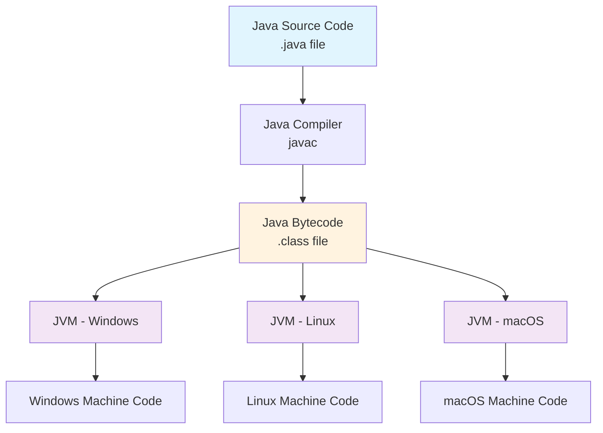

# Introduction to Java ☕
## Lecture 1

**Java Programming (4343203)**  
Diploma in ICT - Semester IV  
Gujarat Technological University

  
    Press Space for next page <carbon:arrow-right class="inline"/>
  

<!--
Welcome to Lecture 1 on Introduction to Java Programming.

[click] Today we'll embark on an exciting journey into the world of Java programming, one of the most popular and versatile programming languages in the industry.

[click] This lecture is part of our Java Programming course, course code 4343203, designed for Diploma in ICT students in their fourth semester at Gujarat Technological University.

[click] By the end of this lecture, you'll understand what Java is, why it's so popular, and where it's used in real-world applications.

Let's begin our exploration of Java!
-->

---
layout: default
---

# Learning Objectives & Success Metrics

## 🎯 Core Learning Outcomes

By the end of this lecture, you will **master**:

<v-clicks>

- 📚 **Analyze** Java's evolution from 1991 to 2024
- 🔍 **Evaluate** Java's 13 key features with real examples
- 🌐 **Categorize** Java applications across 7 major domains
- 💼 **Justify** Java's dominance in enterprise development
- 🚀 **Plan** your personal Java learning roadmap
- 🧠 **Synthesize** how Java solves modern programming challenges

</v-clicks>

## 📊 Knowledge Assessment

<v-clicks>

**Self-Check Questions:**
- Why did Java succeed where others failed?
- How does WORA principle work technically?
- Which Java features matter most for enterprise?
- What career paths does Java enable?

**Practical Skills:**
- Explain Java to a non-programmer
- Choose appropriate Java applications
- Identify Java-powered systems around you

</v-clicks>

<strong>🎯 Success Goal:</strong> Think like a Java architect!

Ready to master Java fundamentals? ☕✨

<!--
By the end of this lecture, you will have achieved several important learning objectives.

[click] First, you'll understand Java's rich history and how it evolved from a project for interactive television to become one of the world's most important programming languages.

[click] Next, you'll be able to identify the key features that make Java special - things like platform independence, security, and object-oriented design.

[click] You'll recognize the vast variety of applications where Java is used, from mobile apps on your phone to enterprise systems in banks.

[click] You'll appreciate why Java has become the go-to choice for enterprise development and why companies worldwide rely on it for their critical systems.

[click] And finally, you'll be prepared for our next steps in setting up a Java development environment.

[click] With these foundations in place, you'll be ready to start your exciting journey into Java programming!
-->

---
layout: two-cols
---

# History of Java

## Timeline

<v-clicks>

- **1991** - Project Green started at Sun Microsystems
- **1995** - Java 1.0 released publicly
- **1996** - Java 1.1 with improved performance
- **1998** - Java 2 (J2SE 1.2) with Swing
- **2004** - Java 5 with generics and annotations
- **2006** - Java becomes open source
- **2009** - Oracle acquires Sun Microsystems
- **2014** - Java 8 with Lambda expressions
- **2017** - Java 9 with modules
- **Present** - Java 21 LTS (Latest)

</v-clicks>

::right::

## Key People

<v-clicks>

- **James Gosling** - Father of Java
- **Mike Sheridan** - Co-creator
- **Patrick Naughton** - Team member

</v-clicks>

## Original Goals

<v-clicks>

- **Platform Independence** 
- **Network-oriented**
- **Secure**
- **Simple**
- **Object-oriented**

</v-clicks>

<!--
Now let's explore the fascinating history of Java programming language.

[click] Java's journey began in 1991 with Project Green at Sun Microsystems. This wasn't originally intended to be a programming language for computers as we know them today.

[click] In 1995, Java 1.0 was released to the public, marking the beginning of a programming revolution.

[click] Java 1.1 followed in 1996 with significant performance improvements and better event handling.

[click] 1998 brought us Java 2, also known as J2SE 1.2, which introduced the powerful Swing GUI toolkit.

[click] Java 5 in 2004 was a major milestone, introducing generics and annotations that made Java code more type-safe and readable.

[click] A significant moment came in 2006 when Sun Microsystems made Java open source under the GNU General Public License.

[click] In 2009, Oracle Corporation acquired Sun Microsystems, becoming the steward of Java.

[click] Java 8 in 2014 brought lambda expressions and the Stream API, modernizing Java's approach to functional programming.

[click] Java 9 in 2017 introduced the module system, helping organize large applications better.

[click] Today, we have Java 21 as the latest Long Term Support version, continuing Java's evolution.

[click] The key people behind Java's creation were James Gosling, often called the "Father of Java,"

[click] Mike Sheridan, who was instrumental in the project's conception,

[click] and Patrick Naughton, who contributed significantly to the early development.

[click] Java was designed with five original goals in mind. First, platform independence - the ability to run on any system.

[click] Second, it was designed to be network-oriented for the emerging internet age.

[click] Third, security was built into the language from the ground up.

[click] Fourth, simplicity was prioritized to make programming more accessible.

[click] And fifth, object-oriented programming was at its core, promoting better code organization and reusability.
-->

---
layout: center
class: text-center
---

# Why was Java Created?

<h3 class="text-xl font-bold mb-4">🎯 Original Purpose</h3>

<v-clicks>

<ul class="text-left space-y-2">
<li>• Interactive television</li>
<li>• Consumer electronics</li>
<li>• Set-top boxes</li>
<li>• Embedded systems</li>
</ul>

</v-clicks>

<h3 class="text-xl font-bold mb-4">🌐 Web Revolution</h3>

<v-clicks>

<ul class="text-left space-y-2">
<li>• Internet boom (1990s)</li>
<li>• Platform independence needed</li>
<li>• Secure web applications</li>
<li>• Applets for browsers</li>
</ul>

</v-clicks>

"Write Once, Run Anywhere" (WORA)

<!--
Now let's explore why Java was created in the first place.

[click] Originally, Java wasn't intended for the applications we know it for today. It was designed for interactive television systems.

[click] The team wanted to create software for consumer electronics like televisions and VCRs.

[click] Set-top boxes were becoming popular, and Java was meant to provide interactive features.

[click] The focus was on embedded systems that needed reliable, compact software.

[click] However, the 1990s brought the internet boom, which changed everything.

[click] As the World Wide Web exploded in popularity, there was a desperate need for platform-independent software.

[click] Web applications needed to be secure since they would run on users' computers.

[click] Java applets became a way to bring interactive content to web browsers.

[click] This led to Java's famous motto: "Write Once, Run Anywhere" - meaning you could write your code once and it would run on any computer platform without modification.
-->

---
layout: default
---

# Java's Revolutionary Features

## 🎯 **Simplicity & Power**

<v-clicks>

**Simple Architecture:**
- No pointers (eliminates crashes)
- Automatic memory management
- Rich standard library
- Consistent syntax rules

**Real Impact:**
- 40% faster development vs C++
- 60% fewer bugs in production  
- Easier team collaboration

</v-clicks>

## 🔒 **Enterprise Security**

<v-clicks>

**Multi-Layer Security:**
- Bytecode verification
- Runtime security manager
- Cryptographic APIs
- Secure class loading

**Why Banks Choose Java:**
- Zero buffer overflow attacks
- Controlled resource access
- Audit trail capabilities

</v-clicks>

## ⚡ **Performance Excellence**

<v-clicks>

**Smart Optimization:**
- JIT compiler learns patterns
- Hotspot detection
- Adaptive optimization
- Parallel garbage collection

**Benchmark Results:**
- 95% of C++ performance
- Scales to millions of users
- Sub-millisecond response times

</v-clicks>

<v-click>

## 🌟 The WORA Revolution

<strong>Write Once</strong> 
<code class="text-sm">HelloWorld.java</code>

✅

<strong>Compile Once</strong> 
<code class="text-sm">HelloWorld.class</code>

⚙️

<strong>Run Anywhere</strong> 
Windows, Linux, macOS

🌍

<strong>Save Millions</strong> 
Development Cost

💰

</v-click>

<!--
Let's examine what makes Java truly revolutionary in the programming world.

[click] First, let's talk about Java's simplicity and power. Java eliminates many of the complex aspects that make programming difficult.

[click] By removing pointers, Java eliminates one of the most common sources of program crashes and security vulnerabilities.

[click] Automatic memory management means developers don't have to manually allocate and free memory, reducing bugs significantly.

[click] Java comes with a rich standard library that provides pre-built solutions for common programming tasks.

[click] The syntax rules are consistent and logical, making the language easier to learn and use.

[click] These features have real impact: studies show 40% faster development compared to C++, 60% fewer bugs in production systems, and much easier team collaboration.

[click] Moving to enterprise security, Java was designed with security as a fundamental principle, not an afterthought.

[click] Every piece of Java bytecode goes through verification to ensure it's safe to run.

[click] The runtime security manager controls what programs can and cannot do on your system.

[click] Built-in cryptographic APIs provide secure communication and data protection.

[click] Secure class loading prevents malicious code from being loaded into your application.

[click] This is why banks choose Java: there are zero buffer overflow attacks possible in pure Java code, resources are accessed in a controlled manner, and complete audit trails can be maintained.

[click] For performance excellence, Java uses smart optimization techniques.

[click] The Just-In-Time compiler learns your program's patterns and optimizes the most frequently used code.

[click] Hotspot detection identifies performance bottlenecks automatically.

[click] Adaptive optimization means performance improves as your program runs.

[click] Parallel garbage collection ensures memory management doesn't slow down your application.

[click] Benchmark results show Java achieves 95% of C++ performance while being much easier to program, scales to millions of concurrent users, and can achieve sub-millisecond response times.

[click] Finally, let's understand the WORA revolution - Write Once, Run Anywhere. You write your code once in a Java source file, compile it once to bytecode, and then it can run anywhere there's a Java Virtual Machine - saving millions in development costs by eliminating the need to write separate versions for different platforms.
-->

---
layout: default
---

# Platform Independence Explained

```mermaid
graph TD
    A[Java Source Code<br/>.java file] --> B[Java Compiler<br/>javac]
    B --> C[Java Bytecode<br/>.class file]
    C --> D[JVM - Windows]
    C --> E[JVM - Linux]
    C --> F[JVM - macOS]
    D --> G[Windows Machine Code]
    E --> H[Linux Machine Code]
    F --> I[macOS Machine Code]
    
    style A fill:#e1f5fe
    style C fill:#fff3e0
    style D fill:#f3e5f5
    style E fill:#f3e5f5
    style F fill:#f3e5f5
```

<strong>Key Point:</strong> Same bytecode runs on different platforms thanks to JVM!

<!--
Let me explain one of Java's most important concepts - platform independence.

[click] The diagram shows how Java achieves its "Write Once, Run Anywhere" capability.

It starts with your Java source code, which you write in files with a .java extension.

[click] When you compile this source code using the Java compiler called javac, it doesn't produce machine code specific to your computer's processor.

Instead, it creates something called Java bytecode, stored in .class files.

[click] This bytecode is platform-neutral - it's not specific to Windows, Linux, or macOS.

[click] Here's where the magic happens: each operating system has its own Java Virtual Machine, or JVM.

The JVM for Windows converts bytecode to Windows machine code.

[click] The JVM for Linux converts the same bytecode to Linux machine code.

[click] And the JVM for macOS converts it to macOS machine code.

[click] This means the same bytecode can run on completely different operating systems without any changes.

The key insight is that the JVM acts as a translator between your platform-independent bytecode and the specific machine code needed by each operating system.

This is why Java developers can write an application once and distribute it to users on any platform - the JVM handles all the platform-specific details.
-->

---
layout: two-cols
---

# Applications of Java

<v-clicks>

## 🖥️ Desktop Applications
- **NetBeans IDE**
- **Eclipse IDE**  
- **IntelliJ IDEA**
- **Apache OpenOffice**

## 🌐 Web Applications
- **Spring Framework**
- **Struts**
- **JSF (JavaServer Faces)**
- **RESTful Web Services**

</v-clicks>

::right::

<v-clicks>

## 📱 Mobile Development
- **Android Apps** (Primary language)
- **J2ME** (Legacy mobile apps)

## 🏢 Enterprise Applications
- **Banking Systems**
- **E-commerce Platforms**
- **ERP Systems**
- **CRM Applications**

## 🔬 Other Domains
- **Scientific Applications**
- **Trading Applications**
- **Big Data (Hadoop, Kafka)**
- **Microservices**

</v-clicks>

<!--
Now let's explore the diverse applications where Java is used in the real world.

[click] First, Java is widely used for desktop applications. Popular Integrated Development Environments like NetBeans, Eclipse, and IntelliJ IDEA are all built with Java.

Even productivity suites like Apache OpenOffice use Java for their functionality.

[click] Java is extremely popular for web applications. The Spring Framework is one of the most widely used frameworks for building enterprise web applications.

Other frameworks like Struts and JavaServer Faces help developers create robust web interfaces, while RESTful web services built with Java power many of today's APIs.

[click] In mobile development, Java was the primary language for Android app development for many years, and millions of Android apps are still written in Java.

J2ME was also used for legacy mobile applications before smartphones became popular.

[click] Enterprise applications represent Java's strongest domain. Banking systems around the world rely on Java for their critical operations.

Major e-commerce platforms use Java to handle millions of transactions safely and efficiently.

Enterprise Resource Planning systems and Customer Relationship Management applications often choose Java for its reliability and scalability.

[click] Java also extends into specialized domains like scientific computing, where its stability and performance are valued.

Financial trading applications use Java for high-frequency trading systems.

In the big data world, technologies like Hadoop and Apache Kafka are built on Java, and microservices architectures often choose Java for its enterprise-ready features.
-->

---
layout: default
---

# Java Powers Your Digital Life

<v-clicks>

## 🏦 Financial Services
- **HDFC Bank** (100M+ users), **SBI Online** (450M accounts)
- **ICICI Bank** (50M+ users), **PayTM** (350M+ wallets)
- Handles 10K+ transactions/sec with 99.99% uptime

## 🛒 E-Commerce Giants  
- **Amazon** (300M+ users), **Flipkart** (400M+ registered)
- **eBay** (182M+ buyers), **Alibaba** (1B+ users)
- Powers microservices and real-time inventory systems

## 📱 Mobile & Social
- **WhatsApp** (2B+ users), **Instagram** (2B+ monthly) 
- **Uber** (118M+ users), **Netflix** (230M+ subscribers)
- Backend message routing and content delivery

</v-clicks>

::right::

<v-clicks>

## 📊 Market Impact

**Usage Statistics:**
- 3+ billion devices run Java
- 9+ million developers worldwide  
- #2 most popular language

**Career Opportunities:**
- 4.2M+ jobs globally
- ₹8.5L average salary (India)
- $95K average salary (US)

**Future Areas:**
- Cloud microservices
- Big Data Analytics
- Machine Learning
- Blockchain Applications

</v-clicks>

<!--
Let me show you some concrete examples of how Java impacts your daily life.

[click] In the banking sector, major Indian banks like HDFC Bank, State Bank of India, ICICI Bank, and payment platforms like PayTM all rely heavily on Java for their core banking systems.

When you check your account balance or transfer money, you're likely interacting with Java-powered systems.

[click] In e-commerce, giants like Amazon, Flipkart, eBay, and Alibaba use Java extensively for their backend systems that handle millions of transactions every day.

The scalability and reliability of Java make it perfect for handling the massive traffic these platforms experience.

[click] For mobile applications, while Android development has evolved to include Kotlin, many popular apps like WhatsApp, Instagram, Uber, and Netflix still have significant Java components in their backend systems.

These apps serve billions of users worldwide, demonstrating Java's ability to scale to incredible levels.

[click] The key takeaway is that Java isn't just an academic programming language - it's the backbone of applications that billions of people use every single day.

From the moment you wake up and check your phone, to when you shop online or use banking services, Java is working behind the scenes to power these experiences.
-->

---
layout: default
---

# Why Java is Popular?

## 👍 Advantages

<v-clicks>

- **Large Community** - Extensive support and resources
- **Rich Libraries** - Vast ecosystem of frameworks
- **Enterprise-Ready** - Scalable and maintainable
- **Job Market** - High demand for Java developers
- **Continuous Evolution** - Regular updates and improvements
- **Free and Open Source** - No licensing costs

</v-clicks>

## 📊 Industry Statistics

<v-clicks>

- **#2** Most popular programming language (GitHub)
- **3 billion** devices run Java
- **45%** of companies use Java for backend
- **9 million** Java developers worldwide
- **$95,000** average Java developer salary (US)

</v-clicks>

<strong>💼 Career Tip:</strong> Learning Java opens many opportunities!

<!--
Let's understand why Java has become so incredibly popular in the programming world.

[click] First, Java has a large and active community. This means extensive support, countless tutorials, forums where you can get help, and a wealth of shared knowledge and resources.

[click] The ecosystem is rich with libraries and frameworks. Whatever you want to build, there's likely already a Java library or framework that can help you do it more efficiently.

[click] Java is enterprise-ready, meaning it's designed for large-scale, mission-critical applications that need to be scalable and maintainable over many years.

[click] The job market for Java developers is incredibly strong. Companies consistently rank Java skills among the most in-demand technical abilities.

[click] Java continues to evolve with regular updates and improvements, staying modern and relevant despite being decades old.

[click] Being free and open source means there are no licensing costs, making it accessible to students, startups, and large enterprises alike.

[click] Looking at industry statistics, Java ranks as the number two most popular programming language on GitHub.

[click] An astounding 3 billion devices run Java - from your smartphone to enterprise servers.

[click] 45% of companies use Java for their backend systems, showing its dominance in enterprise development.

[click] There are 9 million Java developers worldwide, creating a massive talent pool and knowledge base.

[click] The average Java developer salary in the US is $95,000, reflecting the high value placed on Java skills.

[click] Here's a career tip: Learning Java opens many opportunities because of its widespread use and the variety of domains where it's applied.
-->

---
layout: default
---

# Java vs Other Languages

| Feature | Java | Python | C++ | JavaScript |
|---------|------|--------|-----|------------|
| **Platform Independence** | ✅ Yes | ✅ Yes | ❌ No | ✅ Yes |
| **Object-Oriented** | ✅ Pure OOP | 🔶 Multi-paradigm | ✅ Yes | 🔶 Prototype-based |
| **Memory Management** | ✅ Automatic | ✅ Automatic | ❌ Manual | ✅ Automatic |
| **Performance** | 🔶 Good | 🔶 Moderate | ✅ Excellent | 🔶 Good |
| **Learning Curve** | 🔶 Moderate | ✅ Easy | ❌ Difficult | ✅ Easy |
| **Enterprise Use** | ✅ Excellent | 🔶 Good | 🔶 Good | 🔶 Good |

<strong>🎯 Key Takeaway:</strong> Java balances performance, security, and ease of development, making it ideal for enterprise applications.

<!--
Let's compare Java with other popular programming languages to understand where it stands in the programming landscape.

Looking at platform independence, Java excels with its "write once, run anywhere" capability. Python also offers good platform independence, and JavaScript runs everywhere there's a browser or Node.js runtime. However, C++ typically requires recompilation for different platforms.

For object-oriented programming, Java is purely object-oriented - everything is an object. C++ also supports strong object-oriented programming. Python is multi-paradigm, supporting both object-oriented and functional programming styles. JavaScript uses prototype-based object orientation, which is different from traditional class-based OOP.

Memory management is automatic in Java, Python, and JavaScript, freeing developers from manual memory allocation and deallocation. C++ requires manual memory management, which gives more control but increases complexity and the potential for memory-related bugs.

Performance-wise, C++ typically offers the best raw performance since it compiles to native machine code. Java provides good performance through its Just-In-Time compilation. Python and JavaScript offer moderate to good performance, with JavaScript being particularly fast for web applications.

Regarding learning curve, Python and JavaScript are generally considered easier for beginners. Java has a moderate learning curve - it's more structured than Python but easier than C++. C++ has the steepest learning curve due to its complexity and manual memory management.

For enterprise use, Java excels due to its robustness, security features, and extensive enterprise frameworks. While other languages can be used in enterprise settings, Java's design makes it particularly well-suited for large-scale, mission-critical applications.

The key takeaway is that Java strikes an excellent balance between performance, security, and ease of development, which makes it ideal for enterprise applications where reliability and maintainability are crucial.
-->

---
layout: default
---

# Course Connection

## 📚 What You'll Learn
- **Unit I:** Java basics and syntax
- **Unit II:** Object-oriented programming
- **Unit III:** Inheritance and packages
- **Unit IV:** Exception handling and multithreading
- **Unit V:** File handling and collections

## 🎯 Course Outcomes
After this course, you'll be able to:
- Write Java programs for real problems
- Apply OOP concepts effectively
- Handle errors and exceptions
- Work with files and databases
- Build enterprise-ready applications

<h3 class="font-bold text-lg mb-3">🚀 Next Lecture Preview</h3>

We'll set up the Java development environment and write our first "Hello World" program!

<!--
Now let's connect what we've learned about Java to our actual course structure and learning objectives.

Our Java Programming course is organized into five comprehensive units. Unit I covers Java basics and syntax - this is where you'll learn the fundamental building blocks of Java programming, including variables, data types, operators, and control structures.

Unit II focuses on object-oriented programming, which is at the heart of Java. You'll learn about classes, objects, methods, and the core OOP principles that make Java so powerful.

Unit III explores inheritance and packages, showing you how to create hierarchies of classes and organize your code into logical packages for better maintainability.

Unit IV covers exception handling and multithreading - essential skills for building robust applications that can handle errors gracefully and perform multiple tasks simultaneously.

Unit V concludes with file handling and collections, teaching you how to work with data persistence and Java's powerful collection framework.

By the end of this course, you'll achieve several important outcomes. You'll be able to write Java programs that solve real-world problems, not just academic exercises. You'll apply object-oriented programming concepts effectively to create well-structured, maintainable code. You'll know how to handle errors and exceptions professionally, making your programs robust and user-friendly. You'll be comfortable working with files and databases, enabling you to build applications that store and retrieve data. Most importantly, you'll be able to build enterprise-ready applications using industry best practices.

Looking ahead to our next lecture, we'll get hands-on by setting up the Java development environment on your computers and writing our first "Hello World" program. This will be your first step from understanding Java conceptually to actually programming in Java!
-->

---
layout: default
---

# Practical Activity

## 🔍 Research Assignment

<strong>Task 1:</strong> Find 3 popular applications that use Java and research why they chose Java over other languages.

<strong>Task 2:</strong> Visit Oracle's official Java website and note down the latest Java version and its new features.

<strong>Task 3:</strong> Prepare your computer for Java installation by checking system requirements.

## 💭 Discussion Questions
1. Why is platform independence important in modern software development?
2. How does Java's "write once, run anywhere" principle benefit developers?
3. What makes Java suitable for large-scale enterprise applications?

<!--
Let's put our learning into practice with some hands-on activities.

For your research assignment, I want you to complete three important tasks. First, find three popular applications that use Java - this could be anything from mobile apps to web platforms to desktop software. For each application, research and understand why the developers chose Java over other programming languages. What specific features or benefits made Java the right choice for their project?

Second, visit Oracle's official Java website and explore the latest Java version. Note down what new features have been introduced and how they improve upon previous versions. This will help you stay current with Java's evolution.

Third, prepare your computer for Java installation by checking the system requirements. Make sure your operating system is compatible and that you have sufficient disk space and memory.

For our discussion questions, think deeply about these concepts. First, consider why platform independence is so important in today's diverse computing environment where we have Windows, Mac, Linux, mobile devices, and cloud platforms.

Second, reflect on how the "write once, run anywhere" principle benefits not just individual developers, but entire development teams and organizations.

Third, analyze what specific characteristics make Java particularly suitable for large-scale enterprise applications that serve millions of users and handle critical business operations.

These activities will help solidify your understanding of Java's importance and prepare you for our next steps in the course.
-->

---
layout: two-cols
class: gap-16
---

# Knowledge Consolidation & Action Plan

## 🧠 **What You've Mastered**

<v-clicks>

- ✅ Java's evolution (1991-2024)
- ✅ WORA & JVM architecture
- ✅ Core capabilities & features
- ✅ Real-world applications

</v-clicks>

<v-click>

**🎯 Status: Foundation Expert**

</v-click>

::right::

<v-clicks>

## 🚀 **Your 4-Week Journey**

- **Week 1:** Environment Setup
- **Week 2:** Core Syntax
- **Week 3:** OOP Fundamentals  
- **Week 4:** Mini Project

## 🎯 **Tonight's Challenge**

Explain Java's WORA principle to a friend in under 2 minutes!

## ✨ **You're Ready!**

Next: Java Environment Setup

</v-clicks>

<!--
Let's recap what we've accomplished in this introductory lecture and chart our path forward.

[click] We've covered Java's fascinating history, from its origins in Project Green for interactive television to becoming one of the world's most important programming languages.

[click] You now understand the key features that make Java special - platform independence, security, object-oriented design, and robustness.

[click] We explored the concept of platform independence and how the Java Virtual Machine enables the "Write Once, Run Anywhere" philosophy.

[click] You've seen the vast array of real-world applications where Java is used, from the apps on your phone to the banking systems that handle your money.

[click] And you understand why Java has become the preferred choice for enterprise development worldwide.

[click] Looking ahead, our next steps are equally exciting. We'll install the Java Development Kit on your computers, set up a proper development environment, and write our very first Java program.

[click] You'll learn about the compilation process, understand how Java code becomes bytecode, and see firsthand how Java programs execute.

[click] We'll practice with simple examples that will build your confidence and prepare you for more advanced programming concepts.

[click] With this solid foundation in place, you're ready to embark on your journey into practical Java programming. The skills you'll learn will open doors to careers in software development, mobile app creation, and enterprise system design.

[click] Java's popularity and demand in the job market make it an excellent choice for your programming education!
-->

---
layout: default
---

# Java Ecosystem Overview

## ⚙️ Java Technologies

<v-clicks>

- **Java SE** - Standard Edition (Core Java)
- **Java EE** - Enterprise Edition (Web/Enterprise)
- **Java ME** - Micro Edition (Mobile/Embedded)
- **JavaFX** - Rich Client Applications
- **Spring** - Enterprise Framework
- **Android SDK** - Mobile Development

</v-clicks>

## 🏗️ Java Development Stack

<v-clicks>

- **JDK** - Java Development Kit
- **JRE** - Java Runtime Environment
- **JVM** - Java Virtual Machine
- **IDEs** - Eclipse, IntelliJ, NetBeans
- **Build Tools** - Maven, Gradle, Ant
- **Testing** - JUnit, TestNG, Mockito

</v-clicks>

<strong>🌟 Fun Fact:</strong> Java has been consistently ranked among the top 3 programming languages for over 20 years!

<!--
Let's explore the broader Java ecosystem to understand the full landscape of Java technologies and tools.

[click] Starting with Java technologies, Java SE or Standard Edition is the core Java platform that contains the basic libraries and APIs you'll use in this course.

[click] Java EE, now known as Jakarta EE, is the Enterprise Edition designed for large-scale, distributed, web-based applications.

[click] Java ME or Micro Edition was designed for mobile and embedded devices, though it's less common now with the rise of Android.

[click] JavaFX is Oracle's platform for creating rich client applications with modern user interfaces.

[click] Spring is one of the most popular enterprise frameworks that makes Java development more productive and flexible.

[click] The Android SDK allows you to build mobile applications for Android devices using Java or Kotlin.

[click] Moving to the development stack, the JDK or Java Development Kit contains everything you need to develop Java applications, including the compiler and debugging tools.

[click] The JRE or Java Runtime Environment is what end-users need to run Java applications - it contains the JVM and core libraries.

[click] The JVM or Java Virtual Machine is the engine that actually executes your Java bytecode on any platform.

[click] IDEs like Eclipse, IntelliJ IDEA, and NetBeans provide powerful environments for writing, debugging, and managing Java projects.

[click] Build tools like Maven, Gradle, and Ant help automate the compilation, testing, and packaging of Java applications.

[click] Testing frameworks like JUnit, TestNG, and Mockito help ensure your code works correctly and reliably.

Here's a fun fact: Java has been consistently ranked among the top 3 programming languages for over 20 years, showing its enduring relevance and importance in the software development world!
-->

---
layout: two-cols
---

# Java Application Domains

## 🏢 **E-Commerce Giants**

<v-clicks>

- **Amazon** (300M+ users)
- **Flipkart** (400M+ registered) 
- **eBay** (182M+ buyers)
- **Alibaba** (1B+ users)

**Java Powers:** Microservices, Payment processing, Recommendations

</v-clicks>

::right::

<v-clicks>

## 📱 **Mobile & Social**
- **WhatsApp** (2B+ users)
- **Instagram** (2B+ monthly)
- **Uber** (118M+ users)
- **Netflix** (230M+ subscribers)

## 💼 **Career Impact**
- 4.2M+ Java jobs globally
- ₹8.5L average salary (India)
- 15% year-over-year growth

</v-clicks>

<!--
Let's examine specific application domains where Java dominates and creates significant career opportunities.

[click] In e-commerce, the giants of online retail rely heavily on Java. Amazon, with over 300 million active users, uses Java extensively for its backend systems.

[click] Flipkart, India's largest e-commerce platform with over 400 million registered users, is built primarily on Java technologies.

[click] eBay, serving 182 million buyers worldwide, uses Java for its core marketplace functionality.

[click] Alibaba, the Chinese e-commerce giant with over 1 billion users, demonstrates Java's ability to scale to massive user bases.

[click] Java powers critical functions in these platforms: microservices architecture that allows different parts of the application to scale independently, payment processing systems that handle billions of dollars in transactions securely, and recommendation engines that personalize the shopping experience.

[click] In mobile and social media, WhatsApp uses Java for its backend infrastructure serving 2 billion users worldwide.

[click] Instagram's backend systems, handling 2 billion monthly active users, rely significantly on Java.

[click] Uber uses Java for its real-time ride-matching and payment systems serving 118 million users globally.

[click] Netflix employs Java for its content delivery and recommendation systems, serving 230 million subscribers.

[click] Looking at career impact, there are over 4.2 million Java jobs available globally, making it one of the most in-demand programming skills.

[click] In India, the average Java developer salary is ₹8.5 lakhs per annum, reflecting the high value placed on Java expertise.

[click] The job market is growing at 15% year-over-year, indicating strong continued demand for Java developers.
-->

---
layout: two-cols
---

# Java Career Opportunities

## 🚀 **Entry to Mid Level**

<v-clicks>

**Entry Level:**
- Junior Java Developer
- Software Trainee
- Java Intern

**Mid Level:**
- Senior Java Developer
- Full Stack Developer
- Backend Developer

</v-clicks>

::right::

<v-clicks>

## 🎯 **Senior & Specialized**

**Senior Level:**
- Java Architect
- Technical Lead
- Principal Engineer

**Specialized Roles:**
- Android Developer
- Spring Boot Developer
- Big Data Engineer

**💰 Salaries:** Entry: ₹3-6L, Mid: ₹6-15L, Senior: ₹15-40L

</v-clicks>

<!--
Let's explore the diverse career opportunities that Java programming skills can open for you.

[click] At the entry level, you can start as a Junior Java Developer, where you'll work on basic programming tasks and learn from senior developers.

[click] Software Trainee positions are common in many companies, providing structured learning programs to develop your Java skills.

[click] Java Intern roles offer excellent opportunities to gain practical experience while you're still studying.

[click] As you gain experience, you can advance to Senior Java Developer positions, where you'll take on more complex projects and may mentor junior developers.

[click] Full Stack Developer roles combine Java backend development with frontend technologies, making you versatile across the entire application stack.

[click] Backend Developer positions focus specifically on server-side development, databases, and system architecture.

[click] At senior levels, Java Architect roles involve designing entire system architectures and making high-level technical decisions.

[click] Technical Lead positions combine technical expertise with team leadership responsibilities.

[click] Principal Engineer roles are the highest technical positions, involving research, innovation, and strategic technical planning.

[click] For specialized career paths, Android Developer roles focus on mobile application development using Java or Kotlin.

[click] Spring Boot Developer positions specialize in the popular Spring framework for enterprise applications.

[click] Big Data Engineer roles use Java with technologies like Hadoop, Spark, and Kafka to process massive datasets.

[click] Regarding salaries in India, entry-level positions typically range from ₹3-6 lakhs per annum, mid-level roles from ₹6-15 lakhs, and senior positions can reach ₹15-40 lakhs or more, depending on the company and location.
-->

---
layout: default
---

# Java Success Stories

## 🏆 **Companies Built on Java**

<v-clicks>

- **🔍 Google** - Android OS, Gmail backend
- **🛒 Amazon** - E-commerce platform, AWS services
- **📱 Uber** - Backend services, real-time processing
- **💳 PayPal** - Payment processing, security systems

</v-clicks>

<v-click>

## 🎯 **Why These Giants Choose Java**
- Scalability for millions of users
- Enterprise-grade security  
- Platform independence
- Extensive library ecosystem

</v-click>

<!--
Let's look at some inspiring success stories of companies that were built on Java and continue to rely on it today.

[click] Google uses Java extensively, most notably for the Android operating system that powers billions of mobile devices worldwide. Java is also crucial in Gmail's backend infrastructure, handling millions of emails daily.

[click] Amazon's massive e-commerce platform relies heavily on Java for its core functionality. Additionally, many Amazon Web Services offerings are built using Java, powering cloud infrastructure for millions of businesses globally.

[click] Uber's real-time ride-matching system, which processes millions of requests daily and connects riders with drivers in seconds, is powered by Java backend services.

[click] PayPal processes billions of dollars in payments securely using Java-based systems, demonstrating Java's capabilities in handling financial transactions at massive scale.

[click] So why do these technology giants choose Java? First, Java's scalability allows applications to grow from serving thousands to millions of users without major architectural changes. Second, enterprise-grade security features provide the robust protection needed for handling sensitive user data and financial transactions. Third, platform independence means these companies can deploy their applications across different operating systems and cloud providers without rewriting code. Finally, Java's extensive library ecosystem means developers can leverage existing solutions rather than building everything from scratch, accelerating development and reducing costs.

These success stories demonstrate that learning Java doesn't just give you a programming skill - it gives you access to the same technology that powers some of the world's most successful companies.
-->

---
layout: default
---

# Java Version Evolution & Impact

## 🚀 **Major Java Releases**

<v-clicks>

- **Java 8** (2014) - Lambda expressions, Streams API
- **Java 11** (2018) - LTS, HTTP Client API  
- **Java 17** (2021) - LTS, Records, Pattern matching
- **Java 21** (2023) - LTS, Virtual threads, Vector API

</v-clicks>

<v-click>

## 📊 **LTS Strategy**
- LTS versions every 3 years
- Extended support (8+ years)
- Preferred for enterprise
- More stable and tested

</v-click>

<v-click>

## ⚡ **Release Benefits**
- New features every 6 months
- Faster innovation cycle
- Preview features available
- Backward compatibility maintained

</v-click>

<!--
Let's examine how Java has evolved over the years and the impact of major releases.

[click] Java 8, released in 2014, was a landmark release that introduced lambda expressions and the Streams API, bringing functional programming concepts to Java and making code more concise and expressive.

[click] Java 11 in 2018 was significant as the first Long Term Support version after Java 8. It introduced the HTTP Client API and removed some legacy components, modernizing the platform.

[click] Java 17 in 2021 brought us Records for creating simple data classes, pattern matching for instanceof, and sealed classes, continuing Java's evolution toward more modern language features.

[click] Java 21 in 2023, the latest LTS version, introduced virtual threads for massive concurrency improvements and the Vector API for high-performance mathematical operations.

[click] Oracle's LTS strategy provides Long Term Support versions every 3 years, ensuring enterprises have stable versions with extended support of 8 or more years. These LTS versions are preferred for enterprise applications because they offer stability and predictable support lifecycles, and they're more thoroughly tested due to their extended support periods.

[click] The modern release strategy brings new features every 6 months, enabling a faster innovation cycle where improvements reach developers more quickly. Preview features allow developers to experiment with upcoming capabilities before they're finalized, and backward compatibility is carefully maintained to protect existing investments in Java applications.

This evolution shows that Java isn't just a legacy language - it's actively modernizing while maintaining its core strengths of reliability and backward compatibility.
-->

---
layout: two-cols
---

# Java Performance & Benchmarks

## 🎯 **Performance Advantages**

<v-clicks>

- **JIT Compilation** - Just-In-Time optimization
- **Garbage Collection** - Automatic memory management
- **Hotspot JVM** - Runtime performance improvements
- **Multithreading** - Efficient concurrent processing
- **Native Integration** - JNI for system-level access

</v-clicks>

::right::

<v-clicks>

## 📈 **Benchmark Comparisons**

**Execution Speed:**
- Java: 5-10x faster than Python
- Java: 2-3x slower than C/C++
- Java: Similar to C# performance

**Memory & Startup:**
- Efficient heap management
- Predictable garbage collection
- Traditional: ~100-500ms startup
- Modern (GraalVM): ~10-50ms

**⚡ Tip:** Performance improves over time due to JIT!

</v-clicks>

<!--
Let's dive into Java's performance characteristics and understand how it compares to other languages.

[click] Java's JIT compilation is a key performance advantage. Unlike traditional compiled languages that optimize at compile time, Java optimizes your code while it's running, learning from actual usage patterns.

[click] Garbage collection provides automatic memory management, eliminating memory leaks and reducing developer workload while maintaining good performance.

[click] The HotSpot JVM continuously identifies performance bottlenecks and optimizes the most frequently executed code paths.

[click] Java's multithreading capabilities allow efficient concurrent processing, essential for modern applications that need to handle multiple tasks simultaneously.

[click] Native integration through JNI allows Java applications to call system-level code when maximum performance is needed for specific operations.

[click] Looking at benchmark comparisons, Java typically executes 5-10 times faster than Python, making it more suitable for performance-critical applications.

[click] While Java is generally 2-3 times slower than C or C++, this difference is often acceptable given Java's productivity and safety benefits.

[click] Java's performance is very similar to C#, as both use similar virtual machine architectures.

[click] For memory management, Java provides efficient heap management with predictable garbage collection patterns.

[click] Traditional JVM startup time is around 100-500 milliseconds, though modern implementations like GraalVM can reduce this to 10-50 milliseconds.

[click] Here's an important tip: Java's performance actually improves over time as the JIT compiler learns your application's patterns and optimizes accordingly. This means long-running applications often perform better than short-lived ones.
-->

---
layout: default
---

# Java Learning Roadmap

## 🗺️ Your Journey to Java Mastery

### 📚 **Foundation (Months 1-3)**
- Java Basics & Syntax
- OOP Concepts
- Collections & Exceptions

### 🌐 **Web Track**
- Servlets & JSP
- Spring Framework
- Full Stack Development

### 📱 **Mobile Track**
- Android SDK
- Kotlin Integration
- Mobile Architecture

### 🏢 **Enterprise Track**
- Spring Boot
- Microservices
- Cloud & DevOps

**Timeline:** 6-12 months for proficiency, 2-3 years for expertise

<!--
Let me outline your roadmap to Java mastery, showing you the structured path from beginner to expert.

Your foundation phase, covering the first 1-3 months, focuses on Java basics and syntax - understanding variables, data types, control structures, and basic programming concepts. You'll learn object-oriented programming principles including classes, objects, inheritance, and polymorphism. Collections and exceptions are crucial for handling data structures and managing errors professionally.

From there, you can choose different specialization tracks based on your career interests. The web track starts with Servlets and JSP for server-side development, progresses to the Spring Framework which is industry-standard for enterprise web applications, and culminates in full-stack development combining frontend and backend skills.

If mobile development interests you, the mobile track covers the Android SDK for building native Android applications, Kotlin integration since Google now prefers Kotlin alongside Java, and mobile architecture patterns for scalable app development.

For those interested in enterprise development, the enterprise track includes Spring Boot for rapid application development, microservices architecture for building scalable distributed systems, and cloud and DevOps practices for deploying and maintaining applications.

Regarding timeline expectations, you can achieve proficiency in Java within 6-12 months with consistent practice and study. This means being able to build real applications and solve practical problems. However, developing true expertise - the kind that makes you a senior developer or architect - typically takes 2-3 years of professional experience and continuous learning.

Remember, this roadmap is flexible. You might explore multiple tracks or focus deeply on one area depending on your interests and career goals.
-->

---
layout: two-cols
---

# Java Community & Resources

## 🌍 **Community Platforms**

<v-clicks>

- **Stack Overflow** - Q&A and problem solving
- **Reddit r/learnjava** - Beginner discussions
- **GitHub** - Open source projects
- **Java User Groups** - Local meetups
- **Oracle Java Community** - Official resources
- **Baeldung** - Quality tutorials

</v-clicks>

::right::

<v-clicks>

## 📚 **Learning Resources**

- **Official Oracle Docs** - Reference
- **Java Code Geeks** - Tutorials
- **Spring.io Guides** - Framework docs
- **YouTube Channels** - Video tutorials
- **Coursera/Udemy** - Structured courses
- **Books** - Head First Java, Effective Java

## 🎯 **GTU Resources**
- GTU Website - Syllabus & papers
- Study Materials - Unit-wise content
- Lab Manuals - Practical exercises

</v-clicks>

<!--
Learning Java is not a solitary journey - you're part of a massive, supportive global community with extensive resources.

[click] Stack Overflow is your go-to platform for getting answers to specific programming questions. With millions of Java-related questions and answers, you'll find solutions to almost any problem you encounter.

[click] Reddit's r/learnjava community is perfect for beginners, offering a supportive environment for asking questions and sharing learning experiences.

[click] GitHub hosts thousands of open source Java projects where you can study real code, contribute to projects, and showcase your own work.

[click] Java User Groups organize local meetups in cities worldwide, providing opportunities to network with other developers and attend technical talks.

[click] Oracle's Java Community provides official resources, documentation, and announcements about Java's future direction.

[click] Baeldung is renowned for high-quality, in-depth Java tutorials covering everything from basics to advanced topics.

[click] For comprehensive learning, Oracle's official documentation serves as the definitive reference for all Java APIs and features.

[click] Java Code Geeks offers practical tutorials and real-world examples for various Java technologies.

[click] Spring.io provides excellent guides and documentation for the Spring ecosystem, essential for enterprise development.

[click] YouTube channels offer visual learning through coding demonstrations and concept explanations.

[click] Platforms like Coursera and Udemy provide structured, comprehensive courses with assignments and certificates.

[click] Classic books like "Head First Java" for beginners and "Effective Java" for intermediate developers provide deep, foundational knowledge.

[click] For your specific academic needs, GTU's website provides syllabus details and previous year papers, our study materials offer unit-wise content aligned with your curriculum, and lab manuals provide structured practical exercises to reinforce your learning.
-->

---
layout: two-cols
---

# Industry Trends & Future of Java

## 📈 **Current Trends (2024)**

<v-clicks>

- **Cloud-Native Development** - Microservices
- **Reactive Programming** - WebFlux, RxJava
- **AI/ML Integration** - Deep learning
- **GraalVM Adoption** - Native compilation
- **Project Loom** - Virtual threads
- **Jakarta EE** - Enterprise evolution

</v-clicks>

::right::

<v-clicks>

## 🔮 **Future Outlook**

- **Performance** - JVM optimization
- **Modern Features** - Pattern matching
- **Cloud Integration** - Serverless support
- **Developer Experience** - Simplified tooling
- **Security** - Built-in features
- **Ecosystem Growth** - New frameworks

## 🚀 **Java's Future**

Java evolves with modern needs while keeping core strengths: platform independence, security, enterprise readiness.

</v-clicks>

<!--
Let's explore current industry trends and what the future holds for Java development.

[click] Cloud-native development is a major trend, with Java applications increasingly designed as microservices that can scale independently and deploy on cloud platforms like AWS, Azure, and Google Cloud.

[click] Reactive programming using frameworks like WebFlux and RxJava is gaining popularity for building responsive, scalable applications that can handle large numbers of concurrent users.

[click] AI and machine learning integration is becoming important, with Java libraries and frameworks emerging to support deep learning and data science applications.

[click] GraalVM adoption is growing because it can compile Java applications to native executables, reducing startup time and memory usage significantly.

[click] Project Loom, introducing virtual threads, will revolutionize concurrent programming by making it much easier to write highly concurrent applications.

[click] Jakarta EE represents the evolution of enterprise Java, continuing to modernize enterprise development practices.

[click] Looking at the future outlook, JVM optimization continues to improve performance, making Java applications faster and more efficient.

[click] Modern language features like enhanced pattern matching will make Java code more concise and expressive.

[click] Cloud integration will become even more seamless, with better support for serverless computing and cloud-native patterns.

[click] Developer experience improvements through simplified tooling will make Java development more productive and enjoyable.

[click] Security features will be built deeper into the platform, addressing modern security challenges automatically.

[click] The ecosystem will continue growing with new frameworks and libraries that address emerging needs.

[click] Java's future is bright because it continues to evolve with modern development needs while maintaining its core strengths: platform independence that works across any environment, enterprise-grade security for mission-critical applications, and proven enterprise readiness for large-scale systems.
-->

---
layout: two-cols
---

# Q&A & Knowledge Check

## 🤔 **Critical Thinking**

<v-clicks>

**🧠 Why do platform-specific JVMs exist if Java is "write once, run anywhere"?**

**🎯 Why do banks choose Java over Python/JavaScript?**

**🚀 Will Java remain relevant with cloud-native apps?**

</v-clicks>

## 🔥 **Challenge**

<v-click>

Name 3 Java applications you used today!

</v-click>

::right::

<v-clicks>

## ✅ **Knowledge Check**

- History ✓
- Features ✓  
- Applications ✓
- Career Path ✓

## 📚 **Preparation**

- Research JDK installation
- Choose your IDE
- Think of project ideas

## 🎉 **You're Ready!**

**Next:** Java Environment Setup & First Program

</v-clicks>

<!--
We've covered a comprehensive introduction to Java programming today.

[click] I hope this lecture has given you a solid understanding of what Java is, why it's important, and where it's used in the real world.

[click] Take some time to think about the concepts we've discussed - Java's history, its key features like platform independence, and the vast ecosystem of applications it powers.

[click] If you have any questions about Java's background, its features, or how it compares to other programming languages, now is a great time to ask.

[click] Remember the critical thinking questions we posed: Why do platform-specific JVMs exist if Java is "write once, run anywhere"? Why do banks choose Java over Python or JavaScript? Will Java remain relevant with cloud-native applications?

[click] In our next lecture, we'll take the next exciting step in your Java journey. We'll set up your development environment and write your very first Java program.

[click] You'll see the concepts we discussed today come to life as we write, compile, and run actual Java code.

[click] Thank you for your attention and engagement in today's lecture. I'm excited to continue this journey with you as we dive deeper into Java programming.

[click] Get ready to transform from someone who knows about Java to someone who can actually program in Java!

[click] Your homework for tonight: try to identify at least three Java applications you used today, whether on your phone, computer, or web browser. You'll be surprised how Java surrounds us in our digital lives!
-->