# Introduction to Java
## Lecture 1

**Java Programming (4343203)**  
Diploma in ICT - Semester IV  
Gujarat Technological University

  
    Press Space for next page <carbon:arrow-right class="inline"/>
  

<!--
Welcome to Lecture 1 on Introduction to Java Programming.

[click] Today we'll embark on an exciting journey into the world of Java programming, one of the most popular and versatile programming languages in the industry.

[click] This lecture is part of our Java Programming course, course code 4343203, designed for Diploma in ICT students in their fourth semester at Gujarat Technological University.

[click] By the end of this lecture, you'll understand what Java is, why it's so popular, and where it's used in real-world applications.

Let's begin our exploration of Java!
-->

---
layout: default
---

# Learning Objectives & Success Metrics

## 🎯 Core Learning Outcomes

By the end of this lecture, you will **master**:

<v-clicks>

- 📚 **Analyze** Java's evolution from 1991 to 2024
- 🔍 **Evaluate** Java's 13 key features with real examples
- 🌐 **Categorize** Java applications across 7 major domains
- 💼 **Justify** Java's dominance in enterprise development
- 🚀 **Plan** your personal Java learning roadmap
- 🧠 **Synthesize** how Java solves modern programming challenges

</v-clicks>

## 📊 Knowledge Assessment

<v-clicks>

**Self-Check Questions:**
- Why did Java succeed where others failed?
- How does WORA principle work technically?
- Which Java features matter most for enterprise?
- What career paths does Java enable?

**Practical Skills:**
- Explain Java to a non-programmer
- Choose appropriate Java applications
- Identify Java-powered systems around you

</v-clicks>

<strong>🎯 Success Goal:</strong> Think like a Java architect!

Ready to master Java fundamentals? ☕✨

<!--
By the end of this lecture, you will have achieved several important learning objectives.

[click] First, you'll understand Java's rich history and how it evolved from a project for interactive television to become one of the world's most important programming languages.

[click] Next, you'll be able to identify the key features that make Java special - things like platform independence, security, and object-oriented design.

[click] You'll recognize the vast variety of applications where Java is used, from mobile apps on your phone to enterprise systems in banks.

[click] You'll appreciate why Java has become the go-to choice for enterprise development and why companies worldwide rely on it for their critical systems.

[click] And finally, you'll be prepared for our next steps in setting up a Java development environment.

[click] With these foundations in place, you'll be ready to start your exciting journey into Java programming!
-->

---
layout: two-cols
---

# History of Java

## Timeline

<v-clicks>

- **1991** - Project Green started at Sun Microsystems
- **1995** - Java 1.0 released publicly
- **1996** - Java 1.1 with improved performance
- **1998** - Java 2 (J2SE 1.2) with Swing
- **2004** - Java 5 with generics and annotations
- **2006** - Java becomes open source
- **2009** - Oracle acquires Sun Microsystems
- **2014** - Java 8 with Lambda expressions
- **2017** - Java 9 with modules
- **Present** - Java 21 LTS (Latest)

</v-clicks>

::right::

## Key People

<v-clicks>

- **James Gosling** - Father of Java
- **Mike Sheridan** - Co-creator
- **Patrick Naughton** - Team member

</v-clicks>

## Original Goals

<v-clicks>

- **Platform Independence** 
- **Network-oriented**
- **Secure**
- **Simple**
- **Object-oriented**

</v-clicks>

---
layout: center
class: text-center
---

# Why was Java Created?

<h3 class="text-xl font-bold mb-4">🎯 Original Purpose</h3>

<v-clicks>

<ul class="text-left space-y-2">
<li>• Interactive television</li>
<li>• Consumer electronics</li>
<li>• Set-top boxes</li>
<li>• Embedded systems</li>
</ul>

</v-clicks>

<h3 class="text-xl font-bold mb-4">🌐 Web Revolution</h3>

<v-clicks>

<ul class="text-left space-y-2">
<li>• Internet boom (1990s)</li>
<li>• Platform independence needed</li>
<li>• Secure web applications</li>
<li>• Applets for browsers</li>
</ul>

</v-clicks>

"Write Once, Run Anywhere" (WORA)

<!--
Now let's explore why Java was created in the first place.

[click] Originally, Java wasn't intended for the applications we know it for today. It was designed for interactive television systems.

[click] The team wanted to create software for consumer electronics like televisions and VCRs.

[click] Set-top boxes were becoming popular, and Java was meant to provide interactive features.

[click] The focus was on embedded systems that needed reliable, compact software.

[click] However, the 1990s brought the internet boom, which changed everything.

[click] As the World Wide Web exploded in popularity, there was a desperate need for platform-independent software.

[click] Web applications needed to be secure since they would run on users' computers.

[click] Java applets became a way to bring interactive content to web browsers.

[click] This led to Java's famous motto: "Write Once, Run Anywhere" - meaning you could write your code once and it would run on any computer platform without modification.
-->

---
layout: default
---

# Java's Revolutionary Features - Deep Dive

## 🎯 **Simplicity & Power**

<v-clicks>

**Simple Architecture:**
- No pointers (eliminates crashes)
- Automatic memory management
- Rich standard library
- Consistent syntax rules

**Real Impact:**
- 40% faster development vs C++
- 60% fewer bugs in production
- Easier team collaboration

</v-clicks>

## 🔒 **Enterprise Security**

<v-clicks>

**Multi-Layer Security:**
- Bytecode verification
- Runtime security manager
- Cryptographic APIs
- Secure class loading

**Why Banks Choose Java:**
- Zero buffer overflow attacks
- Controlled resource access
- Audit trail capabilities

</v-clicks>

## ⚡ **Performance Excellence**

<v-clicks>

**Smart Optimization:**
- JIT compiler learns patterns
- Hotspot detection
- Adaptive optimization
- Parallel garbage collection

**Benchmark Results:**
- 95% of C++ performance
- Scales to millions of users
- Sub-millisecond response times

</v-clicks>

## 🌟 The WORA Revolution

<strong>Write Once</strong> 
<code class="text-sm">HelloWorld.java</code>

✅

<strong>Compile Once</strong> 
<code class="text-sm">HelloWorld.class</code>

⚙️

<strong>Run Anywhere</strong> 
Windows, Linux, macOS

🌍

<strong>Save Millions</strong> 
Development Cost

💰

<strong>🚀 Pro Insight:</strong> Java's features aren't just technical advantages—they're business solutions that have saved the industry billions in development costs!

---
layout: default
---

# Platform Independence Explained

<strong>Key Point:</strong> Same bytecode runs on different platforms thanks to JVM!

<!--
Let me explain one of Java's most important concepts - platform independence.

[click] The diagram shows how Java achieves its "Write Once, Run Anywhere" capability.

It starts with your Java source code, which you write in files with a .java extension.

[click] When you compile this source code using the Java compiler called javac, it doesn't produce machine code specific to your computer's processor.

Instead, it creates something called Java bytecode, stored in .class files.

[click] This bytecode is platform-neutral - it's not specific to Windows, Linux, or macOS.

[click] Here's where the magic happens: each operating system has its own Java Virtual Machine, or JVM.

The JVM for Windows converts bytecode to Windows machine code.

[click] The JVM for Linux converts the same bytecode to Linux machine code.

[click] And the JVM for macOS converts it to macOS machine code.

[click] This means the same bytecode can run on completely different operating systems without any changes.

The key insight is that the JVM acts as a translator between your platform-independent bytecode and the specific machine code needed by each operating system.

This is why Java developers can write an application once and distribute it to users on any platform - the JVM handles all the platform-specific details.
-->

---
layout: two-cols
---

# Applications of Java

<v-clicks>

## 🖥️ Desktop Applications
- **NetBeans IDE**
- **Eclipse IDE**  
- **IntelliJ IDEA**
- **Apache OpenOffice**

## 🌐 Web Applications
- **Spring Framework**
- **Struts**
- **JSF (JavaServer Faces)**
- **RESTful Web Services**

</v-clicks>

::right::

<v-clicks>

## 📱 Mobile Development
- **Android Apps** (Primary language)
- **J2ME** (Legacy mobile apps)

## 🏢 Enterprise Applications
- **Banking Systems**
- **E-commerce Platforms**
- **ERP Systems**
- **CRM Applications**

## 🔬 Other Domains
- **Scientific Applications**
- **Trading Applications**
- **Big Data (Hadoop, Kafka)**
- **Microservices**

</v-clicks>

<!--
Now let's explore the diverse applications where Java is used in the real world.

[click] First, Java is widely used for desktop applications. Popular Integrated Development Environments like NetBeans, Eclipse, and IntelliJ IDEA are all built with Java.

Even productivity suites like Apache OpenOffice use Java for their functionality.

[click] Java is extremely popular for web applications. The Spring Framework is one of the most widely used frameworks for building enterprise web applications.

Other frameworks like Struts and JavaServer Faces help developers create robust web interfaces, while RESTful web services built with Java power many of today's APIs.

[click] In mobile development, Java was the primary language for Android app development for many years, and millions of Android apps are still written in Java.

J2ME was also used for legacy mobile applications before smartphones became popular.

[click] Enterprise applications represent Java's strongest domain. Banking systems around the world rely on Java for their critical operations.

Major e-commerce platforms use Java to handle millions of transactions safely and efficiently.

Enterprise Resource Planning systems and Customer Relationship Management applications often choose Java for its reliability and scalability.

[click] Java also extends into specialized domains like scientific computing, where its stability and performance are valued.

Financial trading applications use Java for high-frequency trading systems.

In the big data world, technologies like Hadoop and Apache Kafka are built on Java, and microservices architectures often choose Java for its enterprise-ready features.
-->

---
layout: center
---

# Java Powers Your Digital Life - Impact Analysis

## 🌍 **Global Java Ecosystem**

<h3 class="font-bold text-lg mb-2">🏦 **Financial Services** (Critical Infrastructure)</h3>

<strong>Indian Banks:</strong> 
• HDFC Bank (100M+ users) 
• SBI Online (450M accounts) 
• ICICI Bank (50M+ digital users) 
• PayTM (350M+ wallets)

<strong>Why Java?</strong> 
• Handles 10K+ transactions/sec 
• 99.99% uptime requirement 
• Zero tolerance for security bugs 
• Regulatory compliance built-in

<h3 class="font-bold text-lg mb-2">🛒 **E-Commerce Giants** (Scale Champions)</h3>

<strong>Global Leaders:</strong> 
• Amazon (300M+ active users) 
• Flipkart (400M+ registered) 
• eBay (182M+ buyers) 
• Alibaba (1B+ annual users)

<strong>Java's Role:</strong> 
• Microservices architecture 
• Real-time inventory management 
• Payment processing systems 
• Recommendation engines

<h3 class="font-bold text-lg mb-2">📱 **Mobile & Social** (User Experience)</h3>

<strong>Everyday Apps:</strong> 
• WhatsApp (2B+ users) 
• Instagram (2B+ monthly) 
• Uber (118M+ monthly) 
• Netflix (230M+ subscribers)

<strong>Backend Power:</strong> 
• Message routing systems 
• Image processing pipelines 
• Location services 
• Content delivery networks

## 📊 **Java's Market Dominance**

<h3 class="font-bold mb-3">🎯 **By the Numbers**</h3>

<strong>Usage Statistics:</strong> 
• 3+ billion devices run Java 
• 9+ million developers worldwide 
• 45% of enterprise applications 
• #2 most popular language (GitHub)

<strong>Business Impact:</strong> 
• $4.2 trillion digital economy 
• 97% of enterprise desktops 
• 89% of enterprise servers 
• 125+ million TV devices

<h3 class="font-bold mb-3">💼 **Career Opportunities**</h3>

<strong>Job Market:</strong> 
• 4.2M+ Java jobs globally 
• ₹8.5L average salary (India) 
• $95K average salary (US) 
• 15% year-over-year growth

<strong>Industries Hiring:</strong> 
• FinTech & Banking 
• E-commerce & Retail 
• Healthcare Systems 
• Government Projects

<h3 class="font-bold mb-3">🚀 **Future Trends**</h3>

<strong>Emerging Areas:</strong> 
• Cloud-native microservices 
• Big Data & Analytics (Hadoop, Spark) 
• IoT & Edge Computing 
• Machine Learning Pipelines (DL4J) 
• Blockchain Applications

<h3 class="text-2xl font-bold text-transparent bg-clip-text bg-gradient-to-r from-purple-600 to-pink-600 mb-4">
🌟 Java: The Invisible Force Powering Modern Life
</h3>

From your morning coffee order (Starbucks app) to your evening Netflix binge, 
from banking transactions to social media feeds—Java is the silent engine 
that makes our connected world possible.

<!--
Let me show you some concrete examples of how Java impacts your daily life.

[click] In the banking sector, major Indian banks like HDFC Bank, State Bank of India, ICICI Bank, and payment platforms like PayTM all rely heavily on Java for their core banking systems.

When you check your account balance or transfer money, you're likely interacting with Java-powered systems.

[click] In e-commerce, giants like Amazon, Flipkart, eBay, and Alibaba use Java extensively for their backend systems that handle millions of transactions every day.

The scalability and reliability of Java make it perfect for handling the massive traffic these platforms experience.

[click] For mobile applications, while Android development has evolved to include Kotlin, many popular apps like WhatsApp, Instagram, Uber, and Netflix still have significant Java components in their backend systems.

These apps serve billions of users worldwide, demonstrating Java's ability to scale to incredible levels.

[click] The key takeaway is that Java isn't just an academic programming language - it's the backbone of applications that billions of people use every single day.

From the moment you wake up and check your phone, to when you shop online or use banking services, Java is working behind the scenes to power these experiences.
-->

---
layout: default
---

# Why Java is Popular?

## 👍 Advantages

<v-clicks>

- **Large Community** - Extensive support and resources
- **Rich Libraries** - Vast ecosystem of frameworks
- **Enterprise-Ready** - Scalable and maintainable
- **Job Market** - High demand for Java developers
- **Continuous Evolution** - Regular updates and improvements
- **Free and Open Source** - No licensing costs

</v-clicks>

## 📊 Industry Statistics

<v-clicks>

- **#2** Most popular programming language (GitHub)
- **3 billion** devices run Java
- **45%** of companies use Java for backend
- **9 million** Java developers worldwide
- **$95,000** average Java developer salary (US)

</v-clicks>

<strong>💼 Career Tip:</strong> Learning Java opens many opportunities!

---
layout: default
---

# Java vs Other Languages

| Feature | Java | Python | C++ | JavaScript |
|---------|------|--------|-----|------------|
| **Platform Independence** | ✅ Yes | ✅ Yes | ❌ No | ✅ Yes |
| **Object-Oriented** | ✅ Pure OOP | 🔶 Multi-paradigm | ✅ Yes | 🔶 Prototype-based |
| **Memory Management** | ✅ Automatic | ✅ Automatic | ❌ Manual | ✅ Automatic |
| **Performance** | 🔶 Good | 🔶 Moderate | ✅ Excellent | 🔶 Good |
| **Learning Curve** | 🔶 Moderate | ✅ Easy | ❌ Difficult | ✅ Easy |
| **Enterprise Use** | ✅ Excellent | 🔶 Good | 🔶 Good | 🔶 Good |

<strong>🎯 Key Takeaway:</strong> Java balances performance, security, and ease of development, making it ideal for enterprise applications.

---
layout: default
---

# Course Connection

## 📚 What You'll Learn
- **Unit I:** Java basics and syntax
- **Unit II:** Object-oriented programming
- **Unit III:** Inheritance and packages
- **Unit IV:** Exception handling and multithreading
- **Unit V:** File handling and collections

## 🎯 Course Outcomes
After this course, you'll be able to:
- Write Java programs for real problems
- Apply OOP concepts effectively
- Handle errors and exceptions
- Work with files and databases
- Build enterprise-ready applications

<h3 class="font-bold text-lg mb-3">🚀 Next Lecture Preview</h3>

We'll set up the Java development environment and write our first "Hello World" program!

---
layout: default
---

# Practical Activity

## 🔍 Research Assignment

<strong>Task 1:</strong> Find 3 popular applications that use Java and research why they chose Java over other languages.

<strong>Task 2:</strong> Visit Oracle's official Java website and note down the latest Java version and its new features.

<strong>Task 3:</strong> Prepare your computer for Java installation by checking system requirements.

## 💭 Discussion Questions
1. Why is platform independence important in modern software development?
2. How does Java's "write once, run anywhere" principle benefit developers?
3. What makes Java suitable for large-scale enterprise applications?

---
layout: center
class: text-center
---

# Knowledge Consolidation & Action Plan

<h3 class="font-bold text-lg mb-4">🧠 **Mastery Achieved**</h3>
<ul class="text-left space-y-2 text-sm">
<li>✅ **Historical Context**: Java's 30+ year evolution</li>
<li>✅ **Technical Foundation**: WORA & JVM architecture</li>
<li>✅ **Feature Analysis**: 13 core capabilities</li>
<li>✅ **Market Intelligence**: $4.2T digital economy</li>
<li>✅ **Career Insights**: 9M+ developer community</li>
<li>✅ **Industry Applications**: 7 major domains</li>
</ul>

<strong>🯠Comprehension Level:</strong> Foundation Expert

<h3 class="font-bold text-lg mb-4">🚀 **Immediate Actions**</h3>

<strong class="text-green-600">Week 1:</strong> Environment Setup 
Install JDK 21, configure IDE, first "Hello World"

<strong class="text-green-600">Week 2:</strong> Core Syntax 
Variables, data types, basic operations

<strong class="text-green-600">Week 3:</strong> OOP Fundamentals 
Classes, objects, inheritance basics

<strong class="text-green-600">Week 4:</strong> Mini Project 
Build a student management system

<h3 class="font-bold text-lg mb-4">🎯 **Success Metrics**</h3>

<strong>📊 Knowledge Check:</strong> 

History ✓
Features ✓
Applications ✓
Career Path ✓

<strong>💡 Understanding Depth:</strong> 

85% - Ready for practical programming

<strong>🯠Next Milestone:</strong> 
Complete first Java application within 2 weeks

<h3 class="text-xl font-bold text-orange-800">🔥 Challenge Accepted?</h3>

Can you explain Java's WORA principle to a friend in under 2 minutes? 
That's your homework for tonight! 🎯

☕

Ready to Code the Future? 🚀 
Next: Hands-on Java Environment Setup!

<!--
Let's recap what we've accomplished in this introductory lecture.

[click] We've covered Java's fascinating history, from its origins in Project Green for interactive television to becoming one of the world's most important programming languages.

You now understand the key features that make Java special - platform independence, security, object-oriented design, and robustness.

We explored the concept of platform independence and how the Java Virtual Machine enables the "Write Once, Run Anywhere" philosophy.

You've seen the vast array of real-world applications where Java is used, from the apps on your phone to the banking systems that handle your money.

And you understand why Java has become the preferred choice for enterprise development worldwide.

[click] Looking ahead, our next steps are equally exciting. We'll install the Java Development Kit on your computers, set up a proper development environment, and write our very first Java program.

You'll learn about the compilation process, understand how Java code becomes bytecode, and see firsthand how Java programs execute.

We'll practice with simple examples that will build your confidence and prepare you for more advanced programming concepts.

[click] With this solid foundation in place, you're ready to embark on your journey into practical Java programming. The skills you'll learn will open doors to careers in software development, mobile app creation, and enterprise system design.

Java's popularity and demand in the job market make it an excellent choice for your programming education!
-->

---
layout: default
---

# Java Ecosystem Overview

## ⚙️ Java Technologies

<v-clicks>

- **Java SE** - Standard Edition (Core Java)
- **Java EE** - Enterprise Edition (Web/Enterprise)
- **Java ME** - Micro Edition (Mobile/Embedded)
- **JavaFX** - Rich Client Applications
- **Spring** - Enterprise Framework
- **Android SDK** - Mobile Development

</v-clicks>

## 🏗️ Java Development Stack

<v-clicks>

- **JDK** - Java Development Kit
- **JRE** - Java Runtime Environment
- **JVM** - Java Virtual Machine
- **IDEs** - Eclipse, IntelliJ, NetBeans
- **Build Tools** - Maven, Gradle, Ant
- **Testing** - JUnit, TestNG, Mockito

</v-clicks>

<strong>🌟 Fun Fact:</strong> Java has been consistently ranked among the top 3 programming languages for over 20 years!

---
layout: default
---

# Java Market Demand & Career Opportunities

## 💼 Job Roles for Java Developers

### 🚀 Entry Level
- **Junior Java Developer**
- **Software Trainee**
- **Java Intern**
- **Application Developer**

### 🌟 Mid Level
- **Senior Java Developer**
- **Full Stack Developer**
- **Backend Developer**
- **Software Engineer**

### 🎯 Senior Level
- **Java Architect**
- **Technical Lead**
- **Principal Engineer**
- **DevOps Engineer**

### 📈 Specialized Roles
- **Android Developer**
- **Spring Boot Developer**
- **Microservices Developer**
- **Big Data Engineer**

<strong>💰 Salary Ranges in India:</strong> Entry: ₹3-6L, Mid: ₹6-15L, Senior: ₹15-40L per annum

---
layout: default
---

# Java Success Stories

## 🏆 Companies Built on Java

<h3 class="font-bold mb-2">🔍 Google</h3>

Android OS, Gmail backend, Google Docs

<h3 class="font-bold mb-2">🛒 Amazon</h3>

E-commerce platform, AWS services

<h3 class="font-bold mb-2">📱 Uber</h3>

Backend services, real-time processing

<h3 class="font-bold mb-2">💳 PayPal</h3>

Payment processing, security systems

<h3 class="font-bold mb-2">📺 Netflix</h3>

Streaming infrastructure, microservices

<h3 class="font-bold mb-2">💼 LinkedIn</h3>

Social networking, data processing

<h3 class="font-bold text-xl mb-3">🎯 Why These Giants Choose Java</h3>

• Scalability for millions of users

• Enterprise-grade security

• Platform independence

• Extensive library ecosystem

---
layout: default
---

# Java Version Evolution & Impact

## 🚀 Major Java Releases & Key Features

| Version | Year | Key Features | Impact |
|---------|------|--------------|--------|
| **Java 8** | 2014 | Lambda expressions, Streams API | Revolutionary functional programming |
| **Java 9** | 2017 | Module system (Jigsaw) | Better application structure |
| **Java 11** | 2018 | LTS, HTTP Client API | Long-term enterprise support |
| **Java 17** | 2021 | LTS, Records, Pattern matching | Modern syntax improvements |
| **Java 21** | 2023 | LTS, Virtual threads, Vector API | Performance and concurrency boost |

<h3 class="font-bold mb-3">📊 LTS (Long Term Support) Strategy</h3>
<ul class="text-sm space-y-1">
<li>• LTS versions every 3 years</li>
<li>• Extended support (8+ years)</li>
<li>• Preferred for enterprise applications</li>
<li>• More stable and tested</li>
</ul>

<h3 class="font-bold mb-3">⚡ Release Cadence Benefits</h3>
<ul class="text-sm space-y-1">
<li>• New features every 6 months</li>
<li>• Faster innovation cycle</li>
<li>• Preview features for early adoption</li>
<li>• Backward compatibility maintained</li>
</ul>

---
layout: default
---

# Java Performance & Benchmarks

## 🎯 Performance Advantages

<v-clicks>

- **JIT Compilation** - Just-In-Time optimization
- **Garbage Collection** - Automatic memory management
- **Hotspot JVM** - Runtime performance improvements
- **Multithreading** - Efficient concurrent processing
- **Native Integration** - JNI for system-level access
- **Profiling Tools** - Built-in performance monitoring

</v-clicks>

## 📈 Benchmark Comparisons

<v-clicks>

### **Execution Speed**
- Java: 5-10x faster than Python
- Java: 2-3x slower than C/C++
- Java: Similar to C# performance

### **Memory Usage**
- Efficient heap management
- Predictable garbage collection
- Configurable memory settings

### **Startup Time**
- Traditional: ~100-500ms
- Modern (GraalVM): ~10-50ms
- Spring Boot: ~2-5 seconds

</v-clicks>

<strong>⚡ Performance Tip:</strong> Java's performance improves over time due to JIT compiler optimizations!

---
layout: default
---

# Java Learning Roadmap

## 🗺️ Your Journey to Java Mastery

```mermaid
graph TD
    A["📚 Java Basics<br/>(Syntax, Variables, Operators)"] --> B["🎯 OOP Concepts<br/>(Classes, Objects, Inheritance)"]
    B --> C["🔧 Advanced Java<br/>(Collections, Exceptions, I/O)"]
    C --> D["🌐 Web Development<br/>(Servlets, JSP, Spring)"]
    C --> E["📱 Mobile Development<br/>(Android SDK)"]
    C --> F["🏢 Enterprise Java<br/>(Spring Boot, Microservices)"]
    
    D --> G["🚀 Full Stack<br/>(React/Angular + Java)"]
    E --> H["📲 Advanced Android<br/>(Kotlin, Architecture)"]
    F --> I["☁️ Cloud & DevOps<br/>(Docker, Kubernetes, AWS)"]
    
    style A fill:#e3f2fd
    style B fill:#e8f5e8
    style C fill:#fff3e0
    style D fill:#fce4ec
    style E fill:#f3e5f5
    style F fill:#e0f2f1
```

<strong>Estimated Timeline:</strong> 6-12 months for proficiency, 2-3 years for expertise

---
layout: default
---

# Java Community & Resources

## 🌍 Community Platforms

<v-clicks>

- **Stack Overflow** - Q&A and problem solving
- **Reddit r/learnjava** - Beginner-friendly discussions
- **GitHub** - Open source projects and code
- **Java User Groups** - Local meetups and events
- **Oracle Java Community** - Official resources
- **Baeldung** - High-quality Java tutorials

</v-clicks>

## 📚 Learning Resources

<v-clicks>

- **Official Oracle Docs** - Comprehensive reference
- **Java Code Geeks** - Articles and tutorials
- **Spring.io Guides** - Framework documentation
- **YouTube Channels** - Video tutorials
- **Coursera/Udemy** - Structured courses
- **Books** - Head First Java, Effective Java

</v-clicks>

## 🎯 GTU-Specific Resources
- **GTU Website** - Syllabus and previous papers
- **Study Materials** - Unit-wise content
- **Lab Manuals** - Practical exercises
- **Mock Tests** - Examination preparation

---
layout: default
---

# Industry Trends & Future of Java

## 📈 Current Trends (2024)

<v-clicks>

- **Cloud-Native Development** - Microservices, containers
- **Reactive Programming** - WebFlux, RxJava
- **AI/ML Integration** - Deep learning frameworks
- **GraalVM Adoption** - Native image compilation
- **Project Loom** - Virtual threads for scalability
- **Jakarta EE** - Enterprise Java evolution

</v-clicks>

## 🔮 Future Outlook

<v-clicks>

- **Performance Improvements** - Continued JVM optimization
- **Modern Language Features** - Pattern matching, records
- **Cloud Integration** - Better serverless support
- **Developer Experience** - Simplified tooling
- **Security Enhancements** - Built-in security features
- **Ecosystem Growth** - New frameworks and libraries

</v-clicks>

<h3 class="font-bold text-lg mb-3">🚀 Why Java Remains Relevant</h3>

Java continues to evolve with modern programming needs while maintaining its core strengths of platform independence, security, and enterprise readiness. The large existing codebase and continuous innovation ensure Java's relevance for decades to come.

---
layout: center
class: text-center
---

# Interactive Q&A & Knowledge Validation

## 🤔 **Critical Thinking Questions**

<strong class="text-blue-700">🧠 Analytical Question:</strong> 
"If Java is 'write once, run anywhere,' why do we still have platform-specific JVMs? Isn't this contradictory?"

💡 Hint: Think about abstraction layers

<strong class="text-green-700">🯠Strategic Question:</strong> 
"Why do banks choose Java over Python or JavaScript for core systems? What specific features justify the decision?"

💡 Hint: Consider security, performance, and scalability

<strong class="text-purple-700">🚀 Future-Focused Question:</strong> 
"With the rise of cloud-native applications, will Java remain relevant in the next decade?"

💡 Hint: Research Project Loom and GraalVM

## 🎯 **Quick Knowledge Check**

<strong>🔥 Challenge 1:</strong> 
Name 3 Java applications you used today (directly or indirectly)

<strong>Example:</strong> WhatsApp message → Java backend servers 
<strong>Your turn:</strong> ___________________

<strong>✅ Confidence Meter:</strong> 
Rate your understanding (1-10):

<button class="bg-red-100 hover:bg-red-200 p-2 rounded text-xs">1-2 Lost</button>
<button class="bg-orange-100 hover:bg-orange-200 p-2 rounded text-xs">3-4 Confused</button>
<button class="bg-yellow-100 hover:bg-yellow-200 p-2 rounded text-xs">5-6 Getting It</button>
<button class="bg-green-100 hover:bg-green-200 p-2 rounded text-xs">7-8 Confident</button>
<button class="bg-blue-100 hover:bg-blue-200 p-2 rounded text-xs">9-10 Expert</button>

<strong>💭 Reflection Prompt:</strong> 
Complete this sentence: 
<em>"The most surprising thing I learned about Java today was..."</em>

<input class="w-full p-2 border rounded" placeholder="Write your reflection here..." />

<h3 class="text-xl font-bold text-gray-800 mb-4">📚 Pre-Next-Lecture Preparation</h3>

<strong class="text-blue-600">🔠Research Task:</strong> 
Find JDK installation guide for your OS

<strong class="text-green-600">💭 Think About:</strong> 
What IDE would you prefer and why?

<strong class="text-purple-600">🯠Goal Setting:</strong> 
What's your first Java project idea?

🉠Knowledge Foundation Complete!

Next Adventure: <strong>Java Environment Setup & First Program</strong>

Get ready for hands-on coding! 🚀

<!--
We've covered a comprehensive introduction to Java programming today.

[click] I hope this lecture has given you a solid understanding of what Java is, why it's important, and where it's used in the real world.

Take some time to think about the concepts we've discussed - Java's history, its key features like platform independence, and the vast ecosystem of applications it powers.

If you have any questions about Java's background, its features, or how it compares to other programming languages, now is a great time to ask.

[click] In our next lecture, we'll take the next exciting step in your Java journey. We'll set up your development environment and write your very first Java program.

You'll see the concepts we discussed today come to life as we write, compile, and run actual Java code.

[click] Thank you for your attention and engagement in today's lecture. I'm excited to continue this journey with you as we dive deeper into Java programming.

Get ready to transform from someone who knows about Java to someone who can actually program in Java!
-->