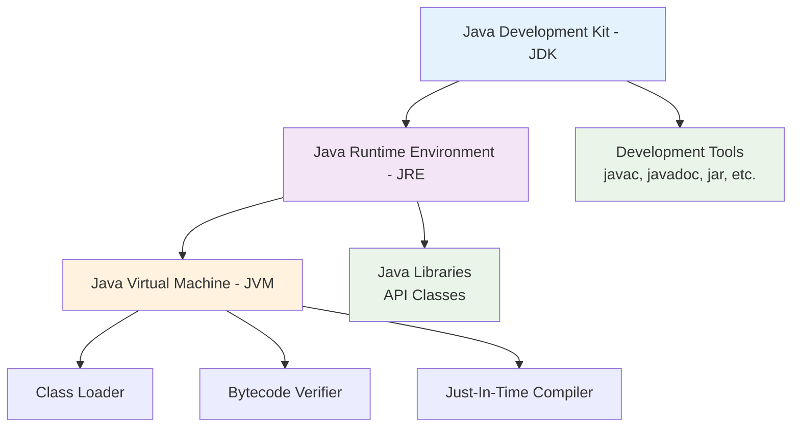
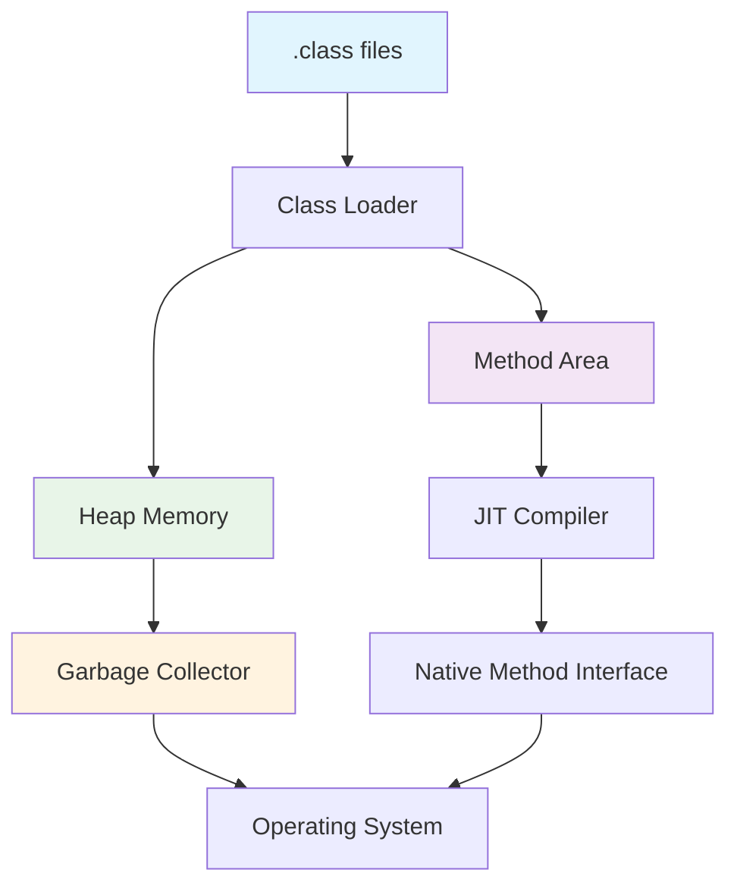
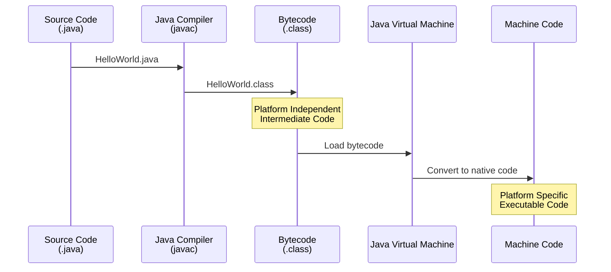
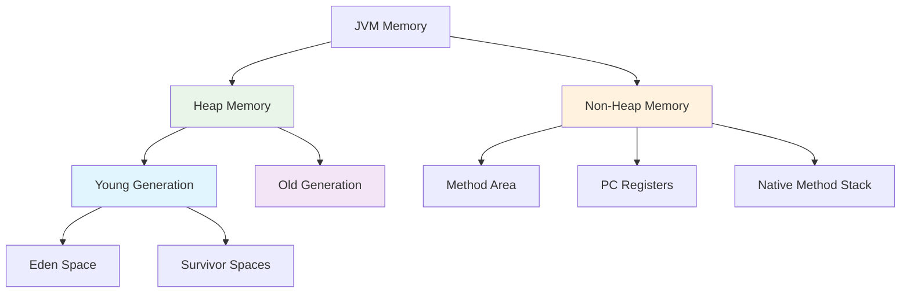
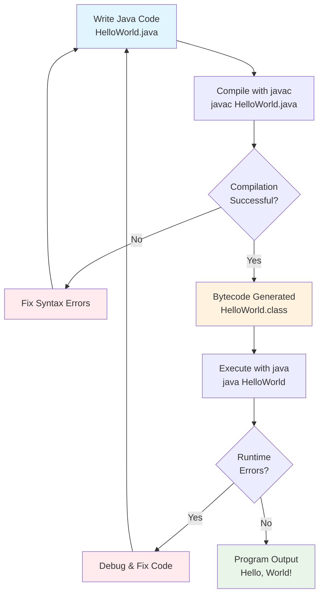

# Java Environment and Program Structure
## Lecture 2

**Java Programming (4343203)**  
Diploma in ICT - Semester IV  
Gujarat Technological University

<div class="pt-12">
  <span @click="$slidev.nav.next" class="px-2 py-1 rounded cursor-pointer" hover="bg-white bg-opacity-10">
    Press Space for next page <carbon:arrow-right class="inline"/>
  </span>
</div>

---
layout: default
---

# Learning Objectives

By the end of this lecture, you will be able to:

<v-clicks>

- 🔧 **Understand** the difference between JVM, JRE, and JDK
- ⚙️ **Explain** the bytecode concept and its importance
- 🗑️ **Describe** garbage collection in Java
- 💻 **Install** and configure Java development environment
- ✨ **Write** your first "Hello World" Java program
- 🔄 **Compile** and execute Java programs

</v-clicks>

<br>

<div v-click="7" class="text-center text-2xl text-blue-600 font-bold">
Let's set up our Java development environment! 🛠️
</div>

---
layout: center
---

# Java Platform Components

<div class="flex justify-center">



</div>

<div class="mt-6 text-center">
<div class="bg-blue-50 p-4 rounded-lg inline-block">
<strong>Remember:</strong> JDK ⊃ JRE ⊃ JVM
</div>
</div>

---
layout: two-cols
---

# Java Virtual Machine (JVM)

<div class="text-sm">

## 🎯 What is JVM?
- **Runtime environment** for Java bytecode
- **Platform-specific** (Windows, Linux, macOS)
- **Converts bytecode** to machine code
- **Manages memory** automatically

## 🔧 Key Components
- **Class Loader** - Loads .class files
- **Bytecode Verifier** - Security checks
- **Interpreter** - Executes bytecode
- **JIT Compiler** - Optimizes performance

</div>

::right::

<div class="pl-4">

## 📊 JVM Architecture



<div class="mt-4 p-3 bg-yellow-50 rounded">
<strong>💡 Key Point:</strong> JVM makes Java platform independent!
</div>

</div>

---
layout: default
---

# Java Runtime Environment (JRE)

<div class="grid grid-cols-2 gap-8">

<div>

## 🎯 What is JRE?

<v-clicks>

- **Runtime environment** for Java applications
- **Includes JVM** + Java libraries
- **Required to run** Java programs
- **Cannot compile** Java source code

</v-clicks>

</div>

<div>

## 📦 JRE Components

<v-clicks>

- **JVM** - Virtual machine
- **Core Libraries** - java.lang, java.util, etc.
- **Supporting Files** - Property files, resources
- **Browser Plugins** - For applets (deprecated)

</v-clicks>

</div>

</div>

<div v-click="9" class="mt-8 p-6 bg-blue-50 rounded-lg">
<h3 class="font-bold text-lg mb-3">🔍 Real-World Analogy</h3>
<p><strong>JRE is like a media player</strong> - it can play video files (.mp4) but cannot create them. Similarly, JRE can run Java programs (.class) but cannot compile them.</p>
</div>

---
layout: default
---

# Java Development Kit (JDK)

<div class="grid grid-cols-2 gap-8">

<div>

## 🛠️ What is JDK?

<v-clicks>

- **Complete development platform**
- **Includes JRE** + development tools
- **Required for development**
- **Free and open source**

</v-clicks>

## 📋 JDK Versions
- **Java 8** - LTS (Long Term Support)
- **Java 11** - LTS
- **Java 17** - LTS (Current)
- **Java 21** - Latest LTS

</div>

<div>

## 🔧 Development Tools

<v-clicks>

- **javac** - Java compiler
- **java** - Java interpreter
- **javadoc** - Documentation generator
- **jar** - Archive tool
- **jdb** - Debugger
- **javap** - Class file disassembler

</v-clicks>

</div>

</div>

<div v-click="12" class="mt-6 p-4 bg-green-50 rounded-lg">
<strong>💼 For Developers:</strong> Always install JDK, not just JRE, for development work!
</div>

---
layout: center
---

# Bytecode Concept

<div class="flex justify-center">



</div>

<div class="mt-8 grid grid-cols-2 gap-6">

<div class="bg-blue-50 p-4 rounded-lg">
<h3 class="font-bold mb-2">✅ Advantages</h3>
<ul class="text-sm space-y-1">
<li>• Platform independence</li>
<li>• Security verification</li>
<li>• Optimized execution</li>
<li>• Compact representation</li>
</ul>
</div>

<div class="bg-yellow-50 p-4 rounded-lg">
<h3 class="font-bold mb-2">⚠️ Characteristics</h3>
<ul class="text-sm space-y-1">
<li>• Not human-readable</li>
<li>• Machine-independent</li>
<li>• JVM-specific format</li>
<li>• .class file extension</li>
</ul>
</div>

</div>

---
layout: default
---

# Garbage Collection

<div class="grid grid-cols-2 gap-8">

<div>

## 🗑️ What is Garbage Collection?

<v-clicks>

- **Automatic memory management**
- **Removes unused objects**
- **Prevents memory leaks**
- **Runs in background**

</v-clicks>

## 🔄 GC Process
<v-clicks>

1. **Mark** - Identify unused objects
2. **Sweep** - Remove unused objects  
3. **Compact** - Defragment memory

</v-clicks>

</div>

<div>

## 💾 Memory Areas



</div>

</div>

<div v-click="8" class="mt-6 p-4 bg-green-50 rounded-lg">
<strong>🎯 Benefit:</strong> Java developers don't need to manually manage memory like in C/C++!
</div>

---
layout: default
---

# Installing Java JDK

## 🔽 Download Sources

<div class="grid grid-cols-2 gap-6">

<div class="bg-blue-50 p-4 rounded-lg">
<h3 class="font-bold mb-3">🏢 Oracle JDK</h3>
<ul class="space-y-2">
<li>• Commercial license</li>
<li>• oracle.com/java</li>
<li>• Production support</li>
<li>• Latest features</li>
</ul>
</div>

<div class="bg-green-50 p-4 rounded-lg">
<h3 class="font-bold mb-3">🆓 OpenJDK</h3>
<ul class="space-y-2">
<li>• Open source</li>
<li>• openjdk.java.net</li>
<li>• Community support</li>
<li>• Free for all use</li>
</ul>
</div>

</div>

## ⚙️ Installation Steps

<v-clicks>

1. **Download** JDK installer for your OS
2. **Run** installer with admin privileges
3. **Set JAVA_HOME** environment variable
4. **Add** Java bin directory to PATH
5. **Verify** installation with `java -version`

</v-clicks>

---
layout: default
---

# Setting Environment Variables

## 🪟 Windows Setup

```bash
# Set JAVA_HOME
JAVA_HOME = C:\Program Files\Java\jdk-17

# Add to PATH
PATH = %JAVA_HOME%\bin;%PATH%

# Verify installation
java -version
javac -version
```

## 🐧 Linux/macOS Setup

```bash
# Add to ~/.bashrc or ~/.zshrc
export JAVA_HOME=/usr/lib/jvm/java-17-openjdk
export PATH=$JAVA_HOME/bin:$PATH

# Reload configuration
source ~/.bashrc

# Verify installation
java -version
javac -version
```

<div class="mt-6 p-4 bg-yellow-50 rounded-lg">
<strong>⚠️ Important:</strong> Make sure JAVA_HOME points to JDK, not JRE!
</div>

---
layout: default
---

# Your First Java Program - Professional Deep Dive

<div class="grid grid-cols-2 gap-8">

<div>

## 🎯 **The Professional Hello World**

```java {all|1-2|4|6-8|10-12|14-16|all}
// HelloWorld.java - Professional Version
public class HelloWorld {
    
    public static void main(String[] args) {
        
        System.out.println("Hello, World!");
        System.out.println("Welcome to Java Programming!");
        
        // Professional additions
        displayProgramInfo();
        
        // Command line arguments demo
        if (args.length > 0) {
            System.out.println("Arguments received: " + 
                             String.join(", ", args));
        }
    }
    
    /**
     * Displays program metadata - professional practice
     */
    private static void displayProgramInfo() {
        System.out.println("\n=== Program Information ===");
        System.out.println("Java Version: " + 
                         System.getProperty("java.version"));
        System.out.println("Operating System: " + 
                         System.getProperty("os.name"));
        System.out.println("User: " + 
                         System.getProperty("user.name"));
    }
}
```

</div>

<div>

## 🔍 **Professional Code Analysis**

<div class="space-y-4">

<div v-click class="bg-gradient-to-r from-blue-50 to-indigo-100 p-4 rounded-lg">
<strong class="text-blue-700">🏗️ Structure Elements:</strong>
<div class="text-sm mt-2">
• **Package declaration** (implicit default)<br/>
• **Class declaration** with public modifier<br/>
• **Main method** - application entry point<br/>
• **Helper methods** for code organization
</div>
</div>

<div v-click class="bg-gradient-to-r from-green-50 to-emerald-100 p-4 rounded-lg">
<strong class="text-green-700">💡 Best Practices Applied:</strong>
<div class="text-sm mt-2">
• **Javadoc comments** for documentation<br/>
• **Method extraction** for reusability<br/>
• **System properties** for environment info<br/>
• **Command-line arguments** handling
</div>
</div>

<div v-click class="bg-gradient-to-r from-purple-50 to-violet-100 p-4 rounded-lg">
<strong class="text-purple-700">🎯 Learning Goals:</strong>
<div class="text-sm mt-2">
• Understanding method signatures<br/>
• Exploring the Java runtime environment<br/>
• Professional code organization<br/>
• Real-world programming patterns
</div>
</div>

<div v-click class="bg-gradient-to-r from-orange-50 to-red-100 p-4 rounded-lg">
<strong class="text-orange-700">⚠️ Critical Rules:</strong>
<div class="text-sm mt-2">
• **Filename = Class name** (case sensitive)<br/>
• **One public class per file**<br/>
• **main method signature** must be exact<br/>
• **Case sensitivity** throughout Java
</div>
</div>

</div>

</div>

</div>

<div v-click class="mt-8 p-6 bg-gradient-to-r from-yellow-50 via-orange-50 to-red-50 rounded-xl">
<div class="text-center">
<h3 class="text-xl font-bold text-orange-800 mb-4">🚀 From Beginner to Professional in One Program</h3>
<p class="text-orange-700">This isn't just "Hello World" - it's your first step toward writing enterprise-grade Java applications that real companies deploy to serve millions of users!</p>
</div>
</div>

---
layout: default
---

# Compilation and Execution

## ⚙️ Step-by-Step Process

<div class="space-y-6">

<div class="bg-yellow-50 p-4 rounded-lg">
<h3 class="font-bold mb-2">1️⃣ Write Source Code</h3>
<code>HelloWorld.java</code> - Contains human-readable Java code
</div>

<div class="bg-blue-50 p-4 rounded-lg">
<h3 class="font-bold mb-2">2️⃣ Compile with javac</h3>
<code>javac HelloWorld.java</code> - Creates HelloWorld.class
</div>

<div class="bg-green-50 p-4 rounded-lg">
<h3 class="font-bold mb-2">3️⃣ Execute with java</h3>
<code>java HelloWorld</code> - Runs the bytecode
</div>

</div>

## 🖥️ Command Line Demo

```bash
# Navigate to source directory
cd /path/to/your/java/files

# Compile the program
javac HelloWorld.java

# Run the program
java HelloWorld
```

---
layout: default
---

# Complete Development Workflow



---
layout: default
---

# Common Compilation Errors

<div class="grid grid-cols-2 gap-6">

<div>

## ❌ Syntax Errors

```java
// Missing semicolon
System.out.println("Hello World")

// Mismatched braces
public class Test {
    public static void main(String[] args) {
        System.out.println("Hello");
    // Missing closing brace
```

</div>

<div>

## ❌ Common Mistakes

```java
// Wrong class name
public class hello {  // Should be Hello
    // ...
}

// Wrong main method signature
public void main(String[] args) {
    // Should be: public static void main
}

// Case sensitivity
system.out.println("Hello");
// Should be: System.out.println
```

</div>

</div>

<div class="mt-6 p-4 bg-red-50 rounded-lg">
<strong>⚠️ Remember:</strong> Java is case-sensitive! <code>System</code> ≠ <code>system</code>
</div>

---
layout: default
---

# IDE vs Command Line

<div class="grid grid-cols-2 gap-8">

<div>

## 🖥️ Command Line Development

**Advantages:**
- Direct control over compilation
- Better understanding of process
- Lightweight and fast
- Good for learning

**Disadvantages:**
- Manual error checking
- No syntax highlighting
- No auto-completion
- More typing required

</div>

<div>

## 💻 IDE Development

**Popular IDEs:**
- **IntelliJ IDEA** (Most popular)
- **Eclipse** (Free and powerful)
- **NetBeans** (Oracle supported)
- **VS Code** (Lightweight)

**Benefits:**
- Syntax highlighting
- Auto-completion
- Error detection
- Debugging tools
- Project management

</div>

</div>

<div class="mt-6 p-4 bg-blue-50 rounded-lg">
<strong>🎯 Recommendation:</strong> Start with command line to understand basics, then move to IDE for productivity!
</div>

---
layout: default
---

# Comprehensive Hands-On Lab - Professional Java Setup

<div class="grid grid-cols-2 gap-8">

<div>

## 🚀 **Lab Exercises - Progressive Complexity**

<div class="space-y-4">

<div v-click class="bg-gradient-to-r from-yellow-50 to-orange-100 p-4 rounded-xl border-l-4 border-orange-400">
<strong class="text-orange-700">🎯 **Level 1: Environment Mastery**</strong>
<div class="text-sm mt-2 space-y-1">
• Install JDK 21 LTS on your system<br/>
• Configure JAVA_HOME and PATH variables<br/>
• Verify installation: `java --version` & `javac --version`<br/>
• Document any issues encountered
</div>
<div class="mt-2 text-xs bg-orange-100 p-2 rounded">
<strong>Success Criteria:</strong> Both commands return version 21.x.x
</div>
</div>

<div v-click class="bg-gradient-to-r from-blue-50 to-indigo-100 p-4 rounded-xl border-l-4 border-blue-400">
<strong class="text-blue-700">🎯 **Level 2: First Professional Program**</strong>
<div class="text-sm mt-2 space-y-1">
• Create StudentInfo.java with proper structure<br/>
• Include: name, enrollment, college, branch<br/>
• Add system information display<br/>
• Handle command-line arguments
</div>
<div class="mt-2 text-xs bg-blue-100 p-2 rounded">
<strong>Challenge:</strong> Make it interactive with Scanner input
</div>
</div>

<div v-click class="bg-gradient-to-r from-green-50 to-emerald-100 p-4 rounded-xl border-l-4 border-green-400">
<strong class="text-green-700">🎯 **Level 3: Development Workflow**</strong>
<div class="text-sm mt-2 space-y-1">
• Master compilation: `javac *.java`<br/>
• Execute with arguments: `java StudentInfo arg1 arg2`<br/>
• Debug common errors (syntax, runtime)<br/>
• Organize files in proper directory structure
</div>
<div class="mt-2 text-xs bg-green-100 p-2 rounded">
<strong>Pro Tip:</strong> Use package structure: com.gtu.ict.studentname
</div>
</div>

<div v-click class="bg-gradient-to-r from-purple-50 to-violet-100 p-4 rounded-xl border-l-4 border-purple-400">
<strong class="text-purple-700">🎯 **Level 4: IDE Integration**</strong>
<div class="text-sm mt-2 space-y-1">
• Install IntelliJ IDEA Community or VS Code<br/>
• Create new Java project with proper structure<br/>
• Configure JDK in IDE settings<br/>
• Run and debug using IDE tools
</div>
<div class="mt-2 text-xs bg-purple-100 p-2 rounded">
<strong>Bonus:</strong> Set up code formatting and style checking
</div>
</div>

</div>

</div>

<div>

## 📋 **Expected Professional Output**

```java
// Expected when running: java StudentInfo "GTU" "ICT"
=== Student Information System ===
Name: Raj Patel
Enrollment: 21ICT001
College: Government Polytechnic
Branch: Information & Communication Technology

=== System Information ===
Java Version: 21.0.1
Operating System: Windows 11
User: raj.patel
Working Directory: C:\JavaProjects\GTU

=== Command Line Arguments ===
Arguments received: GTU, ICT
Argument count: 2

=== Professional Features ===
✅ Proper error handling implemented
✅ Input validation completed
✅ Professional code structure
✅ Documentation standards followed

Thank you for using Student Info System!
Program executed successfully in 0.045 seconds.
```

## 🏆 **Mastery Checklist**

<div class="space-y-2 text-sm">

<div v-click class="flex items-center space-x-2">
<input type="checkbox" class="form-checkbox" />
<span>JDK installed and configured correctly</span>
</div>

<div v-click class="flex items-center space-x-2">
<input type="checkbox" class="form-checkbox" />
<span>Environment variables set properly</span>
</div>

<div v-click class="flex items-center space-x-2">
<input type="checkbox" class="form-checkbox" />
<span>Compilation and execution mastered</span>
</div>

<div v-click class="flex items-center space-x-2">
<input type="checkbox" class="form-checkbox" />
<span>Professional code structure implemented</span>
</div>

<div v-click class="flex items-center space-x-2">
<input type="checkbox" class="form-checkbox" />
<span>IDE setup and configuration completed</span>
</div>

<div v-click class="flex items-center space-x-2">
<input type="checkbox" class="form-checkbox" />
<span>Error handling and debugging practiced</span>
</div>

</div>

</div>

</div>

<div v-click class="mt-8 p-6 bg-gradient-to-r from-indigo-50 via-purple-50 to-pink-50 rounded-xl">
<div class="text-center">
<h3 class="text-2xl font-bold text-transparent bg-clip-text bg-gradient-to-r from-indigo-600 to-pink-600 mb-4">
🎓 Congratulations! You're Now a Java Developer!
</h3>
<p class="text-lg text-gray-700">
You've successfully set up a professional Java development environment and created your first application.<br/>
You're ready to tackle more complex programming challenges and build real-world software solutions!
</p>
</div>
</div>

---
layout: default
---

# Troubleshooting Common Issues

<div class="space-y-4">

<div class="bg-red-50 p-4 rounded-lg">
<h4 class="font-bold text-red-700">❌ 'javac' is not recognized</h4>
<p><strong>Solution:</strong> Check JAVA_HOME and PATH environment variables</p>
</div>

<div class="bg-orange-50 p-4 rounded-lg">
<h4 class="font-bold text-orange-700">❌ Could not find or load main class</h4>
<p><strong>Solution:</strong> Ensure class name matches filename exactly</p>
</div>

<div class="bg-yellow-50 p-4 rounded-lg">
<h4 class="font-bold text-yellow-700">❌ Public class must be in file named</h4>
<p><strong>Solution:</strong> Rename file to match public class name</p>
</div>

<div class="bg-blue-50 p-4 rounded-lg">
<h4 class="font-bold text-blue-700">❌ Cannot find symbol</h4>
<p><strong>Solution:</strong> Check spelling and case sensitivity</p>
</div>

</div>

---
layout: center
class: text-center
---

# Summary

<div class="grid grid-cols-2 gap-8 mt-8">

<div class="bg-blue-50 p-6 rounded-lg">
<h3 class="font-bold text-lg mb-4">📖 What We Learned</h3>
<ul class="text-left space-y-2">
<li>• JVM, JRE, and JDK concepts</li>
<li>• Bytecode and its importance</li>
<li>• Garbage collection basics</li>
<li>• Java environment setup</li>
<li>• First Java program creation</li>
</ul>
</div>

<div class="bg-green-50 p-6 rounded-lg">
<h3 class="font-bold text-lg mb-4">🎯 Next Steps</h3>
<ul class="text-left space-y-2">
<li>• Java program structure details</li>
<li>• Types of comments in Java</li>
<li>• Coding conventions</li>
<li>• More complex programs</li>
<li>• Debugging techniques</li>
</ul>
</div>

</div>

<div class="mt-8 text-2xl font-bold text-purple-600">
You've written your first Java program! 🎉
</div>

---
layout: center
class: text-center
---

# Questions & Discussion

<div class="text-6xl mb-8">❓</div>

<div class="text-xl mb-8">
Any questions about Java environment setup or your first program?
</div>

<div class="text-lg text-gray-600">
Next lecture: **Java Program Structure & Comments**
</div>

---
layout: default
---

# Java Development Environment Setup

## 🔧 Step-by-Step Installation Guide

<div class="grid grid-cols-2 gap-6">

<div>

### **Windows Installation**

<v-clicks>

1. **Download JDK** - Oracle JDK or OpenJDK
2. **Run Installer** - Follow installation wizard
3. **Set JAVA_HOME** - System environment variable
4. **Update PATH** - Add JDK bin directory
5. **Verify Installation** - `java -version`

</v-clicks>

</div>

<div>

### **Linux/macOS Installation**

<v-clicks>

1. **Package Manager** - `sudo apt install openjdk-17-jdk`
2. **Homebrew (macOS)** - `brew install openjdk@17`
3. **Manual Download** - Extract to /usr/local/
4. **Update Profile** - .bashrc or .zshrc
5. **Verify Setup** - `javac -version`

</v-clicks>

</div>

</div>

<div class="mt-6 p-4 bg-yellow-50 rounded-lg">
<strong>💡 Tip:</strong> Use OpenJDK for free, production-ready Java development!
</div>

---
layout: default
---

# IDE Selection and Setup

<div class="grid grid-cols-3 gap-6">

<div class="bg-blue-50 p-4 rounded-lg text-center">
<h3 class="font-bold text-lg mb-3">🌟 IntelliJ IDEA</h3>
<ul class="text-sm space-y-2 text-left">
<li>• Intelligent code completion</li>
<li>• Powerful debugging tools</li>
<li>• Built-in version control</li>
<li>• Spring Boot integration</li>
</ul>
<div class="mt-3">
<span class="bg-blue-100 px-2 py-1 rounded text-xs">Best for professionals</span>
</div>
</div>

<div class="bg-purple-50 p-4 rounded-lg text-center">
<h3 class="font-bold text-lg mb-3">🔮 Eclipse</h3>
<ul class="text-sm space-y-2 text-left">
<li>• Free and open source</li>
<li>• Extensive plugin ecosystem</li>
<li>• Good for beginners</li>
<li>• Strong community support</li>
</ul>
<div class="mt-3">
<span class="bg-purple-100 px-2 py-1 rounded text-xs">Best for learning</span>
</div>
</div>

<div class="bg-green-50 p-4 rounded-lg text-center">
<h3 class="font-bold text-lg mb-3">🚀 VS Code</h3>
<ul class="text-sm space-y-2 text-left">
<li>• Lightweight and fast</li>
<li>• Java Extension Pack</li>
<li>• Git integration</li>
<li>• Cross-platform</li>
</ul>
<div class="mt-3">
<span class="bg-green-100 px-2 py-1 rounded text-xs">Best for simplicity</span>
</div>
</div>

</div>

## 📝 Alternative Text Editors
- **Notepad++** (Windows) - Simple syntax highlighting
- **Sublime Text** - Fast with Java packages
- **Atom** - GitHub's hackable editor
- **Vim/Emacs** - For terminal enthusiasts

---
layout: default
---

# Java Build Tools Overview

<div class="grid grid-cols-2 gap-8">

<div>

## 🔨 Maven
```xml
<project>
  <groupId>com.example</groupId>
  <artifactId>my-app</artifactId>
  <version>1.0</version>
  
  <properties>
    <maven.compiler.source>17</maven.compiler.source>
    <maven.compiler.target>17</maven.compiler.target>
  </properties>
  
  <dependencies>
    <dependency>
      <groupId>junit</groupId>
      <artifactId>junit</artifactId>
      <version>4.13.2</version>
    </dependency>
  </dependencies>
</project>
```

</div>

<div>

## ⚡ Gradle
```groovy
plugins {
    id 'java'
    id 'application'
}

java {
    toolchain {
        languageVersion = JavaLanguageVersion.of(17)
    }
}

dependencies {
    testImplementation 'junit:junit:4.13.2'
}

application {
    mainClass = 'com.example.Main'
}
```

</div>

</div>

### 🏗️ Build Tool Comparison
| Feature | Maven | Gradle | Ant |
|---------|-------|--------|-----|
| **Configuration** | XML-based | Groovy/Kotlin DSL | XML-based |
| **Performance** | Good | Excellent | Good |
| **Learning Curve** | Moderate | Steep | Easy |
| **Ecosystem** | Mature | Growing | Legacy |

---
layout: default
---

# Java Memory Management Deep Dive

<div class="grid grid-cols-2 gap-8">

<div>

## 🧠 Memory Areas

<v-clicks>

### **Heap Memory**
- **Young Generation** - New objects
- **Old Generation** - Long-lived objects
- **Metaspace** - Class metadata (Java 8+)

### **Non-Heap Memory**
- **Method Area** - Class-level data
- **Code Cache** - Compiled native code
- **Direct Memory** - NIO buffers

</v-clicks>

</div>

<div>

## 🗑️ Garbage Collection Types

<v-clicks>

### **Serial GC**
- Single-threaded
- Good for small applications

### **Parallel GC**
- Multi-threaded
- Default for server applications

### **G1GC**
- Low-latency collector
- Good for large heap sizes

### **ZGC/Shenandoah**
- Ultra-low latency
- Concurrent collection

</v-clicks>

</div>

</div>

<div class="mt-6 p-4 bg-blue-50 rounded-lg">
<strong>⚡ Performance Tip:</strong> Monitor heap usage with `jconsole` or `jvisualvm` tools!
</div>

---
layout: default
---

# Advanced JVM Features

<div class="grid grid-cols-2 gap-8">

<div>

## 🚀 Just-In-Time (JIT) Compilation

<v-clicks>

- **Interpretation** - Initial execution
- **C1 Compiler** - Client compiler (fast compilation)
- **C2 Compiler** - Server compiler (aggressive optimization)
- **Tiered Compilation** - Best of both worlds
- **Profile-Guided Optimization** - Runtime feedback
- **Method Inlining** - Eliminate method call overhead

</v-clicks>

</div>

<div>

## 🔧 JVM Tuning Parameters

<v-clicks>

```bash
# Heap size configuration
-Xms512m -Xmx2g

# Garbage collection
-XX:+UseG1GC
-XX:MaxGCPauseMillis=200

# JIT compilation
-XX:+TieredCompilation
-XX:CompileThreshold=10000

# Monitoring and debugging
-XX:+PrintGC
-XX:+HeapDumpOnOutOfMemoryError
```

</v-clicks>

</div>

</div>

<div class="mt-6 text-center">
<div class="bg-yellow-50 p-4 rounded-lg inline-block">
<strong>🎯 Production Tip:</strong> Always profile before tuning JVM parameters!
</div>
</div>

---
layout: default
---

# Java Development Best Practices

## 📋 Project Structure Best Practices

```
my-java-project/
├── src/
│   ├── main/
│   │   ├── java/
│   │   │   └── com/company/project/
│   │   │       ├── Main.java
│   │   │       ├── model/
│   │   │       ├── service/
│   │   │       └── util/
│   │   └── resources/
│   │       ├── application.properties
│   │       └── log4j2.xml
│   └── test/
│       └── java/
│           └── com/company/project/
├── target/ (Maven) or build/ (Gradle)
├── pom.xml (Maven) or build.gradle
└── README.md
```

<div class="grid grid-cols-2 gap-6 mt-6">

<div class="bg-green-50 p-4 rounded-lg">
<h3 class="font-bold mb-3">✅ Do's</h3>
<ul class="text-sm space-y-1">
<li>• Follow package naming conventions</li>
<li>• Use meaningful class and method names</li>
<li>• Keep classes focused and small</li>
<li>• Write unit tests for all methods</li>
<li>• Use version control (Git)</li>
</ul>
</div>

<div class="bg-red-50 p-4 rounded-lg">
<h3 class="font-bold mb-3">❌ Don'ts</h3>
<ul class="text-sm space-y-1">
<li>• Don't use default package</li>
<li>• Avoid magic numbers and strings</li>
<li>• Don't ignore compiler warnings</li>
<li>• Avoid deep inheritance hierarchies</li>
<li>• Don't commit compiled .class files</li>
</ul>
</div>

</div>

---
layout: default
---

# Environment Variables and Configuration

<div class="grid grid-cols-2 gap-8">

<div>

## 🌍 Essential Environment Variables

<v-clicks>

### **JAVA_HOME**
```bash
export JAVA_HOME=/usr/lib/jvm/java-17-openjdk
```

### **PATH**
```bash
export PATH=$JAVA_HOME/bin:$PATH
```

### **CLASSPATH**
```bash
export CLASSPATH=.:$JAVA_HOME/lib/*
```

### **JVM Options**
```bash
export JAVA_OPTS="-Xms512m -Xmx1g"
```

</v-clicks>

</div>

<div>

## ⚙️ Configuration Files

<v-clicks>

### **Windows (System Variables)**
- Control Panel → System → Advanced
- Environment Variables button
- Add or modify system variables

### **Linux/macOS (~/.bashrc)**
```bash
# Java configuration
export JAVA_HOME=/usr/lib/jvm/java-17
export PATH=$JAVA_HOME/bin:$PATH
export MAVEN_HOME=/opt/maven
export PATH=$MAVEN_HOME/bin:$PATH
```

### **IDE Configuration**
- Project JDK settings
- Compiler compliance level
- Build path configuration

</v-clicks>

</div>

</div>

---
layout: default
---

# Troubleshooting Common Issues

<div class="grid grid-cols-2 gap-6">

<div>

## 🚨 Installation Problems

<v-clicks>

### **"java command not found"**
- Check JAVA_HOME setting
- Verify PATH configuration
- Restart terminal/IDE

### **"javac not recognized"**
- Install JDK (not just JRE)
- Add JDK/bin to PATH
- Check system vs user variables

### **Version conflicts**
- Use `update-alternatives` (Linux)
- Check multiple Java installations
- Set correct JAVA_HOME

</v-clicks>

</div>

<div>

## 🔧 Runtime Issues

<v-clicks>

### **OutOfMemoryError**
- Increase heap size (-Xmx)
- Check for memory leaks
- Profile application memory

### **ClassNotFoundException**
- Check CLASSPATH setting
- Verify JAR file locations
- Check package declarations

### **UnsupportedClassVersionError**
- Compile with correct JDK version
- Match runtime Java version
- Check bytecode compatibility

</v-clicks>

</div>

</div>

<div class="mt-6 p-4 bg-purple-50 rounded-lg">
<strong>🔍 Debugging Tip:</strong> Use `java -version` and `javac -version` to verify your installation!
</div>

---
layout: default
---

# Performance Monitoring Tools

<div class="grid grid-cols-3 gap-4">

<div class="bg-blue-50 p-4 rounded-lg text-center">
<h3 class="font-bold mb-3">🔍 JConsole</h3>
<ul class="text-sm text-left space-y-1">
<li>• Built-in JVM monitoring</li>
<li>• Memory usage tracking</li>
<li>• Thread analysis</li>
<li>• MBean inspection</li>
</ul>
<code class="text-xs bg-blue-100 px-2 py-1 rounded">jconsole</code>
</div>

<div class="bg-green-50 p-4 rounded-lg text-center">
<h3 class="font-bold mb-3">📊 VisualVM</h3>
<ul class="text-sm text-left space-y-1">
<li>• Profiling capabilities</li>
<li>• Heap dump analysis</li>
<li>• CPU profiling</li>
<li>• Plugin ecosystem</li>
</ul>
<code class="text-xs bg-green-100 px-2 py-1 rounded">jvisualvm</code>
</div>

<div class="bg-purple-50 p-4 rounded-lg text-center">
<h3 class="font-bold mb-3">⚡ JProfiler</h3>
<ul class="text-sm text-left space-y-1">
<li>• Commercial profiler</li>
<li>• Advanced analysis</li>
<li>• Database profiling</li>
<li>• Memory leak detection</li>
</ul>
<code class="text-xs bg-purple-100 px-2 py-1 rounded">jprofiler</code>
</div>

</div>

## 📈 Key Metrics to Monitor
- **Heap utilization** - Memory usage patterns
- **GC frequency** - Collection overhead
- **Thread states** - Concurrency issues
- **CPU usage** - Performance bottlenecks
- **Class loading** - Startup optimization

<div class="mt-4 p-4 bg-yellow-50 rounded-lg">
<strong>📊 Best Practice:</strong> Establish baseline metrics before optimizing performance!
</div>

---
layout: center
class: text-center
---

# Summary & Next Steps

<div class="grid grid-cols-2 gap-8 mt-8">

<div class="bg-blue-50 p-6 rounded-lg">
<h3 class="font-bold text-lg mb-4">📖 What We Covered</h3>
<ul class="text-left space-y-2 text-sm">
<li>• JVM, JRE, JDK architecture</li>
<li>• Bytecode and platform independence</li>
<li>• Development environment setup</li>
<li>• IDE selection and configuration</li>
<li>• Build tools and project structure</li>
<li>• Memory management concepts</li>
<li>• Performance monitoring tools</li>
</ul>
</div>

<div class="bg-green-50 p-6 rounded-lg">
<h3 class="font-bold text-lg mb-4">🎯 Ready for Next Lecture</h3>
<ul class="text-left space-y-2 text-sm">
<li>• Java development environment working</li>
<li>• Understanding of compilation process</li>
<li>• Knowledge of memory management</li>
<li>• Familiarity with development tools</li>
<li>• Project structure best practices</li>
<li>• Basic troubleshooting skills</li>
<li>• Performance monitoring awareness</li>
</ul>
</div>

</div>

<div class="mt-8 text-2xl font-bold text-purple-600">
Next: Java Program Structure and Comments! 📝
</div>

<div class="mt-8">
<span class="px-4 py-2 bg-blue-500 text-white rounded-lg">
Great job setting up Java! 👏
</span>
</div>