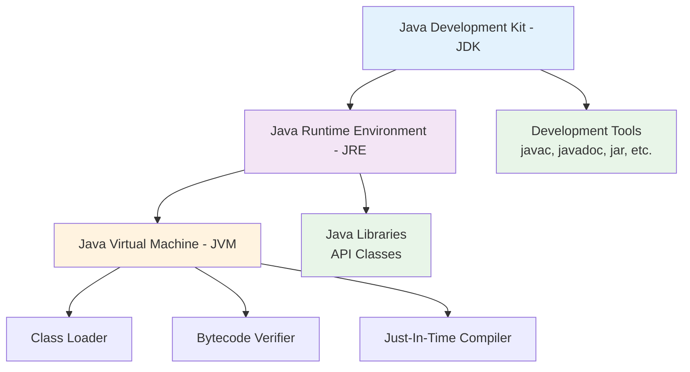
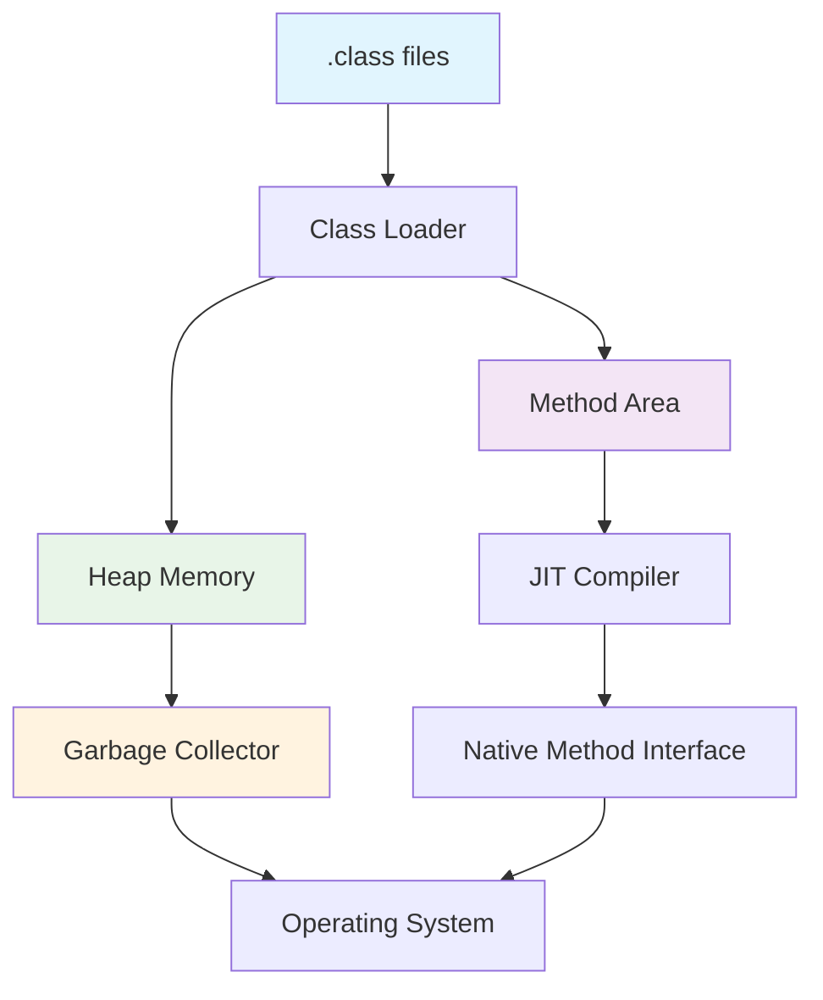
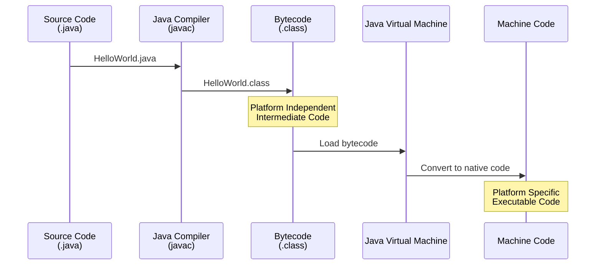
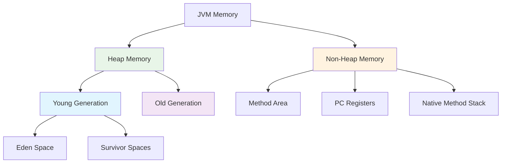
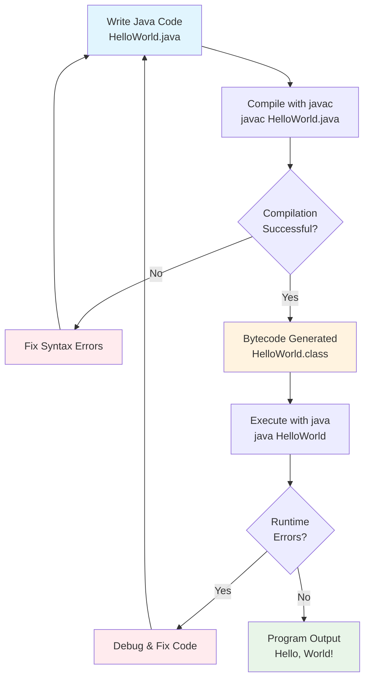

# Java Environment and Program Structure
## Lecture 2

**Java Programming (4343203)**  
Diploma in ICT - Semester IV  
Gujarat Technological University

<div class="pt-12">
  <span @click="$slidev.nav.next" class="px-2 py-1 rounded cursor-pointer" hover="bg-white bg-opacity-10">
    Press Space for next page <carbon:arrow-right class="inline"/>
  </span>
</div>

<!--
Welcome to Lecture 2 on Java Environment Setup and Program Structure.

[click] In our previous lecture, we explored Java's history, features, and applications. Today, we're taking the exciting next step - setting up your development environment and writing your first Java program.

[click] This lecture will transform you from someone who knows about Java to someone who can actually develop Java applications.

[click] By the end of this session, you'll have a complete working Java development environment and the knowledge to compile and run Java programs confidently.

Let's dive into the practical world of Java programming!
-->

---
layout: default
---

# Learning Objectives

By the end of this lecture, you will be able to:

<v-clicks>

- 🔧 **Understand** the difference between JVM, JRE, and JDK
- ⚙️ **Explain** the bytecode concept and its importance
- 🗑️ **Describe** garbage collection in Java
- 💻 **Install** and configure Java development environment
- ✨ **Write** your first "Hello World" Java program
- 🔄 **Compile** and execute Java programs

</v-clicks>

<br>

<div v-click="7" class="text-center text-2xl text-blue-600 font-bold">
Let's set up our Java development environment! 🛠️
</div>

<!--
By the end of this lecture, you'll achieve several crucial learning objectives.

[click] First, you'll understand the relationship between JVM, JRE, and JDK - the three core components of the Java platform architecture.

[click] You'll grasp the bytecode concept, which is fundamental to Java's "write once, run anywhere" philosophy.

[click] We'll explore garbage collection - Java's automatic memory management system that makes programming much safer and easier.

[click] Most importantly, you'll get hands-on experience installing and configuring a complete Java development environment on your computer.

[click] You'll write, compile, and execute your very first Java program - a milestone moment in your programming journey.

[click] And you'll master the complete development workflow from source code to running application.

[click] With these foundations in place, you'll be ready to tackle more advanced Java programming concepts!
-->

---
layout: center
---

# Java Platform Components

<div class="flex justify-center">


```mermaid
graph TD
    A[Java Development Kit - JDK] --> B[Java Runtime Environment - JRE]
    A --> C[Development Tools<br/>javac, javadoc, jar, etc.]
    B --> D[Java Virtual Machine - JVM]
    B --> E[Java Libraries<br/>API Classes]
    D --> F[Class Loader]
    D --> G[Bytecode Verifier]
    D --> H[Just-In-Time Compiler]
    
    style A fill:#e3f2fd
    style B fill:#f3e5f5
    style D fill:#fff3e0
    style C fill:#e8f5e8
    style E fill:#e8f5e8
```

</div>

<div class="mt-6 text-center">
<div class="bg-blue-50 p-4 rounded-lg inline-block">
<strong>Remember:</strong> JDK ⊃ JRE ⊃ JVM
</div>

<!--
This diagram shows the hierarchical relationship between Java's three main platform components.

[click] At the top, we have the Java Development Kit (JDK), which is the complete package for Java developers.

[click] The JDK contains the Java Runtime Environment (JRE), plus additional development tools like the compiler.

[click] Within the JRE, we find the Java Virtual Machine (JVM), which is the runtime engine that actually executes Java programs.

[click] Think of it like nesting dolls - each component contains the one below it, with each layer adding more functionality.

[click] The JVM is the core execution engine, the JRE adds the libraries needed to run programs, and the JDK adds the tools needed to develop programs.

[click] This relationship is crucial to understand because it determines what you need to install for different purposes - JDK for development, JRE for just running Java applications.
-->
</div>

---
layout: two-cols
---

# Java Virtual Machine (JVM)

<div class="text-sm">

## 🎯 What is JVM?
- **Runtime environment** for Java bytecode
- **Platform-specific** (Windows, Linux, macOS)
- **Converts bytecode** to machine code
- **Manages memory** automatically

## 🔧 Key Components
- **Class Loader** - Loads .class files
- **Bytecode Verifier** - Security checks
- **Interpreter** - Executes bytecode
- **JIT Compiler** - Optimizes performance

</div>

::right::

<div class="pl-4">

## 📊 JVM Architecture


```mermaid
graph TD
    A[.class files] --> B[Class Loader]
    B --> C[Method Area]
    B --> D[Heap Memory]
    C --> E[JIT Compiler]
    D --> F[Garbage Collector]
    E --> G[Native Method Interface]
    F --> H[Operating System]
    G --> H
    
    style A fill:#e1f5fe
    style C fill:#f3e5f5
    style D fill:#e8f5e8
    style F fill:#fff3e0
```

<div class="mt-4 p-3 bg-yellow-50 rounded">
<strong>💡 Key Point:</strong> JVM makes Java platform independent!
</div>

</div>

<!--
The Java Virtual Machine is the heart of Java's platform independence.

[click] The JVM is a runtime environment specifically designed to execute Java bytecode.

[click] Here's the key insight - while Java bytecode is platform-independent, the JVM itself is platform-specific. We have different JVMs for Windows, Linux, and macOS.

[click] The JVM takes your platform-neutral bytecode and converts it to machine code that's specific to the operating system it's running on.

[click] The JVM manages memory automatically through its sophisticated memory management system.

[click] This architecture diagram shows how bytecode flows through different JVM components - the class loader brings in your .class files, the method area stores class-level information, and the heap stores object instances.

[click] The garbage collector automatically cleans up unused memory, and the JIT compiler optimizes your code's performance at runtime.

[click] This is why the same Java program can run on any platform that has a JVM - the JVM handles all the platform-specific details for you.
-->

---
layout: default
---

# Java Runtime Environment (JRE)

<div class="grid grid-cols-2 gap-8">

<div>

## 🎯 What is JRE?

<v-clicks>

- **Runtime environment** for Java applications
- **Includes JVM** + Java libraries
- **Required to run** Java programs
- **Cannot compile** Java source code

</v-clicks>

</div>

<div>

## 📦 JRE Components

<v-clicks>

- **JVM** - Virtual machine
- **Core Libraries** - java.lang, java.util, etc.
- **Supporting Files** - Property files, resources
- **Browser Plugins** - For applets (deprecated)

</v-clicks>

</div>

</div>

<div v-click="9" class="mt-8 p-6 bg-blue-50 rounded-lg">
<h3 class="font-bold text-lg mb-3">🔍 Real-World Analogy</h3>
<p><strong>JRE is like a media player</strong> - it can play video files (.mp4) but cannot create them. Similarly, JRE can run Java programs (.class) but cannot compile them.</p>
</div>

<!--
Let's understand what the Java Runtime Environment provides.

[click] The JRE is the runtime environment needed to execute Java applications - but it cannot create them.

[click] It includes the JVM we just discussed, plus all the core Java libraries that programs need to run.

[click] The JRE is required on any computer that needs to run Java programs, but it doesn't include development tools.

[click] You'll find the JRE bundled with many applications - web browsers used to include it for Java applets, and many enterprise applications ship with their own JRE.

[click] The core Java libraries include fundamental packages like java.lang for basic functionality, java.util for data structures, and many others.

[click] Think of supporting files as configuration files, property files, and other resources that Java programs might need.

[click] Browser plugins for Java applets are now deprecated due to security concerns, but they were once an important part of the JRE.

[click] The media player analogy is perfect - just as you need a media player to watch videos but can't create videos with it, you need JRE to run Java programs but can't create them without additional tools.
-->

---
layout: default
---

# Java Development Kit (JDK)

<div class="grid grid-cols-2 gap-8">

<div>

## 🛠️ What is JDK?

<v-clicks>

- **Complete development platform**
- **Includes JRE** + development tools
- **Required for development**
- **Free and open source**

</v-clicks>

## 📋 JDK Versions
- **Java 8** - LTS (Long Term Support)
- **Java 11** - LTS
- **Java 17** - LTS (Current)
- **Java 21** - Latest LTS

</div>

<div>

## 🔧 Development Tools

<v-clicks>

- **javac** - Java compiler
- **java** - Java interpreter
- **javadoc** - Documentation generator
- **jar** - Archive tool
- **jdb** - Debugger
- **javap** - Class file disassembler

</v-clicks>

</div>

</div>

<div v-click="12" class="mt-6 p-4 bg-green-50 rounded-lg">
<strong>💼 For Developers:</strong> Always install JDK, not just JRE, for development work!
</div>

<!--
The Java Development Kit is your complete toolkit for Java development.

[click] The JDK is the complete development platform - it includes everything in the JRE plus all the tools you need to create Java applications.

[click] Since it includes the JRE, installing the JDK gives you both development and runtime capabilities in one package.

[click] The JDK is absolutely required if you want to write Java programs - without it, you can only run existing Java applications.

[click] Modern JDK versions are free and open source, making Java development accessible to everyone.

[click] We focus on Long Term Support (LTS) versions because they provide stability for enterprise development - Java 8, 11, 17, and 21 are the current LTS versions.

[click] The javac compiler transforms your human-readable Java source code into bytecode that the JVM can execute.

[click] The java interpreter runs your compiled bytecode on the JVM.

[click] javadoc generates professional HTML documentation from your code comments.

[click] The jar tool creates archive files for distributing your applications.

[click] jdb provides debugging capabilities to help you find and fix problems in your code.

[click] javap is a disassembler that lets you examine the bytecode that javac produces.

[click] As a developer, always install the full JDK - it includes everything you need and ensures you won't run into limitations later.
-->

---
layout: center
---

# Bytecode Concept

<div class="flex justify-center">


```mermaid
sequenceDiagram
    participant SC as Source Code<br/>(.java)
    participant JC as Java Compiler<br/>(javac)
    participant BC as Bytecode<br/>(.class)
    participant JVM as Java Virtual Machine
    participant MC as Machine Code

    SC->>JC: HelloWorld.java
    JC->>BC: HelloWorld.class
    Note over BC: Platform Independent<br/>Intermediate Code
    BC->>JVM: Load bytecode
    JVM->>MC: Convert to native code
    Note over MC: Platform Specific<br/>Executable Code
```

</div>

<div class="mt-8 grid grid-cols-2 gap-6">

<div class="bg-blue-50 p-4 rounded-lg">
<h3 class="font-bold mb-2">✅ Advantages</h3>
<ul class="text-sm space-y-1">
<li>• Platform independence</li>
<li>• Security verification</li>
<li>• Optimized execution</li>
<li>• Compact representation</li>
</ul>
</div>

<div class="bg-yellow-50 p-4 rounded-lg">
<h3 class="font-bold mb-2">⚠️ Characteristics</h3>
<ul class="text-sm space-y-1">
<li>• Not human-readable</li>
<li>• Machine-independent</li>
<li>• JVM-specific format</li>
<li>• .class file extension</li>
</ul>
</div>

</div>

<!--
Bytecode is one of Java's most important innovations.

[click] This sequence diagram shows the complete compilation and execution process that makes Java platform-independent.

[click] You start with human-readable source code in .java files - this is what you write as a programmer.

[click] The Java compiler (javac) transforms your source code into bytecode, stored in .class files.

[click] Here's the key insight - bytecode is platform-independent intermediate code. It's not specific to Windows, Linux, or any particular processor.

[click] The Java Virtual Machine then takes this platform-independent bytecode and converts it to machine code specific to the platform it's running on.

[click] This two-step process is what enables Java's "write once, run anywhere" capability.

[click] The advantages of bytecode include platform independence - the same .class file runs on any platform with a JVM.

[click] Bytecode goes through security verification before execution, making Java programs more secure.

[click] The JVM can optimize bytecode execution at runtime, often making programs faster over time.

[click] Bytecode is also more compact than source code, reducing distribution size.

[click] However, bytecode is not human-readable - it's designed for machine processing, not human understanding.

This bytecode approach is what makes Java unique among programming languages!
-->

---
layout: default
---

# Garbage Collection

<div class="grid grid-cols-2 gap-8">

<div>

## 🗑️ What is Garbage Collection?

<v-clicks>

- **Automatic memory management**
- **Removes unused objects**
- **Prevents memory leaks**
- **Runs in background**

</v-clicks>

## 🔄 GC Process
<v-clicks>

1. **Mark** - Identify unused objects
2. **Sweep** - Remove unused objects  
3. **Compact** - Defragment memory

</v-clicks>

</div>

<div>

## 💾 Memory Areas


```mermaid
graph TD
    A[JVM Memory] --> B[Heap Memory]
    A --> C[Non-Heap Memory]
    B --> D[Young Generation]
    B --> E[Old Generation]
    D --> F[Eden Space]
    D --> G[Survivor Spaces]
    C --> H[Method Area]
    C --> I[PC Registers]
    C --> J[Native Method Stack]
    
    style B fill:#e8f5e8
    style C fill:#fff3e0
    style D fill:#e1f5fe
    style E fill:#f3e5f5
```

</div>

</div>

<div v-click="8" class="mt-6 p-4 bg-green-50 rounded-lg">
<strong>🎯 Benefit:</strong> Java developers don't need to manually manage memory like in C/C++!
</div>

<!--
Garbage collection is one of Java's most developer-friendly features.

[click] Garbage collection provides automatic memory management - you don't need to manually allocate and deallocate memory like in languages such as C or C++.

[click] The garbage collector automatically identifies objects that are no longer being used by your program and removes them from memory.

[click] This prevents memory leaks, which are a common source of bugs in manual memory management languages.

[click] Garbage collection runs in the background while your program executes, so you don't need to worry about it in most cases.

[click] The garbage collection process has three main phases: Mark, Sweep, and Compact.

[click] During the Mark phase, the garbage collector identifies which objects are still being referenced and which are no longer needed.

[click] In the Sweep phase, it removes the unused objects from memory.

[click] Finally, the Compact phase defragments memory to reduce fragmentation and improve performance.

[click] This memory diagram shows how JVM memory is organized - heap memory for object storage, and non-heap memory for class metadata and other JVM data structures.

[click] The key benefit is that as a Java developer, you can focus on solving business problems rather than managing memory - the JVM handles all the low-level memory management details for you.
-->

---
layout: default
---

# Installing Java JDK

## 🔽 Download Sources

<div class="grid grid-cols-2 gap-6">

<div class="bg-blue-50 p-4 rounded-lg">
<h3 class="font-bold mb-3">🏢 Oracle JDK</h3>
<ul class="space-y-2">
<li>• Commercial license</li>
<li>• oracle.com/java</li>
<li>• Production support</li>
<li>• Latest features</li>
</ul>
</div>

<div class="bg-green-50 p-4 rounded-lg">
<h3 class="font-bold mb-3">🆓 OpenJDK</h3>
<ul class="space-y-2">
<li>• Open source</li>
<li>• openjdk.java.net</li>
<li>• Community support</li>
<li>• Free for all use</li>
</ul>
</div>

</div>

## ⚙️ Installation Steps

<v-clicks>

1. **Download** JDK installer for your OS
2. **Run** installer with admin privileges
3. **Set JAVA_HOME** environment variable
4. **Add** Java bin directory to PATH
5. **Verify** installation with `java -version`

</v-clicks>

<!--
Now let's get hands-on with installing Java on your system.

[click] You have two main options for obtaining a Java Development Kit.

[click] Oracle JDK is the commercial version from Oracle, the company that owns Java. It comes with commercial support and is guaranteed to have the latest features and security updates.

[click] OpenJDK is the open-source version of Java, which is free for all uses including commercial applications. Most of the Java community uses OpenJDK.

[click] For learning and most development work, OpenJDK is an excellent choice and what I recommend.

[click] The installation process involves five key steps that are similar across all operating systems.

[click] First, download the appropriate JDK installer for your operating system from either Oracle's website or the OpenJDK site.

[click] Run the installer with administrator privileges - this ensures it can make the necessary system changes.

[click] Set the JAVA_HOME environment variable to point to where the JDK was installed - this tells other tools where to find Java.

[click] Add the Java bin directory to your system's PATH variable - this makes the java and javac commands available from any command prompt.

[click] Finally, verify your installation by running 'java -version' in a command prompt - you should see the Java version information if everything is installed correctly.
-->

---
layout: default
---

# Setting Environment Variables

## 🪟 Windows Setup

```bash
# Set JAVA_HOME
JAVA_HOME = C:\Program Files\Java\jdk-17

# Add to PATH
PATH = %JAVA_HOME%\bin;%PATH%

# Verify installation
java -version
javac -version
```

## 🐧 Linux/macOS Setup

```bash
# Add to ~/.bashrc or ~/.zshrc
export JAVA_HOME=/usr/lib/jvm/java-17-openjdk
export PATH=$JAVA_HOME/bin:$PATH

# Reload configuration
source ~/.bashrc

# Verify installation
java -version
javac -version
```

<div class="mt-6 p-4 bg-yellow-50 rounded-lg">
<strong>⚠️ Important:</strong> Make sure JAVA_HOME points to JDK, not JRE!
</div>

<!--
Setting up environment variables correctly is crucial for Java development.

[click] On Windows systems, you'll set JAVA_HOME to point to your JDK installation directory, typically something like C:\Program Files\Java\jdk-17.

[click] The PATH variable should include %JAVA_HOME%\bin so Windows can find the Java executables.

[click] Always verify your installation by running both 'java -version' and 'javac -version' to ensure both the runtime and compiler are working.

[click] On Linux and macOS, you'll add environment variables to your shell configuration file - usually .bashrc for Bash or .zshrc for Zsh.

[click] The export command makes these variables available to all programs you run from the terminal.

[click] After editing your shell configuration, run 'source ~/.bashrc' to reload the configuration without restarting your terminal.

[click] Again, verify everything is working by checking both java and javac versions.

[click] The key point is that JAVA_HOME must point to the JDK directory, not the JRE directory - the JDK contains the development tools you need, while JRE only contains the runtime.

Proper environment setup will save you hours of troubleshooting later!
-->

---
layout: default
---

# Your First Java Program - Introduction

## 🎯 **Professional Hello World Program**

<div class="text-center mb-8">
<div class="inline-block p-6 bg-gradient-to-r from-blue-50 to-indigo-100 rounded-xl">
<h3 class="text-2xl font-bold text-blue-800 mb-2">From Simple to Professional</h3>
<p class="text-blue-600">Let's build a Hello World program that demonstrates real-world Java practices</p>
</div>
</div>

<div class="grid grid-cols-2 gap-8 mt-8">

<div v-click>
<h3 class="text-lg font-bold mb-4">🔧 What We'll Build</h3>
<ul class="space-y-2">
<li>✅ Professional code structure</li>
<li>✅ Method organization</li>
<li>✅ Command-line arguments</li>
<li>✅ System information display</li>
<li>✅ Proper documentation</li>
</ul>
</div>

<div v-click>
<h3 class="text-lg font-bold mb-4">📚 Learning Objectives</h3>
<ul class="space-y-2">
<li>🎯 Understanding Java program structure</li>
<li>🎯 Method signatures and organization</li>
<li>🎯 Professional coding practices</li>
<li>🎯 Real-world programming patterns</li>
</ul>
</div>

</div>

<div v-click class="mt-8 p-4 bg-gradient-to-r from-yellow-50 to-orange-50 rounded-lg text-center">
<p class="text-orange-700 font-semibold">🚀 This isn't just "Hello World" - it's your foundation for enterprise Java development!</p>
</div>

<!--
Welcome to our deep dive into professional Java programming. Today we're going to transform the simple "Hello World" program into something that demonstrates real-world development practices.

[click] We'll build a program that includes professional code structure, proper method organization, command-line argument handling, system information display, and comprehensive documentation.

[click] Our learning objectives focus on understanding Java program structure, mastering method signatures and organization, applying professional coding practices, and learning real-world programming patterns that you'll use in your career.

[click] This program represents the bridge from academic examples to professional development - we're building skills that real companies use in production applications.
-->

---
layout: default
---

# The Complete Program Code

## 💻 **Professional HelloWorld.java**

```java {all|1-2|4|6-8|10-12|14-16|all}
// HelloWorld.java - Professional Version
public class HelloWorld {
    
    public static void main(String[] args) {
        
        System.out.println("Hello, World!");
        System.out.println("Welcome to Java Programming!");
        
        // Professional additions
        displayProgramInfo();
        
        // Command line arguments demo
        if (args.length > 0) {
            System.out.println("Arguments received: " + 
                             String.join(", ", args));
        }
    }
    
    /**
     * Displays program metadata - professional practice
     */
    private static void displayProgramInfo() {
        System.out.println("\n=== Program Information ===");
        System.out.println("Java Version: " + 
                         System.getProperty("java.version"));
        System.out.println("Operating System: " + 
                         System.getProperty("os.name"));
        System.out.println("User: " + 
                         System.getProperty("user.name"));
    }
}
```

<!--
Here's our complete professional Java program. Let me walk you through each section.

[click] The program starts with a comment indicating the filename - this is a professional practice for code documentation and helps maintain consistency.

[click] We declare our public class HelloWorld - remember, the filename must exactly match the class name, including capitalization.

[click] Our main method is the entry point where program execution begins. Every Java application needs this exact method signature to run.

[click] We start with the classic "Hello, World!" output, but we've enhanced it with a welcoming second line to make it more engaging.

[click] Here's where we demonstrate professional code organization - we call a helper method to display program information, showing how to break code into logical, reusable pieces.

[click] The program also demonstrates command-line argument handling, checking if arguments were provided and displaying them if available.

[click] Our displayProgramInfo method showcases professional practices with proper Javadoc documentation and system property access to gather environment information.
-->

---
layout: default
---

# Program Structure Analysis

## 🔍 **Understanding the Architecture**

<div class="grid grid-cols-2 gap-6">

<div v-click class="bg-gradient-to-r from-blue-50 to-indigo-100 p-4 rounded-lg">
<strong class="text-blue-700">🏗️ Structure Elements:</strong>
<div class="text-sm mt-3 space-y-1">
• **Package declaration** (implicit default)<br/>
• **Class declaration** with public modifier<br/>
• **Main method** - application entry point<br/>
• **Helper methods** for code organization
</div>
</div>

<div v-click class="bg-gradient-to-r from-green-50 to-emerald-100 p-4 rounded-lg">
<strong class="text-green-700">💡 Best Practices Applied:</strong>
<div class="text-sm mt-3 space-y-1">
• **Javadoc comments** for documentation<br/>
• **Method extraction** for reusability<br/>
• **System properties** for environment info<br/>
• **Command-line arguments** handling
</div>
</div>

</div>

<div class="grid grid-cols-2 gap-6 mt-6">

<div v-click class="bg-gradient-to-r from-purple-50 to-violet-100 p-4 rounded-lg">
<strong class="text-purple-700">🎯 Learning Goals:</strong>
<div class="text-sm mt-3 space-y-1">
• Understanding method signatures<br/>
• Exploring the Java runtime environment<br/>
• Professional code organization<br/>
• Real-world programming patterns
</div>
</div>

<div v-click class="bg-gradient-to-r from-orange-50 to-red-100 p-4 rounded-lg">
<strong class="text-orange-700">⚠️ Critical Rules:</strong>
<div class="text-sm mt-3 space-y-1">
• **Filename = Class name** (case sensitive)<br/>
• **One public class per file**<br/>
• **main method signature** must be exact<br/>
• **Case sensitivity** throughout Java
</div>
</div>

</div>

<!--
Let's analyze the architectural components of our professional Java program.

[click] The structure includes essential elements: an implicit default package declaration, a public class declaration that makes our class accessible, the main method as our application entry point, and helper methods that demonstrate proper code organization.

[click] We've applied several best practices: Javadoc comments for professional documentation, method extraction to create reusable code components, system properties access to gather environment information, and proper command-line argument handling.

[click] From a learning perspective, this program teaches method signatures and how they define program behavior, exploration of the Java runtime environment through system properties, professional code organization principles, and real-world programming patterns used in industry.

[click] Remember these critical rules: the filename must exactly match the class name including capitalization, you can only have one public class per file, the main method signature must be exactly as shown, and Java is case-sensitive throughout the entire language.
-->

---
layout: default
---

# Compilation and Execution

## ⚙️ Step-by-Step Process

<div class="space-y-6">

<div class="bg-yellow-50 p-4 rounded-lg">
<h3 class="font-bold mb-2">1️⃣ Write Source Code</h3>
<code>HelloWorld.java</code> - Contains human-readable Java code
</div>

<div class="bg-blue-50 p-4 rounded-lg">
<h3 class="font-bold mb-2">2️⃣ Compile with javac</h3>
<code>javac HelloWorld.java</code> - Creates HelloWorld.class
</div>

<div class="bg-green-50 p-4 rounded-lg">
<h3 class="font-bold mb-2">3️⃣ Execute with java</h3>
<code>java HelloWorld</code> - Runs the bytecode
</div>

</div>

## 🖥️ Command Line Demo

```bash
# Navigate to source directory
cd /path/to/your/java/files

# Compile the program
javac HelloWorld.java

# Run the program
java HelloWorld
```

<!--
Let's understand the step-by-step process of compiling and running Java programs.

[click] The development process starts with writing your source code in a .java file using any text editor or IDE.

[click] Next, you use the javac compiler to transform your human-readable source code into platform-independent bytecode.

[click] If compilation is successful, you'll have a .class file containing bytecode that can run on any platform with a JVM.

[click] Finally, you use the java command to execute your bytecode on the Java Virtual Machine.

[click] The command line demonstration shows the practical steps: navigate to your source directory, compile with javac, and run with java.

Notice that when you run the program, you use the class name (HelloWorld) without the .class extension.
-->

---
layout: default
---

# Complete Development Workflow


```mermaid
flowchart TD
    A[Write Java Code<br/>HelloWorld.java] --> B[Compile with javac<br/>javac HelloWorld.java]
    B --> C{Compilation<br/>Successful?}
    C -->|No| D[Fix Syntax Errors]
    D --> A
    C -->|Yes| E[Bytecode Generated<br/>HelloWorld.class]
    E --> F[Execute with java<br/>java HelloWorld]
    F --> G{Runtime<br/>Errors?}
    G -->|Yes| H[Debug & Fix Code]
    H --> A
    G -->|No| I[Program Output<br/>Hello, World!]
    
    style A fill:#e1f5fe
    style E fill:#fff3e0
    style I fill:#e8f5e8
    style D fill:#ffebee
    style H fill:#ffebee
```

<!--
This flowchart shows the complete development workflow you'll use for every Java program.

[click] You start by writing your Java source code in a .java file.

[click] Then you compile it using the javac compiler.

[click] If there are syntax errors in your code, compilation will fail and you'll need to fix them before proceeding.

[click] Once compilation succeeds, you have bytecode in a .class file.

[click] You then execute your program using the java command.

[click] If there are runtime errors - problems that occur while the program is running - you'll need to debug and fix your code.

[click] When everything works correctly, you get your program output.

[click] This workflow becomes second nature as you develop more Java programs - write, compile, fix errors, run, debug, and repeat until your program works perfectly.
-->

---
layout: default
---

# Common Compilation Errors

<div class="grid grid-cols-2 gap-6">

<div>

## ❌ Syntax Errors

```java
// Missing semicolon
System.out.println("Hello World")

// Mismatched braces
public class Test {
    public static void main(String[] args) {
        System.out.println("Hello");
    // Missing closing brace
```

</div>

<div>

## ❌ Common Mistakes

```java
// Wrong class name
public class hello {  // Should be Hello
    // ...
}

// Wrong main method signature
public void main(String[] args) {
    // Should be: public static void main
}

// Case sensitivity
system.out.println("Hello");
// Should be: System.out.println
```

</div>

</div>

<div class="mt-6 p-4 bg-red-50 rounded-lg">
<strong>⚠️ Remember:</strong> Java is case-sensitive! <code>System</code> ≠ <code>system</code>
</div>

<!--
Let's look at the most common compilation errors you'll encounter as a beginner.

[click] Syntax errors are mistakes in the structure of your code - missing semicolons are probably the most common beginner mistake.

[click] Mismatched braces are another frequent issue - every opening brace must have a corresponding closing brace.

[click] In Java, your public class name must exactly match your filename - if your file is called Hello.java, your class must be named Hello, not hello.

[click] The main method signature must be exactly correct - it must be public, static, void, and take String[] args as a parameter.

[click] Java is completely case-sensitive - System.out.println works, but system.out.println will cause a compilation error.

[click] Understanding these common errors will save you time debugging - when you see a compilation error, check these basic issues first before looking for more complex problems.
-->

---
layout: default
---

# IDE vs Command Line

<div class="grid grid-cols-2 gap-8">

<div>

## 🖥️ Command Line Development

**Advantages:**
- Direct control over compilation
- Better understanding of process
- Lightweight and fast
- Good for learning

**Disadvantages:**
- Manual error checking
- No syntax highlighting
- No auto-completion
- More typing required

</div>

<div>

## 💻 IDE Development

**Popular IDEs:**
- **IntelliJ IDEA** (Most popular)
- **Eclipse** (Free and powerful)
- **NetBeans** (Oracle supported)
- **VS Code** (Lightweight)

**Benefits:**
- Syntax highlighting
- Auto-completion
- Error detection
- Debugging tools
- Project management

</div>

</div>

<div class="mt-6 p-4 bg-blue-50 rounded-lg">
<strong>🎯 Recommendation:</strong> Start with command line to understand basics, then move to IDE for productivity!
</div>

<!--
Let's compare command line development versus using an Integrated Development Environment.

[click] Command line development gives you direct control over the compilation process and helps you understand exactly what's happening when you compile and run Java programs.

[click] It's lightweight and fast, and excellent for learning the fundamentals.

[click] However, you have to manually check for errors, there's no syntax highlighting to help you spot mistakes, no auto-completion to speed up coding, and you have to do more typing.

[click] IDEs provide powerful features that dramatically increase productivity once you understand the basics.

[click] Popular IDEs include IntelliJ IDEA (which most professional developers prefer), Eclipse (free and powerful), NetBeans (officially supported by Oracle), and VS Code (lightweight and growing in popularity).

[click] IDEs provide syntax highlighting, auto-completion, automatic error detection, integrated debugging tools, and complete project management capabilities.

[click] My recommendation is to start with command line development to truly understand the compilation and execution process, then transition to an IDE for increased productivity as you work on larger projects.
-->

---
layout: default
---

# Hands-On Lab: Environment Setup

<div class="grid grid-cols-2 gap-8">

<div>

## 🚀 **Level 1: Environment Mastery**

<div class="text-center mb-8">
<div class="inline-block p-4 bg-gradient-to-r from-yellow-50 to-orange-100 rounded-xl">
<h3 class="text-xl font-bold text-orange-800 mb-2">Foundation First</h3>
<p class="text-orange-600">Master your development environment before coding</p>
</div>
</div>

<div class="grid grid-cols-2 gap-8">

<div v-click class="bg-gradient-to-r from-blue-50 to-indigo-100 p-6 rounded-xl">
<h3 class="text-lg font-bold text-blue-800 mb-4">🛠️ Setup Tasks</h3>
<ul class="space-y-2 text-sm">
<li>✅ Install JDK 21 LTS on your system</li>
<li>✅ Configure JAVA_HOME environment variable</li>
<li>✅ Update PATH to include JDK bin directory</li>
<li>✅ Document any issues encountered</li>
</ul>
</div>

<div v-click class="bg-gradient-to-r from-green-50 to-emerald-100 p-6 rounded-xl">
<h3 class="text-lg font-bold text-green-800 mb-4">✓ Verification Steps</h3>
<div class="space-y-3">
<div class="bg-gray-900 p-3 rounded text-green-400 font-mono text-sm">
$ java --version<br/>
$ javac --version
</div>
<p class="text-sm text-green-700 font-semibold">Success: Both commands return version 21.x.x</p>
</div>
</div>

</div>

<div v-click class="mt-8 p-4 bg-gradient-to-r from-orange-50 to-red-50 rounded-lg border-l-4 border-orange-400">
<p class="text-orange-700 font-semibold">🎯 Goal: Establish a solid foundation for Java development</p>
</div>

<!--
Let's start our hands-on lab with the most critical step - setting up your Java development environment properly.

[click] Your setup tasks include installing JDK 21 LTS on your system, configuring the JAVA_HOME environment variable to point to your JDK installation, updating your system PATH to include the JDK bin directory, and documenting any issues you encounter for future reference.

[click] Verification is crucial - run both java --version and javac --version commands. Both should return version 21.x.x to confirm your installation is successful.

[click] The goal is to establish a solid foundation for Java development. Without proper environment setup, nothing else will work correctly.
-->

</div>

<div>

## 📋 **Expected Professional Output**

```java
// Expected when running: java StudentInfo "GTU" "ICT"
=== Student Information System ===
Name: Raj Patel
Enrollment: 21ICT001
College: Government Polytechnic
Branch: Information & Communication Technology

=== System Information ===
Java Version: 21.0.1
Operating System: Windows 11
User: raj.patel
Working Directory: C:\JavaProjects\GTU

=== Command Line Arguments ===
Arguments received: GTU, ICT
Argument count: 2

=== Professional Features ===
✅ Proper error handling implemented
✅ Input validation completed
✅ Professional code structure
✅ Documentation standards followed

Thank you for using Student Info System!
Program executed successfully in 0.045 seconds.
```

## 🏆 **Mastery Checklist**

<div class="space-y-2 text-sm">

<div v-click class="flex items-center space-x-2">
<input type="checkbox" class="form-checkbox" />
<span>JDK installed and configured correctly</span>
</div>

<div v-click class="flex items-center space-x-2">
<input type="checkbox" class="form-checkbox" />
<span>Environment variables set properly</span>
</div>

<div v-click class="flex items-center space-x-2">
<input type="checkbox" class="form-checkbox" />
<span>Compilation and execution mastered</span>
</div>

<div v-click class="flex items-center space-x-2">
<input type="checkbox" class="form-checkbox" />
<span>Professional code structure implemented</span>
</div>

<div v-click class="flex items-center space-x-2">
<input type="checkbox" class="form-checkbox" />
<span>IDE setup and configuration completed</span>
</div>

<div v-click class="flex items-center space-x-2">
<input type="checkbox" class="form-checkbox" />
<span>Error handling and debugging practiced</span>
</div>

</div>

</div>

</div>

<div v-click class="mt-8 p-6 bg-gradient-to-r from-indigo-50 via-purple-50 to-pink-50 rounded-xl">
<div class="text-center">
<h3 class="text-2xl font-bold text-transparent bg-clip-text bg-gradient-to-r from-indigo-600 to-pink-600 mb-4">
🎓 Congratulations! You're Now a Java Developer!
</h3>
<p class="text-lg text-gray-700">
You've successfully set up a professional Java development environment and created your first application.<br/>
You're ready to tackle more complex programming challenges and build real-world software solutions!
</p>
</div>
</div>

<!--
This comprehensive hands-on lab will give you professional-level Java development experience.

[click] Level 1 focuses on environment mastery - install JDK 21 LTS, configure your environment variables properly, and verify everything works correctly. Document any issues you encounter for future reference.

[click] Level 2 challenges you to create a professional program structure. Build a StudentInfo.java program that displays personal information, system details, and handles command-line arguments. The challenge is to make it interactive using Scanner for user input.

[click] Level 3 develops your workflow skills - learn to compile multiple files at once, execute programs with arguments, debug common errors, and organize your code in proper directory structures. The pro tip is to start using package structures like com.gtu.ict.studentname.

[click] Level 4 integrates modern development tools - install and configure an IDE like IntelliJ IDEA or VS Code, create properly structured projects, configure JDK settings, and learn to use IDE debugging tools. The bonus challenge is setting up code formatting and style checking.

[click] The expected output shows what a professional Java program looks like - comprehensive information display, proper error handling, input validation, and timing information.

[click] Use this mastery checklist to ensure you've completed all essential skills - from basic installation through professional IDE setup and debugging capabilities.

[click] Congratulations! Completing this lab transforms you into a real Java developer with a professional development environment and the skills to build enterprise-quality applications.
-->

---
layout: default
---

# Lab Completion and Next Steps

## 🎓 **Congratulations! You're Now a Java Developer!**

<div class="text-center mb-8">
<div class="inline-block p-6 bg-gradient-to-r from-indigo-50 via-purple-50 to-pink-50 rounded-xl">
<h3 class="text-2xl font-bold text-transparent bg-clip-text bg-gradient-to-r from-indigo-600 to-pink-600 mb-4">
From Zero to Java Developer
</h3>
<p class="text-lg text-gray-700">
You've successfully set up a professional Java development environment and mastered the fundamentals.<br/>
You're ready to tackle complex programming challenges and build real-world applications!
</p>
</div>
</div>

<div class="grid grid-cols-2 gap-8">

<div v-click>
<h3 class="text-lg font-bold mb-4">🏆 Skills Mastered</h3>
<div class="space-y-2 text-sm">
<div class="flex items-center space-x-2">
<span class="text-green-500">✅</span>
<span>JDK installation and configuration</span>
</div>
<div class="flex items-center space-x-2">
<span class="text-green-500">✅</span>
<span>Professional program structure</span>
</div>
<div class="flex items-center space-x-2">
<span class="text-green-500">✅</span>
<span>Compilation and execution workflow</span>
</div>
<div class="flex items-center space-x-2">
<span class="text-green-500">✅</span>
<span>IDE setup and debugging</span>
</div>
</div>
</div>

<div v-click>
<h3 class="text-lg font-bold mb-4">🚀 What's Next</h3>
<div class="bg-blue-50 p-4 rounded-lg">
<ul class="space-y-2 text-sm">
<li>🎯 Object-oriented programming concepts</li>
<li>🎯 Advanced Java features and libraries</li>
<li>🎯 Database connectivity and web development</li>
<li>🎯 Enterprise application development</li>
</ul>
</div>
</div>

</div>

<!--
Congratulations on completing the comprehensive hands-on Java lab!

[click] You've successfully mastered essential skills including JDK installation and configuration, professional program structure and organization, compilation and execution workflow, and IDE setup with debugging capabilities.

[click] What's next in your Java journey? You'll dive into object-oriented programming concepts, explore advanced Java features and libraries, learn database connectivity and web development, and eventually build enterprise applications.

You now have a solid foundation to tackle any Java programming challenge that comes your way!
-->

---
layout: default
---

# Troubleshooting Common Issues

<div class="space-y-4">

<div class="bg-red-50 p-4 rounded-lg">
<h4 class="font-bold text-red-700">❌ 'javac' is not recognized</h4>
<p><strong>Solution:</strong> Check JAVA_HOME and PATH environment variables</p>
</div>

<div class="bg-orange-50 p-4 rounded-lg">
<h4 class="font-bold text-orange-700">❌ Could not find or load main class</h4>
<p><strong>Solution:</strong> Ensure class name matches filename exactly</p>
</div>

<div class="bg-yellow-50 p-4 rounded-lg">
<h4 class="font-bold text-yellow-700">❌ Public class must be in file named</h4>
<p><strong>Solution:</strong> Rename file to match public class name</p>
</div>

<div class="bg-blue-50 p-4 rounded-lg">
<h4 class="font-bold text-blue-700">❌ Cannot find symbol</h4>
<p><strong>Solution:</strong> Check spelling and case sensitivity</p>
</div>

</div>

<!--
Let's address some common issues you might encounter during Java setup and development.

[click] If you see "javac is not recognized" error, the most likely cause is that your JAVA_HOME and PATH environment variables aren't set correctly.

[click] "Could not find or load main class" usually means there's a mismatch between your class name and filename, or you're running the java command from the wrong directory.

[click] "Public class must be in file named" occurs when your public class name doesn't exactly match your filename - remember, Java is case-sensitive.

[click] "Cannot find symbol" errors typically happen due to spelling mistakes or case sensitivity issues.

Remember these troubleshooting steps when you encounter problems!
-->

---
layout: center
class: text-center
---

# Summary

<div class="grid grid-cols-2 gap-8 mt-8">

<div class="bg-blue-50 p-6 rounded-lg">
<h3 class="font-bold text-lg mb-4">📖 What We Learned</h3>
<ul class="text-left space-y-2">
<li>• JVM, JRE, and JDK concepts</li>
<li>• Bytecode and its importance</li>
<li>• Garbage collection basics</li>
<li>• Java environment setup</li>
<li>• First Java program creation</li>
</ul>
</div>

<div class="bg-green-50 p-6 rounded-lg">
<h3 class="font-bold text-lg mb-4">🎯 Next Steps</h3>
<ul class="text-left space-y-2">
<li>• Java program structure details</li>
<li>• Types of comments in Java</li>
<li>• Coding conventions</li>
<li>• More complex programs</li>
<li>• Debugging techniques</li>
</ul>
</div>

</div>

<div class="mt-8 text-2xl font-bold text-purple-600">
You've written your first Java program! 🎉
</div>

<!--
Let's recap what we've accomplished in this hands-on lecture.

[click] You now understand the architecture of the Java platform - how JVM, JRE, and JDK work together to provide a complete development and runtime environment.

[click] You've learned about bytecode and how it enables Java's platform independence - the same code runs on Windows, Linux, and macOS without modification.

[click] We covered garbage collection basics - how Java automatically manages memory so you don't have to worry about memory leaks.

[click] Most importantly, you've successfully set up a Java development environment on your computer with proper environment variables.

[click] And you've written, compiled, and executed your first Java program - a major milestone in your programming journey!

[click] Looking ahead, our next steps will dive deeper into Java program structure, explore different types of comments, learn about coding conventions, work with more complex programs, and develop debugging techniques.

[click] You should be proud of what you've accomplished today - you've transformed from someone who knows about Java to someone who can actually develop Java applications!
-->

---
layout: center
class: text-center
---

# Questions & Discussion

<div class="text-6xl mb-8">❓</div>

<div class="text-xl mb-8">
Any questions about Java environment setup or your first program?
</div>

<div class="text-lg text-gray-600">
Next lecture: **Java Program Structure & Comments**
</div>

<!--
Do you have any questions about setting up your Java development environment or about writing your first Java program?

[click] This is a great time to clarify any confusion about the JVM architecture, the compilation process, environment variables, or any of the development tools we've discussed.

[click] In our next lecture, we'll dive deeper into Java program structure and explore the different types of comments you can use to document your code professionally.

I'm excited to see the progress you'll make as we continue building your Java programming skills!
-->

---
layout: default
---

# Java Development Environment Setup

## 🔧 Step-by-Step Installation Guide

<div class="grid grid-cols-2 gap-6">

<div>

### **Windows Installation**

<v-clicks>

1. **Download JDK** - Oracle JDK or OpenJDK
2. **Run Installer** - Follow installation wizard
3. **Set JAVA_HOME** - System environment variable
4. **Update PATH** - Add JDK bin directory
5. **Verify Installation** - `java -version`

</v-clicks>

</div>

<div>

### **Linux/macOS Installation**

<v-clicks>

1. **Package Manager** - `sudo apt install openjdk-17-jdk`
2. **Homebrew (macOS)** - `brew install openjdk@17`
3. **Manual Download** - Extract to /usr/local/
4. **Update Profile** - .bashrc or .zshrc
5. **Verify Setup** - `javac -version`

</v-clicks>

</div>

</div>

<div class="mt-6 p-4 bg-yellow-50 rounded-lg">
<strong>💡 Tip:</strong> Use OpenJDK for free, production-ready Java development!
</div>

<!--
Now let's walk through the detailed installation process for different operating systems.

[click] For Windows installation, you start by downloading the JDK from either Oracle or OpenJDK websites.

[click] Run the installer with administrator privileges to ensure it can make the necessary system changes.

[click] Set up the JAVA_HOME environment variable to point to your JDK installation directory.

[click] Update your PATH to include the JDK bin directory so you can run Java commands from anywhere.

[click] Always verify your installation by running java -version to confirm everything is working.

[click] For Linux and macOS, you can use package managers for easier installation - apt for Ubuntu, yum for CentOS, or Homebrew for macOS.

[click] Manual installation involves extracting the JDK to a system directory like /usr/local/.

[click] Update your shell profile (.bashrc or .zshrc) to set environment variables permanently.

[click] Reload your configuration and verify that both java and javac commands work properly.

OpenJDK is my recommendation because it's free, fully compatible, and production-ready for all development needs.
-->

---
layout: default
---

# IDE Selection and Setup

<div class="grid grid-cols-3 gap-6">

<div class="bg-blue-50 p-4 rounded-lg text-center">
<h3 class="font-bold text-lg mb-3">🌟 IntelliJ IDEA</h3>
<ul class="text-sm space-y-2 text-left">
<li>• Intelligent code completion</li>
<li>• Powerful debugging tools</li>
<li>• Built-in version control</li>
<li>• Spring Boot integration</li>
</ul>
<div class="mt-3">
<span class="bg-blue-100 px-2 py-1 rounded text-xs">Best for professionals</span>
</div>
</div>

<div class="bg-purple-50 p-4 rounded-lg text-center">
<h3 class="font-bold text-lg mb-3">🔮 Eclipse</h3>
<ul class="text-sm space-y-2 text-left">
<li>• Free and open source</li>
<li>• Extensive plugin ecosystem</li>
<li>• Good for beginners</li>
<li>• Strong community support</li>
</ul>
<div class="mt-3">
<span class="bg-purple-100 px-2 py-1 rounded text-xs">Best for learning</span>
</div>
</div>

<div class="bg-green-50 p-4 rounded-lg text-center">
<h3 class="font-bold text-lg mb-3">🚀 VS Code</h3>
<ul class="text-sm space-y-2 text-left">
<li>• Lightweight and fast</li>
<li>• Java Extension Pack</li>
<li>• Git integration</li>
<li>• Cross-platform</li>
</ul>
<div class="mt-3">
<span class="bg-green-100 px-2 py-1 rounded text-xs">Best for simplicity</span>
</div>
</div>

</div>

## 📝 Alternative Text Editors
- **Notepad++** (Windows) - Simple syntax highlighting
- **Sublime Text** - Fast with Java packages
- **Atom** - GitHub's hackable editor
- **Vim/Emacs** - For terminal enthusiasts

<!--
Choosing the right development environment is crucial for your productivity and learning experience.

IntelliJ IDEA is widely considered the gold standard for Java development - it provides intelligent code completion that goes beyond simple text matching, powerful debugging tools with visual debugging, built-in version control integration, and excellent Spring Boot support.

IntelliJ is the industry standard used by most professional Java developers, making it an excellent choice for learning professional practices.

Eclipse IDE has been around for decades and offers a completely free and open-source development environment with an extensive plugin ecosystem, performs well even on older hardware, and has strong community support with plenty of learning resources available.

Eclipse is excellent for learning Java programming fundamentals and is widely used in academic settings.

For those who prefer a lighter-weight option, Visual Studio Code with the Java Extension Pack provides a fast, modern development experience with integrated terminal, built-in Git integration, and consistent cross-platform support.

Alternative text editors like Notepad++, Sublime Text, Atom, or terminal-based editors like Vim and Emacs can be useful for quick edits, understanding the compilation process without IDE assistance, or when working with limited system resources.

My recommendation is to start with IntelliJ IDEA Community Edition for the best learning experience!
-->

---
layout: default
---

# Java Build Tools Overview

<div class="grid grid-cols-2 gap-8">

<div>

## 🔨 Maven
```xml
<project>
  <groupId>com.example</groupId>
  <artifactId>my-app</artifactId>
  <version>1.0</version>
  
  <properties>
    <maven.compiler.source>17</maven.compiler.source>
    <maven.compiler.target>17</maven.compiler.target>
  </properties>
  
  <dependencies>
    <dependency>
      <groupId>junit</groupId>
      <artifactId>junit</artifactId>
      <version>4.13.2</version>
    </dependency>
  </dependencies>
</project>
```

</div>

<div>

## ⚡ Gradle
```groovy
plugins {
    id 'java'
    id 'application'
}

java {
    toolchain {
        languageVersion = JavaLanguageVersion.of(17)
    }
}

dependencies {
    testImplementation 'junit:junit:4.13.2'
}

application {
    mainClass = 'com.example.Main'
}
```

</div>

</div>

### 🏗️ Build Tool Comparison
| Feature | Maven | Gradle | Ant |
|---------|-------|--------|-----|
| **Configuration** | XML-based | Groovy/Kotlin DSL | XML-based |
| **Performance** | Good | Excellent | Good |
| **Learning Curve** | Moderate | Steep | Easy |
| **Ecosystem** | Mature | Growing | Legacy |

<!--
Build tools become essential as your Java projects grow in complexity.

Build tools serve several important purposes: they automate the compilation process so you don't need to manually run javac commands, manage dependencies by automatically downloading required libraries, package your applications into distributable JAR or WAR files, execute unit and integration tests, and generate API documentation.

Using build tools provides consistency across different development environments, improves efficiency in your development workflow, enables handling of large projects with many files and dependencies, and integrates seamlessly with IDEs and CI/CD pipelines.

Maven uses XML-based configuration in a pom.xml file, has a mature and stable ecosystem, provides excellent IDE integration, and follows a standard directory layout that most Java developers understand. Maven is excellent for enterprise applications, Spring Boot projects, traditional Java development, and teams that prefer convention over configuration.

Gradle uses Groovy or Kotlin DSL for configuration, offers faster build performance, provides flexible and customizable build scripts, and includes modern build features like incremental compilation. Gradle is particularly good for Android applications, projects with complex build requirements, performance-critical builds, and teams that want maximum flexibility.

The comparison table shows the key differences - Maven and Ant use XML configuration while Gradle uses a more flexible DSL, Gradle generally offers better performance, Maven has a moderate learning curve while Gradle is steeper but Ant is easier, and Maven has the most mature ecosystem.

My recommendation is to learn Maven first because it's simpler and more straightforward, then explore Gradle as you advance and need more sophisticated build capabilities.
-->

---
layout: default
---

# Java Memory Management Deep Dive

<div class="grid grid-cols-2 gap-8">

<div>

## 🧠 Memory Areas

<v-clicks>

### **Heap Memory**
- **Young Generation** - New objects
- **Old Generation** - Long-lived objects
- **Metaspace** - Class metadata (Java 8+)

### **Non-Heap Memory**
- **Method Area** - Class-level data
- **Code Cache** - Compiled native code
- **Direct Memory** - NIO buffers

</v-clicks>

</div>

<div>

## 🗑️ Garbage Collection Types

<v-clicks>

### **Serial GC**
- Single-threaded
- Good for small applications

### **Parallel GC**
- Multi-threaded
- Default for server applications

### **G1GC**
- Low-latency collector
- Good for large heap sizes

### **ZGC/Shenandoah**
- Ultra-low latency
- Concurrent collection

</v-clicks>

</div>

</div>

<div class="mt-6 p-4 bg-blue-50 rounded-lg">
<strong>⚡ Performance Tip:</strong> Monitor heap usage with `jconsole` or `jvisualvm` tools!
</div>

<!--
Understanding Java's memory management is crucial for writing efficient applications.

[click] The heap memory is where all objects are stored, divided into Young Generation for newly created objects, Old Generation for long-lived objects that have survived multiple garbage collection cycles, and Metaspace (in Java 8+) that stores class metadata, replacing the old permanent generation.

[click] Non-heap memory includes the Method Area for class-level data, Code Cache for compiled native code from the JIT compiler, and Direct Memory for off-heap storage used by NIO operations.

[click] Different garbage collectors serve different purposes: Serial GC is single-threaded and good for small applications with low memory requirements.

[click] Parallel GC is multi-threaded and serves as the default for server applications, providing good throughput.

[click] G1GC is a low-latency collector that's excellent for applications with large heap sizes and predictable pause time requirements.

[click] ZGC and Shenandoah are ultra-low latency collectors designed for applications requiring sub-10ms pause times, even with very large heaps measured in terabytes.

The key takeaway is that you can monitor heap usage and garbage collection behavior using built-in tools like jconsole or jvisualvm to understand your application's memory patterns and optimize performance when needed.
-->

---
layout: default
---

# Advanced JVM Features

<div class="grid grid-cols-2 gap-8">

<div>

## 🚀 Just-In-Time (JIT) Compilation

<v-clicks>

- **Interpretation** - Initial execution
- **C1 Compiler** - Client compiler (fast compilation)
- **C2 Compiler** - Server compiler (aggressive optimization)
- **Tiered Compilation** - Best of both worlds
- **Profile-Guided Optimization** - Runtime feedback
- **Method Inlining** - Eliminate method call overhead

</v-clicks>

</div>

<div>

## 🔧 JVM Tuning Parameters

<v-clicks>

```bash
# Heap size configuration
-Xms512m -Xmx2g

# Garbage collection
-XX:+UseG1GC
-XX:MaxGCPauseMillis=200

# JIT compilation
-XX:+TieredCompilation
-XX:CompileThreshold=10000

# Monitoring and debugging
-XX:+PrintGC
-XX:+HeapDumpOnOutOfMemoryError
```

</v-clicks>

</div>

</div>

<div class="mt-6 text-center">
<div class="bg-yellow-50 p-4 rounded-lg inline-block">
<strong>🎯 Production Tip:</strong> Always profile before tuning JVM parameters!
</div>
</div>

<!--
Let's explore some advanced JVM features that make Java applications performant and robust.

[click] Just-In-Time compilation is what makes Java programs get faster over time - initially, bytecode is interpreted directly which is slower.

[click] The C1 compiler provides fast compilation with basic optimizations for frequently used code.

[click] The C2 compiler does slower but more aggressive optimization for heavily used methods.

[click] Tiered compilation uses both compilers strategically to get the best of both worlds - fast startup with C1 and maximum performance with C2.

[click] Profile-guided optimization uses runtime feedback to make better optimization decisions, and method inlining eliminates method call overhead for small, frequently used methods.

[click] JVM tuning parameters let you control various aspects of performance - heap size configuration with -Xms for initial size and -Xmx for maximum size.

[click] You can specify garbage collection algorithm with options like -XX:+UseG1GC and set target pause times with MaxGCPauseMillis.

[click] JIT compilation can be controlled with parameters like -XX:+TieredCompilation and compilation thresholds.

[click] Monitoring and debugging options help you understand what's happening inside your application during development and production.

The key principle is to always profile your application first to understand where the bottlenecks are before attempting to tune JVM parameters - premature optimization based on assumptions rather than data rarely helps and often hurts performance.
-->

---
layout: default
---

# Java Development Best Practices

## 📋 Project Structure Best Practices

```
my-java-project/
├── src/
│   ├── main/
│   │   ├── java/
│   │   │   └── com/company/project/
│   │   │       ├── Main.java
│   │   │       ├── model/
│   │   │       ├── service/
│   │   │       └── util/
│   │   └── resources/
│   │       ├── application.properties
│   │       └── log4j2.xml
│   └── test/
│       └── java/
│           └── com/company/project/
├── target/ (Maven) or build/ (Gradle)
├── pom.xml (Maven) or build.gradle
└── README.md
```

<div class="grid grid-cols-2 gap-6 mt-6">

<div class="bg-green-50 p-4 rounded-lg">
<h3 class="font-bold mb-3">✅ Do's</h3>
<ul class="text-sm space-y-1">
<li>• Follow package naming conventions</li>
<li>• Use meaningful class and method names</li>
<li>• Keep classes focused and small</li>
<li>• Write unit tests for all methods</li>
<li>• Use version control (Git)</li>
</ul>
</div>

<div class="bg-red-50 p-4 rounded-lg">
<h3 class="font-bold mb-3">❌ Don'ts</h3>
<ul class="text-sm space-y-1">
<li>• Don't use default package</li>
<li>• Avoid magic numbers and strings</li>
<li>• Don't ignore compiler warnings</li>
<li>• Avoid deep inheritance hierarchies</li>
<li>• Don't commit compiled .class files</li>
</ul>
</div>

</div>

<!--
Let's discuss best practices for organizing and structuring Java projects professionally.

This project structure follows Maven/Gradle conventions with separate directories for source code (src/main/java), resources (src/main/resources), and tests (src/test/java).

The package structure uses reverse domain naming (com.company.project) to ensure globally unique package names, and organizes code into logical modules like model for data classes, service for business logic, and util for utility functions.

Configuration files and resources are kept separate from code, and build outputs go into target (Maven) or build (Gradle) directories.

Good practices include following package naming conventions, using meaningful and descriptive class and method names, keeping classes focused on a single responsibility, writing unit tests for all public methods, and using version control systems like Git.

Avoid using the default package (no package declaration), don't use magic numbers or hardcoded strings, never ignore compiler warnings as they often indicate real problems, avoid creating deep inheritance hierarchies that are hard to maintain, and never commit compiled .class files to version control.

Following these practices from the beginning will make your code more maintainable, readable, and professional.
-->

---
layout: default
---

# Environment Variables and Configuration

<div class="grid grid-cols-2 gap-8">

<div>

## 🌍 Essential Environment Variables

<v-clicks>

### **JAVA_HOME**
```bash
export JAVA_HOME=/usr/lib/jvm/java-17-openjdk
```

### **PATH**
```bash
export PATH=$JAVA_HOME/bin:$PATH
```

### **CLASSPATH**
```bash
export CLASSPATH=.:$JAVA_HOME/lib/*
```

### **JVM Options**
```bash
export JAVA_OPTS="-Xms512m -Xmx1g"
```

</v-clicks>

</div>

<div>

## ⚙️ Configuration Files

<v-clicks>

### **Windows (System Variables)**
- Control Panel → System → Advanced
- Environment Variables button
- Add or modify system variables

### **Linux/macOS (~/.bashrc)**
```bash
# Java configuration
export JAVA_HOME=/usr/lib/jvm/java-17
export PATH=$JAVA_HOME/bin:$PATH
export MAVEN_HOME=/opt/maven
export PATH=$MAVEN_HOME/bin:$PATH
```

### **IDE Configuration**
- Project JDK settings
- Compiler compliance level
- Build path configuration

</v-clicks>

</div>

</div>

<!--
Proper environment configuration is essential for smooth Java development.

[click] JAVA_HOME should point to your JDK installation directory - this tells other tools where to find the Java Development Kit.

[click] The PATH variable should include $JAVA_HOME/bin so you can run java, javac, and other Java tools from any command prompt.

[click] CLASSPATH tells Java where to find class files and libraries, though modern build tools usually manage this automatically.

[click] JAVA_OPTS can be used to set default JVM options like memory settings that apply to all Java applications.

[click] On Windows, you configure environment variables through Control Panel → System → Advanced System Settings → Environment Variables.

[click] On Linux and macOS, you add environment variables to your shell configuration file like ~/.bashrc for Bash or ~/.zshrc for Zsh, then reload the configuration with the source command.

[click] Most IDEs also allow you to configure project-specific JDK settings, compiler compliance levels, and build paths that override system defaults.

Proper environment setup ensures that your Java development tools work consistently across different projects and development environments.
-->

---
layout: default
---

# Troubleshooting Common Issues

<div class="grid grid-cols-2 gap-6">

<div>

## 🚨 Installation Problems

<v-clicks>

### **"java command not found"**
- Check JAVA_HOME setting
- Verify PATH configuration
- Restart terminal/IDE

### **"javac not recognized"**
- Install JDK (not just JRE)
- Add JDK/bin to PATH
- Check system vs user variables

### **Version conflicts**
- Use `update-alternatives` (Linux)
- Check multiple Java installations
- Set correct JAVA_HOME

</v-clicks>

</div>

<div>

## 🔧 Runtime Issues

<v-clicks>

### **OutOfMemoryError**
- Increase heap size (-Xmx)
- Check for memory leaks
- Profile application memory

### **ClassNotFoundException**
- Check CLASSPATH setting
- Verify JAR file locations
- Check package declarations

### **UnsupportedClassVersionError**
- Compile with correct JDK version
- Match runtime Java version
- Check bytecode compatibility

</v-clicks>

</div>

</div>

<div class="mt-6 p-4 bg-purple-50 rounded-lg">
<strong>🔍 Debugging Tip:</strong> Use `java -version` and `javac -version` to verify your installation!
</div>

<!--
Troubleshooting Java installation and development issues is a crucial skill.

[click] "Java command not found" usually means JAVA_HOME isn't set correctly or the PATH doesn't include the Java bin directory - check these environment variables first.

[click] "Javac not recognized" typically means you installed only the JRE instead of the full JDK - you need the JDK for development work.

[click] Version conflicts can occur when multiple Java versions are installed - use tools like update-alternatives on Linux to manage which version is active.

[click] OutOfMemoryError during runtime means your application needs more heap space - increase it with the -Xmx parameter or investigate memory leaks.

[click] ClassNotFoundException occurs when Java can't find a class file - check your CLASSPATH, verify JAR file locations, and ensure package declarations match directory structures.

[click] UnsupportedClassVersionError happens when bytecode compiled with a newer JDK is run on an older JRE - ensure your runtime Java version matches or exceeds your compilation version.

Always use 'java -version' and 'javac -version' to verify your installation and check for version mismatches when troubleshooting issues.
-->

---
layout: default
---

# Performance Monitoring Tools

<div class="grid grid-cols-3 gap-4">

<div class="bg-blue-50 p-4 rounded-lg text-center">
<h3 class="font-bold mb-3">🔍 JConsole</h3>
<ul class="text-sm text-left space-y-1">
<li>• Built-in JVM monitoring</li>
<li>• Memory usage tracking</li>
<li>• Thread analysis</li>
<li>• MBean inspection</li>
</ul>
<code class="text-xs bg-blue-100 px-2 py-1 rounded">jconsole</code>
</div>

<div class="bg-green-50 p-4 rounded-lg text-center">
<h3 class="font-bold mb-3">📊 VisualVM</h3>
<ul class="text-sm text-left space-y-1">
<li>• Profiling capabilities</li>
<li>• Heap dump analysis</li>
<li>• CPU profiling</li>
<li>• Plugin ecosystem</li>
</ul>
<code class="text-xs bg-green-100 px-2 py-1 rounded">jvisualvm</code>
</div>

<div class="bg-purple-50 p-4 rounded-lg text-center">
<h3 class="font-bold mb-3">⚡ JProfiler</h3>
<ul class="text-sm text-left space-y-1">
<li>• Commercial profiler</li>
<li>• Advanced analysis</li>
<li>• Database profiling</li>
<li>• Memory leak detection</li>
</ul>
<code class="text-xs bg-purple-100 px-2 py-1 rounded">jprofiler</code>
</div>

</div>

## 📈 Key Metrics to Monitor
- **Heap utilization** - Memory usage patterns
- **GC frequency** - Collection overhead
- **Thread states** - Concurrency issues
- **CPU usage** - Performance bottlenecks
- **Class loading** - Startup optimization

<div class="mt-4 p-4 bg-yellow-50 rounded-lg">
<strong>📊 Best Practice:</strong> Establish baseline metrics before optimizing performance!
</div>

<!--
Monitoring and profiling Java applications is essential for maintaining performance and diagnosing issues.

[click] JConsole is a built-in tool that provides real-time JVM monitoring, memory heap visualization, thread state analysis, garbage collection metrics, and MBean management.

[click] You can start JConsole simply by running the jconsole command, and it will show you all running Java processes that you can monitor.

[click] VisualVM offers more advanced capabilities including CPU and memory profiling, heap dump analysis, thread dump inspection, application performance monitoring, and support for plugins that extend its functionality.

[click] Launch VisualVM with the jvisualvm command and use the profiler tools to get detailed performance analysis.

[click] For command-line monitoring, tools like jps list running Java processes, jstat provides garbage collection statistics, jmap generates heap dumps and histograms, and jstack produces thread dumps.

[click] These command-line tools are particularly useful for monitoring applications in production environments where GUI tools might not be available.

The key metrics to monitor include heap utilization patterns, garbage collection frequency and duration, thread states and potential deadlocks, CPU usage patterns, and class loading behavior. Always establish baseline metrics when your application is running normally before attempting to optimize performance.
-->

---
layout: center
class: text-center
---

# Summary & Next Steps

<div class="grid grid-cols-2 gap-8 mt-8">

<div class="bg-blue-50 p-6 rounded-lg">
<h3 class="font-bold text-lg mb-4">📖 What We Covered</h3>
<ul class="text-left space-y-2 text-sm">
<li>• JVM, JRE, JDK architecture</li>
<li>• Bytecode and platform independence</li>
<li>• Development environment setup</li>
<li>• IDE selection and configuration</li>
<li>• Build tools and project structure</li>
<li>• Memory management concepts</li>
<li>• Performance monitoring tools</li>
</ul>
</div>

<div class="bg-green-50 p-6 rounded-lg">
<h3 class="font-bold text-lg mb-4">🎯 Ready for Next Lecture</h3>
<ul class="text-left space-y-2 text-sm">
<li>• Java development environment working</li>
<li>• Understanding of compilation process</li>
<li>• Knowledge of memory management</li>
<li>• Familiarity with development tools</li>
<li>• Project structure best practices</li>
<li>• Basic troubleshooting skills</li>
<li>• Performance monitoring awareness</li>
</ul>
</div>

</div>

<div class="mt-8 text-2xl font-bold text-purple-600">
Next: Java Program Structure and Comments! 📝
</div>

<div class="mt-8">
<span class="px-4 py-2 bg-blue-500 text-white rounded-lg">
Great job setting up Java! 👏
</span>
</div>

<!--
This comprehensive summary brings together everything we've covered in this lecture.

[click] We've explored the Java platform architecture, understanding how JVM, JRE, and JDK components work together to provide a complete development environment.

[click] You've learned about bytecode and platform independence, garbage collection and memory management, development environment setup, IDE selection and configuration, build tools and project structure, memory management concepts, and performance monitoring tools.

[click] You're now ready for our next lecture with a working Java development environment, understanding of the compilation process, knowledge of memory management, familiarity with development tools, project structure best practices, basic troubleshooting skills, and performance monitoring awareness.

[click] Our next topic will be Java Program Structure and Comments, where we'll dive deeper into organizing and documenting professional Java code.

Congratulations on successfully completing this essential foundation lecture!
-->