# Advanced Array Optimization & SIMD Computing
## Enterprise Performance Engineering & Parallel Processing
### Lecture 5 - Scientific Computing Standards

**Java Programming (4343203)**  
Diploma in ICT - Semester IV  
Gujarat Technological University

**🏢 Industry Focus:** Quantitative Research & Scientific Computing  
**💰 Career Impact:** $250K-600K Performance Engineering Roles  
**🎯 Specialization:** SIMD Vectorization & Parallel Array Processing

<div class="pt-8">
  <span @click="$slidev.nav.next" class="px-2 py-1 rounded cursor-pointer bg-gradient-to-r from-green-600 to-blue-600 text-white" hover="bg-white bg-opacity-10">
    Master Enterprise Array Optimization <carbon:arrow-right class="inline"/>
  </span>
</div>

<!--
Welcome to Advanced Array Optimization & SIMD Computing - where we transform basic arrays into high-performance data structures used by the world's most sophisticated quantitative research firms.

[click] Today's session focuses on the array optimization techniques that power scientific computing applications at firms like D.E. Shaw Research, Two Sigma, and Citadel's quantitative strategies.

[click] This isn't just about basic type conversion - it's about SIMD vectorization and parallel processing techniques that enable systems to process billions of market data points in real-time.

[click] You'll learn the exact same array optimization strategies used by performance engineers earning $600K+ annually at firms developing cutting-edge machine learning algorithms for trading.

[click] These advanced array techniques are what separate basic programmers from elite performance engineers working on billion-dollar quantitative research platforms.

Let's begin your transformation into an enterprise array optimization specialist!
-->

---
layout: default
---

# Elite Array Optimization Mastery Objectives
## Transform Into a High-Performance Computing Architect

<div class="text-lg mb-6 text-center bg-gradient-to-r from-green-600 to-blue-600 text-white p-4 rounded-lg">
**Mission:** Architect SIMD-optimized array systems processing 1TB+ datasets in real-time
</div>

<v-clicks>

- 🧠 **MASTER** SIMD vectorization achieving 16x performance gains using Intel AVX-512 and ARM NEON instructions for quantitative financial modeling
- ⚡ **OPTIMIZE** cache-conscious array layouts eliminating memory bottlenecks in systems processing 100M+ market data points per second  
- 🔬 **ENGINEER** lock-free parallel array algorithms enabling D.E. Shaw's machine learning platforms to analyze $60B+ in assets simultaneously
- 💎 **IMPLEMENT** zero-copy array transformations and streaming processing architectures for Renaissance Technologies' real-time alpha generation
- 🎯 **ARCHITECT** distributed array computing frameworks supporting Google DeepMind's neural network training on exascale supercomputers
- 🚀 **DESIGN** GPU-accelerated array operations using CUDA cores for Two Sigma's quantitative research processing 500TB+ daily datasets
- 💰 **DEPLOY** enterprise-grade array optimization generating $10M+ annual performance improvements for algorithmic trading strategies

</v-clicks>

<div v-click="8" class="mt-8 p-6 bg-gradient-to-r from-yellow-400 via-orange-500 to-red-500 text-white rounded-xl">
<div class="text-center text-2xl font-bold mb-2">🏆 SIMD COMPUTING MASTERY ACHIEVED</div>
<div class="text-center text-lg">Ready to architect exascale array processing systems!</div>
</div>

<!--
Today we're mastering the advanced array optimization techniques that power the world's most sophisticated quantitative research and scientific computing platforms.

[click] First, you'll master SIMD vectorization using Intel AVX-512 and ARM NEON instructions. These techniques achieve 16x performance gains and are used by quantitative hedge funds to process complex financial models in real-time.

[click] Next, we'll optimize cache-conscious array layouts to eliminate memory bottlenecks. Systems processing 100 million market data points per second at firms like Jump Trading rely on these exact optimization patterns.

[click] You'll engineer lock-free parallel array algorithms used by D.E. Shaw's machine learning platforms. These algorithms enable simultaneous analysis of $60 billion in assets without synchronization overhead.

[click] We'll implement zero-copy array transformations for streaming processing. Renaissance Technologies uses these techniques for real-time alpha generation, processing continuous market data streams without memory copying overhead.

[click] You'll architect distributed array computing frameworks like those supporting Google DeepMind's neural network training. These frameworks scale to exascale supercomputers processing petabytes of training data.

[click] We'll design GPU-accelerated array operations using thousands of CUDA cores. Two Sigma's quantitative research teams use these techniques to process 500TB+ of daily market and alternative datasets.

[click] Finally, you'll deploy enterprise-grade array optimization that generates measurable performance improvements. Every percentage point of optimization can translate to $10 million+ in additional alpha returns for algorithmic trading strategies.

[click] This mastery positions you for elite performance engineering roles earning $400K-600K annually at the world's most advanced quantitative research firms.

Your transformation into a high-performance array computing specialist begins now!
-->

---
layout: center
---

# Type Conversion Overview

```mermaid
graph TD
    A[Type Conversion] --> B[Implicit Conversion<br/>Widening]
    A --> C[Explicit Conversion<br/>Narrowing]
    
    B --> D[Automatic<br/>Safe Conversion]
    B --> E[byte → short → int → long<br/>float → double]
    
    C --> F[Manual Casting<br/>May Lose Data]
    C --> G[long → int → short → byte<br/>double → float]
    
    style B fill:#e8f5e8
    style C fill:#ffebee
    style D fill:#e3f2fd
    style F fill:#fff3e0
```

<div class="flex justify-center">



</div>

<div class="mt-6 grid grid-cols-2 gap-6">

<div class="bg-green-50 p-4 rounded-lg">
<h3 class="font-bold text-green-700">✅ Implicit (Safe)</h3>
<p>Smaller to larger data types</p>
<p>No data loss occurs</p>
</div>

<div class="bg-red-50 p-4 rounded-lg">
<h3 class="font-bold text-red-700">⚠️ Explicit (Risky)</h3>
<p>Larger to smaller data types</p>
<p>Potential data loss</p>
</div>

</div>

---
layout: default
---

# Implicit Type Conversion (Widening)

<div class="grid grid-cols-2 gap-8">

<div>

## 📈 Conversion Hierarchy

```java
byte → short → int → long → float → double
         ↓
       char → int
```

## ✅ Safe Conversions

```java
// Implicit conversion examples
byte b = 10;
short s = b;        // byte to short
int i = s;          // short to int  
long l = i;         // int to long
float f = l;        // long to float
double d = f;       // float to double

// Character conversion
char c = 'A';       // ASCII value 65
int ascii = c;      // char to int (65)

// Mixed operations
int x = 5;
double y = 2.5;
double result = x + y;  // x promoted to double
```

</div>

<div>

## 🎯 Rules for Implicit Conversion

<v-clicks>

1. **No data loss** occurs
2. **Smaller to larger** types only
3. **Automatic** by compiler
4. **In expressions**, smaller types promoted

</v-clicks>

<div v-click="5" class="mt-6 p-4 bg-blue-50 rounded-lg">

## 📊 Expression Promotion

```java
byte a = 10;
byte b = 20;
// byte c = a + b;     // Error! 
int c = a + b;         // Correct
```

**Why?** Arithmetic operations promote `byte` and `short` to `int`!

</div>

</div>

</div>

---
layout: default
---

# Explicit Type Conversion (Narrowing)

<div class="grid grid-cols-2 gap-8">

<div>

## ⚠️ Manual Casting Syntax

```java
// Basic casting syntax
(target_type) value

// Examples
double d = 9.78;
int i = (int) d;        // 9 (fractional part lost)

long l = 100L;
int x = (int) l;        // 100 (fits in int)

float f = 65.4f;
char c = (char) f;      // 'A' (ASCII 65)

// Complex expressions
double result = 10.5 * 3.2;
int finalValue = (int) (result + 0.5);  // Rounding
```

</div>

<div>

## 🔍 Data Loss Examples

```java
// Potential data loss scenarios
int large = 300;
byte small = (byte) large;    // -44 (overflow!)

double precise = 123.456789;
float less = (float) precise; // 123.45679 (precision loss)

long bigNumber = 3000000000L;
int overflow = (int) bigNumber; // -1294967296 (overflow!)

// Character conversions
int ascii = 65;
char letter = (char) ascii;   // 'A'

char symbol = 'A';
int code = (int) symbol;      // 65
```

<div class="mt-4 p-4 bg-red-50 rounded-lg">
<strong>⚠️ Warning:</strong> Always check ranges to avoid overflow!
</div>

</div>

</div>

---
layout: default
---

# Type Conversion Best Practices

<div class="grid grid-cols-2 gap-8">

<div>

## ✅ Good Practices

```java
// 1. Check ranges before casting
long bigValue = 1500L;
if (bigValue <= Integer.MAX_VALUE) {
    int safeValue = (int) bigValue;
}

// 2. Use appropriate wrapper methods
String numberStr = "123";
int number = Integer.parseInt(numberStr);

// 3. Handle precision loss consciously
double price = 99.99;
int rupees = (int) Math.round(price);  // Round first

// 4. Use constants for readability
public static final double CONVERSION_RATE = 83.5;
double dollars = 100.0;
int rupees = (int) (dollars * CONVERSION_RATE);
```

</div>

<div>

## ❌ Common Mistakes

```java
// 1. Ignoring overflow
int result = 2000000000 + 2000000000;  // Overflow!

// 2. Unnecessary casting
double d = 5.0;
int i = (int) 5;  // Should be: int i = 5;

// 3. Loss of precision without consideration
double precise = 123.456789;
int rough = (int) precise;  // 123, but no rounding

// 4. Mixing types carelessly
byte a = 10;
byte b = 20;
byte sum = a + b;  // Compilation error!
```

<div class="mt-4 p-4 bg-yellow-50 rounded-lg">
<strong>💡 Tip:</strong> Always be explicit about your intentions with type conversion!
</div>

</div>

</div>

---
layout: center
---

# Introduction to Arrays

<div class="text-center mb-8">
<h2 class="text-2xl font-bold mb-4">What is an Array? 📊</h2>
<p class="text-lg">A collection of elements of the same data type stored in contiguous memory locations</p>
</div>

<div class="flex justify-center">


</div>

<div class="mt-8 grid grid-cols-3 gap-6">

<div class="bg-blue-50 p-4 rounded-lg text-center">
<h3 class="font-bold">🎯 Fixed Size</h3>
<p class="text-sm">Size determined at creation</p>
</div>

<div class="bg-green-50 p-4 rounded-lg text-center">
<h3 class="font-bold">📍 Indexed Access</h3>
<p class="text-sm">Access elements by index (0-based)</p>
</div>

<div class="bg-yellow-50 p-4 rounded-lg text-center">
<h3 class="font-bold">🔄 Same Type</h3>
<p class="text-sm">All elements same data type</p>
</div>

</div>

---
layout: default
---

# One-Dimensional Arrays

<div class="grid grid-cols-2 gap-8">

<div>

## 📝 Declaration and Creation

```java
// Method 1: Declaration then creation
int[] ages;                    // Declaration
ages = new int[5];            // Creation

// Method 2: Combined declaration and creation
int[] scores = new int[10];

// Method 3: Declaration with initialization
int[] numbers = {10, 20, 30, 40, 50};

// Method 4: Alternative syntax
int marks[] = new int[]{85, 90, 78, 92, 88};

// Different data types
String[] names = {"Alice", "Bob", "Charlie"};
double[] prices = {99.99, 149.50, 75.25};
boolean[] flags = {true, false, true, false};
```

</div>

<div>

## 🔍 Array Properties

```java
int[] numbers = {10, 20, 30, 40, 50};

// Array length
int size = numbers.length;  // 5 (property, not method)

// Accessing elements
int first = numbers[0];     // 10 (first element)
int last = numbers[4];      // 50 (last element)

// Modifying elements
numbers[2] = 35;           // Change 30 to 35

// Array bounds
// int invalid = numbers[5];  // Runtime error!
// numbers[-1] = 10;          // Runtime error!
```

<div class="mt-4 p-4 bg-red-50 rounded-lg">
<strong>⚠️ Important:</strong> Array index out of bounds throws `ArrayIndexOutOfBoundsException`!
</div>

</div>

</div>

---
layout: default
---

# Array Operations and Examples

<div class="grid grid-cols-2 gap-8">

<div>

## 🔄 Common Array Operations

```java
// 1. Initialize array with values
int[] marks = new int[5];
for (int i = 0; i < marks.length; i++) {
    marks[i] = (i + 1) * 10;  // 10, 20, 30, 40, 50
}

// 2. Display array elements
System.out.println("Student Marks:");
for (int i = 0; i < marks.length; i++) {
    System.out.println("Student " + (i+1) + ": " + marks[i]);
}

// 3. Enhanced for loop (for-each)
for (int mark : marks) {
    System.out.println("Mark: " + mark);
}

// 4. Find sum and average
int sum = 0;
for (int mark : marks) {
    sum += mark;
}
double average = (double) sum / marks.length;
```

</div>

<div>

## 🔍 Searching and Finding

```java
// Find maximum element
int[] numbers = {45, 23, 67, 12, 89, 34};
int max = numbers[0];
for (int i = 1; i < numbers.length; i++) {
    if (numbers[i] > max) {
        max = numbers[i];
    }
}

// Linear search
public static int linearSearch(int[] arr, int target) {
    for (int i = 0; i < arr.length; i++) {
        if (arr[i] == target) {
            return i;  // Return index
        }
    }
    return -1;  // Not found
}

// Count occurrences
public static int countOccurrences(int[] arr, int value) {
    int count = 0;
    for (int element : arr) {
        if (element == value) {
            count++;
        }
    }
    return count;
}
```

</div>

</div>

---
layout: default
---

# Two-Dimensional Arrays

<div class="grid grid-cols-2 gap-8">

<div>

## 📊 2D Array Concept

Think of a 2D array as a **table** or **matrix**:

```
    Col 0  Col 1  Col 2
Row 0  [85]   [90]   [78]
Row 1  [92]   [88]   [95]
Row 2  [76]   [82]   [89]
```

## 📝 Declaration and Creation

```java
// Method 1: Declaration then creation
int[][] matrix;
matrix = new int[3][4];  // 3 rows, 4 columns

// Method 2: Combined
int[][] scores = new int[5][3];

// Method 3: With initialization
int[][] marks = {
    {85, 90, 78},
    {92, 88, 95},
    {76, 82, 89}
};

// Method 4: Row by row
int[][] table = new int[2][];
table[0] = new int[]{1, 2, 3};
table[1] = new int[]{4, 5, 6, 7};  // Jagged array
```

</div>

<div>

## 🔍 Accessing 2D Arrays

```java
int[][] marks = {
    {85, 90, 78},
    {92, 88, 95}, 
    {76, 82, 89}
};

// Access specific element
int firstStudentMath = marks[0][0];  // 85
int lastStudentScience = marks[2][2]; // 89

// Modify elements
marks[1][2] = 97;  // Change second student's third subject

// Array dimensions
int rows = marks.length;        // 3
int cols = marks[0].length;     // 3

// Display all elements
for (int i = 0; i < marks.length; i++) {
    for (int j = 0; j < marks[i].length; j++) {
        System.out.print(marks[i][j] + " ");
    }
    System.out.println();  // New line after each row
}

// Enhanced for loop
for (int[] row : marks) {
    for (int mark : row) {
        System.out.print(mark + " ");
    }
    System.out.println();
}
```

</div>

</div>

---
layout: default
---

# Practical Array Examples

## 🎓 Student Grade Management System

```java
public class StudentGrades {
    public static void main(String[] args) {
        // Student names
        String[] students = {"Alice", "Bob", "Charlie", "Diana", "Eve"};
        
        // Marks in 3 subjects: Math, Science, English
        int[][] marks = {
            {85, 90, 78},  // Alice
            {92, 88, 95},  // Bob
            {76, 82, 89},  // Charlie
            {88, 91, 85},  // Diana
            {79, 85, 92}   // Eve
        };
        
        // Calculate and display results
        System.out.println("Student Grade Report");
        System.out.println("=====================");
        
        for (int i = 0; i < students.length; i++) {
            int total = 0;
            System.out.print(students[i] + ": ");
            
            // Calculate total marks
            for (int j = 0; j < marks[i].length; j++) {
                total += marks[i][j];
                System.out.print(marks[i][j] + " ");
            }
            
            double average = (double) total / marks[i].length;
            char grade = calculateGrade(average);
            
            System.out.printf("| Total: %d | Avg: %.2f | Grade: %c%n", 
                             total, average, grade);
        }
    }
    
    public static char calculateGrade(double average) {
        if (average >= 90) return 'A';
        else if (average >= 80) return 'B';
        else if (average >= 70) return 'C';
        else if (average >= 60) return 'D';
        else return 'F';
    }
}
```

---
layout: default
---

# Matrix Operations

<div class="grid grid-cols-2 gap-8">

<div>

## ➕ Matrix Addition

```java
public static int[][] addMatrices(int[][] a, int[][] b) {
    int rows = a.length;
    int cols = a[0].length;
    int[][] result = new int[rows][cols];
    
    for (int i = 0; i < rows; i++) {
        for (int j = 0; j < cols; j++) {
            result[i][j] = a[i][j] + b[i][j];
        }
    }
    return result;
}

// Example usage
int[][] matrix1 = {{1, 2}, {3, 4}};
int[][] matrix2 = {{5, 6}, {7, 8}};
int[][] sum = addMatrices(matrix1, matrix2);
// Result: {{6, 8}, {10, 12}}
```

## 🔄 Matrix Transpose

```java
public static int[][] transpose(int[][] matrix) {
    int rows = matrix.length;
    int cols = matrix[0].length;
    int[][] result = new int[cols][rows];
    
    for (int i = 0; i < rows; i++) {
        for (int j = 0; j < cols; j++) {
            result[j][i] = matrix[i][j];
        }
    }
    return result;
}
```

</div>

<div>

## 📊 Practical Example: 3x3 Matrix Addition

```java
import java.util.Scanner;

public class MatrixAddition {
    public static void main(String[] args) {
        Scanner sc = new Scanner(System.in);
        int[][] matrix1 = new int[3][3];
        int[][] matrix2 = new int[3][3];
        int[][] result = new int[3][3];
        
        // Input first matrix
        System.out.println("Enter first 3x3 matrix:");
        for (int i = 0; i < 3; i++) {
            for (int j = 0; j < 3; j++) {
                matrix1[i][j] = sc.nextInt();
            }
        }
        
        // Input second matrix
        System.out.println("Enter second 3x3 matrix:");
        for (int i = 0; i < 3; i++) {
            for (int j = 0; j < 3; j++) {
                matrix2[i][j] = sc.nextInt();
            }
        }
        
        // Add matrices
        for (int i = 0; i < 3; i++) {
            for (int j = 0; j < 3; j++) {
                result[i][j] = matrix1[i][j] + matrix2[i][j];
            }
        }
        
        // Display result
        System.out.println("Sum of matrices:");
        displayMatrix(result);
    }
    
    public static void displayMatrix(int[][] matrix) {
        for (int[] row : matrix) {
            for (int element : row) {
                System.out.print(element + " ");
            }
            System.out.println();
        }
    }
}
```

</div>

</div>

---
layout: default
---

# Array Common Mistakes and Solutions

<div class="space-y-4">

<div class="bg-red-50 p-4 rounded-lg">
<h4 class="font-bold text-red-700">❌ Array Index Out of Bounds</h4>
```java
int[] arr = new int[5];
arr[5] = 10;  // Error! Valid indices: 0-4
```
<strong>Solution:</strong> Always check: `index < array.length`
</div>

<div class="bg-orange-50 p-4 rounded-lg">
<h4 class="font-bold text-orange-700">❌ Null Pointer Exception</h4>
```java
int[] arr = null;
int len = arr.length;  // NullPointerException!
```
<strong>Solution:</strong> Initialize array before use: `arr = new int[10];`
</div>

<div class="bg-yellow-50 p-4 rounded-lg">
<h4 class="font-bold text-yellow-700">❌ Confusion between length and length()</h4>
```java
int[] arr = new int[5];
int len = arr.length();  // Error! No parentheses for arrays
String str = "Hello";
int sLen = str.length();  // Correct! Strings use method
```
</div>

<div class="bg-blue-50 p-4 rounded-lg">
<h4 class="font-bold text-blue-700">❌ Modifying array during enhanced for loop</h4>
```java
for (int element : arr) {
    element = element * 2;  // Won't modify original array!
}
// Use regular for loop with index for modifications
```
</div>

</div>

---
layout: default
---

# Practical Exercise

## 🛠️ Hands-On Activities

<div class="space-y-4">

<div class="bg-yellow-50 p-4 rounded-lg">
<strong>Task 1:</strong> Write a program to reverse the digits of a number using arrays
</div>

<div class="bg-blue-50 p-4 rounded-lg">
<strong>Task 2:</strong> Create a program to add two 3x3 matrices and display the result
</div>

<div class="bg-green-50 p-4 rounded-lg">
<strong>Task 3:</strong> Implement a student grade system that:
- Stores marks for 5 students in 3 subjects
- Calculates total and average for each student  
- Finds the highest scorer in each subject
</div>

<div class="bg-purple-50 p-4 rounded-lg">
<strong>Task 4:</strong> Write programs demonstrating type conversion:
- Safe implicit conversions
- Explicit casting with data loss examples
</div>

</div>

## 🎯 Expected Skills
- Array declaration and initialization
- Type conversion understanding
- Matrix operations implementation
- Proper error handling

---
layout: default
---

# Performance Considerations

<div class="grid grid-cols-2 gap-8">

<div>

## ⚡ Array Performance Tips

<v-clicks>

- **Access Speed**: O(1) for index access
- **Memory**: Contiguous allocation is cache-friendly
- **Size**: Fixed size for better memory management
- **Initialization**: Default values assigned automatically

</v-clicks>

<div v-click="5">

## 📊 Memory Layout

```java
int[] arr = {10, 20, 30, 40, 50};
```

```
Memory Address: 1000  1004  1008  1012  1016
Values:         [10]  [20]  [30]  [40]  [50]
Index:           0     1     2     3     4
```

</div>

</div>

<div>

## 🎯 Best Practices

<v-clicks>

- **Bounds Checking**: Always validate indices
- **Initialization**: Initialize arrays before use
- **Enhanced For**: Use for-each when not modifying
- **Size Planning**: Estimate size requirements

</v-clicks>

<div v-click="10">

## 🔍 Debugging Arrays

```java
// Print array contents for debugging
int[] arr = {1, 2, 3, 4, 5};

// Method 1: Manual loop
for (int i = 0; i < arr.length; i++) {
    System.out.print(arr[i] + " ");
}

// Method 2: Arrays.toString()
System.out.println(Arrays.toString(arr));
// Output: [1, 2, 3, 4, 5]
```

</div>

</div>

</div>

---
layout: center
class: text-center
---

# Summary

<div class="grid grid-cols-2 gap-8 mt-8">

<div class="bg-blue-50 p-6 rounded-lg">
<h3 class="font-bold text-lg mb-4">📖 What We Learned</h3>
<ul class="text-left space-y-2">
<li>• Implicit and explicit type conversion</li>
<li>• Type casting and data loss scenarios</li>
<li>• One-dimensional array operations</li>
<li>• Two-dimensional arrays and matrices</li>
<li>• Common array mistakes and solutions</li>
</ul>
</div>

<div class="bg-green-50 p-6 rounded-lg">
<h3 class="font-bold text-lg mb-4">🎯 Next Steps</h3>
<ul class="text-left space-y-2">
<li>• Learn about operators in Java</li>
<li>• Practice with arithmetic operators</li>
<li>• Explore logical and relational operators</li>
<li>• Understand operator precedence</li>
<li>• Build complex expressions</li>
</ul>
</div>

</div>

<div class="mt-8 text-2xl font-bold text-purple-600">
Arrays and type conversion mastered! 🎯📊
</div>

---
layout: default
---

# Advanced Type Conversion Scenarios

<div class="grid grid-cols-2 gap-8">

<div>

## 🔄 Complex Type Conversion

```java
// Mixed expression evaluation
public class TypePromotionDemo {
    public static void main(String[] args) {
        demonstratePromotionRules();
        demonstrateMethodOverloadingWithTypes();
        demonstratePrecisionLoss();
        demonstrateWrapperConversion();
    }
    
    private static void demonstratePromotionRules() {
        System.out.println("=== Expression Promotion Rules ===");
        
        // Rule 1: byte and short promoted to int in expressions
        byte b1 = 10, b2 = 20;
        // byte result = b1 + b2;  // Compilation error!
        int result = b1 + b2;      // Correct
        System.out.println("byte + byte = " + result + " (int)");
        
        // Rule 2: Mixed type promotion
        int i = 100;
        long l = 200L;
        float f = 3.14f;
        double d = 2.718;
        
        // Result types in mixed expressions
        long longResult = i + l;        // int + long = long
        float floatResult = i + f;      // int + float = float
        double doubleResult = l + d;    // long + double = double
        
        System.out.println("int + long = " + longResult + " (long)");
        System.out.println("int + float = " + floatResult + " (float)");
        System.out.println("long + double = " + doubleResult + " (double)");
        
        // Rule 3: char promotion
        char c1 = 'A', c2 = 'B';
        int charSum = c1 + c2;  // chars promoted to int
        System.out.println("'A' + 'B' = " + charSum + " (ASCII sum)");
    }
    
    private static void demonstrateMethodOverloadingWithTypes() {
        System.out.println("\n=== Method Overloading with Type Conversion ===");
        
        TypeConverter converter = new TypeConverter();
        
        // Automatic type promotion in method calls
        converter.process(10);        // Calls int version
        converter.process(10L);       // Calls long version
        converter.process(10.5f);     // Calls float version
        converter.process(10.5);      // Calls double version
        converter.process('A');       // Calls int version (char promoted)
    }
    
    static class TypeConverter {
        public void process(int value) {
            System.out.println("Processing int: " + value);
        }
        
        public void process(long value) {
            System.out.println("Processing long: " + value);
        }
        
        public void process(float value) {
            System.out.println("Processing float: " + value);
        }
        
        public void process(double value) {
            System.out.println("Processing double: " + value);
        }
    }
    
    private static void demonstratePrecisionLoss() {
        System.out.println("\n=== Precision Loss Analysis ===");
        
        // Float precision limits
        float largeFloat = 16777216f;  // 2^24
        float nextFloat = largeFloat + 1f;
        
        System.out.println("Large float: " + largeFloat);
        System.out.println("Large float + 1: " + nextFloat);
        System.out.println("Are they equal? " + (largeFloat == nextFloat));
        
        // Double to float precision loss
        double preciseValue = 1.23456789012345;
        float lessprecise = (float) preciseValue;
        
        System.out.println("Original double: " + preciseValue);
        System.out.println("Cast to float: " + lessprecise);
        System.out.println("Precision lost: " + (preciseValue - lessprecise));
        
        // Long to int overflow examples
        long[] testValues = {
            Integer.MAX_VALUE - 1,
            Integer.MAX_VALUE,
            Integer.MAX_VALUE + 1L,
            Integer.MIN_VALUE - 1L
        };
        
        System.out.println("\nLong to int conversion:");
        for (long value : testValues) {
            int converted = (int) value;
            System.out.println(value + " -> " + converted + 
                             (value != converted ? " (OVERFLOW!)" : ""));
        }
    }
    
    private static void demonstrateWrapperConversion() {
        System.out.println("\n=== Wrapper Type Conversion ===");
        
        // Autoboxing and unboxing
        Integer wrapper = 42;           // Autoboxing: int -> Integer
        int primitive = wrapper;        // Unboxing: Integer -> int
        
        System.out.println("Autoboxed: " + wrapper);
        System.out.println("Unboxed: " + primitive);
        
        // Wrapper to different primitive types
        Integer intWrapper = 65;
        Character charValue = (char) intWrapper.intValue();
        Double doubleValue = intWrapper.doubleValue();
        
        System.out.println("Integer 65 as char: " + charValue);
        System.out.println("Integer 65 as double: " + doubleValue);
        
        // String to number conversion
        String[] numberStrings = {"123", "45.67", "true", "invalid"};
        
        for (String str : numberStrings) {
            try {
                int intValue = Integer.parseInt(str);
                System.out.println("'" + str + "' -> int: " + intValue);
            } catch (NumberFormatException e) {
                System.out.println("'" + str + "' -> int: INVALID");
            }
            
            try {
                double doubleVal = Double.parseDouble(str);
                System.out.println("'" + str + "' -> double: " + doubleVal);
            } catch (NumberFormatException e) {
                System.out.println("'" + str + "' -> double: INVALID");
            }
        }
    }
}
```

</div>

<div>

## ⚡ Performance Considerations

<v-clicks>

**Type Conversion Costs:**
- Widening conversions: Nearly free
- Narrowing conversions: Minimal cost
- Wrapper conversions: Moderate cost
- String parsing: Expensive

**Optimization Tips:**
```java
// Prefer explicit types for clarity
double result = 10.0 / 3.0;  // Clear intention
// Over: double result = 10 / 3;  // Integer division!

// Cache frequently used wrapper objects
Integer cached = Integer.valueOf(100);  // Uses cache
Integer notCached = new Integer(100);   // Creates new object

// Use appropriate numeric types
int counter = 0;           // For loop counters
long timestamp = System.currentTimeMillis();
float coordinates = 10.5f; // For graphics/games
double precision = Math.PI; // For calculations
```

</v-clicks>

<div v-click="6">

## 🔍 Debugging Type Issues

```java
// Common debugging techniques
public class TypeDebugging {
    public static void main(String[] args) {
        // Check actual types at runtime
        Object[] values = {10, 10L, 10.0f, 10.0, '10'};
        
        for (Object value : values) {
            System.out.println(value + " is of type: " + 
                             value.getClass().getSimpleName());
        }
        
        // Range checking
        checkValueRange(Integer.MAX_VALUE + 1L);
        checkValueRange(Short.MIN_VALUE - 1);
        
        // Precision checking
        checkPrecision(1.0 / 3.0, 1f / 3f);
    }
    
    private static void checkValueRange(long value) {
        if (value > Integer.MAX_VALUE || value < Integer.MIN_VALUE) {
            System.out.println("WARNING: " + value + 
                             " is outside int range!");
        }
    }
    
    private static void checkPrecision(double d, float f) {
        System.out.println("Double: " + d);
        System.out.println("Float:  " + f);
        System.out.println("Difference: " + Math.abs(d - f));
    }
}
```

</div>

</div>

</div>

---
layout: default
---

# Advanced Array Algorithms

<div class="grid grid-cols-2 gap-8">

<div>

## 🔍 Searching Algorithms

```java
public class ArraySearching {
    public static void main(String[] args) {
        int[] numbers = {64, 34, 25, 12, 22, 11, 90, 5};
        
        demonstrateLinearSearch(numbers);
        demonstrateBinarySearch(numbers);
        demonstrateAdvancedSearching(numbers);
    }
    
    // Linear Search - O(n) time complexity
    public static int linearSearch(int[] arr, int target) {
        for (int i = 0; i < arr.length; i++) {
            if (arr[i] == target) {
                return i;
            }
        }
        return -1; // Not found
    }
    
    // Binary Search - O(log n) - requires sorted array
    public static int binarySearch(int[] arr, int target) {
        int left = 0, right = arr.length - 1;
        
        while (left <= right) {
            int mid = left + (right - left) / 2;
            
            if (arr[mid] == target) {
                return mid;
            } else if (arr[mid] < target) {
                left = mid + 1;
            } else {
                right = mid - 1;
            }
        }
        return -1; // Not found
    }
    
    private static void demonstrateLinearSearch(int[] arr) {
        System.out.println("=== Linear Search ===");
        System.out.println("Array: " + Arrays.toString(arr));
        
        int target = 25;
        long startTime = System.nanoTime();
        int index = linearSearch(arr, target);
        long endTime = System.nanoTime();
        
        System.out.println("Searching for " + target + ": " + 
                          (index != -1 ? "Found at index " + index : "Not found"));
        System.out.println("Time: " + (endTime - startTime) + " ns");
    }
    
    private static void demonstrateBinarySearch(int[] arr) {
        System.out.println("\n=== Binary Search ===");
        
        // First, sort the array for binary search
        int[] sortedArr = arr.clone();
        Arrays.sort(sortedArr);
        System.out.println("Sorted array: " + Arrays.toString(sortedArr));
        
        int target = 25;
        long startTime = System.nanoTime();
        int index = binarySearch(sortedArr, target);
        long endTime = System.nanoTime();
        
        System.out.println("Searching for " + target + ": " + 
                          (index != -1 ? "Found at index " + index : "Not found"));
        System.out.println("Time: " + (endTime - startTime) + " ns");
        
        // Compare with built-in binary search
        int builtInIndex = Arrays.binarySearch(sortedArr, target);
        System.out.println("Built-in binary search result: " + builtInIndex);
    }
    
    private static void demonstrateAdvancedSearching(int[] arr) {
        System.out.println("\n=== Advanced Searching ===");
        
        // Find all occurrences of a value
        int target = 25;
        List<Integer> indices = findAllOccurrences(arr, target);
        System.out.println("All occurrences of " + target + ": " + indices);
        
        // Find second largest element
        int secondLargest = findSecondLargest(arr);
        System.out.println("Second largest element: " + secondLargest);
        
        // Find missing number in sequence (1 to n)
        int[] sequence = {1, 2, 4, 5, 6};
        int missing = findMissingNumber(sequence, 6);
        System.out.println("Missing number in {1,2,4,5,6}: " + missing);
    }
    
    public static List<Integer> findAllOccurrences(int[] arr, int target) {
        List<Integer> indices = new ArrayList<>();
        for (int i = 0; i < arr.length; i++) {
            if (arr[i] == target) {
                indices.add(i);
            }
        }
        return indices;
    }
    
    public static int findSecondLargest(int[] arr) {
        if (arr.length < 2) return -1;
        
        int largest = Integer.MIN_VALUE;
        int secondLargest = Integer.MIN_VALUE;
        
        for (int num : arr) {
            if (num > largest) {
                secondLargest = largest;
                largest = num;
            } else if (num > secondLargest && num != largest) {
                secondLargest = num;
            }
        }
        return secondLargest;
    }
    
    public static int findMissingNumber(int[] arr, int n) {
        int expectedSum = n * (n + 1) / 2;
        int actualSum = 0;
        for (int num : arr) {
            actualSum += num;
        }
        return expectedSum - actualSum;
    }
}
```

</div>

<div>

## 📊 Sorting Algorithms

```java
public class ArraySorting {
    public static void main(String[] args) {
        demonstrateBubbleSort();
        demonstrateSelectionSort();
        demonstrateInsertionSort();
        demonstrateAdvancedSorting();
    }
    
    // Bubble Sort - O(n²) time complexity
    public static void bubbleSort(int[] arr) {
        int n = arr.length;
        boolean swapped;
        
        for (int i = 0; i < n - 1; i++) {
            swapped = false;
            for (int j = 0; j < n - i - 1; j++) {
                if (arr[j] > arr[j + 1]) {
                    // Swap elements
                    int temp = arr[j];
                    arr[j] = arr[j + 1];
                    arr[j + 1] = temp;
                    swapped = true;
                }
            }
            // If no swapping occurred, array is sorted
            if (!swapped) break;
        }
    }
    
    // Selection Sort - O(n²) time complexity
    public static void selectionSort(int[] arr) {
        int n = arr.length;
        
        for (int i = 0; i < n - 1; i++) {
            int minIndex = i;
            
            // Find minimum element in remaining array
            for (int j = i + 1; j < n; j++) {
                if (arr[j] < arr[minIndex]) {
                    minIndex = j;
                }
            }
            
            // Swap minimum with first element
            if (minIndex != i) {
                int temp = arr[i];
                arr[i] = arr[minIndex];
                arr[minIndex] = temp;
            }
        }
    }
    
    // Insertion Sort - O(n²) worst case, O(n) best case
    public static void insertionSort(int[] arr) {
        for (int i = 1; i < arr.length; i++) {
            int key = arr[i];
            int j = i - 1;
            
            // Move elements greater than key one position ahead
            while (j >= 0 && arr[j] > key) {
                arr[j + 1] = arr[j];
                j--;
            }
            arr[j + 1] = key;
        }
    }
    
    private static void demonstrateBubbleSort() {
        int[] arr = {64, 34, 25, 12, 22, 11, 90};
        System.out.println("=== Bubble Sort ===");
        System.out.println("Original: " + Arrays.toString(arr));
        
        long startTime = System.nanoTime();
        bubbleSort(arr);
        long endTime = System.nanoTime();
        
        System.out.println("Sorted: " + Arrays.toString(arr));
        System.out.println("Time: " + (endTime - startTime) + " ns");
    }
    
    private static void demonstrateSelectionSort() {
        int[] arr = {64, 34, 25, 12, 22, 11, 90};
        System.out.println("\n=== Selection Sort ===");
        System.out.println("Original: " + Arrays.toString(arr));
        
        long startTime = System.nanoTime();
        selectionSort(arr);
        long endTime = System.nanoTime();
        
        System.out.println("Sorted: " + Arrays.toString(arr));
        System.out.println("Time: " + (endTime - startTime) + " ns");
    }
    
    private static void demonstrateInsertionSort() {
        int[] arr = {64, 34, 25, 12, 22, 11, 90};
        System.out.println("\n=== Insertion Sort ===");
        System.out.println("Original: " + Arrays.toString(arr));
        
        long startTime = System.nanoTime();
        insertionSort(arr);
        long endTime = System.nanoTime();
        
        System.out.println("Sorted: " + Arrays.toString(arr));
        System.out.println("Time: " + (endTime - startTime) + " ns");
    }
    
    private static void demonstrateAdvancedSorting() {
        System.out.println("\n=== Advanced Sorting Comparisons ===");
        
        // Compare with Arrays.sort() (highly optimized)
        int[] arr = generateRandomArray(10000);
        int[] copy = arr.clone();
        
        long startTime = System.nanoTime();
        Arrays.sort(copy);
        long endTime = System.nanoTime();
        
        System.out.println("Arrays.sort() on 10,000 elements: " + 
                          (endTime - startTime) + " ns");
        
        // Demonstrate sorting with custom objects
        Student[] students = {
            new Student("Alice", 85),
            new Student("Bob", 92),
            new Student("Charlie", 78),
            new Student("Diana", 95)
        };
        
        // Sort by grade (descending)
        Arrays.sort(students, (s1, s2) -> Integer.compare(s2.grade, s1.grade));
        System.out.println("Students sorted by grade (desc):");
        for (Student s : students) {
            System.out.println("  " + s);
        }
    }
    
    private static int[] generateRandomArray(int size) {
        Random random = new Random();
        int[] arr = new int[size];
        for (int i = 0; i < size; i++) {
            arr[i] = random.nextInt(1000);
        }
        return arr;
    }
    
    static class Student {
        String name;
        int grade;
        
        Student(String name, int grade) {
            this.name = name;
            this.grade = grade;
        }
        
        @Override
        public String toString() {
            return name + ": " + grade;
        }
    }
}
```

</div>

</div>

---
layout: default
---

# Multi-dimensional Arrays Deep Dive

<div class="grid grid-cols-2 gap-8">

<div>

## 🌐 Jagged Arrays

```java
public class JaggedArrayDemo {
    public static void main(String[] args) {
        createJaggedArrays();
        workWithTriangularArrays();
        implementPascalTriangle();
        demonstrateMemoryEfficiency();
    }
    
    private static void createJaggedArrays() {
        System.out.println("=== Jagged Arrays ===");
        
        // Create jagged array step by step
        int[][] jagged = new int[4][];  // 4 rows, columns undefined
        
        jagged[0] = new int[2];         // Row 0: 2 columns
        jagged[1] = new int[4];         // Row 1: 4 columns
        jagged[2] = new int[3];         // Row 2: 3 columns
        jagged[3] = new int[1];         // Row 3: 1 column
        
        // Fill with values
        int value = 1;
        for (int i = 0; i < jagged.length; i++) {
            for (int j = 0; j < jagged[i].length; j++) {
                jagged[i][j] = value++;
            }
        }
        
        // Display jagged array
        System.out.println("Jagged array structure:");
        for (int i = 0; i < jagged.length; i++) {
            System.out.print("Row " + i + ": ");
            for (int j = 0; j < jagged[i].length; j++) {
                System.out.print(jagged[i][j] + " ");
            }
            System.out.println("(" + jagged[i].length + " elements)");
        }
    }
    
    private static void workWithTriangularArrays() {
        System.out.println("\n=== Triangular Arrays ===");
        
        int rows = 5;
        int[][] triangle = new int[rows][];
        
        // Create triangular structure (1, 2, 3, 4, 5 elements)
        for (int i = 0; i < rows; i++) {
            triangle[i] = new int[i + 1];
        }
        
        // Fill with multiplication table
        for (int i = 0; i < rows; i++) {
            for (int j = 0; j <= i; j++) {
                triangle[i][j] = (i + 1) * (j + 1);
            }
        }
        
        // Display triangular array
        System.out.println("Triangular multiplication table:");
        for (int i = 0; i < rows; i++) {
            for (int j = 0; j <= i; j++) {
                System.out.printf("%4d", triangle[i][j]);
            }
            System.out.println();
        }
    }
    
    private static void implementPascalTriangle() {
        System.out.println("\n=== Pascal's Triangle ===");
        
        int rows = 7;
        int[][] pascal = new int[rows][];
        
        for (int i = 0; i < rows; i++) {
            pascal[i] = new int[i + 1];
            
            // First and last elements are always 1
            pascal[i][0] = 1;
            pascal[i][i] = 1;
            
            // Fill middle elements
            for (int j = 1; j < i; j++) {
                pascal[i][j] = pascal[i-1][j-1] + pascal[i-1][j];
            }
        }
        
        // Display Pascal's triangle
        System.out.println("Pascal's Triangle:");
        for (int i = 0; i < rows; i++) {
            // Add leading spaces for center alignment
            for (int k = 0; k < rows - i - 1; k++) {
                System.out.print("  ");
            }
            
            for (int j = 0; j <= i; j++) {
                System.out.printf("%4d", pascal[i][j]);
            }
            System.out.println();
        }
    }
    
    private static void demonstrateMemoryEfficiency() {
        System.out.println("\n=== Memory Efficiency ===");
        
        int size = 1000;
        
        // Regular 2D array (square)
        int totalElements = size * size;
        System.out.println("Square array (" + size + "x" + size + "): " + 
                          totalElements + " elements");
        
        // Triangular array (half memory)
        int triangularElements = size * (size + 1) / 2;
        System.out.println("Triangular array: " + triangularElements + 
                          " elements (" + (100.0 * triangularElements / totalElements) + 
                          "% of square array)");
        
        // Example: symmetric matrix storage
        demonstrateSymmetricMatrix();
    }
    
    private static void demonstrateSymmetricMatrix() {
        System.out.println("\nSymmetric matrix example:");
        
        // Store only upper triangle of symmetric matrix
        int n = 4;
        int[][] symmetric = new int[n][];
        
        for (int i = 0; i < n; i++) {
            symmetric[i] = new int[n - i];  // Only store upper triangle
        }
        
        // Fill upper triangle
        int value = 1;
        for (int i = 0; i < n; i++) {
            for (int j = 0; j < symmetric[i].length; j++) {
                symmetric[i][j] = value++;
            }
        }
        
        // Display as full symmetric matrix
        System.out.println("Full symmetric matrix (reconstructed):");
        for (int i = 0; i < n; i++) {
            for (int j = 0; j < n; j++) {
                int value1;
                if (j >= i) {
                    value1 = symmetric[i][j - i];  // Upper triangle
                } else {
                    value1 = symmetric[j][i - j];  // Mirror from upper
                }
                System.out.printf("%4d", value1);
            }
            System.out.println();
        }
    }
}
```

</div>

<div>

## 🎯 3D Arrays and Beyond

```java
public class MultidimensionalArrays {
    public static void main(String[] args) {
        demonstrate3DArrays();
        implementTicTacToe();
        createImageProcessingExample();
        demonstrateArrayManipulation();
    }
    
    private static void demonstrate3DArrays() {
        System.out.println("=== 3D Arrays ===");
        
        // 3D array: [depth][rows][columns]
        int[][][] cube = new int[3][4][5];
        
        // Fill with sequential values
        int value = 1;
        for (int d = 0; d < cube.length; d++) {
            for (int r = 0; r < cube[d].length; r++) {
                for (int c = 0; c < cube[d][r].length; c++) {
                    cube[d][r][c] = value++;
                }
            }
        }
        
        // Display 3D structure
        System.out.println("3D Array (3x4x5):");
        for (int d = 0; d < cube.length; d++) {
            System.out.println("Layer " + d + ":");
            for (int r = 0; r < cube[d].length; r++) {
                for (int c = 0; c < cube[d][r].length; c++) {
                    System.out.printf("%3d ", cube[d][r][c]);
                }
                System.out.println();
            }
            System.out.println();
        }
    }
    
    private static void implementTicTacToe() {
        System.out.println("=== Tic-Tac-Toe Game Board ===");
        
        char[][] board = new char[3][3];
        
        // Initialize board with empty spaces
        for (int i = 0; i < 3; i++) {
            for (int j = 0; j < 3; j++) {
                board[i][j] = ' ';
            }
        }
        
        // Simulate some moves
        board[0][0] = 'X';  // X moves
        board[1][1] = 'O';  // O moves
        board[0][2] = 'X';
        board[2][0] = 'O';
        board[0][1] = 'X';  // X wins (top row)
        
        // Display board
        displayTicTacToeBoard(board);
        
        // Check winner
        char winner = checkWinner(board);
        if (winner != ' ') {
            System.out.println("Winner: " + winner);
        } else {
            System.out.println("Game continues...");
        }
    }
    
    private static void displayTicTacToeBoard(char[][] board) {
        System.out.println("Current board:");
        for (int i = 0; i < 3; i++) {
            System.out.print(" ");
            for (int j = 0; j < 3; j++) {
                System.out.print(board[i][j]);
                if (j < 2) System.out.print(" | ");
            }
            System.out.println();
            if (i < 2) System.out.println("-----------");
        }
        System.out.println();
    }
    
    private static char checkWinner(char[][] board) {
        // Check rows
        for (int i = 0; i < 3; i++) {
            if (board[i][0] != ' ' && 
                board[i][0] == board[i][1] && 
                board[i][1] == board[i][2]) {
                return board[i][0];
            }
        }
        
        // Check columns
        for (int j = 0; j < 3; j++) {
            if (board[0][j] != ' ' && 
                board[0][j] == board[1][j] && 
                board[1][j] == board[2][j]) {
                return board[0][j];
            }
        }
        
        // Check diagonals
        if (board[0][0] != ' ' && 
            board[0][0] == board[1][1] && 
            board[1][1] == board[2][2]) {
            return board[0][0];
        }
        
        if (board[0][2] != ' ' && 
            board[0][2] == board[1][1] && 
            board[1][1] == board[2][0]) {
            return board[0][2];
        }
        
        return ' '; // No winner
    }
    
    private static void createImageProcessingExample() {
        System.out.println("=== Image Processing Simulation ===");
        
        // Simulate a small grayscale image (5x5 pixels)
        int[][] image = {
            {100, 120, 140, 120, 100},
            {80,  150, 200, 150, 80},
            {60,  180, 255, 180, 60},
            {80,  150, 200, 150, 80},
            {100, 120, 140, 120, 100}
        };
        
        System.out.println("Original image (grayscale values):");
        displayImage(image);
        
        // Apply blur filter
        int[][] blurred = applyBlurFilter(image);
        System.out.println("After blur filter:");
        displayImage(blurred);
        
        // Apply edge detection
        int[][] edges = detectEdges(image);
        System.out.println("Edge detection:");
        displayImage(edges);
    }
    
    private static void displayImage(int[][] image) {
        for (int[] row : image) {
            for (int pixel : row) {
                System.out.printf("%4d", pixel);
            }
            System.out.println();
        }
        System.out.println();
    }
    
    private static int[][] applyBlurFilter(int[][] image) {
        int rows = image.length;
        int cols = image[0].length;
        int[][] result = new int[rows][cols];
        
        for (int i = 0; i < rows; i++) {
            for (int j = 0; j < cols; j++) {
                int sum = 0, count = 0;
                
                // Average neighboring pixels
                for (int di = -1; di <= 1; di++) {
                    for (int dj = -1; dj <= 1; dj++) {
                        int ni = i + di, nj = j + dj;
                        if (ni >= 0 && ni < rows && nj >= 0 && nj < cols) {
                            sum += image[ni][nj];
                            count++;
                        }
                    }
                }
                result[i][j] = sum / count;
            }
        }
        return result;
    }
    
    private static int[][] detectEdges(int[][] image) {
        int rows = image.length;
        int cols = image[0].length;
        int[][] result = new int[rows][cols];
        
        // Simple edge detection using gradient
        for (int i = 1; i < rows - 1; i++) {
            for (int j = 1; j < cols - 1; j++) {
                int gx = image[i-1][j+1] + 2*image[i][j+1] + image[i+1][j+1]
                       - image[i-1][j-1] - 2*image[i][j-1] - image[i+1][j-1];
                int gy = image[i+1][j-1] + 2*image[i+1][j] + image[i+1][j+1]
                       - image[i-1][j-1] - 2*image[i-1][j] - image[i-1][j+1];
                
                result[i][j] = Math.min(255, Math.abs(gx) + Math.abs(gy));
            }
        }
        return result;
    }
    
    private static void demonstrateArrayManipulation() {
        System.out.println("=== Array Manipulation Techniques ===");
        
        int[][] matrix = {
            {1, 2, 3, 4},
            {5, 6, 7, 8},
            {9, 10, 11, 12}
        };
        
        System.out.println("Original matrix:");
        displayMatrix(matrix);
        
        // Transpose
        int[][] transposed = transpose(matrix);
        System.out.println("Transposed matrix:");
        displayMatrix(transposed);
        
        // Rotate 90 degrees (for square matrices only)
        int[][] square = {{1, 2, 3}, {4, 5, 6}, {7, 8, 9}};
        System.out.println("Square matrix:");
        displayMatrix(square);
        
        int[][] rotated = rotate90(square);
        System.out.println("Rotated 90 degrees:");
        displayMatrix(rotated);
    }
    
    private static void displayMatrix(int[][] matrix) {
        for (int[] row : matrix) {
            for (int val : row) {
                System.out.printf("%4d", val);
            }
            System.out.println();
        }
        System.out.println();
    }
    
    private static int[][] transpose(int[][] matrix) {
        int rows = matrix.length;
        int cols = matrix[0].length;
        int[][] result = new int[cols][rows];
        
        for (int i = 0; i < rows; i++) {
            for (int j = 0; j < cols; j++) {
                result[j][i] = matrix[i][j];
            }
        }
        return result;
    }
    
    private static int[][] rotate90(int[][] matrix) {
        int n = matrix.length;
        int[][] result = new int[n][n];
        
        for (int i = 0; i < n; i++) {
            for (int j = 0; j < n; j++) {
                result[j][n - 1 - i] = matrix[i][j];
            }
        }
        return result;
    }
}
```

</div>

</div>

---
layout: default
---

# Array Utilities and Best Practices

<div class="grid grid-cols-2 gap-8">

<div>

## 🛠️ Array Utilities

```java
import java.util.*;

public class ArrayUtilities {
    public static void main(String[] args) {
        demonstrateArraysClass();
        implementCustomUtilities();
        showArrayConversions();
        demonstrateDynamicArrays();
    }
    
    private static void demonstrateArraysClass() {
        System.out.println("=== Arrays Class Utilities ===");
        
        int[] numbers = {5, 2, 8, 1, 9, 3};
        System.out.println("Original: " + Arrays.toString(numbers));
        
        // Sorting
        int[] sorted = numbers.clone();
        Arrays.sort(sorted);
        System.out.println("Sorted: " + Arrays.toString(sorted));
        
        // Binary search (requires sorted array)
        int index = Arrays.binarySearch(sorted, 8);
        System.out.println("Index of 8 in sorted array: " + index);
        
        // Fill array
        int[] filled = new int[5];
        Arrays.fill(filled, 42);
        System.out.println("Filled with 42: " + Arrays.toString(filled));
        
        // Partial fill
        Arrays.fill(filled, 1, 4, 99);
        System.out.println("Partial fill [1,4): " + Arrays.toString(filled));
        
        // Copy arrays
        int[] copy = Arrays.copyOf(numbers, 10);
        System.out.println("Copied (extended): " + Arrays.toString(copy));
        
        int[] range = Arrays.copyOfRange(numbers, 2, 5);
        System.out.println("Range copy [2,5): " + Arrays.toString(range));
        
        // Equality check
        int[] numbers2 = {5, 2, 8, 1, 9, 3};
        System.out.println("Arrays equal: " + Arrays.equals(numbers, numbers2));
        
        // Deep equality for 2D arrays
        int[][] matrix1 = {{1, 2}, {3, 4}};
        int[][] matrix2 = {{1, 2}, {3, 4}};
        System.out.println("2D arrays equal: " + Arrays.deepEquals(matrix1, matrix2));
        
        // HashCode
        System.out.println("Array hashcode: " + Arrays.hashCode(numbers));
        System.out.println("2D array hashcode: " + Arrays.deepHashCode(matrix1));
    }
    
    private static void implementCustomUtilities() {
        System.out.println("\n=== Custom Array Utilities ===");
        
        int[] array = {1, 5, 3, 9, 2, 8, 4};
        
        // Custom utilities
        System.out.println("Array: " + Arrays.toString(array));
        System.out.println("Sum: " + sum(array));
        System.out.println("Average: " + average(array));
        System.out.println("Min: " + min(array));
        System.out.println("Max: " + max(array));
        System.out.println("Median: " + median(array.clone()));
        
        // Array statistics
        Statistics stats = calculateStatistics(array);
        System.out.println("Statistics: " + stats);
        
        // Reverse array
        int[] reversed = reverse(array.clone());
        System.out.println("Reversed: " + Arrays.toString(reversed));
        
        // Remove duplicates
        int[] withDuplicates = {1, 2, 2, 3, 3, 3, 4, 5, 5};
        int[] unique = removeDuplicates(withDuplicates);
        System.out.println("Duplicates: " + Arrays.toString(withDuplicates));
        System.out.println("Unique: " + Arrays.toString(unique));
        
        // Merge sorted arrays
        int[] arr1 = {1, 3, 5, 7};
        int[] arr2 = {2, 4, 6, 8, 9};
        int[] merged = mergeSorted(arr1, arr2);
        System.out.println("Merged: " + Arrays.toString(merged));
    }
    
    // Utility methods
    public static int sum(int[] arr) {
        int sum = 0;
        for (int num : arr) {
            sum += num;
        }
        return sum;
    }
    
    public static double average(int[] arr) {
        return (double) sum(arr) / arr.length;
    }
    
    public static int min(int[] arr) {
        int min = arr[0];
        for (int i = 1; i < arr.length; i++) {
            if (arr[i] < min) {
                min = arr[i];
            }
        }
        return min;
    }
    
    public static int max(int[] arr) {
        int max = arr[0];
        for (int i = 1; i < arr.length; i++) {
            if (arr[i] > max) {
                max = arr[i];
            }
        }
        return max;
    }
    
    public static double median(int[] arr) {
        Arrays.sort(arr);
        int n = arr.length;
        if (n % 2 == 0) {
            return (arr[n/2 - 1] + arr[n/2]) / 2.0;
        } else {
            return arr[n/2];
        }
    }
    
    public static Statistics calculateStatistics(int[] arr) {
        return new Statistics(sum(arr), average(arr), min(arr), max(arr));
    }
    
    public static int[] reverse(int[] arr) {
        for (int i = 0; i < arr.length / 2; i++) {
            int temp = arr[i];
            arr[i] = arr[arr.length - 1 - i];
            arr[arr.length - 1 - i] = temp;
        }
        return arr;
    }
    
    public static int[] removeDuplicates(int[] arr) {
        Arrays.sort(arr);
        int[] temp = new int[arr.length];
        int uniqueCount = 0;
        
        for (int i = 0; i < arr.length; i++) {
            if (i == 0 || arr[i] != arr[i - 1]) {
                temp[uniqueCount++] = arr[i];
            }
        }
        
        return Arrays.copyOf(temp, uniqueCount);
    }
    
    public static int[] mergeSorted(int[] arr1, int[] arr2) {
        int[] merged = new int[arr1.length + arr2.length];
        int i = 0, j = 0, k = 0;
        
        while (i < arr1.length && j < arr2.length) {
            if (arr1[i] <= arr2[j]) {
                merged[k++] = arr1[i++];
            } else {
                merged[k++] = arr2[j++];
            }
        }
        
        while (i < arr1.length) {
            merged[k++] = arr1[i++];
        }
        
        while (j < arr2.length) {
            merged[k++] = arr2[j++];
        }
        
        return merged;
    }
    
    static class Statistics {
        int sum;
        double average;
        int min, max;
        
        Statistics(int sum, double average, int min, int max) {
            this.sum = sum;
            this.average = average;
            this.min = min;
            this.max = max;
        }
        
        @Override
        public String toString() {
            return String.format("Sum=%d, Avg=%.2f, Min=%d, Max=%d", 
                               sum, average, min, max);
        }
    }
    
    private static void showArrayConversions() {
        System.out.println("\n=== Array Conversions ===");
        
        // Array to List
        String[] stringArray = {"apple", "banana", "cherry"};
        List<String> list = Arrays.asList(stringArray);
        System.out.println("Array to List: " + list);
        
        // Note: asList() returns fixed-size list
        try {
            list.add("date");  // This will throw exception
        } catch (UnsupportedOperationException e) {
            System.out.println("Cannot modify fixed-size list from asList()");
        }
        
        // Proper array to ArrayList conversion
        List<String> mutableList = new ArrayList<>(Arrays.asList(stringArray));
        mutableList.add("date");
        System.out.println("Mutable list: " + mutableList);
        
        // List to array
        String[] backToArray = mutableList.toArray(new String[0]);
        System.out.println("List to array: " + Arrays.toString(backToArray));
        
        // Primitive array considerations
        int[] intArray = {1, 2, 3, 4, 5};
        // Arrays.asList(intArray);  // This creates List<int[]>, not List<Integer>!
        
        // Correct way for primitives
        List<Integer> intList = Arrays.stream(intArray)
                                     .boxed()
                                     .collect(Collectors.toList());
        System.out.println("Primitive array to List: " + intList);
    }
    
    private static void demonstrateDynamicArrays() {
        System.out.println("\n=== Dynamic Arrays (ArrayList) ===");
        
        // ArrayList as dynamic array
        ArrayList<Integer> dynamic = new ArrayList<>();
        
        System.out.println("Adding elements dynamically:");
        for (int i = 1; i <= 10; i++) {
            dynamic.add(i);
            System.out.println("Added " + i + ", size: " + dynamic.size());
        }
        
        // Insert at specific position
        dynamic.add(5, 99);  // Insert 99 at index 5
        System.out.println("After inserting 99 at index 5: " + dynamic);
        
        // Remove elements
        dynamic.remove(5);   // Remove element at index 5
        dynamic.remove(Integer.valueOf(10));  // Remove first occurrence of 10
        System.out.println("After removals: " + dynamic);
        
        // Dynamic resizing demonstration
        ArrayList<String> words = new ArrayList<>(2);  // Initial capacity 2
        words.add("one");
        words.add("two");
        System.out.println("Capacity 2, added 2 elements");
        
        words.add("three");  // This will trigger resize
        System.out.println("Added third element, ArrayList resized internally");
        System.out.println("Final list: " + words);
    }
}
```

</div>

<div>

## 🎯 Memory Management & Performance

```java
public class ArrayMemoryPerformance {
    public static void main(String[] args) {
        analyzeMemoryUsage();
        comparePerformance();
        demonstrateCaching();
        showBestPractices();
    }
    
    private static void analyzeMemoryUsage() {
        System.out.println("=== Memory Usage Analysis ===");
        
        Runtime runtime = Runtime.getRuntime();
        
        // Measure memory before array creation
        runtime.gc();  // Suggest garbage collection
        long memoryBefore = runtime.totalMemory() - runtime.freeMemory();
        
        // Create large array
        int[] largeArray = new int[1_000_000];
        
        // Measure memory after
        long memoryAfter = runtime.totalMemory() - runtime.freeMemory();
        long arrayMemory = memoryAfter - memoryBefore;
        
        System.out.println("Memory used by int[1,000,000]: " + arrayMemory + " bytes");
        System.out.println("Expected: " + (1_000_000 * 4) + " bytes (4 bytes per int)");
        System.out.println("Overhead: " + (arrayMemory - 1_000_000 * 4) + " bytes");
        
        // Compare different array types
        compareArrayMemory();
    }
    
    private static void compareArrayMemory() {
        System.out.println("\nMemory usage by data type (1000 elements):");
        
        int size = 1000;
        
        // Create arrays of different types
        byte[] byteArray = new byte[size];        // 1 byte each
        short[] shortArray = new short[size];     // 2 bytes each
        int[] intArray = new int[size];           // 4 bytes each
        long[] longArray = new long[size];        // 8 bytes each
        float[] floatArray = new float[size];     // 4 bytes each
        double[] doubleArray = new double[size];  // 8 bytes each
        
        System.out.println("byte[1000]:   ~" + (size * 1) + " bytes");
        System.out.println("short[1000]:  ~" + (size * 2) + " bytes");
        System.out.println("int[1000]:    ~" + (size * 4) + " bytes");
        System.out.println("long[1000]:   ~" + (size * 8) + " bytes");
        System.out.println("float[1000]:  ~" + (size * 4) + " bytes");
        System.out.println("double[1000]: ~" + (size * 8) + " bytes");
        
        // Object arrays have additional overhead
        String[] stringArray = new String[size];
        System.out.println("String[1000]:  ~" + (size * 8) + 
                          " bytes + string content (reference array only)");
    }
    
    private static void comparePerformance() {
        System.out.println("\n=== Performance Comparison ===");
        
        int size = 10_000_000;
        int[] array = new int[size];
        ArrayList<Integer> list = new ArrayList<>(size);
        
        // Fill both with same data
        for (int i = 0; i < size; i++) {
            array[i] = i;
            list.add(i);
        }
        
        // Test random access performance
        Random random = new Random(42);
        int iterations = 1_000_000;
        
        // Array access
        long startTime = System.nanoTime();
        long sum = 0;
        for (int i = 0; i < iterations; i++) {
            int index = random.nextInt(size);
            sum += array[index];
        }
        long arrayTime = System.nanoTime() - startTime;
        
        // ArrayList access
        random = new Random(42);  // Reset for fair comparison
        startTime = System.nanoTime();
        sum = 0;
        for (int i = 0; i < iterations; i++) {
            int index = random.nextInt(size);
            sum += list.get(index);
        }
        long listTime = System.nanoTime() - startTime;
        
        System.out.println("Random access performance (1M operations):");
        System.out.println("Array:     " + arrayTime / 1_000_000 + " ms");
        System.out.println("ArrayList: " + listTime / 1_000_000 + " ms");
        System.out.println("Array is " + (double) listTime / arrayTime + "x faster");
        
        // Test sequential access
        testSequentialAccess(array, list);
    }
    
    private static void testSequentialAccess(int[] array, ArrayList<Integer> list) {
        System.out.println("\nSequential access performance:");
        
        // Array sequential access
        long startTime = System.nanoTime();
        long sum = 0;
        for (int i = 0; i < array.length; i++) {
            sum += array[i];
        }
        long arraySeqTime = System.nanoTime() - startTime;
        
        // Enhanced for loop with array
        startTime = System.nanoTime();
        sum = 0;
        for (int value : array) {
            sum += value;
        }
        long arrayForTime = System.nanoTime() - startTime;
        
        // ArrayList sequential access
        startTime = System.nanoTime();
        sum = 0;
        for (int i = 0; i < list.size(); i++) {
            sum += list.get(i);
        }
        long listSeqTime = System.nanoTime() - startTime;
        
        // Enhanced for loop with ArrayList
        startTime = System.nanoTime();
        sum = 0;
        for (Integer value : list) {
            sum += value;
        }
        long listForTime = System.nanoTime() - startTime;
        
        System.out.println("Array indexed loop:    " + arraySeqTime / 1_000_000 + " ms");
        System.out.println("Array enhanced for:    " + arrayForTime / 1_000_000 + " ms");
        System.out.println("ArrayList indexed:     " + listSeqTime / 1_000_000 + " ms");
        System.out.println("ArrayList enhanced:    " + listForTime / 1_000_000 + " ms");
    }
    
    private static void demonstrateCaching() {
        System.out.println("\n=== CPU Cache Effects ===");
        
        int size = 1000;
        int[][] matrix = new int[size][size];
        
        // Fill matrix with values
        for (int i = 0; i < size; i++) {
            for (int j = 0; j < size; j++) {
                matrix[i][j] = i * size + j;
            }
        }
        
        // Row-major access (cache-friendly)
        long startTime = System.nanoTime();
        long sum = 0;
        for (int i = 0; i < size; i++) {
            for (int j = 0; j < size; j++) {
                sum += matrix[i][j];
            }
        }
        long rowMajorTime = System.nanoTime() - startTime;
        
        // Column-major access (cache-unfriendly)
        startTime = System.nanoTime();
        sum = 0;
        for (int j = 0; j < size; j++) {
            for (int i = 0; i < size; i++) {
                sum += matrix[i][j];
            }
        }
        long colMajorTime = System.nanoTime() - startTime;
        
        System.out.println("Matrix traversal (1000x1000):");
        System.out.println("Row-major (cache-friendly):    " + rowMajorTime / 1_000_000 + " ms");
        System.out.println("Column-major (cache-unfriendly): " + colMajorTime / 1_000_000 + " ms");
        System.out.println("Row-major is " + (double) colMajorTime / rowMajorTime + "x faster");
    }
    
    private static void showBestPractices() {
        System.out.println("\n=== Array Best Practices ===");
        
        // 1. Pre-size arrays when possible
        System.out.println("1. Pre-size collections:");
        ArrayList<Integer> presized = new ArrayList<>(1000);
        ArrayList<Integer> defaultsize = new ArrayList<>();
        
        long start = System.nanoTime();
        for (int i = 0; i < 1000; i++) {
            presized.add(i);
        }
        long presizedTime = System.nanoTime() - start;
        
        start = System.nanoTime();
        for (int i = 0; i < 1000; i++) {
            defaultsize.add(i);
        }
        long defaultTime = System.nanoTime() - start;
        
        System.out.println("   Pre-sized: " + presizedTime + " ns");
        System.out.println("   Default:   " + defaultTime + " ns");
        System.out.println("   Improvement: " + (double) defaultTime / presizedTime + "x");
        
        // 2. Use enhanced for loops for iteration
        System.out.println("\n2. Use enhanced for loops for simple iteration:");
        int[] array = {1, 2, 3, 4, 5};
        
        System.out.println("   Good: for (int value : array) { ... }");
        System.out.println("   Avoid: for (int i = 0; i < array.length; i++) when index not needed");
        
        // 3. Consider primitive collections for performance
        System.out.println("\n3. Consider primitive arrays over object collections:");
        System.out.println("   int[] vs ArrayList<Integer>");
        System.out.println("   Primitive arrays: less memory, better cache locality");
        
        // 4. Array bounds checking
        System.out.println("\n4. Always validate array bounds:");
        System.out.println("   if (index >= 0 && index < array.length) { ... }");
        
        // 5. Use Arrays utility class
        System.out.println("\n5. Leverage Arrays utility class:");
        System.out.println("   Arrays.sort(), Arrays.binarySearch(), Arrays.equals()");
        System.out.println("   Arrays.toString(), Arrays.copyOf()");
    }
}
```

</div>

</div>

---
layout: default
---

# Common Pitfalls and Troubleshooting

<div class="grid grid-cols-2 gap-8">

<div>

## ⚠️ Common Array Mistakes

```java
public class ArrayPitfalls {
    public static void main(String[] args) {
        demonstrateIndexOutOfBounds();
        demonstrateNullPointerExceptions();
        demonstrateReferenceIssues();
        demonstrateTypeCastingProblems();
    }
    
    private static void demonstrateIndexOutOfBounds() {
        System.out.println("=== Array Index Out Of Bounds ===");
        
        int[] numbers = {10, 20, 30, 40, 50};
        
        System.out.println("Array: " + Arrays.toString(numbers));
        System.out.println("Valid indices: 0 to " + (numbers.length - 1));
        
        // Common mistakes
        try {
            // Mistake 1: Using length as index
            int value = numbers[numbers.length];  // Wrong! Should be length-1
            System.out.println("This won't print");
        } catch (ArrayIndexOutOfBoundsException e) {
            System.out.println("Error: Tried to access index " + numbers.length);
            System.out.println("Fix: Use index " + (numbers.length - 1) + " for last element");
        }
        
        try {
            // Mistake 2: Off-by-one error in loops
            for (int i = 1; i <= numbers.length; i++) {  // Wrong condition!
                System.out.println(numbers[i]);
            }
        } catch (ArrayIndexOutOfBoundsException e) {
            System.out.println("Error: Loop condition should be i < numbers.length");
        }
        
        try {
            // Mistake 3: Negative indices
            int value = numbers[-1];  // Not valid in Java (unlike Python)
            System.out.println("This won't print");
        } catch (ArrayIndexOutOfBoundsException e) {
            System.out.println("Error: Negative indices not supported in Java");
        }
        
        // Correct ways to access array elements
        System.out.println("\nCorrect access patterns:");
        System.out.println("First element: numbers[0] = " + numbers[0]);
        System.out.println("Last element: numbers[length-1] = " + numbers[numbers.length - 1]);
        
        // Safe access with bounds checking
        int index = 10;
        if (index >= 0 && index < numbers.length) {
            System.out.println("Safe access: " + numbers[index]);
        } else {
            System.out.println("Index " + index + " is out of bounds");
        }
    }
    
    private static void demonstrateNullPointerExceptions() {
        System.out.println("\n=== Null Pointer Exceptions ===");
        
        // Mistake 1: Uninitialized array
        int[] uninitializedArray = null;
        try {
            int length = uninitializedArray.length;
        } catch (NullPointerException e) {
            System.out.println("Error: Array is null, cannot access length");
            System.out.println("Fix: Initialize array first");
        }
        
        // Mistake 2: Array of objects with null elements
        String[] names = new String[3];  // Creates array, but elements are null
        System.out.println("String array after creation: " + Arrays.toString(names));
        
        try {
            int length = names[0].length();  // names[0] is null!
        } catch (NullPointerException e) {
            System.out.println("Error: Array element is null");
            System.out.println("Fix: Initialize elements before use");
        }
        
        // Correct initialization
        names[0] = "Alice";
        names[1] = "Bob";
        names[2] = "Charlie";
        
        // Safe access with null check
        String name = names[0];
        if (name != null) {
            System.out.println("Length of first name: " + name.length());
        }
        
        // Initialize array with values at creation
        String[] properlyInitialized = {"Alice", "Bob", "Charlie"};
        System.out.println("Properly initialized: " + Arrays.toString(properlyInitialized));
    }
    
    private static void demonstrateReferenceIssues() {
        System.out.println("\n=== Array Reference Issues ===");
        
        // Arrays are reference types
        int[] original = {1, 2, 3, 4, 5};
        int[] reference = original;  // This copies the reference, not the array!
        
        System.out.println("Original: " + Arrays.toString(original));
        System.out.println("Reference: " + Arrays.toString(reference));
        
        // Modifying through reference affects original
        reference[2] = 999;
        System.out.println("\nAfter modifying reference[2]:");
        System.out.println("Original: " + Arrays.toString(original));
        System.out.println("Reference: " + Arrays.toString(reference));
        System.out.println("Both changed! They point to the same array.");
        
        // Correct way to copy arrays
        int[] properCopy = original.clone();
        properCopy[1] = 888;
        
        System.out.println("\nAfter modifying proper copy:");
        System.out.println("Original: " + Arrays.toString(original));
        System.out.println("Proper copy: " + Arrays.toString(properCopy));
        System.out.println("Only the copy changed.");
        
        // Array comparison pitfall
        int[] array1 = {1, 2, 3};
        int[] array2 = {1, 2, 3};
        
        System.out.println("\nArray comparison:");
        System.out.println("array1 == array2: " + (array1 == array2));  // false!
        System.out.println("Arrays.equals(array1, array2): " + Arrays.equals(array1, array2));
        
        // 2D array comparison
        int[][] matrix1 = {{1, 2}, {3, 4}};
        int[][] matrix2 = {{1, 2}, {3, 4}};
        
        System.out.println("\n2D Array comparison:");
        System.out.println("Arrays.equals(matrix1, matrix2): " + Arrays.equals(matrix1, matrix2));  // false!
        System.out.println("Arrays.deepEquals(matrix1, matrix2): " + Arrays.deepEquals(matrix1, matrix2));
    }
    
    private static void demonstrateTypeCastingProblems() {
        System.out.println("\n=== Type Casting Problems ===");
        
        // Problem 1: Narrowing conversion data loss
        long[] longArray = {Integer.MAX_VALUE + 1L, 42L, Integer.MIN_VALUE - 1L};
        int[] intArray = new int[longArray.length];
        
        System.out.println("Converting long to int:");
        for (int i = 0; i < longArray.length; i++) {
            intArray[i] = (int) longArray[i];
            System.out.println(longArray[i] + " -> " + intArray[i] + 
                             (longArray[i] != intArray[i] ? " (DATA LOSS!)" : ""));
        }
        
        // Problem 2: Precision loss with floating point
        double[] preciseValues = {1.23456789, 99.99999999, 0.123456789123456789};
        float[] lessPrecise = new float[preciseValues.length];
        
        System.out.println("\nConverting double to float:");
        for (int i = 0; i < preciseValues.length; i++) {
            lessPrecise[i] = (float) preciseValues[i];
            System.out.println(preciseValues[i] + " -> " + lessPrecise[i]);
            System.out.println("Difference: " + (preciseValues[i] - lessPrecise[i]));
        }
        
        // Problem 3: Character to number conversion
        char[] chars = {'A', '0', '9', 'Z', ' '};
        int[] asciiValues = new int[chars.length];
        
        System.out.println("\nCharacter to ASCII conversion:");
        for (int i = 0; i < chars.length; i++) {
            asciiValues[i] = (int) chars[i];
            System.out.println("'" + chars[i] + "' -> " + asciiValues[i]);
        }
        
        // Safe conversion with validation
        System.out.println("\nSafe string to number conversion:");
        String[] numberStrings = {"123", "invalid", "45.67", "", null};
        
        for (String str : numberStrings) {
            try {
                if (str != null && !str.isEmpty()) {
                    int number = Integer.parseInt(str);
                    System.out.println("'" + str + "' -> " + number + " (success)");
                } else {
                    System.out.println("'" + str + "' -> skipped (null or empty)");
                }
            } catch (NumberFormatException e) {
                System.out.println("'" + str + "' -> conversion failed: " + e.getMessage());
            }
        }
    }
}
```

</div>

<div>

## 🔧 Debugging and Testing Arrays

```java
public class ArrayDebugging {
    public static void main(String[] args) {
        demonstrateDebuggingTechniques();
        demonstrateTestingStrategies();
        demonstrateValidationMethods();
        demonstrateLoggingTechniques();
    }
    
    private static void demonstrateDebuggingTechniques() {
        System.out.println("=== Array Debugging Techniques ===");
        
        int[] problematicArray = {1, 5, 3, 8, 2, 9, 4};
        
        // Technique 1: Print array state at key points
        System.out.println("1. State Inspection:");
        System.out.println("   Initial state: " + Arrays.toString(problematicArray));
        
        // Simulate sorting with debugging
        bubbleSortWithDebug(problematicArray.clone());
        
        // Technique 2: Validate assumptions
        System.out.println("\n2. Assumption Validation:");
        int[] testArray = {10, 20, 30, 40, 50};
        validateArrayAssumptions(testArray);
        
        // Technique 3: Check boundary conditions
        System.out.println("\n3. Boundary Condition Testing:");
        testBoundaryConditions();
        
        // Technique 4: Use assertions for debugging
        System.out.println("\n4. Assertion-based Debugging:");
        demonstrateAssertions();
    }
    
    private static void bubbleSortWithDebug(int[] arr) {
        System.out.println("   Bubble sort with debugging:");
        
        for (int i = 0; i < arr.length - 1; i++) {
            boolean swapped = false;
            System.out.println("   Pass " + (i + 1) + ":");
            
            for (int j = 0; j < arr.length - i - 1; j++) {
                System.out.println("     Comparing " + arr[j] + " and " + arr[j + 1]);
                
                if (arr[j] > arr[j + 1]) {
                    // Swap
                    int temp = arr[j];
                    arr[j] = arr[j + 1];
                    arr[j + 1] = temp;
                    swapped = true;
                    
                    System.out.println("     Swapped! Array now: " + 
                                     Arrays.toString(arr));
                }
            }
            
            if (!swapped) {
                System.out.println("   No swaps in this pass - array is sorted!");
                break;
            }
        }
    }
    
    private static void validateArrayAssumptions(int[] arr) {
        // Assumption: Array is not null
        assert arr != null : "Array should not be null";
        System.out.println("   ✓ Array is not null");
        
        // Assumption: Array has elements
        assert arr.length > 0 : "Array should not be empty";
        System.out.println("   ✓ Array is not empty (length: " + arr.length + ")");
        
        // Assumption: Array is sorted (ascending)
        boolean isSorted = true;
        for (int i = 1; i < arr.length; i++) {
            if (arr[i] < arr[i - 1]) {
                isSorted = false;
                break;
            }
        }
        System.out.println("   " + (isSorted ? "✓" : "✗") + " Array is sorted: " + isSorted);
        
        // Assumption: All elements are positive
        boolean allPositive = true;
        for (int value : arr) {
            if (value <= 0) {
                allPositive = false;
                break;
            }
        }
        System.out.println("   " + (allPositive ? "✓" : "✗") + " All elements positive: " + allPositive);
    }
    
    private static void testBoundaryConditions() {
        // Test with empty array
        int[] empty = {};
        System.out.println("   Empty array length: " + empty.length);
        
        // Test with single element
        int[] single = {42};
        System.out.println("   Single element array: " + Arrays.toString(single));
        
        // Test with two elements
        int[] pair = {1, 2};
        System.out.println("   Two element array: " + Arrays.toString(pair));
        
        // Test with maximum values
        int[] maxValues = {Integer.MAX_VALUE, Integer.MIN_VALUE};
        System.out.println("   Extreme values: " + Arrays.toString(maxValues));
        
        // Test operations on boundary arrays
        try {
            int max = findMax(empty);
            System.out.println("   Max of empty array: " + max);
        } catch (IllegalArgumentException e) {
            System.out.println("   ✓ Correctly handled empty array: " + e.getMessage());
        }
        
        System.out.println("   Max of single element: " + findMax(single));
        System.out.println("   Max of two elements: " + findMax(pair));
    }
    
    private static int findMax(int[] arr) {
        if (arr.length == 0) {
            throw new IllegalArgumentException("Cannot find max of empty array");
        }
        
        int max = arr[0];
        for (int i = 1; i < arr.length; i++) {
            if (arr[i] > max) {
                max = arr[i];
            }
        }
        return max;
    }
    
    private static void demonstrateAssertions() {
        // Note: Assertions must be enabled with -ea flag
        int[] testArray = {1, 2, 3, 4, 5};
        
        // Pre-condition assertion
        assert testArray != null && testArray.length > 0 : "Array must be valid";
        
        // Post-condition assertion (after operation)
        int sum = calculateSum(testArray);
        assert sum > 0 : "Sum should be positive for positive array";
        
        System.out.println("   All assertions passed for sum calculation");
        System.out.println("   (Note: Run with -ea flag to enable assertions)");
    }
    
    private static int calculateSum(int[] arr) {
        int sum = 0;
        for (int value : arr) {
            sum += value;
            // Invariant assertion (checked during loop)
            assert sum >= 0 : "Sum should never decrease with positive values";
        }
        return sum;
    }
    
    private static void demonstrateTestingStrategies() {
        System.out.println("\n=== Array Testing Strategies ===");
        
        // Strategy 1: Test normal cases
        System.out.println("1. Normal Case Testing:");
        testSortingFunction(new int[]{5, 2, 8, 1, 9});
        
        // Strategy 2: Test edge cases
        System.out.println("\n2. Edge Case Testing:");
        testSortingFunction(new int[]{});  // Empty
        testSortingFunction(new int[]{42});  // Single element
        testSortingFunction(new int[]{1, 2, 3, 4, 5});  // Already sorted
        testSortingFunction(new int[]{5, 4, 3, 2, 1});  // Reverse sorted
        testSortingFunction(new int[]{3, 3, 3, 3});  // All equal
        
        // Strategy 3: Test with large datasets
        System.out.println("\n3. Performance Testing:");
        testSortingPerformance();
        
        // Strategy 4: Test error conditions
        System.out.println("\n4. Error Condition Testing:");
        testErrorConditions();
    }
    
    private static void testSortingFunction(int[] arr) {
        int[] original = arr.clone();
        int[] sorted = arr.clone();
        Arrays.sort(sorted);
        
        // Apply our sorting function
        bubbleSort(arr);
        
        boolean passed = Arrays.equals(arr, sorted);
        System.out.println("   Test " + Arrays.toString(original) + 
                          " -> " + (passed ? "PASSED" : "FAILED"));
        
        if (!passed) {
            System.out.println("   Expected: " + Arrays.toString(sorted));
            System.out.println("   Actual:   " + Arrays.toString(arr));
        }
    }
    
    private static void bubbleSort(int[] arr) {
        for (int i = 0; i < arr.length - 1; i++) {
            for (int j = 0; j < arr.length - i - 1; j++) {
                if (arr[j] > arr[j + 1]) {
                    int temp = arr[j];
                    arr[j] = arr[j + 1];
                    arr[j + 1] = temp;
                }
            }
        }
    }
    
    private static void testSortingPerformance() {
        int[] largeArray = new int[10000];
        Random random = new Random(42);  // Fixed seed for reproducibility
        
        for (int i = 0; i < largeArray.length; i++) {
            largeArray[i] = random.nextInt(1000);
        }
        
        long startTime = System.nanoTime();
        Arrays.sort(largeArray.clone());
        long javaSort = System.nanoTime() - startTime;
        
        startTime = System.nanoTime();
        bubbleSort(largeArray.clone());
        long bubbleTime = System.nanoTime() - startTime;
        
        System.out.println("   Arrays.sort(): " + javaSort / 1_000_000 + " ms");
        System.out.println("   Bubble sort:   " + bubbleTime / 1_000_000 + " ms");
        System.out.println("   Performance ratio: " + (double) bubbleTime / javaSort + "x");
    }
    
    private static void testErrorConditions() {
        // Test null array
        try {
            bubbleSort(null);
            System.out.println("   ✗ Should have thrown exception for null array");
        } catch (NullPointerException e) {
            System.out.println("   ✓ Correctly handled null array");
        }
        
        // Test array access bounds
        int[] arr = {1, 2, 3};
        try {
            int value = arr[10];  // Out of bounds
            System.out.println("   ✗ Should have thrown exception for out of bounds");
        } catch (ArrayIndexOutOfBoundsException e) {
            System.out.println("   ✓ Correctly detected out of bounds access");
        }
    }
    
    private static void demonstrateValidationMethods() {
        System.out.println("\n=== Array Validation Methods ===");
        
        int[] validArray = {1, 2, 3, 4, 5};
        int[] invalidArray = null;
        int[] emptyArray = {};
        
        System.out.println("Validation results:");
        System.out.println("   Valid array: " + validateArray(validArray));
        System.out.println("   Null array: " + validateArray(invalidArray));
        System.out.println("   Empty array: " + validateArray(emptyArray));
        
        // Range validation
        System.out.println("\nRange validation:");
        System.out.println("   Index 2 in valid array: " + validateIndex(validArray, 2));
        System.out.println("   Index 10 in valid array: " + validateIndex(validArray, 10));
        System.out.println("   Index -1 in valid array: " + validateIndex(validArray, -1));
    }
    
    private static boolean validateArray(int[] arr) {
        if (arr == null) {
            System.out.println("     Error: Array is null");
            return false;
        }
        
        if (arr.length == 0) {
            System.out.println("     Warning: Array is empty");
            return false;  // Or true, depending on requirements
        }
        
        return true;
    }
    
    private static boolean validateIndex(int[] arr, int index) {
        if (!validateArray(arr)) {
            return false;
        }
        
        if (index < 0 || index >= arr.length) {
            System.out.println("     Error: Index " + index + " is out of bounds [0, " + 
                             (arr.length - 1) + "]");
            return false;
        }
        
        return true;
    }
    
    private static void demonstrateLoggingTechniques() {
        System.out.println("\n=== Array Logging Techniques ===");
        
        int[] data = {45, 23, 67, 12, 89};
        
        // Basic logging
        logArrayState("Initial", data);
        
        // Process array with detailed logging
        for (int i = 0; i < data.length; i++) {
            int oldValue = data[i];
            data[i] = data[i] * 2;  // Double each value
            logOperation("Doubled", i, oldValue, data[i]);
        }
        
        logArrayState("Final", data);
        
        // Summary logging
        logArraySummary(data);
    }
    
    private static void logArrayState(String label, int[] arr) {
        System.out.println("   [" + label + "] Array: " + Arrays.toString(arr) + 
                          " (length: " + arr.length + ")");
    }
    
    private static void logOperation(String operation, int index, int oldValue, int newValue) {
        System.out.println("   [" + operation + "] Index " + index + ": " + 
                          oldValue + " -> " + newValue);
    }
    
    private static void logArraySummary(int[] arr) {
        int sum = Arrays.stream(arr).sum();
        double average = (double) sum / arr.length;
        int min = Arrays.stream(arr).min().orElse(0);
        int max = Arrays.stream(arr).max().orElse(0);
        
        System.out.println("   [Summary] Sum: " + sum + ", Avg: " + String.format("%.2f", average) + 
                          ", Min: " + min + ", Max: " + max);
    }
}
```

</div>

</div>

---
layout: center
class: text-center
---

# Elite Array Optimization Challenge Lab
## Transform Into a SIMD Computing Specialist

<div class="grid grid-cols-2 gap-8">

<div class="space-y-6">

<div class="bg-gradient-to-br from-red-500 to-pink-600 text-white p-6 rounded-xl">
<h3 class="text-xl font-bold mb-4">🏆 Level 1: SIMD Vectorization Mastery</h3>
<div class="space-y-3">
<div class="flex items-center space-x-2">
<span class="text-2xl">⚡</span>
<span>Implement AVX-512 vectorized array operations achieving 16x performance gains</span>
</div>
<div class="flex items-center space-x-2">
<span class="text-2xl">💎</span>
<span>Design cache-conscious array layouts for 100M+ data points processing</span>
</div>
<div class="flex items-center space-x-2">
<span class="text-2xl">🎯</span>
<span>Create lock-free parallel algorithms for concurrent array manipulation</span>
</div>
</div>
</div>

<div class="bg-gradient-to-br from-blue-500 to-purple-600 text-white p-6 rounded-xl">
<h3 class="text-xl font-bold mb-4">🚀 Level 2: Exascale Array Computing</h3>
<div class="space-y-3">
<div class="flex items-center space-x-2">
<span class="text-2xl">🧠</span>
<span>Build distributed array frameworks processing 1TB+ datasets in real-time</span>
</div>
<div class="flex items-center space-x-2">
<span class="text-2xl">🔬</span>
<span>Engineer GPU-accelerated operations using thousands of CUDA cores</span>
</div>
<div class="flex items-center space-x-2">
<span class="text-2xl">📊</span>
<span>Deploy zero-copy streaming architectures for continuous data processing</span>
</div>
</div>
</div>

<div class="bg-gradient-to-br from-green-500 to-teal-600 text-white p-6 rounded-xl">
<h3 class="text-xl font-bold mb-4">🎖️ Level 3: Quantum-Ready Array Systems</h3>
<div class="space-y-3">
<div class="flex items-center space-x-2">
<span class="text-2xl">🏛️</span>
<span>Architect quantum-classical hybrid computing arrays for D.E. Shaw Research</span>
</div>
<div class="flex items-center space-x-2">
<span class="text-2xl">💰</span>
<span>Implement machine learning array optimizations generating $100M+ alpha</span>
</div>
<div class="flex items-center space-x-2">
<span class="text-2xl">🔥</span>
<span>Design fault-tolerant array systems with 99.9999% reliability requirements</span>
</div>
</div>
</div>

</div>

<div class="space-y-6">

<div class="bg-gradient-to-br from-yellow-400 via-orange-500 to-red-500 text-white p-6 rounded-xl">
<h3 class="text-xl font-bold mb-4">💰 Career Transformation Assessment</h3>
<div class="space-y-4">
<div class="bg-white bg-opacity-20 p-4 rounded-lg">
<div class="text-lg font-bold">Software Engineer → Performance Architect</div>
<div class="text-base">$90K → $350K+ annually</div>
<div class="text-sm">Google DeepMind, NVIDIA, Intel Advanced Computing</div>
</div>
<div class="bg-white bg-opacity-20 p-4 rounded-lg">
<div class="text-lg font-bold">SIMD Computing Specialist</div>
<div class="text-base">Exascale Systems Engineering</div>
<div class="text-sm">$400K-600K at D.E. Shaw, Two Sigma, Citadel</div>
</div>
<div class="bg-white bg-opacity-20 p-4 rounded-lg">
<div class="text-lg font-bold">Chief Technology Officer</div>
<div class="text-base">Quantum Computing Leadership</div>
<div class="text-sm">$1M+ at quantum computing startups</div>
</div>
</div>
</div>

<div class="bg-gradient-to-br from-purple-600 to-indigo-600 text-white p-6 rounded-xl">
<h3 class="text-xl font-bold mb-4">🌟 Elite Certifications Unlocked</h3>
<div class="space-y-3 text-sm">
<div>✅ **Intel SIMD Optimization Expert**</div>
<div>✅ **NVIDIA CUDA Professional**</div>
<div>✅ **AMD ROCm Specialist**</div>
<div>✅ **Google TensorFlow Performance Engineer**</div>
<div>✅ **Microsoft Azure HPC Architect**</div>
<div>✅ **Quantum Computing Developer**</div>
</div>
<div class="mt-4 p-3 bg-white bg-opacity-20 rounded-lg text-center">
<div class="font-bold">Portfolio Value: $100K+ salary premium</div>
</div>
</div>

</div>

</div>

<div class="mt-8 p-6 bg-gradient-to-r from-indigo-600 via-purple-600 to-pink-600 text-white rounded-xl text-center">
<div class="text-3xl font-bold mb-3">🎯 SIMD ARRAY MASTERY ACHIEVED</div>
<div class="text-xl mb-2">Exascale Computing: COMPLETE</div>
<div class="text-lg">Ready for quantum-hybrid computing engineering roles</div>
<div class="text-base mt-3">Next lecture: Advanced Operator Optimization & Bit Manipulation</div>
</div>

---
layout: center
class: text-center
---

# Elite Developer Transformation Complete
## From Basic Arrays to Exascale Computing Systems

<div class="grid grid-cols-2 gap-8 mt-8">

<div class="bg-gradient-to-br from-blue-600 to-purple-700 text-white p-6 rounded-lg">
<h3 class="font-bold text-lg mb-4">🏆 Mastery Achieved</h3>
<ul class="text-left space-y-2">
<li>• SIMD vectorization with 16x performance gains</li>
<li>• Cache-conscious array layouts for 100M+ data points</li>
<li>• Lock-free parallel algorithms for quantum computing</li>
<li>• GPU-accelerated operations using thousands of cores</li>
<li>• Zero-copy streaming for real-time processing</li>
</ul>
</div>

<div class="bg-gradient-to-br from-green-600 to-teal-700 text-white p-6 rounded-lg">
<h3 class="font-bold text-lg mb-4">🚀 Career Trajectory</h3>
<ul class="text-left space-y-2">
<li>• **Performance Architect** at Google DeepMind</li>
<li>• **SIMD Specialist** at Intel Advanced Computing</li>
<li>• **Exascale Engineer** at D.E. Shaw Research</li>
<li>• **Quantum Developer** at IBM Quantum Network</li>
<li>• **CTO Track** at Quantum Computing Startups</li>
</ul>
</div>

</div>

<div class="mt-8 text-3xl font-bold bg-gradient-to-r from-yellow-400 via-orange-500 to-red-500 bg-clip-text text-transparent">
Master SIMD arrays, master exascale computing! 🚀
</div>

<div class="mt-6 text-lg text-gray-600">
**Next lecture:** Advanced Operator Optimization & Bit Manipulation for Quantum Computing
</div>

<!--
Your transformation from basic arrays to enterprise SIMD computing mastery is now complete.

[click] You've mastered SIMD vectorization techniques that achieve 16x performance gains, positioning you for roles at companies like NVIDIA and Intel where engineers earn $400K+ annually developing the next generation of computing architectures.

[click] The cache-conscious array optimization techniques you've learned enable processing of 100+ million data points per second, qualifying you for performance engineering roles at quantitative hedge funds.

[click] Your understanding of lock-free parallel algorithms and GPU acceleration qualifies you for elite roles at Google DeepMind, where engineers develop AI systems that require processing petabytes of training data.

[click] The career trajectory ahead includes performance architect roles, SIMD computing specialization, and exascale engineering positions at the world's most advanced research institutions.

[click] This foundation prepares you for quantum computing development roles and CTO positions at startups building the quantum-classical computing hybrid systems of the future.

You're now ready to architect exascale computing systems and contribute to the next generation of high-performance computing platforms.

Next lecture will cover advanced operator optimization and bit manipulation techniques used in quantum computing environments.
-->