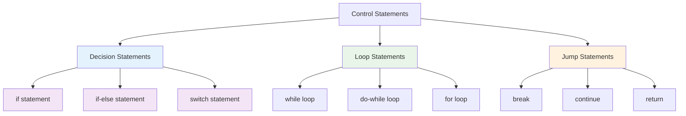

# Control Statements
## Lecture 8

**Java Programming (4343203)**  
Diploma in ICT - Semester IV  
Gujarat Technological University

<div class="pt-12">
  <span @click="$slidev.nav.next" class="px-2 py-1 rounded cursor-pointer" hover="bg-white bg-opacity-10">
    Press Space for next page <carbon:arrow-right class="inline"/>
  </span>
</div>

---
layout: default
---

# Learning Objectives

By the end of this lecture, you will be able to:

<v-clicks>

- 🎯 **Master** decision statements (if, if-else, switch)
- 🔄 **Implement** loop statements (while, do-while, for)
- 🚀 **Use** jump statements (break, continue, return)
- 🏗️ **Build** complex control flow structures
- 🧮 **Solve** practical problems using control statements
- 📝 **Practice** with syllabus-required exercises

</v-clicks>

<br>

<div v-click="7" class="text-center text-2xl text-blue-600 font-bold">
Let's control the flow of our programs! 🔄🎯
</div>

---
layout: center
---

# Control Statements Overview

<div class="flex justify-center">



</div>

<div class="mt-6 text-center">
<div class="bg-blue-50 p-4 rounded-lg inline-block">
<strong>Control Flow:</strong> The order in which program statements are executed
</div>
</div>

---
layout: default
---

# If Statement

<div class="grid grid-cols-2 gap-8">

<div>

## 🎯 Simple If Statement

```java
// Syntax
if (condition) {
    // statements to execute if condition is true
}

// Example 1: Basic if
int age = 20;
if (age >= 18) {
    System.out.println("You can vote!");
}

// Example 2: Multiple conditions
int marks = 85;
if (marks >= 40) {
    System.out.println("You passed!");
}
if (marks >= 75) {
    System.out.println("You got distinction!");
}

// Example 3: Without braces (single statement)
int score = 95;
if (score == 100)
    System.out.println("Perfect score!");
```

</div>

<div>

## ⚠️ Important Points

<v-clicks>

- **Condition must be boolean** expression
- **Braces optional** for single statement
- **Use braces** for better readability
- **Multiple if statements** are independent

</v-clicks>

<div v-click="5">

## 🔍 Real-World Example

```java
// Student eligibility checker
public class StudentEligibility {
    public static void main(String[] args) {
        int attendance = 80;
        int marks = 85;
        
        System.out.println("=== Eligibility Check ===");
        
        if (attendance >= 75) {
            System.out.println("✓ Attendance requirement met");
        }
        
        if (marks >= 40) {
            System.out.println("✓ Passing marks achieved");
        }
        
        if (marks >= 90) {
            System.out.println("🏆 Outstanding performance!");
        }
    }
}
```

</div>

</div>

</div>

---
layout: default
---

# If-Else Statement

<div class="grid grid-cols-2 gap-8">

<div>

## 🔀 Basic If-Else

```java
// Syntax
if (condition) {
    // statements if condition is true
} else {
    // statements if condition is false
}

// Example 1: Even/Odd checker
int number = 17;
if (number % 2 == 0) {
    System.out.println(number + " is even");
} else {
    System.out.println(number + " is odd");
}

// Example 2: Grade evaluator
int percentage = 78;
if (percentage >= 60) {
    System.out.println("First class");
} else {
    System.out.println("Second class");
}
```

</div>

<div>

## 🏗️ Nested If-Else

```java
// Example: Complete grade system
int marks = 85;

if (marks >= 90) {
    System.out.println("Grade A");
} else if (marks >= 80) {
    System.out.println("Grade B");
} else if (marks >= 70) {
    System.out.println("Grade C");
} else if (marks >= 60) {
    System.out.println("Grade D");
} else {
    System.out.println("Grade F");
}

// Nested conditions
int age = 25;
boolean hasLicense = true;

if (age >= 18) {
    if (hasLicense) {
        System.out.println("Can drive");
    } else {
        System.out.println("Need driving license");
    }
} else {
    System.out.println("Too young to drive");
}
```

</div>

</div>

---
layout: default
---

# Switch Statement

<div class="grid grid-cols-2 gap-8">

<div>

## 🎛️ Switch Syntax and Usage

```java
// Syntax
switch (expression) {
    case value1:
        // statements
        break;
    case value2:
        // statements
        break;
    default:
        // default statements
        break;
}

// Example 1: Day of the week
int day = 3;
switch (day) {
    case 1:
        System.out.println("Monday");
        break;
    case 2:
        System.out.println("Tuesday");
        break;
    case 3:
        System.out.println("Wednesday");
        break;
    case 4:
        System.out.println("Thursday");
        break;
    case 5:
        System.out.println("Friday");
        break;
    default:
        System.out.println("Weekend");
        break;
}
```

</div>

<div>

## 📝 Practical Examples

```java
// Calculator using switch
char operator = '+';
double num1 = 10.5, num2 = 3.2;
double result;

switch (operator) {
    case '+':
        result = num1 + num2;
        System.out.println("Sum: " + result);
        break;
    case '-':
        result = num1 - num2;
        System.out.println("Difference: " + result);
        break;
    case '*':
        result = num1 * num2;
        System.out.println("Product: " + result);
        break;
    case '/':
        if (num2 != 0) {
            result = num1 / num2;
            System.out.println("Quotient: " + result);
        } else {
            System.out.println("Cannot divide by zero");
        }
        break;
    default:
        System.out.println("Invalid operator");
        break;
}
```

</div>

</div>

---
layout: default
---

# Switch vs If-Else Comparison

<div class="grid grid-cols-2 gap-8">

<div>

## 🆚 When to Use Switch

<v-clicks>

**Use Switch When:**
- **Multiple discrete values** to check
- **Better readability** for many conditions
- **Performance matters** (slight advantage)
- **Working with** int, char, String, enum

**Switch Limitations:**
- **Cannot use** ranges (< > <= >=)
- **Cannot use** complex conditions
- **Only equality** comparison

</v-clicks>

</div>

<div>

## 📊 Comparison Example

**Using If-Else:**
```java
if (grade == 'A') {
    System.out.println("Excellent");
} else if (grade == 'B') {
    System.out.println("Good");
} else if (grade == 'C') {
    System.out.println("Average");
} else {
    System.out.println("Below average");
}
```

**Using Switch:**
```java
switch (grade) {
    case 'A':
        System.out.println("Excellent");
        break;
    case 'B':
        System.out.println("Good");
        break;
    case 'C':
        System.out.println("Average");
        break;
    default:
        System.out.println("Below average");
        break;
}
```

</div>

</div>

---
layout: default
---

# While Loop

<div class="grid grid-cols-2 gap-8">

<div>

## 🔄 While Loop Syntax

```java
// Syntax
while (condition) {
    // statements to repeat
    // update condition variable
}

// Example 1: Count from 1 to 5
int count = 1;
while (count <= 5) {
    System.out.println("Count: " + count);
    count++;  // Important: update the counter
}

// Example 2: Sum of first n numbers
int n = 10;
int i = 1;
int sum = 0;
while (i <= n) {
    sum += i;
    i++;
}
System.out.println("Sum of first " + n + " numbers: " + sum);
```

</div>

<div>

## 📝 Reverse Digits Program

```java
// Syllabus requirement: Reverse digits using while loop
import java.util.Scanner;

public class ReverseDigits {
    public static void main(String[] args) {
        Scanner sc = new Scanner(System.in);
        
        System.out.print("Enter a number: ");
        int number = sc.nextInt();
        int original = number;
        int reversed = 0;
        
        while (number > 0) {
            int digit = number % 10;     // Get last digit
            reversed = reversed * 10 + digit; // Build reversed number
            number = number / 10;        // Remove last digit
        }
        
        System.out.println("Original number: " + original);
        System.out.println("Reversed number: " + reversed);
        
        sc.close();
    }
}
```

<div class="mt-4 p-4 bg-blue-50 rounded-lg">
<strong>💡 Key Concept:</strong> Extract digits using modulus (%) and division (/)
</div>

</div>

</div>

---
layout: default
---

# Do-While Loop

<div class="grid grid-cols-2 gap-8">

<div>

## 🔄 Do-While Syntax

```java
// Syntax
do {
    // statements to execute
    // update condition variable
} while (condition);

// Example 1: Menu-driven program
Scanner sc = new Scanner(System.in);
int choice;

do {
    System.out.println("\n=== Menu ===");
    System.out.println("1. Add");
    System.out.println("2. Subtract");
    System.out.println("3. Exit");
    System.out.print("Enter choice: ");
    choice = sc.nextInt();
    
    switch (choice) {
        case 1:
            System.out.println("Addition selected");
            break;
        case 2:
            System.out.println("Subtraction selected");
            break;
        case 3:
            System.out.println("Goodbye!");
            break;
        default:
            System.out.println("Invalid choice");
    }
} while (choice != 3);
```

</div>

<div>

## 🆚 While vs Do-While

<v-clicks>

**While Loop:**
- **Condition checked first**
- **May not execute** at all
- **Entry-controlled** loop

**Do-While Loop:**
- **Condition checked last**
- **Executes at least once**
- **Exit-controlled** loop

</v-clicks>

<div v-click="4">

## 🎯 Practical Example

```java
// Input validation with do-while
Scanner sc = new Scanner(System.in);
int age;

do {
    System.out.print("Enter age (1-120): ");
    age = sc.nextInt();
    if (age < 1 || age > 120) {
        System.out.println("Invalid age! Try again.");
    }
} while (age < 1 || age > 120);

System.out.println("Valid age entered: " + age);
```

</div>

</div>

</div>

---
layout: default
---

# For Loop

<div class="grid grid-cols-2 gap-8">

<div>

## 🔢 For Loop Syntax

```java
// Syntax
for (initialization; condition; update) {
    // statements to repeat
}

// Example 1: Count from 1 to 10
for (int i = 1; i <= 10; i++) {
    System.out.println("Number: " + i);
}

// Example 2: Multiplication table
int number = 7;
System.out.println("Multiplication table of " + number);
for (int i = 1; i <= 10; i++) {
    System.out.println(number + " x " + i + " = " + (number * i));
}

// Example 3: Array traversal
int[] marks = {85, 90, 78, 92, 88};
for (int i = 0; i < marks.length; i++) {
    System.out.println("Student " + (i+1) + ": " + marks[i]);
}
```

</div>

<div>

## 🔢 Prime Numbers Generation

```java
// Syllabus requirement: Generate first n prime numbers
import java.util.Scanner;

public class PrimeNumbers {
    public static void main(String[] args) {
        Scanner sc = new Scanner(System.in);
        
        System.out.print("Enter how many primes to generate: ");
        int n = sc.nextInt();
        
        System.out.println("First " + n + " prime numbers:");
        
        int count = 0;
        int number = 2;
        
        while (count < n) {
            boolean isPrime = true;
            
            // Check if number is prime
            for (int i = 2; i <= Math.sqrt(number); i++) {
                if (number % i == 0) {
                    isPrime = false;
                    break;
                }
            }
            
            if (isPrime) {
                System.out.print(number + " ");
                count++;
            }
            number++;
        }
        
        sc.close();
    }
}
```

</div>

</div>

---
layout: default
---

# Enhanced For Loop (For-Each)

<div class="grid grid-cols-2 gap-8">

<div>

## 🎯 For-Each Syntax

```java
// Syntax for arrays
for (dataType variable : array) {
    // use variable
}

// Example 1: Array traversal
int[] numbers = {10, 20, 30, 40, 50};
for (int num : numbers) {
    System.out.println("Number: " + num);
}

// Example 2: String array
String[] names = {"Alice", "Bob", "Charlie"};
for (String name : names) {
    System.out.println("Hello, " + name);
}

// Example 3: Calculate sum
int[] marks = {85, 90, 78, 92, 88};
int total = 0;
for (int mark : marks) {
    total += mark;
}
double average = total / (double) marks.length;
System.out.println("Average marks: " + average);
```

</div>

<div>

## 🆚 Traditional vs Enhanced For

<v-clicks>

**Traditional For Loop:**
- **Index access** available
- **Can modify** array elements
- **More control** over iteration

**Enhanced For Loop:**
- **Cleaner syntax**
- **Read-only** access
- **Less error-prone**
- **Better for** simple traversal

</v-clicks>

<div v-click="5">

## 📝 When to Use Each

```java
// Use traditional for when you need index
for (int i = 0; i < arr.length; i++) {
    System.out.println("Index " + i + ": " + arr[i]);
    arr[i] *= 2;  // Modify elements
}

// Use enhanced for for simple reading
for (int value : arr) {
    System.out.println("Value: " + value);
    // Cannot modify array through 'value'
}
```

</div>

</div>

</div>

---
layout: default
---

# Jump Statements

<div class="grid grid-cols-2 gap-8">

<div>

## 🚀 Break Statement

```java
// Break in loops
for (int i = 1; i <= 10; i++) {
    if (i == 5) {
        break;  // Exit loop when i is 5
    }
    System.out.println(i);
}
// Output: 1 2 3 4

// Break in switch
int day = 3;
switch (day) {
    case 1:
        System.out.println("Monday");
        break;  // Exit switch
    case 2:
        System.out.println("Tuesday");
        break;
    case 3:
        System.out.println("Wednesday");
        break;  // Without this, execution continues
    default:
        System.out.println("Other day");
}

// Break in nested loops
for (int i = 1; i <= 3; i++) {
    for (int j = 1; j <= 3; j++) {
        if (i == 2 && j == 2) {
            break;  // Breaks inner loop only
        }
        System.out.println("i=" + i + ", j=" + j);
    }
}
```

</div>

<div>

## ⏭️ Continue Statement

```java
// Continue in loops
for (int i = 1; i <= 10; i++) {
    if (i % 2 == 0) {
        continue;  // Skip even numbers
    }
    System.out.println(i);
}
// Output: 1 3 5 7 9

// Practical example: Input validation
Scanner sc = new Scanner(System.in);
for (int i = 0; i < 5; i++) {
    System.out.print("Enter a positive number: ");
    int num = sc.nextInt();
    
    if (num <= 0) {
        System.out.println("Invalid! Skipping...");
        continue;  // Skip processing this number
    }
    
    // Process valid number
    System.out.println("Square: " + (num * num));
}

// Continue with while loop
int count = 0;
while (count < 10) {
    count++;
    if (count % 3 == 0) {
        continue;  // Skip multiples of 3
    }
    System.out.println(count);
}
```

</div>

</div>

---
layout: default
---

# Return Statement

<div class="grid grid-cols-2 gap-8">

<div>

## 🔙 Return in Methods

```java
// Return with value
public static int calculateSum(int a, int b) {
    int sum = a + b;
    return sum;  // Return the calculated value
}

// Early return for validation
public static double calculateSqrt(double number) {
    if (number < 0) {
        System.out.println("Cannot calculate sqrt of negative");
        return -1;  // Early return for invalid input
    }
    return Math.sqrt(number);
}

// Return in main method
public static void main(String[] args) {
    Scanner sc = new Scanner(System.in);
    
    System.out.print("Enter your age: ");
    int age = sc.nextInt();
    
    if (age < 0) {
        System.out.println("Invalid age");
        return;  // Exit main method early
    }
    
    System.out.println("Your age is: " + age);
}
```

</div>

<div>

## 🎯 Practical Return Examples

```java
// Grade calculator with early returns
public static char calculateGrade(int marks) {
    if (marks < 0 || marks > 100) {
        return 'X';  // Invalid marks
    }
    
    if (marks >= 90) return 'A';
    if (marks >= 80) return 'B';
    if (marks >= 70) return 'C';
    if (marks >= 60) return 'D';
    return 'F';
}

// Search function with return
public static int findElement(int[] array, int target) {
    for (int i = 0; i < array.length; i++) {
        if (array[i] == target) {
            return i;  // Return index when found
        }
    }
    return -1;  // Return -1 if not found
}

// Factorial with return
public static long factorial(int n) {
    if (n <= 1) {
        return 1;  // Base case
    }
    
    long result = 1;
    for (int i = 2; i <= n; i++) {
        result *= i;
    }
    return result;
}
```

</div>

</div>

---
layout: default
---

# Practical Exercises from Syllabus

## 🎯 Required Programming Tasks

<div class="grid grid-cols-2 gap-8">

<div>

### 📝 Exercise 1: Maximum of Three Numbers

```java
import java.util.Scanner;

public class MaxOfThree {
    public static void main(String[] args) {
        Scanner sc = new Scanner(System.in);
        
        System.out.print("Enter three numbers: ");
        int a = sc.nextInt();
        int b = sc.nextInt();
        int c = sc.nextInt();
        
        int max;
        
        // Using if-else statements
        if (a >= b && a >= c) {
            max = a;
        } else if (b >= a && b >= c) {
            max = b;
        } else {
            max = c;
        }
        
        System.out.println("Maximum: " + max);
        
        // Using conditional operator (ternary)
        int maximum = (a > b) ? ((a > c) ? a : c) : ((b > c) ? b : c);
        System.out.println("Maximum (ternary): " + maximum);
        
        sc.close();
    }
}
```

</div>

<div>

### 📝 Exercise 2: Matrix Addition

```java
import java.util.Scanner;

public class MatrixAddition {
    public static void main(String[] args) {
        Scanner sc = new Scanner(System.in);
        int[][] matrix1 = new int[3][3];
        int[][] matrix2 = new int[3][3];
        int[][] result = new int[3][3];
        
        // Input first matrix
        System.out.println("Enter first 3x3 matrix:");
        for (int i = 0; i < 3; i++) {
            for (int j = 0; j < 3; j++) {
                matrix1[i][j] = sc.nextInt();
            }
        }
        
        // Input second matrix
        System.out.println("Enter second 3x3 matrix:");
        for (int i = 0; i < 3; i++) {
            for (int j = 0; j < 3; j++) {
                matrix2[i][j] = sc.nextInt();
            }
        }
        
        // Add matrices
        for (int i = 0; i < 3; i++) {
            for (int j = 0; j < 3; j++) {
                result[i][j] = matrix1[i][j] + matrix2[i][j];
            }
        }
        
        // Display result
        System.out.println("Sum of matrices:");
        for (int i = 0; i < 3; i++) {
            for (int j = 0; j < 3; j++) {
                System.out.print(result[i][j] + " ");
            }
            System.out.println();
        }
        
        sc.close();
    }
}
```

</div>

</div>

---
layout: default
---

# Nested Control Structures

<div class="grid grid-cols-2 gap-8">

<div>

## 🏗️ Complex Control Flow

```java
// Pattern printing using nested loops
public class PatternPrinting {
    public static void main(String[] args) {
        
        // Pattern 1: Right triangle
        System.out.println("Right Triangle:");
        for (int i = 1; i <= 5; i++) {
            for (int j = 1; j <= i; j++) {
                System.out.print("* ");
            }
            System.out.println();
        }
        
        // Pattern 2: Number triangle
        System.out.println("\nNumber Triangle:");
        for (int i = 1; i <= 5; i++) {
            for (int j = 1; j <= i; j++) {
                System.out.print(j + " ");
            }
            System.out.println();
        }
        
        // Pattern 3: Pyramid
        System.out.println("\nPyramid:");
        for (int i = 1; i <= 5; i++) {
            // Print spaces
            for (int j = 1; j <= 5 - i; j++) {
                System.out.print(" ");
            }
            // Print stars
            for (int j = 1; j <= i; j++) {
                System.out.print("* ");
            }
            System.out.println();
        }
    }
}
```

</div>

<div>

## 🔍 Number Analysis Program

```java
import java.util.Scanner;

public class NumberAnalysis {
    public static void main(String[] args) {
        Scanner sc = new Scanner(System.in);
        
        System.out.print("Enter a number: ");
        int number = sc.nextInt();
        int original = number;
        
        // Count digits
        int digitCount = 0;
        int temp = number;
        while (temp > 0) {
            digitCount++;
            temp /= 10;
        }
        
        // Check if Armstrong number
        temp = number;
        int sum = 0;
        while (temp > 0) {
            int digit = temp % 10;
            sum += Math.pow(digit, digitCount);
            temp /= 10;
        }
        
        // Display results
        System.out.println("Number: " + original);
        System.out.println("Digit count: " + digitCount);
        
        if (sum == original) {
            System.out.println("It's an Armstrong number!");
        } else {
            System.out.println("Not an Armstrong number.");
        }
        
        // Check if palindrome
        temp = number;
        int reversed = 0;
        while (temp > 0) {
            reversed = reversed * 10 + temp % 10;
            temp /= 10;
        }
        
        if (reversed == original) {
            System.out.println("It's a palindrome!");
        } else {
            System.out.println("Not a palindrome.");
        }
        
        sc.close();
    }
}
```

</div>

</div>

---
layout: default
---

# Hands-On Assignment

## 🛠️ Complete Programming Challenges

<div class="space-y-4">

<div class="bg-yellow-50 p-4 rounded-lg">
<strong>Task 1:</strong> Write a program to reverse digits of a number using while loop (syllabus requirement)
</div>

<div class="bg-blue-50 p-4 rounded-lg">
<strong>Task 2:</strong> Create a program to add two 3×3 matrices using nested for loops (syllabus requirement)
</div>

<div class="bg-green-50 p-4 rounded-lg">
<strong>Task 3:</strong> Generate first n prime numbers using for and while loops (syllabus requirement)
</div>

<div class="bg-purple-50 p-4 rounded-lg">
<strong>Task 4:</strong> Build a menu-driven calculator using switch statement and do-while loop
</div>

<div class="bg-orange-50 p-4 rounded-lg">
<strong>Task 5:</strong> Create a number guessing game using all control statements
</div>

</div>

## 🎯 Success Criteria
- Correct use of all control statement types
- Proper input validation
- Clean output formatting
- Efficient algorithm implementation

---
layout: default
---

# Best Practices and Common Mistakes

<div class="grid grid-cols-2 gap-8">

<div>

## ✅ Best Practices

<v-clicks>

**Code Structure:**
- Use proper indentation
- Add meaningful comments
- Use descriptive variable names
- Keep loops simple and focused

**Performance:**
- Avoid infinite loops
- Use appropriate loop type
- Minimize nested loop depth
- Break/continue when needed

**Readability:**
- Use braces even for single statements
- Limit nesting levels
- Group related conditions

</v-clicks>

</div>

<div>

## ❌ Common Mistakes

<v-clicks>

**Infinite Loops:**
```java
int i = 0;
while (i < 10) {
    System.out.println(i);
    // Forgot to increment i!
}
```

**Missing Break in Switch:**
```java
switch (grade) {
    case 'A':
        System.out.println("Excellent");
        // Missing break!
    case 'B':
        System.out.println("Good");
        break;
}
```

**Off-by-One Errors:**
```java
for (int i = 0; i <= array.length; i++) {
    // Should be i < array.length
}
```

</v-clicks>

</div>

</div>

---
layout: center
class: text-center
---

# Summary

<div class="grid grid-cols-2 gap-8 mt-8">

<div class="bg-blue-50 p-6 rounded-lg">
<h3 class="font-bold text-lg mb-4">📖 What We Learned</h3>
<ul class="text-left space-y-2">
<li>• Decision statements (if, if-else, switch)</li>
<li>• Loop statements (while, do-while, for)</li>
<li>• Jump statements (break, continue, return)</li>
<li>• Nested control structures</li>
<li>• Syllabus practical exercises</li>
<li>• Best practices and common pitfalls</li>
</ul>
</div>

<div class="bg-green-50 p-6 rounded-lg">
<h3 class="font-bold text-lg mb-4">🎯 Next Steps</h3>
<ul class="text-left space-y-2">
<li>• Introduction to Object-Oriented Programming</li>
<li>• POP vs OOP comparison</li>
<li>• Basic OOP concepts overview</li>
<li>• Real-world OOP examples</li>
<li>• Preparing for class and object concepts</li>
</ul>
</div>

</div>

<div class="mt-8 text-2xl font-bold text-purple-600">
Control flow mastered! Ready for OOP! 🔄🎯
</div>

---
layout: center
class: text-center
---

# Questions & Discussion

<div class="text-6xl mb-8">❓</div>

<div class="text-xl mb-8">
Any questions about control statements, loops, or practical exercises?
</div>

<div class="text-lg text-gray-600">
Next lecture: **Introduction to Object-Oriented Programming**
</div>

<div class="mt-8">
<span class="px-4 py-2 bg-blue-500 text-white rounded-lg">
Ready to enter the world of objects! 👏
</span>
</div>