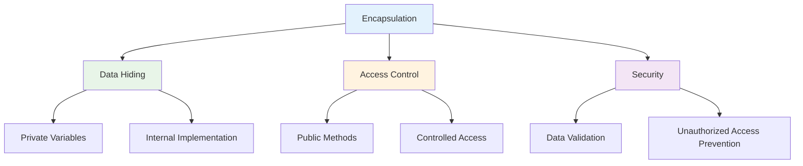

# Access Modifiers
## Lecture 12

**Java Programming (4343203)**  
Diploma in ICT - Semester IV  
Gujarat Technological University

<div class="pt-12">
  <span @click="$slidev.nav.next" class="px-2 py-1 rounded cursor-pointer" hover="bg-white bg-opacity-10">
    Press Space for next page <carbon:arrow-right class="inline"/>
  </span>
</div>

---
layout: default
---

# Learning Objectives

By the end of this lecture, you will be able to:

<v-clicks>

- 🔒 **Understand** data encapsulation and information hiding principles
- 🛡️ **Master** all four access modifiers in Java
- 🏗️ **Apply** access control to protect class members
- 🔐 **Implement** secure class design patterns
- 🎯 **Choose** appropriate access levels for different scenarios
- 📝 **Practice** with real-world encapsulation examples

</v-clicks>

<br>

<div v-click="7" class="text-center text-2xl text-blue-600 font-bold">
Let's secure our code with access control! 🔒🛡️
</div>

---
layout: center
---

# What is Encapsulation?

<div class="flex justify-center">



</div>

<div class="mt-8 grid grid-cols-2 gap-6">

<div class="bg-blue-50 p-4 rounded-lg">
<h3 class="font-bold text-blue-700">🏗️ Encapsulation</h3>
<ul class="text-sm space-y-1">
<li>• Bundling data and methods together</li>
<li>• Controlling access to internal details</li>
<li>• Protecting object state</li>
<li>• Enabling secure programming</li>
</ul>
</div>

<div class="bg-green-50 p-4 rounded-lg">
<h3 class="font-bold text-green-700">🔒 Benefits</h3>
<ul class="text-sm space-y-1">
<li>• Data security and integrity</li>
<li>• Code maintainability</li>
<li>• Flexible implementation changes</li>
<li>• Better error handling</li>
</ul>
</div>

</div>

---
layout: default
---

# Access Modifiers Overview

<div class="grid grid-cols-2 gap-8">

<div>

## 🛡️ Four Access Levels

| Modifier | Symbol | Access Level |
|----------|--------|--------------|
| **private** | 🔒 | Within same class only |
| **default** | 📦 | Within same package |
| **protected** | 🏠 | Package + subclasses |
| **public** | 🌐 | Accessible everywhere |

## 📊 Visibility Scope

```java
public class AccessExample {
    private int privateVar;      // 🔒 Class only
    int defaultVar;              // 📦 Package
    protected int protectedVar;  // 🏠 Package + subclasses
    public int publicVar;        // 🌐 Everywhere
}
```

</div>

<div>

## 🎯 Access Control Matrix

| Access Level | Same Class | Same Package | Subclass | Different Package |
|--------------|------------|--------------|----------|-------------------|
| **private** | ✅ | ❌ | ❌ | ❌ |
| **default** | ✅ | ✅ | ❌ | ❌ |
| **protected** | ✅ | ✅ | ✅ | ❌ |
| **public** | ✅ | ✅ | ✅ | ✅ |

<div class="mt-6 p-4 bg-yellow-50 rounded-lg">
<strong>🎯 Key Principle:</strong> Provide the minimum access necessary for functionality!
</div>

</div>

</div>

---
layout: default
---

# Private Access Modifier

<div class="grid grid-cols-2 gap-8">

<div>

## 🔒 Most Restrictive Access

<v-clicks>

- **Accessible only within the same class**
- **Cannot be accessed from outside**
- **Used for internal implementation details**
- **Provides complete data hiding**
- **Foundation of encapsulation**

</v-clicks>

<div v-click="6">

## 📝 Basic Private Example

```java
public class BankAccount {
    private double balance;        // Hidden from outside
    private String accountNumber;  // Secret account details
    private boolean isActive;      // Internal state
    
    // Private helper method
    private boolean validateAmount(double amount) {
        return amount > 0 && amount <= balance;
    }
    
    // Public method to access private data
    public double getBalance() {
        return balance;
    }
}
```

</div>

</div>

<div>

## 🚫 What Happens Without Private?

```java
// Without encapsulation (BAD)
public class UnsafeBankAccount {
    public double balance;         // Anyone can modify!
    public String accountNumber;   // Exposed sensitive data
    
    public void withdraw(double amount) {
        balance -= amount;         // No validation!
    }
}

// Dangerous usage
UnsafeBankAccount account = new UnsafeBankAccount();
account.balance = 1000000;       // Illegal modification!
account.accountNumber = "123456"; // Security breach!
```

**Problems:**
- No data validation
- Security vulnerabilities
- Inconsistent state possible
- No control over modifications

<div class="mt-4 p-4 bg-red-50 rounded-lg">
<strong>⚠️ Security Risk:</strong> Public data members expose internal implementation and create security holes!
</div>

</div>

</div>

---
layout: default
---

# Implementing Data Encapsulation

<div class="grid grid-cols-2 gap-8">

<div>

## 🏗️ Complete Encapsulated Class

```java
public class Student {
    // Private data members (hidden)
    private String name;
    private int rollNumber;
    private double marks;
    private boolean isActive;
    
    // Constructor for initialization
    public Student(String name, int rollNumber) {
        this.name = name;
        this.rollNumber = rollNumber;
        this.marks = 0.0;
        this.isActive = true;
    }
    
    // Getter methods (Accessors)
    public String getName() {
        return name;
    }
    
    public int getRollNumber() {
        return rollNumber;
    }
    
    public double getMarks() {
        return marks;
    }
    
    public boolean isActive() {
        return isActive;
    }
}
```

</div>

<div>

```java
    // Setter methods (Mutators) with validation
    public void setName(String name) {
        if (name != null && name.trim().length() > 0) {
            this.name = name.trim();
        } else {
            System.out.println("Invalid name provided");
        }
    }
    
    public void setMarks(double marks) {
        if (marks >= 0 && marks <= 100) {
            this.marks = marks;
        } else {
            System.out.println("Marks must be between 0 and 100");
        }
    }
    
    public void setActive(boolean active) {
        this.isActive = active;
    }
    
    // Business logic methods
    public char getGrade() {
        if (marks >= 90) return 'A';
        else if (marks >= 80) return 'B';
        else if (marks >= 70) return 'C';
        else if (marks >= 60) return 'D';
        else return 'F';
    }
    
    public void displayInfo() {
        System.out.println("Student: " + name);
        System.out.println("Roll Number: " + rollNumber);
        System.out.println("Marks: " + marks);
        System.out.println("Grade: " + getGrade());
        System.out.println("Status: " + (isActive ? "Active" : "Inactive"));
    }
}
```

</div>

</div>

---
layout: default
---

# Using Encapsulated Classes

<div class="grid grid-cols-2 gap-8">

<div>

## 🎯 Safe Usage Example

```java
public class StudentDemo {
    public static void main(String[] args) {
        // Create student object
        Student student = new Student("Alice Johnson", 101);
        
        // Safe access through public methods
        System.out.println("Name: " + student.getName());
        System.out.println("Roll: " + student.getRollNumber());
        
        // Validated data modification
        student.setMarks(85.5);
        student.setName("Alice M. Johnson");
        
        // Display complete information
        student.displayInfo();
        
        // Attempt invalid operations
        student.setMarks(150);    // Will show error message
        student.setMarks(-10);    // Will show error message
        student.setName("");      // Will show error message
        
        // These would cause compilation errors:
        // student.name = "Hacker";      // Error: private field
        // student.rollNumber = 999;     // Error: private field
        // student.marks = 200;          // Error: private field
    }
}
```

</div>

<div>

## 🛡️ Benefits Demonstrated

<v-clicks>

**Data Validation:**
```java
student.setMarks(150);  // Automatically validated
// Output: "Marks must be between 0 and 100"
```

**Controlled Access:**
```java
// Can read but not directly modify
String name = student.getName();    // ✅ Allowed
// student.name = "New Name";       // ❌ Compilation error
```

**Flexible Implementation:**
```java
// Internal implementation can change without affecting users
public double getMarks() {
    // Could add logging, caching, etc.
    logAccess("Marks accessed for " + name);
    return marks;
}
```

**Data Integrity:**
```java
// Roll number cannot be changed after creation
// Only name and marks can be modified with validation
```

</v-clicks>

<div v-click="5" class="mt-6 p-4 bg-green-50 rounded-lg">
<strong>🏆 Result:</strong> Secure, maintainable, and robust code!
</div>

</div>

</div>

---
layout: default
---

# Default (Package-Private) Access

<div class="grid grid-cols-2 gap-8">

<div>

## 📦 Package-Level Access

<v-clicks>

- **No access modifier specified**
- **Accessible within the same package**
- **Hidden from other packages**
- **Default access level in Java**
- **Useful for package-internal functionality**

</v-clicks>

<div v-click="6">

## 📝 Package Structure Example

```java
// File: com/university/Student.java
package com.university;

public class Student {
    String studentId;        // Package-private
    String name;             // Package-private
    int semester;            // Package-private
    
    // Package-private method
    void updateSemester(int newSemester) {
        this.semester = newSemester;
    }
    
    public void displayInfo() {
        System.out.println("Student: " + name);
        System.out.println("ID: " + studentId);
        System.out.println("Semester: " + semester);
    }
}
```

</div>

</div>

<div>

## 🏗️ Package Access Usage

```java
// File: com/university/StudentManager.java
package com.university;  // Same package

public class StudentManager {
    public void processStudent() {
        Student student = new Student();
        
        // ✅ Can access package-private members
        student.studentId = "STU001";
        student.name = "Bob Smith";
        student.semester = 4;
        
        // ✅ Can call package-private methods
        student.updateSemester(5);
        
        student.displayInfo();
    }
}

// File: com/admin/AdminPanel.java
package com.admin;       // Different package
import com.university.Student;

public class AdminPanel {
    public void manageStudent() {
        Student student = new Student();
        
        // ❌ Cannot access package-private members
        // student.studentId = "ADM001";    // Compilation error
        // student.name = "Admin";          // Compilation error
        // student.updateSemester(1);       // Compilation error
        
        // ✅ Can only access public methods
        student.displayInfo();
    }
}
```

</div>

</div>

---
layout: default
---

# Protected Access Modifier

<div class="grid grid-cols-2 gap-8">

<div>

## 🏠 Family-Level Access

<v-clicks>

- **Accessible in same package**
- **Accessible to subclasses (inheritance)**
- **Not accessible to unrelated classes**
- **Enables controlled inheritance**
- **Balance between private and public**

</v-clicks>

<div v-click="6">

## 🧬 Inheritance Hierarchy

```java
// Parent class
public class Vehicle {
    protected String brand;           // Subclasses can access
    protected int maxSpeed;          // Protected for inheritance
    private String engineNumber;     // Only Vehicle class
    
    protected void startEngine() {   // Subclasses can override
        System.out.println("Engine started");
    }
    
    protected void displaySpecs() {
        System.out.println("Brand: " + brand);
        System.out.println("Max Speed: " + maxSpeed);
    }
}
```

</div>

</div>

<div>

## 🚗 Subclass Access

```java
// Child class
public class Car extends Vehicle {
    private int numberOfDoors;
    
    public Car(String brand, int maxSpeed, int doors) {
        // ✅ Can access protected members from parent
        this.brand = brand;
        this.maxSpeed = maxSpeed;
        this.numberOfDoors = doors;
        
        // ❌ Cannot access private members
        // this.engineNumber = "ENG123";  // Compilation error
    }
    
    // ✅ Can override protected methods
    @Override
    protected void startEngine() {
        System.out.println("Car engine started with key");
        super.startEngine();  // Call parent method
    }
    
    public void showCarDetails() {
        // ✅ Using protected method from parent
        displaySpecs();
        System.out.println("Doors: " + numberOfDoors);
    }
}

// Usage example
public class VehicleDemo {
    public static void main(String[] args) {
        Car car = new Car("Toyota", 180, 4);
        car.showCarDetails();
        
        // ❌ Cannot access protected members directly
        // car.brand = "Honda";        // Compilation error
        // car.startEngine();          // Compilation error
    }
}
```

</div>

</div>

---
layout: default
---

# Public Access Modifier

<div class="grid grid-cols-2 gap-8">

<div>

## 🌐 Universal Access

<v-clicks>

- **Accessible from anywhere**
- **No access restrictions**
- **Used for public APIs**
- **Classes, methods, and variables**
- **Maximum visibility**

</v-clicks>

<div v-click="6">

## 📋 Public Interface Design

```java
public class Calculator {
    // Public constants
    public static final double PI = 3.14159;
    public static final double E = 2.71828;
    
    // Public methods (API)
    public double add(double a, double b) {
        return a + b;
    }
    
    public double subtract(double a, double b) {
        return a - b;
    }
    
    public double multiply(double a, double b) {
        return a * b;
    }
    
    public double divide(double a, double b) {
        if (b == 0) {
            throw new IllegalArgumentException("Division by zero");
        }
        return a / b;
    }
}
```

</div>

</div>

<div>

## 🎯 Global Usage

```java
// Can be used from any package, any class
import com.utilities.Calculator;

public class MathApplication {
    public static void main(String[] args) {
        Calculator calc = new Calculator();
        
        // ✅ All public methods accessible
        double sum = calc.add(10, 5);
        double difference = calc.subtract(10, 5);
        double product = calc.multiply(10, 5);
        double quotient = calc.divide(10, 5);
        
        // ✅ Public constants accessible
        double circleArea = Calculator.PI * 5 * 5;
        
        System.out.println("Sum: " + sum);
        System.out.println("Difference: " + difference);
        System.out.println("Product: " + product);
        System.out.println("Quotient: " + quotient);
        System.out.println("Circle Area: " + circleArea);
    }
}

// Another class in different package
package com.games;
import com.utilities.Calculator;

public class GameScoring {
    private Calculator calc = new Calculator();
    
    public double calculateBonus(double base, double multiplier) {
        return calc.multiply(base, multiplier);  // ✅ Public access
    }
}
```

</div>

</div>

---
layout: default
---

# Real-World Example: Bank Account System

<div class="grid grid-cols-2 gap-8">

<div>

## 🏦 Secure Banking Implementation

```java
public class BankAccount {
    // Private - Critical data protection
    private String accountNumber;
    private double balance;
    private String pinCode;
    
    // Protected - For specialized account types
    protected String accountType;
    protected double interestRate;
    
    // Package-private - Bank internal operations
    String branchCode;
    boolean isVerified;
    
    // Public - Customer interface
    public BankAccount(String accountNumber, String pinCode) {
        this.accountNumber = accountNumber;
        this.pinCode = pinCode;
        this.balance = 0.0;
        this.accountType = "SAVINGS";
        this.interestRate = 0.04;
        this.isVerified = false;
    }
    
    // Public methods for customer operations
    public boolean authenticate(String pin) {
        return this.pinCode.equals(pin);
    }
    
    public double getBalance(String pin) {
        if (authenticate(pin)) {
            return balance;
        } else {
            System.out.println("Authentication failed");
            return -1;
        }
    }
}
```

</div>

<div>

```java
    public boolean deposit(double amount, String pin) {
        if (!authenticate(pin)) {
            System.out.println("Authentication failed");
            return false;
        }
        
        if (amount > 0) {
            balance += amount;
            System.out.println("Deposited: ₹" + amount);
            return true;
        } else {
            System.out.println("Invalid amount");
            return false;
        }
    }
    
    public boolean withdraw(double amount, String pin) {
        if (!authenticate(pin)) {
            System.out.println("Authentication failed");
            return false;
        }
        
        if (amount > 0 && amount <= balance) {
            balance -= amount;
            System.out.println("Withdrawn: ₹" + amount);
            return true;
        } else {
            System.out.println("Invalid amount or insufficient funds");
            return false;
        }
    }
    
    // Protected method for subclasses
    protected double calculateInterest() {
        return balance * interestRate / 12;  // Monthly interest
    }
    
    // Package-private for bank operations
    void setVerificationStatus(boolean verified) {
        this.isVerified = verified;
    }
}
```

</div>

</div>

---
layout: default
---

# Specialized Account Types

<div class="grid grid-cols-2 gap-8">

<div>

## 💳 Savings Account (Inheritance)

```java
public class SavingsAccount extends BankAccount {
    private double minimumBalance;
    
    public SavingsAccount(String accountNumber, String pinCode) {
        super(accountNumber, pinCode);
        this.minimumBalance = 1000.0;
        this.accountType = "SAVINGS";    // ✅ Protected access
        this.interestRate = 0.04;        // ✅ Protected access
    }
    
    @Override
    protected double calculateInterest() {
        // ✅ Can override protected method
        return super.calculateInterest() * 1.2;  // Bonus interest
    }
    
    @Override
    public boolean withdraw(double amount, String pin) {
        if (!authenticate(pin)) {
            return false;
        }
        
        // Check minimum balance constraint
        if (getBalance(pin) - amount >= minimumBalance) {
            return super.withdraw(amount, pin);
        } else {
            System.out.println("Cannot withdraw. Minimum balance required: ₹" + minimumBalance);
            return false;
        }
    }
    
    public double getMinimumBalance() {
        return minimumBalance;
    }
}
```

</div>

<div>

## 🏧 Usage and Security Demonstration

```java
public class BankingDemo {
    public static void main(String[] args) {
        SavingsAccount account = new SavingsAccount("SAV001", "1234");
        
        // ✅ Public interface usage
        account.deposit(5000, "1234");
        System.out.println("Balance: ₹" + account.getBalance("1234"));
        
        // ✅ Specialized savings account behavior
        account.withdraw(3500, "1234");  // Will check minimum balance
        
        // ✅ Account type specific method
        System.out.println("Minimum balance: ₹" + account.getMinimumBalance());
        
        // ❌ Security - These would cause compilation errors:
        // account.balance = 1000000;         // Private
        // account.pinCode = "0000";          // Private
        // account.accountNumber = "HACK";    // Private
        
        // ❌ These would also fail:
        // account.calculateInterest();       // Protected
        // account.setVerificationStatus(true); // Package-private
        
        // Authentication protection
        account.withdraw(1000, "wrong_pin");  // Will fail authentication
    }
}
```

<div class="mt-4 p-4 bg-green-50 rounded-lg">
<strong>🔐 Security Achieved:</strong>
<ul class="text-sm mt-2">
<li>• Critical data completely hidden</li>
<li>• All operations require authentication</li>
<li>• Business rules enforced automatically</li>
<li>• Inheritance enables specialization</li>
</ul>
</div>

</div>

</div>

---
layout: default
---

# Access Modifier Best Practices

<div class="grid grid-cols-2 gap-8">

<div>

## ✅ Design Guidelines

<v-clicks>

**Start with Most Restrictive:**
- Begin with `private` by default
- Only make `public` what's absolutely necessary
- Use `protected` for inheritance hierarchies
- Use package-private for related classes

**Data Members:**
- Almost always `private`
- Use getters/setters for controlled access
- Constants can be `public static final`

**Methods:**
- Public for external interface
- Private for internal helpers
- Protected for overridable behavior

**Classes:**
- Public for external use
- Package-private for internal implementation

</v-clicks>

</div>

<div>

## 🎯 Common Patterns

```java
public class WellDesignedClass {
    // Constants - public is acceptable
    public static final String VERSION = "1.0";
    
    // Critical data - always private
    private String sensitiveData;
    private double criticalValue;
    
    // Configuration - package-private for testing
    boolean debugMode;
    
    // Extensible behavior - protected
    protected void initialize() {
        // Subclasses can override
    }
    
    // Public API - minimal and focused
    public void performOperation() {
        if (validate()) {
            execute();
            logOperation();
        }
    }
    
    // Private helpers - internal implementation
    private boolean validate() {
        return sensitiveData != null;
    }
    
    private void execute() {
        // Core logic
    }
    
    private void logOperation() {
        // Logging implementation
    }
}
```

<div class="mt-4 p-4 bg-blue-50 rounded-lg">
<strong>🎯 Remember:</strong> Good encapsulation leads to secure, maintainable, and flexible code!
</div>

</div>

</div>

---
layout: default
---

# Hands-On Exercise: Employee Management System

<div class="grid grid-cols-2 gap-8">

<div>

## 🛠️ Design Challenge

**Requirements:**
1. Create an Employee class with proper encapsulation
2. Include employee ID, name, salary, and department
3. Implement validation for all data
4. Create specialized Manager subclass
5. Demonstrate all access levels appropriately

```java
public class Employee {
    // TODO: Design with appropriate access modifiers
    // - Employee ID (read-only after creation)
    // - Name (changeable with validation)
    // - Salary (private, controlled access)
    // - Department (package access for HR)
    
    // TODO: Constructor with validation
    
    // TODO: Getters and setters with business rules
    
    // TODO: Protected method for salary calculation
    
    // TODO: Package method for HR operations
    
    // TODO: Public methods for external interface
}
```

</div>

<div>

## 🎯 Expected Implementation

```java
public class Manager extends Employee {
    // TODO: Additional manager-specific features
    // - Team size
    // - Bonus calculation
    // - Override salary calculation
    
    // TODO: Use protected inheritance appropriately
}

public class EmployeeDemo {
    public static void main(String[] args) {
        // TODO: Demonstrate:
        // ✅ Valid operations
        // ❌ Security restrictions
        // 🔧 Proper encapsulation usage
    }
}
```

**Success Criteria:**
- All data properly encapsulated
- Validation in setters
- Appropriate access levels used
- Inheritance demonstrates protected usage
- Security violations prevented
- Clean public interface

</div>

</div>

---
layout: default
---

# Common Access Modifier Mistakes

<div class="space-y-4">

<div class="bg-red-50 p-4 rounded-lg">
<h4 class="font-bold text-red-700">❌ Making Everything Public</h4>
```java
public class BadStudent {
    public String name;           // No validation possible
    public int rollNumber;        // Can be changed externally
    public double marks;          // No business rules enforced
}
```
<strong>Problem:</strong> No encapsulation, no data validation, security vulnerabilities
</div>

<div class="bg-orange-50 p-4 rounded-lg">
<h4 class="font-bold text-orange-700">❌ Inconsistent Access Patterns</h4>
```java
public class InconsistentClass {
    private String name;
    public String getName() { return name; }    // Good
    
    public double salary;                       // Bad - should be private
    private void setSalary(double s) { salary = s; }  // Bad - should be public
}
```
<strong>Problem:</strong> Confusing interface, breaks encapsulation principles
</div>

<div class="bg-yellow-50 p-4 rounded-lg">
<h4 class="font-bold text-yellow-700">❌ Overusing Protected</h4>
```java
public class OverProtected {
    protected String internalId;      // Should probably be private
    protected void helperMethod() {} // Internal logic, should be private
}
```
<strong>Problem:</strong> Exposes implementation details unnecessarily to subclasses
</div>

<div class="bg-blue-50 p-4 rounded-lg">
<h4 class="font-bold text-blue-700">✅ Correct Access Control</h4>
```java
public class WellEncapsulated {
    private String name;                    // Data hidden
    public String getName() { return name; }    // Controlled read access
    public void setName(String name) {          // Validated write access
        if (name != null && !name.trim().isEmpty()) {
            this.name = name.trim();
        }
    }
}
```
</div>

</div>

---
layout: center
class: text-center
---

# Summary

<div class="grid grid-cols-2 gap-8 mt-8">

<div class="bg-blue-50 p-6 rounded-lg">
<h3 class="font-bold text-lg mb-4">📖 What We Learned</h3>
<ul class="text-left space-y-2">
<li>• Encapsulation and data hiding principles</li>
<li>• Four access modifiers: private, default, protected, public</li>
<li>• Secure class design patterns</li>
<li>• Getters and setters implementation</li>
<li>• Real-world access control applications</li>
<li>• Best practices and common mistakes</li>
</ul>
</div>

<div class="bg-green-50 p-6 rounded-lg">
<h3 class="font-bold text-lg mb-4">🎯 Next Steps</h3>
<ul class="text-left space-y-2">
<li>• Understanding 'this', 'static', and 'final' keywords</li>
<li>• Advanced encapsulation techniques</li>
<li>• Constructor implementation</li>
<li>• Method and constructor overloading</li>
<li>• Object-oriented design patterns</li>
</ul>
</div>

</div>

<div class="mt-8 text-2xl font-bold text-purple-600">
Data security mastered! Your objects are now protected! 🔒🛡️
</div>

---
layout: center
class: text-center
---

# Questions & Discussion

<div class="text-6xl mb-8">❓</div>

<div class="text-xl mb-8">
Any questions about access modifiers, encapsulation, or data security?
</div>

<div class="text-lg text-gray-600">
Next lecture: **Keywords - this, static, final**
</div>

<div class="mt-8">
<span class="px-4 py-2 bg-blue-500 text-white rounded-lg">
Ready to explore powerful Java keywords! 👏
</span>
</div>