# Types of Inheritance
## Lecture 17

**Java Programming (4343203)**  
Diploma in ICT - Semester IV  
Gujarat Technological University

<div class="pt-12">
  <span @click="$slidev.nav.next" class="px-2 py-1 rounded cursor-pointer" hover="bg-white bg-opacity-10">
    Press Space for next page <carbon:arrow-right class="inline"/>
  </span>
</div>

---
layout: default
---

# Learning Objectives

By the end of this lecture, you will be able to:

<v-clicks>

- 🌳 **Identify** different types of inheritance patterns
- 🔗 **Implement** single inheritance with proper design
- 📊 **Create** multi-level inheritance hierarchies
- 🌿 **Design** hierarchical inheritance structures
- ⚡ **Understand** multiple inheritance and Java's approach
- 🛠️ **Apply** appropriate inheritance type for given scenarios

</v-clicks>

<br>

<div v-click="7" class="text-center text-2xl text-blue-600 font-bold">
Let's explore the inheritance landscape! 🌳📊
</div>

---
layout: center
---

# Types of Inheritance Overview

```mermaid
graph TD
    A[Inheritance Types] --> B[Single Inheritance]
    A --> C[Multi-level Inheritance]
    A --> D[Hierarchical Inheritance]
    A --> E[Multiple Inheritance]
    
    B --> F[One Parent<br/>One Child]
    C --> G[Chain of<br/>Parent-Child]
    D --> H[One Parent<br/>Multiple Children]
    E --> I[Multiple Parents<br/>One Child]
    
    F --> J[A → B]
    G --> K[A → B → C]
    H --> L[A → B, C, D]
    I --> M[B, C → A<br/>Via Interfaces]
    
    style B fill:#e3f2fd
    style C fill:#e8f5e8
    style D fill:#fff3e0
    style E fill:#f3e5f5
```

<div class="flex justify-center">



</div>

<div class="mt-6 text-center">
<div class="bg-blue-50 p-4 rounded-lg inline-block">
<strong>Java Support:</strong> Single, Multi-level, and Hierarchical directly; Multiple via Interfaces
</div>
</div>

---
layout: default
---

# Single Inheritance

<div class="grid grid-cols-2 gap-8">

<div>

## 🔗 Single Inheritance Pattern

<v-clicks>

- **One parent class, one child class**
- **Simplest inheritance form**
- **Direct relationship**
- **Easy to understand and maintain**
- **Foundation for other inheritance types**

</v-clicks>

<div v-click="6">

## 📊 Single Inheritance Diagram

```mermaid
graph TD
    A[Vehicle<br/>Parent Class] --> B[Car<br/>Child Class]
    
    C[Properties:<br/>• brand<br/>• model<br/>• year] --> A
    D[Methods:<br/>• start()<br/>• stop()<br/>• getInfo()] --> A
    
    E[Additional Properties:<br/>• numberOfDoors<br/>• fuelType] --> B
    F[Additional Methods:<br/>• honk()<br/>• openTrunk()] --> B
    
    style A fill:#e3f2fd
    style B fill:#e8f5e8
```

</div>

</div>

<div>

## 📝 Single Inheritance Implementation

```java
// Parent class
class Vehicle {
    protected String brand;
    protected String model;
    protected int year;
    protected double speed;
    
    public Vehicle(String brand, String model, int year) {
        this.brand = brand;
        this.model = model;
        this.year = year;
        this.speed = 0.0;
        System.out.println("Vehicle constructor called");
    }
    
    public void start() {
        System.out.println(brand + " " + model + " is starting");
    }
    
    public void stop() {
        speed = 0.0;
        System.out.println(brand + " " + model + " has stopped");
    }
    
    public void accelerate(double increment) {
        speed += increment;
        System.out.println("Speed increased to: " + speed + " km/h");
    }
    
    public void displayInfo() {
        System.out.println("Vehicle: " + brand + " " + model + " (" + year + ")");
    }
}

// Child class
class Car extends Vehicle {
    private int numberOfDoors;
    private String fuelType;
    private boolean isAutomatic;
    
    public Car(String brand, String model, int year, 
              int doors, String fuel, boolean automatic) {
        super(brand, model, year);  // Single inheritance
        this.numberOfDoors = doors;
        this.fuelType = fuel;
        this.isAutomatic = automatic;
        System.out.println("Car constructor called");
    }
    
    public void honk() {
        System.out.println(brand + " " + model + " is honking: BEEP BEEP!");
    }
    
    public void openTrunk() {
        System.out.println("Opening trunk of " + brand + " " + model);
    }
    
    @Override
    public void displayInfo() {
        super.displayInfo();
        System.out.println("Doors: " + numberOfDoors + 
                          ", Fuel: " + fuelType + 
                          ", Automatic: " + isAutomatic);
    }
}
```

</div>

</div>

---
layout: default
---

# Multi-level Inheritance

<div class="grid grid-cols-2 gap-8">

<div>

## 🏗️ Multi-level Inheritance Chain

```java
// Level 1: Base class
class Animal {
    protected String name;
    protected String habitat;
    protected int lifespan;
    
    public Animal(String name, String habitat, int lifespan) {
        this.name = name;
        this.habitat = habitat;
        this.lifespan = lifespan;
        System.out.println("Animal constructor: " + name);
    }
    
    public void breathe() {
        System.out.println(name + " is breathing");
    }
    
    public void eat() {
        System.out.println(name + " is eating");
    }
    
    public void sleep() {
        System.out.println(name + " is sleeping");
    }
    
    public void displayBasicInfo() {
        System.out.println("Name: " + name);
        System.out.println("Habitat: " + habitat);
        System.out.println("Lifespan: " + lifespan + " years");
    }
}

// Level 2: Intermediate class
class Mammal extends Animal {
    protected boolean hasFur;
    protected String reproductionType;
    protected double bodyTemperature;
    
    public Mammal(String name, String habitat, int lifespan, 
                 boolean hasFur, double bodyTemp) {
        super(name, habitat, lifespan);
        this.hasFur = hasFur;
        this.reproductionType = "Live birth";
        this.bodyTemperature = bodyTemp;
        System.out.println("Mammal constructor: " + name);
    }
    
    public void regulateBodyTemperature() {
        System.out.println(name + " maintains body temperature at " + 
                          bodyTemperature + "°C");
    }
    
    public void produceMilk() {
        System.out.println(name + " produces milk for offspring");
    }
    
    @Override
    public void displayBasicInfo() {
        super.displayBasicInfo();
        System.out.println("Has Fur: " + hasFur);
        System.out.println("Reproduction: " + reproductionType);
        System.out.println("Body Temperature: " + bodyTemperature + "°C");
    }
}
```

</div>

<div>

## 🐕 Multi-level Chain Example

```java
// Level 3: Specific class
class Dog extends Mammal {
    private String breed;
    private String size;
    private boolean isTrained;
    
    public Dog(String name, String breed, String size) {
        super(name, "Domestic", 12, true, 38.5);
        this.breed = breed;
        this.size = size;
        this.isTrained = false;
        System.out.println("Dog constructor: " + name + " (" + breed + ")");
    }
    
    public void bark() {
        System.out.println(name + " is barking: Woof! Woof!");
    }
    
    public void wagTail() {
        System.out.println(name + " is wagging tail happily");
    }
    
    public void fetch() {
        System.out.println(name + " is fetching the ball");
    }
    
    public void train(String command) {
        System.out.println("Training " + name + " to " + command);
        this.isTrained = true;
    }
    
    @Override
    public void displayBasicInfo() {
        super.displayBasicInfo();
        System.out.println("Breed: " + breed);
        System.out.println("Size: " + size);
        System.out.println("Trained: " + isTrained);
    }
}

// Usage demonstration
public class MultiLevelDemo {
    public static void main(String[] args) {
        Dog myDog = new Dog("Buddy", "Golden Retriever", "Large");
        
        // Methods from all levels
        myDog.breathe();                  // From Animal (Level 1)
        myDog.regulateBodyTemperature();  // From Mammal (Level 2)
        myDog.bark();                     // From Dog (Level 3)
        
        myDog.train("sit");
        myDog.fetch();
        myDog.displayBasicInfo();         // Overridden at each level
        
        // Verify inheritance chain
        System.out.println("\nInheritance verification:");
        System.out.println("myDog instanceof Dog: " + (myDog instanceof Dog));
        System.out.println("myDog instanceof Mammal: " + (myDog instanceof Mammal));
        System.out.println("myDog instanceof Animal: " + (myDog instanceof Animal));
    }
}
```

</div>

</div>

---
layout: default
---

# Hierarchical Inheritance

<div class="grid grid-cols-2 gap-8">

<div>

## 🌿 Hierarchical Structure


## 📝 Base Employee Class

```java
public class Employee {
    protected String employeeId;
    protected String firstName;
    protected String lastName;
    protected String email;
    protected double baseSalary;
    protected String department;
    protected java.time.LocalDate joinDate;
    
    public Employee(String employeeId, String firstName, String lastName,
                   String department, double baseSalary) {
        this.employeeId = employeeId;
        this.firstName = firstName;
        this.lastName = lastName;
        this.department = department;
        this.baseSalary = baseSalary;
        this.email = generateEmail();
        this.joinDate = java.time.LocalDate.now();
        
        System.out.println("Employee created: " + getFullName());
    }
    
    public String getFullName() {
        return firstName + " " + lastName;
    }
    
    private String generateEmail() {
        return firstName.toLowerCase() + "." + lastName.toLowerCase() + 
               "@company.com";
    }
    
    public double calculateMonthlySalary() {
        return baseSalary / 12.0;
    }
    
    public void clockIn() {
        System.out.println(getFullName() + " clocked in");
    }
    
    public void clockOut() {
        System.out.println(getFullName() + " clocked out");
    }
    
    public void displayEmployeeInfo() {
        System.out.println("=== Employee Information ===");
        System.out.println("ID: " + employeeId);
        System.out.println("Name: " + getFullName());
        System.out.println("Email: " + email);
        System.out.println("Department: " + department);
        System.out.println("Base Salary: $" + baseSalary);
        System.out.println("Monthly Salary: $" + 
                          String.format("%.2f", calculateMonthlySalary()));
    }
}
```

</div>

<div>

## 👔 Specialized Employee Classes

```java
class Manager extends Employee {
    private String teamName;
    private int teamSize;
    private double bonusPercentage;
    
    public Manager(String employeeId, String firstName, String lastName,
                  String department, double baseSalary, String teamName) {
        super(employeeId, firstName, lastName, department, baseSalary);
        this.teamName = teamName;
        this.teamSize = 0;
        this.bonusPercentage = 0.20; // 20% bonus
    }
    
    public void conductMeeting() {
        System.out.println("Manager " + getFullName() + 
                          " is conducting team meeting");
    }
    
    public void approveLeave(Employee employee) {
        System.out.println("Manager " + getFullName() + 
                          " approved leave for " + employee.getFullName());
    }
    
    @Override
    public double calculateMonthlySalary() {
        return super.calculateMonthlySalary() * (1 + bonusPercentage);
    }
}

class Developer extends Employee {
    private String programmingLanguage;
    private String currentProject;
    private int experienceYears;
    
    public Developer(String employeeId, String firstName, String lastName,
                    double baseSalary, String language, int experience) {
        super(employeeId, firstName, lastName, "IT", baseSalary);
        this.programmingLanguage = language;
        this.experienceYears = experience;
        this.currentProject = "Unassigned";
    }
    
    public void writeCode() {
        System.out.println("Developer " + getFullName() + 
                          " is coding in " + programmingLanguage);
    }
    
    public void debugCode() {
        System.out.println("Developer " + getFullName() + " is debugging");
    }
    
    public void assignToProject(String project) {
        this.currentProject = project;
        System.out.println(getFullName() + " assigned to: " + project);
    }
}

class Designer extends Employee {
    private String designTools;
    private String specialization;
    
    public Designer(String employeeId, String firstName, String lastName,
                   double baseSalary, String tools, String specialization) {
        super(employeeId, firstName, lastName, "Design", baseSalary);
        this.designTools = tools;
        this.specialization = specialization;
    }
    
    public void createDesign() {
        System.out.println("Designer " + getFullName() + 
                          " is creating " + specialization + " design");
    }
    
    public void reviewDesign() {
        System.out.println("Designer " + getFullName() + " is reviewing design");
    }
}
```

</div>

</div>

---
layout: default
---

# Multiple Inheritance Problem

<div class="grid grid-cols-2 gap-8">

<div>

## ⚠️ The Diamond Problem

```mermaid
graph TD
    A[Animal] --> B[Mammal]
    A --> C[Bird]
    B --> D[Bat]
    C --> D
    
    E[Which version of<br/>move() method<br/>should Bat inherit?] --> D
    
    style A fill:#e3f2fd
    style B fill:#e8f5e8
    style C fill:#e8f5e8
    style D fill:#ffebee
```

## 🚫 Why Java Doesn't Allow Multiple Inheritance

<v-clicks>

**Ambiguity Issues:**
- Which parent's method to inherit?
- Constructor chaining confusion
- Memory layout complexity

**Diamond Problem:**
- Multiple paths to same base class
- Duplicate members
- Conflicting implementations

**Complexity:**
- Difficult to maintain
- Confusing inheritance chains
- Performance overhead

</v-clicks>

</div>

<div>

## ❌ Multiple Inheritance Not Allowed

```java
// This is NOT valid in Java
class Animal {
    public void move() {
        System.out.println("Animal moves");
    }
}

class Mammal extends Animal {
    @Override
    public void move() {
        System.out.println("Mammal walks");
    }
}

class Bird extends Animal {
    @Override
    public void move() {
        System.out.println("Bird flies");
    }
}

// ❌ This would cause compilation error in Java
// class Bat extends Mammal, Bird {  // NOT ALLOWED
//     // Which move() method to inherit?
// }
```

## ✅ Java's Solution: Interfaces

```java
interface Flyable {
    void fly();
    
    default void move() {  // Default method
        System.out.println("Flying movement");
    }
}

interface Walkable {
    void walk();
    
    default void move() {  // Default method
        System.out.println("Walking movement");
    }
}

class Bat extends Mammal implements Flyable, Walkable {
    @Override
    public void fly() {
        System.out.println("Bat is flying");
    }
    
    @Override
    public void walk() {
        System.out.println("Bat is walking");
    }
    
    // Must override to resolve conflict
    @Override
    public void move() {
        System.out.println("Bat can both fly and walk");
    }
}
```

</div>

</div>

---
layout: default
---

# Real-World Example: University System

<div class="grid grid-cols-2 gap-8">

<div>

## 🎓 Hierarchical University Structure

```java
// Base Person class
abstract class Person {
    protected String id;
    protected String firstName;
    protected String lastName;
    protected String email;
    protected String phone;
    protected java.time.LocalDate joinDate;
    
    public Person(String id, String firstName, String lastName, 
                 String email, String phone) {
        this.id = id;
        this.firstName = firstName;
        this.lastName = lastName;
        this.email = email;
        this.phone = phone;
        this.joinDate = java.time.LocalDate.now();
    }
    
    public String getFullName() {
        return firstName + " " + lastName;
    }
    
    public abstract void displayRole();
    
    public void displayBasicInfo() {
        System.out.println("ID: " + id);
        System.out.println("Name: " + getFullName());
        System.out.println("Email: " + email);
        System.out.println("Phone: " + phone);
        System.out.println("Join Date: " + joinDate);
    }
}

// Student branch
class Student extends Person {
    protected String program;
    protected int semester;
    protected double gpa;
    protected List<String> enrolledCourses;
    
    public Student(String id, String firstName, String lastName,
                  String email, String phone, String program) {
        super(id, firstName, lastName, email, phone);
        this.program = program;
        this.semester = 1;
        this.gpa = 0.0;
        this.enrolledCourses = new ArrayList<>();
    }
    
    public void enrollInCourse(String courseName) {
        enrolledCourses.add(courseName);
        System.out.println(getFullName() + " enrolled in " + courseName);
    }
    
    public void attendClass() {
        System.out.println(getFullName() + " is attending class");
    }
    
    @Override
    public void displayRole() {
        System.out.println("Role: Student in " + program);
    }
}
```

</div>

<div>

## 👨‍🏫 Faculty and Staff Branches

```java
// Faculty branch
class Faculty extends Person {
    protected String department;
    protected String designation;
    protected double salary;
    protected List<String> coursesTaught;
    
    public Faculty(String id, String firstName, String lastName,
                  String email, String phone, String department, 
                  String designation, double salary) {
        super(id, firstName, lastName, email, phone);
        this.department = department;
        this.designation = designation;
        this.salary = salary;
        this.coursesTaught = new ArrayList<>();
    }
    
    public void teachCourse(String courseName) {
        coursesTaught.add(courseName);
        System.out.println("Prof. " + getFullName() + " is teaching " + courseName);
    }
    
    public void conductResearch() {
        System.out.println("Prof. " + getFullName() + " is conducting research");
    }
    
    @Override
    public void displayRole() {
        System.out.println("Role: " + designation + " in " + department);
    }
}

// Staff branch
class Staff extends Person {
    protected String department;
    protected String jobTitle;
    protected double salary;
    protected String workSchedule;
    
    public Staff(String id, String firstName, String lastName,
                String email, String phone, String department, 
                String jobTitle, double salary) {
        super(id, firstName, lastName, email, phone);
        this.department = department;
        this.jobTitle = jobTitle;
        this.salary = salary;
        this.workSchedule = "9 AM - 5 PM";
    }
    
    public void performDuties() {
        System.out.println(getFullName() + " is performing " + jobTitle + " duties");
    }
    
    @Override
    public void displayRole() {
        System.out.println("Role: " + jobTitle + " in " + department);
    }
}

// Multi-level inheritance: Graduate Student
class GraduateStudent extends Student {
    private String advisor;
    private String researchArea;
    private String thesisTitle;
    
    public GraduateStudent(String id, String firstName, String lastName,
                          String email, String phone, String program, 
                          String advisor, String researchArea) {
        super(id, firstName, lastName, email, phone, program);
        this.advisor = advisor;
        this.researchArea = researchArea;
        this.thesisTitle = "TBD";
    }
    
    public void conductResearch() {
        System.out.println(getFullName() + " is researching " + researchArea);
    }
    
    public void writeThesis() {
        System.out.println(getFullName() + " is writing thesis: " + thesisTitle);
    }
    
    @Override
    public void displayRole() {
        System.out.println("Role: Graduate Student in " + program + 
                          " (Research: " + researchArea + ")");
    }
}
```

</div>

</div>

---
layout: default
---

# Inheritance Type Selection Guidelines

<div class="grid grid-cols-2 gap-8">

<div>

## 🎯 When to Use Each Type

<v-clicks>

**Single Inheritance:**
- Clear parent-child relationship
- Simple specialization needed
- Avoiding complexity
- Single responsibility principle

**Multi-level Inheritance:**
- Natural hierarchy exists
- Progressive specialization
- Shared common behaviors
- Logical chain of relationships

**Hierarchical Inheritance:**
- Multiple specialized classes from one base
- Common interface needed
- Polymorphic behavior required
- Family of related classes

</v-clicks>

</div>

<div>

## ⚡ Design Considerations

<v-clicks>

**Depth vs Breadth:**
- Prefer shallow hierarchies (3-4 levels max)
- Consider composition over deep inheritance
- Balance reusability with complexity

**Interface Segregation:**
- Use interfaces for multiple inheritance needs
- Separate concerns properly
- Avoid fat interfaces

**Liskov Substitution:**
- Child should be substitutable for parent
- Maintain behavioral compatibility
- Don't violate parent contracts

**Maintenance:**
- Consider future changes
- Avoid tight coupling
- Document inheritance relationships

</v-clicks>

<div v-click="9" class="mt-6 p-4 bg-blue-50 rounded-lg">
<strong>🎯 Best Practice:</strong> Choose the simplest inheritance type that meets your requirements!
</div>

</div>

</div>

---
layout: default
---

# Inheritance Performance Considerations

<div class="grid grid-cols-2 gap-8">

<div>

## ⚡ Performance Implications

```java
// Performance comparison example
class PerformanceTest {
    public static void main(String[] args) {
        // Single inheritance - fastest
        Car car = new Car("Toyota", "Camry", 2024, 4, "Gas", true);
        
        // Multi-level inheritance - moderate overhead
        Dog dog = new Dog("Buddy", "Golden Retriever", "Large");
        
        // Hierarchical inheritance - depends on implementation
        Manager manager = new Manager("M001", "John", "Doe", "HR", 80000, "Team A");
        
        // Method calls through inheritance chain
        long startTime = System.nanoTime();
        
        // Direct method call
        car.honk();
        
        // Inherited method call (1 level up)
        car.start();
        
        // Multi-level inherited method call (2 levels up)
        dog.breathe();
        
        long endTime = System.nanoTime();
        System.out.println("Time taken: " + (endTime - startTime) + " nanoseconds");
    }
}
```

## 📊 Memory Layout

```java
// Memory allocation for inheritance hierarchy
class MemoryExample {
    public static void analyzeMemory() {
        Runtime runtime = Runtime.getRuntime();
        
        // Before object creation
        long beforeMemory = runtime.totalMemory() - runtime.freeMemory();
        
        // Create objects
        Dog[] dogs = new Dog[1000];
        for (int i = 0; i < 1000; i++) {
            dogs[i] = new Dog("Dog" + i, "Breed", "Medium");
        }
        
        // After object creation
        long afterMemory = runtime.totalMemory() - runtime.freeMemory();
        
        System.out.println("Memory used: " + (afterMemory - beforeMemory) + " bytes");
        System.out.println("Memory per object: " + 
                          (afterMemory - beforeMemory) / 1000 + " bytes");
    }
}
```

</div>

<div>

## 🔧 Optimization Strategies

<v-clicks>

**Method Call Optimization:**
```java
// Avoid deep inheritance chains for frequently called methods
class OptimizedDesign {
    // Instead of deep inheritance
    // Animal -> Mammal -> Carnivore -> Dog
    
    // Use composition or shallow hierarchy
    class Dog extends Animal {
        private MammalTraits mammalTraits;
        private CarnivoreTraits carnivoreTraits;
        
        // Direct method access
        public void hunt() {
            carnivoreTraits.hunt(); // Composition
        }
    }
}
```

**Memory Optimization:**
```java
// Use final for leaf classes
final class Dog extends Mammal {
    // JVM can optimize final classes better
}

// Use static for shared data
class Animal {
    private static final String[] COMMON_HABITATS = 
        {"Forest", "Desert", "Ocean", "Grassland"};
    
    // Instance-specific data only
    private String specificHabitat;
}
```

**Initialization Optimization:**
```java
// Lazy initialization for heavy resources
class ExpensiveResource {
    private static ExpensiveResource instance;
    
    public static ExpensiveResource getInstance() {
        if (instance == null) {
            instance = new ExpensiveResource();
        }
        return instance;
    }
}
```

</v-clicks>

</div>

</div>

---
layout: default
---

# Practical Exercise: Media Player System

<div class="grid grid-cols-2 gap-8">

<div>

## 🎵 Design Challenge

**Requirements:**
1. Create a base MediaFile class
2. Implement hierarchical inheritance for different media types
3. Add multi-level inheritance for specialized formats
4. Demonstrate all three supported inheritance types
5. Include proper method overriding
6. Add performance monitoring

```java
public abstract class MediaFile {
    // TODO: Common properties (filename, size, duration, etc.)
    // TODO: Common methods (play, pause, stop, getInfo)
    // TODO: Abstract methods for format-specific operations
}

public class AudioFile extends MediaFile {
    // TODO: Audio-specific properties and methods
}

public class VideoFile extends MediaFile {
    // TODO: Video-specific properties and methods
}

// TODO: Multi-level inheritance
public class MP3File extends AudioFile {
    // TODO: MP3-specific implementation
}

// TODO: Create demonstration with all inheritance types
```

</div>

<div>

## 🎯 Expected Implementation

**Features to Implement:**
- Base MediaFile class with common functionality
- Hierarchical inheritance: AudioFile, VideoFile, DocumentFile
- Multi-level inheritance: MP3File extends AudioFile
- Proper constructor chaining
- Method overriding for format-specific behavior
- Performance comparison between inheritance types

**Success Criteria:**
- All three inheritance types demonstrated
- Proper IS-A relationships maintained
- Constructor chaining working correctly
- Method overriding implemented appropriately
- Performance analysis included
- Real-world applicability

**Usage Example:**
```java
// Should work after implementation
MediaFile audio = new MP3File("song.mp3", 128);
MediaFile video = new MP4File("movie.mp4", 1920, 1080);

MediaFile[] mediaFiles = {audio, video};
for (MediaFile file : mediaFiles) {
    file.play();  // Polymorphic behavior
    file.displayInfo();
}

// Performance testing
PerformanceAnalyzer.compareInheritanceTypes();
```

</div>

</div>

---
layout: default
---

# Common Inheritance Type Mistakes

<div class="space-y-4">

<div class="bg-red-50 p-4 rounded-lg">
<h4 class="font-bold text-red-700">❌ Inheritance Type Pitfalls</h4>
<div class="grid grid-cols-2 gap-4 mt-2">
<div>
```java
// WRONG: Too deep hierarchy
class A extends B extends C extends D extends E {
    // ❌ Deep inheritance chain is hard to maintain
}

// WRONG: Inappropriate hierarchical inheritance
class Vehicle { }
class Car extends Vehicle { }
class Engine extends Vehicle { }  // ❌ Engine IS-A Vehicle?

// WRONG: Violating LSP in multi-level
class Bird {
    public void fly() { /* implementation */ }
}
class Penguin extends Bird {
    @Override
    public void fly() {
        throw new UnsupportedOperationException(); // ❌ Violates LSP
    }
}
```
</div>
<div>
```java
// WRONG: Overusing inheritance for code reuse
class MathUtils extends Calculator {  // ❌ Should use composition
    // Just to reuse some methods
}

// WRONG: Multiple inheritance attempt
// class Hybrid extends Car, Electric {  // ❌ Not allowed in Java
// }

// WRONG: Inconsistent hierarchy
class Animal { }
class Dog extends Animal { }
class Cat extends Dog { }  // ❌ Cat IS-A Dog?
```
</div>
</div>
</div>

<div class="bg-green-50 p-4 rounded-lg">
<h4 class="font-bold text-green-700">✅ Correct Approaches</h4>
<div class="grid grid-cols-2 gap-4 mt-2">
<div>
```java
// CORRECT: Shallow, logical hierarchy
class Animal { }
class Mammal extends Animal { }
class Dog extends Mammal { }  // ✅ 3 levels max

// CORRECT: Proper hierarchical inheritance
class Vehicle { }
class Car extends Vehicle { }
class Truck extends Vehicle { }  // ✅ Both ARE vehicles

// CORRECT: Following LSP
abstract class Bird {
    public abstract void move();
}
class FlyingBird extends Bird {
    @Override
    public void move() { fly(); }
    public void fly() { /* implementation */ }
}
class FlightlessBird extends Bird {
    @Override
    public void move() { walk(); }
    public void walk() { /* implementation */ }
}
```
</div>
<div>
```java
// CORRECT: Composition over inheritance for utilities
class Calculator {
    private MathUtils mathUtils = new MathUtils();  // ✅ Composition
}

// CORRECT: Interface for multiple inheritance needs
interface Electric { void chargeBattery(); }
interface Gasoline { void fillTank(); }
class Hybrid extends Car implements Electric, Gasoline {
    // ✅ Multiple inheritance via interfaces
}

// CORRECT: Consistent hierarchy
class Animal { }
class Dog extends Animal { }
class Cat extends Animal { }  // ✅ Both extend Animal directly
```
</div>
</div>
</div>

</div>

---
layout: center
class: text-center
---

# Summary

<div class="grid grid-cols-2 gap-8 mt-8">

<div class="bg-blue-50 p-6 rounded-lg">
<h3 class="font-bold text-lg mb-4">📖 What We Learned</h3>
<ul class="text-left space-y-2">
<li>• Single inheritance: one parent, one child</li>
<li>• Multi-level inheritance: inheritance chains</li>
<li>• Hierarchical inheritance: multiple children from one parent</li>
<li>• Multiple inheritance: Java's interface solution</li>
<li>• Performance implications of inheritance types</li>
<li>• Best practices for inheritance selection</li>
</ul>
</div>

<div class="bg-green-50 p-6 rounded-lg">
<h3 class="font-bold text-lg mb-4">🎯 Next Steps</h3>
<ul class="text-left space-y-2">
<li>• Method overriding and dynamic binding</li>
<li>• super keyword advanced usage</li>
<li>• Abstract classes and methods</li>
<li>• Interface implementation strategies</li>
<li>• Polymorphism and runtime behavior</li>
</ul>
</div>

</div>

<div class="mt-8 text-2xl font-bold text-purple-600">
Inheritance types mastered! Ready for method overriding! 🌳📊
</div>

---
layout: center
class: text-center
---

# Questions & Discussion

<div class="text-6xl mb-8">❓</div>

<div class="text-xl mb-8">
Any questions about inheritance types, design patterns, or performance considerations?
</div>

<div class="text-lg text-gray-600">
Next lecture: **Method Overriding**
</div>

<div class="mt-8">
<span class="px-4 py-2 bg-blue-500 text-white rounded-lg">
Ready to master method overriding! 👏
</span>
</div>