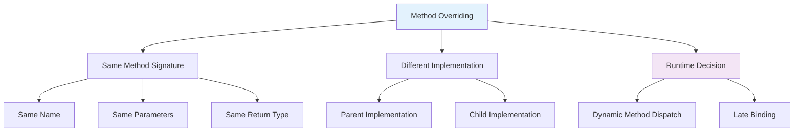

# Method Overriding
## Lecture 18

**Java Programming (4343203)**  
Diploma in ICT - Semester IV  
Gujarat Technological University

<div class="pt-12">
  <span @click="$slidev.nav.next" class="px-2 py-1 rounded cursor-pointer" hover="bg-white bg-opacity-10">
    Press Space for next page <carbon:arrow-right class="inline"/>
  </span>
</div>

---
layout: default
---

# Learning Objectives

By the end of this lecture, you will be able to:

<v-clicks>

- 🔄 **Understand** method overriding vs method overloading
- 🎯 **Implement** method overriding with @Override annotation
- ⚡ **Apply** dynamic method dispatch and runtime polymorphism
- 🛡️ **Follow** overriding rules and restrictions
- 🎨 **Design** polymorphic systems using method overriding
- 📝 **Practice** with real-world overriding scenarios

</v-clicks>

<br>

<div v-click="7" class="text-center text-2xl text-blue-600 font-bold">
Let's master runtime polymorphism! 🔄⚡
</div>

---
layout: center
---

# What is Method Overriding?

<div class="flex justify-center">



</div>

<div class="mt-8 grid grid-cols-2 gap-6">

<div class="bg-blue-50 p-4 rounded-lg">
<h3 class="font-bold text-blue-700">🎯 Method Overriding</h3>
<ul class="text-sm space-y-1">
<li>• Child redefines parent method</li>
<li>• Same method signature required</li>
<li>• Runtime method selection</li>
<li>• Enables polymorphism</li>
</ul>
</div>

<div class="bg-green-50 p-4 rounded-lg">
<h3 class="font-bold text-green-700">⚡ Dynamic Dispatch</h3>
<ul class="text-sm space-y-1">
<li>• Method resolved at runtime</li>
<li>• Based on actual object type</li>
<li>• Enables flexible design</li>
<li>• Foundation of OOP</li>
</ul>
</div>

</div>

---
layout: default
---

# Overriding vs Overloading

<div class="grid grid-cols-2 gap-8">

<div>

## 🔄 Method Overriding

```java
// Parent class
class Animal {
    public void makeSound() {
        System.out.println("Animal makes a generic sound");
    }
    
    public void move() {
        System.out.println("Animal moves");
    }
}

// Child class - Method Overriding
class Dog extends Animal {
    @Override
    public void makeSound() {  // Same signature
        System.out.println("Dog barks: Woof! Woof!");
    }
    
    @Override
    public void move() {  // Same signature
        System.out.println("Dog runs on four legs");
    }
}

// Usage
Animal animal = new Dog();  // Polymorphism
animal.makeSound();  // Calls Dog's version (Runtime decision)
animal.move();       // Calls Dog's version (Runtime decision)
```

**Key Features:**
- Same method signature
- Runtime method resolution
- Inheritance relationship required
- Enables polymorphism

</div>

<div>

## 🔧 Method Overloading (Review)

```java
// Method Overloading in same class
class Calculator {
    // Same method name, different parameters
    public int add(int a, int b) {
        return a + b;
    }
    
    public double add(double a, double b) {  // Different types
        return a + b;
    }
    
    public int add(int a, int b, int c) {    // Different count
        return a + b + c;
    }
}

// Usage
Calculator calc = new Calculator();
calc.add(5, 10);        // Calls int version (Compile-time decision)
calc.add(5.5, 10.7);    // Calls double version (Compile-time decision)
calc.add(1, 2, 3);      // Calls three-parameter version
```

**Key Features:**
- Different method signatures
- Compile-time method resolution
- Same class or inheritance
- Static polymorphism

</div>

</div>

---
layout: default
---

# Basic Method Overriding

<div class="grid grid-cols-2 gap-8">

<div>

## 🎯 Simple Overriding Example

```java
// Base class
class Vehicle {
    protected String brand;
    protected double speed;
    
    public Vehicle(String brand) {
        this.brand = brand;
        this.speed = 0.0;
    }
    
    // Method to be overridden
    public void start() {
        System.out.println(brand + " vehicle is starting");
        speed = 10.0;
    }
    
    public void stop() {
        System.out.println(brand + " vehicle is stopping");
        speed = 0.0;
    }
    
    public void displaySpeed() {
        System.out.println("Current speed: " + speed + " km/h");
    }
    
    // Method that shows vehicle type
    public void showVehicleType() {
        System.out.println("This is a generic vehicle");
    }
}

// Derived class
class Car extends Vehicle {
    private boolean engineRunning;
    
    public Car(String brand) {
        super(brand);
        this.engineRunning = false;
    }
    
    // Override parent method
    @Override
    public void start() {
        System.out.println("Turning key to start " + brand + " car");
        System.out.println("Engine started!");
        engineRunning = true;
        speed = 15.0;  // Car starts faster than generic vehicle
    }
    
    // Override parent method
    @Override
    public void stop() {
        System.out.println("Applying brakes on " + brand + " car");
        System.out.println("Engine stopped!");
        engineRunning = false;
        speed = 0.0;
    }
    
    // Override parent method
    @Override
    public void showVehicleType() {
        System.out.println("This is a car - " + brand);
    }
}
```

</div>

<div>

## 🚗 Overriding in Action

```java
public class OverridingDemo {
    public static void main(String[] args) {
        // Direct object creation
        System.out.println("=== Direct Object Creation ===");
        Car car = new Car("Toyota");
        car.start();        // Calls Car's overridden method
        car.displaySpeed(); // Inherited from Vehicle
        car.showVehicleType(); // Calls Car's overridden method
        car.stop();         // Calls Car's overridden method
        
        System.out.println("\n=== Polymorphic Behavior ===");
        // Polymorphic reference - Vehicle reference to Car object
        Vehicle vehicle = new Car("Honda");
        
        // All these calls go to Car's overridden methods
        vehicle.start();        // Car's start() method
        vehicle.displaySpeed(); // Vehicle's method (inherited)
        vehicle.showVehicleType(); // Car's overridden method
        vehicle.stop();         // Car's overridden method
        
        System.out.println("\n=== Method Resolution Verification ===");
        System.out.println("Object type: " + vehicle.getClass().getSimpleName());
        System.out.println("Reference type: Vehicle");
        System.out.println("Methods called are from: " + 
                          vehicle.getClass().getSimpleName());
    }
}
```

**Expected Output:**
```text
=== Direct Object Creation ===
Turning key to start Toyota car
Engine started!
Current speed: 15.0 km/h
This is a car - Toyota
Applying brakes on Toyota car
Engine stopped!

=== Polymorphic Behavior ===
Turning key to start Honda car
Engine started!
Current speed: 15.0 km/h
This is a car - Honda
Applying brakes on Honda car
Engine stopped!
```

</div>

</div>

---
layout: default
---

# @Override Annotation

<div class="grid grid-cols-2 gap-8">

<div>

## 🛡️ Benefits of @Override

<v-clicks>

**Compile-time Safety:**
- Ensures method actually overrides parent method
- Catches typos in method names
- Validates method signatures

**Code Documentation:**
- Clear intent to override
- Helps other developers understand
- IDE support and warnings

**Refactoring Safety:**
- Alerts if parent method signature changes
- Prevents accidental method hiding
- Maintains inheritance contracts

</v-clicks>

<div v-click="4">

## ❌ Without @Override

```java
class Animal {
    public void makeSound() {
        System.out.println("Animal sound");
    }
}

class Cat extends Animal {
    // Typo in method name - no compilation error!
    public void makesound() {  // Missing capital S
        System.out.println("Cat meows");
    }
}

// Usage
Animal cat = new Cat();
cat.makeSound();  // Prints "Animal sound" - not what we wanted!
```

</div>

</div>

<div>

## ✅ With @Override

```java
class Animal {
    public void makeSound() {
        System.out.println("Animal sound");
    }
    
    public void sleep(int hours) {
        System.out.println("Animal sleeps for " + hours + " hours");
    }
}

class Cat extends Animal {
    @Override
    public void makeSound() {  // ✅ Correct override
        System.out.println("Cat meows");
    }
    
    // This would cause compilation error
    // @Override
    // public void makesound() {  // ❌ Method doesn't exist in parent
    //     System.out.println("Cat meows");
    // }
    
    @Override
    public void sleep(int hours) {  // ✅ Correct override
        System.out.println("Cat sleeps curled up for " + hours + " hours");
    }
    
    // This would cause compilation error  
    // @Override
    // public void sleep(double hours) {  // ❌ Different parameter type
    //     System.out.println("Cat sleeps");
    // }
}

// Safe usage
Animal cat = new Cat();
cat.makeSound();  // ✅ Guaranteed to call Cat's method
cat.sleep(8);     // ✅ Guaranteed to call Cat's method
```

<div class="mt-4 p-4 bg-green-50 rounded-lg">
<strong>🎯 Best Practice:</strong> Always use @Override annotation when overriding methods!
</div>

</div>

</div>

---
layout: default
---

# Method Overriding Rules

<div class="grid grid-cols-2 gap-8">

<div>

## 📜 Overriding Rules

<v-clicks>

**Method Signature:**
- Method name must be identical
- Parameter list must be identical  
- Return type must be same or covariant

**Access Modifiers:**
- Cannot reduce visibility
- Can increase visibility
- private methods cannot be overridden

**Exceptions:**
- Cannot throw new checked exceptions
- Can throw fewer or narrower exceptions
- Unchecked exceptions have no restrictions

**Other Rules:**
- static methods cannot be overridden (hidden instead)
- final methods cannot be overridden
- Constructor cannot be overridden

</v-clicks>

</div>

<div>

## 📝 Rules Demonstration

```java
class Parent {
    // Protected method
    protected void method1() throws IOException {
        System.out.println("Parent method1");
    }
    
    // Public method with return type
    public Number method2() {
        return Integer.valueOf(10);
    }
    
    // Final method - cannot be overridden
    public final void method3() {
        System.out.println("Final method");
    }
    
    // Static method - can be hidden, not overridden
    public static void method4() {
        System.out.println("Parent static method");
    }
    
    // Private method - not inherited, cannot be overridden
    private void method5() {
        System.out.println("Private method");
    }
}

class Child extends Parent {
    // ✅ Valid override - increased visibility
    @Override
    public void method1() {  // protected → public (allowed)
        System.out.println("Child method1");
        // No exception thrown (allowed - fewer exceptions)
    }
    
    // ✅ Valid override - covariant return type
    @Override
    public Integer method2() {  // Number → Integer (covariant)
        return Integer.valueOf(20);
    }
    
    // ❌ This would cause compilation error
    // @Override
    // public void method3() {  // Cannot override final method
    //     System.out.println("Child method3");
    // }
    
    // ✅ Method hiding (not overriding)
    public static void method4() {
        System.out.println("Child static method");
    }
    
    // ✅ New method (not overriding private method)
    public void method5() {
        System.out.println("Child method5");
    }
}
```

</div>

</div>

---
layout: default
---

# Dynamic Method Dispatch

<div class="grid grid-cols-2 gap-8">

<div>

## ⚡ Runtime Method Resolution

```java
// Demonstration of dynamic method dispatch
class Shape {
    protected String name;
    
    public Shape(String name) {
        this.name = name;
    }
    
    public void draw() {
        System.out.println("Drawing a generic shape: " + name);
    }
    
    public double calculateArea() {
        System.out.println("Area calculation not implemented for generic shape");
        return 0.0;
    }
    
    public void displayInfo() {
        System.out.println("Shape: " + name);
        System.out.println("Area: " + calculateArea());
    }
}

class Circle extends Shape {
    private double radius;
    
    public Circle(double radius) {
        super("Circle");
        this.radius = radius;
    }
    
    @Override
    public void draw() {
        System.out.println("Drawing a circle with radius: " + radius);
    }
    
    @Override
    public double calculateArea() {
        double area = Math.PI * radius * radius;
        System.out.println("Calculating circle area: π × " + radius + "²");
        return area;
    }
}

class Rectangle extends Shape {
    private double width, height;
    
    public Rectangle(double width, double height) {
        super("Rectangle");
        this.width = width;
        this.height = height;
    }
    
    @Override
    public void draw() {
        System.out.println("Drawing a rectangle: " + width + " × " + height);
    }
    
    @Override
    public double calculateArea() {
        double area = width * height;
        System.out.println("Calculating rectangle area: " + width + " × " + height);
        return area;
    }
}
```

</div>

<div>

## 🎭 Polymorphic Behavior

```java
public class DynamicDispatchDemo {
    public static void main(String[] args) {
        // Array of Shape references pointing to different objects
        Shape[] shapes = {
            new Circle(5.0),
            new Rectangle(4.0, 6.0),
            new Circle(3.0),
            new Rectangle(10.0, 2.0)
        };
        
        System.out.println("=== Dynamic Method Dispatch Demo ===");
        
        // Same method call, different implementations executed
        for (Shape shape : shapes) {
            System.out.println("\n--- Processing " + shape.name + " ---");
            
            // These method calls are resolved at runtime
            shape.draw();        // Calls appropriate draw() method
            shape.displayInfo(); // Uses overridden calculateArea()
            
            // Verify actual object type
            System.out.println("Actual object type: " + 
                             shape.getClass().getSimpleName());
        }
        
        System.out.println("\n=== Method Resolution Details ===");
        demonstrateMethodResolution();
    }
    
    private static void demonstrateMethodResolution() {
        Shape shape1 = new Circle(7.0);
        Shape shape2 = new Rectangle(5.0, 8.0);
        
        // Same reference type, different object types
        System.out.println("shape1 reference type: Shape");
        System.out.println("shape1 object type: " + shape1.getClass().getSimpleName());
        shape1.calculateArea();  // Calls Circle's method
        
        System.out.println("\nshape2 reference type: Shape");
        System.out.println("shape2 object type: " + shape2.getClass().getSimpleName());
        shape2.calculateArea();  // Calls Rectangle's method
        
        // Method binding happens at runtime based on actual object type
        System.out.println("\nMethod binding: RUNTIME (Dynamic)");
    }
}
```

**Key Points:**
- Method resolution happens at runtime
- Based on actual object type, not reference type
- Enables true polymorphic behavior
- Foundation of flexible OOP design

</div>

</div>

---
layout: default
---

# Real-World Example: Employee Management System

<div class="grid grid-cols-2 gap-8">

<div>

## 👥 Employee Hierarchy with Overriding

```java
abstract class Employee {
    protected String employeeId;
    protected String name;
    protected String department;
    protected double baseSalary;
    
    public Employee(String employeeId, String name, String department, double baseSalary) {
        this.employeeId = employeeId;
        this.name = name;
        this.department = department;
        this.baseSalary = baseSalary;
    }
    
    // Methods to be overridden by subclasses
    public abstract double calculateSalary();
    public abstract void displayRole();
    
    // Common method that can be overridden
    public void clockIn() {
        System.out.println(name + " (" + employeeId + ") clocked in at " + 
                          java.time.LocalTime.now());
    }
    
    public void displayBasicInfo() {
        System.out.println("ID: " + employeeId);
        System.out.println("Name: " + name);
        System.out.println("Department: " + department);
        System.out.println("Base Salary: $" + baseSalary);
    }
    
    // Template method using overridden methods
    public void generatePaySlip() {
        System.out.println("=== PAY SLIP ===");
        displayBasicInfo();
        displayRole();
        System.out.println("Total Salary: $" + String.format("%.2f", calculateSalary()));
        System.out.println("================");
    }
}

class Manager extends Employee {
    private double bonusPercentage;
    private int teamSize;
    
    public Manager(String employeeId, String name, String department, 
                  double baseSalary, double bonusPercentage, int teamSize) {
        super(employeeId, name, department, baseSalary);
        this.bonusPercentage = bonusPercentage;
        this.teamSize = teamSize;
    }
    
    @Override
    public double calculateSalary() {
        double bonus = baseSalary * bonusPercentage;
        double teamBonus = teamSize * 100; // $100 per team member
        return baseSalary + bonus + teamBonus;
    }
    
    @Override
    public void displayRole() {
        System.out.println("Role: Manager");
        System.out.println("Team Size: " + teamSize);
        System.out.println("Bonus Percentage: " + (bonusPercentage * 100) + "%");
    }
    
    @Override
    public void clockIn() {
        System.out.println("Manager " + name + " accessed management portal");
        super.clockIn(); // Call parent implementation
    }
}
```

</div>

<div>

## 💻 Developer and Sales Classes

```java
class Developer extends Employee {
    private String programmingLanguage;
    private int projectsCompleted;
    
    public Developer(String employeeId, String name, double baseSalary, 
                    String language, int projectsCompleted) {
        super(employeeId, name, "IT", baseSalary);
        this.programmingLanguage = language;
        this.projectsCompleted = projectsCompleted;
    }
    
    @Override
    public double calculateSalary() {
        double projectBonus = projectsCompleted * 500; // $500 per project
        return baseSalary + projectBonus;
    }
    
    @Override
    public void displayRole() {
        System.out.println("Role: Software Developer");
        System.out.println("Programming Language: " + programmingLanguage);
        System.out.println("Projects Completed: " + projectsCompleted);
    }
    
    @Override
    public void clockIn() {
        System.out.println("Developer " + name + " started coding session");
        super.clockIn();
    }
}

class SalesRepresentative extends Employee {
    private double commissionRate;
    private double salesAmount;
    
    public SalesRepresentative(String employeeId, String name, double baseSalary,
                              double commissionRate, double salesAmount) {
        super(employeeId, name, "Sales", baseSalary);
        this.commissionRate = commissionRate;
        this.salesAmount = salesAmount;
    }
    
    @Override
    public double calculateSalary() {
        double commission = salesAmount * commissionRate;
        return baseSalary + commission;
    }
    
    @Override
    public void displayRole() {
        System.out.println("Role: Sales Representative");
        System.out.println("Commission Rate: " + (commissionRate * 100) + "%");
        System.out.println("Sales Amount: $" + salesAmount);
    }
    
    @Override
    public void clockIn() {
        System.out.println("Sales Rep " + name + " checked sales dashboard");
        super.clockIn();
    }
}

// Payroll system using polymorphism
class PayrollSystem {
    public static void processPayroll(Employee[] employees) {
        System.out.println("=== MONTHLY PAYROLL PROCESSING ===\n");
        
        double totalPayroll = 0.0;
        
        for (Employee emp : employees) {
            emp.clockIn();           // Different implementation for each type
            emp.generatePaySlip();   // Uses overridden calculateSalary()
            totalPayroll += emp.calculateSalary();
            System.out.println();
        }
        
        System.out.println("Total Payroll: $" + String.format("%.2f", totalPayroll));
    }
}
```

</div>

</div>

---
layout: default
---

# Covariant Return Types

<div class="grid grid-cols-2 gap-8">

<div>

## 🔄 Return Type Flexibility

```java
// Base class
class Animal {
    public Animal reproduce() {
        System.out.println("Animal reproduces");
        return new Animal();
    }
    
    public void showType() {
        System.out.println("This is an Animal");
    }
}

// Child class with covariant return type
class Dog extends Animal {
    @Override
    public Dog reproduce() {  // ✅ Covariant return type
        System.out.println("Dog reproduces");
        return new Dog();  // Returns Dog instead of Animal
    }
    
    @Override
    public void showType() {
        System.out.println("This is a Dog");
    }
    
    public void bark() {
        System.out.println("Dog barks");
    }
}

class Cat extends Animal {
    @Override
    public Cat reproduce() {  // ✅ Covariant return type
        System.out.println("Cat reproduces");
        return new Cat();
    }
    
    @Override
    public void showType() {
        System.out.println("This is a Cat");
    }
    
    public void meow() {
        System.out.println("Cat meows");
    }
}
```

</div>

<div>

## 🎯 Covariant Return Benefits

```java
public class CovariantReturnDemo {
    public static void main(String[] args) {
        System.out.println("=== Covariant Return Type Demo ===");
        
        // Using polymorphic references
        Animal animal1 = new Dog();
        Animal animal2 = new Cat();
        
        // Method calls return Animal reference (compile-time type)
        Animal offspring1 = animal1.reproduce();  // Actually returns Dog
        Animal offspring2 = animal2.reproduce();  // Actually returns Cat
        
        offspring1.showType();  // Shows "This is a Dog"
        offspring2.showType();  // Shows "This is a Cat"
        
        System.out.println("\n=== Direct Object References ===");
        
        // Using direct references
        Dog dog = new Dog();
        Cat cat = new Cat();
        
        // Method calls return specific types (no casting needed)
        Dog puppy = dog.reproduce();    // Returns Dog directly
        Cat kitten = cat.reproduce();   // Returns Cat directly
        
        puppy.bark();   // Can call Dog-specific methods
        kitten.meow();  // Can call Cat-specific methods
        
        System.out.println("\n=== Type Verification ===");
        System.out.println("offspring1 actual type: " + offspring1.getClass().getSimpleName());
        System.out.println("offspring2 actual type: " + offspring2.getClass().getSimpleName());
        System.out.println("puppy type: " + puppy.getClass().getSimpleName());
        System.out.println("kitten type: " + kitten.getClass().getSimpleName());
    }
}
```

**Benefits of Covariant Return Types:**
- No need for explicit casting
- Type safety at compile time
- More specific return types
- Better API design
- Natural inheritance hierarchy

<div class="mt-4 p-4 bg-green-50 rounded-lg">
<strong>🎯 Rule:</strong> Return type can be a subtype of the parent's return type!
</div>

</div>

</div>

---
layout: default
---

# Method Hiding vs Method Overriding

<div class="grid grid-cols-2 gap-8">

<div>

## 🔄 Instance Method Overriding

```java
class Parent {
    // Instance method - can be overridden
    public void instanceMethod() {
        System.out.println("Parent instance method");
    }
    
    // Static method - will be hidden, not overridden
    public static void staticMethod() {
        System.out.println("Parent static method");
    }
}

class Child extends Parent {
    // Method overriding - runtime dispatch
    @Override
    public void instanceMethod() {
        System.out.println("Child instance method");
    }
    
    // Method hiding - compile-time dispatch
    public static void staticMethod() {
        System.out.println("Child static method");
    }
}

public class HidingVsOverridingDemo {
    public static void main(String[] args) {
        // Instance method overriding
        System.out.println("=== Instance Method Overriding ===");
        Parent parent1 = new Parent();
        Parent parent2 = new Child();  // Polymorphic reference
        Child child = new Child();
        
        parent1.instanceMethod();  // "Parent instance method"
        parent2.instanceMethod();  // "Child instance method" (OVERRIDDEN)
        child.instanceMethod();    // "Child instance method"
        
        System.out.println("\n=== Static Method Hiding ===");
        
        // Static method hiding
        Parent.staticMethod();     // "Parent static method"
        Child.staticMethod();      // "Child static method"
        
        // Static methods are resolved at compile time
        parent1.staticMethod();    // "Parent static method"
        parent2.staticMethod();    // "Parent static method" (HIDDEN, not overridden)
        child.staticMethod();      // "Child static method"
    }
}
```

</div>

<div>

## 📊 Comparison Table

| Aspect | Method Overriding | Method Hiding |
|--------|------------------|---------------|
| **Method Type** | Instance methods | Static methods |
| **Binding Time** | Runtime (Late) | Compile-time (Early) |
| **Keyword** | @Override | No annotation |
| **Resolution** | Based on object type | Based on reference type |
| **Polymorphism** | ✅ Enabled | ❌ Not enabled |

## 🎯 Practical Implications

```java
class Utility {
    public static void process() {
        System.out.println("Generic processing");
    }
    
    public void execute() {
        System.out.println("Generic execution");
    }
}

class SpecializedUtility extends Utility {
    // Method hiding
    public static void process() {
        System.out.println("Specialized processing");
    }
    
    // Method overriding
    @Override
    public void execute() {
        System.out.println("Specialized execution");
    }
}

// Usage patterns
public void demonstrate() {
    Utility util1 = new SpecializedUtility();
    
    // Static method - resolved by reference type
    util1.process();    // "Generic processing" (HIDING)
    
    // Instance method - resolved by object type
    util1.execute();    // "Specialized execution" (OVERRIDING)
}
```

<div class="mt-4 p-4 bg-yellow-50 rounded-lg">
<strong>⚠️ Important:</strong> Static methods cannot be overridden, only hidden! Use instance methods for true polymorphism.
</div>

</div>

</div>

---
layout: default
---

# Practical Exercise: Media Player System

<div class="grid grid-cols-2 gap-8">

<div>

## 🎵 Design Challenge

**Requirements:**
1. Create an abstract MediaPlayer base class
2. Implement different media players with overridden methods
3. Use @Override annotation properly
4. Demonstrate dynamic method dispatch
5. Include covariant return types where appropriate
6. Show polymorphic behavior in action

```java
public abstract class MediaPlayer {
    // TODO: Common properties (name, currentTrack, volume, etc.)
    // TODO: Abstract methods (play, pause, stop, loadMedia)
    // TODO: Concrete methods that use abstract methods
    // TODO: Template method pattern implementation
}

public class AudioPlayer extends MediaPlayer {
    // TODO: Audio-specific properties and methods
    // TODO: Override abstract methods with audio implementation
    // TODO: Add audio-specific functionality
}

public class VideoPlayer extends MediaPlayer {
    // TODO: Video-specific properties and methods  
    // TODO: Override abstract methods with video implementation
    // TODO: Add video-specific functionality
}

// TODO: Create demonstration class showing polymorphism
```

</div>

<div>

## 🎯 Expected Implementation

**Features to Implement:**
- Abstract MediaPlayer base class with template methods
- AudioPlayer and VideoPlayer concrete implementations
- Method overriding with @Override annotation
- Dynamic method dispatch demonstration
- Covariant return types where applicable
- Polymorphic collection of different players

**Success Criteria:**
- All abstract methods properly overridden
- @Override annotation used correctly
- Dynamic method dispatch working
- Polymorphic behavior demonstrated
- Template method pattern implemented
- Real-world applicability shown

**Usage Example:**
```java
// Should work after implementation
MediaPlayer[] players = {
    new AudioPlayer("Spotify"),
    new VideoPlayer("YouTube"), 
    new AudioPlayer("iTunes")
};

for (MediaPlayer player : players) {
    player.loadMedia("sample_file");  // Polymorphic call
    player.play();                    // Dynamic dispatch
    player.displayStatus();           // Template method
}

// Demonstrate covariant return types
AudioPlayer audioPlayer = new AudioPlayer("Pandora");
AudioTrack track = audioPlayer.getCurrentTrack(); // Covariant return
```

</div>

</div>

---
layout: default
---

# Common Method Overriding Mistakes

<div class="space-y-4">

<div class="bg-red-50 p-4 rounded-lg">
<h4 class="font-bold text-red-700">❌ Method Overriding Pitfalls</h4>
<div class="grid grid-cols-2 gap-4 mt-2">
<div>
```java
// WRONG: Different parameter types (overloading, not overriding)
class Parent {
    public void method(int x) { }
}
class Child extends Parent {
    @Override  // ❌ Compilation error
    public void method(double x) { }  // Different parameter type
}

// WRONG: Reducing access visibility
class Parent {
    public void method() { }
}
class Child extends Parent {
    @Override
    protected void method() { }  // ❌ Cannot reduce visibility
}

// WRONG: Adding checked exceptions
class Parent {
    public void method() { }
}
class Child extends Parent {
    @Override
    public void method() throws IOException { }  // ❌ New checked exception
}
```
</div>
<div>
```java
// WRONG: Trying to override static methods
class Parent {
    public static void method() { }
}
class Child extends Parent {
    @Override  // ❌ Compilation error
    public static void method() { }  // Cannot override static
}

// WRONG: Trying to override final methods
class Parent {
    public final void method() { }
}
class Child extends Parent {
    @Override  // ❌ Compilation error
    public void method() { }  // Cannot override final
}

// WRONG: Not using @Override annotation
class Child extends Parent {
    public void method() { }  // ❌ Missing @Override, prone to errors
}
```
</div>
</div>
</div>

<div class="bg-green-50 p-4 rounded-lg">
<h4 class="font-bold text-green-700">✅ Correct Approaches</h4>
<div class="grid grid-cols-2 gap-4 mt-2">
<div>
```java
// CORRECT: Same parameter types for overriding
class Parent {
    public void method(int x) { }
}
class Child extends Parent {
    @Override
    public void method(int x) { }  // ✅ Same signature
}

// CORRECT: Maintaining or increasing visibility
class Parent {
    protected void method() { }
}
class Child extends Parent {
    @Override
    public void method() { }  // ✅ Increased visibility
}

// CORRECT: Not adding new checked exceptions
class Parent {
    public void method() throws IOException { }
}
class Child extends Parent {
    @Override
    public void method() { }  // ✅ Fewer exceptions allowed
}
```
</div>
<div>
```java
// CORRECT: Method hiding for static methods
class Parent {
    public static void method() { }
}
class Child extends Parent {
    // Method hiding (no @Override)
    public static void method() { }  // ✅ Hiding, not overriding
}

// CORRECT: Cannot override final - create new method
class Parent {
    public final void method() { }
}
class Child extends Parent {
    public void alternativeMethod() { }  // ✅ New method instead
}

// CORRECT: Always use @Override
class Child extends Parent {
    @Override
    public void method() { }  // ✅ Safe overriding
}
```
</div>
</div>
</div>

</div>

---
layout: center
class: text-center
---

# Summary

<div class="grid grid-cols-2 gap-8 mt-8">

<div class="bg-blue-50 p-6 rounded-lg">
<h3 class="font-bold text-lg mb-4">📖 What We Learned</h3>
<ul class="text-left space-y-2">
<li>• Method overriding vs method overloading</li>
<li>• @Override annotation benefits and usage</li>
<li>• Dynamic method dispatch and runtime binding</li>
<li>• Method overriding rules and restrictions</li>
<li>• Covariant return types</li>
<li>• Method hiding vs method overriding</li>
</ul>
</div>

<div class="bg-green-50 p-6 rounded-lg">
<h3 class="font-bold text-lg mb-4">🎯 Next Steps</h3>
<ul class="text-left space-y-2">
<li>• super keyword and constructor chaining</li>
<li>• Abstract classes and methods</li>
<li>• Interface implementation and overriding</li>
<li>• Polymorphism and design patterns</li>
<li>• Advanced OOP concepts</li>
</ul>
</div>

</div>

<div class="mt-8 text-2xl font-bold text-purple-600">
Method overriding mastered! Ready for super keyword! 🔄⚡
</div>

---
layout: center
class: text-center
---

# Questions & Discussion

<div class="text-6xl mb-8">❓</div>

<div class="text-xl mb-8">
Any questions about method overriding, dynamic dispatch, or polymorphic behavior?
</div>

<div class="text-lg text-gray-600">
Next lecture: **super Keyword and Constructor Chaining**
</div>

<div class="mt-8">
<span class="px-4 py-2 bg-blue-500 text-white rounded-lg">
Ready to master the super keyword! 👏
</span>
</div>