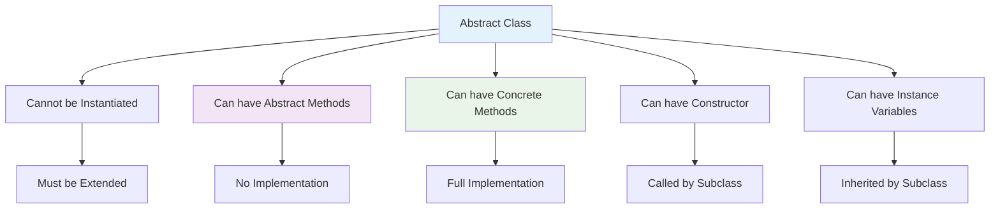

# Abstract Classes and Methods
## Lecture 20

**Java Programming (4343203)**  
Diploma in ICT - Semester IV  
Gujarat Technological University

<div class="pt-12">
  <span @click="$slidev.nav.next" class="px-2 py-1 rounded cursor-pointer" hover="bg-white bg-opacity-10">
    Press Space for next page <carbon:arrow-right class="inline"/>
  </span>
</div>

---
layout: default
---

# Learning Objectives

By the end of this lecture, you will be able to:

<v-clicks>

- 🎨 **Understand** abstract classes and their purpose in OOP
- 🔧 **Implement** abstract methods for enforced inheritance
- 🏗️ **Design** template method patterns using abstract classes
- 🎯 **Apply** abstract concepts to real-world problems
- ⚡ **Differentiate** between abstract classes and interfaces
- 📝 **Practice** with abstract inheritance hierarchies

</v-clicks>

<br>

<div v-click="7" class="text-center text-2xl text-blue-600 font-bold">
Let's explore abstract thinking in programming! 🎨🔧
</div>

---
layout: center
---

# What are Abstract Classes?

<div class="flex justify-center">



</div>

<div class="mt-8 grid grid-cols-2 gap-6">

<div class="bg-blue-50 p-4 rounded-lg">
<h3 class="font-bold text-blue-700">🎯 Abstract Class Features</h3>
<ul class="text-sm space-y-1">
<li>• Cannot create objects directly</li>
<li>• Must be extended by concrete classes</li>
<li>• Can mix abstract and concrete methods</li>
<li>• Defines common behavior and structure</li>
</ul>
</div>

<div class="bg-green-50 p-4 rounded-lg">
<h3 class="font-bold text-green-700">🔧 Use Cases</h3>
<ul class="text-sm space-y-1">
<li>• Partial implementation scenarios</li>
<li>• Common base with specialized behavior</li>
<li>• Template method patterns</li>
<li>• Framework design</li>
</ul>
</div>

</div>

---
layout: default
---

# Basic Abstract Class

<div class="grid grid-cols-2 gap-8">

<div>

## 🎨 Abstract Class Definition

```java
// Abstract class - cannot be instantiated
abstract class Animal {
    // Instance variables (inherited by subclasses)
    protected String name;
    protected int age;
    protected String habitat;
    
    // Constructor (called by subclasses via super())
    public Animal(String name, int age, String habitat) {
        this.name = name;
        this.age = age;
        this.habitat = habitat;
        System.out.println("Animal constructor called: " + name);
    }
    
    // Concrete method (inherited as-is)
    public void sleep() {
        System.out.println(name + " is sleeping");
    }
    
    // Concrete method (can be overridden)
    public void eat() {
        System.out.println(name + " is eating");
    }
    
    // Abstract methods (must be implemented by subclasses)
    public abstract void makeSound();
    public abstract void move();
    
    // Abstract method with specific requirements
    public abstract double calculateDailyFoodRequirement();
    
    // Template method using abstract methods
    public void performDailyRoutine() {
        System.out.println("=== Daily Routine for " + name + " ===");
        makeSound();    // Abstract - implemented by subclass
        eat();          // Concrete - common implementation
        move();         // Abstract - implemented by subclass
        sleep();        // Concrete - common implementation
        
        double food = calculateDailyFoodRequirement();
        System.out.println("Food requirement: " + food + " kg");
    }
}
```

</div>

<div>

## 🦊 Concrete Implementation

```java
// Concrete class extending abstract class
class Dog extends Animal {
    private String breed;
    private boolean isTrained;
    
    public Dog(String name, int age, String breed) {
        super(name, age, "Domestic");  // Call abstract class constructor
        this.breed = breed;
        this.isTrained = false;
    }
    
    // Must implement abstract methods
    @Override
    public void makeSound() {
        System.out.println(name + " barks: Woof! Woof!");
    }
    
    @Override
    public void move() {
        System.out.println(name + " runs on four legs");
    }
    
    @Override
    public double calculateDailyFoodRequirement() {
        // Dog-specific calculation based on age and breed
        if (age < 1) return 0.5;  // Puppy
        else if (breed.contains("Large")) return 2.0;
        else return 1.2;
    }
    
    // Optional: Override inherited concrete method
    @Override
    public void eat() {
        System.out.println(name + " eats dog food from bowl");
    }
    
    // Dog-specific methods
    public void train(String command) {
        System.out.println("Training " + name + " to " + command);
        this.isTrained = true;
    }
}

class Bird extends Animal {
    private double wingspan;
    private boolean canFly;
    
    public Bird(String name, int age, double wingspan, boolean canFly) {
        super(name, age, "Various habitats");
        this.wingspan = wingspan;
        this.canFly = canFly;
    }
    
    @Override
    public void makeSound() {
        System.out.println(name + " chirps and sings");
    }
    
    @Override
    public void move() {
        if (canFly) {
            System.out.println(name + " flies with " + wingspan + "m wingspan");
        } else {
            System.out.println(name + " walks and hops on ground");
        }
    }
    
    @Override
    public double calculateDailyFoodRequirement() {
        // Bird-specific calculation based on wingspan
        return wingspan * 0.1;  // 0.1 kg per meter of wingspan
    }
}
```

</div>

</div>

---
layout: default
---

# Abstract Class Usage

<div class="grid grid-cols-2 gap-8">

<div>

## 🎬 Abstract Class in Action

```java
public class AbstractClassDemo {
    public static void main(String[] args) {
        // ❌ Cannot instantiate abstract class
        // Animal animal = new Animal("Generic", 5, "Unknown"); // Compilation error
        
        // ✅ Can create concrete subclass objects
        Dog dog = new Dog("Buddy", 3, "Golden Retriever");
        Bird bird = new Bird("Tweety", 1, 0.15, true);
        
        System.out.println("=== Direct Object Usage ===");
        dog.performDailyRoutine();
        
        System.out.println("\n");
        bird.performDailyRoutine();
        
        System.out.println("\n=== Polymorphic Usage ===");
        
        // ✅ Can use abstract class as reference type
        Animal[] animals = {dog, bird};
        
        for (Animal animal : animals) {
            System.out.println("Processing animal: " + animal.name);
            animal.makeSound();  // Calls subclass implementation
            animal.move();       // Calls subclass implementation
            
            // Can call concrete methods
            animal.sleep();
            
            System.out.println("Age: " + animal.age + " years");
            System.out.println("Habitat: " + animal.habitat);
            System.out.println();
        }
        
        System.out.println("=== Type Checking ===");
        demonstrateTypeChecking(dog);
        demonstrateTypeChecking(bird);
    }
    
    private static void demonstrateTypeChecking(Animal animal) {
        System.out.println("Animal: " + animal.name);
        System.out.println("Is Dog: " + (animal instanceof Dog));
        System.out.println("Is Bird: " + (animal instanceof Bird));
        System.out.println("Is Animal: " + (animal instanceof Animal));
        
        if (animal instanceof Dog) {
            Dog d = (Dog) animal;
            d.train("sit");  // Access Dog-specific method
        }
        
        System.out.println();
    }
}
```

</div>

<div>

## 📄 Expected Output

```text
Animal constructor called: Buddy
Animal constructor called: Tweety

=== Direct Object Usage ===
=== Daily Routine for Buddy ===
Buddy barks: Woof! Woof!
Buddy eats dog food from bowl
Buddy runs on four legs
Buddy is sleeping
Food requirement: 2.0 kg

=== Daily Routine for Tweety ===
Tweety chirps and sings
Tweety is eating
Tweety flies with 0.15m wingspan
Tweety is sleeping
Food requirement: 0.015 kg

=== Polymorphic Usage ===
Processing animal: Buddy
Buddy barks: Woof! Woof!
Buddy runs on four legs
Buddy is sleeping
Age: 3 years
Habitat: Domestic

Processing animal: Tweety
Tweety chirps and sings
Tweety flies with 0.15m wingspan
Tweety is sleeping
Age: 1 years
Habitat: Various habitats

=== Type Checking ===
Animal: Buddy
Is Dog: true
Is Bird: false
Is Animal: true
Training Buddy to sit

Animal: Tweety
Is Dog: false
Is Bird: true
Is Animal: true
```

</div>

</div>

---
layout: default
---

# Template Method Pattern

<div class="grid grid-cols-2 gap-8">

<div>

## 🏗️ Template Pattern Implementation

```java
// Abstract class defining algorithm structure
abstract class DataProcessor {
    protected String dataSource;
    protected String outputFormat;
    
    public DataProcessor(String dataSource, String outputFormat) {
        this.dataSource = dataSource;
        this.outputFormat = outputFormat;
    }
    
    // Template method - defines the algorithm structure
    public final void processData() {
        System.out.println("=== Data Processing Started ===");
        
        // Step 1: Read data (abstract - implementation varies)
        String rawData = readData();
        
        // Step 2: Validate data (concrete - common logic)
        if (validateData(rawData)) {
            System.out.println("Data validation passed");
        } else {
            System.out.println("Data validation failed - stopping process");
            return;
        }
        
        // Step 3: Transform data (abstract - implementation varies)
        String transformedData = transformData(rawData);
        
        // Step 4: Save data (abstract - implementation varies)
        saveData(transformedData);
        
        // Step 5: Generate report (concrete - common logic)
        generateReport();
        
        System.out.println("=== Data Processing Completed ===");
    }
    
    // Abstract methods - must be implemented by subclasses
    protected abstract String readData();
    protected abstract String transformData(String rawData);
    protected abstract void saveData(String processedData);
    
    // Hook method - can be overridden but has default implementation
    protected boolean validateData(String data) {
        return data != null && !data.trim().isEmpty();
    }
    
    // Concrete method - common to all subclasses
    protected void generateReport() {
        System.out.println("Processing report generated for " + dataSource);
        System.out.println("Output format: " + outputFormat);
    }
}

// CSV Data Processor implementation
class CSVDataProcessor extends DataProcessor {
    public CSVDataProcessor(String dataSource) {
        super(dataSource, "CSV");
    }
    
    @Override
    protected String readData() {
        System.out.println("Reading CSV data from: " + dataSource);
        // Simulate CSV reading
        return "name,age,city\nAlice,25,NYC\nBob,30,LA";
    }
    
    @Override
    protected String transformData(String rawData) {
        System.out.println("Transforming CSV data - converting to uppercase");
        return rawData.toUpperCase();
    }
    
    @Override
    protected void saveData(String processedData) {
        System.out.println("Saving transformed CSV data to database");
        System.out.println("Data preview: " + processedData.substring(0, Math.min(50, processedData.length())) + "...");
    }
    
    @Override
    protected boolean validateData(String data) {
        // Enhanced validation for CSV
        return super.validateData(data) && data.contains(",");
    }
}
```

</div>

<div>

## 📊 JSON and XML Processors

```java
// JSON Data Processor implementation
class JSONDataProcessor extends DataProcessor {
    public JSONDataProcessor(String dataSource) {
        super(dataSource, "JSON");
    }
    
    @Override
    protected String readData() {
        System.out.println("Reading JSON data from: " + dataSource);
        return "{'users': [{'name': 'Alice', 'age': 25}, {'name': 'Bob', 'age': 30}]}";
    }
    
    @Override
    protected String transformData(String rawData) {
        System.out.println("Transforming JSON data - adding timestamps");
        return rawData.replace("}", ", 'processed_at': '" + 
                              java.time.LocalDateTime.now() + "'}");
    }
    
    @Override
    protected void saveData(String processedData) {
        System.out.println("Saving JSON data to file system");
        System.out.println("File: " + dataSource + "_processed.json");
    }
}

// XML Data Processor implementation  
class XMLDataProcessor extends DataProcessor {
    public XMLDataProcessor(String dataSource) {
        super(dataSource, "XML");
    }
    
    @Override
    protected String readData() {
        System.out.println("Reading XML data from: " + dataSource);
        return "<users><user name='Alice' age='25'/><user name='Bob' age='30'/></users>";
    }
    
    @Override
    protected String transformData(String rawData) {
        System.out.println("Transforming XML data - adding metadata");
        return rawData.replace("<users>", "<users processed='true'>");
    }
    
    @Override
    protected void saveData(String processedData) {
        System.out.println("Saving XML data to cloud storage");
        System.out.println("Cloud path: /processed/" + dataSource + ".xml");
    }
    
    @Override
    protected void generateReport() {
        super.generateReport();  // Call parent implementation
        System.out.println("XML-specific report: Schema validation passed");
    }
}

// Template Method Pattern Demo
public class TemplatePatternDemo {
    public static void main(String[] args) {
        DataProcessor[] processors = {
            new CSVDataProcessor("sales_data.csv"),
            new JSONDataProcessor("user_data.json"),
            new XMLDataProcessor("config_data.xml")
        };
        
        for (DataProcessor processor : processors) {
            processor.processData();  // Same algorithm, different implementations
            System.out.println();
        }
    }
}
```

</div>

</div>

---
layout: default
---

# Real-World Example: Game Development

<div class="grid grid-cols-2 gap-8">

<div>

## 🎮 Abstract Game Character

```java
// Abstract base class for all game characters
abstract class GameCharacter {
    protected String name;
    protected int health;
    protected int maxHealth;
    protected int level;
    protected double experience;
    protected int x, y;  // Position
    
    public GameCharacter(String name, int maxHealth, int level) {
        this.name = name;
        this.maxHealth = maxHealth;
        this.health = maxHealth;
        this.level = level;
        this.experience = 0.0;
        this.x = 0;
        this.y = 0;
        
        System.out.println("Created character: " + name + " (Level " + level + ")");
    }
    
    // Abstract methods - must be implemented by each character type
    public abstract void attack(GameCharacter target);
    public abstract void useSpecialAbility();
    public abstract String getCharacterType();
    public abstract int getAttackPower();
    public abstract int getDefense();
    
    // Template method for combat
    public final void engageInCombat(GameCharacter enemy) {
        System.out.println("\n=== Combat Started ===");
        System.out.println(name + " vs " + enemy.name);
        
        while (this.isAlive() && enemy.isAlive()) {
            // Player's turn
            System.out.println("\n" + name + "'s turn:");
            this.attack(enemy);
            
            if (!enemy.isAlive()) {
                System.out.println(enemy.name + " is defeated!");
                this.gainExperience(50);
                break;
            }
            
            // Enemy's turn
            System.out.println("\n" + enemy.name + "'s turn:");
            enemy.attack(this);
            
            if (!this.isAlive()) {
                System.out.println(name + " is defeated!");
                break;
            }
        }
        
        System.out.println("=== Combat Ended ===");
    }
    
    // Concrete methods - shared behavior
    public void takeDamage(int damage) {
        int actualDamage = Math.max(1, damage - getDefense());
        health -= actualDamage;
        health = Math.max(0, health);
        
        System.out.println(name + " takes " + actualDamage + " damage (Health: " + health + "/" + maxHealth + ")");
        
        if (health <= 0) {
            System.out.println(name + " has been defeated!");
        }
    }
    
    public void heal(int amount) {
        int oldHealth = health;
        health = Math.min(maxHealth, health + amount);
        System.out.println(name + " healed for " + (health - oldHealth) + " HP");
    }
    
    public void gainExperience(double exp) {
        experience += exp;
        System.out.println(name + " gained " + exp + " experience points");
        
        // Level up check
        if (experience >= level * 100) {
            levelUp();
        }
    }
    
    public boolean isAlive() {
        return health > 0;
    }
    
    public void move(int newX, int newY) {
        this.x = newX;
        this.y = newY;
        System.out.println(name + " moved to position (" + x + ", " + y + ")");
    }
    
    private void levelUp() {
        level++;
        experience = 0;
        maxHealth += 20;
        health = maxHealth;
        System.out.println(name + " leveled up to level " + level + "!");
    }
    
    public void displayStatus() {
        System.out.println("=== " + name + " Status ===");
        System.out.println("Type: " + getCharacterType());
        System.out.println("Level: " + level);
        System.out.println("Health: " + health + "/" + maxHealth);
        System.out.println("Experience: " + experience);
        System.out.println("Attack Power: " + getAttackPower());
        System.out.println("Defense: " + getDefense());
        System.out.println("Position: (" + x + ", " + y + ")");
    }
}
```

</div>

<div>

## ⚔️ Warrior and Mage Classes

```java
// Warrior character implementation
class Warrior extends GameCharacter {
    private int strength;
    private int armor;
    private boolean isRaging;
    
    public Warrior(String name) {
        super(name, 150, 1);  // High health
        this.strength = 20;
        this.armor = 15;
        this.isRaging = false;
    }
    
    @Override
    public void attack(GameCharacter target) {
        int damage = getAttackPower();
        if (isRaging) {
            damage *= 1.5;
            System.out.println(name + " attacks with RAGE!");
        } else {
            System.out.println(name + " swings sword!");
        }
        target.takeDamage(damage);
    }
    
    @Override
    public void useSpecialAbility() {
        if (!isRaging) {
            isRaging = true;
            System.out.println(name + " enters RAGE MODE! Attack power doubled for next attack!");
        } else {
            System.out.println(name + " is already raging!");
        }
    }
    
    @Override
    public String getCharacterType() {
        return "Warrior";
    }
    
    @Override
    public int getAttackPower() {
        return strength + (level * 2);
    }
    
    @Override
    public int getDefense() {
        return armor + level;
    }
}

// Mage character implementation
class Mage extends GameCharacter {
    private int intelligence;
    private int mana;
    private int maxMana;
    
    public Mage(String name) {
        super(name, 80, 1);  // Lower health
        this.intelligence = 25;
        this.mana = 100;
        this.maxMana = 100;
    }
    
    @Override
    public void attack(GameCharacter target) {
        if (mana >= 10) {
            mana -= 10;
            System.out.println(name + " casts Fireball! (Mana: " + mana + "/" + maxMana + ")");
            target.takeDamage(getAttackPower());
        } else {
            System.out.println(name + " is out of mana! Uses staff attack!");
            target.takeDamage(5);  // Weak physical attack
        }
    }
    
    @Override
    public void useSpecialAbility() {
        if (mana >= 30) {
            mana -= 30;
            heal(40);
            System.out.println(name + " casts Heal spell!");
        } else {
            System.out.println(name + " doesn't have enough mana for healing!");
        }
    }
    
    @Override
    public String getCharacterType() {
        return "Mage";
    }
    
    @Override
    public int getAttackPower() {
        return intelligence + (level * 3);
    }
    
    @Override
    public int getDefense() {
        return 5 + (level / 2);  // Low physical defense
    }
    
    public void restoreMana(int amount) {
        mana = Math.min(maxMana, mana + amount);
        System.out.println(name + " restored " + amount + " mana");
    }
}

// Game Demo
public class GameCharacterDemo {
    public static void main(String[] args) {
        Warrior warrior = new Warrior("Conan");
        Mage mage = new Mage("Gandalf");
        
        // Display initial status
        warrior.displayStatus();
        mage.displayStatus();
        
        // Use special abilities
        warrior.useSpecialAbility();  // Rage mode
        mage.useSpecialAbility();     // Heal
        
        // Simulate combat (commented out to show other features)
        // warrior.engageInCombat(mage);
        
        // Test polymorphism
        GameCharacter[] party = {warrior, mage};
        for (GameCharacter character : party) {
            character.move(10, 20);
            character.useSpecialAbility();
        }
    }
}
```

</div>

</div>

---
layout: default
---

# Abstract Classes vs Interfaces

<div class="grid grid-cols-2 gap-8">

<div>

## 🎨 Abstract Class Characteristics

```java
abstract class AbstractShape {
    // ✅ Can have instance variables
    protected String color;
    protected double x, y;
    
    // ✅ Can have constructors
    public AbstractShape(String color, double x, double y) {
        this.color = color;
        this.x = x;
        this.y = y;
    }
    
    // ✅ Can have concrete methods
    public void move(double newX, double newY) {
        this.x = newX;
        this.y = newY;
        System.out.println("Shape moved to (" + x + ", " + y + ")");
    }
    
    // ✅ Can have abstract methods
    public abstract double calculateArea();
    public abstract void draw();
    
    // ✅ Can have static methods
    public static void printInfo() {
        System.out.println("This is a shape class");
    }
    
    // ✅ Can have final methods
    public final void displayPosition() {
        System.out.println("Position: (" + x + ", " + y + ")");
    }
}

class Circle extends AbstractShape {
    private double radius;
    
    public Circle(String color, double x, double y, double radius) {
        super(color, x, y);  // Call abstract class constructor
        this.radius = radius;
    }
    
    @Override
    public double calculateArea() {
        return Math.PI * radius * radius;
    }
    
    @Override
    public void draw() {
        System.out.println("Drawing " + color + " circle with radius " + radius);
    }
}
```

</div>

<div>

## 🔌 Interface Characteristics

```java
interface Drawable {
    // ✅ Can have constants (public static final)
    String DEFAULT_COLOR = "BLACK";
    int MAX_SIZE = 1000;
    
    // ✅ Can have abstract methods (implicitly public abstract)
    void draw();
    void erase();
    
    // ✅ Can have default methods (Java 8+)
    default void highlight() {
        System.out.println("Highlighting the drawable object");
    }
    
    // ✅ Can have static methods (Java 8+)
    static void printVersion() {
        System.out.println("Drawable Interface v2.0");
    }
    
    // ✅ Can have private methods (Java 9+)
    private void validateSize(int size) {
        if (size > MAX_SIZE) {
            throw new IllegalArgumentException("Size too large");
        }
    }
}

// Classes can implement multiple interfaces
class Rectangle implements Drawable, Comparable<Rectangle> {
    private double width, height;
    private String color;
    
    public Rectangle(double width, double height) {
        this.width = width;
        this.height = height;
        this.color = DEFAULT_COLOR;  // Use interface constant
    }
    
    @Override
    public void draw() {
        System.out.println("Drawing rectangle: " + width + " x " + height);
    }
    
    @Override
    public void erase() {
        System.out.println("Erasing rectangle");
    }
    
    @Override
    public int compareTo(Rectangle other) {
        return Double.compare(this.width * this.height, 
                             other.width * other.height);
    }
}
```

## 📊 Comparison Table

| Feature | Abstract Class | Interface |
|---------|----------------|-----------|
| **Instantiation** | ❌ Cannot | ❌ Cannot |
| **Instance Variables** | ✅ Yes | ❌ No |
| **Constructors** | ✅ Yes | ❌ No |
| **Concrete Methods** | ✅ Yes | ✅ Default methods |
| **Multiple Inheritance** | ❌ Single | ✅ Multiple |
| **Access Modifiers** | ✅ Any | 🔒 Public only |

</div>

</div>

---
layout: default
---

# Abstract Class Design Guidelines

<div class="grid grid-cols-2 gap-8">

<div>

## 🎯 When to Use Abstract Classes

<v-clicks>

**Partial Implementation:**
- Common code shared among related classes
- Some methods have default implementation
- Need constructors for initialization

**Template Method Pattern:**
- Define algorithm skeleton
- Let subclasses implement specific steps
- Ensure consistent workflow

**State Management:**
- Need instance variables
- Complex initialization logic
- Maintain object state across methods

**Framework Design:**
- Provide base functionality
- Extension points for customization
- Enforce implementation contracts

</v-clicks>

</div>

<div>

## ⚡ Best Practices

<v-clicks>

**Design Principles:**
- Keep abstract methods focused and cohesive
- Provide meaningful default implementations
- Use final methods to prevent overriding critical logic
- Document abstract method requirements clearly

**Implementation Guidelines:**
- Minimize abstract methods (prefer concrete with hooks)
- Use protected access for inherited members
- Implement proper validation in constructors
- Consider providing factory methods

**Common Patterns:**
```java
abstract class Service {
    // Template method
    public final void process() {
        initialize();     // Hook method
        doProcess();      // Abstract method
        cleanup();        // Hook method
    }
    
    protected abstract void doProcess();
    
    // Hook methods with default implementation
    protected void initialize() { }
    protected void cleanup() { }
}
```

</v-clicks>

<div v-click="9" class="mt-6 p-4 bg-blue-50 rounded-lg">
<strong>🎯 Remember:</strong> Abstract classes are for "IS-A" relationships with shared implementation!
</div>

</div>

</div>

---
layout: default
---

# Practical Exercise: Document Processing System

<div class="grid grid-cols-2 gap-8">

<div>

## 📄 Design Challenge

**Requirements:**
1. Create an abstract Document class with common functionality
2. Implement concrete classes: PDFDocument, WordDocument, HTMLDocument
3. Use template method pattern for document processing
4. Include abstract methods for format-specific operations
5. Demonstrate polymorphic behavior
6. Add validation and error handling

```java
public abstract class Document {
    // TODO: Protected fields for document properties
    // TODO: Constructor with validation
    // TODO: Abstract methods for format-specific operations
    // TODO: Template method for document processing workflow
    // TODO: Concrete methods for common functionality
}

public class PDFDocument extends Document {
    // TODO: PDF-specific properties and methods
    // TODO: Implement abstract methods for PDF format
    // TODO: Override methods where needed
}

// TODO: Implement WordDocument and HTMLDocument classes
// TODO: Create demonstration class showing polymorphism
```

</div>

<div>

## 🎯 Expected Implementation

**Features to Implement:**
- Abstract Document class with template method pattern
- Three concrete document implementations
- Abstract methods: open(), save(), render(), validate()
- Template method: processDocument() using abstract methods
- Common functionality: metadata handling, basic operations
- Polymorphic document processor

**Success Criteria:**
- Abstract class cannot be instantiated
- All abstract methods properly implemented
- Template method pattern working correctly
- Polymorphic behavior demonstrated
- Proper inheritance hierarchy
- Real-world applicability

**Usage Example:**
```java
// Should work after implementation
Document[] documents = {
    new PDFDocument("report.pdf", "Annual Report"),
    new WordDocument("letter.docx", "Business Letter"),
    new HTMLDocument("page.html", "Web Page")
};

DocumentProcessor processor = new DocumentProcessor();
for (Document doc : documents) {
    processor.processDocument(doc);  // Template method
    doc.displayInfo();               // Polymorphic call
}
```

</div>

</div>

---
layout: default
---

# Common Abstract Class Mistakes

<div class="space-y-4">

<div class="bg-red-50 p-4 rounded-lg">
<h4 class="font-bold text-red-700">❌ Abstract Class Pitfalls</h4>
<div class="grid grid-cols-2 gap-4 mt-2">
<div>
```java
// WRONG: Trying to instantiate abstract class
abstract class Shape { }
public class Main {
    public static void main(String[] args) {
        Shape shape = new Shape();  // ❌ Compilation error
    }
}

// WRONG: Abstract method with implementation
abstract class Animal {
    public abstract void makeSound() {  // ❌ Cannot have body
        System.out.println("Generic sound");
    }
}

// WRONG: Abstract method in concrete class
class Dog {
    public abstract void bark();  // ❌ Only abstract classes can have abstract methods
}
```
</div>
<div>
```java
// WRONG: Private abstract method
abstract class Parent {
    private abstract void method();  // ❌ Abstract methods cannot be private
}

// WRONG: Static abstract method
abstract class Utility {
    public static abstract void process();  // ❌ Static methods cannot be abstract
}

// WRONG: Final abstract method
abstract class Base {
    public final abstract void method();  // ❌ Cannot be both final and abstract
}
```
</div>
</div>
</div>

<div class="bg-green-50 p-4 rounded-lg">
<h4 class="font-bold text-green-700">✅ Correct Approaches</h4>
<div class="grid grid-cols-2 gap-4 mt-2">
<div>
```java
// CORRECT: Create subclass objects
abstract class Shape {
    public abstract double area();
}
class Circle extends Shape {
    private double radius;
    public Circle(double r) { radius = r; }
    public double area() { return Math.PI * radius * radius; }
}
// Usage: Shape s = new Circle(5.0);  ✅

// CORRECT: Abstract method without implementation
abstract class Animal {
    public abstract void makeSound();  // ✅ No body
}

// CORRECT: Concrete class implements all abstract methods
class Dog extends Animal {
    public void makeSound() { System.out.println("Woof"); }  // ✅
}
```
</div>
<div>
```java
// CORRECT: Protected or public abstract methods
abstract class Parent {
    protected abstract void method();  // ✅
    public abstract void anotherMethod();  // ✅
}

// CORRECT: Static concrete methods allowed
abstract class Utility {
    public static void process() { }  // ✅ Static concrete method
    public abstract void instanceMethod();  // ✅ Abstract instance method
}

// CORRECT: Either final OR abstract, not both
abstract class Base {
    public abstract void method();     // ✅ Abstract
    public final void finalMethod() { }  // ✅ Final concrete
}
```
</div>
</div>
</div>

</div>

---
layout: center
class: text-center
---

# Summary

<div class="grid grid-cols-2 gap-8 mt-8">

<div class="bg-blue-50 p-6 rounded-lg">
<h3 class="font-bold text-lg mb-4">📖 What We Learned</h3>
<ul class="text-left space-y-2">
<li>• Abstract classes and abstract methods</li>
<li>• Template method pattern implementation</li>
<li>• Abstract vs concrete method combinations</li>
<li>• Polymorphic behavior with abstract classes</li>
<li>• Abstract classes vs interfaces comparison</li>
<li>• Best practices and common mistakes</li>
</ul>
</div>

<div class="bg-green-50 p-6 rounded-lg">
<h3 class="font-bold text-lg mb-4">🎯 Next Steps</h3>
<ul class="text-left space-y-2">
<li>• Package organization in Java</li>
<li>• Access control with packages</li>
<li>• Interface implementation</li>
<li>• Multiple inheritance through interfaces</li>
<li>• Advanced polymorphism concepts</li>
</ul>
</div>

</div>

<div class="mt-8 text-2xl font-bold text-purple-600">
Abstract thinking mastered! Ready for packages! 🎨🔧
</div>

---
layout: center
class: text-center
---

# Questions & Discussion

<div class="text-6xl mb-8">❓</div>

<div class="text-xl mb-8">
Any questions about abstract classes, template methods, or design patterns?
</div>

<div class="text-lg text-gray-600">
Next lecture: **Packages in Java**
</div>

<div class="mt-8">
<span class="px-4 py-2 bg-blue-500 text-white rounded-lg">
Ready to organize code with packages! 👏
</span>
</div>