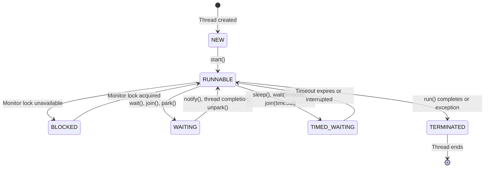

# Multithreading Concepts
## Lecture 30

**Java Programming (4343203)**  
Diploma in ICT - Semester IV  
Gujarat Technological University

<div class="pt-12">
  <span @click="$slidev.nav.next" class="px-2 py-1 rounded cursor-pointer" hover="bg-white bg-opacity-10">
    Press Space for next page <carbon:arrow-right class="inline"/>
  </span>
</div>

---
layout: default
---

# Learning Objectives

By the end of this lecture, you will be able to:

<v-clicks>

- 🧵 **Understand** the fundamental concepts of threads and multithreading
- 🔄 **Differentiate** between processes and threads in operating systems
- 📋 **Explain** the thread lifecycle and state transitions
- ⚡ **Identify** advantages and challenges of multithreading
- 🎯 **Recognize** multithreading scenarios and use cases
- 🔧 **Understand** concurrency vs parallelism concepts
- 🏗️ **Analyze** thread scheduling and context switching

</v-clicks>

---
layout: default
---

# What is Multithreading?

<div class="grid grid-cols-2 gap-6">

<div>

## Definition
**Multithreading** is the ability of a program to execute multiple threads concurrently within a single process, allowing different parts of the program to run simultaneously.

## Key Concepts

### Thread
- **Lightweight subprocess** that can execute concurrently
- **Shares memory** with other threads in the same process
- **Has its own stack** and program counter
- **Smallest unit** of execution scheduled by the OS

### Process vs Thread
```
Process = Program in execution
├── Memory Space (Code, Data, Heap)
├── System Resources (Files, Network)
└── Threads
    ├── Thread 1 (Main Thread)
    │   ├── Stack
    │   ├── Program Counter
    │   └── Registers
    ├── Thread 2
    │   ├── Stack  
    │   ├── Program Counter
    │   └── Registers
    └── Thread N...
```

## Real-world Analogy
Think of multithreading like a restaurant kitchen:

- **Process** = The entire kitchen
- **Threads** = Individual cooks working simultaneously
- **Shared Memory** = Common ingredients, equipment, orders
- **Private Stack** = Each cook's workspace and tools
- **Coordination** = Head chef managing the workflow

</div>

<div>

## Sequential vs Multithreaded Execution

### Sequential (Single-threaded) Execution
```java
public class SequentialExample {
    public static void main(String[] args) {
        System.out.println("Starting sequential execution");
        
        // Task 1: Calculate sum (takes time)
        long sum = 0;
        for (int i = 1; i <= 1000000; i++) {
            sum += i;
        }
        System.out.println("Sum calculated: " + sum);
        
        // Task 2: Print numbers (takes time) 
        for (int i = 1; i <= 5; i++) {
            System.out.println("Number: " + i);
            try { Thread.sleep(1000); } catch (InterruptedException e) {}
        }
        
        // Task 3: Download simulation (takes time)
        System.out.println("Simulating file download...");
        try { Thread.sleep(3000); } catch (InterruptedException e) {}
        System.out.println("Download completed");
        
        System.out.println("All tasks completed sequentially");
    }
}
// Total time: ~8 seconds (tasks run one after another)
```

### Multithreaded Execution
```java
public class MultithreadedExample {
    public static void main(String[] args) {
        System.out.println("Starting multithreaded execution");
        
        // Task 1: Calculate sum in separate thread
        Thread calculationThread = new Thread(() -> {
            long sum = 0;
            for (int i = 1; i <= 1000000; i++) {
                sum += i;
            }
            System.out.println("Sum calculated: " + sum);
        });
        
        // Task 2: Print numbers in separate thread
        Thread printingThread = new Thread(() -> {
            for (int i = 1; i <= 5; i++) {
                System.out.println("Number: " + i);
                try { Thread.sleep(1000); } catch (InterruptedException e) {}
            }
        });
        
        // Task 3: Download simulation in separate thread
        Thread downloadThread = new Thread(() -> {
            System.out.println("Simulating file download...");
            try { Thread.sleep(3000); } catch (InterruptedException e) {}
            System.out.println("Download completed");
        });
        
        // Start all threads (they run concurrently)
        calculationThread.start();
        printingThread.start();
        downloadThread.start();
        
        System.out.println("All tasks started concurrently");
    }
}
// Total time: ~3 seconds (tasks run simultaneously)
```

</div>

</div>

---
layout: default
---

# Process vs Thread

<div class="grid grid-cols-2 gap-6">

<div>

## Process Characteristics

### Definition
A **process** is a program in execution - an instance of a program loaded into memory and managed by the operating system.

### Process Features:
- **Separate Memory Space**: Each process has its own virtual address space
- **Independent Execution**: Processes run independently of each other
- **Resource Isolation**: Cannot directly access another process's memory
- **Communication**: Inter-Process Communication (IPC) required (pipes, shared memory, sockets)
- **Creation Overhead**: Creating new process is expensive
- **Protection**: OS provides strong isolation between processes

### Process Example:
```java
// Each Java application runs as a separate process
public class ProcessExample {
    public static void main(String[] args) {
        System.out.println("Process ID: " + ProcessHandle.current().pid());
        System.out.println("Available processors: " + 
                          Runtime.getRuntime().availableProcessors());
        
        // Launch another process
        try {
            ProcessBuilder pb = new ProcessBuilder("notepad.exe");
            Process process = pb.start();
            System.out.println("Started process: " + process.pid());
        } catch (IOException e) {
            System.out.println("Error starting process: " + e.getMessage());
        }
    }
}
```

### Process Memory Layout:
```
Process A Memory          Process B Memory
┌─────────────────┐      ┌─────────────────┐
│ Code Segment    │      │ Code Segment    │
│ Data Segment    │      │ Data Segment    │
│ Heap            │      │ Heap            │
│ Stack           │      │ Stack           │
└─────────────────┘      └─────────────────┘
     ↑                           ↑
Isolated - Cannot directly access each other
```

</div>

<div>

## Thread Characteristics

### Definition
A **thread** is a lightweight unit of execution within a process - multiple threads can exist within a single process.

### Thread Features:
- **Shared Memory Space**: All threads share the same memory space (heap)
- **Lightweight**: Creating threads is less expensive than processes
- **Fast Communication**: Threads communicate through shared memory
- **Independent Execution Flow**: Each thread has its own stack and program counter
- **Shared Resources**: Share file handles, network connections, etc.
- **Synchronization Needed**: Requires coordination to avoid conflicts

### Thread Example:
```java
public class ThreadExample {
    private static int sharedCounter = 0; // Shared by all threads
    
    public static void main(String[] args) {
        System.out.println("Main thread: " + Thread.currentThread().getName());
        
        // Create multiple threads that share memory
        for (int i = 1; i <= 3; i++) {
            Thread worker = new Thread(new Worker(i));
            worker.start();
        }
    }
    
    static class Worker implements Runnable {
        private int workerId;
        
        public Worker(int workerId) {
            this.workerId = workerId;
        }
        
        @Override
        public void run() {
            for (int i = 0; i < 5; i++) {
                // All threads can access sharedCounter
                synchronized (ThreadExample.class) {
                    sharedCounter++;
                    System.out.println("Worker " + workerId + 
                                     " incremented counter to: " + sharedCounter);
                }
                
                try { Thread.sleep(100); } catch (InterruptedException e) {}
            }
        }
    }
}
```

### Thread Memory Layout:
```
Single Process Memory
┌─────────────────────────────────────┐
│ Code Segment (Shared)               │
│ Data Segment (Shared)               │
│ Heap (Shared)                       │
├─────────────────────────────────────┤
│ Thread 1 Stack                      │
│ Thread 2 Stack                      │  
│ Thread 3 Stack                      │
│ ... (Each thread has own stack)     │
└─────────────────────────────────────┘
```

</div>

</div>

---
layout: default
---

# Thread Lifecycle and States

<div class="grid grid-cols-2 gap-6">

<div>

## Thread States in Java

### 1. **NEW**
Thread is created but not yet started
```java
Thread thread = new Thread(() -> System.out.println("Hello"));
// State: NEW
System.out.println("State: " + thread.getState()); // NEW
```

### 2. **RUNNABLE** 
Thread is executing or ready to execute
```java
thread.start(); // Moves to RUNNABLE
// State: RUNNABLE (executing or waiting for CPU time)
```

### 3. **BLOCKED**
Thread is blocked waiting for a monitor lock
```java
// Thread becomes BLOCKED when trying to enter synchronized block
// that's already locked by another thread
synchronized(someObject) {
    // If another thread holds this lock, current thread becomes BLOCKED
}
```

### 4. **WAITING**
Thread is waiting indefinitely for another thread
```java
// Causes thread to enter WAITING state
Object.wait();           // Wait for notify()
Thread.join();          // Wait for thread completion
LockSupport.park();     // Wait for unpark()
```

### 5. **TIMED_WAITING**
Thread is waiting for a specified period
```java
// Causes thread to enter TIMED_WAITING state
Thread.sleep(1000);           // Wait for 1 second
Object.wait(5000);           // Wait max 5 seconds
Thread.join(2000);           // Wait max 2 seconds for completion
```

### 6. **TERMINATED**
Thread has completed execution
```java
// Thread enters TERMINATED state when:
// - run() method completes normally
// - Thread throws an uncaught exception
```

</div>

<div>

## Thread State Transitions



## Thread State Example
```java
public class ThreadStateDemo {
    public static void main(String[] args) throws InterruptedException {
        Thread worker = new Thread(() -> {
            try {
                System.out.println("Worker thread started");
                
                // Simulate some work
                Thread.sleep(2000); // TIMED_WAITING
                
                synchronized (ThreadStateDemo.class) {
                    // Could become BLOCKED if lock not available
                    System.out.println("In synchronized block");
                    Thread.sleep(1000);
                }
                
                System.out.println("Worker thread finishing");
            } catch (InterruptedException e) {
                System.out.println("Worker interrupted");
            }
        });
        
        // Monitor thread states
        System.out.println("Before start: " + worker.getState()); // NEW
        
        worker.start();
        Thread.sleep(100);
        System.out.println("After start: " + worker.getState()); // RUNNABLE
        
        Thread.sleep(1000);
        System.out.println("During sleep: " + worker.getState()); // TIMED_WAITING
        
        worker.join(); // Wait for completion
        System.out.println("After completion: " + worker.getState()); // TERMINATED
    }
}
```

## State Monitoring Utility
```java
public class ThreadMonitor {
    public static void monitorThread(Thread thread, String name) {
        Thread monitor = new Thread(() -> {
            while (thread.isAlive()) {
                System.out.println(name + " state: " + thread.getState());
                try {
                    Thread.sleep(500);
                } catch (InterruptedException e) {
                    break;
                }
            }
            System.out.println(name + " final state: " + thread.getState());
        });
        
        monitor.setDaemon(true); // Dies when main thread dies
        monitor.start();
    }
}
```

</div>

</div>

---
layout: default
---

# Advantages of Multithreading

<div class="grid grid-cols-2 gap-6">

<div>

## 1. **Improved Performance**

### Parallel Execution
Multiple tasks can run simultaneously on multi-core systems:

```java
public class PerformanceExample {
    public static void main(String[] args) {
        long startTime = System.currentTimeMillis();
        
        // Sequential approach
        sequentialProcessing();
        long sequentialTime = System.currentTimeMillis() - startTime;
        
        startTime = System.currentTimeMillis();
        
        // Multithreaded approach  
        parallelProcessing();
        long parallelTime = System.currentTimeMillis() - startTime;
        
        System.out.println("Sequential time: " + sequentialTime + "ms");
        System.out.println("Parallel time: " + parallelTime + "ms");
        System.out.println("Speedup: " + (double)sequentialTime/parallelTime + "x");
    }
    
    private static void sequentialProcessing() {
        // Process 4 tasks sequentially
        for (int i = 1; i <= 4; i++) {
            processTask(i);
        }
    }
    
    private static void parallelProcessing() {
        Thread[] threads = new Thread[4];
        
        // Create and start 4 threads
        for (int i = 1; i <= 4; i++) {
            final int taskId = i;
            threads[i-1] = new Thread(() -> processTask(taskId));
            threads[i-1].start();
        }
        
        // Wait for all threads to complete
        for (Thread thread : threads) {
            try {
                thread.join();
            } catch (InterruptedException e) {
                Thread.currentThread().interrupt();
            }
        }
    }
    
    private static void processTask(int taskId) {
        // Simulate CPU-intensive work
        long sum = 0;
        for (int i = 0; i < 100000000; i++) {
            sum += i;
        }
        System.out.println("Task " + taskId + " completed, sum: " + sum);
    }
}
```

## 2. **Better Resource Utilization**

### CPU Utilization
```java
public class ResourceUtilizationExample {
    public static void main(String[] args) {
        int processors = Runtime.getRuntime().availableProcessors();
        System.out.println("Available processors: " + processors);
        
        // Create optimal number of threads
        Thread[] workers = new Thread[processors];
        
        for (int i = 0; i < processors; i++) {
            workers[i] = new Thread(new CPUIntensiveTask(i));
            workers[i].start();
        }
        
        // Monitor CPU usage
        Thread monitor = new Thread(() -> {
            for (int i = 0; i < 10; i++) {
                System.out.println("Active threads: " + 
                                 Thread.activeCount());
                try {
                    Thread.sleep(1000);
                } catch (InterruptedException e) {
                    break;
                }
            }
        });
        monitor.start();
    }
    
    static class CPUIntensiveTask implements Runnable {
        private int workerId;
        
        public CPUIntensiveTask(int workerId) {
            this.workerId = workerId;
        }
        
        @Override
        public void run() {
            System.out.println("Worker " + workerId + " started on thread: " + 
                             Thread.currentThread().getName());
            
            // CPU-intensive computation
            double result = 0;
            for (int i = 0; i < 1000000; i++) {
                result += Math.sin(i) * Math.cos(i);
            }
            
            System.out.println("Worker " + workerId + " completed, result: " + result);
        }
    }
}
```

</div>

<div>

## 3. **Improved User Experience**

### Responsive User Interfaces
```java
import javax.swing.*;
import java.awt.event.ActionEvent;
import java.awt.event.ActionListener;

public class ResponsiveUIExample {
    public static void main(String[] args) {
        SwingUtilities.invokeLater(() -> createAndShowGUI());
    }
    
    private static void createAndShowGUI() {
        JFrame frame = new JFrame("Multithreading UI Example");
        frame.setDefaultCloseOperation(JFrame.EXIT_ON_CLOSE);
        frame.setSize(400, 200);
        
        JButton processButton = new JButton("Start Long Process");
        JLabel statusLabel = new JLabel("Ready");
        JProgressBar progressBar = new JProgressBar(0, 100);
        
        // BAD: This would freeze the UI
        /*
        processButton.addActionListener(e -> {
            for (int i = 0; i <= 100; i++) {
                try { Thread.sleep(100); } catch (InterruptedException ex) {}
                progressBar.setValue(i);
                statusLabel.setText("Processing... " + i + "%");
            }
        });
        */
        
        // GOOD: Use separate thread for long-running tasks
        processButton.addActionListener(e -> {
            processButton.setEnabled(false);
            statusLabel.setText("Processing started...");
            
            // Background thread for heavy work
            Thread worker = new Thread(() -> {
                for (int i = 0; i <= 100; i++) {
                    final int progress = i;
                    try { 
                        Thread.sleep(100); // Simulate work
                    } catch (InterruptedException ex) {
                        return;
                    }
                    
                    // Update UI on Event Dispatch Thread
                    SwingUtilities.invokeLater(() -> {
                        progressBar.setValue(progress);
                        statusLabel.setText("Processing... " + progress + "%");
                        
                        if (progress == 100) {
                            statusLabel.setText("Completed!");
                            processButton.setEnabled(true);
                        }
                    });
                }
            });
            
            worker.start();
        });
        
        JPanel panel = new JPanel();
        panel.add(processButton);
        panel.add(statusLabel);
        panel.add(progressBar);
        
        frame.add(panel);
        frame.setVisible(true);
    }
}
```

## 4. **Better I/O Handling**

### Concurrent I/O Operations
```java
import java.io.*;
import java.net.*;
import java.util.concurrent.*;

public class ConcurrentIOExample {
    public static void main(String[] args) {
        // Download multiple files concurrently
        String[] urls = {
            "http://example.com/file1.txt",
            "http://example.com/file2.txt", 
            "http://example.com/file3.txt"
        };
        
        ExecutorService executor = Executors.newFixedThreadPool(3);
        CompletionService<String> completionService = 
            new ExecutorCompletionService<>(executor);
        
        // Submit download tasks
        for (String url : urls) {
            completionService.submit(new DownloadTask(url));
        }
        
        // Process results as they complete
        for (int i = 0; i < urls.length; i++) {
            try {
                Future<String> result = completionService.take();
                System.out.println("Download completed: " + result.get());
            } catch (Exception e) {
                System.out.println("Download failed: " + e.getMessage());
            }
        }
        
        executor.shutdown();
    }
    
    static class DownloadTask implements Callable<String> {
        private String url;
        
        public DownloadTask(String url) {
            this.url = url;
        }
        
        @Override
        public String call() throws Exception {
            System.out.println("Starting download: " + url + 
                             " on thread " + Thread.currentThread().getName());
            
            // Simulate network delay
            Thread.sleep((int)(Math.random() * 3000 + 1000));
            
            // Simulate download
            return url + " (Size: " + (int)(Math.random() * 1000 + 100) + "KB)";
        }
    }
}
```

</div>

</div>

---
layout: default
---

# Concurrency vs Parallelism

<div class="grid grid-cols-2 gap-6">

<div>

## Concurrency
**Concurrency** is about **dealing with** multiple tasks at once - tasks may not run simultaneously but appear to do so through time-slicing.

### Characteristics:
- **Single-core systems**: Tasks are interleaved
- **Time-slicing**: CPU switches between tasks rapidly
- **Appears simultaneous**: Users perceive tasks as running together
- **Task management**: Focus on coordinating multiple tasks

### Concurrency Example:
```java
public class ConcurrencyExample {
    public static void main(String[] args) {
        System.out.println("CPU cores: " + 
                          Runtime.getRuntime().availableProcessors());
        
        // Create more threads than CPU cores
        for (int i = 1; i <= 10; i++) {
            Thread worker = new Thread(new ConcurrentTask(i));
            worker.start();
        }
    }
    
    static class ConcurrentTask implements Runnable {
        private int taskId;
        
        public ConcurrentTask(int taskId) {
            this.taskId = taskId;
        }
        
        @Override
        public void run() {
            for (int i = 1; i <= 5; i++) {
                System.out.println("Task " + taskId + " - Step " + i + 
                                 " on thread " + Thread.currentThread().getName());
                
                // Simulate work and allow other threads to run
                try {
                    Thread.sleep(100);
                } catch (InterruptedException e) {
                    Thread.currentThread().interrupt();
                    return;
                }
            }
        }
    }
}

/* Output might look like (on single-core system):
Task 1 - Step 1 on thread Thread-1
Task 2 - Step 1 on thread Thread-2  
Task 3 - Step 1 on thread Thread-3
Task 1 - Step 2 on thread Thread-1
Task 4 - Step 1 on thread Thread-4
... (tasks interleaved by OS scheduler)
*/
```

### Concurrency Visualization:
```
Single Core Timeline:
Time: 0---1---2---3---4---5---6---7---8---9---10
Task A: [==]     [==]     [==]     [==]
Task B:     [==]     [==]     [==]     [==]
Task C:              [==]          [==]
```

</div>

<div>

## Parallelism
**Parallelism** is about **actually doing** multiple tasks simultaneously - requires multiple cores/processors.

### Characteristics:
- **Multi-core systems**: Tasks run simultaneously on different cores
- **True simultaneity**: Tasks execute at exactly the same time
- **Hardware dependent**: Requires multiple processing units
- **Performance focused**: Aimed at faster execution

### Parallelism Example:
```java
import java.util.concurrent.ForkJoinPool;
import java.util.concurrent.RecursiveTask;

public class ParallelismExample {
    public static void main(String[] args) {
        int[] array = new int[1000000];
        
        // Initialize array
        for (int i = 0; i < array.length; i++) {
            array[i] = i + 1;
        }
        
        // Sequential sum
        long startTime = System.nanoTime();
        long sequentialSum = sequentialSum(array);
        long sequentialTime = System.nanoTime() - startTime;
        
        // Parallel sum using Fork-Join framework
        startTime = System.nanoTime();
        ForkJoinPool pool = new ForkJoinPool();
        long parallelSum = pool.invoke(new ParallelSumTask(array, 0, array.length));
        long parallelTime = System.nanoTime() - startTime;
        
        System.out.println("Sequential sum: " + sequentialSum + 
                         " (Time: " + sequentialTime/1000000 + "ms)");
        System.out.println("Parallel sum: " + parallelSum + 
                         " (Time: " + parallelTime/1000000 + "ms)");
        System.out.println("Speedup: " + 
                         (double)sequentialTime/parallelTime + "x");
        
        pool.shutdown();
    }
    
    private static long sequentialSum(int[] array) {
        long sum = 0;
        for (int value : array) {
            sum += value;
        }
        return sum;
    }
    
    static class ParallelSumTask extends RecursiveTask<Long> {
        private final int[] array;
        private final int start;
        private final int end;
        private static final int THRESHOLD = 10000;
        
        public ParallelSumTask(int[] array, int start, int end) {
            this.array = array;
            this.start = start;
            this.end = end;
        }
        
        @Override
        protected Long compute() {
            if (end - start <= THRESHOLD) {
                // Small enough - compute directly
                long sum = 0;
                for (int i = start; i < end; i++) {
                    sum += array[i];
                }
                return sum;
            } else {
                // Split into subtasks
                int middle = (start + end) / 2;
                ParallelSumTask leftTask = new ParallelSumTask(array, start, middle);
                ParallelSumTask rightTask = new ParallelSumTask(array, middle, end);
                
                // Fork right task (runs on different core)
                rightTask.fork();
                
                // Compute left task on current core
                long leftResult = leftTask.compute();
                
                // Join right task result
                long rightResult = rightTask.join();
                
                return leftResult + rightResult;
            }
        }
    }
}
```

### Parallelism Visualization:
```
Multi-Core Timeline:
Time:   0---1---2---3---4---5
Core 1: [Task A - Part 1    ]
Core 2: [Task A - Part 2    ]
Core 3: [Task B - Complete  ]
Core 4: [Task C - Complete  ]
```

</div>

</div>

---
layout: default
---

# Multithreading Use Cases

<div class="grid grid-cols-2 gap-6">

<div>

## 1. **Web Server Applications**

### Handling Multiple Client Requests
```java
import java.io.*;
import java.net.*;
import java.util.concurrent.*;

public class MultiThreadedWebServer {
    private final int port;
    private final ExecutorService threadPool;
    private volatile boolean running = false;
    
    public MultiThreadedWebServer(int port) {
        this.port = port;
        this.threadPool = Executors.newFixedThreadPool(50); // Handle 50 concurrent clients
    }
    
    public void start() throws IOException {
        running = true;
        try (ServerSocket serverSocket = new ServerSocket(port)) {
            System.out.println("Server started on port " + port);
            
            while (running) {
                // Accept client connection
                Socket clientSocket = serverSocket.accept();
                
                // Handle each client in separate thread
                threadPool.submit(new ClientHandler(clientSocket));
            }
        }
    }
    
    private static class ClientHandler implements Runnable {
        private final Socket clientSocket;
        
        public ClientHandler(Socket clientSocket) {
            this.clientSocket = clientSocket;
        }
        
        @Override
        public void run() {
            String threadName = Thread.currentThread().getName();
            System.out.println("Handling client on thread: " + threadName);
            
            try (BufferedReader in = new BufferedReader(
                    new InputStreamReader(clientSocket.getInputStream()));
                 PrintWriter out = new PrintWriter(
                    clientSocket.getOutputStream(), true)) {
                
                // Read client request
                String request = in.readLine();
                System.out.println("Request from client: " + request);
                
                // Simulate processing time
                Thread.sleep(2000);
                
                // Send response
                out.println("HTTP/1.1 200 OK");
                out.println("Content-Type: text/html");
                out.println("");
                out.println("<html><body>");
                out.println("<h1>Hello from thread: " + threadName + "</h1>");
                out.println("<p>Your request: " + request + "</p>");
                out.println("</body></html>");
                
                System.out.println("Response sent to client on thread: " + threadName);
                
            } catch (IOException | InterruptedException e) {
                System.err.println("Error handling client: " + e.getMessage());
            } finally {
                try {
                    clientSocket.close();
                } catch (IOException e) {
                    System.err.println("Error closing client socket: " + e.getMessage());
                }
            }
        }
    }
    
    public void stop() {
        running = false;
        threadPool.shutdown();
        try {
            if (!threadPool.awaitTermination(60, TimeUnit.SECONDS)) {
                threadPool.shutdownNow();
            }
        } catch (InterruptedException e) {
            threadPool.shutdownNow();
        }
    }
    
    public static void main(String[] args) {
        MultiThreadedWebServer server = new MultiThreadedWebServer(8080);
        try {
            server.start();
        } catch (IOException e) {
            System.err.println("Server error: " + e.getMessage());
        }
    }
}
```

</div>

<div>

## 2. **File Processing Applications**

### Concurrent File Processing
```java
import java.io.*;
import java.nio.file.*;
import java.util.concurrent.*;
import java.util.stream.Stream;

public class ConcurrentFileProcessor {
    private final ExecutorService executor;
    private final String inputDirectory;
    private final String outputDirectory;
    
    public ConcurrentFileProcessor(String inputDir, String outputDir) {
        this.inputDirectory = inputDir;
        this.outputDirectory = outputDir;
        this.executor = Executors.newFixedThreadPool(
            Runtime.getRuntime().availableProcessors());
    }
    
    public void processAllFiles() {
        try {
            // Create output directory if it doesn't exist
            Files.createDirectories(Paths.get(outputDirectory));
            
            // Get all files to process
            try (Stream<Path> files = Files.walk(Paths.get(inputDirectory))) {
                CompletionService<String> completionService = 
                    new ExecutorCompletionService<>(executor);
                
                // Submit processing tasks for each file
                long fileCount = files
                    .filter(Files::isRegularFile)
                    .filter(path -> path.toString().endsWith(".txt"))
                    .mapToLong(path -> {
                        completionService.submit(new FileProcessingTask(path));
                        return 1;
                    }).sum();
                
                System.out.println("Processing " + fileCount + " files concurrently...");
                
                // Collect results as they complete
                for (int i = 0; i < fileCount; i++) {
                    try {
                        Future<String> result = completionService.take();
                        System.out.println("Completed: " + result.get());
                    } catch (Exception e) {
                        System.err.println("Task failed: " + e.getMessage());
                    }
                }
                
            }
        } catch (IOException e) {
            System.err.println("Error accessing files: " + e.getMessage());
        } finally {
            executor.shutdown();
        }
    }
    
    private class FileProcessingTask implements Callable<String> {
        private final Path inputFile;
        
        public FileProcessingTask(Path inputFile) {
            this.inputFile = inputFile;
        }
        
        @Override
        public String call() throws Exception {
            String threadName = Thread.currentThread().getName();
            String fileName = inputFile.getFileName().toString();
            
            System.out.println("Processing " + fileName + " on " + threadName);
            
            // Read input file
            String content = Files.readString(inputFile);
            
            // Simulate processing (convert to uppercase, count words, etc.)
            String processedContent = processContent(content);
            
            // Write to output file
            Path outputFile = Paths.get(outputDirectory, "processed_" + fileName);
            Files.writeString(outputFile, processedContent);
            
            return fileName + " -> " + outputFile.getFileName() + 
                   " (processed by " + threadName + ")";
        }
        
        private String processContent(String content) throws InterruptedException {
            // Simulate CPU-intensive processing
            Thread.sleep(1000 + (int)(Math.random() * 2000));
            
            // Process content
            String[] words = content.split("\\s+");
            StringBuilder result = new StringBuilder();
            result.append("PROCESSED FILE\n");
            result.append("=============\n");
            result.append("Word count: ").append(words.length).append("\n");
            result.append("Character count: ").append(content.length()).append("\n");
            result.append("Processed by thread: ").append(Thread.currentThread().getName()).append("\n\n");
            result.append("UPPERCASE CONTENT:\n");
            result.append(content.toUpperCase());
            
            return result.toString();
        }
    }
    
    public static void main(String[] args) {
        ConcurrentFileProcessor processor = new ConcurrentFileProcessor(
            "input_files", "output_files");
        
        long startTime = System.currentTimeMillis();
        processor.processAllFiles();
        long endTime = System.currentTimeMillis();
        
        System.out.println("Total processing time: " + (endTime - startTime) + "ms");
    }
}
```

</div>

</div>

---
layout: default
---

# Thread Scheduling and Context Switching

<div class="grid grid-cols-2 gap-6">

<div>

## Thread Scheduling

### What is Thread Scheduling?
**Thread scheduling** is the process by which the operating system decides which thread gets to run on the CPU at any given time.

### Types of Scheduling:

#### 1. **Preemptive Scheduling**
- OS can interrupt running threads
- Time-slicing: each thread gets CPU for fixed time
- Higher priority threads can preempt lower priority ones

#### 2. **Cooperative Scheduling**  
- Threads voluntarily yield CPU control
- Thread runs until it blocks or explicitly yields
- Less common in modern systems

### Java Thread Priorities
```java
public class ThreadPriorityExample {
    public static void main(String[] args) {
        Thread lowPriorityThread = new Thread(new CountingTask("Low Priority"));
        Thread normalPriorityThread = new Thread(new CountingTask("Normal Priority"));
        Thread highPriorityThread = new Thread(new CountingTask("High Priority"));
        
        // Set thread priorities
        lowPriorityThread.setPriority(Thread.MIN_PRIORITY);    // 1
        normalPriorityThread.setPriority(Thread.NORM_PRIORITY); // 5
        highPriorityThread.setPriority(Thread.MAX_PRIORITY);   // 10
        
        System.out.println("Thread priorities:");
        System.out.println("Low: " + lowPriorityThread.getPriority());
        System.out.println("Normal: " + normalPriorityThread.getPriority());
        System.out.println("High: " + highPriorityThread.getPriority());
        
        // Start threads
        lowPriorityThread.start();
        normalPriorityThread.start();
        highPriorityThread.start();
        
        // Let them run for 3 seconds
        try {
            Thread.sleep(3000);
        } catch (InterruptedException e) {
            Thread.currentThread().interrupt();
        }
        
        // Stop all threads
        CountingTask.stop();
    }
    
    static class CountingTask implements Runnable {
        private String name;
        private static volatile boolean running = true;
        
        public CountingTask(String name) {
            this.name = name;
        }
        
        @Override
        public void run() {
            long count = 0;
            while (running) {
                count++;
                
                // Print progress occasionally
                if (count % 1000000 == 0) {
                    System.out.println(name + " thread count: " + count + 
                                     " (Priority: " + Thread.currentThread().getPriority() + ")");
                }
            }
            
            System.out.println(name + " final count: " + count);
        }
        
        public static void stop() {
            running = false;
        }
    }
}
```

</div>

<div>

## Context Switching

### What is Context Switching?
**Context switching** is the process of saving and restoring thread state when the CPU switches from executing one thread to another.

### Context Switch Process:
1. **Save Current Thread State**:
   - Program counter (PC)
   - CPU registers
   - Stack pointer
   - Thread-specific data

2. **Load New Thread State**:
   - Restore program counter
   - Restore CPU registers  
   - Switch to new thread's stack
   - Update memory mappings if needed

3. **Resume Execution**:
   - Continue from where new thread left off

### Context Switch Overhead
```java
public class ContextSwitchDemo {
    private static final int ITERATIONS = 1000000;
    private static volatile boolean flag = false;
    
    public static void main(String[] args) throws InterruptedException {
        // Demonstrate context switching overhead
        
        // Test 1: Single thread (no context switching)
        long startTime = System.nanoTime();
        singleThreadWork();
        long singleThreadTime = System.nanoTime() - startTime;
        
        // Test 2: Two threads with frequent context switches
        startTime = System.nanoTime();
        twoThreadWork();
        long twoThreadTime = System.nanoTime() - startTime;
        
        System.out.println("Single thread time: " + singleThreadTime/1000000 + "ms");
        System.out.println("Two thread time: " + twoThreadTime/1000000 + "ms");
        System.out.println("Overhead factor: " + (double)twoThreadTime/singleThreadTime);
    }
    
    private static void singleThreadWork() {
        int count = 0;
        for (int i = 0; i < ITERATIONS; i++) {
            count = (count + 1) % 1000;
        }
        System.out.println("Single thread final count: " + count);
    }
    
    private static void twoThreadWork() throws InterruptedException {
        Thread thread1 = new Thread(new PingPongTask("Thread1"));
        Thread thread2 = new Thread(new PingPongTask("Thread2"));
        
        thread1.start();
        thread2.start();
        
        thread1.join();
        thread2.join();
    }
    
    static class PingPongTask implements Runnable {
        private String name;
        
        public PingPongTask(String name) {
            this.name = name;
        }
        
        @Override
        public void run() {
            int count = 0;
            for (int i = 0; i < ITERATIONS / 2; i++) {
                // Force context switches by yielding
                if (i % 100 == 0) {
                    Thread.yield();
                }
                count = (count + 1) % 1000;
            }
            System.out.println(name + " final count: " + count);
        }
    }
}
```

### Minimizing Context Switches
```java
public class ContextSwitchOptimization {
    public static void main(String[] args) throws InterruptedException {
        System.out.println("Demonstrating context switch optimization...");
        
        // Bad: Frequent synchronization causing context switches
        long startTime = System.currentTimeMillis();
        frequentSynchronization();
        long badTime = System.currentTimeMillis() - startTime;
        
        // Good: Batch operations to reduce context switches
        startTime = System.currentTimeMillis();
        batchedOperations();
        long goodTime = System.currentTimeMillis() - startTime;
        
        System.out.println("Frequent sync time: " + badTime + "ms");
        System.out.println("Batched operations time: " + goodTime + "ms");
        System.out.println("Improvement: " + (double)badTime/goodTime + "x");
    }
    
    private static void frequentSynchronization() throws InterruptedException {
        final Object lock = new Object();
        final int[] counter = {0};
        
        Thread[] threads = new Thread[4];
        
        for (int i = 0; i < 4; i++) {
            threads[i] = new Thread(() -> {
                for (int j = 0; j < 10000; j++) {
                    synchronized (lock) {
                        counter[0]++; // Frequent lock contention
                    }
                }
            });
            threads[i].start();
        }
        
        for (Thread thread : threads) {
            thread.join();
        }
        
        System.out.println("Frequent sync counter: " + counter[0]);
    }
    
    private static void batchedOperations() throws InterruptedException {
        final Object lock = new Object();
        final int[] counter = {0};
        
        Thread[] threads = new Thread[4];
        
        for (int i = 0; i < 4; i++) {
            threads[i] = new Thread(() -> {
                int localCount = 0;
                
                // Batch work locally
                for (int j = 0; j < 10000; j++) {
                    localCount++;
                }
                
                // Single synchronization per thread
                synchronized (lock) {
                    counter[0] += localCount;
                }
            });
            threads[i].start();
        }
        
        for (Thread thread : threads) {
            thread.join();
        }
        
        System.out.println("Batched operations counter: " + counter[0]);
    }
}
```

</div>

</div>

---
layout: default
---

# Challenges and Considerations

<div class="grid grid-cols-2 gap-6">

<div>

## 1. **Race Conditions**

### What is a Race Condition?
A **race condition** occurs when multiple threads access shared data concurrently, and the final result depends on the timing of their execution.

```java
public class RaceConditionExample {
    private static int counter = 0;
    
    public static void main(String[] args) throws InterruptedException {
        Thread[] threads = new Thread[10];
        
        // Create 10 threads that increment counter
        for (int i = 0; i < 10; i++) {
            threads[i] = new Thread(() -> {
                for (int j = 0; j < 1000; j++) {
                    counter++; // Race condition: non-atomic operation
                }
            });
        }
        
        // Start all threads
        for (Thread thread : threads) {
            thread.start();
        }
        
        // Wait for all threads to complete
        for (Thread thread : threads) {
            thread.join();
        }
        
        System.out.println("Expected result: 10000");
        System.out.println("Actual result: " + counter);
        System.out.println("Data lost due to race condition: " + (10000 - counter));
    }
}

/* Possible output (varies each run):
Expected result: 10000
Actual result: 7834
Data lost due to race condition: 2166
*/
```

### Why Race Conditions Occur:
```java
// The counter++ operation is actually three steps:
// 1. Read current value of counter
// 2. Add 1 to the value  
// 3. Write new value back to counter

// Thread execution timeline:
// Time | Thread A | Thread B | Counter Value
//   1  | Read(5)  |          | 5
//   2  |          | Read(5)  | 5
//   3  | Add 1(6) |          | 5
//   4  |          | Add 1(6) | 5  
//   5  | Write(6) |          | 6
//   6  |          | Write(6) | 6 (Should be 7!)

// Solution: Synchronization
public class FixedRaceCondition {
    private static int counter = 0;
    private static final Object lock = new Object();
    
    public static void increment() {
        synchronized (lock) {
            counter++; // Now atomic
        }
    }
}
```

## 2. **Deadlocks**

### What is a Deadlock?
A **deadlock** occurs when two or more threads are blocked forever, waiting for each other to release resources.

```java
public class DeadlockExample {
    private static final Object lock1 = new Object();
    private static final Object lock2 = new Object();
    
    public static void main(String[] args) {
        Thread thread1 = new Thread(() -> {
            synchronized (lock1) {
                System.out.println("Thread 1: Holding lock1...");
                
                try { Thread.sleep(100); } catch (InterruptedException e) {}
                
                System.out.println("Thread 1: Waiting for lock2...");
                synchronized (lock2) { // Will wait forever
                    System.out.println("Thread 1: Got both locks!");
                }
            }
        });
        
        Thread thread2 = new Thread(() -> {
            synchronized (lock2) {
                System.out.println("Thread 2: Holding lock2...");
                
                try { Thread.sleep(100); } catch (InterruptedException e) {}
                
                System.out.println("Thread 2: Waiting for lock1...");
                synchronized (lock1) { // Will wait forever
                    System.out.println("Thread 2: Got both locks!");
                }
            }
        });
        
        thread1.start();
        thread2.start();
        
        // Threads will deadlock - program hangs
    }
}
```

</div>

<div>

## 3. **Thread Safety Issues**

### Non-thread-safe Collections
```java
import java.util.*;
import java.util.concurrent.*;

public class ThreadSafetyExample {
    public static void main(String[] args) throws InterruptedException {
        // Unsafe: ArrayList is not thread-safe
        demonstrateUnsafeCollection();
        
        // Safe: Using thread-safe alternatives
        demonstrateSafeCollection();
    }
    
    private static void demonstrateUnsafeCollection() throws InterruptedException {
        List<Integer> unsafeList = new ArrayList<>();
        Thread[] threads = new Thread[10];
        
        for (int i = 0; i < 10; i++) {
            final int threadId = i;
            threads[i] = new Thread(() -> {
                for (int j = 0; j < 1000; j++) {
                    unsafeList.add(threadId * 1000 + j);
                }
            });
        }
        
        for (Thread thread : threads) {
            thread.start();
        }
        
        for (Thread thread : threads) {
            thread.join();
        }
        
        System.out.println("Unsafe list size: " + unsafeList.size() + 
                         " (expected: 10000)");
        // Size might be less than 10000 due to race conditions
    }
    
    private static void demonstrateSafeCollection() throws InterruptedException {
        // Option 1: Synchronized collection
        List<Integer> synchronizedList = Collections.synchronizedList(new ArrayList<>());
        
        // Option 2: Concurrent collection
        List<Integer> concurrentList = new CopyOnWriteArrayList<>();
        
        // Option 3: Manual synchronization
        List<Integer> manualSyncList = new ArrayList<>();
        Object lock = new Object();
        
        Thread[] threads = new Thread[10];
        
        for (int i = 0; i < 10; i++) {
            final int threadId = i;
            threads[i] = new Thread(() -> {
                for (int j = 0; j < 100; j++) {
                    // Safe operations
                    synchronizedList.add(threadId * 100 + j);
                    concurrentList.add(threadId * 100 + j);
                    
                    synchronized (lock) {
                        manualSyncList.add(threadId * 100 + j);
                    }
                }
            });
        }
        
        for (Thread thread : threads) {
            thread.start();
        }
        
        for (Thread thread : threads) {
            thread.join();
        }
        
        System.out.println("Synchronized list size: " + synchronizedList.size());
        System.out.println("Concurrent list size: " + concurrentList.size());
        System.out.println("Manual sync list size: " + manualSyncList.size());
    }
}
```

## 4. **Performance Overhead**

### Thread Creation Overhead
```java
public class ThreadOverheadExample {
    public static void main(String[] args) {
        // Compare thread creation vs thread pool
        
        // Test 1: Creating new threads each time (expensive)
        long startTime = System.currentTimeMillis();
        createNewThreads(1000);
        long newThreadTime = System.currentTimeMillis() - startTime;
        
        // Test 2: Using thread pool (efficient)
        startTime = System.currentTimeMillis();
        useThreadPool(1000);
        long threadPoolTime = System.currentTimeMillis() - startTime;
        
        System.out.println("New threads time: " + newThreadTime + "ms");
        System.out.println("Thread pool time: " + threadPoolTime + "ms");
        System.out.println("Thread pool is " + (double)newThreadTime/threadPoolTime + 
                         "x faster");
    }
    
    private static void createNewThreads(int taskCount) {
        for (int i = 0; i < taskCount; i++) {
            Thread thread = new Thread(() -> {
                // Simulate light work
                int sum = 0;
                for (int j = 0; j < 1000; j++) {
                    sum += j;
                }
            });
            thread.start();
            
            try {
                thread.join(); // Wait for completion
            } catch (InterruptedException e) {
                Thread.currentThread().interrupt();
            }
        }
    }
    
    private static void useThreadPool(int taskCount) {
        ExecutorService executor = Executors.newFixedThreadPool(10);
        
        for (int i = 0; i < taskCount; i++) {
            executor.submit(() -> {
                // Simulate same light work
                int sum = 0;
                for (int j = 0; j < 1000; j++) {
                    sum += j;
                }
            });
        }
        
        executor.shutdown();
        try {
            executor.awaitTermination(Long.MAX_VALUE, TimeUnit.NANOSECONDS);
        } catch (InterruptedException e) {
            Thread.currentThread().interrupt();
        }
    }
}
```

</div>

</div>

---
layout: default
---

# Hands-on Exercise 1: Producer-Consumer Simulation

<div class="grid grid-cols-2 gap-6">

<div>

## Task: Build Producer-Consumer System
Create a multithreaded system where producers generate data and consumers process it:

```java
// TODO: Implement shared buffer
public class SharedBuffer {
    private Queue<Integer> buffer;
    private int capacity;
    
    public SharedBuffer(int capacity) {
        // Initialize buffer with capacity limit
    }
    
    // TODO: Thread-safe method to add item
    public synchronized void produce(int item) throws InterruptedException {
        // Wait if buffer is full
        // Add item to buffer
        // Notify waiting consumers
    }
    
    // TODO: Thread-safe method to remove item
    public synchronized int consume() throws InterruptedException {
        // Wait if buffer is empty
        // Remove and return item from buffer
        // Notify waiting producers
        return 0;
    }
    
    public synchronized int size() {
        return buffer.size();
    }
    
    public synchronized boolean isEmpty() {
        return buffer.isEmpty();
    }
    
    public synchronized boolean isFull() {
        return buffer.size() >= capacity;
    }
}

// TODO: Implement Producer thread
public class Producer implements Runnable {
    private SharedBuffer buffer;
    private int id;
    private int itemsToProducer;
    
    public Producer(SharedBuffer buffer, int id, int itemsToProducer) {
        // Initialize producer
    }
    
    @Override
    public void run() {
        // Produce items and add to buffer
        // Handle interruptions properly
        // Log production activities
    }
}

// TODO: Implement Consumer thread  
public class Consumer implements Runnable {
    private SharedBuffer buffer;
    private int id;
    private int itemsToConsume;
    
    public Consumer(SharedBuffer buffer, int id, int itemsToConsume) {
        // Initialize consumer
    }
    
    @Override
    public void run() {
        // Consume items from buffer
        // Handle interruptions properly
        // Log consumption activities
    }
}

// TODO: Implement main simulation
public class ProducerConsumerSimulation {
    public static void main(String[] args) {
        // Create shared buffer
        // Create multiple producer threads
        // Create multiple consumer threads
        // Start all threads
        // Monitor and display statistics
        // Handle graceful shutdown
    }
}
```

**Requirements:**
- Handle buffer full/empty conditions properly
- Implement proper thread synchronization
- Add comprehensive logging and statistics
- Handle thread interruption gracefully
- Show real-time statistics (items produced/consumed, buffer size)

</div>

<div>

## Solution Framework

```java
import java.util.*;
import java.util.concurrent.atomic.AtomicInteger;

public class SharedBuffer {
    private final Queue<Integer> buffer = new LinkedList<>();
    private final int capacity;
    private final AtomicInteger totalProduced = new AtomicInteger(0);
    private final AtomicInteger totalConsumed = new AtomicInteger(0);
    
    public SharedBuffer(int capacity) {
        this.capacity = capacity;
    }
    
    public synchronized void produce(int item) throws InterruptedException {
        // Wait while buffer is full
        while (buffer.size() >= capacity) {
            System.out.println("Buffer full, producer waiting...");
            wait(); // Release lock and wait
        }
        
        buffer.offer(item);
        totalProduced.incrementAndGet();
        System.out.println("Produced: " + item + ", Buffer size: " + buffer.size());
        
        notifyAll(); // Notify waiting consumers
    }
    
    public synchronized int consume() throws InterruptedException {
        // Wait while buffer is empty
        while (buffer.isEmpty()) {
            System.out.println("Buffer empty, consumer waiting...");
            wait(); // Release lock and wait
        }
        
        int item = buffer.poll();
        totalConsumed.incrementAndGet();
        System.out.println("Consumed: " + item + ", Buffer size: " + buffer.size());
        
        notifyAll(); // Notify waiting producers
        return item;
    }
    
    public synchronized int size() { return buffer.size(); }
    public int getTotalProduced() { return totalProduced.get(); }
    public int getTotalConsumed() { return totalConsumed.get(); }
}

public class Producer implements Runnable {
    private final SharedBuffer buffer;
    private final int id;
    private final int itemsToProducer;
    private final Random random = new Random();
    
    public Producer(SharedBuffer buffer, int id, int itemsToProducer) {
        this.buffer = buffer;
        this.id = id;
        this.itemsToProducer = itemsToProducer;
    }
    
    @Override
    public void run() {
        try {
            for (int i = 1; i <= itemsToProducer; i++) {
                int item = id * 1000 + i; // Unique item ID
                buffer.produce(item);
                
                // Random production delay
                Thread.sleep(random.nextInt(100) + 50);
            }
            
            System.out.println("Producer " + id + " finished producing " + 
                             itemsToProducer + " items");
                             
        } catch (InterruptedException e) {
            System.out.println("Producer " + id + " interrupted");
            Thread.currentThread().interrupt();
        }
    }
}

public class Consumer implements Runnable {
    private final SharedBuffer buffer;
    private final int id;
    private final int itemsToConsume;
    private final Random random = new Random();
    
    public Consumer(SharedBuffer buffer, int id, int itemsToConsume) {
        this.buffer = buffer;
        this.id = id;
        this.itemsToConsume = itemsToConsume;
    }
    
    @Override
    public void run() {
        try {
            for (int i = 1; i <= itemsToConsume; i++) {
                int item = buffer.consume();
                
                // Simulate processing time
                Thread.sleep(random.nextInt(150) + 75);
            }
            
            System.out.println("Consumer " + id + " finished consuming " + 
                             itemsToConsume + " items");
                             
        } catch (InterruptedException e) {
            System.out.println("Consumer " + id + " interrupted");
            Thread.currentThread().interrupt();
        }
    }
}

public class ProducerConsumerSimulation {
    public static void main(String[] args) throws InterruptedException {
        SharedBuffer buffer = new SharedBuffer(10); // Buffer capacity: 10
        
        // Create producer threads
        Thread[] producers = new Thread[3];
        for (int i = 0; i < 3; i++) {
            producers[i] = new Thread(new Producer(buffer, i + 1, 20));
            producers[i].setName("Producer-" + (i + 1));
        }
        
        // Create consumer threads
        Thread[] consumers = new Thread[2];
        for (int i = 0; i < 2; i++) {
            consumers[i] = new Thread(new Consumer(buffer, i + 1, 30));
            consumers[i].setName("Consumer-" + (i + 1));
        }
        
        // Start statistics monitor
        Thread monitor = new Thread(() -> {
            while (!Thread.currentThread().isInterrupted()) {
                try {
                    Thread.sleep(2000);
                    System.out.println("\n=== STATISTICS ===");
                    System.out.println("Buffer size: " + buffer.size());
                    System.out.println("Total produced: " + buffer.getTotalProduced());
                    System.out.println("Total consumed: " + buffer.getTotalConsumed());
                    System.out.println("==================\n");
                } catch (InterruptedException e) {
                    break;
                }
            }
        });
        monitor.setDaemon(true);
        monitor.start();
        
        // Start all threads
        for (Thread producer : producers) {
            producer.start();
        }
        
        for (Thread consumer : consumers) {
            consumer.start();
        }
        
        // Wait for completion
        for (Thread producer : producers) {
            producer.join();
        }
        
        for (Thread consumer : consumers) {
            consumer.join();
        }
        
        // Final statistics
        System.out.println("\n=== FINAL STATISTICS ===");
        System.out.println("Total produced: " + buffer.getTotalProduced());
        System.out.println("Total consumed: " + buffer.getTotalConsumed());
        System.out.println("Remaining in buffer: " + buffer.size());
    }
}
```

</div>

</div>

---
layout: default
---

# Hands-on Exercise 2: Download Manager

<div class="grid grid-cols-2 gap-6">

<div>

## Task: Build Multithreaded Download Manager
Create a download manager that can download multiple files concurrently:

```java
// TODO: Implement Download task
public class DownloadTask implements Callable<DownloadResult> {
    private String url;
    private String fileName;
    private String downloadDirectory;
    
    public DownloadTask(String url, String fileName, String downloadDirectory) {
        // Initialize download task
    }
    
    @Override
    public DownloadResult call() throws Exception {
        // Simulate file download
        // Show download progress
        // Handle download errors
        // Return download result
        return null;
    }
    
    private void simulateDownload(String fileName, long fileSize) {
        // Simulate downloading with progress updates
    }
}

// TODO: Implement Download result
public class DownloadResult {
    private String fileName;
    private boolean success;
    private long fileSize;
    private long downloadTime;
    private String errorMessage;
    
    // Constructor, getters, setters
}

// TODO: Implement Download manager
public class DownloadManager {
    private ExecutorService executor;
    private CompletionService<DownloadResult> completionService;
    
    public DownloadManager(int maxConcurrentDownloads) {
        // Initialize thread pool and completion service
    }
    
    public void addDownload(String url, String fileName) {
        // Add download task to queue
    }
    
    public void startDownloads() {
        // Process all downloads concurrently
        // Show overall progress
        // Handle completed downloads
    }
    
    public void shutdown() {
        // Graceful shutdown of download manager
    }
}

// TODO: Implement main application
public class DownloadManagerApp {
    public static void main(String[] args) {
        // Create download manager
        // Add multiple download tasks
        // Start downloads
        // Show progress and statistics
        // Handle user input (pause, cancel, etc.)
    }
}
```

**Requirements:**
- Support concurrent downloads with configurable thread count
- Show individual download progress and overall progress
- Handle download failures gracefully
- Provide download statistics (speed, time, success rate)
- Support pause/resume functionality
- Implement proper resource cleanup

</div>

<div>

## Solution Implementation

```java
import java.util.concurrent.*;
import java.util.concurrent.atomic.AtomicInteger;
import java.util.concurrent.atomic.AtomicLong;
import java.util.*;

public class DownloadTask implements Callable<DownloadResult> {
    private final String url;
    private final String fileName;
    private final String downloadDirectory;
    private static final Random random = new Random();
    
    public DownloadTask(String url, String fileName, String downloadDirectory) {
        this.url = url;
        this.fileName = fileName;
        this.downloadDirectory = downloadDirectory;
    }
    
    @Override
    public DownloadResult call() throws Exception {
        long startTime = System.currentTimeMillis();
        String threadName = Thread.currentThread().getName();
        
        try {
            System.out.println("Starting download: " + fileName + " on " + threadName);
            
            // Simulate random file size (1MB to 100MB)
            long fileSize = (long)(Math.random() * 100_000_000 + 1_000_000);
            
            // Simulate potential download failure (10% chance)
            if (random.nextDouble() < 0.1) {
                throw new Exception("Network error: Connection timeout");
            }
            
            // Simulate download with progress
            simulateDownload(fileName, fileSize);
            
            long downloadTime = System.currentTimeMillis() - startTime;
            
            System.out.println("Completed download: " + fileName + 
                             " (" + formatFileSize(fileSize) + " in " + downloadTime + "ms)");
            
            return new DownloadResult(fileName, true, fileSize, downloadTime, null);
            
        } catch (Exception e) {
            long downloadTime = System.currentTimeMillis() - startTime;
            System.err.println("Failed download: " + fileName + " - " + e.getMessage());
            
            return new DownloadResult(fileName, false, 0, downloadTime, e.getMessage());
        }
    }
    
    private void simulateDownload(String fileName, long fileSize) throws InterruptedException {
        long downloaded = 0;
        long chunkSize = fileSize / 20; // 20 progress updates
        
        while (downloaded < fileSize) {
            // Simulate network delay
            Thread.sleep(100 + random.nextInt(200));
            
            downloaded = Math.min(downloaded + chunkSize, fileSize);
            int progress = (int)((downloaded * 100) / fileSize);
            
            System.out.printf("  %s: %d%% (%s/%s)%n", 
                            fileName, progress, 
                            formatFileSize(downloaded), formatFileSize(fileSize));
        }
    }
    
    private String formatFileSize(long bytes) {
        if (bytes >= 1_000_000) {
            return String.format("%.1fMB", bytes / 1_000_000.0);
        } else if (bytes >= 1_000) {
            return String.format("%.1fKB", bytes / 1_000.0);
        } else {
            return bytes + "B";
        }
    }
}

public class DownloadResult {
    private final String fileName;
    private final boolean success;
    private final long fileSize;
    private final long downloadTime;
    private final String errorMessage;
    
    public DownloadResult(String fileName, boolean success, long fileSize, 
                         long downloadTime, String errorMessage) {
        this.fileName = fileName;
        this.success = success;
        this.fileSize = fileSize;
        this.downloadTime = downloadTime;
        this.errorMessage = errorMessage;
    }
    
    // Getters
    public String getFileName() { return fileName; }
    public boolean isSuccess() { return success; }
    public long getFileSize() { return fileSize; }
    public long getDownloadTime() { return downloadTime; }
    public String getErrorMessage() { return errorMessage; }
    
    public double getDownloadSpeed() {
        if (downloadTime == 0 || !success) return 0;
        return (fileSize / 1024.0 / 1024.0) / (downloadTime / 1000.0); // MB/s
    }
}

public class DownloadManager {
    private final ExecutorService executor;
    private final CompletionService<DownloadResult> completionService;
    private final List<DownloadTask> downloadTasks;
    private final AtomicInteger completedDownloads = new AtomicInteger(0);
    private final AtomicInteger successfulDownloads = new AtomicInteger(0);
    private final AtomicLong totalBytesDownloaded = new AtomicLong(0);
    
    public DownloadManager(int maxConcurrentDownloads) {
        this.executor = Executors.newFixedThreadPool(maxConcurrentDownloads);
        this.completionService = new ExecutorCompletionService<>(executor);
        this.downloadTasks = new ArrayList<>();
    }
    
    public void addDownload(String url, String fileName) {
        downloadTasks.add(new DownloadTask(url, fileName, "downloads/"));
        System.out.println("Added to download queue: " + fileName);
    }
    
    public void startDownloads() {
        if (downloadTasks.isEmpty()) {
            System.out.println("No downloads in queue");
            return;
        }
        
        System.out.println("Starting " + downloadTasks.size() + " downloads...");
        
        // Submit all download tasks
        for (DownloadTask task : downloadTasks) {
            completionService.submit(task);
        }
        
        // Start progress monitor
        Thread progressMonitor = createProgressMonitor();
        progressMonitor.start();
        
        // Process completed downloads
        List<DownloadResult> results = new ArrayList<>();
        
        for (int i = 0; i < downloadTasks.size(); i++) {
            try {
                Future<DownloadResult> future = completionService.take();
                DownloadResult result = future.get();
                results.add(result);
                
                completedDownloads.incrementAndGet();
                
                if (result.isSuccess()) {
                    successfulDownloads.incrementAndGet();
                    totalBytesDownloaded.addAndGet(result.getFileSize());
                }
                
            } catch (InterruptedException | ExecutionException e) {
                System.err.println("Error processing download result: " + e.getMessage());
            }
        }
        
        // Stop progress monitor
        progressMonitor.interrupt();
        
        // Display final results
        displayFinalResults(results);
    }
    
    private Thread createProgressMonitor() {
        return new Thread(() -> {
            while (!Thread.currentThread().isInterrupted()) {
                try {
                    Thread.sleep(3000); // Update every 3 seconds
                    
                    int total = downloadTasks.size();
                    int completed = completedDownloads.get();
                    int successful = successfulDownloads.get();
                    
                    System.out.println("\n=== DOWNLOAD PROGRESS ===");
                    System.out.printf("Progress: %d/%d completed (%d successful)%n", 
                                    completed, total, successful);
                    System.out.printf("Total downloaded: %s%n", 
                                    formatFileSize(totalBytesDownloaded.get()));
                    System.out.printf("Active downloads: %d%n", 
                                    total - completed);
                    System.out.println("========================\n");
                    
                } catch (InterruptedException e) {
                    break;
                }
            }
        });
    }
    
    private void displayFinalResults(List<DownloadResult> results) {
        System.out.println("\n=== DOWNLOAD COMPLETE ===");
        System.out.println("Total downloads: " + results.size());
        System.out.println("Successful: " + successfulDownloads.get());
        System.out.println("Failed: " + (results.size() - successfulDownloads.get()));
        System.out.println("Total bytes downloaded: " + formatFileSize(totalBytesDownloaded.get()));
        
        // Calculate average download speed
        double totalSpeed = results.stream()
                .filter(DownloadResult::isSuccess)
                .mapToDouble(DownloadResult::getDownloadSpeed)
                .sum();
        
        if (successfulDownloads.get() > 0) {
            double avgSpeed = totalSpeed / successfulDownloads.get();
            System.out.printf("Average download speed: %.2f MB/s%n", avgSpeed);
        }
        
        // Show failed downloads
        results.stream()
                .filter(r -> !r.isSuccess())
                .forEach(r -> System.out.println("Failed: " + r.getFileName() + 
                                               " - " + r.getErrorMessage()));
        
        System.out.println("========================");
    }
    
    private String formatFileSize(long bytes) {
        if (bytes >= 1_000_000_000) {
            return String.format("%.2fGB", bytes / 1_000_000_000.0);
        } else if (bytes >= 1_000_000) {
            return String.format("%.2fMB", bytes / 1_000_000.0);
        } else if (bytes >= 1_000) {
            return String.format("%.2fKB", bytes / 1_000.0);
        } else {
            return bytes + "B";
        }
    }
    
    public void shutdown() {
        executor.shutdown();
        try {
            if (!executor.awaitTermination(60, TimeUnit.SECONDS)) {
                executor.shutdownNow();
                if (!executor.awaitTermination(60, TimeUnit.SECONDS)) {
                    System.err.println("Download manager did not terminate");
                }
            }
        } catch (InterruptedException e) {
            executor.shutdownNow();
            Thread.currentThread().interrupt();
        }
    }
}

public class DownloadManagerApp {
    public static void main(String[] args) {
        DownloadManager manager = new DownloadManager(5); // Max 5 concurrent downloads
        
        // Add sample downloads
        manager.addDownload("http://example.com/file1.zip", "Software_Package.zip");
        manager.addDownload("http://example.com/movie.mp4", "Action_Movie.mp4");
        manager.addDownload("http://example.com/document.pdf", "Manual.pdf");
        manager.addDownload("http://example.com/music.mp3", "Song.mp3");
        manager.addDownload("http://example.com/presentation.pptx", "Slides.pptx");
        manager.addDownload("http://example.com/data.csv", "Data_Export.csv");
        manager.addDownload("http://example.com/image.jpg", "Photo.jpg");
        manager.addDownload("http://example.com/archive.tar.gz", "Backup.tar.gz");
        
        // Start downloads
        long startTime = System.currentTimeMillis();
        manager.startDownloads();
        long totalTime = System.currentTimeMillis() - startTime;
        
        System.out.println("\nTotal execution time: " + totalTime + "ms");
        
        // Cleanup
        manager.shutdown();
    }
}
```

</div>

</div>

---
layout: default
---

# Summary and Key Takeaways

<div class="grid grid-cols-2 gap-6">

<div>

## What We Learned

<v-clicks>

- 🧵 **Thread Fundamentals**: Basic concepts of threads and multithreading
- 🔄 **Process vs Thread**: Key differences and when to use each
- 📋 **Thread Lifecycle**: Six states and transitions between them
- ⚡ **Multithreading Benefits**: Performance, resource utilization, user experience
- 🎯 **Concurrency vs Parallelism**: Understanding the distinction and applications
- 🔧 **Thread Scheduling**: How OS manages thread execution
- 🏗️ **Real-world Applications**: Web servers, file processing, download managers

</v-clicks>

## Multithreading Advantages

### Performance Benefits
- **Parallel Execution**: Multiple tasks run simultaneously
- **Better CPU Utilization**: Use all available processor cores
- **Faster Response Times**: Background processing doesn't block main thread
- **Improved Throughput**: Handle more requests per unit time

### User Experience Benefits
- **Responsive Interfaces**: UI remains interactive during long operations
- **Background Processing**: Heavy tasks don't freeze applications
- **Real-time Updates**: Progress indicators and live data feeds
- **Multitasking**: Users can perform multiple operations simultaneously

### Resource Efficiency
- **Shared Memory**: Threads share process memory space
- **Lower Overhead**: Thread creation cheaper than process creation
- **Better I/O Handling**: Concurrent file/network operations
- **Optimal Resource Usage**: Threads can share system resources

</div>

<div>

## Key Concepts Recap

<v-clicks>

- **Thread States**: NEW → RUNNABLE → BLOCKED/WAITING/TIMED_WAITING → TERMINATED
- **Race Conditions**: Multiple threads accessing shared data unsafely
- **Context Switching**: OS switching between threads (has overhead)
- **Thread Safety**: Ensuring correct behavior in multithreaded environment
- **Synchronization**: Coordinating thread access to shared resources
- **Deadlocks**: Threads waiting for each other indefinitely
- **Thread Pools**: Reusing threads for better performance

</v-clicks>

## Challenges and Solutions

### Common Challenges
- **Race Conditions**: Use synchronization mechanisms
- **Deadlocks**: Careful lock ordering and timeout strategies
- **Thread Safety**: Use thread-safe collections and synchronization
- **Performance Overhead**: Use thread pools and minimize context switches
- **Debugging Complexity**: Use proper logging and monitoring tools

### Best Practices
- **Design for Thread Safety**: Consider concurrency from the start
- **Use Thread Pools**: Avoid creating threads repeatedly
- **Minimize Shared State**: Reduce need for synchronization
- **Handle Interruptions**: Properly respond to thread interruption
- **Monitor Performance**: Profile and measure multithreaded applications

## Real-world Applications

### Where Multithreading Excels
- **Web Servers**: Handling multiple client requests
- **Database Systems**: Concurrent query processing
- **Game Engines**: Physics, rendering, AI, input handling
- **Media Processing**: Video/audio encoding and streaming
- **Scientific Computing**: Parallel algorithms and simulations
- **User Interfaces**: Background tasks and responsive UIs

</div>

</div>

---
layout: center
class: text-center
---

# Thank You!
## Multithreading Concepts Complete

**Lecture 30 Successfully Completed!**  
You now understand the fundamentals of multithreading and concurrent programming

<div class="pt-12">
  <span @click="$slidev.nav.next" class="px-2 py-1 rounded cursor-pointer" hover="bg-white bg-opacity-10">
    Ready to implement multithreaded applications! <carbon:arrow-right class="inline"/>
  </span>
</div>