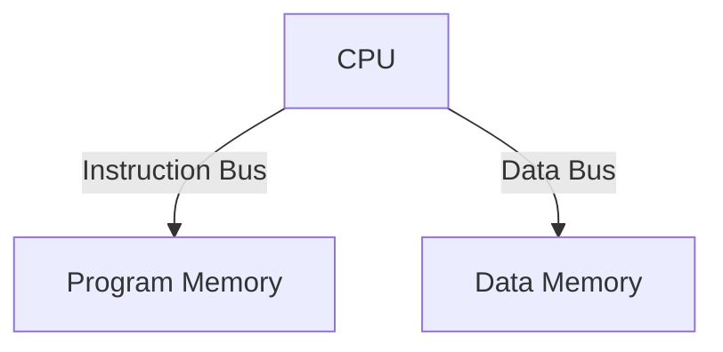
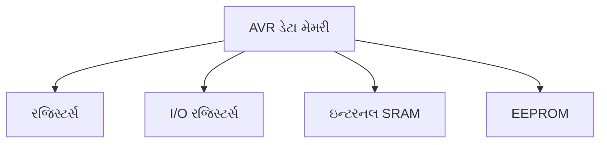
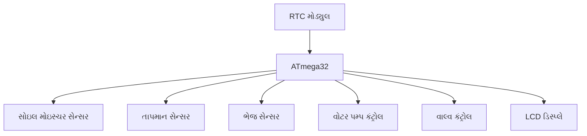
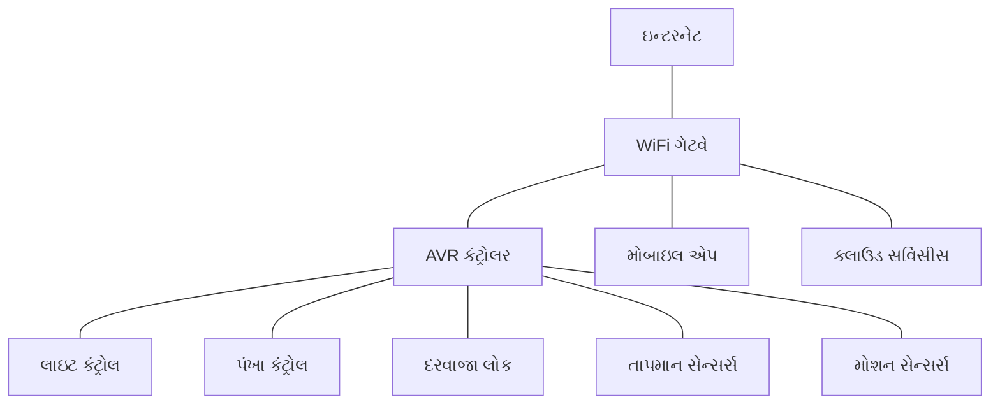

## પ્રશ્ન 1(અ) [3 ગુણ]

**AVR સ્ટેટસ રજિસ્ટર દોરો.**

**જવાબ**:

AVR સ્ટેટસ રજિસ્ટર (SREG) એરિથમેટિક ઓપરેશન્સના પરિણામની માહિતી ધરાવે છે અને ઇન્ટરપ્ટ્સને નિયંત્રિત કરે છે.

**ડાયાગ્રામ:**

```goat
+---+---+---+---+---+---+---+---+
| I | T | H | S | V | N | Z | C |
+---+---+---+---+---+---+---+---+
  7   6   5   4   3   2   1   0
```

- **I (બિટ 7)**: ગ્લોબલ ઇન્ટરપ્ટ એનેબલ
- **T (બિટ 6)**: બિટ કોપી સ્ટોરેજ
- **H (બિટ 5)**: હાફ કેરી ફ્લેગ
- **S (બિટ 4)**: સાઇન ફ્લેગ (S = N⊕V)
- **V (બિટ 3)**: ટુ'સ કોમ્પલિમેન્ટ ઓવરફ્લો
- **N (બિટ 2)**: નેગેટિવ ફ્લેગ
- **Z (બિટ 1)**: ઝીરો ફ્લેગ
- **C (બિટ 0)**: કેરી ફ્લેગ

**મેમરી ટ્રીક:** "ઈ ટેક હેલ્થ સીરિયસલી, વેરી નાઈસ ઝીરો કેરી"

## પ્રશ્ન 1(બ) [4 ગુણ]

**AVR માં હાર્વર્ડ આર્કિટેક્ચર સમજાવો.**

**જવાબ**:

AVR માં હાર્વર્ડ આર્કિટેક્ચર પ્રોગ્રામ અને ડેટા મેમરી અલગ રાખે છે, જેનાથી બંને પર એક સાથે એક્સેસ કરી શકાય છે.

**ડાયાગ્રામ:**



- **Program Memory**: Flash મેમરીમાં ઇન્સ્ટ્રક્શન્સ સ્ટોર કરે છે
- **Data Memory**: SRAM, રજિસ્ટર્સ અને I/O રજિસ્ટર્સ ધરાવે છે
- **અલગ બસ**: પ્રોગ્રામ અને ડેટા માટે અલગ બસ
- **પેરેલલ એક્સેસ**: એક સાથે ઇન્સ્ટ્રક્શન ફેચ અને ડેટા એક્સેસ કરી શકાય છે

**મેમરી ટ્રીક:** "ડેટા અને પ્રોગ્રામ માટે અલગ જગ્યા"

## પ્રશ્ન 1(ક) [7 ગુણ]

**રીયલ ટાઇમ ઓપરેટિંગ સિસ્ટમ ચર્ચો.**

**જવાબ**:

રીયલ-ટાઇમ ઓપરેટિંગ સિસ્ટમ (RTOS) ચુસ્ત ટાઇમિંગ જરૂરિયાતો ધરાવતા ટાસ્ક્સનું મેનેજમેન્ટ કરે છે, અને નિશ્ચિત રિસ્પોન્સ ટાઇમ સુનિશ્ચિત કરે છે.

**કોષ્ટક: RTOS ની મુખ્ય વિશેષતાઓ**

| વિશેષતા | વર્ણન |
|---------|-------------|
| ટાસ્ક શેડ્યુલિંગ | તાત્કાલિકતાના આધારે ટાસ્ક્સને પ્રાધાન્ય આપે છે |
| નિશ્ચિત | ઘટનાઓ માટે ગેરંટેડ રિસ્પોન્સ ટાઇમ |
| પ્રિએમ્પ્ટિવ | ક્રિટિકલ ટાસ્ક ઓછા પ્રાધાન્યવાળા ટાસ્કને ઇન્ટરપ્ટ કરી શકે છે |
| મેમરી મેનેજમેન્ટ | ફ્રેગમેન્ટેશન વગર કાર્યક્ષમ મેમરી ફાળવણી |
| ઓછો લેટન્સી | ઘટના અને પ્રતિક્રિયા વચ્ચે ન્યૂનતમ વિલંબ |
| મલ્ટીટાસ્કિંગ | એકસાથે અનેક ટાસ્ક હેન્ડલ કરે છે |

- **ટાસ્ક-બેઝ્ડ**: પ્રોગ્રામને સ્વતંત્ર ટાસ્ક્સમાં વિભાજિત કરે છે
- **ઇન્ટરપ્ટ હેન્ડલિંગ**: બાહ્ય ઘટનાઓ માટે ઝડપી પ્રતિક્રિયા
- **સિંક્રોનાઇઝેશન**: ટાસ્ક કોઓર્ડિનેશન માટે સેમાફોર અને મ્યુટેક્સ પૂરા પાડે છે
- **રિસોર્સ મેનેજમેન્ટ**: રિસોર્સ કોન્ફ્લિક્ટ્સ અટકાવે છે
- **નાનો ફૂટપ્રિન્ટ**: મર્યાદિત હાર્ડવેર રિસોર્સ માટે ઓપ્ટિમાઇઝ કરેલ છે

**મેમરી ટ્રીક:** "ટાસ્ક ચલાવે ચુસ્ત સમય પર"

## પ્રશ્ન 1(ક OR) [7 ગુણ]

**એમ્બેડેડ સિસ્ટમ માટે માઇક્રોકન્ટ્રોલર પસંદ કરવા માટેના ક્રાઈટેરીયા ચર્ચો.**

**જવાબ**:

યોગ્ય માઇક્રોકન્ટ્રોલર પસંદ કરવા માટે એપ્લિકેશન જરૂરિયાતોને મેચ કરવા અનેક મુખ્ય પરિબળોનું મૂલ્યાંકન કરવું જરૂરી છે.

**કોષ્ટક: માઇક્રોકન્ટ્રોલર પસંદગી માપદંડ**

| માપદંડ | વિચારણાઓ |
|-----------|----------------|
| પ્રોસેસિંગ પાવર | CPU સ્પીડ, બિટ વિડ્થ (8/16/32-બિટ) |
| મેમરી | Flash, RAM, EEPROM સાઇઝ |
| પાવર કન્ઝમ્પશન | સ્લીપ મોડ, ઓપરેટિંગ વોલ્ટેજ |
| I/O કેપેબિલિટીઝ | પોર્ટ્સની સંખ્યા, સ્પેશિયલ ફંક્શન્સ |
| પેરિફેરલ્સ | ટાઇમર, ADC, કમ્યુનિકેશન ઇન્ટરફેસ |
| કોસ્ટ | યુનિટ પ્રાઇસ, ડેવલપમેન્ટ ટૂલ્સ કોસ્ટ |
| ડેવલપમેન્ટ સપોર્ટ | ટૂલ્સ, ડોક્યુમેન્ટેશન, કમ્યુનિટી |

- **એપ્લિકેશન નીડ્સ**: કન્ટ્રોલરને ટાસ્કની જટિલતા સાથે મેચ કરવો
- **રીયલ-ટાઇમ રિક્વાયરમેન્ટ**: રિસ્પોન્સ ટાઇમની મર્યાદાઓ
- **એન્વાયર્નમેન્ટલ ફેક્ટર્સ**: તાપમાન, નોઇઝ, વાઇબ્રેશન
- **ફોર્મ ફેક્ટર**: ભૌતિક આકાર અને પેકેજિંગ
- **ભવિષ્યની એક્સ્પાન્શન**: ફીચર ગ્રોથ માટે જગ્યા

**મેમરી ટ્રીક:** "પાવર, મેમરી, I/O, પેરિફેરલ્સ, કોસ્ટ"

## પ્રશ્ન 2(અ) [3 ગુણ]

**એમ્બેડેડ સિસ્ટમ વ્યાખ્યાયીત કરો અને તેનો જનરલ બ્લોક ડાયાગ્રામ દોરો.**

**જવાબ**:

એમ્બેડેડ સિસ્ટમ એ એક ડેડિકેટેડ કમ્પ્યુટર સિસ્ટમ છે જે મોટી મિકેનિકલ કે ઇલેક્ટ્રિકલ સિસ્ટમમાં ચોક્કસ કાર્યો માટે ડિઝાઇન કરેલ છે.

**ડાયાગ્રામ:**

```goat
+-------------+      +-------------+      +--------------+
| Input       |----->| Processing  |----->| Output       |
| Devices     |      | Unit        |      | Devices      |
+-------------+      +-------------+      +--------------+
      ^                    ^                    ^
      |                    |                    |
      v                    v                    v
+-------------+      +-------------+      +--------------+
| Sensors     |      | Memory      |      | Actuators    |
+-------------+      +-------------+      +--------------+
                           ^
                           |
                           v
                     +-------------+
                     | Power       |
                     | Supply      |
                     +-------------+
```

- **પ્રોસેસિંગ યુનિટ**: માઇક્રોકન્ટ્રોલર/માઇક્રોપ્રોસેસર
- **મેમરી**: પ્રોગ્રામ અને ડેટા સ્ટોર કરે છે
- **ઇનપુટ/આઉટપુટ**: બાહ્ય દુનિયા સાથે ઇન્ટરફેસ

**મેમરી ટ્રીક:** "પ્રોસેસિંગ મેમરી I/O પાવર"

## પ્રશ્ન 2(બ) [4 ગુણ]

**દરેક પોર્ટ સાથે સંકળાયેલ I/O રજીસ્ટરની યાદી બનાવો.**

**જવાબ**:

AVR માઇક્રોકન્ટ્રોલર દરેક I/O પોર્ટ કંટ્રોલ કરવા માટે ત્રણ મુખ્ય રજિસ્ટર ધરાવે છે.

**કોષ્ટક: I/O પોર્ટ રજિસ્ટર્સ**

| રજિસ્ટર | ફંક્શન | વર્ણન |
|----------|----------|-------------|
| PORTx | ડેટા રજિસ્ટર | આઉટપુટ વેલ્યુ અથવા પુલ-અપ સેટ કરે છે |
| DDRx | ડેટા ડિરેક્શન રજિસ્ટર | પિન ડિરેક્શન સેટ કરે છે (1=આઉટપુટ, 0=ઇનપુટ) |
| PINx | પોર્ટ ઇનપુટ પિન્સ | વાસ્તવિક પિન સ્ટેટસ વાંચે છે |

- **x દર્શાવે છે**: A, B, C, D (પોર્ટનો અક્ષર)
- **વધારાનાં સ્પેશિયલ**: કેટલાક પોર્ટ્સ PCMSK (પિન ચેન્જ માસ્ક) રજિસ્ટર ધરાવે છે

**મેમરી ટ્રીક:** "ડિરેક્શન, ડેટા, પિન રીડિંગ"

## પ્રશ્ન 2(ક) [7 ગુણ]

**AVR માટેની ક્લોક અને રીસેટ સકીટ સમજાવો.**

**જવાબ**:

ક્લોક અને રીસેટ સર્કિટ્સ AVR ઓપરેશન્સના યોગ્ય ઇનિશિયલાઇઝેશન અને ટાઇમિંગ સુનિશ્ચિત કરે છે.

**ક્લોક સર્કિટ ડાયાગ્રામ:**

```goat
          +-------+
          |       |
     +----|  AVR  |----+
     |    |       |    |
     |    +-------+    |
     |                 |
+----+----+       +----+----+
|         |       |         |
|  XTAL1  |       |  XTAL2  |
|         |       |         |
+----|----+       +----|----+
     |                 |
     |                 |
     +--------+--------+
              |
         +----+----+
         |         |
         |  XTAL   |
         |         |
         +----|----+
              |
              |
             GND
```

**રીસેટ સર્કિટ:**

```goat
        VCC
         |
         |
        +++
        | | 10KΩ
        +++
         |
         +--------+
         |        |
         |   C    |
      +--+--+     |
      |RESET|     |
      |     |    GND
      | AVR |
      +-----+
```

- **ક્લોક સોર્સ**: એક્સટર્નલ ક્રિસ્ટલ, RC ઓસિલેટર, અથવા ઇન્ટરનલ ઓસિલેટર
- **ક્રિસ્ટલ**: ચોક્કસ ટાઇમિંગ પૂરું પાડે છે (1-16 MHz)
- **રીસેટ પિન**: સિસ્ટમ રીસ્ટાર્ટ માટે એક્ટિવ-લો ઇનપુટ
- **પાવર-ઓન રીસેટ**: પાવર આપતી વખતે ઓટોમેટિક રીસેટ
- **બ્રાઉન-આઉટ ડિટેક્શન**: જો વોલ્ટેજ નિશ્ચિત થ્રેશોલ્ડથી નીચે જાય તો રીસેટ

**મેમરી ટ્રીક:** "ક્રિસ્ટલ ઓસિલેટ કરે, રીસેટ શરૂઆત કરાવે"

## પ્રશ્ન 2(અ OR) [3 ગુણ]

**એમ્બેડેડ સિસ્ટમની લાક્ષણિકતાઓ લખો.**

**જવાબ**:

એમ્બેડેડ સિસ્ટમની અનન્ય લાક્ષણિકતાઓ તેને જનરલ-પરપઝ કમ્પ્યુટરથી અલગ પાડે છે.

**કોષ્ટક: એમ્બેડેડ સિસ્ટમની લાક્ષણિકતાઓ**

| લાક્ષણિકતા | વર્ણન |
|----------------|-------------|
| સિંગલ-ફંક્શન | ચોક્કસ ટાસ્ક માટે સમર્પિત |
| રીયલ-ટાઇમ | અનુમાનિત પ્રતિક્રિયા સમય |
| રિસોર્સ-કન્સ્ટ્રેઇન્ડ | મર્યાદિત મેમરી, પાવર, પ્રોસેસિંગ |
| વિશ્વસનીયતા | નિષ્ફળતા વગર સતત ચાલવું જોઈએ |
| રીએક્ટિવ | પર્યાવરણીય ફેરફારોને પ્રતિસાદ આપે છે |

- **લાંબું આયુષ્ય**: ઘણીવાર વર્ષો સુધી હસ્તક્ષેપ વિના કામ કરે છે
- **ઘણીવાર છુપાયેલ**: મોટી સિસ્ટમમાં એકીકૃત

**મેમરી ટ્રીક:** "સિંગલ, રીયલ-ટાઇમ, રિસોર્સ-મર્યાદિત, વિશ્વસનીય"

## પ્રશ્ન 2(બ OR) [4 ગુણ]

**ડેટા આઉટપુટ અને ઇનપુટ કરવામાં DDRx રજીસ્ટરની ભૂમિકાની ચર્ચા કરો.**

**જવાબ**:

DDRx (ડેટા ડાઇરેક્શન રજિસ્ટર) પોર્ટ x ના દરેક પિનને ઇનપુટ કે આઉટપુટ તરીકે કન્ફિગર કરે છે.

**કોષ્ટક: I/O ઓપરેશન્સમાં DDRx ની ભૂમિકા**

| DDRx વેલ્યુ | PORTx વેલ્યુ | મોડ | ફંક્શન |
|------------|------------|------|----------|
| 0 | 0 | ઇનપુટ | હાઇ-ઇમ્પીડન્સ મોડ |
| 0 | 1 | ઇનપુટ | પુલ-અપ એનેબલ્ડ |
| 1 | 0 | આઉટપુટ | આઉટપુટ લો (0V) |
| 1 | 1 | આઉટપુટ | આઉટપુટ હાઇ (VCC) |

- **ડિરેક્શન કંટ્રોલ**: 1 = આઉટપુટ, 0 = ઇનપુટ
- **પિન-સ્પેસિફિક**: દરેક બિટ વ્યક્તિગત પિન નિયંત્રિત કરે છે
- **ઇનિશિયલ સ્ટેટ**: ડિફોલ્ટ ઇનપુટ (બધા 0s) છે

**મેમરી ટ્રીક:** "ડિરેક્શન નક્કી કરે ડેટા ફ્લો"

## પ્રશ્ન 2(ક OR) [7 ગુણ]

**ATmega32નો પીન ડાયાગ્રામ દોરી સમજાવો.**

**જવાબ**:

ATmega32 એ 40 પિન ધરાવતો લોકપ્રિય 8-બિટ AVR માઇક્રોકન્ટ્રોલર છે જે વિવિધ કાર્યક્ષમતા પ્રદાન કરે છે.

**ડાયાગ્રામ:**

```goat
               +------+
    (XCK) PB0 -|1   40|- PA0 (ADC0)
         PB1  -|2   39|- PA1 (ADC1)
(INT2/AIN0)PB2-|3   38|- PA2 (ADC2)
(OC0/AIN1)PB3 -|4   37|- PA3 (ADC3)
       SS PB4 -|5   36|- PA4 (ADC4)
     MOSI PB5 -|6   35|- PA5 (ADC5)
     MISO PB6 -|7   34|- PA6 (ADC6)
      SCK PB7 -|8   33|- PA7 (ADC7)
       RESET  -|9   32|- AREF
         VCC  -|10  31|- GND
         GND  -|11  30|- AVCC
       XTAL2  -|12  29|- PC7 (TOSC2)
       XTAL1  -|13  28|- PC6 (TOSC1)
   (RXD) PD0  -|14  27|- PC5
   (TXD) PD1  -|15  26|- PC4
  (INT0) PD2  -|16  25|- PC3
  (INT1) PD3  -|17  24|- PC2
  (OC1B) PD4  -|18  23|- PC1
  (OC1A) PD5  -|19  22|- PC0
   (ICP) PD6  -|20  21|- PD7 (OC2)
               +------+
```

- **પોર્ટ A (PA0-PA7)**: 8-બિટ બાયડાયરેક્શનલ પોર્ટ ADC ઇનપુટ સાથે
- **પોર્ટ B (PB0-PB7)**: 8-બિટ પોર્ટ SPI, ટાઇમર્સ, અને એક્સટર્નલ ઇન્ટરપ્ટ સાથે
- **પોર્ટ C (PC0-PC7)**: 8-બિટ બાયડાયરેક્શનલ પોર્ટ TWI સપોર્ટ સાથે
- **પોર્ટ D (PD0-PD7)**: 8-બિટ પોર્ટ USART, એક્સટર્નલ ઇન્ટરપ્ટ, અને PWM સાથે
- **પાવર/ગ્રાઉન્ડ**: VCC, GND, AVCC, AREF
- **ક્લોક**: XTAL1/XTAL2 એક્સટર્નલ ઓસિલેટર માટે
- **રીસેટ**: એક્ટિવ-લો રીસેટ ઇનપુટ

**મેમરી ટ્રીક:** "ABCD પોર્ટ્સ, પાવર, ક્લોક, રીસેટની ચારે બાજુ"

## પ્રશ્ન 3(અ) [3 ગુણ]

**ATmega32 માટે પ્રોગ્રામ કાઉન્ટર (PC) રજિસ્ટર સમજાવો.**

**જવાબ**:

પ્રોગ્રામ કાઉન્ટર (PC) એ 16-બિટ રજિસ્ટર છે જે એક્ઝિક્યુટ કરવા માટેના આગામી ઇન્સ્ટ્રક્શનના એડ્રેસને ટ્રેક કરે છે.

**ડાયાગ્રામ:**

```goat
+---------+--------+
| PC High | PC Low |
+---------+--------+
    15:8     7:0
```

- **ફંક્શન**: પ્રોગ્રામ મેમરીમાં આગામી ઇન્સ્ટ્રક્શન તરફ પોઇન્ટ કરે છે
- **સાઇઝ**: 16-બિટ (64K શબ્દો સુધી એડ્રેસ કરી શકાય)
- **ઓટો-ઇન્ક્રિમેન્ટ**: ઇન્સ્ટ્રક્શન ફેચ પછી આપોઆપ વધે છે
- **જમ્પ કંટ્રોલ**: બ્રાન્ચ અને જમ્પ ઇન્સ્ટ્રક્શન્સ દ્વારા મોડિફાય થાય છે

**મેમરી ટ્રીક:** "કોડ એક્ઝિક્યુશન તરફ પોઇન્ટ કરે"

## પ્રશ્ન 3(બ) [4 ગુણ]

**EEPROM ના 0x005F લોકેશન પરથી ડેટા રીડ કરી PORTB પર મોકલવા માટે AVR C પ્રોગ્રામ લખો.**

**જવાબ**:

```c
#include <avr/io.h>
#include <avr/eeprom.h>

int main(void)
{
    // PORTB ને આઉટપુટ તરીકે સેટ કરો
    DDRB = 0xFF;
    
    // EEPROM લોકેશન 0x005F પરથી વાંચો અને PORTB પર આઉટપુટ કરો
    PORTB = eeprom_read_byte((uint8_t*)0x005F);
    
    while(1) {
        // મુખ્ય લૂપ
    }
    return 0;
}
```

- **DDRB = 0xFF**: બધા PORTB પિન્સને આઉટપુટ તરીકે કન્ફિગર કરે છે
- **eeprom_read_byte()**: EEPROM વાંચવા માટે AVR લાઇબ્રેરી ફંક્શન
- **while(1)**: આઉટપુટ જાળવવા માટે અનંત લૂપ

**મેમરી ટ્રીક:** "ડિરેક્શન, EEPROM વાંચો, પોર્ટ પર આઉટપુટ"

## પ્રશ્ન 3(ક) [7 ગુણ]

**TCCR0 રજિસ્ટર દોરી વિગતવાર સમજાવો.**

**જવાબ**:

ટાઇમર/કાઉન્ટર કંટ્રોલ રજિસ્ટર 0 (TCCR0) ટાઇમર/કાઉન્ટર0ના ઓપરેશનને કંટ્રોલ કરે છે.

**ડાયાગ્રામ:**

```goat
+-----+------+------+-----+-----+-----+-----+-----+
| FOC0| WGM00| COM01|COM00|WGM01| CS02| CS01| CS00|
+-----+------+------+-----+-----+-----+-----+-----+
   7     6     5     4     3     2     1     0
```

**કોષ્ટક: TCCR0 બિટ્સ ફંક્શન**

| બિટ(સ) | નામ | ફંક્શન |
|--------|------|----------|
| 7 | FOC0 | ફોર્સ આઉટપુટ કમ્પેર |
| 6,3 | WGM01:0 | વેવફોર્મ જનરેશન મોડ |
| 5,4 | COM01:0 | કમ્પેર મેચ આઉટપુટ મોડ |
| 2,1,0 | CS02:0 | ક્લોક સિલેક્ટ |

- **WGM01:0**: નોર્મલ, CTC, અથવા PWM મોડ પસંદ કરે છે
- **COM01:0**: કમ્પેર મેચ પર OC0 પિન વર્તણૂક વ્યાખ્યાયિત કરે છે
- **CS02:0**: ક્લોક સોર્સ અને પ્રીસ્કેલર સેટ કરે છે (1, 8, 64, 256, 1024)

**મેમરી ટ્રીક:** "ફોર્સિંગ વેવફોર્મ્સ, કમ્પેરિંગ, સિલેક્ટિંગ ક્લોક"

## પ્રશ્ન 3(અ OR) [3 ગુણ]

**AVR ડેટા મેમરી સમજાવો.**

**જવાબ**:

AVR ડેટા મેમરીમાં વિવિધ પ્રકારના ડેટા સ્ટોરેજ માટે અનેક સેક્શન્સ હોય છે.

**ડાયાગ્રામ:**



- **રજિસ્ટર્સ**: 32 જનરલ-પરપઝ રજિસ્ટર્સ (R0-R31)
- **I/O મેમરી**: પેરિફેરલ્સ માટે સ્પેશિયલ ફંક્શન રજિસ્ટર્સ
- **SRAM**: વેરિએબલ્સ માટે ઇન્ટરનલ RAM (વોલેટાઇલ)
- **EEPROM**: સાતત્યપૂર્ણ ડેટા માટે નોન-વોલેટાઇલ મેમરી

**મેમરી ટ્રીક:** "રજિસ્ટર્સ I/O SRAM EEPROM"

## પ્રશ્ન 3(બ OR) [4 ગુણ]

**EEPROM ના 0x005F લોકેશન પર 'G' સ્ટોર કરવા માટે AVR C પ્રોગ્રામ લખો.**

**જવાબ**:

```c
#include <avr/io.h>
#include <avr/eeprom.h>

int main(void)
{
    // 'G' કેરેક્ટરને EEPROM લોકેશન 0x005F પર સ્ટોર કરો
    eeprom_write_byte((uint8_t*)0x005F, 'G');
    
    while(1) {
        // મુખ્ય લૂપ
    }
    return 0;
}
```

- **eeprom_write_byte()**: EEPROM માં લખવા માટે AVR લાઇબ્રેરી ફંક્શન
- **'G'**: ASCII વેલ્યુ 71 (0x47) EEPROM માં સ્ટોર થાય છે
- **0x005F**: ટાર્ગેટ EEPROM એડ્રેસ
- **while(1)**: લખ્યા પછી અનંત લૂપ

**મેમરી ટ્રીક:** "એક વાર લખો, હંમેશા માટે યાદ રાખો"

## પ્રશ્ન 3(ક OR) [7 ગુણ]

**TIFR રજિસ્ટર દોરી વિગતવાર સમજાવો.**

**જવાબ**:

ટાઇમર/કાઉન્ટર ઇન્ટરપ્ટ ફ્લેગ રજિસ્ટર (TIFR) ટાઇમર ઇવેન્ટ્સ સૂચવતા ફ્લેગ ધરાવે છે.

**ડાયાગ્રામ:**

```goat
+-----+-----+-----+-----+-----+-----+-----+-----+
|  -  |  -  |  -  |  -  |  -  |OCF2 |TOV2 |TOV0 |
+-----+-----+-----+-----+-----+-----+-----+-----+
   7     6     5     4     3     2     1     0
```

**કોષ્ટક: TIFR બિટ્સ ફંક્શન**

| બિટ | નામ | ફંક્શન |
|-----|------|----------|
| 0 | TOV0 | ટાઇમર/કાઉન્ટર0 ઓવરફ્લો ફ્લેગ |
| 1 | TOV2 | ટાઇમર/કાઉન્ટર2 ઓવરફ્લો ફ્લેગ |
| 2 | OCF2 | આઉટપુટ કમ્પેર ફ્લેગ 2 |
| 3-7 | - | રિઝર્વ્ડ બિટ્સ |

- **TOV0**: ટાઇમર0 ઓવરફ્લો થતાં સેટ થાય છે, ISR એક્ઝિક્યુટ થતાં ક્લિયર થાય છે
- **TOV2**: ટાઇમર2 ઓવરફ્લો થતાં સેટ થાય છે
- **OCF2**: ટાઇમર2 કમ્પેર મેચ થતાં સેટ થાય છે
- **ફ્લેગ ક્લિયરિંગ**: ફ્લેગ ક્લિયર કરવા બિટને '1' લખો

**મેમરી ટ્રીક:** "ટાઇમર્સ ઓવરફ્લો, કમ્પેરિઝન ફ્લેગ"

## પ્રશ્ન 4(અ) [3 ગુણ]

**AVRમાં ટાઇમ ડીલે જનરેટ કરવાની વિવિધ રીતો લખો.**

**જવાબ**:

AVR માઇક્રોકન્ટ્રોલર્સ ટાઇમ ડિલે જનરેટ કરવા માટે અનેક પદ્ધતિઓ ઓફર કરે છે.

**કોષ્ટક: ડિલે જનરેશન પદ્ધતિઓ**

| પદ્ધતિ | વર્ણન | પ્રિસિઝન |
|--------|-------------|-----------|
| સોફ્ટવેર લૂપ્સ | CPU સાયકલ્સ કાઉન્ટિંગ | ઓછી |
| ટાઇમર ઇન્ટરપ્ટ્સ | ISR સાથે હાર્ડવેર ટાઇમર્સ | ઉચ્ચ |
| ટાઇમર પોલિંગ | ફ્લેગ ચેકિંગ સાથે હાર્ડવેર ટાઇમર્સ | મધ્યમ |
| ડિલે ફંક્શન્સ | લાઇબ્રેરી ફંક્શન્સ (_delay_ms/_delay_us) | મધ્યમ |

- **સોફ્ટવેર**: સરળ પરંતુ ઓપ્ટિમાઇઝેશન્સથી અસર પામે
- **હાર્ડવેર**: વધુ ચોક્કસ પરંતુ ટાઇમર સેટઅપની જરૂર
- **લાઇબ્રેરી**: સુવિધાજનક પરંતુ કોન્સ્ટન્ટ વેલ્યુ સુધી મર્યાદિત

**મેમરી ટ્રીક:** "લૂપ્સ, ઇન્ટરપ્ટ્સ, પોલિંગ, ફંક્શન્સ"

## પ્રશ્ન 4(બ) [4 ગુણ]

**LM35નુ ATmega32 સાથે ઇન્ટરફેસિંગ દોરો અને સમજાવો.**

**જવાબ**:

LM35 એ તાપમાનના પ્રમાણસર એનાલોગ વોલ્ટેજ આઉટપુટ આપતો તાપમાન સેન્સર છે.

**સર્કિટ ડાયાગ્રામ:**

```goat
    VCC (+5V)
      |
      |
  +---+---+
  |       |
  | LM35  |
  |       |
  +---+---+
      |
      +-------> To ADC0 (PA0)
      |
      |
     GND
```

- **કનેક્શન**: LM35 આઉટપુટ ATmega32 ના ADC0 (PA0) પર
- **સ્કેલિંગ**: 10mV/°C આઉટપુટ (0°C = 0V, 25°C = 250mV)
- **ADC સેટઅપ**: ADC0 પસંદ કરવા ADMUX કન્ફિગર કરો
- **ગણતરી**: તાપમાન = (ADC_value * 5 * 100) / 1024

**મેમરી ટ્રીક:** "એનાલોગ વોલ્ટેજ તાપમાન બદલે"

## પ્રશ્ન 4(ક) [7 ગુણ]

**MAX7221નુ ATmega32 સાથે ઇન્ટરફેસિંગ વિગતવાર સમજાવો.**

**જવાબ**:

MAX7221 એ SPI કમ્યુનિકેશન દ્વારા AVR સાથે જોડાતી LED ડિસ્પ્લે ડ્રાઇવર IC છે.

**સર્કિટ ડાયાગ્રામ:**

```goat
 ATmega32                MAX7221
+--------+              +--------+
|        |              |        |
|     PB7|------------->|CLK     |
|     PB5|------------->|DIN     |
|     PB4|------------->|LOAD    |
|        |              |        |
+--------+              +--------+
                             |
                        +----+----+
                        |         |
                        | 7-SEG   |
                        | DISPLAY |
                        |         |
                        +---------+
```

**કોષ્ટક: કનેક્શન્સ અને ફંક્શનાલિટી**

| ATmega32 પિન | MAX7221 પિન | ફંક્શન |
|--------------|-------------|----------|
| PB7 (SCK) | CLK | સીરિયલ ક્લોક |
| PB5 (MOSI) | DIN | ડેટા ઇનપુટ |
| PB4 (SS) | LOAD | ચિપ સિલેક્ટ |

- **SPI મોડ**: માસ્ટર મોડ, MSB ફર્સ્ટ
- **ઇનિશિયલાઇઝેશન**: ડિકોડ મોડ, ઇન્ટેન્સિટી, સ્કેન લિમિટ સેટ કરે
- **ડેટા ટ્રાન્સફર**: એડ્રેસ બાય્ટ પછી ડેટા બાય્ટ મોકલે
- **મલ્ટિપ્લેક્સિંગ**: 8 ડિજિટ્સ સુધી ડ્રાઇવ કરી શકે
- **બ્રાઇટનેસ કંટ્રોલ**: ઇન્ટેન્સિટી રજિસ્ટર દ્વારા 16 લેવલ

**મેમરી ટ્રીક:** "ક્લોક ડેટા લોડ ડિસ્પ્લે મોકલો"

## પ્રશ્ન 4(અ OR) [3 ગુણ]

**MAX232 લાઈન ડ્રાઈવર સમજાવો.**

**જવાબ**:

MAX232 એ TTL/CMOS લોજિક લેવલ્સને RS-232 વોલ્ટેજ લેવલ્સમાં સીરિયલ કમ્યુનિકેશન માટે કન્વર્ટ કરતી IC છે.

**ડાયાગ્રામ:**

```goat
    +-------+          +-------+
    |       |C1+    C1-|       |
+---|T1IN   |          |  T1OUT|---+
|   |       |          |       |   |
|   |       |C2+    C2-|       |   |
|   |       |          |       |   |
|   |       |          |       |   |
+---|R1OUT  |          |   R1IN|---+
    |       |          |       |
    |MAX232 |          |  RS232|
    +-------+          +-------+
```

- **વોલ્ટેજ કન્વર્ઝન**: TTL (0/5V) થી RS-232 (±12V)
- **ચાર્જ પમ્પ્સ**: જરૂરી વોલ્ટેજ જનરેટ કરવા કેપેસિટર્સ વાપરે છે
- **એપ્લિકેશન્સ**: PC, મોડેમ સાથે સીરિયલ કમ્યુનિકેશન
- **બાયડાયરેક્શનલ**: ટ્રાન્સમિટ અને રિસીવ બંને સિગ્નલ હેન્ડલ કરે છે

**મેમરી ટ્રીક:** "TTL થી RS-232 કન્વર્ઝન"

## પ્રશ્ન 4(બ OR) [4 ગુણ]

**ADMUX રજીસ્ટર સમજાવો.**

**જવાબ**:

ADC મલ્ટિપ્લેક્સર સિલેક્શન રજિસ્ટર (ADMUX) એનાલોગ ઇનપુટ ચેનલ સિલેક્શન અને રિઝલ્ટ ફોર્મેટ કંટ્રોલ કરે છે.

**ડાયાગ્રામ:**

```goat
+-----+-----+-----+-----+-----+-----+-----+-----+
|REFS1|REFS0|ADLAR| -   |MUX3 |MUX2 |MUX1 |MUX0 |
+-----+-----+-----+-----+-----+-----+-----+-----+
   7     6     5     4     3     2     1     0
```

**કોષ્ટક: ADMUX બિટ ફંક્શન્સ**

| બિટ્સ | નામ | ફંક્શન |
|------|------|----------|
| 7:6 | REFS1:0 | રેફરન્સ સિલેક્શન |
| 5 | ADLAR | ADC લેફ્ટ એડજસ્ટ રિઝલ્ટ |
| 3:0 | MUX3:0 | એનાલોગ ચેનલ સિલેક્શન |

- **REFS1:0**: વોલ્ટેજ રેફરન્સ (AREF, AVCC, ઇન્ટરનલ) પસંદ કરે
- **ADLAR**: ADC રજિસ્ટર્સમાં રિઝલ્ટ એલાઇનમેન્ટ
- **MUX3:0**: ઇનપુટ ચેનલ (ADC0-ADC7) પસંદ કરે

**મેમરી ટ્રીક:** "રેફરન્સ, એલાઇનમેન્ટ, મલ્ટિપ્લેક્સર"

## પ્રશ્ન 4(ક OR) [7 ગુણ]

**AVRની Two Wire serial Interface (TWI)ની ચર્ચા કરો.**

**જવાબ**:

ટુ વાયર ઇન્ટરફેસ (TWI) એ પેરિફેરલ ડિવાઇસ સાથે કમ્યુનિકેશન માટે AVRનો I²C પ્રોટોકોલનો અમલ છે.

**ડાયાગ્રામ:**


**કોષ્ટક: TWI લાક્ષણિકતાઓ**

| ફીચર | વર્ણન |
|---------|-------------|
| પિન્સ | SCL (સીરિયલ ક્લોક) અને SDA (સીરિયલ ડેટા) |
| સ્પીડ | સ્ટાન્ડર્ડ (100kHz), ફાસ્ટ (400kHz) |
| એડ્રેસિંગ | 7-બિટ અથવા 10-બિટ ડિવાઇસ એડ્રેસિંગ |
| ઓપરેશન | માસ્ટર અથવા સ્લેવ મોડ |
| બસ સ્ટ્રક્ચર | મલ્ટી-માસ્ટર, મલ્ટી-સ્લેવ |

- **બાયડાયરેક્શનલ**: બંને ડિવાઇસ ટ્રાન્સમિટ અને રિસીવ કરી શકે
- **રજિસ્ટર્સ**: TWBR, TWCR, TWSR, TWDR, TWAR
- **ACK/NACK**: વિશ્વસનીય ટ્રાન્સફર માટે એક્નોલેજમેન્ટ
- **સ્ટાર્ટ/સ્ટોપ**: ટ્રાન્સમિશન શરૂ/સમાપ્ત કરવા માટે ખાસ કન્ડિશન્સ
- **સામાન્ય ઉપયોગ**: EEPROM, RTC, સેન્સર્સ, ડિસ્પ્લે

**મેમરી ટ્રીક:** "સીરિયલ ક્લોક અને ડેટા ટ્રાન્સફર"

## પ્રશ્ન 5(અ) [3 ગુણ]

**L293D મોટર ડ્રાઇવરનો ઉપયોગ કરી DC મોટરને ATmega32 સાથે ઇન્ટરફેસ કરવા માટે સર્કિટ ડાયાગ્રામ દોરો.**

**જવાબ**:

L293D માઇક્રોકન્ટ્રોલર્સ સાથે DC મોટર કંટ્રોલ કરવા માટે બાયડાયરેક્શનલ ડ્રાઇવ કરંટ પ્રદાન કરે છે.

**સર્કિટ ડાયાગ્રામ:**

```goat
         ATmega32               L293D                DC Motor
        +--------+           +--------+              +-----+
        |        |           |        |              |     |
        |     PD0|---------->|IN1     |              |     |
        |     PD1|---------->|IN2     |              |     |
        |        |           |        |              |     |
        |        |           |OUT1 >--|--------------|+    |
        |        |           |OUT2 >--|--------------|−    |
        |        |           |        |              |     |
        +--------+           +--------+              +-----+
                                 |
                                 | +5V
                              +--+--+
                              |     |
                              |Power|
                              |     |
                              +-----+
```

- **કંટ્રોલ પિન્સ**: PD0, PD1 મોટર દિશા નિયંત્રિત કરે છે
- **ડ્રાઇવર પાવર**: લોજિક અને મોટર માટે અલગ
- **H-બ્રિજ**: ફોરવર્ડ/રિવર્સ ઓપરેશન સક્ષમ કરે છે
- **એનેબલ પિન**: PWM સ્પીડ કંટ્રોલ માટે વાપરી શકાય

**મેમરી ટ્રીક:** "બ્રિજ દ્વારા દિશા નિયંત્રણ"

## પ્રશ્ન 5(બ) [4 ગુણ]

**ATmega32 માં ઓન ચિપ ADCની લાક્ષણિકતા લખો.**

**જવાબ**:

ATmega32 એનાલોગ સિગ્નલ્સ માપવા માટે વર્સેટાઇલ એનાલોગ-ટુ-ડિજિટલ કન્વર્ટર ધરાવે છે.

**કોષ્ટક: ATmega32 ADC ફીચર્સ**

| ફીચર | સ્પેસિફિકેશન |
|---------|---------------|
| રેઝોલ્યુશન | 10-બિટ |
| ચેનલ્સ | 8 સિંગલ-એન્ડેડ ઇનપુટ્સ |
| કન્વર્ઝન ટાઇમ | 65-260 μs |
| રેફરન્સ વોલ્ટેજ | AREF, AVCC, અથવા 2.56V ઇન્ટરનલ |
| એક્યુરસી | ±2 LSB |
| કન્વર્ઝન મોડ્સ | સિંગલ અને ફ્રી રનિંગ |
| ઇનપુટ રેન્જ | 0V થી VREF |

- **સક્સેસિવ એપ્રોક્સિમેશન**: કન્વર્ઝન ટેકનિક
- **મલ્ટિપ્લેક્સર**: 8 ઇનપુટ ચેનલ્સ વચ્ચે પસંદ કરે છે
- **ઇન્ટરપ્ટ**: પૂર્ણ થયા પર વૈકલ્પિક ઇન્ટરપ્ટ
- **સેમ્પલિંગ રેટ**: મહત્તમ રેઝોલ્યુશન પર 15 KSPS સુધી

**મેમરી ટ્રીક:** "મલ્ટિપલ ચેનલ્સ, ટેન-બિટ રેઝોલ્યુશન"

## પ્રશ્ન 5(ક) [7 ગુણ]

**સ્માર્ટ ઇરીગેશન સિસ્ટમ સમજાવો.**

**જવાબ**:

સ્માર્ટ ઇરીગેશન સિસ્ટમ માઇક્રોકન્ટ્રોલર ટેકનોલોજીનો ઉપયોગ કરીને પર્યાવરણીય પરિસ્થિતિઓના આધારે વોટરિંગને ઓટોમેટ કરે છે.

**ડાયાગ્રામ:**



**કોષ્ટક: સિસ્ટમ કોમ્પોનન્ટ્સ**

| કોમ્પોનન્ટ | ફંક્શન |
|-----------|----------|
| સોઇલ મોઇસ્ચર સેન્સર | માટીમાં પાણીની માત્રા માપે છે |
| તાપમાન/ભેજ | પર્યાવરણીય પરિસ્થિતિનું મોનિટરિંગ કરે છે |
| વોટર પમ્પ | જરૂર પડે ત્યારે પાણી આપે છે |
| વાલ્વ્સ | વિવિધ ઝોન્સમાં પાણી ફ્લોને નિયંત્રિત કરે છે |
| LCD ડિસ્પ્લે | સિસ્ટમ સ્ટેટસ બતાવે છે |
| RTC મોડ્યુલ | શેડ્યૂલ્ડ ઇરીગેશન માટે સમય ટ્રેક કરે છે |

- **એડેપ્ટિવ કંટ્રોલ**: પરિસ્થિતિઓના આધારે વોટરિંગ એડજસ્ટ કરે છે
- **વોટર કન્ઝર્વેશન**: માત્ર જરૂરી પ્રમાણમાં પાણીનો ઉપયોગ કરે છે
- **રિમોટ મોનિટરિંગ**: વૈકલ્પિક WiFi/GSM કનેક્ટિવિટી
- **ડેટા લોગિંગ**: ભેજના સ્તર અને વોટરિંગ ઇવેન્ટ્સની નોંધ રાખે છે
- **બેટરી બેકઅપ**: પાવર આઉટેજ દરમિયાન ઓપરેશન સુનિશ્ચિત કરે છે

**મેમરી ટ્રીક:** "ભેજ સેન્સ કરો, પાણી ઓટોમેટિક કંટ્રોલ કરો"

## પ્રશ્ન 5(અ OR) [3 ગુણ]

**L293D મોટર ડ્રાઇવર IC નો પિન ડાયાગ્રામ દોરો અને સમજાવો.**

**જવાબ**:

L293D એ મોટર્સ અને અન્ય ઇન્ડક્ટિવ લોડ્સ કંટ્રોલ કરવા માટે વપરાતી ક્વાડ્રુપલ હાફ-H ડ્રાઇવર IC છે.

**ડાયાગ્રામ:**

```goat
        +------+
        | 1 16 | 
    EN1-|      |-VCC1
    IN1-|      |-IN4
   OUT1-|      |-OUT4
    GND-| L293D|-GND
    GND-|      |-GND
   OUT2-|      |-OUT3
    IN2-|      |-IN3
   VCC2-|      |-EN2
        +------+
```

- **VCC1 (પિન 16)**: લોજિક સપ્લાય વોલ્ટેજ (5V)
- **VCC2 (પિન 8)**: મોટર સપ્લાય વોલ્ટેજ (4.5V-36V)
- **EN1/EN2**: એનેબલ ઇનપુટ્સ (સ્પીડ કંટ્રોલ માટે PWM થઈ શકે)
- **IN1-IN4**: દિશા નિયંત્રિત કરવા માટે લોજિક ઇનપુટ્સ
- **OUT1-OUT4**: મોટર્સ કનેક્ટ કરવા માટે આઉટપુટ્સ
- **GND**: ગ્રાઉન્ડ કનેક્શન્સ

**મેમરી ટ્રીક:** "એનેબલ, ઇનપુટ, આઉટપુટ, પાવર"

## પ્રશ્ન 5(બ OR) [4 ગુણ]

**AVR માં ADC સાથે સંકળાયેલ રજીસ્ટરોની યાદી બનાવો.**

**જવાબ**:

AVRની ADC સિસ્ટમ તેના ઓપરેશન કંટ્રોલ કરવા અને પરિણામો સ્ટોર કરવા માટે અનેક રજિસ્ટર્સનો ઉપયોગ કરે છે.

**કોષ્ટક: ADC રજિસ્ટર્સ**

| રજિસ્ટર | ફંક્શન | વર્ણન |
|----------|----------|-------------|
| ADMUX | મલ્ટિપ્લેક્સર | ચેનલ સિલેક્શન અને રેફરન્સ ઓપ્શન્સ |
| ADCSRA | કંટ્રોલ & સ્ટેટસ | કંટ્રોલ બિટ્સ અને ફ્લેગ્સ |
| ADCH | ડેટા હાઇ | કન્વર્ઝન રિઝલ્ટનો હાઇ બાઇટ |
| ADCL | ડેટા લો | કન્વર્ઝન રિઝલ્ટનો લો બાઇટ |
| SFIOR | સ્પેશિયલ ફંક્શન | ADC ટ્રિગર સોર્સ સિલેક્શન |

- **ADMUX**: ચેનલ અને રેફરન્સ સિલેક્શન
- **ADCSRA**: ADC એનેબલ, કન્વર્ઝન સ્ટાર્ટ, પ્રીસ્કેલર
- **ADCH/ADCL**: રિઝલ્ટ રજિસ્ટર્સ (10-બિટ વેલ્યુ)
- **SFIOR**: ઓટો-ટ્રિગર સોર્સ (ટાઇમર, એક્સટર્નલ)

**મેમરી ટ્રીક:** "મલ્ટિપ્લેક્સર કંટ્રોલ કરે અને રિઝલ્ટ મેળવે"

## પ્રશ્ન 5(ક OR) [7 ગુણ]

**IoT આધારિત હોમ ઓટોમેશન સિસ્ટમ સમજાવો.**

**જવાબ**:

IoT હોમ ઓટોમેશન ઘરના ઉપકરણોને રિમોટ મોનિટરિંગ અને કંટ્રોલ માટે ઇન્ટરનેટ સાથે જોડે છે.

**ડાયાગ્રામ:**



**કોષ્ટક: સિસ્ટમ કોમ્પોનન્ટ્સ**

| કોમ્પોનન્ટ | ફંક્શન |
|-----------|----------|
| કંટ્રોલર | સેન્સર ડેટા અને કમાન્ડ્સ પ્રોસેસ કરે છે |
| સેન્સર્સ | પર્યાવરણીય પરિસ્થિતિઓનું મોનિટરિંગ કરે છે |
| એક્ચ્યુએટર્સ | ઉપકરણો અને સિસ્ટમ્સ કંટ્રોલ કરે છે |
| કમ્યુનિકેશન | WiFi/ઇથરનેટ/બ્લુટુથ કનેક્ટિવિટી |
| ગેટવે | લોકલ નેટવર્કને ઇન્ટરનેટ સાથે જોડે છે |
| મોબાઇલ એપ | રિમોટ કંટ્રોલ માટે યુઝર ઇન્ટરફેસ |

- **રિમોટ એક્સેસ**: ગમે ત્યાંથી ઘર કંટ્રોલ કરો
- **શેડ્યુલિંગ**: સમય આધારિત ડિવાઇસ ઓપરેશન ઓટોમેટ કરો
- **વોઇસ કંટ્રોલ**: ડિજિટલ આસિસ્ટન્ટ સાથે એકીકરણ
- **એનર્જી મોનિટરિંગ**: પાવર કન્ઝમ્પશન ટ્રેક કરો
- **સિક્યુરિટી**: અસામાન્ય પ્રવૃત્તિઓ માટે એલર્ટ
- **સીન સેટિંગ**: અનેક ડિવાઇસનું વન-ટચ કંટ્રોલ

**મેમરી ટ્રીક:** "કનેક્ટ, કંટ્રોલ, ઓટોમેટ, મોનિટર"
