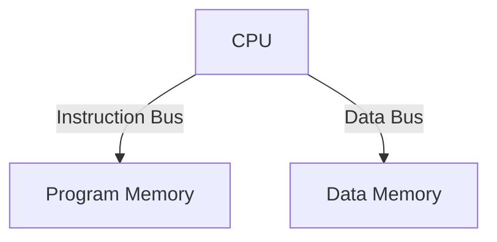
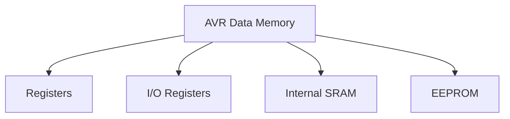
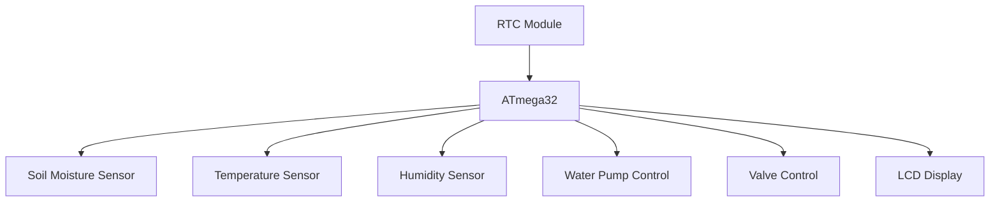
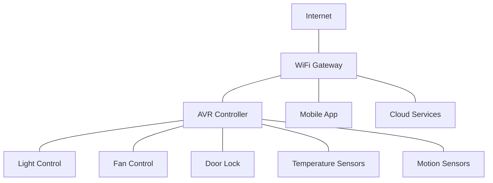

# Embedded System (4343204) - Summer 2024 Solution

## Question 1(a) [3 marks]

**Draw AVR status register.**

**Answer**:

The AVR Status Register (SREG) contains information about the result of arithmetic operations and controls interrupts.

**Diagram:**

```goat
+---+---+---+---+---+---+---+---+
| I | T | H | S | V | N | Z | C |
+---+---+---+---+---+---+---+---+
  7   6   5   4   3   2   1   0
```

- **I (bit 7)**: Global Interrupt Enable
- **T (bit 6)**: Bit Copy Storage
- **H (bit 5)**: Half Carry Flag
- **S (bit 4)**: Sign Flag (S = N⊕V)
- **V (bit 3)**: Two's Complement Overflow
- **N (bit 2)**: Negative Flag
- **Z (bit 1)**: Zero Flag
- **C (bit 0)**: Carry Flag

**Mnemonic:** "I Take Health Seriously, Very Nice Zero Carry"

## Question 1(b) [4 marks]

**Explain Harvard Architecture in the AVR.**

**Answer**:

Harvard Architecture in AVR separates program and data memory, allowing simultaneous access to both.

**Diagram:**



- **Program Memory**: Stores instructions in Flash memory
- **Data Memory**: Contains SRAM, registers, and I/O registers
- **Separate Buses**: Different buses for program and data
- **Parallel Access**: Can fetch instruction and access data simultaneously

**Mnemonic:** "Separate Places for Data And Programs"

## Question 1(c) [7 marks]

**Discuss real time operating system.**

**Answer**:

Real-Time Operating System (RTOS) manages tasks with strict timing requirements, ensuring predictable response times.

**Table: Key Features of RTOS**

| Feature | Description |
|---------|-------------|
| Task Scheduling | Prioritizes tasks based on urgency |
| Deterministic | Guaranteed response times for events |
| Preemptive | Critical tasks can interrupt lower priority ones |
| Memory Management | Efficient memory allocation without fragmentation |
| Low Latency | Minimal delay between event and response |
| Multitasking | Handles multiple tasks concurrently |

- **Task-based**: Divides program into independent tasks
- **Interrupt Handling**: Fast response to external events
- **Synchronization**: Provides semaphores and mutexes for task coordination
- **Resource Management**: Prevents resource conflicts
- **Small Footprint**: Optimized for limited hardware resources

**Mnemonic:** "Tasks Run On Strict Timelines"

## Question 1(c OR) [7 marks]

**Discuss criteria for choosing microcontroller for embedded system.**

**Answer**:

Selecting the right microcontroller requires evaluating several key factors to match application requirements.

**Table: Microcontroller Selection Criteria**

| Criterion | Considerations |
|-----------|----------------|
| Processing Power | CPU speed, bit width (8/16/32-bit) |
| Memory | Flash, RAM, EEPROM sizes |
| Power Consumption | Sleep modes, operating voltage |
| I/O Capabilities | Number of ports, special functions |
| Peripherals | Timers, ADC, communication interfaces |
| Cost | Unit price, development tools cost |
| Development Support | Tools, documentation, community |

- **Application Needs**: Match controller to task complexity
- **Real-time Requirements**: Response time constraints
- **Environmental Factors**: Temperature, noise, vibration
- **Form Factor**: Physical size and packaging
- **Future Expansion**: Room for feature growth

**Mnemonic:** "Power, Memory, I/O, Peripherals, Cost"

## Question 2(a) [3 marks]

**Define embedded system and draw its general block diagram.**

**Answer**:

An embedded system is a dedicated computer system designed for specific functions within a larger mechanical or electrical system.

**Diagram:**

```goat
+-------------+      +-------------+      +--------------+
| Input       |----->| Processing  |----->| Output       |
| Devices     |      | Unit        |      | Devices      |
+-------------+      +-------------+      +--------------+
      ^                    ^                    ^
      |                    |                    |
      v                    v                    v
+-------------+      +-------------+      +--------------+
| Sensors     |      | Memory      |      | Actuators    |
+-------------+      +-------------+      +--------------+
                           ^
                           |
                           v
                     +-------------+
                     | Power       |
                     | Supply      |
                     +-------------+
```

- **Processing Unit**: Microcontroller/microprocessor
- **Memory**: Stores program and data
- **Input/Output**: Interfaces with external world

**Mnemonic:** "Processing Memory I/O Power"

## Question 2(b) [4 marks]

**List I/O registers associated with each port.**

**Answer**:

AVR microcontrollers have three primary registers for controlling each I/O port.

**Table: I/O Port Registers**

| Register | Function | Description |
|----------|----------|-------------|
| PORTx | Data Register | Sets output values or pull-ups |
| DDRx | Data Direction Register | Sets pin direction (1=output, 0=input) |
| PINx | Port Input Pins | Reads actual pin status |

- **x represents**: A, B, C, D (port letter)
- **Additional Special**: Some ports have PCMSK (Pin Change Mask) registers

**Mnemonic:** "Direction, Data, Pin reading"

## Question 2(c) [7 marks]

**Explain clock and reset circuit for AVR.**

**Answer**:

The clock and reset circuits ensure proper initialization and timing of AVR operations.

**Clock Circuit Diagram:**

```goat
          +-------+
          |       |
     +----|  AVR  |----+
     |    |       |    |
     |    +-------+    |
     |                 |
+----+----+       +----+----+
|         |       |         |
|  XTAL1  |       |  XTAL2  |
|         |       |         |
+----|----+       +----|----+
     |                 |
     |                 |
     +--------+--------+
              |
         +----+----+
         |         |
         |  XTAL   |
         |         |
         +----|----+
              |
              |
             GND
```

**Reset Circuit:**

```goat
        VCC
         |
         |
        +++
        | | 10KΩ
        +++
         |
         +--------+
         |        |
         |   C    |
      +--+--+     |
      |RESET|     |
      |     |    GND
      | AVR |
      +-----+
```

- **Clock Source**: External crystal, RC oscillator, or internal oscillator
- **Crystal**: Provides accurate timing (1-16 MHz)
- **Reset Pin**: Active-low input for system restart
- **Power-on Reset**: Automatic reset when power applied
- **Brown-out Detection**: Reset if voltage drops below threshold

**Mnemonic:** "Crystal Oscillates, Reset Ensures Start"

## Question 2(a OR) [3 marks]

**Write characteristics of embedded system.**

**Answer**:

Embedded systems have unique characteristics that distinguish them from general-purpose computers.

**Table: Embedded System Characteristics**

| Characteristic | Description |
|----------------|-------------|
| Single-Function | Dedicated to specific tasks |
| Real-time | Predictable response times |
| Resource Constrained | Limited memory, power, processing |
| Reliability | Must operate continuously without fail |
| Reactive | Responds to environmental changes |

- **Long Life**: Often operates for years without intervention
- **Often Hidden**: Integrated within larger systems

**Mnemonic:** "Single, Real-time, Resource-limited, Reliable"

## Question 2(b OR) [4 marks]

**Discuss the role of DDRx in outputting and inputting data.**

**Answer**:

DDRx (Data Direction Register) configures each pin of port x as either input or output.

**Table: DDRx Role in I/O Operations**

| DDRx Value | PORTx Value | Mode | Function |
|------------|------------|------|----------|
| 0 | 0 | Input | High-impedance mode |
| 0 | 1 | Input | Pull-up enabled |
| 1 | 0 | Output | Output low (0V) |
| 1 | 1 | Output | Output high (VCC) |

- **Direction Control**: 1 = output, 0 = input
- **Pin-specific**: Each bit controls individual pin
- **Initial State**: Default is input (all 0s)

**Mnemonic:** "Direction Determines Data flow"

## Question 2(c OR) [7 marks]

**Draw and explain ATmega32 pin diagram.**

**Answer**:

ATmega32 is a popular 8-bit AVR microcontroller with 40 pins providing various functionalities.

**Diagram:**

```goat
               +------+
    (XCK) PB0 -|1   40|- PA0 (ADC0)
         PB1  -|2   39|- PA1 (ADC1)
(INT2/AIN0)PB2-|3   38|- PA2 (ADC2)
(OC0/AIN1)PB3 -|4   37|- PA3 (ADC3)
       SS PB4 -|5   36|- PA4 (ADC4)
     MOSI PB5 -|6   35|- PA5 (ADC5)
     MISO PB6 -|7   34|- PA6 (ADC6)
      SCK PB7 -|8   33|- PA7 (ADC7)
       RESET  -|9   32|- AREF
         VCC  -|10  31|- GND
         GND  -|11  30|- AVCC
       XTAL2  -|12  29|- PC7 (TOSC2)
       XTAL1  -|13  28|- PC6 (TOSC1)
   (RXD) PD0  -|14  27|- PC5
   (TXD) PD1  -|15  26|- PC4
  (INT0) PD2  -|16  25|- PC3
  (INT1) PD3  -|17  24|- PC2
  (OC1B) PD4  -|18  23|- PC1
  (OC1A) PD5  -|19  22|- PC0
   (ICP) PD6  -|20  21|- PD7 (OC2)
               +------+
```

- **Port A (PA0-PA7)**: 8-bit bidirectional port with ADC inputs
- **Port B (PB0-PB7)**: 8-bit port with SPI, timers, and external interrupts
- **Port C (PC0-PC7)**: 8-bit bidirectional port with TWI support
- **Port D (PD0-PD7)**: 8-bit port with USART, external interrupts, and PWM
- **Power/Ground**: VCC, GND, AVCC, AREF
- **Clock**: XTAL1/XTAL2 for external oscillator
- **Reset**: Active-low reset input

**Mnemonic:** "ABCD Ports Around Power Clock Reset"

## Question 3(a) [3 marks]

**Explain Program Counter (PC) register for ATmega32.**

**Answer**:

Program Counter (PC) is a 16-bit register that tracks the address of the next instruction to execute.

**Diagram:**

```goat
+---------+--------+
| PC High | PC Low |
+---------+--------+
    15:8     7:0
```

- **Function**: Points to next instruction in program memory
- **Size**: 16-bit (can address up to 64K words)
- **Auto-increment**: Automatically increments after instruction fetch
- **Jump Control**: Modified by branch and jump instructions

**Mnemonic:** "Points to Code Execution"

## Question 3(b) [4 marks]

**Write an AVR C program to read the content of location 0x005F of EEPROM into PORTB.**

**Answer**:

```c
#include <avr/io.h>
#include <avr/eeprom.h>

int main(void)
{
    // Set PORTB as output
    DDRB = 0xFF;
    
    // Read from EEPROM location 0x005F and output to PORTB
    PORTB = eeprom_read_byte((uint8_t*)0x005F);
    
    while(1) {
        // Main loop
    }
    return 0;
}
```

- **DDRB = 0xFF**: Configure all PORTB pins as outputs
- **eeprom_read_byte()**: AVR library function to read EEPROM
- **while(1)**: Infinite loop to maintain output

**Mnemonic:** "Direction, Read EEPROM, Output to Port"

## Question 3(c) [7 marks]

**Draw and explain TCCR0 register in detail.**

**Answer**:

Timer/Counter Control Register 0 (TCCR0) controls the operation of Timer/Counter0.

**Diagram:**

```goat
+-----+------+------+-----+-----+-----+-----+-----+
| FOC0| WGM00| COM01|COM00|WGM01| CS02| CS01| CS00|
+-----+------+------+-----+-----+-----+-----+-----+
   7     6     5     4     3     2     1     0
```

**Table: TCCR0 Bits Function**

| Bit(s) | Name | Function |
|--------|------|----------|
| 7 | FOC0 | Force Output Compare |
| 6,3 | WGM01:0 | Waveform Generation Mode |
| 5,4 | COM01:0 | Compare Match Output Mode |
| 2,1,0 | CS02:0 | Clock Select |

- **WGM01:0**: Selects Normal, CTC, or PWM modes
- **COM01:0**: Defines OC0 pin behavior on compare match
- **CS02:0**: Sets clock source and prescaler (1, 8, 64, 256, 1024)

**Mnemonic:** "Forcing Waveforms, Comparing, Selecting Clock"

## Question 3(a OR) [3 marks]

**Explain AVR data memory.**

**Answer**:

AVR data memory consists of multiple sections for different types of data storage.

**Diagram:**



- **Registers**: 32 general-purpose registers (R0-R31)
- **I/O Memory**: Special function registers for peripherals
- **SRAM**: Internal RAM for variables (volatile)
- **EEPROM**: Non-volatile memory for persistent data

**Mnemonic:** "Registers I/O SRAM EEPROM"

## Question 3(b OR) [4 marks]

**Write an AVR C program to store 'G' into location 0x005F of EEPROM.**

**Answer**:

```c
#include <avr/io.h>
#include <avr/eeprom.h>

int main(void)
{
    // Store character 'G' to EEPROM location 0x005F
    eeprom_write_byte((uint8_t*)0x005F, 'G');
    
    while(1) {
        // Main loop
    }
    return 0;
}
```

- **eeprom_write_byte()**: AVR library function to write to EEPROM
- **'G'**: ASCII value 71 (0x47) stored in EEPROM
- **0x005F**: Target EEPROM address
- **while(1)**: Infinite loop after writing

**Mnemonic:** "Write Once, Remember Forever"

## Question 3(c OR) [7 marks]

**Draw and explain TIFR register in detail.**

**Answer**:

Timer/Counter Interrupt Flag Register (TIFR) holds flags that indicate timer events.

**Diagram:**

```goat
+-----+-----+-----+-----+-----+-----+-----+-----+
|  -  |  -  |  -  |  -  |  -  |OCF2 |TOV2 |TOV0 |
+-----+-----+-----+-----+-----+-----+-----+-----+
   7     6     5     4     3     2     1     0
```

**Table: TIFR Bits Function**

| Bit | Name | Function |
|-----|------|----------|
| 0 | TOV0 | Timer/Counter0 Overflow Flag |
| 1 | TOV2 | Timer/Counter2 Overflow Flag |
| 2 | OCF2 | Output Compare Flag 2 |
| 3-7 | - | Reserved bits |

- **TOV0**: Set when Timer0 overflows, cleared when ISR executes
- **TOV2**: Set when Timer2 overflows
- **OCF2**: Set when Timer2 compare match occurs
- **Flag Clearing**: Write '1' to bit to clear flag

**Mnemonic:** "Timers Overflow, Comparisons Flag"

## Question 4(a) [3 marks]

**Write different ways of generating delay in AVR.**

**Answer**:

AVR microcontrollers offer multiple methods to generate time delays.

**Table: Delay Generation Methods**

| Method | Description | Precision |
|--------|-------------|-----------|
| Software Loops | CPU cycles counting | Low |
| Timer Interrupts | Hardware timers with ISR | High |
| Timer Polling | Hardware timers with flag checking | Medium |
| Delay Functions | Library functions (_delay_ms/_delay_us) | Medium |

- **Software**: Simple but affected by optimizations
- **Hardware**: More accurate but requires timer setup
- **Library**: Convenient but limited to constant values

**Mnemonic:** "Loops, Interrupts, Polling, Functions"

## Question 4(b) [4 marks]

**Draw and explain interfacing of LM35 with ATmega32.**

**Answer**:

LM35 is a temperature sensor that outputs an analog voltage proportional to temperature.

**Circuit Diagram:**

```goat
    VCC (+5V)
      |
      |
  +---+---+
  |       |
  | LM35  |
  |       |
  +---+---+
      |
      +-------> To ADC0 (PA0)
      |
      |
     GND
```

- **Connection**: LM35 output to ADC0 (PA0) of ATmega32
- **Scaling**: 10mV/°C output (0°C = 0V, 25°C = 250mV)
- **ADC Setup**: Configure ADMUX to select ADC0
- **Calculation**: Temperature = (ADC_value * 5 * 100) / 1024

**Mnemonic:** "Analog Voltage Converts Temperature"

## Question 4(c) [7 marks]

**Explain interfacing of MAX7221 with ATmega32 in detail.**

**Answer**:

MAX7221 is an LED display driver IC that connects to AVR using SPI communication.

**Circuit Diagram:**

```goat
 ATmega32                MAX7221
+--------+              +--------+
|        |              |        |
|     PB7|------------->|CLK     |
|     PB5|------------->|DIN     |
|     PB4|------------->|LOAD    |
|        |              |        |
+--------+              +--------+
                             |
                        +----+----+
                        |         |
                        | 7-SEG   |
                        | DISPLAY |
                        |         |
                        +---------+
```

**Table: Connections and Functionality**

| ATmega32 Pin | MAX7221 Pin | Function |
|--------------|-------------|----------|
| PB7 (SCK) | CLK | Serial Clock |
| PB5 (MOSI) | DIN | Data Input |
| PB4 (SS) | LOAD | Chip Select |

- **SPI Mode**: Master mode, MSB first
- **Initialization**: Set decode mode, intensity, scan limit
- **Data Transfer**: Send address byte followed by data byte
- **Multiplexing**: Can drive up to 8 digits
- **Brightness Control**: 16 levels through intensity register

**Mnemonic:** "Send Clock Data Load Display"

## Question 4(a OR) [3 marks]

**Explain MAX232 line driver.**

**Answer**:

MAX232 is an IC that converts TTL/CMOS logic levels to RS-232 voltage levels for serial communication.

**Diagram:**

```goat
    +-------+          +-------+
    |       |C1+    C1-|       |
+---|T1IN   |          |  T1OUT|---+
|   |       |          |       |   |
|   |       |C2+    C2-|       |   |
|   |       |          |       |   |
|   |       |          |       |   |
+---|R1OUT  |          |   R1IN|---+
    |       |          |       |
    |MAX232 |          |  RS232|
    +-------+          +-------+
```

- **Voltage Conversion**: TTL (0/5V) to RS-232 (±12V)
- **Charge Pumps**: Uses capacitors to generate required voltages
- **Applications**: Serial communication with PC, modems
- **Bidirectional**: Handles both transmit and receive signals

**Mnemonic:** "TTL To RS-232 Conversion"

## Question 4(b OR) [4 marks]

**Explain ADMUX register.**

**Answer**:

ADC Multiplexer Selection Register (ADMUX) controls analog input channel selection and result format.

**Diagram:**

```goat
+-----+-----+-----+-----+-----+-----+-----+-----+
|REFS1|REFS0|ADLAR| -   |MUX3 |MUX2 |MUX1 |MUX0 |
+-----+-----+-----+-----+-----+-----+-----+-----+
   7     6     5     4     3     2     1     0
```

**Table: ADMUX Bit Functions**

| Bits | Name | Function |
|------|------|----------|
| 7:6 | REFS1:0 | Reference Selection |
| 5 | ADLAR | ADC Left Adjust Result |
| 3:0 | MUX3:0 | Analog Channel Selection |

- **REFS1:0**: Select voltage reference (AREF, AVCC, Internal)
- **ADLAR**: Result alignment in ADC registers
- **MUX3:0**: Select input channel (ADC0-ADC7)

**Mnemonic:** "Reference, Alignment, Multiplexer"

## Question 4(c OR) [7 marks]

**Discuss Two Wire serial Interface (TWI) in AVR.**

**Answer**:

Two Wire Interface (TWI) is AVR's implementation of I²C protocol for communication with peripheral devices.

**Diagram:**


**Table: TWI Characteristics**

| Feature | Description |
|---------|-------------|
| Pins | SCL (Serial Clock) and SDA (Serial Data) |
| Speed | Standard (100kHz), Fast (400kHz) |
| Addressing | 7-bit or 10-bit device addressing |
| Operation | Master or Slave mode |
| Bus Structure | Multi-master, multi-slave |

- **Bidirectional**: Both devices can transmit and receive
- **Registers**: TWBR, TWCR, TWSR, TWDR, TWAR
- **ACK/NACK**: Acknowledgment for reliable transfers
- **Start/Stop**: Special conditions to begin/end transmission
- **Common Uses**: EEPROM, RTC, sensors, displays

**Mnemonic:** "Serial Clock And Data Transfers"

## Question 5(a) [3 marks]

**Draw circuit diagram to interface DC motor with ATmega32 using L293D motor driver.**

**Answer**:

L293D provides bidirectional drive current for controlling DC motors with microcontrollers.

**Circuit Diagram:**

```goat
         ATmega32               L293D                DC Motor
        +--------+           +--------+              +-----+
        |        |           |        |              |     |
        |     PD0|---------->|IN1     |              |     |
        |     PD1|---------->|IN2     |              |     |
        |        |           |        |              |     |
        |        |           |OUT1 >--|--------------|+    |
        |        |           |OUT2 >--|--------------|−    |
        |        |           |        |              |     |
        +--------+           +--------+              +-----+
                                 |
                                 | +5V
                              +--+--+
                              |     |
                              |Power|
                              |     |
                              +-----+
```

- **Control Pins**: PD0, PD1 control motor direction
- **Driver Power**: Separate for logic and motor
- **H-Bridge**: Enables forward/reverse operation
- **Enable Pin**: Can be used for PWM speed control

**Mnemonic:** "Direction Control Through Bridge"

## Question 5(b) [4 marks]

**Write features of on chip ADC in ATmega32.**

**Answer**:

ATmega32 features a versatile analog-to-digital converter for measuring analog signals.

**Table: ATmega32 ADC Features**

| Feature | Specification |
|---------|---------------|
| Resolution | 10-bit |
| Channels | 8 single-ended inputs |
| Conversion Time | 65-260 μs |
| Reference Voltage | AREF, AVCC, or 2.56V internal |
| Accuracy | ±2 LSB |
| Conversion Modes | Single and Free Running |
| Input Range | 0V to VREF |

- **Successive Approximation**: Conversion technique
- **Multiplexer**: Selects among 8 input channels
- **Interrupt**: Optional interrupt on completion
- **Sampling Rate**: Up to 15 KSPS at maximum resolution

**Mnemonic:** "Multiple Channels, Ten-bit Resolution"

## Question 5(c) [7 marks]

**Explain Smart Irrigation System.**

**Answer**:

Smart Irrigation System automates watering based on environmental conditions using microcontroller technology.

**Diagram:**



**Table: System Components**

| Component | Function |
|-----------|----------|
| Soil Moisture Sensor | Measures water content in soil |
| Temperature/Humidity | Monitors environmental conditions |
| Water Pump | Delivers water when needed |
| Valves | Controls water flow to different zones |
| LCD Display | Shows system status |
| RTC Module | Tracks time for scheduled irrigation |

- **Adaptive Control**: Adjusts watering based on conditions
- **Water Conservation**: Uses only necessary amount of water
- **Remote Monitoring**: Optional WiFi/GSM connectivity
- **Data Logging**: Records moisture levels and watering events
- **Battery Backup**: Ensures operation during power outages

**Mnemonic:** "Sense Moisture, Control Water Automatically"

## Question 5(a OR) [3 marks]

**Draw and explain pin diagram of L293D motor driver IC.**

**Answer**:

L293D is a quadruple half-H driver IC used for controlling motors and other inductive loads.

**Diagram:**

```goat
        +------+
        | 1 16 | 
    EN1-|      |-VCC1
    IN1-|      |-IN4
   OUT1-|      |-OUT4
    GND-| L293D|-GND
    GND-|      |-GND
   OUT2-|      |-OUT3
    IN2-|      |-IN3
   VCC2-|      |-EN2
        +------+
```

- **VCC1 (Pin 16)**: Logic supply voltage (5V)
- **VCC2 (Pin 8)**: Motor supply voltage (4.5V-36V)
- **EN1/EN2**: Enable inputs (can be PWM for speed control)
- **IN1-IN4**: Logic inputs to control direction
- **OUT1-OUT4**: Outputs to connect motors
- **GND**: Ground connections

**Mnemonic:** "Enable, Input, Output, Power"

## Question 5(b OR) [4 marks]

**List registers associated with ADC in AVR.**

**Answer**:

AVR's ADC system uses several registers to control its operation and store results.

**Table: ADC Registers**

| Register | Function | Description |
|----------|----------|-------------|
| ADMUX | Multiplexer | Channel selection and reference options |
| ADCSRA | Control & Status | Control bits and flags |
| ADCH | Data High | High byte of conversion result |
| ADCL | Data Low | Low byte of conversion result |
| SFIOR | Special Function | ADC trigger source selection |

- **ADMUX**: Channel and reference selection
- **ADCSRA**: Enable ADC, start conversion, prescaler
- **ADCH/ADCL**: Result registers (10-bit value)
- **SFIOR**: Auto-trigger sources (Timer, External)

**Mnemonic:** "Multiplexer Controls And Delivers Results"

## Question 5(c OR) [7 marks]

**Explain IoT based home automation system.**

**Answer**:

IoT home automation connects household devices to the internet for remote monitoring and control.

**Diagram:**



**Table: System Components**

| Component | Function |
|-----------|----------|
| Controller | Processes sensor data and commands |
| Sensors | Monitor environmental conditions |
| Actuators | Control appliances and systems |
| Communication | WiFi/Ethernet/Bluetooth connectivity |
| Gateway | Connects local network to internet |
| Mobile App | User interface for remote control |

- **Remote Access**: Control home from anywhere
- **Scheduling**: Automate device operation based on time
- **Voice Control**: Integration with digital assistants
- **Energy Monitoring**: Track power consumption
- **Security**: Alerts for unusual activities
- **Scene Setting**: One-touch control of multiple devices

**Mnemonic:** "Connect, Control, Automate, Monitor"

